# Uvod u AlpineJS

## 3 Direktive

[Sadržaj](00_Sadržaj.md)

### 3.1 x-data

Sve u Alpinu počinje direktivom `x-data`.

`x-data` definiše deo HTML-a kao AlpineJS komponentu i pruža reaktivne podatke na koje ta komponenta može da se poziva.

Evo primera izmišljene komponente padajućeg menija:

```html
<div x-data"{ open: false }">
    <button@click="open = ! open">Toggle Content</button>
        <div x-show="open">
            Conent...
        </div>
</div>
```

Ne brinite o ostalim direktivama u ovom primeru ( `@click` i `x-show`), doći ćemo do njih uskoro. Za sada, hajde da se fokusiramo na `x-data`.

**Opseg**:

Svojstva definisana u `x-data` direktivi su dostupna svim podređenim elementima. Čak i onima unutar drugih, ugnežđenih `x-data` komponenti.

Na primer:

```html
<div x-data="{ foo: 'bar' }">
    <span x-text="foo"><!-- Will output: "bar" --></span>
    <div x-data="{ bar: 'baz' }">
        <span x-text="foo"><!-- Will output: "bar" --></span>
        <div x-data="{ foo: 'bob' }">
            <span x-text="foo"><!-- Will output: "bob" --></span>
        </div>
    </div>
</div>
```

**Metode**:

Pošto se `x-data` evaluira kao normalan JavaScript objekat, pored stanja, možete čuvati metode, pa čak i gettere.

Na primer, hajde da izdvojimo ponašanje „Prebacivanje sadržaja“ u metodu na x-data.

```html
<div x-data="{ open: false, toggle() { this.open = ! this.open } }">
    <button @click="toggle()">Toggle Content</button>
    <div x-show="open">
        Content...
    </div>
</div>
```

Obratite pažnju na dodatu `toggle() { this.open = ! this.open }` metodu na x-data. Ova metoda se sada može pozvati sa bilo kog mesta unutar komponente.

Takođe ćete primetiti upotrebu `this.to access state` na samom objektu. To je zato što AlpineJS procenjuje ovaj objekat podataka kao i bilo koji standardni JavaScript objekat sa thiskontekstom.

Ako želite, možete `toggle` potpuno izostaviti pozivajuću zagradu van metode. Na primer:

```html
<!-- Before -->
<button @click="toggle()">...</button>

<!-- After -->
<button @click="toggle">...</button>
```

**Getteri**:

JavaScript getteri su korisni kada je jedina svrha metode vraćanje podataka na osnovu drugog stanja.

Zamislite ih kao „izračunata svojstva“ (iako se ne keširaju kao izračunata svojstva Vue-a).

Hajde da refaktorišemo našu komponentu da koristi pozivani getter isOpenumesto opendirektnog pristupa.

```html
<div x-data="{
    open: false,
    get isOpen() { return this.open },
    toggle() { this.open = ! this.open },
}">
    <button @click="toggle()">Toggle Content</button>
    <div x-show="isOpen">
        Content...
    </div>
</div>
```

Obratite pažnju da „Sadržaj“ sada zavisi od metode isOpenza dobijanje umesto opendirektno osvojstva.

U ovom slučaju nema opipljive koristi. Ali u nekim slučajevima, getteri su korisni za pružanje izražajnije sintakse u vašim komponentama.

**Komponente bez podataka**:

Ponekad želite da kreirate AlpineJS komponentu, ali vam nisu potrebni nikakvi podaci.

U ovim slučajevima, uvek možete da ubacite prazan objekat.

```html
<div x-data="{}">
```html

Međutim, ako želite, možete i potpuno eliminisati vrednost atributa ako vam to izgleda bolje.

```html
<div x-data>
```

**Komponente sa jednim elementom**:

Ponekad možete imati samo jedan element unutar vaše alpske komponente, kao što je sledeći:

```html
<div x-data="{ open: true }">
    <button @click="open = false" x-show="open">Hide Me</button>
</div>
```

U ovim slučajevima, možete x-datadirektno deklarisati na tom jednom elementu:

```html
<button x-data="{ open: true }" @click="open = false" x-show="open">
    Hide Me
</button>
```

**Podaci koji se mogu ponovo koristiti**:

Ako se primetite da duplirate sadržaj `x-data` ili vam je inline sintaksa preopširna, možete izdvojiti objekat `x-data` u namensku komponentu koristeći `Alpine.data`.

Evo jednog kratkog primera:

```html
<div x-data="dropdown">
    <button @click="toggle">Toggle Content</button>
    <div x-show="open">
        Content...
    </div>
</div>

<script>
    document.addEventListener('alpine:init', () => {
        Alpine.data('dropdown', () => ({
            open: false,
            toggle() {
                this.open = ! this.open
            },
        }))
    })
</script>
```

[Sadržaj](00_Sadržaj.md)

### 3.2 x-init

Direktiva `x-init` vam omogućava da se povežete sa fazom inicijalizacije bilo kog elementa u AlpineJS.

```html
<div x-init="console.log('I\'m being initialized!')"></div>
```

U gornjem primeru, "I\'m being initialized!" će biti ispisano u konzoli pre nego što se izvrši dalja ažuriranja DOM-a.

Razmotrimo još jedan primer gde se `x-init` koristi za preuzimanje JSON-a i čuvanje `x-data` pre nego što se komponenta obradi.

```html
<div
    x-data="{ posts: [] }"
    x-init="posts = await (await fetch('/posts')).json()"
>
...
</div>
```

**$nextTick**:

Ponekad je potrebno sačekati dok AlpineJS potpuno ne završi renderovanje da bi se izvršio neki kod.

Ovo bi bilo nešto kao `useEffect(..., [])` u react-u ili `mount` u Vue-u.

Korišćenjem AlpineJS unutrašnje `$nextTick` magije, možete ovo postići.

```html
<div x-init="$nextTick(() => { ... })"></div>
```

**Samostalno x-init**:

Možete dodavati x-initbilo kojim elementima unutar ili izvan x-dataHTML bloka. Na primer:

```html
<div x-data>
    <span x-init="console.log('I can initialize')"></span>
</div>
<span x-init="console.log('I can initialize too')"></span>
```

**Automatska procena init() metode**:

Ako objekat `x-data` komponente sadrži `init()` metodu, ona će biti pozvana automatski. Na primer:

```html
<div x-data="{
    init() {
        console.log('I am called automatically')
    }
}">
    ...
</div>
```

To je slučaj i sa komponentama koje su registrovane korišćenjem `Alpine.data()` sintakse.

```html
Alpine.data('dropdown', () => ({
    init() {
        console.log('I will get evaluated when initializing each "dropdown" component.')
    },
}))
```

Ako imate i `x-data` objekat koji sadrži `init()` metodu i `x-init` direktivu, `x-data` metoda će biti pozvana pre `x-init` direktive.

```html
<div
    x-data="{
        init() {
            console.log('I am called first')
        }
    }"
    x-init="console.log('I am called second')"
    >
    ...
</div>
```

[Sadržaj](00_Sadržaj.md)

### 3.3 x-show

`x-show` je jedna od najkorisnijih i najmoćnijih direktiva u Alpine-u. Ona pruža ekspresivan način za prikazivanje i skrivanje DOM elemenata.

Evo primera jednostavne komponente padajućeg menija koja koristi `x-show`.

```html
<div x-data="{ open: false }">
    <button x-on:click="open = ! open">Toggle Dropdown</button>
    <div x-show="open">
        Dropdown Contents...
    </div>
</div>
```

Kada se klikne na dugme "Toggle Dropdown", padajući meni će se prikazivati i sakrivati shodno tome.

- Ako je „podrazumevano“ stanje učitavanja `x-show` stranice "false", možda ćete želeti da koristite `x-cloak` na stranici da biste izbegli "treperenje stranice" ( efekat koji se dešava kada pregledač prikazuje vaš sadržaj pre nego što AlpineJS završi sa inicijalizacijom i skrivanjem). Više o `x-cloak` tome možete saznati u njegovoj dokumentaciji.

**Sa prelazima**:

Ako želite da primenite glatke prelaze na `x-show` ponašanje, možete ga koristiti zajedno sa `x-transition`. Evo kratkog primera iste komponente kao gore, samo sa primenjenim prelazima.

```html
<div x-data="{ open: false }">
    <button x-on:click="open = ! open">Toggle Dropdown</button>
    <div x-show="open" x-transition>
        Dropdown Contents...
    </div>
</div>
```

**Korišćenje važnog modifikatora**:

Ponekad je potrebno primeniti malo više sile da biste zapravo sakrili element. U slučajevima kada CSS selektor primenjuje svojstvo `display` sa `!important` zastavicom, ono će imati prednost nad inline stilom koji je postavio AlpineKS.

U ovim slučajevima možete koristiti `.important` modifikator da biste postavili inline stil na `display: none !important`.

```html
<div x-data="{ open: false }">
    <button x-on:click="open = ! open">Toggle Dropdown</button>
    <div x-show.important="open">
        Dropdown Contents...
    </div>
</div>
```

[Sadržaj](00_Sadržaj.md)

### 3.4 x-bind

`x-bind` omogućava vam da podesite HTML atribute na elementima na osnovu rezultata JavaScript izraza.

Na primer, evo komponente koju ćemo koristiti x-bindza postavljanje vrednosti čuvara mesta unosa.

```html
<div x-data="{ placeholderText: 'Type here...' }">
    <input type="text" x-bind:placeholder="placeholderText">
</div>
```

**Skraćena sintaksa**:

Ako je `x-bind:` previše opširno za vaš ukus, možete koristiti skraćenicu: `:`. Na primer, evo istog ulaznog elementa kao gore, ali refaktorisanog da koristi skraćenu sintaksu.

```html
<input type="text" :placeholder="placeholderText">
```

- Iako nije uključen u gornji isečak, `x-bind` ne može se koristiti ako nije `x-data` definisan roditeljski element.

**Klase vezivanja**:

`x-bind` najčešće je koristan za podešavanje određenih klasa na elementu na osnovu vašeg AlpineJS stanja.

Evo jednostavnog primera padajućeg prekidača, ali umesto x-show, koristićemo „skrivenu“ klasu za prebacivanje elementa.

```html
<div x-data="{ open: false }">
    <button x-on:click="open = ! open">Toggle Dropdown</button>
    <div :class="open ? '' : 'hidden'">
        Dropdown Contents...
    </div>
</div>
```

Sada, kada openje false, „skrivena“ klasa će biti dodata u padajući meni.

***Skraćeni uslovni izrazi***

U ovakvim slučajevima, ako više volite manje detaljnu sintaksu, možete koristiti JavaScript-ovu evaluaciju kratkog spoja umesto standardnih uslovnih izraza:

```html
<div :class="show ? '' : 'hidden'">

<!-- Is equivalent to: -->
<div :class="show || 'hidden'">
```

Inverz vam je takođe dostupan. Pretpostavimo da umesto `open` koristimo promenljivu sa suprotnom vrednošću: `closed`.

```html
<div :class="closed ? 'hidden' : ''">

<!-- Is equivalent to: -->
<div :class="closed && 'hidden'">
```

***Sintaksa objekta klase***

AlpineJS nudi dodatnu sintaksu za prebacivanje klasa ako želite. Prenošenjem JavaScript objekta gde su klase ključevi, a bulove vrednosti vrednosti, AlpineJS će znati koje klase da primeni, a koje da ukloni. Na primer:

```html
<div :class="{ 'hidden': ! show }">
```

Ova tehnika nudi jedinstvenu prednost u odnosu na druge metode. Prilikom korišćenja objektne sintakse, AlpineJS NEĆE sačuvati originalne klase primenjene na atribut elementa class.

Na primer, ako želite da primenite klasu „skriveno“ na element pre nego što se AlpineJS učita I koristite AlpineJS da biste prebacili njegovo postojanje, to ponašanje možete postići samo korišćenjem sintakse objekta:

```html
<div class="hidden" :class="{ 'hidden': ! show }">
```

U slučaju da vas je to zbunilo, hajde da dublje istražimo kako se AlpineJS ponaša `x-bind:class` drugačije od drugih atributa.

***Posebno ponašanje***

`x-bind:class` se ponaša drugačije od ostalih atributa ispod haube.

Razmotrite sledeći slučaj.

```html
<div class="opacity-50" :class="hide && 'hidden'">
```

Ako bi „class“ bio bilo koji drugi atribut, :classpovezivanje bi prepisalo bilo koji postojeći atribut klase, što bi dovelo do toga opacity-50da ga prepiše bilo koji od hiddenili ''.

Međutim, AlpineJS tretira `class` povezivanja drugačije. Dovoljno je pametan da sačuva postojeće klase na elementu.

Na primer, ako hideje tačno, gornji primer će rezultirati sledećim DOM elementom:

```html
<div class="opacity-50 hidden">
```

Ako je `hide` vrednost "false", DOM element će izgledati ovako:

```html
<div class="opacity-50">
```

Ovo ponašanje bi trebalo da bude nevidljivo i intuitivno većini korisnika, ali vredi ga eksplicitno pomenuti za programera koji se raspituje ili u slučaju bilo kakvih posebnih slučajeva koji bi se mogli pojaviti.

**Stilovi povezivanja**:

Slično posebnoj sintaksi za povezivanje klasa sa JavaScript objektima, AlpineJS takođe nudi sintaksu zasnovanu na objektima za povezivanje styleatributa.

Baš kao i objekti klase, ova sintaksa je potpuno opcionalna. Koristite je samo ako vam pruža neku prednost.

```html
<div :style="{ color: 'red', display: 'flex' }">

<!-- Will render: -->
<div style="color: red; display: flex;" ...>
```

Uslovno inline stilizovanje je moguće korišćenjem izraza baš kao kod x-bind:class. Operatori kratkog spoja se mogu koristiti i ovde korišćenjem objekta styles kao drugog operanda.

```html
<div x-bind:style="true && { color: 'red' }">

<!-- Will render: -->
<div style="color: red;">
```

Jedna prednost ovog pristupa je mogućnost kombinovanja sa postojećim stilovima na elementu:

```html
<div style="padding: 1rem;" :style="{ color: 'red', display: 'flex' }">

<!-- Will render: -->
<div style="padding: 1rem; color: red; display: flex;" ...>
```

I kao i kod većine izraza u Alpine-u, uvek možete koristiti rezultat JavaScript izraza kao referencu:

```html
<div x-data="{ styles: { color: 'red', display: 'flex' }}">
    <div :style="styles">
</div>

<!-- Will render: -->
<div ...>
    <div style="color: red; display: flex;" ...>
</div>
```

**Direktno obavezujuće alpske direktive**:

`x-bind` omogućava vam da povežete objekat različitih direktiva i atributa sa elementom.

Ključevi objekta mogu biti bilo šta što biste normalno napisali kao ime atributa u AlpineJS. Ovo uključuje AlpineJS direktive i modifikatore, ali i obične HTML atribute. Vrednosti objekta su ili obični stringovi ili, u slučaju dinamičkih AlpineJS direktiva, povratni pozivi koje AlpineJS treba da proceni.

[Sadržaj](00_Sadržaj.md)

### 3.5 x-on

`x-on` vam omogućava lako pokretanje koda na otpremljenim DOM događajima.

Evo primera jednostavnog dugmeta koje prikazuje upozorenje kada se klikne.

```html
<button x-on:click="alert('Hello World!')">Say Hi</button>
```

- `x-on` može da sluša samo događaje sa malim slovima u nazivima, jer HTML atributi nisu osetljivi na velika i mala slova. Pisanje `x-on:CLICK` će slušati događaj pod nazivom click. Ako treba da slušate prilagođeni događaj sa camelCase nazivom, možete koristiti `.camel` pomoćnu funkciju da biste zaobišli ovo ograničenje. Alternativno, možete koristiti `x-bind` da biste dodali `x-on` direktivu elementu u javascript kodu (gde će velika i mala slova biti sačuvana).

**Skraćena sintaksa**:

Ako je `x-on:` previše opširno za vaš ukus, možete koristiti skraćenu sintaksu: `@`.

Evo iste komponente kao gore, ali umesto toga koristimo skraćenu sintaksu:

```html
<button @click="alert('Hello World!')">Say Hi</button>
```

- Iako nije uključen u gornji isečak koda, `x-on`  se ne može se koristiti ako nije `x-data` definisan na roditeljskom elementu.

**Objekat događaja**:

Ako želite da pristupite izvornom objektu događaja JavaScript iz vašeg izraza, možete koristiti AlpineJS `$event` magično svojstvo.

```html
<button @click="alert($event.target.getAttribute('message'))" message="Hello World">Say Hi</button>
```

Pored toga, AlpineJS takođe prosleđuje objekat događaja svim metodama na koje se poziva bez završne zagrade. Na primer:

```html
<button @click="handleClick">...</button>
<script>
    function handleClick(e) {
        // Now you can access the event object (e) directly
    }
</script>
```

**Događaji na tastaturi**:

AlpineJS olakšava slušanje `keydown` i `keyup` događaja na određenim tasterima.

Evo primera slušanja tastera `Enter` unutar elementa `input`.

```html
<input type="text" @keyup.enter="alert('Submitted!')">
```

Takođe možete povezati ove modifikatore tastera da biste postigli složenije slušaoce.

Evo slušača koji se pokreće kada se taster drži `Shift` i pritisne `Enter` pritisne, ali ne kada se `Enter` pritisne sam.

```html
<input type="text" @keyup.shift.enter="alert('Submitted!')">
```

Možete direktno koristiti bilo koja važeća imena tastera otkrivena putem `KeyboardEvent.key` kao modifikatore tako što ćete ih konvertovati u velika i mala slova.

```html
<input type="text" @keyup.page-down="alert('Submitted!')">
```

Radi lakšeg snalaženja, evo liste uobičajenih tastera na koje biste možda želeli da obratite pažnju.

| Modifikator | Taster na tastaturi |
| ----------- | ------------------- |
| .shift | Pomeranje |
| .enter | Unesite |
| .space | Prostor |
| .ctrl | Ctrl |
| .cmd | Komanda |
| .meta | Cmd na Mac-u, Windows taster na Windows-u |
| .alt | Alternativno |
| .up, .down, .left, .right | Strelice gore/dole/levo/desno |
| .escape | Beg |
| .tab | Tab |
| .caps-lock | Caps Lock |
| .equal | Jednako,= |
| .period | Tačka,. |
| .comma | Zarez,, |
| .slash | Kosa kosa linija unapred,/ |

**Događaji sa mišem**:

Kao i gore navedeni događaji na tastaturi, AlpineJS dozvoljava upotrebu nekih modifikatora tastera za rukovanje clickdogađajima.

| Modifikator | Taster događaja |
| ----------- | --------------- |
| .shift | Taster Shift |
| .ctrl | Ctrl taster |
| .cmd | meta taster |
| .meta | meta taster |
| .alt | alt taster |

Ovi rade na događajima `click`, `auxclick`, `context` i , pa čak i na `dblclick`, `mouseover`, `mousemove`, `mouseenter`, `mouseleave`, `mouseout`, `mouseup`, `mousedown`.

Evo primera dugmeta koje menja ponašanje kada se `Shift` taster drži pritisnut.

```html
<button type="button"
    x-data="{ message: 'select' }"
    @click="message = 'selected'"
    @click.shift="message = 'added to selection'"
    @mousemove.shift="message = 'add to selection'"
    @mouseout="message = 'select'"
    x-text="message"></button>
```

> [!Note]
> Normalni događaji klika sa nekim modifikatorima (kao što je `ctrl`) će automatski postati `contextmenu` događaji u većini pregledača. Slično tome, `right-click` događaji će pokrenuti `contextmenu` događaj, ali će takođe pokrenuti `auxclick` događaj ako se `contextmenu` događaj spreči.

**Prilagođeni događaji**:

AlpineJS slušači događaja su omotač za izvorne DOM slušače događaja. Stoga, mogu da slušaju BILO KOJI DOM događaj, uključujući i prilagođene događaje.

Evo primera komponente koja šalje prilagođeni DOM događaj i takođe ga sluša.

```html
<div x-data @foo="alert('Button Was Clicked!')">
    <button @click="$event.target.dispatchEvent(new CustomEvent('foo', { bubbles: true }))">...</button>
</div>
```

Kada se klikne na dugme, biće pozvan @foo slušalac.

Pošto `.dispatchEvent` je API opširan, AlpineJS nudi `$dispatch` pomoć za pojednostavljivanje stvari.

Evo iste komponente prepisane sa `$dispatch` magičnim svojstvom.

```html
<div x-data @foo="alert('Button Was Clicked!')">
    <button @click="$dispatch('foo')">...</button>
</div>
```

**Modifikatori**:

AlpineJS nudi brojne modifikatore direktiva za prilagođavanje ponašanja vaših slušalaca događaja.

***.prevent**

`.prevent` je ekvivalent pozivanja .preventDefault() unutar slušaoca na objektu događaja pregledača.

```html
<form @submit.prevent="console.log('submitted')" action="/foo">
    <button>Submit</button>
</form>
```

U gornjem primeru, sa `.prevent`, klikom na dugme NEĆE biti poslat obrazac krajnjoj `/foo` tački. Umesto toga, Alpine-ov slušalac će ga obraditi i "sprečiti" dalju obradu događaja.

***.stop***

Slično kao `.prevent`, `.stop` je ekvivalent pozivanja `.stopPropagation()` unutar slušaoca na objektu događaja pregledača.

```html
<div @click="console.log('I will not get logged')">
    <button @click.stop>Click Me</button>
</div>
```

U gornjem primeru, klik na dugme NEĆE evidentirati poruku. To je zato što odmah zaustavljamo širenje događaja i ne dozvoljavamo mu da se "proširi" do `<div>` sa `@click` slušačem na njemu.

***.outside***

`.outside` je pomoćno sredstvo za slušanje klika izvan elementa na kojem je pričvršćeno. Evo jednostavnog primera komponente padajućeg menija za demonstraciju:

```html
<div x-data="{ open: false }">
    <button @click="open = ! open">Toggle</button>
    <div x-show="open" @click.outside="open = false">
        Contents...
    </div>
</div>
```

U gornjem primeru, nakon što prikažete sadržaj padajućeg menija klikom na dugme "Toogle", možete zatvoriti padajući meni klikom bilo gde na stranici van sadržaja.

To je zato što `.outside` sluša klikove koji NE potiču od elementa na kojem je registrovan.

> [!Note]
> Vredi napomenuti da će `.outside` izraz biti izračunat samo kada je element na koji je registrovan vidljiv na stranici. U suprotnom, došlo bi do neprijatnih uslova trke gde bi klik na dugme "Toogle" pokrenuo i obrađivač `@click.outside` kada nije vidljiv.

***.window***

Kada je `.window` modifikator prisutan, AlpineJS će registrovati slušača događaja na korenskom `window` objektu na stranici umesto na samom elementu.

```html
<div @keyup.escape.window="...">...</div>
```

Gornji isečak će slušati da li se taster „escape“ pritisne BILO GDE na stranici.

Dodavanje `.window` slušaocima je izuzetno korisno za ovakve slučajeve gde se mali deo vašeg označavanja odnosi na događaje koji se dešavaju na celoj stranici.

***.document***

`.document` radi slično `.window` samo što registruje slušaoce na globalnom `document`, umesto na `window` globalnom.

***.once***

Dodavanjem `.once` slušaocu, osiguravate da se obrađivač poziva samo JEDNOM.

```html
<button @click.once="console.log('I will only log once')">...</button>
```

***.debounce***

Ponekad je korisno "odbacivati" rukovaoca događajima tako da se poziva tek nakon određenog perioda neaktivnosti (podrazumevano 250 milisekundi).

Na primer, ako imate polje za pretragu koje pokreće mrežne zahteve dok korisnik kuca u njega, dodavanje `.debounce` će sprečiti pokretanje mrežnih zahteva pri svakom pritisku tastera.

```html
<input @input.debounce="fetchResults">
```

Sada, umesto pozivanja `fetchResults` nakon svakog pritiska na taster, `fetchResults` biće pozvana tek nakon 250 milisekundi bez pritiska na taster.

Ako želite da produžite ili skratite vreme odbijanja, to možete učiniti tako što ćete dodati trajanje posle `.debounce` modifikatora na sledeći način:

```html
<input @input.debounce.500ms="fetchResults">
```

Sada će `fetchResults` će biti pozvana tek nakon 500 milisekundi neaktivnosti.

***.throttle***

`.throttle` je slično sa `.debounce` osim što će otpuštati poziv obrađivača svakih 250 milisekundi umesto da ga odlaže na neodređeno vreme.

Ovo je korisno u slučajevima gde može doći do ponovljenog i produženog pokretanja događaja, a korišćenje `.debounce` neće funkcionisati jer želite da i dalje povremeno obrađujete događaj.

Na primer:

```html
<div @scroll.window.throttle="handleScroll">...</div>
```

Gore navedeni primer je odličan slučaj upotrebe ograničavanja. Bez `.throttle`, `handleScroll` metoda bi se pokretala stotine puta dok korisnik skroluje stranicu nadole. Ovo može zaista usporiti sajt. Dodavanjem `.throttle`, osiguravamo da se `handleScroll` poziva samo svakih 250 milisekundi.

> [!Note]
> **Zanimljivost**: Upravo ova strategija se koristi na ovoj veb stranici sa dokumentacijom za ažuriranje trenutno istaknutog odeljka u desnoj bočnoj traci.

Baš kao i sa `.debounce`, možete dodati prilagođeno trajanje vašem ograničenom događaju:

```html
<div @scroll.window.throttle.750ms="handleScroll">...</div>
```

Sada handleScrollće se pozivati samo svakih 750 milisekundi.

***.self***

Dodavanjem `.self` slušaču događaja, osiguravate da je događaj nastao na elementu na kojem je deklarisan, a ne na podređenom elementu.

```html
<button @click.self="handleClick">
    Click Me
    
</button>
```

U gornjem primeru, imamo `` oznaku unutar `<button>` oznake. Obično bi svaki klik koji potiče iz `<button>` elementa (kao na ``) , bio registrovan od strane `@click` slušaoca na dugmetu.

Međutim, u ovom slučaju, pošto smo dodali `.self`, samo klik na samo dugme će pozvati `handleClick`. Samo klikovi koji potiču od `` elementa neće biti obrađeni.

***.camel***

```html
<div @custom-event.camel="handleCustomEvent">
    ...
</div>
```

Ponekad ćete možda želeti da osluškujete događaje sa camelCased slovom, kao customEvent u našem primeru. Pošto camelCasing unutar HTML atributa nije podržan, dodavanje `.camel` modifikatora je neophodno da bi AlpineJS interno koristio camelCasing kao naziv događaja.

Dodavanjem `.camel` u gornjem primeru, AlpineJS sada sluša `customEvent` umesto `custom-event`.

***.dot***

```html
<div @custom-event.dot="handleCustomEvent">
    ...
</div>
```

Slično modifikatoru, `.camelCase` mogu postojati situacije u kojima želite da osluškujete događaje koji imaju tačke u svom nazivu (kao što je `custom.event`). Pošto su tačke unutar naziva događaja rezervisane od strane AlpineJS, potrebno je da ih napišete sa crticama i dodate `.dot` modifikator.

U gornjem primeru koda `custom-event.dot` odgovaraće nazivu događaja `custom.event`.

***.pasive***

Pregledači optimizuju skrolovanje na stranicama da bi bilo brzo i glatko čak i kada se JavaScript izvršava na stranici. Međutim, nepravilno implementirani slušači dodira i točka mogu blokirati ovu optimizaciju i prouzrokovati loše performanse sajta.

Ako slušate događaje dodira, važno je da dodate `.passive` slušače kako ne biste blokirali performanse skrolovanja.

```html
<div @touchstart.passive="...">...</div>
```

***.passive.false***

U modernim pregledačima, slušači događaja dodira i točka su podrazumevano pasivni. Prosledite `.passive.false` da biste ove događaje učinili otkazivim, tako da možete sa `preventDefault` da ih pozovete.

```html
<div @touchmove.passive.false="$event.preventDefault()">...</div>
```

***.capture**

Dodajte ovaj modifikator ako želite da izvršite ovog slušača u fazi snimanja događaja, npr. pre nego što se događaj proširi od ciljnog elementa do DOM-a.

```html
<div @click.capture="console.log('I will log first')">
    <button @click="console.log('I will log second')"></button>
</div>
```

[Sadržaj](00_Sadržaj.md)

### 3.6 x-text

`x-text` postavlja tekstualni sadržaj elementa na rezultat datog izraza.

Evo osnovnog primera korišćenja `x-text` za prikaz korisničkog imena korisnika.

```html
<div x-data="{ username: 'calebporzio' }">
    Username: <strong x-text="username"></strong>
</div>
```

```js
Username: **calebporzio**
```

Sada će unutrašnji tekstualni sadržaj oznake `<strong>` biti podešen na "calebporzio".

[Sadržaj](00_Sadržaj.md)

### 3.7 x-html

`x-html` postavlja svojstvo "innerHTML" elementa na rezultat datog izraza.

> [!Note]
> Koristite samo na pouzdanom sadržaju, a nikada na sadržaju koji pružaju korisnici. Dinamičko prikazivanje HTML-a od trećih strana može lako dovesti do XSS ranjivosti.

Evo osnovnog primera korišćenja `x-html` za prikaz korisničkog imena korisnika.

```html
<div x-data="{ username: '<strong>calebporzio</strong>' }">
    Username: <span x-html="username"></span>
</div>
```

```js
Username: calebporzio
```

Sada će `<span>` unutrašnji HTML oznake biti podešen na "calebporzio".

[Sadržaj](00_Sadržaj.md)

### 3.8 x-model

`x-model` vam omogućava da povežete vrednost ulaznog elementa sa AlpineJS podacima.

Evo jednostavnog primera korišćenja `x-model` za povezivanje vrednosti tekstualnog polja sa delom podataka u programu AlpineJS.

```html
<div x-data="{ message: '' }">
    <input type="text" x-model="message">
    <span x-text="message"></span>
</div>
```

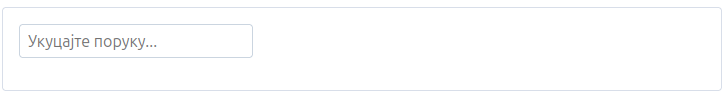  

Sada, dok korisnik kuca u tekstualno polje, `message` će se pojaviti u `<span>` oznaci.

`x-model` je dvosmerno vezan, što znači da i "postavlja" i "preuzima". Pored promene podataka, ako se sami podaci promene, element će odraziti promenu.

Možemo koristiti isti primer kao gore, ali ovaj put ćemo dodati dugme za promenu vrednosti svojstva message.

```html
<div x-data="{ message: '' }">
    <input type="text" x-model="message">
    <button x-on:click="message = 'changed'">Change Message</button>
</div>
```

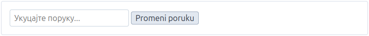  

Sada kada se se klikne na `<button>`, vrednost ulaznog elementa će se odmah ažurirati na "changed".

`x-model` radi sa sledećim ulaznim elementima:

- `<input type="text">`
- `<textarea>`
- `<input type="checkbox">`
- `<input type="radio">`
- `<select>`
- `<input type="range">`

**Unosi teksta**:

```html
<input type="text" x-model="message">
<span x-text="message"></span>
```

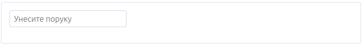  

> [!Note]
> Iako nije uključen u gornji isečak, `x-model` se ne može se koristiti ako nije `x-data` definisan na roditeljskom elementu.

**Unosi u tekstualnom polju**:

```html
<textarea x-model="message"></textarea>
<span x-text="message"></span>
```

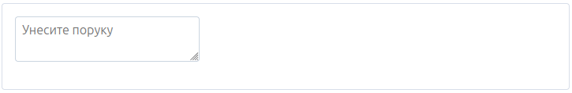

**Unosi u polje za potvrdu**:

- ***Jedno polje za potvrdu sa logičkom vrednosti***

  ```html
  <input type="checkbox" id="checkbox" x-model="show">
  <label for="checkbox" x-text="show"></label>
  ```
  
  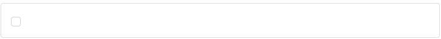
  
- ***Više polja za potvrdu povezanih sa nizom***
  
  ```html
  <input type="checkbox" value="red" x-model="colors">
  <input type="checkbox" value="orange" x-model="colors">
  <input type="checkbox" value="yellow" x-model="colors">
  Boje: <span x-text="colors"></span>
  ```
  
  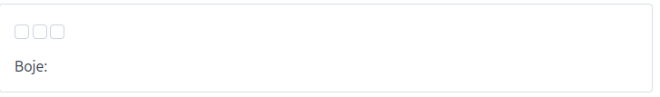

**Radio ulazi**:

```html
<input type="radio" value="yes" x-model="answer">
<input type="radio" value="no" x-model="answer">
Answer: <span x-text="answer"></span>
```

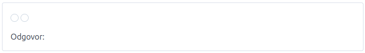

**Izaberite ulaze**:

***Jedan izbor***

```html
<select x-model="color">
    <option>Red</option>
    <option>Orange</option>
    <option>Yellow</option>
</select>
Color: <span x-text="color"></span>
```

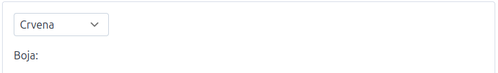

***Jedan izbor sa rezervisanim mestom***

```html
<select x-model="color">
    <option value="" disabled>Select A Color</option>
    <option>Red</option>
    <option>Orange</option>
    <option>Yellow</option>
</select>
Color: <span x-text="color"></span>
```

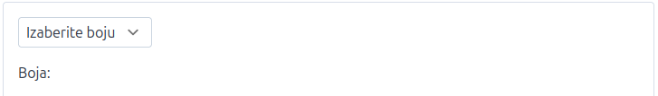

***Višestruki izbor***

```html
<select x-model="color" multiple>
    <option>Red</option>
    <option>Orange</option>
    <option>Yellow</option>
</select>
Colors: <span x-text="color"></span>
```

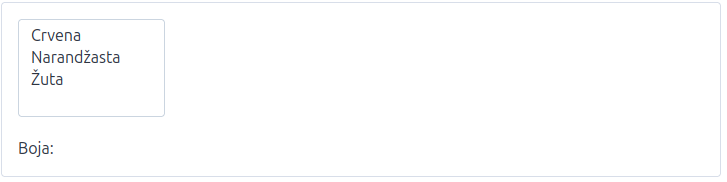

***Dinamički popunjeno Izaberite opcije***

```html
<select x-model="color">
    <template x-for="color in ['Red', 'Orange', 'Yellow']">
        <option x-text="color"></option>
    </template>
</select>
Color: <span x-text="color"></span>
```

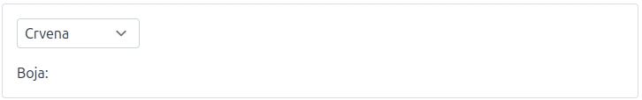

**Ulazi opsega**:

```html
<input type="range" x-model="range" min="0" max="1" step="0.1">
<span x-text="range"></span>
```

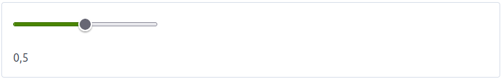

**Modifikatori**:

***.lazy***

Kod tekstualnih unosa, podrazumevano, `x-model` svojstvo se ažurira pri svakom pritisku tastera. Dodavanjem `.lazy` modifikatora možete naterati unos da ažurira svojstvo `x-model` samo kada korisnik pomeri fokus sa elementa unosa.

Ovo je korisno za stvari poput validacije obrazaca u realnom vremenu gde možda ne želite da prikažete grešku validacije unosa dok korisnik ne "odmakne" sa polja sa tasterom `Tab`.

```html
<input type="text" x-model.lazy="username">
<span x-show="username.length > 20">The username is too long.</span>
```

***.change***

`.change` sinhronizuje podatke samo kada ulaz izgubi fokus i njegova vrednost se promeni (nativni `change` događaj). Ovo je funkcionalno ekvivalentno sa `.lazy`.

```html
<input type="text" x-model.change="username">
```

***.blur***

`.blur` sinhronizuje podatke kada unos izgubi fokus, bez obzira na to da li se vrednost promenila.

```html
<input type="text" x-model.blur="email">
```

***.enter***

`.enter` sinhronizuje podatke kada korisnik pritisne taster Enter. Ovo je korisno za polja za pretragu gde želite da pokrenete radnju samo kada korisnik eksplicitno pošalje podatke.

```html
<input type="text" x-model.enter="search">
```

> [!Note]
> `.enter` ne sprečava podrazumevano ponašanje. Ako je unos unutar formulara, formular će ipak biti poslat.

**Kombinovanje modifikatora događaja**:

Modifikatori `.change`, `.blur` i `.enter` mogu se kombinovati radi sinhronizacije na više događaja. Ovo je korisno kada želite da korisnicima pružite fleksibilnost u načinu na koji šalju podatke.

```html
<!-- Sync on blur OR enter -->
<input type="text" x-model.blur.enter="search" placeholder="Press Enter or click away">

<!-- Sync on change, blur, OR enter -->
<input type="text" x-model.change.blur.enter="message">
```

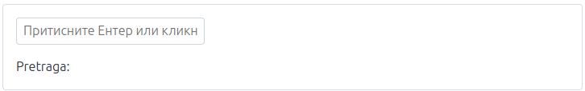

***.number***

Podrazumevano, svi podaci sačuvani u svojstvu via `x-model` se čuvaju kao `string`. Da biste naterali AlpineJS da sačuva vrednost kao JavaScript broj, dodajte `.number` modifikator.

```html
<input type="text" x-model.number="age">
<span x-text="typeof age"></span>
```

***.boolean***

Podrazumevano, svi podaci sačuvani u svojstvu via `x-model` se čuvaju kao string. Da biste naterali AlpineJS da sačuva vrednost kao JavaScript bulovsku vrednost, dodajte `boolean` modifikator . I celi brojevi (1/0) i stringovi (true/false) su validne bulove vrednosti.

```html
<select x-model.boolean="isActive">
    <option value="true">Yes</option>
    <option value="false">No</option>
</select>
<span x-text="typeof isActive"></span>
```

***.debounce***

Dodavanjem `.debounce` na `x-model`, možete lako odložiti ažuriranje vezanog unosa.

Ovo je korisno za stvari poput unosa za pretragu u realnom vremenu koji preuzimaju nove podatke sa servera svaki put kada se svojstvo pretrage promeni.

```html
<input type="text" x-model.debounce="search">
```

Podrazumevano vreme odlaganja je 250 milisekundi, ovo možete lako prilagoditi dodavanjem modifikatora vremena kao što je ovaj.

```html
<input type="text" x-model.debounce.500ms="search">
```html

***.throttle***

Slično kao što `.debounce` možete ograničiti ažuriranje svojstva koje se pokreće na `x-model` ažuriranje samo u određenom intervalu.

Podrazumevani interval `.throttle` je 250 milisekundi, možete ga lako prilagoditi dodavanjem vremenskog modifikatora kao što je ovaj.

```html
<input type="text" x-model.throttle.500ms="search">
```

***.fill***

Podrazumevano, ako ulaz ima atribut vrednosti, AlpineJS ga ignoriše i umesto toga, vrednost ulaza se postavlja na vrednost svojstva ograničenog pomoću `x-model`.

Ali ako je vezano svojstvo prazno, onda možete koristiti atribut vrednosti unosa da biste popunili svojstvo dodavanjem modifikatora `.fill`.

**Programski pristup**:

AlpineJS pruža ugrađene uslužne programe za dobijanje i podešavanje svojstava povezanih sa `x-model`. Ovo je korisno za složene AlpineJS programe koji možda žele da ponište podrazumevano ponašanje `x-modela` ili u slučajevima gde želite da dozvolite `error` `x-model` na elementu koji nije ulaz.

Ovim uslužnim programima možete pristupiti preko svojstva koje se poziva sa `_x_model` na `x-model` element el. `_x_model` ima dve metode za dobijanje i podešavanje svojstva veza:

- `el._x_model.get()` (vraća vrednost vezanog svojstva)
- `el._x_model.set()` (postavlja vrednost vezanog svojstva)

```html
<div x-data="{ username: 'calebporzio' }">
    <div x-ref="div" x-model="username"></div>
    <button @click="$refs.div._x_model.set('phantomatrix')">
        Change username to: 'phantomatrix'
    </button>
    <span x-text="$refs.div._x_model.get()"></span>
</div>
```

```js
Kalebporcio
```

[Sadržaj](00_Sadržaj.md)

### 3.9 x-modelable

`x-modelable` omogućava vam da izložite bilo koju AlpineJS promenljivu stanja kao cilj direktive x-model.

Evo jednostavnog primera korišćenja `x-modelable` za izlaganje promenljive za povezivanje sa `x-model`.

```html
<div x-data="{ number: 5 }">
    <div x-data="{ count: 0 }" x-modelable="count" x-model="number">
        <button @click="count++">Increment</button>
    </div>
 
    Number: <span x-text="number"></span>
</div>
```

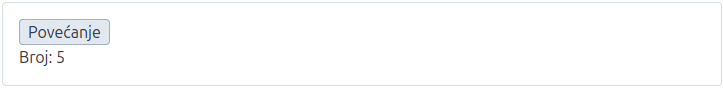

Kao što vidite, svojstvo iz spoljašnjeg opsega važenja "number" je sada povezano sa svojstvom unutrašnjeg opsega važenja "count".

Ova funkcija bi se obično koristila u kombinaciji sa bekend šablonskim frejmvorkom kao što je Laravel Blade. Korisna je za apstrahovanje AlpineJS komponenti u bekend šablone i prikazivanje stanja spolja `x-model` kao da je u pitanju izvorni unos.

[Sadržaj](00_Sadržaj.md)

### 3.10 x-for

AlpineJS `x-for` direktiva vam omogućava da kreirate DOM elemente iteracijom kroz listu. Evo jednostavnog primera korišćenja za kreiranje liste boja na osnovu niza.

```html
<ul x-data="{ colors: ['Red', 'Orange', 'Yellow'] }">
    <template x-for="color in colors">
        <li x-text="color"></li>
    </template>
</ul>

Red
Orange
Yellow
```

Takođe možete prosleđivati objekte u `x-for`.

```html
<ul x-data="{ car: { make: 'Jeep', model: 'Grand Cherokee', color: 'Black' } }">
    <template x-for="(value, index) in car">
        <li>
            <span x-text="index"></span>: <span x-text="value"></span>
        </li>
    </template>
</ul>

make : Jeep
model : Grand Cherokee
color : Black
```

> [!Note]
> Postoje dva pravila koja vredi napomenuti za x-for:
>
> - `x-for` MORA biti deklarisan na `<template>` elementu.
> - Taj `<template>` element MORA da sadrži samo jedan korenski element.

**Ključevi**:

Važno je navesti jedinstvene ključeve za svaku `x-for` iteraciju ako ćete menjati redosled stavki. Bez dinamičkih ključeva, AlpineJS bi mogao imati poteškoća sa praćenjem šta se menja i to bi moglo izazvati čudne nuspojave.

```html
<ul x-data="{ colors: [
    { id: 1, label: 'Red' },
    { id: 2, label: 'Orange' },
    { id: 3, label: 'Yellow' },
]}">
    <template x-for="color in colors" :key="color.id">
        <li x-text="color.label"></li>
    </template>
</ul>
```

Sada, ako se boje dodaju, uklanjaju, preuređuju ili im se „identifikatori“ promene, Alpine će sačuvati ili uništiti iterirane `<li>` elemente u skladu sa tim.

**Pristupanje indeksima**:

Ako vam je potreban pristup indeksu svake stavke u iteraciji, to možete učiniti koristeći:

```js
([item], [index]) in [items] 
```

sintaksu kao što je prikazano:

```html
<ul x-data="{ colors: ['Red', 'Orange', 'Yellow'] }">
    <template x-for="(color, index) in colors">
        <li>
            <span x-text="index + ': '"></span>
            <span x-text="color"></span>
        </li>
    </template>
</ul>
```

Takođe možete pristupiti indeksu unutar dinamičkog `:key` izraza.

```html
<template x-for="(color, index) in colors" :key="index">
```

**Ponavljanje kroz opseg**:

Ako vam je potrebno samo da ponavljate niz u petlji više puta, umesto da iterirate kroz njega, AlpineJS nudi kratku sintaksu.

```html
<ul>
    <template x-for="i in 10">
        <li x-text="i"></li>
    </template>
</ul>
```

i u ovom slučaju može se nazvati bilo kako želite.

> [!Note]
> Iako nije uključen u gornji isečak, x-for se ne može koristiti ako nije x-data definisan roditeljski element.

**Sadržaj `<template>`**:

Kao što je gore pomenuto, `<template>` oznaka mora da sadrži samo jedan korenski element.

Na primer, sledeći kod neće raditi:

```html
<template x-for="color in colors">
    <span>The next color is </span><span x-text="color">
</template>
```

ali ovaj kod će raditi:

```html
<template x-for="color in colors">
    <p>
        <span>The next color is </span><span x-text="color">
    </p>
</template>
```

[Sadržaj](00_Sadržaj.md)

### 3.11 x-transition

AlpineJS pruža robustan alat za prelaze odmah po instalaciji. Sa nekoliko `x-transition` direktiva možete kreirati glatke prelaze između prikazivanja i skrivanja elementa.

Postoje dva osnovna načina za rukovanje tranzicijama u AlpineJS:

- Pomoćnik u tranziciji
- Primena CSS klasa:

**Pomoćnik u tranziciji**:

Najjednostavniji način da se postigne prelaz pomoću AlpineJS je dodavanjem `x-transition` elementu sa `x-show` na njemu. Na primer:

```html
<div x-data="{ open: false }">
    <button @click="open = ! open">Toggle</button>
 
    <div x-show="open" x-transition>
        Hello
    </div>
</div>
```

Kao što vidite, podrazumevano `x-transition` primenjuje prijatna podrazumevana podešavanja prelaza za postepeno postepeno bleđenje i skaliranje otkrivajućeg elementa.

Možete poništiti ove podrazumevane vrednosti modifikatorima priloženim na x-transition. Hajde da ih pogledamo.

***Prilagođavanje trajanja***

U početku je trajanje podešeno na 150 milisekundi pri ulasku i 75 milisekundi pri izlasku.

Možete podesiti trajanja koje želite za prelaz pomoću `.duration` modifikatora:

```html
<div ... x-transition.duration.500ms>
```

Gore navedeno `<div>` će trajati 500 milisekundi pri ulasku i 500 milisekundi pri izlasku.

Ako želite da prilagodite trajanje posebno za ulazak i izlazak, to možete učiniti na sledeći način:

```html
<div ...
    x-transition:enter.duration.500ms
    x-transition:leave.duration.400ms
>
```

> [!Note]
> Iako nije uključen u gornji isečak, `x-transition` ne može se koristiti ako nije `x-data` definisan roditeljski element.

***Prilagođavanje kašnjenja***

Možete odložiti prelaz koristeći `.delay` modifikator na sledeći način:

```html
<div ... x-transition.delay.50ms>
```

Gore navedeni primer će odložiti prelaz i ulazak i izlazak iz elementa za 50 milisekundi.

***Prilagođavanje neprozirnosti***

Podrazumevano, AlpineJS `x-transition` primenjuje i prelaz skaliranja i neprozirnosti kako bi postigao efekat "bledenja".

Ako želite da primenite samo prelaz neprozirnosti (bez skaliranja), to možete postići na sledeći način:

```html
<div ... x-transition.opacity>
```

***Prilagođavanje skale***

Slično modifikatoru `.opacity`, možete konfigurisati `x-transition` SAMO skaliranje (a ne i neprozirnost prelaza) na sledeći način:

```html
<div ... x-transition.scale>
```

Modifikator `.scale` takođe nudi mogućnost konfigurisanja vrednosti skale I vrednosti porekla:

```html
<div ... x-transition.scale.80>
```

Gornji isečak će skalirati element gore i dole za 80%.

Ponovo, možete prilagoditi ove vrednosti odvojeno za prelaze ulaska i izlaska na sledeći način:

```html
<div ...
    x-transition:enter.scale.80
    x-transition:leave.scale.90
>
```

Da biste prilagodili poreklo prelaza skaliranja, možete koristiti `.origin` modifikator:

```html
<div ... x-transition.scale.origin.top>
```

Sada će se skala primeniti koristeći vrh elementa kao poreklo, umesto centra podrazumevano.

Kao što ste možda pretpostavili, moguće vrednosti za ovo prilagođavanje su: `top`, `bottom`, `left` i `right`.

Ako želite, možete kombinovati i dve vrednosti porekla. Na primer, ako želite da poreklo skale bude "top right", možete koristiti: `.origin.top.right` kao modifikator.

**Primena CSS klasa**:

Za direktnu kontrolu nad tim šta tačno ulazi u vaše tranzicije, možete primeniti CSS klase u različitim fazama tranzicije.

Sledeći primeri koriste pomoćne klase TailwindCSS-a:

```html
<div x-data="{ open: false }">
    <button @click="open = ! open">Toggle</button>
    <div
        x-show="open"
        x-transition:enter="transition ease-out duration-300"
        x-transition:enter-start="opacity-0 scale-90"
        x-transition:enter-end="opacity-100 scale-100"
        x-transition:leave="transition ease-in duration-300"
        x-transition:leave-start="opacity-100 scale-100"
        x-transition:leave-end="opacity-0 scale-90"
    >Hello!</div>
</div>
```

| Direktiva | Opis |
| --------- | ---- |
| :enter | Primenjuje se tokom cele faze ulaska. |
| :enter-start | Dodato pre nego što je element umetnut, uklonjeno jedan okvir nakon što je element umetnut. |
| :enter-end | Dodat je jedan kadar nakon što je element umetnut (istovremeno kada enter-startje i uklonjen), uklanja se kada se završi tranzicija/animacija. |
| :leave | Primenjuje se tokom cele faze odlaska. |
| :leave-start | Dodaje se odmah kada se pokrene prelaz za odlazak, uklanja se nakon jednog kadra. |
| :leave-end | Dodat je jedan kadar nakon što se pokrene tranzicija pri odlasku (istovremeno leave-startse uklanja), uklanja se kada se tranzicija/animacija završi. |

[Sadržaj](00_Sadržaj.md)

### 3.12 x-effect

`x-effect` je korisna direktiva za ponovno izračunavanje izraza kada se promeni jedna od njegovih zavisnosti. Možete je zamisliti kao posmatrača gde ne morate da navodite koje svojstvo treba pratiti, već će pratiti sva svojstva koja se koriste u njoj.

Ako vam je ova definicija zbunjujuća, u redu je. Bolje je objasniti kroz primer:

```html
<div x-data="{ label: 'Hello' }" x-effect="console.log(label)">
    <button @click="label += ' World!'">Change Message</button>
</div>
```

Kada se ova komponenta učita, `x-effect` izraz će biti pokrenut i "Hello" će biti zabeleženo u konzoli.

Pošto AlpineJS zna za sve reference svojstava sadržane unutar `x-effect`, kada se klikne na dugme i `label` se promeni, `x-effect` će se ponovo pokrenuti i "Hello World!" će biti zabeleženo u konzoli.

[Sadržaj](00_Sadržaj.md)

### 3.13 x-ignore

Podrazumevano, AlpineJS će pretražiti i inicijalizovati celo DOM stablo elementa koji sadrži `x-init` ili `x-data`.

Ako iz nekog razloga ne želite da AlpineJS dodirne određeni deo vašeg HTML-a, možete to sprečiti koristeći `x-ignore`.

```html
<div x-data="{ label: 'From Alpine' }">
    <div x-ignore>
        <span x-text="label"></span>
    </div>
</div>
```

U gornjem primeru, `<span>` oznaka neće sadržati "From Alpine" jer smo rekli AlpineJS da potpuno ignoriše sadržaj oznake `div`.

[Sadržaj](00_Sadržaj.md)

### 3.14 x-ref

`x-ref` u kombinaciji sa `$refs` je koristan alat za lak direktan pristup DOM elementima. Najkorisniji je kao zamena za API-je poput `getElementById` i `querySelector`.

```html
<button @click="$refs.text.remove()">Remove Text</button>
 
<span x-ref="text">Hello !</span>
```

> [!Note]
> Iako nije uključen u gornji isečak, `x-ref` ne može se koristiti ako nije `x-data` definisan roditeljski element.

[Sadržaj](00_Sadržaj.md)

### 3.15 x-cloak

Ponekad, kada koristite AlpineJS za deo šablona, postoji "blip" gde možete videti svoj neinicijalizovani šablon nakon što se stranica učita, ali pre nego što se AlpineJS učita.

`x-cloak` rešava ovaj scenario tako što skriva element za koji je pričvršćen dok se Alpine potpuno ne učita na stranici.

Međutim, da bi `x-cloak` funkcionisao, morate dodati sledeći CSS kod na stranicu.

```css
[x-cloak] { display: none !important; }
```

Sledeći primer će sakriti oznaku `<span>` dok `x-show` se posebno ne podesi na vrednost "true", sprečavajući bilo kakvo "pojavljivanje" skrivenog elementa na ekranu dok se Alpine učitava.

```html
<span x-cloak x-show="false">This will not 'blip' onto screen at any point</span>
```

`x-cloak` ne radi samo na elementima skrivenim pomoću `x-show` ili `x-if`: takođe osigurava da su elementi koji sadrže podatke skriveni dok se podaci ne podese ispravno. Sledeći primer će sakriti oznaku `<span>` dok AlpineJS ne podesi svoj tekstualni sadržaj na `message` svojstvo.

```html
<span x-cloak x-text="message"></span>
```

Kada se Alpine učita na stranici, uklanja sva `x-cloak` svojstva iz elementa, što takođe uklanja i svojstva koja `display: none;` je primenio CSS, čime se element prikazuje.

**Alternativa globalnoj sintaksi**:

Ako želite da postignete isto ponašanje, ali da izbegnete uključivanje globalnog stila, možete koristiti sledeći zanimljiv, ali priznajem čudan trik:

```html
<template x-if="true">
    <span x-text="message"></span>
</template>
```

Ovim ćete postići isti cilj kao i `x-cloak` jednostavnim korišćenjem načina `x-if` rada.

Pošto su `<template>` elementi podrazumevano "skriveni" u pregledačima, nećete videti `<span>` dok AlpineJS ne bude imao priliku da sa `x-if="true"` ih prikaže.

Ponovo, ovo rešenje nije za svakoga, ali vredi ga pomenuti za posebne slučajeve.

[Sadržaj](00_Sadržaj.md)

### 3.16 x-teleport

Direktiva `x-teleport` vam omogućava da deo vašeg AlpineJS šablona u potpunosti prenesete u drugi deo DOM-a na stranici.

Ovo je korisno za stvari poput modalnih prozora (posebno njihovog ugnježđavanja), gde je korisno izdvojiti `z-index` trenutne AlpineJS komponente.

Prikačivanjem `x-teleport` na `<template>` element, govorite AlpineJS da "doda" taj element na dati selektor.

> [!Note]
Selektor `x-teleport` može biti bilo koji string koji biste normalno prosledili nečemu poput `document.querySelector`. Pronaći će prvi element koji se podudara, bilo da je to naziv oznake ( `body` ), naziv klase ( `.my-class`), ID ( `#my-id` ) ili bilo koji drugi validan CSS selektor.

Evo jednog izmišljenog modalnog primera:

```html
<body>
    <div x-data="{ open: false }">
        <button @click="open = ! open">Toggle Modal</button>
 
        <template x-teleport="body">
            <div x-show="open">
                Modal contents...
            </div>
        </template>
    </div>
 
    <div>Some other content placed AFTER the modal markup.</div>
 
    ...
 
</body>
```

Neki drugi sadržaj postavljen POSLE modalnog označavanja.

Primetite kako se prilikom uključivanja/isključivanja modalnog prozora, stvarni sadržaj modalnog prozora pojavljuje POSLE elementa „Neki drugi sadržaj...“? To je zato što kada se Alpine inicijalizuje, on vidi x-teleport="body"i dodaje i inicijalizuje taj element na dati selektor elemenata.

**Preusmeravanje događaja**:

AlpineJS se trudi da iskustvo teleportovanja učini besprekornim. Sve što biste normalno radili u šablonu, trebalo bi da možete da uradite i unutar `x-teleport` šablona. Teleportovani sadržaj može da pristupi normalnom AlpineJS opsegu komponente, kao i drugim funkcijama kao što su `$refs`, `$root`, itd...

Međutim, izvorni DOM događaji nemaju koncept teleportacije, pa ako, na primer, pokrenete događaj "click" unutar teleportovanog elementa, taj događaj će se pojaviti u DOM stablu kao što bi to normalno učinio.

Da biste ovo iskustvo učinili besprekornijim, možete "prosleđivati" događaje jednostavnim registrovanjem slušača događaja na `<template x-teleport...>` elementu na sledeći način:

```html
<div x-data="{ open: false }">
    <button @click="open = ! open">Toggle Modal</button>
 
    <template x-teleport="body" @click="open = false">
        <div x-show="open">
            Modal contents...
            (click to close)
        </div>
    </template>
</div>
```

Primetite kako sada možemo da slušamo događaje koji se šalju unutar teleportovanog elementa, a ne izvan `<template>` samog elementa?

AlpineJS to radi tako što traži slušače događaja registrovane na `<template x-teleport...>` i sprečava širenje tih događaja pored živog, teleportovanog DOM elementa. Zatim kreira kopiju tog događaja i ponovo je šalje iz `<template x-teleport...>`.

**Ugnežđavanje**:

Teleportovanje je posebno korisno ako pokušavate da ugnezdite jedan modal unutar drugog. Alpine to olakšava:

```html
<div x-data="{ open: false }">
    <button @click="open = ! open">Toggle Modal</button>
 
    <template x-teleport="body">
        <div x-show="open">
            Modal contents...
 
            <div x-data="{ open: false }">
                <button @click="open = ! open">Toggle Nested Modal</button>
 
                <template x-teleport="body">
                    <div x-show="open">
                        Nested modal contents...
                    </div>
                </template>
            </div>
        </div>
    </template>
</div>
```

Nakon uključivanja oba modalna prozora, oni se kreiraju kao deca, ali će se prikazivati kao srodni elementi na stranici, a ne jedan unutar drugog.

[Sadržaj](00_Sadržaj.md)

### 3.17 x-if

`x-if` se koristi za prebacivanje elemenata na stranici, slično kao `x-show`, međutim, potpuno dodaje i uklanja element na koji se primenjuje, umesto da samo menja njegovo CSS svojstvo prikaza na `"none"`.

Zbog ove razlike u ponašanju, `x-if` ne bi trebalo da se primenjuje direktno na element, već na `<template>` oznaku koja obuhvata element. Na ovaj način, Alpine može da sačuva evidenciju o elementu nakon što je uklonjen sa stranice.

```html
<template x-if="open">
    <div>Contents...</div>
</template>
```

> [!Note]
>
>- Iako nije uključen u gornji isečak, `x-if` ne može se koristiti ako nije `x-data` definisan roditeljski element.
>- Za razliku od `x-show`, `x-if` NE podržava prelazne prekidače sa `x-transition`.
>- `<template>` oznake mogu da sadrže samo jedan korenski element.

[Sadržaj](00_Sadržaj.md)

### 3.18 x-id

`x-id` omogućava vam da deklarišete novi "opseg" za sve nove ID-ove generisane pomoću `$id()`. Prihvata niz stringova (imena ID-ova) i dodaje sufiks svakom `$id('...')` generisanom unutar njega koji je jedinstven za druge ID-ove na stranici.

`x-id` je namenjen da se koristi u kombinaciji sa `$id(...)` magijom.

Evo kratkog primera upotrebe ove direktive:

```html
<div x-id="['text-input']">
    <label :for="$id('text-input')">Username</label>
    <!-- for="text-input-1" -->
 
    <input type="text" :id="$id('text-input')">
    <!-- id="text-input-1" -->
</div>
 
<div x-id="['text-input']">
    <label :for="$id('text-input')">Username</label>
    <!-- for="text-input-2" -->
 
    <input type="text" :id="$id('text-input')">
    <!-- id="text-input-2" -->
</div>
```

> [!Note]
> Iako nije uključen u gornji isečak koda, x-id ne može se koristiti ako nije x-data definisan na roditeljskom elementu. → Pročitajte više ox-data

[Sadržaj](00_Sadržaj.md)
