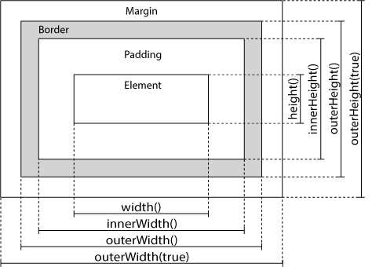
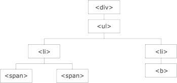

# JQuery Tutorial

[Sadržaj](README.md)

## 1 Uvod

### 1.1 Dodavanje jQuery-ja na vaše veb stranice

Postoji nekoliko načina da počnete da koristite jQuery na svojoj veb stranici. Možete:

- Preuzmite jQuery biblioteku sa jQuery.com
- Uključite jQuery iz CDN-a, kao što je Google

#### 1.1.1 Preuzimanje

Postoje dve verzije jQuery-ja dostupne za preuzimanje:

- Proizvodna verzija - ovo je za vašu veb stranicu uživo jer je minifikovana i kompresovana
- Razvojna verzija - ovo je za testiranje i razvoj (nekomprimovani i čitljiv kod)

Obe verzije se mogu preuzeti sa jQuery.com.

jQuery biblioteka je jedna JavaScript datoteka, a referenca na nju se postavlja pomoću HTML `<script>` oznake (obratite pažnju da `<script>` oznaka treba da bude unutar `<head>` sekcije):

```html
<head>
<script src="jquery-3.7.1.min.js"></script>
</head>
```

Savet: Preuzetu datoteku stavite u isti direktorijum kao i stranice na kojima želite da je koristite.

#### 1.1.2 CDN

Ako ne želite sami da preuzmete i hostujete jQuery, možete ga uključiti sa CDN-a (mreže za isporuku sadržaja).

Gugl je primer nekoga ko hostuje jQuery:

```html
<head>
<script src="https://ajax.googleapis.com/ajax/libs/jquery/3.7.1/jquery.min.js"></script>
</head>
```

Jedna velika prednost korišćenja hostovanog jQuery-ja od Gugla:

- Mnogi korisnici su već preuzeli jQuery sa Gugla kada posećuju drugi sajt. Kao rezultat toga, on će biti učitan iz keša kada posete vaš sajt, što dovodi do bržeg vremena učitavanja.
- Takođe, većina CDN-ova će osigurati da kada korisnik zatraži datoteku sa njih, ona će biti servirana sa servera koji im je najbliži, što takođe dovodi do bržeg vremena učitavanja.

### 1.2 Sintaksa

Sintaksa jQuery-ja je prilagođena za odabir HTML elemenata i izvršavanje nekih akcija na elementu (elementima).

Osnovna sintaksa je: `$(selektor).action()`

- Znak `$` - za definisanje/pristup jQuery-ju
- `( selektor )` - za "upit (ili pronalaženje)" HTML elemenata
- jQuery `action()` koja će se izvršiti na elementu(ima).

Primeri:

- `$(this).hide()` - sakriva trenutni element.
- `$("p").hide()` - sakriva sve `<p>` elemente.
- `$(".test").hide()` - sakriva sve elemente pomoću `class="test"`.
- `$("#test").hide()` - sakriva element sa `id="test"`.

jQuery koristi CSS sintaksu za selektovanje elemenata. Više o sintaksi selektora ćete saznati u sledećem poglavlju ovog tutorijala.

#### 1.2.1 Događaj $(document).ready()

Možda ste primetili da se sve jQuery metode u našim primerima nalaze unutar događaja spremnosti dokumenta:

```js
$(document).ready(function(){
  // jQuery methods go here...
});
```

Ovo je da bi se sprečilo pokretanje bilo kog jQuery koda pre nego što se dokument završi sa učitavanjem (tj. kada je spreman).

Dobra je praksa sačekati da se dokument potpuno učita i spreman pre nego što se počne sa radom sa njim. Ovo vam takođe omogućava da imate JavaScript kod pre tela dokumenta, u odeljku head.

Evo nekoliko primera radnji koje mogu da ne uspeju ako se metode pokrenu pre nego što se dokument potpuno učita:

- Pokušaj skrivanja elementa koji još nije kreiran.
- Pokušavam da dobijem veličinu slike koja još nije učitana.

#### 1.2.2 $(function(){ ... })

jQuery tim je takođe kreirao još kraću metodu za događaj spremnosti dokumenta:

```js
$(function(){
  // jQuery methods go here...
});
```

Koristite sintaksu koju želite. Mislimo da je događaj spremnosti dokumenta lakši za razumevanje kada se čita kod.

### 1.3 Selektori

jQuery selektori vam omogućavaju da selektujete i manipulišete HTML elementima.

jQuery selektori se koriste za "pronalaženje" (ili odabir) HTML elemenata na osnovu:

- njihovog imena,
- ID-a,
- klasa,
- tipova,
- atributa,
- vrednosti atributa
- i još mnogo toga.

Zasnovan je na postojećim CSS selektorima , a pored toga jQuery ima i neke sopstvene prilagođene selektore.

Svi selektori u jQuery-ju počinju znakom dolara i zagradama: `$()`.

#### 1.3.1 Selektor elemenata

jQuery selektor elemenata bira elemente na osnovu imena elementa.

Možete odabrati sve `<p>` elemente na stranici ovako:

```js
$("p") 
```

Primer:
Kada korisnik klikne na dugme, svi `<p>` elementi će biti skriveni:

```js
$(document).ready(function(){
  $("button").click(function(){
    $("p").hide();
  });
});
```

#### 1.3.2 Selektor #id

jQuery selektor `#id` koristi atribut id HTML oznake da bi pronašao određeni element. ID treba da bude jedinstven unutar stranice, tako da bi trebalo da koristite selektor `#id` kada želite da pronađete jedan, jedinstveni element.

Da biste pronašli element sa određenim ID-om, napišite heš karakter, a zatim ID HTML elementa:

```js
$("#test")
```

Primer:
Kada korisnik klikne na dugme, element sa `id="test"` će biti skriven:

```js
$(document).ready(function(){
  $("button").click(function(){
    $("#test").hide();
  });
});
```

#### 1.3.3 Selektor .class

jQuery `.class` selektor pronalazi elemente sa određenom klasom.

Da biste pronašli elemente određene klase, napišite tačku, a zatim ime klase:

```js
$(".test")
```

Primer:
Kada korisnik klikne na dugme, elementi sa class="test" će biti skriveni:

```js
$(document).ready(function(){
  $("button").click(function(){
    $(".test").hide();
  });
});
```

Više primera jQuery selektora

| Syntax | Description |
| ------ | ----------- |
| $("*") | Selektuje sve elemente |
| $(this) | Selektuje trenutni  HTML element |
| $("p.intro") | Selektuje sve `<p>` elemente sa klasom class="intro" |
| $("p:first") | Selektuje prvi `<p>` element |
| $("ul li:first") | Selektuje prvi `<li>` element od prvog `<ul>` |
| $("ul li:first-child") | Selektuje prvi `<li>` element svakog `<ul>` |
| $("[href]") | Selektuje sve elemente sa href atributom |
| $("a[target='_blank']") | Selektuje sve `<a>` elemente sa `target` atributom vrednosti jednake "_blank" |
| $("a[target!='_blank']") | Selektuje sve `<a>` elemente sa `target` atributom vrednosti koja nije jednaka "_blank" |
| $(":button") | Selektuje sve `<button>` elemente i `<input>` elemente tipa="button" |
| $("tr:even") | Selektuje sve parne `<tr>` elemente |
| $("tr:odd") | Selektuje sve neparne `<tr>` elemente |

Koristite naš jQuery tester selektora da biste demonstrirali različite selektore.

Za kompletnu referencu svih jQuery selektora, posetite našu referencu za jQuery selektore .

### 1.4 Funkcije u posebnoj datoteci

Ako vaš veb sajt sadrži mnogo stranica i želite da vaše jQuery funkcije budu jednostavne za održavanje, možete ih smestiti u posebnu .js datoteku.

Kada demonstriramo jQuery u ovom tutorijalu, funkcije se dodaju direktno u `<head>` sekciju. Međutim, ponekad je poželjnije da se smeste u posebnu datoteku, kao što je ova (koristite atribut src da biste referencirali .js datoteku):

```js
<head>
<script src="https://ajax.googleapis.com/ajax/libs/jquery/3.7.1/jquery.min.js"></script>
<script src="my_jquery_functions.js"></script>
</head> 
```

### 1.5 Metode događaja

jQuery je prilagođen da reaguje na događaje na HTML stranici.

#### 1.5.1 Šta su događaji?

Sve različite akcije posetilaca na koje veb stranica može da odgovori nazivaju se događaji.

Događaj predstavlja tačan trenutak kada se nešto desi.

Primeri:

- pomeranje miša preko elementa
- izbor radio dugmeta
- klik na element

Termin "pokreće se/pokrenuto" se često koristi sa događajima. Primer: "Događaj pritiska tastera se pokreće u trenutku kada pritisnete taster".

Evo nekih uobičajenih DOM događaja:

| Mouse Events | Keyboard Events | Form Events | Document/Window Events |
| ------------ | --------------- | ----------- | ---------------------- |
| click | keypress | submit | load |
| dblclick | keydown | change | resize |
| mouseenter | keyup | focus | scroll |
| mouseleave | | blur | unload |

#### 1.5.2 Sintaksa za metode događaja

U jQuery-ju, većina DOM događaja ima ekvivalentnu jQuery metodu.

Da biste dodelili događaj klika svim pasusima na stranici, možete to učiniti:

```js
$("p").click();
```

Sledeći korak je definisanje šta treba da se desi kada se događaj pokrene. Morate proslediti funkciju događaju:

```js
$("p").click(function(){
  // action goes here!!
});
```

### 1.6 Često korišćene metode događaja

#### 1.6.1 $(document).ready()

Metoda `$(document).ready()` nam omogućava da izvršimo funkciju kada je dokument potpuno učitan. Ovaj događaj je već objašnjen u poglavlju o jQuery sintaksi.

#### 1.6.2 click()

Metoda `click()` dodaje funkciju za obradu događaja HTML elementu. Funkcija se izvršava kada korisnik klikne na HTML element.

Sledeći primer kaže - Kada se događaj klika aktivira na `<p>` elementu; sakrijte trenutni `<p>` element:

```js
$("p").click(function(){
  $(this).hide();
});
```

#### 1.6.3 dblclick()

Metoda `dblclick()` dodaje funkciju za obradu događaja HTML elementu. Funkcija se izvršava kada korisnik dvaput klikne na HTML element:

```js
$("p").dblclick(function(){
  $(this).hide();
});
```

#### 1.6.4 mouseenter()

Metoda `mouseenter()` dodaje funkciju za obradu događaja HTML elementu. Funkcija se izvršava kada pokazivač miša uđe u HTML element:

```js
$("#p1").mouseenter(function(){
  alert("You entered p1!");
});
```

#### 1.6.5 mouseleave()

Metoda `mouseleave()` dodaje funkciju za obradu događaja HTML elementu. Funkcija se izvršava kada pokazivač miša napusti HTML element:

```js
$("#p1").mouseleave(function(){
  alert("Bye! You now leave p1!");
});
```

#### 1.6.6 mousedown()

Metoda `mousedown()` dodaje funkciju za obradu događaja HTML elementu. Funkcija se izvršava kada se pritisne levi, srednji ili desni taster miša, dok se miš nalazi iznad HTML elementa:

```js
$("#p1").mousedown(function(){
  alert("Mouse down over p1!");
});
```

#### 1.6.7 mouseup()

Metoda `mouseup()` dodaje funkciju za obradu događaja HTML elementu. Funkcija se izvršava kada se otpusti levi, srednji ili desni taster miša, dok se miš nalazi iznad HTML elementa:

```js
$("#p1").mouseup(function(){
  alert("Mouse up over p1!");
});
```

#### 1.6.8 hover()

Metoda `hover()` ima dve funkcije i predstavlja kombinaciju metoda `mouseenter()` i `mouseleave()`. Prva funkcija se izvršava kada miš uđe u HTML element, a druga funkcija se izvršava kada miš napusti HTML element:

```js
$("#p1").hover(function(){
    alert("You entered p1!");
  },
  function(){
    alert("Bye! You now leave p1!");
  }
);
```

#### 1.6.9 focus()

Metoda `focus()` dodaje funkciju za obradu događaja polju HTML forme. Funkcija se izvršava kada polje forme dobije fokus:

```js
$("input").focus(function(){
  $(this).css("background-color", "#cccccc");
});
```

#### 1.6.10 blur()

Metoda `blur()` dodaje funkciju za obradu događaja polju HTML forme. Funkcija se izvršava kada polje forme izgubi fokus:

```js
$("input").blur(function(){
  $(this).css("background-color", "#ffffff");
});
```

#### 1.6.11 on()

Metoda `on()` dodaje jedan ili više obrađivača događaja za izabrane elemente.

Priložite događaj klika elementu `<p>`:

```js
$("p").on("click", function(){
  $(this).hide();
});
```

Pridružite više obrađivača događaja elementu `<p>`:

```js
$("p").on({
  mouseenter: function(){
    $(this).css("background-color", "lightgray");
  },
  mouseleave: function(){
    $(this).css("background-color", "lightblue");
  },
  click: function(){
    $(this).css("background-color", "yellow");
  }
});
```

[Sadržaj](README.md)

## 2 Efekti

Sakrij, Prikaži, Uključi/isključi, Pomeri, Postepeno menjaj i Animiraj.

### 2.1 hide() i show()

Pomoću jQuery-ja, možete sakriti i prikazati HTML elemente pomoću metoda `hide()` i `show()`:

```js
$("#hide").click(function(){
  $("p").hide();
});

$("#show").click(function(){
  $("p").show();
});
```

Sintaksa:

```js
$(selector).hide(speed,callback);
$(selector).show(speed,callback);
```

Opcioni parametar `speed` određuje brzinu skrivanja/prikazivanja i može uzeti sledeće vrednosti:

- "slow",
- "fast" ili
- milisekunde.

Opcioni parametar `callback` je funkcija koja se izvršava nakon što se završi metoda `hide()` or `show()` (više o funkcijama povratnog poziva saznaćete u kasnijem poglavlju).

Sledeći primer demonstrira parametar `speed` sa `hide()`:

```js
$("button").click(function(){
  $("p").hide(1000);
});
```

### 2.2 toogle()

Takođe možete prebacivati između skrivanja i prikazivanja elementa pomoću `toggle()` metode.

Prikazani elementi su skriveni, a skriveni elementi su prikazani:

```js
$("button").click(function(){
  $("p").toggle();
});
```

Sintaksa:

```js
$(selector).toggle(speed,callback);
```

Opcioni parametar `speed` može uzeti sledeće vrednosti:

- "slow",
- "fast" ili
- milisekunde.

Opcioni parametar `callback` je funkcija koja se izvršava nakon `toggle()` završetka.

### 2.3 fading medtode

Pomoću jQuery-ja možete postepeno povećavati i smanjivati vidljivost elementa.

jQuery ima sledeće metode za postepeno pretvaranje:

- `fadeIn()`
- `fadeOut()`
- `fadeToggle()`
- `fadeTo()`

#### 2.3.1 fadeIn() metod

jQuery `fadeIn()` metoda se koristi za postepeno pojavljivanje skrivenog elementa.

Sintaksa:

```js
$(selector).fadeIn(speed,callback);
```

Opcioni parametar `speed` određuje trajanje efekta. Može uzeti sledeće vrednosti:

- "slow",
- "fast" ili
- milisekunde.

Opcioni parametar `callback` je funkcija koja se izvršava nakon što se postepeno gašenje završi.

Sledeći primer demonstrira `fadeIn()` metod sa različitim parametrima:

```js
$("button").click(function(){
  $("#div1").fadeIn();
  $("#div2").fadeIn("slow");
  $("#div3").fadeIn(3000);
});
```

#### 2.3.2 fadeOut() metod

jQuery `fadeOut()` metoda se koristi za postepeno uklanjanje vidljivog elementa.

Sintaksa:

```js
$(selector).fadeOut(speed,callback);
```

Opcioni parametar `speed` određuje trajanje efekta. Može uzeti sledeće vrednosti:

- "slow",
- "fast" ili
- milisekunde.

Opcioni parametar `callback` je funkcija koja se izvršava nakon što se postepeno gašenje završi.

Sledeći primer demonstrira `fadeOut()` metod sa različitim parametrima:

```js
$("button").click(function(){
  $("#div1").fadeOut();
  $("#div2").fadeOut("slow");
  $("#div3").fadeOut(3000);
});
```

#### 2.3.3 fadeToggle() metod

jQuery `fadeToggle()` metoda prebacuje se između metoda `fadeIn()` i `fadeOut()`.

- Ako su elementi postepeno izbledeli, `fadeToggle()` će ih postepeno prikazati.
- Ako su elementi postepeno pojačani, `fadeToggle()` će ih postepeno izbledeti.

Sintaksa:

```js
$(selector).fadeToggle(speed,callback);
```

Opcioni parametar `speed` određuje trajanje efekta. Može uzeti sledeće vrednosti:

- "slow",
- "fast" ili
- milisekunde.

Opcioni parametar `callback` je funkcija koja se izvršava nakon što se postepeno gašenje završi.

Sledeći primer demonstrira `fadeToggle()` metod sa različitim parametrima:

```js
$("button").click(function(){
  $("#div1").fadeToggle();
  $("#div2").fadeToggle("slow");
  $("#div3").fadeToggle(3000);
});
```

#### 2.3.4 fadeTo() metod

jQuery `fadeTo()` metoda omogućava postepeno prelazak na datu neprozirnost (vrednost između 0 i 1).

Sintaksa:

```js
$(selector).fadeTo(speed,opacity,callback);
```

Potrebni parametar `speed` određuje trajanje efekta. Može uzeti sledeće vrednosti:

- "slow",
- "fast" ili
- milisekunde.

Potrebni parametar `opacity` određuje bleđenje do date neprozirnosti (vrednost između 0 i 1).

Opcioni parametar `callback` je funkcija koja se izvršava nakon što se metoda završi.

Sledeći primer demonstrira `fadeTo()` metod sa različitim parametrima:

```js
$("button").click(function(){
  $("#div1").fadeTo("slow", 0.15);
  $("#div2").fadeTo("slow", 0.4);
  $("#div3").fadeTo("slow", 0.7);
});
```

### 2.4 Slide metode

jQuery `slide` metode pomeraju elemente gore i dole.

Pomoću jQuery-ja možete kreirati efekat klizanja na elementima. jQuery ima sledeće metode za slajding:

- slideDown()
- slideUp()
- slideToggle()

#### 2.4.1 slideDown() metod

jQuery `slideDown()` metoda se koristi za pomeranje elementa nadole.

Sintaksa:

```js
$(selector).slideDown(speed,callback);
```

Opcioni parametar `speed` određuje trajanje efekta. Može uzeti sledeće vrednosti:

- "slow",
- "fast" ili
- milisekunde.

Opcioni parametar povratnog poziva je funkcija koja se izvršava nakon što se klizanje završi.

Sledeći primer demonstrira `slideDown()` metod:

```js
$("#flip").click(function(){
  $("#panel").slideDown();
});
```

#### 2.4.2 slideUp() metod

jQuery `slideUp()` metoda se koristi za pomeranje elementa nagore.

Sintaksa:

```js
$(selector).slideUp(speed,callback);
```

Opcioni parametar `speed` određuje trajanje efekta. Može uzeti sledeće vrednosti:

- "slow",
- "fast" ili
- milisekunde.

Opcioni parametar `callback` je funkcija koja se izvršava nakon što se sliding završi.

Sledeći primer demonstrira `slideUp()` metod:

```js
$("#flip").click(function(){
  $("#panel").slideUp();
});
```

#### 2.4.3 slideToggle() metod

jQuery `slideToggle()` metoda prebacuje se između metoda `slideDown()` i `slideUp()`.

Ako su elementi pomereni nadole, `slideToggle()` pomeriće ih nagore.

Ako su elementi pomereni nagore, `slideToggle()` pomeriće ih nadole.

Sintaksa:

```js
$(selector).slideToggle(speed,callback);
```

Opcioni parametar `speed` može uzeti sledeće vrednosti:

- "slow",
- "fast",
- milisekunde.

Opcioni parametar `calback` je funkcija koja se izvršava nakon što se klizanje završi.

Sledeći primer demonstrira `slideToggle()` metod:

```js
$("#flip").click(function(){
  $("#panel").slideToggle();
});
```

### 2.5 Animacija

Pomoću jQuery-ja možete kreirati prilagođene animacije.

#### 2.5.1 Metoda animate()

jQuery metoda `animate()` se koristi za kreiranje prilagođenih animacija.

Sintaksa:

```js
$(selector).animate({params}, speed, callback);
```

Obavezni parametar `params` definiše CSS svojstva koja će biti animirana.

Opcioni parametar `speed` određuje trajanje efekta. Može uzeti sledeće vrednosti:

- "slow",
- "fast" ili
- milisekunde.

Opcioni parametar `callback` je funkcija koja se izvršava nakon završetka animacije.

Sledeći primer demonstrira jednostavnu upotrebu metode `animate()`; pomera element `<div>` udesno, dok ne dostigne svojstvo `left` od 250px:

```js
$("button").click(function(){
  $("div").animate({left: '250px'});
}); 
```

Podrazumevano, svi HTML elementi imaju statičku poziciju i ne mogu se pomerati.
Da biste manipulisali pozicijom, ne zaboravite da prvo podesite CSS svojstvo pozicije elementa na relativnu, fiksiranu ili apsolutnu!

#### 2.5.2 animate() - Manipulisanje višestrukim svojstvima

Obratite pažnju da se više svojstava može animirati istovremeno:

```js
$("button").click(function(){
  $("div").animate({
    left: '250px',
    opacity: '0.5',
    height: '150px',
    width: '150px'
  });
}); 
```

Da li je moguće manipulisati SVIM CSS svojstvima pomoću metode `animate()`?

Da, skoro! Međutim, postoji jedna važna stvar koju treba zapamtiti: sva imena svojstava moraju biti napisana velikim i malim slovima kada se koriste sa metodom `animate()`: Moraćete da napišete `paddingLeft` umesto `padding-left`, `marginRight` umesto `margin-right`, i tako dalje.

Takođe, animacija boja nije uključena u osnovnu jQuery biblioteku. Ako želite da animirate boje, potrebno je da preuzmete dodatak `Color Animations` sa jQuery.com.

#### 2.5.3 animate() - Korišćenje relativnih vrednosti

Takođe je moguće definisati relativne vrednosti (vrednost je tada relativna u odnosu na trenutnu vrednost elementa). To se radi stavljanjem `+=` ili `-=` ispred vrednosti:

```js
$("button").click(function(){
  $("div").animate({
    left: '250px',
    height: '+=150px',
    width: '+=150px'
  });
});
```

#### 2.5.4 animate() - Korišćenje unapred definisanih vrednosti

Možete čak i da navedete vrednost animacije svojstva kao "show", "hide" ili "toggle":

```js
$("button").click(function(){
  $("div").animate({
    height: 'toggle'
  });
}); 
```

#### 2.5.5 animate() - Korišćenje funkcionalnost reda čekanja

Podrazumevano, jQuery dolazi sa funkcionalnošću reda za animacije.

To znači da ako napišete više `animate()` poziva jedan za drugim, jQuery kreira "interni" red sa ovim pozivima metoda. Zatim pokreće `animate` pozive JEDAN PO JEDAN.

Dakle, ako želite da izvodite različite animacije jednu za drugom, koristimo funkcionalnost reda čekanja:

```js
$("button").click(function(){
  var div = $("div");
  div.animate({height: '300px', opacity: '0.4'}, "slow");
  div.animate({width: '300px', opacity: '0.8'}, "slow");
  div.animate({height: '100px', opacity: '0.4'}, "slow");
  div.animate({width: '100px', opacity: '0.8'}, "slow");
}); 
```

Primer ispod prvo pomera `<div>` element udesno, a zatim povećava veličinu fonta teksta:

```js
$("button").click(function(){
  var div = $("div");
  div.animate({left: '100px'}, "slow");
  div.animate({fontSize: '3em'}, "slow");
});
```

#### 2.5.6 Zaustavljanje animacija

JQuery metod `stop()` se koristi za zaustavljanje animacija ili efekata pre nego što se završe.

Metoda `stop()` funkcioniše za sve jQuery efekte, uključujući klizanje, bledjenje i animacije.

Sintaksa:

```js
$(selector).stop(stopAll,goToEnd);
```

Opcioni parametar `stopAll` određuje da li treba obrisati i red animacije ili ne. Podrazumevana vrednost je "false", što znači da će biti zaustavljena samo aktivna animacija, omogućavajući naknadno izvršavanje bilo kojih animacija u redu čekanja.

Opcioni parametar `goToEnd` određuje da li treba odmah završiti trenutnu animaciju. Podrazumevana vrednost je "false".

Dakle, podrazumevano, `stop()` metoda zaustavlja trenutnu animaciju koja se izvodi na izabranom elementu.

Sledeći primer demonstrira metodu stop(), bez parametara:

```js
$("#stop").click(function(){
  $("#panel").stop();
});
```

### 2.6 jQuery funkcije povratnog poziva

Funkcija povratnog poziva se izvršava nakon što je trenutni efekat 100% završen.

JavaScript naredbe se izvršavaju red po red. Međutim, kod efekata, sledeći red koda može se pokrenuti čak i ako efekat nije završen. Ovo može stvoriti greške.

Da biste to sprečili, možete kreirati funkciju povratnog poziva.

Funkcija povratnog poziva se izvršava nakon što se završi trenutni efekat.

Tipična sintaksa:

```js
$( selektor ).hide( speed, callback );
```

Primeri:

Primer ispod ima parametar povratnog poziva, koji je funkcija koja će se izvršiti nakon što se efekat skrivanja završi:

Primer sa povratnim pozivom

```js
$("button").click(function(){
  $("p").hide("slow", function(){
    alert("The paragraph is now hidden");
  });
});
```

Primer ispod nema parametar povratnog poziva, a okvir za upozorenje će biti prikazan pre nego što se efekat skrivanja završi:

Primer bez povratnog poziva

```js
$("button").click(function(){
  $("p").hide(1000);
  alert("The paragraph is now hidden");
});
```

### 2.7 jQuery - Ulančavanje

Sa jQuery-jem, možete povezati akcije/metode.

Ulančavanje nam omogućava da pokrenemo više jQuery metoda (na istom elementu) unutar jedne naredbe.

Do sada smo pisali jQuery naredbe jednu po jednu (jednu za drugom).

Međutim, postoji tehnika koja se zove ulančavanje, koja nam omogućava da pokrenemo više jQuery komandi, jednu za drugom, na istom elementu (elementima).

> [!Note]
> Na ovaj način, pregledači ne moraju da pronalaze iste elemente više puta.

Da biste povezali radnju, jednostavno je dodate prethodnoj radnji.

Sledeći primer povezuje metode `css()`, `slideUp()` i `slideDown()`. Element   "p1" prvo menja boju u crvenu, zatim se pomera nagore, a na kraju se pomera nadole:

```js
$("#p1").css("color", "red").slideUp(2000).slideDown(2000);
```

Takođe smo mogli dodati još poziva metoda ako je bilo potrebno.

> [!Note]
> Prilikom ulančavanja, linija koda može postati prilično dugačka. Međutim, jQuery nije baš strog po pitanju sintakse; možete je formatirati kako želite, uključujući prelome redova i uvlačenja.

Ovo takođe funkcioniše sasvim dobro:

```js
$("#p1").css("color", "red")
  .slideUp(2000)
  .slideDown(2000);
```

jQuery odbacuje dodatni razmak i izvršava gornje redove kao jedan dugačak red koda.

[Sadržaj](README.md)

## 3 HTML

Jedan veoma važan deo jQuery-ja je mogućnost manipulacije DOM-om.

jQuery dolazi sa gomilom DOM metoda koje olakšavaju pristup i manipulaciju elementima i atributima.

```sh
DOM = Document Object Model (model objekta dokumenta)
```

DOM definiše standard za pristup HTML i XML dokumentima:

"W3C Document Object Model (DOM) je platformski i jezički neutralan interfejs koji omogućava programima i skriptama da dinamički pristupaju i ažuriraju sadržaj, strukturu i stil dokumenta."

### 3.1 Dobijanje sadržaja i atributa

#### 3.1.1 Dobijanje sadržaja

Tri jednostavne, ali korisne jQuery metode za manipulaciju DOM-om su:

- `text()` - Postavlja ili vraća tekstualni sadržaj izabranih elemenata
- `html()` - Postavlja ili vraća sadržaj izabranih elemenata (uključujući HTML oznake)
- `val()` - Postavlja ili vraća vrednost polja forme

Sledeći primer pokazuje kako dobiti sadržaj pomoću jQuery-ja `text()` i `html()` metoda:

```js
$("#btn1").click(function(){
  alert("Text: " + $("#test").text());
});

$("#btn2").click(function(){
  alert("HTML: " + $("#test").html());
});
```

Sledeći primer pokazuje kako dobiti vrednost polja za unos pomoću jQuery `val()` metode:

```js
$("#btn1").click(function(){
  alert("Value: " + $("#test").val());
});
```

#### 3.1.2 Dobijanje atributa

jQuery `attr()` metod se koristi za dobijanje vrednosti atributa.

Sledeći primer pokazuje kako dobiti vrednost atributa href u linku:

```js
$("button").click(function(){
  alert($("#w3s").attr("href"));
});
```

Sledeće poglavlje objašnjava kako podesiti (promeniti) sadržaj i vrednosti atributa.

### 3.2 Postavljanje sadržaja i atributa

#### 3.2.1 Postavljanje sadržaja

Koristićemo iste tri metode sa prethodne stranice da podesimo sadržaj :

- `text()` - Postavlja ili vraća tekstualni sadržaj izabranih elemenata
- `html()` - Postavlja ili vraća sadržaj izabranih elemenata (uključujući HTML oznake)
- `val()` - Postavlja ili vraća vrednost polja obrasca

Sledeći primer pokazuje kako podesiti sadržaj pomoću jQuery metoda `text()`, `html()` i `val()`:

```js
$("#btn1").click(function(){
  $("#test1").text("Hello world!");
});

$("#btn2").click(function(){
  $("#test2").html("<b>Hello world!</b>");
});

$("#btn3").click(function(){
  $("#test3").val("Dolly Duck");
});
```

#### 3.2.2 Funkcija povratnog poziva za text(), html() i val()

Sve tri gore navedene jQuery metode: text(), html()i val(), takođe dolaze sa funkcijom povratnog poziva. Funkcija povratnog poziva ima dva parametra: `index` trenutnog elementa u listi izabranih elemenata i `origText` (staru) vrednost.

Zatim vraćate string koji želite da koristite kao novu vrednost iz funkcije.

Sledeći primer demonstrira text()i html()sa funkcijom povratnog poziva:

```js
$("#btn1").click(function(){
  $("#test1").text(function(i, origText){
    return "Old text: " + origText + " New text: Hello world!
    (index: " + i + ")";
  });
});

$("#btn2").click(function(){
  $("#test2").html(function(i, origText){
    return "Old html: " + origText + " New html: Hello <b>world!</b>
    (index: " + i + ")";
  });
});
```

#### 3.2.3 Postavljanje atributa

jQuery `attr()` metod se takođe koristi za postavljanje/promenu vrednosti atributa.

Sledeći primer pokazuje kako promeniti (postaviti) vrednost atributa href u linku:

```js
$("button").click(function(){
  $("#w3s").attr("href", "https://www.w3schools.com/jquery/");
});
```

Metoda `attr()` vam takođe omogućava da podesite više atributa istovremeno.

Sledeći primer pokazuje kako se istovremeno postavljaju atributi href i title:

```js
$("button").click(function(){
  $("#w3s").attr({
    "href" : "https://www.w3schools.com/jquery/",
    "title" : "W3Schools jQuery Tutorial"
  });
});
```

#### 3.2.4 Funkcija povratnog poziva za attr()

jQuery metoda `attr()` takođe dolazi sa funkcijom povratnog poziva. Funkcija povratnog poziva ima dva parametra: `index` trenutnog elementa u listi izabranih elemenata i originalnu (staru) vrednost atributa.

Zatim vraćate string koji želite da koristite kao novu vrednost atributa iz funkcije.

Sledeći primer demonstrira attr()funkciju povratnog poziva:

```js
$("button").click(function(){
  $("#w3s").attr("href", function(i, origValue){
    return origValue + "/jquery/";
  });
});
```

### 3.3 Dodavanje elemenata

Pogledaćemo četiri jQuery metode koje se koriste za dodavanje novog sadržaja:

- `append()` - Ubacuje sadržaj na kraj izabranih elemenata
- `prepend()` - Ubacuje sadržaj na početak izabranih elemenata
- `after()` - Ubacuje sadržaj posle izabranih elemenata
- `before()` - Ubacuje sadržaj ispred izabranih elemenata

#### 3.3.1 Metod append()

jQuery `append()` metoda ubacuje sadržaj na kraj izabranih HTML elemenata.

```js
$("p").append("Some appended text.");
```

#### 3.3.2 Metod prepend()

jQuery `prepend()` metoda ubacuje sadržaj na početak izabranih HTML elemenata.

```js
$("p").prepend("Some prepended text.");
```

#### 3.3.3 Dodavanje nekoliko novih elemenata pomoću append() i prepend()

U oba gornja primera, ubacili smo samo tekst/HTML na početak/kraj izabranih HTML elemenata.

Međutim, obe metode, `append()` i `prepend()` mogu prihvatiti beskonačan broj novih elemenata kao parametre. Novi elementi mogu biti generisani

- pomoću teksta/HTML-a (kao što smo uradili u gornjim primerima),
- pomoću jQuery-ja ili
- pomoću JavaScript koda i DOM elemenata.

U sledećem primeru, kreiramo nekoliko novih elemenata. Elementi su kreirani pomoću text/HTML, jQuery i JavaScript/DOM. Zatim dodajemo nove elemente tekstu pomoću metode `append()` ( ovo bi funkcionisalo i za `prepend()` ):

```js
function appendText() {
  var txt1 = "<p>Text.</p>";               // Create element with HTML 
  var txt2 = $("<p></p>").text("Text.");   // Create with jQuery
  var txt3 = document.createElement("p");  // Create with DOM
  txt3.innerHTML = "Text.";
  
  $("body").append(txt1, txt2, txt3);      // Append the new elements
}
```

#### 3.3.4 Metode after() i before()

- jQuery `after()` metoda ubacuje sadržaj nakon izabranih HTML elemenata.
- jQuery `before()` metoda ubacuje sadržaj pre izabranih HTML elemenata.

```js
$("img").after("Some text after");
$("img").before("Some text before");
```

#### 3.3.5 Dodavanje nekoliko novih elemenata pomoću after() i before()

Takođe, obe metode `after()` i `before()` mogu prihvatiti beskonačan broj novih elemenata kao parametre. Novi elementi mogu biti generisani

- pomoću teksta/HTML-a (kao što smo uradili u gornjem primeru),
- pomoću jQuery-ja ili
- pomoću JavaScript koda i DOM elemenata.

U sledećem primeru, kreiramo nekoliko novih elemenata. Elementi su kreirani pomoću text/HTML, jQuery i JavaScript/DOM. Zatim ubacujemo nove elemente u tekst pomoću metode `after()` ( ovo bi funkcionisalo i za `before()` ):

```js
function afterText() {
  var txt1 = "<b>I </b>";                    // Create element with HTML 
  var txt2 = $("<i></i>").text("love ");     // Create with jQuery
  var txt3 = document.createElement("b");    // Create with DOM
  txt3.innerHTML = "jQuery!";
  $("img").after(txt1, txt2, txt3);          // Insert new elements after 
}
```

### 3.4 Uklanjanje elemenata i sadržaja

Za uklanjanje elemenata i sadržaja postoje uglavnom dve jQuery metode:

- `remove()` - Uklanja izabrani element (i njegove podređene elemente)
- `empty()` - Uklanja podređene elemente iz izabranog elementa

#### 3.4.1 Metoda remove()

jQuery `remove()` metoda uklanja izabrani element(e) i njegove podređene elemente.

```js
$("#div1").remove();
```

#### 3.4.2 jQuery metod empty()

jQuery `empty()` metoda uklanja podređene elemente izabranog(ih) elementa(a).

```js
$("#div1").empty();
```

#### 3.4.3 Filtriranje elemenata koje treba ukloniti

jQuery `remove()` metoda takođe prihvata jedan parametar, koji vam omogućava da filtrirate elemente koji će biti uklonjeni.

Parametar može biti bilo koja od sintaksi jQuery selektora.

Sledeći primer uklanja sve `<p>` elemente sa class="test":  

```js
$("p").remove(".test");
```

Sledeći primer uklanja sve `<p>` elemente sa class="test" i class="demo":  

```js
$("p").remove(".test, .demo");
```

### 3.5 Preuzimanje i podešavanje CSS klasa

jQuery ima nekoliko metoda za manipulaciju CSS-om. Razmotrićemo sledeće metode:

- `addClass()` - Dodaje jednu ili više klasa izabranim elementima
- `removeClass()` - Uklanja jednu ili više klasa iz izabranih elemenata
- `toggleClass()`- Prebacuje između dodavanja/uklanjanja klasa iz izabranih elemenata
- `css()`- Postavlja ili vraća atribut stila

#### 3.5.1 Primer stilskog lista

Sledeći stilski list će se koristiti za sve primere na ovoj stranici:

```css
.important {
  font-weight: bold;
  font-size: xx-large;
}

.blue {
  color: blue;
}
```

#### 3.5.2 Metod addClass()

Sledeći primer pokazuje kako dodati atribute klase različitim elementima. Naravno, možete odabrati više elemenata prilikom dodavanja klasa:

```js
$("button").click(function(){
  $("h1, h2, p").addClass("blue");
  $("div").addClass("important");
});
```

Takođe možete navesti više klasa unutar `addClass()` metode:

```js
$("button").click(function(){
  $("#div1").addClass("important blue");
});
```

#### 3.5.3 Metod removeClass()

Sledeći primer pokazuje kako ukloniti određeni atribut klase iz različitih elemenata:

```js
$("button").click(function(){
  $("h1, h2, p").removeClass("blue");
});
```

#### 3.5.4 Metod toggleClass()

Sledeći primer će pokazati kako se koristi jQuery `toggleClass()` metod. Ovaj metod prebacuje između dodavanja/uklanjanja klasa iz izabranih elemenata:

```js
$("button").click(function(){
  $("h1, h2, p").toggleClass("blue");
});
```

#### 3.5.5 Metod css()

Metoda `css()` postavlja ili vraća jedno ili više svojstava stila za izabrane elemente.

**Vrati CSS svojstvo**  
Da biste vratili vrednost određenog CSS svojstva, koristite sledeću sintaksu:

```js
css("propertyname");
```

Sledeći primer će vratiti vrednost boje pozadine prvog podudaranog elementa:

```js
$("p").css("background-color");
```

**Podesi CSS svojstvo**  
Da biste postavili određeno CSS svojstvo, koristite sledeću sintaksu:

```js
css("propertyname","value");
```

Sledeći primer će podesiti vrednost boje pozadine za SVE podudarne elemente:

```js
$("p").css("background-color", "yellow");
```

**Podesite više CSS svojstava**  
Da biste podesili više CSS svojstava, koristite sledeću sintaksu:

```js
css({"propertyname":"value","propertyname":"value",...});
```

Sledeći primer će podesiti boju pozadine i veličinu fonta za SVE podudarne elemente:

```js
$("p").css({"background-color": "yellow", "font-size": "200%"});
```

### 3.6 Dimenzije

Sa jQuery-jem je lako raditi sa dimenzijama elemenata i prozora pregledača.

jQuery ima nekoliko važnih metoda za rad sa dimenzijama:

- `width()`
- `height()`
- `innerWidth()`
- `innerHeight()`
- `outerWidth()`
- `outerHeight()`



#### 3.6.1 Metode width() i height()

- Metoda `width()` postavlja ili vraća širinu elementa (isključuje pasaž, ivicu i marginu).
- Metoda `height()` postavlja ili vraća visinu elementa (isključuje pasaž, ivicu i marginu).

Sledeći primer vraća širinu i visinu određenog `<div>` elementa:

```js
$("button").click(function(){
  var txt = "";
  txt += "Width: " + $("#div1").width() + "</br>";
  txt += "Height: " + $("#div1").height();
  $("#div1").html(txt);
});
```

#### 3.6.2 Metode innerWidth() i innerHeight()

- Metoda `innerWidth()` vraća širinu elementa (uključujući i popunjavanje).
- Metoda `innerHeight()` vraća visinu elementa (uključujući i popunjavanje).

Sledeći primer vraća unutrašnju širinu/visinu određenog `<div>` elementa:

```js
$("button").click(function(){
  var txt = "";
  txt += "Inner width: " + $("#div1").innerWidth() + "</br>";
  txt += "Inner height: " + $("#div1").innerHeight();
  $("#div1").html(txt);
});
```

#### 3.6.3 Metode outerWidth() i outerHeight()

- Metoda `outerWidth()` vraća širinu elementa (uključujući pasaž i ivicu).
- Metoda `outerHeight()` vraća visinu elementa (uključujući pasaž i ivicu).

Sledeći primer vraća spoljašnju širinu/visinu određenog `<div>` elementa:

```js
$("button").click(function(){
  var txt = "";
  txt += "Outer width: " + $("#div1").outerWidth() + "</br>";
  txt += "Outer height: " + $("#div1").outerHeight();
  $("#div1").html(txt);
});
```

#### 3.6.4 Metode outerWidth(true) i outerHeight(true)

- Metoda `outerWidth(true)` vraća širinu elementa (uključujući pasaž, ivicu i marginu).
- Metoda `outerHeight(true)` vraća visinu elementa (uključujući pasaž, ivicu i marginu).

```js
$("button").click(function(){
  var txt = "";
  txt += "Outer width (+margin): " + $("#div1").outerWidth(true) + "</br>";
  txt += "Outer height (+margin): " + $("#div1").outerHeight(true);
  $("#div1").html(txt);
});
```

#### 3.6.5 jQuery Više width() i height()

Sledeći primer vraća širinu i visinu dokumenta (HTML dokument) i prozora (prozor pregledača):

```js
$("button").click(function(){
  var txt = "";
  txt += "Document width/height: " + $(document).width();
  txt += "x" + $(document).height() + "\n";
  txt += "Window width/height: " + $(window).width();
  txt += "x" + $(window).height();
  alert(txt);
});
```

Sledeći primer podešava širinu i visinu određenog `<div>` elementa:

```js
$("button").click(function(){
  $("#div1").width(500).height(500);
});
```

[Sadržaj](README.md)

## 4 Traverzing

jQuery traversing, što znači "kretanje kroz2, koristi se za "pronalaženje" (ili odabir) HTML elemenata na osnovu njihovog odnosa sa drugim elementima. Počnite sa jednim izborom i krećite se kroz taj izbor dok ne dođete do željenih elemenata.

Slika ispod ilustruje HTML stranicu kao stablo (DOM stablo). Sa jQuery obilaskom, možete se lako kretati ka gore (preci), ka dole (potomci) i bočno (braća i sestre) u stablu, počevši od izabranog (trenutnog) elementa. Ovo kretanje se naziva traverzing - ili obilazak kroz DOM stablo.



Objašnjenje ilustracije:

- Element `<div>` je roditelj elementa `<ul>` i predak svega unutar njega
- Element `<ul>` je roditelj oba elementa `<li>` i potomak elementa `<div>`
- Levi element `<li>` je roditelj elementa `<span>`, dete elementa `<ul>` i potomak elementa `<div>`
- Element `<span>` je potomak levog elementa `<li>` i elementa `<ul>` i `<div>`
- Dva elementa `<li>` su braća i sestre (dele istog roditelja)
- Desni element `<li>` je roditelj elementa `<b>`, dete elementa `<ul>` i potomak elementa `<div>`
- Element `<b>` je potomak desnog elementa `<li>` i potomak elementa `<ul>` i `<div>`

Predak je roditelj, baba i deda, pradeda i tako dalje.  
Potomak je dete, unuče, praunuče i tako dalje.
Braća i sestre dele istog roditelja.  

jQuery pruža razne metode koje nam omogućavaju da prelazimo DOM.

### 4.1 Preci

Pomoću jQuery-ja možete da se krećete kroz DOM stablo da biste pronašli pretke elementa.

Predak je roditelj, baba i deda, pradeda i tako dalje.

Tri korisne jQuery metode za kretanje kroz DOM stablo su:

- `parent()`
- `parents()`
- `parentsUntil()`

#### 4.1.1 Metod parent()

Metoda `parent()` vraća direktno roditeljski element izabranog elementa.

Ova metoda prelazi samo jedan nivo naviše u DOM stablu.

Sledeći primer vraća direktni roditeljski element svakog `<span>` elementa:

```js
$(document).ready(function(){
  $("span").parent();
});
```

#### 4.1.2 Metod parents()

Metoda `parents()` vraća sve prethodne elemente izabranog elementa, sve do korenskog elementa dokumenta ( `<html>` ).

Sledeći primer vraća sve pretke svih `<span>` elemenata:

```js
$(document).ready(function(){
  $("span").parents();
});
```

Takođe možete koristiti opcioni parametar za filtriranje pretrage za pretke.

Sledeći primer vraća sve pretke svih `<span>` elemenata koji su `<ul>` elementi:

```js
$(document).ready(function(){
  $("span").parents("ul");
});
```

#### 4.1.3 Metod parentsUntil()

Metoda `parentsUntil()` vraća sve elemente pretka između dva data argumenta.

Sledeći primer vraća sve elemente pretka između elementa `<span>` i `<div>` elementa:

```js
$(document).ready(function(){
  $("span").parentsUntil("div");
});
```

### 4.2 Potomci

Pomoću jQuery-ja možete da se krećete niz DOM stablo da biste pronašli potomke elementa.

Potomak je dete, unuče, praunuče i tako dalje.

Dve korisne jQuery metode za kretanje niz DOM stablo su:

- `children()`
- `find()`

#### 4.2.1 Metod children()

Metoda `children()` vraća svu direktnu decu izabranog elementa.

Ova metoda prelazi samo jedan nivo niz DOM stablo.

Sledeći primer vraća sve elemente koji su direktna deca svakog `<div>` elementa:

```js
$(document).ready(function(){
  $("div").children();
});
```

Takođe možete koristiti opcioni parametar za filtriranje pretrage za decu.

Sledeći primer vraća sve `<p>` elemente sa imenom klase "first", koji su direktna deca elementa klase `<div>`:

```js
$(document).ready(function(){
  $("div").children("p.first");
});
```

#### 4.2.2 Metod find()

Metoda `find()` vraća potomke izabranog elementa, sve do poslednjeg potomka.

Sledeći primer vraća sve `<span>` elemente koji su potomci elementa `<div>`:

```js
$(document).ready(function(){
  $("div").find("span");
});
```

Sledeći primer vraća sve potomke od `<div>`:

```js
$(document).ready(function(){
  $("div").find("*");
});
```

### 4.3 Srodnici

Sa jQuery-jem možete se kretati bočno kroz DOM stablo da biste pronašli srodnike elementa.

Braća i sestre dele istog roditelja.
Bočno kretanje u DOM stablu

Postoji mnogo korisnih jQuery metoda za bočno kretanje kroz DOM stablo:

- `siblings()`
- `next()`
- `nextAll()`
- `nextUntil()`
- `prev()`
- `prevAll()`
- `prevUntil()`

#### 4.3.1 Metod siblings()

Metoda `siblings()` vraća sve srodne elemente izabranog elementa.

Sledeći primer vraća sve srodne elemente od `<h2>`:

```js
$(document).ready(function(){
  $("h2").siblings();
});
```

Takođe možete koristiti opcioni parametar za filtriranje pretrage za braću i sestre.

Sledeći primer vraća sve srodne elemente `<h2>` koji su `<p>` elementi:

```js
$(document).ready(function(){
  $("h2").siblings("p");
});
```

#### 4.3.2 Metod next()

Metoda `next()` vraća sledeći srodni element izabranog elementa.

Sledeći primer vraća sledećeg brata/sestru od `<h2>`:

```js
$(document).ready(function(){
  $("h2").next();
});
```

#### 4.3.3 Metod nextAll()

Metoda `nextAll()` vraća sve sledeće srodne elemente izabranog elementa.

Sledeći primer vraća sve sledeće srodne elemente od `<h2>`:

```js
$(document).ready(function(){
  $("h2").nextAll();
});
```

#### 4.3.4 Metod nextUntil()

Metoda `nextUntil()` vraća sve sledeće srodne elemente između dva data argumenta.

Sledeći primer vraća sve srodne elemente između elementa `<h2>` i `<h6>` elementa:

```js
$(document).ready(function(){
  $("h2").nextUntil("h6");
});
```

#### 4.3.5 Metode prev(), prevAll() i prevUntil()

Metode `prev()`, `prevAll()` i `prevUntil()` rade isto kao gore navedene metode, ali sa obrnutom funkcionalnošću: vraćaju prethodne srodne elemente (kreću se unazad duž srodnih elemenata u DOM stablu, umesto napred).

### 4.4 Filtriranje

Najosnovnije metode filtriranja su

- `first()`,
- `last()` i
- `eq()`

koje vam omogućavaju da izaberete određeni element na osnovu njegove pozicije u grupi elemenata.

Druge metode filtriranja, poput:

- `filter()` i
- `not()`

omogućavaju vam da izaberete elemente koji se podudaraju ili ne podudaraju sa određenim kriterijumom.

#### 4.4.1 Metod first()

Metoda `first()` vraća prvi element od navedenih elemenata.

Sledeći primer bira prvi `<div>` element:

```js
$(document).ready(function(){
  $("div").first();
});
```

#### 4.4.2 Metod last()

Metoda `last()` vraća poslednji element od navedenih elemenata.

Sledeći primer bira poslednji `<div>` element:

```js
$(document).ready(function(){
  $("div").last();
});
```

#### 4.4.3 Metod eq()

Metod `eq()` vraća element sa određenim indeksnim brojem izabranih elemenata.

Indeksni brojevi počinju od 0, tako da će prvi element imati indeksni broj 0, a ne 1. Sledeći primer bira drugi `<p>` element (indeksni broj 1):

```js
$(document).ready(function(){
  $("p").eq(1);
});
```

#### 4.4.4 Metod filter()

Metod `filter()` vam omogućava da odredite kriterijum. Elementi koji ne odgovaraju kriterijumima se uklanjaju iz selekcije, a oni koji se podudaraju biće vraćeni.

Sledeći primer vraća sve `<p>` elemente sa nazivom klase "intro":

```js
$(document).ready(function(){
  $("p").filter(".intro");
});
```

#### 4.4.5 Metod not()

Metoda `not()` vraća sve elemente koji ne ispunjavaju kriterijume.

**Savet**  
Metod `not()` je suprotan od `filter()`.

Sledeći primer vraća sve `<p>` elemente koji nemaju naziv klase "intro":

```js
$(document).ready(function(){
  $("p").not(".intro");
});
```

[Sadržaj](README.md)

## 5 AJAX

### 5.1 Uvod u AJAX

AJAX je veština razmene podataka sa serverom i ažuriranja delova veb stranice - bez ponovnog učitavanja cele stranice.

#### 5.1.1 Šta je AJAX?

> [!Note]
> AJAX = Asinhroni JavaScript i XML.

Ukratko, AJAX se odnosi na učitavanje podataka u pozadini i njihovo prikazivanje na veb stranici, bez ponovnog učitavanja cele stranice.

Primeri aplikacija koje koriste AJAX: Gmail, Google mape, Youtube i Facebook kartice.

#### 5.1.2 Šta je sa jQuery i AJAX?

jQuery pruža nekoliko metoda za AJAX funkcionalnost.

Sa jQuery AJAX metodama, možete zahtevati tekst, HTML, XML ili JSON sa udaljenog servera koristeći HTTP Get i HTTP Post - i možete direktno učitati eksterne podatke u odabrane HTML elemente vaše veb stranice!

Bez jQuery-ja, AJAX kodiranje može biti malo komplikovano!

Pisanje običnog AJAX koda može biti malo komplikovano, jer različiti pregledači imaju različitu sintaksu za AJAX implementaciju. To znači da ćete morati da napišete dodatni kod za testiranje za različite pregledače. Međutim, jQuery tim se pobrinuo za ovo umesto nas, tako da možemo da napišemo AJAX funkcionalnost sa samo jednom linijom koda.

### 5.2 AJAX metode

#### 5.2.1 AJAX load() metod

jQuery `load()` metoda je jednostavna, ali moćna AJAX metoda.

Metoda `load()` učitava podatke sa servera i stavlja vraćene podatke u izabrani element.

Sintaksa:

```js
$(selector).load(URL, data, callback);
```

Obavezni parametar URL-a određuje URL koji želite da učitate.

Opcioni parametar `data` određuje skup parova ključ/vrednost niza upita koji se šalju zajedno sa zahtevom.

Opcioni parametar `callback` je naziv funkcije koja će se izvršiti nakon što je `load()` metoda završena.

Evo sadržaja našeg primera datoteke:

"demo_test.txt":

```html
<h2>jQuery and AJAX is FUN!!!</h2>
<p id="p1">This is some text in a paragraph.</p>
```

Sledeći primer učitava sadržaj datoteke "demo_test.txt" u određeni `<div>` element:

```js
$("#div1").load("demo_test.txt");
```

Takođe je moguće dodati jQuery selektor parametru URL-a.

Sledeći primer učitava sadržaj elementa sa id="p1", unutar datoteke "demo_test.txt", u određeni `<div>` element:

```js
$("#div1").load("demo_test.txt #p1");
```

Opcioni parametar povratnog poziva određuje funkciju povratnog poziva koja će se pokrenuti kada load()se metod završi. Funkcija povratnog poziva može imati različite parametre:

- `responseTxt` - sadrži rezultujući sadržaj ako poziv bude uspešan
- `statusTxt` - sadrži status poziva
- `xhr` - sadrži objekat `XMLHttpRequest`

Sledeći primer prikazuje upozorenje nakon što se metoda `load()` završi. Ako je `load()` metoda uspešna, prikazuje se "Spoljašnji sadržaj uspešno učitan!", a ako ne uspe, prikazuje se poruka o grešci:

```js
$("button").click(function(){
  $("#div1").load("demo_test.txt", function(responseTxt, statusTxt, xhr){
    if(statusTxt == "success")
      alert("External content loaded successfully!");
    if(statusTxt == "error")
      alert("Error: " + xhr.status + ": " + xhr.statusText);
  });
});
```

#### 5.2.2 AJAX get() metod

jQuery metode `get()` i `post()` se koriste za zahtevanje podataka sa servera pomoću HTTP GET ili POST zahteva.

HTTP zahtev: GET naspram POST-a

Dve uobičajeno korišćene metode za zahtev-odgovor između klijenta i servera su: GET i POST.

- `GET` - Zahteva podatke od određenog resursa
- `POST` - Šalje podatke na obradu određenom resursu

GET se u osnovi koristi samo za dobijanje (preuzimanje) nekih podataka sa servera.

**Napomena**
GET metod može vratiti keširane podatke.

POST metod se takođe može koristiti za dobijanje nekih podataka sa servera. Međutim, POST metod nikada ne kešira podatke i često se koristi za slanje podataka zajedno sa zahtevom.

Da biste saznali više o GET i POST metodama i razlikama između njih dve, pročitajte naše poglavlje o HTTP metodama GET u odnosu na POST.

Metoda `$.get()` zahteva podatke sa servera pomoću HTTP GET zahteva.

Sintaksa:

```js
$.get(URL,callback);
```

- Obavezni parametar URL-a određuje URL koji želite da zahtevate.
- Opcioni parametar povratnog poziva je naziv funkcije koja će se izvršiti ako zahtev bude uspešan.

Sledeći primer koristi `$.get()` metodu za preuzimanje podataka iz datoteke na serveru:

```js
$("button").click(function(){
  $.get("demo_test.asp", function(data, status){
    alert("Data: " + data + "\nStatus: " + status);
  });
});
```

- Prvi parametar `$.get()` je URL koji želimo da zahtevamo ("demo_test.asp").
- Drugi parametar je funkcija povratnog poziva. Prvi parametar povratnog poziva sadrži sadržaj zahtevane stranice, a drugi parametar povratnog poziva sadrži status zahteva.

Savet: Evo kako izgleda ASP datoteka ("demo_test.asp"):

```php
<%
response.write("This is some text from an external ASP file.")
%>
```

#### 5.2.3 AJAX post() metod

Metoda `$.post()` zahteva podatke sa servera koristeći HTTP POST zahtev.

Sintaksa:

```js
$.post(URL,data,callback);
```

- Obavezni parametar `URL` određuje URL koji želite da zahtevate.
- Opcioni parametar `data` određuje neke podatke koji se šalju zajedno sa zahtevom.
- Opcioni parametar `callback` je naziv funkcije koja će se izvršiti ako zahtev bude uspešan.

Sledeći primer koristi $.post()metodu za slanje nekih podataka zajedno sa zahtevom:

```js
$("button").click(function(){
  $.post("demo_test_post.asp",
  {
    name: "Donald Duck",
    city: "Duckburg"
  },
  function(data, status){
    alert("Data: " + data + "\nStatus: " + status);
  });
});
```

- Prvi parametar `$.post()` je URL koji želimo da zahtevamo ("demo_test_post.asp").
- Zatim prosleđujemo neke podatke koje treba poslati zajedno sa zahtevom (ime i grad).

  ASP skripta u "demo_test_post.asp" čita parametre, obrađuje ih i vraća rezultat.

- Treći parametar je funkcija povratnog poziva. Prvi parametar povratnog poziva sadrži sadržaj zahtevane stranice, a drugi parametar povratnog poziva sadrži status zahteva.

**Savet**  
Evo kako izgleda ASP datoteka ("demo_test_post.asp"):

```php
<%
dim fname,city
fname=Request.Form("name")
city=Request.Form("city")
Response.Write("Dear " & fname & ". ")
Response.Write("Hope you live well in " & city & ".")
%>
```

[Sadržaj](README.md)

## 6 Razno

### 6.1 Metod noConflict()

Šta ako želite da koristite druge frejmvorke na svojim stranicama, a da i dalje koristite jQuery?

Kao što već znate; jQuery koristi `$` znak kao prečicu za jQuery.

Postoji mnogo drugih popularnih JavaScript frejmvorka kao što su: Angular, Backbone, Ember, Knockout i drugi.

Šta ako i drugi JavaScript frejmvorci koriste znak `$` kao prečicu?

Ako dva različita okvira koriste istu prečicu, jedan od njih bi mogao prestati da radi.

jQuery tim je već razmišljao o ovome i implementirao `noConflict()` metod.

Metoda `noConflict()` oslobađa zadržavanje identifikatora prečice `$`, tako da ga drugi skriptovi mogu koristiti.

Naravno, i dalje možete koristiti jQuery, jednostavnim pisanjem punog imena umesto prečice:

```js
$.noConflict();

jQuery(document).ready(function(){
  jQuery("button").click(function(){
    jQuery("p").text("jQuery is still working!");
  });
});
```

Takođe možete veoma lako da kreirate sopstvenu prečicu. Metod noConflict()vraća referencu na jQuery, koju možete sačuvati u promenljivoj, za kasniju upotrebu. Evo primera:

```js
var jq = $.noConflict();

jq(document).ready(function(){
  jq("button").click(function(){
    jq("p").text("jQuery is still working!");
  });
});
```

Ako imate blok jQuery koda koji koristi prečicu `$` i ne želite da sve menjate, možete proslediti prijavu `$` kao parametar metodi `ready`. Ovo vam omogućava da pristupite jQuery-ju koristeći `$`, unutar ove funkcije - van nje, moraćete da koristite „jQuery“:

```js
$.noConflict();
jQuery(document).ready(function($){
  $("button").click(function(){
    $("p").text("jQuery is still working!");
  });
});
```

### 6.2 Flteri

Koristite jQuery za filtriranje/pretragu određenih elemenata.

#### 6.2.1 Filtriraj tabele

Izvršite pretragu bez razlikovanja velikih i malih slova za stavke u tabeli:

```js
<script>
$(document).ready(function(){
  $("#myInput").on("keyup", function() {
    var value = $(this).val().toLowerCase();
    $("#myTable tr").filter(function() {
      $(this).toggle($(this).text().toLowerCase().indexOf(value) > -1)
    });
  });
});
</script>
```

**Objašnjenje primera**  
Koristimo jQuery da bismo prošli kroz svaki red tabele kako bismo proverili da li postoje tekstualne vrednosti koje se podudaraju sa vrednošću polja za unos. Metoda `toggle()` sakriva red ( `display:none` ) koji se ne podudara sa pretragom. Koristimo `toLowerCase()` DOM metodu da konvertujemo tekst u mala slova, što čini pretragu neosetljivom na velika i mala slova (dozvoljava „john“, „John“ i čak „JOHN“ u pretrazi).

#### 6.2.2 Liste filtera

Izvršite pretragu bez razlikovanja velikih i malih slova za stavke na listi:

#### 6.2.3 Filtriraj bilo šta

Izvršite pretragu teksta unutar div elementa bez razlikovanja velikih i malih slova:
