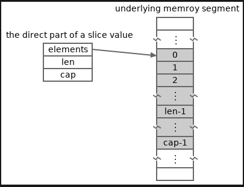

# Nizovi, isečci i mape u Gou

- [Delovi vrednosti][0204]  
- [Sadržaj][00]
- [Stringovi][0206]  

Strogo govoreći, u Go-u postoje tri vrste kontejnera prvog reda:

- **niz**,
- **isečak** i
- **mapa**.

Ponekad se

- **stringovi** i
- **kanali**

takođe mogu posmatrati kao tipovi kontejnera, ali ovaj članak se neće dotaći te dve vrste tipova. Svi tipovi kontejnera o kojima se govori u ovom članku su nizovi, isečci i mape.

U Go jeziku postoji mnogo detalja vezanih za kontejnere. Ovaj članak će ih navesti jedan po jedan.

## Jednostavan pregled tipova i vrednosti kontejnera

Svaka vrednost tri vrste tipova se koristi za čuvanje kolekcije vrednosti elemenata. Tipovi svih elemenata sačuvanih u vrednosti kontejnera su identični. Identičan tip se naziva **tip elementa** (**tip kontejnera**) vrednosti kontejnera.

Svaki element u kontejneru ima **pridruženi ključ**. Vrednosti elementa može se pristupiti ili izmeniti preko njegovog pridruženog ključa. Tipovi ključeva tipova mapa moraju biti uporedivi tipovi. Tipovi ključeva tipova nizova i isečaka su svi ugrađenog tipa **int**. Ključevi elemenata niza ili isečka su nenegativni celi brojevi koji označavaju pozicije ovih elemenata u nizu ili isečku. Ključevi nenegativnih celih brojeva se često nazivaju **indeksi**.

Svaka vrednost kontejnera ima svojstvo dužine, koje pokazuje koliko elemenata je sačuvano u tom kontejneru. Važeći opseg celobrojnih ključeva vrednosti niza ili segmenta je od nule (uključujući) do dužine (isključujući) niza ili segmenta. Za svaku vrednost tipa mape, ključne vrednosti te vrednosti mape mogu biti proizvoljna vrednost tipa ključa tipa mape.

Takođe postoje mnoge razlike između tri vrste tipova kontejnera. Većina razlika potiče od razlika između rasporeda memorije vrednosti tri vrste tipova. Iz prethodnog članka, delovi vrednosti, saznali smo da vrednost niza sadrži samo jedan direktno deo, međutim, vrednost isečka ili mape može imati osnovni deo, na koji se poziva direktni deo vrednosti isečka ili mape.

Elementi niza ili isečka se čuvaju susedno u kontinuiranom segmentu memorije. Za niz, kontinuirani segment memorije sadrži direktni deo niza. Za deo, kontinuirani segment memorije sadrži osnovni indirektni deo dela dela. Implementacija mape standardnog Go kompajlera/run-time okruženja usvaja algoritam heš tabele. Dakle, svi elementi mape se takođe čuvaju u osnovnom kontinuiranom segmentu memorije, ali možda nisu susedni. Može postojati mnogo rupa (praznina) unutar kontinuiranog segmenta memorije. Još jedan uobičajeni algoritam za implementaciju mape je algoritam binarnog stabla. Koji god algoritam da se koristi, ključevi povezani sa elementima mape se takođe čuvaju u (osnovnim delovima) mape.

Možemo pristupiti elementu preko njegovog ključa. Vremenska složenost pristupa elementima na svim vrednostima kontejnera je O(1), mada su generalno pristupi elementima mape nekoliko puta sporiji od pristupa elementima niza i isečaka. Ali mape imaju dve prednosti u odnosu na nizove i isečke:

- Tipovi kjučeva mapa mogu biti bilo koji uporedivi tipovi.

- Mape troše mnogo manje memorije nego nizovi i isečci ako je većina elemenata nulta vrednost.

Iz prethodnog članka smo saznali da se osnovni delovi vrednosti neće kopirati kada se vrednost kopira. Drugim rečima, ako vrednost ima osnovne delove, kopija vrednosti će deliti te osnovne delove sa vrednošću. To je osnovni razlog mnogih razlika u ponašanju između vrednosti niza i isečka/mape. Ove razlike u ponašanju biće predstavljene u nastavku.

## Doslovne reprezentacije neimenovanih tipova kontejnera

Doslovni prikazi tri vrste neimenovanih tipova kontejnera:

- tipovi nizova:**[N]T**

- tipovi isečaka:**[]T**  

- tipovi mapa: **map[K]T** gde:

  - **T** je proizvoljan tip. Određuje tip elementa kontejnerskog tipa. Samo vrednosti navedenog tipa elementa mogu biti sačuvane kao vrednosti elemenata vrednosti kontejnerskog tipa.

  - **N** mora biti nenegativna celobrojna konstanta. Ona određuje broj elemenata sačuvanih u bilo kojoj vrednosti tipa niza i može se nazvati dužinom tipa niza. To znači da je dužina tipa niza inherentni deo tipa niza. Na primer, **[5]int** i **[8]int** su dva različita tipa niza.

  - **K** je proizvoljni uporedivi tip. Određuje tip ključa tipa mape. Većina tipova u Go-u su uporedivi, neuporedivi tipovi su navedeni ovde.

Evo nekoliko primera literalne reprezentacije tipa kontejnera:

```go
const Size = 32

type Person struct {
    name string
    age  int
}

/* Array types */

[5]string
[Size]int

// Element type is a slice type: []byte
[16][]byte

// Element type is a struct type: Person
[100]Person

/* Slice types */

[]bool
[]int64

// Element type is a map type: map[int]bool
[]map[int]bool

// Element type is a pointer type: *int
[]*int

/* Map types */

map[string]int
map[int]bool

// Element type is an array type: [6]string
map[int16][6]string

// Element type is a slice type: []string
map[bool][]string

// Element type is a pointer type: *int8,
// and key type is a struct type.
map[struct{x int}]*int8
```

Veličine svih tipova isečaka su iste. Veličine svih tipova mapa su takođe iste. Veličina tipa niza zavisi od njegove dužine i veličine njegovog tipa elementa. Veličina tipa niza nulte dužine ili tipa niza sa tipom elementa nulte veličine je nula.

## Literali vrednosti kontejnera

Kao i vrednosti strukture, vrednosti kontejnera mogu biti predstavljene i kompozitnim literalima, **T{...}**, gde **T** označava tip kontejnera (osim nultih vrednosti tipova slice i map). Evo nekoliko primera:

```go
// An array value containing four bool values.
[4]bool{false, true, true, false}

// A slice value which contains three words.
[]string{"break", "continue", "fallthrough"}

// A map value containing some key-value pairs.
map[string]int{"C": 1972, "Python": 1991, "Go": 2009}
```

Svaki par ključ-element između zagrada kompozitnog literala mape se takođe naziva unos.

Postoji nekoliko varijanti za kompozitne literale nizova i isečaka:

```go
// The followings slice composite literals
// are equivalent to each other.
[]string{"break", "continue", "fallthrough"}
[]string{0: "break", 1: "continue", 2: "fallthrough"}
[]string{2: "fallthrough", 1: "continue", 0: "break"}
[]string{2: "fallthrough", 0: "break", "continue"}

// The followings array composite literals
// are equivalent to each other.
[4]bool{false, true, true, false}
[4]bool{0: false, 1: true, 2: true, 3: false}
[4]bool{1: true, true}
[4]bool{2: true, 1: true}
[...]bool{false, true, true, false}
[...]bool{3: false, 1: true, true}
```

U poslednja dva literala, **...** znači da želimo da dozvolimo kompajlerima da izvedu dužine odgovarajućih vrednosti niza.

Iz gore navedenih primera znamo da su indeksi elemenata (ključevi) opcioni u kompozitnim literalima niza i isečaka. U kompozitnom literalu niza ili kriške,

- Ako je indeks prisutan, nije potrebno da bude tipizirana vrednost tipa ključa int, ali mora biti nenegativna konstanta koja se može predstaviti kao vrednost tipa int. A ako je tipiziran, njegov tip mora biti osnovni tip celog broja.

- Element čiji indeks nedostaje koristi indeks prethodnog elementa plus jedan kao svoj indeks.

- Ako indeks prvog elementa nedostaje, njegov indeks je nula.

Ključevi unosa u literalu mape ne smeju biti odsutni, mogu biti nekonstantni.

```go
var a uint = 1
var _ = map[uint]int {a : 123} // okay

// The following two lines fail to compile,
// for "a" is not a constant key/index.
var _ = []int{a: 100}  // error
var _ = [5]int{a: 100} // error
```

Konstantni ključevi u jednom specifičnom kompozitnom literalu ne mogu biti duplirani.

## Doslovne reprezentacije nultih vrednosti tipova kontejnera

Kao i strukture, nulta vrednost tipa niza A može se predstaviti kompozitnim literalom **A{}**. Na primer, nulta vrednost tipa **[100]int** može se označiti kao **[100]int{}**. Svi elementi sačuvani u nultoj vrednosti tipa niza su nulte vrednosti tipa elementa tog tipa niza.

Kao i tipovi pokazivača, nulte vrednosti svih tipova isečaka i mapa su predstavljene sa unapred deklarisanim **nil**.

Uzgred, postoje i neke druge vrste tipova čije su nulte vrednosti takođe predstavljene sa **nil**, uključujući kasnije uvedene tipove funkcija, kanala i interfejsa.

Kada se deklariše promenljiva niza bez navedene početne vrednosti, memorija je dodeljena za elemente nulte vrednosti niza. Memorija za elemente vrednosti nultog isečka ili mape još nije dodeljena.

Imajte u vidu da **[]T{}** predstavlja praznu vrednost isečka (sa nula elemenata) tipa isečka **[]T**, i da se razlikuje od **[]T(nil)**. Ista situacija je i za **map[K]T{}** i **map[K]T(nil)**.

## Kompozitni literali se ne mogu adresirati, ali se mogu preuzeti kao adrese

Naučili smo da strukturni kompozitni literali mogu direktno da se adresiraju pre. Kontejnerski kompozitni literali ovde nemaju izuzetaka.

Primer:

```go
package main

import "fmt"

func main() {
    pm := &map[string]int{"C": 1972, "Go": 2009}
    ps := &[]string{"break", "continue"}
    pa := &[...]bool{false, true, true, false}
    fmt.Printf("%T\n", pm) // *map[string]int
    fmt.Printf("%T\n", ps) // *[]string
    fmt.Printf("%T\n", pa) // *[4]bool
}
```

## Ugnežđeni kompozitni literali mogu se pojednostaviti

Ako je složeni literal ugnježdio mnoge druge složene literale, onda se ti ugnježdeni složeni literali mogu pojednostaviti u oblik {...}.

Na primer, literal vrednosti kriške

```go
// A slice value of a type whose element type is
// *[4]byte. The element type is a pointer type
// whose base type is [4]byte. The base type is
// an array type whose element type is "byte".
var heads = []*[4]byte{
    &[4]byte{'P', 'N', 'G', ' '},
    &[4]byte{'G', 'I', 'F', ' '},
    &[4]byte{'J', 'P', 'E', 'G'},
}
```

može se pojednostaviti na

```go
var heads = []*[4]byte{
    {'P', 'N', 'G', ' '},
    {'G', 'I', 'F', ' '},
    {'J', 'P', 'E', 'G'},
}
```

Literal vrednosti niza u sledećem primeru

```go
type language struct {
    name string
    year int
}

var _ = [...]language{
    language{"C", 1972},
    language{"Python", 1991},
    language{"Go", 2009},
}
```

može se pojednostaviti na

```go
var _ = [...]language{
    {"C", 1972},
    {"Python", 1991},
    {"Go", 2009},
}
```

I literal vrednosti mape u sledećem primeru

```go
type LangCategory struct {
    dynamic bool
    strong  bool
}

// A value of map type whose key type is
// a struct type and whose element type
// is another map type "map[string]int".
var _ = map[LangCategory]map[string]int{
    LangCategory{true, true}: map[string]int{
        "Python": 1991,
        "Erlang": 1986,
    },
    LangCategory{true, false}: map[string]int{
        "JavaScript": 1995,
    },
    LangCategory{false, true}: map[string]int{
        "Go":   2009,
        "Rust": 2010,
    },
    LangCategory{false, false}: map[string]int{
        "C": 1972,
    },
}
```

može se pojednostaviti na

```go
var _ = map[LangCategory]map[string]int{
    {true, true}: {
        "Python": 1991,
        "Erlang": 1986,
    },
    {true, false}: {
        "JavaScript": 1995,
    },
    {false, true}: {
        "Go":   2009,
        "Rust": 2010,
    },
    {false, false}: {
        "C": 1972,
    },
}
```

Molimo vas da imate u vidu da se u gornjim primerima zarez koji sledi posle poslednje stavke u svakom složenom literalu ne može izostaviti. Molimo vas da kasnije pročitate pravila za prelom reda u programskom jeziku Go za više informacija.

## Uporedite vrednosti kontejnera

Kao što je već pomenuto u članku o pregledu Go sistema tipova, tipovi map i slice su neuporedivi tipovi. Stoga se tipovi map i slice ne mogu koristiti kao tipovi ključeva tipa map.

Iako vrednost isečka ili mape ne može da se uporedi sa drugom vrednošću isečka ili mape (ili samom sobom), može se uporediti sa golim netipizovanim nil identifikatorom da bi se proverilo da li je vrednost isečka ili mape nulta vrednost.

Većina tipova nizova je uporediva, osim onih čiji su tipovi elemenata neuporedivi tipovi.

Prilikom poređenja dve vrednosti niza, svaki par odgovarajućih elemenata će biti upoređen. Možemo pretpostaviti da se parovi elemenata upoređuju po redosledu indeksa. Dve vrednosti niza su jednake samo ako su svi njihovi odgovarajući elementi jednaki. Poređenje se unapred zaustavlja kada se utvrdi da je par elemenata nejednak ili kada dođe do panike.

Primer:

```go
package main

import "fmt"

func main() {
    var a [16]byte
    var s []int
    var m map[string]int

    fmt.Println(a == a)   // true
    fmt.Println(m == nil) // true
    fmt.Println(s == nil) // true
    fmt.Println(nil == map[string]int{}) // false
    fmt.Println(nil == []int{})          // false

    // The following lines fail to compile.
    /*
    _ = m == m
    _ = s == s
    _ = m == map[string]int(nil)
    _ = s == []int(nil)
    var x [16][]int
    _ = x == x
    var y [16]map[int]bool
    _ = y == y
    */
}
```

## Proverite dužine i kapacitete vrednosti kontejnera

Pored svojstva dužine, svaka vrednost kontejnera takođe ima svojstvo kapaciteta. Kapacitet niza je uvek jednak dužini niza. Kapacitet mape koja nije nula može se posmatrati kao neograničen. Dakle, u praksi, samo kapaciteti vrednosti sloja su značajni. Kapacitet sloja je uvek jednak ili veći od dužine sloja. Značenje kapaciteta sloja biće objašnjeno u odeljku koji sledi.

Možemo koristiti ugrađenu lenfunkciju da bismo dobili dužinu vrednosti kontejnera i koristiti ugrađenu capfunkciju da bismo dobili kapacitet vrednosti kontejnera. Svaka od dve funkcije vraća inttipizirani rezultat ili netiizirani rezultat čiji je podrazumevani tip int, u zavisnosti od toga da li je prosleđeni argument konstantni izraz. Pošto je kapacitet bilo koje vrednosti mape neograničen, ugrađena capfunkcija se ne primenjuje na vrednosti mape.

Dužina i kapacitet vrednosti niza se nikada ne mogu promeniti. Dužine i kapaciteti svih vrednosti tipa niza uvek su jednaki dužini tipa niza. Dužina i kapacitet vrednosti segmenta mogu se promeniti tokom izvršavanja. Dakle, segmenti se mogu posmatrati kao dinamički nizovi. Segmenti su mnogo fleksibilniji od nizova i u praksi se koriste popularnije od nizova.

Primer:

```go
package main

import "fmt"

func main() {
    var a [5]int
    fmt.Println(len(a), cap(a)) // 5 5
    var s []int
    fmt.Println(len(s), cap(s)) // 0 0
    s, s2 := []int{2, 3, 5}, []bool{}
    fmt.Println(len(s), cap(s))   // 3 3
    fmt.Println(len(s2), cap(s2)) // 0 0
    var m map[int]bool
    fmt.Println(len(m)) // 0
    m, m2 := map[int]bool{1: true, 0: false}, map[int]int{}
    fmt.Println(len(m), len(m2)) // 2 0
}
```

Dužina i kapacitet svakog kriške prikazanog u gore navedenom primeru vrednosti su jednaki. Ovo ne važi za svaku vrednost kriške. U narednim odeljcima ćemo koristiti neke kriške čije odgovarajuće dužine i kapaciteti nisu jednaki.

## Preuzimanje i izmena elemenata kontejnera

Element povezan sa ključem ksačuvanim u vrednosti kontejnera vpredstavljen je sintaksom indeksiranja elemenata u obliku v[k].

Za upotrebu v[k], pretpostavimo vda je niz ili isečak,

- Ako je **k** konstanta, onda mora da zadovolji gore opisane zahteve za indekse u kontejnerskim kompozitnim literalima. Pored toga, ako je **v** niz, **k** mora biti manji od dužine niza.

- Ako je **k** nekonstantna vrednost, mora biti vrednost bilo kog osnovnog celobrojnog tipa. Pored toga, mora biti veća ili jednaka nuli i manja od **len(v)**, u suprotnom će doći do panike tokom izvršavanja.

- Ako je v nulti deo, doći će do panike tokom izvršavanja.

Za upotrebu **v[k]**, pretpostavimo da je **v** mapa, onda **k** mora biti dodelivo vrednostima tipa elementa tipa mape, i

- Ako je **k** vrednost interfejsa čiji je dinamički tip neuporediv, doći će do panike tokom izvršavanja.

- Ako se **v[k]** koristi kao odredišna vrednost u dodeli i **v** predstavlja nil mapu, doći će do panike tokom izvršavanja.

- Ako **v[k]** se koristi za preuzimanje vrednosti elementa koja odgovara ključu **k** u map **v**, onda se neće desiti panika, čak i ako vje map **nil**. (Pretpostavimo da izračunavanje **k** neće paničiti.)

- Ako **v[k]** se koristi za preuzimanje vrednosti elementa koji odgovara ključu **k** u mapi **v**, a mapa **v** ne sadrži unos sa ključem **k**, **v[k]** rezultira nultom vrednošću tipa elementa odgovarajućeg tipa mape **v**. Generalno, **v[k]** se posmatra kao izraz sa jednom vrednošću. Međutim, kada se **v[k]** koristi kao jedini izraz izvorne vrednosti u dodeli, može se posmatrati kao izraz sa više vrednosti i rezultirati drugom opcionom netipizovanom bulovskom vrednošću, koja ukazuje da li mapa **v** sadrži unos sa ključem **k**.

Primer pristupa i modifikacija elemenata kontejnera:

```go
package main

import "fmt"

func main() {
    a := [3]int{-1, 0, 1}
    s := []bool{true, false}
    m := map[string]int{"abc": 123, "xyz": 789}
    fmt.Println (a[2], s[1], m["abc"])    // retrieve
    a[2], s[1], m["abc"] = 999, true, 567 // modify
    fmt.Println (a[2], s[1], m["abc"])    // retrieve

    n, present := m["hello"]
    fmt.Println(n, present, m["hello"]) // 0 false 0
    n, present = m["abc"]
    fmt.Println(n, present, m["abc"]) // 567 true 567
    m = nil
    fmt.Println(m["abc"]) // 0

    // The two lines fail to compile.
    /*
    _ = a[3]  // index 3 out of bounds
    _ = s[-1] // index must be non-negative
    */

    // Each of the following lines can cause a panic.
    _ = a[n]         // panic: index out of range
    _ = s[n]         // panic: index out of range
    m["hello"] = 555 // panic: assign to entry in nil map
}
```

## Podsetite se definicije unutrašnje strukture tipova isečaka

Da bismo bolje razumeli tipove i vrednosti isečaka i lakše objasnili isečke, potrebno je da steknemo utisak o unutrašnjoj strukturi tipova isečaka. Iz prethodnog članka, delovi vrednosti, saznali smo da je unutrašnja struktura tipova slojeva definisanih standardnim Go kompajlerom/okruženjem za izvršavanje ovakva

```go
type _slice struct {
    elements unsafe.Pointer // referencing underlying elements
    len      int            // length
    cap      int            // capacity
}
```

Definicije interne strukture koje koriste drugi kompajleri/implementacije vremena izvršavanja možda nisu potpuno iste, ali bi bile slične. Sledeća objašnjenja se zasnivaju na zvaničnoj implementaciji isečaka.

Gore prikazana unutrašnja struktura objašnjava raspored memorije direktnih delova vrednosti sloja. Polje **len** direktnog dela isečka označava dužinu isečka, a **cap** polje označava kapacitet isečka. Sledeća slika prikazuje jedan mogući raspored memorije vrednosti isečka.

 Isečci 1 - **Raspored memorije**

Iako osnovni segment memorije koji sadrži elemente segmenta može biti veoma veliki, segment može biti svestan samo podsegmenta segmenta memorije. Na primer, na gornjoj slici, segment je svestan samo srednjeg sivog podsegmenta celog segmenta memorije.

Za isečak prikazan na gornjoj slici, elementi od indeksa lendo indeksa cap(isključivo) ne pripadaju elementima isečka. Oni su samo neki suvišni slotovi elemenata za prikazani isečak, ali mogu biti efektivni elementi drugih isečaka ili drugog niza.

U sledećem odeljku će biti objašnjeno kako dodati elemente osnovnom isečku i dobiti novi isečak korišćenjem ugrađene appendfunkcije. Rezultujući isečak appendpoziva funkcije može deliti početne elemente sa osnovnim isečkom ili ne, u zavisnosti od kapaciteta (i dužine) osnovnog isečka i koliko elemenata se dodaje.

Kada se isečak koristi kao osnovni isečak u appendpozivu funkcije,

- Ako je broj dodatih elemenata veći od broja redundantnih slotova elemenata osnovnog sloja, za rezultujući sloj će biti dodeljen novi osnovni segment memorije, tako da rezultujući sloj i osnovni sloj neće deliti nikakve elemente.

- u suprotnom, za rezultujući segment neće biti dodeljeni novi osnovni segmenti memorije, a elementi osnovnog segmenta takođe pripadaju elementima rezultujućeg segmenta. Drugim rečima, dva segmenta dele neke elemente i svi njihovi elementi se nalaze na istom osnovnom segmentu memorije.

U sledećem odeljku biće prikazana slika koja opisuje oba moguća slučaja dodavanja elemenata kriške.

Postoji više ruta koje vode do toga da se elementi dva segmenta nalaze na istom osnovnom segmentu memorije. Kao što su dodele i operacije sa podsečkama koje će biti predstavljene u nastavku.

Imajte na umu da generalno ne možemo da menjamo tri polja vrednosti isečka pojedinačno, osim putem refleksije i nebezbednih načina. Drugim rečima, generalno, da bi se izmenila vrednost isečka, njegova tri polja moraju biti izmenjena zajedno. Generalno, to se postiže dodeljivanjem druge vrednosti isečka (istog tipa isečka) isečku koji treba izmeniti.

## Dodele kontejnera

Ako je mapa dodeljena drugoj mapi, onda će dve mape deliti sve (osnovne) elemente. Dodavanje elemenata u (ili brisanje elemenata sa) jedne mape odraziće se na drugu mapu.

Kao i kod dodeljivanja mapa, ako se jedan sloj dodeli drugom sloju, oni će deliti sve (osnovne) elemente. NJihove odgovarajuće dužine i kapaciteti su jednaki. Međutim, ako se dužina/kapacitet jednog sloja kasnije promeni, promena se neće odraziti na drugi sloj.

Kada se niz dodeli drugom nizu, svi elementi se kopiraju iz izvornog u odredišni. Dva niza ne dele nijedan element.

Primer:

```go
package main

import "fmt"

func main() {
    m0 := map[int]int{0:7, 1:8, 2:9}
    m1 := m0
    m1[0] = 2
    fmt.Println(m0, m1) // map[0:2 1:8 2:9] map[0:2 1:8 2:9]

    s0 := []int{7, 8, 9}
    s1 := s0
    s1[0] = 2
    fmt.Println(s0, s1) // [2 8 9] [2 8 9]

    a0 := [...]int{7, 8, 9}
    a1 := a0
    a1[0] = 2
    fmt.Println(a0, a1) // [7 8 9] [2 8 9]
}
```

## Dodavanje i brisanje elemenata kontejnera

Sintaksa dodavanja para ključ-element (unosa) mapi je ista kao i sintaksa modifikovanja elementa mape. Na primer, za vrednost mape koja nije nula m, sledeći red

```go
m[k] = e
```

Stavite par ključ-element (k, e)u mapu mako mne sadrži unos sa ključem k, ili izmenite vrednost elementa povezanu sa kako msadrži unos sa ključem k.

Postoji ugrađena deletefunkcija koja se koristi za brisanje unosa sa mape. Na primer, sledeći red će obrisati unos sa ključem ksa mape m. Ako mapa mne sadrži unos sa ključem k, to je no-op, neće doći do panike, čak i ako mje nil mapa.

```go
delete(m, k)
```

Primer pokazuje kako se dodaju (stavljaju) zapisi u mape i brišu zapisi sa mapa:

```go
package main

import "fmt"

func main() {
    m := map[string]int{"Go": 2007}
    m["C"] = 1972     // append
    m["Java"] = 1995  // append
    fmt.Println(m)    // map[C:1972 Go:2007 Java:1995]
    m["Go"] = 2009    // modify
    delete(m, "Java") // delete
    fmt.Println(m)    // map[C:1972 Go:2009]
}
```

Imajte u vidu da pre verzije Go 1.12, redosled štampanja unosa mape nije određen.

Elementi niza ne mogu se ni dodavati ni brisati, iako se elementi adresabilnih nizova mogu menjati.

Možemo koristiti ugrađenu appendfunkciju da dodamo više elemenata u osnovni isečak i rezultiramo novim isečkom. Rezultujući novi isečak sadrži elemente osnovnog isečka i dodate elemente. Imajte u vidu da poziv funkcije ne menja osnovni isečak append. Svakako, ako očekujemo (i često u praksi), možemo dodeliti rezultujući isečak osnovnom isečku da bismo ga izmenili.

Ne postoji ugrađeni način za brisanje elementa iz isečka. Moramo appendzajedno koristiti funkciju i funkciju podisečka predstavljenu u nastavku da bismo postigli ovaj cilj. Brisanje i umetanje elemenata isečka biće demonstrirano u odeljku sa dodatnim manipulacijama isečkama ispod. Ovde, sledeći primer samo pokazuje kako se koristi appendfunkcija.

Primer koji pokazuje kako se koristi appendfunkcija:

```go
package main

import "fmt"

func main() {
    s0 := []int{2, 3, 5}
    fmt.Println(s0, cap(s0)) // [2 3 5] 3
    s1 := append(s0, 7)      // append one element
    fmt.Println(s1, cap(s1)) // [2 3 5 7] 6
    s2 := append(s1, 11, 13) // append two elements
    fmt.Println(s2, cap(s2)) // [2 3 5 7 11 13] 6
    s3 := append(s0)         // <=> s3 := s0
    fmt.Println(s3, cap(s3)) // [2 3 5] 3
    s4 := append(s0, s0...)  // double s0 as s4
    fmt.Println(s4, cap(s4)) // [2 3 5 2 3 5] 6

    s0[0], s1[0] = 99, 789
    fmt.Println(s2[0], s3[0], s4[0]) // 789 99 2
}
```

appendImajte na umu da je ugrađena funkcija varijabilna funkcija. Ima dva parametra, drugi je varijabilni parametar.

Varijadičke funkcije će biti objašnjene u članku koji sledi. Trenutno, potrebno je samo da znamo da postoje dva načina za prosleđivanje varijadičkih argumenata. U gornjem primeru, red 8, red 10 i red 12 koriste jedan način, a red 14 koristi drugi način. Za prvi način, možemo proslediti nula ili više vrednosti elemenata kao varijadičke argumente. Za drugi način, moramo proslediti krišku kao jedini varijadički argument, nakon koje moraju slediti tri tačke.... Možemo naučiti kako da pozivamo varijadičke funkcije iz članka koji sledi.

U gornjem primeru, red 14 je ekvivalentan

```go
s4 := append(s0, s0[0], s0[1], s0[2])
```

red 8 je ekvivalentan

```go
s1 := append(s0, []int{7}...)
```

a red 10 je ekvivalentan

```go
s2 := append(s1, []int{11, 13}...)
```

Za način sa tri tačke..., appendfunkcija ne zahteva da varijabilni argument mora biti sloj istog tipa kao i prvi argument sloja, ali njihovi tipovi elemenata moraju biti identični. Drugim rečima, dva argumenta sloja moraju deliti isti osnovni tip.

U gore navedenom programu,

- Poziv appendu liniji 8 će dodeliti novi osnovni segment memorije za slice s1, jer slice s0nema dovoljno redundantnih slotova za elemente da bi smestio novododati element. Ista situacija je i za appendpoziv u liniji 14.
- Poziv appendu liniji 10 neće dodeliti novi osnovni segment memorije za slice s2, jer slice s1ima dovoljno redundantnih slotova za elemente za čuvanje novih dodatih elemenata.

Dakle, s1i s2deli neke elemente, s0i s3deli sve elemente, i s4ne deli elemente sa drugima. Sledeća slika prikazuje statuse ovih isečaka na kraju gornjeg programa.

Imajte na umu da, kada appendpoziv dodeli novi osnovni segment memorije za rezultujući deo, kapacitet rezultujućeg dela zavisi od kompajlera. Za standardni Go kompajler, ako je kapacitet osnovnog dela mali, kapacitet rezultujućeg dela će biti najmanje dvostruko veći od osnovnog dela, kako bi se izbeglo često dodeljivanje osnovnih segmenata memorije kada se rezultujući deo koristi kao osnovni deo u kasnijim mogućim appendpozivima.

Kao što je gore pomenuto, možemo dodeliti rezultujući isečak osnovnom isečku u appendpozivu za dodavanje elemenata u osnovni isečak. Na primer,

```go
package main

import "fmt"

func main() {
    var s = append([]string(nil), "array", "slice")
    fmt.Println(s)      // [array slice]
    fmt.Println(cap(s)) // 2
    s = append(s, "map")
    fmt.Println(s)      // [array slice map]
    fmt.Println(cap(s)) // 4
    s = append(s, "channel")
    fmt.Println(s)      // [array slice map channel]
    fmt.Println(cap(s)) // 4
}
```

Prvi argument appendpoziva funkcije ne može biti netipizovan nil(do Go 1.25).

Kreirajte kriške i mape pomoću ugrađene makefunkcije

Pored korišćenja kompozitnih literala za kreiranje vrednosti mape i sloja, možemo koristiti i ugrađenu makefunkciju za kreiranje vrednosti mape i sloja. Ugrađena makefunkcija se ne može koristiti za kreiranje vrednosti niza.

Uzgred, ugrađena makefunkcija se takođe može koristiti za kreiranje kanala, što će biti objašnjeno kasnije u članku kanali u Go-u.

Pretpostavimo Mda je tip mape i nje ceo broj, možemo koristiti sledeća dva oblika za kreiranje novih mapa tipa M.

```go
make(M, n)
make(M)
```

Prvi oblik kreira novu praznu mapu kojoj je dodeljeno dovoljno prostora da smesti najmanje nunosa bez ponovnog preraspodele memorije. Drugi oblik prihvata samo jedan argument, u kom slučaju se kreira nova prazna mapa sa dovoljno prostora da smesti mali broj unosa bez ponovnog preraspodele memorije. Mali broj zavisi od kompajlera.

Napomena: drugi argument nmože biti negativan ili nula, u kom slučaju će biti ignorisan.

Pretpostavimo Sda je tipa kriške, lengtha capacitysu dva nenegativna cela broja, lengthnije veće od capacity, možemo koristiti sledeća dva oblika da bismo kreirali nove kriške tipa S. (Tipovi lengthi capacityne moraju biti identični.)

make(S, length, capacity)
make(S, length)

Prvi oblik kreira novi isečak sa navedenom dužinom i kapacitetom. Drugi oblik prihvata samo dva argumenta, u kom slučaju je kapacitet novokreiranog isečka isti kao i njegova dužina.

Svi elementi u rezultujućem isečku poziva funkcije makesu inicijalizovani kao nulta vrednost (tipa elementa isečka).

Primer kako se koristi ugrađena makefunkcija za kreiranje mapa i kriški:

```go
package main

import "fmt"

func main() {
    // Make new maps.
    fmt.Println(make(map[string]int)) // map[]
    m := make(map[string]int, 3)
    fmt.Println(m, len(m)) // map[] 0
    m["C"] = 1972
    m["Go"] = 2009
    fmt.Println(m, len(m)) // map[C:1972 Go:2009] 2

    // Make new slices.
    s := make([]int, 3, 5)
    fmt.Println(s, len(s), cap(s)) // [0 0 0] 3 5
    s = make([]int, 2)
    fmt.Println(s, len(s), cap(s)) // [0 0] 2 2
}
```

Dodelite kontejnere pomoću ugrađene newfunkcije

Iz članka o pokazivačima u Go-u, saznali smo da možemo pozvati i ugrađenu newfunkciju da bismo dodelili vrednost bilo kog tipa i dobili pokazivač koji referencira dodeljenu vrednost. Dodeljena vrednost je nulta vrednost svog tipa. Iz tog razloga je besmisleno koristiti newfunkciju za kreiranje vrednosti mapiranja i iseckanja.

Nije potpuno besmisleno dodeliti nultu vrednost tipu niza pomoću ugrađene newfunkcije. Međutim, to se retko radi u praksi, jer je pogodnije koristiti kompozitne literale za dodelu nizova.

Primer:

```go
package main

import "fmt"

func main() {
    m := *new(map[string]int)   // <=> var m map[string]int
    fmt.Println(m == nil)       // true
    s := *new([]int)            // <=> var s []int
    fmt.Println(s == nil)       // true
    a := *new([5]bool)          // <=> var a [5]bool
    fmt.Println(a == [5]bool{}) // true
}
```

## Adresabilnost kontejnerskih elemenata

U nastavku su navedene neke činjenice o adresabilnosti kontejnerskih elemenata.

- Elementi adresabilnih vrednosti niza su takođe adresabilni. Elementi neadresabilnih vrednosti niza su takođe neadresabilni. Razlog je taj što svaka vrednost niza se sastoji samo od jednog direktnog dela.

- Elementi bilo koje vrednosti segmenta su uvek adresabilni, bez obzira na to da li je ta vrednost segmenta adresabilna ili ne. To je zato što se elementi segmenta čuvaju u osnovnom (indirektnom) delu vrednosti segmenta, a osnovni deo se uvek nalazi na dodeljenom segmentu memorije.

- Elementi vrednosti mape su uvek neadresabilni. Molimo vas da pročitate ovu stavku sa često postavljanim pitanjima za razloge.

Na primer:

```go
package main

import "fmt"

func main() {
    a := [5]int{2, 3, 5, 7}
    s := make([]bool, 2)
    pa2, ps1 := &a[2], &s[1]
    fmt.Println(*pa2, *ps1) // 5 false
    a[2], s[1] = 99, true
    fmt.Println(*pa2, *ps1) // 99 true
    ps0 := &[]string{"Go", "C"}[0]
    fmt.Println(*ps0) // Go

    m := map[int]bool{1: true}
    _ = m
    // The following lines fail to compile.
    /*
    _ = &[3]int{2, 3, 5}[0]
    _ = &map[int]bool{1: true}[1]
    _ = &m[1]
    */
}
```

Za razliku od većine drugih neadresabilnih vrednosti, čiji se direktni delovi ne mogu menjati, direktni deo vrednosti elementa mape može se menjati, ali se može menjati (prepisivati) samo kao celina. Za većinu vrsta tipova elemenata, ovo nije veliki problem. Međutim, ako je tip elementa tipa mape tip niza ili tip strukture, stvari postaju pomalo kontraintuitivne.

Iz prethodnog članka, delovi vrednosti, saznali smo da se svaka vrednost strukture i niza sastoji samo od jednog direktnog dela. Dakle

- Ako je tip elementa mape struktura, ne možemo pojedinačno modifikovati svako polje elementa (koji je struktura) mape.

- Ako je tip elementa mape tip niza, ne možemo pojedinačno modifikovati svaki element elementa (koji je niz) mape.

Primer:

```go
package main

import "fmt"

func main() {
    type T struct{age int}
    mt := map[string]T{}
    mt["John"] = T{age: 29} // modify it as a whole
    ma := map[int][5]int{}
    ma[1] = [5]int{1: 789} // modify it as a whole

    // The following two lines fail to compile,
    // for map elements can be modified partially.
    /*
    ma[1][1] = 123      // error
    mt["John"].age = 30 // error
    */

    // Accesses are okay.
    fmt.Println(ma[1][1])       // 789
    fmt.Println(mt["John"].age) // 29
}
```

Da bi bilo kakva očekivana modifikacija u gornjem primeru funkcionisala, odgovarajući element mape treba prvo sačuvati u privremenoj promenljivoj, zatim se privremena promenljiva modifikuje po potrebi, i na kraju se odgovarajući element mape prepisuje privremenom promenljivom. Na primer,

```go
package main

import "fmt"

func main() {
    type T struct{age int}
    mt := map[string]T{}
    mt["John"] = T{age: 29}
    ma := map[int][5]int{}
    ma[1] = [5]int{1: 789}

    t := mt["John"] // a temporary copy
    t.age = 30
    mt["John"] = t // overwrite it back

    a := ma[1] // a temporary copy
    a[1] = 123
    ma[1] = a // overwrite it back

    fmt.Println(ma[1][1], mt["John"].age) // 123 30
}
```

**Napomena**: upravo pomenuto ograničenje može kasnije biti ukinuto.

## Izvedite isečke iz nizova i isečaka

Možemo izvesti novi sloj iz drugog (osnovnog) sloja ili osnovnog adresabilnog niza koristeći sintaksne forme podsloja (Go specifikacija ih naziva sintaksne forme sloja). Proces se često naziva i preraspodela. Elementi izvedenog sloja i osnovnog niza ili sloja nalaze se na istom segmentu memorije. Drugim rečima, izvedeni sloj i osnovni niz ili sloj mogu deliti neke susedne elemente.

Postoje dva oblika sintakse podsečke ( baseContainerje niz ili sečka):

```go
baseContainer[low : high]       // two-index form
baseContainer[low : high : max] // three-index form
```

Dvoindeksni oblik je ekvivalentan

```go
baseContainer[low : high : cap(baseContainer)]
```

Dakle, oblik sa dva indeksa je poseban slučaj oblika sa tri indeksa. Oblik sa dva indeksa se u praksi koristi mnogo popularnije od oblika sa tri indeksa.

Imajte na umu da je oblik sa tri indeksa podržan tek od Go 1.2.

U izrazu podsečke, indeksi low, highi maxmoraju da zadovolje sledeće zahteve relacije.

```go
// two-index form
0 <= low <= high <= cap(baseContainer)

// three-index form
0 <= low <= high <= max <= cap(baseContainer)
```

Indeksi koji ne zadovoljavaju ove zahteve mogu dovesti do toga da se izraz podsečke ne uspe da kompajlira u vreme kompajliranja ili da izazove paniku u vreme izvršavanja, u zavisnosti od tipa osnovnog kontejnera i od toga da li su indeksi konstante.

Napomena,

- Indeksi lowi highmogu biti oba veća od len(baseContainer), sve dok su zadovoljeni svi gore navedeni uslovi. Ali ta dva indeksa ne smeju biti veća od cap(baseContainer).

- Izraz podsečke neće izazvati paniku ako baseContainerje nil sečak i svi indeksi korišćeni u izrazu su nula. Rezultujući sečak izveden iz nil sečka je i dalje nil sečak.

Dužina izvedenog isečka je jednaka high - low, a kapacitet izvedenog isečka je jednak max - low. Dužina izvedenog isečka može biti veća od osnovnog kontejnera, ali kapacitet nikada neće biti veći od osnovnog kontejnera.

U praksi, radi jednostavnosti, često smo izostavljali neke indekse u sintakskim oblicima podsegmenta. Pravila izostavljanja su:

- Ako lowje indeks jednak nuli, može se izostaviti, bilo za oblike sa dva indeksa ili sa tri indeksa.

- Ako highje jednako len(baseContainer), može se izostaviti, ali samo za oblike sa dva indeksa.

- nikada maxse ne može izostaviti u oblicima sa tri indeksa.

Na primer, sledeći izrazi su ekvivalentni.

```go
baseContainer[0 : len(baseContainer)]
baseContainer[: len(baseContainer)]
baseContainer[0 :]
baseContainer[:]
baseContainer[0 : len(baseContainer) : cap(baseContainer)]
baseContainer[: len(baseContainer) : cap(baseContainer)]
```

Primer korišćenja sintakskih oblika podsekcije:

```go
package main

import "fmt"

func main() {
    a := [...]int{0, 1, 2, 3, 4, 5, 6}
    s0 := a[:]     // <=> s0 := a[0:7:7]
    s1 := s0[:]    // <=> s1 := s0
    s2 := s1[1:3]  // <=> s2 := a[1:3]
    s3 := s1[3:]   // <=> s3 := s1[3:7]
    s4 := s0[3:5]  // <=> s4 := s0[3:5:7]
    s5 := s4[:2:2] // <=> s5 := s0[3:5:5]
    s6 := append(s4, 77)
    s7 := append(s5, 88)
    s8 := append(s7, 66)
    s3[1] = 99
    fmt.Println(len(s2), cap(s2), s2) // 2 6 [1 2]
    fmt.Println(len(s3), cap(s3), s3) // 4 4 [3 99 77 6]
    fmt.Println(len(s4), cap(s4), s4) // 2 4 [3 99]
    fmt.Println(len(s5), cap(s5), s5) // 2 2 [3 99]
    fmt.Println(len(s6), cap(s6), s6) // 3 4 [3 99 77]
    fmt.Println(len(s7), cap(s7), s7) // 3 4 [3 4 88]
    fmt.Println(len(s8), cap(s8), s8) // 4 4 [3 4 88 66]
}
```

Sledeća slika prikazuje konačne rasporede memorije niza i vrednosti kriški korišćenih u gornjem primeru.

Sa slike znamo da se elementi slice s7i s8nalaze na drugom osnovnom segmentu memorije od ostalih kontejnera. Elementi ostalih slice-ova nalaze se na istom segmentu memorije koji nalazi i niz a.

Imajte u vidu da operacije sa podsečkama mogu prouzrokovati curenje memorije po vrstama. Na primer, polovina memorije dodeljene za povratni sečak poziva sledeće funkcije biće potrošena uzalud, osim ako vraćeni sečak ne postane nedostupan (ako nijedan drugi sečak ne deli osnovni segment memorije elementa sa vraćenim sečkom).

```go
func f() []int {
    s := make([]int, 10, 100)
    return s[50:60]
}
```

Imajte na umu da je u gornjoj funkciji donji indeks ( 50) veći od dužine ( 10) od s, što je dozvoljeno.

## Konvertujte isečak u pokazivač niza

Od verzije Go 1.17, segment može biti konvertovan u pokazivač niza. U takvoj konverziji, ako je dužina osnovnog tipa niza tipa pokazivača veća od dužine segmenta, dolazi do panike.

Primer:

```go
package main

type S []int
type A [2]int
type P *A

func main() {
    var x []int
    var y = make([]int, 0)
    var x0 = (*[0]int)(x) // okay, x0 == nil
    var y0 = (*[0]int)(y) // okay, y0 != nil
    _, _ = x0, y0

    var z = make([]int, 3, 5)
    var _ = (*[3]int)(z) // okay
    var _ = (*[2]int)(z) // okay
    var _ = (*A)(z)      // okay
    var _ = P(z)         // okay

    var w = S(z)
    var _ = (*[3]int)(w) // okay
    var _ = (*[2]int)(w) // okay
    var _ = (*A)(w)      // okay
    var _ = P(w)         // okay

    var _ = (*[4]int)(z) // will panic
}
```

## Pretvori isečak u niz

Od verzije Go 1.20, isečak se može konvertovati u niz. U takvoj konverziji, ako je dužina tipa niza veća od dužine isečka, dolazi do panike. Isečak i rezultujući niz ne dele nijedan element.

Primer:

```go
package main

import "fmt"

func main() {
    var s = []int{0, 1, 2, 3}
    var a = [3]int(s[1:])
    s[2] = 9
    fmt.Println(s) // [0 1 9 3]
    fmt.Println(a) // [1 2 3]
    
    _ = [3]int(s[:2]) // panic
}
```

## Kopirajte elemente isečka pomoću ugrađene copyfunkcije

Možemo koristiti ugrađenu copyfunkciju za kopiranje elemenata iz jednog sloja u drugi, tipovi dva sloja ne moraju biti identični, ali njihovi tipovi elemenata moraju biti identični. Drugim rečima, dva argumenta sloja moraju deliti isti osnovni tip. Prvi parametar funkcije copyje odredišni sloj, a drugi je izvorni sloj. Dva parametra mogu da se preklapaju sa nekim elementima. copyFunkcija vraća broj kopiranih elemenata, koji će biti manji od dužina dva parametra.

Uz pomoć sintakse podsekcije, možemo koristiti funkciju copyza kopiranje elemenata između dva niza ili između niza i sekcije.

Primer:

```go
package main

import "fmt"

func main() {
    type Ta []int
    type Tb []int
    dest := Ta{1, 2, 3}
    src := Tb{5, 6, 7, 8, 9}
    n := copy(dest, src)
    fmt.Println(n, dest) // 3 [5 6 7]
    n = copy(dest[1:], dest)
    fmt.Println(n, dest) // 2 [5 5 6]

    a := [4]int{} // an array
    n = copy(a[:], src)
    fmt.Println(n, a) // 4 [5 6 7 8]
    n = copy(a[:], a[2:])
    fmt.Println(n, a) // 2 [7 8 7 8]
}
```

Imajte na umu da se, kao poseban slučaj, ugrađena copyfunkcija može koristiti za kopiranje bajtova iz stringa u bajtni isečak.

Nijedan od dva argumenta copypoziva funkcije ne može biti netipizovana nil vrednost (do Go 1.25).

## Iteracije elemenata kontejnera

U programu Go, ključevi i elementi vrednosti kontejnera mogu se iterirati sledećom sintaksom:

```go
for key, element = range aContainer {
    // use key and element...
}
```

gde su fori rangedve ključne reči, keya elementse nazivaju iteracione promenljive. Ako aContainerje kriška ili niz (ili pokazivač niza, videti dole), onda tip keymora biti ugrađeni tip int.

Znak dodele =može biti kratki znak deklaracije promenljive :=, u kom slučaju su dve iterativne promenljive obe dve nove deklarisane promenljive koje su vidljive samo unutar for-rangetela bloka koda, ako aContainerje kriška ili niz (ili pokazivač niza), onda se tip keyizvodi kao int.

Kao i tradicionalni forblok petlje, svaki for-rangeblok petlje kreira dva bloka koda, implicitni i eksplicitni koji se formira korišćenjem {}. Eksplicitni je ugnežđen u implicitni.

Kao i forblokovi petlji, breaki continueiskazi se takođe mogu koristiti u for-rangeblokovima petlji,

Primer:

```go
package main

import "fmt"

func main() {
    m := map[string]int{"C": 1972, "C++": 1983, "Go": 2009}
    for lang, year := range m {
        fmt.Printf("%v: %v \n", lang, year)
    }

    a := [...]int{2, 3, 5, 7, 11}
    for i, prime := range a {
        fmt.Printf("%v: %v \n", i, prime)
    }

    s := []string{"go", "defer", "goto", "var"}
    for i, keyword := range s {
        fmt.Printf("%v: %v \n", i, keyword)
    }
}
```

Sintaksa bloka koda forme for-rangeima nekoliko varijanti:

```go
// Ignore the key iteration variable.
for _, element = range aContainer {
    //...
}

// Ignore the element iteration variable.
for key, _ = range aContainer {
    element = aContainer[key]
    //...
}

// The element iteration variable is omitted.
// This form is equivalent to the last one.
for key = range aContainer {
    element = aContainer[key]
    //...
}

// Ignore both the key and element iteration variables.
for _, _ = range aContainer {
    // This variant is not much useful.
}

// Both the key and element iteration variables are
// omitted. This form is equivalent to the last one.
for range aContainer {
    // This variant is not much useful.
}
```

Iteracija preko nultih mapa ili nultih kriški je dozvoljena. Takve iteracije su no-ops.

Neki detalji o iteracijama preko mapa su navedeni ovde.

- Za mapu, redosled unosa u iteraciji nije garantovano isti kao u sledećoj iteraciji, čak i ako mapa nije modifikovana između dve iteracije. Prema Go specifikaciji, redosled je neodređen (vrsta randomizacije).

- Ako se unos mape (par ključnih elemenata) koji još nije dostignut ukloni tokom iteracije, onda se taj unos sigurno neće iterirati u istoj iteraciji.

- Ako se unos na mapi kreira tokom iteracije, taj unos može biti iteriran tokom iste iteracije, ili ne.

Ako je obećano da nema drugih gorutina koje manipulišu mapom m, onda sledeći kod garantovano briše sve unose (osim onih sa ključevima kao NaN) sačuvane u mapi m:

```go
for key := range m {
    delete(m, key)
}
```

(Napomena: Go 1.21 je uveo clearugrađenu funkciju, koja se može koristiti za brisanje svih unosa mape, uključujući i one sa ključevima kao što su NaN.)

Svakako, elementi niza i kriške mogu se iterirati i korišćenjem tradicionalnog forbloka petlje:

```go
for i := 0; i < len(anArrayOrSlice); i++ {
    //... use anArrayOrSlice[i]
}
```

Za for-rangeblok petlje (bez obzira da li je to bilo pre =ili :=ne range)

```go
for key, element = range aContainer {...}
```

postoje dve važne činjenice.

- Kontejner sa opsegom je kopija od aContainer. Imajte u vidu da se kopira samo direktni deo odaContainer. Kopija kontejnera je anonimna, tako da ne postoji način da se ona izmeni.

- Ako aContainerje niz, onda se izmene napravljene na elementima niza tokom iteracije neće odraziti na promenljive iteracije. Razlog je taj što kopija niza ne deli elemente sa nizom.

- Ako aContainerje isečak ili mapa, onda će se modifikacije napravljene na elementima isečka ili mape tokom iteracije odraziti na promenljive iteracije. Razlog je taj što klon isečka (ili mape) deli sve elemente (unose) sa isečkom (ili mapom).

- Par ključ-element kopije aContainerbiće dodeljen (kopiran) paru iteracionih promenljivih u svakom koraku iteracije, tako da se modifikacije napravljene na direktnim delovima iteracionih promenljivih neće odraziti na elemente (i ključeve za mape) sačuvane u aContainer. (Zbog ove činjenice, a i pošto je korišćenje for-rangeblokova petlji jedini način za iteraciju ključeva i elemenata mape, preporučuje se da se ne koriste tipovi velike veličine kao tipovi ključeva i elemenata mape, kako bi se izbeglo veliko opterećenje kopiranjem.)

Primer koji dokazuje prvu i drugu činjenicu.

```go
package main

import "fmt"

func main() {
    type Person struct {
        name string
        age  int
    }
    persons := [2]Person {{"Alice", 28}, {"Bob", 25}}
    for i, p := range persons {
        fmt.Println(i, p)

        // This modification has no effects on
        // the iteration, for the ranged array
        // is a copy of the persons array.
        persons[1].name = "Jack"

        // This modification has not effects on
        // the persons array, for p is just a
        // copy of a copy of one persons element.
        p.age = 31
    }
    fmt.Println("persons:", &persons)
}
```

Izlaz:

```sh
0 {Alisa 28}
1 {Bob 25}
osobe: &[{Alisa 28} {DŽek 25}]
```

Ako promenimo niz u gornjem primeru u krišku, onda modifikacija kriške tokom iteracije ima uticaj na iteraciju, ali modifikacija promenljive iteracije i dalje nema uticaja na krišku.

```go
...
    // A slice.
    persons := []Person {{"Alice", 28}, {"Bob", 25}}
    for i, p := range persons {
        fmt.Println(i, p)

        // Now this modification has effects
        // on the iteration.
        persons[1].name = "Jack"

        // This modification still has not
        // any real effects.
        p.age = 31
    }
    fmt.Println("persons:", &persons)
}
```

Izlaz postaje:

```sh
0 {Alisa 28}
1 {DŽek 25}
osobe: &[{Alisa 28} {DŽek 25}]
```

Sledeći primer dokazuje drugu činjenicu.

```go
package main

import "fmt"

func main() {
    m := map[int]struct{ dynamic, strong bool } {
        0: {true, false},
        1: {false, true},
        2: {false, false},
    }
    
    for _, v := range m {
        // This following line has no effects on the map m.
        v.dynamic, v.strong = true, true
    }
    
    fmt.Println(m[0]) // {true false}
    fmt.Println(m[1]) // {false true}
    fmt.Println(m[2]) // {false false}
}
```

Troškovi dodele segmenta ili mape su mali, ali su troškovi dodele niza veliki ako je veličina tipa niza velika. Dakle, generalno, nije dobra ideja kretati se po velikom nizu. Možemo kretati se po segmentu izvedenom iz niza ili po pokazivaču na niz (pogledajte sledeći odeljak za detalje).

Za niz ili isečak, ako je veličina njegovog tipa elementa velika, onda, generalno, nije dobra ideja koristiti drugu iteracionu promenljivu za čuvanje iterativnog elementa u svakom koraku petlje. Za takve nizove i isečke, trebalo bi da koristimo for-rangevarijantu petlje sa jednom iteracionom promenljivom ili tradicionalnu forpetlju za iteraciju njihovih elemenata. U sledećem primeru, petlja u funkciji faje mnogo manje efikasna od petlje u funkciji fb.

```go
type Buffer struct {
    start, end int
    data       [1024]byte
}

func fa(buffers []Buffer) int {
    numUnreads := 0
    for _, buf := range buffers {
        numUnreads += buf.end - buf.start
    }
    return numUnreads
}

func fb(buffers []Buffer) int {
    numUnreads := 0
    for i := range buffers {
        numUnreads += buffers[i].end - buffers[i].start
    }
    return numUnreads
}
```

Pre verzije Go 1.22, kada je for-rangeblok petlje (obratite pažnju na znak ispred ) range:=

```go
for key, element := range aContainer {...}
```

se izvrši, svi parovi ključ-elemenat biće dodeljeni istom paru instanci iteracionih promenljivih. Međutim, od verzije Go 1.22, svaki par ključ-elemenat biće dodeljen posebnom paru instanci iteracionih promenljivih (tj. posebno poređenje, biće kreirana instanca za svaku iteracionu promenljivu u svakoj iteraciji petlje).

Sledeći primer prikazuje razlike u ponašanju između verzija Go-a 1.21- i 1.22+.

```go
// forrange1.go
package main

import "fmt"

func main() {
    for i, n := range []int{0, 1, 2} {
        defer func() {
            fmt.Println(i, n)
        }()
    }
}
```

Korišćenjem različitih verzija Go Toolchain-a za pokretanje koda ( gotv je alat koji se koristi za upravljanje i korišćenje više koegzistirajućih instalacija zvaničnih verzija Go Toolchain-a), dobićemo različite izlaze:

```sh
$ gotv 1.21. run forrange1.go
[Run]: $HOME/.cache/gotv/tag_go1.21.8/bin/go run forrange1.go
2 2
2 2
2 2

$ gotv 1.22. run forrange1.go
[Run]: $HOME/.cache/gotv/tag_go1.22.1/bin/go run forrange1.go
2 2
1 1
0 0
```

Još jedan primer:

```go
// forrange2.go
package main

import "fmt"

func main() {
    var m = map[*int]uint32{}
    for i, n := range []int{1, 2, 3} {
        m[&i]++
        m[&n]++
    }
    fmt.Println(len(m))
}
```

Koristeći različite verzije Go Toolchain-a, dobićemo sledeće rezultate:

```sh
$ gotv 1.21. run forrange2.go
[Run]: $HOME/.cache/gotv/tag_go1.21.8/bin/go run forrange2.go
2

$ gotv 1.22. run forrange2.go
[Run]: $HOME/.cache/gotv/tag_go1.22.1/bin/go run forrange2.go
6
```

Dakle, ovo je semantička promena koja narušava unazadnu kompatibilnost. Ali nova semantika je zapravo više u skladu sa očekivanjima ljudi. I teoretski, nijedan stari kod za koji se utvrdilo da je logički ispravan ne bi bio poremećen ovom promenom.

## Koristite pokazivače nizova kao nizove

U mnogim scenarijima, možemo koristiti pokazivač na niz kao niz.

Možemo prelaziti preko pokazivača ka nizu da bismo iterativno pregledali elemente niza. Za nizove velike dužine, ovaj način je mnogo efikasniji, jer je kopiranje pokazivača mnogo efikasnije nego kopiranje niza velike veličine. U sledećem primeru, dva bloka petlje su ekvivalentna i oba su efikasna.

```go
package main

import "fmt"

func main() {
    var a [100]int

    // Copying a pointer is cheap.
    for i, n := range &a {
        fmt.Println(i, n)
    }

    // Copying a slice is cheap.
    for i, n := range a[:] {
        fmt.Println(i, n)
    }
}
```

Ako se druga iteracija u for-rangepetlji ne ignoriše niti izostavi, onda će opseg preko pokazivača niza nil izazvati paniku. U sledećem primeru, svaki od prva dva bloka petlje će ispisati pet indeksa, međutim, poslednji će proizvesti paniku.

```go
package main

import "fmt"

func main() {
    var p *[5]int // nil

    for i, _ := range p { // okay
        fmt.Println(i)
    }

    for i := range p { // okay
        fmt.Println(i)
    }

    for i, n := range p { // panic
        fmt.Println(i, n)
    }
}
```

Pokazivači nizova se takođe mogu koristiti za indeksiranje elemenata niza. Indeksiranje elemenata niza preko pokazivača niza vrednosti nil izaziva paniku.

```go
package main

import "fmt"

func main() {
    a := [5]int{2, 3, 5, 7, 11}
    p := &a
    p[0], p[1] = 17, 19
    fmt.Println(a) // [17 19 5 7 11]
    p = nil
    _ = p[0] // panic
}
```

Takođe možemo izvoditi kriške iz pokazivača nizova. Izvođenje kriški iz pokazivača niza vrednosti nil proizvodi paniku.

```go
package main

import "fmt"

func main() {
    pa := &[5]int{2, 3, 5, 7, 11}
    s := pa[1:3]
    fmt.Println(s) // [3 5]
    pa = nil
    s = pa[0:0] // panic
    // Should this line execute, it also panics.
    _ = (*[0]byte)(nil)[:]
}
```

Takođe možemo proslediti pokazivače nizova kao argumente ugrađenih funkcija leni cap. Ako se argumenti pokazivača nizova za ove dve funkcije ne ravnaju nula, to neće izazvati paniku.

```go
var pa *[5]int // == nil
fmt.Println(len(pa), cap(pa)) // 5 5
```

Koristite ugrađenu clearfunkciju za brisanje unosa na mapi i resetovanje elemenata preseka

Go 1.21 je uveo clearugrađenu funkciju. Ova funkcija se koristi za brisanje unosa mape i resetovanje elemenata sloja.

Primer:

```go
package main

import "fmt"

func main() {
s := []int{1, 2, 3}
clear(s)
fmt.Println(s) // [0 0 0]

a := [4]int{5, 6, 7, 8}
clear(a[1:3])
fmt.Println(a) // [5 0 0 8]

m := map[float64]float64{}
x := 0.0
m[x] = x
x /= x // x is NaN now
m[x] = x
fmt.Println(len(m)) // 2
for k := range m {
delete(m, k)
}
fmt.Println(len(m)) // 1
clear(m)
fmt.Println(len(m)) // 0
}
```

Možemo otkriti da clearfunkcija može čak i da obriše unose na mapi sa ključevima kao što su NaN.

## Optimizacija memclr​

Standardni Go kompajler pravi nekoliko optimizacija tako da će konvertovati petlje sa određenim obrascima u interne memclrpozive. Pre Go 1.21, mogli smo da koristimo ove optimizacije za resetovanje elemenata niza/sečke i brisanje unosa mape.

Ove optimizacije (i mnoge druge) su sakupljene u knjizi „Go Optimizations 101“.

Pozivi ugrađenih lenfunkcija capmogu se proceniti tokom kompajliranja.

Ako je argument koji se prosleđuje pozivu ugrađene funkcije lenili capfunkcije niz ili vrednost pokazivača niza, onda se poziv izvršava tokom kompajliranja, a rezultat poziva je tipizirana konstanta sa type kao ugrađenim tipom int. Rezultat se može vezati za imenovane konstante.

Primer:

```go
package main

import "fmt"

var a [5]int
var p *[7]string

// N and M are both typed constants.
const N = len(a)
const M = cap(p)

func main() {
    fmt.Println(N) // 5
    fmt.Println(M) // 7
}
```

Postoji još scenarija u kojima se pozivi ugrađene funkcije leni capfunkcija izvršavaju tokom kompajliranja. Molimo vas da pročitate knjigu „Go Details & Tips 101“ za takve slučajeve.

## Izmenite svojstva dužine i kapaciteta isečka pojedinačno

Kao što je gore pomenuto, generalno, dužina i kapacitet vrednosti sloja ne mogu se menjati pojedinačno. Vrednost sloja može se prepisati samo kao celina dodeljivanjem druge vrednosti sloja. Međutim, dužinu i kapacitet sloja možemo menjati pojedinačno korišćenjem refleksija. Refleksija će biti detaljnije objašnjena u kasnijem članku.

Primer:

```go
package main

import (
    "fmt"
    "reflect"
)

func main() {
    s := make([]int, 2, 6)
    fmt.Println(len(s), cap(s)) // 2 6

    reflect.ValueOf(&s).Elem().SetLen(3)
    fmt.Println(len(s), cap(s)) // 3 6

    reflect.ValueOf(&s).Elem().SetCap(5)
    fmt.Println(len(s), cap(s)) // 3 5
}
```

Drugi argument prosleđen funkciji reflect.SetLenne sme biti veći od trenutnog kapaciteta isečka argumenta s. Drugi argument prosleđen funkciji reflect.SetCapne sme biti manji od trenutne dužine isečka argumenta si veći od trenutnog kapaciteta isečka argumenta s. U suprotnom, doći će do panike.

Način refleksije je veoma neefikasan, sporiji je od dodele slojeva.

## Više manipulacija isečcima

Go ne podržava više ugrađenih operacija iseckanja, kao što su kloniranje iseckanja, brisanje i umetanje elemenata. Moramo da komponujemo ugrađene načine da bismo postigli te operacije.

Molimo vas da pročitate poglavlje „Nizovi i kriške“ u knjizi Go Optimizations 101 za informacije o tome kako efikasno izvršiti takve operacije.

Koristite mape za simulaciju skupova

Go ne podržava ugrađene tipove skupova. Međutim, lako je koristiti tip mape za simulaciju tipa skupa. U praksi, često koristimo tip mape map[K]struct{}za simulaciju tipa skupa sa elementom tipa K. Veličina elementa mape tipa struct{}je nula, elementi vrednosti takvih tipova mapa ne zauzimaju memorijski prostor.

## Operacije vezane za kontejner nisu interno sinhronizovane

Imajte u vidu da se sve operacije kontejnera ne sinhronizuju interno. Bez korišćenja bilo kakve tehnike sinhronizacije podataka, u redu je da više gorutina istovremeno čita kontejner, ali nije u redu da više gorutina istovremeno manipuliše kontejnerom i da barem jedna gorutina modifikuje kontejner. Potonji slučaj će izazvati trke podataka, čak i paniku među gorutinama. Moramo ručno sinhronizovati operacije kontejnera. Molimo vas da pročitate članke o sinhronizaciji podataka za detalje.

- [Delovi vrednosti][0204]  
- [Sadržaj][00]  
- [Stringovi][0206]  

[0204]: 0204_Delovi_vrednosti.md
[00]: 00_Sadrzaj.md
[0206]: 0206_Stringovi.md
