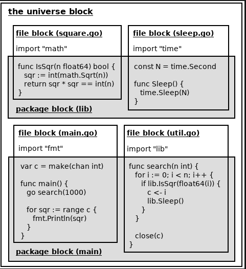

# Blokovi koda i opsezi identifikatora

[Panic i restore][0303] | [Sadržaj][00] | [Poredak izračunavanja izraza][0305]

Ovaj članak će objasniti blokove koda i opsege identifikatora u Go-u.

> [!Note]
> Imajte na umu da se definicije hijerarhija blokova koda u ovom članku malo
> razlikuju od stanovišta go/*standardnih paketa.

## Blokovi koda

U Go projektu postoje četiri vrste blokova koda (kasnije nazvanih i blokovi):

- Blok univerzuma sadrži sav izvorni kod projekta.
- Svaki paket ima blok paketa koji sadrži sav izvorni kod, isključujući deklaracije za uvoz paketa u tom paketu.
- Svaka datoteka ima blok datoteke koji sadrži sav izvorni kod, uključujući deklaracije za uvoz paketa, u toj datoteci.
- Generalno, par zagrada {} obuhvata lokalni blok. Međutim, neki lokalni blokovi nisu obuhvaćeni {}, takvi blokovi se nazivaju implicitni lokalni blokovi.
- Lokalni blokovi obuhvaćeni sa {} nazivaju se eksplicitni lokalni blokovi. Složeni literali i definicije tipova u {} ne formiraju lokalne blokove.

Neke ključne reči u svim vrstama tokova upravljanja prate neki implicitni blokovi koda.

Ključnu reč **if**, **switch** ili **for** prate dva ugnježdena lokalna bloka. Jedan je implicitni, drugi je eksplicitni. Eksplicitni je ugnježden u implicitnom. Ako takvu ključnu reč prati kratka deklaracija promenljive, onda se promenljive deklarišu u implicitnom bloku.

Ključnu **else** reč prati jedan eksplicitni ili implicitni blok, koji je ugnežđen u implicitnom bloku koji sledi iza odgovarajuće **if** ključne reči. Ako ključnu reč **else** prati druga **if** ključna reč, onda blok koda koji sledi **else** ključnu reč može biti implicitan, u suprotnom, blok koda mora biti eksplicitan.

Ključnu reč **select** prati jedan eksplicitni blok

Svaku ključnu reč **case** i **default** prati jedan implicitni blok, koji je ugnežđen u eksplicitni blok nakon odgovarajuće ključne reči **switch** ili **select**.

Lokalni blokovi koji nisu ugnežđeni ni u jedan drugi lokalni blok nazivaju se lokalni blokovi najvišeg nivoa (ili nivoa paketa). Lokalni blokovi najvišeg nivoa su sva tela funkcija.

Treba napomenuti da se ulazni parametri i izlazni rezultati funkcije smatraju deklarisanim u eksplicitnom bloku koda tela funkcije, čak i ako njihove deklaracije ostaju van para zagrada koje okružuju blok tela funkcije.

## Hijerarhije blokova koda

- Blokovi paketa su ugnežđeni u bloku univerzuma.
- Blokovi datoteka su takođe direktno ugnežđeni u blok univerzuma, umesto blokova paketa. (Ovo objašnjenje se razlikuje od go/*standardnih paketa.)
- Svaki lokalni blok najvišeg nivoa je ugnežđen i u blok paketa i u blok datoteke. (Ovo objašnjenje se takođe razlikuje od go/*standardnih paketa.)
- Lokalni blok koji nije na vrhu mora biti ugnežđen u drugi lokalni blok.

Razlike u odnosu na Go specifikaciju su da bi se pojednostavila dole navedena objašnjenja za senčenje identifikatora.

Evo slike koja prikazuje hijerarhiju blokova u programu:



Blokovi koda se uglavnom koriste za objašnjenje dozvoljenih pozicija deklaracija i opsega identifikatora elemenata izvornog koda.

## Mesta deklaracije elemenata izvornog koda

Postoji šest vrsta elemenata izvornog koda koji se mogu deklarisati:

- uvoz paketa.
- definisani tipovi i alijasi tipova.
- imenovane konstante.
- promenljive.
- funkcije.
- labele.

Labele se koriste u iskazima **break**, **continue**, i **goto**.

Deklaracija povezuje identifikator koji nije prazan sa elementom izvornog koda (konstanta, tip, promenljiva, funkcija, oznaka ili paket). Drugim rečima, u deklaraciji, deklarisani element izvornog koda se naziva identifikator koji nije prazan. Nakon deklaracije, možemo koristiti identifikator koji nije prazan da bismo predstavili deklarisani element izvornog koda.

Sledeća tabela prikazuje u kojim blokovima koda se sve vrste elemenata izvornog koda mogu direktno deklarisati:

| ............... | blok univerzuma | blokovi paketa | blokovi datoteka | lokalni blokovi |
| --------------- | --------------- | -------------- | ---------------- | --------------- |
| unapred deklarisani (ugrađeni elementi) (1) | Da | | | |
| uvoz paketa | | | Da | |
| definisani tipovi i alijas tipa (neugrađeni) | | Da | Da | Da |
| imenovane konstante (nisu ugrađene) | | Da | Da | Da |
| promenljive (neugrađene) (2) | | Da | Da | Da |
| funkcije (nisu ugrađene) | | Da | Da | |
| promenljive (neugrađene) (2) | | | | Da |

(1) unapred deklarisani elementi su dokumentovani u **builtin** standardnom paketu.  
(2) isključujući promenljive strukturnih polja.

Dakle,

- Uvoz paketa nikada ne može biti deklarisan u blokovima paketa i lokalnim blokovima.

- Funkcije se nikada ne mogu deklarisati u lokalnim blokovima. (Anonimne funkcije mogu biti zatvorene u lokalnim blokovima, ali one nisu deklaracije.)

- Oznake se mogu deklarisati samo u lokalnim blokovima.

Molimo vas da obratite pažnju,

- Ako su najdublji blokovi koji sadrže dva deklaracija elemenata koda isti, onda imena (identifikatori) dva elementa koda ne mogu biti identični.

- Ime (identifikator) elementa koda na nivou paketa deklarisanog u paketu ne sme biti identično bilo kom imenu uvoza paketa deklarisanom u bilo kojoj izvornoj datoteci u paketu (tj. ime uvoza paketa u paketu ne sme biti identično bilo kom elementu koda na nivou paketa deklarisanom u paketu). Ovo pravilo bi kasnije moglo biti ublaženo.

- Ako su najdublji blokovi tela funkcije dve deklaracije oznaka isti, onda imena (identifikatori) dve oznake ne mogu biti identični.

- Reference labele moraju biti unutar najdubljeg bloka tela funkcije koji sadrži deklaraciju etikete.

- Neki posebni delovi u implicitnim lokalnim blokovima u svim vrstama tokova upravljanja imaju posebne zahteve. Generalno, nije dozvoljeno direktno deklarisati elemente koda u takvim implicitnim lokalnim blokovima, osim nekih kratkih deklaracija promenljivih.

- Svaka ključna reč if, switch ili formože biti praćena kratkom deklaracijom promenljive.

- Svaka case ključna reč u select toku upravljanja može biti praćena kratkom deklaracijom promenljive.

(Uzgred, go/*standardni paketi misle da blokovi fajl koda mogu da sadrže samo deklaracije za uvoz paketa.)

Elementi izvornog koda deklarisani u blokovima paketa, ali izvan bilo kojih lokalnih blokova, nazivaju se elementi izvornog koda na nivou paketa. Elementi izvornog koda na nivou paketa mogu se imenovani konstantama, promenljivim, funkcijama, definisanim tipovima ili alijasima tipova.

## Obim deklarisanih elemenata izvornog koda

Opseg deklarisanog identifikatora znači prepoznatljivi opseg identifikatora (ili vidljivi opseg).

Bez razmatranja senčenja identifikatora koje će biti objašnjeno u poslednjem odeljku ovog članka, definicije opsega za identifikatore svih vrsta elemenata izvornog koda navedene su u nastavku.

- Opseg unapred deklarisanog/ugrađenog identifikatora je blok univerzuma.
- Opseg identifikatora uvoza paketa je blok datoteke koji sadrži deklaraciju uvoza paketa.
- Opseg identifikatora koji označava konstantu, tip, promenljivu ili funkciju (ali ne i metod) deklarisanu na nivou paketa je blok paketa.
- Opseg identifikatora koji označava prijemnik metode, parametar funkcije ili promenljivu rezultata je odgovarajuće telo funkcije (lokalni blok).
- Opseg identifikatora konstante ili promenljive deklarisane unutar tela funkcije počinje na kraju specifikacije konstante ili promenljive (ili na kraju deklaracije za kratko deklarisanu promenljivu) i završava se na kraju najdubljeg bloka koji je sadrži.
- Opseg identifikatora tipa ili alijasa tipa deklarisanog unutar tela funkcije počinje na kraju identifikatora u odgovarajućoj specifikaciji tipa i završava se na kraju najdubljeg bloka koji ga sadrži.
- Opseg važenja oznake je telo najdubljeg bloka funkcije koji sadrži deklaraciju oznake, ali isključuje sva tela anonimnih funkcija ugnežđenih u funkciji koja ga sadrži.

O opsezima parametara tipa, pročitajte knjigu Go generics 101.

Prazni identifikatori nemaju opsege.

(Napomena: prethodno deklarisano iota je vidljivo samo u deklaracijama konstanti.)

Možda ste primetili manju razliku u definicijama opsega identifikatora između lokalnih definicija tipa i lokalnih promenljivih, lokalnih konstanti i lokalnih alijasa tipova. Razlika znači da definisani tip može da referencira samog sebe u svojoj deklaraciji. Evo primera koji pokazuje razliku.

```go
package main

func main() {
    // var v int = v   // error: v is undefined
    // const C int = C // error: C is undefined
    /*
    type T = struct {
        *T    // error: T uses <T>
        x []T // error: T uses <T>
    }
    */

    // Following type definitions are all valid.
    type T struct {
        *T
        x []T
    }
    type A [5]*A
    type S []S
    type M map[int]M
    type F func(F) F
    type Ch chan Ch
    type P *P

    //...
    var p P
    p = &p
    p = ***********************p
    ***********************p = p

    var s = make(S, 3)
    s[0] = s
    s = s[0][0][0][0][0][0][0][0]

    var m = M{}
    m[1] = m
    m = m[1][1][1][1][1][1][1][1]
}
```

Zabeležite, poziv **fmt.Print(s)** i poziv **fmt.Print(m)** oba paniče (zbog prepunjavanja steka).

I razlika u obimu između deklaracija na nivou paketa i lokalnih deklaracija:

```go
package main

// Here the two identifiers at each line are the
// same one. The right ones are both not the
// predeclared identifiers. Instead, they are
// same as respective left one. So the two
// lines both fail to compile.
/*
const iota = iota // error: constant definition loop
var true = true   // error: typechecking loop
*/

var a = b // can reference variables declared later
var b = 123

func main() {
    // The identifiers at the right side in the
    // next two lines are the predeclared ones.
    const iota = iota // ok
    var true = true   // ok
    _ = true

    // The following lines fail to compile, for
    // c references a later declared variable d.
    /*
    var c = d
    var d = 123
    _ = c
    */
}
```

## Zasenčivanje identifikatora

Ignorišući oznake, identifikator deklarisan u spoljašnjem bloku koda može biti zasenčen istim identifikatorom deklarisanim u blokovima koda ugnežđenim (direktno ili indirektno) u spoljašnjem bloku koda.

Labele ne mogu biti senčene.

Ako je identifikator zasenčen, njegov opseg će isključiti opsege njegovih identifikatora zasenčenih identifikatora.

Ispod je zanimljiv primer. Kod sadrži 6 deklarisanih promenljivih pod nazivom x. Promenljiva A xdeklarisana u dubljem bloku prekriva promenljive xs deklarisane u plićim blokovima.

```go
package main
import "fmt"

var p0, p1, p2, p3, p4, p5 *int
var x = 9999 // x#0

func main() {
    p0 = &x
    var x = 888  // x#1
    p1 = &x
    for x := 70; x < 77; x++ {  // x#2
        p2 = &x
        x := x - 70 //  // x#3
        p3 = &x
        if x := x - 3; x > 0 { // x#4
            p4 = &x
            x := -x // x#5
            p5 = &x
        }
    }

    // 9999 888 77 6 3 -3
    fmt.Println(*p0, *p1, *p2, *p3, *p4, *p5)
}
```

Još jedan primer: sledeći program ispisuje Sheep Goatumesto Sheep Sheep. Molimo vas da pročitate komentare za objašnjenja.

```go
package main
import "fmt"

var f = func(b bool) {
    fmt.Print("Goat")
}

func main() {
    var f = func(b bool) {
        fmt.Print("Sheep")
        if b {
            fmt.Print(" ")
            f(!b) // The f is the package-level f.
        }
    }
    f(true) // The f is the local f.
}
```

Ako izmenimo gornji program kao što je prikazano na sledećem slici, onda će se ispisati Sheep Sheep.

```go
func main() {
    var f func(b bool)
    f = func(b bool) {
        fmt.Print("Sheep")
        if b {
            fmt.Print(" ")
            f(!b) // The f is also the local f now.
        }
    }
    f(true)
}
```

U nekim okolnostima, kada identifikatore zasenče promenljive deklarisane sa kratkim deklaracijama promenljivih, neki novi korisnici jezika „gopher“ mogu biti zbunjeni oko toga da li je promenljiva u kratkoj deklaraciji promenljive ponovo deklarisana ili je novodeklarisana. Sledeći primer (koji ima greške) pokazuje čuvenu zamku u jeziku „gopher“. Skoro svaki korisnik jezika „gopher“ je ikada upao u zamku u ranim danima korišćenja jezika „go“.

```go
package main

import "fmt"
import "strconv"

func parseInt(s string) (int, error) {
    n, err := strconv.Atoi(s)
    if err != nil {
        // Some new gophers may think err is an
        // already declared variable in the following
        // short variable declaration. However, both
        // b and err are new declared here actually.
        // The new declared err variable shadows the
        // err variable declared above.
        b, err := strconv.ParseBool(s)
        if err != nil {
            return 0, err
        }

        // If execution goes here, some new gophers
        // might expect a nil error will be returned.
        // But in fact, the outer non-nil error will
        // be returned instead, for the scope of the
        // inner err variable ends at the end of the
        // outer if-clause.
        if b {
            n = 1
        }
    }
    return n, err
}

func main() {
    fmt.Println(parseInt("TRUE"))
}
```

Izlaz:

```sh
1 strconv.Atoi: parsiranje „TRUE“: nevažeća sintaksa
```

Go ima samo 25 ključnih reči. Ključne reči se ne mogu koristiti kao identifikatori. Mnoge poznate reči u Gou nisu ključne reči, kao što su int, bool, string, len, cap, , nil, itd. One su samo unapred deklarisani (ugrađeni) identifikatori. Ovi unapred deklarisani identifikatori su deklarisani u bloku univerzuma, tako da ih prilagođeni deklarisani identifikatori mogu zasenčiti. Evo jednog čudnog primera u kome su mnogi unapred deklarisani identifikatori zasenčeni. Kompajlira se i radi ispravno.

```go
package main

import (
    "fmt"
)

// Shadows the built-in function identifier "len".
const len = 3
// Shadows the built-in const identifier "true".
var true = 0
// Shadows the built-in variable identifier "nil".
type nil struct {}
// Shadows the built-in type identifier "int".
func int(){}

func main() {
    fmt.Println("a weird program")
    var output = fmt.Println

    // Shadows the package import "fmt".
    var fmt = [len]nil{{}, {}, {}}
    // Sorry, "len" is a constant.
    // var n = len(fmt)
    // Use the built-in cap function instead, :(
    var n = cap(fmt)

    // The "for" keyword is followed by one
    // implicit local code block and one explicit
    // local code block. The iteration variable
    // "true" shadows the package-level variable
    // "true" declared above.
    for true := 0; true < n; true++ {
        // Shadows the built-in const "false".
        var false = fmt[true]
        // The new declared "true" variable
        // shadows the iteration variable "true".
        var true = true+1
        // Sorry, "fmt" is an array, not a package.
        // fmt.Println(true, false)
        output(true, false)
    }
}
```

Izlaz:

```sh
čudan program
1 {}
2 {}
3 {}
```

Da, ovaj primer je ekstreman. Sadrži mnogo loših praksi. Zasenčivanje identifikatora je korisno, ali molim vas da ga ne zloupotrebljavate.

[Panic i restore][0303] | [Sadržaj][00] | [Poredak izračunavanja izraza][0305]

[0303]: 0303_Panic_Restore.md
[00]: 00_Sadrzaj.md
[0305]: 0305_Poredak_izračunavanja_izraza.md
