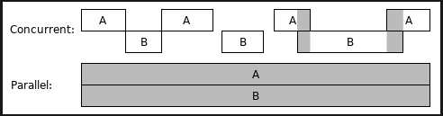
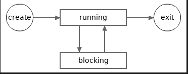
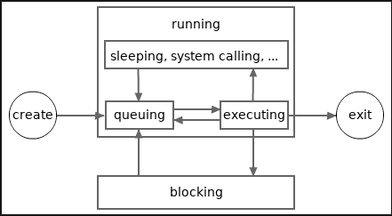

# Gorutine, odloženi pozivi funkcija i panika/oporavak

- [Osnovna kontrola tok][0109]  
- [Sadržaj][00]  
- [Pregled sistema tipova u Go][0201]

Ovaj članak će predstaviti gorutine i odložene pozive funkcija. Gorutine i odloženi poziv funkcija su dve jedinstvene karakteristike u jeziku Go. Ovaj članak takođe objašnjava mehanizme za paniku i oporavak. Nisu sva znanja u vezi sa ovim karakteristikama obuhvaćena ovim člankom, više će biti predstavljeno u budućim člancima.

## Gorutine

Moderni procesori često imaju više jezgara, a neka jezgra procesora podržavaju hiper-nitnu obradu. Drugim rečima, moderni procesori mogu istovremeno da obrađuju više instrukcijskih cevovoda. Da bismo u potpunosti iskoristili snagu modernih procesora, potrebno je da radimo konkurentno programiranje prilikom pisanja naših programa.

Paralelno računarstvo je oblik računarstva u kome se nekoliko izračunavanja izvršava tokom preklapajućih vremenskih perioda. Sledeća slika prikazuje dva slučaja istovremenih izračunavanja. Na slici, A i B predstavljaju dva odvojena izračunavanja. Drugi slučaj se naziva i paralelno računarstvo, što je specijalno konkurentno računarstvo. U prvom slučaju, A i B su paralelni samo tokom kratkog vremenskog perioda.

 Slika 1. **Gorutine i konkurentnost**

Istovremeno izračunavanje može se odvijati u programu, računaru ili mreži. U Go 101 govorimo samo o istovremenim izračunavanjima u okviru programa.Goroutine su Go način za kreiranje istovremenih izračunavanja u Go programiranju.

Gorutine se često nazivaju i *zelenim nitima*. Zelene niti održava i zakazuje izvršno okruženje jezika umesto operativnog sistema. Troškovi potrošnje memorije i promene konteksta gorutine su mnogo manji nego kod niti operativnog sistema. Dakle, nije problem za Go program da istovremeno održava desetine hiljada gorutina, sve dok je sistemska memorija dovoljna.

Go ne podržava kreiranje sistemskih niti u korisničkom kodu. Dakle, korišćenje gorutina je jedini način za istovremeno programiranje (u okviru programa).

Svaki Go program počinje sa samo jednom gorutinom, nazivamo je glavnom (**main**) gorutinom. Gorutina može da kreira nove gorutine. Veoma je jednostavno kreirati novu gorutinu u Go-u, samo koristite ključnu reč **go** praćenu pozivom funkcije. Poziv funkcije će se zatim izvršiti u novokreiranoj gorutini. Novokreirana gorutina će se završiti zajedno sa izlaskom pozvane funkcije.

Sve rezultujuće vrednosti poziva funkcije gorutine (ako pozvana funkcija vraća vrednosti) moraju biti odbačene u naredbi za poziv funkcije. Sledi primer koji kreira dve nove gorutine u glavnoj gorutini. U primeru, **time.Duration** je prilagođeni tip definisan u **time** standardnom paketu. NJegov osnovni tip je ugrađeni tip **int64**. Osnovni tipovi će biti objašnjeni u sledećem članku.

```go
package main

import (
    "log"
    "math/rand"
    "time"
)

func SayGreetings(greeting string, times int) {
    for i := 0; i < times; i++ {
        log.Println(greeting)
        d := time.Second * time.Duration(rand.Intn(5)) / 2
        time.Sleep(d) // sleep for 0 to 2.5 seconds
    }
}

func main() {
    log.SetFlags(0)
    go SayGreetings("hi!", 10)
    go SayGreetings("hello!", 10)
    time.Sleep(2 * time.Second)
}
```

Prilično lako. Je l' tako? Sada se bavimo konkurentnim programiranjem! Gore navedeni program može imati tri korisnički kreirane gorutine koje se izvršavaju istovremeno u svom vrhuncu tokom izvršavanja. Hajde da ga pokrenemo. Jedan mogući izlazni rezultat:

Zdravo!
zdravo!
zdravo!
zdravo!
zdravo!
Zdravo!

Kada se glavna gorutina završi, ceo program se takođe završava, čak i ako postoje neke druge gorutine koje još nisu završene.

Za razliku od prethodnih članaka, ovaj program koristi funkciju **Println** iz **log** standardnog paketa umesto odgovarajuće funkcije iz **fmt** standardnog paketa. Razlog je taj što su **log** funkcije za štampanje u standardnom paketu sinhronizovane (sledeći odeljak će objasniti šta su sinhronizacije), tako da tekstovi koje štampaju dve gorutine neće biti pomešani u jednom redu (mada je šansa da se odštampani tekstovi pomešaju korišćenjem funkcija za štampanje iz **fmt** standardnog paketa veoma mala za ovaj konkretan program).

## Sinhronizacija konkurentnosti

Istovremena izračunavanja mogu deliti resurse, generalno memorijske resurse. Slede neke okolnosti koje se mogu dogoditi tokom istovremenih izračunavanja:

- U istom periodu u kojem jedno računanje upisuje podatke u segment memorije, drugo računanje čita podatke iz istog segmenta memorije. Tada integritet podataka koje čita drugo računanje možda neće biti očuvan.
- U istom periodu u kojem jedno izračunavanje upisuje podatke u segment memorije, drugo izračunavanje takođe upisuje podatke u isti segment memorije. Tada integritet podataka sačuvanih u segmentu memorije možda neće biti očuvan.

Ove okolnosti se nazivaju **trka podataka**. Jedna od dužnosti u konkurentnom programiranju je kontrola deljenja resursa među konkurentnim izračunavanjima, tako da do trka podataka nikada ne dolazi. Načini za implementaciju ove dužnosti nazivaju se **sinhronizacije konkurentnosti** ili **sinhronizacije podataka**, koje će biti predstavljene jedna po jedna u kasnijim člancima Go 101.

Ostale dužnosti u paralelnom programiranju uključuju:

- odrediti koliko je izračunavanja potrebno.
- odrediti kada započeti, blokirati, deblokirati i završiti izračunavanje.
- odrediti kako raspodeliti radno opterećenje među istovremenim izračunavanjima.

Program prikazan u poslednjem odeljku nije savršen. Dve nove gorutine su namenjene za štampanje po deset pozdravnih poruka. Međutim, glavna gorutina će se završiti za dve sekunde, tako da mnoge pozdravne poruke nemaju šansu da se odštampaju. Kako obavestiti glavnu gorutinu kada su obe nove gorutine završile svoje zadatke? Moramo koristiti nešto što se zove tehnike sinhronizacije konkurentnosti.

Go podržava nekoliko tehnika sinhronizacije konkurentnosti. Među njima, **tehnika kanala** je najjedinstvenija i najpopularnije korišćena. Međutim, radi jednostavnosti, ovde ćemo koristiti drugu tehniku, **WaitGroup** tip iz **sync** standardnog paketa, da bismo sinhronizovali izvršavanja između dve nove gorutine i glavne gorutine.

Tip **WaitGroup** ima tri metode (specijalne funkcije, biće objašnjene kasnije): **Add**, **Done** i **Wait**. Ovaj tip će biti detaljno objašnjen kasnije u drugom članku. Ovde možemo jednostavno razmisliti

- Metoda **Add** se koristi za registrovanje broja novih zadataka.
- Metoda **Done** se koristi za obaveštavanje da je zadatak završen.
- Metoda **Wait** čini da pozivajuća gorutina postane blokirajuća dok se svi registrovani zadaci ne završe.

Primer:

```go
package main

import (
    "log"
    "math/rand"
    "time"
    "sync"
)

var wg sync.WaitGroup

func SayGreetings(greeting string, times int) {
    for i := 0; i < times; i++ {
        log.Println(greeting)
        d := time.Second * time.Duration(rand.Intn(5)) / 2
        time.Sleep(d)
    }
    // Notify a task is finished.
    wg.Done() // <=> wg.Add(-1)
}

func main() {
    log.SetFlags(0)
    wg.Add(2) // register two tasks.
    go SayGreetings("hi!", 10)
    go SayGreetings("hello!", 10)
    wg.Wait() // block until all tasks are finished.
}
```

Pokrenite ga, možemo videti da, pre nego što se program završi, svaka od dve nove gorutine ispisuje deset pozdravnih poruka.

## Stanje gorutine

Poslednji primer pokazuje da aktivna gorutina može ostati u (i prelaziti između) dva stanja, izvršavanja i blokiranja. U tom primeru, glavna gorutina ulazi u blokirajuće stanje kada
**wg.Wait** se metoda pozove i ponovo ulazi u izvršno stanje kada druge dve gorutine završe svoje zadatke.

Sledeća slika prikazuje mogući životni ciklus gorutine.

 Slika 2. - **Stanje gorutine**

Imajte na umu da se gorutina i dalje smatra "pokrenutom" ako je u stanju mirovanja (nakon pozivanja **time.Sleep** funkcije) ili čeka odgovor sistemskog poziva ili mrežne veze.

Kada se kreira nova gorutina, ona će automatski ući u stanje "izvršavanja". Gorutine mogu izaći samo iz stanja izvršavanja, a nikada iz stanja blokiranja. Ako, iz bilo kog razloga, gorutina zauvek ostane u stanju blokiranja, onda nikada neće izaći. Takve slučajeve, osim nekih retkih, treba izbegavati u konkurentnom programiranju.

Blokirajuća gorutina može se deblokirati samo operacijom izvršenom u drugoj gorutini. Ako su sve gorutine u Go programu u blokirajućem stanju, onda će sve one zauvek ostati u blokirajućem stanju. Ovo se može posmatrati kao opšta blokada. Kada se ovo desi u programu, standardno Go okruženje će pokušati da sruši program.

Sledeći program će se srušiti nakon dve sekunde:

```go
package main

import (
    "sync"
    "time"
)

var wg sync.WaitGroup

func main() {
    wg.Add(1)
    go func() {
        time.Sleep(time.Second * 2)
        wg.Wait()
    }()
    wg.Wait()
}
```

Izlaz:

fatalna greška: sve gorutine su u režimu spavanja - zastoj!

...

Kasnije ćemo naučiti više operacija koje će dovesti gorutine u blokirajuće stanje.

## Životni vek gorutine

Ne izvršavaju se sve gorutine u stanju izvršavanja u datom trenutku. U bilo kom datom trenutku, maksimalan broj gorutina koje se izvršavaju neće premašiti broj logičkih procesora dostupnih za trenutni program. Možemo pozvati funkciju **runtime.NumCPU** da bismo dobili broj logičkih procesora dostupnih za trenutni program. Svaki logički procesor može da izvrši samo jednu gorutinu u bilo kom datom trenutku. Go runtime mora često da menja kontekste izvršavanja između gorutina kako bi svaka gorutina koja se izvršava imala priliku da se izvrši. Ovo je slično načinu na koji operativni sistemi menjaju kontekste izvršavanja između OS niti.

Sledeća slika prikazuje detaljniji mogući životni ciklus gorutine. Na slici je stanje izvršavanja podeljeno na nekoliko podstanja. Gorutina u podstanju čekanja čeka na izvršenje. Gorutina u podstanju izvršavanja može ponovo ući u podstanje čekanja kada je izvršena neko vreme (vrlo mali deo vremena).

 Slika 3. - **Raspored izvršavanja gorutine**

Molimo vas da imate u vidu da, radi jednostavnosti, podstanja prikazana na gornjoj slici neće biti pomenuta u drugim člancima u Go 101. I ponovo, u Go 101, podstanja spavanja i sistemskog poziva se ne posmatraju kao podstanja blokirajućeg stanja.

Standardno Go runtime usvaja MPG model za obavljanje posla zakazivanja gorutina, gde M predstavlja OS niti, P predstavlja logičke/virtuelne procesore (ne logičke CPU-e) i G predstavlja gorutine. Većinu poslova zakazivanja obavljaju logički procesori ( P ), koji deluju kao brokeri tako što dodaju gorutine ( G ) OS nitima ( M ).

Svaka OS nit može biti povezana samo sa najviše jednom gorutinom u bilo kom trenutku, a svaka gorutina može biti povezana samo sa najviše jednom OS niti u bilo kom trenutku. Gorutina može biti izvršena samo kada je povezana sa OS niti.

Gorutina koja se izvršava već neko vreme pokušaće da se odvoji od odgovarajuće OS niti, tako da druge pokrenute gorutine imaju priliku da se povežu i izvrše.

Tokom izvršavanja, možemo pozvati **runtime.GOMAXPROCS** funkciju da bismo dobili i podesili broj logičkih procesora ( P ).

Podrazumevana početna vrednost **runtime.GOMAXPROCS** se takođe može podesiti preko **GOMAXPROCS** promenljive okruženja.

U bilo kom trenutku, broj gorutina u izvršnom podstanju nije veći od manjeg od **runtime.NumCPU** i **runtime.GOMAXPROCS**.

## Odloženi pozivi funkcija

Odloženi poziv funkcije je poziv funkcije koji sledi **defer** ključnu reč. **defer** ključna reč i odloženi poziv funkcije zajedno čine naredbu **defer**. Kao i kod poziva funkcija gorotine, svi rezultati poziva funkcije (ako pozvana funkcija ima povratne rezultate) moraju biti odbačeni u naredbi za poziv funkcije.

Kada se izvrši naredba za odlaganje (**defer**), odloženi poziv funkcije se ne izvršava odmah. Umesto toga, on se stavlja na stek za odlaganje poziva koji održava njen najdublji ugnežđeni poziv funkcije. Nakon što se poziv funkcije fc(...) vrati (ali još nije u potpunosti izašao) i uđe u fazu izlaska, svi odloženi pozivi funkcija stavljeni na njen stek za odlaganje poziva biće uklonjeni sa steka i izvršeni, po redosledu "FILO“, to jest, obrnutim redosledom od redosleda kojim su stavljeni na stek za odlaganje poziva. Kada se svi ovi odloženi pozivi izvrše, poziv funkcije fc(...) se u potpunosti izvršava.

Evo jednostavnog primera koji pokazuje kako se koriste odloženi pozivi funkcija.

```go
package main

import "fmt"

func main() {
    defer fmt.Println("The third line.")
    defer fmt.Println("The second line.")
    fmt.Println("The first line.")
}
```

Izlaz:

```sh
Prvi red.
Druga linija.
Treći red.
```

Evo još jednog primera koji je malo složeniji. Primer će ispisati 0 do 9 svaki u redu, njihovim prirodnim redosledom.

```go
package main

import "fmt"

func main() {
    defer fmt.Println("9")
    fmt.Println("0")
    defer fmt.Println("8")
    fmt.Println("1")
    if false {
        defer fmt.Println("not reachable")
    }
    defer func() {
        defer fmt.Println("7")
        fmt.Println("3")
        defer func() {
            fmt.Println("5")
            fmt.Println("6")
        }()
        fmt.Println("4")
    }()
    fmt.Println("2")
    return
    defer fmt.Println("not reachable")
}
```

Odloženi pozivi funkcija mogu da promene imenovane rezultate vraćanja ugnežđenih funkcija.

Na primer:

```go
package main

import "fmt"

func Triple(n int) (r int) {
    defer func() {
        r += n // modify the return value
    }()

    return n + n // <=> r = n + n; return
}

func main() {
    fmt.Println(Triple(5)) // 15
}
```

### Moment evaluacije argumenata odloženih poziva funkcija

Argumenti odloženog poziva funkcije se izračunavaju u trenutku kada se izvrši odgovarajuća **defer** naredba (tj. kada se odloženi poziv stavi na stek za odložene pozive). Rezultati izračunavanja se koriste kada se odloženi poziv izvrši kasnije tokom postojeće faze okolnog poziva (pozivaoca odloženog poziva).

Izrazi unutar tela anonimnog poziva funkcije, bez obzira da li je poziv jeste ili nije odloženi/gorutine poziv, evaluiraju se tokom izvršavanja anonimnog poziva funkcije.

Evo jednog primera:

```go
// eval-moment.go
package main

import "fmt"

func main() {
    func() {
        var x = 0
        for i := 0; i < 3; i++ {
            defer fmt.Println("a:", i + x)
        }
        x = 10
    }()
    fmt.Println()
    func() {
        var x = 0
        for i := 0; i < 3; i++ {
            defer func() {
                fmt.Println("b:", i + x)
            }()
        }
        x = 10
    }()
}
```

Koristite različite verzije Go Toolchain-a za pokretanje koda ( gotv je alat koji se koristi za upravljanje i korišćenje više koegzistirajućih instalacija zvaničnih verzija Go Toolchain-a).

Izlazi:

```sh
gotv 1.21. run eval-moment.go
[Run]: $HOME/.cache/gotv/tag_go1.21.8/bin/go run eval-moment.go
a: 2
a: 1
a: 0

b: 13
b: 13
b: 13

gotv 1.22. run eval-moment.go
[Run]: $HOME/.cache/gotv/tag_go1.22.1/bin/go run eval-moment.go
a: 2
a: 1
a: 0

b: 12
b: 11
b: 10
```

Molimo vas da obratite pažnju na promenu ponašanja uzrokovanu semantičkom promenom ( forblokova petlji) napravljenom u Go 1.22.

Ista pravila za vrednovanje argumenata važe i za pozive funkcija goroutine. Sledeći program će ispisati 123 789.

```go
package main

import "fmt"
import "time"

func main() {
    var a = 123
    go func(x int) {
        time.Sleep(time.Second)
        fmt.Println(x, a) // 123 789
    }(a)

    a = 789

    time.Sleep(2 * time.Second)
}
```

Inače, nije dobra ideja vršiti sinhronizacije korišćenjem **time.Sleep** poziva u formalnim projektima. Ako program radi na računaru čiji su procesori zauzeti mnogim drugim programima koji se pokreću na računaru, novokreirana gorutina možda nikada neće dobiti priliku da se izvrši pre nego što se program završi. Trebalo bi da koristimo tehnike sinhronizacije konkurentnosti predstavljene u članku pregled sinhronizacije konkurentnosti da bismo izvršili sinhronizacije u formalnim projektima.

### Neophodnost odložene funkcije

U gore navedenim primerima, odloženi pozivi funkcija nisu apsolutno neophodni. Međutim, funkcija odloženog poziva funkcija je neophodna za mehanizam za paniku i oporavak koji će biti predstavljen u nastavku.

Odloženi pozivi funkcija nam takođe mogu pomoći da napišemo čistiji i robusniji kod. Možemo pročitati više primera koda koji koriste odložene pozive funkcija i saznati više detalja o odloženim pozivima funkcija u članku "Više o odloženim funkcijama" kasnije. Za sada ćemo istražiti važnost odloženih funkcija za paniku i oporavak.

## Panika i oporavak

Go ne podržava bacanje i hvatanje izuzetaka, umesto toga se u Go programiranju preferira eksplicitna obrada grešaka. U stvari, Go podržava mehanizam za bacanje/hvatanje izuzetaka. Mehanizam se naziva **panic/recover**.

Možemo pozvati ugrađenu **panic** funkciju da bismo kreirali paniku i doveli trenutnu gorutinu u status panike.

Panika je još jedan način da se funkcija vrati. Kada se panika dogodi u pozivu funkcije, poziv funkcije se odmah vraća i ulazi u fazu izlaska.

Pozivanjem ugrađene **recover** funkcije u odloženom pozivu, aktivna panika u trenutnoj gorutini može se ukloniti tako da trenutna gorutina ponovo uđe u normalan mirni status.

Ako se **panic** gorutina završi bez oporavka, to će dovesti do pada celog programa.

Ugrađene **panic** i **recover** funkcije su deklarisane kao:

```go
func panic(v interface{})
func recover() interface{}
```

Tipovi i vrednosti interfejsa biće objašnjeni kasnije u članku o interfejsima u Go-u. Ovde samo treba da znamo da se prazan tip interfejsa **interface{}** može posmatrati kao **any** tip ili **Object** tip u mnogim drugim jezicima. Drugim rečima, možemo proslediti vrednost bilo kog tipa pozivu **panic** funkcije.

> [!Note]
> Vrednost koju vraća **recover** poziv je vrednost koju je **panic** poziv potrošio.

Primer ispod pokazuje kako stvoriti paniku i kako se od nje oporaviti.

```go
package main

import "fmt"

func main() {
    defer func() {
        fmt.Println("exit normally.")
    }()

    fmt.Println("hi!")

    defer func() {
        v := recover()
        fmt.Println("recovered:", v)
    }()
    panic("bye!")
    fmt.Println("unreachable")
}
```

Izlaz:

```sh
hi!
recovered: bye!
exit normally.
```

Evo još jednog primera koji pokazuje da se panic gorutina završava bez oporavka. Dakle, ceo program se ruši.

```go
package main

import (
    "fmt"
    "time"
)

func main() {
    fmt.Println("hi!")

    go func() {
        time.Sleep(time.Second)
        panic(123)
    }()

    for {
        time.Sleep(time.Second)
    }
}
```

Izlaz:

```sh
hi!
panic: 123

gorutina 5 [running]:
...
```

Go runtime će stvoriti panike u nekim okolnostima, kao što je deljenje celog broja nulom. Na primer.

```go
package main

func main() {
    a, b := 1, 0
    _ = a/b
}
```

Izlaz:

```sh
panic: runtime error: integer divide by zero

gorutina 1 [running]:
...
```

Više okolnosti panike tokom izvršavanja biće pomenute u kasnijim člancima o Go 101.

Generalno, **panic** se koriste za logičke greške, kao što su ljudske greške iz nepažnje. Logičke greške nikada ne bi trebalo da se dešavaju tokom izvršavanja. Ako se dogode, moraju postojati greške u kodu. S druge strane, nelogičke greške je teško apsolutno izbeći tokom izvršavanja. Drugim rečima, nelogičke greške su greške koje se dešavaju u stvarnosti. Takve greške ne bi trebalo da izazivaju paniku i trebalo bi da budu eksplicitno vraćene i pravilno obrađene.

Kasnije možemo naučiti neke slučajeve upotrebe **panic/recover** i više o mehanizmu panic/recover.

### Neke fatalne greške nisu panika i nepopravljive su

Za standardni Go kompajler, neke fatalne greške, kao što su prelivanje steka i nedostatak memorije, nisu popravljive. Kada se pojave, program će se srušiti.

- [Osnovna kontrola tok][0109]  
- [Sadržaj][00]  
- [Pregled sistema tipova u Go][0201]

[0109]: 0109_Osnovna_kontrola_toka.md
[00]: 00_Sadrzaj.md
[0201]: 0201_Pregled_sistema_tipova%20u_Go.md
