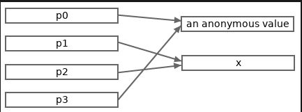

# Pokazivači u Gou

- [Pregled sistema tipova u Gou][0201]
- [Sadržaj][00]
- [Strukture u Gou](0203)

Iako Go apsorbuje mnoge karakteristike iz svih vrsta drugih jezika, Go se uglavnom smatra jezikom iz porodice C. Jedan od dokaza je da Go takođe podržava pokazivače. Go pokazivači i C pokazivači su veoma slični u mnogim aspektima, ali postoje i neke razlike između Go pokazivača i C pokazivača. Ovaj članak će navesti sve vrste koncepata i detalja vezanih za pokazivače u Gou.

## Adrese memorije

Memorijska adresa znači određena memorijska lokacija u programu.

> [!Note]
> Memorijska adresa se čuva kao neoznačena izvorna (celobrojna) reč. Veličina izvorne reči je 4 (bajta) na 32-bitnim arhitekturama i 8 (bajtova) na 64-bitnim arhitekturama. Dakle, teoretska maksimalna veličina memorijskog prostora je 2^32, odnosno 4GB (1GB == 2^30), na 32-bitnim arhitekturama, i 2^64, odnosno 16EB (exabyte) (1EB == 1024PB, 1PB == 1024TB, 1TB == 1024GB), na 64-bitnim arhitekturama.

Memorijske adrese se često predstavljaju heksadecimalnim celim literalima, kao što je 0x1234CDEF.

## Adrese vrednosti

Adresa vrednosti znači početnu adresu memorijskog segmenta koji zauzima direktni deo vrednosti.

## Šta su pokazivači?

Pokazivač je jedna vrsta tipa u programskom jeziku Go. Vrednost pokazivača se koristi za čuvanje memorijske adrese, koja je generalno adresa druge vrednosti.

Za razliku od C jezika, iz bezbednosnih razloga, postoje neka ograničenja za Go pokazivače. Molimo vas da pročitate sledeće odeljke za detalje.

## Tipovi i vrednosti Go pointera

U jeziku Go, neimenovani tip pokazivača može biti predstavljen sa **\*T**, gde **T** može biti proizvoljan tip. Tip **T** se naziva osnovni tip pokazivača tipa **\*T**.

Možemo deklarisati imenovane tipove pokazivača, ali generalno se ne preporučuje korišćenje imenovanih tipova pokazivača, jer neimenovani tipovi pokazivača imaju bolju čitljivost.

Ako je osnovni tip imenovanog tipa pokazivača **\*T**, onda je osnovni tip imenovanog tipa pokazivača **T**.

Dva neimenovana tipa pokazivača sa istim osnovnim tipom su istog tipa.

Primer:

```go
*int  // An unnamed pointer type whose base type is int.
**int // An unnamed pointer type whose base type is *int.

// Ptr is a named pointer type whose base type is int.
type Ptr *int

// PP is a named pointer type whose base type is Ptr.
type PP *Ptr
```

Nulte vrednosti bilo kog tipa pokazivača su predstavljene sa unapred deklarisanim **nil**. Nijedna adresa se ne čuva u vrednostima pokazivača tipa **nil**.

Vrednost tipa pokazivača čiji je osnovni tip **T** može da čuva samo adrese vrednosti tipa **T**.

## O reči "referenca"

U jeziku Go 101, reč "referenca" označava relaciju. Na primer, ako vrednost pokazivača čuva adresu druge vrednosti, onda možemo reći da vrednost pokazivača (direktno) referencira drugu vrednost, a druga vrednost ima barem jednu referencu. Upotreba reči „referenca“ u jeziku Go 101 je u skladu sa specifikacijom jezika Go.

Kada vrednost pokazivača upućuje na drugu vrednost, često kažemo i da vrednost pokazivača ukazuje na drugu vrednost.

## Kako dobiti vrednost pokazivača i šta su adresabilne vrednosti?

Postoje dva načina da se dobije vrednost pokazivača koja nije nula.

- Ugrađena **new** funkcija može se koristiti za dodeljivanje memorije za vrednost bilo kog tipa. **new(T)** dodeliće memoriju za **T** vrednost (anonimnu promenljivu) i vratiti adresu vrednosti **T**. Dodeljena vrednost je nulta vrednost tipa **T**. Vraćena adresa se posmatra kao pokazivačka vrednost tipa **\*T**.

- Takođe možemo uzeti adrese vrednosti koje su adresabilne u Gou. Za adresabilnu vrednost tipa **T**, možemo koristiti izraz **&t** da uzmemo adresu **t**, gde **&** je operator za uzimanje adresa vrednosti. Tip **&t** se posmatra kao ***T**.

Generalno govoreći, adresabilna vrednost znači vrednost koja se nalazi negde u memoriji. Trenutno, samo treba da znamo da su sve promenljive adresabilne, dok su

- konstante,
- pozivi funkcija i
- eksplicitni rezultati konverzije

neadresabilni. Kada se promenljiva deklariše, Go runtime će dodeliti deo memorije za tu promenljivu. Početna adresa tog dela memorije je adresa promenljive.

Kasnije ćemo naučiti o drugim adresabilnim i neadresabilnim vrednostima iz drugih članaka. Ako ste već upoznati sa jezikom Go, možete pročitati ovaj rezime da biste dobili liste adresabilnih i neadresabilnih vrednosti u jeziku Go.

U sledećem odeljku će biti prikazan primer kako se dobijaju vrednosti pokazivača.

## Dereferenciranje pokazivača

Ako je data vrednost pokazivača **p** tipa pokazivača čiji je osnovni tip **T**, kako možete dobiti vrednost na adresi sačuvanoj u pokazivaču (tj. vrednosti na koju pokazivač referencira)? Samo koristite izraz **\*p**, gde **\*** se naziva operator dereferenciranja. **\*p** se naziva dereferenciranje pokazivača **p**.

Dereferenciranje pokazivača je inverzni proces od uzimanja adrese. Rezultat **\*p** je vrednost tipa **T** (osnovni tip tipa **p**).

Dereferenciranje pokazivača **nil** izaziva paniku tokom izvršavanja.

Sledeći program prikazuje neke primere preuzimanja adresa i dereferenciranja pokazivača:

```go
package main

import "fmt"

func main() {
    p0 := new(int)   // p0 points to a zero int value.
    fmt.Println(p0)  // (a hex address string)
    fmt.Println(*p0) // 0

    // x is a copy of the value at
    // the address stored in p0.
    x := *p0
    // Both take the address of x.
    // x, *p1 and *p2 represent the same value.
    p1, p2 := &x, &x
    fmt.Println(p1 == p2) // true
    fmt.Println(p0 == p1) // false
    p3 := &*p0 // <=> p3 := &(*p0) <=> p3 := p0
    // Now, p3 and p0 store the same address.
    fmt.Println(p0 == p3) // true
    *p0, *p1 = 123, 789
    fmt.Println(*p2, x, *p3) // 789 789 123

    fmt.Printf("%T, %T \n", *p0, x) // int, int
    fmt.Printf("%T, %T \n", p0, p1) // *int, *int
}
```

Sledeća slika prikazuje odnose vrednosti korišćenih u gornjem programu.



## Zašto su nam potrebni pokazivači

Hajde prvo da pogledamo primer.

```go
package main

import "fmt"

func double(x int) {
    x += x
}

func main() {
    var a = 3
    double(a)
    fmt.Println(a) // 3
}
```

Očekuje se da funkcija *double* u gornjem primeru modifikuje ulazni argument tako što ga udvostruči. Međutim, to ne uspeva. Zašto? Zato što su sva dodeljivanja vrednosti, uključujući i prosleđivanje argumenata funkcije, kopiranje vrednosti u Go-u. Ono što je *double* funkcija modifikovala je kopija (x) promenljive *a*, ali ne samu promenljivu *a*.

Jedno rešenje za ispravljanje gore navedene *double* funkcije jeste da joj dozvolite da vrati rezultat modifikacije. Ovo rešenje ne funkcioniše uvek za sve scenarije.

Sledeći primer prikazuje drugo rešenje, korišćenjem parametra pokazivača.

```go
package main

import "fmt"

func double(x *int) {
    *x += *x
    x = nil // the line is just for explanation purpose
}

func main() {
    var a = 3
    double(&a)
    fmt.Println(a) // 6
    
    p := &a
    double(p)
    fmt.Println(a, p == nil) // 12 false
}
```

Možemo otkriti da, promenom parametra u tip pokazivača, prosleđeni argument pokazivača *&a* i njegova kopija *x* korišćena u telu funkcije oba referenciraju istu vrednost, tako da je modifikacija na *\*x* ekvivalentna modifikaciji na *\*p*, odnosno promenljivoj *a*. Drugim rečima, modifikacija u telu *double* funkcije sada se može odraziti van funkcije.

Sigurno je da se modifikacija same kopije argumenta prosleđenog pokazivača i dalje ne može odraziti na argument prosleđenog pokazivača. Nakon drugog double poziva funkcije, lokalni pokazivač p se ne modifikuje u **nil**.

Ukratko, pokazivači pružaju indirektne načine za pristup vrednostima. Mnogi jezici nemaju koncept pokazivača. Međutim, pokazivači su samo skriveni pod drugim konceptima u tim jezicima.

> [!Note]
> Povratni pokazivači lokalnih promenljivih su bezbedni u Go-u

Za razliku od C jezika, Go je jezik koji podržava sakupljanje smeća, tako da je vraćanje adrese lokalne promenljive apsolutno bezbedno u Go-u.

```go
func newInt() *int {
    a := 3
    return &a
}
```

## Ograničenja pokazivača u programu Go

Iz bezbednosnih razloga, Go pravi neka ograničenja za pokazivače (u poređenju sa pokazivačima u C jeziku). Primenom ovih ograničenja, Go zadržava prednosti pokazivača, a istovremeno izbegava opasnosti koje pokazivači predstavljaju.

**Vrednosti pokazivača u Gou ne podržavaju aritmetičke operacije**:

U programu Go, pokazivači ne mogu da obavljaju aritmetičke operacije. Za pokazivač p, p++ i p-2 su oba nedozvoljena.

Ako je p pokazivač na numeričku vrednost, kompajleri će smatrati **\*p++** legalnim iskazom i tretirati ga kao **(*p)++**. Drugim rečima, prioritet operatora dereferenciranja pokazivača **\*** je veći od operatora inkrementa **++** i operatora dekrementa **--**.

Primer:

```go
package main

import "fmt"

func main() {
    a := int64(5)
    p := &a

    // The following two lines don't compile.
    /*
    p++
    p = (&a) + 8
    */

    *p++
    fmt.Println(*p, a)   // 6 6
    fmt.Println(p == &a) // true

    *&a++
    *&*&a++
    **&p++
    *&*p++
    fmt.Println(*p, a) // 10 10
}
```

**Vrednost pokazivača ne može biti konvertovana u proizvoljni tip pokazivača**:

U programskom jeziku Go, vrednost pokazivača tipa pokazivača **T1** može se direktno i eksplicitno konvertovati u drugi tip pokazivača **T2**samo ako je zadovoljen bilo koji od sledeća dva uslova.

- Osnovni tipovi tipa **T1** i **T2** su identični (ignorišući oznake struktura), posebno ako je bilo koji od **T1** i **T2** neimenovani tip i njihovi osnovni tipovi su identični (uzimajući u obzir oznake struktura), onda konverzija može biti implicitna. Strukturni tipovi i vrednosti biće objašnjeni u sledećem članku.

- Tipovi **T1** i **T2** su neimenovani tipovi pokazivača, a osnovni tipovi njihovih osnovnih tipova su identični (ignorišemo oznake struktura).

Na primer, za dole prikazane tipove pokazivača:

```go
type MyInt int64

type Ta    *int64
type Tb    *MyInt
```

postoje sledeće činjenice:

- Vrednosti tipa \*int64 mogu se implicitno konvertovati u tip Ta, i obrnuto, jer su im oba osnovna tipa \*int64.

- Vrednosti tipa \*MyInt mogu se implicitno konvertovati u tip Tb, i obrnuto, jer su im oba osnovna tipa \*MyInt.

- Vrednosti tipa \*MyInt mogu se eksplicitno konvertovati u tip \*int64, i obrnuto, jer su obe neimenovane i osnovni tipovi njihovih osnovnih tipova su oba int64.

- Vrednosti tipa Ta ne mogu se direktno konvertovati u tip Tb, čak ni eksplicitno. Međutim, na osnovu upravo navedenih prve tri činjenice, vrednost tipa Ta može se indirektno konvertovati u tip Tb ugnežđavanjem tri eksplicitne konverzije, Tb((*MyInt)((*int64)(pa))).

Nijedan od ovih tipova pokazivača ne može se konvertovati u tip *uint64, ni na jedan bezbedan način.

Vrednost pokazivača se ne može upoređivati sa vrednostima proizvoljnog tipa pokazivača.

U Gou pokazivači se mogu upoređivati pomoću operatora **==** i **!=**. Dve vrednosti pokazivača u programu Go mogu se upoređivati samo ako je ispunjen bilo koji od sledeća tri uslova.

- Tipovi dva Go pokazivača su identični.
- Jedna vrednost pokazivača može se implicitno konvertovati u tip pokazivača druge vrednosti. Drugim rečima, osnovni tipovi dva tipa moraju biti identični i bilo koji od dva tipa dva Go pokazivača je neimenovani tip.
- Jedan i samo jedan od dva pokazivača je predstavljen golim (netipizovanim) **nil** identifikatorom.

Primer:

```go
package main

func main() {
    type MyInt int64
    type Ta    *int64
    type Tb    *MyInt

    // 4 nil pointers of different types.
    var pa0 Ta
    var pa1 *int64
    var pb0 Tb
    var pb1 *MyInt

    // The following 6 lines all compile okay.
    // The comparison results are all true.
    _ = pa0 == pa1
    _ = pb0 == pb1
    _ = pa0 == nil
    _ = pa1 == nil
    _ = pb0 == nil
    _ = pb1 == nil

    // None of the following 3 lines compile ok.
    /*
    _ = pa0 == pb0
    _ = pa1 == pb1
    _ = pa0 == Tb(nil)
    */
}
```

**Vrednost pokazivača ne može biti dodeljena vrednostima pokazivača drugih tipova pokazivača**:

Uslovi za dodeljivanje vrednosti pokazivača drugoj vrednosti pokazivača su isti kao i uslovi za poređenje vrednosti pokazivača sa drugom vrednošću pokazivača, koji su navedeni gore.

**Moguće je prekinuti ograničenja pokazivača Go**:

Kao što je pomenuto na početku ovog članka, mehanizmi (tačnije, tip **unsafe.Pointer**) koje pruža standardni unsafepaket mogu se koristiti za prevazilaženje ograničenja napravljenih za pokazivače u programskom jeziku Go. Tip **unsafe.Pointer** je sličan tipu **void*** u C-u. Generalno, nebezbedni načini se ne preporučuju za upotrebu.

- [Pregled sistema tipova u Gou][0201]
- [Sadržaj][00]
- [Strukture u Gou][0203]

[0201]: 0201_Pregled_sistema_tipova%20u_Go.md
[00]: 00_Sadrzaj.md
[0203]: 0203_Strukture_u_Gou.md
