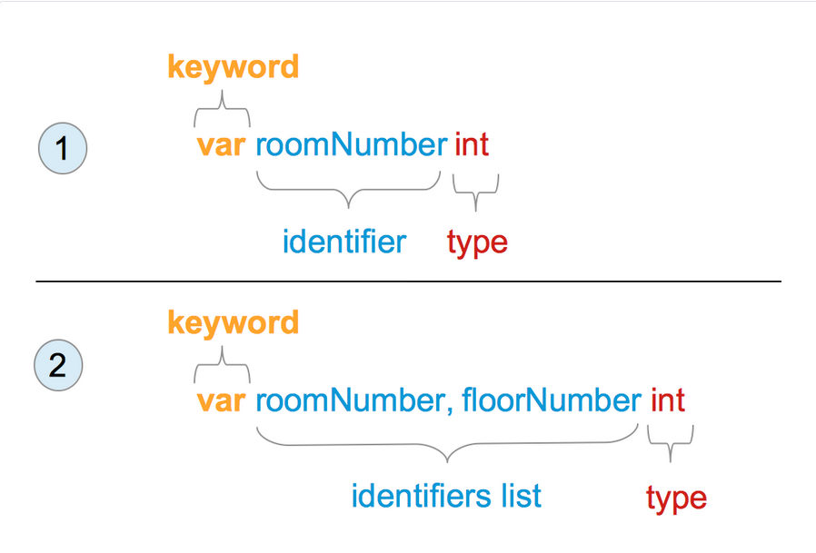
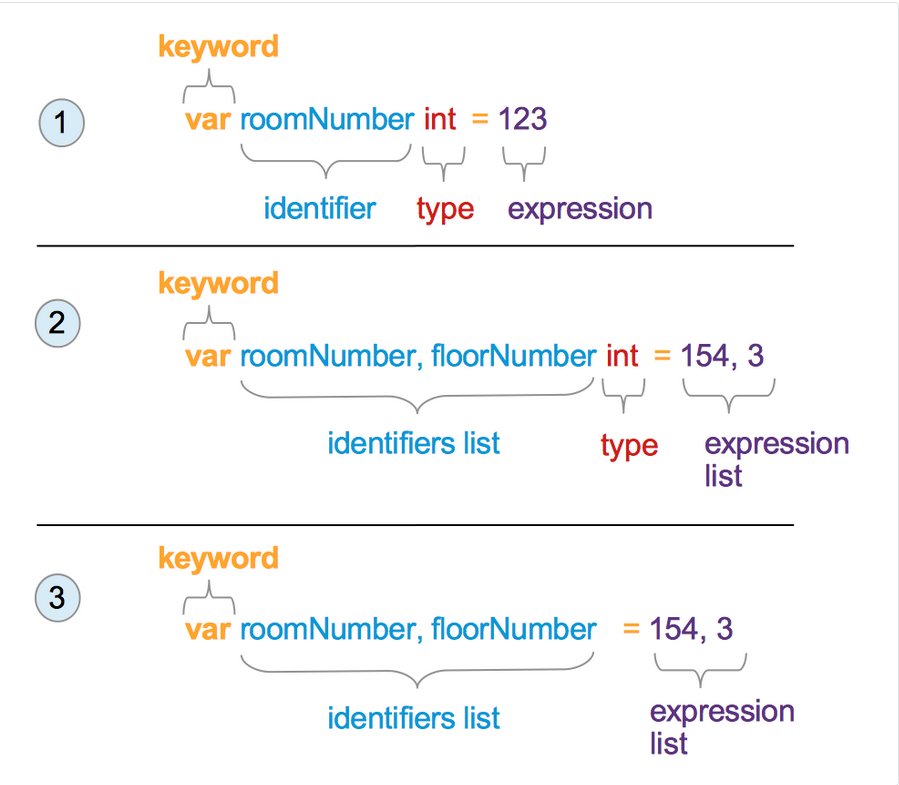
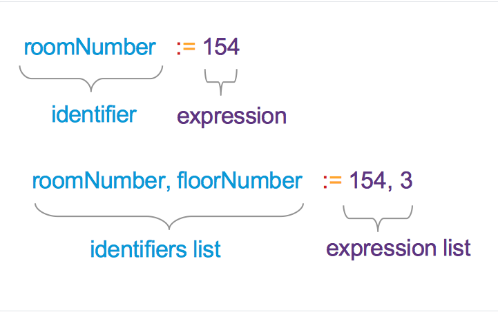
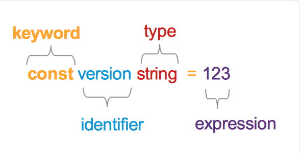

# 8 Promenljive, konstante i osnovni tipovi

[07 Heksadecimalni, oktalni, ASCII, Unicode, UTF-8 i rune][07]  
[00 Sadržaj][00]  
[09 Kontrolni izrazi][09]

**Šta ćete naučiti u ovom poglavlju?**

- Šta je promenljiva? Zašto su nam potrebne?
- Šta je tip?
- Kako kreirati promenljivu?
- Kako dodeliti vrednost promenljivoj?
- Kako koristiti promenljive?
- Šta je konstanta? Koje su razlike između konstante i promenljive?
- Kako definisati konstantu?
- Kako koristiti konstante?

**Obrađeni tehnički koncepti

- Promenljiva
- Konstantno
- Tip
- Netipizovane konstante

## Promenljive

Promenljiva je prostor u memoriji računara koji može da sadrži promenljivi podatak. Termin "promenljiva" potiče od latinske reči "variabilis" što znači "promenljiv". U programima možemo da kreiramo promenljive koje će nam omogućiti da sačuvamo informacije za kasniju upotrebu.

Na primer, želimo da pratimo broj gostiju u hotelu. Broj gostiju je broj koji će varirati. Možemo kreirati promenljivu za čuvanje ovih informacija.

### Gde se čuvaju promenljive

Već smo ranije govorili o ROM, RAM i pomoćnoj memoriji. Gde se čuva Go promenljiva? Odgovor je kratak; ne možete birati gde će se čuvati. To je odgovornost kompajlera, a ne vaša!

### Identifikator promenljive ( naziv )

U većini programskih jezika (pa i u jeziku Go), kada kreiramo promenljivu, povezujemo je sa identifikatorom. Identifikator je "ime" promenljive. Davanje identifikatora promenljivim nam omogućava da ih brzo koristimo u našem programu. Identifikator se sastoji od slova i cifara. Identifikator promenljive će se koristiti unutar programa za označavanje vrednosti koja je sačuvana unutra. Identifikator mora biti kratak i opisalan.

Da bi kreirali identifikatore, programeri mogu biti kreativni. Ali moraju da slede ova jednostavna pravila:

- Identifikatori se sastoje od:
  - Unicode slova  
    Na primer, A, a, B, b, O...
  - Unicode cifara  
    Na primer: 0, 9, 3,...
- Identifikator mora početi slovom ili znakom donje crte "_".
- Neki identifikatori se ne mogu koristiti jer su rezervisani jezikom
- Rezervisane reči su :
  
  | . | . | . | . | . |
  | :-: | :-: | :-: | :-: | :-: |
  | break | default | func | interface | select |
  | case | defer | go | map | struct |
  | chan | else | goto | package | switch |
  | const | fallthrough | if | range | type |
  | continue | for | import | return | var |

```go
numberOfGuests
```

je validan identifikator za promenljivu.

```go
113Guests
```

nije dozvoljen identifier za promenljivu jer počinje cifrom.

## Osnovni tipovi

Možemo čuvati informacije u promenljivoj. Termin informacija je nejasan; moramo biti precizniji. Da li treba da smestimo cifre (1, 2000, 3), brojeve sa pokretnim zarezom (2,45665), tekst ("Soba 112 za nepušače")? Promenljiva ima skup dozvoljenih vrednosti koje joj možemo dodeliti. Ovaj skup je tip promenljive. Tipovi imaju imena.

Go jezik unapred deklariše skup osnovnih tipova koje možete odmah koristiti u svojim programima. Takođe možete definisati svoje tipove (videćemo to kasnije). Za sada ćemo se fokusirati samo na najčešće korišćene tipove:

- String karaktera:
  - Ime tipa : string  
    Npr : "kancelarija za upravljanje", "soba 265",...
- Neoznačeni celi brojevi
  - Imena tipova : uint, uint8, uint16, uint32, uint64  
    Npr : 2445, 676, 0, 1,...
- Celi brojevi
  - Imena tipova : int, int8, int16, int32, int64  
    Npr : -1245, 65, 78,...
- Buleove vrednosti
  - Ime tipa : bool  
    Npr : tačno, netačno
- Brojevi sa pokretnim zarezom
  - Ime tipa : float32, float64  
    Npr.: 12,67

### O brojevima 8, 16, 32 i 64

Možda ste primetili da imamo pet vrsta celih brojeva:

- int,
- int8,
- int16,
- int32,
- int64.

Isto važi i za neoznačene cele brojeve. Imamo

- uint,
- uint8,
- uint16,
- uint32 i
- uint64.

Izbor je ograničeniji za brojeve sa pokretnim zarezom: možemo koristiti

- float32 ili
- float64.

Ako želite da sačuvate broj koji nema znak, možete koristiti tipove neoznačenih celih brojeva. Ovi tipovi dolaze u 5 vrsta:

- uint8
- uint16
- uint32
- uint64
- uint

Osim poslednjeg, svakom je dodat broj. Broj odgovara broju bitova memorije dodeljenih za njegovo čuvanje.

Ako ste pročitali prvi odeljak, znate da:

- Sa 8 bitova memorije, možemo da sačuvamo decimalne brojeve od 0 do 255.
- Sa 16 bita (2 bajta) možemo da sačuvamo brojeve od 0 do 65.535.
- Sa 32 bita (4 bajta) možemo da sačuvamo brojeve od 0 do 4.294.967.295.
- Sa 64 bita (8 bajtova) možemo da sačuvamo brojeve od 0 do  18.446.744.073.709.551.615.

Možete primetiti da je maksimalna decimalna vrednost od 64 bita veoma visoka. Imajte to na umu! Ako treba da sačuvate vrednost koja ne prelazi 255, koristite uint8 umesto uint64. U suprotnom, potrošićete memoriju (jer ćete koristiti samo 8 bitova od 64 bita dodeljenih u memoriji!).

Poslednji tip je `uint`. Ako koristite ovaj tip u svom programu, memorija dodeljena za vaš neoznačeni ceo broj biće najmanje 32 bita. To će zavisiti od sistema koji će pokrenuti program. Ako je u pitanju 32-bitni sistem, biće ekvivalentno uint32. Ako je sistem 64-bitni, onda će kapacitet memorije `uint` biti identičan onom kod `uint64`. (da biste bolje razumeli razliku između 32 i 64 bita, možete pogledati prethodno poglavlje)

## Deklaracija promenljive

Ako želite da koristite promenljivu u svom programu, potrebno je da je prethodno deklarišete.

### Tri radnje koje se izvršavaju kada se deklariše promenljiva

Kada deklarišete promenljivu:

- Povezujete identifikator sa promenljivom
- Povežujete tip sa promenljivom
- Inicijalizujte vrednost promenljive na podrazumevanu vrednost tipa

Ako ste navikli na programiranje, prve dve akcije su uobičajene. Ali treća nije. Go će inicijalizovati vrednost za vas na podrazumevanu vrednost njenog tipa. Neinicijalizovane promenljive ne postoje u Go-u.

### Deklaracija promenljive bez inicijalizatora

  
Sintaksa deklaracije promenljivih

Na slici možete videti kako se deklarišu promenljive. U prvom primeru, deklarišemo jednu promenljivu tipa int pod nazivom "roomNumber". U drugom, deklarišemo dve promenljive u istom redu: "roomNuber" i "floorNumber". One su tipa `int`. Njihova vrednost će biti 0 (pošto je 0 nulta vrednost tipa int).

```go
// variables-constants-and-basic-types/declaration-without-initializer/main.go
package main

import "fmt"

func main() {
    var roomNumber, floorNumber int
    fmt.Println(roomNumber, floorNumber)

    var password string
    fmt.Println(password)
}
```

Ovaj program izlazi:

```sh
0 0 
""
```

Promenljiva "password" tipa string je inicijalizovana nultom vrednošću tipa string, što je prazan string "". Promenljive roomNumber i floorNumber su inicijalizovane na nultu vrednost tipa int, što je 0.

Prvi red izlaza programa je rezultat `fmt.Println(roomNumber,floorNumber)`. Drugi red je rezultat, `fmt.Println(password)`.

### Deklaracija promenljive sa inicijalizatorom

  
Deklaracija promenljivih sa sintaksom inicijalizacije

Takođe možete deklarisati promenljivu i direktno inicijalizovati njenu vrednost. Moguća sintaksa je opisana na slici. Uzmimo primer:

```go
// variables-constants-and-basic-types/declaration-variant/main.go
package main

import "fmt"

func main() {
    var roomNumber, floorNumber int = 154, 3
    fmt.Println(roomNumber, floorNumber)

    var password = "notSecured"
    fmt.Println(password)
}
```

U `main` funkciji, prva naredba deklariše dve promenljive "roomNumber" i "floorNumber". One su tipa int i inicijalizovane vrednostima 154 i 3. Zatim će program ispisati te promenljive.

Levo od znaka jednakosti nalazi se izraz ili lista izraza. Izraze ćemo detaljno obraditi u drugom odeljku.

Zatim definišemo promenljivu "password". Inicijalizujemo je vrednošću "notSecured". Ovde imajte na umu da se tip ne zapisuje. Go će promenljivoj dati tip vrednosti inicijalizacije. Ovde "notSecured" je tip string; dakle, tip promenljive password je string.

### Kratka deklaracija promenljive

  
Kratka deklaracija promenljive

Kratka sintaksa eliminiše ključnu reč `var`. Znak `=` se transformiše u `:=`. Ovu sintaksu možete koristiti i za definisanje više promenljivih odjednom.

```go
roomNumber := 154
```

Tip nije eksplicitno napisan. Kompilator će ga zaključiti iz izraza (ili liste izraza).

Evo jednog primera:

```go
// variables-constants-and-basic-types/short-declaration/main.go
package main

import "fmt"

func main() {
    roomNumber, floorNumber := 154, 3
    fmt.Println(roomNumber, floorNumber)
}
```

**Upozorenje**:  
Deklaracija kratke promenljive ne može se koristiti van funkcija!

```go
// will not compile
package main

vatRat := 20

func main(){

}
```

**Upozorenje**:  
Ne možete koristiti vrednost **nil** za kratku deklaraciju promenljive. Kompilator ne može da zaključi tip vaše promenljive.

## Šta je konstanta

Konstanta potiče od latinske reči "constare" što znači "čvrsto stoji". Konstanta je vrednost u vašem programu koja će stajati čvrsto, koja se neće menjati tokom izvršavanja. Promenljiva se može menjati tokom izvršavanja; konstanta se neće menjati; ona će ostati konstantna.

Na primer, možemo da sačuvamo u konstanti:

- Verzija našeg programa. Na primer: "1.3.2". Ova vrednost će ostati stabilna tokom izvršavanja programa. Promenićemo ovu vrednost kada budemo kompajlirali drugu verziju našeg programa.
- Vreme izgradnje programa.
- Šablon imejla (ako ga naša aplikacija ne može konfigurisati).
- Poruka o grešci.

Ukratko, koristite konstantu kada ste sigurni da nikada nećete morati da menjate vrednost tokom izvršavanja programa. Kažemo da je konstanta nepromenljiva. Konstante dolaze u dva oblika:  

- tipizovane i
- netipizovane.

### Tipizirane konstante

Evo jedne tipizirane konstante:

```go
const version string = "1.3.2"
```

Ključna reč `const` signalizira kompajleru da ćemo definisati konstantnu vrednost. Nakon ključne reči `const`, postavlja se identifikator konstante. U našem primeru, identifikator je "version". Tip je eksplicitno definisan (ovde string), kao i vrednost konstante (u obliku izraza).

  
Deklaracija tipizirane konstante

### Netipizirane konstante

Evo jedne netipizovane konstante:

```go
const version = "1.3.2"
```

Netipizovana konstanta:

- nema tip
- ima podrazumevani tip
- nema ograničenja

#### Netipizirana konstanta nema tip

Uzmimo primer da bismo demonstrirali prvu tačku (netipizovana konstanta nema tip)

```go
// variables-constants-and-basic-types/untyped-const/main.go
package main

import "fmt"

func main() {
    const occupancyLimit = 12

    var occupancyLimit1 uint8
    var occupancyLimit2 int64
    var occupancyLimit3 float32

    // assign our untyped const to an uint8 variable
    occupancyLimit1 = occupancyLimit

    // assign our untyped const to an int64 variable
    occupancyLimit2 = occupancyLimit

    // assign our untyped const to an float32 variable
    occupancyLimit3 = occupancyLimit

    fmt.Println(occupancyLimit1, occupancyLimit2, occupancyLimit3)
}
```

U ovom programu počinjemo definisanjem netipizovane konstante. NJeno ime je, "occupancyLimit" a vrednost 12. U ovoj fazi programa, konstanta nema određeni tip. Osim što je postavljena na celobrojnu vrednost.

Zatim definišemo 3 promenljive: "occupancyLimit1", "occupancyLimit2", "occupancyLimit2" (tipovi tih promenljivih su "uint8", "int64", "float32").

Zatim tim promenljivim dodeljujemo vrednost. Naš program se kompajlira. Vrednost naše konstante "occupancyLimit" može se staviti u promenljive različitih tipova!

#### Ali ima podrazumevani tip kada je potrebno

Da bismo razumeli pojam podrazumevanog tipa, uzmimo još jedan primer

```go
// variables-constants-and-basic-types/default-type/main.go
package main

import "fmt"

func main() {
    const occupancyLimit = 12

    var occupancyLimit4 string

    occupancyLimit4 = occupancyLimit

    fmt.Println(occupancyLimit4)
}
```

U ovom programu definišemo konstantu "occupancyLimit" koja ima vrednost 12 (ceo broj). Definišemo promenljivu "occupancyLimit4" tipa string. Zatim pokušavamo da dodelimo "occupancyLimit4" vrednost naše konstante.

Pokušavamo da konvertujemo ceo broj u string. Da li će se ovaj program kompajlirati? Odgovor je ne! Greška pri kompajlaciji je:

```sh
./main.go:10:19: cannot use occupancyLimit (type int) as type string in assignment
```

Netipizovana konstanta ima podrazumevani tip koji je definisan vrednošću koja joj je dodeljena prilikom kompajliranja. U našem primeru, "occupancyLimit" ima podrazumevani tip int. int se ne može dodeliti promenljivoj tip string.

Podrazumevani tipovi netipizovanih konstanti su:

- bool (za bilo koju bulovu vrednost)
- runa (za bilo koju vrednost rune)
- int (za bilo koju celobrojnu vrednost)
- float64 (za bilo koju vrednost sa pokretnim zarezom)
- complex128 (za bilo koju kompleksnu vrednost)
- string (za bilo koju vrednost stringa)

```go
// variables-constants-and-basic-types/untyped-default/main.go
package main

func main() {

    // default type is bool
    const isOpen = true

    // default type is rune (alias for int32)
    const MyRune = 'r'
    
    // default type is int
    const occupancyLimit = 12
    
    // default type is float64
    const vatRate = 29.87
    
    // default type is complex128
    const complexNumber = 1 + 2i
    
    // default type is string
    const hotelName = "Gopher Hotel"

}
```

#### Netipizirana konstanta nema ograničenje

Netipizirana konstanta nema tip i ima podrazumevani tip kada je to potrebno. Vrednost netipizirane konstante može preći svoj podrazumevani tip. Takva konstanta nema tip; shodno tome, ne zavisi ni od kakvog ograničenja tipa. Uzmimo primer:

```go
// variables-constants-and-basic-types/untyped-no-limit/main.go
package main

func main() {
    // maximum value of an int is 9223372036854775807
    // 9223372036854775808 (max + 1 ) overflows int
    const profit = 9223372036854775808
    // the program compiles
}
```

U ovom programu kreiramo netipiziranu konstantu pod nazivom "profit". NJena vrednost je 89223372036854775808 što prelazi maksimalnu dozvoljenu vrednost za ceo broj ( int64 na mojoj 64-bitnoj mašini): 89223372036854775807. Ovaj program se kompajlira savršeno. Ali kada pokušamo da dodelimo ovu konstantnu vrednost tipizovanoj promenljivoj, program se neće kompajlirati. Uzmimo primer da to demonstriramo:

```go
// variables-constants-and-basic-types/untyped-no-limit-2/main.go
package main

import "fmt"

func main() {
    // maximum value of an int is 9223372036854775807
    // 9223372036854775808 (max + 1 ) overflows int
    const profit = 9223372036854775808
    var profit2 int64 = profit
    fmt.Println(profit2)
}
```

Ovaj program definiše promenljivu profit2tipa int64. Zatim pokušavamo da dodelimo vrednost profit netipizirane konstante varijabli profit2.

Hajde da pokušamo da kompajliramo program:

```sh
$ go build main.go
# command-line-arguments
./main.go:9:7: constant 9223372036854775808 overflows int64
```

Dobijamo grešku pri kompajlaciji, i to je u redu. Ono što pokušavamo da uradimo je nedozvoljeno.

### Zašto koristiti konstante?

- Poboljšavate čitljivost svojih programa
  - Konstantni identifikator, ako je dobro izabran, daće čitaocu više informacija nego sirova vrednost

Uporedite ovo:

```go
loc, err := time.LoadLocation(UKTimezoneName)
if err != nil {
  return nil, err
}
```

sa ovim:

```go
loc, err := time.LoadLocation("Europe/London")
if err != nil {
  return nil, err
}
```

Koristimo konstantu "UKTimezoneName" umesto sirove vrednosti "Europe/London". Sakrivamo složenost stringa vremenske zone od čitaoca. Pored toga, čitalac će razumeti koja je bila naša namera; želimo da učitamo lokaciju Ujedinjenog Kraljevstva.

- Dozvoljavate potencijalnu ponovnu upotrebu vrednosti (od strane drugog programa ili u vašem sopstvenom programu)
- Kompilator bi mogao da poboljša proizvedeni mašinski kod. Kažete kompilatoru da se ova vrednost nikada neće promeniti; ako je kompilator pametan (a jeste), on će je genijalno iskoristiti.

## Izbor identifikatora (imena promenljivih, imena konstanti)

Imenovanje promenljivih i konstanti nije lak zadatak. Kada birate ime, morate biti sigurni da izabrano ime daje pravu količinu informacija o svojoj oznaci. Ostali programeri koji rade na istom projektu biće vam zahvalni ako izaberete dobro ime identifikatora jer će čitanje koda biti lakše. Kada kažemo "preneti pravu količinu informacija", reč "ispravno" je nejasna. Ne postoje naučna pravila za imenovanje programskih konstrukcija. Iako ne postoje naučna pravila, mogu vam dati nekoliko saveta koji se dele u našoj zajednici.

- Izbegavajte imena sa jednim slovom: ona prenose premalo informacija o tome šta je sačuvano.
  - Izuzetak je za brojače koji se često imenuju sa i (unutar petlji, o čemu ćemo kasnije govoriti
- Koristite camelCase: ovo je dobro uspostavljena konvencija u go zajednici.  
  - Više volim "occupancyLimit" od "occupancy_limit" ili  "occupancy-limit".
- Ne više od dve reči  
  - "profitValue" je dobro,
  - "profitValueBeforeTaxMinusOperationalCosts" je predugo.
- Izbegavajte pominjanje tipa u nazivu  
  - descriptionString je loše,
  - description je bolje.
  - Go je već statički tipiziran; ne morate dati informacije o tipu čitaocu.

## Praktična primena

### Program

Napišite program koji će:

- Napraviti string konstantu "hotelName" sa imenom i vrednošću "Gopher Hotel"
- Napravite dve netipizirane konstante koje će sadržati 24,806078 i -78,243027, respektivno. Imena te dve konstante su "longitude" i "latitude". (negde na Bahamima)
- Napravite promenljivu tipa int imenovanu "occupancy" koja je inicijalizovana vrednošću 12.
- Odštampajte hotelName, longitudei u latitudenovom occupancyredu

### Dodatna pitanja

- Koji je podrazumevani tip longitude i latitude?
- Koja je vrsta longitude?
- Promenljiva "occupancy" je tipa int. Da li je to ceo broj od 64, 32 ili 8 bita?

### Objašnjenje rešenja

```go
// variables-constants-and-basic-types/mission-solution/main.go
package main

import "fmt"

func main() {
    const hotelName string = "Gopher Hotel"
    const longitude = 24.806078
    const latitude = -78.243027
    var occupancy int = 12
    fmt.Println(hotelName, longitude, latitude)
    fmt.Println(occupancy)
}
```

Počinjemo sa definicijom tipizirane konstante "hotelName" i definicijom "longitude" i "latitude" (koje su netipizirane). Zatim definišemo promenljivu "occupancy" (tip: int) i postavljamo njenu vrednost na 12. Imajte na umu da je moguća i druga sintaksa:

Kratka deklaracija promenljive

```go
occupancy := 12
```

Tip se može izostaviti u standardnoj deklaraciji:

```go
var occupancy = 12
```

Deklaraciju promenljive i dodelu možemo izvršiti u dva koraka

```go
var occupancy int   
occupancy = 12
```

### Odgovori na bonus pitanja

- Koji je podrazumevani tip "longitude" i "latitude"?  
  float64

- Koji je tip longitude?
  Nema tip, i isto važi i za latitude.

- Promenljiva "occupancy" je tipa int. Da li je to ceo broj od 64, 32 ili 8 bita?
  - intje tip koji ima veličinu specifičnu za implementaciju; na 32-bitnom računaru biće 32-bitni ceo broj (int32); na 64-bitnom računaru biće 64-bitni ceo broj (int64)

## Testirajte sebe

### Pitanje i odgovori

1. Šta je identifikator?
   - Identifikator je skup znakova sastavljen od slova i cifara.
2. Kojim tipom znaka treba da počne identifikator?
   - Slovom ili podcrtom.
3. Koji je tip promenljive?
   - Tip promenljive je skup dozvoljenih vrednosti promenljive.
4. Šta je bajt?
   - Bajt se sastoji od 8 binarnih cifara.
5. Kada deklarišete promenljivu tipa bool, koja je njena vrednost (odmah
   nakon inicijalizacije)?
   - Netačno. Kada deklarišete promenljivu, ona se inicijalizuje na
     podrazumevanu vrednost svog tipa.
6. Koje su dve glavne karakteristike netipizovane konstante?
   - Nema tip
   - Ima podrazumevani tip
   - Nema ograničenja

### Ključno

- Ime promenljive ili konstante naziva se identifikator
- Identifikatori se generalno pišu korišćenjem camelCase-a.
- Promenljive i konstante vam omogućavaju da sačuvate vrednost u memoriji
- Konstante su nepromenljive, što znači da ne možemo menjati njihovu
  vrednost tokom izvršavanja programa
- Promenljive imaju tip, koji definiše skup vrednosti koje mogu da sadrže
- Kada kreirate promenljivu, njena vrednost se inicijalizuje nultom
  vrednošću njenog tipa
- U Go-u NEMA neinicijalizovanih promenljivih.
- Postoje dve vrste konstanti
  - Tipizirane
  - Netipizirane  
    Nemaju tip osim podrazumevanog i mogu premašiti u vrednosti svoj podrazumevani tip.

[07 Heksadecimalni, oktalni, ASCII, Unicode, UTF-8 i rune][07]  
[00 Sadržaj][00]  
[09 Kontrolni izrazi][09]

[07]: 07_Hexadecimal_octal_ASCII_UTF8_Unicode_rune.md
[00]: 00_Sadržaj.md
[09]: 09_Kontrolni_izrazi.md
