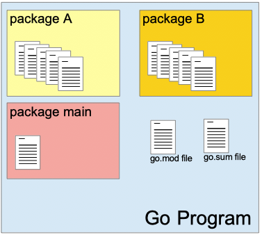
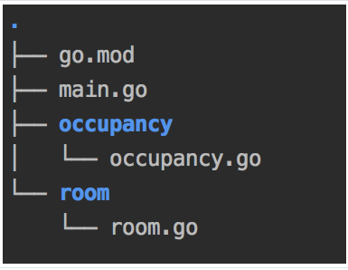
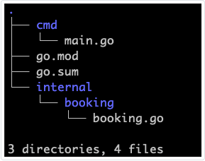
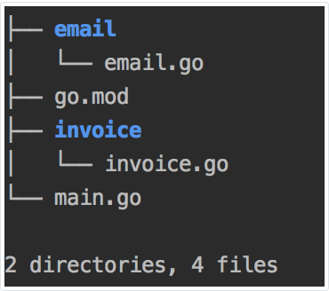

# 11 Paketi i uvoz

[10 Funkcije][10] | [00 Sadržaj][00] | [12 Inicijalizacija paketa][12]

**Šta ćete naučiti u ovom poglavlju?**

- Šta je paket?
-Kako se grupišu izvorne datoteke?
- Gde čuvati datoteku main.go?
- Kako organizovati svoj Go projekat?
- Koja je putanja uvoza? Šta su deklaracije uvoza?
- Šta je datoteka go.mod?
- Šta je modularno programiranje?
- Kako napraviti modularne aplikacije pomoću Go-a?
- Šta je interni direktorijum i zašto ga koristiti?

**Obrađena tehnička koncepta!**

- paket
- izvorna datoteka
- uvoz
- modul
- modularno programiranje

## Program, paket, izvorne datoteke

  
Go program je kombinacija paketa.

Paket se sastoji od jedne ili više izvornih datoteka. U te izvorne datoteke, Go programer deklariše:

- konstante
- promenljive
- funkcije
- tipove i metode

Paket `main` se često sastoji od jedne datoteke. Funkcija `main` je ulazna tačka programa. U Go programu ćete takođe pronaći datoteku pod nazivom `go.mod`. Sledeći odeljci će detaljno opisati sve te komponente.

## Izvorne datoteke

Ovde ćemo detaljno opisati svaki deo izvorne datoteke.

Sledeći isečak je primer izvorne datoteke u kojoj su definisane funkcija "level" i "rate":

```go
// package-imports/occupancy/occupancy.go
package occupancy

const highLimit = 70.0
const mediumLimit = 20.0

// retrieve occupancyLevel from an occupancyRate
// From 0% to 30% occupancy rate return Low
// From 30% to 60% occupancy rate return Medium
// From 60% to 100% occupancy rate return High
func level(occupancyRate float32) string {
    if occupancyRate > highLimit {
        return "High"
    } else if occupancyRate > mediumLimit {
        return "Medium"
    } else {
        return "Low"
    }
}

// compute the hotel occupancy rate
// return a percentage
// ex : 14,43 => 14,43%
func rate(roomsOccupied int, totalRooms int) float32 {
    return (float32(roomsOccupied) / float32(totalRooms)) * 100
}
```

### `package` klauzula

Na vrhu izvornog fajla nalazimo klauzulu `package`:

```go
package occupancy
```

Klauzula package je prvi red svake izvorne datoteke. Ona definiše ime trenutnog paketa.

### `import` deklaracija

Zatim ide skup deklaracija `import`. U ovom odeljku izvorne datoteke definišemo sve ostale pakete koje želimo da koristimo u ovom paketu. Ovaj paketa ne uvozi druge pakete. Uzmimo još jedan primer, evo izvorne datoteke iz paketa room:

```go
// package-imports/import-declaration/room/room.go
package room

import "fmt"

// display information about a room
func printDetails(roomNumber, size, nights int) {
    fmt.Println(roomNumber, ":", size, "people /", nights, " nights ")
}
```

Ovde uvozimo jedan paket: `fmt` koji je deo standardne biblioteke.

### Izvorni kod

Nakon deklaracija importa, nalazi se najvažniji deo, izvorni kod paketa. Ovde možete deklarisati promenljive, konstante, funkcije, tipove i metode.

## Organizacija datoteka

Moramo grupisati izvorne datoteke paketa u jedan direktorijum. Direktorijum mora imati isto ime kao i paket. Na primer, izvorne datoteke "baz" paketa moraju biti sačuvane u diru "baz".

### Main paket

Go program počinje inicijalizacijom `main` paketa, a zatim pokretanjem funkcije `main` iz tog paketa. Glavni paket je mesto gde vaš program počinje da radi ono za šta je napravljen.

Evo primera glavnog paketa:

```go
// package-imports/main-package/main.go
package main

import "fmt"

func init() {
    fmt.Println("launch initialization")
}

func main() {
    fmt.Println("launch the program !")
}
```

Ovaj program ima `init` funkciju. Ova funkcija može da sadrži sve zadatke inicijalizacije neophodne za ispravno pokretanje vašeg programa.

Program takođe definiše `main` funkciju. Obe funkcije nemaju tip povratka (za razliku od C-a, gde glavna funkcija mora da vrati ceo broj).

Funkcija `main` će biti izvršena nakon što se izvrše svi zadaci inicijalizacije. U ovoj funkciji obično pozivate druge pakete i implementirate svoju programsku logiku.

Izlaz prethodnog programa:

```sh
launch initialization
launch the program!
```

Funkcija init je pokrenuta, a zatim glavna funkcija.

**Jedan glavni paket po projektu?**

To nije uvek slučaj, projekat može imati nekoliko glavnih paketa i samim tim nekoliko glavnih funkcija. Obično su različiti glavni paketi prisutni u velikim projektima. Evo nekih uobičajenih primera:

- Glavni paket za pokretanje veb servera aplikacije
- Još jedan glavni paket za pokretanje planiranog održavanja baze podataka
- Još jedan koji je razvijen za specifičnu tačnu intervenciju...

Na primer, Kubernetes (jedan od najpopularnijih Go projekata) u vreme ovog pisanja ovog teksta sadrži 20 glavnih paketa.

**Da li treba da nazovem datoteku koja sadrži moj glavni paket main.go?**

Ne, to nije obaveza. Možete to uraditi ako imate samo jednu glavnu funkciju u svom projektu. Ali često je dobra praksa dati joj informativno ime.

Na primer, u projektu Kubernetes možete pronaći sledeće datoteke koje sadrže glavni paket:

- check_cli_conventions.go
- gen_cubectl_documents.go

Možemo zaključiti šta program radi samo gledajući njegovo ime: prvi će proveriti da li se poštuju CLI konvencije, drugi će generisati dokumentaciju.

Molimo vas da se pridržavate ove konvencije. Ona omogućava drugim programerima da razumeju šta program radi gledajući stablo datoteka.

**Naši glavni paketi se čuvaju u određenom direktorijumu?**

Ponovo, u Go specifikaciji nije napisano ništa o diru koji bi trebalo da sadrži glavni paket. I dalje postoji snažna upotreba da glavni paketi treba da se nalaze unutar cmd/ foldera u korenu repozitorijuma.

### Datoteka go.mod

Evo primera datoteke go.mod:

```go
module maximilien-andile.com/myProg

go 1.13
```

**Putanja modula**:

Prvi red se sastoji od reči `module` nakon čega sledi putanja do modula.

Ovde uvodimo pojam modula. Oni nisu oduvek postojali u Gou; uvedeni su oko marta 2019. Detaljno ćemo objasniti šta su moduli i kako ih koristiti u drugom odeljku. Za sada, zapamtite da je modul "kolekcija Go paketa smeštenih u stablu datoteka sa datotekom go.mod u korenu". Kada dodamo glavni paket modulu, pravimo ga programom koji se može kompajlirati i izvršiti.

Potrebno je da definišemo putanju modula za naš modul (naš program). Putanja je jedinstvena lokacija modula. Evo nekoliko primera putanja za dva poznata Go programa.

Hašikorp trezor:

```go
module github.com/hashicorp/vault
```

Kubernetes:

```go
module k8s.io/kubernetes
```

"github.com/hashicorp/vault" je URL adresa do Github repozitorijuma. Github repozitorijum je dir koji sadrži izvorni kod projekta. Ovaj dir može biti javno dostupan (tj. svima koji imaju link) ili privatan. U ovom drugom slučaju, kod je dostupan samo ovlašćenim programerima. Ako imate pristup repozitorijumu koji sadrži `go.mod` datoteku, možete je uvesti u svoj projekat. Kasnije ćemo videti kako to funkcioniše.

Imajte na umu da vaš program neće biti automatski deljen ili izložen od strane Go-a ako izaberete udaljenu putanju! U svrhu testiranja, možete izabrati putanju koja nije URL:

```go
module thisIsATest

go 1.13
```

**Očekivana Go verzija**:

Sledeći red datoteke `go.mod` deklariše očekivanu verziju Goa. U ovom programu očekuje se verzija 1.13 Goa. Postavljanjem ove verzije, kažemo drugim programerima da je naš projekat razvijen sa ovom specifičnom verzijom Goa. Za 10 godina, Go će evoluirati i neke stvari koje sada koristimo u našem programu verovatno više neće postojati. Programeri iz budućnosti će znati kako da ga kompajliraju.

**Primer programa**.



Program se sastoji od 2 direktorijuma (podebljanih):

- occupancy
- room

Svaki direktorijum se sastoji od jedne go datoteke. Datoteka sadrži ime direktorijuma. Svaki dir  predstavlja paket.

"room.go"

```go
package room

const roomText = "%d : %d people / %d nights"
```

"occupancy.go"

```go
package occupancy

const highLimit = 70.0
```

U korenskom direktorijumu programa možemo pronaći datoteku `go.mod` zajedno sa datotekom `main.go`.

"go.mod""

```go
module thisIsATest

go 1.13
```

"main.go (ulazna tačka)"

```go
package main

import "fmt"

func main() {
   fmt.Println("program started")
}
```

Hajde da pokušamo da ga izgradimo i izvršimo:

```sh
$ go build main.go
$./main
program started
```

Program ne radi ništa osim što ispisuje string "program pokrenut". U svakom od dva paketa definisali smo konstantu. Te dve konstante se nikada ne koriste.

### Praktična primena

Dodajte paket pod nazivom "booking" prethodnom Go programu. U ovom paketu:

- Definišite konstantu "vatRate" sa vrednošću 20.0
- Definišite funkciju pod nazivom "printVatRate" koja će ispisati na standardni izlaz konstantu "vatRate" praćenu znakom procenta.

Paket se sastoji od direktorijuma i najmanje jedne izvorne datoteke. Ako želimo da kreiramo paket "booking" trebalo bi da:

- Napravimo direktorijum pod nazivom "booking"
- Napravite datoteku u ovom direktorijumu. Naziv datoteke će biti "booking.go".

Evo izvornog fajla "booking.go":

```go
// package-imports/application-add-package/booking/booking.go
package booking

import "fmt"

const vatRate = 20.0

func printVatRate() {
    fmt.Printf("%.2f %%", vatRate)
}
```

## Modularno programiranje

Možemo definisati program u jednoj datoteci `main.go`. To smo već uradili. Legalno je; vaš kod će se kompajlirati. Legalno je, ali nije najbolje rešenje. Da bismo razumeli zašto, potrebno je da definišemo koncept "modularnog programiranja".

Ta pitanja nisu nova u softverskom inženjerstvu i mnogi programeri su ih ranije postavljali. Tokom šezdesetih, programeri softvera su se mučili da održe kodne baze. Softver je dizajniran kao jedan monolit sa intenzivnom upotrebom GOTO naredbi. Kodna baza nekih projekata je postala teška za razumevanje zbog ovakvog dizajna.

Zajednici je bio potreban bolji način razvoja. To je bio početak razmišljanja o modularnom programiranju.

### Šta je modul

Da bismo definisali modul, koristićemo Gotjeovu standardnu definiciju.

Modul je deo koda koji:

- Obavlja određeni zadatak
- Sa dobro definisanim ulazima i izlazima
- Može nezavisno testirati

Veliki projekat koji zahteva obavljanje nekoliko zadataka može se podeliti na različite zadatke, od kojih se svaki nalazi unutar modula sa dobro definisanim API-jem i koji se može testirati nezavisno od drugih sistema.

### Očekivane koristi od modularnog programiranja

Možemo identifikovati tri glavne prednosti:

- Ako gradite svoje sisteme koristeći module, možete naterati svoj tim da radi na različitim modulima nezavisno, što povećava očekivanu produktivnost članova tima. Na primer, pozicionirate dva programera na modulu A, a još dva na modulu B. Dve grupe se neće međusobno blokirati ako ste jasno definisali API dva modula. Module mogu implementirati i drugi čak i ako još nisu završeni.

- Moduli povećavaju fleksibilnost razvoja. Možete isporučivati izolovane funkcije u modulima bez potrebe za velikim promenama u postojećoj kodnoj bazi vašeg sistema.

- Programeri mogu lako razumeti kod organizovan u module. Veliki sistem sa mnogo struktura, interfejsa i datoteka je teško razumeti. Pridruživanje projektu koji ima hiljade datoteka je teško. Sistem sastavljen od modula zahteva manje energije za razumevanje, moduli se mogu iterativno proučavati. Modularnost olakšava razumevanje sistema od strane programera (posebno novih članova u timu).

### Kako razložiti program na module

Dekompozicija sistema na module može biti teška. Ne postoji jedinstven odgovor na ovo pitanje. Evo nekoliko saveta koji su zasnovani na iskustvu i mojim čitanjima:

- Ne kreirajte modul za svaki pojedinačni zadatak sistema; završićete sa previše modula sa premalom veličinom.

- Umesto toga, kreirajte module koji grupišu bliske funkcionalnosti, na primer, modul za rukovanje upitima baze podataka, modul za rukovanje evidentiranjem.

- Unutar vaših modula, kod je obično čvrsto povezan, što znači da su različiti delovi vašeg modula snažno povezani.

- Između dva modula trebalo bi da sprovedete labavo povezivanje. Svaki modul se tretira kao komponenta i svakoj komponenti nije potrebna druga komponenta da bi radila. Moduli treba da budu nezavisni. To vam omogućava da zamenite jedan modul drugim bez dodirivanja ostalih modula.

## Modularno programiranje / Go moduli / Go paketi

Uveli smo tri pojma:

- Modularno programiranje
- Go paketi
- Go moduli

Ova tri pojma su povezana. Modularno programiranje je način pisanja programa. Programer treba da kreira testirane delove koda koji obavljaju određene zadatke sa dobro definisanim izlazom i rezultatom. Ova "metoda" se može primeniti u C, Java, C++, Go...

- Go paketi su alat koji možete koristiti za pisanje modularnih programa. U Go paketu:
  - Možemo grupisati izvorne datoteke sa funkcijama (ili metodama) koje se odnose na određenu funkcionalnost:  
    - Napr: rezervacija paketa koja će obrađivati rezervacije za hotel: kreiranje rezervacije, potvrda rezervacije, otkazivanje rezervacije...
    - Npr: paket soba koji će grupisati funkcije vezane za hotelske sobe: prikaz informacija o sobi, provera njene trenutne popunjenosti...
  - Možemo pisati testove koje možemo pokretati nezavisno od ostatka koda. (videćemo kako se to radi u poglavlju o jediničnom testiranju)
- Go moduli su način grupisanja paketa zajedno kako bi se formirala aplikacija ili biblioteka.

### Konvencija imenovanja paketa

Pronalaženje dobrog imena za paket je važno. Drugi programeri će koristiti ime paketa u svom izvornom kodu, stoga mora biti informativno, ali i kratko. Mnogo članaka na blogovima je napisano o ovoj temi. U ovom odeljku ću vam dati nekoliko saveta kako da mudro izaberete ime svog paketa:

- Ime koje izaberete mora biti kratko. Po mom mišljenju, ne više od deset slova je dobra dužina. Uzmite primer iz standardne biblioteke. Imena paketa su veoma kratka, često sastavljena od jedne reči.

- Ime mora da nosi bitne informacije. Dobar test je da pitate nekoga šta vaš paket radi, a da mu ne pokažete izvorni kod. Loš odgovor bi trebalo da vas natera da još jednom razmislite o imenu.

- Imena paketa mogu biti napisana snake_case kao "my_name", ništa u specifikaciji nije napisano o tome, ali je uobičajeno u Go zajednici da se koristi camelCase kao "myPackageName".

### Jedinstvenost imena paketa

Tako mala imena često zbunjuju početnike jer se plaše potencijalnih kolizija imena. Rizik od kolizije postoji, ali ne na nivou imena paketa:

- Putanja uvoza I naziv paketa moraju biti jedinstveni.

Možda je drugi programer uzeo foo kao ime paketa, ali me to ne sprečava da ga izaberem jer moj paket nema istu putanju uvoza.

- Imajte na umu da ako neko ima istu putanju uvoza kao vi i isto ime paketa, i dalje možete da kompajlirate svoj program.

### Povezivanje paketa - metod pokušaja i grešaka

U prethodnom poglavlju, sav kod koji smo proizveli bio je u glavnom paketu. Znamo kako da kreiramo nove pakete koji će sadržati funkcije, promenljive, konstante... Kako koristiti funkcije iz paketa "room" u glavnom paketu?

Evo našeg "room" paketa:

```go
// package-imports/trial-error/room/room.go
package room

import "fmt"

// display information about a room
func printDetails(roomNumber, size, nights int) {
    fmt.Println(roomNumber, ":", size, "people /", nights, " nights ")
}
```

Kako pozvati funkciju "printDetails" u paketu main (ulazna tačka našeg programa)? Pokušajmo da direktno pozovemo funkciju:

```go
// package-imports/trial-error/main.go
package main

func main() {
    printDetails(112, 3, 2)
}
```

Ako kompajliramo ovaj program, dobićemo ovu grešku:

```sh
./main.go:4:2: undefined: printDetails
```

Funkcija "printDetails", koju pokušavamo da pozovemo, nije definisana u glavnom paketu. Međutim, funkcija je definisana u "package room". Želimo da uvezemo "package room" u glavni paket. Da bi uvoz mogao da funkcioniše, moramo reći da je naš program Go modul.

Da bismo to uradili, potrebno je da kreiramo datoteku `go.mod` u korenu našeg projekta:

```go
module thisIsATest2

go 1.13
```

Putanja modula je podešena na "thisIsATest2". Možete izabrati drugu.

Zatim možemo da uvezemo paket sobe u našu glavnu funkciju:

```go
// package-imports/trial-error-2/main.go
package main

import "thisIsATest2/room"

func main() {
    printDetails(112, 3, 2)
}
```

Hajde da pokušamo da napravimo naš program. Dobili smo poruku o grešci:

```sh
./main.go:3:8: imported and not used: "thisIsATest2/room"
./main.go:6:2: undefined: printDetails
```

Ova greška kaže da:

- Uvozimo paket bez njegovog korišćenja.
- Funkcija "printDetails" još uvek nije definisana.

Go nema pojma da želimo da koristimo "printDetails" iz paketa "room". Da bismo ga obavestili, možemo koristiti ovu notaciju:

```go
room.printDetails(112, 3, 2)
```

To znači: "pozovite funkciju printDetails iz paketa room". Hajde da pokušamo:

```go
// package-imports/trial-error-3/main.go
package main

import "thisIsATest2/room"

func main() {
    room.printDetails(112, 3, 2)
}
```

Ako kompajliramo, dobićemo još jednu grešku:

```go
./main.go:6:2: cannot refer to unexported name room.printDetails
./main.go:6:2: undefined: room.printDetails
```

To nam daje indikaciju: ne možemo da pozovemo funkciju jer nije izvezena... Moramo da izvezemo funkciju da bi bila vidljiva drugima! Da biste to uradili u programskom jeziku Go, morate da koristite veliko slovo na prvom slovu funkcije.

Ovo je nova verzija izvornog fajla paketa "room":

```go
// room/room.go
package room

import "fmt"

// display information about a room
func PrintDetails(roomNumber, size, nights int) {
   fmt.Println(roomNumber, ":", size, "people /", nights, " nights ")
}
```

Funkcija "printDetails" je preimenovana u "PrintDetails".

I ovo je naša glavna funkcija:

```go
// package-imports/trial-error-4/main.go
package main

import "thisIsATest2/room"

func main() {
    room.PrintDetails(112, 3, 2)
}
```

Poziv funkcije je promenjen kako bi odražavao novo ime metode (room.PrintDetails). Sada možemo pokrenuti kompajliranje programa:

```sh
go build main.go
```

I izvršenje:

```sh
$./main
112 : 3 people / 2  nights
```

Ura! Radi. Koristili smo izvezenu funkciju iz drugog paketa u glavni paket.

**Zaključci**:

- Funkcija, promenljiva i konstanta, ako se ne izvezu, privatne su za paket gde su definisane.
- Da biste nešto izvezli, jednostavno transformišite prvo slovo njegovog identifikatora u veliko slovo

```go
// package-imports/package-example/price/price.go
package price

// this function is not exported
// we cannot use it in another package
func compute(){
    //
}

// this function is exported
// it can be used in another package
func Update(){
    //...
}
```

**Preciznosti vokabulara**:

- Možda ćete čuti od drugih programera da koriste termine public ili private. Ovi termini su ekvivalentni terminima exported / unexported u Go. Drugi jezici ih koriste da označe istu stvar. Ovo nije zvanična Go terminologija.

- Primer upotrebe: "Mmm, zašto ste ovu funkciju učinili javnom, ona se čak ni ne koristi van vašeg paketa?"  
- Primer upotrebe: "Bobe, trebalo bi da razmisliš o tome da ovu metodu učiniš privatnom"
- Termin "vidljivost" odnosi se na izvezeni/neizvezeni kvalitet metode.  
  Primer upotrebe: "Kolika je vidljivost ove konstante? Privatna je."

## Put importa i deklaracija za import

Da biste uvezli paket u drugi paket, potrebno je da znate njegovu putanju uvoza. Videćemo kako da je odredimo u prvom odeljku.

Kada znate putanju uvoza, morate napisati deklaraciju uvoza. Ovo je predmet sledećeg odeljka.

### Putanja importa

Go specifikacije ne određuju precizno putanju uvoza. Putanja uvoza je string koji mora jedinstveno identifikovati modul među svim postojećim modulima. Sistem za izgradnju će ih koristiti za preuzimanje izvornog koda vaših uvezenih paketa i izgradnju vašeg programa. Danas se Go sistem za izgradnju (čiji se kod nalazi u paketu go/build) oslanja na različite tipove putanja:

- Standardna putanja biblioteke
  - Izvorne datoteke koje ćemo koristiti za izgradnju vašeg programa se podrazumevano nalaze u "/usr/local/go/src" (za korisnike Linux-a i Mac-a) i u "C:\Go\src" za korisnike Windows-a.  
  Primer : fmt, time...

- URL adresa koja vodi do veb stranice za deljenje koda.
  - Go ima unapred instaliranu podršku za sledeće veb stranice za deljenje koda koje koriste Git kao sistem za kontrolu verzija (VCS): Githab, Gitlab, Bitbucket.

  - URL adresa može biti objavljena na internetu (na primer, projekat otvorenog koda hostovan na Githabu)  
    Primer: <gitlab.com/loir402/foo>

  - Takođe može biti izložen samo u vašoj lokalnoj/kompanijskoj mreži  
    Primer: <acme-corp.company.gitlab.com/loir402/foo>

- Lokalna putanja ili relativna putanja
  Kada je Go uveo module, ova vrsta putanje uvoza više nije norma, čak i ako Go sistem za izgradnju to podržava.

Prilikom preuzimanja paketa, Go će proveriti tip VCS sistema koji se koristi u HTTP odgovoru (unutar meta oznake). Ako nije naveden, trebalo bi da dodate tip VCS sistema koji se koristi u putanju uvoza. Evo primera iz zvanične Go dokumentacije: <example.org/repo.git/foo/bar>.

**Šta je VCS? Šta je Git, Github, Gitlab?**

VCS znači "sistem za kontrolu verzija"; to je program koji je dizajniran da prati promene izvršene na izvornim datotekama projekta. VCS sistemi takođe imaju funkcije koje omogućavaju da nekoliko programera istovremeno rade na istom programu, a da se međusobno ne uznemiravaju.

Na tržištu je dostupno nekoliko VCS programa:

- Git
- Merkurial
- Bazar
- ...

Git je otvorenog koda. Veoma je poznat i danas se široko koristi. (U mom profesionalnom iskustvu, koristio sam samo Git).

Napravio ga je Linus Torvalds 2005. godine.

To je program koji možete koristiti na terminalu, ali i koristeći grafički interfejs.

Promene u izvornom kodu Go-a se upravljaju pomoću Gita.

Git je distribuirani sistem za kontrolu verzija (VCS). Pojedinačni programeri će preuzeti kopiju izvornog koda kreiranjem "lokalnog repozitorijuma". Kada je programer zadovoljan njegovim promenama, može ih poslati u udaljeni repozitorijum.

- Github, Gitlab, Bitbucket : su veb stranice koje omogućavaju programerima da hostuju izvorni kod inicijalizacijom repozitorijuma koji se nalaze na njihovim serverima.
- Te veb stranice nude i druge funkcije, ali hostovanje koda je njihova osnovna aktivnost.

Te veb stranice su odličan način da pokažete i podelite svoj rad sa drugima. One su takođe osnovni blok zajednice otvorenog koda. Toplo vam savetujem da napravite profil na toj veb stranici kako biste pokazali šta možete da uradite i pomogli drugima.

**Kako preuzeti kod iz udaljenih paket**:

Da biste preuzeli paket, koristićete `go get` komandu unutar vašeg terminala.

Na primer, ako želite da uvezete kod sa <https://github.com/graphql-go/graphql>, otvorite terminal i otkucajte:

```sh
go get github.com/graphql-go/graphql
```

O tome ćemo detaljnije govoriti u poglavlju posvećenom sistemu za upravljanje zavisnostima.

### Import deklaracija

Deklaracija uvoza navodi da ćemo koristiti neki eksterni kod u trenutnom paketu.

Uvozna deklaracija može imati različite oblike:

**Standardni uvoz**:

```go
import "gitlab.com/loir402/foo"
```

Zatim u datoteci možete pristupiti izvezenom elementu uvezenog paketa pomoću sintakse:

```go
foo.MyFunction()
```

Ovde koristimo funkciju "MyFunction" iz "foo" paketa.

**Uvoz više paketa**:

Retko imate samo jedan uvoz. Često imate nekoliko paketa za uvoz:

```go
import (
   "fmt"
   "maximilien-andile.com/application2/foo"
   "maximilien-andile.com/application2/bar"
)
```

Ovde uvozimo tri paketa. Evo njihovih putanja uvoza:

- fmt
- maximilien-andile.com/application2/foo
- maximilien-andile.com/application2/bar

**Uvoz sa eksplicitnim imenom paketa (alijasom)**:

Takođe možete dati svom paketu alijas (vrstu prezimena za paket) da biste pozivali svoje izvezene elemente pomoću ovog alijasa. Na primer:

```go
import bar "gitlab.com/loir402/foo"
```

Ovde kažemo da paket ima "bar" prezime. Možete koristiti izvezene tipove, funkcije, promenljive i konstante paketa "foo" (čija je putanja uvoza "gitlab.com/loir402") sa kvalifikatorom "bar" ovako:

```go
bar.MyFunction()
```

**Uvoz sa tačkom**:

import ."gitlab.com/loir402/foo"

Sa ovom sintaksom, sve funkcije, tipovi, promenljive i konstante biće deklarisane u trenutnom paketu. Kao posledica toga, svi izvezeni identifikatori paketa mogu se koristiti bez ikakvog kvalifikatora. Ne preporučujem upotrebu ovoga jer može postati zbunjujuće.

**Prazan uvoz**:

Sa praznim uvozom, biće pozvana samo `init` funkcija paketa. Prazan uvoz može biti naveden sledećom sintaksom:

```go
import _ "gitlab.com/loir402/foo"
```

### Interni direktorijum

Kada kreirate paket i kada je vaš program dostupan na sajtu za deljenje koda (kao što su Github, Gitlab...), drugi programeri će moći da koriste vaš paket.

Ovo je velika odgovornost za vas. Drugi programi će se oslanjati na vaš kod. To znači da kada promenite funkciju ili ime izvezenog identifikatora, drugi kod može da se pokvari.

Da biste zabranili uvoz paketa, možete ih smestiti u direktorijum pod nazivom "internal".



Na slici možete videti primer strukture direktorijuma sa "internal" direktorijumom:

- "cmd/main.go" sadrži "main" paket i "main" funkciju
- "internal/booking" je direktorijum paketa "booking".
- "internal/booking/booking.go" je izvorna datoteka "booking" paketa.
- Svi izvezeni identifikatori unutar "booking" paketa su dostupni u trenutnom programu (tj. možemo pozvati funkciju iz "boking" paketa u "main" paket).
- ALI, drugi programeri neće moći da ga koriste u svom programu.

### Praktična primena 2: refaktorisanje izvornog koda

Jedan od vaših kolega je kreirao program sastavljen od jedinstvene datoteke "main.go":

```go
// package-imports/application-refactor/problem/main.go
package main

import "fmt"

func main() {

    // first reservation
    customerName := "Doe"
    customerEmail := "john.doe@example.com"
    var nights uint = 12
    emailContents := getEmailContents("M", customerName, nights)
    sendEmail(emailContents, customerEmail)
    createAndSaveInvoice(customerName, nights, 145.32)
}

// send an email
func sendEmail(contents string, to string) {
    //...
    //...
}

// prepare email template
func getEmailContents(title string, name string, nights uint) string {
    text := "Dear %s %s,\n your room reservation for %d night(s) is confirmed. Have a nice day !"
    return fmt.Sprintf(text,
        title,
        name,
        nights)
}

// create the invoice for the reservation
func createAndSaveInvoice(name string, nights uint, price float32) {
    //...
}
```

Od vas se traži da refaktorišete kod kako biste poboljšali njegovu održavanje. Predložite novu organizaciju koda:

- Koje pakete treba da kreirate?
- Da li treba da kreirate nove direktorijume?

**Rešenje**:

- Datoteka go.mod

  Početni zadatak je kreiranje novog direktorijuma i kreiranje datoteke "go.mod". To možete uraditi ručno, ali dozvolite mi da vam pokažem kako da to uradite pomoću terminala:
  
  ```sh
  mkdir application2Test
  go mod init maximilien-andile.com/packages/application2
  go: creating new go.mod: module maximilien-andile.com/packages/application2
  ```
  
  Ova komanda će automatski inicijalizovati datoteku "go.mod":
  
  ```go
  module maximilien-andile.com/packages/application2
  
  go 1.13
  ```
  
  Putanja modula je podešena na "maximilien-andile.com/packages/application2". Možete izabrati šta god želite.
  
- Koje pakete kreirati?

  Main paket definiše tri funkcije:
  
  - pošalji imejl
  - getEmailContents
  - kreiraj i sačuvaj fakturu
  
  Dve funkcije su povezane sa imejlovima. Jedna funkcija je povezana sa fakturama. Možemo kreirati jedan paket za imejlove i jedan paket za fakture. Pravilo je jednostavno: grupisati u pakete konstrukcije koje su povezane sa istom temom.
  
  Hajde da pronađemo imena za naše pakete:
  
  - email
  - invoice
  
  Ime mora ostati kratko, informativno i jednostavno. Ne tražite složenost; neka bude jednostavno i razumljivo. Sledeći korak je kreiranje dva direktorijuma za čuvanje naših izvornih datoteka.

  ```sh
  mkdir email
  mkdir invoice
  ```

**Paket email**:

Unutar direktorijuma emejl, kreiraćemo datoteku pod nazivom email.go:

```go
// package-imports/application-refactor/solution/email/email.go
package email

// send an email
func Send(contents string, to string) {
    //...
    //...
}

// prepare email template
func Contents(title string, name string, nights uint) string {
    //...
    // TO IMPLEMENT
    return ""
}
```

Imajte na umu da smo promenili naziv funkcija.

- "sendEmail" je zamenjeno sa "Send"
- "getEmailContents" je zamenjeno sa "Contents"

Prvo što treba napomenuti je da su dve funkcije izvezene. Imena su izmenjena. Pošto smo u paketu email, ne moramo da pozivamo metodu SendEmail. Evo dva primera poziva:

```go
// version 1
email.SendEmail("test","john.doe@test.com")

// version 2
email.Send("test","john.doe@test.com")
```

Nadam se da više volite verziju 2... U verziji 1, termin email koristimo dva puta, što funkcioniše, ali nije elegantno.

Takođe smo promenili naziv druge funkcije ( getEmailContents ). Promenili smo dve stvari:

- U drugim jezicima, metode koje počinju rečju "get" su prilično uobičajene. U Go-u je to retko. Zašto? Zato što kada pogledate potpis funkcije, izlaz je string. Znate da ćete dobiti sadržaj e-pošte kao string. Dodavanje "Get" ne donosi više informacija pozivaocu. Rešavamo ga se.

- Obrisali smo referencu email jer smo u poštanskom paketu. Nema potrebe da se ponavljamo.

**Paket invoice**:

Evo izvornog koda paketa invoice:

```go
// package-imports/application-refactor/solution/invoice/invoice.go
package invoice

// create the invoice for the reservation and
// save it to database
func Create(name string, nights uint, price float32) {
    //...
}
```

Naziv funkcije je prerađen: eksportujemo ga i uklonili smo referencu na fakturu u nazivu. Evo primera poziva funkcije Create:

```go
invoice.Create()
```

Ako nismo promenili ime funkcije, mogli bismo imati nešto ovako:

```go
invoice.CreateInvoice()
```

Ova sintaksa nepotrebno ponavlja reč Invoice.

**Glavni paket**:

```go
// package-imports/application-refactor/solution/main.go
package main

import (
    "maximilien-andile.com/packages/application2/email"
    "maximilien-andile.com/packages/application2/invoice"
)

func main() {
    // first reservation
    customerName := "Doe"
    customerEmail := "john.doe@example.com"
    var nights uint = 12
    emailContents := email.Contents("M", customerName, nights)
    email.Send(emailContents, customerEmail)
    invoice.Create(customerName, nights, 145.32)
}
```

Prvo, imajte na umu da uvozimo dva paketa identifikovana njihovom putanjom uvoza:

- maximilien-andile.com/package/application2/email
- maximilien-andile.com/package/application2/invoice

Glavna funkcija je ulazna tačka našeg programa. Definisane su tri promenljive.

- customerName - string
- customerEmail - string
- nights - uint

Pošto smo izvezli funkcije "Contents" i "Send", slobodni smo da ih pozovemo u glavnom paketu:

```go
emailContents := email.Contents("M", customerName, nights)
email.Send(emailContents, customerEmail)
```

Zatim pozivamo funkciju "Create" (takođe izvezenu):

```go
invoice.Create(customerName, nights, 145.32)
```

### Stablo projekta



## Testirajte sebe

### Pitanja i odgovori

1. Kada dodate ovu liniju: `import _ "github.com/go-sql-driver/mysql"` u
   odeljak za import vašeg programa, šta će se desiti?
   - Ovo je prazna deklaracija za uvoz.
   - Kaže se da je prazna zbog znaka donje crte _.
   - Sve init funkcije paketa github.com/go-sql-driver/mysql će biti pokrenute.
2. Koja je sintaksa za uvoz paketa "github.com/PuerkitoBio/goquery" sa
   alijasom "goq "?
   - import goq "github.com/PuerkitoBio/goquery"
3. Kako možete da delite svoj Go kod sa drugima?
   - Napravite git repozitorijum na veb lokaciji za hostovanje koda (kao što su Githab, GitLab, Bitbaket...). Recimo da ste kreirali repozitorijum "gitlab.com/loir402/foo"
   - Inicijalizujte svoj modul (sa go mod init gitlab.com/loir402/foo)  
     Napraviće datoteku go.mod u korenu vašeg projekta.
   - Pošaljite svoj kod na veb lokaciju za hosting.
   - Podelite to sa svojim kolegama i prijateljima koji će to uvesti.
   - Imajte na umu da možete poslati svoj kod i putem e-pošte ili fizičke pošte, ali to možda nije
     optimalno :)
4. Kako uočiti izvezene identifikatore u paketu?
   - NJihovo prvo slovo je veliko. Naprotiv, neizvezeni identifikatori
     nemaju veliko početno slovo:
   - npr. const FontSize = 12: je izvezeni konstantni identifikator
   - npr. cons temailLengthLimit: je neizvezeni konstantni identifikator

### Ključno

- Paket je grupa izvornih datoteka koje se nalaze u istom direktorijumu
- Ime identifikuje paket
- Identifikatori čije je prvo slovo veliko se izvoze.
- Izvezeni identifikator može se koristiti u bilo kojim drugim paketima.
- Paketi koji se nalaze unutar "internal" direktorijuma mogu se koristiti unutar paketa vašeg modula. Međutim, ne mogu ih koristiti drugi moduli.
- Modul je kolekcija Go paketa smeštenih u stablu datoteka sa "go.mod" datotekom u korenu.

[10 Funkcije][10] | [00 Sadržaj][00] | [12 Inicijalizacija paketa][12]

[10]: 10_Funkcije.md
[00]: 00_Sadržaj.md
[12]: 12_Inicijalizacija_paketa.md
