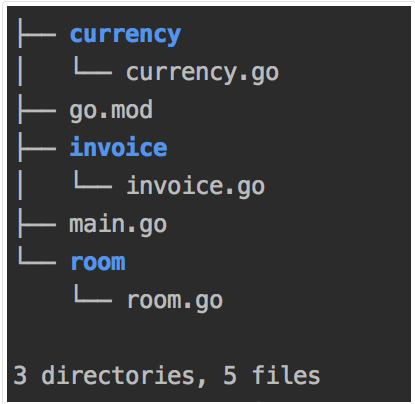

# 12 Inicijalizacija paketa

[11 Paketi i uvoz][11] | [00 Sadržaj][00] | [13 Tipovi][13]

**Šta ćete naučiti u ovom poglavlju?**

- Kako inicijalizovati paket?

**Obrađeni tehnički koncepti!**

- Funkcija init

## Init funkcija

Inicijalizacija paketa se odvija u `init` funkcijama. U ovom odeljku ćemo videti kako se one koriste.

**Primer - MySQL drajver**:

- Šta je MySQL? Šta je drajver?

  MySQL je sistem za upravljanje bazama podataka otvorenog koda.  
  - Baza podataka je "kolekcija međusobno povezanih podataka sačuvanih zajedno u jednoj ili više
    kompjuterizovanih datoteka"  

  - To je organizovana kolekcija podataka sačuvanih u računarskom sistemu.

  - SQL je jezik upita (strukturirani jezik upita) koji MySQL razume

  - MySQL je SQL baza podataka. To znači da razume komande napisane u SQL-u.

  - MySQL je program koji možete instalirati na računar. Sa MySQL-om kreirate bazu podataka,
    ubacujete i preuzimate podatke. Da biste izvršili te radnje, biće vam potreban program za izdavanje MySQL komandi. Ti programi se često nazivaju "klijenti". Ti klijenti će kontaktirati server. Server je računar na kome je MySQL instaliran i samim tim, gde se podaci čuvaju.
  
  - MySQL pruža program za interfejs komandne linije (CLI).
  
  - MySQL radni prostor nudi grafički interfejs (GUI)
  
  - Razni programski jezici su razvili module/biblioteke za izdavanje komandi MySQL bazama podataka.
    Ponekad su ti programi upakovani u ekstenzije koje možemo lako instalirati.
  
U standardnoj biblioteci Go-a možete pronaći paket `database/sql` koji pruža generički interfejs zao SQL baze podataka, tj. sisteme baze podataka koji mogu da razumeju SQL.

Standardna biblioteka ne nudi specifične programe za komunikaciju sa određenim sistemom za upravljanje bazama podataka. Zato nam je potreban "drajver" za komunikaciju sa MySQL-om.

MySQL drajver je modul napravljen za interakciju sa MySQL bazom podataka. U ovom odeljku ćemo proučiti drajver otvorenog koda "github.com/go-sql-driver/mysql".

### Funkcija inicijalizacije paketa `github.com/go-sql-driver/mysql`

```go
// https://github.com/go-sql-driver/mysql/blob/master/driver.go
package MySQL

import (
   //...
   "database/sql"
   //...
)
// ...


func init() {
   sql.Register("mysql", &MySQLDriver{})
}
```

Projekat definiše funkciju pod nazivom init.

- Nema parametre
- Nema rezultata
- Funkcija poziva izvezenu funkciju "Register" iz "database/sql" paketa standardne biblioteke

A evo i "Register" funkcije:

```go
// Register makes a database driver available by the provided name.
// If Register is called twice with the same name or if driver is nil,
// it panics.
func Register(name string, driver driver.Driver) {
   //...
}
```

Zahvaljujući komentaru, razumemo da će ova funkcija učiniti drajver dostupnim.

### Kako se koristi drajver?

Hajde da pogledamo ovaj primer programa koji koristi drajver.

```go
// package-init/init-mysql/main.go
package main

import (
    "database/sql"
    "log"

    _ "github.com/go-sql-driver/mysql"
)

func main() {
    db, err := sql.Open("mysql", "user:password@/dbname")
    if err != nil {
        panic(err)
    }
    log.Println(db)
    //...
}
```

U bloku za uvoz, moramo da uvezemo pakete:

- Prvi "database/sql" koji uvozi standardni bibliotečki paket.
- Prazan uvoz _ "github.com/go-sql-driver/mysql"
- Zatim u glavnoj funkciji pozivamo funkciju "Open" iz "database/sql" paketa  
  Otvoriće vezu sa bazom podataka.

### Šta je sa funkcijom init

Nema traga funkcije init u našem glavnom paketu...To je sasvim razumljivo jer:

- Funkcija "init" iz drajvera nije izvezena.  
  Stoga ga je nemoguće pozvati iz drugog paketa.
- Kako Go registruje drajver ako ne pozovemo funkciju init?
- Naš program će pozvati funkciju init.
- Poziva se zato što smo uvezli drajver sa praznom naredbom za uvoz.

Kada uvezete paket sa praznom naredbom za import, pokrenuće se njegova funkcija inicijalizacije paketa.

Imajte na umu da autor paketa drajvera može takođe ukloniti funkciju "init" i, posebno, naložiti korisniku da ručno pozove funkciju "Register"...

## Pravila inicijalizacije

Inicijalizacija paketa se odvija određenim redosledom definisanim go specifikacijom:

- Uvezeni paketi su inicijalizovani
  - Promenljive su inicijalizovane
  - Init funkcije se pokreću

- Zatim se sam paket inicijalizuje
  - Promenljive su inicijalizovane
  - Init funkcije se pokreću

Init funkcije se izvršavaju sekvencijalno. Drugim rečima, "init" funkcije se ne izvršavaju istovremeno.

### Pravila

#### Stablo primera programa

Da bismo ilustrovali ta pravila, uzmimo primer programa. Na slici možete videti strukturu datoteka programa.



Imamo tri paketa: "room", "invoice" i "currency", zajedno sa datotekom "main.go" i datotekom "go.mod".

#### Izvorni kod

Evo datoteke go.mod:

```go
module maximilien-andile.com/packageInit/rules

go 1.13
```

A evo i main.go datoteke:

```go
// package-init/rules-illustration/main.go
package main

import (
    "fmt"

    "maximilien-andile.com/packageInit/rules/invoice"
)

func init() {
    fmt.Println("main")
}
func main() {
    fmt.Println("--program start--")
    invoice.Print()
}
```

U glavnoj izvornoj datoteci dodali smo "init" funkciju. Unutar "main" funkcije pozivamo paket invoice:

```go
// package-init/rules-illustration/invoice/invoice.go
package invoice

import (
    "fmt"

    "maximilien-andile.com/packageInit/rules/currency"
)

func init() {
    fmt.Println("invoice init")
}

func Print() {
    fmt.Println("INVOICE Number X")
    fmt.Println(54, currency.EuroSymbol())
}
```

Paket "invoice" koristi funkciju iz "currency" paketa. Evo izvornog koda "currency" paketa:

```go
// package-init/rules-illustration/currency/currency.go
package currency

import "fmt"

var f = func() string {
    fmt.Println("variable f initialized")
    return "test"
}()

func init() {
    fmt.Println("currency init")
}

func EuroSymbol() string {
    return "EUR"
}
```

Promenljiva f deluje pomalo čudno. Dodeljujemo promenljivoj izlazni rezultat anonimne funkcije.  Ova funkcija vraća string "test". Pre vraćanja prikazuje "variable f initialized".

Ova funkcija pokazuje kada su promenljive inicijalizovane. One pozivaju "fmt.Println", tako da ćemo detektovati inicijalizaciju u izlazu programa.

Konačno, ovo je izvorni fajl paketa room:

```go
// package-init/rules-illustration/room/room.go
package room

import "fmt"

func init() {
    fmt.Println("room init")
}
```

Možemo primetiti očekivano ponašanje u izlaznom rezultatu našeg programa. Prvo se inicijalizuju uvezeni paketi, a zatim se inicijalizuje glavni paket.

#### Kompilacija i pokretanje

```go
go build main.go
./main

variable f initialized
currency init
invoice init
main
--program start--
INVOICE Number X
54 EUR
```

**Analiza rezultata**:

Redosled inicijalizacije paketa je uvek isti:

- Promenljive su inicijalizovane
- Zatim se pokreću init funkcije

Ono što možemo primetiti u logu je da su paketi inicijalizovani određenim redosledom

Ova sekvenca inicijalizacije prati zavisnosti našeg glavnog paketa. Počinje sa paketom na kraju grafa zavisnosti, a to je paket currency(videti sliku 3 ).

**Možemo li definisati nekoliko init funkcija?**

Apsolutno! Paket može definisati više od jedne init funkcije. Runtime će pokretati init funkcije sekvencijalno.

### Redosled inicijalizacije promenljivih (napredno)

Da vidimo kako da odredimo koja promenljiva će biti prva inicijalizovana. Evo paketa sa tri promenljive i init funkcijom:

```go
// package-init/rules-illustration-advanced/invoice/invoice.go
package invoice

import (
    "fmt"
)

var c = func() string {
    fmt.Println("variable c initialized", b)
    return "value of c"
}()

var a = func() string {
    fmt.Println("variable a initialized")
    return "value of a"
}()

var b = func() string {
    fmt.Println("variable b initialized", a)
    return "value of b"
}()

func init() {
    fmt.Println("invoice init", c)
}

func Print() {
    fmt.Println("INVOICE Number X")
}
```

A evo naše glavne funkcije:

```go
// package-init/rules-illustration-advanced/main.go
package main

import (
    "fmt"

    "maximilien-andile.com/packageInit/rules2/invoice"
)

func init() {
    fmt.Println("main")
}
func main() {
    fmt.Println("--program start--")
    invoice.Print()
}
```

Nakon kompajliranja, možemo pokrenuti program:

```sh
go build main.go
./main

variable first initialized
variable second initialized value of first
variable third initialized value of first
invoice init value of third
main
--program start--
INVOICE Number X
```

Primećujemo da su promenljive inicijalizovane redosledom:

- a
- b
- c

Prva inicijalizovana promenljiva a ne zavisi ni od čega (osim od paketa fmt).  
Ona je prva koja se inicijalizuje.  
Zatim se inicijalizuje promenljiva b (koja zavisi od promenljive a).  
Kada je b inicijalizovana b, možemo inicijalizovati c.

Promenljive se ne inicijalizuju od vrha do dna: ovde se prvo inicijalizuje a, ali se stavlja na drugu poziciju u izvornom fajlu.

Kada izvršno okruženje pokrene proces inicijalizacije paketa, on će se nastaviti po "ciklusu". Svaka promenljiva ima atribut "spremna za inicijalizaciju". Promenljiva se smatra "spremnom" za inicijalizaciju kada:

- Još nije inicijalizovana
- Nema izraz za inicijalizaciju ILI njen izraz za inicijalizaciju nema zavisnosti od neinicijalizovanih promenljivih.
- Tokom prvog ciklusa, izvršno okruženje će izabrati: najraniju promenljivu u redosledu deklaracije i spremnu za inicijalizaciju.
- Kada se prvi ciklus završi, pokreće se drugi ciklus: Go će izabrati promenljivu koja je najranija u redosledu deklaracije i spremna za inicijalizaciju.
- Treći ciklus će učiniti isto.
- Četvrti će takođe učiniti isto...

Ovaj proces se završava kada više nema promenljive za inicijalizaciju.

## Testirajte sebe

### Pitanja i odgovori

1. Kako se zove funkcija koja će inicijalizovati paket? Koliko
   parametara ima ova funkcija? Koliko rezultata?

   Evo primera (prazna init funkcija):

    ```go
    func init() {
    }
    ```

    Nema rezultata, nema parametara!

2. Funkcije inicijalizacije su obavezne u svakom paketu. Tačno ili
   netačno?  
   Netačno. Init funkcije su opcione.

3. Da li je moguće imati četiri funkcije inicijalizacije u paketu?  
   Da.

4. Funkcije inicijalizacije se pozivaju pre inicijalizacije promenljivih.
   Tačno ili netačno?  
   Netačno. Init funkcije se pozivaju nakon inicijalizacije promenljivih.

5. Izvršno okruženje može potencijalno istovremeno da pokreće nekoliko
   funkcija inicijalizacije. Tačno ili netačno?  
   Netačno, pokreću se sekvencijalno (jedna za drugom).

6. Ako paket A uveze paket B, koje funkcije inicijalizacije se prvo
   pokreću?  
   Izvršno okruženje će pokrenuti init funkcije iz paketa B pre onih iz paketa A.

### Ključno

- Inicijalizacija paketa se odvija u init funkcijama.

- init funkcije nisu obavezne.

- Paket može deklarisati nekoliko init funkcija.

- init funkcije se pozivaju nakon inicijalizacije promenljivih.

- init funkcije se izvršavaju sekvencijalno.

[11 Paketi i uvoz][11] | [00 Sadržaj][00] | [13 Tipovi][13]

[11]: 11_Paketi_i_uvoz.md
[00]: 00_Sadržaj.md
[13]: 13_Tipovi.md
