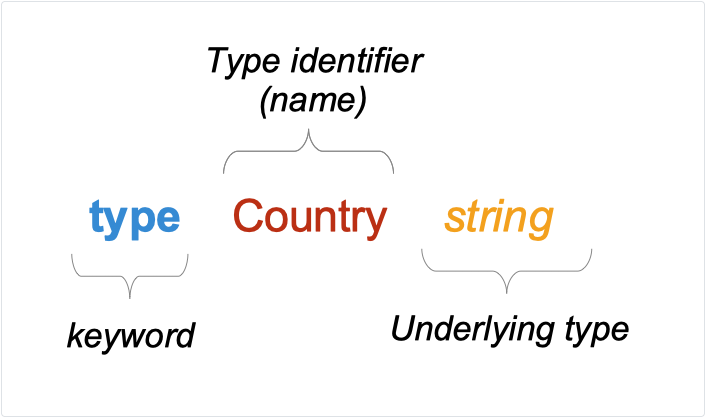

# 13 Tipovi

[12 Inicijalizacija paketa][12]  
[00 Sadržaj][00]  
[14 Metode][14]

**Šta ćete naučiti u ovom poglavlju?**

- Šta je tip?
- Šta su unapred deklarisani tipovi?
- Šta su kompozitni tipovi?
- Šta je literal tipa.
- Šta je struktura tipa?
- Šta su ugrađena polja?
- Kako kreirati tip.

**Obrađeni tehnički koncepti!**

- Tip
- Skup vrednosti
- Unapred deklarisani tipovi
- Struktura tipa
- Kompozitni tipovi
- Polja
- Ugrađena polja

## Šta je tip

"Tip određuje skup vrednosti zajedno sa operacijama i metodama specifičnim za te vrednosti".  

Hajde da razložimo ovu definiciju:

- Skup vrednosti.…
  - Promenljiva tipa `uint32` može da sadrži sve vrednosti od 0 do 4.294.967.295. Ti 4+ milijade vrednosti su skup vrednosti koje ovaj tip dozvoljava.
  - String "Go is Great" nije uint32, ova vrednost ne pripada skupu vrednosti dozvoljenih ovim tipom.

- ... sa operacijama i metodama specifičnim za te vrednosti.
  - Operacije i metode su mogućnosti koje se isporučuju sa vrednostima određenog tipa.
  - Tipovi imaju skup operacija i metoda koje možemo primeniti na vrednosti tih tipova.

- Go ima unapred deklarisane tipove, ali možete i sami da kreirate svoje
  tipove. Te tipove nazivamo prilagođenim tipovima.  
- Možete definisati metode koje su vezane za tip.  
  Na primer, booking tip može imati metod za izračunavanje ukupne cene koju kupac treba da plati.  
  NAPOMENA : obrađivaćemo ih posebnom metodom.

## Ugrađeni tipovi

Go ima nekoliko unapred deklarisanih tipova. Ti tipovi su deo jezgra Goa; ne morate ih deklarisati da biste ih koristili. Možemo ih klasifikovati u tri kategorije:

- Bulov tip
  - bulova vrednost

- Tip stringa  
  - string

- Numerički tipovi
  - uint, uint8, uint32, uint64
  - int, int8, int32, int64
  - float, float32, float6464
  - complex64, complex128

**Primeri**:

```go
var rooms uint8 = 130
var hotelName string = "New Golang Hotel"
var vacancies bool
```

## Ugrađeni kompozitni tipovi

U prethodnom odeljku smo videli da možemo kreirati promenljivu osnovnog tipa.

Možete koristiti te osnovne tipove za konstruisanje kompozitnih tipova.

- nizovi
- pokazivači
- funkcije
- isečci
- mape
- kanali
- strukture
- interfejsi

```go
// types/composite/main.go
package main

import "fmt"

func main() {
    // array constructed with the basic type uint8
    var arr [3]uint8

    // pointer constructed with the basic type uint8
    var myPointer *uint8

    // function  constructed with the basic type string
    var nameDisplayer func(name, firstname string) string

    // slices constructed with the basic type uint8
    var roomNumbers []uint8

    // maps constructed with the basic types uint8 and string
    var score map[string]uint8

    // channel constructed with the basic type bool
    var received chan<- bool

    // struct, interface
    //.. see next sections
    fmt.Println(arr, myPointer, nameDisplayer, roomNumbers, score, received)
}
```

[3]uint8, *uint8, func(name, firstname string) string - nazivaju se `literali tipa`. Kompozitni tipovi se konstruišu pomoću `literala tipa`.

### Tip strukture

Strukturni tip je kompozitni tip

```go
struct {
    Name     string
    Capacity uint8
    Rooms    uint8
    Smoking  bool
}
```

Struktura je sastavljena od polja. Polja mogu biti:

- eksplicitno navedena: u ovom slučaju, polje ima ime i tip (u prethodnim primerima sva polja su eksplicitna)
- implicitno navedena: u ovom slučaju ta polja nazivamo ugrađenim poljima (videti sledeći odeljak)

### Kako kreirati nove tipove

#### Novi tipovi zasnovani na osnovnim ugrađenim tipovima

Možemo deklarisati nove tipove na osnovu postojećih, unapred deklarisanih tipova.

```go
// a new type Firstname
// underlying type : string
type Firstname string

// a new type Currency
// underlying type is string
type Currency string

// a new type VATRate
// underlying type is float64
type VATRate float64
```

Ovde kreiramo tip od osnovnog tipa, koji je ugrađeni tip.

```go
type Country string
```

Stvaramo novi tip - "Country".

- Ime tipa je "Country" (identifikator)
- Osnovni tip "Country" tipa je tip "string".



#### Novi tipovi zasnovani na ugrađenim kompozitnim tipovima

Takođe možete deklarisati novi tip sa osnovnim kompozitnim tipom.

```go
// new type "ExchangeRate"
// underlying type is map[string]float64
// map[string]float64 is a type litteral
type ExchangeRate map[string]float64

// new type "Birthdate"
// underlying type : time.Time (type Time from the time package)
type Birthtime time.Time

// new type "Hotel"
// underlying type : struct
type Hotel struct {
    Name     string
    Capacity uint8
    Rooms    uint8
    Smoking  bool
}

// new type "Country"
// underlying type : struct
type Country struct {
    Name        string
    CapitalCity string
}
```

### Kreiranje promenljive tipa strukture

#### Sa nazivima polja

```go
france := Country{
    Name:        "France",
    CapitalCity: "Paris",
}

usa := Country{
    Name: "United Sates of America",
}
```

Kreiramo dve promenljive tipa "Country": "france" i "usa".

Možemo kreirati novi element tipa "Country", bez navođenja vrednosti bilo kog polja:

```go
empty := Country{}
```

Takođe možete navesti određena polja:

```go
usa := Country{
    Name: "United Sates of America",
}
```

Ostala polja će biti jednaka nultoj vrednosti tipa polja.  

Ovde će vrednost "CapitalCity" biti jednaka nultoj vrednosti stringova: "".

#### Bez imena polja

U prethodnom primeru, pišemo naziv polja, a zatim njegovu vrednost. Možete izostaviti nazive polja:

```go
belgium := Country{
    "Belgium",
    "Bruxelles",
}
```

Ovde kreiramo vrednost tipa "Country" i postavljamo polje "Name" sa "Belgija", a polje "CapitalCity" sa "Brisel".

Ova sintaksa se mora pažljivo koristiti.

- Vrednosti polja moraju biti navedene **istim redosledom** kao u deklaraciji strukture tipa.
  
  ```go
  type Country struct {
      Name        string
      CapitalCity string
  }
  
  japan := Country{
      "Tokyo",
      "Japan",
  }
  ```
  
  Ovaj kod će se kompajlirati, ali postoji greška. Vrednost Country.Name će biti "Tokyo" (ne "Japan").

- Ne možete **preskočiti** polje:

  ```go
  // WILL NOT COMPILE
  china := Country{
      "China",
  }
  ```
  
  Kada koristite ovu sintaksu, trebalo bi da inicijalizujete sva polja.

- Ne mešajte sintakse

  ```go
  // WILL NOT COMPILE
  greece := Country{
      Name: "Greece",
      "Athens",
  }
  ```

### Kako pristupiti polju: selektorski izraz

Da biste pristupili vrednosti polja, koristite karakter ".".

```go
usa := Country{
    Name: "United Sates of America",
}

usa.CapitalCity = "Washington DC"
```

Naravno, možete pristupiti i vrednosti određenog polja:

```go
if usa.Name == "France" {
  fmt.Println("we have an error !")
}
```

### Ugrađena polja

U tipu strukture možemo dodati **ugrađena polja**. Ugrađena polja su implicitno definisana:

```go
type Hotel struct {
    Name     string
    Capacity uint8
    Rooms    uint8
    Smoking  bool
    Country
}

type Country struct {
    Name        string
    CapitalCity string
}
```

U strukturi tipa "Hotel" imamo ugrađeno polje "Country". "Country" je još jedan tip strukture.

Ugrađena polja nemaju eksplicitno ime. Ime polja je ime tipa.

### Tip pokazivača kao ugrađeno polje

U prethodnom odeljku smo videli da možemo ugraditi tip u tip strukture. Takođe možemo ugraditi pokazivački tip u tip strukture:

```go
type Hotel struct {
    Name string
    *Country
}

type Country struct {
    Name        string
    CapitalCity string
}
```

Ovde ugrađujemo tip pokazivača "*Country" (pokazivač na element tipa "Country"). Ime polja je ime tipa: "Country":

```go
hotel := Hotel{
    Name:    "Hotel super luxe",
    Country: &Country{Name: "France"},
}
fmt.Println(hotel.Country.Name)
```

Naziv polja je takođe "Country".

### Upotreba ugrađenih polja

Naziv ugrađenog polja biće njegov tip. Uzmimo primer:

```go
// types/embedded/main.go
package main

import "fmt"

type Hotel struct {
    Name string
    Country
}

type Country struct {
    Name        string
    CapitalCity string
}

func main() {
    hotel := Hotel{
        Name:    "Hotel super luxe",
        Country: Country{Name: "France"},
    }
    fmt.Println(hotel.Country.Name)
}
```

Ovde struktura tipa Hotel ima dva polja:

- Jedno eksplicitno polje: Name (tipa string)
- I implicitno, ugrađeno polje: Country

Ime ugrađenog polja je njegovo ime tipa.

## Testirajte sebe

### Pitanja i odgovori

1. Navedite primer literala tipa niza.
   - [123]uint64
2. Koje su razlike između osnovnih tipova i kompozitnih tipova?
   - Osnovni tip je unapred deklarisan (ugrađeni tip) u Gou. Da biste ga koristili, ne morate ga
     deklarisati.
   - Kompozitni tip nije unapred deklarisan, možete ga deklarisati korišćenjem literala tipa.
3. U programu se nalazi sledeći kod: `type Switch bool`. Koje je ime tipa? Koji je osnovni tip?
   - Naziv tipa je Switch
   - Osnovni tip je bool
4. uint8 je složeni tip. Tačno ili netačno?
   - Netačno. uint8 je unapred deklarisani jednostavan tip.
     Nije kompozitni; nije sastavljen sa drugim tipovima.
5. Kako se zove ugrađeno polje tipa T? tipa *T?
   - T

### Ključno

- Tip je skup vrednosti sa operacijama i metodama specifičnim za te vrednosti.  
  Operacije i metode ćemo obraditi u posebnom poglavlju.

- Go prethodno deklariše osnovne tipove koje možete koristiti za kreiranje kompozitnih tipova  
  Kompozitni tipovi se konstruišu pomoću literala tipa

- Kompozitni tipovi su:  
  tipovi nizova, struktura, pokazivača, funkcija, interfejsa, kriške, mape i kanala

- Strukture tipa vam omogućavaju da grupišete podatke zajedno sa poljima. Svako polje strukture ima
  tip i ime (identifikator)

- Polja strukture možemo odrediti eksplicitno ili implicitno

  - Implicitno: ugrađujete tip u tip strukture, polje se tada naziva "Ugrađeno polje"
  
    ```go
    type Country struct {
        Name        string
        CapitalCity string
    }
    
    type Hotel struct {
        Name     string
        Country
    }
    ```

    "Name" je ime polje eksplicitno navedeno.  
    "Country" je tip strukture. Takođe je polje strukture tipa "Hotel", to je ugrađeno polje.

- Da biste izabrali vrednost iz promenljive tipa struct, možete koristiti selektorski izraz, sa
  karakterom ".".

  ```go
  hotel := Hotel{
      Name:    "Gopher team hotel",
      Country: Country{
          Name: "France",
          CapitalCity: "Paris",
      },
  }
  
  log.Println(hotel.Name)
  log.Println(hotel.Country.CapitalCity)
  ```
  
[12 Inicijalizacija paketa][12]  
[00 Sadržaj][00]  
[14 Metode][14]

[12]: 12_Inicijalizacija_paketa.md
[00]: 00_Sadržaj.md
[14]: 14_Metode.md
