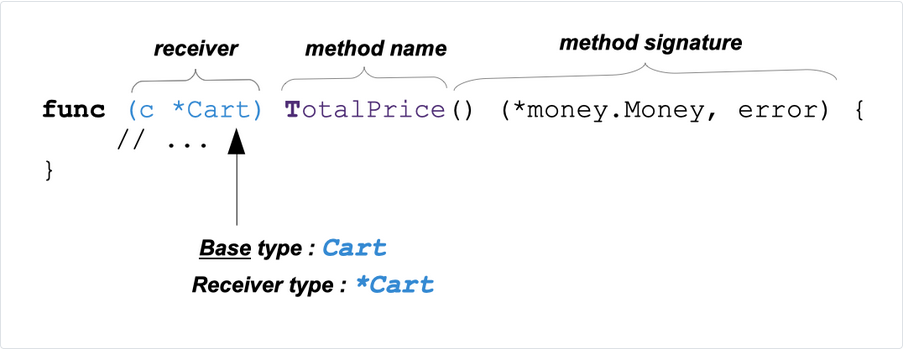
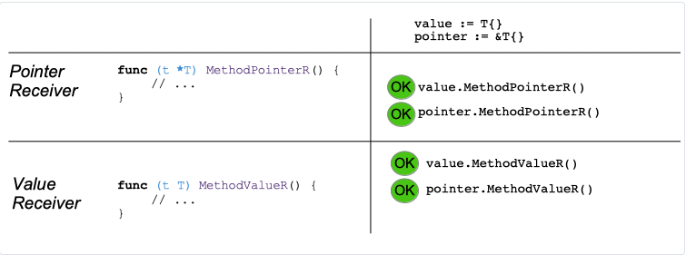
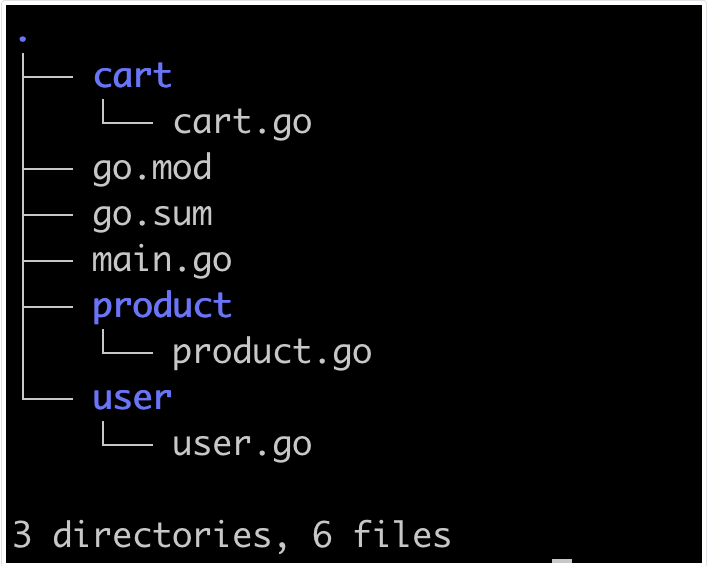

# 14: Metode

[13 Tipovi][13]  
[00 Sadržaj][00]  
[15 Pokazivači][15]  

**Šta ćete naučiti u ovom poglavlju?**

- Šta je metod?
- Šta je prijemnik?
- Kako kreirati metod.
- Kako pozvati metodu.
- Šta je prijemnik pokazivača, a šta prijemnik vrednosti?
- Šta je skup metoda?
- Kako imenovati svoje prijemnike.

**Obrađeni tehnički koncepti!**

- Prijemnik
- Metod
- Parametar
- Prijemnik vrednosti
- Tip pokazivača
- Prijemnik pokazivača

## Metode

- Metoda je funkcija sa prijemnikom.
- Prijemnik metode je poseban parametar.
- Prijemnik nije naveden u listi parametara već pre imena metode
- Metoda može imati samo jednog prijemnika.
- Prijemnik ima tip T ili *T
  - Kada prijemnik ima tip T, kažemo da je to "prijemnik vrednosti".
  - Kada ima tip *T, kažemo da je "prijemnik pokazivača".
- Kažemo da je bazni tip T.


Anatomija metode

Primer:

```go
// methods/first-example/main.go
package main

import (
    "os/user"
    "time"

    "github.com/Rhymond/go-money"
)

type Item struct {
    ID string
}

type Cart struct {
    ID        string
    CreatedAt time.Time
    UpdatedAt time.Time
    lockedAt  time.Time
    user.User
    Items        []Item
    CurrencyCode string
    isLocked     bool
}

func (c *Cart) TotalPrice() (*money.Money, error) {
    //...
    return nil, nil
}

func (c *Cart) Lock() error {
    //...
    return nil
}
```

Definisali smo tip "Cart".

Ova tip ima dve metode: "TotalPrice" i "Lock".

- Te dve metode su funkcije.
- One su vezane za tip "Cart".
- Prijemnik za metodu TotalPrice se poziva sa "c" i tipa je "*Cart".
- Prijemnik za metodu "Lock" se poziva "c" i tipa je "*Cart".

### Metode su mogućnosti

Pomoću metoda možete dati dodatne mogućnosti tipu "Cart". U prethodnom primeru, dodali smo mogućnost za nekoga ko manipuliše tipom "Cart" da:

- Zaključate kolica
- Izračunate ukupnu cenu

### Naziv metoda

- Imena metoda treba da budu jedinstvena unutar skupa metoda.
- Šta je skup metoda?
  - Skup metoda tipa T je skup svih metoda sa prijemnikom T
  - Skup metoda tipa \*T je grupa svih metoda sa prijemnikom T i \*T

To znači da NE MOŽETE imati dve metode sa istim imenom, čak i ako prva ima tip pokazivača, a druga ima tip vrednosti:

```go
// FORBIDEN:
func (c *Cart) TotalPrice() (*money.Money, error) {
    //...
}

func (c Cart) TotalPrice() (*money.Money, error) {
    //...
}
```

Prethodni isečak koda se neće kompajlirati:

```sh
"maximilien-andile.com/methods/methodSet"
./main.go:52:6: method redeclared: Cart.TotalPrice
    method(*Cart) func() (*money.Money, error)
    method(Cart) func() (*money.Money, error)

Compilation finished with exit code 2
```

### Kako pozivati metode

Metode se pozivaju sa "dot notacijom". Argument prijemnika se prenosi metodi sa tačkom.

```go
package main

import (
    "call/cart"
    "log"
)

func main() {
    // load the cart... into variable newCart
    newCart := cart.Cart{}

    totalPrice, err := newCart.TotalPrice()
    if err != nil {
        log.Printf("impossible to compute price of the cart: %s", err)
        return
    }
    log.Println("Total Price", totalPrice.Display())

    err = newCart.Lock()
    if err != nil {
        log.Printf("impossible to lock the cart: %s", err)
        return
    }
}
```

U prethodnom primeru, metode "TotalPrice" i "Locks" se pozivaju (sa tačkom).

Ovde prosleđujemo promenljivu "newCart" metodi "TotalPrice".

```go
`totalPrice, err := newCart.TotalPrice()`
```

Ovde prosleđujemo promenljivu "newCart" metodi "Lock".

```go
err = newCart.Lock()
```
  
  ovde prosleđujemo promenljivu "newCart" metodi "Lock".

Te dve metode su vezane za tip "Cart" iz trenutnog paketa ("main").

### Pokazivački ili vrednosni prijemnik

Kada koristite prijemnik vrednosti, podaci će biti kopirani interno pre nego što se metoda izvrši. Metoda će koristiti kopiju promenljive.

Ovo ima dve posledice:

- Metoda sa prijemnikom vrednosti ne može da menja podatke koji su joj prosleđeni.
- Interni proces kopiranja može uticati na performanse vašeg programa (u većini slučajeva je
  zanemarljiv, osim kod struktura teških tipova).

Sa pokazivačkim prijemnikom, podaci koji mu se prosleđuju mogu biti modifikovani metodom.

### Tip prijemnika i poziv metode

Prijemnik je dodatni parametar funkcije.

Prijemnici metoda su ili prijemnici pokazivača ili prijemnici vrednosti.

U ovoj metodi, prijemnik ima tip "*Cart" (pokazivač na Cart).

```go
func (c *Cart) TotalPrice() (*money.Money, error) {
    //...
    return total, nil
}
```

Kada pozivamo ovu metodu, koristimo sledeću notaciju:

```go
newCart := cart.Cart{}
totalPrice, err := newCart.TotalPrice()
//...
```

> [!Warning]
> Jesi li primetio/la nešto čudno?
>
> Naučili smo da parametar funkcije ima tip. Ovaj tip treba poštovati (ne možete
> dati funkciji tip `uint8` ako očekuje `string`).  
>
> - Tip "newCart" je "Cart" (iz "cart" paketa).
> - Tip prijemnika je "*Cart".
> - Tipovi nisu isti!

Kompajler bi trebalo da pokrene grešku, zar ne? Ali ne pokreće. Zašto?

- Go će automatski pretvoriti promenljivu "newCart" u pokazivač.

**Pravila**:

- Metode sa pokazivačkim prijemnicima mogu prihvatiti pokazivač ILI vrednost kao prijemnik
- Metode sa prijemnicima vrednosti mogu prihvatiti pokazivač ILI vrednost kao prijemnik



### Vidljivost metoda

Metode poput funkcija imaju vidljivost.

Kada je prvo slovo imena metode veliko, metoda se eksportuje.

U prethodnom primeru, sav naš kod smo stavili u "main" paket; shodno tome, vidljivost metoda nije bila mnogo bitna. Međutim, kada kreirate paket, morate uzeti u obzir vidljivost metoda.

- Izvezena metoda se može pozvati izvan paketa.
- Neizvezena metoda NE može se pozivati van paketa.

### Primer projekta

  
Prikaz stabla projekta

Razmotrimo novu organizaciju (videti sliku).

- Imamo "go.mod", "go.sum" i "main.go" u root projekta
- Imamo tri direktorijuma; svaki direktorijum sadrži izvorne datoteke za paket.
- Imamo tri paketa:
  - "cart"
  - "product"
  - "user"

Evo sadržaja paketa "cart":

```go
// methods/example-project/cart/cart.go
package cart

import (
    "methods/example-project/product"
    "os/user"
    "time"

    "github.com/Rhymond/go-money"
)

type Cart struct {
    ID        string
    CreatedAt time.Time
    UpdatedAt time.Time
    lockedAt  time.Time
    user.User
    Items        []Item
    CurrencyCode string
    isLocked     bool
}

type Item struct {
    product.Product
    Quantity uint8
}

func (c *Cart) TotalPrice() (*money.Money, error) {
    //...
    return nil, nil
}

func (c *Cart) Lock() error {
    //...
    return nil
}

func (c *Cart) delete() error {
    // to implement
    return nil
}
```

Paket "product":

```go
// methods/example-project/product/product.go
package product

import "github.com/Rhymond/go-money"

type Product struct {
    ID    string
    Name  string
    Price *money.Money
}
```

Paket "user":

```go
// methods/example-project/user/user.go
package user

type User struct {
    ID        string
    Firstname string
    Lastname  string
}
```

I `main` paket (početna tačka programa):

```go
// methods/example-project/main.go
package main

import (
    "log"
    "methods/example-project/cart"
)

func main() {
    newCart := cart.Cart{}

    totalPrice, err := newCart.TotalPrice()
    if err != nil {
        log.Printf("impossible to compute price of the cart: %s", err)
        return
    }
    log.Println("Total Price", totalPrice.Display())

    err = newCart.Lock()
    if err != nil {
        log.Printf("impossible to lock the cart: %s", err)
        return
    }

}
```

**Napomene**:

- Metode "TotalPrice" i "Lock" (vezane za "Cart") se izvoze
- Međutim, metoda "delete" koja je vezana za "Cart" nije izvezena. To znači da se ne može pozivati iz
  drugih paketa ("main", "user", "product"). Ali "TotalPrice" i "Locks" je mogu pozvati u drugim paketima.

### Konvencije o imenima prijemnika

Možemo slobodno birati imena prijemnika. Međutim, u zajednici su usvojene dve prakse:

- Ime prijemnika je obično jedno slovo
- Generalno, to je prvo slovo osnovnog tipa
  - Osnovni tip: "Cart", ime prijemnika "c"
  - Osnovni tip: "User", ime prijemnika "u"  
    ...
  - Kada izaberete ime prijemnika, držite ga se u svim svojim metodama.  
    Koristite "c" za sve metode osnovnog tipa "Cart".

## Vežba primene

### Specifikacija

- Napravite novi modul na računaru
- Kopirajte i nalepite kod dat u prethodnom odeljku.
- Implementirajte dve metode: TotalPriceiLock
  - Metoda TotalPriceizračunava ukupnu cenu korpe i vraća je. Trebalo bi da koristite modul "github.
    com/Rhymond/go-money"
  - Ukupna cena korpe je za svaki artikal, zbir količine * jedinične cene.
  - Metoda Lockće... zaključati korpu kako bi se izbegle izmene nakon potvrde
  - Metoda treba da ažurira polje isLockedna vrednost "true"
  - Takođe bi trebalo da ažurira polje lockedAtna trenutno vreme
  - Ako je kolica već zaključana, trebalo bi da vrati grešku

Moraćete da pogledate dokumentaciju modula.github.com/Rhymond/go-money

- Refleks je da odete na <https://pkg.go.dev/>
- Ukucajte "go-money" u traku za pretragu i kliknite na modul:
  <https://pkg.go.dev/github.com/Rhimond/go-money>

- Kliknite na "Expand" i videćete README.md datoteku repozitorijuma koja vam daje primer korišćenja.

### Rešenje - TotalPrice

**Jedinični test**:

Počnimo sa pisanjem jediničnog testa. Imajte na umu da ćemo detaljnije obraditi jedinične testove u posebnom poglavlju. Za sada, ako niste upoznati sa ovim, samo pretpostavite da je ovo alat za testiranje da li se metoda ponaša kako se očekuje.

```go
package cart

// imports...

func TestTotalPrice(t *testing.T) {
    items := []Item{
        {
            Product: product.Product{
                ID:    "p-1254",
                Name:  "Product test",
                Price: money.New(1000, "EUR"),
            },
            Quantity: 2,
        },
        {
            Product: product.Product{
                ID:    "p-1255",
                Name:  "Product test 2",
                Price: money.New(2000, "EUR"),
            },
            Quantity: 1,
        },
    }
    c := Cart{
        ID:           "1254",
        CreatedAt:    time.Now(),
        UpdatedAt:    time.Now(),
        User:         user.User{},
        Items:        items,
        CurrencyCode: "EUR",
    }
    actual, err := c.TotalPrice()
    assert.NoError(t, err)
    assert.Equal(t, money.New(4000, "EUR"), actual)
}
```

- Funkcija jediničnog testiranja se zove TotalPrice,
- Počinjemo kreiranjem isečka od 2 lažna Itemelementa:items
  - Polja IDi Namesu popunjena test podacima.
  - Da biste kreirali cenu, jednostavno pozovitemoney.New(1000, "EUR")
  - Dve stavke imaju različite cene: 10,00 evra za prvu i 20,00 evra za drugu (2000 podeljeno sa 100 = 20)
- Zatim se kreira nova promenljiva ctipa.Cart
- Polje Itemsje podešeno na vrednostitems
- Polje CurrencyCodeje podešeno na "EUR" (šifra valute evro)
- Metoda se zatim pozivac
- Zatim proveravamo da nema greške

  ```go
  Saassert.NoError(t, err)
  ```

- I proveravamo da je stvarna vrednost prvog rezultata jednaka
  
  ```go
  money.New(4000, "EUR")(40 evra)
  
  2 * 10 EUR + 1 * 20 EUR= 40 EUR
  ```

**Implementacija funkcije**:

```go
// methods/application/cart/cart.go 
//...

func (c *Cart) TotalPrice() (*money.Money, error) {
    total := money.New(0, c.CurrencyCode)
    var err error
    for _, v := range c.Items {
        itemSubtotal := v.Product.Price.Multiply(int64(v.Quantity))
        total, err = total.Add(itemSubtotal)
        if err != nil {
            return nil, err
        }
    }
    return total, nil
}
```

- Kreiramo promenljivu totalinicijalizovanu sa 0 EUR (sa funkcijom money.Newkoja će kreirati
  promenljivu tipa*money.Money
  - Ovo će biti ukupan zbir
- Kreiramo promenljivu err tipa error
- Zatim za svaku stavku u korpi
  - Izračunavamo ukupnu cenu za artikal itemSubtotal:.
    - Pozivamo metodu Multiplyiz tipa*money.Money
    - Parametar prijemnika je u tom slučaju v.Product.Price(što je cena trenutnog proizvoda)
    - Metoda uzima količinu kao parametar (konvertujemo je iz uint8u int64)
  - Zatim se ovaj međuiznos dodaje ukupnom iznosu
    - Pozivamo metodu Add(definisanu na tipu *money.Money)
    - Parametar prijemnika jetotal
    - Rezultat se zatim ponovo dodeljuje promenljivojtotal

### Rešenje - Lock

**Jedinični testovi**:

```go
// methods/application/cart/cart_test.go 
//...

func TestLock(t *testing.T) {
    c := Cart{
        ID: "1254",
    }
    err := c.Lock()
    assert.NoError(t, err)
    assert.True(t, c.isLocked)
    assert.True(t, c.lockedAt.Unix() > 0)
}

func TestLockAlreadyLocked(t *testing.T) {
    c := Cart{
        ID:       "1254",
        isLocked: true,
    }
    err := c.Lock()
    assert.Error(t, err)
}
```

- Prvo testiramo da kada su kolica zaključana:
  - polje isLockedje jednakotrue
  - Polje lockedAtje podešeno na vreme koje odgovara UNIX epohi većoj od 0
    - Da bismo to uradili, dobijamo UNIX epohu sa metodom Unixdefinisanom na tiputime.Time
    - Ovo nije optimalno
    - Bolji test bi proverio da li je vreme ispravno podešeno.

**Dodatno pitanje**:

Kako proveriti da li je vreme ispravno podešeno? Možda bismo mogli da izmenimo potpis metode dodavanjem vremena zaključavanja kao parametra. Na taj način možemo da proverimo da li lockedAtje ispravno podešeno.

- Druga funkcija će proveriti da li se funkcija ponaša kako je očekivano kada su kolica već zaključana
  - Da bismo to uradili, postavili smo isLockeddatrue
  - Zatim pozivamo Lockda proverimo da li je došlo do greške.

**Implementacija funkcije**:

```go
// methods/application/cart/cart.go 
//...

func (c *Cart) Lock() error {
    if c.isLocked {
        return errors.New("cart is already locked")
    }
    c.isLocked = true
    c.lockedAt = time.Now()
    return nil
}
```

- Prvo proveravamo da kolica nisu već zaključana.
  - Ako je zaključano, vraćamo novu grešku (kreiranu sa errors.New)
- Zatim postavljamo vrednost isLockednatrue
- I vrednost u odnosu lockedAtna trenutno vreme ( time.Now()).

## Testirajte sebe

### Pitanje i odgovori

1. Šta je prijemnik metode?
   - Prijemnik metode je dodatni parametar
   - Navodi se u posebnom odeljku parametara koji prethodi imenu metode.

     `func (c *Cart) Lock() error`

2. Navedite primer metode sa prijemnikom vrednosti.
   - `func (t T) MethodExampleName() error`

3. Navedite primer metode sa prijemnikom pokazivača.
   - `func (t *T) MethodExampleName2() error`
   - Metoda sa pokazivačkim prijemnikom može da modifikuje svoj prijemnik.

4. Tačno ili netačno? Ako je dat tip User, možemo imati metodu Logout sa nazivom prijemnik
   vrednosti User i metodu sa nazivom Logout prijemnik pokazivača *User.
   - Netačno
     Tip \*User ima skup metoda sastavljen od svih metoda sa prijemnikom tipa \*User i metoda sa prijemnikom tipa User.
   - Ime metoda unutar skupa metoda treba da bude jedinstveno.  
     Drugim rečima, ne možete imati metodu sa istim imenom, čak i ako je prijemnik prijemnik pokazivača ili prijemnik vrednosti.

5. Kako kontrolisati vidljivost metode?
   - Da bi metod bio vidljiv izvan paketa gde je definisan, nazovite ga velikim početnim slovom.
   - Da biste je učinili nevidljivom van paketa gde je definisana, nazovite metodu početnim slovom
     NE velikim slovom.

### Ključno

- Metode su funkcije koje su vezane za tip
- Svaka metoda ima prijemnik
- Prijemnik je dodatni parametar naveden pre imena funkcije

  ```go
  func (t T) MethodExampleName() error
  ```

- Prijemnik može biti pokazivač na tip T(označen sa *T)
  U tom slučaju kažemo da metod ima prijemnik pokazivača
- Prijemnik može imati tipT
  - Kažemo da metod u tom slučaju ima prijemnik vrednosti
- Kada vaša metoda ima prijemnik pokazivača, dozvoljavate metodi da menja vrednost prijemnika.

  ```go
  func (c *Cart) Lock() error
  ```

- Ova metoda može ažurirati vrednost korpe.
- Generalno, prijemnik ima jednoslovno ime , koje je uglavnom prvo slovo tipa prijemnika.
  Npr.:  
  `func (c *Cart) Lock() error` ( "time paketa", standardna biblioteka)  
  `func (m *Money) Multiply(mul int64) *Money` (paket money, modul "github.com/Rhymond/go-money" )  
  Prvo slovo imena metode kontroliše njenu vidljivost
  - Prvo slovo veliko: Vidljivo
  - Prvo slovo nije veliko: Nemoguće ga je pozvati spolja.

- Imena metoda treba da budu jedinstvena u skupu metoda

[13 Tipovi][13]  
[00 Sadržaj][00]  
[15 Pokazivači][15]  

[13]: 13_Tipovi.md
[00]: 00_Sadržaj.md
[15]: 15_Pokazivači.md
