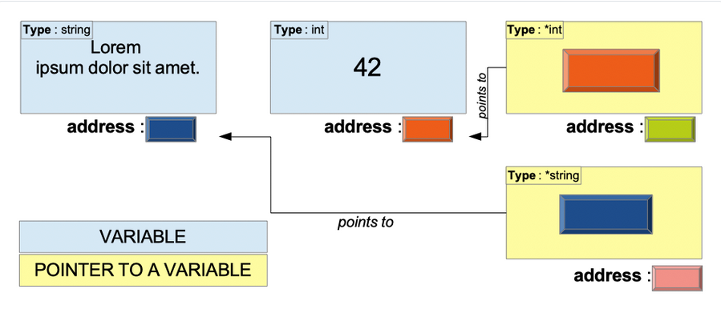

# 15 Tip pokazivača

[14 metode][14]  
[00 Sadržaj][00]  
[16 Interfejsi][16]

**Šta ćete naučiti u ovom poglavlju?**

- Šta je pokazivač?
- Šta je tip pokazivača?
- Kako kreirati i koristiti promenljive tipa pokazivača.
- Koja je nulta vrednost promenljive tipa pokazivača?
- Šta je dereferenciranje?
- Koja je specifičnost isečaka, mapa i kanala?

**Obrađeni tehnički koncepti!**

- Pokazivač
- Adresa memorije
- Tip pokazivača
- Dereferenciranje
- Referenciranje

## Pokazivač

Pokazivač je "stavka podataka koja određuje lokaciju druge stavke podataka".

U programu stalno čuvamo i preuzimamo podatke. Na primer, stringove, brojeve, složene strukture... Na fizičkom nivou, podaci se čuvaju na određenim adresama u memoriji. Pokazivači sadrže te memorijske adrese.

  
Pokazivačke promenljive

Imajte na umu da pokazivačka promenljiva, kao i svaka druga promenljiva, takođe ima memorijsku adresu.

### Tipovi pokazivača

Ne postoji tako nešto kao jedinstveni tip pokazivača. Postoji onoliko tipova pokazivača koliko postoji tipova. Tip pokazivača je skup svih pokazivača na promenljive datog tipa.

Tipovi pokazivača imaju sledeću sintaksu:

```go
*BaseType
```

gde "BaseType" može biti bilo koji tip.

Uzmimo neke primere:

- "*int" označava sve pokazivače na promenljive tipa int.

- "*uint8" označava sve pokazivače na promenljive tipa uint8.

```go
type User struct {
    ID string
    Username string
}
```

"*User" označava sve pokazivače na promenljive tipa "User".

### Kreiranje promenljive tipa pokazivača

Može se kreirati sledećom sintaksom:

```go
var p *int
```

Ovde kreiramo promenljivu p tipa "\*int". "\*int" je pokazivački tip čiji je osnovni tip "int".

Hajde da kreiramo celobrojnu promenljivu pod nazivom answer.

```go
var answer int = 42
```

Sada možemo dodeliti vrednost promenljivoj p:

```go
p = &answer
```

Simbolom `&` dobijamo adresu promenljive answer. Hajde da ispišemo ovu adresu!

```go
fmt.Println(p)
// 0xc000012070
```

0xc000012070 je heksadecimalni broj. To možete primetiti jer počinje sa 0x. Memorijske adrese se često zapisuju u heksadecimalnom formatu. I dalje biste ga mogli izraziti u binarnom formatu (sa nulama i jedinicama), ali to nije lako pročitati.

### Nulta vrednost tipova pokazivača

Nulta vrednost tipova pokazivača je uvek `nil`. Drugim rečima, pokazivač koji ne sadrži adresu jednak je `nil`.

### Dereferenciranje

Pokazivačka promenljiva sadrži adresu druge promenljive. Šta ako želite da preuzmete vrednost sa te adrese? Možete koristiti operator dereferenciranja "*".

Uzmimo primer. Definišemo strukturu tipa Cart:

type Cart struct {
    ID   string
    Paid bool
}

Zatim kreiramo promenljivu "cart" tipa "Cart". Možemo uzeti adresu ove promenljive, ali i pratiti adresu (dobiti vrednost):

```go
cart = Cart{
    ID: "12345", 
    Paid: true,
}

cartPtr = &cart         // referenciranje
cartDeref = *cartPtr    // dereferenciranje
```

- Sa operaterom "*" pratite adresu
- Sa operaterom "&" uzimate adresu

> [!Warning]
> **Rizik od zabune**:
>
> Operator dereferenciranja "**\***" je isti simbol kao onaj koji se koristi za
> označavanje tipa pokazivača. "**\*card**" može označavati tip pokazivača, ali
> i dereferenciranu promenljivu pokazivača. Pažljivo analizirajte kontekst
> upotrebe i lako ćete razlikovati ova dva.

### Dereferenciranje nil pokazivača

Postoji panika sa kojom se susreo svaki Go programer:

```sh
panic: runtime error: invalid memory address or nil pointer dereference
[signal SIGSEGV: segmentation violation code=0x1 addr=0x0 pc=0x1091507]
```

Da bismo je bolje razumeli, pokušaćemo da ga reprodukujemo:

```go
// pointer/nil-pointer-dereference/main.go
package main

import "fmt"

func main() {
    var myPointerVar *int
    fmt.Println(*myPointerVar)
}
```

U ovom listingu smo definisali pokazivačku promenljivu "myPointerVar". Ovo je promenljiva tipa "*int"(pokazivač na ceo broj)

Zatim pokušavamo da je dereferenciramo. Promenljiva "myPointerVar" sadrži pokazivač koji nije inicijalizovan, stoga je vrednost ovog pokazivača `nil`. Program će paničiti jer pokušavamo da pratimo nepostojeću adresu! Pokušavamo da odemo na `nil` adresu. `nil` adresa je nešto što ne postoji.

## Mape i kanali

Mape i kanali su već reference na unutrašnju strukturu. Shodno tome, funkcija/metoda koja prihvata mapu ili kanal može ih izmeniti, čak i ako parametar nije tipa pokazivača. Uzmimo primer:

```go
// pointer/maps-channels/main.go
//...

func addElement(cities map[string]string) {
    cities["France"] = "Paris"
}
```

- Ova funkcija uzima mapu kao ulaz
- Dodaje unos na mapu (ključ = "Francuska", vrednost = "Pariz")

```go
// pointer/maps-channels/main.go
package main

import "log"

func main() {
    cities := make(map[string]string)
    addElement(cities)
    log.Println(cities)
}
```

- Inicijalizujemo mapu pod nazivom "cities"
- Zatim se funkcija "addElement" poziva

Ovaj program štampa:

```sh
map[France: Paris]
```

Detaljnije ćemo obraditi kanale i mape u posebnim odeljcima.

## Isečci

Isečak je kolekcija elemenata istog tipa.

Interno, isečak je struktura koja ima tri polja:

- Dužina
- Kapacitet
- Pokazivač na interni niz.

Evo primera isečka "EUcountries":

```go
package main

import "log"

func main() {
    EUcountries := []string{"Austria", "Belgium", "Bulgaria"}
    log.Println(EUcountries)
}
```

### Funkcije/metode sa isečkom kao parametrom/prijemnikom

**Primer 1 - Dodavanje elemenata u isečak**:

```go
// pointer/slices-add-elements/main.go
package main

import "log"

func main() {
    EUcountries := []string{"Austria", "Belgium", "Bulgaria"}
    addCountries(EUcountries)
    log.Println(EUcountries)
}

func addCountries(countries []string) {
    countries = append(countries, []string{"Croatia", "Republic of Cyprus", "Czech Republic", "Denmark", "Estonia", "Finland", "France", "Germany", "Greece", "Hungary", "Ireland", "Italy", "Latvia", "Lithuania", "Luxembourg", "Malta", "Netherlands", "Poland", "Portugal", "Romania", "Slovakia", "Slovenia", "Spain", "Sweden"}...)
}
```

- Funkcija "addCountries" uzima isečak stringova "EUcountries" kao parametar.
- Modifikujemo isečak dodavanjem stringova pomoću ugrađene funkcije "append".
- Dodaje isečku nedostajuće zemlje EU.

**Pitanje - Po vašem mišljenju, šta sledeći ispisuje?**

```sh
[Austria Belgium Bulgaria Croatia Republic of Cyprus Czech Republic Denmark Estonia Finland France Germany Greece Hungary Ireland Italy Latvia Lithuania Luxembourg Malta Netherlands Poland Portugal Romania Slovakia Slovenia Spain Sweden]
```

ili

```sh
[Austria Belgium Bulgaria]
```

Odgovor : Ovaj program daje izlaz:

```sh
[Austria Belgium Bulgaria]
```

**Objašnjenja**:

- Funkcija uzima element tipa kao parametar []string
- Kada se funkcija "addCountries" pozove, go pravi kopiju isečka "EUcountries".
- Funkcija će dobiti kopiju:
  - dužine
  - kapaciteta i
  - pokazivača na interni niz.
- Unutar funkcije, zemlje se efikasno dodaju
  - Dužina isečka će rasti,
  - Izvršno okruženje će dodeliti novi interni niz.
- Dodajmo log unutar funkcije da bismo je vizualizovali:

  ```go
  func addCountries(countries []string) {
      countries = append(countries, []string{"Croatia", "Republic of Cyprus", "Czech Republic", "Denmark", "Estonia", "Finland", "France", "Germany", "Greece", "Hungary", "Ireland", "Italy", "Latvia", "Lithuania", "Luxembourg", "Malta", "Netherlands", "Poland", "Portugal", "Romania", "Slovakia", "Slovenia", "Spain", "Sweden"}...)
      log.Println(countries)
  }
  ```

- Ovaj log prikazuje:

  ```sh
  [Austria Belgium Bulgaria Croatia Republic of Cyprus Czech Republic Denmark Estonia Finland France Germany Greece Hungary Ireland Italy Latvia Lithuania Luxembourg Malta Netherlands Poland Portugal Romania Slovakia Slovenia Spain Sweden]
  ```

- Ova promena će uticati SAMO na kopiranu verziju poziva funkcije

**Ažuriranje elemenata**:

```go
// pointer/slices-update-elements/main.go
package main

import (
    "log"
    "strings"
)

func main() {
    EUcountries := []string{"Austria", "Belgium", "Bulgaria"}
    upper(EUcountries)
    log.Println(EUcountries)
}

func upper(countries []string) {
    for k, _ := range countries {
        countries[k] = strings.ToUpper(countries[k])
    }
}
```

- Dodajemo novu funkciju "upper", koja će svaki element isečka stringova pisati velikim slovima sa "strings.ToUpper"

**Pitanje - Po vašem mišljenju, šta ovaj program ispisuje?**

```sh
[Austria Belgium Bulgaria]
```

Odgovor : Ova funkcija efikasno daje izlaz:

```sh
[AUSTRIA BELGIUM BULGARIA]
```

**Objašnjenje**:

- Funkcija upper dobija kopiju isečka "EUcountries" (kao i pre).
- Unutar funkcije menjamo vrednosti elemenata isečka:
  
  ```go
  countries[k] = strings.ToUpper(countries[k])
  ```

- Kopija isečka i dalje ima referencu na osnovni niz.
- Možemo ga modifikovati, ... ali samo elemente isečka koji su već u isečku.

**Zaključak**:

- Kada prosledite isečak funkciji, ona dobija kopiju tog isečka.
- To ne znači da ne možete izmeniti isečak.
- Možete samo izmeniti elemente koji su već prisutni u isečku.

### Funkcije/metode sa pokazivačem na isečak kao parametrom/prijemnikom

Pomoću pokazivača možete izmeniti isečak kako se očekuje:

```go
// pointer/slices-add-elements-pointer/main.go
package main

import (
    "log"
)

func main() {
    EUcountries := []string{"Austria", "Belgium", "Bulgaria"}
    addCountries2(&EUcountries)
    log.Println(EUcountries)
}

func addCountries2(countriesPtr *[]string) {
    *countriesPtr = append(*countriesPtr, []string{"Croatia", "Republic of Cyprus", "Czech Republic", "Denmark", "Estonia", "Finland", "France", "Germany", "Greece", "Hungary", "Ireland", "Italy", "Latvia", "Lithuania", "Luxembourg", "Malta", "Netherlands", "Poland", "Portugal", "Romania", "Slovakia", "Slovenia", "Spain", "Sweden"}...)
}
```

Ovaj program radi kako se očekuje:

```go
[Austria Belgium Bulgaria Croatia Republic of Cyprus Czech Republic Denmark Estonia Finland France Germany Greece Hungary Ireland Italy Latvia Lithuania Luxembourg Malta Netherlands Poland Portugal Romania Slovakia Slovenia Spain Sweden]
```

- Funkcija `addCountries2` uzima pokazivač na isečak stringova kao parametar "*[]string".
- Funkcija append se poziva sa sa prvim parametrom "*countriesPtr" (dereferenciramo pokazivač
  countriesPtr)
- Drugi parametar dodavanja se ne menja
- Rezultat je zatim utisnut u na "*countriesPtr".

## Pokazivač na strukture

Postoji prečica koja vam omogućava da direktno izmenite promenljivu tipa struct bez operatora dereferenciranja:

```go
cart := Cart{
    ID:          "115552221",
    CreatedDate: time.Now(),
}
cartPtr := &cart

cartPtr.Items = []Item{
    {SKU: "154550", Quantity: 12},
    {SKU: "DTY8755", Quantity: 1},
}

log.Println(cart.Items)
// [{154550 12} {DTY8755 1}]
```

- "cart" je promenljiva tipa "Cart"
  - cartPtr := &cart: uzima adresu promenljive "cart" i čuva je u "cartPtr".
  - Sa promenljivom "cartPtr" možemo direktno modifikovati polje "Items" promenljive "cart".
  - Postoji "automatska dereferenca" koja je lakša za pisanje od ekvivalenta

    ```go
    (*cartPtr).Items = []Item{
        {SKU: "154550", Quantity: 12},
        {SKU: "DTY8755", Quantity: 1},
    }
    ```

    što takođe funkcioniše, ali je opširnije.

## Metoda sa prijemnicima pokazivačima

Pokazivači se često koriste kao prijemnici metoda. Uzmimo primer sa "Cat" tipom:

```go
type Cat struct {
  Color string
  Age uint8
  Name string
}
```

Možete definisati metod za ovaj tip sa pokazivačem na Cat kao prijemnik pokazivač "( *Cat)":

```go
func (c *Cat) Meow(){
  fmt.Println("Meooooow")
}
```

Metoda "Meow" ne radi ništa zanimljivo; samo ispisuje string "Meooooow". Ovde ne menjamo naš prijemnik: ne menjamo vrednost "Name" na primer. Evo još jedne metode koja će izmeniti jedan od atributa "c":

```go
func (c *Cat) Rename(newName string){
  c.Name = newName
}
```

Ova metoda će promeniti "Name" mačke. Stoga je pokazivač koristan jer menjamo jedno od polja strukture Cat.

Naravno, ako ne želite da koristite pokazivački prijemnik, možete:

```go
func (c Cat) RenameV2(newName string){
  c.Name = newName
}
```

U ovom primeru, promenljiva "c" je kopija. Prijemnik se naziva "prijemnik vrednosti". Kao posledica toga, sve izmene koje uradite na promenljivoj "c" biće izvršene na kopiji "c":

```go
// pointer/methods-pointer-receivers/main.go
package main

import "fmt"

type Cat struct {
    Color string
    Age   uint8
    Name  string
}

func (c *Cat) Meow() {
    fmt.Println("Meooooow")
}

func (c *Cat) Rename(newName string) {
    c.Name = newName
}

func (c Cat) RenameV2(newName string) {
    c.Name = newName
}

func main() {
    cat := Cat{Color: "blue", Age: 8, Name: "Milow"}
    cat.Rename("Bob")
    fmt.Println(cat.Name)
    // Bob

    cat.RenameV2("Ben")
    fmt.Println(cat.Name)
    // Bob
}
```

U prvoj liniji funkcije "main" kreiramo novu mačku. NJeno ime je "Milow".

Kada pozovemo "Rename" metodu, vrednost polja "Name" će se promeniti.

Kada pozovemo "RenameV2" metodu, koja ima prijemnik vrednosti, ime originalne mačke se neće promeniti!

**Kada koristiti prijemnik pokazivača, a kada prijemnik vrednosti**:

- Koristite prijemnik pokazivača kada:
  - Vaša struktura je teška (inače će Go napraviti njenu kopiju)
  - Želite da izmenite prijemnik (na primer, želite da promenite polje imena strukturne promenljive)
  - Vaša struktura sadrži polje primitiva sinhronizacije (kao što je sync.Mutex). Ako koristite prijemnik vrednosti, on će takođe kopirati mutex, što će ga učiniti beskorisnim i dovesti do grešaka u sinhronizaciji.

- Koristite prijemnik vrednosti:
  - Kada je vaša struktura mala
  - Kada ne nameravate da modifikujete prijemnik
  - Kada je prijemnik mapa, funkcija, kanal, isečak, string ili vrednost interfejsa (jer je interno već pokazivač)
  - Kada su vaši drugi prijemnici pokazivači

## Testirajte sebe

### Pitanje i odgovori

1. Kako označiti tip promenljive koja sadrži pokazivač na Product?
   - *Product
2. Koja je nulta vrednost tipa pokazivača?
   - nil
3. Šta znači "dereferenciranje"?
   - Pokazivač je adresa ka memorijskoj lokaciji gde su podaci sačuvani. Kada dereferenciramo  
     pokazivač, možemo pristupiti podacima sačuvanim u memoriji na ovoj adresi.
4. Kako dereferencirati pokazivač?
   - Korišćenjem operatora dereferenciranja ( * ).
5. Popunite praznine. ____ je interno pokazivač na ____.
   - Isečak je interno pokazivač na niz.
6. Tačno ili netačno. Kada želim da izmenim mapu u funkciji, moja funkcija mora da prihvati
   pokazivač na mapu kao parametar. Takođe moram da vratim izmenjenu mapu.
   - Netačno. Možete samo prihvatiti mapu (ne pokazivač ka mapi). Takođe nije potrebno vraćati
     izmenjenu mapu.

### Ključno

- Pokazivači su adrese ka podacima
- Tip *Toznačava skup svih pokazivača na promenljive tipa T.
- Da biste kreirali pokazivačku promenljivu, možete koristiti operator &. On će uzeti adresu promenljive

  ```go
  userId := 12546584
  p := &userId
  ```

  "username" je promenljiva tipa "int"
  "p" je promenljiva tipa "*int"

  "*int označava sve pokazivače na promenljive tipa "int"

- Funkcija sa parametrom/prijemnikom tipa pokazivača može da izmeni vrednost na koju pokazivač pokazuje.

- Mape i kanali su "referentni tipovi"

- Funkcije/metode koje prihvataju mape ili kanale mogu da menjaju vrednosti sačuvane interno u te dve strukture podataka (nema potrebe za prosleđivanjem pokazivača na mapu ili pokazivača na kanal)

- Isečak interno sadrži referencu na niz; bilo koja funkcija/metod koja prihvata isecak može da modifikuje elemente isecka.

- Kada želite da izmenite dužinu i kapacitet sloja u funkciji, trebalo bi da toj funkciji prosledite pokazivač na sloj ( )*[]string

- Dereferenciranje vam omogućava pristup i izmenu vrednosti sačuvane na adresi pokazivača.

- Da biste dereferencirali pokazivač, koristite operator*

  ```go
  userId := 12546584
  p := &userId
  *p = 4
  log.Println(userId)
  ```

  p je pokazivač.
  Sa *p dereferenciramo pokazivač p
  Vrednost userId menjamo pomoću instrukcije `*p = 4`.
  Na kraju isečka koda, vrednost "userId" je 4 (nije 12546584)

- Kada imate pokazivač na strukturu, možete direktno pristupiti polju pomoću promenljive pokazivača (bez korišćenja operatora dereferenciranja)  
  Primer:

  ```go
  type Cart struct {
      ID string
  }
  
  var cart Cart
  cartPtr := &cart
  ```

  Umesto pisanja: `(*cartPtr).ID = "1234"`
  Možete direktno napisati:`cartPtr.Items = "1234"`
  Promenljiva `cart` je efikasno modifikovana.

[14 metode][14]  
[00 Sadržaj][00]  
[16 Interfejsi][16]

[14]: 14_Metode.md
[00]: 00_Sadržaj.md
[16]: 16_Interfejsi.md
