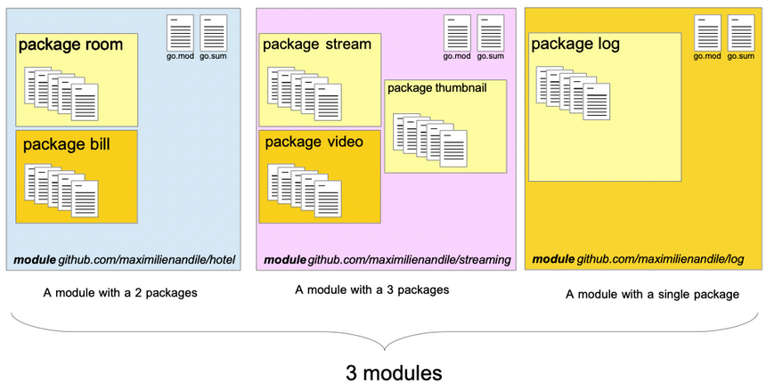
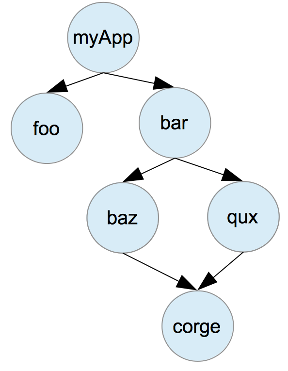
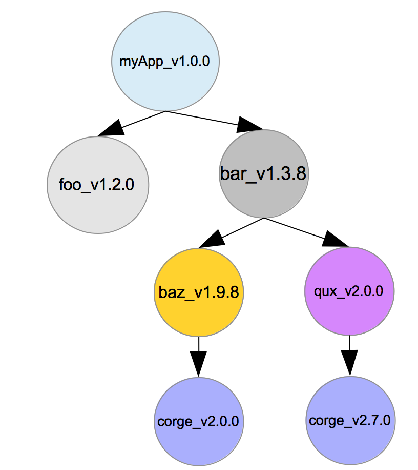
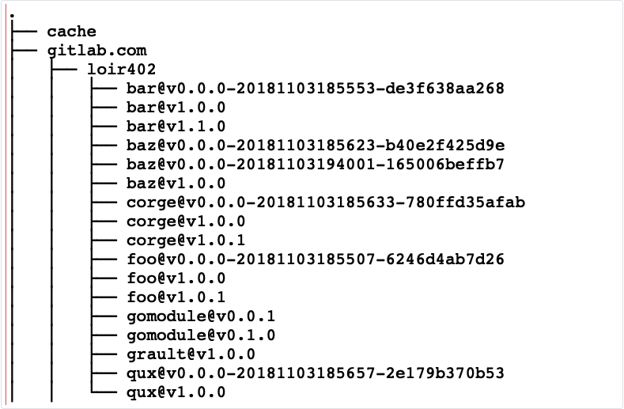

# 17 Go moduli

[16 Interfejsi][16]  
[00 Sadržaj][00]  
[18 Proksiji Go modula][18]

**Šta ćete naučiti u ovom poglavlju?**

- Šta je Go modul?
- Šta su zavisnost i graf zavisnosti?
- Go pristup izboru verzije.
- Kako se koristi semantičko verzionisanje.
- Kako izvršiti osnovne operacije sa go modulima:
  - nadogradite sve,
  - nadogradite jedan,
  - smanjite jedan.

**Obrađeni tehnički koncepti!**

- Zavisnost
- Verzija
- Semantičko verzionisanje (SemVer)
- Modul

## Uvod

Moduli su predstavljeni sa verzijom 1.11 jezika Go. Goferi mogu da podele svoj razvoj u odvojene jedinice koda koje se mogu ponovo koristiti u drugim projektima.

**Zavisnost**:

Programeri ponovo koriste kod koji su njihove kolege razvile da bi:

- Smanjite vreme razvoja
  - Neko je možda već razvio neke osnovne funkcionalnosti tima. Zašto bi vam trebalo vremena da ih
    sami razvijate?
  - Koja je vaša dodatna vrednost?
- Smanjite troškove održavanja.
  - Kod koji vaš tim piše treba održavati (npr. rešavanje grešaka, ispravljanje ranjivosti...)
  - Kod koji je napisala dinamična zajednica može se efikasno održavati.
    - Važan kriterijum pri izboru zavisnosti je provera dinamike zajednice oko projekta.
    - Moderan projekat sa mnogo doprinosa može biti "bezbedniji" od drugog koji održava nekoliko
      programera.

Program može da se oslanja na deset drugih programa ili biblioteka. Lista programa i biblioteka koje program koristi naziva se njegove zavisnosti. Kažemo da je program zavisan od drugog softvera.

Go vam daje mogućnost da lako koristite kod koji su napisali drugi sa Go modulima.

## Definicija Go modula

Modul je grupa paketa (ili jedan paket) koji su verzionisani. Ova grupa go datoteka zajedno formira modul. Moduli mogu biti zavisni od drugih modula.

- Modul se identifikuje stringom koji se naziva "putanja modula".
- Zahtevi (ako ih ima) modula su navedeni u posebnoj datoteci.
  - Go će koristiti ovu datoteku za svaku instalaciju da bi izgradio modul.
  - Datoteka se zove "go.mod".
  - Go će takođe generisati datoteku pod nazivom "go.sum". Kasnije ćemo videti šta je to.

  
Modul je skup paketa sa go.mod datotekom i go.sum datotekom.

## Datoteka go.mod

Datoteka "go.mod" ima sledeću strukturu

```go
module gitlab.com/maximilienandile/myAwesomeModule

go 1.15

require (
    github.com/PuerkitoBio/goquery v1.6.1
    github.com/aws/aws-sdk-go v1.36.31
)
```

- Prvi red daje putanju modula (može biti lokalna putanja ili URI do spremišta koje se nalazi na
  sistemu za kontrolu verzija).
- "module" je rezervisana ključna reč. U primeru, modul je smešten na gitlab.com na mom nalogu.
  Projekat se zove "myAwesomeModule".
- Drugi red će dati verziju Goa koju koristi programer
- Zatim, drugi odeljak definiše zavisnosti koje modul koristi:

  ```go
  require (
      DEPENDENCY_1_PATH VERSION_OF_DEPENDENCY_1
      DEPENDENCY_2_PATH VERSION_OF_DEPENDENCY_2
     //...
  )
  ```

Prvo, putanja modula, a zatim željena verzija:

```go
github.com/PuerkitoBio/goquery v1.6.1
```

Učitavamo modul "github.com/PuerkitoBio/goquery" koji se nalazi na GitHub-u i potrebna nam je verzija v1.6.1.

**Inicijalizacija pomoću komandne linije go (na praznom projektu)**:

Datoteka "go.mod" može se automatski kreirati pomoću komandne linije go:

```sh
go mod init my/module/path
```

Ovo će generisati sledeću datoteku:

```go
module my/module/path

go 1.15
```

Trenutno, naša datoteka "go.mod" ne sadrži nikakvu zavisnost.

Zavisnosti ćemo navesti pomoću ključne reči `require`.

Na primer:

```go
module gitlab.com/maximilienandile/myawesomemodule

require (
    github.com/go-redis/redis/v8 v8.4.10
)
```

To znači da modul "gitlab.com/maximilienandile/myawesomemodule" zahteva modul "github.com/go-redis/redis/v8" u verziji "v8.4.10".

**Inicijalizacija na postojećem projektu**:

Možete generisati datoteku "go.mod" na postojećem projektu pomoću komandne linije go. Uzmimo primer.

Možemo kreirati datoteku "main.go" koja će uvesti kod iz repozitorijuma "gitlab.com/loir42/gomodule":

```go
package main

import "gitlab.com/loir42/gomodule"

func main() {
   gomodule.WhatTimeIsIt()
}
```

Modul koji smo uvezli ima samo jednu izloženu funkciju: "WhatTimeIsIt" (u svom paketu timer):

Evo sadržaja datoteke "timer.go":

```go
package gomodule

import "time"

func WhatTimeIsIt() string {
   return time.Now().Format(time.RFC3339)
}
```

Ako pokrenete komandu `go mod init`, biće kreirana datoteka "go.mod". Ona još uvek neće navesti vašu zavisnost:

```go
module go_book/modules/app
```

Zatim, ako izgradite svoj projekat tako što ćete u terminalu otkucati "go build", datoteka "go.mod" će biti izmenjena, a zavisnost će biti dodata u odeljak "require":

```go
module go_book/modules/app

require gitlab.com/loir402/gomodule v0.0.1
```

Nismo naveli ništa za potrebnu verziju modula. Shodno tome, alat za izgradnju je preuzeo najnoviju oznaku iz udaljenog spremišta.

**Isključenje verzije modula**:

U "go.mod"-u, možete eksplicitno isključiti verziju iz vaše izgradnje:

```go
exclude gitlab.com/loir402/bluesodium v2.0.1
```

Imajte na umu da možete isključiti više od jednog para verzija modula:

```go
exclude (
   gitlab.com/loir402/bluesodium v2.0.1
   gitlab.com/loir402/bluesodium v2.0.0
)
```

**Zamena koda modula**:

Moguće je zameniti kod jednog modula kodom drugog modula pomoću direktive "replace":

```go
replace (
   gitlab.com/loir402/bluesodium v2.0.1 => gitlab.com/loir402/bluesodium2 v1.0.0
   gitlab.com/loir402/corge =>./corgeforked
)
```

Zamenjena verzija je levo od strelice; zamena je desno.

Zamenski modul može biti:

- Čuva se na veb-sajtu za deljenje koda (npr. Github, GitLab...)
- Sačuvano lokalno

Neke važne napomene:

- Zamenski modul treba da ima istu direktivu modula (prvi red datoteke go.mod).
- Da li zamena treba da navede verziju? To zavisi od lokacije zamene:
  - Udaljeno (Github, Gitlab): obavezno
  - Lokalno: nije potrebno
- Može se zameniti određena verzija modula ILI sve verzije mogu biti zamenjene.
  
  ```go
  gitlab.com/loir402/corge =>./corgeforked
  ```
  
  zameniće sve verzije gitlab.com/loir402/corge lokalnom verzijom

  ```go
  gitlab.com/loir402/corge v0.1.0 =>./corgeforked
  ```

  zameniće samo verziju v0.1.0 lokalnim kodom.

**Rečnik: API**  
API je skraćenica od Interfejs za programiranje aplikacija. Najvažnije slovo je I. API je interfejs.

Interfejs je poput granice između dve stvari, "zajedničke granice preko koje dve ili više odvojenih komponenti računarskog sistema razmenjuju informacije" (Wikipedia).

Interfejs u ​​računarstvu je način komunikacije između dve različite stvari. Šta je, dakle, interfejs za programiranje aplikacija? To je skup konstrukcija (konstanti, promenljivih, funkcija...) koje su izložene interakciji sa softverom.

Sa ovom definicijom možemo reći da go paket "fmt" izlaže API go programeru za interakciju sa njim. NJegov API predstavlja skup funkcija koje možete koristiti, "Println" na primer. Takođe pokriva skup izvezenih identifikatora paketa (konstante, promenljive, tipove).

Takođe možemo reći da Linux kernel otkriva API za interakciju sa njim, na primer, funkcija "bitmap_find_free_region" će reći kernelu da pronađe susedni, poravnati memorijski region.

> [!Note]
> Go moduli otkrivaju API koji je sastavljen od svih izvezenih identifikatora
> paketa(a) od kojih je modul sastavljen.

**Rečnik: Verzija**  
Programi se prirodno razvijaju:

- Dodatne funkcionalnosti se dodaju (ili uklanjaju)
- Greške su ispravljene (ili stvorene)
- Performanse su poboljšane (ili smanjene)

Programeri će dodavati revizije originalnom programu, čineći ga drugačijim (na bolje ili na gore). Ponekad će se API modula razvijati: na primer, prethodno izvezena funkcija se briše.

Programi koji se oslanjaju na ove posebne funkcije će se pokvariti (jer se više ne izvoze).

Programeri moraju imati način da označe precizne verzije dela koda.

Verzija je jedinstveni identifikator koji označava program u određenoj reviziji i trenutku.

Ovaj jedinstveni identifikator se generiše na osnovu skupa dobro poznatih i deljenih pravila. Skup pravila i format identifikatora naziva se "šema verzioniranja". Dostupno je nekoliko šema. Koristite semantičko verzioniranje. Detaljno ćemo ga opisati u sledećem odeljku.

**Rečnik: oznaka, revizija, preliminarno izdanje, izdanje**:

- Označeno : to znači da je "oznaka" kreirana pomoću sistema za kontrolu verzija.
- Oznaka je string ( njeno ime ) koji označava određenu reviziju projekta koju održava sistem za
  kontrolu verzija.
  - Npr: "v1.0.1" je oznaka
  - String "v1.0.1" je naziv oznake
  - Označava kod repozitorijuma na veoma specifičnoj reviziji.
  - Imajte na umu da oznaka može biti bilo koji string.
  - "GoIsMyFavLanguage " je validna oznaka.
- Oznaka može da označi objavljenu verziju ili preliminarnu verziju softvera
  - Preliminarna verzija (ili kandidat za objavljivanje) se smatra spremnom. Dostupna je za
    testiranje u poslednjem trenutku.
  - Ipak, ne smatra se stabilnim izdanjem (ili samo "izdanjem").
  - Pretprodajne verzije imaju specifične oznake sa dodatnim znakovima:  
    Na primer: 1.0.0-alfa, 1.0.0-alfa.1  
    Svaki projekat ima različite konvencije o tome.
- Neoznačena verzija je specifično stanje programa u datom trenutku.
  - U Git VCS-u, to je "commit".
  - Git VCS će identifikovati svaki "commit" pomoću SHA1 kontrolne sume  
    (npr.: 409d7a2e37605dc5838794cebace764ea4022388)

## Semantičko verzionisanje

Semantičko verzionisanje je norma koju je napisao Tom Preston-Verner. Tom 3. Ova specifikacija definiše način na koji se formiraju brojevi verzija. Široko se koristi u zajednici programera.

U ovom odeljku ću detaljno opisati neke važne zahteve semantičkog verzionisanja:

**Format broja verzije**:

Broj verzije mora imati sledeći format: "XYZ"

Gde je:

- X glavna verzija​
- X manja-sporedna verzija​
- Z verzija zakrpe ( ispravka greške)

Kako to funkcioniše? X, Y i Z su pozitivni brojevi (bez vodećih nula). Ti brojevi se povećavaju prateći određenu normu.

- Kada kreirate nove funkcije koje prekidaju postojeći API vašeg softvera, povećavate broj glavne verzije.
  - stara verzija: 1.0.0 / nova verzija: 2.0.0
- Kada kreirate nove funkcije ili poboljšate performanse koje ne prekidaju postojeći API, povećavate broj sporedne verzije.
  - stara verzija: 1.0.0 / nova verzija 1.1.0
- Kada ispravite grešku u kodu, samo povećate broj verzije zakrpe
  - stara verzija: 1.0.0 / nova verzija 1.0.1
- Kada kreirate glavnu verziju, postavljate na nulu broj sporedne verzije i broj verzije zakrpe. - - Kada objavite novu funkciju, postavljate na nulu broj verzije zakrpe.

**Glavna verzija 0**:

Tokom početne faze projekta, znate da će se stvari promeniti; vaš javni API možda neće biti isti kasnije. Tokom ove faze razvoja, i dalje možete kreirati verziju. Glavni broj se tada fiksira na 0, ali se broj sporedne verzije i broj zakrpe i dalje mogu povećavati. Drugi programeri će znati kada integrišu vaš kod u svoj softver da se vaš softver ne smatra stabilnim (što znači da se javni API može promeniti bez obaveštenja).

**Alat za obezbeđivanje stabilnosti**:

Kada povećate broj svoje glavne verzije, takođe obaveštavate druge da ste razvili promene koje nisu kompatibilne sa prethodnom glavnom verzijom.

Uzmimo primer promene API-ja. Modul pod nazivom "gomodule" izlaže funkciju spoljnom svetu pod nazivom "WhatTimeIsIt":

```go
package gomodule

import "time"

func WhatTimeIsIt() string {
    return time.Now().Format(time.RFC3339)
}
```

Programer je objavio verziju 0.0.1 ovog koda. Kasnije je isti programer dobio mnogo žalbi od drugih u vezi sa formatom vremena. Kolege programeri žele da budu u mogućnosti da odrede format za vreme. RFC3339 je kul, ali žele da biraju. Novo izdanje je spremno:

```go
package gomodule

import "time"

func WhatTimeIsIt(format string) string {
    return time.Now().Format(format)
}
```

Potpis funkcije se promenio. Kao posledica toga, kod koji koristi ovu funkciju će prestati da radi ako se uveze ova nova verzija. Zato programer mora da kreira novu glavnu verziju: 1.0.0.

**Brisanje verzije**:

Kada se verzija kreira, ne smemo menjati softver. Ne možete označiti softver kao određenu verziju, a zatim obrisati oznaku i ponovo ga kreirati sa istim brojem verzije.

**Grafik zavisnosti**:

Rukovanje zavisnostima je komplikovan zadatak i postoji mnogo pristupa. Ali prvo, želim da definišem koncept grafa zavisnosti.

Graf zavisnosti strukturirano prikazuje zavisnosti i podzavisnosti koje su potrebne da bi aplikacija radila.



Svaki paket je predstavljen čvorom ( krugom ). Čvorovi se takođe nazivaju vrhovi ili listovi. Na primer, myApp je čvor.

Ivica je veza između dva čvora. Ivice su predstavljene pravim linijama. U grafu zavisnosti, ivice imaju smer predstavljen strelicom. Direktne ivice predstavljaju zavisnost.

- myApp direktno zavisi od dva paketa: foo i bar

Kažemo da su foo i bar potomci myApp-a.

- Paket foo ne zavisi ni od čega. Foo nema potomka.
- Bar zavisi od dva druga paketa, baz i qux.
- Qux zahteva corge da bi radio
- Baz takođe zahteva korge da bi radio

**Rešavanje zavisnosti**:

Graf zavisnosti predstavlja potrebne zavisnosti, ali na kraju nam je potrebna lista zavisnosti za instaliranje našeg paketa. Da bismo kreirali ovu konačnu listu, moramo poštovati zahteve grafa. Rešavanje zavisnosti je proces pronalaženja ove konačne liste.

U našem prethodnom primeru, konačna lista će biti:

- Foo
- Bar
- Baz
- Qux
- Corge

Imajte na umu da je potrebno da uključimo Corge samo jednom, čak i ako je to potrebno dva puta (od strane Baz i Qux).

**Problem izbora verzije**:

U prethodnom primeru nismo uzeli u obzir nijedan broj verzije. U ovom odeljku ćemo dodati brojeve verzija.

  
Graf zavisnosti sa verzijama

Na slici smo predstavili brojeve verzija:  
myApp v1.0.0 zavisi od foo v1.2.0 i od bar v1.3.8...

Vidimo da je čvor corge podeljen na dva nova čvora na grafiku. To je zato što baz i qux zavise od corge-a, ali ova dva paketa ne zavise od potpuno iste verzije.

Koju verziju treba da dodamo na našu listu zavisnosti?

- Verzija 2.0.0 ili verzija 2.7.0?
- Oboje?
- Samo ona novija, koja je u ovom slučaju v2.7.0?

Videćemo kako će Go rešiti ovaj izbor u sledećem odeljku.

**Go pristup: Izbor minimalne verzije**:

Minimalni izbor verzije (ili MVS) je skup algoritama koje koristi go komandna linija da:

- Generiše datoteku "go.mod" (i "go.sum"), koja navodi sve zavisnosti koje projekat koristi.
- Ažurira jednu ili više zavisnosti
- Snizi verzije jedne ili više zavisnosti

Teoriju o minimalnoj verziji verzije (MVS) osmislio je Ras Koks (jedan od programera jezika). Ras je želeo da stvori sistem koji je "Razumljiv. Predvidljiv. Dosadan".

U ovom odeljku ćemo detaljno opisati kako to funkcioniše fokusirajući se na glavne operacije koje ćemo obavljati svakodnevno:

- Dva osnovna pravila:
  - Svaki modul će dati listu zahteva modula
    - Moduli se identifikuju putanjom modula
    - Za svaki modul je potrebno navesti minimalnu kompatibilnu verziju
    - Ova lista se nalazi u datoteci "go.mod"
  - Svaki modul treba da prati "pravilo kompatibilnosti uvoza".  
    Moduli sa istom putanjom modula treba da budu kompatibilni sa prethodnom verzijom.

**Kako dodati novu zavisnost**:

Kada dodajete novu zavisnost svom projektu ( pozivom `go get` ), ona će:

- Preuzeti potreban modul
- Dodati modul u vašu "go.mod" datoteku

**Koja je verzija izabrana?**

Go će birati po redosledu preferencija

- Najnovije označeno stabilno izdanje
- Najnovije označeno pre-izdanje
- Najnovija neoznačena verzija (najnoviji poznati commit, takođe nazvana najnovija pseudo-verzija )

**Izrada liste za izgradnju**:

- Lista za izgradnju je lista modula neophodnih za izgradnju Go programa.
- Svaka stavka ove liste sastoji se od dve stvari
  - Putanja modula identifikuje modul
  - Identifikator revizije (koji može biti oznaka ili identifikator commit-a)

Koraci potrebni za kreiranje liste za izgradnju za dati modul su 5 :

- Inicijalizujte praznu listu L
- Uzmite listu modula potrebnih za trenutni modul (go.mod)
- Za svaki potreban modul
  - Preuzmite listu modula potrebnih za ovaj modul (go.mod)
  - Dodajte te elemente na listu L
  - Ponovite operaciju za elemente dodate listi
- Na kraju, lista može da sadrži više unosa za istu putanju modula.  
  Ako je tako, za svaku putanju modula, zadržite najnoviju verziju.

Da biste prikazali konačnu listu izgradnje modula, možete otkucati komandu:

```sh
go list -m all
```

Na sledećoj slici možete videti mapu koja predstavlja zahteve za modul koji zahteva samo "gitlab.com/loir402/bluesodium/v2" u verziji v2.1.1.

- Počinjemo navođenjem zahteva za bluesodium u traženoj verziji
- Potreban je goquery
  - Koja zahteva sebi kaskadu
  - I neto
    - , što zahteva kripto, sistemske i tekstualne usluge.
    - ...

Na kraju, imamo sledeću listu:

```go
github.com/PuerkitoBio/gokueri v1.6.1
github.com/andibalholm/cascadia v1.1.0
gitlab.com/loir402/bluesodium/v2 v2.1.1
golang.org/x/crypto v0.0.0-20190308221718-c2843e01d9a2
golang.org/x/net v0.0.0-20200202094626-16171245cfb2
golang.org/k/sis v0.0.0-20190215142949-d0b11bdaac8a
golang.org/x/text v0.3.0
golang.org/x/net v0.0.0-20180218175443-cbe0f9307d01
```

Net modul je potreban dva puta (podebljano):

```go
golang.org/x/net v0.0.0-20200202094626-16171245cfb2
golang.org/x/net v0.0.0-20180218175443-cbe0f9307d01
```

Verzija golang.org/x/net v0.0.0-20200202094626-16171245cfb2 je poželjnija jer je najnovija.

**Kako nadograditi zavisnost na najnoviju sporednu verziju ili zakrpu**:

Kada prvi put dodate zavisnost svom projektu, Go će preuzeti određenu reviziju:

- Označena verzija ili,
- Označeno preliminarno izdanje ili,
- Određena obaveza

Kada želite da nadogradite zavisnost na sledeću verziju, možete da otkucate:

```sh
go get -u gitlab.com/loir402/bluesodium
```

-u zastavica će preuzeti noviju minornu verziju ili zakrpu.

**Nadogradnja zavisnosti na novu glavnu verziju**:

Vaš projekat koristi verziju v1.0.1 modula gitlab.com/loir402/bluesodium.

Održavalac je objavio novu glavnu verziju: oznake koje počinju sa v2 će se pojaviti u repozitorijumu:

Glavna verzija je objavljena na modulu koji koristite u svom programu. Kada pokušate da ga nadogradite komandom:

```sh
go get -u gitlab.com/loir402/bluesodium
```

Neće preuzeti najnoviju glavnu verziju (v2.0.1). Zašto?

- Verzija 2 modula ima drugačiju putanju
- Ovo je direktna primena pravila " kompatibilnosti uvoza ":
  - Pravilo je: "Moduli sa istom putanjom modula treba da budu kompatibilni sa prethodnom verzijom."
  - Verzija 2 modula uvodi ključne promene. Te promene će uticati na korisnike prethodnih verzija.
  - Stoga, trebalo bi da ima drugačiju putanju modula

Hajde da pogledamo datoteku "go.mod" zavisnosti:

```go
module gitlab.com/loir402/bluesodium/v2

go 1.15
```

Putanja modula se promenila; više nije gitlab.com/loir402/bluesodiumali je gitlab.com/loir402/bluesodium/v2.

Kada modul pređe sa v0 ili v1 na v2, trebalo bi da izmeni svoju putanju kako bi se uskladio sa pravilom kompatibilnosti uvoza.

Da biste posebno zahtevali glavnu verziju 2, potrebno je da pokrenete komandu.:

```sh
go get -u gitlab.com/loir402/bluesodium/v2
```

**Nadogradite sve module na najnoviju verziju**:

- Svaki zahtev se čita "kao da zahteva najnoviju verziju modula" [@minimal-version-cox] kada se
  konstruiše lista za izgradnju.

Zbog pravila kompatibilnosti uvoza, ne bi trebalo uvoditi nikakve kritične izmene (ova operacija zahteva samo nove zakrpe i sporedne verzije).

Ako se pronađu nove verzije, lista verzija se menja I takođe datoteka go.mod.

Konkretno, da biste to uradili, otkucaćete sledeću komandu:

```sh
go get -u./...
go: github.com/andybalholm/cascadia upgrade => v1.2.0
go: golang.org/x/net upgrade => v0.0.0-20210119194325-5f4716e94777
```

Komanda će ispisati nadograđene zavisnosti (ovde cascadia i net). Hajde da pogledamo go.mod

```go
module thisIsATest

go 1.15

require (
    github.com/andybalholm/cascadia v1.2.0 // indirect
    gitlab.com/loir402/bluesodium/v2 v2.1.1
    golang.org/x/net v0.0.0-20210119194325-5f4716e94777 // indirect
)
```

Ovde možete videti da su nadograđeni moduli dodati u go.mod i da je dodat komentar " indirect ". Zašto? Ove linije su dodate kako bismo osigurali da koristimo te specifične nadograđene verzije prilikom konstruisanja liste izgradnje. U suprotnom, lista izgradnje će ostati ista.

**Nadogradnja jednog modula na određenu noviju verziju**:

U ovom slučaju, želimo da ažuriramo samo jedan određeni modul na njegovu najnoviju verziju. Korišćeni algoritam je sledeći

- Prva lista izgradnje se pravi kao da nisu izvršene nadogradnje.
- Drugi je izgrađen sa traženom nadogradnjom.
- Zatim se dve liste spajaju.
- Ako je modul naveden dva puta na listi, onda je izabrana najnovija verzija.

**Vraćanje jednog modula na određenu nižu verziju**:

Smanjivanje verzije zavisnosti je uobičajena radnja. Možda će biti potrebno ako jedna od korišćenih zavisnosti:

- Uvedite grešku
- Uvedite bezbednosnu ranjivost
- Smanjite performanse aplikacije
- i mnogi drugi razlozi

U tom slučaju, programer mora biti u mogućnosti da koristi prethodnu verziju zavisnosti.

Recimo da smo koristili modul E u verziji v1.1.0 i želimo da vratimo verziju E na v1.0.0. Go će uzeti u obzir svaki zahtev aplikacije:

- Lista za izradu je napravljena za taj poseban zahtev
- Ako lista verzija sadrži zabranjenu verziju E (npr. E verzije v1.1.0 ili novije)
  - Zatim se verzija tog zahteva smanjuje
  - Ako starija verzija i dalje sadrži E na verziji v1.1.0 (ili novijoj), ona je starija na
    prethodnu verziju
  - Zadatak se ponavlja sve dok zabranjene verzije ne budu nestale sa liste izgradnje.

Ova operacija će potencijalno ukloniti zahteve koji više nisu potrebni.

**Uticaj isključenja modula**:

U prethodnom odeljku smo videli da datoteka go.mod može isključiti jedan modul na određenoj verziji (pomoću direktive "exclude").

U tom slučaju, Go će pronaći sledeću noviju verziju (ne isključenu) modula. Pretražiće listu od:

- Izdanja
- Prethodna izdanja

Imajte na umu da su pseudo-verzije (commit-ovi) isključene iz procesa selekcije.

**Rečnik: kontrolni zbir**.

- Ovo je skup znakova koji se generišu pomoću algoritma (algoritam za heširanje) koji kao ulazne
  podatke uzima (stringove, datoteke...).
- Jedna od svrha kontrolne sume je da brzo proveri integritet nečega što je preneto preko mreže.
  - Prenos podataka preko mreže nije 100% bezbedan i ponekad možete dobiti oštećenu datoteku (bilo
    zbog mreže ili zbog pokušaja hakovanja).
  - Ako uporedite kontrolnu sumu koju je autor datoteke generisao sa onom koju ste sami generisali,
    možete biti gotovo sigurni da imate istu datoteku.
  - Kažem "skoro" jer algoritam za heširanje koji koristite može biti preslab i generisati
    identičnu kontrolnu sumu iz različitih datoteka. Na primer, MD5 algoritam može generisati istu kontrolnu sumu za dve veoma različite datoteke. Ovo nazivamo kolizijama heširanja.

**Rečnik: heš naspram kodiranja naspram šifrovanja**
Heš je niz znakova koji proizvodi algoritam za heširanje. Heširanje se razlikuje od šifrovanja i kodiranja.

- Heš
  - Algoritam za heširanje daje heševe iste veličine.
  - Kao ulaz uzima deo podataka (datoteku, string, zip,...)
  - Teoretski, NE MOŽETE se vratiti na originalni unos heša.
- Kodiranje
  - Ovo je proces konvertovanja dela podataka iz jednog formata u drugi format.
  - Sa izlaza, MOŽEMO se vratiti na ulaz.
- Šifruj
  - Ovo je proces uzimanja ulaza, generalno nazvanog otvoreni tekst, i njegovog pretvaranja u
    šifrovani tekst (izlaz).
  - Šifrovani tekst nije razumljiv ako nemate ključ.
  - Da biste dobili otvoreni tekst iz šifrovanog teksta, morate biti ovlašćeni.
  - Da biste dobili ovlašćenje, potreban vam je ključ.
  - Ključ može biti simetričan ili asimetričan

## Datoteka go.sum

Datoteka "go.sum" će sadržati kriptografske heševe direktnih i indirektnih zavisnosti modula.

**Primer go.sum**:

Prvo generišimo "go.mod" datoteku za projekat "myApp". U terminalu kucamo:

```sh
cd myApp
go mod init
```

Generisana "go.mod" datoteka je:

```go
module gitlab.com/loir402/myApp
```

Prazno je! To je zato što `go mod init` ne popunjava "go.mod" datoteku potrebnim zavisnostima. Da biste izbegli ručno pokretanje, možete pokrenuti komandu

```go
go install
```

Ovo će ažurirati datoteku go.mod i kreirati i datoteku "go.sum":

```go
// myApp/go.mod
module gitlab.com/loir402/myApp

require (
    gitlab.com/loir402/bar v1.0.0
    gitlab.com/loir402/foo v1.0.0
)
```

U datoteci su navedene dve direktne zavisnosti: foo i bar. Oznaka koja je automatski izabrana je najnovija: v1.0.0 za obe zavisnosti.

`go install` je takođe generisala sledeću "go.sum" datoteku:

```go
gitlab.com/loir402/bar v1.0.0 h1:l8z9pDvQfdWLOG4HNaEPHdd1FMaceFfIUv7nucKDr/E=
gitlab.com/loir402/bar v1.0.0/go.mod h1:i/AbOUnjwb8HUqxgi4yndsuKTdcZ/ztfO7lLbu5P/2E=
gitlab.com/loir402/baz v1.0.0 h1:ptLfwX2qCoPihymPx027lWKNlbu/nwLDgLcfGybmC/c=
gitlab.com/loir402/baz v1.0.0/go.mod h1:uUDHCXWc4HmQdep9P0glAYFdIEcenfXwuHmBfAMaEgA=
gitlab.com/loir402/corge v1.0.0 h1:UrSyy1/ZAFz3280Blrrc37rx5TBLwNcJaXKhN358XO8=
gitlab.com/loir402/corge v1.0.0/go.mod h1:xitAqlOH/wLiaSvVxYYkgqaQApnaionLWyrUAj6l2h4=
gitlab.com/loir402/foo v1.0.0 h1:sIEfKULMonD3L9COiI2GyGN7SdzXLw0rbT5lcW60t84=
gitlab.com/loir402/foo v1.0.0/go.mod h1:+IP28RhAFM6FlBl5iSYCGAJoG5GtZpUH4Mteu0ekyDY=
gitlab.com/loir402/qux v1.0.0 h1:B1efJPpCgzevbS5THHliTj1owKfOi0Yo7tIaAm65n6w=
gitlab.com/loir402/qux v1.0.0/go.mod h1:QexiArTQZcXRpFC3LLuGhk82aJoknf1n6c4WxlTeWdg=
```

**Anatomija datoteke go.sum**:

Datoteka go.sum sadrži listu svih zavisnosti projekta, direktnih i indirektnih. Jedna zavisnost = dva reda u ovoj datoteci. Hajde da se fokusiramo na paket foo:

gitlab.com/loir402/foo v1.0.0 h1:sIEfKULMonD3L9COiI2GyGN7SdzXLw0rbT5lcW60t84=
gitlab.com/loir402/foo v1.0.0/go.mod h1:+IP28RhAFM6FlBl5iSYCGAJoG5GtZpUH4Mteu0ekyDY=

Dve linije imaju sledeću anatomiju:

Go.sum će zabeležiti kontrolnu sumu korišćene verzije modula, ali i kontrolnu sumu go.mod datoteke modula; zato imamo dve linije po modulu.

Korišćeni algoritam za heširanje je SHA256.

- Prva kontrolna suma je heš svih datoteka modula.
- Druga kontrolna suma je heš datoteke go.mod modula.

Heš se zatim konvertuje u base64. h1 string je fiksiran. To znači da Hash1se funkcija unutar go biblioteke koristi 8

- Kontrolna suma je ovde da bi se osiguralo da su preuzete verzije zavisnih modula iste kao i one
  iz prvog preuzimanja.

## Primer

Da bih bolje razumeo kako stvari funkcionišu, kreirao sam šest projekata hostovanih na GitLab-u:

<https://gitlab.com/loir402/myApp>  
<https://gitlab.com/loir402/foo>  
<https://gitlab.com/loir402/bar>  
<https://gitlab.com/loir402/baz>  
<https://gitlab.com/loir402/qux>  
<https://gitlab.com/loir402/corge>

**Podešavanje projekta**:

Prvi projekat myApp je naš glavni projekat koji ima dve direktne zavisnosti: foo i bar. Ostali projekti su indirektne zavisnosti od myApp.

Evo koda aplikacije myApp:

```go
// modules/example/main.go
package main

import (
    "fmt"

    "gitlab.com/loir402/bar"
    "gitlab.com/loir402/foo"
)

func main() {
    fmt.Println(foo.Foo())
    fmt.Println(bar.Bar())
}
```

U myApp koristimo API za foo i bar. Paket foo nema zavisnosti. Evo njegovog koda:

```go
// foo/foo.go
package foo

func Foo() string {
    return "Foo"
}
```

Paket bar ima dve direktne zavisnosti: baz i qux:

```go
// bar/bar.go
package bar

import (
    "fmt"

    "gitlab.com/loir402/baz"
    "gitlab.com/loir402/qux"
)

func Bar() string {
    return fmt.Sprintf("Bar %s %s", baz.Baz(), qux.Qux())
}
```

A evo i paketa qux:

```go
// qux/qux.go
package qux

import (
    "fmt"

    "gitlab.com/loir402/corge"
)

func Qux() string {
    return fmt.Sprintf("Qux %s", corge.Corge())
}
```

Baz paket:

```go
// baz/baz.go
package baz

import (
    "fmt"

    "gitlab.com/loir402/corge"
)

func Baz() string {
    return fmt.Sprintf("Baz %s", corge.Corge())
}
```

I konačno, naš poslednji paket corge (koji je zavisnost od baz i qux):

```go
// corge/corge.go
package corge

func Corge() string {
    return "Corge"
}
```

Imajte na umu da ovo poslednje nema zavisnosti.

Napravio sam za svaki od tih paketa verziju v1.0.0 na GitLab-u.

**Nadogradite sve zavisnosti na najnoviju verziju**:

Da biste ažurirali sve zavisnosti vašeg projekta na najnoviju verziju ( sporedne verzije i zakrpe ), možete pokrenuti sledeću komandu:

```sh
go get -u./...
```

Hajde da to testiramo!

Napravićemo zakrpu za corge modul. Ako se sećate prethodnog odeljka (o semantičkom verzionisanju), zakrpa ne menja API modula (tj. sve što modul izvozi):

```go
// corge/corge.go
package corge

func Corge() string {
    return fmt.Sprintf("Corge")
}
```

Potpis je isti, ali samo dodajemo poziv funkciji "fmt.Sprintf".

Na GitLabu sam kreirao novu oznaku da bih materijalizovao da je objavljena nova verzija! Oznaka je v1.0.1 (poslednja cifra je uvećana).

Zatim ću pokrenuti komandu go get -uunutar foldera myApp. myApp ima corge kao indirektnu zavisnost:

```sh
go get -u./...
go: finding gitlab.com/loir402/corge v1.0.1
go: downloading gitlab.com/loir402/corge v1.0.1
```

Vidite da je Go otkrio da imamo novu zakrpu za corge i da ju je preuzeo. Datoteka go.sum je sada:

```go
//...
gitlab.com/loir402/corge v1.0.0 h1:UrSyy1/ZAFz3280Blrrc37rx5TBLwNcJaXKhN358XO8=
gitlab.com/loir402/corge v1.0.0/go.mod h1:xitAqlOH/wLiaSvVxYYkgqaQApnaionLWyrUAj6l2h4=
gitlab.com/loir402/corge v1.0.1 h1:F1IcYLNkWk/NiFtvOlFrgii2ixrTWg89QarFKWXPRrs=
gitlab.com/loir402/corge v1.0.1/go.mod h1:xitAqlOH/wLiaSvVxYYkgqaQApnaionLWyrUAj6l2h4=
//...
```

a datoteka go.mod je:

```go
module gitlab.com/loir402/myApp

require (
    gitlab.com/loir402/bar v1.0.0
    gitlab.com/loir402/corge v1.0.1 // indirect
    gitlab.com/loir402/foo v1.0.0
)
```

Da napomenemo da:

- Prethodna verzija (v1.0.0) programa corge je i dalje u go.sum datoteci.
- Dodat je jedan red u go.mod datoteku: "gitlab.com/loir402/corge v1.0.1"

Datoteka go.sum čuva staru verziju iz bezbednosnih razloga jer biste možda želeli da vratite na stariju verziju zavisnosti koju ste upravo nadogradili (na primer, zbog greške). U tom slučaju, želite da se vratite na istu verziju koja je radila pre nadogradnje.

**Nadogradnja zavisnosti na najnoviju verziju**:

Ako ne želite da ažurirate svaku zavisnost, možete ciljati određenu pomoću komande go get.

Na primer, ažurirao sam izvorni kod funkcije foo i objavio novu verziju v1.0.1 (zakrpa):

```go
// foo/foo.go
// v1.0.1
package foo

func Foo() string {
    return fmt.Sprintf("Foo")
}
```

Zatim možemo pokrenuti sledeću komandu u terminalu (unutar direktorijuma myApp) da bismo ažurirali samo "foo" na najnoviju verziju:

```sh
go get gitlab.com/loir402/foo
go: finding gitlab.com/loir402/foo v1.0.1
go: downloading gitlab.com/loir402/foo v1.0.1
```

Datoteka go.mod je izmenjena; foo je sada potreban sa verzijom v1.0.1:

```go
module gitlab.com/loir402/myApp

require (
    gitlab.com/loir402/bar v1.0.0
    gitlab.com/loir402/corge v1.0.1 // indirect
    gitlab.com/loir402/foo v1.0.1
)
```

I go.sum:

```go
gitlab.com/loir402/foo v1.0.0 h1:sIEfKULMonD3L9COiI2GyGN7SdzXLw0rbT5lcW60t84=
gitlab.com/loir402/foo v1.0.0/go.mod h1:+IP28RhAFM6FlBl5iSYCGAJoG5GtZpUH4Mteu0ekyDY=
gitlab.com/loir402/foo v1.0.1 h1:6Dcvy69SCXzrGshVRDZzswqiA5Qm0n6Wt5VLOFtYF5o=
gitlab.com/loir402/foo v1.0.1/go.mod h1:+IP28RhAFM6FlBl5iSYCGAJoG5GtZpUH4Mteu0ekyDY=
```

Stara verzija je još uvek tu (za bezbedno vraćanje na stariju verziju), a nova verzija je dodata.

**Nadogradnja zavisnosti na određenu verziju**:

Da biste ciljali određenu verziju, možete koristiti i komandu go get:

```sh
go get module_path@X
```

Gde X može biti:

- Heš commit-a  
  Npr: b822ebd

- Verzija  
  v1.0.3

Go će preuzeti traženu reviziju modula i instalirati je lokalno. Uzmimo primer. Napravio sam evoluciju na bar modulu:

```go
// bar/bar.go
package bar

import (
    "fmt"

    "gitlab.com/loir402/baz"
    "gitlab.com/loir402/qux"
)

func Bar() string {
    return fmt.Sprintf("Bar %s %s", baz.Baz(), qux.Qux())
}

func Bar2() string {
    return fmt.Sprintf("Bar2 %s %s", baz.Baz(), qux.Qux())
}
```

Dodao sam javnom API-ju još jednu izloženu funkciju Bar2. Napravio sam novu sporednu verziju: v1.1.0.

Hajde da ažuriramo myApp da bi koristio ovu specifičnu verziju:

```sh
go get gitlab.com/loir402/bar@v1.1.0
go: finding gitlab.com/loir402/bar v1.1.0
go: downloading gitlab.com/loir402/bar v1.1.0
```

Hajde da proverimo šta se promenilo u go.mod-u:

```go
module gitlab.com/loir402/myApp

require (
    gitlab.com/loir402/bar v1.1.0
    gitlab.com/loir402/corge v1.0.1 // indirect
    gitlab.com/loir402/foo v1.0.1
)
```

Verzija bara je ažurirana na v1.1.0 u go.mod. Hajde da proverimo šta se promenilo u go.sum datoteci:

```go
gitlab.com/loir402/bar v1.0.0 h1:l8z9pDvQfdWLOG4HNaEPHdd1FMaceFfIUv7nucKDr/E=
gitlab.com/loir402/bar v1.0.0/go.mod h1:i/AbOUnjwb8HUqxgi4yndsuKTdcZ/ztfO7lLbu5P/2E=
gitlab.com/loir402/bar v1.1.0 h1:VntceKGOvGEiCGeyyaik5NwU+4APgyS86IZ5/hm6uEc=
gitlab.com/loir402/bar v1.1.0/go.mod h1:i/AbOUnjwb8HUqxgi4yndsuKTdcZ/ztfO7lLbu5P/2E=
```

Nova verzija je dodata na listu (stara verzija ostaje na listi)

**Smanjivanje verzije zavisnosti**:

U nekim slučajevima, novo objavljena verzija nije potpuno stabilna i javljaju se greške u vašoj aplikaciji. U tom slučaju, možda ćete želeti da je vratite na prethodnu radnu verziju.

Jednostavno ćemo pokrenuti istu komandu kao i za nadogradnju:

```go
go get gitlab.com/loir402/bar@v1.0.0
```

Ovo će vratiti lokalnu verziju programa bar na v1.0.0.

**Zadatak čišćenja pre objavljivanja**:

Pre nego što objavite svoju aplikaciju, želite da vaše go.mod i go.sum datoteke tačno odražavaju ono što koristite. Na primer, koristićemo modul myApp. Nateraćemo ga da koristi novu zavisnost: grault. Dodaćemo je u projekat, a zatim je ukloniti. Cilj je da vidimo šta se dešava sa našim go.sum i go.mod datotekama.

Izvorni kod metode Grault je prilično isti kao i ostale lažne zavisnosti našeg testa. On otkriva samo metodu Grault koja vraća string "Grault". Ništa novo ovde:

```go
// grault/grault.go
// v1.0.0
package grault

import "fmt"

func Grault() string {
    return fmt.Sprintf("Grault")
}
```

Hajde da to koristimo u myApp:

```go
// myApp/main.go
package main

import (
    //...
    "gitlab.com/loir402/grault"
)

func main() {
    //...
    fmt.Println(grault.Grault())
}
```

Kada pokrenemo komandu go install, novi red je dodat u go.mod datoteke i go.sum datoteke. Evo go.mod datoteke:

```go
module gitlab.com/loir402/myApp

require (
    gitlab.com/loir402/bar v1.0.0
    gitlab.com/loir402/corge v1.0.1 // indirect
    gitlab.com/loir402/foo v1.0.1
    gitlab.com/loir402/grault v1.0.0
)
```

Sada uklonimo korišćenje grault-a i ponovo pokrenimo go install. Datoteke go.mod i go.sum ostaju iste, ali više ne koristimo grault. Da bismo to očistili, moramo pokrenuti:

```sh
go mod tidy -v

unused gitlab.com/loir402/grault
```

Ovo će:

- Uklonite pominjanja za grault u go.mod i go.sum datotekama
- Uklonite neiskorišćene verzije zavisnosti unutar datoteke go.sum

Kada u go.sum datoteci obrišete redove koji se odnose na starije verzije vaših zavisnosti, možda nećete dobiti istu verziju modula koju ste koristili (prilikom vraćanja na stariju verziju ovog modula). Kada vraćate na stariju verziju, želite da budete sigurni da je stara verzija ista kao što je bila pre. Kriptografska kontrolna suma sačuvana u go.sum datoteci je ovde u tu posebnu svrhu.

**Gde se čuvaju preuzete verzije modula?**

Različite verzije zavisnosti koje je preuzeo alat go smeštene su u direktorijum GOPATH/pkg/mod. U sledećem spisaku sam predstavio stablo dir mod:

  
Prikaz stabla fascikle keša

**Da li je go.sum datoteka za zaključavanje?**

Za gofere koji su radili sa drugim jezicima i njihovim srodnim sistemima za upravljanje zavisnostima, "go.sum" izgleda kao datoteka zaključavanja. Datoteka zaključavanja navodi zavisnosti koje vaš projekat koristi zajedno sa određenom revizijom (oznakom ili commit sha1).

Evo primera datoteke zaključavanja za Nodejs jezik (sa alatom za verzije npm):

```js
{
  "name": "nodeLock",
  "version": "1.0.0",
  "lockfileVersion": 1,
  "requires": true,
  "dependencies": {
    "moment": {
      "version": "2.22.2",
      "resolved": "https://registry.npmjs.org/moment/-/moment-2.22.2.tgz",
      "integrity": "sha1-PCV/mDn8DpP/UxSWMiOeuQeD/2Y="
    }
  }
}
```

U ovom projektu sam koristio samo jednu zavisnost pod nazivom "moment" u verziji v2.22.2.

Evo još jednog primera datoteke zaključavanja za PHP projekat (koristeći composer kao menadžer zavisnosti):

{
    //...
    "packages": [
    {
        "name": "psr/log",
        "version": "1.0.2",
        "source": {
            "type": "git",
            "url": "https://github.com/php-fig/log.git",
            "reference": "4ebe3a8bf773a19edfe0a84b6585ba3d401b724d"
    },
    "dist": {
        "type": "zip",
        "url": "https://api.github.com/repos/php-fig/log/zipball/4ebe3a8bf773a19edfe0a84b6585ba3d401b724d",
        "reference": "4ebe3a8bf773a19edfe0a84b6585ba3d401b724d",
        "shasum": ""
    },
    "require": {
        "php": ">=5.3.0"
    },
    //....
}

Po čemu se razlikuje od datoteke go.sum?

- Datoteka go.sum čuva verzije i kriptografski zbir direktnih i indirektnih modula koje koristi
  vaša aplikacija.
  - Cilj datoteke go.sum je da osigura da moduli neće biti izmenjeni pri sledećem preuzimanju.
  - Dok je cilj datoteke zaključavanja da omogući reproduktivne izgradnje.
- Koristite deterministički pristup izboru verzije.
  - Lista izgradnji će ostati stabilna tokom vremena (ako održavalac ne obriše korišćene revizije)
  - To znači da lista izgradnje generisana u januaru neće biti drugačija od one generisane u
    decembru.
  - Stoga uvođenje datoteke za zaključavanje nije potrebno.
- Sistemi za upravljanje zavisnostima koji su uveli datoteke za zaključavanje generalno nemaju
  takav deterministički pristup
- Datoteka za zaključavanje je potrebna da bi se osiguralo da su verzije aplikacije reproducibilne
  tako što se navode sve korišćene zavisnosti i u kojoj verziji.

**Go.sum i go.mod: potvrditi ih ili ne?**

Trebalo bi da dodate svoje go.mod i go.sum datoteke u svoj VCS (na primer git), jer:

- Drugima je potrebna datoteka go.mod da bi napravili svoju listu za izgradnju.
- Drugi će koristiti go.sum da bi se uverili da preuzeti moduli nisu izmenjeni.

## Druge komande koje treba znati

Komanda go mod ima i druge zanimljive komande koje bi trebalo da znate. Ovaj odeljak će se fokusirati samo na komande koje smatram zanimljivim.

**go mod graph**:

Komanda `go mod graph` će ispisati grafikon zavisnosti vašeg modula na standardni izlaz.

Na primer, evo grafikona aplikacije myApp:

```go
gitlab.com/loir402/myApp gitlab.com/loir402/bar@v1.0.0
gitlab.com/loir402/myApp gitlab.com/loir402/corge@v1.0.1
gitlab.com/loir402/myApp gitlab.com/loir402/foo@v1.0.1
gitlab.com/loir402/bar@v1.0.0 gitlab.com/loir402/baz@v1.0.0
gitlab.com/loir402/bar@v1.0.0 gitlab.com/loir402/qux@v1.0.0
gitlab.com/loir402/qux@v1.0.0 gitlab.com/loir402/corge@v1.0.0
gitlab.com/loir402/baz@v1.0.0 gitlab.com/loir402/corge@v1.0.0
```

Nije baš vizuelno, ali daje zanimljive informacije o aplikaciji myApp. Corge se pojavljuje dva puta jer myApp zavisi od corge v1.0.1, dok qux i baz zavise od corge v1.0.0.

**go mod vendor**:

Komanda `go mod vendor` će:

- kreirate fasciklu dobavljača sa svim izvorima vaših zavisnosti.

Evo prikaza stabla fascikle vendora u myApp:

- Fascikla proizvođača takođe sadrži datoteku: "modules.txt" koja navodi putanju zavisnosti zajedno sa brojem verzije.

<gitlab.com/loir402/bar v1.0.0>
<gitlab.com/loir402/bar>
<gitlab.com/loir402/baz v1.0.0>
<gitlab.com/loir402/baz>
<gitlab.com/loir402/corge v1.0.1>
<gitlab.com/loir402/corge>
<gitlab.com/loir402/foo v1.0.1>
<gitlab.com/loir402/foo>
<gitlab.com/loir402/qux v1.0.0>
<gitlab.com/loir402/qux>

**go mod verify**:

Kao što ime govori, komanda go mod verify će proveriti vaše lokalno sačuvane zavisnosti. Go će proveriti da li su vaše lokalno sačuvane zavisnosti promenjene. Ova provera je veoma korisna da biste bili sigurni da koristite ispravnu verziju vaših zavisnosti, a ne izmenjenu verziju. Te izmene mogu dovesti do neuspeha izgradnje.

Alat komandne linije će proveriti da li su za svaki modul liste za izgradnju odgovarajuće preuzete datoteke koje se nalaze u pkg/mod/cache/download nepromenjene. Evo kako je strukturiran folder pkg/mod/cache/download.

Možete videti da je u ovom direktorijumu Go sačuvao svaku verziju koju smo koristili za razvoj. Za svaku verziju imamo četiri različite datoteke:

```sh
- VERSION.info
- VERSION.mod
- VERSION.ziphash
- VERSION.zip
```

Info datoteka sadrži podatke sa kojih je preuzeta, zajedno sa brojem verzije:

```go
{"Version":"v1.0.0","Time":"2018-11-03T19:36:07Z"}
```

Datoteka.mod je tačna reprodukcija originalne.mod datoteke modula. Datoteka.ziphash sadrži heš.zip datoteke.

Pokušao sam da izmenim zipovanu verziju modula, a zatim da pokrenem go mod verify. Evo poruke o grešci koju prikazuje go:

```sh
gitlab.com/loir402/foo v1.0.1: zip has been modified 
(/Users/maximilienandile/go/pkg/mod/cache/download/gitlab.com/loir402/foo/@v/v1.0.1.zip)
```

## Testirajte sebe

### Pitanja i odgovori

1. Manja verzija uvodi ključne izmene. Tačno ili netačno?  
   Netačno  
   Glavne verzije uvode ključne promene
2. Koja je komanda za ažuriranje modula na njegovu najnoviju verziju?

   ```go
   go get -u path/of/the/module
   ```

3. Kako se zove skup algoritama koji se koriste u programskom jeziku Go za upravljanje zavisnostima?
   MVS: Minimalni izbor verzije
4. Napišite rečenicu koja opisuje modul koristeći sledeće reči: paketi, go.mod, go.sum.  
   Modul je grupa paketa i dve datoteke, go.mod i go.sum.
5. Koja je svrha datoteke go.mod?  
   Datoteka go.mod će definisati putanju trenutnog modula.  
   Datoteka go.mod navodi minimalne verzije direktnih zavisnosti.  
   Takođe navodi minimalne verzije indirektnih zavisnosti  
     To se dešava kada programer ručno nadogradi ili ukloni neke zavisnosti  
     Svaka zavisnost je identifikovana putanjom modula.  
     Takođe daje očekivanu jezičku verziju za modul  
6. Koja je svrha datoteke go.sum?  
   Datoteka go.sum služi da se osigura da je izvorni kod preuzetih zavisnosti isti kao onaj koji je preuzeo originalni programer.
7. Koja je komanda za inicijalizaciju modula?  
   U vašem direktorijumu modula:

   ```go
   go mod init path/of/the/module
   ```

8. Koja je komanda za prikazivanje liste izgradnje modula?  
   U vašem direktorijumu modula:

   ```go
   go list -m all
   ```

9. Kada se objavi glavna verzija 2, putanja modula se ne menja. Tačno ili netačno?  
   Netačno  
   Pošto nova glavna verzija uvodi ključne promene, putanja modula treba da se promeni (da bi se poštovalo pravilo kompatibilnosti uvoza)  
   Niz "v2" treba dodati putanji modula

### Ključno

- Go modul je skup paketa koji su verzionisani zajedno sa sistemom za kontrolu verzija (na primer,
  Git)
- Go moduli se identifikuju putanjom modula.
  - Putanje modula opisuju šta modul radi i gde ga možemo pronaći
- Verzija je identifikovana oznakom koja opisuje izmene verzije.
- Da bismo opisali koje se promene dodaju u verziju, obično koristimo šemu verziranja, koja je skup
  pravila koje sprovode programeri.
- Semantičko verzionisanje je šema verzionisanja koju koristi Go
  - U ovoj šemi, broj verzije je string formatiran na ovaj način => "vX.YZ" (v je opciono)
    - X, Y, Z su neoznačeni celi brojevi.
      - X je glavni broj verzije. Kada povećate ovaj broj, to znači da unosite ključne promene.
      - Y je manji broj. Ovaj broj treba povećati kada se dodaju nove neprekidne funkcije.
      - Z je broj zakrpe. Ovaj broj se povećava kada se napravi zakrpa (na primer, ispravka greške).
- Kada modul objavi novu glavnu verziju veću ili jednaku 2, trebalo bi da doda sufiks glavne
  verzije putanji modula.
  
  ```go
  gitlab.com/loir402/bluesodium postaje gitlab.com/loir402/bluesodium/v2
  ```

- Možemo inicijalizovati Go modul u postojećem projektu izvršavanjem komande.go mod init my/new/
  module/path
- Da biste dodali novu direktnu zavisnost programu, koristite komandu go get :

  ```sh
  go get my/new/module/to/add
  ```

- Da biste nadogradili sve svoje zavisnosti, koristite komandu go get :

  ```sh
  go get -u./...
  ```

- Da biste nadogradili jednu zavisnost, koristite komandu go get :

  ```sh
  go get -u the/module/path/you/want/to/upgrade
  ```

- U datoteci go.mod možete zameniti kod modula drugim (sačuvanim na veb lokaciji za deljenje koda
  ili lokalno)

  ```go
  replace gitlab.com/loir402/corge =>./corgeforked
  ```

- Takođe možete isključiti određenu verziju iz svojih izrada.

  ```go
  exclude gitlab.com/loir402/bluesodium v2.0.1
  ```

[16 Interfejsi][16]  
[00 Sadržaj][00]  
[18 Proksiji Go modula][18]

[16]: 16_Interfejsi.md
[00]: 00_Sadržaj.md
[18]: 18_Proksiji_Go_modula.md
