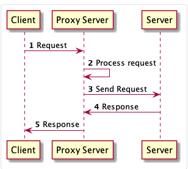

# 18 Proksiji Go modula

[17 Go moduli][17]  
[00 Sadržaj][00]  
[19 Jedinični testovi][19]

**Šta ćete naučiti u ovom poglavlju?**

- Šta je proksi modula?
- Razlozi za kreiranje proksija modula.
- Kako konfigurisati proksi za Go modul.

**Obrađeni tehnički koncepti!**

- Proksi server
- Forward proksy
- Server / Klijent

## Uvod

Komanda `go get` koristi proksi za preuzimanje najnovijih izdanja modula. U ovom odeljku ćemo detaljno opisati kako ovaj proksi funkcioniše.

## Proksi server

- Server je aplikacija koja pruža funkcionalnost drugim programima koji
  se nazivaju klijenti. Klijenti su, na primer, veb pregledači.
- Kada ova aplikacija pruža funkcionalnost putem interneta, nazivamo je
  "veb server".
- Proksi server je posebna vrsta servera.
- Delovaće kao posrednik između klijenata i jednog ili više servera.

Proksi server će primati zahteve za resurse koje ti zahtevi mogu, na primer:

- direktno obraditi zahtev
- proslediti ga serverima iza njega (ovu vrstu proksi servera nazivamo
  "Forward proxy")
- zaustavi zahtev

  
Dijagram sekvence za direktni proksi

Proksi serveri imaju mnogo slučajeva upotrebe:

- Filtriranje i praćenje internet saobraćaj.
  - Kompanije intenzivno koriste proksije za direktne posrednike kako bi
    pratile aktivnosti zaposlenih.
  - Takođe mogu blokirati neke zahteve ka zabranjenim veb lokacijama.
- Keširanje
  - Možemo koristiti proksije za keširanje resursa.
  - Umesto pozivanja ciljanog servera, oni će poslati keširani odgovor
    klijentu.

**Razlozi za nastanak Go Module Proxy-ja**:

Proksi modula Go je skorašnji dodatak jezičkim alatima. Pre nego što se komanda `go get` preuzme, modul se direktno preuzima sa veb stranice za deljenje koda. Ima neke nedostatke:

- Programer može da obriše modul sa veb stranice za deljenje sajta.
- Verzija se takođe može obrisati.
  - Oznaka je obrisana...
  - Kommit se može ukloniti...

Ako vaša aplikacija zavisi od izgradnje ovog modula, vaša Go aplikacija može biti nemoguća.

**Kako to funkcioniše**:

Komanda `go get` može da preuzme zavisnosti sa proksi servera modula bez dodirivanja originalnog servera koji hostuje kod (GitHub, GitLab,...).

Kada kod nije dostupan na proksi serveru, Go ga može direktno preuzeti sa hosting servera.

Ovo ponašanje možemo promeniti pomoću promenljive okruženja.

## Konfiguracija proksija Go modula

Konfiguracija proksija se podešava u promenljivoj okruženja GOPROXY.

Unosom komande

```sh
go env GOPROXY
```

možete proveriti njegovu trenutnu vrednost. U vreme pisanja ovog teksta, podrazumevana vrednost je:

```sh
<https://proxy.golang.org,direct>
```

Vrednost GOPROXY-ja je lista

- Lista je odvojena zarezima "," ili uspravnim crtama "|"
- Sastoji se od URL-ova proksija Go modula i/ili posebnih ključnih reči.
- Dostupne ključne reči su
  - "off": znači isključiti funkciju
  - "direct": nalaže alatu da ga direktno preuzme sa servera za
    hostovanje koda.

Go će pokušati da preuzme nove module sa svake navedene URL adrese proksija Go modula s leva na desno. Kada naiđe na ključnu reč "direct", pokušaće da preuzme modul direktno sa izvornog veb-sajta hosta.

**Onemogućavanje proksija Go modula**:

Da biste potpuno onemogućili funkciju, podesite GOPROXY okruženje na vrednost "off".

## Četiri krajnje tačke Go modula proksija (napredno)

Proksi modula go će otkriti četiri krajnje tačke (sve GET) `/<module>/@v/`list: preuzmite listu verzija koje poznaje proksi server.

- Npr: <https://proxy.golang.org/gitlab.com/loir402/bluesodium/@v/>
  lista  
  v1.0.0
  v1.0.1

- `/<module>/@latest`: preuzmite informacije o najnovijoj verziji u JSON
  formatu  
  Npr: <https://proxy.golang.org/gitlab.com/loir402/bluesodium/@v/latest> {"Version":"v1.0.1","Time":"2021-01-20T18:49:34Z"}

- `/<module>/@v/<version>.info`: preuzmite metapodatke o verziji modula
  i vremenu kada je potvrđen.  
  Npr : <https://proxy.golang.org/gitlab.com/loir402/bluesodium/@v/v1.0.1.info> {"Version":"v1.0.1","Time":"2021-01-20T18:49:34Z"}

- `/<module>/@v/<version>.mod`: vrati go.mod datoteku date verzije  
  Npr : <https://proxy.golang.org/gitlab.com/loir402/bluesodium/@v/v1.0.1.mod>

- `/<module>/@v/<version>.zip`: vrati zipovanu verziju modula.  
  Npr : <https://proxy.golang.org/gitlab.com/loir402/bluesodium/@v/v1.0.1.zip>

**Uobičajena greška: najnovija verzija nije preuzeta**:

Kada je za modul dostupna novija manja verzija ili zakrpa, komanda

go get -u modulePath

neće ga uvek odmah preuzeti. Servis ima keš memoriju radi poboljšanja performansi. Stoga, da biste rešili ovaj problem, imate dva rešenja:

- Sačekajte i pokušajte kasnije (keš memorija će biti poništena)
- Ciljajte tačno na verziju koju želite da koristite u komandi go get

  ```sh
  go get -u modulePath@v1.0.2
  ```

**Kkorisni linkovi za otklanjanje grešaka

- Kako dobiti listu dostupnih verzija modula na proksiju?  
  <https://PROXY_URL/MODULE_PATH/@v/list>  
  Npr: <https://proxy.golang.org/gitlab.com/loir402/bluesodium/@v/list>  
  Prikazaće listu dostupnih verzija za dati modul
  - Za glavnu verziju 2, link je:
    <https://proxy.golang.org/gitlab.com/loir402/bluesodium/v2/@v/list>

- Kako preuzeti izvorni kod modula u određenoj verziji:
  <https://PROXY_URL/MODULE_PATH/@v/VERSION.zip>
  Npr: <https://proxy.golang.org/gitlab.com/loir402/bluesodium/@v/v1.0.1.zip> pokrenuće preuzimanje izvornog koda

## Testirajte sebe

### Pitanja i odgovori

1. Kako se zove promenljiva okruženja koja kontroliše korišćenje
   proksija Go modula?
   - GOPROXY.
2. Kako onemogućiti korišćenje proksija modula u go get komandi?

   ```sh
   GOPROXY="off" go get gitlab.com/loir402/foo
   ```

### Ključno

- Proksi modula za Go je proksi server koji će čuvati kod Go modula.

- Umesto direktnog preuzimanja izvornog koda sa servera za hostovanje
  koda (npr. GitHub), komanda go može da ga preuzme sa proksi servera.

- Neki moduli mogu biti nepoznati proksiju; u tom slučaju, server će ih
  generalno dodati naknadno.
  - Na primer, zvanični Go Module Proxy ima taj sistem na mestu
  - Drugi proksiji Go modula mogu da implementiraju različite strategije

- Postoji zvanični Go Proxy dostupan svima, a to je <<https://proxy>.
  golang.org/>

- Takođe možete da instalirate sopstveni proksi server Go modula / ili
  da koristite hostovanu alternativu

- Da biste koristili određeni proksi, moraćete da izmenite promenljivu
  GOPROXY.

[17 Go moduli][17]  
[00 Sadržaj][00]  
[19 Jedinični testovi][19]

[17]: 17_Go_moduli.md
[00]: 00_Sadržaj.md
[19]: 19_Jedinični_testovi.md
