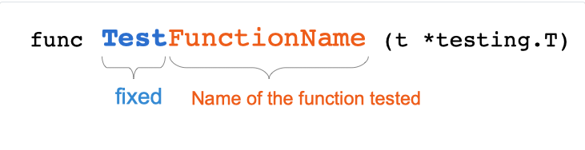

# 19 Jedinični testovi

[18 Proksiji Go modula][18] | [00 Sadržaj][00] | [20 Nizovi][20]

**Šta ćete naučiti u ovom poglavlju?**

- Šta su jedinični testovi
- Kako pisati jedinične testove
- Kako testirati svoj Go program pomoću Go alata

**Obrađeni tehnički koncepti!**

- Jedinični testovi
- Testni slučaj
- Test funkcija
- Tvrdnja
- Razvoj vođen testiranjem (TDD)
- Pokrivenost koda

## Uvod

Evo jedne funkcije:

```go
// compute and return the total price of a hotel booking
// all amounts in input must be multiplied by 100. Currency is Dollar
// the amount returned must be divided by 100. (ex: 10132 => 101.32 $)
func totalPrice(nights, rate, cityTax uint) uint {
   return nights*rate + cityTax
}
```

Ova funkcija izračunava cenu rezervacije. Deluje ispravno, zar ne? Kako biti siguran da je vraćeni iznos tačan? Možemo je pokrenuti sa nekim podacima kao argumentom i proveriti rezultat:

```go
package main

import "fmt"

func main() {
   price := totalPrice(3, 10000, 132)
   fmt.Println(price)
}
```

Program daje izlaz 30132 koji je ekvivalentan 301.32$. Trebalo bi da ga podelimo sa 100 da bismo dobili iznos u dolarima.

Da li je tačno? Hajde da to izračunamo ručno. Ukupna cena sobe je broj noćenja pomnožen sa cenom plus gradska taksa:3 ×(100+1,32)=3×101.32=303.96​​​​​3×( 100+1,32 )=3×101,32=303,96

Da li ste primetili grešku u funkciji?

Ova izjava:

```go
return nights*rate + cityTax
```

Trebalo bi ga zameniti ovim:

```go
return nights * (rate + cityTax)
```

Na ovaj način, funkcija vraća tačan odgovor. Šta ako naš program to direktno proveri?

```go
// unit-test/intro/main.go
package main

import "fmt"

//...

func main() {
    price := totalPrice(3, 10000, 132)
    if price == 30396 {
        fmt.Println("function works")
    } else {
        fmt.Println("function is buggy")
    }
}
```

Program će sam proveriti da li je implementacija funkcije ispravna. Nema iznenađenja, izbacuje da funkcija radi ! Ovaj program je jedinični test!

## Šta je jedinično testiranje

Ako uzmemo definiciju iz IEEE (Instituta za inženjere elektrotehnike i elektronike), jedinično testiranje je "testiranje pojedinačnih hardverskih ili softverskih jedinica ili grupa povezanih jedinica".

Testiramo pojedinačne delove sistema. Drugim rečima, proveravamo da li pojedinačni delovi sistema rade. Ne testira se ceo sistem.

Jedinične testove kreira i pokreće programer koda. Pomoću ovog alata možemo proveriti da li naše metode i funkcije rade kako je očekivano. Jedinični testovi fokusiraju se isključivo na proveru da li te male programske jedinice rade.

Neki programeri će tvrditi da su jedinični testovi beskorisni. Često kažu da kada razvijaju svoj kod, oni permanentno testiraju da li sistem funkcioniše. Na primer, veb programer koji treba da napravi veb stranicu često će imati dva ekrana, onaj sa izvornim kodom i onaj sa pokrenutim programom. Kada želi da implementira nešto novo, počeće sa kodom i proveriće da li radi.

Ovaj proces je isključivo ručni i zavisi od iskustva programera na sistemu. Novozaposleni možda neće otkriti greške i promene koje mogu izazvati probleme. Šta ako bismo mogli automatski da pokrećemo te testove? Zamislite da možete da pokrećete te testove svaki put kada pravite svoj Go program! Ili još bolje, mogli biste da ih pokrećete svaki put kada napravite promenu u paketu!

### Šta je test slučaj, test skup, tvrdnja?

Jedan jedinični test se naziva test slučaj. Grupa test slučajeva se naziva skup testova (ili paket testova).

Da bismo bolje razumeli šta je test slučaj, uzmimo jedan primer. Zamislite da ste razvili funkciju za pisanje stringa velikim slovom. Napravićemo test slučaj da bismo to proverili.

Naš test slučaj će se sastojati od:

- Test unos. Na primer: "kafa"
- Očekivani izlaz : U našem primeru, to će biti string "KAFA"
- Stvarni izlaz naše funkcije koju testiramo
- Način da se potvrdi da je stvarna vraćena vrednost naše funkcije ona koja se očekuje. Mogli bismo
  da koristimo funkcije poređenja nizova u programu Go da proverimo da li su dva niza jednaka. Takođe možemo da koristimo Go paket da bismo to uradili. Ovaj deo jediničnog testa se naziva tvrdnja.

### Zašto je potrebno jedinično testiranje koda?

U ovom odeljku ću proći kroz neke razloge izvučene iz IEEE ankete o jediničnom testiranju [@runeson2006survey] :

- Jedinični testovi će kontrolisati da li funkcije i metode rade kako se očekuje. Bez jediničnih
  testova, programeri testiraju svoju funkcionalnost tokom faze razvoja. Ti testovi se ne mogu reproducirati. Nakon razvoja funkcije, ti ručni testovi se više ne izvršavaju.
- Ako upišu svoje testove u izvorni kod projekta, mogu ih kasnije pokrenuti. Oni štite projekat od
  neprijatnih regresija (razvoj novih funkcija pokvari nešto u kodu drugog).
- Prisustvo jediničnog testa može biti zahtev kupca. Čini se da je prilično retko, ali neke
  specifikacije uključuju zahteve za pokrivenost testom.
- Bolji fokus na dizajn API-ja se generalno primećuje kada programeri pišu jedinične testove.
  Morate pozvati funkciju koju razvijate; kao posledica toga
  možete videti poboljšanja. Ovaj fokus je još veći ako koristite TDD metodu.
- Jedinični testovi takođe služe kao dokumentacija koda. Korisnici koji žele da znaju kako da
  pozovu određenu funkciju mogu pogledati jedinični test da bi odmah dobili odgovor.

### Gde postaviti testove

Nekoliko jezika stavlja testove u poseban direktorijum, često nazvan testovi. U Go-u, jedinični testovi se nalaze pored koda koji testiraju. Testovi su deo paketa koji se testira.

Možete videti da postoji obrazac imenovanja: za svaku datoteku sa imenom "xxx.go" postoji datoteka sa imenom "xxx_test.go".

Kada kompilirate svoj program, kompajler će ignorisati datoteku pod nazivom xxx_test.go.

### Kako napisati osnovni jedinični test

Hajde da zajedno napišemo naš prvi jedinični test. Testiraćemo paket foo:

```go
// unit-test/basic/foo/foo.go
package foo

import "fmt"

func Foo() string {
    return fmt.Sprintf("Foo")
}
```

### Test datoteka

Hajde da napravimo datoteku "foo_test.go" u istoj fascikli kao i "foo.go":

```go
// unit-test/basic/foo/foo_test.go 
package foo

import "testing"

func TestFoo(t *testing.T) {

}
```

Možete videti da je ova izvorna datoteka deo "foo" paketa. Uvezli smo paket "testing" iz standardne biblioteke (koju ćemo koristiti kasnije).

Definisana je jedna funkcija: "TestFoo". Ova funkcija kao ulaz uzima "pokazivač na testing.T" - `*testing.T`.

### Imenovanje testnog slučaja

Test funkcija treba da bude imenovana prema istoj konvenciji:

  
Potpis funkcije testiranja

- Prvi deo imena funkcije testiranja je reč Test. On je fiksan. Uvek je"Test"
- Drugi deo je često naziv funkcije koju želite da testirate. Mora početi velikim slovom.

### Sadržaj test slučaja

Evo primera testa funkcije Foo. Funkcija nema argument, ali uvek vraća string "Foo". Ako želimo da je testiramo jedinično, potvrdićemo (proverićemo) da je povratak funkcije "Foo":

```go
// unit-test/basic/foo/foo_test.go
package foo

import "testing"

func TestFoo(t *testing.T) {
    expected := "Foo"
    actual := Foo()
    if expected != actual {
        t.Errorf("Expected %s do not match actual %s", expected, actual)
    }
}
```

Prvo definišemo promenljivu "expected" koja sadrži očekivani rezultat. Zatim definišemo promenljivu "actual" koja će sadržati stvarnu povratnu vrednost funkcije "Foo" iz paketa foo.

Molim vas, zapamtite ova dva termina: "actual" i "expected". To su klasična imena promenljivih u kontekstu testiranja.

- Očekivana promenljiva je rezultat koji očekuje korisnik.
- Stvarna promenljiva sadrži rezultat izvršavanja jedinice koda koju želimo da testiramo.

Zatim se test nastavlja sa tvrdnjom. Testiramo jednakost između stvarne i očekivane vrednosti. Ako to nije slučaj, test neuspešno prolazi korišćenjem metode "t.Errorf" (koja je definisana na strukturi tipa T iz paketa testing):

```go
t.Errorf("Expected %s do not match actual %s", expected, actual)
```

### O uspehu i greškama

Ne postoji definisana metoda za tip T koja bi signalizirala uspeh testa.

Kada se funkcija za testiranje vrati bez pozivanja metode za neuspeh, onda se to tumači kao uspeh.

### Signal kvara

Da biste signalizirali kvar, možete koristiti sledeće metode:

- **Error**: će zabeležiti i označiti funkciju testiranja kao neuspešnu. Izvršavanje će se
  nastaviti.

- **Errorf**: će se evidentirati (sa navedenim formatom) i označiti funkciju testiranja kao
  neuspešnu. Izvršavanje će se nastaviti.

- **Fail**: će označiti funkciju kao neuspešnu. Izvršavanje će se nastaviti.

- **FailNow**: ova funkcija će označiti test kao neuspešan i zaustaviti izvršavanje trenutne
  funkcije testiranja (ako imate druge tvrdnje, one neće biti testirane).

Takođe imate metode **Fatal** koje će interno beležiti i pozivati **FailNow**.

### Test datoteke

Ponekad je potrebno da sačuvate datoteke koje će podržati vaše jedinične testove. Na primer, primer konfiguracione datoteke, CSV datoteke modela (za aplikaciju koja će generisati datoteke)...

**Sačuvajte te datoteke u testdata diru**.

### Assertion biblioteka

Standardna Go biblioteka pruža sve potrebne alate za izgradnju jediničnog testa bez eksternih biblioteka. Uprkos ovoj činjenici, uobičajeno je videti projekte koji koriste eksterne "biblioteke tvrdnji". Biblioteka tvrdnji pruža mnoge funkcije i metode za izgradnju tvrdnji. Jedan veoma popularan modul je "github.com/stretchr/testify."

Da biste ga dodali svom projektu, otkucajte sledeću komandu u terminalu:

```sh
go get github.com/stretchr/testify
```

Na primer, ovo je prethodni jedinični test napisan uz pomoć paketa "assertz" modula "github.com/stretchr/testify":

```go
// unit-test/assert-lib/foo/foo_test.go
package foo

import (
    "testing"

    "github.com/stretchr/testify/assert"
)

func TestFoo(t *testing.T) {
    assert.Equal(t, "Foo", Foo(), "they should be equal")
}
```

Postoje i druge biblioteke, brza pretraga na GitHabu može vam dati neke dodatne reference: <https://github.com/search?l=Go&q=assertion+library&type=Repositories>

### Kako pokrenuti jedinični test

#### Pokrenite testove određenog paketa

Da biste pokrenuli jedinične testove, morate da koristite interfejs komandne linije. Otvorite terminal i pređite na direktorijum vašeg projekta pomoću komande cd:

```sh
cd go/src/gitlab.com/loir402/foo
```

Zatim pokrenite sledeću komandu:

```sh
go test
```

Sledeći rezultat se prikazuje u terminalu:

```sh
PASS
ok     gitlab.com/loir402/foo 0.005s
```

Ova komanda će pokrenuti sve jedinične testove za paket koji se nalazi u trenutnom direktorijumu. Na primer, ako želite da pokrenete jedinične testove putanje paketa trenutnog direktorijuma:

```sh
cd /usr/local/go/src/path
go test
```

#### Pokrenite sve testove projekta

Možete pokrenuti sve jedinične testove vašeg trenutnog projekta pokretanjem komande:

```sh
go test./...
```

#### Neuspeh testa

Šta je izlaz neuspešnog jediničnog testa? Evo primera. Izmenili smo naš jedinični test da bi se srušio. Umesto stringa "Foo" očekujemo "Bar". Shodno tome, test ne uspeva.

```sh
$ go test
--- FAIL: TestFoo (0.00s)
    foo_test.go:9: Expected Bar do not match actual Foo
FAIL
exit status 1
FAIL   gitlab.com/loir402/foo 0.005s
```

Možete primetiti da je rezultat testa detaljniji u slučaju neuspeha. Naznačiće koji test slučaj nije uspeo ispisivanjem imena test slučaja ( TestFoo ). Takođe će vam dati red testa koji nije uspeo foo_test.go:9.

Tada možete videti da sistem štampa poruku o grešci koju smo mu rekli da odštampa u slučaju kvara.

Program se završava sa statusnim kodom 1, što vam omogućava da ga automatski detektujete ako želite da kreirate alate za kontinuiranu integraciju.

#### Izlazni kod (ili status izlaza)

- Izlazni kod različit od 0 signalizira grešku.
- Izlazni kod 0 signalizira NEMA grešaka

#### go test i go vet

Kada pokrenete `go test` komandu, alatka go će takođe automatski pokrenuti `go vet` na testiranim paketima (izvor paketa i testnih datoteka).

Komanda `go vet` je deo Go alata. Ona vrši verifikaciju sintakse vašeg izvornog koda kako bi otkrila potencijalne greške.

Ova komanda ima celu listu provera; kada pokrenete `go test`, pokreće se samo mali podskup:

- atomski
  - će otkriti loše upotrebe paketa sync/atomic
- bulova vrednost
  - Ova provera će potvrditi upotrebu bulovih uslova.
- oznake izgradnje
  - Kada pokrenete Go test, možete navesti oznake za izgradnju u komandnoj liniji, ova provera će
    potvrditi da ste ispravno formirali oznake za izgradnju u komandi koju unosite.
- nilfunc
  - proverava da nikada ne upoređujete funkciju sa nil

Automatsko pokretanje skupa `go vet` komandi pre pokretanja jediničnih testova je sjajna ideja. To vam može pomoći da otkrijete greške pre nego što one naštete vašem programu!

#### Samo kompajliraj

Da biste kompajlirali naš test bez njegovog pokretanja, možete otkucati sledeću komandu:

```sh
go test -c
```

Ovo će kreirati test binarnu datoteku pod nazivom "packageName.test".

### Kako napisati test za tabelu

U prethodnom primeru, testirali smo našu funkciju u odnosu na jedan očekivani rezultat. U stvarnoj situaciji, možda ćete želeti da testirate svoju funkciju pomoću nekoliko test slučajeva.

Jedan pristup bi mogao biti da se napravi testna funkcija poput ove:

```go
// unit-test/table-test/price/price_test.go
package price

import "testing"

func Test_totalPrice1(t *testing.T) {
    // test case 1
    expected := uint(0)
    actual := totalPrice(0, 150, 12)
    if expected != actual {
        t.Errorf("Expected %d does not match actual %d", expected, actual)
    }
    // test case 2
    expected = uint(112)
    actual = totalPrice(1, 100, 12)
    if expected != actual {
        t.Errorf("Expected %d does not match actual %d", expected, actual)
    }

    // test case 3
    expected = uint(224)
    actual = totalPrice(2, 100, 12)
    if expected != actual {
        t.Errorf("Expected %d does not match actual %d", expected, actual)
    }
}
```

Imamo 3 test slučaja; svaki test slučaj prati prethodni.

Ovo je dobar pristup; funkcioniše kako se očekuje. Međutim, možemo koristiti pristup testiranja
tabele koji može biti praktičniji:

```go
// unit-test/table-test/price/price_test.go
package price

import "testing"

func Test_totalPrice(t *testing.T) {
    type parameters struct {
        nights  uint
        rate    uint
        cityTax uint
    }
    type testCase struct {
        name string
        args parameters
        want uint
    }
    tests := []testCase{
        {
            name: "test 0 nights",
            args: parameters{nights: 0, rate: 150, cityTax: 12},
            want: 0,
        },
        {
            name: "test 1 nights",
            args: parameters{nights: 1, rate: 100, cityTax: 12},
            want: 112,
        },
        {
            name: "test 2 nights",
            args: parameters{nights: 2, rate: 100, cityTax: 12},
            want: 224,
        },
    }
    for _, tt := range tests {
        t.Run(tt.name, func(t *testing.T) {
            if got := totalPrice(tt.args.nights, tt.args.rate, tt.args.cityTax); got != tt.want {
                t.Errorf("totalPrice() = %v, want %v", got, tt.want)
            }
        })
    }
}
```

Kreiramo strukturu tipa pod nazivom parameters. Svako polje te strukture je parametar funkcije koja se testira.

Zatim kreiramo strukturu pod nazivom testCase. Sa tri polja:

- **name**: - naziv test slučaja, ime koje ljudi mogu da čitaju
- **args**: - parametri koje treba dati funkciji koja se testira
- **want** - očekivana vrednost koju vraća funkcija

Kreira se segment pod nazivom koji testssadrži elemente tipa testCase. Ovde ćemo ručno definisati svaki test slučaj

- Jedan test slučaj = jedan element isečka.

Zatim, pomoću for petlje, iteriramo kroz elemente isečka tests.

U svakoj iteraciji, pozivamo metodu "t.Run"

- Parametri:
  - naziv testatt.name
  - Anonimna funkcija koja sadrži test koji treba pokrenuti (njen potpis je sličan standardnom test
    slučaju)

U svakoj iteraciji upoređujemo ono što smo dobili (stvarnu vrednost) sa onim što očekujemo.

Evo rezultata ovog testa (uspešnog):

```sh
=== RUN   Test_totalPrice
=== RUN   Test_totalPrice/test_0_nights
=== RUN   Test_totalPrice/test_1_nights
=== RUN   Test_totalPrice/test_2_nights
--- PASS: Test_totalPrice (0.00s)
    --- PASS: Test_totalPrice/test_0_nights (0.00s)
    --- PASS: Test_totalPrice/test_1_nights (0.00s)
    --- PASS: Test_totalPrice/test_2_nights (0.00s)
PASS
```

Rezultat izvršavanja daje informaciju da su pokrenuta tri podtesta.

Takođe daje rezultat za svaki test zajedno sa nazivom testa.

### Dva režima testiranja

go testje komanda koju možemo pokrenuti u dva različita režima:

#### Režim lokalnog direktorijuma

Ovaj režim se aktivira kada pokrenete komandu:

```sh
go test
```

Ovde se ništa ne dodaje, samo go test. U ovom režimu, Go će izgraditi paket koji se nalazi u trenutnom direktorijumu.

Neće biti izvršeni svi jedinični testovi projekta, već samo oni definisani na trenutnom nivou paketa. Neki IDE-ovi će pokrenuti ovu komandu svaki put kada sačuvate izvorni fajl; to je prilično dobra ideja jer svaki put kada izmenite fajl paketa, možete proveriti da li jedinični testovi prolaze.

#### Režim liste paketa

U ovom režimu, možete zatražiti od komande Go da testira neke određene pakete ili sve pakete projekta.

Na primer, ako imate projekat koji definiše pkgNamestringove, možete pokrenuti sledeću komandu:

```sh
go test modulePath/pkgName
```

Ova komanda će raditi u bilo kom direktorijumu projekta. Pokrenuće test paketa pkgNameiz modula modulePath.

### 11.3 Keširanje

Kada ste u režimu liste paketa, go će keširati rezultate uspešnih testova. Ovaj mehanizam je razvijen da bi se izbeglo višestruko testiranje paketa.

Da biste testirali ovo ponašanje, pokrenite testove na stringovima paketa:

```sh
go test strings
```

Izveštaj će izvesti sledeće:

```sh
ok     strings    4.256s
```

Ovde možete videti da je vreme jediničnog testa 4,256 sekundi, što je prilično dugo.

Pokušajte da ga ponovo pokrenete:

```sh
go test strings
ok     strings    (cached)
```

Ovde možete videti da je rezultat trenutan i da se umesto trajanja prikazuje (keširano). To znači da je go preuzeo keširanu verziju rezultata testa.

#### Onemogućavanje keš memorije

Imajte na umu da kada izmenite test datoteku ili izvornu datoteku paketa, rezultat testa koji je keširan se poništava i test će biti efikasno pokrenut.

Da biste onemogućili keširanje, možete koristiti sledeću komandnu zastavicu:

```sh
go test strings -count=1
```

#### Promenljive okruženja i keš memorija

Ako koristite promenljive okruženja u izvornim datotekama, Go će keširati rezultat testa ako se podešene promenljive okruženja ne menjaju.

Uzmimo primer, zamislite da koristite promenljivu okruženja MYENVunutar vašeg test skripta:

```go
func TestFoo(t *testing.T) {
   env := os.Getenv("MYENV")
   fmt.Println(env)
   //..
}
```

Prvi put, kada izvršite test sa promenljivom okruženja podešenom na "BAR", test će se pokrenuti:

```sh
export MYENV=BAR && go test gitlab.com/loir402/foo
ok     gitlab.com/loir402/foo 0.005s
```

Pri drugom pokretanju iste komande, Go će preuzeti rezultat testa direktno iz keša:

```sh
ok     gitlab.com/loir402/foo (cached)
```

Ali ako promenite vrednost promenljive okruženja MYENV, test će se izvršiti:

```sh
export MYENV=CORGE && go test gitlab.com/loir402/foo
ok     gitlab.com/loir402/foo 0.005s
```

#### Otvaranje datoteka

Isti mehanizam se primenjuje kada vaš kod otvara datoteku. Ako prvi put pokrenete test, Go će keširati rezultat. Ali ako se datoteka promenila, rezultat se više ne kešira i test se ponovo izvršava:

```go
func TestFoo(t *testing.T) {
   d, err := ioutil.ReadFile("testdata/lol.txt")
   if err != nil {
      t.Errorf("impossible to open file")
   }
   fmt.Print(string(d))
   //..
}
```

Ovde otvaramo datoteku testdata/lol.txt. Ako prvi put pokrenemo test, on se izvršava i kešira.

Ako izmenimo sadržaj datoteke testdata/lol.txt i ponovo pokrenemo test, on će se izvršiti jer se sadržaj datoteke promenio, tada uslovi testiranja nisu isti.

### Paralelno pokretanje jediničnog testa

U velikom projektu, broj jediničnih testova može postati veoma veliki. Pokretanje jediničnih testova može oduzeti mnogo vremena timu.

Potrebno je da dodate poziv metode Paralleliz paketa testing kako biste omogućili da se vaš test istovremeno pokreće pomoću komandne linije go.

Uzmimo primer:

```go
func TestCorge1(t *testing.T) {
   time.Sleep(300 * time.Millisecond)
}

func TestCorge2(t *testing.T) {
   time.Sleep(300 * time.Millisecond)
}

func TestCorge3(t *testing.T) {
   time.Sleep(300 * time.Millisecond)
}
```

Ovde imamo 3 jedinična testa, koji ne testiraju ništa osim što samo čekaju po 300 milisekundi. Nismo namerno dodali nikakvu tvrdnju da bismo olakšali čitanje izvornog koda.

Hajde da pokrenemo te testove

```sh
go test
```

Rezultat testa je sledeći:

```sh
PASS
ok     gitlab.com/loir402/corge   0.913s
```

Testovi se izvršavaju za 0,913 sekundi, što je otprilike 3×300ms.

Hajde da ih pokrenemo paralelno:

```go
func TestCorge1(t *testing.T) {
   t.Parallel()
   time.Sleep(300 * time.Millisecond)
}

func TestCorge2(t *testing.T) {
   t.Parallel()
   time.Sleep(300 * time.Millisecond)
}

func TestCorge3(t *testing.T) {
   t.Parallel()
   time.Sleep(300 * time.Millisecond)
}
```

Ovde smo upravo dodali

```go
t.Parallel()
```

na početku testa. Ovaj jednostavan poziv metode će povećati brzinu izvršavanja našeg testa:

```sh
go test
PASS
ok     gitlab.com/loir402/corge   0.308s
```

Podelili smo vreme izvršavanja sa 3! Ovaj dobitak vremena je dragocen za razvojni tim, zato koristite ovu funkciju kada pravite svoje jedinične testove!

## Napredna upotreba komande go test

### Argumenti (-argumenti)

Možete napraviti test koji će prihvatati argumente komandne linije. Ti argumenti se mogu proslediti izvršnoj datoteci testa korišćenjem zastavice. Uzmimo primer testa koji zahteva argumente komandne linije.

```go
func TestArgs(t *testing.T) {
    arg1 := os.Args[1]
    if arg1 != "baz" {
        t.Errorf("Expected baz do not match actual %s", arg1)
    }
}
```

Ovde preuzimamo drugi argument komandne linije. Imajte na umu da os.Argsje to deo nizova ( ), a prvi indeks (0) je zauzet internim vrednostima komandne linije go test (mesto gde se nalazi keširana verzija).[]string

Da bismo prosledili argumente prilikom izvršavanja testa, možemo koristiti zastavicu -args:

```sh
go test gitlab.com/loir402/foo -args bar
```

Rezultat izvršenja je sledeći:

```sh
--- FAIL: TestArgs (0.00s)
    foo_test.go:24: Expected baz do not match actual bar
FAIL
FAIL    gitlab.com/loir402/foo  0.005s
```

Ovom metodom možete dodati onoliko zastavica koliko želite. Imajte na umu da to -argsnije deo keširanih zastavica.

### Zastavice

Možete proslediti sve postojeće zastavice za izgradnju u komandnu liniju go test. Pored toga, dostupne su i specifične zastavice za testiranje.

Namerno ne obrađujemo zastavice specifične za benčmarkove. Objasnićemo ih u posebnom poglavlju.

#### Zastavice pokrivenosti

Ova zastavica će prikazati analizu podataka o pokrivenosti. Po mom mišljenju, to je najvažnija zastavica koju treba znati. Podaci o pokrivenosti vam daju statistiku o procentu rešenja vašeg koda koji su pokriveni jediničnim testom:

```sh
go test -cover
PASS
coverage: 100.0% of statements
ok      gitlab.com/loir402/foo  0.005s
```

Ova zastavica vam omogućava da izaberete metod za izračunavanje procenta pokrivenosti (podrazumevana vrednost je "set", druge dostupne vrednosti su "count" ili "atomic"). Za više informacija o metodi izračunavanja, pogledajte odgovarajući odeljak.

Možete navesti da će se podaci o pokrivenosti izračunavati samo za podskup paketa vašeg projekta.

napišite negde podatke sa korica

#### Zastavice za probno pokretanje

Sa ovom zastavicom, kada se prvi test prekine, svi ostali testovi se ne pokreću. Ovo je korisno kada želite da otklonite greške u kodu i rešite probleme jedan po jedan (kada se dogode).

Ova zastavica će definisati maksimalan broj testova koji će se pokrenuti paralelno. Podrazumevano je podešena na promenljivu GOMAXPROCS.

Podrazumevano, vreme čekanja je podešeno na 10 minuta kada pokrećete testove. Shodno tome, jedinični testovi koji se izvršavaju duže od 10 minuta će izazvati paniku. Ako vašem test paketu treba više od 10 minuta da se izvrši, možete prebrisati to podešavanje i podesiti određeno trajanje (vrednost ove zastavice je string koji će biti analiziran kao vreme.Trajanje).

Detaljan režim će prikazivati imena test funkcija dok se pokreću:

Evo primera izlaza u režimu detaljnog prikazivanja:

```sh
=== RUN   TestCorge1
=== PAUSE TestCorge1
=== RUN   TestCorge2
=== PAUSE TestCorge2
=== RUN   TestCorge3
=== PAUSE TestCorge3
=== CONT  TestCorge1
=== CONT  TestCorge3
=== CONT  TestCorge2
--- PASS: TestCorge2 (0.31s)
--- PASS: TestCorge3 (0.31s)
--- PASS: TestCorge1 (0.31s)
PASS
ok      gitlab.com/loir402/corge    0.311s
```

Zapis je prilično dugačak za tri testa jer ih pokrećemo paralelno. Testovi koji se ne pokreću paralelno ne beleže korake PAUZIRAJ i NASTAVI:

```sh
=== RUN   TestCorge1
--- PASS: TestCorge1 (0.31s)
=== RUN   TestCorge2
--- PASS: TestCorge2 (0.31s)
=== RUN   TestCorge3
--- PASS: TestCorge3 (0.31s)
PASS
ok      gitlab.com/loir402/corge    0.921s
```

Kada pokrenete test, go će automatski pokrenuti go vet za skup uobičajenih grešaka (videti [subsec:Go-testvet] ). Ako želite da ga potpuno deaktivirate (ne preporučujem), možete postaviti ovu zastavicu na isključeno. Ali takođe možete dodati i besplatne provere.

#### Zastavice profilisanja

Komandna linija go test takođe definiše specifične zastavice za identifikaciju problema sa performansama vašeg koda. Te zastavice su obrađene u posebnom poglavlju "Profilisanje".

## Pokrivenost koda

- Da li je projekat dovoljno testiran?
- Šta definiše dobar nivo testa?
- Kako izmeriti nivo testiranja projekta?

Pokrivenost koda odgovara na ta pitanja. Pokrivenost koda je mera kako se projekat testira. Često se daje kao procenat.

Definicija mere nije jedinstvena i postoje različite definicije pokrivenosti koda.

Alat go može da izračuna ovu statistiku pokrivenosti koda umesto vas. Dostupna su tri režima (ili metode izračunavanja).

Da biste ispisali pokrivenost testa vašeg koda, pokrenite sledeću komandu:

```sh
go test -cover
PASS
coverage: 66.7% of statements

ok      go_book/testCoverage    0.005s
```

Vidite da je novi red dodat u rezime testa. On prikazuje procenat pokrivenosti koda.

U narednim odeljcima ćemo proći kroz različite metode izračunavanja ove slike.

### Podešen režim pokrivanja

Ovo je podrazumevani režim. U literaturi ovaj režim nazivamo "pokrivenost izjava" zato što broji procenat izvršenih izjava u testovima [@zhu1997software].

Savršena pokrivenost testom je 100%, što znači da su sve izjave koda testirane.

Uzmimo primer sa sledećim kodom:

```go
package testCoverage

func BazBaz(number int) int {
    if number < 10 {
        return number
    } else {
        return number
    }
}
```

Ovaj paket definiše jednu funkciju. Unutar ove funkcije, uslovna izjava razlikuje dva slučaja. Unesite brojeve manje od deset i brojeve veće od deset.

Hajde da napišemo test:

```go
func TestBazBaz(t *testing.T) {
    expected := 3
    actual := BazBaz(3)
    if actual != expected {
        t.Errorf("actual %d, expected %d", actual, expected)
    }
}
```

U ovom jediničnom testu, izvršavamo ga BazBazsa brojem 3 kao ulazom.

Hajde da pokrenemo test:

```sh
go test -cover
PASS
coverage: 66.7% of statements

ok      go_book/testCoverage    0.005s
```

Obradili smo samo 66,7% izjava.

#### Profil naslovnice

Da bismo lakše razumeli izračunavanje, go može generisati coverprofile, što je datoteka koja detaljno opisuje koje su izjave pokrivene.

Генерисан HTML код профила корице[слика:Coverprofile-HTML-generated]
Generisan HTML kod profila korice [slika:Coverprofile-HTML-generated]

Da biste generisali ovu datoteku, morate koristiti dve komande u vašem terminalu:

```sh
go test -coverprofile profile
```

Ova prva komanda će generisati datoteku profila:

```sh
mode: set
unit-test/coverage/testCoverage.go:3.29,4.17 1 1
unit-test/coverage/testCoverage.go:4.17,6.3 1 1
unit-test/coverage/testCoverage.go:6.8,8.3 1 0
```

Ova datoteka detaljno opisuje blokove koda vaše aplikacije. Svaki red predstavlja "blok". Na kraju svakog reda možete videti dve cifre: ukupan broj izjava i broj obuhvaćenih izjava (videti sliku 2 )

Датотека профила корице[слика:Датотека-профила-корице]
Datoteka Coverprofile [fig:Coverprofile-file]

Ova datoteka nije lako čitljiva. Iz ove datoteke možete generisati lep HTML fajl kao na slici 1. Da biste to uradili, otkucajte sledeću komandu:

```sh
go tool cover -html=profile
```

Kreiraće HTML stranicu, sačuvaće je (ne u direktorijumu vašeg projekta) i otvoriti je u pregledaču.

#### Povećanje pokrivenosti

Imamo ukupno tri naredbe, a dve su obrađene: prva naredba if, a zatim prva naredba return. To znači da2332​(ili 66,7%) izjava je obuhvaćeno.

Taj procenat možemo povećati na 100% integrisanjem testa preostale izjave (deo else našeg uslova):

```go
func TestBazBaz2(t *testing.T) {
    expected := 25
    actual := BazBaz(25)
    if actual != expected {
        t.Errorf("actual %d, expected %d", actual, expected)
    }
}
```

Ovo će dovesti do pokrivenosti od 100%. Svi iskazi našeg koda su pokriveni.

### Brojač režima pokrivanja

Režim brojanja je sličan režimu podešavanja. Pomoću ovog režima možete otkriti da li je neki deo koda pokriven sa više testova nego drugi.

Na primer, funkcija:

```go
func BazBaz(number int) int {
    if number < 10 {
        return number
    } else {
        return number
    }
}
```

testira se pomoću dva test slučaja:

- Onaj koji će testirati ulaz manji od 10
- Onaj koji će testirati ulaz veći od 10.

Sve naredbe su obuhvaćene, ali prva (uslovna naredba if) se testira dva puta. Tokom izvršavanja drugog testa, procenjuje se broj testa < 10.

Uslovni iskaz je "više" testiran od drugog.

Profil korice u režimu brojanja nema isti raspored kao što možete videti na slici 3.

Режим бројања Coverprofile-а[слика:Coverprofile-Count-mode]
Režim brojanja Coverprofile-a [slika:Coverprofile-Count-mode]

Što je izjava zelenija, to se više testira.

Profil coverprofile ima isti raspored, ali poslednja brojka predstavlja broj puta koliko je izraz testiran:

```sh
mode: count
unit-test/coverage/testCoverage.go:3.29,4.17 1 2
unit-test/coverage/testCoverage.go:4.17,6.3 1 1
unit-test/coverage/testCoverage.go:6.8,8.3 1 1
```

U drugom redu ovog profila možete videti da prvi blok koda (počinje na 3.29 i završava se na 4.17) ima 1 izjavu testiranu dva puta.

### Atomski režim pokrivanja (napredno)

Poslednji režim pokrivanja je brojanje. Koristan je kada pravite konkurentne programe. Interno, sistem će koristiti atomske brojače (umesto jednostavnih brojača). Sa tim konkurentnim bezbednim brojačima, profil pokrivanja će biti precizniji.

Da bih to demonstrirao, izmenio sam BazBazfunkciju da bi bila još gluplja dodavanjem beskorisnih gorutina:

```go
// unit-test/coverage/testCoverage.go
package testCoverage

import (
    "fmt"
    "sync"
)

func BazBaz(number int) int {
    var waitGroup sync.WaitGroup
    for i := 0; i < 100; i++ {
        waitGroup.Add(1)
        go concurrentTask(number, &waitGroup)
    }
    waitGroup.Wait()
    return number
}

func concurrentTask(number int, waitGroup *sync.WaitGroup) {
    useless := number + 2
    fmt.Println(useless)
    waitGroup.Done()
}
```

Pokrenućemo 100 beskorisnih istovremenih zadataka koji samo vrše dodelu: postavimo beskorisno na broj + 2. Koristimo grupe čekanja da bismo osigurali da će se svi naši istovremeni zadaci izvršiti pre nego što se program završi. Ne menjamo jedinične testove.

Hajde da stavimo coverprofile u režim brojanja:

```sh
go test -coverprofile profileCount -covermode count
cat profileCount
mode: count
go_book/testCoverage/testCoverage.go:8.29,10.27 2 2
go_book/testCoverage/testCoverage.go:14.2,15.15 2 2
go_book/testCoverage/testCoverage.go:10.27,13.3 2 200
go_book/testCoverage/testCoverage.go:18.60,22.2 3 197
```

I u atomskom režimu:

```sh
go test -coverprofile profileAtomic -covermode atomic
cat profileAtomic
mode: atomic
go_book/testCoverage/testCoverage.go:8.29,10.27 2 2
go_book/testCoverage/testCoverage.go:14.2,15.15 2 2
go_book/testCoverage/testCoverage.go:10.27,13.3 2 200
go_book/testCoverage/testCoverage.go:18.60,22.2 3 200
```

Ako koristimo režim brojanja, rezultat nije tačan. Za poslednji blok koda (od 18.60 do 22.2), režim brojanja je utvrdio da smo testirali izjavu 197 puta. Atomski režim je utvrdio da smo je testirali 200 puta, što je tačna vrednost.

Imajte na umu da će ovaj režim pokrivanja dodati dodatne troškove pri kreiranju profila pokrivača.
15 Razvoj vođen testiranjem (TDD)

Razvoj vođen testiranjem (ili TDD) je metoda razvoja gde dizajnirate testove pre nego što zapravo napišete softver.

Istorijski gledano, ova metoda se pojavila sa razvojem XP metodologije krajem devedesetih. Ova metoda je bila široko rasprostranjena u zajednici, a autori poput Roberta C. Martina 1 doprineli su njenom usvajanju.

Hajde odmah da pređemo na primer u programskom jeziku Go. Naš cilj je da napravimo funkciju koja će brojati samoglasnike u nizu. Prvo počinjemo kreiranjem test slučaja (koji će neuspešno završiti jer nismo kreirali funkciju):

```go
// unit-test/tdd/tdd_test.go
package tdd

import "testing"

func TestVowelCount(t *testing.T) {
    expected := uint(5)
    actual := VowelCount("I love you")
    if actual != expected {
        t.Errorf("actual %d, expected %d", actual, expected)
    }
}
```

Ovde pozivamo funkciju VowelCountsa rečenicom "I love you". U ovoj rečenici imamo pet samoglasnika; naš očekivani rezultat je ceo broj 4. Kao i obično, upoređujemo stvarni broj i očekivani.

Hajde da pokrenemo naš test da vidimo šta se dešava:

```sh
go test
# go_book/tdd [go_book/tdd.test]
./tdd_test.go:7:12: undefined: VowelCount
FAIL    go_book/tdd [build failed]
```

Ne možemo da kompajliramo; test ne uspeva.

Sada možemo implementirati našu funkciju. Počinjemo kreiranjem mape samoglasnika iz abecede.

```go
// unit-test/tdd/tdd.go
package tdd

var vowels = map[string]bool{
    "a": true,
    "e": true,
    "i": true,
    "o": true,
    "u": true}
```

Zatim kreiramo funkciju. Ona će iterativno uzimati svako slovo rečenice i proveravati da li se samoglasnik nalazi na mapi:

```go
// unit-test/tdd/tdd.go
package tdd

//...

func VowelCount(sentence string) uint {
    var count uint
    for _, char := range sentence {
        if vowels[string(char)] {
            count++
        }
    }
    return count
}
```

Znak je Unicode kodna tačka. Zato ga moramo konvertovati u string da bi naš skript radio. Hajde da ponovo pokrenemo test da vidimo da li naša implementacija radi:

```sh
go test
--- FAIL: TestVowelCount (0.00s)
    tdd_test.go:9: actual 4, expected 5
FAIL
exit status 1

FAIL    go_book/tdd     0.005s
```

Izgleda da ne radi. Šta bi moglo biti pogrešno sa našim kodom? Čini se da je jedno slovo preskočeno. Nešto smo propustili, ovde naš test string dolazi sa velikim slovom "i", ali ga upoređujemo sa malim slovima. To je greška. Želimo da brojimo i samoglasnike napisane velikim slovom.

Koje su opcije:

- Dodajte velika slova na našu mapu.
- Svako slovo treba pretvoriti u mala slova, a zatim uporediti sa postojećom mapom.

Drugo rešenje izgleda manje efikasno od prvog:

- U prvoj opciji, moramo potrošiti dragoceno vreme konvertujući svako slovo,
- Dok u drugom rešenju samo vršimo pretragu mape koja je zaista brza (O(1) ² ).

Dodajmo samoglasnike napisane velikim slovom na našu mapu:

```go
var vowels = map[string]bool{
    //...
    "A": true,
    "E": true,
    "I": true,
    "O": true,
    "U": true}
```

Onda ponovo pokrećemo naš test i on radi!

```sh
go test
PASS

ok      go_book/tdd     0.005s
```

#### Prednosti

- Programer je primoran da kreira funkciju koja se može testirati
- Kada smo pisali naš test, izabrali smo potpis naše funkcije. Ovo je čin dizajniranja usmeren na
  korišćenje naše funkcionalnosti. U određenoj meri, dizajniramo naš API na način usmeren na korisnika. Koristimo naš API pre nego što ga zapravo implementiramo, što nas tera da stvari održimo jednostavnim i upotrebljivim.
- Ovom metodom se testira svaka funkcija našeg izvornog koda.

Mogli biste tvrditi da ovaj način razvoja nije baš prirodan. Ovaj osećaj je normalan. Mnogi programeri (posebno mladi) koje sam upoznao nerado rade testove i više vole da razviju funkcionalnost u minimalnom vremenskom periodu.

#### Činjenice i brojke

Da bih vas ubedio u ovaj pristup, fokusiraću se na činjenice i na stvarne studije koje su sprovedene o TDD-u. (Ti rezultati su izvučeni iz veoma dobrog članka Dejvida Janzena @janzen2005test koji je objavljen 2005. godine):

- Korišćenje TDD-a je dovelo do smanjenja gustine defekata za 50% za kompaniju koja se sastoji od 9
  programera. Uz minimalan uticaj na produktivnost.

- Za drugu kompaniju, procenat smanjenja je bio 40%, bez ikakvog uticaja na produktivnost tima (9
  programera).

- Upotreba jediničnih testova dovodi do boljeg protoka informacija u kompaniji.

- Još jedna studija sprovedena na času osnovnih studija računarstva pokazala je smanjenje od 45%
  grešaka po hiljadu linija koda.

Nadam se da ste ubeđeni.

## Testirajte sebe

### Pitanja i odgovori

1. U Go programu gde se čuvaju test datoteke?  
   Test datoteke se čuvaju u istom direktorijumu kao i izvorne datoteke paketa.  

2. Razvijate funkciju pod nazivom ShippingCost. Koji je konvencionalni potpis njene test funkcije?

   ```go
   func TestShippingCost(t *testing.T)
   ```

   - Obratite pažnju na string "Test" na početku funkcije, ovo je obavezno.
     - Znakovi posle "Test" su slobodni, ali moraju početi velikim slovom ili donjom crtom (_)

3. U testu, potrebno je da učitate podatke iz posebne datoteke; gde ih možete sačuvati?  
   Možete kreirati direktorijum pod nazivom " testdata " u direktorijumu koji sadrži izvorne
   datoteke paketa.
   - U ovu fasciklu možete staviti datoteke učitane u vašim test slučajevima.

4. Šta je tvrdnja? Navedite primer.  
   U kontekstu jediničnih testova, tvrdnja je bulov izraz (tj. izraz koji će biti procenjen kao tačno ili netačno).  
   "Tradicionalni" primer je:

   ```go
   actual == expected
   ```

### Ključno

- Pisanje jediničnih testova je dobra praksa:
  - Pruža relativnu zaštitu od regresija.
  - Jedinični testovi mogu otkriti greške pre nego što se pojave u produkciji.
  - Poboljšajte dizajn API-ja vašeg paketa
- Jedinični testovi se nalaze unutar paketa.
- Testovi se pišu na test datotekama.
- xxx_test.go je konvencionalno ime test datoteke.
- Test datoteke mogu da sadrže više test funkcija
- Test funkcija može da sadrži nekoliko test slučajeva
- Ime test funkcije treba da počinje sa Test, sledeći znakovi su ili donja crtica ili veliko slovo
- Ime funkcije koja se testira je generalno sadržano u imenu test funkcije.
- Test funkcija ima sledeći potpis:

  ```go
  func TestShippingCost(t *testing.T)
  ```

- Tabelarni testovi su zgodan način za testiranje više test slučajeva u jednoj funkciji.
- Razvoj vođen testiranjem je metoda koja može povećati kvalitet vašeg koda i smanjiti nedostatke.
  - Jedinični test se piše pre stvarne implementacije
  - Jedinični test prvo ne uspe; cilj je onda da se on postigne.

[18 Proksiji Go modula][18] | [00 Sadržaj][00] | [20 Nizovi][20]

[18]: 18_Proksiji_Go_modula.md
[00]: 00_Sadržaj.md
[20]: 20_Nizovi.md
