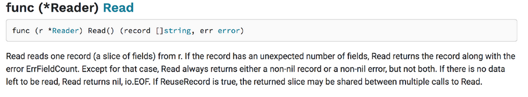

# 23 Greške

[22 Mape][22] | [00 Sadržaj][00] | [24 Anonimne funkcije i zatvaranja][24]

**Šta ćete naučiti u ovom poglavlju?**

- Šta su greške?  
- Kako napraviti grešku?  
- Kako se nositi sa greškama?

**Obrađeni tehnički koncepti!**

- Greške  
- Interfejs za greške  
- Greške sentinel  
- Neprozirne greške  
- Greške pri raspakivanju

## Termin greška obuhvata četiri različita koncepta

[IEEE](@institute1990ieee) rečnik  navodi četiri različita značenja termina "greška":

- Razlika između izračunate/posmatrane/izmerene vrednosti ili stanja i
  istinske/specifikovane/teorijske vrednosti ili stanja.
  - Primer: Program izračunava rastojanje između dva objekta. Program
    daje rezultat 30m, ali stvarno rastojanje je 28. Program je generisao grešku (error).

- Netačan korak ili definicija podataka u programu. Obično se naziva "
  greška".
  - Primer: Funkcija uzima kao ulaz string i treba da ga konvertuje u
    pokretni broj. String je neispravan; funkcija ne može da izvrši konverziju (fault).

- Netačan rezultat koji odstupa od očekivanog. Obično se naziva
  "neuspeh".
  - Primer: Funkcija je dizajnirana za izračunavanje ukupne cene za
    određenu rezervaciju. Kada se funkcija pokrene, cena je 145,99 dolara, ali kada je klijent izračunao pomoću kalkulatora, rezultat je 189 dolara. Rezultat funkcije je pogrešan. (failure)

    - Ovo je blizu prvoj definiciji

- LJudska radnja koja proizvodi pogrešan rezultat. Obično se naziva "
  greška". (mistake)
  - Na primer, administrator baze podataka je zamoljen da ubaci red u
    produkcijsku bazu podataka. On na kraju briše celu bazu podataka.

Kao programeri, moraćemo da pripremimo naše programe za potencijalne greške i kvarove. Takođe možemo izbeći greške pružanjem proširene dokumentacije naših programa.

## Primer - program koji može da otkaže

### Kontekst - čuvanje konfiguracije

Naš softver za upravljanje hotelima mora imati pristup nekim konfiguracionim vrednostima: naziv hotela, stopa PDV-a za zemlju, korisničko ime i lozinka njegovog sistema baze podataka itd.

Jedno jednostavno rešenje bi bilo da se te vrednosti konfiguracije direktno upišu u program. Nije nemoguće, ali se ne preporučuje; ne možemo da sačuvamo lozinku u kompajliranom binarnom fajlu našeg programa, niti stopu PDV-a. Morali bismo da ga ponovo kompajliramo ako se lozinka ili stopa PDV-a promene... Pored toga, to je bezbednosni problem; lozinka će biti direktno zapisana u binarnom fajlu, što ga čini čitljivim.

U ovom primeru, koristićemo ovo rešenje za učitavanje konfiguracije datoteke. Da vidimo kako da ga implementiramo.

### Implementacija error-example

Prva datoteka je, kao i obično, go.mod (inicijalizovana sa go mod init):

```go
module "maximilien-andile.com/errors/error-example"

go 1.16
```

Zatim imamo konfiguraciju paketa:

```go
// errors/example-failure/config/main.go
package config

import (
    "fmt"
    "io/ioutil"
)

func load() []byte {
    dat, err := ioutil.ReadFile("/tmp/myHotelApp/config.txt")
    fmt.Println(err)
    return dat
}

func Print() {
    fmt.Println(string(load()))
}
```

U ovom paketu imamo neeksportovanu funkciju: "load". Ona će čitati datoteku. Koristi funkciju `ReadFile` iz paketa `ioutil`. Datoteka koju ćemo učitati je identifikovana svojom putanjom:"/tmp/myHotelApp/config.txt"

Ovu funkciju poziva izvezena funkcija `Print`. Koja će ispisati podatke učitane iz datoteke.

Glavna datoteka će pozvati `config.Print`:

```go
// errors/example-failure/main.go
package main

import "maximilien-andile.com/errors/error-example/config"

func main() {
    config.Print()
}
```

### Izgradnja i pokretanje

```sh
$ go build main.go
./main
open /tmp/myHotelApp/config.txt: no such file or directory
```

Go nam govori da ne može da otvori datoteku jer ona ne postoji. Prikazani tekst nije u našem programu; nalazi se u promenljivoj `err`. Poziv funkcije `ioutil.ReadFile` vraća dva rezultata:

```go
dat, err := ioutil.ReadFile("/tmp/myHotelApp/config.txt")
fmt.Println(err)
```

Hajde da proverimo potpis ReadFile-a! Da bismo to uradili, imamo dve opcije:

- Ako koristite IDE, neki mogu da odu na definiciju funkcije jednim klikom.
  - Evo potpisa funkcije:

    ```go
    func ReadFile(filename string) ([]byte, error)
    ```

    Ako ga ne koristite, i dalje možete da odete na onlajn dokumentaciju
    Idite na `pkg.go.dev` i otkucajte `ioutil`

Primećujemo da funkcija vraća dva rezultata:

- Isečak bajtova
- Greška

Dokumentacija funkcije detaljno opisuje kako funkcija radi:

- `ReadFile` čita datoteku sa nazivom datoteke i vraća sadržaj. Uspešan poziv vraća `err == nil`, a ne `err == EOF`. Pošto `ReadFile` pročita celu datoteku, ne tretira EOF iz `Read` kao grešku koju treba prijaviti.

- Funkcija će pokušati da pročita celu datoteku.
- Učimo da je u slučaju uspeha vrednost greške jednaka `nil`
- Kada dođe do greške, vrednost drugog rezultata nije jednaka `nil`.

### Ispravite grešku

Hajde da kreiramo datoteku na traženoj lokaciji da bismo testirali ponašanje našeg programa. Da bismo to uradili, kreiraćemo datoteku sa komandnom linijom:

```sh
mkdir /tmp/myHotelApp
echo "hello" > /tmp/myHotelApp/config.txt
```

Prva komanda će kreirati direktorijum "/tmp/myHotelApp". Druga komanda će upisati "hello" u datoteku "/tmp/myHotelApp/config.txt". Imajte na umu da ćemo obrisati sadržaj koji se već nalazi u datoteci. (za dodavanje sadržaja koristite `>>` umesto `>`).

Hajde da pokrenemo program drugi put:

```sh
./main
<nil>
hello
```

Ovog puta vrednost `err` je odštampana `nil`. Program uspešno čita datoteku! Sadržaj je ispisan na ekranu.

## Interfejs `error` kao rezultat

Generalno, Go funkcije i metode vraćaju dva rezultata:

- Rezultat(i) funkcije, ono što očekujemo da funkcija proizvede.
- Element tipa error.
  - Npr:
    - Prvi rezultat funkcije `ioutil.ReadFile` je isečak bajtova koji sadrži sadržaj datoteke.
    - Drugi rezultat je greška.
  
      ```go
      func ReadFile(filename string) ([]byte, error)
      ```

  - Npr:
    - `fmt.Print` ln vraća broj zapisanih bajtova i grešku

      ```go
      func Println(a...interface{}) (n int, err error)
      ```

Kada je greška jednaka `nil` onda se izvršenje funkcije smatra uspešnim. Kada greška nije jednaka `nil`, onda je nešto pošlo po zlu i možemo odbaciti rezultat.

Neke funkcije/metode vraćaju samo element tipa `interface error`:

```go
csvWriter := csv.NewWriter(csvFile)
err = csvWriter.Write(invoiceData)
```

### Interfejs `error`

Evo interfejsa za greške definisanog u standardnoj biblioteci

```go
type error interface {
    Error() string
}
```

Sve greške vraćene u standardnoj biblioteci vratiće ovaj interfejs. Kada se ispiše greška, Error se izvršava.

### Modifikacija potpisa funkcije "Load"

Evo nove verzije funkcije "Load":

```go
// errors/example-fix/config/main.go
package config

import (
    "io/ioutil"
)

func Load() (string, error) {
    data, err := ioutil.ReadFile("/tmp/myHotelApp/config.txt")
    if err != nil {
        return "", err
    }
    return string(data), nil
}
```

Šta je novo?

- Funkcija je sada izvezena.
- Parametri rezultata su se promenili. Sada vraćamo a string i error.
- Kada pozivamo `ioutil.ReadFile` inicijalizujemo dve lokalne promenljive: "data" i "err".
  - Zatim testiramo vrednost err u odnosu na `nil`. Zašto?
    - Zato što nam dokumentacija `ioutil.ReadFile` kaže da "Uspešan poziv vraća `err == nil`".
    - Kao posledica toga, kada `err` nije jednako `nil` nešto je pošlo po zlu.
    - Ne pokušavamo da shvatimo šta je pošlo po zlu. Samo vraćamo dva rezultata: prazan string i
      grešku.
    - Pozivalac će morati da obradi grešku.
- Kada nema greške, vraćamo podatke preuzete iz datoteke i vrednost `nil`.
  - Zašto treba da vratimo nil(kao drugi rezultat)?
    - Zato što pozivalac mora da zna da li je došlo do greške. Signaliziramo je tako što
      valorizujemo drugi rezultatski parametar na nil.

### Pozivalac funkcije je obavešten kada se dogodila greška

```go
// errors/example-fix/main.go
package main

import (
    "fmt"
    "log"

    "maximilien-andile.com/errors/errorExampleFixed/config"
)

func main() {
    confData, err := config.Load()
    if err != nil {
        log.Fatalf("Impossible to load application config because: %s", err)
    }
    fmt.Println(confData)
}
```

#### Test programa

Hajde da testiramo ovu novu verziju:

```sh
go build main.go
./main
hello
```

Hajde da pokušamo da ga srušimo! Da bismo to uradili, obrisaćemo konfiguracioni fajl:

```sh
rm /tmp/myHotelApp/config.txt
./main
2020/03/07 18:13:21 Impossible to load application config because open /tmp/myHotelApp/config.txt: no such file or directory
```

Hajde da proverimo izlazni kod koji je vratio naš program:

```sh
echo $?
1
```

Izlazni kod je 1.

#### O izlaznom kodu

U UNIX i Windows sistemima, programi vraćaju izlazni kod kada se zaustave. Ovaj kod služi da upozori osobu (ili mašinu) koja je pokrenula program ako nešto pođe po zlu ili ne. Program koji vraća 0 kao izlazni kod se po konvenciji smatra da je izvršio svoj zadatak bez ikakvih problema. Kada program vrati drugi kod osim 0, nešto je pošlo po zlu.

Neki programi će vratiti određeni izlazni kod u slučaju određenih grešaka. U njihovoj dokumentaciji ćete pronaći mapiranje između koda i njegovog značenja.

U programu Go, možemo prisiliti operativni sistem da zatvori program sledećim pozivom:

```go
os.Exit(1)
```

Možete menjati vrednost jednu po jednu ceo broj od 0 do 125 da biste program učinili prenosivim na sve sisteme.

```go
os.Exit(120)
```

## Kako kreirati samostalne greške?

Možete koristiti nekoliko metoda za kreiranje grešaka:

### errors.New

Paket `errors` iz standardne biblioteke predlaže implementaciju interfejsa za greške. Omogućava vam da lako kreirate grešku u vašoj aplikaciji. Uzmimo primer upotrebe:

```go
// errors/example-fix-2/config/config.go
package config

import (
    "errors"
    "io/ioutil"
)

const fileHeader = "APPCONF"

func Load() (string, error) {
    data, err := ioutil.ReadFile("/tmp/myHotelApp/config.txt")
    if err != nil {
        return "", err
    }
    
    conf := string(data)
    if conf[0:8] != fileHeader {
        return "", errors.New("the config file do not begin by accepted header")
    }

    return conf, nil
}
```

Ovde dodajemo još jedan test našem programu za učitavanje konfiguracije. Datoteka mora početi određenim karakterima. Uzimamo prvih sedam karaktera (sečenjem promenljive conf: uzimamo karakter od indeksa 0 uključeno do indeksa 8 isključeno).

Kada datoteka ne počinje vrednošću konstante fileHeader. Vraćamo prazan string zajedno sa novom greškom napravljenom pomoću funkcije `New` iz paketa errors. Hajde da testiramo našu grešku.

```go
$ go run main.go
2020/03/06 19:14:07 Impossible to load application config because the config file does not begin by accepted header
exit status 1
```

### fmt.Errorf

Paket `fmt` vam omogućava da kreirate greške sa `fmt.Errorf`. Evo primera:

```go
func Load() (string, error) {
    //...
    if conf[0:8] != fileHeader {
        return "", fmt.Errorf("the config file do not begin by accepted header")
    }
    //..
}
```

> [!Note]
> **Pažnja**:  Interno, `fmt.Errorf` će pozvati `errors.New`!

### Greška Sentinel

Greške tipa "Sentinel" su uobičajene u standardnoj biblioteci. One su izvezene promenljive tipa greške. Funkcije i metode paketa će ih vratiti. Pozivaoci će moći da preduzmu akcije ako se takva greška vrati (pogledajte sledeći odeljak da biste videli kako da se obradite sa greškama tipa "Sentinel").

```go
// errors/sentinel/config/config.go
package config

import (
    "errors"
    "io/ioutil"
)

var ErrNoConfigFile = errors.New("no config file at the specified location: /tmp/myHotelApp/config.txt")

func Load() (string, error) {
    data, err := ioutil.ReadFile("/tmp/myHotelApp/config.txt")
    if err != nil {
        return "", ErrNoConfigFile
    }
    return string(data), nil
}
```

Evo jednog primera u paketu `rsa`:

```go
var ErrMessageTooLong = errors.New("crypto/rsa: message too long for RSA public key size")
```

I u paketu io:

```go
var ErrShortWrite = errors.New("short write")
var ErrShortBuffer = errors.New("short buffer")
var EOF = errors.New("EOF")
var ErrNoProgress = errors.New("multiple Read calls return no data or error")
```

### Prilagođeni tip koji implementira interfejs za greške

```go
type HeaderError struct {
    FaultyHeader string
}

func (e *HeaderError) Error() string {
    return fmt.Sprintf("Bad header. Provided %s, expected : APPCONF", e.FaultyHeader)
}
```

Tip `HeaderError` implementira `error` interfejs. Možemo ga koristiti u našoj funkciji:

```go
func Load() (string, error) {
    //...
    if conf[0:8] != fileHeader {
        return "", &HeaderError{FaultyHeader:conf[0:8]}
    }
    //..
}
```

## Kako pretvoriti grešku u drugu grešku

### Šta je omotavanje

Funkcija ili metode mogu naići na grešku zbog poziva druge funkcije. Evo primera:

```go
// errors/wrapping/useCase/main.go 

func transferFileContents(filename string) error {
    contents, err := ioutil.ReadFile(filename)
    if err != nil {
        return err
    }
    err = ioutil.WriteFile("/tmp/filecontents", contents, 0644)
    if err != nil {
        return err
    }
    return nil
}
```

`transferFileContents` vrši dva poziva funkcija: `ioutil.ReadFile` i `ioutil.WriteFile`. Te dve funkcije vraćaju greške. Kada se takva greška dogodi, funkcija direktno vraća greške koje su vratile funkcije paketa `ioutil`. Kada se dogodi greška, pozivalac će dobiti grešku bez dodatnog konteksta:

```go
open /tmp/myHotelApp/config.txt: no such file or directory
```

Ono što bismo mogli da uradimo jeste da ovu grešku umotamo u novu grešku kako bismo joj dodali kontekst:

```go
during the transfer of file context, something went wrong: open /tmp/myHotelApp/config.txt: no such file or directory
```

### sa fmt.Errorf

Da biste omotali grešku, možete koristiti sledeću sintaksu:

```go
// errors/wrapping/fmt/main.go
package main

//...
func transferFileContents(filename string) error {
    contents, err := ioutil.ReadFile(filename)
    if err != nil {
        return fmt.Errorf("during file transfer impossible to open source file: %w", err)
    }
    
    err = ioutil.WriteFile("/tmp/filecontents", contents, 0644)
    if err != nil {
        return fmt.Errorf("during file transfer impossible to write source file: %w", err)
    }
    
    return nil
}
```

Da bismo grešku uklopili u novu grešku, koristimo glagol `%w`.

Hajde da napravimo jednostavnu aplikaciju koja koristi ovu funkciju:

```go
// errors/wrapping/fmt/main.go
package main

import (
    "fmt"
    "io/ioutil"
    "log"
)

func main() {
    err := transferFileContents("/my/imaginary/file")
    if err != nil {
        log.Printf("error occured: %s", err)
    }
}
```

Kada se vrati greška, zabeležena poruka je sada:

```sh
2020/03/22 19:09:13 error occurred: during file transfer impossible to open source file: open /my/imaginary/file: no such file or directory
```

Umesto:

```sh
2020/03/22 19:10:18 error occured: open /my/imaginary/file: no such file or directory
```

### Sa prilagođenim tipom greške i metodom `Unwrap`

Kada definišete prilagođeni tip greške, možete implementirati `Unwrap` metod:

```go
type ReadingError struct {
    IOError  error
    Filename string
}

func (e *ReadingError) Error() string {
    return fmt.Sprintf("an error occured while attempting to read the file %s", e.Filename)
}

func (e *ReadingError) Unwrap() error {
    return e.IOError
}
```

Metod `Unwrap` vraća osnovnu grešku

## Kako se nositi sa greškama

### Ne ignorišite ih

Imate moć da ignorišete greške. Ne bi trebalo da koristite ovu moć! Ako nešto pođe po zlu, trebalo bi da izmenite tok programa.

```go
// DON'T DO THAT
func main() {
    transferFileContents("/my/imaginary/file")
    log.Println("tranfer done")
}

func transferFileContents(filename string) error {
    //...
}
```

`transferFileContents` vraća jednu grešku. U `main` funkciji jednostavno ignorišemo grešku. Kada je prenos neuspešan i dalje beležimo da je prenos završen!

#### Opcija 1: tretirajte ih kao neprozirne

U nekim Go programima, greške se tretiraju kao neproziran signal. Pozivalac neće ispitati greške da bi utvrdio njihov uzrok. Samo će proveriti da li je `err`!=`nil`:

```go
func main() {
    err := transferFileContents("/my/imaginary/file")
    if err != nil {
        log.Fatalf("transfer impossible caused by: %s", err)
    }
    log.Println("tranfer done")
}
```

Korisnik će biti upozoren na grešku.

#### Opcija 2: prilagodite tok programa u zavisnosti od greške

### Otkrivanje greške sentinela jednostavnim poređenjem

Pozivalac može da detektuje grešku sentinela koju vraća funkcija. Evo veoma čestog primera: čitanje CSV datoteke. Evo CSV datoteke koju ćemo čitati:

John,Doe,256
Diffie,Lock,257

Svaki red predstavlja jedan zapis. Vrednosti zapisa su odvojene zarezima (CSV znači vrednosti odvojene zarezima). Evo koda:

```go
// errors/handling/detect/sentinelIs/main.go
package main

import (
    "encoding/csv"
    "errors"
    "fmt"
    "io"
    "log"
    "os"
)

func main() {
    file, err := os.Open("test.csv")
    defer file.Close()
    if err != nil {
        log.Printf("impossible to open file %s", err)
        return
    }

    r := csv.NewReader(file)
    for {
        record, err := r.Read()
        if errors.Is(err, io.EOF) {
            break
        }
        if err != nil {
            log.Fatal(err)
        }
        fmt.Println(record)
    }
}
```

Ova skripta će čitati CSV datoteku i iterativno prolaziti kroz nju. Koristi CSV Reader. `Reader` ima metodu `Read` koja će čitati jedan red. Da bismo pročitali sve podatke u datoteci, dodali smo for petlju.

Evo dokumentacije za Read metodu:



Kada se dođe do kraja datoteke, `Read` će vratiti `nil` i sentinel error `io.EOF`. Kada je `err` jednako `io.EOF` zaustavljamo petlju sa `break`. To je razlog zašto proveravamo vrednost `err` dva puta:

```go
if err == io.EOF {
    break
}
if err != nil {
    log.Printf(err)
    return
}
```

U prvom slučaju, više nije potrebno čitati linije iz datoteke, u drugom slučaju, dešava se nešto loše. U ovom slučaju, želimo da se naš program odmah zaustavi, dok u drugom slučaju samo izlazimo iz petlje!

### Detekcija greške sentinela pomoću grešaka

Pomoću funkcije `Is` iz paketa `errors`, možete otkriti da li je došlo do određene greške. `Is` će otkriti greške koje su omotane! Evo potpisa funkcije:

```go
func Is(err, target error) bool
```

Dva ulazna parametra: err i target tipa interface error. `targetParametar` je greška koju želite da otkrijete u lancu, `err` je vaša stvarna greška. Evo primera upotrebe:

```go
r := csv.NewReader(file)
for {
    record, err := r.Read()

    // use Is instead of an equality comparison
    if errors.Is(err, io.EOF) {
        break
    }

    if err != nil {
        log.Fatal(err)
    }
    fmt.Println(record)
}
```

U ovom isečku, mogli smo da zamenimo `errors.Is(err, io.EOF)` sa poređenjem jednakosti jer `io.EOF` se direktno vraća pomoću `r.Read()`. Sledeći primer će pokazati da je funkcija `Is` sposobna da detektuje greške čuvara u lancu grešaka:

```go
// errors/handling/detect/sentinelIsChain/main.go
package main

import (
    "errors"
    "fmt"
)

func main() {
    err := foo()
    if errors.Is(err, errSentinel) {
        fmt.Println("errSentinel detected in the error chain with errors.Is")
    }
    if err == errSentinel {
        fmt.Println("errSentinel detected in the error chain by ==")
    }
}

var errSentinel = errors.New("test")

func foo() error {
    return fmt.Errorf("error : %w", bar())
}

func bar() error {
    return errSentinel
}
```

Evo rezultata izvršavanja ove skripte:

```go
errSentinel detected in the error chain with errors.Is
```

U `main` funkciji pozivamo funkciju "foo" koja će vratiti grešku koja obuhvata rezultat "bar". Funkcija "bar" vraća čuvaru grešku "errSentinel".

### Detekcija tipa greške pomoću `errors.As`

Funkcija `errors.As` se može koristiti za otkrivanje da li se u lancu grešaka vraća greška tipa X. Pogledajmo potpis ove funkcije:

```go
func As(err error, target interface{}) bool
```

Funkcija prima dva argumenta:

- error koja je tipa interfejs error
- target koji je tipa prazan interfejs. Imajte na umu da ovaj parametar
  - (A) ne može biti nula
  - (B) mora biti pokazivač
  - (C) mora biti interfejs ili implementirati interfejs za greške

Evo jednog primera:

```go
// errors/handling/detect/type/main.go
package main

import (
    "errors"
    "fmt"
    "io/ioutil"
    "log"
)

func main() {
    err := transferFileContents("/my/imaginary/file")
    var readingError *ReadingError
    if errors.As(err, &readingError) {
        log.Fatalf("error of reading occured: %s: %s", readingError, readingError.Unwrap())
    }
    var writingError *WritingError
    if errors.As(err, &writingError) {
        log.Fatalf("error of writing occured: %s", err)
    }
    log.Println("transfer done")
}
```

`readingError` je promenljiva tipa `*ReadingError`.`*ReadingError` je pokazivački tip. On predstavlja sve pokazivače na promenljivu tipa `ReadingError`. Pozivamo `errors.As` sa dva argumenta: `err` i `&readingError`. Operator `&` signalizira da uzimamo adresu promenljive `readingError`. Šta ako direktno damo `errors.As` promenljivu readingError? Zašto ne? Hajde da detaljno objasnimo zašto:

- Kolika je vrednost readingError prava nakon njegovog proglašenja?
  - To je nil. Krši pravilo (A).

- Koja je vrsta readingError?
  - *ReadingError

- Šta je &readingError?
  - To je pokazivač na vrednost readingError koja je jednaka nuli.
  - To NIJE pokazivač na nil. Pokazuje na vrednost koja je nil, ali sam pokazivač nije nil.
  - Stoga &readingError nije nula (A) i jeste pokazivač (B).
- Da li je &readingError interfejs?
  - Ne
- Da li &readingError implementira interfejs za greške?
  - Da! Pravilo C je potvrđeno.

## Saveti

Greške i problemi su deo programiranja. Vaš program mora da obradi sve greške koje se mogu dogoditi. Morate razmišljati o najgorem. Zapitajte se šta bi moglo poći po zlu u tom redu? Koje tehnike bi zli korisnik mogao da upotrebi da bi vaš program propao?

Preporuke za rešavanje grešaka

- Uvek dodajte kontekst greškama
- Nikada ne ignorišite greške
- Pažljivo koristite fatalne greške
- Kreirajte programe otporne na greške

### Dodajte kontekst greškama

Prilikom kreiranja grešaka, trebalo bi da pružite dovoljno informacija korisnicima (ali i timu koji će obavljati održavanje vaše aplikacije). Greške bez konteksta je teže razumeti, a pronalaženje njihovog porekla u izvorima može biti izazovno.

### Ne ignorišite greške

Možda je očigledno, ali ipak, mnogi programeri prave ovu grešku. Greške koje se pojave treba rešiti:

- vraćeno pozivaocu
- ili tretirano (vaš kod implementira neku vrstu mehanizma za automatsku korekciju).

### Pažljivo koristite fatal

Kada pozovete `log.Fatal` implicitno prisiljavate program da naglo završi (sa `os.Exit(1)`). "Program se odmah prekida; odložene funkcije se ne izvršavaju." (os/proc.go). Odložene funkcije se često koriste za logiku čišćenja (na primer, zatvaranje deskriptora datoteka). Shodno tome, njihovo nepokretanje može sprečiti program da izvrši logiku čišćenja.

### Kreirajte programe otporne na greške

Termin "tolerancija na greške" često koriste hardverski inženjeri. Većina hardverskih komponenti je dizajnirana da se nosi sa kvarovima i da se oporavi od njih. Softverski inženjeri bi takođe trebalo da naprave svoje programe tako da tolerišu greške. Program bi trebalo da bude u stanju da služi svojoj svrsi uprkos kvarovima (koji mogu biti prolazni ili trajni ).

Šta to znači za Go programere, koje tehnike bismo mogli da primenimo da poboljšamo naše programe?

### Oporavak od grešaka

Ako dođe do greške, proverite je da biste utvrdili da li se može popraviti ili ne.

Na primer, pravite program koji poziva veb servis. Tokom izvršavanja vašeg programa, poziv je neuspešan. Izvor kvara je mreža (vaš server je isključen sa interneta). Ova greška je popravljiva, što znači da se možete oporaviti od greške jer će mreža ponovo postati dostupna u nekom trenutku.

Ako je poziv vašem veb servisu uspešno prošao kroz mrežu, ali je vratio HTTP 400 grešku ("Loš zahtev"), greška se ne može popraviti. Očigledno je da ste napravili grešku kada ste razvijali svog veb servis klijenta. Biće neophodna ljudska intervencija da bi se ovo ispravilo.

### Implementirajte rezervnu opciju

Rezervna opcija je "opcija za nepredviđene situacije koja se koristi ako preferirani izbor nije dostupan" (Vikipedija). U našem programu, na primer, mrežni poziv nije moguć ili je vratio grešku. Trebalo bi da razmislimo o opcijama.

Opcije neće biti iste bez obzira da li se greška može popraviti ili ne.

Ako ste doživeli mrežni kvar, umesto direktnog vraćanja greške, možete implementirati mehanizam ponovnog pokušaja. Pokušaćete ponovo da kontaktirate veb servis podesiv broj puta.

## Primena

### Problem

U postojećem sistemu, fakture koje generiše grupa hotela su jednostavne tekstualne datoteke. Te datoteke se čuvaju na čvrstim diskovima koji se nalaze u arhivskoj sobi. Novi softver će morati da učita sve te fakture da bi radio.

Vaš klijent je rekao da:

- Fakture se kodiraju pomoću CSV formata.
- Fakture su izdate od jula 2003. do jula 2020. godine
- Iznos novca je formiran:
  - u američkim dolarima
  - sve pomnoženo sa 100.
  - npr: 13,54 dolara će biti 1354 u datoteci

- Svi su sačuvani u direktorijumu.
- U ovom direktorijumu, to su poddirektorijumi.
- Svaki poddirektorijum je posvećen jednom mesecu.
- Svaki poddirektorijum je imenovan prema istom obrascu:
  - Mesec-Godina.
  - Npr.: October-2008.

Od vas se traži da napravite program koji će:

- Pročitati sve datoteke sa fakturama

- Izračunati:

  - Ukupan iznos PDV-a koji je hotel naplatio
  - Ukupan iznos novca koji su kupci platili (sa PDV-om)
  - Ukupan iznos faktura bez PDV-a
  - Ti iznosi moraju biti dati za svaki mesec

Program mora biti otporan na greške. Možda neke fakture nisu baš čiste... Da biste uradili ovu vežbu, možete preuzeti fasciklu sa fakturama.

### Saveti / Preporuke

- Potrebno je da pronađete način da izračunate tri cifre za svaki mesec između jula 2003. i 2020.
  godine.
- Možda bi for petlja mogla da pomogne.
- Postoji šablon u nazivu direktorijuma; možete ga koristiti u svom kodu...
- Moraćete da koristite funkcije iz paketa:
  - fmt
  - github.com/Rhymond/go-money
  - log
  - os
  - time
  - "encoding/csv"
- Preporučuje se da koristite eksterni modul "github.com/Rhymond/go-money".
  - Pomoću ovog modula možete da se nosite sa izračunavanjem novca
- Pre nego što kodirate stvarnu implementaciju, možete napisati pseudokod (opis napisan na
  engleskom jeziku svakog koraka koji izvršava vaš program)

### Rešenje

#### Ideja

Moramo da prođemo kroz sve direktorijume. Svaki direktorijum sadrži podatke specifične za određeni mesec. Možemo da predvidimo njihova imena. Sa imenom direktorijuma, možemo ga zatim otvoriti i pročitati sve datoteke koje se u njemu nalaze.

Potrebno je da analiziramo njegov sadržaj za svaku datoteku i izvučemo PDV i ukupan iznos PDV-a isključen. Ukupan iznos je jednostavno (PDV + PDV isključen). Stoga nije potrebno izvlačiti ga.

Posle svakog meseca, štampamo ukupne iznose za taj mesec, a zatim moramo ponovo inicijalizovati brojače!

#### Pseudokod

- Za svaki mesec između jula 2007. i jula 2020.
  - ukupanPDV = 0
  - ukupanPDV bez PDV-a = 0
  - Naziv fascikle = mesec-godina
  - otvori ime fascikle
  - k = 0
  - Za svaku datoteku u direktorijumu
  - k++
  - Naziv datoteke = faktura-k
  - Otvori i pročitaj ime datoteke
  - Raščlanjivanje sadržaja
  - ukupanPDV = ukupanPDV + PDV izvučen iz fakture
  - ukupanIzuzetakPDV-a = ukupanIzuzetakPDV-a + IzuzetakPDV-a izvučeno iz fakture
  - Štampaj totalVat $ totalVatEkc $ za mesec-godinu

Napomena : Toplo vam preporučujem da ovde stanete i pokušate sami da implementirate algoritam.

Možda nećete moći da to uradite u potpunosti, i u redu je! Samo pokušajte! Nakon toga, pažljivo pročitajte detaljno rešenje (koje nije jedino validno).

#### Implementacija aplikacije

- Prvo, kreiramo projekat kreiranjem novog direktorijuma i datoteke "go.mod".

  ```go
  module maximilien-andile.com/errors/application
  
  go 1.13
  ```

  Putanju modula možete prilagoditi svojim potrebama. Možete kreirati datoteku go.mod ručno ili pomoću sledeće komande:

  ```sh
  go mod init maximilien-andile.com/errors/application
  ```
  
- Zatim kreiramo strukturu direktorijuma (videti sliku 5 ).
  - Kreiramo cmd direktorijum. On će sadržati sve naše glavne datoteke. Svaka glavna datoteka će
    biti sačuvana u poddirektorijumu.
  - Za sada imamo jednu aplikaciju. Kreiramo jedan direktorijum pod nazivom "compute".
  - Unutar ovog direktorijuma kreiramo praznu datoteku compute.go. (to će biti datoteka naše
    aplikacije).

- Zatim, pišemo strukturu datoteke "compute.go":

  ```go
  package main
  
  
  func main() {
  
  }
  ```

Izvorna datoteka Compute.go pripada paketu main. U ovoj izvornoj datoteci definišemo funkciju main.

- Potrebne su nam iteracije tokom vremena. Da bismo to uradili, koristićemo for petlju. For petlji
  će biti potreban početni i krajnji datum. Go ima standardni paket za vremenske vrednosti: `time`!

```go
package main

import "time"

const startDate = "2003-07-01"
const endDate = "2020-07-01"

func main() {
    start, err := time.Parse("2006-01-02", startDate)
    if err != nil {
        log.Fatalf("impossible to parse start date %s", err)
    }
    end, err := time.Parse("2006-01-02", endDate)
    if err != nil {
        log.Fatalf("impossible to parse end date %s", err)
    }
}
```

Ovde koristimo funkciju `Parse` iz paketa `time`. Pogledajmo njenu dokumentaciju (na <https://pkg.go.dev/time>)

```go
func Parse(layout, value string)(Time, error)
```

Parsiranje će uzeti dva parametra, izgled i string koji predstavlja vreme. Oba su stringovi. Izgled pokazuje Go-u kako je formatirano ulazno vreme (drugi parametar).

Izgled nije YYYY-MM-DD (neki iskusni programeri su više navikli na tu vrstu rasporeda) nego 2006-01-02. Referenca u vremenu: pon jan 2 15:04:05 -0700 MST 2006 se koristi za definisanje izgleda.

U našem primeru, analiziramo vremenske stringove "2003-07-01", "2020-07-01" koji su sačuvani u dve konstante. Izgled ovde je "2006-01-02".

Imajte na umu da operacija parsiranja može da ne uspe, zato time.Parse vraća grešku kao drugi parametar. Kada dođe do greške, pozivamo `log.Fatalf`. Zapisaće se na standardni izlaz i izaći iz programa.

Funkcija vraća vrednost tipa `time.Time`

Zatim gradimo našu for petlju:

```go
for d := start; d.Unix() < end.Unix(); d = d.AddDate(0, 1, 0) {

}
```

Ova petlja će se ponavljati svakog meseca od jula 2003. do jula 2020. Hajde da detaljno objasnimo kako je konstruisana:

- Inicijalna naredba : kreiramo promenljivu d. NJena vrednost se inicijalizuje sa "start".

- Uslov : upoređujemo d i end. Poređenje se vrši između UNIX epoha, broj sekundi od prvog januara
  1970. Da biste dobili jediničnu epohu iz time.Time koristimo Unix metod.

  - Čim uslov nije ispunjen, petlja se prekida (Go neće izvršiti post naredbu)

- Izjava "Post" : pozivamo d.AddDate(0, 1, 0) funkciju koja će dodati jedan mesec vrednosti "d" i
  vratiti novi datum. Zahvaljujući dodeli, vrednost "d" će biti prepisana ovim novim datumom.

Sledeći korak je pisanje tela for petlje:

```go
const baseDirPath = "/my/base/dir"

for d := start; d.Unix() < end.Unix(); d = d.AddDate(0, 1, 0) {

    monthDirPath := fmt.Sprintf("%s/%s-%d", baseDirPath, d.Month(), d.Year())

    dir, err := os.Open(monthDirPath)
    if err != nil {
        log.Fatalf("failed to open directory %s: %s", monthDirPath, err)
    }

    defer dir.Close()

    list, err := dir.Readdirnames(0)
    if err != nil {
        log.Fatalf("failed to read all files in directory %s: %s", monthDirPath, err)
    }

    // iterate over each filename in list
    for _, name := range list {

        // TODO : read the file and extract data
    }
}
```

Evo šta algoritam radi korak po korak:

- Inicijalizujte lokalnu promenljivu monthDirPathsa putanjom do direktorijuma meseca. Imajte na umu
  da baseDirectoryje to konstanta. To je puna putanja do direktorijuma podataka.
  - Na primer: d je jednako julu 2019, onda dirPathje jednako/my/base/dir/July-2019

- Otvorite direktorijum sa os.Open(monthDirPath).
  - Funkcija os.Openima dva rezultata:
    - Pokazivač na os.Filestrukturu
    - Greška
    - Grešku rešavamo tvrdeći da je err nil. Ako err nije nil pozivamo log.Fatalf.
- Zatim kažemo funkciji go da pozove dir.Closekada (a) se okolna funkcija (tj. main) vrati ili (b)
  se pojavi odgovarajuća gorutina koja izaziva paniku.
  - Ovo je odložena izjava.
- Tada će program dobiti listu datoteka (ili direktorijuma ) u osnovnom direktorijumu (zahvaljujući
  pozivu funkcije ).dir.Readdirnames(0)

  - Evo dokumentacije funkcije: (n je ulazni parametar funkcije) "Ako je n <= 0, Readdirnames vraća
    sva imena iz direktorijuma u ​​jednom sloju. U ovom slučaju, ako Readdirnames uspe (čita sve do kraja direktorijuma), vraća sloj i grešku nil. Ako naiđe na grešku pre kraja direktorijuma, Readdirnames vraća imena pročitana do te tačke i grešku koja nije nil."
  - Postavljanjem ulaznih parametara na 0 osiguravamo dobijanje dela svih imena datoteka u
    direktorijumu. Ako dođe do greške, pozivamolog.Fatalf

- Zatim ćemo iterirati kroz deo imena datoteka pomoću for petljefor _, name := range list

  - Ovde koristimo iskaz opsega.
  - Izjava range će u svakoj petlji dodeliti novu vrednost dvema promenljivim _iname
    - Prva promenljiva je imenovana _jer nas ne zanima. To je indeks elementa u segmentu.

Hajde da detaljno opišemo šta ćemo staviti unutar ove petlje:

```go
for _, name := range list {
    // construct dir path
    filePath := fmt.Sprintf("%s/%s", monthDirPath, name)
    // extract data from dir
    vatExc, vat, err := invoice.ReadFromFile(filePath)
    if err != nil {
        log.Fatalf("failed to parse invoice %s: %s", filePath, err)
    }
    //...
}
```

- Generiše filePathse zahvaljujući fmt.Sprintf.
  - npr.:"/my/base/dir/April-2005/invoice-1"

- Zatim pozivamo metodu ReadFromFileiz invoicepaketa. Rukovanje fakturom je komplikovano; svu
  logiku smo stavili unutar invoicepaketa. (da bismo kod učinili lakšim za razumevanje)

Da vidimo paket faktura:

```go
package invoice

//...

func readCSV(filename string) ([]string, error) {
    invoiceCSV, err := os.Open(filename)
    defer invoiceCSV.Close()
    if err != nil {
        return nil, err
    }
    reader := csv.NewReader(invoiceCSV)
    record, err := reader.Read()
    if err == io.EOF {
        return nil, errors.New("file is empty")
    }
    if err != nil {
        return nil, err
    }
    return record, nil
}
```

Prva funkcija koju ćemo analizirati je readCSV. Ova funkcija vraća isečak stringova (koji predstavljaju podatke sadržane u CSV datoteci) i grešku. Imajte na umu da ova funkcija nije izvezena.

- Datoteka se otvara sa os.Open
- Ne zaboravljamo odloženi poziv metode Close(metode definisane na invoiceCSV)
- Zatim ćemo pročitati CSV datoteku.
  - Prvi korak je kreiranje CSV čitača:csv.NewReader(invoiceCSV)
  - Evo potpisa od NewReader:func NewReader(r io.Reader) *Reader
  - Prima interfejs io.Readerkao ulaz. (Prvi rezultat os.Openje io.Reader(implementira potrebne
    metode))
  - Čitač ima metodu Read. Iz csvdokumentacije paketa će pročitati prvi CSV zapis.
  - Čitanje vraća grešku koja može da obuhvati dva slučaja
    - Kada čitač nema više podataka za čitanje. U ovom slučaju errje jednakoio.EOF
    - Kada je nešto pošlo po zlu tokom čitanja.
  - U našoj obradi grešaka, razlikujemo dva slučaja kako bismo dodali informacije za pozivaoca
    funkcije.
- Kada se ne naiđe na grešku, promenljiva recordse vraća zajedno sa vrednošću nil. Stoga, pozivalac
  zna da je sve prošlo savršeno.

Evo jedine izvezene funkcije paketa invoice:

```go
package invoice

import (
    "encoding/csv"
    "errors"
    "io"
    "os"
    "strconv"

    "github.com/Rhymond/go-money"
)

func ReadFromFile(filename string) (*money.Money, *money.Money, error) {
    record, err := readCSV(filename)
    if err != nil {
        return nil, nil, err
    }
    // record: invoice number [0326582789 Unicornquiver 126730 25346 152076 5]
    vatExcConverted, err := strconv.Atoi(record[2])
    if err != nil {
        return nil, nil, err
    }
    vatExc := money.New(int64(vatExcConverted), "USD")
    vatConverted, err := strconv.Atoi(record[3])
    if err != nil {
        return nil, nil, err
    }
    vat := money.New(int64(vatConverted), "USD")
    return vatExc, vat, nil
}
```

Pogledajte naredbu za import. Koristimo modul money. Putanja do ovog modula je github.com/Rhymond/go-money. Kod je slobodno dostupan na Github-u <https://github.com/Rhymond/go-money>. Autor (Rhymond) ga je objavio pod MIT licencom.

Ovaj modul će vam omogućiti da manipulišete iznosima novca.

Da bismo ga koristili u našem projektu, moramo reći Go-u da lokalno preuzme kopiju koda:

```go
go get github.com/Rhymond/go-money
```

To će:

- preuzmite kod modula
- izmenite go.mod (i go.sum) datoteku da biste dodali zavisnost:

```go
module maximilien-andile.com/errors/application

go 1.13

require (
    github.com/Rhymond/go-money v1.0.1
)
```

- Funkcija uzima jedan parametar: ime datoteke.
- Vraća 3 rezultata: \*money.Money, \*money.Money, error

Hajde sada da se fokusiramo na izvezenu ReadFromFilefunkciju. Cilj ove funkcije je da analizira fakturu i vrati dve vrednosti: (1) iznos bez PDV-a i (2) iznos PDV-a.

- Prva akcija ovde je pozivanje readCSVfunkcije: record, err := readCSV(filename). Imajte na umu da se, kao i uvek, kontroliše vrednost greške (err).
- (A) Hajde da objasnimo uputstvo:vatExcConverted, err := strconv.Atoi(record[2])
- record[2]izdvojiće iz zapisa vrednost na indeksu 2 (treća pozicija, zapamtite da indeksi kriški počinju od 0)
- record[2]je tipa string (zapamtite da recordje tipa )[]string
  - Želimo da ga konvertujemo u ceo broj (da bismo koristili biblioteku money). Da bismo to
    uradili, koristimostrconv.Atoi
- vatExcConvertedbiće tipa int.
- (B) Zatim kreiramo pokazivač na novu money.Moneystrukturu. Da bismo to uradili, koristimo naredbu:. Ona će kreirati iznos novca (u dolarima) od vrednosti.vatExc := money.New(int64(vatExcConverted), "USD")vatExcConverted
- Važno : money.Newtočekuje int64; zato ga konvertujemo. Još jedna važna stvar, iznosi novca se tretiraju kao celi brojevi, što znači da se množe sa 100. 15,26 dolara mora se pomnožiti sa 100 (=1526) da bi se ubrizgalo u money.New. Ne moramo da radimo konverziju jer su iznosi već pomnoženi sa 100 u našem skupu podataka.
- Ponavljamo (A) i (B) da bismo dobili iznos PDV-a.
- Vraćaju se dva iznosa. Imajte na umu da vraćamo pokazivače.

Završili smo sa paketom faktura. Evo kompletnog koda:

```go
// errors/application/solution/invoice/invoice.go
package invoice

import (
    "encoding/csv"
    "errors"
    "io"
    "os"
    "strconv"

    "github.com/Rhymond/go-money"
)

// ReadFromFile will open the file specified in parameter
// it will parse the csv data contained inside
// Example file content : 2360520710,Winghickory,72224,14445,86669,8
// The column 2 and 3 will be interpreted as dollar amount multiplied by 100
func ReadFromFile(filename string) (*money.Money, *money.Money, error) {
    record, err := readCSV(filename)
    if err != nil {
        return nil, nil, err
    }
    // record: invoice number [0326582789 Unicornquiver 126730 25346 152076 5]
    vatExcConverted, err := strconv.Atoi(record[2])
    if err != nil {
        return nil, nil, err
    }
    vatExc := money.New(int64(vatExcConverted), "USD")
    vatConverted, err := strconv.Atoi(record[3])
    if err != nil {
        return nil, nil, err
    }
    vat := money.New(int64(vatConverted), "USD")
    return vatExc, vat, nil
}

func readCSV(filename string) ([]string, error) {
    invoiceCSV, err := os.Open(filename)
    defer invoiceCSV.Close()
    if err != nil {
        return nil, err
    }
    reader := csv.NewReader(invoiceCSV)
    record, err := reader.Read()
    if err == io.EOF {
        return nil, errors.New("file is empty")
    }
    if err != nil {
        return nil, err
    }
    return record, nil
}
```

A evo i kompletnog koda za glavni paket:

```go
// errors/application/solution/cmd/compute/compute.go
package main

import (
    "fmt"
    "log"
    "os"
    "time"

    "github.com/Rhymond/go-money"
    "maximilien-andile.com/errors/application/invoice"
)

const startDate = "2003-07-01"
const endDate = "2020-07-01"
const baseDirPath = "/Users/maximilienandile/Documents/DEV/goBook/errors/application/data"

var totalVat *money.Money
var totalVatExc *money.Money

func init() {
    totalVat = money.New(0, "USD")
    totalVatExc = money.New(0, "USD")
}

func main() {
    start, err := time.Parse("2006-01-02", startDate)
    if err != nil {
        log.Fatalf("impossible to parse start date %s", err)
    }
    end, err := time.Parse("2006-01-02", endDate)
    if err != nil {
        log.Fatalf("impossible to parse end date %s", err)
    }
    // from start to end date add 1 month at each iteration
    for d := start; d.Unix() < end.Unix(); d = d.AddDate(0, 1, 0) {
        // create a var that will contain the name of the dir to open
        monthDirPath := fmt.Sprintf("%s/%s-%d", baseDirPath, d.Month(), d.Year())
        // open the directory
        dir, err := os.Open(monthDirPath)
        if err != nil {
            log.Fatalf("failed to open directory %s: %s", monthDirPath, err)
        }
        // defer the closing of the dir
        defer dir.Close()
        // read all files and folder into the dir
        list, err := dir.Readdirnames(0)
        if err != nil {
            log.Fatalf("failed to read all files in directory %s: %s", monthDirPath, err)
        }
        // iterate for each filename in list
        for _, name := range list {
            // construct dir path
            filePath := fmt.Sprintf("%s/%s", monthDirPath, name)
            // extract data from dir
            vatExc, vat, err := invoice.ReadFromFile(filePath)
            if err != nil {
                log.Fatalf("failed to parse invoice %s: %s", filePath, err)
            }
            totalVat, err = totalVat.Add(vat)
            if err != nil {
                log.Fatalf("impossible to add VAT to counter")
            }
            totalVatExc, err = totalVatExc.Add(vatExc)
            if err != nil {
                log.Fatalf("impossible to add VAT to counter")
            }
        }
    }
    log.Println("total VAT", totalVat.Display())
    log.Println("total VAT Exc", totalVatExc.Display())
}
```

Nismo obrađivali sledeće izjave:

```go
vatExc, vat, err := invoice.ReadFromFile(filePath)
if err != nil {
    log.Fatalf("failed to parse invoice %s: %s", filePath, err)
}
totalVat, err = totalVat.Add(vat)
if err != nil {
    log.Fatalf("impossible to add VAT to counter")
}
totalVatExc, err = totalVatExc.Add(vatExc)
if err != nil {
    log.Fatalf("impossible to add VAT to counter")
}
```

Izdvajamo dva iznosa iz datoteke fakture, a zatim ih dodajemo našem globalnom iznosu ( "totalVat" i "totalVatExc"). Da bismo izvršili sabiranje, koristimo pogodnu metodu "Add". Imajte na umu da sabiranje može da ne uspe. Greška se rešava uobičajenom metodom.

Poslednje dve izjave će ispisati ukupne iznose:

```go
log.Println("total VAT", totalVat.Display())
log.Println("total VAT Exc", totalVatExc.Display())
```

### log.Fatalf i odložene funkcije

Kada se pozove log.Fatal, odložene funkcije se ne pokreću. U našem slučaju, odložena funkcija će zatvoriti otvorenu datoteku. Deskriptori datoteka otvoreni za čitanje datoteka se ne zatvaraju eksplicitno od strane našeg programa. Na UNIX sistemima, deskriptori datoteka će biti zatvoreni od strane operativnog sistema kada Exitse pozove (interno log.Fatalse poziva ).os.Exit(1)

### Dodatna pitanja

1. Zaboravili smo da odštampamo jedan iznos. Ponovo pročitajte zahtev da biste otkrili koji je to
   iznos i dodajte ispravku u program.
2. U ovom programu, čim je faktura pogrešno oblikovana, program se ruši. Možda bismo želeli da to
   izbegnemo. Kako to možete učiniti?

### Odgovori na bonus pitanja

1. Nedostajući iznos je Ukupan PDV uključen. Možemo da ga izdvojimo iz faktura (da izmenimo paket
   faktura). Ali postoji brži način: samo treba da dodamo totalVati totalVatExc. Potrebno je da kreiramo novu promenljivu totalVatInctipa *money.Money. Inicijalizujemo je u funkciji init.

   ```go
   // errors/application/bonus1/cmd/compute/compute.go
   package main
   
   //...
   
   var totalVat *money.Money
   var totalVatExc *money.Money
   var totalVatInc *money.Money
   
   func init() {
       totalVat = money.New(0, "USD")
       totalVatExc = money.New(0, "USD")
       totalVatInc = money.New(0, "USD")
   }
   
   func main(){
       //...
       log.Println("total VAT", totalVat.Display())
       log.Println("total VAT Exc", totalVatExc.Display())
       // Total VAT included = VAT + Total VAT Exc
       totalVatInc, err = totalVat.Add(totalVatExc)
       if err != nil {
           log.Fatalf("impossible to add total VAT + Total VAT Exc  %s", err)
       }
       log.Println("total VAT Inc", totalVatInc.Display())
   }
   ```

2. Kada ne možemo da pročitamo fakturu, program se zaustavlja. Naš izvor podataka može imati
   nekoliko loših faktura. Kada se loša faktura ne može obraditi, možemo jednostavno da evidentiramo grešku i nastavimo sa obradom ostalih. Koristimo continueda pređemo na sledeću iteraciju u for petlji.

   ```go
   // errors/application/bonus2/cmd/compute/compute.go 
   
   //...
   
   vatExc, vat, err := invoice.ReadFromFile(filePath)
   if err != nil {
       log.Printf("failed to parse invoice %s: %s", filePath, err)
       continue
   }
   ```

## Testirajte sebe

### Pitanja i odgovori

1. error je konkretan tip koji je deo standardne biblioteke. Tačno ili netačno?
   - Netačno, errorje interfejs definisan u standardnoj biblioteci
   - Ima jednu metodu pod nazivom Greška koja vraćastring

     ```go
     type error interface {
         Error() string
     }
     ```

2. Koja je svrha metode Unwrap?
   - Metod Unwrapvraća osnovnu grešku "umotanu" u drugu grešku.
   - Osnovna greška je greška sadržana u drugoj grešci.
3. Kako zaokružiti grešku sa fmt.Errorf?
   - Koristite glagol za formatiranje %w(w = prelom)
   - primer: `return nil, fmt.Errorf("impossible to read data: %w",err)`
4. Šta je "sentinelova greška"?
   - "Sentinel error" je promenljiva koju paket izvozi
   - Ova promenljiva ima interfejs tipa `error`
   - Paket će vratiti ovu sentinel grešku u određenim slučajevima koji su dokumentovani
   - Pozivaoci zatim mogu pokrenuti određeno ponašanje kada dobiju grešku sentinel.
   - npr.:

     ```go
     var EOF = errors.New("EOF")iz iopaketa
     var ErrFlagTerminator = errors.New("flag terminator")iz cmdflagpaketa
     ```

5. Kako napraviti novu grešku?
   - Napravite tip koji implementira interfejs za greške, kreirajte promenljivu tog tipa i uzmite
     njenu adresu.
   - Ili, pozoviteerrors.New
   - Ili, pozovitefmt.Errorf
   - Poslednja dva rešenja su jednostavnija.

6. Kako proveriti da li je funkcija doživela neuspeh?
   - Funkcija treba da vrati grešku (obično drugi rezultat)
   - Proveri da li ta greška nije jednaka nuli
   - Ako nije jednako nili, onda funkcija nije uspela
   - Primer

     ```go
     vatExc, vat, err := invoice.ReadFromFile(filePath)
     if err != nil {
         log.Printf("failed to parse invoice %s: %s", filePath, err)
         continue
     }
     ```

### Ključno

- Funkcije i metode koje mogu da ne uspeju treba da vrate element tipa `interface error`.

- `errors.New` i `fmt.Errorf` su dve korisne funkcije za kreiranje grešaka.

- Kada pozvana funkcija vrati grešku, pozivalac mora da proveri da li je došlo do greške
  - Kada je rezultat greške drugačiji od nil, došlo je do greške i ostali rezultati se mogu
    odbaciti.

    ```go
    vatExc, vat, err := invoice.ReadFromFile(filePath)
    if err != nil {
        log.Printf("failed to parse invoice %s: %w", filePath, err)
        continue
    }
    ```

- Greška može da sadrži jednu (ili više) osnovnih grešaka
  Kažemo da greška "obavija" drugu grešku.

- Da biste obavili grešku, koristite glagol formatiranja `%w` sa `fmt.Errorf`

- Kada vratite sentinel grešku, dozvoljavate pozivaocu vaše metode da implementira drugačiju logiku
  kada se takva greška dogodi.

- Greška primljena u nekom trenutku programa može da sadrži nekoliko obmotanih grešaka.

- `errors.Is` je korisna funkcija za testiranje da li je određena greška prisutna u lancu grešaka

[22 Mape][22] | [00 Sadržaj][00] | [24 Anonimne funkcije i zatvaranja][24]

[22]: 22_Mape.md
[00]: 00_Sadržaj.md
[24]: 24_Anonimne_funkcije_i_zatvaranje.md
