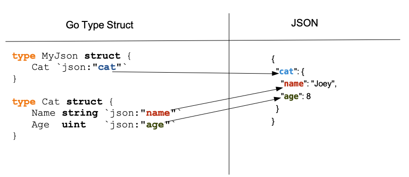
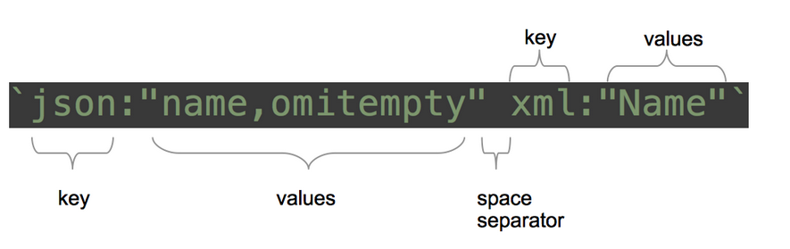
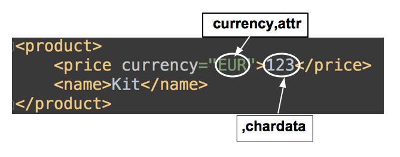


# Poglavlje 25: JSON i XML

[24 Anonimne funkcije i zatvaranja][24]  
[00 Sadržaj][00]  
[26 Osnovni HTTP server][26]

**Šta ćete naučiti u ovom poglavlju?**

- Šta je kodiranje/dekodiranje?
- Šta su JSON i XML?
- Šta su maršaling i demaršaling?
- Kako konvertovati promenljivu u JSON i XML.
- Kako konvertovati JSON ili XML string (ili datoteku) u promenljivu.

**Obrađeni tehnički koncepti!**

- Kodiranje / Dekodiranje
- Maršaling / Demaršaling
- Tok podataka
- JSON
- XML
- Implementacija interfejsa

## Uvod

JSON i XML su dva formata koja se koriste u modernim aplikacijama. Veoma su praktični jer ih ljudi mogu čitati i lako razumeti u poređenju sa drugim formatima (kao što su protokolski baferi).

## Kodiranje / Dekodiranje

Većinu vremena, aplikacije prenose podatke drugim aplikacijama ili ljudima. U Go programu, podaci koje manipulišemo često su u obliku strukture:

```go
type Cart struct {
    ID   string
    Paid bool
}

cart := Cart{
    ID:   "121514",
    Paid: false,
}
```

Šta ako želimo da prenesemo podatke iz cart promenljive u drugi program? Šta ako ovaj program nije napisan u programskom jeziku Go? Zato nam je potrebno kodiranje.
Kodiranje je proces transformacije podatka u "kodirani oblik".

Kada prenosimo poruku putem komunikacionog kanala, želimo da budemo sigurni da će primalac razumeti poruku. Stoga će pošiljalac i primalac odlučiti koju tehniku kodiranja će koristiti. Termin tehnika kodiranja može zvučati nepoznato, ali proces kodiranja koristite svaki dan... Kada razgovaramo sa drugom osobom, kodiramo svoje misli u kodirani oblik: jezik (engleski, francuski, francusko-kanadski, mandarinski,...). Kada govorite, kodirate svoje misli. (naravno, ako razmislite pre nego što progovorite). Jezik koji koristimo ima skup pravila koja moramo poštovati da bi naša poruka bila razumljiva (sintaksa, gramatika...). Ovo važi isto za sve "kodirane oblike".
"Kodirani oblik" se može transformisati nazad u originalnu poruku zahvaljujući dekodiranju.

U ovom odeljku ćemo proučiti dva "kodirana oblika": JSON i XML.

## Maršaling / Demaršaling

Maršaling i Demaršaling takođe označavaju proces.

- Maršaling je proces transformacije objekta u reprezentaciju koja se može skladištiti korišćenjem određenog formata. Možemo maršalirati promenljivu tipa struct u JSON-u, na primer.
- Demaršaling je obrnut proces.

"Maršaling" se odnosi na isti koncept kao i "kodiranje". Međutim, kada koristite ovaj termin, eksplicitno navodite da ćete raditi sa precizno definisanim objektima (npr. mapa, isečak, promenljiva tipa struktura...). Koder radi na toku podataka, maršaler radi na strukturi podataka, objektu.

Možda se pitate šta je tok podataka? To je tok podataka koji stiže u sistem. Na primer, sistem može da prima tokove podataka preko mrežne veze. Rukovanje tokom podataka može biti složen zadatak jer podaci mogu stići u delovima, a mogu stići i na neuređen način. Delovi se takođe mogu razlikovati po veličini, što može dovesti do problema sa memorijom.

Zaključak : Kodiramo tok podataka, maršaliramo strukturu podataka.

## JSON

JSON označava JavaScript notaciju objekata. Ovo je tekstualni format koji se koristi za kodiranje/dekodiranje strukturiranih podataka. Prvi ga je definisao Daglas Krokford.

Evo jednog primera:

```json
[
  {
    "id": 1,
    "first_name": "Annalise",
    "last_name": "Marlin",
    "city": "Bang Bon"
  },
  {
    "id": 2,
    "first_name": "Dacy",
    "last_name": "Biffin",
    "city": "Cuilco"
  },
  {
    "id": 3,
    "first_name": "Wendye",
    "last_name": "Taillard",
    "city": "Preobrazhenka"
  }
]
```

Imamo niz od 3 korisnička objekta.

- Niz počinje sa `[` i završava se sa `]`.
- Svaki objekat počinje vitičastom zagradom i završava se vitičastom zagradom. ( `{}` )
- Svako objektno svojstvo je zapisano u formatu para ključ-vrednost.  
  Na pr: "id": 3

### Unmarshaling JSON

Da biste dekodirali string koji sadrži JSON, potrebno je da kreirate tip strukture. Uzmimo primer.  

Zamislite da želite da dekodirate sledeći JSON string:

```json
{
    "cat": {
        "name": "Joey",
        "age": 8
    }
}
```

Imamo objekat sa svojstvom "cat" jednakim drugom objektu sa dva svojstva: "name" i "age". Kada želite da dekodirate, prvo morate da kreirate strukturu koja će sadržati podatke.

Prvo ćemo kreirati strukturu koja sadrži strukturu "cat":

```go
type MyJson struct {
    Cat
}
```

Zatim ćemo definisati Cat strukturu:

```go
type Cat struct {
    Name string
    Age uint
}
```

Imamo dva polja, name i age, slična JSON strukturi koju želimo da dekodiramo. Sada možemo pokrenuti funkciju dekodiranja:

```go
// json-xml/unmarshall-json/main.go
func main() {
    myJson := []byte(`{"cat":{"name":"Joey", "age":8}}`)
    c := MyJson{}
    err := json.Unmarshal(myJson, &c)
    if err != nil {
        panic(err)
    }
    fmt.Println(c.Cat.Name)
    fmt.Println(c.Cat.Age)
}
```

Prvo treba da konvertujemo string u isečak bajtova. Zatim kreiramo novu praznu MyJson strukturu.
Zatim pozivamo funkciju `json.Unmarshal` da bismo postavili vrednosti naše promenljive c. Imajte na umu da su `json.Unmarshal` argumenti:

- Isečak bajtova koji predstavlja JSON za dekodiranje (myJson)
- Pokazivač na promenljivu c (&c)

Zašto nam je potreban pokazivač? Zato što će funkcija Unmarshal izmeniti vrednost c.

Koji je očekivani rezultat sledećeg koda?

```go
fmt.Println(c.Cat.Name)
fmt.Println(c.Cat.Age)
```

Očekujemo da vidimo:

```sh
Joey
8
```

Ali ako pokrenete prethodni kod, videćete da se ništa ne ispisuje! Zašto?

Pošto `json.Unmarshal` nije uspešno upario polja!, uzeće ime polja naše strukture i pokušaće da pronađe odgovarajuće svojstvo u JSON stringu. Ako pažljivo pogledate našu strukturu, videćete da smo napisali velika početna slova da bismo izvezli polja.

#### Rešenja velikih slova (eksportovanih) polja strukture

1. Možemo da učinimo naša polja neizvezenim (uklanjamo prvo veliko slovo). Ovo nije dobra ideja. Spoljni format naše aplikacije ne bi trebalo da ometa tipove naše aplikacije!
2. Potrebna nam je mogućnost definisanja drugih imena polja dekoreliranih iz imena polja u JSON stringu.

Rešenje 2 deluje teško. U stvarnosti, nije. Koristićemo **oznake** (**tags**).

### Oznake strukture 1

Oznake su mali string literali koji mogu da slede deklaraciju polja. Oznake su dostupne dekoderu. Koristiće ih za ispravno dekodiranje JSON stringa.

```go
// json-xml/unmarshall-json-tags/main.go
type MyJson struct {
    Cat `json:"cat"`
}

type Cat struct {
    Name string `json:"name"`
    Age  uint   `json:"age"`
}
```

Vidite da smo ovde dodali tri oznake poljima struktura tipa `struct`. Oznake uvek imaju istu konstrukciju:

```go
`json:"nameOfTheFieldInJson"`
```

Unmarshaler će moći da pronađe polja u JSON-u. Njima se može pristupiti preko reflect paketa (tačnije, tag je polje strukture `reflect.StructField`).

  
Konvertovanje Struct u JSON sa oznakama strukture

### Maršaling JSON

Da biste kreirali JSON string u programu Go, morate definisati strukturu tipa koja će definisati vašu strukturu podataka. Uzećemo primer veb stranice za e-trgovinu koja referencira proizvode. Naš cilj je da kreiramo JSON string iz odeljka proizvoda.

Prvo definišemo Product strukturu tipa i Category strukturu tipa (product pripada jedinstvenoj kategoriji):

```go
type Product struct {
    ID    uint64
    Name  string
    SKU   string
    Cat   Category
}
type Category struct {
    ID   uint64
    Name string
}
```

Zatim ćemo kreirati proizvod, tačnije, čajnik.

```go
p := Product{ID: 42, Name: "Tea Pot", SKU: "TP12", Category: Category{ID: 2, Name: "Tea"}}
```

Kada imamo našu promenljivu, možemo pokrenuti funkciju `json.Marshal`:

```go
// json-xml/marshall-json/main.go
b, err := json.Marshal(p)
if err != nil {
    panic(err)
}
fmt.Println(string(b))
```

Promenljiva b je isečak bajtova. Imajte na umu da operacija kodiranja može rezultirati greškom. Uhvatamo ovu grešku i pravimo u našem programu paniku. Zatim možemo da ispišemo naš rezultat:

```sh
{"ID":42,"Name":"Tea Pot","SKU":"TP12","Price":30.5,"Category":{"ID":2,"Name":"Tea"}}
```

Formatiranje stringa nije optimalno. Možemo koristiti umesto druge funkcije za kodiranje JSON-a, ali i za njegovo uvlačenje:

```go
// json-xml/marshall-json/main.go 

bI, err := json.MarshalIndent(p,"","    ")
if err != nil {
    panic(err)
}
fmt.Println(string(bI))
```

Argumenti `json.MarshalIndent` su sledeći:

- podaci za maršal
- prefiksni string (svaki red izlaznog rezultata će početi ovim stringom). U primeru, ovaj parametar je popunjen praznim stringom.
- string za uvlačenje. U primeru smo stavili tabulator.

Izlazni rezultat je:

```sh
{
    "ID": 42,
    "Name": "Tea Pot",
    "SKU": "TP12",
    "Category": {
        "ID": 2,
        "Name": "Tea"
    }
}
```

Obično, u JSON-u, imena svojstava ne počinju velikim slovom. Ovde je json paket jednostavno preuzeo imena Product polja naše strukture bez ikakvih modifikacija.

Oznake se mogu dodati strukturi Product da bi se kontrolisao odštampani rezultat:

```go
// json-xml/marshall-json/main.go 
type Product struct {
    ID       uint64   `json:"id"`
    Name     string   `json:"name"`
    SKU      string   `json:"sku"`
    Category Category `json:"category"`
}
type Category struct {
    ID   uint64 `json:"id"`
    Name string `json:"name"`
}
```

Izlazni rezultat je sada:

```sh
{
    "id": 42,
    "name": "Tea Pot",
    "sku": "TP12",
    "category": {
        "id": 2,
        "name": "Tea"
    }
}
```

### Oznake strukture 2

U prethodna dva odeljka videli smo da možemo kontrolisati strukturu kodiranog JSON-a pomoću oznaka. Takođe smo naučili kako da dekodiramo JSON string i da nazovemo polje naše strukture tako da se podudara sa nazivom JSON svojstava.

#### Kako ignorisati prazna polja

Ako jedno od polja vaše promenljive nije podešeno, imaće podrazumevanu nultu vrednost. Podrazumevano, biće prisutno u JSON stringu generisanom pomoću `json.Marshal` ili `json.MarshalIndent`:

```go
// json-xml/tags/main.go 
type Product struct {
    ID   uint64 `json:"id"`
    Name string `json:"name"`
}

func main() {
    p := Product{ID: 42}
    bI, err := json.MarshalIndent(p, "", "  ")
    if err != nil {
        panic(err)
    }
    fmt.Println(string(bI))
}
```

Skripta će ispisati:

```sh
{
    "id": 42,
    "name": ""
}
```

Ovde je polje "name" prazan string. Možemo dodati `omitempty` direktivu u oznaku strukture da bismo je uklonili iz izlaznog JSON-a:

```go
type Product struct {
    ID   uint64 `json:"id"`
    Name string `json:"name,omitempty"`
}
```

Rezultat je sada:

```go
{
    "id": 42
}
```

Svojstvo name je izostavljeno jer je bilo prazno.

#### Preskoči polje

Slučaj upotrebe je jednostavan, imate strukturu sa deset polja i želite da je sakrijete u kodiranoj verziji vašeg JSON stringa (na primer, vaši klijenti više ne koriste to polje). Ono što biste mogli da uradite jeste da ga uklonite iz strukture. To rešenje nije dobro ako i dalje koristite ovo polje u ostatku koda.

Za to postoji direktiva `-` :

```go
// json-xml/tags/main.go 
type Product struct {
    ID          uint64 `json:"id"`
    Name        string `json:"name,omitempty"`
    Description string `json:"-"`
}
```

Ovde govorimo json paketu da ne prikazuje polje "Description" u kodiranom stringu.

#### Kako analizirati oznake vaše strukture

Vrednost oznaka u strukturi tipa možete dobiti korišćenjem paketa `reflect`:

```go
// json-xml/access-tags/main.go 
type Product struct {
    ID          uint64 `json:"id"`
    Name        string `json:"name,omitempty"`
    Description string `json:"-"`
}

func main() {
    p:= Product{ID:32}
    t := reflect.TypeOf(p)
    for i := 0; i < t.NumField(); i++ {
        fmt.Printf("field Name : %s\n",t.Field(i).Name)
        fmt.Printf("field Tag : %s\n",t.Field(i).Tag)
    }
}
```

Ovde prvo definišemo "Product" tip koji sadrži tri polja sa oznakama na svakom polju. Zatim, u funkciji "main", kreiramo novu promenljivu (tipa Product) pod nazivom "p". Podaci tipa "p" se preuzimaju pomoću `TypeOf` funkcije standardnog paketa `reflect`.

Funkcija `TypeOf` vraća element tipa `Type`! Metoda `NumField()` će vratiti broj polja u strukturi. U našem slučaju, vratiće 3.

Zatim ćemo iterirati kroz polja strukture uz pomoć metode `Field()` koja uzima indeks polja kao argument. Ova poslednja funkcija će vratiti promenljivu tipa `StructField`:

```go
// package reflect
// file: type.go
type StructField struct {
    Name      string
    PkgPath   string
    Type      Type
    Tag       StructTag
    Offset    uintptr
    Index     []int
    Anonymous bool
}
```

Tip `StructTag` obuhvata jednostavan string. Takođe imate pristup konvencionalnim metodama za manipulaciju oznakama: `Get()`.

Uzmimo primer za `Get` metodu:

```go
//...
// for loop
    fmt.Println(t.Field(i).Tag.Get("json"))
//...
```

U kontekstu prethodnog isečka koda, ovo će ispisati:

```go
id
name,omitempty
-
```

A sada primer metode `Lookup`. Svrha metode Lookup je da se utvrdi da li je oznaka prisutna ili ne:

```go
// json-xml/access-tags/main.go 
if tagValue, ok := t.Field(i).Tag.Lookup("test"); ok {
    fmt.Println(tagValue)
} else {
    fmt.Println("no tag 'test'")
}
```

### Kako kreirati oznake

JSON i XML oznake su praktične; možda ćete želeti da kreirate sopstvene strukturne oznake za posebne slučajeve upotrebe. Jezik očekuje određenu sintaksu:

  
Format oznake strukture

Oznaka je organizovana kao lista elemenata ključ-vrednost. Na slici možete videti da imamo dva elementa. Prvi element ima `json` ključ i vrednost `name, omitempty`. Drugi element ima ključ `xml` i njegova vrednost je `Name`. Imajte na umu da su elementi odvojeni razmacima.

Ako pratimo ovaj model, možemo kreirati sledeću oznaku sa tri ključa.

```go
`myKey1:"test,test2" myKey2:"yo" myKey3:"yoyooo"`
```

## XML

XML znači proširivi jezik za označavanje (eXtensible Markup Language). To je format datoteke koji je dizajniran za skladištenje informacija na strukturiran način. I danas se koristi u određenim oblastima, ali ima tendenciju da opadne u upotrebi; uglavnom zato što je opširan (poruke kodirane u XML-u zahtevaju više prostora za skladištenje nego JSON, na primer).

Na primer, ovo je XML kodirani objekat proizvoda:

```xml
<Product>
    <id>42</id>
    <name>Tea Pot</name>
    <sku>TP12</sku>
    <category>
        <id>2</id>
        <name>Tea</name>
    </category>
</Product>
```

A evo njegovog ekvivalenta u JSON-u:

```json
{
    "id": 42,
    "name": "Tea Pot",
    "sku": "TP12",
    "category": {
        "id": 2,
        "name": "Tea"
    }
}
```

- JSON-u je potrebno 95 karaktera,
- XML-u je potrebno 111 karaktera za kodiranje istog objekta.

### Unmarshaling XML

Dekodiranje XML-a je jednostavno kao dekodiranje JSON-a.

Prvo, definišete strukturu koja će čuvati vaše podatke:

```go
// json-xml/xml/decode/main.go 
type MyXML struct {
    Cat `xml:"cat"`
}

type Cat struct {
    Name string `xml:"name"`
    Age  uint   `xml:"age"`
}
```

Dodali smo XML oznake strukture u strukturu (to će omogućiti dekoderu da zna gde da pronađe vrednosti polja).

Onda možete pozvati `xml.Unmarshal` funkciju:

```go
// json-xml/xml/decode/main.go
func main() {
    myXML := []byte(`
    <cat>
        <name>Ti</name>
        <age>23</age>
    </cat>`)
    c := MyXML{}
    err := xml.Unmarshal(myXML, &c)
    if err != nil {
        panic(err)
    }
    fmt.Println(c.Cat.Name)
    fmt.Println(c.Cat.Age)
}
```

### Marshaling XML

Kodiranje XML-a je takođe veoma jednostavno; možete koristiti `xml.Marshal`, ili kao ovde, funkciju `xml.MarshalIndent` da biste prikazali lep xml string:

```go
// json-xml/xml/encode/main.go 
func main() {
    p := Product{ID: 42, Name: "Tea Pot", SKU: "TP12", Price: 30.5, Category: 
        Category{ID: 2, Name: "Tea"}}
    bI, err := xml.MarshalIndent(p, "", "   ")
    if err != nil {
        panic(err)
    }
    xmlWithHeader := xml.Header + string(bI)
    fmt.Println(xmlWithHeader)
}
```

Zapamtite da morate dodati zaglavlje svom XML-u:

```xml
<?xml version="1.0" encoding="UTF-8"?>
```

Ovaj zaglavak će dati važne informacije sistemima koji će koristiti vaš xml dokument. On daje informacije o verziji XML-a koja se koristi ("1.0" u našem slučaju, koja datira iz 1998. godine) i kodiranju vašeg dokumenta. Parseru će biti potrebne ove informacije da bi pravilno dekodirao vaš dokument.

xml paket definiše konstantu koju možete direktno koristiti:

```go
xmlWithHeader := xml.Header + string(bI)
```

Evo proizvedenog XML-a:

```xml
<?xml version="1.0" encoding="UTF-8"?>
<Product>
    <id>42</id>
    <name>Tea Pot</name>
    <sku>TP12</sku>
    <price>30.5</price>
    <category>
        <id>2</id>
        <name>Tea</name>
    </category>
</Product>
```

### xml.Name tip

Ako kreirate promenljivu sledećeg tipa

```go
type MyXmlElement struct {
    Name  string `xml:"name"`
}
```

i ako ga maršalirate, rezultat će biti:

```xml
<MyXmlElement>
    <name>Testing</name>
</MyXmlElement>
```

Možemo kontrolisati proces maršalinga svojstva "name", ali nemamo kontrolu nad "MyXMLElement" elementom. Za sada, ako želimo da promenimo ime ovog svojstva u nešto drugo, moramo da promenimo ime našeg tipa... Što nije baš zgodno.

Možete dodati posebno polje svojoj strukturi da biste kontrolisali ime XML elementa:

```go
type MyXmlElement struct {
    XMLName xml.Name `xml:"myOwnName"`
    Name  string `xml:"name"`
}
```

Polje mora biti imenovano, tip mora biti "xml.Name", a u oznaci možete uneti željeno ime elementa (koje će biti ubrizgano tokom procesa maršalinga).

Uzmimo primer:

```go
// json-xml/xml/xmlNameType/main.go
package main

import (
    "encoding/xml"
    "fmt"
)

type MyXmlElement struct {
    XMLName xml.Name `xml:"myOwnName"`
    Name    string   `xml:"name"`
}

func main() {
    elem := MyXmlElement{Name: "Testing"}
    m, err := xml.MarshalIndent(elem, "", " ")
    if err != nil {
        panic(err)
    }
    fmt.Println(string(m))
}
```

Ovaj program će izvesti:

```xml
<myOwnName>
    <name>Testing</name>
</myOwnName>
```

### Specifičnost XML oznaka

Pored direktive `omitempty` (omitempty)  i direktive `ignore` ("-"), standardna biblioteka vam nudi veliku paletu vrednosti oznaka:

#### Atributi

Možete dodati određene atribute polju pomoću XML-a. Na primer:

```xml
<price currency="EUR">123</price>
```

Ovde je polje imenovano "price" i postoji atribut pod nazivom "currency". Možete koristiti sledeći tip strukture da biste ga kodirali/dekodirali:

```go
type Price struct {
    Text     string `xml:",chardata"`
    Currency string `xml:"currency,attr"`
}

type Product struct {
    Price Price  `xml:"price"`
    Name  string `xml:"name"`
}
```

Definisali smo strukturu pod nazivom "Price" sa dva polja:

- "Text" koja će sadržati cenu ("123" u primeru)
- "Currency" koji će sadržati vrednost atributa currency ("EUR" u primeru).

Obratite pažnju na korišćene oznake. Da biste dobili cenu, oznaka je:

```xml
`xml:",chardata"`
```

Govori programu Go da dobije podatke koji se nalaze između početne i završne price oznake. Da biste dobili atribute, morate koristiti ključnu reč attr i naziv atributa. Polje je zapisano kao "character data" (podaci o karakteru) i nema xml element.

```xml
`xml:"currency,attr"`
```

Uvek počinjete sa imenom atributa.

  
XML atributi i strukturne oznake

### CDATA

Ako želite da prenesete XML putem XML-a, možete koristiti CDATA polja. CDATA polja vam omogućavaju da ubacite znakove poput > ​​i < u vašu XML poruku. Ako ubacite tu vrstu podataka bez CDATA polja, vaš XML bi mogao postati nevažeći.

Uzmimo primer. Dodajemo našem XML-u polje myXml koje je popunjeno karakternim podacima. Imajte na umu da su karakterni podaci okruženi sa ![CDATA[*and \lstinline!]]>!\textbf{.} The value of this field is therefore \lstinline!yo>12</yo>!

```xml
<product>
    <price currency="EUR">123</price>
    <myXml><![CDATA[<yo>12</yo>]]></myXml>
    <name>Kit</name>
</product>
```

Evo važeće strukture tipa koja će vam omogućiti da preuzmete vrednost myXml:

```go
// json-xml/xml/CDATA/main.go

type Product struct {
    Price Price  `xml:"price"`
    Name  string `xml:"name"`
    MyXml  MyXml `xml:"myXml"`
}

type MyXml struct {
    Text     string `xml:",cdata"`
}
```

Imajte na umu da smo kreirali strukturu tipa MyXml koja ima jedno polje Text. Ovo jedno polje ima sledeću oznaku:

```xml
`xml:",cdata"`
```

### Komentari

Za razliku od JSON-a, možete dodati komentare u svoj XML:

```go
// json-xml/xml/comments/main.go 
type Price struct {
    Text     string `xml:",chardata"`
    Currency string `xml:"currency,attr"`
}

type Product struct {
    Comment string `xml:",comment"`
    Price Price  `xml:"price"`
    Name  string `xml:"name"`
}
```

Ovde smo dodali polje pod nazivom Comment našoj strukturi tipa Product. Posebna comment oznaka je dodata polju.

Hajde da kreiramo Product i maršalujemo ga u XML-u:

```go
// json-xml/xml/comments/main.go 

c := Product{}
c.Comment = "this is my comment"
c.Price = Price{Text : "123",Currency:"EUR"}
c.Name = "testing"

b, err := xml.MarshalIndent(c,"","      ")
if err != nil {
    panic(err)
}
fmt.Println(string(b))
```

Ova skripta će izvesti:

```xml
<Product>
    <!--this is my comment-->
    <price currency="EUR">123</price>
    <name>testing</name>
</Product>
```

### Ugnežđena polja

Jednostavno polje može biti ugnežđeno u nekoliko XML elemenata:

```go
// json-xml/xml/nesting/main.go
package main

import (
    "encoding/xml"
    "fmt"
)

type Product struct {
    Name string `xml:"first>second>third"`
}

func main() {
    c := Product{}
    c.Name = "testing"
    b, err := xml.MarshalIndent(c, "", "    ")
    if err != nil {
        panic(err)
    }
    fmt.Println(string(b))
}
```

Prethodni skript će izvesti:

```xml
<Product>
    <first>
        <second>
            <third>testing</third>
        </second>
    </first>
</Product>
```

Možete videti da je vrednost polja Name ("testing") zatvorena u elementu "third" koji je takođe zatvoren u elementu "second" i "first".

To je zato što smo to naveli u našoj strukturnoj oznaci:

```xml
`xml:"first>second>third"`
```

### Generatori tipa strukture

Izgradnja strukture može oduzeti mnogo vremena. Pogotovo ako morate da se bavite složenim JSON/XML strukturama. Mogu vam savetovati da koristite ova dva alata:

- Za JSON:
  - <https://github.com/mholt/json-to-go> je napravio Met Holt.
  - Ovo je onlajn generator.
  - Jednostavno kopirajte svoj JSON, nalepite ga i pustite alat da generiše odgovarajuće strukture.

- Za XML:
  - <https://github.com/miku/zek>
  - Omogućio ga je Martin Čigan.
  - Ovo je CLI alat koji vam omogućava da generišete strukture na osnovu primera XML-a

### Prilagođeni JSON maršaler / demaršaler (napredno)

U slučaju da koristite specifičnu logiku za maršaling tipa u JSON, možete kreirati sopstveni prilagođeni Maršaler i Unmaršaler.

#### Prilagođeni unmaršaler

Da biste kreirali prilagođeni JSON unmarshaler, moraćete da implementirate `json.Unmarshal` interfejs.

Evo definicije interfejsa:

```go
type Unmarshaler interface {
    UnmarshalJSON([]byte) error
}
```

Ima jedinstvenu navedenu metodu: `UnmarshalJSON([]byte) error`

**Primer - time.Time:**

Uzmimo primer implementacije za `time.Time` tip. JSON stringovi mogu da sadrže vremenske stringove. Ti vremenski stringovi se mogu konvertovati u vremenske vrednosti:

```json
[
  {
    "id": 1,
    "first_name": "Hedvig",
    "last_name": "Largen",
    "created_at": "2020-07-02T08:41:35Z"
  },
  {
    "id": 2,
    "first_name": "Win",
    "last_name": "Alloisi",
    "created_at": "2020-02-21T12:36:41Z"
  }
]
```

U ovom JSON-u imamo kolekciju osoba. Svaka osoba ima datum kreiranja (created_date). Želimo da raspakujemo ove podatke u promenljivu users (isečak User):

```go
type User struct {
    ID int `json:"id"`
    Firstname string `json:"first_name"`
    Lastname string `json:"last_name"`
    CreatedDate time.Time `json:"created_at"`
}

users := make([]User,2)
```

Za svaki tip, Go će proveriti da li ima prilagođeni demaršaler.

- Tip time.Time definiše prilagođeni JSON unmarshaller.
- Drugim rečima, tip ima metodu imenovanu UnmarshalJSON sa potpisom ([]byte) error.
- Drugim rečima, time.Time implementira json.Unmarshaler interfejs

```go
// UnmarshalJSON implements the json.Unmarshaler interface.
// The time is expected to be a quoted string in RFC 3339 format.
func (t *Time) UnmarshalJSON(data []byte) error {
    // Ignore null, like in the main JSON package.
    if string(data) == "null" {
        return nil
    }
    // Fractional seconds are handled implicitly by Parse.
    var err error
    *t, err = Parse(`"`+RFC3339+`"`, string(data))
    return err
}
```

- U ovoj metodi, vrednost null se ignoriše.
- Ako postoji "null" u JSON stringu za svojstvo "created_at", vrednost polja CreatedAt će biti nulta vrednost time.Time, što je 1. januar, 1. godine, 00:00:00.000000000 UTC.
- Zatim će metoda pokušati da analizira vrednost sačuvanu u podacima:

  ```go
  *t, err = Parse(`"`+RFC3339+`"`, string(data))
  ```

  - Ova linija će analizirati vreme u formatu "2006-01-02T15:04:05Z07:00"( RFC3339 je
    konstanta paketa)
  - Imajte na umu da zatvoreni dvostruki navodnici obuhvataju format parsiranja.
  - To je zato što vrednost u JSON-u ima format "2020-07-02T08:41:35Z", a ne !2020-07-02T08:41:35Z

time.Parse vraća analiziranu vrednost ili grešku

- Raščlanjena vrednost je dodeljena \*t
- Koristimo operator dereferenciranja \* da postavimo vrednost na t adresu ( t je tipa pokazivača)

#### Prilagođeni maršaler

Evo interfejsa koji ćete morati da implementirate na svom tipu:

```go
type Marshaler interface {
    MarshalJSON() ([]byte, error)
}
```

Sastoji se od jedne metode nazvane MarshalJSON sa potpisom ([]byte, error).

- Prilagođeni maršaler će izbaciti deo bajta, što je JSON maršalirani
- I greška.

**Primer - time.Time:**

```go
// MarshalJSON implements the json.Marshaler interface.
// The time is a quoted string in RFC 3339 format, with sub-second precision 
// added if present.
func (t Time) MarshalJSON() ([]byte, error) {
    if y := t.Year(); y < 0 || y >= 10000 {
        // RFC 3339 is clear that years are four digits exactly.
        // See golang.org/issue/4556#c15 for more discussion.
        return nil, errors.New("Time.MarshalJSON: year outside of range [0,9999]")
    }

    b := make([]byte, 0, len(RFC3339Nano)+2)
    b = append(b, '"')
    b = t.AppendFormat(b, RFC3339Nano)
    b = append(b, '"')
    return b, nil
}
```

Evo implementacije json.Marshaller interfejsa za tip Time. Ideja je da se vrednost tipa Time transformiše u njenu JSON reprezentaciju.

- Prvo se proverava godina; mora biti između 0 i 9999 (ne više od četiri cifre)
- Zatim se kreira isečak bajta b.
  - Isečak ima dužinu jednaku 0 i kapacitet od len(RFC3339Nano)+2.
  - Vreme će biti ispisano prateći format opisan u konstanti RFC3339Nano.
  - Broj 2 se dodaje dužini formata za obradu dva dvostruka navodnika (2 bajta).
- Zatim se isečku dodaje jednostruki, dvostruki navodnik
- Zatim se formatirano vreme dodaje isečku metodom AppendFormat.
- Još jedan dvostruki navodnik je dodat b (završnom)

## Testirajte sebe

1. Koju metodu možete koristiti za konvertovanje promenljive u JSON?
   json.Marshal

2. Koju metodu možete koristiti za konvertovanje JSON stringa u promenljivu određenog tipa?
   json.Unmarshal

3. Kako promeniti način na koji se ime polja na strukturi prikazuje u JSON formatu?
    1. Sa strukturnom oznakom
    2. Npr.:

       ```go
       type User struct {
           ID int `json:"id"`
       }
       ```

    3. Strukturna oznaka je `json:"id"`

4. Kako promeniti način na koji se ime polja na strukturi prikazuje u XML-u?
    1. Sa strukturnom oznakom, npr:

      ```xml
      `xml:"id"`
      ```

5. Koja je razlika između kodiranja i maršalinga?
    1. Kodiranje i maršaling se odnose na isti proces
    2. Termin kodiranje se koristi kada je potrebno transformisati tok podataka u kodirani oblik
    3. Maršaling se koristi kada morate transformisati promenljivu u kodirani oblik

6. Kako prilagoditi JSON reprezentaciju tipa?
    1. Implementirajte json.Marshaler interfejs na svom tipu

7. Kako prilagoditi način na koji će Go analizirati element datog tipa u JSON-u?
    1. Implementirajte json.Unmarshaler interfejs na svom tipu

## Ključno

- JSON (JavaScript Object Notation) je popularan format koji se koristi za predstavljanje strukturiranih podataka koje ljudi ili mašine mogu lako pročitati.
- XML (eXtensible Markup Language - proširivi jezik za označavanje ) se takođe koristi za predstavljanje strukturiranih podataka.
- Pretvaranje promenljive u kodirani oblik => maršaling
- Pretvaranja kodiranog obrazca u promenljivu" => demaršaling
- Pretvaranje toka podataka u kodirani oblik => kodiranje
- Pretvaranje kodiranog oblik u tok podataka => dekodiranje
- Da bismo konvertovali promenljivu u JSON/XML, možemo koristiti json.Marshal/xml.Marshal
- Da bismo konvertovali JSON/XML u promenljivu, možemo koristiti json.Unmarshal/xml.Unmarshal
- Strukturne oznake vam omogućavaju da izmenite način na koji će se polje prikazivati u JSON/XMLName formatu.
  
  ```go
  type Product struct {
      Price Price  `xml:"price"`
      Name  string `xml:"name"`
      MyXml  MyXml `xml:"myXml"`
  }
  ```

- Da biste dobili vrednost strukturne oznake, moraćete da koristite reflect standardni paket
  
  ```go
  p:= Product{ID:32}
  t := reflect.TypeOf(p)
  for i := 0; i < t.NumField(); i++ {
      fmt.Printf("field Name : %s\n",t.Field(i).Name)
      fmt.Printf("field Tag : %s\n",t.Field(i).Tag)
  }
  ```

- Neke specifične vrednosti oznaka strukture
  - Preskoči polje: `json:"-"`(biće skriveno u JSON-u, XML-u)
  - Ne prikazuj prazne vrednosti:`json:"first_name,omitempty"`
- Možete kombinovati strukturne oznake za JSON sa drugim strukturnim oznakama
  - Na primer, oznake xml strukture
    type User struct {
        ID int `json:"id" xml:"id"`
    }

    1. Panika se ne preporučuje u stvarnom programu; trebalo bi da obradite grešku i koristite odgovarajuću logiku izlaska.

[24 Anonimne funkcije i zatvaranja][24]  
[00 Sadržaj][00]  
[26 Osnovni HTTP server][26]

[24]: 24_Anonimne_funkcije_i_zatvaranje.md
[00]: 00_Sadržaj.md
[26]: 26_Osnovni_HTTP_server.md
