
# Poglavlje 26: Osnovni HTTP server

[25 JSON i XML][25]  
[00 Sadržaj][00]  
27 [Enum iota i bitmask][27]

**Šta ćete naučiti u ovom poglavlju?**

- Šta je HTTP server?
- Šta je HTTP klijent?
- Šta je HTML i kako kreirati HTML datoteku?
- Šta su HTTP i IP?
- Kako se formira HTTP zahtev
- Kako se formira HTTP odgovor
- Kako napraviti osnovni veb server.

**Obrađeni tehnički koncepti!**

- HTTP
- HTML
- Zahtev, odgovor
- Klijent, Server
- DNS
- Rukovalac
- Implementacija interfejsa

## Šta se krije iza veb stranice

Veb pregledač će učitati izvorni kod. Ovaj izvorni kod se zatim interpretira u ono što vidite na ekranu. Evo nekog izvornog koda :

```html
<!DOCTYPE html>
<html>
  <head>
    <title>Title of page</title>
  </head>
  <body>
    <h1>Title</h1>
    <p>Welcome to my website</p>
    <!-- comment, ignored by the browser -->
  </body>
</html>
```

Ovo je HTML. HTML znači jezik za označavanje hiperteksta. To nije programski jezik već jezik za označavanje. Pomoću HTML-a možete dodati napomene u dokument kako biste upozorili veb pregledač da primeni određeni format na vaš sadržaj.

## Osnove HTML-a

Hajde da detaljno razmotrimo kod prvog primera:

```html
<!DOCTYPE html>
<html>

</html>
```

- Prvo, možete primetiti da dokument počinje sa <!DOCTYPE html>. Ova linija govori veb pregledaču da je ono što sledi napisano pomoću HTML-a.
- Dokument je sastavljen od elemenata. Svaki element počinje početnom oznakom i završava se završnom oznakom.
- Elementi mogu biti ugnežđeni. Može biti jedan element unutar drugog elementa.
- Prvi element počinje početnom oznakom \<html> i završava se završnom oznakom </html>. Između početne i završne oznake nalaze se drugi HTML elementi.
- Unutar ovog prvog elementa imamo još jedan element:

```html
<head>
    <title>Title of page</title>
</head>
```

- Početna oznaka je \<head>, a završna oznaka je </head>. Ovo je zaglavni deo. Unutar njega ćemo pronaći metapodatke o dokumentu. Metapodaci su informacije vezane za dokument.
  - Unutar njega se nalazi još jedan element. To je naslov stranice. Naslov stranice će biti prikazan unutar kartice pregledača.
- Sledeći element je telo (body). To je sadržaj dokumenta: šta će biti prikazano u pregledaču!

```html
<body>
    <h1>Title</h1>
    <p>Welcome to my website</p>
    <!-- comment, ignored by the browser -->
</body>
```

- U telu imamo dva elementa i jedan komentar
  - Prvi element je naslov nivoa 1 `<h1>Title</h1>`:.
  - Pasus `<p>Welcome to my website</p>`:.
  - Komentar `<!-- comment, ignored by the browser -->`
- Na prikazanoj veb stranici nećete videti oznake. Veb pregledač koristi oznake za prikazivanje stranice.

**Rezime**:

- Pomoću HTML-a možete kreirati veb stranice.
- Elementi počinju početnom oznakom i završnom oznakom.
- Oznake označavaju elemente i pregledač ih interpretira.
- Elementi mogu biti ugnežđeni.
- Evo skeleta jednostavne veb stranice:

  ```html
  <!DOCTYPE html>
  <html>
    <head>
      <title>Title of page</title>
    </head>
    <body>
      <!-- Your content here -->
    </body>
  </html>
  ```

## Šta je HTTP

HTTP znači Hypertext Transfer Protocol (Protokol za prenos hiperteksta). HTTP je komunikacioni protokol. To je skup specifikacija koje opisuju kako dve strane mogu da komuniciraju.

U svakodnevnom životu koristimo komunikacione protokole: kada razgovarate sa drugim ljudima, postoje neka podrazumevana pravila kojih se treba pridržavati. Kada se sretnete, pozdravite se. Zatim počinje razgovor. Razgovor je sekvencijalan. Prvi sagovornik govori, zatim govori drugi. Kraj dijaloga je često obeležen sa "Doviđenja" ili "Vidimo se".

HTTP je protokol dizajniran da omogući mašinama razmenu informacija preko mreže. HTTP postoji u dve glavne verzije: HTTP/1.1 i HTTP/2. Ove dve specifikacije su veoma guste. U narednim odeljcima ćemo se fokusirati na neke ključne elemente koje morate znati:

### Putovanje HTTP zahteva

Kada ukucate URL adresu u veb pregledaču i otkucate Enter, HTTP zahtev se šalje na mrežu. HTTP zahtev je poruka koju pošiljalac (klijent) šalje primaocu (serveru).  

Serveri se na mreži identifikuju jedinstvenim imenom. To je ime domena. Takođe možete poslati zahtev serveru tako što ćete navesti IP adresu. Kada napravite HTTP zahtev, potrebno je da navedete IP adresu ili ime domena kako bi mreža usmerila vaš zahtev na ispravan server.

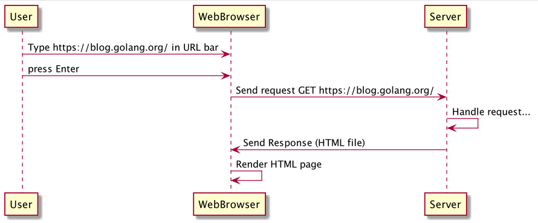  
Dijagram sekvence HTTP zahteva

Hajde da definišemo neke važne pojmove:

- **IP** : **Internet protokol**. Ovo je komunikacioni protokol između računara na mreži i između različitih mreža. Ovaj protokol koristite kada pregledate veb.
- **IP adresa** je niz sastavljen od brojeva razdvojenih tačkama (.) ili dvotačkama (:). Dodeljuje se svakom uređaju povezanom na mrežu koja koristi Internet protokol za komunikaciju. **127.0.0.1** je IP adresa. **::1** je takođe IP adresa. Obratite pažnju na razliku između ova dva primera. Prvi je IPv4 adresa, drugi je IPv6 adresa.
- **Ime domena** je string koji identifikuje server (ili više servera) na mreži. Imenima domena upravlja složen, ali pametan sistem pod nazivom **Sistem imena domena (DNS)**.
- **HTTP server** je računar povezan na mrežu zahvaljujući Internet protokolu. Ovaj računar pokreće program koji će obrađivati HTTP zahteve koje mu šalju klijenti. Serveri se retko isključuju. Napravićemo server!

### Anatomija HTTP zahteva

Evo jednog HTTP zahteva (verzija 1.1 protokola). HTTP zahtev je niz linija teksta poslatih preko mreže.

```html
GET /pub/WWW/TheProject.html HTTP/1.1
Host: www.w3.org
User-Agent: curl/7.54.0
Accept: */*
```

Na slici možete videti detaljnu šemu zahteva:

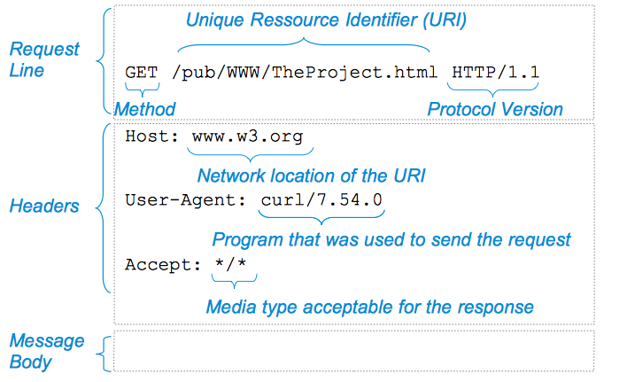  
Anatomija HTTP zahteva

### Gradivni blokovi zahteva

Zahtev se sastoji od tri bloka:

1. Linija zahteva
2. Zaglavlja
3. Telo poruke

- **URI** : Unificirani identifikator resursa. Ovde :/pub/WWW/TheProject.html
  - Ovo je identifikacija resursa (ovde HTML stranice) koji želimo da preuzmemo
- **URL** znači "Jednorodni lokator resursa". Evo ga <http://www.w3.org/pub/WWW/TheProject.html>
  - On identifikuje resurs
  - I ukazuje na to kako se resurs može preuzeti (HTTP zahtev hostu "www.w3.org")
- Svaki HTTP zahtev ima **metod**. Moguće standardne vrednosti su: `OPTIONS`, `GET`, `HEAD`, `POST`, `PUT`, `DELETE`, `TRACE`, `CONNECT`.
  - Veb pregledač šalje HTTP `GET` zahtev kada se učitava nova stranica
- Klijent može da doda **zaglavlja** zahtevima. Zaglavlja su način na koji "klijent prosledi serveru informacije o zahtevu i o sebi".
  - Npr. `Host: www.w3.org`: ovo zaglavlje označava mrežnu lokaciju traženog resursa.
  - Nap. `Accept: */*`: klijent kaže da klijent može da prihvati bilo koji tip medija: JSON, XML...
  - Npr. `User-Agent: curl/7.54.0`: informacije o programu koji je izdao zahtev
- Telo poruke je poslednji deo zahteva. U prethodnom primeru je prazno. Koristi se za prenos informacija.

### Anatomija HTTP odgovora

Evo HTTP odgovora:

```html
HTTP/1.1 404 Not Found
Content-Type: text/plain; charset=utf-8
Date: Fri, 03 Apr 2020 06:26:25 GMT
Content-Length: 19

404 page not found
```

Na slici možete videti kako je odgovor strukturiran:

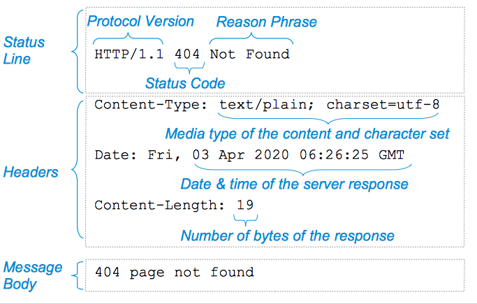
Anatomija HTTP odgovora

### Gradivni blokovi odgovora

Odgovor se sastoji od tri bloka:

1. Statusna linija
2. Zaglavlja
3. Telo poruke

- Statusna linija je prva linija odgovora
  - Obaveštava o verziji korišćenog protokola
  - Status zahteva označen kodom i frazom razloga.
- Zaglavlja odgovora omogućavaju serveru da prosledi dodatne informacije o odgovoru koje se ne mogu postaviti u statusnu liniju.
  - Zaglavlje `Content-Type` obaveštava klijenta o tipu medija sadržaja i eventualno o skupu znakova.
  - Dužina sadržaja : `Content-length` obaveštava klijenta o veličini tela poruke
- Telo poruke će sadržati tražene informacije.
  - Za veb lokaciju, telo poruke će sadržati HTML stranicu.
  - Ako je u pitanju HTML stranica, zaglavlje `Content-Type` će biti jednako `text/html`.

### Kod statusa HTTP odgovora

HTTP odgovor će biti sastavljen od statusnog koda. Statusni kod je ceo broj. Potrebno je da znate najčešće:

- Kod statusa **200** - **U redu**: zahtev je uspešno obrađen od strane servera
- Kod statusa **400** - **Loš zahtev**: zahtev koji je poslao klijent je pogrešan (neispravan zahtev, sintaksička greška...)
- Kod statusa **404** - **Nije pronađeno**: server nije pronašao resurs koji je klijent zahtevao.
- Kod statusa **500** - **Interna greška servera** : Server je naišao na neočekivano stanje koje ga je sprečilo da ispuni zahtev.

Dostupni su i drugi kodovi. Spisak možete pronaći ovde <https://tools.ietf.org/html/rfc7231#section-6.1>.

Jedna stvar koju treba zapamtiti je da prvi broj statusnog koda označava klasu statusnog koda. Postoji pet klasa (videti sliku):

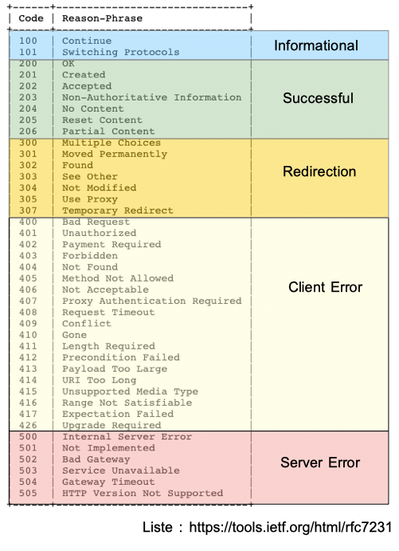  
Pet klasa statusnih kodova

## Jednostavan HTTP server

Sve što vam je potrebno za izgradnju veb servera možete pronaći u standardnoj biblioteci. Funkcije su dostupne u paketu `net/http`:

```go
// basic-http-server/first/main.go
package main

import (
    "log"
    "net/http"
    "time"
)

func main() {
    // create a server
    myServer := &http.Server{
        // set the server address
        Addr: "127.0.0.1:8080",
        // define some specific configuration
        ReadTimeout:  10 * time.Second,
        WriteTimeout: 10 * time.Second,
    }
    // launch the server
    log.Fatal(myServer.ListenAndServe())
}
```

**Objašnjenja koda**:

Prvo počinjemo kreiranjem promenljive "myServer" koja je pokazivač na novu `http.Server` strukturu. Struktura `http.Server` vam omogućava da definišete specifičnu konfiguraciju za vaš server:

- `Addr`: adresu na kojoj će server slušati zahteve. U mom primeru, postavio sam je na 127.0.0.1:8080. To znači da klijenti mogu slati zahteve na adresu.127.0.0.1:8080
  - Imajte na umu da se adresa sastoji od dva dela odvojena dvotačkom. Prvi deo je IP adresa (IPv4) 127.0.0.1, a drugi je broj porta 8080.
  - Broj porta upotpunjuje IP adresu. To je neoznačeni ceo broj (16 bita). Operativni sistem iza Go programa će usmeriti primljene pakete ovom Go programu koji sluša na ovim specifičnim portovima. Na jednoj mašini možete pokrenuti više servera sa istom IP adresom i različitim portom. ( 127.0.0.1:8081 ,127.0.0.1:8083, )
- `ReadTimeout`: maksimalno vreme koje je dato veb serveru da pročita zahtev klijenta.
- `WriteTimeout`: ovo je maksimalno trajanje dozvoljeno serverskim obrađivačima da napišu odgovor.
- `myServer.ListenAndServe()` je poziv metode koja će pokrenuti server. Ova metoda bi vratila grešku ako nešto pođe po zlu. Na primer, dobićete grešku ako je broj porta već u upotrebi. Ova funkcija će se izvršavati sve dok server radi. Kada server više ne radi, metoda vraća grešku, koja se prosleđuje na `log.Fatal`.

**Izgradi i pokreni**:

Hajde da napravimo i pokrenemo naš potpuno novi server:

```sh
go build main.go
./main
```

Program će raditi dok se ne desi greška. Serveri mogu raditi mesecima, pa čak i godinama, bez potrebe za ponovnim pokretanjem.

### Testiranje veb servera

Hajde da testiramo naš server. Imamo dve opcije:

1. Sa veb pregledačem (Chrome)
2. Pomoću alatke komandne linije cURL

- **Testiranje lokalnog veb servera pomoću Chrome-a**

  Prva opcija je jednostavna. Otvorite pregledač i otkucajte 127.0.0.1:8080.
  
  Naš server je odgovorio "404 stranica nije pronađena"! Odgovorio je nešto!
  
  U Chrome-u imate mogućnost da pregledate zahtev koji je poslat vašem serveru. Da biste to uradili, otvorite panel za programere (pogledajte sliku).
  
  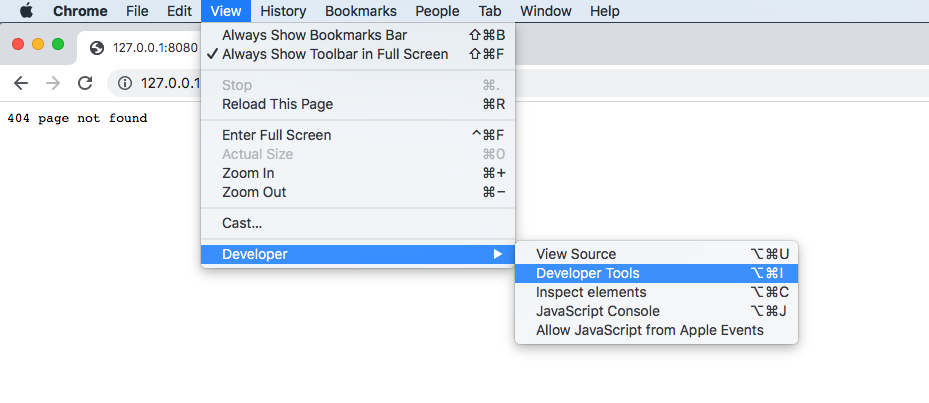  
  Kako otvoriti alate za programere u Chrome-u
  
  Pojaviće se prozor (pogledajte sliku). Zatim treba da kliknete na karticu "Network".
  
  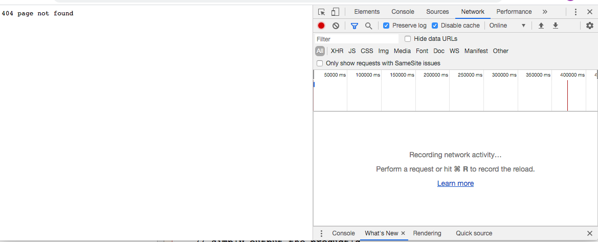
  Chrome alati za programere
  
  Mrežni panel će zabeležiti svaku upotrebu mreže. Trenutno je prazan jer nema mrežne aktivnosti. Ponovo učitajte stranicu i videćete zahtev koji je uputio Chrome.
  
  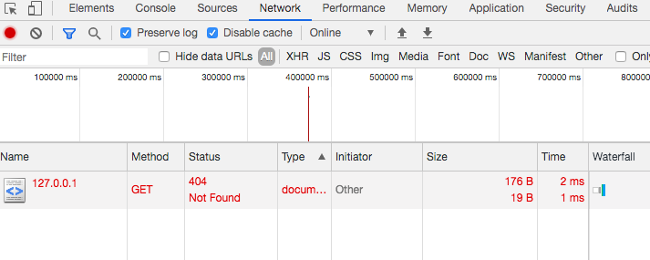
  Prikaz zahteva u Chrome alatkama za programere
  
  Možete videti:
  
  - Naziv zahteva
  - Metod (HTTP metod)
  - Zaglavlje zahteva i zaglavlje odgovora.
  - Status (ovde: 404 Nije pronađeno)
  - To je tip, inicijator, njegova veličina i vreme.
  
  Više informacija o zahtevu i odgovoru našeg servera možete dobiti klikom na zahtev:
  
  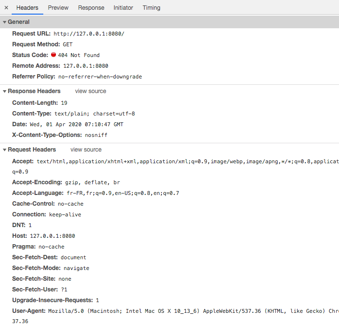  
  Alati za razvoj: zaglavlja zahteva
  
  - Kartica "Headers" sadrži zaglavlja zahteva i odgovora.
  - Kartica "Response" ispisuje odgovor servera. Ovo je neobrađeni odgovor primljen od servera.

- **Testiranje lokalnog veb servera pomoću cURL-a**

  cURL je softver napisan u C jeziku, objavljen 1997. godine. Ovaj softver se sastoji od dva različita elementa: biblioteke ( libcurl ) i interfejsa komandne linije ( curl ). Biblioteku možemo koristiti u C programu ili u bilo kom drugom programu koji pruža povezivanja za nju.
  
  Koristićemo alat komandne linije da testiramo naš server.
  
  Sledeća komanda će poslati HTTP GET zahtev na adresu servera: <http://127.0.0.1:8080>
  
  ```sh
  curl http://127.0.0.1:8080 --verbose
  ```
  
  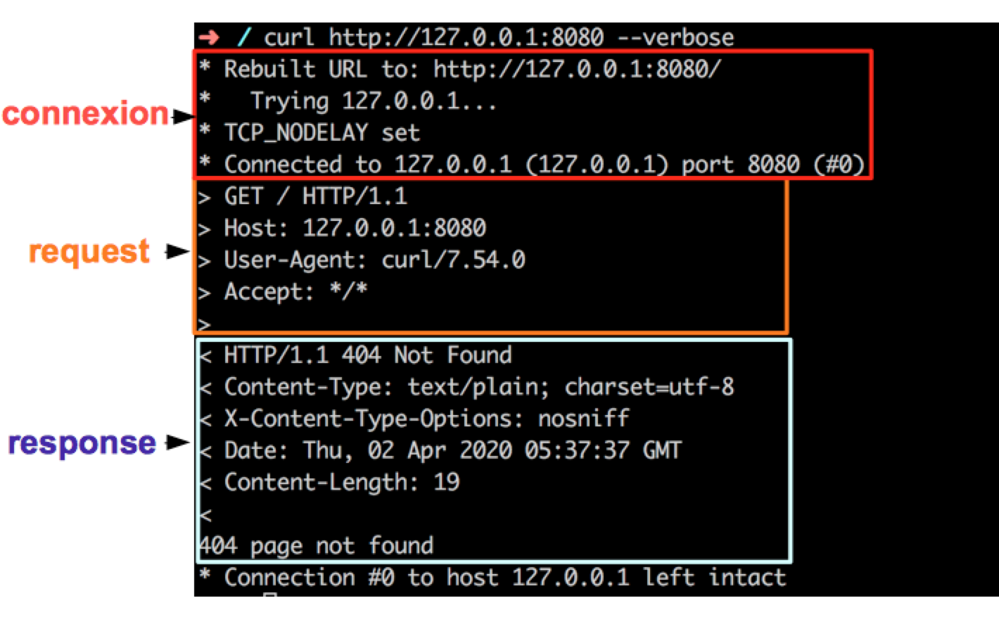  
  Dekompozicija izlaza curl
  
  Na slici možete videti primer izlaza. Namerno sam dodao zastavicu za detaljan prikaz `--verbose` kako bih dobio više informacija o zahtevu i odgovoru. Možemo videti:
  
  - Veza sa serverom
  - Zahtev koji je poslat
  - Odgovor primljen od servera
  - Konačni status veze

## Prikazivanje HTML stranice pomoću Go veb servera

Prvi server koji smo napravili ne radi ništa: prima HTTP odgovor sa statusnim kodom 404 (Nije pronađeno) za svaki HTTP zahtev. Poslaćemo HTML dokument u telu poruke odgovora.

### HTTP odgovor sa HTML sadržajem

Naš cilj je da pošaljemo ovaj HTML dokument klijentu:

```html
<html>
    <head></head>
    <body>Hello</hello>
</html>
```

Moramo biti u mogućnosti da pošaljemo ovaj HTTP zahtev sa našim serverom:

```html
HTTP/1.1 200 OK
Content-Type: text/html; charset=utf-8
Date: Fri, 03 Apr 2020 06:26:25 GMT
Content-Length: 45

<html>
    <head></head>
    <body>Hello</hello>
</html>
```

### Struktura tipa Server

Struktura `Server` iz paketa `http` ima polje pod nazivom `Handler`. Evo izvoda datoteke `net/http/server.go` iz standardne biblioteke.

```go
package http
//..
type Server struct {
    Addr    string  // TCP address to listen on, ":http" if empty
    Handler Handler // handler to invoke, http.DefaultServeMux if nil
    //...
}
```

`Handler` (iz paketa `http`) je interfejs:

```go
package http
//...
type Handler interface {
    ServeHTTP(ResponseWriter, *Request)
}
```

### Napravite sopstvenu implementaciju http.Handler-a

Trebalo bi da kreiramo sopstveni tip koji implementira ovaj interfejs da bismo definisali HTTP rukovalac:

```go
type myHandler struct {
}

func (h *myHandler)ServeHTTP(w http.ResponseWriter, r *http.Request) {
    // TODO
}
```

Ovde sam kreirao tip strukture pod nazivom myHandler. Na ovom tipu sam definisao metodu pod nazivom `ServeHTTP`. Ova metoda uzima dva parametra , "w" i "r", w je tipa `http.ResponseWriter` i "r" je tipa `*http.Request`.

Koji su to tipovi? Hajde da pređemo na dokumentaciju.

### http.ResponseWriter

HTTP obrađivač koristi `ResponseWriter` interfejs za konstruisanje HTTP odgovora. Možemo videti da je to tip interfejs:

```go
package http
//...
type ResponseWriter interface {
    // Header returns the header map that will be sent by
    // WriteHeader. The Header map also is the mechanism with which
    // Handlers can set HTTP trailers.
    //...
    Header() Header

    // Write writes the data to the connection as part of an HTTP reply.
    //...
    Write([]byte) (int, error)

    // WriteHeader sends an HTTP response header with the provided
    // status code.
    //...
    WriteHeader(statusCode int)
}
```

Kada server primi zahtev, proslediće našoj funkciji implementaciju ovog interfejsa. To znači da ćemo imati mogućnost da koristimo tri metode:

`Header`  
Ova metoda će vratiti element tipa `http.Header` koji je mapa zaglavlja.

`Write`
Ovom metodom, moći ćemo da pišemo sadržaj u telo odgovora.

`WriteHeader`
Ovom metodom možemo poslati određeni statusni kod.

### http.Request

`http.Request` je tip strukture koja navodi sve elemente primljenog zahteva. Ovaj tip strukture ima preko 10 izvezenih polja. Kasnije ćemo videti da se ova struktura koristi i za izgradnju HTTP klijenata! Tri važnija su:

- `URL` - što je u slučaju servera URI.
- `Body` - koji sadrži telo poruke.
- `Header` - mapa koja sadrži zaglavlja

### Implementacija ServerHTTP-a

Evo našeg rukovođenja:

```go
type myHandler struct {
}

func (h *myHandler)ServeHTTP(w http.ResponseWriter, r *http.Request) {
    // TODO
}
```

Metod `ServeHTTP` treba da upiše zaglavlja odgovora i podatke u ResponseWriter, a zatim da vrati rezultat. Vraćanje signalizira da je zahtev završen.

Pozvaćemo funkciju w.Write da zapiše podatke u telo odgovora naše HTML stranice. Funkcija Write ima sledeći potpis:

```go
Write([]byte) (int, error)
```

Prihvata isečak bajtova i vraća ceo broj ili grešku. Vraćeni ceo broj je broj bajtova zapisanih u telo odgovora.

Da vidimo kako ćemo to uraditi:

```go
func (h *myHandler) ServeHTTP(w http.ResponseWriter, r *http.Request) {
    toSend := []byte("<html><head></head><body>Hello</hello></html>")
    _, err := w.Write(toSend)
    if err != nil {
        log.Printf("error while writing on the body %s", err)
    }
}
```

- Kreiramo inicijalizovanu promenljivu "toSend". To je isečak bajtova koji sadrži naš HTML dokument. Imajte na umu da smo obrisali prelome redova. Veb pregledač ignoriše prelome redova; oni su tu samo da pomognu programeru da napiše HTML dokument.
- Zatim prosleđujemo ovu promenljivu u w.Write poziv metode
  - Zanemarujemo broj zapisanih bajtova (sa _)
  - Kreira se nova promenljiva err koja će sadržati grešku.
- Obično, trebalo bi da proverimo da li je "err" `nil`.
- Ako greška nije jednaka `nil`, evidentiramo je.

Kada se funkcija vrati, zahtev je završen.

### Dodavanje rukovaoca na server

Potrebno je da registrujemo rukovaoca:

```go
myServer := &http.Server{
    // set the server address
    Addr: "127.0.0.1:8080",
    // define some specific configuration
    ReadTimeout:  10 * time.Second,
    WriteTimeout: 10 * time.Second,
    Handler:      &myHandler{},
}
```

Naš server će se sada pokrenuti myHandler.ServeHTTP za svaki primljeni zahtev!

### Kompletan kod

```go
// basic-http-server/serve-html/main.go
package main

import (
    "log"
    "net/http"
    "time"
)

func main() {
    // create a server
    myServer := &http.Server{
        // set the server address
        Addr: "127.0.0.1:8080",
        // define some specific configuration
        ReadTimeout:  10 * time.Second,
        WriteTimeout: 10 * time.Second,
        // register our handler
        Handler: &myHandler{},
    }

    // launch the server
    log.Fatal(myServer.ListenAndServe())
}

type myHandler struct {
}

// function executed for each HTTP request received
func (h *myHandler) ServeHTTP(w http.ResponseWriter, r *http.Request) {
    toSend := []byte("<html><head></head><body>Hello</hello></html>")
    _, err := w.Write(toSend)
    if err != nil {
        log.Printf("error while writing on the body %s", err)
    }
}
```

### Testiranje našeg veb servera

Sada hajde da ga izgradimo i pokrenemo!

```sh
go build main.go
./main
```

- **Testiranje našeg veb servera pomoću veb pregledača**

...

- **Testiranje našeg web servera pomoću curl-a**

```sh
curl 127.0.0.1:8080 --verbose
* Rebuilt URL to: 127.0.0.1:8080/
*   Trying 127.0.0.1...
* TCP_NODELAY set
* Connected to 127.0.0.1 (127.0.0.1) port 8080 (#0)
> GET / HTTP/1.1
> Host: 127.0.0.1:8080
> User-Agent: curl/7.54.0
> Accept: */*
>
< HTTP/1.1 200 OK
< Date: Sat, 04 Apr 2020 19:07:55 GMT
< Content-Length: 45
< Content-Type: text/html; charset=utf-8
<
* Connection #0 to host 127.0.0.1 left intact
<html><head></head><body>Hello</hello></html>
```

Ura!

### Uobičajene greške

- **Adresa je već u upotrebi**

  Kada pokušate da pokrenete veb server, možete dobiti ovu grešku. To znači da drugi program već koristi port koji ste izabrali. Da biste je rešili, proverite da li ste zaboravili da zaustavite drugi server koji radi na vašem računaru.
  
  - **MacOs / Linux**:
  
    Možete proveriti koji program sluša na portu 8084 pomoću ove komande:

    ```sh
    sudo lsof -i 8084
    ```

    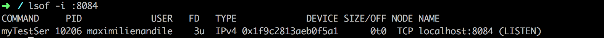

    lsof znači "navedi listu otvorenih datoteka".

    - Kolona **COMMAND** vam omogućava da identifikujete naziv komande
    - **PID** je **ID** procesa (10206)
    - **USER**: je korisnik koji je pokrenuo program (ovde ja)
    - **TYPE**: obaveštava vas o tipu otvorene datoteke. (ovde IPv4)

    Iz komandne linije možete direktno da zaustavite proces sledećom komandom:

    ```sh
    kill 10206
    ```

    OS će zaustaviti program.

  - **Vindous**:

    Sledeća komanda će vam dati ID procesa programa koji sluša na portu 8084:

    ```sh
    netstat -ano | find "8084"
    
    TCP 0.0.0.0:8084 0.0.0.0:0 LISTENING 10206
    ```

    10206 je ID procesa programa koji sluša na 0.0.0.0:8084.

    Da biste zaustavili ovaj proces, možete koristiti sledeću komandu:

    ```sh
    taskkill /F /PID 10206
    ```

- **Previše otvorenih datoteka**

  Šta su "otvorene datoteke"? Postoje dve glavne vrste otvorenih datoteka:
  
  - Datoteke koje otvara i čita ili piše korisnik sistema.
  - Otvoreni soketi: otvorena TCP veza, na primer.
  Bilo koji operativni sistem može da obradi ograničen broj otvorenih datoteka.
  Videćemo neke komande za dobijanje ovog broja na vašem sistemu:
  
  - **MacOs / Linux**
  
    lsof | wc -l

    - Pozivamo lsofda dobijemo listu otvorenih datoteka
    - Zatim brojimo linije koje vraća ova komanda ( wc -l)
  
  - Vindous
  
    Alat Process Explorer je dobra polazna tačka za pregled liste pokrenutih procesa i otvorenih datoteka na vašem sistemu. Evo linka za njegovo preuzimanje:
    <https://docs.microsoft.com/sisinternals/dovnloads/process-eksplorer>.
  
- **Mogući uzrok**

  Kada otvorite datoteku, ne smete zaboraviti da je zatvorite kada vam nije potrebna. Evo primera http obrađivača koji to demonstrira:
  
  ```go
  func (h *myHandler) ServeHTTP(w http.ResponseWriter, r *http.Request) {
      _, err := os.Open("/tmp/test")
      if err != nil {
          log.Println("error file open ", err)
      } else {
          log.Println("file opened")
      }
  }
  ```
  
  Za svaki HTTP zahtev, otvorićemo datoteku /tmp/test. Datoteke se neće automatski zatvoriti kada se odgovor pošalje!
  
  Hajde da testiramo ovaj hendler sa standardnim serverom:
  
  ```go
  func main() {
      // create a server
      myServer := &http.Server{
          // set the server address
          Addr: "127.0.0.1:8084",
          // define some specific configuration
          ReadTimeout:  10 * time.Second,
          WriteTimeout: 10 * time.Second,
          Handler:      &myHandler{},
      }
  
      // launch the server
      log.Fatal(myServer.ListenAndServe())
  }
  ```
  
  Zatim ga gradimo i pokrećemo:
  
  ```sh
  go build -o myProg main.go
  ./myBuggyServer
  ```
  
  Da vidimo sada koliko je datoteka otvorio ovaj program. Prvo moramo da dobijemo njegov ID procesa:
  
  ```sh
  lsof -i :8084
  ```
  
  myProg  12138 maximilienandile    3u  IPv4 0x1f9c2813af8142d1      0t0 TCP localhost:8084 (LISTEN)
  ID procesa je 12138. Hajde da izbrojimo broj otvorenih datoteka:
  
  ```sh
  lsof -p 12458 | wc -l
  10
  ```
  
  Deset datoteka je otvoreno! Sada hajde da pokrenemo četiri zahteva serveru (pomoću komandne linije cURL):
  
  ```sh
  curl 127.0.0.1:8084
  curl 127.0.0.1:8084
  curl 127.0.0.1:8084
  curl 127.0.0.1:8084
  ```
  
  Hajde sada da proverimo koliko otvorenih datoteka proces ima (ID procesa se nije promenio)
  
  ```sh
  lsof -p 12458 | wc -l
  14
  ```
  
  Server će koristiti previše resursa. Sakupljač smeća će zatvoriti te otvorene datoteke umesto vas. To je i dalje opasno jer vaš Go skript može prekoračiti ograničenje otvorenih datoteka vašeg sistema pre sakupljanja smeća.
  
## Aplikacija - Server za A/B testiranje

Vaš klijent ima dve ideje za dizajn (A i B) za početnu stranicu veb-sajta hotela. Ne može da bira između ta dva dizajna. Pita vas da li je moguće testirati obe verzije dizajna.
Pobednički dizajn je onaj koji će generisati više telefonskih poziva.

Vaša misija: izgradnja http servera koji:

- sluša na: IP 127.0.0.1 / Port 9899
- Za svaki primljeni HTTP zahtev, pošaljite ili dizajn A ili dizajn B:
  - Kada je trenutni broj minuta neparan, servirajte A
  - Inače servirajte B

Evo dizajna A:

```html
<html>
<head>
    <title>The Golang Hotel</title>
</head>
<body>
  <p>The Golang Hotel is a relaxing place !</p>
  <p>We offer 20% discount if you call this number : <strong>1234567891</strong></p>
</body>
</html>
```

I dizajn B :

```html
<html>
<head>
  <title>The Golang Hotel</title>
</head>
<body>
  <h2>The Golang Hotel is a relaxing place !</h2>
  <h5>We offer 20% discount if you call this number : <strong>1234567892</strong></h5>
</body>
</html>
```

Sledi rešenje:

### go.mod datoteka

Prvi korak je inicijalizacija projekta pomoću go.mod datoteke:

```sh
module maximilien-andile.com/webserver/application1

go 1.13
```

Takođe možete generisati ovu datoteku pomoću komande `go mod init`:

```sh
go mod init maximilien-andile.com/webserver/application1
go: creating new go.mod: module maximilien-andile.com/webserver/application1
```

### http.Server struktura

Zatim treba da kreiramo novi `http.Server`:

```go
abTestingServer := &http.Server{
    Addr: "127.0.0.1:9899",
    ReadTimeout:  10 * time.Second,
    WriteTimeout: 10 * time.Second,
}
```

`abTestingServer` je pokazivač na ovu strukturu.

### Skelet obrađivača

Kreiramo tipš strukture koji će implementirati `http.Handler` interfejs. Za memoriju, ovo je `http.Handler` interfejs:

```go
type Handler interface {
    ServeHTTP(ResponseWriter, *Request)
}
```

Moramo implementirati `ServerHTTP` metod. Evo naše `http.Handler` implementacije:

```go
type AbHandler struct {
}

func (h *AbHandler) ServeHTTP(w http.ResponseWriter, r *http.Request) {
}
```

Zatim možemo postaviti `Handler` polje u `abTestingServer`:

```go
abTestingServer := &http.Server{
    Addr: "127.0.0.1:8084",
    ReadTimeout:  10 * time.Second,
    WriteTimeout: 10 * time.Second,
    Handler:&AbHandler{},
}
```

Šta je `&AbHandler{}`? Hajde da ga razložimo: kreiraćemo promenljivu tipa `AbHandler`

- Sa znakom `&` ćemo uzeti adresu ove promenljive.

```go
AbHandler{} je tipa `*AbHandler`
```

### Implementacija obrađivača - učitavanje HTML dizajna

Prvo što treba da uradite je da učitate naša dva dizajna:

```go
func (h *AbHandler) ServeHTTP(w http.ResponseWriter, r *http.Request) {

    // load design A
    designA := []byte("<html><head><title>The Golang Hotel</title></head><body><p>The Golang Hotel is a relaxing place !</p><p>We offer 20% discount if you call this number : <strong>1234567891</strong></p></body></html>")

    // load design B
    designB := []byte("<html><head><title>The Golang Hotel</title></head><body><h2>The Golang Hotel is a relaxing place !</h2><h5>We offer 20% discount if you call this number : <strong>1234567892</strong></h5></body></html>")
}
```

Kreirali smo dve promenljive: "designA" i "designB". One su isečci bajtova. Imajte na umu da je HTML sadržaj minifikovan: novi redovi i nepotrebni razmaci su uklonjeni iz HTML verzija dizajna.

16.2.5 Implementacija obrađivača: Naizmenično serviranje dve HTML stranice

Sada u rukovaocu možemo implementirati logiku odgovora.

```go
func (h *AbHandler) ServeHTTP(w http.ResponseWriter, r *http.Request) {

    designA := []byte("<html><head><title>The Golang Hotel</title></head><body><p>The Golang Hotel is a relaxing place !</p><p>We offer 20% discount if you call this number : <strong>1234567891</strong></p></body></html>")

    designB := []byte("<html><head><title>The Golang Hotel</title></head><body><h2>The Golang Hotel is a relaxing place !</h2><h5>We offer 20% discount if you call this number : <strong>1234567892</strong></h5></body></html>")

    minutes := time.Now().Minute()

    if minutes%2 == 0 {
        // even
        log.Println("serving B")
        _, err := w.Write(designB)
        if err != nil {
            log.Print("impossible to serve design A", err)
        }
    } else {
        // odd
        log.Println("serving A")
        _, err := w.Write(designA)
        if err != nil {
            log.Print("impossible to serve design B", err)
        }
    }
}
```

Za svaki zahtev, dobićemo trenutni minut `time.Now().Minute()`

- Ako je ovaj broj paran ( `minutes % 2 == 0` ), onda ćemo poslati dizajn B kao odgovor.
- U suprotnom, šalje se dizajn A.

Jedna stvar nedostaje: moramo pokrenuti server:

```go
log.Fatal(abTestingServer.ListenAndServe())
```

### Kompletan kod naše aplikacije

```go
// basic-http-server/ab-testing/main.go
package main

import (
    "log"
    "net/http"
    "time"
)

func main() {
    // create a server
    abTestingServer := &http.Server{
        // set the server address
        Addr: "127.0.0.1:9899",
        // define some specific configuration
        ReadTimeout:  10 * time.Second,
        WriteTimeout: 10 * time.Second,
        Handler:      &AbHandler{},
    }
    log.Fatal(abTestingServer.ListenAndServe())
}

type AbHandler struct {
}

func (h *AbHandler) ServeHTTP(w http.ResponseWriter, r *http.Request) {

    designA := []byte("<html><head><title>The Golang Hotel</title></head><body><p>The Golang Hotel is a relaxing place !</p><p>We offer 20% discount if you call this number : <strong>1234567891</strong></p></body></html>")

    designB := []byte("<html><head><title>The Golang Hotel</title></head><body><h2>The Golang Hotel is a relaxing place !</h2><h5>We offer 20% discount if you call this number : <strong>1234567892</strong></h5></body></html>")

    minutes := time.Now().Minute()

    if minutes%2 == 0 {
        // even
        log.Println("serving B")
        _, err := w.Write(designB)
        if err != nil {
            log.Print("impossible to serve design A", err)
        }
    } else {
        // odd
        log.Println("serving A")
        _, err := w.Write(designA)
        if err != nil {
            log.Print("impossible to serve design B", err)
        }
    }
}
```

### Test aplikacije

Da bismo testirali server, prvo moramo da kompajliramo i pokrenemo našu aplikaciju:

go build -o abServer main.go
./abServer

Otvorite veb pregledač i unesite tekst <http://localhost:9899/> u adresnu traku.

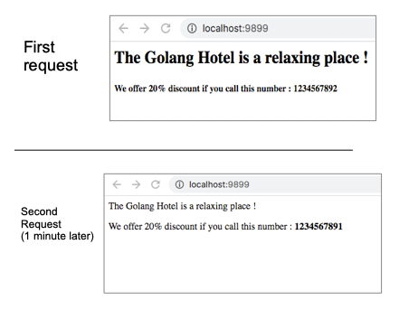  
A/B server za testiranje

### Moguća poboljšanja

- Za svaki zahtev kreiramo dva isečka bajtova za čuvanje dizajna. Ovo je beskorisno.
  - Možemo sačuvati dva dizajna u dva polja za rukovanje inicijalizovana prilikom pokretanja servera (u glavnoj funkciji)
- Šta ako želimo da sačuvamo dva HTML koda u datotekama? Ako želimo da promenimo jedan dizajn (dodamo neke boje, dodamo sliku), moramo ponovo da kompajliramo Go program. Ako su datoteke sačuvane u datotekama, možemo lako promeniti dizajn bez ponovnog kompajliranja servera.
- U programu, svaki URI će vratiti iste dve HTML stranice. Šta ako želimo da definišemo određenu putanju za ovu stranicu. Na primer: /special-offer-summer.
  - To možemo postići pomoću rutera (koji će pokrenuti poseban program za svaku određenu rutu). Kasnije ćemo videti kako se to radi.

## Testirajte sebe

1. Koji paket iz standardne biblioteke možete koristiti za izgradnju HTTP veb servera?  
   `net/http`
2. Tačno ili netačno. HTTP zahtev se šalje sa servera klijentu.  
   1. Netačno  
   2. Klijent šalje zahtev serveru  
   3. Server će odgovoriti HTTP odgovorom  
3. Kako napraviti http veb server?  
   1. Napravite promenljivu tipa *`http.Server`  
      1. Podesite adresu za slušanje  
      2. Podesite vreme čekanja za čitanje i pisanje (da biste izbegli podrazumevane vrednosti)  
  
         ```go
         myServer := &http.Server{
             // set the server address
             Addr: "127.0.0.1:8080",
             // define some specific configuration
             ReadTimeout:  10 * time.Second,
             WriteTimeout: 10 * time.Second,
         }
         ```

   2. Napravite tip MyHandler koji implementira `http.Handler` interfejs.
       1. Implementirajte metod `ServeHTTP(http.ResponseWriter, *http.Request)`
   3. Postavite polje `Handler` na `myServer` pokazivač na `&MyHandler{}`
   4. Pokrenite server pozivanjem metode `ListenAndServe()`
4. Da li se unutar metode za rukovanje (`ServeHTTP(w http.ResponseWriter, r *http.Request)`) može dobiti vrednost zaglavlja zahteva? Kako?
    1. Da, pozivom `r.Header.Get("Name-Of-The-Header")`
5. Možete li dati značenje HTTP statusnih kodova 200, 500 i 400?
    1. `200` = "U redu"
    2. `500` = "Interna greška servera" server je imao neočekivanu grešku
    3. `400` = "Neispravan zahtev" zahtev koji ste poslali je neispravno formatiran.

## Ključno

- HTTP server je program koji će obrađivati HTTP zahteve koje šalju klijenti
- Klijenti mogu biti veb pregledači (ali ne samo, mogu biti i drugi programi)
- HTTP je komunikacioni protokol
- Možemo poslati HTTP zahtev serveru identifikovanom IP adresom.
- Takođe možemo poslati HTTP zahtev na ime domena koje je mapirano na jedan ili više servera od strane sistema imena domena (DNS)
- HTTP odgovori se sastoje od statusnog koda (nepotpisanog celog broja) koji generiše server da bi obavestio klijenta o statusu njegovog zahteva.
  - 200 = "U redu"
  - 500 = "Interna greška servera" server je imao neočekivanu grešku
  - 400 = "Neispravan zahtev" zahtev koji ste poslali je neispravno formatiran.
- Možete napraviti HTTP server sa standardnim paketom `net/http`
  - Evo primera HTTP servera

    ```go
    // basic-http-server/sample/main.go
    package main
    
    import (
        "log"
        "net/http"
        "time"
    )
    
    func main() {
        // create a server
        abTestingServer := http.Server{
            // set the server address
            Addr: "127.0.0.1:9899",
            // define some specific configuration
            ReadTimeout:  10 * time.Second,
            WriteTimeout: 10 * time.Second,
            Handler:      &MyHandler{},
        }
        log.Fatal(abTestingServer.ListenAndServe())
    }
    
    type MyHandler struct {
    }
    
    func (m *MyHandler) ServeHTTP(w http.ResponseWriter, r *http.Request) {
        // TODO
    }
    ```

  - parametar w vam omogućava da napišete odgovor
  - parametar r vam omogućava pristup zahtevu

[25 JSON i XML][25]  
[00 Sadržaj][00]  
[27 Enum iota i bitmask][27]

[25]: 25_JSON_i_XML.md
[00]: 00_Sadržaj.md
[27]: 27_Enum_iota_i_bitmask.md
