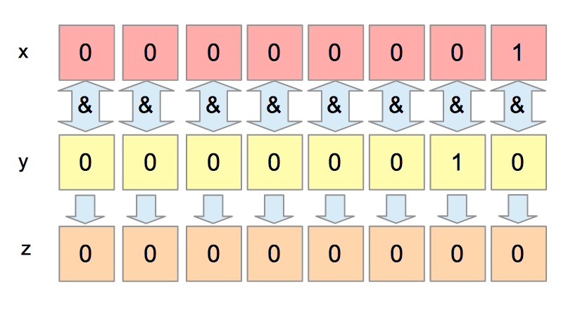
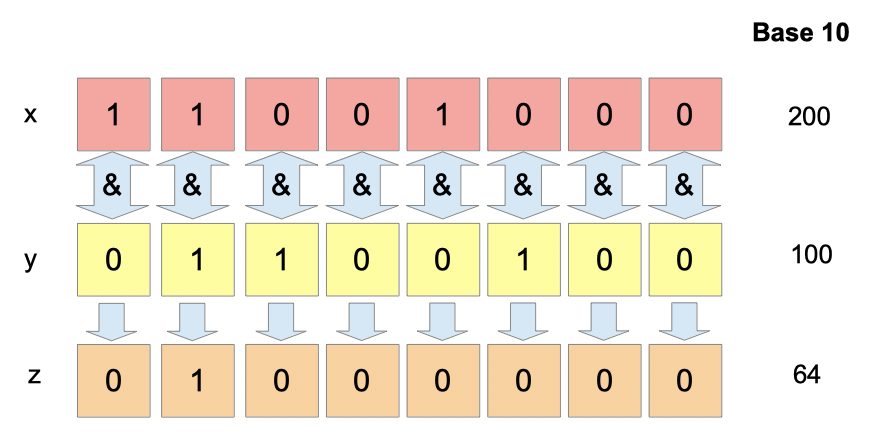
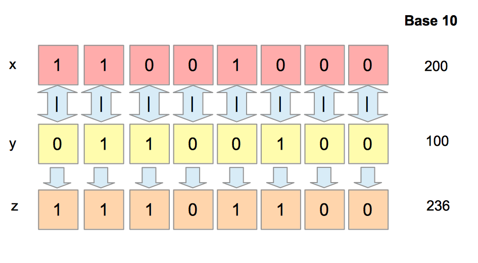
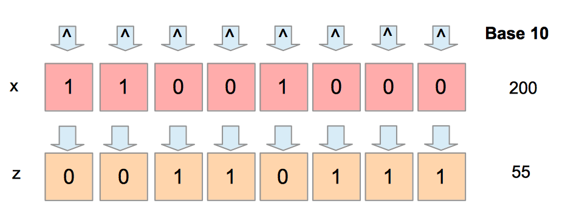
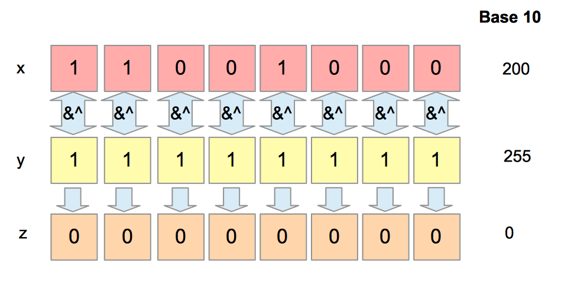
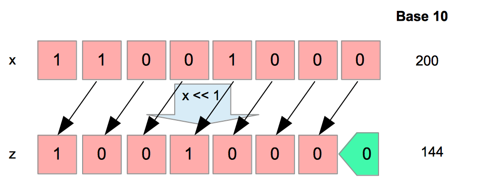
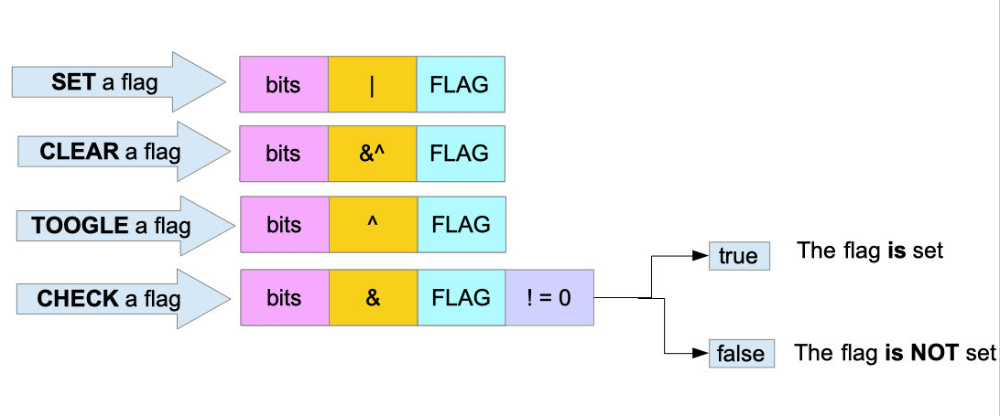

# 27 Enum, Iota & Bitmask

[26 Osnovni HTTP server][26] | [00 Sadržaj][00] | [28 Datumi i vreme][28]

**Šta ćete naučiti u ovom poglavlju?**

- Šta je enum?
- Kako kreirati enum pomoću Go-a.
- Šta je jota i kako se koristi?
- Šta su bitski operatori i kako ih koristiti?

**Obrađeni tehnički koncepti**:

- Nabrajanje
- Tip nabrajanja
- jota
- indeks
- Bajt, bitovi
- Binarni
- Bitmask, Bitflag

## Definicija nabrajanja

"Enum" (ili tip podataka enumeracije) je tip podataka koji se sastoji od skupa "vrednosti koje je programer eksplicitno definisao".

Na primer, dani u nedelji su nabrajanje. Postoji sedam dana u nedelji i ne više.

## Go i nabrajanja

Jezik (barem u svojoj verziji 1) nema specifične tipove nabrajanja. Međutim, i dalje možemo da napravimo tip koji nudi iste karakteristike kao nabrajanja.

## Kreiranje tipa koji se može koristiti "kao" nabrajanje

Uzmimo primer HTTP metoda.

```go
// enum-iota-bitmasks/type-as-enum/main.go 

type HTTPMethod int

const (
    GET     HTTPMethod = 0
    POST    HTTPMethod = 1
    PUT     HTTPMethod = 2
    DELETE  HTTPMethod = 3
    PATCH   HTTPMethod = 4
    HEAD    HTTPMethod = 5
    OPTIONS HTTPMethod = 6
    TRACE   HTTPMethod = 7
    CONNECT HTTPMethod = 8
)
```

- Prvo, deklarišemo novi tip "HTTPMethod" (njegov osnovni tip je int).
- Zatim kreiramo devet konstanti tipa "HTTPMethod".
- Svaka konstanta je tipa "HTTPMethod" i naziva se isto kao HTTP metoda koju označava.

### Zašto celi brojevi?

Slobodni ste da koristite osnovni tip koji se razlikuje od int.

Međutim, ovo je uobičajena praksa korišćenja celih brojeva.

- Generalno je efikasnije upoređivati ceo broj sa drugim celim brojem nego upoređivati string sa drugim stringom
- Možete koristiti jotu (videti sledeće odeljke).

### Primer upotrebe

Zamislite da imate funkciju koja obrađuje HTTP zahteve.

U ovoj funkciji očekujete da vam korisnik da HTTP metod i očekujete da obrađujete unapred definisani skup metoda. Vaša funkcija može imati parametar tipa HTTPMethod (umesto int):

```go
func handle(method HTTPMethod, headers map[string]string, uri string) {}
```

Unutar tela funkcije, možete prilagoditi ponašanje vašeg obrađivača korišćenjem vrednosti nabrajanja:

```go
func handle(method HTTPMethod, headers map[string]string, uri string) {
    if method == GET {
        fmt.Println("the method is get")
    } else {
        fmt.Println("the method is not get")
    }
}
```

Tipovi nabrajanja se takođe mogu koristiti u strukturama (kao i bilo koji drugi tipovi):

```go
// enum-iota-bitmasks/type-as-enum/main.go 

type HTTPRequest struct {
    method  HTTPMethod
    headers map[string]string
    uri     string
}

func main() {
    r := HTTPRequest{method: GET, headers: map[string]string{"Accept": "application/json"}, uri: "/prices"}
    fmt.Println(r)
}
```

### Usavršivo rešenje

Rešenje predloženo u prethodnom odeljku nije savršeno. Evo zašto:

- Bilo koja int može biti promenljiva tipa HTTPMethod:

```go
lolMethod := HTTPMethod(42)
headers := make(map[string]string)
handle(lolMethod,headers,"/prices")
```

Kreirali smo promenljivu "lolMethod" tipa HTTPMethod i kod će se kompajlirati.

- Kada ispišemo, HTTPMethod izlaz je int:

log.Println(GET)
// > 0

- Kada se maršalira u JSON, vrednost tipa HTTPMethod će biti ispisana kao ceo broj...

```go
type HTTPRequest struct {
    Method  HTTPMethod `json:"method"`
    Headers map[string]string `json:"headers"`
    Uri     string `json:"uri"`
}
r := HTTPRequest{Method: GET, Headers: map[string]string{"Accept": "application/json"}, Uri: "/prices"}
marshaled, err  := json.Marshal(r)
if err != nil {
    panic(err)
}
```

Proizvešće sledeći JSON string:

```json
{
  "method": 0,
  "headers": {
    "Accept": "application/json"
  },
  "uri": "/prices"
}
```

Vrednost 0 bi mogla biti protumačena kao greška. Umesto toga, želimo da ispišemo "GET".

- Kada želimo da demaršalujemo JSON string, možemo naići na grešku:

  ```go
  jsonB := []byte("{\"method\":\"GET\",\"headers\":{\"Accept\":\"application/json\"},\"uri\":\"/prices\"}")
  req := HTTPRequest{}
  err = json.Unmarshal(jsonB, &req)
  if err != nil {
      panic(err)
  }
  ```

Uhvatila nas je panika:

```sh
panic: json: cannot unmarshal string into Go struct field HTTPRequest.method of type main.HTTPMethod
```

Ovo je sasvim normalno, imamo string kao ulaz i želimo da ga konvertujemo u ceo tip. Jedno rešenje bi moglo biti promena osnovnog tipa u string.

## Enum biblioteka

Da biste rešili prethodne probleme:

- Moramo biti u mogućnosti da proverimo da li je vrednost deo nabrajanja.
  - Potrebna nam je metoda koja validira vrednost

- Moramo biti u stanju da pravilno odštampamo element
  - Moramo da implementiramo `fmt.Stringer` interfejs

- Moramo biti u stanju da pravilno maršalujemo vrednost nabrajanja u JSON (a
  možda i u drugi format)
  - Moramo da implementiramo `json.Marshaler` interfejs

- Moramo biti u stanju da pravilno raspakujemo vrednost nabrajanja iz JSON-a (a
  možda i iz drugog formata)
  - Moramo da implementiramo `json.Unmarshaler` interfejs.

Možemo implementirati te interfejse:

```go
// enum-iota-bitmasks/enum-implementations/main.go 

type HTTPMethod int

func (h HTTPMethod) IsValid() bool {
    panic("implement me")
}

func (h HTTPMethod) String() string {
    panic("implement me")
}

func (h HTTPMethod) UnmarshalJSON(bytes []byte) error {
    panic("implement me")
}

func (h HTTPMethod) MarshalJSON() ([]byte, error) {
    panic("implement me")
}
```

Međutim, ovo je zamorno. Možemo koristiti biblioteku da to uradimo umesto nas. Nakon brze pretrage na GitHabu, čini se da se pojavljuju dve biblioteke:

- <https://github.com/alvaroloes/enumer>

- <https://github.com/abice/go-enum>

Oni će generisati te metode za vas. Nude interfejs komandne linije.

Imajte na umu da je podrška za nabrajanja zahtev za funkciju za verziju 2 jezika.

## jota

U prethodnom odeljku:

- Morali smo svakoj konstanti dodeliti ceo broj.

- Tip HTTPMethod je takođe napisan u svakom redu.

Da bismo izbegli ta dva zadatka, možemo izmeniti naš enum da koristi iota:

```go
// enum-iota-bitmasks/iota/main.go
package main

import "fmt"

type HTTPMethod int

const (
    GET     HTTPMethod = iota
    POST    HTTPMethod = iota
    PUT     HTTPMethod = iota
    DELETE  HTTPMethod = iota
    PATCH   HTTPMethod = iota
    HEAD    HTTPMethod = iota
    OPTIONS HTTPMethod = iota
    TRACE   HTTPMethod = iota
    CONNECT HTTPMethod = iota
)

func main() {
    fmt.Println(PUT)
    // 2
}
```

Možemo pojednostaviti ovaj kod. Moguće je izbeći ponavljanje svaki put korišćenjem svojstva implicitnog ponavljanja. Ovo svojstvo je veoma korisno; ono kaže da unutar skupa konstanti ( ) možete dodeliti vrednost samo prvoj konstanti:

```go
HTTPMethod = iotaconst(...)
```

```go
// enum-iota-bitmasks/iota-improvement/main.go 

const (
    GET HTTPMethod = iota
    POST
    PUT
    DELETE
    PATCH
    HEAD
    OPTIONS
    TRACE
    CONNECT
)
```

### Kako funkcioniše jota

- "jota predstavlja uzastopne netipizovane celobrojne konstante".

- To znači da je iota uvek ceo broj; nemoguće je koristiti iota za konstruisanje
  vrednosti tipa float (na primer).

- "NJegova vrednost je indeks odgovarajuće ConstSpec u toj deklaraciji
  konstante"

Vrednost jote je određena indeksom konstante u deklaraciji konstante. U prethodnom primeru, POST je druga konstanta, pa ima vrednost 1. Zašto 1? Zašto ne 2? To je zbog trećeg svojstva jote:

- počinje od nule.

Početna vrednost jote je nula. Primer:

```go
type TestEnum int

const (
    First TestEnum = iota
    Second
)

fmt.Println(First)
// 0
```

jota je inicijalizovana nulom. Ako želite da vaš prvi element nabrajanja počinje nečim drugim osim nule, možete dodeliti drugu vrednost početnoj konstanti:

```go
type TestEnum int

const (
    First TestEnum = iota + 4
    Second
)

fmt.Println(First)
// 4 (0+4)
```

Takođe možete pomnožiti jotu celim brojem:

```go
type TestEnum int

const (
    First TestEnum = iota * 3
    Second
)

fmt.Println(Second)
// 3 (1*3)
```

## Byte / bit

- `Byte` (bajt) se sastoji od 8 bitova memorije.
- `Bit` je binarna cifra. Jednak je ili `0` ili `1`.
- Indeksiranje bitova nije prirodno; počinjemo brojanje zdesna nalevo (a ne
  sleva nadesno).

### Operacije na bitovima

Prvi korak pre prelaska na bitske operatore jeste da naučite kako da odštampate binarni prikaz broja.

### Odštampajte bitove

Da biste ispisali bitove broja, možete koristiti funkciju `fmt.Printf()` sa specifikatorom formata `%08b`. `08` znači da ćemo ispisati binarnu vrednost na 8 bitova.

```go
// enum-iota-bitmasks/print-bits/main.go
package main

import "fmt"

func main() {
    var x uint8
    x = 1
    fmt.Printf("%08b\n", x)
    //00000001
    x = 2
    fmt.Printf("%08b\n", x)
    //00000010
    x = 255
    fmt.Printf("%08b\n", x)
    //11111111
}
```

U prethodnom kodu, definisali smo "x", neoznačeni ceo broj sačuvan u 8 bitova. X može da uzme vrednosti od 0 do 255. Dodeljujemo "x" vrednost 1, zatim 2 i 255. Svaki put ispisujemo binarnu reprezentaciju.

### Bitske operacije

Da bismo izvodili operacije nad bitovima, potrebni su nam operatori. Te operatore nazivamo "bitski operatori". U ovom odeljku ćemo proći kroz sve njih. Operacije nad bitovima mogu biti zastrašujuće u početku, ali one nisu ništa drugo do bulova logika. Ako ste već upoznati sa I, ILI, XOR itd., biće lako razumeti.

Operacija se može razložiti na tri elementa:

- Operator
- Operandi
- Rezultat

Na primer, u operacijama x | y = z  

- x i y su operandi,
- `|`  je operator i
- z je rezultat.

Za svaki operator važi ista logika. Operacije se izvršavaju nezavisno na svakom bitu operanda.

Bitovski operatori ne moraju da se mešaju sa logičkim operatorima (&&, || i !). Ti operatori se koriste za upoređivanje bulovih vrednosti sleva nadesno.

> [!Note]
> **Upozorenje**: Sledeće operatore možete koristiti samo sa celim brojevima.

#### Operator AND -  &

- Ako su x i y dva bita `x & y` jednako je 1 samo ako su i x i y jednaki 1.  
  U suprotnom slučaju `x & y` je jednako 0.

- Samo zapamtite da je bitska operacija & tačna samo ako su oba operanda tačna.

| x | y | x&y |
| - | - | :-: |
| 0 | 0 | 0 |
| 0 | 1 | 0 |
| 1 | 1 | 1 |
| 1 | 0 | 0 |

Uzmimo primer:

```go
// enum-iota-bitmasks/bitwise-operations/main.go 

var x, y, z uint8
x = 1 // 00000001
y = 2 // 00000010
z = x & y

// print in binary
fmt.Printf("%08b\n", z)
// 00000000

// print in base 10
fmt.Printf("%d\n", z)
// 0
```

Kreiraju se 3 celobrojne promenljive ( x, y, z). Zatim čuvamo x & y u promenljivoj z.



Kao što je prikazano na slici, uzimamo svaki bit pojedinačno, a zatim izračunavamo rezultat svakog; to je jedna operacija:

```sh
1 & 0 = 0  
0 & 1 = 0  
0 & 0 = 0  
0 & 0 = 0  
0 & 0 = 0  
0 & 0 = 0  
0 & 0 = 0  
0 & 0 = 0
```

Imajte na umu da počinjemo sa desne strane. Naviknite se na to; to je pravilo kada manipulišete bitovima.

Uzmimo još jedan primer:

```go
// enum-iota-bitmasks/bitwise-operation-and/main.go 

var x, y, z uint8
x = 200 // 11001000
fmt.Printf("%08b\n", x)

y = 100 // 01100100
fmt.Printf("%08b\n", y)

z = x & y

// print in binary
fmt.Printf("%08b\n", z)
// 01000000

// print in base 10
fmt.Printf("%d\n", z)
// 64
```

Na slici 3 možete videti detalje operacije2 0 0&1 0 0200 i 100.


Primer bitske operacije I

#### Operator OR - |

x | y jednako je 1 ako je:

- jedan od operanda je jednak 1
- oba operanda su jednaka 1.

| x | y | x\|y |
| - | - | :---: |
| 0 | 0 | 0 |
| 0 | 1 | 1 |
| 1 | 1 | 1 |
| 1 | 0 | 1 |

Evo jednog primera u programu go:

```go
// enum-iota-bitmasks/bitwise-or/main.go 

var x, y, z uint8
x = 200 // 11001000
fmt.Printf("%08b\n", x)

y = 100 // 01100100
fmt.Printf("%08b\n", y)

z = x | y

// print in binary
fmt.Printf("%08b\n", z)
// 11101100

// print in base 10
fmt.Printf("%d\n", z)
// 236
```


Primer OR bitne operacije

Na slici 4 možete videti da primenjujemo operaciju `or` korak po korak. Počevši zdesna:0 | 0 = 0

```sh
0 | 0 = 0
0 | 1 = 1
1 | 0 = 1
0 | 0 = 0
0 | 1 = 1
1 | 1 = 1
0 | 1 = 1
```

Kada koristimo desetični zapis za operand i rezultat, to nema smisla. Koristimo binarni zapis:

11001000 | 01100100 = 11101100

Sa ILI, postavljamo na 1 bitove levog operanda koji su postavljeni na 1 u desnom operandu. (možete zameniti levo i desno, i ovo će takođe funkcionisati).

#### Operator XOR - ^

Skraćenica XOR označava isključivo ILI. Zašto treba da dodamo još jedno ILI? Da li ono koje smo ranije definisali nije dovoljno? Zapamtite da sa ILI imamo sledeći rezultat 1 | 1 = 1.

Kada su oba operanda tačna, rezultat je tačan. Ponekad ovo ponašanje nije prihvatljivo. Možda želimo da isključimo taj slučaj.

Sa ekskluzivnim ili: 1 ^ 1 = 0. Da budemo precizniji, imamo sledeće pravilo koje važi:

- `x ^ y` jednako je 1 samo ako je jedan od operanda jednak 1, ne oba.

```go
// enum-iota-bitmasks/bitwise-xor/main.go

var x, y, z uint8
x = 200 // 11001000
fmt.Printf("%08b\n", x)

y = 100 // 01100100
fmt.Printf("%08b\n", y)

z = x ^ y

// print in binary
fmt.Printf("%08b\n", z)
// 10101100

// print in base 10
fmt.Printf("%d\n", z)
// 172
```

XOR operacija postavlja na 0 bitove koji su identični u dva operanda i na 1 bitove koji su različiti.

#### Operator NOT - ^

Operator NOT je isti kao i XOR operator, osim što ga koristimo ispred samo jednog operanda. Prilično ga je lako zapamtiti jer će ovaj operator obrnuti vrednosti koje će biti sačuvane svakim bitom:

- ^0 = 1
- ^1 = 0

NOT će invertovati vrednosti bitova. Uzmimo primer:

```go
// enum-iota-bitmasks/bitwise-not/main.go 

var x, z uint8
x = 200 // 11001000
fmt.Printf("%08b\n", x)

z = ^x

// print in binary
fmt.Printf("%08b\n", z)
// 00110111

// print in base 10
fmt.Printf("%d\n", z)
// 55
```


Primer NOT bitske operacije

#### Operator AND NOT - &^ (bit clear)

Operator `AND NOT` se koristi za postavljanje bitova levog operanda na nulu ako je odgovarajući bit u desnom operandu postavljen na 1. Ovo može biti nejasno, pa vam predlažem da pogledate sliku 6.


Primer bitske operacije AND NOT

Ovaj operator kombinuje operatore I i NE. Možemo ga razložiti:

- `x AND NOT y` je ekvivalentno  `x AND (NOT y)`.

Pokušajmo da dobijemo isti rezultat kao i ranije sa ovom dekompozicijom:

Označimo :

```go
x = 11001000
y = 11111111
NOT y = 00000000
```

x AND NOT y je ekvivalentno

```go
11001000 AND 00000000 = 00000000
```

#### Pomeranje ulevo i udesno ( <<, >> )

Ti operatori se koriste za pomeranje bitova levo ili desno.

Morate navesti broj pozicija za koje će se bitovi pomeriti.

#### Levi shift

```go
// enum-iota-bitmasks/bitwise-left-shift/main.go 

var x, n, z uint8
x = 200 // 11001000
fmt.Printf("%08b\n", x)

// number of positions
n = 1
z = x << n
// print in binary
fmt.Printf("%08b\n", z)
// 10010000

// print in base 10
fmt.Printf("%d\n", z)
// 144
```

U prethodnom primeru, pomeramo bajt 11001000 ulevo za jednu poziciju. Rezultat ovog pomeranja je 1001000 0. Pomerili smo bitove ulevo za jednu poziciju i dodali nulu na kraj sa desne strane, kao što možete videti na slici 7.


Primer bitske operacije LEFT SHIFT

Čuvamo cele brojeve u 8 bita, tako da gubimo bitove. Da bismo to izbegli, možemo čuvati brojeve na 16 bita (2 bajta):

```go
var x, n, z uint16
x = 200 // 11001000
fmt.Printf("%08b\n", x)

// number of positions
n = 1
z = x << n
// print in binary
fmt.Printf("%b\n", z)
// 110010000

// print in base 10
fmt.Printf("%d\n", z)
// 400
```

Možete primetiti nešto zanimljivo; pomnožili smo naš broj sa 2.

```go
200 << 1 = 400
```

Kada pomerite binarni prikaz broja ulevo za n-tu poziciju, množite njegov decimalni prikaz sa dva na stepen n.

Na primer, ako ste uradili levi shift za 3, pomnožićete broj sa dva na stepen tri, što je 8:

```go
var x, n, z uint16
x = 200 // 11001000
fmt.Printf("%08b\n", x)

// number of positions
n = 3
z = x << n
// print in binary
fmt.Printf("%b\n", z)
// 11001000000

// print in base 10
fmt.Printf("%d\n", z)
// 1600
```

#### Desni šift

Operator >> vam omogućava da pomerite bitove udesno:

```go
// enum-iota-bitmasks/bitwise-right-shift/main.go

var x, n, z uint8
x = 200 // 11001000
fmt.Printf("%08b\n", x)

// number of positions
n = 3
z = x >> n
// print in binary
fmt.Printf("%08b\n", z)
// 00011001

// print in base 10
fmt.Printf("%d\n", z)
// 25
```

Ovde možete videti da delimo 200 sa 8, kada pomeramo 3 bajta udesno. Ovo je još jedno svojstvo binarnih brojeva. Kada pomerite binarni prikaz broja (u bazi 10) udesno za n-tu poziciju, delite ga sa 2 na stepen n.

## Bitske maske (napredno)

Zamislite da pravite funkciju koja zahteva konfigurisanje osam bulovih vrednosti:

- Da li je aktiviran detaljan režim?
- Da li je konfiguracija učitana sa diska?
- Da li je potrebna veza sa bazom podataka?
- Da li je loger aktiviran?
- Da li je aktiviran režim za otklanjanje grešaka?
- Da li je aktivirana podrška za plutajući tok?
- Da li je režim oporavka aktiviran?
- Ponovo pokrenuti u slučaju neuspeha?

Ono što možemo da uradimo umesto toga jeste da prosledimo samo celobrojnu vrednost. Ova celobrojna vrednost može da predstavlja konfiguraciju.

Na primer, 01110001 (113 u bazi 10) će predstavljati sledeću konfiguraciju:

- Aktivirano (1)
- Deaktivirano (0)
- Deaktivirano (0)
- Deaktivirano (0)
- Aktivirano (1)
- Aktivirano (1)
- Aktivirano (1)
- Deaktivirano (0)

Zapamtite da kada su u pitanju bajtovi, čitamo zdesna nalevo.

Koje su prednosti?

- Poboljšavamo čitljivost koda; prosleđujemo samo jedan argument umesto 8
- Štedimo memoriju. Ako bismo imali osam bulovih vrednosti, koristili bismo 8*8
  bitova = 64 bita u poređenju sa samo 8.

Koristićemo operaciju pomeranja ulevo za bit. Ideja je da je prva konfiguraciona vrednost jednaka 1 (00000001), a zatim ćemo za svaku novu konfiguracionu promenljivu pomerati bit ulevo:

```go
type MyConf uint8

const (
    VERBOSE MyConf = 1 << iota
    CONFIG_FROM_DISK
    DATABASE_REQUIRED
    LOGGER_ACTIVATED
    DEBUG
    FLOAT_SUPPORT
    RECOVERY_MODE
    REBOOT_ON_FAILURE
)
```

Vrednosti koje se generišu ovom deklaracijom konstante su sledeće:

```sh
- VERBOSE: 00000001
- CONFIG_FROM_DISK: 00000010
- DATABASE_REQUIRED: 00000100
- LOGGER_ACTIVATED: 00001000
- DEBUG: 00010000
- FLOAT_SUPPORT: 00100000
- RECOVERY_MODE: 01000000
- REBOOT_ON_FAILURE: 10000000
```

Ostaje nam da pomeramo bajt za svaku novu konstantu za jotu. Zapamtite da se vrednost jote povećava kada se deklariše nova konstanta. Gornji spisak koda je ekvivalentan sledećem:

```go
// enum-iota-bitmasks/flags/main.go

const (
    VERBOSE           MyConf = 1 << 0
    CONFIG_FROM_DISK  MyConf = 1 << 1
    DATABASE_REQUIRED MyConf = 1 << 2
    LOGGER_ACTIVATED  MyConf = 1 << 3
    DEBUG             MyConf = 1 << 4
    FLOAT_SUPPORT     MyConf = 1 << 5
    RECOVERY_MODE     MyConf = 1 << 6
    REBOOT_ON_FAILURE MyConf = 1 << 7
)
```

### Upotreba konfiguracije

Sada je vreme da koristimo naš konfiguracioni enum. Funkcija koju ćemo koristiti je sledeća:

```go
// enum-iota-bitmasks/flags/main.go

func MyComplexFunction(conf MyConf, databaseDsn string) {
    //...
}
```

Konfiguracija je sada samo jedan argument tipa MyConf (što je `uint8` iza).

Kada pozovemo našu funkciju, samo treba da obezbedimo potrebne zastavice:

```go
MyComplexFunction(VERBOSE|REBOOT_ON_FAILURE, "mysql...")
```

Ovde saopštavamo našoj funkciji da želimo da aktiviramo verbose režim i ponovo pokrenemo sistem u slučaju greške. Vrednost VERBOSE|REBOOT_ON_FAILURE je jednaka 10000001. Samo dva bita su postavljena na 1, prvi (VERBOSE) i poslednji (REBOOT_ON_FAILURE).

### Čitanje konfiguracione promenljive

Da bismo proverili da li je zastavica postavljena, možemo koristiti bitsku operaciju AND. Na primer, ako želimo da proverimo da li je bit koji odgovara REBOOT_ON_FAILURE postavljen u conf datoteci, možemo koristiti sledeći test:

```go
conf & REBOOT_ON_FAILURE != 0
```

Ako je prethodni izraz tačan, to znači da je zastavica postavljena.

Uzmimo primer:

```go
// enum-iota-bitmasks/flags/main.go 

func main(){
    MyComplexFunction(VERBOSE|REBOOT_ON_FAILURE, "test")
}
func MyComplexFunction(conf MyConf, databaseDsn string) {
    fmt.Printf("conf : %08b\n", conf)
    test := conf & REBOOT_ON_FAILURE
    fmt.Printf("test : %08b\n", test)
}
```

Izvršavanje prethodnog programa će ispisati:

```sh
conf : 10000001
test : 10000000
```

Promenljiva test je različita od 0 (00000000 kao bajt). Izgleda da radi. Uzmimo još jedan primer:

```go
test2 := conf & CONFIG_FROM_DISK
```

jednako je 00000000. Zastavica nije postavljena.

### Uključi/isključi određeni bitflag

Operacija koju ovde treba koristiti je XOR. Na primer, zamislite da imate podešenu konfiguracionu promenljivu, ali želite da aktivirate deaktiviranu zastavicu (ili deaktivirate aktiviranu zastavicu):

```go
// toogle FLOAT_SUPPORT => Activate
conf = conf ^ FLOAT_SUPPORT
test = conf & FLOAT_SUPPORT
fmt.Printf("test : %08b\n", test)
```

Prethodni isečak koda će ispisati:

```go
test 00100000
```

Zastavica je prebačena; test pokazuje da je sada aktivirana.

### Obriši određeni bitflag

Da biste obrisali zastavicu, bitska operacija koju treba koristiti je AND NOT. Evo primera gde je FLOAT_SUPPORT prethodno aktiviran:

```go
conf = conf &^ FLOAT_SUPPORT
test = conf & FLOAT_SUPPORT
fmt.Printf("test : %08b\n", test)
```

Izveštaj će doneti rezultat 00000000, što znači da je zastavica obrisana iz conf.

### Rezime


Go je kompajlirani jezik

12 Testirajte sebe

```go
//snippet 1
type Elem uint8

const (
    OptB Elem = iota + 5
    OptA
    OptC
)
```

1. Tačno ili netačno. Go verzija 1 podržava tipove nabrajanja.

   - Netačno
   - Kada želite da kreirate tip nabrajanja, moraćete da napišete dodatne metode

2. Kolika je vrednost OptAu isečku 1 (videti dole)?
   - 6 (1+5)

3. Koji su binarni operatori za I, ILI, XOR, NE I NE?

   - AND:&
   - OR:|
   - XOR :^
   - NOT:^
   - AND NOT:& ^

- Koja je vrsta OptC?
  - Elem

- Koji je operator za pomeranje binarne cifre ulevo?
  - >>

## Ključno

- Tip nabrajanja (ili enum) je tip podataka koji se sastoji od skupa vrednosti eksplicitno definisanih
  - Npr.: Dani u nedelji
  - Npr.: Meseci u godini
  - Npr.: Statusi porudžbine iz e-trgovine (Kreirano, Zaključano, Plaćeno,
      Poslato,...)
- Go verzija 1 ne podržava tipove nabrajanja odmah po instalaciji
- Međutim, možete pratiti ovaj recept da biste kreirali nabrajanje E
  - Napravite novi tip E.
  - Osnovni tip E je int
  - Definišite skup konstanti tipa E
  - Prva konstanta ima vrednost 0, druga 1,.…
  - Svaka konstanta je element nabrajanja. Potrebno ih je imenovati u skladu sa
    tim.
  - E treba da implementira sledeće interfejse `json.Marshaler`, `json.
    Unmarshaler`, `fmt.Stringer` (ako koristite JSON, ako koristite drugi format maršalinga u vašoj aplikaciji, moraćete da implementirate potrebne interfejse).
  - Možete koristiti biblioteku da generišete te implementacije za vas.
- `iota` je unapred deklarisani identifikator. On predstavlja uzastopne
  netipizovane celobrojne konstante.
- Možemo ga koristiti u "grupisanoj" deklaraciji konstanti.
- NJegova vrednost počinje od nule i jednaka je indeksu konstante.
- `Bit` je binarna cifra (0 ili 1)
- Byte` ima 8 bitova.
- Go ima bitske logičke operatore i operatore pomeranja. Možemo ih koristiti
  samo sa celim brojevima
  - &  - AND
  - |  - OR
  - ^  - XOR
  - &^ - AND NOT
  - << - pomeranje ulevo
  - >> - pomeranje udesno
  - uint8 - čuva u memoriji sa 8 bita
- Možete koristiti `uint8` da biste prosledili skup od 8 bulovih argumenata
  funkciji ili metodi.
  - Možemo koristiti bitske operatore da proverimo vrednost tih bulovih argumenata.

[26 Osnovni HTTP server][26] | [00 Sadržaj][00] | [28 Datumi i vreme][28]

[26]: 26_Osnovni_HTTP_server.md
[00]: 00_Sadržaj.md
[28]: 28_Datumi_i_vreme.md
