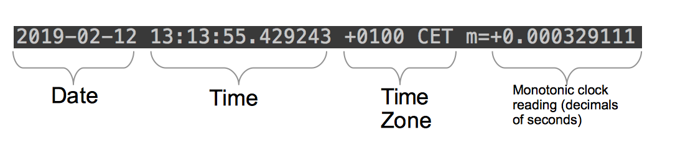

# 28 Datumi i vreme

[27 Enum iota i bitmask][27] | [00 Sadržaj][00] | [29 Skladištenje podataka][29]

**Šta ćete naučiti u ovom poglavlju?**

- Šta je UTC?
- Kako dobiti trenutno vreme?
- Kako predstaviti vreme u različitim vremenskim zonama?
- Kako analizirati vreme?
- Kako formatirati vreme sa određenim rasporedom?
- Kako uporediti dve vremenske tačke?
- Kako dodati minute, dane, godine, sekunde vremenu?
- Šta je zidni sat?
- Šta je monotoni sat?

**Obrađeni tehnički koncepti**:

- Vremenska zona
- Vremenski pomak
- UTC
- Zidni sat
- Monotoni sat
- Juniks epoha

## Kako dobiti trenutno vreme

U mnogim slučajevima, potrebni su vam trenutni datum i vreme. Da biste dobili ove informacije, možete pozvati funkciju `time.Now()`.

```go
// dates-and-time/main.go 

package main

import (
    "fmt"
    "time"
)

func main() {
    now := time.Now()
    fmt.Printf("%s", now)
}
```

Ovde pozivamo `time.Now()`, a zatim ispisujemo rezultat. `time.Now()` vraća vrednost tipa `time.Time`. Evo izlaza prethodne skripte:

```sh
2019-02-12 13:13:55.429243 +0100 CET m=+0.000329111
```


Vreme vraćeno pomoću funkcije fmt.Print

Na slici možete videti značenje različitih odštampanih delova.

Možete videti da imate datum i vreme. Kao rezultat toga, imate i vremensku zonu.

Vremenska zona je je vremensko pomeranje. To znači da je trenutno prikazano vreme Koordinirano univerzalno vreme (UTC) + 01 sat i 00 minuta. Ovo vremensko pomeranje se obično naziva UTC+01:00

CET znači centralnoevropsko vreme. Ovo je drugi naziv za vremensku razliku UTC+01:00.

Vremenska zona je važan element za komunikaciju vremena između ljudi. Ako razvijate API i prikazujete vreme u polju, morate da kažete svojim korisnicima koju vremensku zonu koristite. Na primer, "13:13:55" u Brazilu i "13:13:55" u Stokholmu se ne odnosi na isti trenutak u vremenu, nikako!

```sh
2009-11-10 23:00:00 +0000 UTC m=+0.000000001
```

Evo još jednog rezultata od `time.Now()`. Ovde možete videti da je vremenska zona drugačija. Vreme prikazano ovde je koordinisano univerzalno vreme (UTC).

## Unix epoha

"Juniksova epoha" je broj sekundi koje su protekle od 1. januara 1970. godine u 00:00:00 UTC.

Sa promenljivom tipa `time.Time` možete dobiti Juniks epohu metodom `Unix()`:

```go
now := time.Now()
log.Println(now.Unix())
// > 2021/02/11 18:29:35 1613064575
```

Ovaj način predstavljanja vremena je nedvosmislen. Nema vremenske zone i možete ga sačuvati kao jedan ceo broj!

## Jedno vreme - različiti satovi

Sa stanovišta računara, ono što obično nazivamo "vremenom" dolazi u različitim oblicima. Ali da bismo bolje razumeli te oblike, prvo moramo da razumemo kako računari prate vreme.

### Hardverski sat

Na matičnoj ploči računara nalazi se mali hardverski uređaj koji prati vreme.

Unutar ovog uređaja, generalno možete pronaći komad kvarca koji će oscilovati konstantnom brzinom. Da bi oscilovao, potrebno mu je malo energije.

Kada je računar isključen iz struje, ovaj uređaj će nastaviti da prati vreme (dok se baterija ne isprazni).

### Zidni sat

Zidni sat se uglavnom koristi za obaveštavanje korisnika o vremenu.

### Monotoni sat

Postoji još jedan sat: monotoni sat. Ovaj sat se koristi za merenje proteklog vremena između dve tačke u vremenu.

Zidni sat se može menjati. Na primer, sat može biti malo ispred. Shodno tome, sistem će možda morati da ga sinhronizuje sa referentnim satom.

Shodno tome, ne možemo verovati da će ovaj sat ponuditi preciznu meru proteklog vremena.

Potreban nam je sat koji sabira vreme konstantnom brzinom da bi se tačno izmerilo proteklo vreme. To je monotoni sat.

Ideju stalne vremenske varijacije možete pronaći u njegovom nazivu: monotono znači "Dosadno, ponavljajuće ili bez raznolikosti".

Koristite ovaj sat za izračunavanje trajanja.

## Formatirajte vreme

U ovom odeljku ćemo proučiti veoma čest slučaj upotrebe: formatiranje vremena. Možete formatirati i prikazati vreme u svom programu na mnogo načina; neki su određeni normom (na primer, RFC 3339), neki nisu i potiču direktno iz genijalnih umova programera.

### Kako koristiti Format metodu

Metoda `Format` ima jedan parametar: string.

Ovaj string obaveštava Go kako vreme treba da bude formatirano. Ako koristite drugi jezik, možete očekivati nešto slično:

YYYY-MM-DD h:i:s

Ovde YYYY znači prikazivanje godina sa četiri cifre; MM ukazuje programu da prikazuje mesece sa dve cifre... Ali u programu Go, format je drugačije napisan:

```go
package main

import (
    "fmt"
    "time"
)

func main() {
    now := time.Now()
    fmt.Println(now.Format("Mon Jan 2 "))
}
```

- Prvo dobijamo trenutno vreme pozivanjem funkcije `time.Now()`
- Zatim formatiramo ovo vreme metodom `Format`
- Rezultat je odštampan

Ovaj blok koda će ispisati sledeći string:

```sh
Wed Feb 13
```

### Referentno vreme

Format je "Mon Jan 2". To je zato što je format u programu Go definisan na osnovu referentnog datuma koji je:

```sh
Mon Jan 2 15:04:05 -0700 MST 2006
```

- Ponedeljak
- 2.januara 2006. godine u 15:04:05
- MST znači planinsko standardno vreme. Ovo je vremenska zona (UTC minus 7 sati).

### Navedeni formati

U `time` paketu ćete pronaći neke konstante sa uobičajenim formatima:

| Specifikacija | Go const | Primer |
| ------------- | -------- | ------ |
| RFC 3339 | time.RFC3339 | 2019-02-13T13:48:10+01:00 |
| ANSIC | time.ANSIC | Wed Feb 13 13:49:17 2019 |
| RFC 822 | time.RFC822 | 13 Feb 19 13:49 CET |
| RFC 822 | time.RFC822Z | 13 Feb 19 13:50 +0100 |
| RFC 1123 | time.RFC1123 | Wed, 13 Feb 2019 13:51:06 CET |
| RFC 339 (with ns) | time.RFC3339Nano | 2019-02-13T13:51:44.298774+01:00 |
| UNIX | time.UnixDate | Wed Feb 13 13:52:29 CET 2019 |

Neki formati vremena

Evo primera kako se koristi format time.RFC3339:

```go
// dates-and-time/formatting/main.go 
package main

import (
    "fmt"
    "time"
)

func main() {
    fmt.Println(time.Now().Format(time.RFC3339))
}
```

Ova aplikacija će ispisati:

```sh
2019-02-15T13:20:36+01:00
```

### Kako odštampati datum na određenoj lokaciji

Ako korisnicima izložite datume, želite da ih odštampate u njihovoj odgovarajućoj vremenskoj zoni:

```go
// dates-and-time/location/main.go
package main

//...
func main() {
    now := time.Now()
    fmt.Printf("%s\n", now)

    loc, err := time.LoadLocation("America/New_York")
    if err != nil {
        panic(err)
    }

    nowNYC := now.In(loc)
    fmt.Printf("%s\n", nowNYC)
}
```

Izlaz:

```sh
2021-02-11 18:45:36.949939 +0100 CET m=+0.000601934
2021-02-11 12:45:36.949939 -0500 EST
```

Ta dva datuma predstavljaju istu vremensku tačku, ali na dve različite lokacije: Francuskoj i NJujorku.

Funkcija `time.LoadLocation` uzima string kao parametar, koji predstavlja naziv vremenske zone iz IANA baze podataka vremenskih zona.

## Kako analizirati datum/vreme sadržano u stringu

Možete koristiti `Parse` funkciju iz `time` paketa. Ova funkcija prima dva argumenta:

- Format vremena koje želite da analizirate (Go treba da zna koji format imaju vaši ulazni podaci).
- String koji sadrži vaše formatirano vreme.

Ova funkcija će vratiti time.Time ili grešku (ako parsiranje vremena nije uspelo). Evo primera:

```go
// dates-and-time/parse/main.go 

timeToParse := "2019-02-15T07:33-05:00"
t,err := time.Parse("2006-01-02T15:04-07:00", timeToParse)
if err != nil {
    panic(err)
}

fmt.Println(t)
```

- Unosimo string "2019-02-15T07:33-05:00" u promenljivu "timeToParse".
- Onda pozivamo `time.Parse`.

Kako sam uspeo da pronađem pravi format? Morate da pogledate primer, a zatim da napravite string formata tako da svaki deo datuma odgovara referentnom datumu.

Format time.RFC3339 se koristi podrazumevano kada se datum demaršalira iz JSON-a.

## Kako izračunati vreme proteklo između dve tačke

Da biste dobili vreme proteklo između dve tačke, možete koristiti metodu `Sub` iz `time.Time`:

```go
// dates-and-time/elapsed/main.go 

start := time.Now()
err := ioutil.WriteFile("/tmp/thisIsATest", []byte("TEST"), 0777)
if err != nil {
    panic(err)
}
end := time.Now()
elapsed := end.Sub(start)
fmt.Printf("process took %s", elapsed)
```

- Trenutno vreme čuvamo u promenljivoj "start"
- Zapisujemo podatke u datoteku.
- Zatim ponovo dobijamo trenutno vreme. To vreme čuvamo u promenljivoj "end"
- Proteklo trajanje se izračunava sa pozivom `end.Sub(start)`
- Ispisujemo vraćeno trajanje ( elapsed je tipa `time.Duration`).

## time.Duration

Tip `time.Duration` označava proteklo vreme između dva trenutka. Evo njegove definicije u standardnoj biblioteci:

```go
// A Duration represents the elapsed time between two instants
// as an int64 nanosecond count. The representation limits the
// largest representable duration to approximately 290 years.
type Duration int64
```

NJegov osnovni tip je int64. Predstavlja broj nanosekundi između dve tačke u vremenu.

## Kako proveriti da li je vreme između dve tačke

Tip `time.Time` ima dva praktična načina:

- `Before`

- `After`

Te dve metode prihvataju `time.Time` kao ulaz.

Uzmimo primer:

```go
// dates-and-time/comparison/main.go 

location, err  := time.LoadLocation("UTC")
if err != nil {
    panic(err)
}

firstJanuary1980 := time.Date(1980,1,1,0,0,0,0,location)

timeToParse := "2019-02-15T07:33-02:00"
t,err := time.Parse("2006-01-02T15:04-07:00",timeToParse)
if err != nil {
    panic(err)
}

now := time.Now()
if t.After(firstJanuary1980) && t.Before(now) {
    fmt.Println(t, "is between ", firstJanuary1980, "and",now)
}else {
    fmt.Println("not in between")
}
```

## Kako dodati dane, sate, minute, sekunde vremenu

- Kada treba da dodate određeni broj dana, meseci ili godina, možete koristiti metodAddDate
  - Ova metoda uzima tri cela broja kao parametre:
    - određeni broj godina
    - određeni broj meseci
    - određeni broj dana

- Kada treba da dodate precizniji vremenski period, možete koristiti Add(npr. nanosekunde,
  mikrosekunde, milisekunde, sekunde, minute, sate).
  - Ova metoda uzima time.Durationkao ulaz koji predstavlja određeni broj nanosekundi.

```go
// dates-and-time/add/main.go 

now := time.Now()

// + 12 years
// + 1 Month
// + 3 days
now = now.AddDate(12,1,3)


now = now.Add(time.Nanosecond * 1)
now = now.Add(time.Microsecond * 5)
now = now.Add(time.Millisecond * 5)
now = now.Add(time.Second * 5)
now = now.Add(time.Minute * 5)
now = now.Add(time.Hour * 5)
```

Vreme paketa definiše konstante koje predstavljaju nanosekundu, mikrosekundu, milisekundu, sekundu, minut i sat u nanosekundama. Možemo koristiti te konstante za kreiranje prilagođenih trajanja.

## Ponavljajte tokom vremena

Želite da prikazujete korisnicima svaki dan između početnog i krajnjeg datuma.

Da biste to postigli, možete koristiti `AddDate` metod.

Te tri količine će biti dodate datumu. Zatim se vraća izmenjeni datum:

```go
start, err := time.Parse("2006-01-02", "2019-02-19")
startPlus1Day := start.AddDate(0,0,1)
```

Dodali smo jedan dan, nula meseci i nula godina početnom datumu. Možemo koristiti ovu funkciju unutar for petlje da bismo iterativno prelazili preko svakog dana između dva granična datuma:

```go
// dates-and-time/iterate/main.go 

func main() {
    start, err := time.Parse("2006-01-02", "2019-02-19")
    if err != nil {
        panic(err)
    }
    end , err := time.Parse("2006-01-02", "2020-07-17")
    if err != nil {
        panic(err)
    }
    for i := start; i.Unix() < end.Unix(); i = i.AddDate(0, 0, 1) {
        fmt.Println(i.Format(time.RFC3339))
    }
}
```

Ovde definišemo dva datuma: starti end. Ti datumi će predstavljati naše početne i krajnje tačke u vremenu.

Zatim možemo kreirati for petlju. For petlja ima tri dela:

- Inicijalizacija : ova instrukcija se izvršava samo jednom pre nego što se pokrene petlja for
- Uslov : ovaj izraz mora vratiti bulovsku vrednost (tačno ili netačno). Izračunava se pre svake
  iteracije. Ako je netačno, petlja će se zaustaviti.
- Naredba post : ova naredba se izvršava nakon svake iteracije

Faza inicijalizacije naše for petlje je jednostavna - kreiramo novu promenljivu pod nazivom i. Zatim, pre svake iteracije, proveravamo da li endje krajnji datum (promenljiva ) veći od trenutnog datuma iteracije (promenljiva i). Naredba post će dodati jedan dan trenutnom datumu iteracije (pomoću AddDatemetode ).

Ovom petljom ćemo iterirati kroz svaki dan između datuma starti enddatuma.

Šta ako želite da iterirate tokom sati, minuta ili sekundi? Moraćete da koristite Addmetod:

```go
for i := start; i.Unix() < end.Unix(); i = i.Add(time.Minute*2) {
    fmt.Println(i.Format(time.RFC3339))
}
```

Umesto da dodamo jedan dan datumu, dodajemo 2 minuta. Stoga će nas petlja for odvesti od 2. februara 2019. u ponoć do 17. jula 2019. sa koracima od 2 minuta. To je tačno 370.080 iteracija!

## Testirajte sebe

1. Šta je značenje UTC-a?
   - Koordinirano univerzalno vreme
2. Kako dobiti trenutno vreme?
   - time.Now()
3. Koji je osnovni tip time.Duration?
   - int64
4. Tačno ili netačno. , i predstavljaju 3 različite vremenske tačke.2021-02-11 19:23:03.465196 +0100
   CET2021-02-11 13:23:03.465196 -0500 EST2021-02-11 18:25:06.465196 +0000 UTC
   - Netačno, oni predstavljaju istu vremensku tačku.
   - 2021-02-11 18:25:06.623301 +0000 UTCje reprezentacija ovog trenutka u UTC vremenu
   - 2021-02-11 19:23:03.465196 +0100 CETje prikaz ovog trenutka sa vremenskom zonom Pariza
     (Francuska)
   - 2021-02-11 13:23:03.465196 -0500 ESTje prikaz ovog trenutka sa vremenskom zonom NJujorka (SAD)
5. Kako dodati 5 minuta vremenu t?
   - t = t.Add(time.Minute*5)
6. Kako dodati dve godine i jedan dan vremenu t?
   - t = t.AddDate(2,0,1)

## Ključno

- Paket timesadrži sve što vam je potrebno za manipulaciju vremenom.
- Da biste dobili trenutno vreme, možete koristiti time.Now()funkciju koja će vratiti time.Time.
- Da biste konvertovali time.Timeu string, možete koristiti metodu Format. Ona uzima string kao
  parametar: layout.
- Da biste analizirali string koji predstavlja vreme, možete koristiti funkcijutime.Parse(layout,
  value string)(time.Time, error)
- Raspored je string koji predstavlja "format" vremena.
- Raspored je označen referentnim datumom: "Pon 2. jan 15:04:05 MST 2006"
- Uobičajeni formati su definisani kao konstante u timepaketu. Najčešće korišćeni jetime.RFC3339
- Metode Beforei Afterse mogu koristiti za poređenje dva puta
- time.Durationpredstavlja proteklo vreme između dve vremenske tačke.
- Možete predstaviti vreme u drugoj vremenskoj zoni metodom Inkoja uzima *time.Locationkao ulaz
  (koji se može učitati sa time.LoadLocation(tzName))

[27 Enum iota i bitmask][27] | [00 Sadržaj][00] | [29 Skladištenje podataka][29]

[27]: 27_Enum_iota_i_bitmask.md
[00]: 00_Sadržaj.md
[29]: 29_Skladištenje_podataka.md
