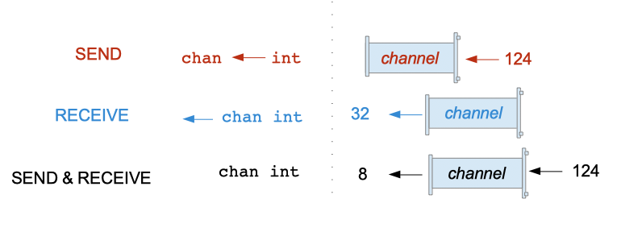
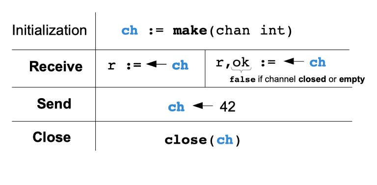

# 30 Konkurentnost

[29 Skladištenje podataka][29] | [00 Sadržaj][00] | [31 Evidencija][31]

**Šta ćete naučiti u ovom poglavlju?**

- Šta je konkurentnost i paralelizam.
- Šta je trka podataka i zastoj i kako ih izbeći
- Šta je gorutina, kanal, naredba za izbor, grupa čekanja, muteks?
- Kako napisati konkurentni program pomoću tih alata.

**Obrađeni tehnički koncepti!**

- Muteks
- Kanal
- Konkurentnost
- Paralelizam
- Grupa čekanja
- Zastoj
- Trka podataka
- Izaberite izjavu

## Preliminarne definicije

### Proces

Proces je instanca programa koju trenutno izvršava računar.

Ako želite da vidite listu procesa koji se pokreću na vašem računaru, možete otvoriti terminal i pokrenuti sledeću komandu (na **UNIX** sistemima):

```sh
ps xau
```

Videćete kompletnu listu procesa koji se pokreću na vašem računaru. Ova komanda će prikazati sledeće informacije:

- KORISNIK : korisnik koji je pokrenuo proces
- PID : ID procesa (svaki proces na računaru ima jedinstveni ID, stoga je lako identifikovati jedan proces)
- %CPU : Prikazaće procenat korišćenja procesora procesa
- %MEM : procenat korišćene memorije
- COMMAND : komanda procesa, uključujući argumente

U operativnom sistemu **Windows** možete da otkucate:

```sh
tasklist
```

### Niti izvršavanja

Nit predstavlja sekvencijalno izvršavanje skupa instrukcija. Jedan proces može da kreira više niti.
Za svaki proces imamo barem jednu nit izvršavanja. Kreiranjem više od jedne niti kreiramo više tokova izvršavanja koji mogu deliti neke podatke.

### Šta je konkurentnost?

"Konkurentnost je sposobnost različitih delova ili jedinica programa, algoritma ili problema da se izvršavaju van redosleda ili delimično, bez uticaja na konačni ishod." Konkurentnost se odnosi na sposobnost. Go podržava konkurentnost. Možemo napisati Go program koji će konkurentno izvršavati skup zadataka.

### Šta je paralelizam?

Prethodni pojam konkurentnosti može se pomešati sa paralelizmom. "Konkurentnost nije paralelizam" - (Rob Pajk). Paralelizam se odnosi na zadatke koji se izvršavaju istovremeno (u isto vreme). Konkurentni program može da izvršava zadatke paralelno.

## Zamke konkurentnosti

### Trka podataka

Trka podataka se može pojaviti ako dve (ili više) niti izvršavanja pristupe deljenoj promenljivoj.

- I kada jedna (ili više) niti želi da ažurira promenljivu.
- I ne postoji "eksplicitni mehanizam za sprečavanje istovremenih pristupa".

**Primer**:

Zamislite da ste razvili veb lokaciju za elektronsku trgovinu koja obrađuje zahteve konkurentno.
Imate dva klijenta u isto vreme koji su zainteresovani za isti proizvod: ekran računara. Trenutne zalihe proizvoda se čuvaju u bazi podataka.

| Vreme | DŽon | Žana | Zalihe u bazi podataka |
| :---: | ----- | --- | :--------------------: |
| 0 | Učitajte stranicu proizvoda | Učitajte stranicu proizvoda | 1 |
| 1 | Pritisnite dugme za porudžbinu | Čekaj | 1 |
| 2 | Zalihe u redu? => Da | Pritisnite dugme za porudžbinu | 1 |
| 3 | Ažurirajte akcije na 0 | Zalihe u redu? => Da | 1 |
| 4 | | Ažurirajte akcije na 0 | 0 |
| 5 | | Prikaži stranicu za potvrdu | 0 |
| 6 | | Prikaži stranicu za potvrdu | 0 |

Hajde da razmotrimo naš primer korak po korak:

- U trenutku 0, Jovan i Žana učitavaju istu stranicu proizvoda.
- U trenutku 1, Jovan pritisne dugme za naručivanje
- Kada Jovan klikne na dugme za naručivanje, naš skript će proveriti zalihe u bazi podataka.
- U tom trenutku je u redu, imamo 1 na lageru (videti poslednju kolonu). Pokrećemo proces ažuriranja u bazi podataka koji će trajati dve jedinice vremena.
- U vremenima 3 i 4 proizvod se ažurira. Na početku vremena 5 zalihe proizvoda su stoga 0 u bazi podataka...
- Ali Žana je takođe pritisnula dugme za naručivanje. Ažuriranje zaliha je takođe pokrenuto u vremenu 4.

Prodali smo nešto što nemamo na lageru. Ovo je trka u podacima. Dogodilo se zato što imamo dve niti (DŽon i Žana) koje žele da pristupe pisanjem istoj deljenoj promenljivoj, a nismo imali mehanizam da sprečimo istovremeni pristup...

#### Detektor trke podataka

Kada pravite i testirate svoj program, možete koristiti detektor trka u Gou. On će otkriti potencijalne greške:

```sh
go build -race -o myProgramName main.go
```

### Zastoj

Do zastoja dolazi kada dve komponente programa čekaju jedna drugu. U takvom slučaju, ceo sistem je blokiran. Ne može se postići napredak u izvršavanju celog programa.

**Primer: pet filozofa koji ručaju**:

Ovaj problem je prvobitno kreirao Edsger V. Dajkstra.

Problem je naveden na sledeći način:

- Imamo okrugli sto
- Oo stola sedi 5 filozofa.
- Svaki filozof ima tanjir špageta ispred sebe
- Između svakog tanjira stavlja se viljuška

Pravila restorana su sledeća:

- Da bi jeo, gost mora imati dve viljuške
- Gost može koristiti samo levu i desnu viljušku

Moramo da osmislimo program za svakog filozofa.

Rešenje može biti sledeće:

Ponavljajte dok se ručak ne završi:

- Kad je desna viljuška dostupna, uzmite je,
- Kada je leva viljuška dostupna, uzmite je,
- Kada imate obe viljuške, počnite da jedete 100 grama špageta,
- oslobodite obe viljuške.

Hajde da učitamo program u mozak svakog filozofa i pokrenemo ručak. Svaki filozof će biti nit u našem glavnom programu "restoran".

Kada pokrenete restoran, biće pokrenute sledeće radnje:

- Filozof 1 će uzeti viljušku I (pošto je dostupna)
- Filozof 2 će uzeti viljušku II
- Filozof 3 će uzeti viljušku III
- Filozof 4 će preći viljuškom IV
- Filozof 5 će uzeti viljušku V

U ovoj situaciji program svakog filozofa je izvršio prvu instrukciju našeg programa:

- Kada je desna viljuška dostupna, uzmite je.

Zatim druga instrukcija:

- Kada je leva viljuška dostupna, uzmite je,

ne može se izvršiti jer leva viljuška nije dostupna. Program je blokiran. To je zastoj!

## Gorutine

Glavni alat za kreiranje konkurentnih sistema u Go-u je `gorutine`.

### Glavna gorutina

U svakom programu postoji gorutina, to je glavna gorutina. Da bismo to demonstrirali, napravićemo jednostavan program i nateraćemo ga da paniči. U steku (porukama o greškama) videćemo da iza njega postoji gorutina:

```go
// concurrency/main-goroutine/main.go 
package main

func main(){
    panic("show me the goroutine")
}
```

Hajde da izgradimo program (idemo na build) i pokrenemo izvršnu datoteku. Imamo sledeći stek trag:

```sh
panic: show me the goroutine
goroutine 1 [running]:
main.main()
```

Imamo jednu gorutinu. Glavna gorutina koja ima indeks 1.

### Zvanična definicija

Gorutina je funkcija koja se izvršava nezavisno od ostatka programa. Osnovni element gorutine je funkcija. Svaka funkcija može postati gorutina. Pokretanje gorutine je jednostavno kao i pokretanje funkcije, osim što samo dodajete reč `go` neposredno pre poziva funkcije.

**Primer**:

Definišemo funkciju "printNumber":

```go
func printNumber(){     
    i :=0   
    for {       
        time.Sleep(1 * time.Second)         
        i++         
        fmt.Println(i)  
    } 
}
```

- Počinje inicijalizacijom promenljive "i" na vrednost 0.
- Zatim pokreće beskonačnu petlju (sa instrukcijom `for` ).
  - U ovoj beskonačnoj petlji pravimo pauzu programa na jednu sekundu pomoću `time.Sleep(1 * time.Second)`  
  - Nakon toga povećavamo i ( i++ )  - a zatim štampamo i.

Nakon toga deklarišemo našu glavnu funkciju (glavnu gorutinu):

```go
func main(){    
    fmt.Println("launch goroutine")     
    go printNumber()    
    fmt.Println("launch goroutine")     
    go printNumber()    
    time.Sleep(1 * time.Minute) 
}
```

- U ovom programu pokrećemo 2 gorutine sekvencijalno.
- Na kraju pauziramo program na 1 minut.

Zašto ova poslednja pauza? Kada ne dodate pauzu, program će se zaustaviti odmah nakon izvršenja jer je nit izvršavanja stigla do kraja glavne funkcije. Ako želimo da vidimo kako se naša gorutina izvršava, moramo sačekati da se pokrene. Pokretanje gorutine ne blokira glavnu nit.

Evo kompletnog programa:

```go
// concurrency/goroutine-example/main.go 
package main

import (    
    "fmt"   
    "time"  
)

func main(){    
    fmt.Println("launch first goroutine")   
    go printNumber()    
    fmt.Println("launch second goroutine")  
    go printNumber()    
    time.Sleep(1 * time.Minute) 
}

func printNumber(){     
    i :=0   
    for {       
        time.Sleep(1 * time.Second)         
        i++         
        fmt.Println(i)  
    } 
}
```

Izvršavanje ovog programa će ispisati sledeće:

```sh
launch first goroutine 
launch second goroutine 
1 
1 
2 
2 
3 
3 
4 
4
```

## Kanali

### Kanal je tipizirani komunikacioni cevovod

Gorutine mogu međusobno komunicirati putem kanala. Kanal se može posmatrati kao cevovod podataka između dve gorutine. Ovaj cevovod može da podrži samo određeni tip.

### Tipovi kanala

Kanali mogu biti:

- Samo za slanje
- Samo za prijem
- Dvosmerni (mogu slati i/ili primati)

#### Sintaksa

- Kanal koji može da se koristi za slanje vrednosti tipa T označen je sa: `chan<- T`
- Kanal koji može da se koristi za prijem vrednosti tipa T označen je sa: `<-chan T`
- Kanal koji može da se koristi za slanje i primanje vrednosti tipa T označen je sa: `chan T`

  
Pravac kanala

Nulta vrednost tipa kanala je `nil`.

### Inicijalizacija kanala, kapacitet

Kanali se inicijalizuju pomoću ugrađenog `make`.

Da biste inicijalizovali dvosmerni nebaferovani kanal celih brojeva možete koristiti sledeći kod:

```go
ch1 := make(chan int)
```

Da biste inicijalizovali dvosmerni baferovani kanal stringova možete koristiti sledeći kod:

```go
ch2 := make(chan string, 3)
```

"3" je kapacitet kanala. Ovo je prostor koji Go dodeljuje za čuvanje vrednosti poslatih kanalu.

#### Nebaferovani kanal

Kanal je nebaferovan kada ne navedete njegov kapacitet kada ga kreirate. Kanal veličine nula je takođe nebaferovan.

Da biste kreirali nebaferovani kanal, možete koristiti sledeći izvorni kod:

```go
ch3 := make(chan float)
```

Ili eksplicitnim navođenjem veličine 0 (što je ekvivalentno prethodnoj notaciji):

```go
ch4 := make(chan float, 0)
```

#### Baferovani kanali

Baferovani kanal je kanal gde određujete veličinu bafera kada ga kreirate.

```go
ch6 := make(chan float, 16)
```

Ovde smo kreirali baferovani kanal kapaciteta 16.

### Slanje podataka na kanal

Recimo da imamo kanal pod nazivom "ch5". Da bismo poslali element ovom kanalu, koristićemo sintaksu strelice: `<-`.

Ta dva karaktera prenose ideju podataka koji teku zdesna nalevo.

```go
package main

func main() {
    ch5 := make(chan int, 2)
    ch5 <- 42
}
```

U prethodnom isečku koda:

- Inicijalizujemo dvosmerni baferovani kanal celih brojeva ( ch5 )
- Zatim šaljemo broj 42 u kanal sa sintaksom:  
  `channel <- expression`

#### Specifičnost naredbe za slanje

Slanje izjava ima neka specifična pravila:

- Kanal i izraz se procenjuju pre komunikacije.
- Možete slati na kanal ako je otvoren. Ako šaljete na zatvoren kanal, vaš program će paničiti!
- Ako pošaljete na `nil` kanal, to će zauvek blokirati vaš program.

### Zatvaranje kanala

Kanal se može zatvoriti pomoću ugrađene funkcije `close`. Zatvaranje kanala označava da "više vrednosti neće biti slate na kanal".

- Ne možete zatvoriti kanal samo za prijem.
- Ne možete slati podatke preko zatvorenog kanala.
- Ne možete zatvoriti kanal koji je već zatvoren.
- Možete primati podatke na zatvorenom kanalu (videti sledeći odeljak).

```go
package main

import "log"

func main() {
    var received int

    ch5 := make(chan int, 2)
    ch5 <- 42
    close(ch5)
}
```

Ovde šaljemo vrednost 42 u kanal, a zatim ga zatvaramo pomoću ugrađene komande `close`:  
`close(ch5).`

### Primanje podataka sa kanala

Da biste primili nešto sa kanala, možete koristiti dve vrste sintakse

#### Osnovna operacija prijema

```go
package main

import "log"

func main() {
    var received int

    ch5 := make(chan int, 2)
    ch5 <- 42
    ch5 <- 41
    received = <-ch5
    log.Println(received)
}
```

U ovom isečku koda:

- Kreiramo baferovani kanal celih brojeva: "ch5".
- Šaljemo vrednosti "42" i "41" u kanal
- Postavili smo vrednost "received" na "<-ch5"
- Štampamo vrednost "received"

Prethodni skript će ispisati: "42".

#### Operacija prijema sa više vrednosti

Ova sintaksa se koristi da bismo bili sigurni da naš kanal nije zatvoren ili prazan.

```go
x, ok = <-ch 
if !ok {
    log.Println("channel is empty or closed")
}
```

U ovom primeru imamo promenljivu "x" koja će čuvati vrednost onoga što se šalje u kanal, ali dodajemo promenljivu `ok` koja će nam pomoći da utvrdimo da li je kanal prazan ili zatvoren.

Vrednost ok je bulova vrednost i biće jednaka:

- `true`: ako je sve u redu, dobili smo vrednost `true`. ( nominalni slučaj )
- `false`: ako je kanal prazan ili zatvoren.

```go
package main

import "fmt"

func main() {
    ch5 := make(chan int, 2)
    
    ch5 <- 42
    close(ch5)

    received, ok := <-ch5
    fmt.Println(received, ok)
}
```

Ovaj program će izvesti:

```sh
42 true
```

Kanal je zatvoren tako da je `ok` `true` i dalje smo primili vrednost sa kanala 42 (poslata je pre zatvaranja)

### Rezime sintakse


Inicijalizacija, primanje, slanje i zatvaranje

### Kako lako zapamtiti sintaksu?

- Kada strelica pokazuje na kanal, šaljemo podatke u kanal
- U suprotnom, primamo podatke sa kanala

### Kapacitet kanala i operacije slanja

#### Nebaferovani kanal (kapacitet = 0)

> [!Note]
> Kada šaljete podatke u nebaferovani kanal, vaša trenutna gorutina će biti
> blokirana dok druga gorutina ne primi podatke.

Ne postoji bafer dodeljen za čuvanje poslate poruke, što posledično dovodi do toga da pošiljalac blokira kanal dok neka druga gorutina ne primi poruku.

**Primer**:

```go
// concurrency/channel-capacity-send/main.go 
package main

import (
    "log"
    "time"
)

func main() {
    ch := make(chan int)
    go dummy(ch)
    log.Println("waiting for reception...")
    ch <- 45
    log.Println("received")
}

func dummy(c chan int) {
    time.Sleep(3 * time.Second)
    <-c
}
```

- Kreiramo nebaferovani kanal celih brojeva `ch`.
- Druga gorutina se pokreće sa `go dummy(ch)`.
- Gorutina `dummy` će čekati 3 sekunde, a zatim primiti podatke na ulaznom kanalu.
  - Primljeni podaci se odbacuju (ne čuvamo ih u promenljivoj).
- U glavnoj gorutini šaljemo vrednost 45 u kanal.

Ovaj program izlazi

```sh
2021/02/15 21:53:27 waiting for reception...
2021/02/15 21:53:30 received
```

- Operacija slanja blokira glavnu gorutinu
- Deblokira se kada `dummy` gorutina primi poslatu vrednost

#### Baferovani kanal (kapacitet > 0)

Kada šaljete podatke u baferovani kanal, vaša trenutna gorutina će biti blokirana dok se podaci ne kopiraju u bafer.

Baferovani kanal ima dodeljen bafer. Stoga, pošiljalac treba samo da sačeka dok se podaci efikasno ne kopiraju u interni bafer.

Uzmimo prethodni program i dodajmo kapacitet kanalu:

```go
// concurrency/channel-capacity-send-buffered/main.go 
package main

import (
    "log"
    "time"
)

func main() {
    ch := make(chan int, 1)
    go dummy(ch)
    log.Println("waiting for reception...")
    ch <- 45
    log.Println("received")
}

func dummy(c chan int) {
    time.Sleep(3 * time.Second)
    <-c
}
```

Izlaz programa je:

```sh
2021/02/15 21:56:05 waiting for reception...
2021/02/15 21:56:05 received
```

Možete primetiti da operacija slanja ne blokira. 45 se upisuje u bafer kanala, a zatim se izvršava sledeća linija koda.

### Kapacitet kanala i operacije prijema

Za baferovane i nebaferovane kanale, operacija prijema blokira gorutinu dok se ne primi poruka.

### Len / cap

- Ugrađena funkcija len će vratiti broj elemenata u redu čekanja u baferu kanala.
- Ugrađena funkcija cap će vratiti kapacitet bafera.

### Rezime

**Nebaferovani naspram baferovanog kanala**:

| ... | Nebaferovani kanal | Baferovani kanal |
| --- | ------------------ | ---------------- |
| Init | make(chan float) | make(chan float, 16) |
| goroutine slanja je blokirana | dok goroutine prijema ne primi poruku | dok se podaci poruke ne kopiraju u bafer kanala goroutine slanja |
| goroutine prijema je blokirana | dok ne primi poruku | dok ne primi poruku |

### Slučaj upotrebe kanala

Nebaferovani kanali se koriste za sinhronizaciju dve gorutine

**Primer**:

```go
// concurrency/channel-usecase/main.go
package main

import (
    "time"
)

func main() {
    syncCh := make(chan bool)
    // launch a second goroutine
    go func() {
        longTask2()
        // finished
        syncCh <- true
    }()
    longTask()
    // blocks until the second goroutine has finished
    <-syncCh
}

func longTask2() {
    time.Sleep(1 * time.Second)
}

func longTask() {
    time.Sleep(3 * time.Second)
}
```

Nebaferovani kanal se ovde koristi za sinhronizaciju glavne gorutine sa drugom gorutinom. Operacija prijema <-syncChse blokira dok se druga gorutina ne završi. Da bi signalizirala da je završena, druga gorutina će poslati vrednost "true" u kanal.

Baferovani kanali se koriste za ograničavanje propusnog opsega između gorutina
Videćemo kako to funkcioniše u aplikaciji.

### Kako izazvati zastoj

#### Sa baferovanim kanalom

```go
// concurrency/deadlock/main.go
package main

import (
    "log"
)

func main() {
    ch := make(chan int, 1)
    go dummy(ch)
    log.Println("waiting for reception...")
    ch <- 45
    ch <- 58
    ch <- 100
}

func dummy(c chan int) {
    smth := <-c
    log.Println("has received something", smth)
}
```

Ovaj kod će izazvati deblokadu. Evo rezultata izvršavanja:

```sh
2021/02/16 11:19:57 waiting for reception...
2021/02/16 11:19:57 has received something 45
fatal error: all goroutines are asleep - deadlock!

goroutine 1 [chan send]:
main.main()
        /Users/maximilienandile/Documents/DEV/goBook/concurrency/sendBlocking/main.go:15 +0xea

Process finished with exit code 2
```

- Kreirali smo baferovani kanal kapaciteta jednakog 1
- Ovaj kanal se prosleđuje novoj gorutini koja će primati podatke na kanalu ( dummyfunkciji).
- Šaljemo tri vrednosti na kanalu: 45, 58 i 100.
- Prvu vrednost prima fiktivna gorutina.
  - U baferu ima mesta za čuvanje druge vrednosti
- Kada pošaljemo treću vrednost na kanal, glavna gorutina će biti blokirana.
  - Blokira se dok se treća vrednost ne kopira u bafer kanala
- Program će čekati unedogled.

Пример застоја са баферованим каналом
Primer zastoja sa baferovanim kanalom

#### Sa nebaferovanim kanalom

```go
// concurrency/deadlock-unbuffered/main.go
package main

func main() {
    ch := make(chan int)
    ch <- 5
}
```

Ovaj jednostavan program će izazvati zastoj. Glavna gorutina čeka neograničeno dok primalac ne primi poslate podatke.

## Select iskaz

Izjave SELECT se koriste za izbor "koja od mogućih operacija slanja ili primanja će se nastaviti".

- Naredba SELECT je slična naredbi switch, ali za komunikacione operacije.
- U select naredbi imate slučajeve i opcioni podrazumevani slučaj.
- Biće izabran prvi slučaj koji ne blokira
- Ako dva ili više slučajeva ne blokiraju, jedan se bira putem "jednoobraznog pseudo-slučajnog"
  izbora.
- Ako svi slučajevi blokiraju, onda se bira podrazumevani slučaj

### Select bez default

```go
// concurrency/select-without-default/main.go
package main

import "log"

func main() {

    ch1 := make(chan string, 1)
    ch2 := make(chan string, 1)
    ch1 <- "test"

    select {
    case rec, ok := <-ch1:
        if ok {
            log.Printf("received on ch1 : %s", rec)
        }
    case rec, ok := <-ch2:
        if ok {
            log.Printf("received on ch2 : %s", rec)
        }
    }
    log.Println("end")
}
```

- Imamo SELECT naredbu sa 2 operacije prijema.
- Čekamo prijem na ch1i ch2.
- Prvi slučaj bez blokiranja je izabran => ovde je prvi slučaj  
  `case rec, ok := <-ch1:`

ch1 je prvi kanal koji prima poruku. Evo rezultata ovog programa:

```sh
2021/02/16 17:05:27 received on ch1 : test
2021/02/16 17:05:27 end
```

### Select sa default

```go
// concurrency/select-with-default/main.go
package main

import "log"

func main() {

    ch1 := make(chan string, 1)
    ch2 := make(chan string, 1)
    select {
    case rec, ok := <-ch1:
        if ok {
            log.Printf("received on ch1 : %s", rec)
        }
    case rec, ok := <-ch2:
        if ok {
            log.Printf("received on ch2 : %s", rec)
        }
    default:
        log.Println("default case")
    }
    log.Println("end")
}
```

- Slučaj default je izabran
- Ništa nije poslato na dva kanala
- Dva slučaja naredbe SELECT su blokirajuća, komunikacione operacije ne mogu da se nastave.

### Prazna naredba SELECT

Prazna SELECT naredba blokira gorutinu na neodređeno vreme.

```go
package main

func main() {
    select {}
}
```

Ovaj program će izazvati zastoj.

## Neki uobičajeni slučajevi upotrebe kanala i select naredbe

U ovom odeljku ću detaljno opisati neke uobičajene slučajeve upotrebe kanala i selekcija koje smatram zanimljivim.

### Graciozno gašenje HTTP servera

Program ima mogućnost da se zaustavi na čist i uređen način ako implementira mehanizam "gracioznog isključivanja".

Ovaj mehanizam mora da detektuje da je program prekinut. Paket `os/signal` ima posebnu funkciju koja se zove `Notify` koja može da detektuje signale OS-a kao što je "prekid".

Nakon detekcije takvog signala, program treba da implementira određenu logiku gašenja (sačuva neko stanje, obriše neke privremene objekte, zatvori neke veze...)

U ovom odeljku ćemo uzeti primer HTTP servera:

```go
// concurrency/server-graceful-shutdown/main.go
package main

import (
    "context"
    "fmt"
    "log"
    "net/http"
    "os"
    "os/signal"
    "syscall"
    "time"
)

func main() {
    // create the notification channel
    bye := make(chan os.Signal)
    signal.Notify(bye, os.Interrupt, syscall.SIGTERM)

    mux := http.NewServeMux()
    mux.Handle("/status", http.HandlerFunc(
        func(w http.ResponseWriter, r *http.Request) {
            fmt.Fprintf(w, "OK")
        },
    ))
    srv := &http.Server{
        Addr:    ":8081",
        Handler: mux,
    }
    // launch the server in another goroutine
    go func() {
        // launch the server
        err := srv.ListenAndServe()
        if err != nil && err != http.ErrServerClosed {
            log.Fatalf("server: %q\n", err)
        }
    }()
    // wait for os signal
    sig := <-bye
    // the code below is executed when we receive an os.Signal
    log.Printf("detected os signal %s \n", sig)
    ctx, cancel := context.WithTimeout(context.Background(), 3*time.Second)
    err := srv.Shutdown(ctx)
    cancel()
    if err != nil {
        log.Fatal(err)
    }
}
```

- Signal `Notify` koristiće kanal bye da obavesti naš program kada program primi:
  - signal za prekid - `os.Interrupt`
  - signal SIGTERM - `os.SIGTERM`
- Kreiran je klasični server sa jednom "/status" rutom.
- Server je pokrenut u novoj gorutini
- Na glavnoj gorutini čekamo potencijalni os signal sa `sig := <-bye`
- Kada primimo signal, izvršavamo ovaj kod:
  
  ```go
  log.Printf("detected os signal %s \n", sig)
  err := srv.Shutdown(context.Background())
  if err != nil {
      log.Fatal(err)
  }
  ```

- Pozivamo `srv.Shutdown`, što će graciozno isključiti server.
- "Prvo će zatvoriti sve otvorene slušače, zatim zatvoriti sve neaktivne veze, a zatim čekati neograničeno da se veze vrate u neaktivno stanje, a zatim se isključiti".

### Tajm-aut

Tajm-aut je vremenski period koji je dozvoljen pre nego što se događaj desi. Može biti zanimljivo implementirati tajm-aut kada se vaš program oslanja na spoljne resurse koji mogu postati nedostupni. Bez tajm-auta vaš program bi mogao beskonačno čekati na resurs.

Sa naredbom `select` možemo dodati slučaj vremenskog ograničenja:

```go
// concurrency/timeout/main.go
package main

import (
    "log"
    "time"
)

func main() {
    ch := make(chan int, 1)
    select {
    case rec, ok := <-ch:
        if ok {
            log.Printf("received %d", rec)
        }
    case rec, ok := <-time.After(time.Second * 3):
        if ok {
            log.Printf("operation timed out at %s", rec)
        }
    }
}
```

- `time.After` vraća samo za prijem kanal `time.Time` elementa
- Nakon 3 sekunde nastupa tajm-aut

Izlaz programa je:

```sh
2021/02/16 17:44:12 operation timed out at 2021-02-16 17:44:12.316518 +0100 CET m=+3.00403174
```

## Grupe čekanja

Grupa čekanja je alat za sinhronizaciju koji pruža standardna biblioteka. Može se koristiti za čekanje da grupa gorutina završi svoje zadatke.

### Grupa čekanja

```go
// concurrency/wait-group-without/main.go
package main

import (
    "fmt"
    "time"
)

func main() {
    fmt.Printf("Program start \n")
    for i := 0; i < 10; i++ {
        go concurrentTaks(i)
    }
    finishTask()
    fmt.Printf("Program end \n")
}

func finishTask() {
    fmt.Println("Executing finish task")
}

func concurrentTaks(taskNumber int) {
    fmt.Printf("BEGIN Execute task number %d \n", taskNumber)
    time.Sleep(100 * time.Millisecond)
    fmt.Printf("END Execute task number %d \n", taskNumber)
}
```

- Pokrenućemo 10 gorutina koje će pozivati funkciju `concurrentTaks(i)` gde je i indeks brojača petlje.
- Nakon pokretanja tih gorutina, pozvaćemo funkciju `finishTask`.

Prethodni program će ispisati:

```sh
Program start
Executing finish task
Program end
```

Izgleda da čak ni ne pokrećemo naše gorutine! Zašto? To je zato što pokretanje gorutine ne blokira glavnu gorutinu...

Možemo izmeniti naš izvorni kod da bismo dodali grupu čekanja:

```go
// concurrency/wait-group/main.go
package main

import (
    "fmt"
    "sync"
    "time"
)

func main() {
    fmt.Printf("Program start \n")
    // initialize the wait group
    var waitGroup sync.WaitGroup
    waitGroup.Add(10)
    for i := 0; i < 10; i++ {
        go concurrentTaks(i, &waitGroup)
    }
    waitGroup.Wait()
    finishTask()
    fmt.Printf("Program end \n")

}

func finishTask() {
    fmt.Println("Executing finish task")
}

func concurrentTaks(taskNumber int, waitGroup *sync.WaitGroup) {
    fmt.Printf("BEGIN Execute task number %d \n", taskNumber)
    time.Sleep(100 * time.Millisecond)
    fmt.Printf("END Execute task number %d \n", taskNumber)
    waitGroup.Done()
}
```

Ovaj isečak koda će ispisati sledeće:

```sh
Program start
BEGIN Execute task number 3
BEGIN Execute task number 9
BEGIN Execute task number 7
...
END Execute task number 9
END Execute task number 7
END Execute task number 3
Executing finish task
Program end
```

Imamo očekivani rezultat. Naše gorutine su izvršene. Da vidimo šta se promenilo…

- Na početku programa smo kreirali promenljivu tipa `sync.WaitGroup`
- Grupi čekanja ukazujemo da treba da sačeka da se obavi 10 jedinica rada.
- Interni brojač grupe čekanja će biti povećan.
- Zatim prosleđujemo pokazivač na grupu čekanja našim gorutinama.

```go
go concurrentTaks(i, &waitGroup)
```

Funkcija `concurrentTaks` je takođe modifikovana (njen potpis, ali i njeno telo):

```go
func concurrentTaks(taskNumber int, waitGroup *sync.WaitGroup) {
    fmt.Printf("BEGIN Execute task number %d \n", taskNumber)
    time.Sleep(100 * time.Millisecond)
    fmt.Printf("END Execute task number %d \n", taskNumber)
    waitGroup.Done()
}
```

- Metodu `waitGroup.Done()` pozivamo na kraju funkcije.
- Metoda `Done` će smanjiti interni brojač.

Kada interni brojač dostigne 0 (što znači da su sve naše gorutine završene), glavna gorutina se oslobađa.

```go
for i := 0; i < 10; i++ {
    //...
}
waitGroup.Wait() // we block the main goroutine (to wait for the previous goroutines to finish)
finishTask()
fmt.Printf("Program end \n")
```

### Šta treba da zapamtite

Kreirajte grupu čekanja:

```go
var waitGroup sync.WaitGroup
```

Povećajte brojač grupe čekanja:

```go
waitGroup.Add(1)
```

Smanjite brojač grupe čekanja:

```go
waitGroup.Done()
```

Blokiraj trenutnu gorutinu dok se sve gorutine ne završe:

```go
waitGroup.Wait()
```

Morate proslediti pokazivač na grupu čekanja vašim gorutinama.

## Primena grupa čekanja i kanala

### Misija

Veb-sajt za elektronsku trgovinu čuva svaku posetu u bazi podataka. Za svaku posetu imamo:

- Jedinstveni ID (UUID v4) - npr.: 5ce7fef2-c53a-4b79-bcbb-669c9799fa86
- Posećena stranica (string) - npr: /proizvod-6
- Datum posete
- Heš sesije - npr.: ek : 8722b6f78a69aeac3736bfcaa1dd7e4e7a77834dec2adf27e007ed1c998b34df  
  Koristi se za grupisanje pregleda stranica po sesijama

Marketinški tim želi da navede najpopularnije proizvode i njihove povezane performanse.

Žele da imaju za svaki datum broj poseta za svaku stranicu:

- Datum: 25. januar 2020.

  - /product-45: 254 posete
  - /product-22: 2345 poseta
  - /home : 2000 poseta.
  - ...

- Datum: 30. januar 2020.

  - /product-45: 125 poseta
  - /home : 2000 poseta.
  - ...

Nakon upita baze podataka o posetama, izvukli ste JSON datoteku u sledećem formatu:

```json
{
  "20-02-2019": [
    {
      "id": "b5c92427-7095-470e-985b-8df7ebe7ed2f",
      "page": "/product-8",
      "sessionHash": "48cd2ad413df8fd263d745275a6a9a95b9cad5374b67d6877c764fb40f29fd0c"
    },
    {
      "id": "bdbd3948-b336-4cb1-badd-390dfe8c0459",
      "page": "/product-1",
      "sessionHash": "c02793f8fb7bb09efb7721aa5962c1b8de809e7ac720463f6ea66c0f4f7957b2"
    },
    {
      "id": "b9a70a12-f6b1-4d7c-ae61-73fcd80b9992",
      "page": "/product-8",
      "sessionHash": "774f6b0f07c2ee4bce93ee36a9678b2f1022cda646ce36b1fc3b3205dee5646a"
    }
  ],
  "19-02-2019": [
    {
      "id": "9c2887c4-19ed-4cce-8998-3fe8b3662fba",
      "page": "/product-6",
      "sessionHash": "5d91fe5022b6186dc1fb81d8f31122fccf0a036f5f381d7dfc298b6aaf889e35"
    },
    {
      "id": "adbf1651-f6bd-453a-97af-c860d153e981",
      "page": "/product-3",
      "sessionHash": "48cd2ad413df8fd263d745275a6a9a95b9cad5374b67d6877c764fb40f29fd0c"
    },
    {
      "id": "80a09881-675f-4569-bdb0-28c6983aaee4",
      "page": "/basket",
      "sessionHash": "5d91fe5022b6186dc1fb81d8f31122fccf0a036f5f381d7dfc298b6aaf889e35"
    }
  ]
}
```

Od vas se traži da napravite program sa sledećim ulazom/izlazom:

- ULAZ: JSON datoteka slična prethodnom json isečku.
  Primer JSON datoteke možete preuzeti ovde:

- IZLAZ: statistika za svaki dan formatirana u JSON formatu.

  Primer IZLAZA:
  
  ```json
  [
    {
      "date": "20-02-2019",
      "byPage": {
        "/product-8": 2,
        "/product-1": 1
      }
    },
    {
      "date": "19-02-2019",
      "byPage": {
        "/basket": 1,
        "/product-3": 1,
        "/product-6": 1
      }
    }
  ]
  ```

Vaš program treba da koristi kanale i grupe čekanja.

#### Preporuke

- Moraćete da učitate sadržaj INPUT datoteke u memoriju
- Takođe ćete morati da raspakujete učitane JSON podatke
- Razmislite kako možete podeliti posao na više nezavisnih zadataka.
- Napravite radnu funkciju koja će obrađivati pojedinačne zadatke
- Vaši workeri mogu komunicirati sa vašom glavnom gorutinom putem kanala

### Rešenje

#### Inicijalizacija projekta

- Napravite direktorijum
- A zatim pokrenite komandu `go mod init name/of/your/module` da biste inicijalizovali modul.

#### Učitavanje unosa i raspakivanje JSON-a

Prvo kreiramo strukturu koja će nam omogućiti da uradimo demaršaling datog ulaza:

```go
// concurrency/application1/visit/visit.go
package visit

type Visit struct {
    ID          string `json:"id"`
    Page        string `json:"page"`
    SessionHash string `json:"sessionHash"`
}
```

Ovaj tip strukture se smešta u novu posetu paketu.

```go
// concurrency/application1/main.go

data, err := ioutil.ReadFile("data.json")
if err != nil {
    log.Fatal(err)
}
dayStats := make(map[string][]visit.Visit)
err = json.Unmarshal(data, &dayStats)
if err != nil {
    log.Fatal(err)
}
```

- Datoteka *data.json* je učitana
- Zatim inicijalizujemo mapu "dayStats" koja će sadržati nemaršalirane podatke
  - Za svaki datum imamo isečak od visit.Visit.

`json.Unmarshal` parsira ulazni json i čuva rezultat u "dayStats".

#### Kako podeliti posao

Možemo podeliti posao po datumu. Svaki dnevni broj poseta može se tretirati nezavisno. Kreiramo "Task" strukturu:

```go
type Task struct {
    Date   string
    Visits []visit.Visit
}
```

Svakom workeru ćemo dati promenljivu tipa "Task" preko ulaznog kanala.

#### Izlazna struktura

Izlaz našeg programa je isečak dnevne statistike. Kreiramo strukturu tipa "DailyStat" koja čuva statistiku za određeni dan:

```go
type DailyStat struct {
    Date   string         `json:"date"`
    ByPage map[string]int `json:"byPage"`
}
```

Konačni izlaz ima tip "[]DailyStat" (isečak prethodne strukture)

#### Kreiranje grupe čekanja / kanala

```go
var w8 sync.WaitGroup
w8.Add(len(dayStats))
```

- Inicijalizujemo grupu čekanja:w8
- Odmah nakon inicijalizacije dodajemo vrednost njegovom internom brojaču "numberOfWorkers"
- Na taj način pripremamo naš program da čeka da svaki worker završi

```go
inputCh := make(chan Task, 10)
outputCh := make(chan DailyStat, len(dayStats))
```

- Kreiramo dva dvosmerna baferovana kanala.
- `inputCh` koristiće se za slanje zadataka workerima.
- Ovaj kanal ima bafer od 10
  - Postavljanjem veličine bafera na 10 kontrolisaćemo "propusnost" (brzinu kojom će se naši zadaci obrađivati)
  - Glavna gorutina može poslati najviše 10 zadataka u kanal
  - Kada se pošalje 10 zadataka, glavna gorutina će se blokirati dok ne bude mogla da doda novi zadatak.

`outputCh` koristiće se za saopštavanje rezultata od workera glavnoj gorutini

#### Worker

```go
// concurrency/application1/main.go 

func worker(in chan Task, workerId int, out chan DailyStat, w8 *sync.WaitGroup) {
    for received := range in {
        m := make(map[string]int)
        for _, v := range received.Visits {
            m[v.Page]++
        }
        out <- DailyStat{
            Date:   received.Date,
            ByPage: m,
        }
        fmt.Printf("[worker %d] finished task \n", workerId)
    }
    // when the channel is closed the for loop is exited
    log.Println("worker quit")
    w8.Done()
}
```

Worker je funkcija. Kao ulaz uzima ulazni kanal i izlazni kanal.

- Sa for petljom prelazimo preko poruke primljene sa ulaznog kanala.
- Svaka poruka je promenljiva tipaTask
- Pomoću mape ćemo brojati posete za svaku stranicu.
  - Ključ : naziv stranice (npr.: /product-8)
  - Vrednost : broj poseta (npr.: 458)
- Kada se posete prebroje, rezultat šaljemo na izlazni kanal.
- Petlja for će se završiti kada se signal zatvaranja pošalje na ulazni kanal.
- Na kraju se brojač grupe čekanja smanjuje za jedan:w8.Done()
- Signaliziramo glavnoj gorutini da je jedna gorutina završila svoju misiju.

#### Kreiranje workera i slanje zadataka na ulazni kanal

```go
// create the workers
for k := 0; k < numberOfWorkers; k++ {
    go worker(inputCh, k, outputCh, &w8)
}
// send the tasks
for date, visits := range dayStats {
    inputCh <- Task{
        Date:   date,
        Visits: visits,
    }
}
// we say that we will not send any new data on the input channel
close(inputCh)
// wait for all tasks to be completed
w8.Wait()
```

- Naše workere kreiramo pomoću for petlje
- Ponavljamo iteracije dayStatsda bismo poslali zadatke u ulazni kanal
- Zatvaramo ulazni kanal kada se pošalju svi zadaci.

`w8.Wait()` sačekaće da svi workeri završe

10.2.8 Prikupite rezultate

```go
// when all treatment is finished we close the output channel
close(outputCh)
// collect the result
done := make([]DailyStat, 0, len(dayStats))
for out := range outputCh {
    done = append(done, out)
}

res, err := json.Marshal(done)
if err != nil {
    log.Fatal(err)
}
err = ioutil.WriteFile("results.json", res, 0644)
if err != nil {
    log.Fatal(err)
}
log.Println("done !")
```

Poslednji deo je jednostavan:

- Zatvaramo izlazni kanal
- Zatim prikupljamo rezultate iz izlaznog kanala (pomoću for petlje)
- Svaki rezultat se dodaje done isečku
- done se zatim pretvara u JSON, a rezultat se čuva u datoteci "result.json".

## Muteksi

### Alat za sinhronizaciju

Muteks je alat za sinhronizaciju. Muteks je skraćenica od "Uzajamno isključeno" ( `Mutual Exclusion` ). Hajde da napravimo zaobilazni put preko logičke teorije da bismo bolje razumeli ovaj koncept.

Kažemo da su dva događaja uzajamno isključiva ako se ne mogu dogoditi istovremeno. Na primer, dva događaja "bicikl skreće levo" i "bicikl skreće desno" su međusobno isključiva. Biciklista ne može istovremeno skrenuti levo i desno.

Ovo svojstvo uzajamnog isključivanja je zanimljivo za nas. Kada gradimo konkurentne programe, može doći do trke podataka.

Trka podataka može doći ako dve (ili više) niti izvršavanja pristupe deljenoj promenljivoj.

- I kada jedna (ili više) niti želi da ažurira promenljivu.
- I ne postoji "eksplicitni mehanizam za sprečavanje istovremenih pristupa".

Možemo izbeći trku podataka korišćenjem mutex-a. Pokazaću vam kako:

### Primer upotrebe

#### Program sa greškama

```go
// concurrency/mutex-bug/main.go
package main

import (
    "fmt"
    "log"
    "net/http"
)

var requestCount int

func main() {
    http.HandleFunc("/status", status)
    err := http.ListenAndServe(":8090", nil)
    if err != nil {
        log.Fatal(err)
    }
}

func status(w http.ResponseWriter, req *http.Request) {
    requestCount++
    fmt.Fprintf(w, "OK - count : %d \n", requestCount)
}
```

- Ovde smo kreirali jednostavan HTTP veb server.
- Ima jednu jedinstvenu rutu:"/status".
- Kreirali smo globalnu promenljivu "requestCount" tipa int.
- Ova promenljiva se povećava svaki put kada se zahtev pošalje ruti "/status".

Hajde da napravimo još jedan program koji će pozvati ovaj server...

```go
// concurrency/mutex-server-call/main.go
package main

import (
    "io/ioutil"
    "log"
    "net/http"
    "sync"
)

func main() {
    var w8 sync.WaitGroup
    w8.Add(10)
    for k := 0; k < 10; k++ {
        go caller(&w8)
    }
    w8.Wait()
}

func caller(w8 *sync.WaitGroup) {
    for k := 0; k < 100; k++ {
        res, err := http.Get("http://localhost:8090/status")
        if err != nil {
            log.Fatal(err)
        }
        defer res.Body.Close()
        s, err := ioutil.ReadAll(res.Body)
        if err != nil {
            log.Fatal(err)
        }
        log.Println(string(s))
    }
    w8.Done()
}
```

Ovaj program će pokrenuti 10 gorutina koje će svaka poslati po 100 zahteva serveru konkurentno (10 * 100 = 1.000 zahteva). Imajte na umu da smo koristili grupu čekanja da sačekamo da se sve gorutine završe.

Ovaj program će ispisati telo primljenog na svaki zahtev. Evo poslednja 3 reda

```sh
//...
2021/02/17 18:43:49 OK - count : 989 
2021/02/17 18:43:49 OK - count : 990 
2021/02/17 18:43:49 OK - count : 991
```

Vau! Podneli smo 1.000 zahteva, ali naš šalter prikazuje 991...

#### Dodavanje muteksa

Dodajmo mutex našem prethodnom kodu

```go
// concurrency/mutex-added/main.go
package main

import (
    "fmt"
    "log"
    "net/http"
    "sync"
)

var mu sync.Mutex
var requestCount int

func main() {
    http.HandleFunc("/status", status)
    err := http.ListenAndServe(":8091", nil)
    if err != nil {
        log.Fatal(err)
    }
}

func status(w http.ResponseWriter, req *http.Request) {
    mu.Lock()
    requestCount++
    mu.Unlock()
    fmt.Fprintf(w, "OK - count : %d \n", requestCount)
}
```

- Napravio sam novu globalnu promenljivu pod nazivom "mu" tipa `sync.Mutex`.
- U "status" funkciji smo dodali 2 nove linije pre i posle inkrementa.
- Pre nego što povećamo broj, pozivamo `"mu.Lock()"`.
- Pošto povećamo broj pozivamo `"mu.Unlock()"`.

Ako testiramo program, brojač će ovog puta raditi kako se očekuje. `sync.Mutex` API je jednostavan. Ima 2 izvezene metode:

- `Lock()`: ova metoda će pokušati da dobije zaključavanje. Ako zaključavanje već koristi druga
  gorutina, blokiraće se dok se ne oslobodi.

- `Unlock()`: ova metoda će otključati. ​​Generisaće grešku tokom izvršavanja ako muteks nije
  prethodno zaključan.

### Muteks šešir

Postoji prilično uobičajen idiom koji se zove Mutex šešir (hat). U našem prethodnom primeru, kreirali smo globalni mutex. To se ne preporučuje. Mutex-i se obično koriste u tipovima struktura.

Uobičajeno je videti polje tipa `sync.Mutex` u strukturi. Generalno, ono se postavlja preko deljenog resursa koji treba da zaštiti.

Evo primera iz standardne biblioteke (datoteka `database/sql/sql.go`, paket `sql`)

```go
type DB struct {
    //...

    mu           sync.Mutex // protects following fields
    freeConn     []*driverConn
    connRequests map[uint64]chan connRequest
    nextRequest  uint64 // Next key to use in connRequests.
    numOpen      int    // number of opened and pending open connections

    //...
}
```

Ovde muteks mu štiti 4 polja. Postavlja se preko tih polja (kao šešir).

## Dizajn konkurentnih programa

Dizajniranje konkurentnih programa nije lako. Potrebno je izvesno iskustvo, ali i izvesna metodologija. U ovom odeljku detaljno ćemo objasniti neke savete koje možete koristiti za sastavljanje konkurentnih programa.

Koristićemo neke koncepte i ideje koje je razvio T. Metson.

### Identifikovanje zadataka

Zadatak je operacija (koja može biti sastavljena od podoperacija). Zadatak može biti sastavljen od:

- Ulazno/izlazne operacije

  - Čitanje datoteke
  - Otvaranje TCP veze

- "Računarska" operacija

  - Dobijte ostatak celobrojnog deljenja
  - Iterirate kroz isečak da biste pronašli određeni indeks elementa.

Zadatak može biti jedna funkcija, metod ili grupa funkcija i metoda.

**Primeri za ulaz i izlaz**:

Prilikom razmatranja zadatka može biti korisno jasno izdvojiti:

- Ulaz : podaci korišćeni u zadatku  
  Npr.:  
  - Isečak celih brojeva
  - Mapa
  - Pokazivač na promenljivu

- Izlaz : ovo je ono što vraća zadatak.  
  Npr.:
  - Izmenjena verzija ulaznih podataka.
  - Rezultat izračunavanja
  - Datum, string, trajanje

### Identifikujte zavisnosti

Zavisnost je veza između dva ili više zadataka. Možemo okarakterisati dve vrste zavisnosti:

- Zavisnost od redosleda: zadaci moraju biti izvršeni pre ili posle drugog.
- Zavisnost od podataka: izvršavanje dva zadatka zavisi od istog podatka.

**Primer zavisnosti redosleda**:

Obično je zavisnost od porudžbine prilično lako razumeti i otkriti. Na primer, uzmimo primer veb stranice za e-trgovinu. Izdvojili smo sledeća dva zadatka:

- Obrada plaćanja porudžbine
- Slanje paketa

Očigledno je da moramo da obradimo plaćanje pre nego što pošaljemo robu. Postoji zavisnost između ta dva zadatka. Jedan zadatak mora biti obavljen pre drugog.

**Primer zavisnosti podataka**:

Zadržaćemo primer softvera za e-trgovinu. Obično ova vrsta aplikacija čuva detalje o proizvodu i zalihe za svaki proizvod. Imate sledeća tri zadatka:

- Smanjenje zaliha kada je porudžbina napravljena
- Čitanje zaliha za prikazivanje na prednjoj strani sajta

Ta dva zadatka zavise od podataka o zalihama. U prvom zadatku (smanjenje zaliha) ih ažuriramo. U drugom ih samo čitamo. Te dve operacije zavise od promenljive zaliha.

Šta se dešava ako pročitate zalihe i ažurirate ih u isto vreme? Klijentu biste mogli prikazati pogrešne informacije o zalihama. Zavisnost od podataka uzrokuje trke podataka ako ne implementirate mehanizme za njihovo sprečavanje.

### Izgradnja

Prvi korak je identifikovati:

- Zadatke
- Unos/izlaz zadataka
- Zavisnosti između zadataka

Sledeći korak je da koristite te informacije za izgradnju vašeg programa.

- Ako nemate zavisnosti između vaših zadataka, nalazite se u idealnoj situaciji. Svi vaši zadaci mogu se izvršavati istovremeno.
- Ako primetite zavisnost od redosleda, onda možete izgraditi lanac workera.

  - Recimo da imate 3 grupe zadataka
  - Možemo stvoriti 3 workera
  - Radnici će se izvršavati istovremeno, ali morate osigurati da će se zadaci izvršavati datim redosledom.
  - To se može postići sa 3 kanala koji povezuju 3 workera

- Kada primetite zavisnost podataka, vaš program može biti podložan trkama podataka.
  - Dodavanje muteksa obično vas može zaštititi od ove zamke.

Naravno, ove 3 situacije mogu se pojaviti istovremeno. Kao posledica toga, pisanje konkurentnog programa može biti teško. Međutim, mapiranje zadataka i zavisnosti svakako pomaže u procesu dizajniranja.

## Testirajte sebe

```go
// concurrency/test-question-1/main.go
package main

import "fmt"

func main() {
    go count()
}

func count() {
    for k := 0; k < 10; k++ {
        fmt.Println(k)
    }
}
```

1. Šta je izlaz programa 1?

   - Ništa
   - U ovom programu pokrećemo gorutinu.
   - Glavna gorutina NEĆE ČEKATI da se druga gorutina vrati.
   - Možete koristiti grupu čekanja, na primer, da biste sačekali kraj druge gorutine

2. Tačno ili netačno. U Go programu imate barem jednu goroutine.

   - Tačno
   - Zove se "glavna (main) gorutina"

3. Kako inicijalizovati nebaferovani kanal od uint8?

   - sa ugrađenim make
   - make(chan uint8)

4. U kojim slučajevima operacija slanja blokira?

   - Za nebaferovane kanale  
     Operacija slanja se blokira dok primalac nije spreman da primi poslatu poruku.

   - Za baferovane kanale  
     Operacija slanja se blokira kada je bafer kanala pun.

5. U select naredbi, u kojim slučajevima se izvršava podrazumevani slučaj?

   - Lista komunikacionih operacija sa iskazom select
   - Kada se nijedna komunikaciona operacija ne može nastaviti, izvršava se podrazumevani slučaj.

6. Tačno ili netačno? Uvek treba da prosledite kopiju grupe čekanja gorutini, u suprotnom može
   doći do trke podataka.

   - Netačno
   - Uvek bi trebalo da prosledite pokazivač na grupu čekanja vašim gorutinama

7. Popunite prazninu. Metoda ____ sync.WaitGroup smanjuje svoj interni brojač.

   - Done()
   - Add(-1)takođe važi.

8. Opišite (svojim rečima) šta je Mutex.

   - Mutex je primitiv za sinhronizaciju deljenog resursa.
   - To je zaštita od trka podataka.

9. Možete li otkriti trke podataka kada pravite svoje programe?

   - Da!
   - Go ih može otkriti.
   - Koristite `-race` zastavicu kada gradite svoj program.

## Ključno

- Gorutina se može kreirati pomoću go naredbe

- Bilo koja funkcija može biti izvršena u gorutini
  Npr.: `go myFunc(a,b)`

- Do trke podataka može doći ako dve (ili više) niti izvršavanja pristupe deljenoj promenljivoj.

  - I kada jedna (ili više) niti želi da ažurira promenljivu
  - I ne postoji "eksplicitni mehanizam za sprečavanje istovremenih pristupa".
  - Da biste otkrili trku podataka, možete koristiti zastavicu `-race` prilikom izrade ili
    testiranja programa.
  - Da biste zaštitili deljeni resurs, možete koristiti mutex.

    ```go
    var mu sync.Mutex
    ```

- Zastoj se javlja kada dve komponente programa čekaju jedna drugu

- Kanal je tipiziran komunikacionim cevovodom

- Gorutine mogu da komuniciraju međusobno zahvaljujući kanalima

- Kanali se dodeljuju pomoću ugrađene komande make

  - Dvosmerni

    ```go
    ch := make(chan int)
    ```

  - Samo slanje

    ```go
    ch := make(chan-> int)
    ```

  - Samo prijem

    ```go
    ch := make(chan<- int)
    ```

- Kanal može biti `baferovan` ili `nebaferovan`. Veličina bafera se podešava kada se kanal kreira.

  - Nebaferovano:

    ```go
    ch := make(chan int)
    ```

  - Baferovano:

    ```go
    ch := make(chan int,8)
    ```

    Veličina / kapacitet bafera = 8

- Operator strelice se koristi za slanje/primanje podataka ka/sa kanala

  - Pošalji:

    ```go
    syncCh <- true
    ```

  - Primi

    ```go
    received := <-syncCh
    ```

- Zatvaranje kanala => više se vrednosti neće slati na kanal

  ```go
  close(ch)
  ```

- Ugrađena funkcija `len` vraća broj elemenata u redu čekanja (baferu) kanala.

- Izjave `select` se koriste za izbor "koja od mogućih operacija slanja ili primanja će se
  nastaviti".

  ```go
  select {
  case rec, ok := <-ch1:
      if ok {
          log.Printf("received on ch1 : %s", rec)
      }
  case rec, ok := <-ch2:
      if ok {
          log.Printf("received on ch2 : %s", rec)
      }
  default:
      log.Println("default case")
  }
  ```

  - Prva operacija koja ne blokira biće izvršena.
  - Kada sve operacije blokiraju, izvršava se podrazumevani slučaj (ako postoji).

- `sync.WaitGroup` je praktična struktura tipa koja se može koristiti za čekanje da se grupa gorutina završi

  ```go
  // main goroutine
  var w8 sync.WaitGroup
  w8.Add(numberOfWorkers)
  
  // any goroutine, when a worker has finished
  w8.Done()
  
  // main goroutine, blocks until all goroutines are done
  w8.Wait()
  ```

[29 Skladištenje podataka][29] | [00 Sadržaj][00] | [31 Evidencija][31]

[29]: 29_Skladištenje_podataka.md
[00]: 00_Sadržaj.md
[31]: 31_Evidencija.md
