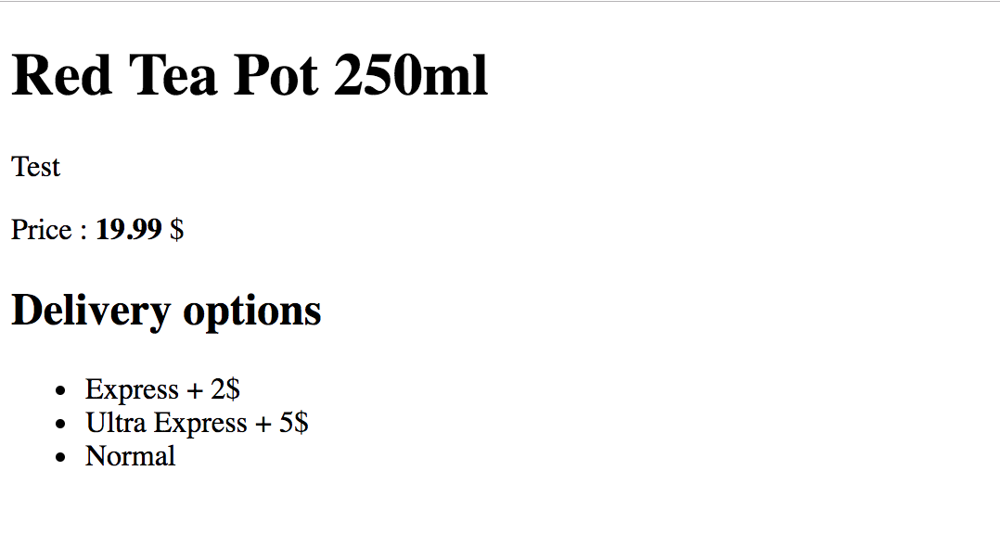
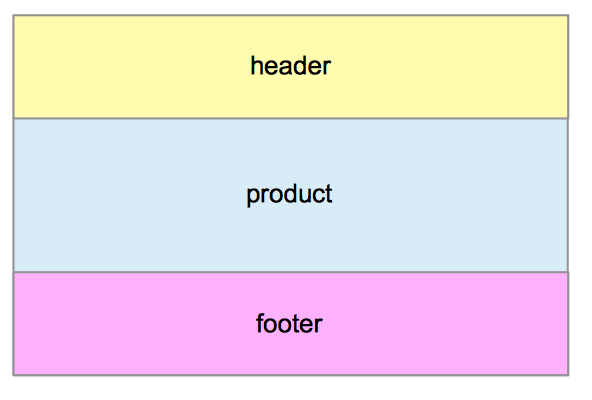
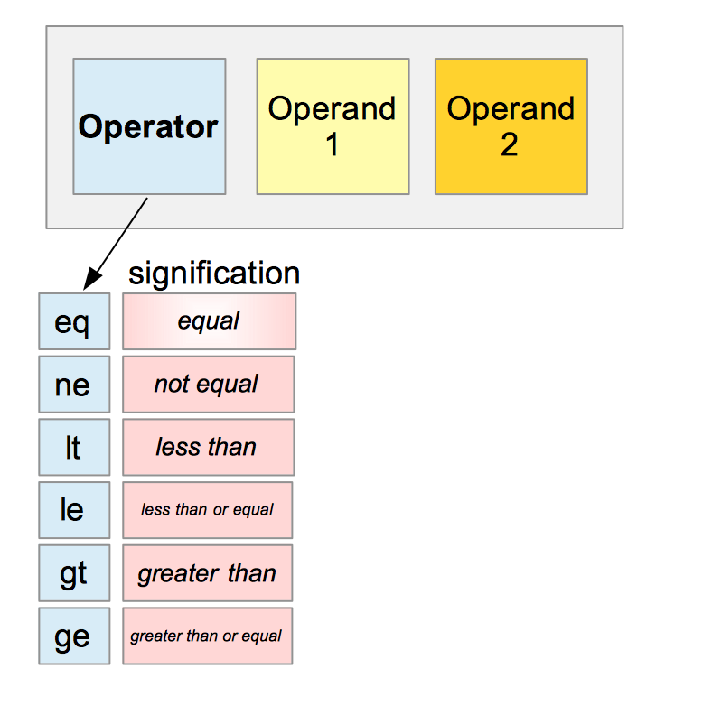

# Poglavlje 32: Šabloni

[31 Evidencija][31] | [00 Sadržaj][00] | [33 Konfiguracija aplikacije][33]

**Šta ćete naučiti u ovom poglavlju?**

- Šta je šablon?
- Kako kreirati šablon.
- Kako ubrizgati dinamičke podatke u šablone.
- Kako odštampati stavke iz kolekcije (isečak, niz, mapa).
- Kako ugraditi šablonski fajl u vaš Go binarni fajl.

**Obrađeni tehnički koncepti**:

- šablon
- ugnežđenje / ugnežđeni
- binarni

## Šta je šablon veb stranice

Šablon je skelet veb stranice. On definiše njen raspored i gde će se dinamički podaci ubrizgavati kada korisnik pošalje zahtev veb serveru.

Da bismo bolje razumeli ovu definiciju, uzećemo primer veb stranice za elektronsku trgovinu. Kao programer, dobićete zadatak da kreirate stranice proizvoda. Veb stranica ima samo tri proizvoda za prikazivanje. To je prilično jednostavno; kreiraćete tri stranice (sa HTML i CSS) da biste predstavili proizvode. Zamolićete marketinški tim da napiše komercijalne tekstove i da vam da slike proizvoda. Ovaj zadatak vam neće trebati mnogo dana.

Zamislite sada da vam marketinški stručnjak dođe deset meseci kasnije i najavi da će u katalog uvesti 100 novih proizvoda. Od vas se traži da razvijete stranice za te proizvode.

Imate dve opcije:

- Ručno kodirate 100 stranica
- Koristite neku vrstu automatizma

Prvo rešenje će vama i celom timu oduzeti dosta vremena, dok drugo rešenje deluje pametnije.

Ideja je da se napravi samo jedna stranica proizvoda. Za naziv proizvoda, postavićete jedno mesto za opis, drugo za opis, a još jedno za cenu. Zatim, ideja je da se podaci o proizvodu dinamički ubrizgavaju u odgovarajuća mesta.

Šablon predstavlja model neke vrste stranice (na primer, stranice proizvoda) ili dela veb stranice (navigacione trake). Podaci se ubrizgavaju u šablon u rezervisana mesta. Osnovni podaci često dolaze iz sloja perzistentnosti aplikacije (baza podataka, sistem keširanja...). Ovi podaci su strukturirani tako da se lako koriste u šablonu.

Takođe možete koristiti šablone za generisanje imejlova, PDF-ova ili drugih dokumenata. U ovom poglavlju ćemo se fokusirati na slučaj upotrebe na vebu.

### Zašto je korisno

- Omogućava vam značajnu uštedu vremena prilikom razvoja veb stranice. Ne morate da ponavljate.
- Dizajneri se često uče u školi da kreiraju i održavaju šablone. Postoji mnogo sistema za kreiranje šablona (za svaki jezik) sa svojim specijalnostima, ali dele zajedničke karakteristike koje je lako razumeti.
- Dizajneri i programeri mogu da rade samostalno nakon što su odredili strukturu podataka koja se prosleđuje šablonu.

## Dva paketa šablona

Go ima dva glavna paketa za rukovanje šablonima:

- text/template

- html/template

Prvi se može koristiti za izlaz teksta kada ne postoji rizik od ubrizgavanja koda. Drugi možete koristiti za formatiranje HTML stranica. U drugom, Go pruža mehanizam zaštite od loših korisnika koji će ubrizgati kod u svoj unos kako bi napali vašu veb stranicu.

Ako planirate da generišete HTML, trebalo bi da koristite `html/template` paket, a NE `text/template`!

Takođe imajte na umu da uvek treba da validirate podatke ubačene u šablone. Nikada ne bi trebalo da verujete podacima koje generišu korisnici.

## Početak rada sa šablonima

U sledećem odeljku, uzećemo primer veb stranice za elektronsku trgovinu sa bazom podataka od hiljada proizvoda.

Prvo što treba uraditi jeste da kreirate šablon. Prvo ćemo pogledati standardnu HTML stranicu za stranicu proizvoda.

### Pogled

```html
<!--views/product.html-->
<!DOCTYPE html>
<html>
<head>
    <title>Red Tea Pot 250ml</title>
</head>
<body>
    <h1>Red Tea Pot 250ml</h1>
    <p>Lorem ipsum dolor sit amet, consectetur adipiscing elit, sed do eiusmod tempor incididunt ut labore et dolore magna aliqua. </p>
    <p>Price : <strong>23.99</strong> $</p>
    <h2>Delivery options</h2>
        <ul>
            <li>Express + 2$ </li>
            <li>Ultra Express + 5$</li>
            <li>Normal</li>
        </ul>
    <h3>This was a {{.}}</h3>
</body>

</html>
```

Ova stranica sadrži detalje o našem proizvodu. Imamo naziv proizvoda, opis, cenu i opcije isporuke. Ovu datoteku ćemo čuvati u direktorijumu "views". Ovo ime je uobičajeno u veb industriji (implicitno se poziva na MVC model: Model View Controller).

Pažljivo pogledajte liniju:

```html
<h3>This was a {{.}}</h3>
```

Oznaka koju vidite (dvostruke vitičaste zagrade) odnosi se na promenljivu šablona. U sledećem odeljku ćemo videti kako Go to obrađuje.

### Veb server

Hajde da kreiramo veb server našeg veb-sajta:

```go
// template/basic/main.go 

func main() {
    http.HandleFunc("/red-tea-pot", redTeaPotHandler)
    if err := http.ListenAndServe("localhost:8080", nil); err != nil {
        panic(err)
    }
}
```

Slušaćemo dolazne konekcije na lokalnom hostu na portu 8080.

### Rukovalac zahteva

Ako primimo zahtev za rutu, "/red-tea-pot" funkcija "redTeaPotHandler" će biti pokrenuta:

```go
// template/basic/main.go 
func redTeaPotHandler(w http.ResponseWriter, r *http.Request) {
    tmpl, err := template.ParseFiles("./views/product.html")
    if err != nil{
        http.Error(w, "Something went wrong", http.StatusInternalServerError)
        return
    }

    err = tmpl.Execute(w, "test")
    // handle error
}
```

U poslednjem isečku koda definisali smo program za obradu zahteva za naš server. On kao argument prihvata `http.ResponseWriter` i pokazivač na a `http.Request`.

To je klasični HTTP program za rukovanje.

### Parsiranje i izvršavanje šablona

Prva operacija koju treba da se uradi jeste učitavanje datoteke šablona i njeno parsiranje. Za ovu operaciju ćemo koristiti funkciju `template.ParseFiles`. Ova funkcija može kao argument da prihvati više od jedne putanje do datoteke. U primeru, uzimamo samo jednu putanju do datoteke "./views/product.html". Metoda vraća pokazivač na promenljivu tipa `template.Template`.

Za svaku od putanja datoteka u argumentima, funkcija `template.ParseFiles` će:

- Učitaji datoteku iz fajl sistema (koristi ioutil.ReadFile)
- Generišiti ime šablona na osnovu poslednjeg elementa njegove putanje. U našem slučaju, ime će biti "product.html".
- Dodeliti novi HTML šablon
- Šablon će zatim biti analiziran

Zatim, kada učitamo i analiziramo naš šablon, pozvaćemo metodu `Execute`. Ona uzima dva argumenta, jedan `io.Writer` i jedan koji predstavlja podatke koje treba ubrizgati u šablon.

Nemamo šta da ubacimo u naš primer jer naš šablon nije dinamičan; svaki element je fiksan.

### Akcije šablona

U šablonu možete dodati "akcije" koje će sistemu naložiti da nešto uradi. Zvanična definicija akcija je "evaluacija podataka ili kontrolnih struktura".

Sve akcije su razgraničene dvostrukim vitičastim zagradama.

Uzmimo primer najjednostavnije akcije unutar šablona:

```html
<h3>This was a {{ . }}</h3>
```

Ovde tražimo od mehanizma za šablone da ispiše vrednost drugog argumenta metode `template.Execute`. `{{ . }}` je direktiva šablona. Mehanizam za šablone definiše pseudo-skriptni jezik. Videćete da je ovaj skriptni jezik veoma blizak jeziku Go.

**Notacija tačake**:

Znak tačke predstavlja podatke prosleđene šablonu. Da biste pristupili svojstvu, samo treba da napišete tačku pa zatim ime svojstva. Na primer, ako želim da pristupim svojstvu Price iz podataka prosleđenih šablonu, koristim sledeću sintaksu:

```html
{{ .Price}}
```

U ovoj konfiguraciji sa tačkastom notacijom, koristimo globalni kontekst. To nije uvek tačno. Kada koristite tačku unutar iteracije, tačka NE ​​predstavlja globalni kontekst, već kontekst iteracije. Uzmimo primer koji ćete odmah razumeti.

Ako ste definisali svojstvo "Price", možete mu pristupiti sa bilo kog mesta u šablonu na ovaj način:

```html
<p>{{ .Price }}</p>
<<!-- Equivalent notation -->
<p>{{ $.Price }}</p>
```

Imamo dve notacije "Price" i "$.Price" ukazuju na istu vrednost. Tačka vam daje pristup globalnom kontekstu podataka šablona.

Unutar iteracije , tačka je jednaka trenutnoj vrednosti iteracije:

```html
{{range .ShippingOptions}}
   <li>{{ . }}</li>
{{end}}
```

Ovde je tačka jednaka za prvu iteraciju , "Extra Priority" zatim , "Normal" i na kraju "Low Priority". Šablonski mehanizam će izbaciti:

```html
<li>Extra Priority</li>
<li>Normal</li>
<li>Low Priority</li>
```

Ali šta ako želite da pristupite svojstvu Price (koje je u globalnom kontekstu)? Sa `$` znakom možete pristupiti globalnom kontekstu.

```html
{{range .ShippingOptions}}
    <li>Product Price : {{ $.Price}} : {{ . }}</li>
{{end}}
```

Prethodni šablon će izvesti:

```html
<li>Product Price : 100 : Extra Priority</li>
<li>Product Price : 100 : Normal</li>
<li>Product Price : 100 : Low Priority</li>
```

### Odštampaj tekst

Ovo je glavna upotreba šablona. Bekend vam daje skup podataka, a vi ga morate ubrizgati u HTML datoteku.

Prvo što treba uraditi jeste definisati strukturu tipa koja će strukturirati podatke:

```go
type Product struct {
    Name        string
    Price       string
    Description string
}
```

Imamo veoma jednostavnu strukturu tipa sa tri tekstualna polja. Zatim kreiramo promenljivu ovog tipa:

```go
teaPot := Product{Name: "Red Tea Pot 250ml", Description: "Test", Price: "19.99"}
```

Promenljiva "teaPot" sadrži sve podatke potrebne za popunjavanje stranice proizvoda:

```html
<!DOCTYPE html>
<html>
<head>
    <title>{{.Name}}</title>
</head>
<body>
<h1>{{.Name}}</h1>
<p>{{.Description}}</p>
<p>Price : <strong>{{.Price}}</strong> $</p>
<h2>Delivery options</h2>
<ul>
    <li>Express + 2$ </li>
    <li>Ultra Express + 5$</li>
    <li>Normal</li>
</ul>
</body>

</html>
```

Imajte na umu da svaka akcija počinje tačkom `.`. Ubrizgaćemo svojstvo "Name" u HTML oznaku title. "Name" je takođe ubrizgano u oznaku h1.

Da bismo uneli vrednost imovine ",Foo" potrebno je samo da koristimo sledeću akciju:

```html
{{.Foo}}
```

Kada su naš prikaz i promenljiva podataka spremni, samo treba da ih prosledimo metodi `Execute`:

```go
err = tmpl.Execute(w, teaPot)
```

Rezultat izvršenja šablona možete videti na slici.


Rezultat izvršenja šablona (veb prikaz)

### Uklonite razmake pre i posle bilo koje direktive

Ako želite da uklonite razmake (razmak, horizontalni tabulator, povratak reda i novi red) u tekstu koji tačno prethode vašoj direktivi šablona, možete koristiti sintaksu:

```html
{{-.MyVar}}
```

Da biste uklonili razmake u onome što sledi nakon vaše direktive, koristite ovu sintaksu:

```html
{{.MyVar -}}
```

Imajte na umu da neće skraćivati promenljivu MyVar već tekst koji okružuje akciju.

Uzmimo primer:

```html
<p>42 {{"hello !"}}</p>
```

Izveštaj će biti: "42 zdravo!". Ali:

```html
<p>42 {{- "hello !"}}</p>
```

Izvešće "42hello!"

### Štampanje datuma

Datumi su veoma česti na veb stranicama. Možete proslediti `time.Time` vrednost šablonu. Dodajmo polje "ShippingDate" našoj strukturi tipa:

```go
type Product struct {
    Name         string
    Price        string
    Description  string
    ShippingDate time.Time
}
```

Zatim, dodajemo ga promenljivoj teaPot:

```go
teaPot := Product{Name: "Red Tea Pot 250ml", Description: "Test", Price: "19.99", ShippingDate: time.Now()}
```

Možemo ga koristiti u našem šablonu sa sledećom sintaksom:

```html
<p>Shipping Date : {{.ShippingDate}}</p>
```

Ali kada se šablon izvrši, pojavljuje se sledeći string:

```html
Shipping Date : 2018-12-20 13:00:02.338064 +0100 CET m=+20.349586416
```

Ovo nije baš jednostavan način formatiranja datuma! Sa šablonima možete pozvati metodu `Format`:

```html
<p>Shipping Date : {{.ShippingDate.Format "2006-01-02"}}</p>
```

Ova akcija će ispisati sledeći red:

```html
Shipping Date: 2018-12-20
```

Evo "2006-01-02" formata datuma. Možete ga prilagoditi svojim potrebama.

## Ugnežđeni šabloni

Ako vaš sajt ima više od jedne stranice, možete razmotriti korišćenje ugnežđenih šablona. Zašto? Da biste izbegli ponavljanje prilikom kodiranja šablona. Na primer, na svakoj stranici vašeg veb-sajta imaćete (praktično) isto zaglavlje, isto podnožje, istu navigacionu traku.

Ako odlučite da kopirate i nalepite kod navigacione trake na svaku stranicu sajta, propustićete jednu od najzanimljivijih karakteristika sistema za šablone: ugnežđene šablone (takođe nazvane "parcijalne" u nekim publikacijama).

### Definisanje šablona

Moguće je učitati šablon u drugi šablon sa određenom sintaksom. Definišimo dva šablona: šablon podnožja i šablon zaglavlja. Prvi definiše zaglavlje HTML stranice, sa oznakom `head`, njenim naslovom i početnom oznakom `body`:

```html
// views/header.html
{{ define "header" }}
    <!DOCTYPE html>
    <html>
    <head>
        <title>{{.PageTitle }}</title>
    </head>
    <body>
{{ end }}
```

Šablon footer zatvara oznaku `body` i zatvara oznaku `HTML`:

```html
{{ define "footer" }}
    </body>
    </html>
{{end}}
```

Imajte na umu da smo koristili novu akciju: `define`. Pomoću nje možete definisati sadržaj imenovanog šablona:

```html
{{ define "X" }}
    <!--Content of the template named X -->
{{ end }}
```

### Pozovite šablon

Kada definišemo zaglavlje i podnožje, vreme je da ih pozovemo u naš glavni šablon. Kao što možete videti na slici, stranica se sastoji od tri dela: zaglavlja, proizvoda i podnožja.

  
Ugnežđeni šabloni

```html
// views/product.html
{{ template "header". }}
<h1>{{.Name}}</h1>
<p>{{.Description}}</p>
<p>Price : <strong>{{.Price}}</strong> $</p>
<p>Shipping Date : {{.ShippingDate.Format "2006-01-02"}}</p>
<h2>Delivery options</h2>
<ul>
    <li>Express + 2$ </li>
    <li>Ultra Express + 5$</li>
    <li>Normal</li>
</ul>
{{ template "footer". }}
```

Da bismo pozvali određeni šablon (po njegovom imenu), koristimo sledeću sintaksu akcije:

```html
{{ template "header". }}
```

Ovde pozivamo šablon po imenu "header" i dajemo mu kontekst tačke. Na ovaj način, šablon "header" može imati pristup svim promenljivim koje su definisane u ovom kontekstu. Stranica proizvoda se definiše nakon toga. Na kraju stranice, pozivamo šablon "footer" sa sličnom sintaksom.

### Bekend

U pozadini, ne zaboravite da učitate i analizirate tri šablona da bi ovo funkcionisalo:

```go
// template/nested/main.go 
//...

tmpl, err := template.ParseFiles("./views/product.html","./views/header.html","./views/footer.html")
```

Imajte na umu da ovde prvo učitavamo šablon proizvoda. Ako prvo učitate jedan od druga dva, dobićete praznu stranicu ako koristite sledeću sintaksu u svom obrađivaču:

```go
err = tmpl.Execute(w, teaPot)
```

Ako želite da navedete koji šablon treba izvršiti (da biste izbegli grešku prazne stranice), koristite ovu sintaksu:

```go
err = tmpl.ExecuteTemplate(w,"product.html", teaPot)
```

Ovde kažemo Gou da izvrši imenovani šablon "product.html" (podrazumevano ime šablona je poslednji deo njegove putanje).

## Promenljive

Ponekad je korisno nešto sačuvati u promenljivoj za buduću upotrebu. Imena promenljivih počinju znakom dolara "$". Možete koristiti kratku naredbu za dodelu da biste kreirali promenljivu:

```html
{{ $myVar := .Name }}
```

U prethodnom isečku koda, kreirali smo promenljivu "$myVar" i dodelili joj vrednost sadržanu u ".Name". Levi deo dodele može biti složeniji. U zvaničnoj dokumentaciji, levi deo dodele nazivamo "cevovod".

Vrednost postojeće promenljive možete promeniti koristeći sledeću sintaksu:

```html
{{ $myVar =.Price }}
```

Ovde dodeljujemo promenljivoj $myVar vrednost tipa `float`.

### Opseg (kako koristiti promenljivu)

Bilo koja promenljiva je definisana unutar opsega važenja. Opseg predstavlja životni vek promenljive. Kada se opseg završi, promenljiva više ne postoji.

- Podrazumevano, promenljiva je definisana unutar opsega šablona.
- Ako definišete promenljivu unutar složene strukture (na primer, if naredbe),
  onda promenljiva postoji samo unutar opsega važenja te strukture:

  ```html
  {{ if.Price}}
      {{ $var2 :=.Name}}
      // $var2 exists
  {{ end}}
  
  // $var2 no longer exists
  <p>{{ $var2 }}</p>
  ```

Ovde definišemo promenljivu `$var2` "unutar" if naredbe. Promenljiva `$var2` postoji samo u okviru if naredbe. Nakon {{end}} promenljiva se ne može koristiti.

## Poziv metode

Možemo pozivati metode u šablonima. Ne mogu se pozivati sve metode:

- Metoda treba da ima samo jednu ili dve povratne vrednosti
  - Ako se vrate dve vrednosti, druga mora biti tipa `error`.

Uzmimo primer. Definisaćemo metode "Foo" i "Bar" sa "Product" prijemnikom:

```go
// template/method-call/main.go 
//...

type Product struct {
    //...
}

func (p Product) Foo() string {
    return "FOO"
}

func (p Product) Bar(test string) string {
    return fmt.Sprintf("Bar : %s", test)
}
```

Onda možete pozvati "Foo" metodu na ovaj način:

```html
<p>{{.Foo}}</p>
<p>{{.Bar "lol"}}</p>
```

Kada se šablon izvrši, izbaciće:

```html
<p>FOO</p>
<p>Bar : lol</p>
```

## Predefinisane globalne funkcije

Šablonski mehanizam ima ugrađene funkcije koje možemo koristiti:

???

Ovo je varijadička funkcija. Proveravaće "bulovu" vrednost svakog argumenta. Kada naiđe na vrednost `false`, vratiće je direktno. Kada su svi argumenti `true`, funkcija će vratiti poslednji argument.

### Definicija reči "true"

Odgovor nije očigledan. Funkcija `and`, na primer, će proveriti bulovu vrednost svakog svog argumenta. True znači:

- Niz, mapa, isečak i string koji nisu prazni ( dužina > 0 ),
- Kompleksan broj koji nije jednak 0,
- Funkcija, kanal, pokazivač, interfejs koji nije `nil`,
- Ceo broj (sa znakom ili bez znaka) koji nije jednak 0,
- Broj sa pokretnim zarezom koji nije jednak 0,
- Struktura (strukture su uvek tačne).

**Primer**:

Dodajmo svojstvo "Sale" (`bool`) i "SaleImagePath" (isečak stringova) strukturi podataka tipa "Product#. Ideja je da se na stranicu doda slika ako je proizvod na sniženju i ako imamo bar jednu sliku za prikazivanje.

Inicijalizovaćemo vrednost svojstva "Sale" na `true`, a svojstvo "SaleImagePath" sa isečkom stringova koji sadrže jedan string. Poziv funkcije:

```html
and .Sale .SaleImagePath
```

Vratiće se .SaleImagePath jer:

- ".Sale" je true
- ".SaleImagePath" nije prazan isečak.

Možemo koristiti i u if naredbi:

```html
{{ if and.Sale.SaleImagePath}}
    <p>My super image</p>
    <!--Add image here-->
{{ end }}
```

Prvi argument ove funkcije je... ime funkcije/metode. Poziv vam omogućava da koristite funkciju direktno unutar šablona. Postoje neka ograničenja za funkciju. Mora vratiti jednu ili dve vrednosti (ako su dve, drugi argument mora biti greška). Funkcija može imati onoliko argumenata koliko želite.

Na primer, definišemo funkciju Bar:

```go
// template/functions/main.go 

func Bar(a string, b string) string {
    buf := bytes.NewBufferString(a)
    buf.WriteString(b)
    return buf.String()
}
```

Ova funkcija spaja "a" sa stringom "b" (sa bytes.Buffer). Ako želimo da je pozovemo unutar našeg šablona, moramo izmeniti našu strukturu podataka i dodati mu funkciju.

```go
// template/functions/main.go

type Product struct {
    //...
    MyFunc func(string, string)string
}
```

Ovo svojstvo nazivamo MyFunc. Zatim kreiramo novu instancu Product, i dodeljujemo MyFuncfunkciji Bar:

```go
teaPot := Product{
    //...
    MyFunc:Bar}
```

Zatim, unutar šablona, možemo ga pozvati:

```html
<p>{{call.MyFunc "first" "second"}}</p>
```

Koja pravi izlaz:

```html
<p>firstsecond</p>
```

Vratiće indeks elementa na mapi.

Omogućavaju vam da izbegnete javaskript kod.

Vratiće dužinu isečka, niza, mape...

Može se koristiti za štampanje nečega; funkcije koje se pozivaju iza su one iz fmt paketa ( fmt.Sprint, fmt.Sprintf, fmt.Sprintln ).

Ova funkcija prihvata promenljiv broj argumenata. Ona će napraviti string od tih argumenata, a zatim će pozvati funkciju paketa url: `QueryEscape`. Ova funkcija vam omogućava da direktno ugradite složene delove upita URL-ova u vaš šablon.

Kompletnu listu ugrađenih funkcija možete pronaći ovde:
<https://golang.org/pkg/text/template/#hdr-Functions>

## Prilagođene funkcije šablona

Paket šablona vam pruža mogućnost korišćenja prilagođenih funkcija unutar vašeg šablona. Prvo morate da kreirate svoje funkcije, a zatim ih prosledite šablonu pre parsiranja i izvršavanja.

Napravićemo `template.FuncMap`. Tip iza `FuncMap` je `map[string]interface{}`. To je mapa stringova u prazan interfejs. Zatim možemo dodati našoj mapi funkcije koje želimo da dodamo šablonu:

```go
var capitalizeFirstLetter = func(text string)string{return strings.Title(text)}
```

Ovde kreiramo anonimnu funkciju koja će omotati funkciju `string.Title` (koja će pisati veliko početno slovo svake reči rečenice). Funkcija je sačuvana u promenljivoj pod nazivom "capitalizeFirstLetter".

Zatim dodajemo funkciju na mapu:

```go
funcs := template.FuncMap{"capitalizeFirstLetter": capitalizeFirstLetter}
```

Ključ ove mape je ime koje će biti prikazano u šablonu, drugi argument je sama funkcija. Ne možemo direktno pozvati `ParseFiles`, jer funkcije moraju biti dodate u šablon pre parsiranja :

```go
// template/custom-functions/main.go 
//...

tmpl, err := template.New("product-dynamic.html").Funcs(funcs).ParseFiles("./views/product-dynamic.html")
// check error...
```

Onda možemo koristiti funkciju unutar šablona:

```html
<p>{{capitalizeFirstLetter "test"}}</p>
```

Izvešće:

```sh
Test
```

## Uslovna rešenja

Možete koristiti uslovne strukture (ako, onda inače).

Uzmimo primer: U našem prethodnom primeru proizvoda, dodaćemo polje strukturi tipa Product:

type Product struct {
    Name         string
    Price        string
    Description  string
    ShippingDate time.Time
    Sale         bool
}

Polje se zove Sale. To je bulova vrednost koja će označiti proizvod ako je na sniženju. Želimo da prikažemo nešto posebno na našoj stranici za ovu priliku, ali samo ako je proizvod na sniženju:

```html
{{ if.Sale }}
    <h3>Exclusive Sale Today !</h3>
{{ end }}
```

Kada se šablon izvrši, mehanizam će proveriti da li vrednost "Sale" nije prazna. Uslov "prazno" pokriva sledeći slučaj:

- false
- 0
- pokazivač nil
- vrednost interfejsa
- niz, isečak, mapa ili string dužine nula.

`If` se može dopuniti radnjom `else`:

```html
{{ if.Sale }}
    <h3>Exclusive Sale Today !</h3>
{{ else }}
    <p>Not in sale, sorry</p>
{{ end }}
```

Za složenija poređenja, možete koristiti akciju `eleseif`:

```html
{{ if.Sale }}
    //...
{{ elseif.ExtraDiscount }}
    //...
{{ else }}
    //...
{{ end }}
```

## Operatori poređenja


Sintaksa poređenja i binarni operatori

Možete uporediti dve promenljive koristeći šest postojećih operatora. Sintaksa nije uobičajena za poređenja. Prvo navodite operatore poređenja, a zatim navodite dva operanda. Na primer, ako želite da uporedite. Price i 100.00, sintaksa je: `eq.Price 100.00`

```html
{{ if eq.Price  100.00 }}
    <p>Only 100$</p>
{{ else }}
    <p>Give yourself a treat</p>
{{ end }}
```

Ta poređenja će vratiti bulove vrednosti koje se mogu bezbedno koristiti sa uslovnim izjavama.

> [!Note]
> Bolje je upoređivati samo promenljive koje imaju isti tip. Paket dozvoljava
> upoređivanje promenljivih koje nisu istog tipa. Ne preporučujem to jer može
> dovesti do grešaka.
>
> Uzmimo konkretan primer: .Price je tipa float64 (definisanog u našoj
> strukturi podataka), 100 je ceo broj. Dva tipa nisu ista. Rezultat poređenja
> je netačan.  
>
> Tekst "Only 100\$" se neće pojaviti na HTML stranici kada se šablon izvrši,
> pojaviće se "Only 100\$ it's a deal!".

  ```html
  {{ if eq.Price  100 }}
      <p>Only 100$ it's a deal!</p>
  {{ end }}
  ```
  
- Operandi poređenja mogu imati sledeće tipove:
  - bulova vrednost
  - int, int8, int16, int64
  - uint, uint8, uint16, uint64
  - uintptr
  - float32, float64
  - complex64, complex128
  - string

- Možemo koristiti imenovane tipove u poređenjima.

**type LogLevel int**:

Možete definisati promenljivu tipa `LogLevel` i koristiti je u svom šablonu za poređenje.

## Iteracije

Komentari, recenzije, opcije isporuke... itd. Podaci koji se prikazuju u šablonu često dolaze u obliku lista. Go sistem šablona ima akcije posvećene iteraciji.

Na primer, dodajmo svojstvo "ShippingOptions" našoj strukturi tipa "Product"(podaci koje ćemo proslediti šablonu):

```go
// template/iteration/main.go

//...

type Product struct {
    //...
    ShippingOptions []string
}

//...
teaPot := Product{
        //...
    ShippingOptions: []string{"Extra Priority", "Normal", "Low Priority"}
}

err = tmpl.Execute(w, teaPot)
```

"ShippingOptions" je tipa isečka stringova ( `[]string` ). Zatim u našem šablonu možemo da iteriramo kroz ovaj isečak pomoću `range` akcije:

```html
// template
<ul>
    {{range $index, $element :=.ShippingOptions}}
       <li>{{ $element }}</li>
    {{end}}
</ul>
```

Akcija `range` će pokrenuti iteraciju preko elemenata "ShippingOptions". Nakon opsega, morate da navedete dva imena promenljivih; prvo je za "indeks" ( `$index` ), drugo je za "element" ispod tog indeksa ( `$element` ).

Zatim možemo koristiti te dve promenljive unutar `range` petlje (koja je ograničena akcijom `end`). Promenljive "$index" i "$element" su definisane u opsegu petlje `range`.

Prethodni šablon će izvesti:

```html
<ul>
    <li>Extra Priority</li>
    <li>Normal</li>
    <li>Low Priority</li>
</ul>
```

Takođe možete koristiti kraću verziju za iteraciju kroz isečak u šablonu:

```html
{{range.ShippingOptions}}
    <li>{{. }}</li>
{{end}}
```

### Dobijanje vrednosti definisane na određenom indeksu

Ugrađena index funkcija vam omogućava da dobijete vrednost iz niza, isečka ili mape iz njegovog indeksa. Da bismo ovo razjasnili, uzmimo primer. Ako želite da ubacite element na indeksu 0 iz isečka ".ShippingOptions" možete koristiti ovu sintaksu:

```html
//template
{{ $firstDelOpt := index.ShippingOptions 0}}
<p>First delivery option is {{ $firstDelOpt }}</p>
```

Vrednost .ShippingOptions[0] je dodeljena promenljivoj $firstDelOpt. Zatim možemo koristiti ovu promenljivu u ostatku šablona.

Ovaj šablon će izvesti:

```html
<p>First delivery option is Extra Priority</p>
```

Možemo koristiti funkciju `index` sa višedimenzionalnim isečcima. Dodajmo svojstvo "Notes" (dvodimenzionalni isečak) našoj strukturi tipa "Product":

```go
type Product struct {
    //..
    Notes [][]int
}
```

Ovaj 2D isečak predstavlja napomene korisnika za proizvod. Svaki red predstavlja napomenu, svaka kolona predstavlja napomenu za kriterijum:

```go
notes := [][]int{}
note1 := []int{1, 2, 3}
note2 := []int{4, 5, 6}
notes = append(notes, note1)
notes = append(notes, note2)
```

Ovde imamo dve beleške ( note1 i note2) sa po tri kriterijuma. Da bismo dobili drugi kriterijum prve beleške unutar našeg šablona, možemo koristiti funkciju `index` ovako:

```html
{{ $note := index.Notes 0 1}}
<p>First note, second criterion : {{$note}}</p>
```

Ovde navodimo tri argumenta za indeksiranje; prvi je naš 2D isečak, a druga dva su indeksi. Ovde se vrednost preuzima `.Notes[0][1]` (prvi element isečka je na indeksu 0, zatim drugi na indeksu 1).

## Ugradite datoteke šablona u Go Binary

Verzija 1.16 uvodi novi standardni paket pod nazivom `embed`. Pomoću ovog paketa možete uključiti u binarni fajl programa svoje datoteke šablona (ili druge datoteke).

Recimo da se vaše datoteke šablona nalaze u direktorijumu "views". Možete ugraditi sve datoteke koje se nalaze u direktorijumu "views" pomoću `//go:embed views/*` direktive.

Kada se program kompajlira, Go će se popuniti "views" svim datotekama koje se nalaze u "views" direktorijumu.

```go
// template/basic-embed/main.go 
package main

import (
    "embed"
    "html/template"
    "net/http"
    "time"
)

//go:embed views/*
var views embed.FS

func main {
    tmpl, err := template.ParseFS(views, "views/product.html")
    if err != nil {
        http.Error(w, "Something went wrong", http.StatusInternalServerError)
        return
    }
    // use the template
}
```

Zatim možete koristiti funkciju `template.ParseFS` za učitavanje i parsiranje datoteka šablona.

## Otklanjanje grešaka u šablonu

Tokom faze razvoja, možete koristiti ovu tehniku da biste poboljšali svoju produktivnost:

Unutar šablona, dodajte ovu liniju:

```html
{{ printf "%#v". }}
```

Ovo će prikazati (u ljudski čitljivom režimu) ključeve i vrednosti svojstava prosleđene mehanizmu šablona. Evo primera:

main.Product{Name:"Red Tea Pot 250ml", Price:"19.99", Description:"Test",ShippingDate:time.Time{wall:0xbeffc6aedb25e3e0, ext:18903963863, loc:(*time.Location)(0x164dd40)}, Sale:true, SaleImagePath:[]string{"img.jpg"}}

## Testirajte sebe

1. Kada iterirate kroz isečak sa opsegom, kako da odštampate vrednosti elemenata isečka?

   - Sa `{{ . }}`
   - Sa `{{range.ShippingOptions}} <li>{{ . }}</li>{{end}}`

2. Tačno ili netačno. Da biste generisali šablon veb stranica, možete koristiti sledeća dva paketa: `text/template` i `html/template`.

   - Tehnički je tačno.
     Međutim, ovo se ne preporučuje.
   - Paket `html/template` nudi dodatni sloj bezbednosti (dezinfekciju podataka
     ubrizganih u šablone)

3. Kako učitati šablon napisan u datoteci?
   - `tmpl, err := template.ParseFiles("./views/product-dynamic.html")`

4. Kako učitati šablon sačuvan unutar promenljive?
   - `tmpl, err := template.New("test").Parse("Hello {{.}}")`

5. Kako odštampati datum u šablonu sa formatom -01-02?

   - S obzirom da imate polje `ShippingDate` tipa `time.Time` možete uraditi
     sledeće: `{{.ShippingDate.Format "2006-01-02"}}`

6. Kako ubaciti šablon u drugi šablon?
   - `{{ template "header". }}`

7. Kako ugraditi datoteku šablona u vaš Go binarni fajl?
   - Koristite direktivu `//go:embed views/*`

## Ključno

- Go ima ugrađeni mehanizam za šablone.
- Šablonski mehanizam će kombinovati šablon sa podacima da bi proizveo konačni dokument.
- Paket template/htmlje dizajniran za kreiranje HTML dokumenata
- Ovaj paket nudi bezbednosni sloj za zaštitu vaših generisanih dokumenata od uobičajenih napada.
- Uvek bi trebalo da validirate podatke koje je generisao korisnik u odnosu na restriktivna pravila.
- template/textje dizajniran za pravljenje tekstualnih dokumenata. Ne nudi iste bezbednosne funkcije kaotemplate/html

- Da biste ispisali polje tipa strukture, koristite notaciju{{.NameOfField }}
- Možete pozivati metode u šablonima:. Argumenti slede nakon imena metode{{.MyFunc "arg1""arg2" }}
- Promenljiva tipa time.Timemože se lako formatirati:{{.CreateTime.Format "2006-01-02" }}
- Šabloni se mogu ugnježavati. Šablon može biti uključen u drugi šablon.
- Da biste definisali šablon, koristite `define` :{{ define "header" }} your template {{ end }}
- Zatim možete "ubrizgati" ovaj šablon u drugi pomoću:{{ template "header". }}
- Možete deklarisati promenljive pomoću sledeće sintakse:{{ $var2 :=.Name}}
- Da biste iterativno prešli preko isečka i niza ili mape, možete koristitirange
  
  ```html
  <ul>
      {{range $index, $element :=.ShippingOptions}}
         <li>{{ $element }}</li>
      {{end}}
  </ul>
  ```

- Možete koristiti unapred deklarisane globalne funkcije: and, or, not,.… kompletnu listu možete pronaći ovde: <https://golang.org/pkg/text/template/#hdr-Functions>

- Možete dodati prilagođene funkcije svojim šablonima:

  ```go
  funcs := template.FuncMap{"capitalizeFirstLetter": capitalizeFirstLetter}

  tmpl, err := template.New("product-dynamic.html").Funcs(funcs).ParseFiles("./views/product-dynamic.html")
  // check error...
  ```

- Od verzije Go 1.16, možete lako ugraditi svoje šablone u binarnu datoteku pomoću//go:embed
  
  ```go
  //go:embed views/*
  var views embed.FS
  
  //...
  
  tmpl, err := template.ParseFS(views, "views/product.html")
  //...
  ```
  
[31 Evidencija][31] | [00 Sadržaj][00] | [33 Konfiguracija aplikacije][33]

[31]: 31_Evidencija.md
[00]: 00_Sadržaj.md
[33]: 33_Konfigurqacija_aplikacije.md
