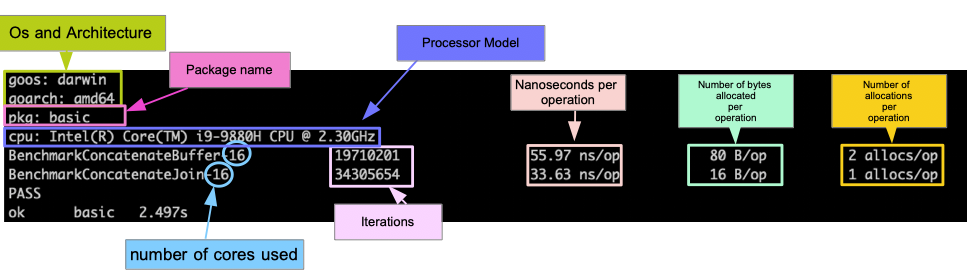
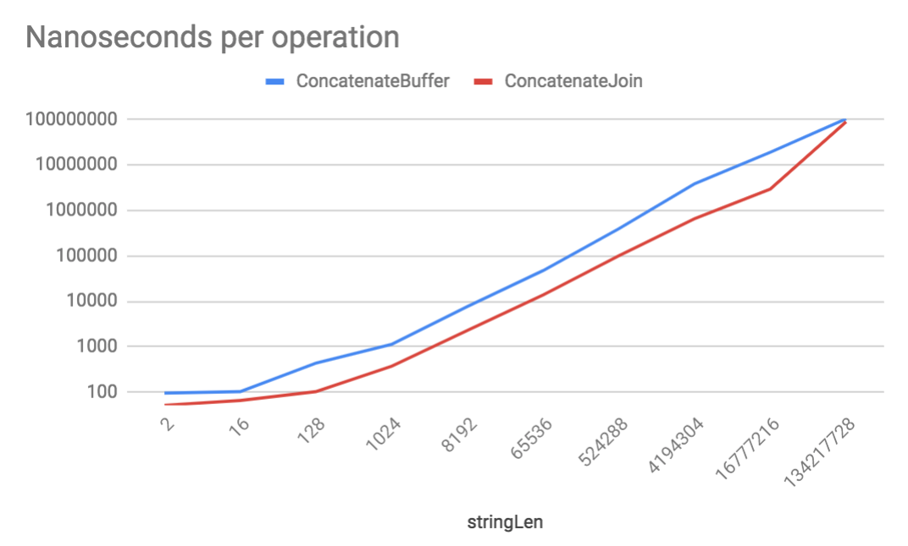
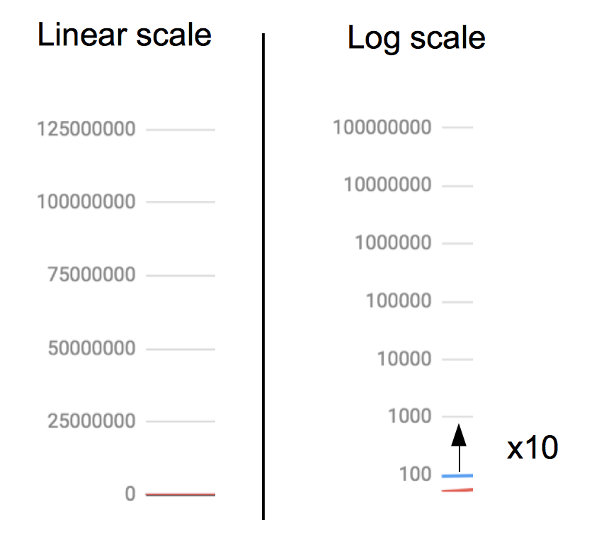
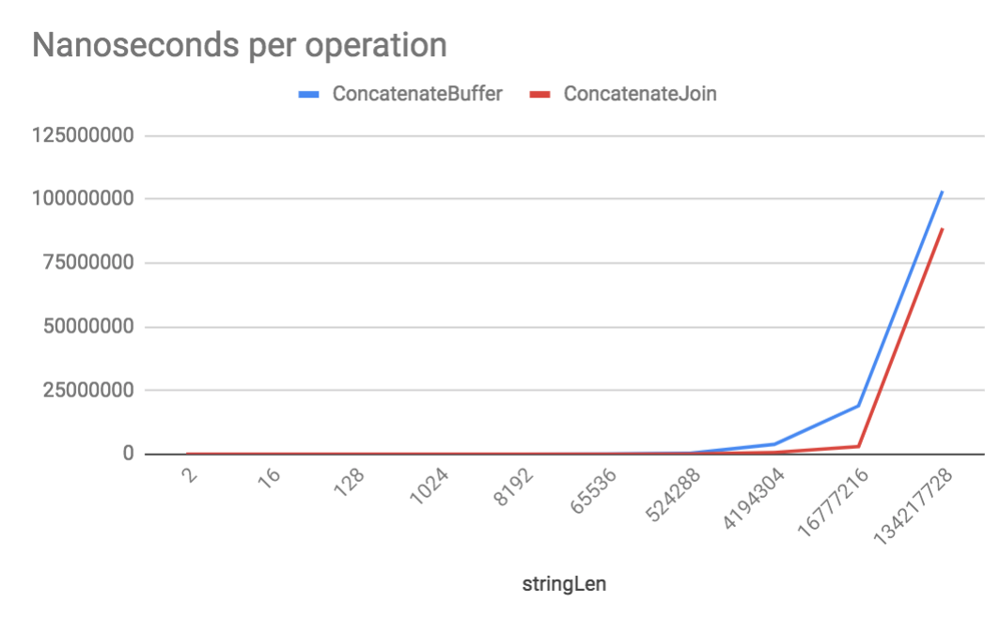
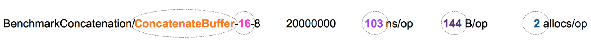

# Poglavlje 34: Referentne vrednosti

[33 Konfiguracija aplikacije][33]  
[00 Sadržaj][00]  
[35 Izgradnja HTTP klijenata][35]

**Šta ćete naučiti u ovom poglavlju?**

- Šta je referentna vrednost?
- Kako napisati benčmark.
- Kako čitati rezultate benčmarka.

**Obrađeni tehnički koncepti**:

- Referentna vrednost
- Rešavač
- Alokacije memorije (dinamičke i statičke)

## Uvod

Problem može imati različita rešenja.

Uzmimo primer: izgubili ste ključeve i želite da otvorite vrata svoje kuće. Ovaj problem ima nekoliko rešenja. Možete:

- Pozvati nekoga iz svoje pratnje ko ima rezervni ključ.
- Pozavati bravara da vam otvori vrata.
- Vratiti se tamo gde ste bili i potražite svoje ključeve; ako ih ne pronađete u roku od 3 sata, koristite rešenje 1 ili 2.
- Razbiti prozor i ući u svoju kuću.

Ta rešenja će imati isti rezultat; vaša vrata će biti otvorena. Ali ako ste razumni, možete rangirati ta rešenja u smislu troškova ili vremena. Rešenja 2 i 4 će vas koštati novca. Rešenje 3 (potražite svoje ključeve) će vas verovatno koštati više vremena. Ali šta ako jednostavno zaboravite ključeve u autu parkiranom 5 minuta dalje? Jasno je da će vas u tom slučaju rešenje tri koštati manje nego što ste očekivali.

Ispitivanjem svih mogućih rešenja i njihovim testiranjem u svojoj mašti, postavljate referentnu vrednost.

## Šta je benčmark

Referentni test je alat za poređenje sistema i komponenti. Cilj dizajniranja i pokretanja benčmarka je pronalaženje najbolje strategije rešavanja (nazvane solver).

Solver je obično metoda.

Da bi se izabrao najbolji solver, mora se definisati pravilo. Tokom testiranja, prikupljaju se statistike izvršavanja (vreme izračunavanja, broj uticaja, broj poziva funkcija...). Uz pomoć tih statistika možemo izabrati pravilo odlučivanja.

Ne postoji tako nešto kao opšte pravilo. Pravila se mogu razlikovati u zavisnosti od vaših potreba; na primer, ako želite da izaberete program sa manjim korišćenjem procesora, morate se fokusirati samo na ove statistike. Ako dizajnirate program koji radi na uređajima sa veoma malo dostupne memorije, možete se fokusirati na statistiku korišćenja memorije da biste izabrali najbolji rešavač.

## Kako napisati benčmark

Uporedićemo dva algoritma za spajanje stringova. Prvi korak je kreiranje dve funkcije koje će implementirati dva rešenja:

```go
// benchmark/basic/bench.go
package basic

import (
    "bytes"
    "strings"
)

func ConcatenateBuffer(first string, second string) string {
    var buffer bytes.Buffer
    buffer.WriteString(first)
    buffer.WriteString(second)
    return buffer.String()
}

func ConcatenateJoin(first string, second string) string {
    return strings.Join([]string{first, second}, "")
}
```

Obe funkcije spajaju dva stringa. Koriste dve različite metode. Prva funkcija "ConcatenateBuffer" će koristiti bafer (iz `buffer` paketa). Druga funkcija je omotač funkcije `Join` iz paketa `strings`. Želimo da znamo koji je pristup najbolji.

Benčmarkovi se nalaze pored jediničnih testova. Benčmark je funkcija koja se nalazi u test datoteci. NJeno ime mora početi sa `Benchmark`. Funkcije za benčmark imaju sledeći potpis

```go
func BenchmarkXXX(b *testing.B) {
}
```

Ova funkcija kao parametar uzima pokazivač na strukturu tipa `testing.B`. Ovaj tip struktura ima samo jedno izvezeno svojstvo: `N`, koje predstavlja broj iteracija za pokretanje. Referentni program neće pokrenuti funkciju samo jednom, već nekoliko puta kako bi prikupio pouzdane podatke o izvršavanju testirane funkcije. Zato referentne funkcije uvek enkapsuliraju ovu vrstu for petlje:

```go
for i := 0; i < b.N; i++ {
    // execute the function here
}
```

Možete videti da petlja počinje od 0 i zaustavlja se kada se `b.N` dostigne. Nemojte stavljati vrednost umesto b.N. Paket za testiranje će pokrenuti testiranje jednom, a zatim odlučiti da li treba da nastavi sa pokretanjem. Vrednost N se podešava da bi se dostigao željeni nivo pouzdanosti (o tome ćemo detaljnije govoriti kasnije u poglavlju). Pogledajmo naša dva testiranja:

```go
// benchmark/basic/bench_test.go 

var result string

func BenchmarkConcatenateBuffer(b *testing.B) {
    var s string
    for i := 0; i < b.N; i++ {
        s = ConcatenateBuffer("test2","test3")
    }
    result = s
}

func BenchmarkConcatenateJoin(b *testing.B) {
    var s string
    for i := 0; i < b.N; i++ {
        s = ConcatenateJoin("test2","test3")
    }
    result = s
}
```

Prvo kreiramo "result" promenljivu. Ova promenljiva je tu samo da bi se izbegla optimizacija kompajlera (savet koji je dao Dejv Čejni u postu na blogu: <https://dave.cheney.net/2013/06/30/how-to-write-benchmarks-in-go)>. Rezultate naših benčmarkova ćemo sačuvati u ovoj promenljivoj.

Zatim definišemo naše dve referentne funkcije, "BenchmarkConcatenateBuffer" i "BenchmarkConcatenateJoin". Treba napomenuti da imaju veoma slične konstrukcije. Rezultat spajanja se čuva u promenljivoj s. Zatim definišemo petlju for, i unutar nje izvršavamo funkciju koju želimo da testiramo.

Argumenti su fiksni; funkciju testiramo pod istim uslovima.

## Kako pokrenuti benčmarkove

Za pokretanje benčmarkova koristimo istu `go test` komandu:

```sh
go test -bench=.
```

Ova komanda će ispisati:

```go
goos: darwin
goarch: amd64
pkg: go_book/benchmark
BenchmarkConcatenateBuffer-8    20000000                98.9 ns/op
BenchmarkConcatenateJoin-8      30000000                56.1 ns/op
PASS
ok      go_book/benchmark       3.833s
```

U sledećem odeljku ćemo videti kako se tumače rezultati testa.

Prethodna komanda će pokrenuti sve benčmarkove paketa.

### Pokrenite samo jedan benčmark

Da biste pokrenuli samo "ConcatenateBuffer" benčmark, možete koristiti sledeću komandu:

```sh
go test -bench ConcatenateBuffer
```

Prethodna komanda je skraćenica za:

```sh
go test -test.bench ConcatenateBuffer
```

### Pokreni sa kodom (bez CLI-ja)

Paket za testiranje otkriva javne metode za pokretanje benčmarka. Uzmimo primer:

```go
// benchmark/without-cli/main.go
package main

import (
    "bytes"
    "fmt"
    "testing"
)

func main() {
    res := testing.Benchmark(BenchmarkConcatenateBuffer)
    fmt.Printf("Memory allocations : %d \n", res.MemAllocs)
    fmt.Printf("Number of bytes allocated: %d \n", res.Bytes)
    fmt.Printf("Number of run: %d \n", res.N)
    fmt.Printf("Time taken: %s \n", res.T)
}

//..
func BenchmarkConcatenateBuffer(b *testing.B) {
    //..
}
```

Funkcija "testing.Benchmark" čeka validnu referentnu funkciju, tj. promenljivu tipa `func(b *testing.B)`. Zapamtite da su u Gou funkcije građani prvog reda i da se mogu prosleđivati drugim funkcijama.

Funkcija `Benchmark` vraća promenljivu tipa `BenchmarkResult`:

```go
// standard library
// src/testing/benchmark.go (v1.11.4)
type BenchmarkResult struct {
    N         int           // The number of iterations.
    T         time.Duration // The total time taken.
    Bytes     int64         // Bytes processed in one iteration.
    MemAllocs uint64        // The total number of memory allocations.
    MemBytes  uint64        // The total number of bytes allocated.
}
```

## Referentne zastavice

- **cpu**

  Benčmarkovi se podrazumevano izvršavaju sa `GOMAXPROCS` procesorima. Da biste imali pouzdan benčmark, predlažem da kontrolišete ovu vrednost; trebalo bi da bude jednaka broju procesora ciljane mašine.

  Morate proslediti regularni izraz ovoj zastavici. Pokrenuće se funkcije za testiranje čija imena odgovaraju regularnom izrazu.
  
  Na primer, komanda:
  
  ```sh
  go test -bench.
  ```
  
  pokrenuće sve benčmarkove.
  
  ```sh
  go test -bench Join
  ```

  Pokrenuće sve benčmark funkcije koje sadrže string "Join". U primeru "BenchmarkConcatenateJoin" će biti pokrenuto, ali ne "BenchmarkConcatenateBuffer".

- **benchtime**

  Ova zastavica vam omogućava da kontrolišete vreme izvršavanja vaših benčmarkova. Morate da prosledite string trajanja (npr. 3s). Sistem će analizirati trajanje i izvršiti benčmarkove za navedeno vreme. To znači da možete povećati/smanjiti vreme koje će benčmark trajati.

  **Primer**: Pokrenimo imenovani benčmark "BenchmarkConcatenateJoin" 5 sekundi:

  ```sh
  go test -bench BenchmarkConcatenateJoin -benchtime 5s
  goos: darwin
  goarch: amd64
  pkg: go_book/benchmark
  BenchmarkConcatenateJoin-8      100000000               56.9 ns/op
  PASS
  ok      go_book/benchmark       5.760s
  ```

  U rezultatu će biti prikazana statistika alokacije memorije. Ova zastavica je bulova; podrazumevano je podešena na false. Samo je dodajte u komandnu liniju da biste aktivirali ovu funkciju.
  
  **Primer**: Možemo pokrenuti benčmarkove sa statistikom memorije sledećom komandom

  ```gh
  go test -bench. -benchmem
  goos: darwin
  goarch: amd64
  pkg: go_book/benchmark
  BenchmarkConcatenateBuffer-8    20000000               105 ns/op      128 B/op          2 allocs/op
  BenchmarkConcatenateJoin-8      30000000                60.2 ns/op      16 B/op          1 allocs/op
  PASS
  ok      go_book/benchmark       4.093s
  ```

  Imajte na umu da se u rezultatima testiranja štampaju još dve kolone. U sledećem odeljku ćemo videti kako se tumače te statistike.
  
## Kako čitati rezultate benčmark testova

Smatram da je teško pročitati rezultate benčmarkova. Proći ćemo kroz svaku vrstu statistike. Za svaku statistiku pokušaćemo da damo praktične savete...


Izlazni rezultati benčmarkinga [slika:Benchmark-results-output]

Na slici možete videti standardni izlaz komande:

```sh
go test -bench. -benchmem
```

Ovde pokrećemo sve benčmarkove trenutnih paketa sa statistikom memorije. Rezultat benčmarka sadrži sledeće statistike:

- Prvi elementi koji se ispisuju u rezultatu testiranja su dve Go env promenljive, `GOOS` i `GOARCH`.
  Već ih znate, ali su korisne za poređenje rezultata testiranja.
- Trajanje: Ovo je ukupno vreme potrebno za izvršavanje benčmarkova
- Broj iteracija (druga kolona): Zapamtite da unutar svake funkcije za benčmark postoji for petlja.
  Ovaj broj predstavlja broj puta koliko se for petlja pokrenula da bi se
  dobila statistika. Možete povećati broj iteracija korišćenjem zastavice `-benchtime` da biste povećali trajanje benčmarka. To nije ukupan broj iteracija koje je izvršio benčmark.
- Nanosekunde po operaciji (treća kolona): daje vam predstavu o tome koliko brzo vaš solver u
  proseku radi. U našem primeru, funkcija "ConcatenateBuffer" u proseku zahteva 55,97 nanosekundi za izvršavanje. Dok funkcija ConcatenateJoin u proseku zahteva 33,63 nanosekundi za izvršavanje. Najbrža funkcija je "ConcatenateJoin" u kontekstu našeg benčmarka.
- Broj jezgara (dodato nazivu funkcije za merenje performansi)
  - Rezultat benčmarka je relativan u odnosu na sistem koji ga pokreće. Zato je važno znati koliko
    jezgara se koristi za njegovo pokretanje. U našem slučaju, benčmark se pokreće sa osam jezgara. Možete prilagoditi broj jezgara koje će se koristiti za pokretanje benčmarka korišćenjem zastavice `-cpu`. Podrazumevano, koristi se maksimalan broj dostupnih jezgara.
- Broj bajtova dodeljenih po operaciji (četvrta kolona): Ova kolona je prisutna samo ako dodate
  zastavicu `-benchmem`. Ovo će vam dati predstavu o potrošnji memorije vaših solvera. Ako vam je cilj poboljšanje korišćenja memorije, onda bi trebalo da se fokusirate na ovu statistiku.
- Broj alokacija po operaciji (peta kolona): naziv ove statistike govori sam za sebe. Ovo je
  prosečan broj alokacija memorije po pokretanju. U odeljku "Detekcija alokacije memorije" videćemo kako da detektujemo alokaciju memorije kako bismo poboljšali vaš kod.

## Detekcija alokacija memorije

Go ima režim za debagovanje koji vam omogućava da ispišete brojne i veoma vredne informacije o performansama vašeg programa. Alokacija memorije je važna promenljiva za razumevanje kako program funkcioniše. Postoje otprilike dve vrste alokacija memorije:

- Statička: memorija se alocira kada se program pokrene. U C-u, to se dešava kada kreirate globalnu
  ili statičku promenljivu. Ova memorija se oslobađa kada se program zaustavi. Alocira se samo jednom.

- Dinamička: U programu nije sve poznato kada se program kompajlira ili pokrene. Ponašanje programa
  može da varira u zavisnosti od korisničkog unosa, na primer. Zamislite program koji izračunava veoma složene matematičke operacije, memorija potrebna programu zavisiće od unosa i može drastično da varira (sabiranje ne zahteva mnogo memorije, dok dobijanje rezultata 10000 zahteva mnogo više prostora). Zbog toga programi moraju dinamički da alociraju memoriju kada se izvršavaju.

Fokusiraćemo se na dinamičku alokaciju memorije. Koristićemo promenljivu `GODEBUG` da bismo prikazali alokacije memorije koje vrše naše dve funkcije.

Prvo što treba da uradimo je da napravimo primer aplikacije koja će pozivati naše dve funkcije:

```go
package main

// inports

func main() {
    basic.ConcatenateBuffer("first","second")
    basic.ConcatenateJoin("first","second")
}
```

Ova aplikacija će pozvati naše dve funkcije (koje su deo paketa "basic" sa putanjom importa ). Zatim ćemo kompajlirati naš program: "go_book/benchmark/basic".

```sh
go build -o allocDetect main.go
```

Imajte na umu da se `-o` zastavica koristi da bi se našem binarnom fajlu dalo određeno ime. Ovde biramo da ga nazovemo ako "allocDetect" mada ste ga mogli nazvati i drugačije, naravno.

Onda možemo pokrenuti naš binarni fajl sa GODEBUG promenljivom postavljenom:

```sh
GODEBUG=allocfreetrace=1./allocDetect &>> trace.log
```

GODEBUG je promenljiva okruženja koja prihvata listu parova ključ-vrednost. Ovde kažemo go runtime-u da generiše trag steka za svaku alokaciju i oslobađanje. Zatim dodajemo "&>> trace.log" da bismo preusmerili i standardni izlaz i standardnu grešku u datoteku trace.log. Kreiraće ovu datoteku ako ne postoji, a ako postoji, logovi će biti dodati u nju.

Unutar naše datoteke "trace.log" imam 1034 reda teksta, koji se sastoje od tragova steka. Kako ih iskoristiti? Ako pogledamo dokumentaciju, alokacija memorije svakog programa će generisati trag steka.

Možemo ručno pretražiti ovu datoteku da bismo videli gde se alokacija dodaje. Ali možemo koristiti dve komande, `cat` i `grep`.

```sh
cat trace.log | grep -n /path/to/the/package/basic/bench.go
```

Ovde prvo ispisujemo sadržaj datoteke trace.log sa `cat trace.log`, a zatim tražimo `grep` da se u ovoj datoteci pretraži string `/path/to/the/package/basic/bench.go`(string "/path/to/the/package/basic/bench.go" treba promeniti putanjom datoteke paketa koju želite da analizirate).

Između dve komande `cat trace.log` i `grep -n /path/to/the/package/basic/bench.go` nalazi se uspravna crta ( `|` ). Uspravna crta se koristi za lančano povezivanje komandi. Izlaz prve komande je ulaz druge komande, cela komanda formira cevovod.

Evo rezultata:

```sh
988:    /path/to/the/package/basic/bench.go:9 +0x31 fp=0xc000044758 sp=0xc000044710 pc=0x1055c81
1005:   /path/to/the/package/basic/bench.go:12 +0xca fp=0xc000044758 sp=0xc000044710 pc=0x1055d1a
1028:   /path/to/the/package/basic/bench.go:16 +0x7e fp=0xc00008af58 sp=0xc00008aef0 pc=0x1055dde
```

Putanja je pronađena tri puta u datoteci "trace.log" u redovima 988, 1005 i 1028 (brojeve redova vraća grep jer smo dodali zastavicu -n). Odmah pored putanje, nalazi se broj reda koji je izazvao alokaciju u "/path/to/the/package/basic/bench.go".

Sledeći korak je analiza vašeg koda kako biste videli gde se dešava alokacija memorije i kako to možete izbeći. U funkciji "ConcatenateBuffer", drugi red je izazvao alokaciju memorije. Kreiranje bafera:

```go
var buffer bytes.Buffer
```

I poziv metode String:

```go
buffer.String()
```

Kompletna lista opcija za otklanjanje grešaka dostupna je ovde: <https://golang.org/pkg/runtime/#hdr-Environment_Variables>

## Referentne vrednosti sa promenljivim unosom

U prethodnim odeljcima, napisali smo benčmarkove gde ulaz ostaje stabilan. Ovaj pristup je dovoljan za većinu slučajeva upotrebe. Ali možda ćete morati da razumete kako se vaša funkcija ponaša kada se njeni argumenti promene.

Koristićemo metod `Run` definisan u `testing` paketu. Prijemnik ove metode je pokazivač na `testing.B` promenljivu.

Ako želimo da dublje idemo u analizu, možemo testirati naše dve funkcije sa stringovima promenljive dužine. Koristićemo dužine koje su stepen broja dva:

```sh
    2
    16
    128
    1024
    8192
    65536
    524288
    4194304
    16777216
    134217728
```

Prvi korak je da se ti celi brojevi stave u isečak pod nazivom "lengths".

```go
lengths := []int{2,16,128,1024,8192,65536,524288,4194304,16777216,134217728}
```

Sa petljom `for range` iteriramo kroz te brojeve. U svakoj iteraciji kreiramo dva nasumična niza.

```go
for _, l := range lengths {
    first := generateRandomString(l)
    second := generateRandomString(l)
}
```

Kada se ta dva niza kreiraju, možemo ih koristiti kao ulaz za naše dve testirane funkcije.

Napravićemo dva pod-benčmarka. Pod-benčmarkovi se definišu pomoću metode `Run`. Moraju biti definisani u klasičnu funkciju za benčmark. Ovu funkciju omotavanja nazvaćemo "BenchmarkConcatenation":

```go
// benchmark/variable-input/bench_test.go 

func BenchmarkConcatenation(b *testing.B){
    var s string
    lengths := []int{2,16,128,1024,8192,65536,524288,4194304,16777216,134217728}
    for _, l := range lengths {
        first := generateRandomString(l)
        second := generateRandomString(l)

    }
}
```

Unutar for petlje, pozvaćemo metodu `b.Run` dva puta ( b.Run kreiraćemo pod-benčmark). Prvo, merimo funkciju ConcatenateJoin:

```go
b.Run(fmt.Sprintf("ConcatenateJoin-%d",l), func(b *testing.B) {
    for i := 0; i < b.N; i++ {
        s = ConcatenateJoin(first, second)
    }
    result = s
})
```

I drugi put sa ConcatenateBuffer-om:

```go
b.Run(fmt.Sprintf("ConcatenateBuffer-%d",l), func(b *testing.B) {
    for i := 0; i < b.N; i++ {
        s = ConcatenateBuffer(first, second)
    }
    result = s
})
```

Imajte na umu da funkcija `Run` prima dva argumenta:

- Ime koje će biti prikazano u rezultatima benčmark testa
- Funkcija koja predstavlja pod-benčmark. Mora da prihvati kao argument pokazivač na promenljivu
  `testing.B`.

Prilagođavamo naziv benčmarka. Na kraj naziva dodajemo vrednost l (koja predstavlja broj znakova dva spojena niza znakova). Ovo prilagođavanje je neophodno da bi se poboljšala čitljivost rezultata.

Drugi argument je veoma klasična referentna funkcija: for petlja koja će iterirati od 1 do `b.N`. Unutar ove, for petlje, konačno se nalazi poziv referentne funkcije. Rezultat funkcije čuvamo kako bismo izbegli optimizaciju kompajlera.

Da biste pokrenuli ovaj benčmark, možete koristiti istu komandu kao i ranije:

```sh
go test -bench BenchmarkConcatenation -benchmem
goos: darwin
goarch: amd64
pkg: go_book/benchmark/variableInput
BenchmarkConcatenation/ConcatenateJoin-2-8              30000000         51.2 ns/op             4 B/op          1 allocs/op
BenchmarkConcatenation/ConcatenateBuffer-2-8            20000000         93.0 ns/op           116 B/op          2 allocs/op
BenchmarkConcatenation/ConcatenateJoin-16-8             20000000         62.5 ns/op            32 B/op          1 allocs/op
BenchmarkConcatenation/ConcatenateBuffer-16-8           20000000        103 ns/op             144 B/op          2 allocs/op
//...
ok      go_book/benchmark/variableInput 33.975s
```

Ovo je delimični izlaz. Nisam kopirao ceo standardni izlaz.

Možemo generisati grafikon iz ovih podataka kako bismo bolje razumeli rezultate. Izlaz ćemo preusmeriti u datoteku za dalju obradu:

```sh
go test -bench BenchmarkConcatenation -benchmem &>> benchmarkConcatenation.log
```

Zatim možemo analizirati datoteku "benchmarkConcatenation.log" da bismo generisali tabelu i nacrtali grafikon:


Srednje vreme izvršavanja (ns/op) u funkciji dužine stringa (log-lin plot)

### Logaritamska skala

Slika predstavlja podatke na "log-lin" grafikonu. Log-lin grafikon je grafikon na kome je vertikalna osa logaritamska, a horizontalna ima linearnu skalu. Možda vam taj pristup nije poznat (ako ga već znate, možete preskočiti ovaj odeljak).

Logaritamska skala se koristi kada je opseg podataka veliki. U statistici, opseg je razlika između najveće i najmanje vrednosti. Za skup podataka:

```sh
{2,16,128,1024,8192,65536,524288,4194304,16777216,134217728}
```

raspon je

```sh
134217726 - 2 = 134217726. 
```

Ovo je veliki broj.

U tom slučaju, preporučuje se upotreba logaritamske skale, a ne linearne skale. Umesto skale gde jedan milimetar uvek predstavlja istu vrednost, kod logaritamske skale, vrednost oznake na skali je jednaka prethodnoj oznaci pomnoženoj sa konstantom. Ova konstanta može da varira, ali je obično 10.

Slika prikazuje razliku između logaritamske i linearne skale.

  
Linearna skala u odnosu na logaritamsku skalu

Jedna osa može imati logaritamsku skalu, a druga linearnu skalu. Ova vrsta grafika se naziva "log-lin dijagrami". Ako obe ose imaju logaritamsku skalu, to se naziva log-log dijagram. Uporedite slike. Koji je dijagram bolji?


Lin-Lin dijagram

### Raščlanjivanje rezultata benčmarka

Nažalost, Go nema interni alat za generisanje ove vrste grafikona. Morao sam ručno da analiziram standardni izlaz benčmarka da bih dobio podatke. Evo skripte koju sam koristio:

```go
package main

import (
    "fmt"
    "io/ioutil"
    "regexp"
)

func main() {
    b, err := ioutil.ReadFile("/path/to/benchmarkConcatenation.log")
    if err!= nil {
        panic(err)
    }
    benchmarkResult := string(b)
    regexBench := regexp.MustCompile(`([a-zA-Z]*)-(\d+)-.* (\d+\.?\d+?)[\t]ns.*[\t](\d+)[\t]B.* (\d+) allocs`)
    matches := regexBench.FindAllStringSubmatch(benchmarkResult,-1)
    fmt.Println("benchmarkedFunction,stringLen,nsPerOp,bytesPerOp,mallocs")
    for _, m := range matches {
        fmt.Printf("%s,%s,%s,%s,%s\n",m[1],m[2],m[3],m[4],m[5])
    }
}
```

Koristio sam sledeći regularni izraz sa pet grupa za snimanje da bih preuzeo podatke o referentnim vrednostima:

```go
`([a-zA-Z]*)-(\d+)-.* (\d+\.?\d+?)[\t]ns.*[\t](\d+)[\t]B.* (\d+) allocs`
```

Na slici možete videti istaknute grupe za hvatanje:


Grupe za hvatanje regularnih izraza istaknute

- Prva grupa beleži ime funkcije koja je testirana ( koja je sačuvano u m[1] )
- Druga grupa beleži dužinu niza ( m[2] )
- Treća grupa beleži nanosekunde po operaciji ( m[3] )
- Četvrti je broj bajtova u memoriji po operaciji ( m[4] )
- Poslednja grupa predstavlja broj alokacija ( m[5] )

Promenljiva matches je dvodimenzionalni isečak stringova: `[][]string`. `matches[0]` predstavlja prvi benčmark i `matches[0][1]` naziv funkcije koja se benčmarkuje.

### Mali saveti

- Uzmite u obzir vremensku promenljivu (ns/op) i metrike korišćenja memorije.
- Izaberite promenljivu (ili kombinaciju promenljivih) koja je (su) u skladu sa vašim ciljevima.
- Koristite logaritamsku skalu na grafikonima kada je to prikladno (za veliki raspon podataka).

## Uobičajena greška: bN kao argument

Vreme koje je potrebno funkciji za testiranje ne bi trebalo da se povećava kada se vrednost `bN` poveća. Ulaz vaše funkcije ne bi trebalo da zavisi od broja `bN`. U suprotnom, rezultati vašeg testiranja neće biti značajni.

Uzmimo primer:

```go
func BenchmarkConcatenateBuffer(b *testing.B) {
    var s string
    for i := 0; i < b.N; i++ {
        s = ConcatenateBuffer(generateRandomString(b.N),generateRandomString(b.N))
    }
    result = s
}
```

Ovde smo izmenili unos funkcije "ConcatenateBuffer". Umesto dva fiksna niza, koristimo generator slučajnih nizova pod nazivom `generateRandomString`. Ova funkcija će generisati pseudo-slučajni niz uz pomoć paketa `math/rand`.

Da vidimo rezultat našeg benčmarka:

```go
BenchmarkConcatenateBuffer-8   30000        138583 ns/op      319600 B/op    8 allocs/op
```

Konačan broj operacija je samo 30.000, a potrebno je prosečno 138.583 nanosekundi po operaciji.

Ti rezultati se veoma razlikuju od onih koje smo prikupili sa dva fiksna niza: 100 nanosekundi po operaciji.

## Testirajte sebe

1. Koji je standardni zaglavlje funkcije za merenje pokazatelja (ime i potpis)?

   `func BenchmarkNameHere(b *testing.B)`

2. Gde se nalaze benčmark funkcije u izvornom kodu?

   - Postavljaju se pored jediničnih testova.

3. Koja je komanda koju treba koristiti za pokretanje određenog benčmarka?

   - Ako negde u vašem kodu imate funkciju `benčmarkfunc`

     `BenchmarkConcatenateBuffer(b *testing.B)`

   - Idi na test -benč ConcatenateBufer

     `string "ConcatenateBuffer"` je regularni izraz

4. Koju zastavicu možete koristiti za prikaz statistike alokacije memorije?

   - go test -benč . -benčmem

5. Tačno ili netačno? Statistika ns/op je ukupno vreme izvršavanja funkcije
   tokom benčmark testa.

   - Netačno

   - Ovo je prosečno vreme koje funkcija zahteva.

6. Kako kreirati benčmark sa promenljivim ulazom?
   - Unutar vaše funkcije za benčmark, možete kreirati "pod-benčmarkove" sab.Run

## Ključno

- Cilj dizajniranja i pokretanja benčmarka je pronalaženje najbolje strategije rešavanja (nazvane
  **solver**).

- Termin "najbolji" treba prilagoditi vašim potrebama.

  - Da li želite najbržeg rešavača?
  - Da li želite rešavač koji ima najmanji memorijski otisak?
  - Kombinacija oba?

- Da biste kreirali benčmark, napišite funkciju sa sledećim zaglavljem:
  
  `func BenchmarkNameHere(b *testing.B)`

- Funkcije za testiranje performansi se smeštaju u datoteke jediničnih testova.  
  Evo primera jednog performansa performansi:

  ```go
  func BenchmarkConcatenateJoin(b *testing.B) {
      var s string
      for i := 0; i < b.N; i++ {
          s = ConcatenateJoin("test2", "test3")
      }
      result = s
  }
  ```

- Da biste pokrenuli sve benčmarkove u modulu, koristite komandu:
  
  `go test -bench=.`

- Da biste pokrenuli određeni benčmark, koristite ovu komandu:
  
  `go test -bench ConcatenateBuffer`

- Da biste prikazali statistiku memorije, dodajte zastavicu "benchmem":
  
  `go test -bench. -benchmem`

- Sa podešenom statistikom memorije na UKLJUČENO, možete dobiti broj bajtova
  dodeljenih po operaciji i broj alokacija po operaciji.

- Promenljiva env GODEBUGvam omogućava da otklanjate greške tokom izvršavanja
  programa (na primer, navođenje alokacija memorije)

- Funkcija za upoređivanje pokazatelja može imati pod-pokaznike. Ovo je
  praktično za upoređivanje funkcije sa različitim ulazima:

  ```go
  func BenchmarkConcatenation(b *testing.B) {
      var s string
      lengths := []int{2, 16, 128, 1024, 8192, 65536, 524288, 4194304, 16777216, 134217728}
      for _, l := range lengths {
          first := generateRandomString(l)
          second := generateRandomString(l)
          b.Run(fmt.Sprintf("ConcatenateJoin-%d", l), func(b *testing.B) {
              for i := 0; i < b.N; i++ {
                  s = ConcatenateJoin(first, second)
              }
              result = s
          })
          b.Run(fmt.Sprintf("ConcatenateBuffer-%d", l), func(b *testing.B) {
              for i := 0; i < b.N; i++ {
                  s = ConcatenateBuffer(first, second)
              }
              result = s
          })
      }
  }
  ```

[33 Konfiguracija aplikacije][33]  
[00 Sadržaj][00]  
[35 Izgradnja HTTP klijenata][35]

[33]: 33_Konfigurqacija_aplikacije.md
[00]: 00_Sadržaj.md
[35]: 35_Izgradnja_HTTP_klijenta.md
