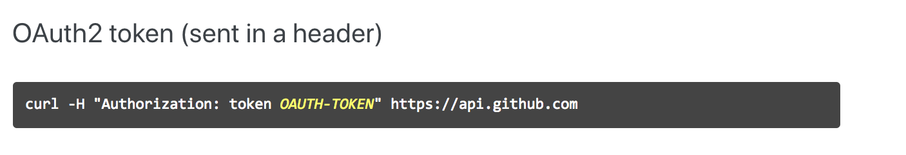
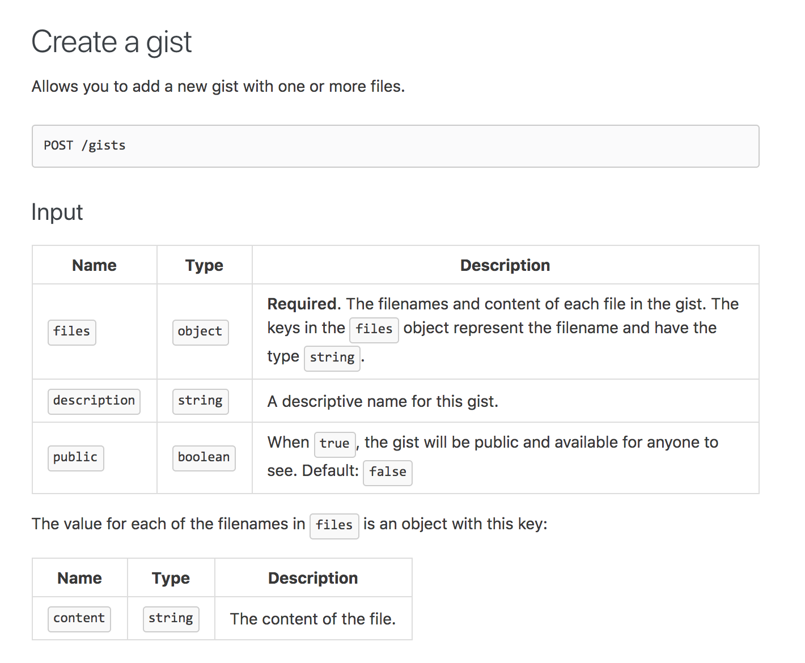
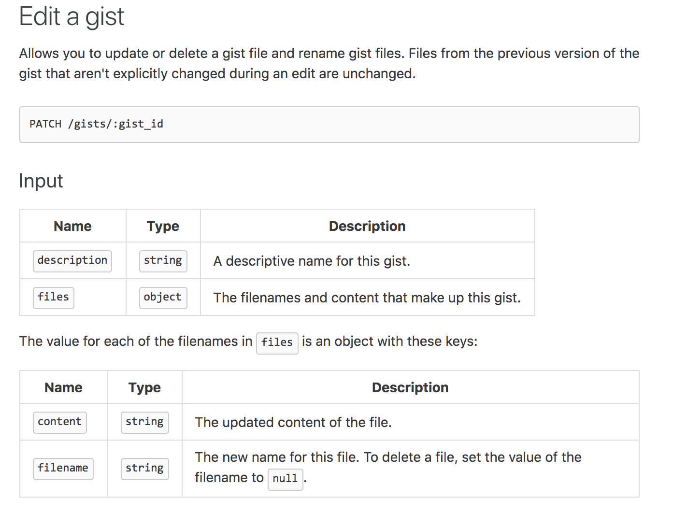

# Poglavlje 35: Izgradnja HTTP klijenta

[34 Referentne vrednosti][34] | [00 Sadržaj][00] | [36 Profilisanje programa][36]

**Šta ćete naučiti u ovom poglavlju?**

- Šta je klijent/server model?
- Kako kreirati HTTP klijent.
- Kako poslati HTTP zahteve.
- Kako dodati određene zaglavlja vašim zahtevima.

**Obrađeni tehnički koncepti**:

- Zaglavlje
- Klijent/Server
- HTTP

## Klijent / Server

**Primer 1**:

Zamislite da ste razvili Go program koji upravlja vašim slikama. Ovaj program upravlja vašom bibliotekom fotografija na vašem računaru. Možda želite da podelite te slike sa drugim članovima porodice; da biste to uradili, možete im poslati imejl sa svim vašim slikama u njemu. Ovo rešenje može biti nemoguće ako ste napravili deset hiljada slika.

Možete automatski otpremiti sadržaj na svoju omiljenu društvenu mrežu. Operacija može postati dugotrajna ako morate da to radite jednu po jednu sliku. Drugo rešenje bi moglo biti da direktno povežete svoj program sa sistemima društvenih mreža kako biste programski otpremali slike.

To možemo da uradimo uz pomoć API-ja koji je objavila društvena mreža. Možete da ubacite svoje slike u for petlju tako što ćete direktno pozvati njihov API.

U ovom slučaju, koristićete API. Vi ste klijent. Društvena mreža predstavlja server.

**Primer 2**:

Primanje i obrada plaćanja je težak zadatak. Velika većina veb-sajtova za elektronsku trgovinu koristiće dobavljača plaćanja. Veb-sajt će pozvati dobavljača plaćanja da bi pokrenuo plaćanja karticama. U ovom kontekstu, veb-sajt je klijent, a dobavljač plaćanja je server.

**Primer 3**:

Ako želite da integrišete vidžet koji prikazuje trenutnu temperaturu u San Francisku u svoju veb stranicu, možete napraviti API klijenta koji će zahtevati meteorološki API (server). Zatim će analizirati odgovor i na kraju ga prikazati na početnoj stranici vaše veb stranice.

### API poziv

Pozivanje API-ja znači slanje HTTP(s) zahteva veb serveru prateći preciznu dokumentaciju.

Termini klijent i server su važni i morate ih zapamtiti.

- Kao klijent koristimo (ili konzumiramo) API.
- Server je računarski program koji je dizajniran da prihvata i odgovara na API
  pozive klijenata.

## Šta je REST API

REST je skraćenica od "Representational State Transfer" (Prenos reprezentativnog stanja). Roj Filding je stvorio termin u svojoj doktorskoj disertaciji 2000. godine. Filding je želeo da razvije "model za modernu veb arhitekturu". On je predstavio REST, koji je "arhitektonski stil", skup arhitektonskih ograničenja za izgradnju mrežnih aplikacija.

Treba napomenuti da je Filding definisao koncept REST-a, ali mi smo koristili ta arhitektonska ograničenja pre njegove teze. REST se sada široko koristi u veb zajednici; čak smo izmislili i pridev za definisanje API-ja koji prate ovaj arhitektonski stil: RESTful.

Potrošač API-ja i njegov proizvođač (programeri koji stoje iza njega) mogu imati koristi od ovih ograničenja. Proizvođači API-ja prate smernice, ali su takođe slobodni da ignorišu ograničenja. S druge strane, potrošači API-ja mogu brže da grade softver jer su, na tehničkom nivou, API-ji izgrađeni prema istim standardima. Postoji mnoštvo biblioteka (modula) koje su slobodno dostupne za izgradnju serverskog ili klijentskog dela.

Koja su tačno ta ograničenja?

- **Komunikacija je bez stanja**: to znači da server ne čuva informacije o sesijama, svaki zahtev se
  tretira pojedinačno. Server ne pamti vaše prethodne zahteve. Stoga svaki zahtev može da sadrži sve potrebne informacije da bi ga server obradio.

- **Keširani odgovori**: odgovori koje je poslao server mogu se keširati da bi se koristili za
  kasnije zahteve.

- **Jedinstveni interfejs**: REST API-ji uvek imaju isti interfejs za korisnike. Ovaj jedinstveni
  interfejs je izgrađen prateći tri podograničenja:

  - **Identifikacija resursa**: Svaki resurs vaše usluge (porudžbina, proizvod, fotografija) je
    adresiran jedinstvenim identifikatorom resursa (URI).
    Na primer: <https://maximilien-andile.com/product/2> predstavlja URL adresu resursa proizvoda broj 2.
  - **Manipulacija resursima putem reprezentacija**: kada koristite API, manipulišete
    reprezentacijom resursa. Resurs može biti predstavljen kao JSON, XML, YAML...
  - **Samoopisne poruke**: poruke koje se razmenjuju između klijenta i servera moraju da sadrže sve
    potrebne informacije da bi se pravilno obradile, a ove informacije treba da se prenose na način koji klijenti i serveri mogu lako da razumeju. Da bi to uradili, kreatori API-ja koriste HTTP metode (norma HTTP 1.1 definiše osam metoda), HTTP zaglavlja, telo zahteva, ali i string upita.
  - **Hipermedija kao motor stanja aplikacije ( HATEOAS )**: veb server može slati linkove koji
    ukazuju na sam resurs ili na povezane resurse. Na primer, ako potrošač pošalje zahtev <https://maximilien-andile.com/product/2> za obijanje informacija o proizvodu 2, veb server takođe može poslati klijentu linkove do varijanti proizvoda (boja, veličina,...).

- **Slojeviti sistem**: prilikom izgradnje API-ja, možete imati poseban sistem za obradu
  autentifikacije vaših zahteva, drugu komponentu odgovornu za preuzimanje podataka u bazama podataka i formatiranje odgovora... Sa stanovišta klijenta, ti slojevi bi trebalo da budu nevidljivi.

- **Kod na zahtev**: ovo poslednje ograničenje je opciono i u stvarnosti se ne koristi intenzivno u
  industriji. Omogućava veb serveru da vraća skripte klijentima. Klijenti zatim mogu da izvršavaju te skripte u svom sistemu. Reklamna industrija mnogo koristi ovu funkciju; oni izlažu API-je za distribuciju Javascript ili HTML banera svojim klijentima.

## Osnovni HTTP klijent

Klijent je strana koja će poslati zahtev serveru.

Koristićemo standardni Go klijent. Da biste inicijalizovali HTTP klijent, jednostavno kreirajte promenljivu tipa: `net/httphttp.Client`.

```go
// consuming-api/simple/main.go
package main

import (
    "fmt"
    "io/ioutil"
    "net/http"
    "time"
)

func main() {
    c := http.Client{Timeout: time.Duration(1) * time.Second}
    resp, err := c.Get("https://www.google.com")
    if err != nil {
        fmt.Printf("Error %s", err)
        return
    }
    defer resp.Body.Close()
    body, err := ioutil.ReadAll(resp.Body)
    fmt.Printf("Body : %s", body)
}
```

Kada kreirate HTTP klijent, možete da navedete sledeće opcije:

- **Transport** (tip `http.RoundTripper`)  
  Možete da prilagodite način na koji će se vaši HTTP zahtevi izvršavati tako što ćete ovo polje podesiti na tip koji implementira interfejs tipa `http.RoundTripper`.

  - Ovo je napredna upotreba koja vam najčešće nije potrebna. Kada kreirate server, možete izostaviti ovaj parametar. U tom slučajuSE KORISTI `DefaultTransport`. Ako ste radoznali, njegov izvorni kod se nalazi ovde: <https://golang.org/src/net/http/transport.go>

- **CheckRedirect(tip func(req \*Request, via []\*Request))**  
  ovo polje možemo koristiti za definisanje funkcije koja će se pozivati svaki put kada se vaš zahtev preusmeri. Preusmeravanje se pokreće kada server pošalje poseban odgovor. Primljeni odgovor ima poseban kod (HTTP statusni kod) (pogledajte odeljak o osnovama HTTP-a da biste dobili više informacija o preusmeravanjima).

  - Slučaj upotrebe ovde je provera stvari pre nego što se dese preusmeravanja.

- **Jar(tip CookieJar)**  
  Pomoću ovog polja možete dodati kolačiće svom zahtevu. Kolačići se prosleđuju serveru. Sam server može dodati kolačiće zahtevu. Ti "dolazni kolačići" biće dodati u JAR datoteku.

  - Kolačić je podatak koji veb pregledači čuvaju na strani klijenta.
    - Kolačiće možete podesiti putem javaskript koda
    - Server ih takođe može podesiti putem određenog zaglavlja.

- **Timeout(tip time.Duration)**  
  Vaš klijent će otvoriti vezu sa serverom putem HTTP-a; serveru može biti potrebno neko vreme da odgovori na vaš zahtev. Ovo polje će definisati maksimalno vreme čekanja na odgovor. Ako ne navedete vremensko ograničenje, podrazumevano ga nema. Ovo može biti opasno za performanse vaše usluge koje korisnik doživljava. Bolje je, po mom mišljenju, prikazati grešku nego naterati korisnika da čeka beskonačno. Imajte na umu da ovo vreme uključuje:

  - Vreme povezivanja (vreme potrebno za povezivanje sa udaljenim serverom)
    - Vreme potrebno za preusmeravanja (ako ih ima)
    - Potrebno vreme za čitanje tela odgovora.

Pravimo HTTP klijent sa `DefaultTransport`, bez funkcije `CheckRedirect`, bez kolačića, ali sa vremenskim ograničenjem podešenim na `1` sekundu.

Sa tim klijentom možemo slati zahteve veb serveru. U našem primeru, pravimo http zahtev sa `GET` metodom ka URL-u <https://www.google.com>:

```go
resp, err := c.Get("https://www.google.com")
if err != nil {
    fmt.Errorf("Error %s", err)
    return
}
```

Imate sličan API za korišćenje HTTP `POST` metode:

```go
myJson := bytes.NewBuffer([]byte(`{"name":"Maximilien"}`))
resp, err := c.Post("https://www.google.com", "application/json", myJson)
if err != nil {
    fmt.Errorf("Error %s", err)
    return
}
```

Imajte na umu da u slučaju `POST` metode, pored URL-a, moramo definisati telo zahteva i tip sadržaja podataka. Telo zahteva su podaci koje šaljemo. Zašto jednostavno ne bismo stavili JSON string? Zašto koristimo `bytes.Buffer`? To je zato što ovaj argument mora da implementira interfejs `io.Reader`!

Da biste napravili `HEAD` zahtev, sintaksa je slična:

```go
resp, err = c.Head("https://www.google.com")
if err != nil {
    fmt.Errorf("Error %s", err)
    return
}
fmt.Println(resp.Header)
```

Imajte na umu da `HEAD` zahtev ne vraća telo. Međutim, vraća zaglavlja primljena kao odgovor. (ova metoda se koristi za testiranje URL-ova, da bi se proverilo da li su validni, dostupni ili nedavno izmenjeni).

Vratimo se na kraj našeg scenarija:

```go
defer resp.Body.Close()
body, err := ioutil.ReadAll(resp.Body)
fmt.Printf("Body : %s", body)
```

Telo funkcije zatvaramo kada se vrati sa `defer resp.Body.Close()`. `resp.Body` je tok podataka koje čita http klijent. Ne zaboravite da dodate ovu instrukciju za zatvaranje; u suprotnom, klijent možda neće ponovo koristiti potencijalnu trajnu vezu sa serverom (uporedite <https://golang.org/pkg/net/http/#Client.Do>).

## Zaglavlja zahteva

### Šta je zaglavlje zahteva

Zaglavlja zahteva, ili jednostavno zaglavlja, su polja koja su priložena zahtevu. Klijent (vaš program) može da koristi ta polja da bi preneo dodatne informacije serveru o zahtevu ili sebi.

Specifikacija HTTP 1/1 vam omogućava da koristite nekoliko polja zaglavlja. Evo kratkog spiska zaglavlja koja se uobičajeno koriste:

- **Content-Type**  
  Ukazuje serveru koju vrstu medija ćete preneti u zahtevu
  - Primer vrednosti: `application/json; charset=utf-8=>`  
    za JSON podatke kodirane u UTF-8

- **Content-Length**  
  Ovo je veličina poslate poruke (u bajtovima)
  - Primer vrednosti: 42

- **User-Agent**  
  Ime i verzija programa koji šalje zahtev.
  - Primer vrednosti:
    - curl/7.16.3 libcurl/7.16.3 OpenSSL/0.9.7l zlib/1.2.3  
      Ako koristite curl da biste izvršili svoj zahtev.
    - Mozilla/5.0 (Macintosh; Intel Mac OS X 10_15_7) AppleWebKit/537.36 (KHTML,
      like Gecko) Chrome/88.0.4324.182 Safari/537.36  
      Ako koristite Chrome na MacBook-u.

- **Accept**  
  Navedite koje vrste medija su prihvatljive za odgovor
  - Primer vrednosti:
    - \*/\*  
      Prihvataju se svi tipovi medija
    - application/json  
      Da prihvatate samo JSON

- **Accept-Encoding**  
  Navedite koje vrste kodiranja su prihvatljive u odgovoru.
  - Primer vrednosti  
    gzipgzip-ovani (komprimovani) sadržaj se prihvata

- **Authorization**  
  U ovom zaglavlju, pošiljalac može da navede svoje akreditive (API ključ, korisničko ime/lozinku, JWT...)
  - Primer vrednosti
    Bearer cGFydDJibGEcGFydDJibGEcGFydDJibGEcGFydDJibGE=.cGFydDJcGFydDJibGEcGFydDJibGEcGFydDJibGEibGE=.eW9sbcGFydDJibGEcGFydDJibGEcGFydDJibGEw==

### Kako dodati zaglavlje zahtevu

Da biste dodali zaglavlje, morate da napravite zahtev. To je opširnije, ali izgradnja metode vam omogućava veću kontrolu.

```go
// consuming-api/request-building/main.go
package main

import (
    "fmt"
    "io/ioutil"
    "net/http"
    "time"
)

func main() {

    c := http.Client{Timeout: time.Duration(1) * time.Second}
    req, err := http.NewRequest("GET", "http://www.google.fr", nil)
    if err != nil {
        fmt.Printf("error %s", err)
        return
    }
    req.Header.Add("Accept", `application/json`)
    resp, err := c.Do(req)
    if err != nil {
        fmt.Printf("error %s", err)
        return
    }
    defer resp.Body.Close()
    body, err := ioutil.ReadAll(resp.Body)
    fmt.Printf("Body : %s", body)
}
```

Moramo da kreiramo klijenta, a zatim da koristimo `http.NewRequest` metod koji ima sledeći potpis:

```go
(method, url string, body io.Reader) (*Request, error)
```

- Prvi parametar je metod koji može biti jedan od sledećih:
  - OPTIONS  
  - GET  
  - HEAD
  - POST
  - PUT
  - DELETE  
  - TRACE
  - CONNECT

- Zatim navodite URL.
- Telo je treći parametar ove metode. U našem slučaju, postavljamo ga na `nil` jer nemamo telo za slanje.

Metoda neće poslati zahtev, već će vratiti `http.Request`.

Sa `req.Header.Add` (gdeje "req" struktura tipa `http.Request`) možete dodati zaglavlje zahtevu:

```go
req.Header.Add("Accept", `application/json`)
```

> [!Note]
> **Headers**  
> Imajte na umu da se polje "Zaglavlje zahteva" nalazi "ispod haube", element
> tipa mape gde su ključevi stringovi, a vrednosti su isečci stringova: `map[string][]string`.

Zahtev se šalje sa `c.Do(req)`.

### Zaglavlja se automatski šalju

Go će automatski dodati neke zaglavlja vašim zahtevima:

Za standardni GET zahtev:

```go
c.Get("http://localhost:8091/status")
```

- Prihvati kodiranje: gzip
- Korisnički agent: Go-http-client/1.1

Za standardni POST zahtev:

```go
c.Post("http://localhost:8091/status", "application/json", bytes.NewBuffer([]byte("42")))
```

- Prihvati kodiranje: gzip
- Korisnički agent: Go-http-client/1.1
- Dužina sadržaja: 2
- Tip sadržaja: aplikacija/json

## Primer iz stvarnog sveta: Github API

### Prvi pozivi

U ovom odeljku ćemo napraviti HTTP klijent koji će slati zahteve Github API-ju. Github vam omogućava da delite kod i sarađujete na projektima kodiranja sa drugim programerima.

Githab pruža API za pretragu projekata, za dobijanje i ažuriranje problema određenog projekta... Mogućnosti koje otvara API Githaba su veoma velike.

Dokumentacija za Github API je dostupna na ovoj veb stranici: <https://developer.github.com/v3>

U ovom primeru, koristićemo v3 API.

Osnovni URL API-ja je <https://api.github.com/>; pokušajmo da izvršimo HTTP GET zahtev na njemu.

```go
// consuming-api/github/main.go 

c := http.Client{Timeout: time.Duration(1) * time.Second}
req, err := http.NewRequest("GET", "https://api.github.com/", nil)
if err != nil {
    fmt.Printf("error %s", err)
    return
}
req.Header.Add("Accept", `application/json`)
resp, err := c.Do(req)
if err != nil {
    fmt.Printf("error %s", err)
    return
}
defer resp.Body.Close()
body, err := ioutil.ReadAll(resp.Body)
if err != nil {
    fmt.Printf("error %s", err)
    return
}
fmt.Printf("Body : %s \n ", body)
fmt.Printf("Response status : %s \n", resp.Status)
```

Kada pokrenemo naš skript, dobijamo sledeći izlaz:

```sh
Body : {"current_user_url":"https://api.github.com/user", "current_user_authorizations_html_url":"https://github.com/settings/connections/applications{/client_id}",
...
}

 Response status: 200 OK
```

Telo odgovora je JSON. Imajte na umu da tri tačke znače da nisam odštampao celo telo odgovora. Statusni kod našeg odgovora je "200 OK", što znači da je naš zahtev bio uspešan.

Sadržaj tela poruke sugeriše da možemo da pingujemo GitHub API koristeći druge rute. Da bismo dobili trenutnog korisnika, možemo da zatražimo <https://api.github.com/user>. Hajde da pokušamo:

```go
req, err := http.NewRequest("GET", "https://api.github.com/user", nil)
```

Odgovor nije baš glamurozan:

```sh
Body : {"message":"Requires authentication","documentation_url":"https://developer.github.com/v3/users/#get-the-authenticated-user"}

Response status: 401 Unauthorized
```

Kod statusa je "401 Neovlašćeno". To znači da "zahtev zahteva autentifikaciju korisnika. Odgovor MORA da sadrži polje zaglavlja WWW-Authenticate (odeljak 14.47) koje sadrži izazov koji se odnosi na zahtevani resurs." [@fielding1999hypertext].

Naš traženi resurs (pregled detalja o trenutnom korisniku) zahteva da dokažemo svoj identitet. Da bismo to uradili, moramo se registrovati na Githabu. Ako već imate nalog na Githabu, samo idite na tu veb stranicu <https://github.com/settings/tokens>; ako nemate nalog, možete ga kreirati ako želite. Imajte na umu da možete pratiti tutorijal bez Githab naloga. Ideja je da imate ideju o tome kako da koristite API.

U većini slučajeva, dobavljači API-ja zahtevaju da se registrujete pre korišćenja njihovog API-ja kako bi kontrolisali ko ima pristup podacima.

### Ovlastite svoje zahteve

Idite na <https://github.com/settings/tokens>. Na ovoj stranici kliknite na dugme `“Generate new token”`.

Zatim će biti zatraženo da date ime svom ličnom tokenu i izaberete opsege koje će Github povezati sa vašim novim ličnim tokenom. Izbor opsega vam omogućava da ograničite upotrebu svog ličnog tokena. U našem primeru, izabrati ćemo samo "Gist". Objavljivanjem Gist-a možete deliti kod sa drugim korisnicima. Koristićemo Github API za kreiranje Gist-ova.

Kada dobijete svoj lični token, možete ga ubrizgati u svoje zahteve. Možda se pitate gde da ga stavim? Ako pratimo HTTP 1/1 RFC, onda ga moramo ubrizgati u polje zaglavlja "Authenticate". Uvek morate pročitati dokumentaciju API-ja jer ne postoji jedinstveni način za ubrizgavanje tokena za autorizaciju.

Dokumentacija Github API-ja navodi da treba da ubrizgamo token u Header `Authorization`:


Zaglavlje autorizacije GitHub API-ja

Hajde da pokušamo. Napravićemo isti poziv kao i pre, ali ovaj put ćemo koristiti zaglavlje za autentifikaciju kao što je predloženo u GitHub dokumentaciji:

```go
// current user
req, err = http.NewRequest("GET", "https://api.github.com/user", nil)
// TODO : handle error
req.Header.Add("Accept", `application/json`)
// add header for authentication
req.Header.Add("Authorization", fmt.Sprintf("token %s", os.Getenv("TOKEN"))
//...
```

Najvažniji red ove liste je:

```go
req.Header.Add("Authorization", fmt.Sprintf("token %s", os.Getenv("GITHUB_TOKEN"))
```

Imajte na umu da ne čuvamo pristupni token direktno u našem skriptu. Ovo je veoma loša ideja jer ako delite svoj kod, ne želite da vaše kolege programeri pristupe vašem Github nalogu.

Umesto toga, koristimo metod `Getenv` iz standardnog paketa `os` koji će preuzeti imena promenljivih okruženja TOKEN i analizirati ih. Imajte na umu da za rukovanje konfiguracijom možete koristiti i konfiguracionu datoteku. Postoje veoma popularni paketi koji obrađuju konfiguraciju umesto vas

Da biste programu prosledili promenljivu okruženja, samo je dodajte GITHUB_TOKEN=XXX ispred vaše komande:

```sh
GITHUB_TOKEN=aabbcc go run main.go
```

### Kriranje gista

Prvo što treba uraditi jeste da pročitate dokumentaciju. Možete zaključiti da ako želimo nešto da kreiramo, to će biti POST; URI može da sadrži gist, ali to je sve. Napravio sam snimak ekrana stranice dokumentacije:


POST /gists dokumentacija

Krajnja tačka je određena na sledeći način:

- HTTP glagol koji treba koristiti je POST
- Ulazni parametri su
  - files - što je objekat
  - description - string
  - public - što je bulova vrednost

Hajde da implementiramo ovaj poziv:

```go
// consuming-api/github-post-gist/main.go 

req, err := http.NewRequest("POST", "https://api.github.com/gists", bytes.NewBuffer(gistRequestJson))
if err != nil {
    fmt.Printf("%s", err)
    return
}
req.Header.Add("Accept", `application/json`)
// add header for authentication
req.Header.Add("Authorization", fmt.Sprintf("token %s", os.Getenv("TOKEN")))

resp, err := c.Do(req)
if err != nil {
    fmt.Printf("Error %s", err)
    return
}
```

Nisam ubacio tražene parametre da vidim kakvu ćemo poruku o grešci dobiti.

```sh
Body : {"message":"Invalid request.\n\nFor 'links/0/schema', nil is not an object.","documentation_url":"<https://developer.github.com/v3/gists/#create-a-gist>"}
 Response status: 422 Unprocessable Entity
```

Došlo je do greške; možda negde na Githab serveru postoji validator unosa koji kontroliše korisnički unos.

Parametri će biti preneti u telu zahteva. Parametri će biti kodirani u JSON formatu. Da bismo to uradili, kreiraćemo strukturu koja će sadržati parametre.

```go
type GistRequest struct {
    Files       map[string]File `json:"files"`
    Description string          `json:"description"`
    Public      bool            `json:"public"`
}
type File struct {
    Content string `json:"content"`
}
```

Ti tipovi struktura će sadržati parametre našeg zahteva:

```go
files := map[string]File{"main.go": File{"test"}}
gistRequest := GistRequest{
    Files:       files,
    Description: "this is a test",
    Public:      false}
```

Promenljiva `gistRequest` mora biti transformisana u validan JSON string:

```go
gistRequestJson, err := json.Marshal(gistRequest)
if err != nil {
    fmt.Printf("%s", err)
    return
}
```

Onda samo treba da popunimo telo našeg zahteva našim potpuno novim JSON-om. Ovde postoji samo mala poteškoća: `json.Marshal` vraća isečak bajtova. Potpis `NewRequest` je:

```go
func NewRequest(method, url string, body io.Reader) (*Request, error)
```

Telo treba da implementira interfejs tipa `io.Reader`.

Da biste to uradili, postoji jednostavan način, korišćenjem standardnog paketa `bytes`:

```go
bytes.NewBuffer(gistRequestJson)
```

Vraćena vrednost `bytes.NewBuffer` funkcije implements `io.Reader`.

Sada možemo pokrenuti zahtev:

```go
req, err := http.NewRequest("POST", "https://api.github.com/gists", bytes.NewBuffer(gistRequestJson))
req.Header.Add("Accept", `application/json`)
req.Header.Add("Authorization", fmt.Sprintf("token %s", os.Getenv("TOKEN")))
resp, err := c.Do(req)
//...
```

Odgovor je uspešan:

```go
Body : {"url":"https://api.github.com/gists/c960d211532f7c35aeb0c854892bf108",...}
 Response status : 201 Created
```

Gist je kreiran. URI ovog novog resursa se vraća u telu odgovora:
<https://api.github.com/gists/c960d211532f7c35aeb0c854892bf108>. To nije uvek slučaj jer API-ji ne prate striktno RFC preporuke. Nemojte se iznenaditi ako ne dobijete URI u odgovoru. Što se tiče statusa odgovora, on takođe nije uvek "201 Kreirano" već "200 U redu".

Većinu vremena morate da prilagodite svog klijenta API-ju koji integrišete. Kod statusa odgovora nije uvek isti; metod autentifikacije takođe može biti drugačiji.

### Ažuriranje gista

Kreirali smo resurs. Sada možemo pokušati da ga ažuriramo. Većinu vremena, resurs se ažurira pomoću HTTP PUT ili PATCH zahteva.

Hajde da pogledamo API dokumentaciju.


Ažuriranje dokumentacije za Gist API

Zahtev koristi PATCH metod. URL je "/gist/:gist_id", što znači da moramo da ga zamenimo ID-om gista koji želimo da izmenimo. U REST API svetu, svaki resurs ima identifikator, ovde u slučaju gista, ID je označen sa gist_id. U našem slučaju, gist_id je c960d211532f7c35aeb0c854892bf108. Dakle, URL zahteva će biti: "<https://api.github.com/gists/c960d211532f7c35aeb0c854892bf108>"

Parametri su isti kao i kod POST zahteva (za kreiranje gista). Sledeći kod će kreirati telo zahteva:

```go
// consuming-api/github-patch-gist/main.go 

files := map[string]File{"main.go": File{"test updated"}}
gistRequest := GistRequest{
    Files:       files,
    Description: "this is a test",
    Public:      false}
gistRequestJson, err := json.Marshal(gistRequest)
if err != nil {
    fmt.Printf("%s", err)
    return
}
```

Ovde samo ažuriramo sadržaj datoteke "main.go" koji će postati "testno ažuriran". Sledeće što treba uraditi je da izgradimo http klijent, kreiramo zahtev, izvršimo ga i prikažemo rezultat.

```go
// consuming-api/github-patch-gist/main.go 

c := http.Client{Timeout: time.Duration(4) * time.Second}

req, err := http.NewRequest("PATCH", "https://api.github.com/gists/79c9cec21a116f6ee166fd73ba750565", bytes.NewBuffer(gistRequestJson))
if err != nil {
    fmt.Printf("%s", err)
    return
}
req.Header.Add("Accept", `application/json`)
// add header for authentication
req.Header.Add("Authorization", fmt.Sprintf("token %s", os.Getenv("TOKEN")))

resp, err := c.Do(req)
if err != nil {
    fmt.Printf("Error %s", err)
    return
}
defer resp.Body.Close()
body, err := ioutil.ReadAll(resp.Body)
fmt.Printf("Body : %s \n ", body)
fmt.Printf("Response status : %s \n", resp.Status)
```

Rezultat izvršenja je:

```go
Body : {"url":"https://api.github.com/gists/c960d211532f7c35aeb0c854892bf108",...}
 Response status : 200 OK
```

Status odgovora 200 ukazuje da je server ispravno obradio zahtev.

Na GitHub gist veb-sajtu, naš gist je ažuriran!

### Brisanje gista

Brisanje resursa pomoću veb servisa je uobičajen zadatak. Metoda http zahteva za to je obično DELETE. Dokumentacija Github API-ja je prilično jednostavna.

Kod je jednostavniji od prethodnog zahteva jer ne moramo da uključimo telo:

```go
// consuming-api/github-gist-delete/main.go 

c := http.Client{Timeout: time.Duration(4) * time.Second}
req, err := http.NewRequest("DELETE", "https://api.github.com/gists/79c9cec21a116f6ee166fd73ba750565", nil)
if err != nil {
    fmt.Printf("Error %s", err)
    return
}
req.Header.Add("Accept", `application/json`)
// add header for authentication
req.Header.Add("Authorization", fmt.Sprintf("token %s", os.Getenv("TOKEN")))

resp, err := c.Do(req)
if err != nil {
    fmt.Printf("Error %s", err)
    return
}
defer resp.Body.Close()
body, err := ioutil.ReadAll(resp.Body)
if err != nil {
    fmt.Printf("Error %s", err)
    return
}
fmt.Printf("Body : %s \n ", body)
fmt.Printf("Response status : %s \n", resp.Status)
```

Rezultat izvršenja prikazuje prazno telo i kod statusa odgovora jednak `204 Bez sadržaja`:

```sh
Body :

Response status : 204 No Content
```

Kod statusa odgovora je 2... što znači da je naš zahtev bio uspešan. Obrisali smo naš gist.

## Testirajte sebe

1. Tačno ili netačno. Server je odgovoran za slanje zahteva klijentu.

   - Netačno
   - Server prima i obrađuje zahteve; klijent šalje zahteve.

2. Navedite dva arhitektonska ograničenja REST API-ja (kako je definisano u tezi Roja Fildinga).

   - Apatrid
   - Odgovori se mogu keširati
   - Jedinstveni interfejs
   - Slojeviti sistemi
   - Kod na zahtev

3. Kako kreirati osnovni HTTP klijent sa vremenskim ograničenjem od 3 sekunde?

   ```go
   c := http.Client{Timeout:1 * time.Second}
   ```

4. U koji zaglavak možete da stavite korisničke akreditive?

   - U Authorization zaglavlju

5. Ako pošaljete POST zahtev sa podrazumevanim Go, http klijentom, koji zaglavci su već podešeni?

   - Korisnički agent
   - Dužina sadržaja
   - Tip sadržaja
   - Accept-Encoding

## Ključno

- U klijent/server modelu, klijent zahteva resurs (ili uslugu). Server obezbeđuje pristup ovom resursu.
- Server prima i obrađuje zahteve; klijent šalje zahteve.
- Serveri se takođe nazivaju proizvođači. Klijenti se takođe nazivaju potrošači.
- Roj Filding je razvio termin REST API u svojoj doktorskoj disertaciji
- Roj Filding je definisao neka arhitektonska ograničenja koja se koriste za izgradnju RESTful API-ja.
- Da biste kreirali HTTP klijent, inicijalizujte promenljivu tipa http.Client
  
  ```go
  c := http.Client{Timeout:1 * time.Second}
  ```
  
  Zatim možete koristiti klijenta za slanje zahteva:

  ```go
  // Send simple GET and POST requests
  res, err := c.Get("http://localhost:8091/status")
  //....
  res, err = c.Post("http://localhost:8091/status", "application/json", bytes.NewBuffer([]byte("42")))
  
  // Build more complex requests
  req, err := http.NewRequest("HEAD", "http://localhost:8091/status", nil)
  //....
  req.Header.Add("Accept", `application/json`)
  // send the requests
  c.Do(req)
  ```

- Podrazumevano, klijent nema podešeno vreme čekanja. Važno je da u vašoj aplikaciji uvek konfigurišete ovu opciju (postavite polje Timeoutsa odgovarajućim trajanjem).
- Možete dodati dodatne zaglavlje zahtevu pomoćurequest.Header.Add.

[34 Referentne vrednosti][34] | [00 Sadržaj][00] | [36 Profilisanje programa][36]

[34]: 35_Izgradnja_HTTP_klijenta.md
[00]: 00_Sadržaj.md
[36]: 36_Profilisanje_programa.md
