# Poglavlje 37: Kontekst

[36 Profilisanje programa][36] | [00 Sadržaj][00] | [38 Generici][38]

**Šta ćete naučiti u ovom poglavlju?**

- Šta je kontekst?
- Šta je povezana lista?
- Kako se koristi kontekstni paket.

**Obrađeni tehnički koncepti**:

- Izvođenje konteksta
- Povezana lista
- Kontekstualni par ključ/vrednost
- Otkazivanje
- Tajm-aut
- Rok

## Uvod

Ovo poglavlje je posvećeno `context` paketu. U prvom delu ovog poglavlja, otkrićemo šta je "kontekst" i koje su njegove svrhe. U drugom delu, videćemo kako možemo koristiti kontekstni paket u programima iz stvarnog života.

## Šta je kontekst orijentisano programiranje

### Definicija

Kontekst potiče od latinske reči "contexo". Znači ujediniti, povezati, povezati nešto sa grupom drugih stvari. Ovde imamo ideju da je kontekst nečega skup veza i konekcija sa drugim stvarima. U svakodnevnom jeziku koristimo izraze poput:

- Izvuci nešto iz konteksta.
- U kontekstu nečega.

Stvari, radnje, reči imaju kontekst, imaju veze sa drugim stvarima. A ako nešto izvadimo iz konteksta, svodimo to na nešto što možemo pogrešno razumeti. Kontekst je skup informacija koje poboljšavaju odluke. Šta je deo konteksta? Evo delimične liste:

- Lokacija
- Datum
- Istorija
- LJudi

Da bismo bolje razumeli zašto nam je kontekst važan, uzmimo nekoliko primera:

### Kontekst poboljšava razumevanje događaja

Zamislite da tokom šetnje čujete razgovor između dve osobe:

> Alisa: Jesi li gledao utakmicu prošle nedelje?  
> Bob: Da!  
> Alisa: Posle ovoga, sigurna sam da će pobediti sledeću!  
> Bob: Naravno, kladim se u hiljadu na to.  

Oni govore o "utakmici". Tim je pobedio u utakmici prošle nedelje i ima velike šanse da pobedi u još jednoj utakmici sledeće nedelje. Mi nemamo pojma o kojoj ekipi i kojoj vrsti sporta se radi.

Kontekst razgovora može nam pomoći da ga razumemo. Ako se razgovor vodi u NJujorku, možemo pretpostaviti da ima veze sa bejzbolom ili košarkom jer su ti sportovi tamo veoma popularni. Ako se ovaj razgovor vodi u Parizu, verovatnoća da govore o fudbalu je veoma velika.

Ono što ovde radimo jeste da dodajemo kontekst da bismo nešto razumeli. Ovde smo govorili o mestu. Takođe možemo dodati vremenski faktor u kontekst razgovora. Ako znamo kada se to dogodilo, moći ćemo da pregledamo sportske rezultate nedelje da bismo bolje razumeli.

### Ponašanja usled promene konteksta

Analiza konteksta događaja promeniće ponašanje aktera. Pokušajte da odgovorite na neka od tih pitanja:

- Da li imate bolje manire kada ste u svojoj zemlji ili u drugoj zemlji?
- Da li koristite isti nivo jezika u kancelariji i sa porodicom?
- Da li se oblačite kao i svaki dan kada idete na razgovor za posao?

Odgovor na ova tri pitanja je verovatno "Ne". To je zbog konteksta. Ponašamo se drugačije u zavisnosti od konteksta. Kontekst utiče na naše ponašanje. Okruženje utiče na naše postupke i reakcije.

### Kontekst u računarstvu

Obično dizajniramo računarske programe da izvršavaju unapred definisani zadatak. Specifikovane rutine koje smo implementirali uvek se izvršavaju na isti način. Program se ne menja u zavisnosti od korisnika koji ga koristi. NJegovo ponašanje se ne menja kada se promeni njegovo okruženje.

Ideja kontekstno orijentisanog programiranja je da se uvedu varijacije u programe koje su pod uticajem konteksta. Abovd daje zanimljivu definiciju konteksta 1999. godine: "Kontekst je bilo koja informacija koju možemo koristiti za karakterizaciju situacije entiteta. Entitet je osoba, mesto ili objekat koji se smatra relevantnim za interakciju između korisnika i aplikacije, uključujući i samog korisnika i aplikacije.".

Implicitne i eksplicitne informacije su gradivni blokovi konteksta. Programeri bi trebalo da uzmu u obzir kontekst kako bi napravili aplikacije koje mogu da prilagode svoje ponašanje tokom izvršavanja.

Šta znači biti inteligentan? Reč "inteligencija" potiče od latinskog korena "intellego" što znači razaznati, razotkriti, primetiti, shvatiti. Nešto je inteligentno ako može da razazna i razume. Uvođenje konteksta u aplikacije ih ne čini inteligentnim, ali ih čini svesnim svog okruženja i svojih korisnika.

## Paket "context": istorija i slučajevi upotrebe

### Istorija paketa

Ovaj paket su prvobitno interno razvili programeri kompanije Google. Uveden je u standardnu biblioteku jezika Go. Pre toga, bio je dostupan u Go podrepozitorijumima.

### Upotreba

Paket `context` ima dve glavne upotrebe:

#### Širenje otkazivanja

Da bismo razumeli ovu upotrebu, uzmimo primer izmišljene građevinske kompanije pod nazivom FooBar.

Grad Pariz je angažovao ovu kompaniju da izgradi džinovski bazen. Gradonačelnik Pariza je branio njihovu ideju među predstavnicima stanovništva i projekat je odobren. Kompanija počinje da radi na projektu; rukovodilac projekta je naručio sve sirovine potrebne za izgradnju bazena. Prošla su četiri meseca, ali se gradonačelnik promenio i projekat je otkazan!

Rukovodilac projekta iz FooBara je ljut; kompanija mora da otkaže 156 porudžbina. Počinje ih otkazuje telefonom jednu po jednu. Neki od njih su takođe naručili sirovine od drugih građevinskih kompanija. Svi pate od ove brze evolucije situacije.

Sada zamislimo da rukovodilac projekta ne otkazuje porudžbine podizvođača. Ostale kompanije će proizvesti željenu robu, ali neće biti plaćene. To je veliko rasipanje resursa.

Kao što možete da vidite na slici, otkazivanje projekta se širi na sve radnike koji su indirektno bili uključeni. Gradsko veće otkazuje projekat; kompanija FooBar takođe otkazuje porudžbine izvođačima radova.

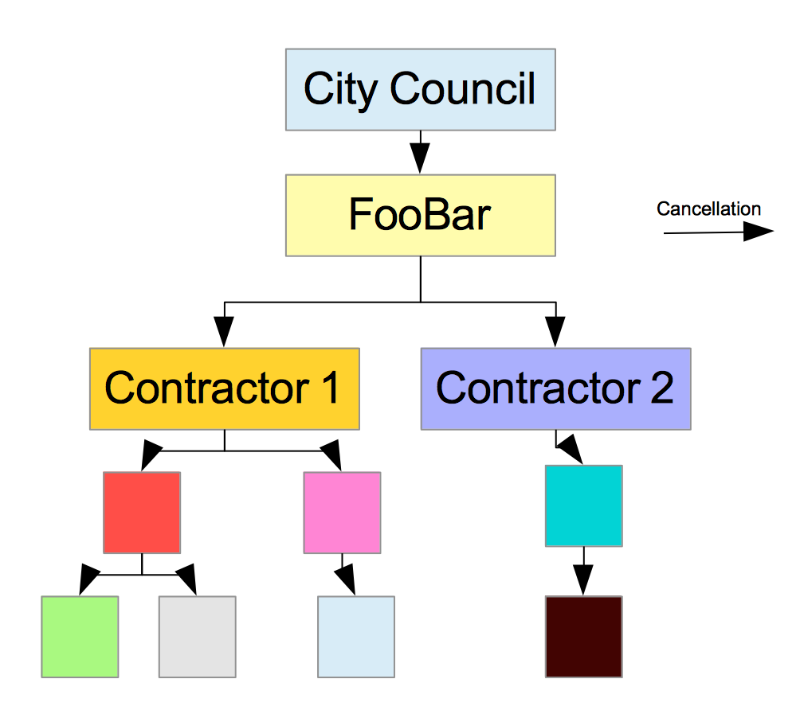
Širenje otkazivanja

U građevinarstvu i drugim ljudskim aktivnostima, uvek imamo način da otkažemo rad. Možemo uvesti politiku otkazivanja u naše programe pomoću kontekstnog paketa. Kada se zahtev uputi veb serveru, možemo otkazati ceo lanac rada ako je klijent prekinuo vezu!

#### Prenos podataka u okviru zahteva zajedno sa stekom poziva

Kada se zahtev uputi veb serveru, funkcija veb servera odgovorna za njegovu obradu neće sama obaviti posao. Zahtev će proći kroz lanac funkcija i metoda, a zatim će biti poslat odgovor. Jedan zahtev može generisati nove zahteve drugim mikroservisima u mikroservisnoj arhitekturi! Ovaj lanac poziva funkcije je "stek poziva". U ovom odeljku ćemo videti zašto može biti korisno prenositi podatke zajedno sa stekom poziva.

Uzmimo još jedan primer: razvoj veb servera za aplikaciju za kupovinu. Imamo korisnika koji interaguje sa našom aplikacijom.

- Korisnik će otići na stranicu za prijavu pomoću svog veb pregledača
- Popuniti svoje podatke za prijavu
- Veb pregledač će poslati zahtev za autentifikaciju serveru koji će proslediti zahtev servisu za
  autentifikaciju
- Server će kreirati stranicu "Moj nalog" (na primer, putem šablona) i poslati odgovor korisniku.
- Ako korisnik zatraži stranicu "Poslednje porudžbine", server će morati da pozove servis za
  porudžbine da bi ih preuzeo.

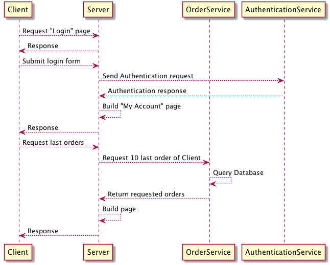
Sekvenca primene

Koje podatke možemo dodati našem kontekstu?

- Možemo da uzmemo u obzir tip uređaja koji je poslao zahtev.
  - Ako je uređaj mobilni telefon, možemo da izaberemo da učitamo lagani šablon kako bismo
    poboljšali korisničko iskustvo.
  - Servis za naručivanje takođe može da učita samo poslednjih pet narudžbi kako bi se smanjilo
    vreme prikazivanja stranice.
- Možemo zadržati ID u kontekstu autentifikovanog korisnika.
- Takođe možemo zadržati IP adresu dolaznog zahteva.
  - Sloj autentifikacije može ga koristiti za blokiranje sumnjivih aktivnosti (uvođenje liste
    blokiranih, otkrivanje lažnih, višestrukih pokušaja prijavljivanja)
- Još jedan veoma čest slučaj upotrebe je generisanje jednog ID-a zahteva. ID zahteva se
  prosleđuje svakom sloju aplikacije. Sa ID-om zahteva, tim koji će se baviti održavanjem moći će da prati zahtev u logovima.

#### Postavka rokova i vremenskih ograničenja

Rok je vreme u kojem zadatak treba da bude završen. Vremensko ograničenje je veoma sličan pojam. Umesto da razmatramo precizan datum i vreme u kalendaru, razmatramo maksimalno dozvoljeno trajanje. Možemo koristiti kontekst da definišemo vremenski rok za dugotrajne procese.

Evo primera:

- Razvijate server, a vaš klijent ima određeno vreme čekanja od 1 sekunde.
- Možete postaviti kontekst sa vremenskim ograničenjem od 1 sekunde; nakon ovog trajanja, znaćete
  da će klijent prekinuti vezu.
- U ovom slučaju, ponovo, želimo da izbegnemo rasipanje resursa.

## Context interfejs

Kontekst paket otkriva interfejs koji se sastoji od četiri metode:

```go
type Context interface {
    Deadline() (deadline time.Time, ok bool)
    Done() <-chan struct{}
    Err() error
    Value(key interface{}) interface{}
}
```

U sledećem odeljku ćemo videti kako se koristi paket.

### Povezana lista

Context paket je izgrađen sa standardnom strukturom podataka: povezanom listom. Da bismo u potpunosti razumeli kako kontekst funkcioniše, prvo moramo da razumemo povezane liste.

Povezana lista je kolekcija elemenata podataka. Tip podataka sačuvanih u listi nije ograničen; mogu biti celi brojevi, stringovi, strukture, brojevi sa pokretnim zarezom... itd. Svaki element liste je čvor. Svaki čvor sadrži dve stvari:

- Vrednost podataka
- Adresa u memoriji sledećeg elementa na listi. Drugim rečima, ovo je pokazivač na sledeću
  vrednost.

Lista je "povezana", čvorovi u listi imaju dete (sledeći element u listi) i roditelja (prethodni element u listi). Treba napomenuti da ova opaska nije tačna; prvi čvor u listi nema roditelja. To je koren, poreklo, glava liste. Postoji još jedan značajan izuzetak, poslednji čvor nema dete.

### Osnovni kontekst: Background

U većini programa, kreiramo koncept pozadine (`Background`) u korenu našeg programa. Na primer, u funkciji `main` koja će pokrenuti našu aplikaciju. Da biste kreirali korenski kontekst, možete koristiti sledeću sintaksu:

```go
ctx := context.Background()
```

Poziv funkcije `Background()` će vratiti pokazivač na prazan kontekst. Interno, poziv funkcije `Background()` će kreirati novi `context.emptyCtx`.

Ovaj tip nije izložen:

```go
type emptyCtx int
```

Osnovni tip `emptyCtx` je `int`. Ovaj tip implementira četiri metode koje su potrebne interfejsu `Context`:

```go
func (*emptyCtx) Deadline() (deadline time.Time, ok bool) {
    return
}

func (*emptyCtx) Done() <-chan struct{} {
    return nil
}

func (*emptyCtx) Err() error {
    return nil
}

func (*emptyCtx) Value(key interface{}) interface{} {
    return nil
}
```

Imajte na umu da tip `emptyCtx` takođe implementira interfejs `fmt.Stringer`. Ovo nam omogućava da uradimo `fmt.Println(ctx)`:

```go
fmt.Println(reflect.TypeOf(ctx))      // *context.emptyCtx
fmt.Println(ctx)                      // context.Background
```

### Dodajte kontekst svojoj funkciji/metodi

Kada se kreira korenski kontekst, možemo ga proslediti funkcijama ili metodama.

Ali pre toga, moramo našoj funkciji dodati parametar konteksta:

```go
func foo1(ctx context.Context, a int) {
    //...
}
```

U prethodnom navedenom tekstu, navodimo dva Go idioma koja se široko koriste unutar Go projekata:

- Kontekst je prvi argument funkcije,
- Argument konteksta je imenovan ctx.

### Izvođenje konteksta

U prethodnom odeljku smo kreirali naš korenski kontekst. Ovaj kontekst je prazan; ne radi ništa. Ono što možemo da uradimo jeste da izvedemo drugi podređeni kontekst iz našeg praznog konteksta:

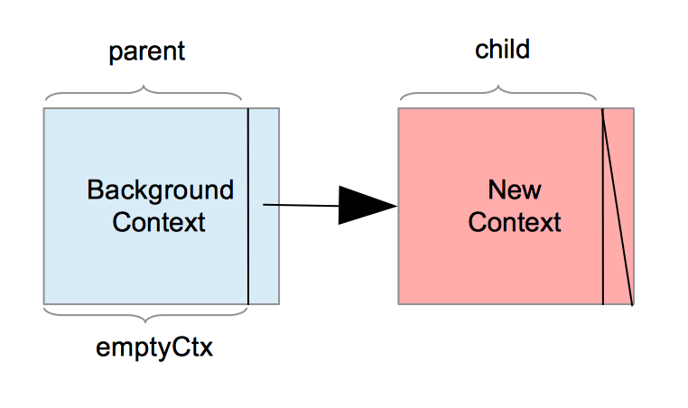
Izvođenje konteksta

Da biste izveli kontekst, možete koristiti sledeće funkcije:

- `WithCancel`
- `WithTimeout`
- `WithDeadline`
- `WithValue`

#### WithCancel

Funkcija `WithCancel` prihvata samo jedan argument pod nazivom `parent`. Ovaj argument predstavlja kontekst koji želimo da izvedemo. Kreiraćemo novi kontekst, a roditeljski kontekst će zadržati referencu na ovaj novi podređeni kontekst.

Hajde da pogledamo potpis funkcije `WithCancel`:

```go
func WithCancel(parent Context) (ctx Context, cancel CancelFunc)
```

Ova funkcija vraća sledeći podređeni kontekst i `CancelFunc`. `CancelFunc` je prilagođeni tip kontekstnog paketa:

```go
type CancelFunc func()
```

`CancelFunc` je imenovani tip, njegov osnovni tip je `func()`. Ova funkcija "kaže operaciji da napusti svoj rad". Pozivanje `WithCancel` će nam dati način da otkažemo operaciju. Evo kako da kreirate izvedeni kontekst:

```go
ctx, cancel := context.WithCancel(context.Background())
```

Da biste otkazali operaciju, potrebno je da pozovete funkciju `cancel`:

```go
cancel()
```

#### WithTimeout / WithDeadline

Tajm-aut je maksimalno vreme koje je potrebno procesu da se normalno završi. Za svaki proces
čije je izvršavanje potrebno promenljivo vreme, možemo dodati tajm-aut, tj. fiksno vreme dozvoljeno za čekanje. Bez tajm-auta, naša aplikacija može beskonačno čekati da se proces završi.

```go
ctx, cancel := context.WithTimeout(context.Background(), 3*time.Second)
```

`Deadline` ( rok ) je određena vremenska tačka. Kada postavite rok, navodite da proces neće
prekoračiti taj rok.

```go
deadline := time.Date(2021, 12, 12, 3, 30, 30, 30, time.UTC)
ctx, cancel := context.WithDeadline(context.Background(), deadline)
```

## Primer upotrebe

### Bez konteksta

Uzmimo primer: dizajniraćemo aplikaciju koja mora da napravi HTTP zahtev veb serveru da bi dobila podatke, a zatim ih prikazala korisniku. Prvo ćemo razmotriti aplikaciju bez konteksta, a zatim ćemo joj dodati kontekst.

#### Klijent

```go
package main

import (
    "log"
    "net/http"
)

func main() {
    req, err := http.NewRequest("GET", "http://127.0.0.1:8989", nil)
    if err != nil {
        panic(err)
    }
    resp, err := http.DefaultClient.Do(req)
    if err != nil {
        panic(err)
    }
    log.Println("resp received", resp)
}
```

Ovde imamo jednostavan http klijent. Kreiramo GET zahtev koji će pozvati <http://127.0.0.1:8989>. Ako ne možemo da kreiramo zahtev, pravimo da naš program paniči. Zatim koristimo podrazumevani HTTP klijent ( `http.DefaultClient` ) da pošaljemo zahtev serveru ( metodom `Do` ).

Dobijeni odgovor se zatim štampa korisniku.

#### Server

Podesili smo našeg klijenta. Sada moramo da podesimo naš lažni server.

```go
package main

import (
    "fmt"
    "log"
    "net/http"
    "time"
)

func main() {
    http.HandleFunc("/", func(w http.ResponseWriter, r *http.Request) {
        log.Println("request received")
        time.Sleep(time.Second * 3)
        fmt.Fprintf(w, "Response") // send data to client side
        log.Println("response sent")

    })
    err := http.ListenAndServe("127.0.0.1:8989", nil) // set listen port
    if err != nil {
        panic(err)
    }
}
```

Kod je jednostavan. Prvo počinjemo podešavanjem našeg http obrađivača pomoću funkcije `http.HandleFunc`. Ova funkcija uzima dva parametra, putanju i funkciju koja će odgovarati na zahteve.

Čekamo 3 sekunde sa instrukcijom `time.Sleep(time.Second * 3)`, a zatim pišemo odgovor. Ovo spavanje je ovde da bi se lažiralo vreme potrebno serveru da odgovori. U ovom slučaju, odgovor je jednostavno "Response".

Zatim pokrećemo naš server koji će slušati 127.0.0.1:8989 (localhost, port 8989).

#### Test

Prvo pokrećemo server; zatim pokrećemo klijenta. Nakon 3 sekunde, klijent je dobio odgovor.

```sh
$ go run server.go
2019/04/22 12:17:11 request received
2019/04/22 12:17:14 response sent

$ go run client.go
2019/04/22 12:17:14 resp received &{200 OK 200 HTTP/1.1 1 1 map[Content-Length:[8] Content-Type:[text/plain; charset=utf-8] Date:[Mon, 22 Apr 2019 10:17:14 GMT]] 0xc000132180 8 [] false false map[] 0xc00011c000 <nil>}
```

Kao što vidite, naš klijent mora da se nosi sa latencijom od 3 sekunde. Povećajmo ovo u serverskom kodu; recimo da sada spavamo 1 minut. Naš klijent će čekati 1 minut; blokiraće klijentsku aplikaciju na 1 minut.

Ovde možemo primetiti da je naša klijentska aplikacija osuđena da čeka server čak i ako to traje beskonačno dugo. Ovo nije baš dobar dizajn. Korisnik neće biti srećan da beskonačno čeka na odgovor aplikacije. Po mom mišljenju, bolje je reći korisniku da se nešto pogrešno desilo nego ga pustiti da čeka beskonačno.

### Kontekst na strani klijenta

Zadržaćemo osnovu koda koju smo prethodno kreirali. Počećemo kreiranjem korenskog konteksta:

```go
rootCtx := context.Background()
```

Zatim ćemo izvesti ovaj kontekst u novi pod nazivom "ctx":

```go
ctx, cancel := context.WithTimeout(rootCtx, 50*time.Millisecond)
```

- Funkcija WithTimeout prima dva argumenta, kontekst i time.Duration.
- Drugi argument je trajanje vremenskog ograničenja.
- Ovde smo ga postavili na 50 milisekundi.
- Predlažem da kreirate konfiguracionu promenljivu u aplikaciji iz stvarnog sveta koja će čuvati
  trajanje tajm-auta. Na taj način ćete izbeći potrebu za ponovnim kompajliranjem programa radi promene tajm-auta.

`context.WithTimeout` vratiće:

- izvedeni kontekst
- funkciju otkazivanja

Funkcija `cancel` može se pozvati da upozori podproces da treba da prekine ono što radi. Pozivanje funkcije `cancel` će osloboditi resurse koji su povezani sa kontekstom. Da bismo bili sigurni da će funkcija `cancel` biti pozvana na kraju našeg programa, koristićemo naredbu `defer`:

```go
defer cancel()
```

Sledeći korak se sastoji od kreiranja zahteva i dodavanja našeg novog konteksta:

```go
req, err := http.NewRequest("GET", "http://127.0.0.1:8989", nil)
if err != nil {
    panic(err)
}
// add context to our request
req = req.WithContext(ctx)
```

Ostali redovi su isti kao i verzija bez konteksta.

Evo kompletnog klijentskog koda:

```go
// context/client-side/main.go
package main

import (
    "context"
    "fmt"
    "net/http"
    "time"
)

func main() {
    rootCtx := context.Background()
    req, err := http.NewRequest("GET", "http://127.0.0.1:8989", nil)
    if err != nil {
        panic(err)
    }
    // create context
    ctx, cancel := context.WithTimeout(rootCtx, 50*time.Millisecond)
    defer cancel()
    
    // attach context to our request
    req = req.WithContext(ctx)
    resp, err := http.DefaultClient.Do(req)
    if err != nil {
        panic(err)
    }
    fmt.Println("resp received", resp)
}
```

Sada hajde da testiramo našeg novog klijenta. Evo logova servera:

```sh
2019/04/24 00:52:08 request received
2019/04/24 00:52:11 response sent
```

Vidimo da smo primili zahtev i poslali odgovor 3 sekunde kasnije. Evo logova našeg klijenta:

```sh
panic: Get http://127.0.0.1:8989: context deadline exceeded
```

Vidimo da `http.DefaultClient.Do` je vratila error.

- U tekstu se kaže da je rok prekoračen.
- Naš zahtev je otkazan jer je našem serveru trebalo 3 sekunde da obavi svoj posao. Čak i ako je
  klijent otkazao zahtev, server je nastavio da obavlja posao. Moramo pronaći način da podelimo taj kontekst između klijenta i servera.

### Kontekst na strani servera

#### Zaglavlja

HTTP zahtev se sastoji od skupa zaglavlja, tela i niza upita. Kada pošaljemo zahtev, Go neće preneti nikakve informacije o kontekstu zahteva.

Ako želite da vizualizujete zaglavlja zahteva, možete dodati sledeće linije u kod servera:

```go
fmt.Println("headers :")
for name, headers := range r.Header {
    for _, h := range headers {
        fmt.Printf("%s: %s\n", name, h)
    }
}
```

Ponavljamo zaglavlja zahteva pomoću petlje i ispisujemo ih. Evo zaglavlja koja se prenose sa našim klijentom:

```sh
headers :
  User-Agent: Go-http-client/1.1
  Accept-Encoding: gzip
```

Imamo samo dva zaglavlja. Prvi daje više informacija o korišćenom klijentu. Drugi obaveštava server da klijent može da prihvati `gzip` podatke. Ništa o eventualnom isteku vremena.

Ali ako pogledamo objekat `http.Request`, možemo primetiti da postoji metoda pod nazivom `Context()`. Ova metoda će preuzeti kontekst zahteva. Ako nije definisan, vratiće prazan kontekst:

```go
func (r *Request) Context() context.Context {
    if r.ctx != nil {
        return r.ctx
    }
    return context.Background()
}
```

U dokumentaciji se navodi da se "kontekst otkazuje kada se klijentska veza zatvori". To znači da se unutar implementacije go servera, kada se klijentska veza zatvori, poziva funkcija otkazivanja `cancel()`.

To znači da unutar našeg servera moramo da slušamo kanal koji vraća `ctx.Done()`. Kada primimo poruku na tom kanalu, moramo da zaustavimo ono što trenutno radimo.

#### Funkcija doWork

Da vidimo kako da to uvedemo na naš server.

Na primer, uvešćemo novu funkciju `doWork`. Ona će predstavljati zadatak koji zahteva mnogo računarskih resursa, a koji obrađuje naš server. Ovo `doWork` je rezervisano mesto za operaciju koja zahteva mnogo procesorskih resursa.

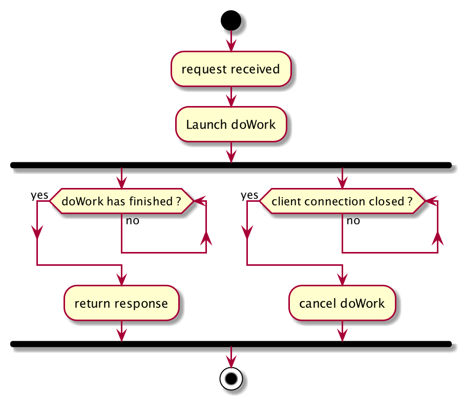  
Rukovalac HTTP servera sa dijagramom aktivnosti konteksta

Funkciju `doWork` ćemo pokrenuti u posebnoj gorutini. Ova funkcija će kao parametar uzeti kontekst i kanal gde će upisati svoj rezultat. Pogledajmo kod ove funkcije:

```go
// context/server-side/main.go 
//...

func doWork(ctx context.Context, resChan chan int) {
    log.Println("[doWork] launch the doWork")
    sum := 0
    for {
        log.Println("[doWork] one iteration")
        time.Sleep(time.Millisecond)
        select {
        case <-ctx.Done():
            log.Println("[doWork] ctx Done is received inside doWork")
            return
        default:
            sum++
            if sum > 1000 {
                log.Println("[doWork] sum has reached 1000")
                resChan <- sum
                return
            }
        }
    }

}
```

U ovoj funkciji, koristićemo kanal za komunikaciju sa pozivaocem. Kreiraćemo `for` petlju, a unutar te petlje ćemo staviti `select` naredbu. U ovoj `select` naredbi imamo dva slučaja:

- Kanal koji je vratio `ctx.Done()` je zatvoren. To znači da smo dobili naređenje da završimo naš
  posao.
  - U ovom slučaju, prekinućemo petlju, zabeležiti poruku i vratiti se.

- Podrazumevani slučaj (izvršava se ako bilo koji prethodni slučaj nije izvršen)
  - U ovom podrazumevanom slučaju, povećaćemo zbir.
  - Ako promenljiva suma postaje veća strogo od 1.000, rezultat ćemo poslati na kanal rezultata (
    "resChan" ).

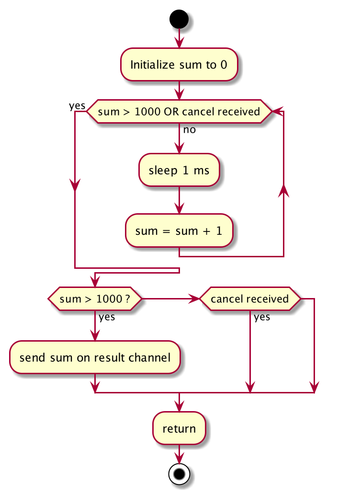
Dijagram aktivnosti funkcije doWork

#### Server rukovalac

Da vidimo kako ćemo koristiti `doWork` funkciju unutar našeg server hendlera:

```go
// context/server-side/main.go 
//...

func main() {
    http.HandleFunc("/", func(w http.ResponseWriter, r *http.Request) {
        log.Println("[Handler] request received")
        
        // retrieve the context of the request
        rCtx := r.Context()
        
        // create the result channel
        resChan := make(chan int)
        
        // launch the function doWork in a goroutine
        go doWork(rCtx, resChan)
        
        // Wait for
        // 1. the client drops the connection.
        // 2. the function doWork to finish it works
        select {
        case <-rCtx.Done():
            log.Println("[Handler] context canceled in main handler, client has diconnected")
            return
        case result := <-resChan:
            log.Println("[Handler] Received 1000")
            log.Println("[Handler] Send response")
            fmt.Fprintf(w, "Response %d", result) // send data to client side
            return
        }
    })
    err := http.ListenAndServe("127.0.0.1:8989", nil) // set listen port
    if err != nil {
        panic(err)
    }
}
```

Promenili smo kod obrađivača da koristi kontekst zahteva. Prvo što treba uraditi je da preuzmemo kontekst zahteva:

```go
rCtx := r.Context()
```

Zatim podešavamo kanal celih brojeva ( "resChan" ) koji će vam omogućiti komunikaciju sa "doWork" funkcijom. Funkciju ćemo pokrenuti "doWork" u posebnoj gorutini.

```go
resChan := make(chan int)

// launch the function doWork in a goroutine
go doWork(rCtx, resChan)
```

Zatim ćemo koristiti naredbu SELECT da sačekamo dva moguća događaja:

- Klijent zatvara vezu; posledično, kanal za otkazivanje će biti zatvoren.
- Funkcija "doWork" je završila svoj posao. (Dobijamo ceo broj sa "resChan" kanala)

Kada se desi opcija 1, evidentiramo poruku, a zatim se vraćamo.
Kada se desi opcija 2, koristimo rezultat iz "resChan" kanala i upisujemo ga u program za pisanje odgovora.

Naš klijent će dobiti rezultat izračunavanja funkcije doWork.

Hajde da pokrenemo naš server i klijenta.

Na slici možete videti logove izvršavanja klijentskog i serverskog programa.

Možete videti da obrađivač prima zahtev, a zatim pokreće "doWork" funkciju. Zatim obrađivač prima signal za otkazivanje. Ovaj signal se zatim propagira do "doWork" funkcije.

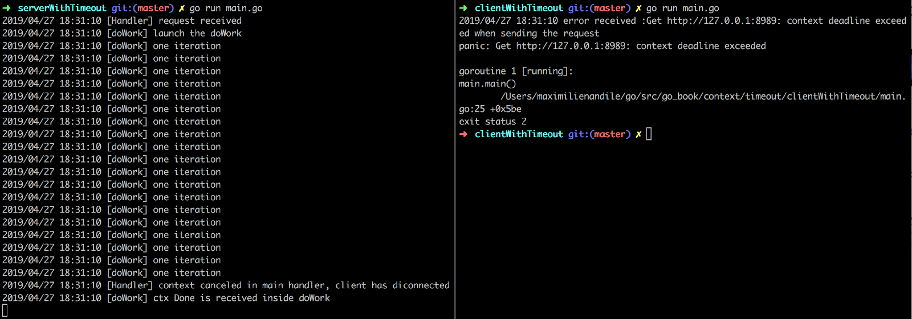
Zapisi izvršenja za klijenta i server

## WithDeadline

### Definicija deadline-a

`WithDeadline` i `WithTimeout` su veoma slični. Ako pogledamo izvorni kod paketa `context`, možemo videti da je funkcija `WithTimeout` samo omotač `WithDeadline`:

```go
// source : context.go (in the standard library)
func WithTimeout(parent Context, timeout time.Duration) (Context, CancelFunc) {
    return WithDeadline(parent, time.Now().Add(timeout))
}
```

Ako pogledate prethodni isečak koda, možete videti da je trajanje vremenskog ograničenja dodato trenutnom vremenu. Pogledajmo potpis funkcije WithDeadline:

```go
func WithDeadline(parent Context, d time.Time) (Context, CancelFunc)
```

Funkcija prima dva argumenta:

- Roditeljski kontekst
- Određeno vreme.

### Upotreba WithDeadline

Kao što smo rekli u prethodnom odeljku, rok i vremenski rok su slični pojmovi. Vremenski rok se izražava kao trajanje, ali se rok izražava kao određena vremenska tačka.

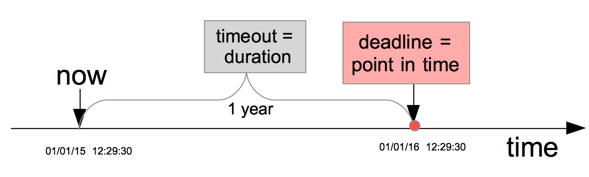
Vremensko ograničenje u odnosu na rok

`WithDeadline` se može koristiti tamo gde se koristi WithTimeout. Evo primera standardne biblioteke:

```go
// golang standard library
// src/net/dnsclient_unix.go
// line 133

// exchange sends a query on the connection and hopes for a response.
func (r *Resolver) exchange(ctx context.Context, server string, q dnsmessage.Question, timeout time.Duration) (dnsmessage.Parser, dnsmessage.Header, error) {
    //....
    for _, network := range []string{"udp", "tcp"} {
        ctx, cancel := context.WithDeadline(ctx, time.Now().Add(timeout))
        defer cancel()

        c, err := r.dial(ctx, network, server)
        if err != nil {
            return dnsmessage.Parser{}, dnsmessage.Header{}, err
        }
        //...
    }
    return dnsmessage.Parser{}, dnsmessage.Header{}, errNoAnswerFromDNSServer
}
```

- Ovde funkcija `exchange` uzima kontekst kao prvi parametar.
- Za svaku mrežu (UDP ili TCP), izvodi kontekst koji se prosleđuje kao parametar.
- Ulazni kontekst se izvodi pozivanjem `context.WithDeadline`. Vreme roka se kreira dodavanjem
  trajanja vremenskog ograničenja trenutnom vremenu: `time.Now().Add(timeout)`
- Imajte na umu da odmah nakon kreiranja izvedenog konteksta, postoji odloženi poziv funkcije
  `cancel` koju vraća `context.WithDeadline`. To znači da kada funkcija `exchange` vrati rezultat, funkcija `cancel` će biti pozvana.
- Na primer, ako funkcija biranja vrati grešku iz nekog razloga, funkcija `exchange` će vratiti
  vrednost, funkcija `cancel` će biti pozvana, a signal otkazivanja će biti propagiran na podređeni kontekst.

## Širenje otkazivanja u detaljima

Ovaj odeljak će detaljnije razmotriti mehanizam širenja otkazivanja. Uzmimo jedan primer:

```go
func main(){
    ctx1 := context.Background()
    ctx2, c := context.WithCancel(ctx1)
    defer c()
}
```

U ovom malom programu, počinjemo definisanjem korenskog konteksta: "ctx1". Zatim izvodimo kontekst pozivom funkcije `context.WithCancel`.

Go će kreirati novu strukturu. Funkcija koja će biti pozvana je sledeća:

```go
// src/context/context.go

// newCancelCtx returns an initialized cancelCtx.
func newCancelCtx(parent Context) cancelCtx {
    return cancelCtx{Context: parent}
}
```

Struktura `cancelCtx` je kreirana, a naš korenski kontekst je ugrađen unutra. Ovde je tip strukture `cancelCtx`:

```go
// src/context/context.go

type cancelCtx struct {
    Context
    mu       sync.Mutex            // protects the following fields
    done     chan struct{}         // created lazily, closed by the first cancel call
    children map[canceler]struct{} // set to nil by the first cancel call
    err      error                 // set to non-nil by the first cancel call
}
```

Imamo pet polja:

- (roditeljski) `Context` koji je ugrađeni podatak (nema eksplicitno ime polja)
- Muteks (nazvan "mu")
- Kanal pod nazivom "done"
- Polje pod nazivom "children" koje je mapa. Ključevi su tipa "canceller" i vrednosti tipa "struct
  {}"
- I greška pod nazivom "err"

Canceller je interfejs:

```go
// A canceler is a context type that can be canceled directly. The
// implementations are *cancelCtx and *timerCtx.
type canceler interface {
    cancel(removeFromParent bool, err error)
    Done() <-chan struct{}
}
```

Tip koji implementira funkciju otkazivanja interfejsa mora da implementira dve funkcije: funkciju `cancel` i `Done` funkciju.

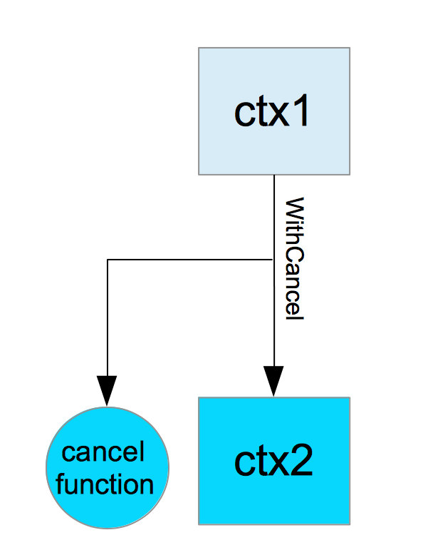
WithCancel kreira izvedeni kontekst i funkciju otkazivanja

Šta se dešava kada izvršimo funkciju `cancel`? Šta se dešava sa "ctx2"?

- `Mutex` ("mu") će biti zaključan. Stoga nijedna druga gorutina neće moći da izmeni ovaj
  kontekst.
- `Kanal` ("done") će biti zatvoren.
- Sva deca `ctx2` će takođe biti otkazana (u ovom slučaju, nemamo dece...)
- `Mutex` će biti otključan.

### Drugo izvođenje

Hajde da proširimo naš primer i izvedemo "ctx2":

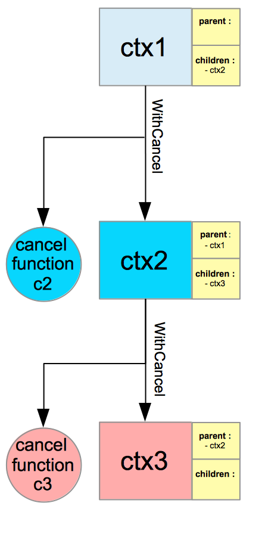  
Izvedite izvedeni kontekst

```go
func main() {
    ctx1 := context.Background()
    ctx2, c2 := context.WithCancel(ctx1)
    ctx3, c3 := context.WithCancel(ctx2)
    //...
}
```

Ovde kreiramo "ctx3", novi objekat tipa cancelCtx. Dečiji kontekst "ctx3" će biti dodat roditelju ("ctx2"). Roditeljski kontekst ctx2 će čuvati memoriju svoje dece. Za sada ima samo jedno dete "ctx3" (vidi sliku).

Sada da vidimo šta se dešava kada pozovemo `cancel` funkciju c2 (sa slike).

- Muteks ("mu") će biti zaključan. Stoga nijedna druga gorutina neće moći da izmeni ovaj kontekst.
- Kanal ("done") će biti zatvoren
- Sva deca "ctx2" će takođe biti otkazana (u ovom slučaju, nemamo dece...)
- "ctx3" biće otkazan istim postupkom
- Ovde je "ctx1" (roditelj od ctx2) emptyCtx, stoga "ctx2" neće biti uklonjen iz "ctx1".
- Muteks će biti otključan.

### Treće izvođenje

Sada hajde da kreiramo još jedan izvedeni kontekst.

```go
func main() {
    ctx1 := context.Background()
    ctx2, c2 := context.WithCancel(ctx1)
    ctx3, c3 := context.WithCancel(ctx2)
    ctx4, c4 := context.WithCancel(ctx3)
}
```

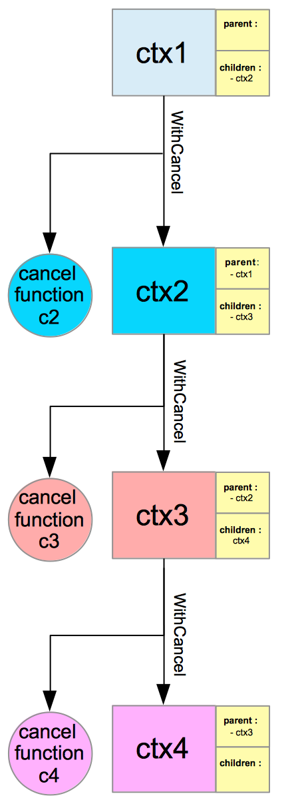  
3 izvedena konteksta

- Kao što možete videti na slici, imamo jedan korenski kontekst i tri potomka.
- Poslednji je "ctx4".
- Kada ga pozovemo "c2", otkazaće se "ctx2", ali i njegova deca ( "ctx3" ).
- Kada "ctx3" bude otkazano, otkazaće se i sva njegova deca i "ctx42 biće otkazano.

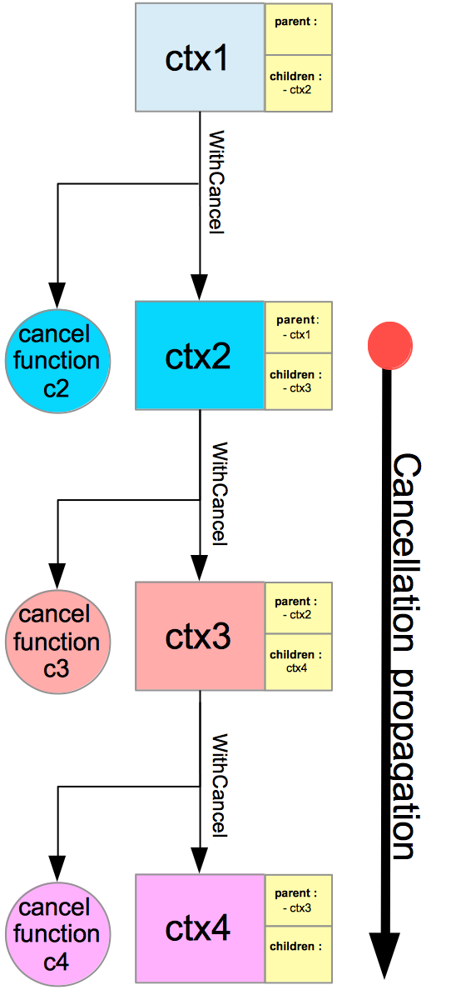  
Širenje otkazivanja

Ključna informacija ovog odeljka je "kada otkažete kontekst, operacija otkazivanja će se proširiti sa roditelja na decu".

## Važan idiom: defer cancel()

Sledeće dve linije koda su veoma česte:

```go
ctx, cancel = context.WithCancel(ctx)
defer cancel()
```

Možete naići na te linije u standardnoj biblioteci, ali i u mnogim bibliotekama. Čim izvedemo postojeći kontekst, funkcija cancel se poziva u defer naredbi.

Kao što smo već videli, instrukcija za otkazivanje se širi od roditelja do dece; zašto moramo eksplicitno da pozivamo funkciju `cancel`? Prilikom izgradnje biblioteke, niste sigurni da će neko efikasno izvršiti funkciju `cancel` u roditeljskom kontekstu. Dodavanjem poziva funkcije `cancel` u odloženoj naredbi, osiguravate da će se `cancel` pozvati:

- kada funkcija vrati vrednost (ili dođe do kraja svog tela)
- ili kada gorutina koja pokreće funkciju paniči.

### Curenje Gorutine

Da bismo razumeli ovaj fenomen, uzmimo jedan primer.

Prvo, definišemo dve funkcije: "doSth" i "doSth2". Te dve funkcije su fiktivne. One uzimaju kontekst kao prvi parametar. Zatim čekaju neograničeno na kanal koji vraća funkcija `ctx.Done()`
da bi vratili:

```go
// context/goroutine-leak/main.go 
//...

func doSth2(ctx context.Context) {
    select {
    case <-ctx.Done():
        log.Println("second goroutine return")
        return
    }
}

func doSth(ctx context.Context) {
    select {
    case <-ctx.Done():
        log.Println("first goroutine return")
        return
    }
}
```

Sada ćemo koristiti te dve funkcije u trećoj funkciji koja se zove "launch":

```go
// context/goroutine-leak/main.go 
//...

func launch() {
    ctx := context.Background()
    ctx, _ = context.WithCancel(ctx)
    log.Println("launch first goroutine")
    go doSth(ctx)
    log.Println("launch second goroutine")
    go doSth2(ctx)
}
```

U ovoj funkciji, prvo kreiramo korenski kontekst (vraća ga context.Background). Zatim izvodimo ovaj korenski kontekst. Pozivamo metodu WithCancel()da bismo dobili kontekst koji se može otkazati.

Zatim pokrećemo naše dve gorutine. Hajde sada da pogledamo našu glavnu funkciju:

```go
// context/goroutine-leak/main.go 
//...

func main() {
    log.Println("begin program")
    go launch()
    time.Sleep(time.Millisecond)
    log.Printf("Gouroutine count: %d\n", runtime.NumGoroutine())
    for {
    }
}
```

Pokrećemo funkciju launchu gorutini. Zatim pravimo kratku pauzu (1 milisekundu) i brojimo broj gorutina. Postoji veoma praktična funkcija koja je definisana u paketu za izvršavanje:

```go
runtime.NumGoroutine()
```

Broj gorutina ovde treba da bude 3: 1 glavna gorutina + 1 gorutina koja izvršava doSth + 1 gorutina koja izvršava doSth2. Ako ne pozovemo cancel, poslednje dve gorutine će se izvršavati neograničeno. Imajte na umu da smo kreirali još jednu gorutinu u programu: onu koja se pokreće. Ova gorutina se neće računati jer će se vratiti gotovo trenutno.launch

Kada otkažemo kontekst, naše dve gorutine se vraćaju. Stoga će se broj gorutina smanjiti na 1 (glavna). Ali ovde uopšte ne pozivamo funkciju otkazivanja.

Evo standardnog izlaza:

```sh
2019/05/04 19:01:16 begin program
2019/05/04 19:01:16 launch first goroutine
2019/05/04 19:01:16 launch second goroutine
2019/05/04 19:01:16 Gouroutine count: 3
```

U funkciji main, nemamo načina da otkažemo naš kontekst (jer je definisan unutar funkcije launch). Imamo dve procurele gorutine! Da bismo to popravili, možemo jednostavno izmeniti funkciju launch i dodati odloženi izraz:

```go
// context/goroutine-leak-fixed/main.go 
//...

func launch() {
    ctx := context.Background()
    ctx, cancel := context.WithCancel(ctx)
    defer cancel()
    log.Println("launch first goroutine")
    go doSth(ctx)
    log.Println("launch second goroutine")
    go doSth2(ctx)
}
```

Sada pogledajmo logove koji se dobijaju pokretanjem ove modifikovane verzije našeg programa:

```sh
2019/05/04 19:15:09 begin program
2019/05/04 19:15:09 launch first goroutine
2019/05/04 19:15:09 launch second goroutine
2019/05/04 19:15:09 first goroutine return
2019/05/04 19:15:09 second goroutine return
2019/05/04 19:15:09 Gouroutine count: 1
```

Evo smo ubili naše dve procurele gorutine!

## WithValue

Kontekst može da nosi podatke sa sobom. Ova funkcija je namenjena za upotrebu sa podacima na nivou zahteva kao što su:

- akreditivi (na primer, JSON veb token)
- ID zahteva (za praćenje zahteva u sistemu)
- IP adresa zahteva
- Neki zaglavci (npr. korisnički agent)

### Primer

```go
// context/with-value/main.go 
package main

import (
    "context"
    "fmt"
    "log"
    "net/http"

    uuid "github.com/satori/go.uuid"
)

func main() {
    http.HandleFunc("/status", status)
    err := http.ListenAndServe(":8091", nil)
    if err != nil {
        log.Fatal(err)
    }
}

type key int

const (
    requestID key = iota
    jwt
)

func status(w http.ResponseWriter, req *http.Request) {
    // Add request id to context
    ctx := context.WithValue(req.Context(), requestID, uuid.NewV4().String())
    // add credentials to context
    ctx = context.WithValue(ctx, jwt, req.Header.Get("Authorization"))

    upDB, err := isDatabaseUp(ctx)
    if err != nil {
        http.Error(w, "Internal server error", http.StatusInternalServerError)
        return
    }
    upAuth, err := isMonitoringUp(ctx)
    if err != nil {
        http.Error(w, "Internal server error", http.StatusInternalServerError)
        return
    }
    fmt.Fprintf(w, "DB up: %t | Monitoring up: %t\n", upDB, upAuth)
}

func isDatabaseUp(ctx context.Context) (bool, error) {
    // retrieve the request ID value
    reqID, ok := ctx.Value(requestID).(string)
    if !ok {
        return false, fmt.Errorf("requestID in context does not have the expected type")
    }
    log.Printf("req %s - checking db status", reqID)
    return true, nil
}

func isMonitoringUp(ctx context.Context) (bool, error) {
    // retrieve the request ID value
    reqID, ok := ctx.Value(requestID).(string)
    if !ok {
        return false, fmt.Errorf("requestID in context does not have the expected type")
    }
    log.Printf("req %s - checking monitoring status", reqID)
    return true, nil
}
```

- Napravili smo server koji sluša na localhost:8091
- Ovaj server ima jednu rutu:"/status"
- Izvodimo kontekst zahteva ( `req.Context()` ) pomoću  
  `ctx := context.WithValue(req.Context(), requestID, uuid.NewV4().String())`
  - Dodajemo par ključ-vrednost u kontekst: `requestID`
- Zatim obnavljamo operaciju. Dodajemo novi par ključeva za čuvanje akreditiva zahteva:
  `ctx = context.WithValue(ctx, jwt, req.Header.Get("Authorization"))`

Kontekstualne vrednosti su zatim dostupne u isMonitoringUpi isMonitoringUp:

```go
reqID, ok := ctx.Value(requestID).(string)
if !ok {
    return false, fmt.Errorf("requestID in context does not have the expected type")
}
```

### Tip ključa

Evo zaglavlja metode `WithValue`:

```go
func WithValue(parent Context, key, val interface{}) Context
```

Argumenti keyi valsu tipa interface{}. Drugim rečima, mogu biti bilo kog tipa. Treba poštovati samo jedno ograničenje, tip keytreba da bude uporediv.

- Možemo deliti kontekst između nekoliko paketa.
- Možda ćete želeti da ograničite pristup kontekstualnim vrednostima van paketa gde su vrednosti
  dodate.
- Da biste to uradili, možete kreirati neeksportovani tip
- Svi ključevi će biti ovog tipa.
- Ključeve ćemo definisati globalno unutar paketa:

  ```go
  type key int
  
  const (
      requestID key = iota
      jwt
  )
  ```

U prethodnom primeru, kreirali smo ključ tipa sa osnovnim tipom int (comparable). Zatim smo definisali dve neeksportovane globalne konstante. Te konstante se zatim koriste za dodavanje vrednosti i za preuzimanje vrednosti iz konteksta:

```go
// add a value
ctx := context.WithValue(req.Context(), requestID, uuid.NewV4().String())

// get a value
reqID, ok := ctx.Value(requestID).(string)
```

### Nedostaje vrednost vrednost i očekivani tip se razlikuje od stvarnog tipa

- Kada par ključ-vrednost nije pronađen u kontekstu, `ctx.Value` će vratiti `nil`.
- Zato pravimo tvrdnju tipa  da bismo se zaštitili od nedostajućih vrednosti ili vrednosti koje
  nemaju potreban tip.

## Testirajte sebe

1. Koja je razlika između roka i tajm-auta?
   - Rok: precizno određen vremenski trenutak, npr. 12. decembar 2027.
   - Vremensko ograničenje: trajanje. npr. 12 sekundi
2. Popunite praznine. Svaki čvor povezane liste sadrži ____ vrednost i ____.
   - Svaki čvor povezane liste sadrži vrednost podatka i adresu u memoriji sledećeg elementa
   - Osim poslednjeg čvora. On nema podešenu adresu.
3. Kako napraviti prazan kontekst?
   - `ctx := kontekst.Background()`
4. Kojom metodom (metodama) možete izvesti kontekst?
   - `WithCancel`
   - `WithTimeout`
   - `WithDeadline`
   - `WithValue`
5. Kada par ključ-vrednost nije pronađen u kontekstu, šta vraća `ctx.Value(key)`
   - `nil`

## Ključno

- `Context` je paket iz standardne biblioteke
- Možemo koristiti kontekst da bismo:
  - Radili širenje otkazivanja  
    Npr. otkazivanje celog lanca rada ako je korisnik API-ja prekinuo vezu.
  - Prenos podataka u okviru zahteva zajedno sa stekom poziva.
  - Postavili rokove i vremenska ograničenja.
- **Rok** = precizan trenutak
- **Vremensko ograničenje** = trajanje
- Interno, kontekst paketa je izgrađen pomoću povezane liste.
- Povezana lista je kolekcija podataka. Svaki čvor povezane liste sadrži vrednost podatka i adresu
  u memoriji sledećeg elementa.
- Da biste kreirali prazan kontekst, koristite:`ctx := context.Background()`
- Svaki kontekst možemo izvesti sledećim metodama:
  - **WithCancel**: `ctx,cancel:=context.WithCancel(context.Background())`
  - **WithTimeout**: `ctx,cancel:=context.WithTimeout(context.Background(), 3*time.Second).`
  - **WithDeadline** : `ctx,cancel:=context.WithDeadline(context.Background(), deadline)`
  - **WithValue**: `ctx:=context.WithValue(context.Background(),"key","value")`
- Izvođenjem konteksta kreirate čvor u povezanoj listi konteksta.
- Kada otkažete kontekst, operacija otkazivanja će se proširiti sa roditeljskog na podređene
  kontekste.
- Kontekst može da nosi vrednosti ograničene zahtevom.
- Da biste dodali vrednost, izvedite kontekst ovako:  
  `ctx := context.WithValue(req.Context(), requestID, uuid.NewV4().String())`
- Da biste preuzeli vrednost iz konteksta, koristite ovu sintaksu:
  `reqID, ok := ctx.Value(requestID).(string)`
- Kada se ne preuzmu vrednosti sa datim ključem `ctx.Value` vratiće `nil`.
- Obično se kao ključ koristi globalna neizvezena promenljiva/konstanta neizvezenog tipa.

[36 Profilisanje programa][36] | [00 Sadržaj][00] | [38 Generici][38]

[36]: 36_Profilisanje_programa.md
[00]: 00_Sadržaj.md
[38]: 38_Generici.md
