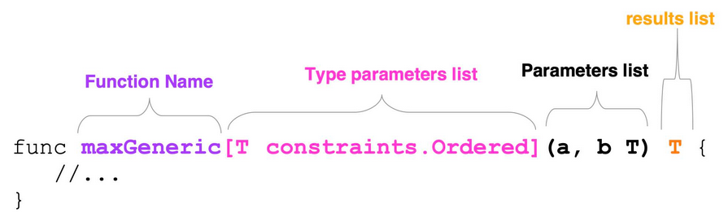
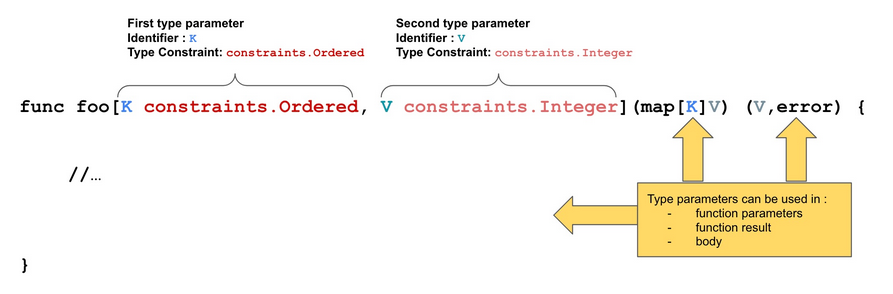
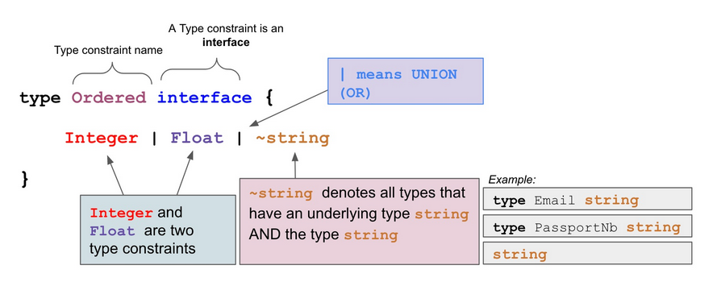
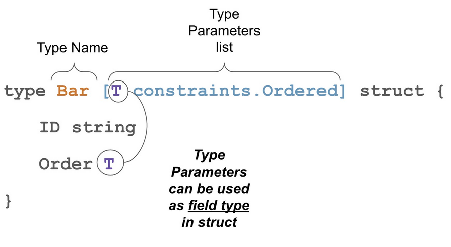

# Poglavlje 38: Generici

[37 Kontekst][37]  
[00 Sadržaj][00]  
[39 OOP jezik][39]  

**Šta ćete naučiti u ovom poglavlju?**

- Videćemo kako se pišu generičke funkcije, metode i tipovi
- Videćemo kako da koristite te generičke konstrukcije u svom kodu
- Videćemo tradicionalne slučajeve upotrebe generičkih lekova: kada ih koristiti, a kada ih ne koristiti

**Obrađeni tehnički koncepti**:

- Generičko programiranje
- Ograničenja tipa
- Parametri tipa
- Funkcija
- Metod
- Interfejs

## Uvod

Od prvog izdanja Goa, potreba zajednice za generičkim verzijama je bila jaka. Kao što je Ijan Lens Tejlor pomenuo u jednom predavanju, jedan Go korisnik je to zahtevao u novembru 2009. godine! Go tim je predstavio verziju Generika u Go 1.18 koja je objavljena u martu 2022. godine.

U ovom poglavlju ćemo obraditi temu generičkih lekova.

## Šta znači generički

Ako se pozovemo na Kembridžski rečnik, pridev generički znači: koji se odnosi na ili ga deli cela grupa sličnih stvari; nije specifičan za bilo koju određenu stvar.

Evo primera upotrebe koji će vam pomoći da razumete pojam: DŽez je opšti termin za širok spektar različitih muzičkih stilova.

Ako se vratimo na programiranje, možemo kreirati, na primer, generičke funkcije koje se neće vezati za određeni tip ulaznih/izlaznih parametara.

Kada pravim funkciju u programskom jeziku Go, moram da navedem tip koji koristim za ulazne parametre i rezultate. Obično će funkcija raditi za određeni tip, na primer, int64.

Uzmimo jednostavan primer:

```go
// generics/first/main.go

// max function returns the maximum between two numbers
func max(a, b int64) int64 {
   if a > b {
      return a
   }
   return b
}
```

Ova "max" funkcija će raditi samo ako unesete brojeve tipa `int64`:

```go
// generics/first/main.go
var a, b int64 = 42, 23
fmt.Println(max(a, b))
// 42
```

Ali zamislimo sada da imate brojeve tipa `int32`, oni su celi brojevi, ali tip nije int64. Ako pokušate da funkciji max date int32 brojeve, vaš program se neće kompajlirati. I to je sasvim u redu; int32 i `int64` nisu isti tipovi.

```go
// generics/first/main.go
var c, d int32 = 12, 376
// DOES NOT COMPILE
fmt.Println(max(c, d))
//./main.go:10:18: cannot use c 
// (variable of type int32) as type int64 in argument to max
//./main.go:10:21: cannot use d 
// (variable of type int32) as type int64 in argument to max
```

Ideja koja stoji iza generičkih tipova je da ta funkcija radi za `int`, `int32`, `int64`, ali i za neoznačene cele brojeve: `uint`, `uint8`, `uint16`, `uint32`. Ovi tipovi su različiti, ali svi dele nešto posebno - možemo ih uporediti na isti način.

## Zašto su nam potrebni generici

Možemo koristiti ovu definiciju od [@jazayeri2003generic], koju smatram prilično jasnom: Cilj generičkog programiranja je da izrazi algoritme i strukture podataka u široko prilagodljivom, interoperabilnom obliku koji omogućava njihovu direktnu upotrebu u izradi softvera.

Sada razumemo da generičko programiranje ima za cilj pisanje interoperabilnog i prilagodljivog koda. Ali šta znači imati interoperabilan kod?

To znači da želimo da budemo u mogućnosti da koristimo istu funkciju za različite tipove koji dele neke zajedničke mogućnosti.

Vratimo se na naš prethodni primer: funkciju max. Mogli bismo da napišemo njene različite verzije za svaki tip celog broja. Jednu za `uint`, jednu za `uint8`, jednu za `int32`, itd...

```go
// generics/first/main.go

// maxInt32 function works only for int32
func maxInt32(a, b int32) int32 {
   if a > b {
      return a
   }
   return b
}

// maxUint32 function works only for uint32
func maxUint32(a, b uint32) uint32 {
   if a > b {
      return a
   }
   return b
}
```

Pisanje iste funkcije iznova i iznova će funkcionisati, ali je neefikasno; zašto ne samo jedna funkcija koja će raditi za sve cele brojeve? Generici su jezička karakteristika koja to omogućava.

Evo generičke verzije naše "max" funkcije:

```go
// generics/first/main.go

func maxGeneric[T constraints.Ordered](a, b T) T {
   if a > b {
      return a
   }
   return b
}
```

I ovu funkciju možemo koristiti ovako:

```go
// generics/first/main.go

fmt.Println(maxGeneric[int64](a, b))
// 42
fmt.Println(maxGeneric[int32](c, d))
// 376
```

Ili čak ovako:

```go
// generics/first/main.go

fmt.Println(maxGeneric(a, b))
fmt.Println(maxGeneric(c, d))
```

### Ali već imamo prazan interfejs

Da li se sećate praznog interfejsa:

```go
interface{}
```

Svi tipovi implementiraju prazan interfejs. To znači da mogu definisati novu max funkciju koja prihvata kao ulaz elemente tipa prazan interfejs i vraća elemente tipa prazan interfejs:

```go
// generics/first/main.go

func maxEmptyInterface(a, b interface{}) interface{} {
   if a > b {           // Treba pokušati sa tvrdnjom tipa za sve numerike ???
      return a
   }
   return b
}
```

Mogu li to da uradim? Ne! Program se neće kompajlirati. Imaćemo sledeću grešku:

```sh
./main.go:64:5: invalid operation: a > b (operator > not defined on interface) 
```

Prazan interfejs ne definiše operator veći od (`>`). I ovde se dotičemo jedne važne posebnosti tipova: jedan tip može definisati ponašanja, a ta ponašanja su metode, ali i operatori.

Možda se pitate šta je tačno operator. Operator kombinuje operand. Najpoznatiji su oni koje možete koristiti za upoređivanje stvari:

```go
>, ==, !=, <
```

Kada pišemo:

```go
A > B
```

`A` i `B` su operandi, a `>` je operator.

Dakle, ne možemo koristiti prazan interfejs jer ne govori ništa, i uzgred, od Go 1.18, prazan interfejs sada ima alias: `any`. Umesto korišćenja `interface{}` možete koristiti `any`. Biće isto, ali imajte na umu da iza `any` stoji dobri stari prazan interfejs.

## Parametri tipa - parametrizacije funkcija, metoda i tipova

Programeri jezika Go su dodali novu funkciju jeziku pod nazivom `Parametri tipa`.

Možemo kreirati generičke funkcije ili metode dodavanjem parametara tipa. Koristimo uglaste zagrade da bismo dodali parametre tipa regularnoj funkciji. Kažemo da imamo generičku funkciju/metod ako imamo parametre tipa.

```go
// generics/first/main.go
package main

import (
   "golang.org/x/exp/constraints"
)

func maxGeneric[T constraints.Ordered](a, b T) T {
   if a > b {
      return a
   }
   return b
}
```

U prethodnom isečku, funkcija maxGeneric je generička. Ima jedan parametar tipa pod nazivom T tipa constraint constraints.Ordered. Ovaj tip dolazi iz paketa ograničenja koje pruža Go tim.

  
Generička funkcija sa parametrima tipa

Hajde da se uskladimo sa nekim rečnikom:

- **[T constraints.Ordered]** je `lista parametara tipa`.
- **T** je `identifikator parametra tipa` (ili ime)
- **constraints.Ordered** je `ograničenje tipa`.
- **T constraints.Ordered** je `deklaracija parametra tipa`.
- Imajte na umu da je `identifikator parametra tipa pozicioniran ispred
  ograničenja tipa`.

Generička funkcija ima listu parametara tipa. Svaki parametar tipa ima ograničenje tipa, baš kao što svaki običan parametar ima tip.

  
Generička funkcija može imati nekoliko parametara tipa

## Šta je ograničenje tipa

`Ograničenje tipa` (primer **constraints.Ordered**) je interfejs koji definiše skup dozvoljenih argumenata tipa za odgovarajući parametar tipa i kontroliše operacije koje podržavaju vrednosti tog parametra tipa.

Ograničenje tipa će ograničiti tipove koje možemo koristiti u našoj generičkoj funkciji. Daje vam informacije: mogu li koristiti ovaj specifični tip u ovoj generičkoj funkciji.

Ova definicija je malo teška, ali u stvarnosti nije toliko složena; hajde da je razložimo:

- Trebalo bi da bude interfejs
- U ovom interfejsu definišemo skup dozvoljenih argumenata tipa, sve tipove koje možemo koristiti za
  ovaj parametar.
- Takođe diktira operacije koje podržavaju vrednosti tog tipa.

Nakon što smo videli teoriju, pogledajmo kako ograničenje tipa izgleda u stvarnosti:

```go
// Ordered is a constraint that permits any ordered type: any type
// that supports the operators < <= >= >.
// If future releases of Go add new ordered types,
// this constraint will be modified to include them.
type Ordered interface {
    Integer | Float | ~string
}
```

Dakle, možemo videti da unutar ovog interfejsa nemamo metode. Kao što imamo u tradicionalnom interfejsu. Umesto metoda, imamo jedan red:

```go
Integer | Float | ~string
```

Imate tri elementa razdvojena uspravnom crtom: |. Ovaj znak predstavlja uniju. Elemente koji čine tu uniju nazivamo tipovima. `Integer`, `Float` i `~string` su `tipski termini`.

`Tipski termin` je ili:

- Jedan tip
  - Npr: `string`, `int`, `Integer`
  - Može biti unapred deklarisani tip ili drugi tip.
    - Ovde je, na primer, string unapred deklarisani tip (on postoji u jeziku podrazumevano, kao
      int, uint8,.…)
    - I na primer, možemo imati, `Integer` što je tip koji smo kreirali.
      Uzmimo primer toga sa tipom `Foo`:

      ```go
      type Foo interface {
         int | int8
      }
      ```

- Osnovni tip
  - Npr.: `~string`, `~uint8`
  - Ovde možete primetiti dodatnu tildu (`~`).
  - Tilda označava sve tipove koji imaju određeni osnovni tip.
  - Generalno, ne ciljamo na određeni tip, `int` čak i ako to možemo da uradimo; radije ćemo ciljati
    sve ostale tipove koji mogu postojati sa osnovnim tipom `int`. Na taj način pokrivamo više tipova.
    - Npr.: `~string` označava sve tipove koji imaju osnovni tip: `string`.

```go
type DatabaseDSN string 
```

Ovaj tip `DatabaseDSN` je novi tip, ali osnovni tip je `string`, tako da se ovaj tip, kao posledica toga, uklapa u `~string`.

Uzmimo još jedan primer da biste bili sigurni da razumete:

```go
type PrimaryKey uint 
```

Ovaj tip `PrimaryKey` je novi tip, ali osnovni tip je `uint`, tako da se ovaj tip, kao posledica toga, uklapa u `~uint`.

`~uint` predstavlja sve tipove sa osnovnim tipom `uint`.


Primer ograničenja tipa

### Ograničenja tipa koja možemo odmah koristiti

Imamo modul `golang.org/x/exp/constraints` koji možemo odmah koristiti, a koji sadrži korisna ograničenja tipa:

Prvo ćete morati da uvezete paket u svoj kod pomoću:

```sh
go get golang.org/x/exp/constraints
```

Onda možete koristiti sva ograničenja.

- Označeno : svi označeni celi brojevi
  - `~int` | `~int8` | `~int16` | `~int32` | `~int64`  
    npr.: -10, 10

- Neoznačeni : svi neoznačeni celi brojevi
  - `~uint` | `~uint8` | `~uint16` | `~uint32` | `~uint64` | `~uintptr`  
    npr.: 42

- Ceo broj, unija označenog i neoznačenog broja
  - `Signed` | `Unsigned`

- Svi brojevi u pokretnom zarezu
  `~float32` | `~float64`

- Svi kompleksni brojevi
  - `~complex64` | `~complex128`

- Uređeni tipovi (koji mogu da se upoređuju po veličini i sortiraju)
  - `Integer` | `Float` | `~string`
    - Kao što smo napominjali, ovo je unija između tri tipa celih brojeva,
      brojeva sa pokretnim zarezom i stringova

## Kako pozvati generičku funkciju ili metod

Uzmimo ponovo naš primer funkcije "maxGeneric":

```go
func maxGeneric[T constraints.Ordered](a, b T) T {...}
```

U prethodnom primeru smo videli da je za pozivanje naše funkcije "maxGeneric" potrebno navesti tip argumenta:

```go
var a, b int64 = 42, 23
maxGeneric[int64](a, b)
```

Ovde je jasno da je tip T `int64` pošto manipulišemo sa `int64`. Zašto je važno da jezik odredi tip T, `tip parametra tipa`? To je zato što, u bilo kom delu našeg programa, moramo imati promenljive koje imaju tip. Kada definišemo našu generičku funkciju, dodajemo parametar tipa koji ograničava tipove koje možemo koristiti. Kada definišem "maxGeneric" funkciju, znam samo da mogu da poređam argumente koji se prosleđuju mojoj funkciji. To ne govori mnogo više.

Kada želimo da koristimo funkciju, Go mora da odredi koji će biti konkretan tip kojim ćemo manipulisati. Tokom izvršavanja, program radi na konkretnim, specifičnim tipovima, a ne na formalnom ograničenju, ne na katalogu svakog mogućeg tipa.

## Zaključivanje tipa

U prethodnom fragmentu smo koristili:

```go
maxGeneric[int64](a, b)
```

ali možemo i direktno napisati:

```go
var a, b int64 = 42, 23
maxGeneric(a, b)
```

U poslednjem isečku koda nismo naveli parametar tipa za a i b; dozvolili smo jeziku da zaključi parametar tipa (tip T). Go će pokušati da odredi parametar tipa na osnovu konteksta.

Ovo zaključivanje tipa parametra se vrši tokom kompajliranja, a ne tokom izvršavanja.

Imajte na umu da zaključivanje parametara tipa možda neće biti moguće u nekim slučajevima. Nećemo se detaljno baviti tim izuzecima. U većini slučajeva, zaključivanje će funkcionisati i nećete morati da razmišljate o tome. Pored toga, postoji jaka zaštita jer kompajler proverava zaključivanje.

## Tipovi mogu imati listu parametara tipa

Uzmimo primer. Recimo da želite da kreirate određeni tip koji predstavlja sve mape sa uporedivim ključevima i celobrojnim vrednostima.

Možemo kreirati parametrizovani prilagođeni tip:

```go
// generics/types
type GenericMap[K constraints.Ordered, V constraints.Integer] map[K]V
```

Imamo novi tip, "GenericMap", sa listom parametara sastavljenom od 2 tipa parametara: "K" i "V". Prvi tip parametra ("K") ima ogeaničenje uređenih tipova; `constraints.Ordered`, drugi tip parametra ima ograničenje tipa `constraints.Integer`.

Ovaj novi tip ima osnovni tip koji je `map`. Imajte na umu da takođe možemo da kreiramo generičke strukture tipa (videti sliku).

  
Struktura generičkog tipa

Zašto kreirati ovaj novi tip? Već možemo da kreiramo mapu sa određenim konkretnim tipom... Ideja je da se taj tip koristi za izgradnju funkcija/metoda koje se mogu koristiti na mnogo različitih tipova mapa: `map[string]int32`, `map[string]uint8`, `map[int]int`, itd. Na primer, sumiranje svih vrednosti na mapi:

```go
// generics/types

func (m GenericMap[K, V]) sum() V {
   var sum V
   for _, v := range m {
      sum = sum + v
   }
   return sum
}
```

Zatim možemo kreirati dve nove promenljive ovog tipa:

```go
// generics/types

m := GenericMap[string, int]{
   "foo": 42,
   "bar": 44,
}

m2 := GenericMap[float32, uint8]{
   12.5: 0,
   2.2:  23,
}
```

A onda možemo da koristimo tu funkciju!

```go
// generics/types

fmt.Println(m.sum())
// 86
fmt.Println(m2.sum())
// 23
```

Ali recimo sada da želim da napravim novu promenljivu tipa: `map[string]uint`.

```go
// generics/types

m3 := map[string]uint{
   "foo": 10,
}
```

Mogu li i ja imati koristi od metode "sum"? Mogu li to da uradim:

```go
fmt.Println(m3.sum()) 
```

Odgovor je ne; to je zato što je zbir definisan samo na elementima tipa "GenericMap". Ispunjavanje ograničenja nije dovoljno; moraćemo da ga konvertujemo u GenericMap. A to se radi ovako:

```go
m4 := GenericMap[string, uint](m3)
fmt.Println(m4.sum())
```

Koristimo zagrade da bismo konvertovali "m3" u validan "GenericMap". Imajte u vidu da ćete morati da navedete listu parametara i eksplicitno navedete tipove `string` i `uint` u ovom slučaju.

## Kada je dobra ideja koristiti generike

U naredna dva odeljka, ponoviću neke savete koje je dao Ijan Lens Tejlor u govoru o genericima kada su se pojavili.

### Kada pišete skoro istu funkciju nekoliko puta

Kada pišete metod/funkciju više puta, jedino što se menja je tip ulaza/izlaza. U tom slučaju, možete napisati generičku funkciju/metod. Možete zameniti gomilu funkcija/metoda jednom generičkom konstrukcijom!

Uzmimo primer:

```go
// generics/use-cases/same-fct2

func containsUint8(needle uint8, haystack []uint8) bool {
   for _, v := range haystack {
      if v == needle {
         return true
      }
   }
   return false
}

func containsInt(needle int, haystack []int) bool {
   for _, v := range haystack {
      if v == needle {
         return true
      }
   }
   return false
}
```

Ovde imamo dve funkcije koje proveravaju da li se element nalazi u segmentu. Šta se menja između te dve funkcije? Tip elementa segmenta. Ovo je savršen slučaj upotrebe za izgradnju generičke funkcije!

```go
// generics/use-cases/same-fct2

func contains[E constraints.Ordered](needle E, haystack []E) bool {
   for _, v := range haystack {
      if v == needle {
         return true
      }
   }
   return false
}
```

Napravili smo generičku funkciju pod nazivom "contains". Ova funkcija ima jedan parametar tipa `constraints.Ordered`. To znači da možemo uporediti dva elementa isečka jer možemo koristiti operator == sa tipovima koji ispunjavaju ovo ograničenje.

### Na tipovima kolekcija isečci, mape, nizovi

Kada manipulišete tipovima kolekcija u funkcijama, metodama ili tipovima, možda ćete morati da koristite generičke. Pojavile su se neke biblioteke koje vam nude generičke tipove kolekcija. Neke biblioteke ćemo otkriti u drugom odeljku.

### Na tipovima strukture podataka

Da bismo razumeli ovaj slučaj upotrebe, moramo razumeti definiciju struktura podataka (ako nikada niste naišli na ovo):

Ako uzmemo definiciju sa Vikipedije: Struktura podataka je format organizacije, upravljanja i skladištenja podataka koji se obično bira za efikasan pristup podacima. Preciznije, struktura podataka je skup vrednosti podataka, odnosa među njima i funkcija ili operacija koje se mogu primeniti na podatke.

Dakle, struktura podataka je način za skladištenje i organizovanje podataka. I ova struktura podataka se takođe isporučuje sa funkcijama/operacijama koje možemo koristiti na njoj.

Najčešća struktura podataka koju smo videli je `map`-a. Mapa nam omogućava da čuvamo neke podatke na određeni način, da ih preuzimamo i na kraju brišemo.

Ali postoji mnogo više od mapa:

- `Povezana lista`: svaki element u ovoj listi ukazuje na sledeći
  - `Context` paket je izgrađen oko ove strukture podataka.
- `Binarno stablo`: struktura podataka koja koristi teoriju grafova, svaki element (nazvan čvor) ima
  najviše dva podređena čvora.
  - Ova struktura podataka se koristi posebno u algoritmima za pretragu.
- `... mnogo više struktura podataka` postoji u računarstvu.

Zašto je logično imati generičku povezanu listu? Ima smisla jer struktura podataka ne zavisi od toga koju vrstu podataka želite da sačuvate. Ako želite da sačuvate cele brojeve u povezanoj listi, unutrašnjost povezane liste se neće razlikovati od one koja radi sa stringovima.

Otkrio sam jedan zanimljiv paket: <https://github.com/zyedidia/generic>. Pokriva mnogo struktura podataka, slobodno ga pogledajte.

## Kada nije dobra ideja koristiti generike

### Kada možete koristiti osnovni interfejs

Ponekad možete koristiti osnovni interfejs da biste rešili svoj problem, a korišćenje interfejsa olakšava razumevanje vašeg koda, posebno za nove korisnike. Čak i ako je bio nepotpun, Go pre verzije 1.18 je već imao oblik generičkog programiranja sa interfejsima. Ako želite da funkciju koristi deset tipova, proverite šta vam je potrebno da ti tipovi budu sposobni, a zatim kreirajte interfejs i implementirajte ga na vaših deset tipova.

Uzmimo primer. Recimo da treba da sačuvate neke podatke u bazi podataka. Za to koristimo `DynamoDb`, `AWS` rešenje za baze podataka.

```go
// generics/dynamo/main.go

func saveProduct(product Product, client *dynamodb.DynamoDB) error {
    marshalled, err := dynamodbattribute.MarshalMap(product)
    if err != nil {
        return fmt.Errorf("impossible to marshall product: %w", err)
    }
    marshalled["PartitionKey"] = &dynamodb.AttributeValue{
        S: aws.String("product"),
    }
    marshalled["SortKey"] = &dynamodb.AttributeValue{
        S: aws.String(product.ID),
    }
    input := &dynamodb.PutItemInput{
        Item:      marshalled,
        TableName: aws.String(tableName),
    }
    _, err = client.PutItem(input)
    if err != nil {
        return fmt.Errorf("impossible to save item in db: %w", err)
    }
    return nil
}
```

Ovde želimo da sačuvamo proizvod. A da bismo ga sačuvali u `DynamoDb`, potrebno je da dobijemo

- particioni ključ i
- ključ za sortiranje stavke.

Ta dva ključa su obavezna. Dakle, ovde, za particioni ključ koristimo string "product", a za ključ za sortiranje koristimo "ID" proizvoda.

Ali sada, recimo da želim da sačuvam kategoriju:

```go
type Category struct {
   ID    string
   Title string
}
```

Moraću da napravim novu funkciju da bih je sačuvao unutar moje baze podataka. Jer je prva metoda specifična za tip proizvoda.

Rešenje ovde može biti kreiranje interfejsa. Ovaj interfejs će definisati metod za preuzimanje ključa particije i ključa sortiranja:

```go
type Storable interface {
   PartitionKey() string
   SortKey() string
}
```

Onda možemo kreirati drugu verziju naše funkcije "save".

```go
func save(s Storable, client *dynamodb.DynamoDB) error {
    marshalled, err := dynamodbattribute.MarshalMap(s)
    if err != nil {
        return fmt.Errorf("impossible to marshall product: %w", err)
    }
    marshalled["PartitionKey"] = &dynamodb.AttributeValue{
        S: aws.String(s.PartitionKey()),
    }
    marshalled["SortKey"] = &dynamodb.AttributeValue{
        S: aws.String(s.SortKey()),
    }
    input := &dynamodb.PutItemInput{
        Item:      marshalled,
        TableName: aws.String(tableName),
    }
    _, err = client.PutItem(input)
    if err != nil {
        return fmt.Errorf("impossible to save item in db: %w", err)
    }
    return nil
}
```

Pozivamo metode interfejsa umesto da se oslanjamo na polja iz tipa. Zatim, da bismo koristili tu funkciju, jednostavno moramo implementirati interfejs na tipovima proizvoda i kategorije:

```go
type Product struct {
   ID    string
   Title string
}

func (p Product) PartitionKey() string {
   return "product"
}

func (p Product) SortKey() string {
   return p.ID
}

type Category struct {
   ID    string
   Title string
}

func (c Category) PartitionKey() string {
   return "category"
}

func (c Category) SortKey() string {
   return c.ID
}
```

I možemo pozvati funkciju save unutar našeg programa:

```go
err := saveProduct(teaPot, svc)
if err != nil {
   panic(err)
}
err = save(teaPot, svc)
if err != nil {
   panic(err)
}
```

### Kada je implementacija metode različita za svaki tip

Ima smisla koristiti generike kada je implementacija ista, ali kada je implementacija različita, morate napisati različite funkcije za svaku implementaciju. Nemojte forsirati generike u svoj kod!

## Neke generičke biblioteke koje možete koristiti u svom kodu

Evo liste biblioteka u kojima možete koristiti neke zanimljive generičke metode funkcija:

- <https://github.com/zyedidia/generic>: Pruža širok spektar struktura podataka spremnih za upotrebu
- <https://github.com/samber/lo>: biblioteka koja implementira mnoštvo korisnih funkcija u stilu
  lodash-a (poznata JavaScript biblioteka)
- <https://github.com/deckarep/golang-set>: biblioteka koja pruža strukturu podataka tipa Set koja
  je prilično jednostavna za korišćenje.

## Testirajte sebe

1. Šta znači znak tilda `~` u `~int`?
   - `~int` označava tip `int` sam po sebi, a takođe i sve imenovane tipove čiji su osnovni tipovi
     `int`
     Npr.:

     ```go
     typee Score int
     ```

     pripada `~int`. "Score" je imenovani tip, a njegov osnovni tip je `int`.

2. Šta znači uspravna crtica `|` u `~int` | `string`?
   - To znači uniju  
     `~int | string` znači sve `string` ili tip `int`, a takođe i sve imenovane tipove čiji su
     osnovni tipovi `int`.

3. Prazan interfejs je zamenjen u Go 1.18 sa `any`. Tačno ili netačno?
   - Netačno.Nije zamenjen. Zamislite da jeste, pokvarilo bi mnogo postojećih programa i biblioteka!
   - `any` je pseudonim za prazan interfejs `interface{}`; znači isto. Možete koristiti bilo koji
     any ili interface{}..

4. Kada pozovete generičku funkciju, morate da navedete tip argumenta(a) koje ćete koristiti. Npr.
   Moram da napišem. Tačno ili netačno?myFunc[int, string](a,b)
   - Ovo je obično netačno, ali ponekad može biti tačno. Zašto?
   - Kada navedete parametre tipa u pozivu funkcije, ne dozvoljavate Go kompajleru da ih zaključi.
   - Go može to zaključiti.

5. Popunite prazninu. Definišimo sledeću funkciju `foo[T ~string](bar T) T`, `T` je ________ sa
   ________ označenim sa `~string`.
   - T je tip parametra sa ograničenjem tipa označenim sa ~string.

6. Parametri tipa postoje samo za funkcije i metode. Tačno ili netačno?
   - Netačno; postoje i za tipove; možete napraviti generički tip pomoću Go-a.

7. Ograničenje tipa može biti struktura tipa. Tačno ili netačno?
   - Netačno. Ograničenje tipa treba da bude interfejs.

8. Definišite pojam ograničenja tipa.
   - Ograničenje tipa je interfejs koji definiše skup dozvoljenih argumenata tipa za odgovarajući
     parametar tipa i kontroliše operacije koje podržavaju vrednosti tog parametra tipa. (iz Go specifikacija)

9. Popunite prazninu. Generičke funkcije mogu _______ samo tipove dozvoljene ograničenjima njihovog
   tipa.
   - Generičke funkcije mogu koristiti samo tipove dozvoljene ograničenjima njihovim tipa.
   - Ograničenje tipa dozvoljava samo određene tipove; ona ograničavaju tipove koje može koristiti
     generička funkcija/metoda/tip.

## Ključno

- Funkcije i metode mogu biti generičke.
- Funkcija/metod je generički ako pruža listu parametara tipa.
- Lista parametara tipa počinje otvorenim uglastim zagradama i završava se zatvorenom uglastom
  zagradom.
- Generička funkcija: func foo[E myTypeConstraint](myVar E) E {... }
  - U ovoj funkciji foo, imamo jedan parametar tipa pod nazivom E.
  - Ovaj parametar tipa je ograničenja tipa myTypeConstraint
  - Parametar tipa se zove E; ovo je njegov identifikator.
  - Ovaj parametar tipa se koristi kao argument i kao rezultat.
- Ograničenje tipa je interfejs koji definiše sve tipove koje možete koristiti za određeni parametar
  tipa.
- Ograničenje tipa označavamo kao meta-tip.
- Ograničenje tipa je ovde da odgovori na pitanje: koji tip imam pravo da koristim ovde?
- Unutar ograničenja tipa možete navesti sve tipove koje dozvoljavate korisniku vaše funkcije/metode/
  tipa da koristi.
  - Možete koristiti uspravnu crtu (|) da biste napravili uniju između termina tipa
    - Uniju možemo shvatiti kao logičko ILI.
      int|string znači: int ILI string
  - Možete koristiti znak tilde (~T) da označite tip T + sve tipove čiji je osnovni tip T.
    - Primer: ~int označava tip int + sve tipove koji imaju osnovni tip jednak int
    - Primer: tip DegreeC int, tip DegreeC ima osnovni tip jednak int. Kažemo da je to imenovani tip.
- Kada pozovete generičku funkciju, možda ćete morati da navedete stvarni tip parametra tipa. Ali Go
  ima moć da ga zaključi. Proverava se tokom kompajliranja.
- Takođe možemo da napravimo generičke tipove.
- Kada treba razmisliti o generičkim lekovima?
  - Kada pišete istu funkciju/metod nekoliko puta, jedino što se menja je tip ulaza/izlaza.
  - Kada želite da koristite dobro poznatu strukturu podataka (npr. binarno stablo, HashSet,...),
    pronaći ćete postojeće implementacije na vebu.
  - Kada radite sa tipovima kolekcija kao što su mape i kriške, ovo je često (ne uvek) dobar slučaj
    upotrebe.
- Najbolje bi bilo da ne forsirate generike u svom kodu.
- Ne zaboravite da i dalje možete koristiti čiste interfejse!

[37 Kontekst][37]  
[00 Sadržaj][00]  
[39 OOP jezik][39]

[37]: 37_Kontekst.md
[00]: 00_Sadržaj.md
[39]: 39_Objektno_orijentisani_programski_jezik.md
