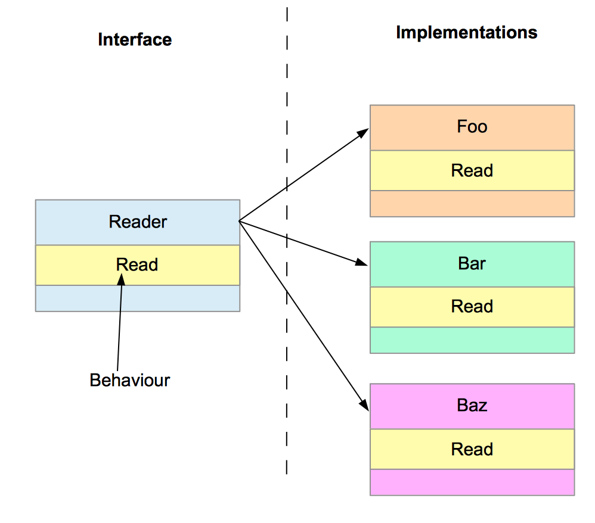
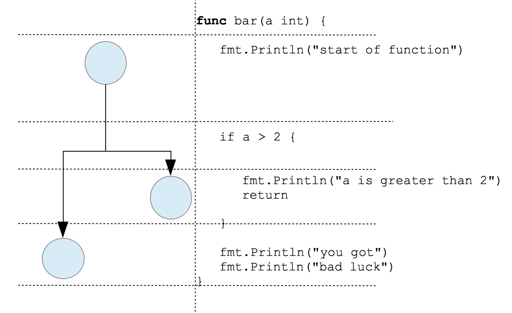
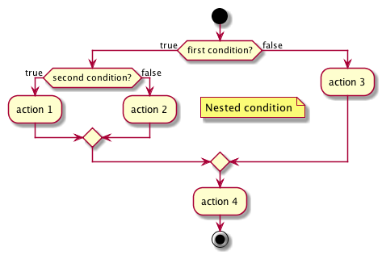
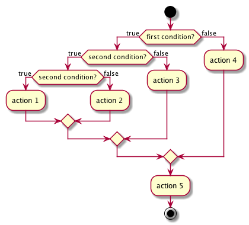

# 41 Preporuke za dizajn

[40 Nadogradnja ili vraćanje na stariju verziju][40] | [00 Sadržaj][00] | [42 Cheetsheat][42]

**Šta ćete naučiti u ovom poglavlju?**

- Detaljno ćemo objasniti neke praktične savete za dizajn kako bismo poboljšali
  vaš kod.

**Obrađeni tehnički koncepti**:

- paket
- interfejs
- metod
- prijemnik
- ciklomatska složenost
- Halstedove metrike

## Uvod

Ovo poglavlje će pokušati da odgovori na pitanje "kako da dizajniram svoj Go kod?".

Kao novi Go programer iz drugih jezika, postavio sam sebi ovo pitanje tokom svojih početaka. Kada pišete softver samo za svoju upotrebu, ovo pitanje nije važno. Kada radite u timu, morate da pratite konvencije i najbolje prakse.

Čitao sam popularne blog postove koje su napisali Go programeri da bih napisao ovo poglavlje. Moj cilj u ovom poglavlju je da sastavim te savete. Nemojte ih se pridržavati dosledno. Imajte na umu da je svaki projekat drugačiji.

## Nazivi paketa

Imena paketa su dostupna korisnicima paketa. Stoga ih programeri moraju pažljivo birati. Šta znači kada kažem dostupna korisnicima? To znači da kada neko želi da koristi funkciju Bar vašeg paketa, mora da napiše:

```go
pkgName.Bar()
```

Evo nekih standardnih pravila kojih se možemo pridržavati

- Kratko - ne više od jedne reči
- Bez množine
- Mala slova
- Informativno o usluzi koju pruža
- Nema utility paketa

**Primeri**:

- net  
  veoma kratko, bez množine, sve malim slovima, odmah znamo da ovaj paket sadrži mrežne funkcionalnosti.

- os  

**Kontraprimeri**:

- models  
  signalizira paket koji je tu samo da podrži strukturu tipa koja definiše model podataka. Usluga koju pruža nije jasna (osim što prikuplja modele podataka). Na primer, mogli bismo imati korisnički paket koji će sadržati korisnički model i funkcionalnosti vezane za korisnike.

- userManagement  
  to nije jedna reč. Koristićemo je za upravljanje korisnicima aplikacije, ali po mom mišljenju, te funkcionalnosti bi trebalo da se nalaze u paketu "user" (sa metodama sa pokazivačem na tip User kao prijemnicima).

- utils :  
  ovaj paket generalno sadrži funkcije koje se koriste u drugim paketima. Stoga se preporučuje da se funkcije direktno premeste u pakete gde se koriste.

> [!Note]
> **O utils paketima**  
> Posedovanje utils paketa može delovati legitimno programerima koji dolaze iz
> drugih jezika, ali za "gofere" to nema smisla jer će nužno mešati funkcije
> koje su mogle biti direktno umetnute tamo gde se koriste. To je neka vrsta
> refleksa koji imamo na početku projekta da u ovu vrstu paketa ubacimo funkcije
> koje bi mogle biti korisne negde drugde. Ali uslužni programi nisu zabranjeni.
> Standardna Go biblioteka otkriva uslužne funkcije, ali teži da ih grupiše po
> tipu. Na primer, stringovi ili bajtovi.

## Koristite interfejse

Interfejsi definišu ponašanja. Na osnovu ove definicije interfejsa, možete definisati više implementacija ponašanja. Korisnici vašeg paketa nisu zainteresovani za vašu implementaciju. NJih zanima samo usluga koju im pružate. Interfejs definiše ugovor za korišćenje vašeg javnog API-ja. Implementacija se može promeniti. Na primer, možete poboljšati performanse implementacije vaše metode. Čak i ako drastično promenite način na koji vaš paket radi ono što radi, način pozivanja će ostati stabilan.


Interfejs i implementacije

U jeziku Go, interfejs je posebna vrsta tipa. Možete ga koristiti kao argument funkcije ili metode.

> [!Note]
> **Saveti za korišćenje interfejsa**
>
>- Koristite interfejse kao argumente funkcija/metoda i kao tipove polja.  
>- Mali interfejsi su bolji.

### Interfejsi kao argumenti ili tipovi polja

Interfejsi se mogu koristiti kao argumenti u metodama i funkcijama (imajte na umu da su oni takođe tipovi). Prihvatanjem interfejsa kao argumenta, ističete činjenicu da ćete unutar vaše funkcije koristiti samo ponašanja definisana tim interfejsom.

Da bismo bolje razumeli, uzmimo primer. Zamislite da napravite novi, moderni kriptografski algoritam za tajnu razmenu poruka sa prijateljem.

Moraćete da razvijete funkciju za dešifrovanje poruka (i njihovo šifrovanje). U sledećem kodu možete videti vaš prvi pokušaj:

```go
func Decrypt1(b []byte) ([]byte, error) {
    //...
}
```

Funkcija uzima isečak bajtova kao argument i vraća isečak bajtova i grešku. Nema ništa loše u ovoj funkciji osim što je možemo koristiti samo sa isečkom bajtova kao ulazom. Zamislite da umesto isečka bajta, želite da dešifrujete celu datoteku ovom metodom? Moraćete da pročitate sve bajtove iz datoteke i da ih prosledite funkciji Decrypt1.

Moramo pronaći tip koji će našu Decrypt1 funkciju učiniti više generičkom. Interfejs tipa koji će služiti ovoj svrsi je `io.Reader`. Mnogi tipovi u standardnoj biblioteci implementiraju ovaj interfejs:

- os.File
- net.TCPConn
- net.UDPConn
- net.UnixConn

Ako prihvatite parametar `io.Reader`, možete dešifrovati datoteke, ali ga i koristiti sa podacima koji se prenose putem TCP-a ili UDP-a. Evo druge verzije funkcije:

func Decrypt2(r io.Reader) ([]byte, error) {
    //...
}

Interfejs `io.Reader` definiše jedno ponašanje, `Read`. Tip koji implementira `Read` funkciju kako je definisano u interfejsu `io.Reader` je takođe tipa `io.Reader`.

To znači da naša "Decrypt2" funkcija može uzeti bilo koji tip koji implementira interfejs `io.Reader`.

### Mali interfejsi su bolji

Ako uzmemo, na primer, interfejse standardne Go biblioteke, možete primetiti da su često veoma mali. Broj ponašanja definiše veličinu interfejsa (drugim rečima, broj navedenih potpisa metoda).

U Gou, ne morate da navodite da tip implementira interfejs. Shodno tome, kada je vaš interfejs sastavljen od mnogih ponašanja, teško je videti koji tipovi implementiraju interfejs. Zato je male interfejse lakše koristiti u svakodnevnom životu programera.

Možete primetiti da su mnogi interfejsi sastavljeni od 2-3 metode u standardnoj Go biblioteci. Uzmimo za primer dva poznata interfejsa `io.Reader` i `io.Writer`:

```go
type Reader interface {
    Read(p []byte) (n int, err error)
}

type Writer interface {
    Write(p []byte) (n int, err error)
}
```

Evo jednog kontra-primera:

```go
type Bad interface {
    Foo(string) error
    Bar(string) error
    Baz([]byte) error
    Bal(string, io.Closer) error
    Cux()
    Corge()
    Corege3()
}
```

Interfejs Bad je teško implementirati. Neko ko želi da ga implementira moraće da razvije sedam metoda! Ako planirate da napravite paket koji se široko koristi, otežavate novim korisnicima da koriste vaše apstrakcije.

## Izvorne datoteke

Paket može biti sastavljen od jedne datoteke. To je sasvim legalno, ali ako vaša datoteka ima više od 600 redova, može postati teška za čitanje. Evo nekoliko praktičnih saveta za poboljšanje čitljivosti vašeg koda.

> [!Note]
> **Preporuke za poboljšanje čitljivosti datoteka sa izvornim kodom**
>
>- Trebalo bi da nazovete jednu datoteku kao što je ime paketa
>- Ne više od 600 redova po datoteci
>- Jedan fajl = jedna odgovornost

### Jedna datoteka treba da se nazove kao ime paketa

Ako imate više datoteka u svom paketu, bolje je da jednu datoteku nazovete kao paket. Na primer, imamo dva paketa: "fruit" i "bike". U "fruit" paketu imamo "fruit.go", a u "bike" paketu imamo "bike.go" izvorni fajl. Te datoteke mogu da podržavaju deljene tipove, interfejse i konstante zajedničke za sve fruits ili bikes.

### Ne više od 600 redova po datoteci

Ovaj savet će poboljšati čitljivost vašeg programa/paketa. Datoteke treba da budu kratke (ali ne prekratke); to će olakšati život održavaocima (skrolovanje po dugim datotekama može biti dosadno). Imajte na umu da je ovo ograničenje proizvoljno; naravno, možete ga prilagoditi svojim standardima.

### Jedna datoteka = Jedna odgovornost

Zamislite da ste deo tima programera za Go i da vam je dodeljena ispravka jedne neprijatne greške. Što se tiče problema sa GitHub-om, korisnik se žali na način na koji HTTP klijent rukuje kolačićima. Moraćete da pronađete gde se kolačići upravljaju. Nije iznenađujuće što se kolačići upravljaju u datoteci net/http/cookie.go. Ova konvencija imenovanja omogućava programerima da lako pronađu odgovornosti za izvorni kod.

## Obrada grešaka

Greške i problemi su deo programske igre. Vaš program mora da obradi sve greške koje se mogu dogoditi. Kao programer, morate razmišljati o najgorem. Zapitajte se šta bi moglo poći po zlu u tom pravcu? Koje tehnike bi zli korisnik mogao da upotrebi da bi vaš program propao?

> [!Note]
> **Preporuke za rešavanje grešaka**
>
> - Uvek dodajte kontekst greškama
> - Nikada ne ignorišite greške
> - Pažljivo koristite fatalne greške
> - Kreirajte programe otporne na greške

### Uvek dodajte kontekst greškama

Prilikom kreiranja grešaka, trebalo bi da date dovoljno informacija korisnicima (ali i timu koji će obavljati održavanje vaše aplikacije). Greške bez konteksta je teže razumeti, a pronalaženje njihovog porekla u izvorima može biti izazovno.

```go
func main() {
    err := foo("test")
    if err != nil {
        fmt.Println(err)
    }
}

func foo(bar string) error {
    err := baz()
    if err != nil {
        return err
    }
    return nil
}

func baz() error {
    return corge()
}

func corge() error {
    _, err := ioutil.ReadFile("/my/imagination.go")
    if err != nil {
        return err
    }
    return nil
}

func looping() ([]byte, error) {
    return ioutil.ReadFile("/my/imagination.go")
}
```

U ovom malom primeru, kreirali smo tri funkcije "foo", "baz", "corge" i "looping". U glavnoj funkciji pozivamo "foo". Ova funkcija će pozvati "baz".Baz corge i na corge kraju će pokušati da otvori datoteku (koja ne postoji).

Kada izvršimo program, dobijamo sledeći izlaz:

```sh
open /my/imagination.go: no such file or directory
```

Odakle dolazi greška? Da li dolazi od funkcije corge? Da li dolazi od funkcije looping? Ako želite da znate, moraćete mentalno da pratite putanju izvršavanja (da biste otkrili da se looping nikada ne poziva), i stoga greška dolazi od "corge".

Ova vežba je teška u ovom primeru; može postati noćna mora za veće aplikacije paketa sa stotinama datoteka.

Rešenje? Koristite standardni paket za greške koji vam omogućava da omotate greške. (da stavite drugu grešku u grešku):

```go
// recommendation/errors/better/main.go
package main

import (
    "fmt"
    "io/ioutil"
)

func main() {
    err := foo("test")
    if err != nil {
        fmt.Println(err)
    }
}

func foo(bar string) error {
    err := baz()
    if err != nil {
        return fmt.Errorf("error while calling baz: %w", err)
    }
    return nil
}

func baz() error {
    return corge()
}

func corge() error {
    _, err := ioutil.ReadFile("/my/imagination.go")
    if err != nil {
        return fmt.Errorf("error while reading file: %w", err)
    }
    return nil
}

func looping() ([]byte, error) {
    return ioutil.ReadFile("/my/imagination.go")
}
```

Jednostavno koristimo `fmt.Errorf` sa glagolom formatiranja `%w` koji će obuhvatiti grešku. Ovim jednostavnim sabiranjem, izlaz našeg programa je sada:

```sh
error while calling baz: error while reading file: open /my/imagination.go: no such file or directory
```

Možete videti da su greške jasnije, a lokalizacija kvara trenutna.

- **Nikada ne ignorišite greške**.  
  Možda je očigledno, ali ipak, mnogi programeri prave ovu grešku. Greške koje se pojave treba rešiti:

  - vraćenjem pozivaocu

  - ili tretirano (vaš kod implementira neku vrstu mehanizma za automatsku
    korekciju)

  - Pažljivo koristite fatalne greške. Kada pozovete log.Fatal[f], implicitno
    prisiljavate svoj program da se naglo završi (sa `os.Exit(1)`). "Program se odmah prekida; odložene funkcije se ne izvršavaju." (`os/proc.go`). Odložene funkcije se često koriste za čišćenje logike (na primer, zatvaranje deskriptora datoteka). Kao posledica toga, njihovo nepokretanje nije optimalno.

    ```go
    // standard log package.
    // Fatal is equivalent to Print() followed by a call to os.Exit(1).
    func Fatal(v...interface{}) {
        std.Output(2, fmt.Sprint(v...))
        os.Exit(1)
    }
    ```

### Pokušajte da kreirate programe otporne na greške
  
Termin "tolerancija na greške" često koriste hardverski inženjeri. Većina hardverskih komponenti je dizajnirana da se nosi sa kvarovima i da se oporavi od njih. Softverski inženjeri bi takođe trebalo da naprave svoje programe tako da tolerišu greške. Program treba da služi svojoj svrsi uprkos kvarovima (koji mogu biti prolazni ili trajni).

**Ako dođe do greške, proverite je da biste utvrdili da li se može popraviti ili ne**:

Na primer, pravite program koji poziva veb servis. Tokom izvršavanja vašeg programa, poziv je neuspešan. Izvor kvara je mreža (veb server je isključen sa interneta). Ova greška je popravljiva, što znači da se možete oporaviti od greške jer će mreža ponovo postati dostupna u nekom trenutku.

Ako je poziv vašem veb servisu uspešno prošao kroz mrežu, ali je vratio grešku http 301 ("Trajno premešteno"), greška se ne može popraviti. Napravili ste grešku kada ste definisali URL veb servisa ili je vaš dobavljač veb servisa nešto promenio bez upozorenja. Biće neophodna ljudska intervencija.

**Implementirajte rezervnu opciju**:

Rezervna opcija je "opcija za nepredviđene situacije koja se koristi ako preferirani izbor nije dostupan" (Vikipedija). U našem programu, na primer, mrežni poziv nije moguć ili je vratio grešku. Trebalo bi da razmislimo o opcijama.

Opcije neće biti iste bez obzira da li se greška može popraviti ili ne.

Ako ste doživeli mrežni kvar, umesto direktnog vraćanja greške, možete implementirati mehanizam ponovnog pokušaja. Pokušaćete ponovo da kontaktirate veb servis podesiv broj puta.

## Metode i funkcije

Funkcije i metode su svuda unutar programa. Sintaksički ispravna funkcija (tj. program se kompajlira) možda nije stilski dobra. Ovde želimo da predstavimo neke preporuke vezane za pisanje funkcija. Jednom rečju, kako pisati funkcije sa stilom.

> [!Note]
> **Preporuke za metode i funkcije**  
>
> - Jedna funkcija ima jedan cilj
> - Jednostavna imena
> - Ograničena dužina (maksimalno 100 redova)
> - Smanjite ciklomatsku složenost
> - Smanjite broj nivoa ugnežđenja

### Jedna funkcija ima jedan cilj

Funkcija je imenovana procedura (ili rutina) koja će izvršiti specifičan zadatak. Može imati ulazne parametre, a takođe i izlazne parametre. Važan termin ovde je "specifičan". Funkcija (ili metod) obavlja jedan zadatak, a ne više njih. Ima jedan cilj.

Odlična funkcija je funkcija koja radi jednu stvar, i to savršeno dobro. U matematici, na primer, eksponencijalna funkcija `exp(x)` će izračunati vrednost za svaku realnu vrednost `x`.

Ova funkcija treba da ima samo jedan cilj, što je jednostavno za razumevanje. Funkcija neće istovremeno izračunati eksponencijalnu i logaritamsku vrednost x. Umesto toga, imamo dve funkcije, eksponencijalnu funkciju i logaritamsku funkciju.

Evo jednog kontra-primera:

```go
type User struct {
    //...
}

func (u *User) saveAndAuthorize error {
    //...
    return nil
}
```

Metoda "saveAndAuthorize" obavlja 2 zadatka:

- sačuvaj korisnika
- i ovlasti ga.

Dva različita zadatka zahtevaju različite sposobnosti (pisanje u bazu podataka, čitanje iz baze podataka, provera validnosti pristupnog tokena...). Ovaj program će se kompajlirati, ali će ga biti teško testirati. Vraćena greška može biti izazvana kvarom sloja podataka, ali i bezbednosnim slojem aplikacije.

Rešenje bi moglo biti podela funkcije na dve različite: create i authorize.

```go
func (u *User) create error {
    //..
    return nil
}

func (user *User) authorize error {
    //...
    return nil
}
```

### Jednostavna imena

Ne ponavljajte naziv tipa prijemnika u nazivu metode!

Na primer:

```go
func (u *User) saveUser() error {

    return nil
}

func (u *User) authorizeUser() error {

    return nil
}
```

Možemo preimenovati te dve funkcije:

```go
func (u *User) save() error {

    return nil
}

func (u *User) authorize() error {

    return nil
}
```

Smanjujemo veličinu imena funkcije uklanjanjem tipa "User". Zapamtite da uvek razmišljate iz perspektive pozivaoca vašeg paketa. Hajde da uporedimo ta dva isečka:

```go
user := user.NewUser()
err := user.saveUser()
if err != nil {
    //..
}

user := user.New()
err := user.save()
if err != nil {
    //..
}
```

Drugi je mnogo jednostavniji od prvog. Prvi se sastoji od 65 znakova, dok drugi ima 57 znakova (uključujući razmake).

### Ograničen broj redova koda

Funkcija treba da teži jednom cilju (videti prethodni odeljak) i treba da bude mala. Kada povećate broj redova u funkciji, povećavate i vreme i kognitivni napor potreban za njeno čitanje, a zatim i razumevanje.

Na primer, evo funkcije `Pop` iz paketa `heap`:

```go
func Pop(h Interface) interface{} {
    n := h.Len() - 1
    h.Swap(0, n)
    down(h, 0, n)
    return h.Pop()
}
```

Broj linija ove funkcije je samo 4. To je čini prilično jednostavnom i razumljivom. Uporedite ovu funkciju iz `ascii85` paketa:

```go
func (d *decoder) Read(p []byte) (n int, err error) {
    if len(p) == 0 {
        return 0, nil
    }
    if d.err != nil {
        return 0, d.err
    }

    for {
        // Copy leftover output from last decode.
        if len(d.out) > 0 {
            n = copy(p, d.out)
            d.out = d.out[n:]
            return
        }

        // Decode leftover input from last read.
        var nn, nsrc, ndst int
        if d.nbuf > 0 {
            ndst, nsrc, d.err = Decode(d.outbuf[0:], d.buf[0:d.nbuf], d.readErr != nil)
            if ndst > 0 {
                d.out = d.outbuf[0:ndst]
                d.nbuf = copy(d.buf[0:], d.buf[nsrc:d.nbuf])
                continue // copy out and return
            }
            if ndst == 0 && d.err == nil {
                // Special case: input buffer is mostly filled with non-data bytes.
                // Filter out such bytes to make room for more input.
                off := 0
                for i := 0; i < d.nbuf; i++ {
                    if d.buf[i] > ' ' {
                        d.buf[off] = d.buf[i]
                        off++
                    }
                }
                d.nbuf = off
            }
        }

        // Out of input, out of decoded output. Check errors.
        if d.err != nil {
            return 0, d.err
        }
        if d.readErr != nil {
            d.err = d.readErr
            return 0, d.err
        }

        // Read more data.
        nn, d.readErr = d.r.Read(d.buf[d.nbuf:])
        d.nbuf += nn
    }
}
```

Ova funkcija ima 50 redova.

Koji je dobar broj linija? Po mom mišljenju, dobra funkcija ne bi trebalo da ima više od 30 linija. Trebalo bi da možete da prikažete funkciju u prozoru vašeg IDE-a (editora koda) bez potrebe za pomeranjem nadole. Na mom IDE-u mogu da pročitam samo 38 linija odjednom.

### Smanjena ciklomatska složenost

Broj redova unutar funkcije nije dovoljan da se proceni njena jednostavnost. Godine 1976, Tomal DŽ. Mekejb je razvio zanimljiv pojam nazvan "ciklomatska složenost". Ideja je da možemo koristiti teoriju grafova za otkrivanje složenosti u programima.

Možemo sastaviti funkciju od jedne ili više uslovnih naredbi. Na primer, možemo imati nekoliko if naredbi. Pogledajmo sledeći primer.

```go
package main

import "fmt"

func main() {
    fmt.Println(foo(2, 3))
    fmt.Println(foo(11, 0))
    fmt.Println(foo(8, 12))
}

func foo(a, b int) int {
    if a > 10 {
        return a
    }
    if b > 10 {
        return b
    }
    return b - a
}
```

U funkciji "foo" imamo dva ulazna parametra , "a" i "b". U telu funkcije možemo videti dva if iskaza. Imamo dva uslova (upoređujemo "a" i "b" sa određenim brojevima).

Kada pokrenemo našu funkciju, možemo zamisliti tri logičke "putanje":

- Prvi uslov je tačan. Drugi uslov se ne izračunava. Vraćena vrednost je "a".

- Prvi uslov je netačan, drugi je tačan. Vraćena vrednost je "b".

- Prvi uslov je netačan, a i drugi je netačan. Vraćena vrednost je "b"-"a".

Imamo tri putanje. Što više putanja imate, to je više truda potrebno da biste razumeli funkciju.

Što više putanja imate, to više jediničnih testova morate razviti da biste pokrili sve moguće slučajeve.

#### Izračunavanje ciklomatskog broja

Ovaj odeljak nije obavezan za razumevanje koncepta ciklomatske redukcije složenosti. Međutim, možda će vam biti zanimljivo da saznate obrazloženje iza "ciklomatske složenosti".

Prvo, svaki program se može posmatrati kao graf. Graf je sastavljen od čvorova i ivica. Svaki čvor će predstavljati grupu koda. Ivice će predstavljati tok kontrole u ​​programu.

Uzmimo jednostavan primer. Imamo sledeću funkciju:

```go
func bar(a int) {
    fmt.Println("start of function")
    if a > 2 {
        fmt.Println("a is greater than 2")
        return
    }
    fmt.Println("you got")
    fmt.Println("bad luck")
}
```


Grafik i odgovarajuća funkcija

Ovde smo predstavili program skupom čvorova i ivica. Svaki blok koda je predstavljen jednim čvorom. Ovo je ovde veoma važno. Ne dodajemo čvor za svaku naredbu, već za svaku grupu izvršenih naredbi nakon pravila odlučivanja. Ovde moramo pozvati funkcije `fmt.Println` koje su predstavljene jednim čvorom.

Hajde da prebrojimo čvorove i grane na tom grafu:

- Četiri čvora
- Tri ivice

Formula za dobijanje ciklomatske složenosti je (za funkciju):

V(G)= # of edges - # of nodes + 2

Ciklomatski broj je označen sa V(G).

V(G)= 3 - 3 + 2 = 2

Ovde je ciklomatski broj jednak 2, što znači da naš program definiše dve linearno nezavisne putanje. Kada ovaj broj raste, raste i složenost vaše funkcije:

- Više putanja znači više jediničnih testova za razvoj kako bi se u potpunosti pokrio vaš kod.
- Više putanja znači više inteligencije potrebne da bi vaše kolege razumele vaš kod.

Neke važne činjenice o ciklomatskom broju:

- Ovaj broj zavisi samo od "strukture odlučivanja grafa".
- To nije pogođeno kada dodate funkcionalnu izjavu svom kodu.
- Ako ubacite novu granu u graf, povećaćete ciklomatski broj za 1.

### Halstedove metrike

Želim da posvetim ovaj odeljak takozvanim "Halstedovim metrikama složenosti". Moris Hauard Halsted bio je jedan od pionira računarstva. On je 1977. godine razvio metrike za procenu složenosti programa pomoću metrika izvedenih iz njegovog izvornog koda.

- Rečnik programa
- Dužina programa
- Trud potreban za pisanje programa
- Težina koja će biti potrebna za čitanje i razumevanje programa

Halstedove metrike se zasnivaju na dva koncepta. Operatori i operandi. Program se sastoji od tokena. Ti tokeni su rezervisane reči, imena promenljivih, zagrade, vitičaste zagrade... itd. Ti tokeni se mogu klasifikovati u dve glavne kategorije:

- Operatori:
  - Sve rezervisane reči. (func, const, var,...)
  - Parovi zagrada, parovi vitičastih zagrada ({},())
  - Svi operatori poređenja i logički operatori ( >, <, &&, ||,...)

- Operandi:
  - Identifikatori (a, myVariableName, myConstantName, myFunction,...)
  - Konstantne vrednosti ("ovo je string", 3, 22,...)
  - Specifikacija tipa (int, bool,...)

Iz te dve definicije možemo izvući neke osnovne brojeve (koristićemo ih za izračunavanje Halstedovih metrika):

- n1 - ​broj različitih operatora
- n2 - ​broj različitih operanda
- N1 - ​ukupan broj operatera
- N2 - ​ukupan broj operanda

Uzmimo primer programa za izdvajanje ta četiri broja:

```go
func bar(a int) {
    fmt.Println("start of function")
    if a > 2 {
        fmt.Println("a is greater than 2")
        return
    }
    fmt.Println("you got")
    fmt.Println("bad luck")
}
```

n1 ​je broj različitih operatora

- funkcija, bar, (), {}, if, >, return
  Ovde imamo sedam različitih operatera

n2 ​je broj različitih operanda

- int, a, fmt.Println, početak funkcije, 2, a je veće od 2,imaš,loša sreća
  Imamo devet različitih operanda

N1 ​je ukupan broj operatora

- funkcija, bar, (), () ,() ,() ,() ,{},{}, ako, >, vrati
  Imamo 12

N2 ​je ukupan broj operanda

- a, a, početak funkcije, 2, a je veće od 2, dobili ste, loša sreća, fmt.Println, fmt.Println, fmt.
  Println, fmt.Println, int
  Imamo ukupno 12 operanda

Hajde da izračunamo Halstedove metrike za naš program:

**vokabular**:

- n=n1+n2=8+9=1 7n=n1​+n2​=8+9=17

**dužina**:

- N=N1+N2=1 2+1 2=2 4N=N1​+N2​=12+12=24

**teškoća**:

- n1/2×N2/n2=5.33

**zapremina**:

dužina​​​​​×log2(vokabular​​​​​​​​​)=98.10

**trud**:

teškoća​​​​​​​​​×zapremina = 523.20

Te formule vrede nekih objašnjenja.

- Rečnik programa je baš kao rečnik nekog eseja. Za esej na engleskom jeziku možemo reći da je
  autorov rečnik ukupan broj različitih reči. Za program, to je sabiranje ukupnog broja različitih operatora i operanda. Ako program koristi samo rezervisane reči i veoma ograničen broj identifikatora, njegov rečnik će biti manji. Naprotiv, ako vaš program koristi mnogo identifikatora, rečnik će se povećati.

- Dužina programa je ukupan broj korišćenih operatora i operanda. Ovde ne brojimo različite tokene
  već ukupan broj tokena.

- Teškoća je ovde da bi se stekla ideja o vremenu potrebnom za pisanje programa i njegovo čitanje.
  Ova metrika je jednaka polovini broja operanda pomnoženog količnikom između ukupnog broja operatora i različitog broja operanda. Ako vaš program koristi ograničen broj operanda, težina će se smanjiti. Ako se ukupan broj operanda poveća, težina će se takođe povećati (više poređenja, više identifikatora, više tipova za obradu i pamćenje).

- Metrika napora se zatim može koristiti za izračunavanje vremena potrebnog za pisanje programa.

Vreme pisanja programa: E/18 (u sekundama): u našem primeru: 29 sekundi (523,20 / 18).

Halsted takođe detaljno navodi procenjeni broj grešaka!

```go
B=E^(2/3)/3000
```

#### Komentar

- Ovi pokazatelji su zanimljivi, ali treba ih shvatiti oprezno.
- Međutim, oni ističu da što više koda pišemo, naš program će postati složeniji.
- Jednostavan, kratak i glup kod je bolji od previše komplikovanog rešenja.

### Smanjite broj nivoa ugnežđenja

Ovaj savet mora biti povezan sa prethodnim odeljkom. Kada pišete program, možete uvesti ugnežđene naredbe, tj. naredbe koje se izvršavaju u određenoj grani. Uzmimo primer. Ovde imamo fiktivnu funkciju sa prvim uslovom koji kreira dve grane. U prvoj grani, vizualizujte, uveli smo još jednu uslovnu naredbu (ako je b < 2) koja će takođe kreirati dve grane.

```go
// recommendation/nesting/main.go 
//...

func nested(a, b int) {
    if a > 1 {
        if b < 2 { // nested condition
            fmt.Println("action 1")
        } else {
            fmt.Println("action 2")
        }
    } else {
        fmt.Println("action 3")
    }
    fmt.Println("action 4")
}
```

Možete vizualizovati grane na dijagramu sekvence.

  
Dijagram ugnežđene sekvence izjava

Možemo dodati još jedan nivo ugnežđavanja:

```go
// recommendation/nesting/main.go 
//...

func nested2(a, b int) {
    if a > 1 {
        if b < 2 { // nested condition
            if a > 100 {
                fmt.Println("action 1")
            } else {
                fmt.Println("action 2")
            }
        } else {
            fmt.Println("action 3")
        }
    } else {
        fmt.Println("action 4")
    }
    fmt.Println("action 5")
}
```

Na slici 5 možete videti uticaj ovog novog nivoa ugnežđenja na dijagram sekvence.

  
Dijagram sekvence ugnežđenih izjava v2

Što više nivoa ugnežđivanja imate, to će vaš kod postati komplikovaniji. Jedan opšti savet bi bio da ograničite nivoe ugnežđivanja. Ako se nađete u situaciji u kojoj to ne možete izbeći, trebalo bi da kreirate drugu funkciju koja će podržati tu složenost:

```go
// recommendation/nesting/main.go 
//...

func nested3(a, b int) {
    if a > 1 {
        subFct1(a, b)
    } else {
        fmt.Println("action 4")
    }
    fmt.Println("action 5")
}

func subFct1(a, b int) {
    if b < 2 { // nested condition
        if a > 100 {
            fmt.Println("action 1")
        } else {
            fmt.Println("action 2")
        }
    } else {
        fmt.Println("action 3")
    }
}
```

## Ključno

- Imena paketa

  - Kratko: ne više od jedne reči
  - Bez množine
  - Mala slova
  - Informativno o usluzi koju pruža
  - Izbegavajte pakete uslužnih programa/modela

- Interfejsi

  - Koristite interfejse kao argumente funkcija/metoda i kao tipove polja
  - Mali interfejsi su bolji.

- Izvorne datote.
  
  - Jedna datoteka treba da se zove kao pak.
  - Ne više od 600 redova po datote.
  - Jedan fajl = jedna odgovornost

- Obrada grešaka

  - Uvek dodajte kontekst greškama
  - Nikada ne ignorišite greške
  - Pažljivo koristite fatalne greške
  - Kreirajte programe otporne na greške

- Metode/funkcije

  - Jedna funkcija ima jedan cilj
  - Jednostavna imena
  - Ograničena dužina (maksimalno 100 redova)
  - Smanjite ciklomatsku složenost
  - Smanjite broj nivoa ugnežđenja

[40 Nadogradnja ili vraćanje na stariju verziju][40] | [00 Sadržaj][00] | [42 Cheetsheat][42]

[40]: 40_Nadogradnja_ili_vraćanje_na%20staru_verziju.md
[00]: 00_Sadržaj.md
[42]: 42_Cheatsheet.md
