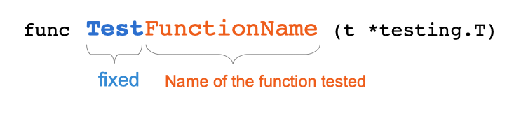

# Poglavlje 42: Cheatsheet

[41 Preporuke za dizajn][41]  
[00 Sadržaj][00]

## Napravite program

Kada vaša glavna datoteka (koja pripada paketu `main` i ima funkciju `main`) ima sledeću relativnu putanju: /my/program/main.go. Otvorite terminal i otkucajte

```sh
go build -o binaryName /my/program/main.go
```

Program će biti kompajliran. Binarna datoteka pod nazivom "binaryName" biće kreirana u trenutnom direktorijumu (gde izvršavate komandu).

## Isečci

- Rastuća kolekcija elemenata istog tipa.
- Veličina nije poznata u vreme kompajliranja
- Interno: pokazivač na osnovni niz

### Napravite isečak

1. Isečak celih brojeva dužine 0 i kapaciteta 0

   ```go
   make([]int, 0)
   ```

2. Isečak celih brojeva dužine 0 i kapaciteta 10

   ```go
   make([]int, 0, 10)
   ```

3. Isecanje postojećeg niza:

   ```go
   a := [4]int{1,2,3,4}
   s = a[:2]
   // s = [1,2]
   // capacity = 4
   // length = 2
   ```

4. Napravite isečak i direktno ga popunite literalom isečka

   ```go
   s := []int{1,2,3,4}
   ```

### Dodavanje elemenata u isečak

Dodaj 0 na isečak s.

```go
s = append(s,0) 
```

Append vraća pokazivač na isečak (koji može biti novi). Potrebno je vraćeni pokazivač sačuvati, da bi moglo da se pristupi isečku.

### Pristup elementu po indeksu

Dobijte element isečka s na indeksu 8.

```go
s[8]
```

> [!Note]
> Budite oprezni, indeks počinje od 0.  
> Pristup elementu van opsega izazvaće paniku.

### Kopiranje

Ugrađena copy funkcija omogućava kopiranje podataka iz isečka (src) u drugi isečak (dst)

```go
func copy(destination, source []Type) int
```

Odredište, pa izvor (po abecednom redu)

### Ispraznite isečak

```go
a := []int{1, 2, 3, 4, 5, 6, 7, 8, 9, 10}
a = a[:0]
```

ili

```go
a = nil
```

### Dodavanje elementa na početak isečka

```go
b := []int{2, 3, 4}
b = append([]int{1}, b...)
```

> [!Note]
> Obratite pažnju na tri tačke na kraju drugog parametra.

### Uklonite element na indeksu

```go
a = append(a[:i], a[i+1:]...)
```

> [!Note]
Obratite pažnju na tri tačke na kraju drugog parametra.

### Pronalaženje elementa u isečku

Moraćete da iterirate preko isečka (sa for petljom).  

> [!Note]
> Možda umesto isečka treba da koristite map?

### Postavite element na indeks

```go
s = append(s, 0)
copy(s[i+1:], s[i:])
s[i] = x
```

## Go module

### Inicijalizacija Go modula

```sh
go mod init yourModulePath
```

Obično je putanja modula URL veb-sajta za deljenje koda (GitHub, GitLab, bitbucket...)

### Ažurirajte sve zavisnosti na najnoviju verziju ( sporedne verzije i zakrpe )

```sh
go get -u
```

### Nadogradite određenu zavisnost

```sh
go get gitlab.com/loir402/foo
```

### Nadogradnja/snižavanje verzije određene zavisnosti na određenu reviziju

```sh
go get module_path@X
```

Gde X može biti:

- **Heš commit**-a  
  Npr: b822ebd
- **String verzija**  
  Npr: v1.0.3

### Očistite datoteke go.mod i go.sum

```sh
go mod tidy
```

### Odštampajte grafikon zavisnosti vašeg modula

```sh
go mod graph
```

### Napravite direktorijum dobavljača da biste sačuvali sve svoje zavisnosti

```sh
go mod vendor
```

### Proverite da zavisnosti preuzete lokalno nisu izmenjene

```sh
go mod verify
```

### Navedite sve zavisnosti zajedno sa njihovom verzijom

Ova lista je takođe poznata kao lista za izradu.

```sh
go list -m all
```

## Goimports

goimports je alat komandne linije za automatsko sortiranje uvoza izvorne datoteke: Evo primera nesortiranih deklaracija uvoza

```go
//...
import (
    "encoding/csv"
    "fmt"
    "log"
    "math/rand"
    "maximilien-andile.com/errors/application/generator"
    "os"
    "time"
)
//...
```

Evo sortirane verzije:

```go
import (
    "encoding/csv"
    "fmt"
    "log"
    "math/rand"
    "os"
    "time"

    "maximilien-andile.com/errors/application/generator"
)
```

### Instalacija

Otvorite terminal i otkucajte sledeću komandu:

```sh
go get golang.org/x/tools/cmd/goimports
```

Binarna datoteka će biti instalirana ovde: $GOPATH/bin/goimports.

Da bi bio dostupan svuda, obavezno dodajte fasciklu `$GOPATH/bin` u svoj PATH.

### Upotreba

Komanda koju treba koristiti je:

```sh
goimports -w file.go
```

Gde se nalazi datoteka koju želite da obradite file.go

## Jedinični testovi

### Test datoteke

- Test datoteke se smeštaju u direktorijum paketa
- Imaju sufiks _test.go

### Funkcija testiranja

Test funkcije se izvoze i imaju određeno ime

  
Potpis funkcije testiranja

### Test tabele

Evo primera testa sa tabelom:

```go
func Test_totalPrice(t *testing.T) {
    type parameters struct {
        nights  uint
        rate    uint
        cityTax uint
    }
    type testCase struct {
        name string
        args parameters
        want uint
    }
    tests := []testCase{
        {
            name: "test 0 nights",
            args: parameters{nights: 0, rate: 150, cityTax: 12},
            want: 0,
        },
        {
            name: "test 1 nights",
            args: parameters{nights: 1, rate: 100, cityTax: 12},
            want: 112,
        },
        {
            name: "test 2 nights",
            args: parameters{nights: 2, rate: 100, cityTax: 12},
            want: 224,
        },
    }
    for _, tt := range tests {
        t.Run(tt.name, func(t *testing.T) {
            time.Sleep(time.Second*1)
            t.Parallel()
            if got := totalPrice(tt.args.nights, tt.args.rate, tt.args.cityTax); got != tt.want {
                t.Errorf("totalPrice() = %v, want %v", got, tt.want)
            }
        })
    }
}
```

### Komande

- Pokrenite sve testove u projektu

  ```sh
  go test./...
  ```

- Pokrenite testove određenog paketa

  - U direktorijum paketa:

    ```sh
    go test
    ```

  - Van direktorijuma paketa:

    ```sh
    go test modulepath/packagename
    ```

## Konvencija imenovanja

### Putanja modula

Putanja modula je generalno URL adresa koja vodi do veb stranice za deljenje koda.  
Npr.: gitlab.com/loir402/bluesodium

Putanja modula je zapisana u datoteci go.mod :

```sh
module gitlab.com/loir402/bluesodium

go 1.15
```

Drugi će koristiti putanju modula da bi uvezli vaš modul (ako imate pristup repozitorijumu) putem, na primer, komande go get

```sh
go get gitlab.com/loir402/bluesodium
```

Poslednji deo URL-a treba da se podudara sa imenom glavnog paketa vašeg modula (koji će generalno biti smešten u koren direktorijuma projekta).

```go
package main

import "gitlab.com/loir402/bluesodium"

func main() {
    bluesodium.Color()
}
```

### Naziv paketa

- kratak
- jednostavan
- sažet
- jedna reč je bolja od dve ili više

## Interfejs greške

Evo definicije interfejsa `error` (u standardnoj biblioteci):

```go
package builtin
//...
type error interface {
    Error() string
}
```

Evo primera implementacije ovog interfejsa:

```go
// ReadingError is a custom type
type ReadingError struct {
}

// ReadingError implments error interface
func (e *ReadingError) Error() string {
    return "error"
}
```

## Tvrdnja tipa

Evo sintakse tvrdnje tipa.

```go
x.(T)
```

vrednost x ima tip T.

T je tip. Može biti konkretan tip ili interfejs tipa.

### Kada je T konkretan tip

```go
func doSomething() error {
    //...
}

err := doSomething()
```

U ovom programu definišemo funkciju "doSomething" koja vraća element tipa `interface error`. Izvršavamo ovu funkciju i dodeljujemo povratnu vrednost novoj promenljivoj "err".

Samo znamo da je "err" tipa `interface error`. Želimo da proverimo da li "err" je dinamički tip jednak `*ReadingError`. Možemo koristiti tvrdnju tipa:

```go
// type assertion
v, ok := err.(*ReadingError)
if ok {
    fmt.Println("err is of type *ReadingError")
}
```

`err.(*ReadingError)` vraća dve vrednosti koje prihvatamo u promenljive "v" i "ok".

Kada je "err" tipa `*ReadingError`, tvrdnja je tačna.

- "v" je tipa `*ReadingError`.
- "ok" je jednako `true`.

U suprotnom, ako je tvrdnjaa tipa netačna

- "v" je nulta vrednost tipa `*ReadingError`, tj jednako je `nil`.
- "ok" je jednako `false`.

#### T mora da implementira interfejs tipa x

U ovom slučaju tvrdnja tipa `err.(*ReadingError)` je validna. Tip `*ReadingError` implementira `interface error`, a vrednost "err" je tipa `interface error`.

### Kada je T tip interfejsa

Uzmimo primer sa dva interfejsa "Adder" i "Divider":

```go
type Adder interface {
    Add(a, b int) int
}

type Divider interface {
    Divide(a, b int) float64
}
```

Zatim definišemo novi tip "MyAdder" koji implementira interfejse "Adder" i "Divider".

```go
type MyAdder struct {
}

func (t *MyAdder) Add(a, b int) int {
    return a + b
}
func (t *MyAdder) Divide(a, b int) float64 {
    return float64(a / b)
}
```

Funkcija "foo" vraća "Adder" tip interfejsa.

```go
func foo() Adder {
    return &MyAdder{} // Vraća MyAder, a pošto MyAdder implementira Adder ...
}
```

Proverimo da li povratna vrednost funkcije "foo" takođe implementira "Divider" interfejs:

```go
func main() {
    x := foo()
    if v, ok := x.(Divider); ok {
        fmt.Println("x implements also interface Divider",v)
    }
}
```

Sintaksa je identična. Tvrdnja tipa će takođe proveriti da li "x" nije `nil`.

Kada x implementira Divider i nije nil:

- "v" implementira "Divider"
- "ok" je jednako `true`

U suprotnom

- "v" je jednako `nil`
- "ok" je jednako `false`

### Tvrdnja tipa koja može izazvati paniku

Kada koristite sintaksu:

```go
v, ok := x.(Divider)
```

Vaš program neće izazvati paniku ako x nije tipa Divider. Dok sledeća sintaksa može izazvati paniku:

```go
v := x.(Multiplier)
fmt.Printf("%v", v)
```

Evo standardnog izlaza:

```sh
panic: interface conversion: *main.MyAdder is not main.Multiplier: missing method Multiply

goroutine 1 [running]:
main.main()
        /path/to/main.go:38 +0x100

Process finished with exit code 2
```

## Promenljive okruženja

Da biste proverili da li promenljiva okruženja postoji, možete koristiti `os` paket:

```go
port, found := os.LookupEnv("DB_PORT")
if !found {
    log.Fatal("impossible to start up, DB_PORT env var is mandatory")
}
```

`LookupEnv` vam omogućava da proverite da li okruženje postoji pre nego što ga upotrebite.

[41 Preporuke za dizajn][41]  
[00 Sadržaj][00]

[41]: 41_Preporuke_za_dizajn.md  
[00]: 00_Sadržaj.md
