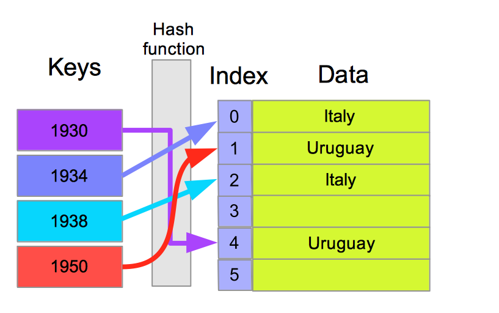
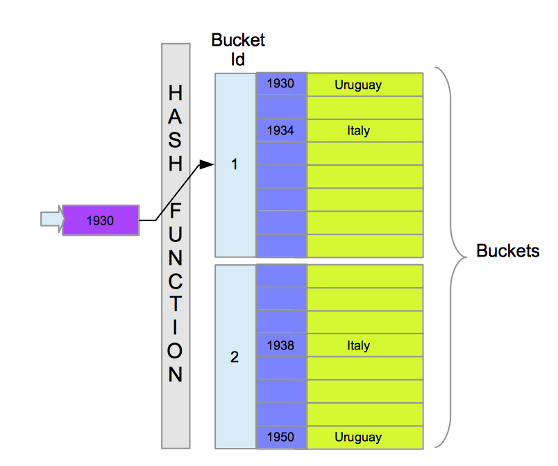
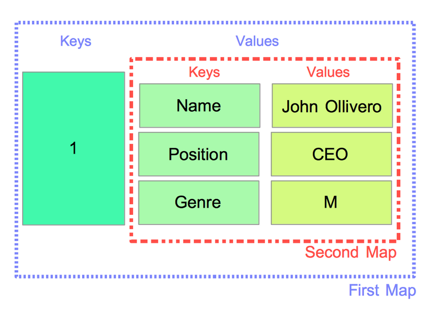
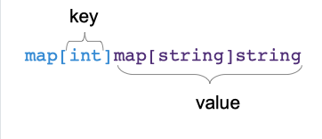

# 22 Mape

[21 Isečcci][21]  
[00 Sadržaj][00]  
[23 Greške][23]

**Šta ćete naučiti u ovom poglavlju?**

- Šta je mapa?
- Šta je ključ, šta vrednost?
- Kako napraviti mapu.
- Kako ubaciti zapis u mapu.
- Kako preuzeti unos sa mape.

**Obrađeni tehnički koncepti!**

- Tip mape
- Par ključ-vrednost
- Unos na mapi
- Heš tabela
- Vremenska složenost

## Zašto su nam potrebne mape

U ovom odeljku ćemo detaljno objasniti kako mape funkcionišu. Ali prvo, hajde da odvojimo malo vremena da razumemo zašto ova struktura podataka može biti korisna na jednom primeru:

**Sa kriškom**:

```go
// maps/without-maps/main.go
package main

import "fmt"

type testScore struct {
    studentName string
    score       uint8
}

func main() {
    results := []testScore{
        {"John Doe", 20},
        {"Patrick Indexing", 15},
        //...
        //...
        {"Bob Ferring", 7},
        {"Claire Novalingua", 8},
    }
    fmt.Println(results)
}
```

Imamo strukturu tipa "testScore" i isečak "results" sastavljen od "testScores" elemenata. Sada zamislimo da želim da dobijem rezultat studentkinje po imenu Kler Novalingva.

Koristimo iteraciju preko svakog elementa da bismo pronašli traženu stavku:

```go
for _, result := range results {
    if result.studentName == "Claire Novalingua" {
        fmt.Println("Score Found:", result.score)
    }
}
```

Zašto ovo rešenje nije optimalno?

- Moramo potencijalno da iteriramo preko svih elemenata isečka. Zamislite da vaš isečak sadrži hiljade elemenata! Uticaj na performanse može biti značajan.
- Napisani kod nije kratak. Koristimo petlju `for range` i ugnježđeno poređenje. Ovih pet redova nije lako pročitati.

## Mape

Mapa je neuređena kolekcija elemenata tipa T koji su indeksirani jedinstvenim ključevima.

**Primer:**

Na prethodnoj slici imamo mapu koja predstavlja pobednike svetskog prvenstva u fudbalu po godinama. Ovde je ključ godina ( koja je uint8 ) i vrednosti koje predstavljaju naziv države pobednika ( string ). Tip mape je označen:

```go
map[uint8]string
```

Element mape se naziva "unos mape". Obično se naziva i par ključ-vrednost.

### Opšta definicija

```go
map[keyType]elementType
```

Sa mapom možete da izvršite sledeće operacije:

- sačuvajte vrednost pomoću određenog ključa
- obrišite vrednost sačuvanu sa određenim ključem
- preuzimanje vrednosti sačuvane sa određenim ključem

Uzmimo još jedan primer; rečnik se može sačuvati pomoću mape. U rečniku imamo definicije reči koje su sačuvane. U ovom slučaju, definicije su elementi, a reči predstavljaju ključeve. Kada koristite rečnik, tražite određenu reč da biste dobili njenu definiciju. Nikada ne tražimo u rečniku po definiciji. Ova vrsta pretrage može vas koštati mnogo vremena jer definicije nisu indeksirane. Ovu analogiju možemo zadržati za mape. Uvek vršimo pretragu na osnovu određenog ključa! Mape se indeksiraju po ključevima.

Možemo li da stavimo sve tipove definisane u Go za tip ključa? I za tip vrednosti?

### Ključevi - dozvoljeni tipovi

Ne možete koristiti bilo koji tip za ključeve mape. Postoji ograničenje. Za neki tip MORAJU: "Operatori poređenja '==' i '!=' biti potpuno definisani za operand tipa ključa." Koji tipovi su stoga isključeni?

- funkcija
- mapa
- kriška
- niz funkcija, mapa ili isečak
- tip strukture koji sadrži polja tipa funkcija, mapa ili srez

```go
// FORBIDDEN: an array of slices
[3][]int

// FORBIDDEN : an array of functions
[3]func(http.ResponseWriter, *http.Request)

// FORBIDDEN: a type with a slice field
type Test struct {
    scores []int
}
//...
```

### Ključevi moraju biti različiti (jedinstvene vrednosti)

Ključevi mape moraju biti različiti.

Ako koristimo sliku, mapa je kao hodnik sa zaključanim vratima. Iza svakih vrata nalazi se vrednost. Ključevi koji mogu da otvore vrata su jedinstveni (možete napraviti kopije ključeva, ali dizajn ključeva ostaje isti). Svaki ključ otvara data vrata. Postoji odnos 1-1 između ključeva i vrata.

### Elemenati

Elementi su ono što čuvate na mapi. Za elemente ne postoje ograničenja u pogledu tipa. Možete da čuvate šta god želite. Takođe možete da čuvate drugu mapu u vrednosti.

Na primer, element može biti godina, rezultat podudaranja, struktura tipa koja predstavlja korisnika aplikacije...

### Kako napraviti mapu

#### Sa ugrađenom komandom `make`

Možete koristiti ugrađenu komandu `make` da biste dodelili i inicijalizovali novu mapu:

```go
m := make(map[string]int)
```

Promenljiva "m" će biti vrednost tipa map[string]int. Ovo se naziva vrednost mape i interno je pokazivač na heš tabelu. U narednim odeljcima ćemo videti šta je tačno heš tabela, zato se sada ne brinite o tome.

#### Sa sintaksom "literala mape"

Sa prethodnom sintaksom, inicijalizujemo i dodeljujemo mapu. Ali je ne popunjavamo. Možemo je direktno popuniti korišćenjem sintakse literala mape:

```go
worldCupWinners := map[int]string{
        1930: "Uruguay",
        1934: "Italy",
        1938: "Italy",
        1950: "Uruguay"
}

fmt.Println(worldCupWinners)
//map[1930:Uruguay 1934:Italy 1938:Italy 1950:Uruguay]
```

U prethodnom kodu, kreirali smo mapu pod nazivom "worldCupWinners". Ova mapa je direktno popunjena sa četiri unosa. Prva četiri pobednika svetskog prvenstva u fudbalu. Ključevi ovde su celi brojevi; oni predstavljaju godine. string vrednosti predstavljaju ime zemlje koja je osvojila kup u datoj godini. Godine 1930, Urugvaj je osvojio kup.

Imajte u vidu da se vrednosti mogu ponavljati. Vrednosti Italija i Urugvaj se ponavljaju dva puta. To je sasvim dozvoljeno.

Takođe imajte na umu da nakon inicijalizacije mape, možete joj dodati nove vrednosti. U našem primeru, možemo dodati još jednu godinu na mapu!

Takođe možete koristiti sintaksu literala mape da biste kreirali praznu mapu.

```go
a := map[int]string{}
```

U prethodnom kodu, a je mapa (inicijalizovana i alocirana), ali u njoj nisu sačuvani parovi ključ-vrednost.

### Šta je heš tabela?

Evo pojednostavljenog prikaza kako heš tabela funkcioniše. (go implementacija je malo drugačija):

  
Heš tabela

Heš tabela se sastoji od 3 elementa:

- Heš funkcija. NJena uloga je da transformiše ključ u jedinstveni identifikator. Na primer, ključ
  1930 će biti prosleđen heš funkciji, a ona će vratiti "4".
- Indeksirano skladište koje se koristi za čuvanje vrednosti u memoriji. Skladište je na kraju
  organizovano u korpe (buckets). Svaka korpa može da čuva određeni broj vrednosti.

Kada dodamo par ključ-vrednost u heš tablicu, algoritam će proći kroz sledeće korake:

- Iz "key" dobijamo povratnu vrednost od "hash_function(key)" (označavamo povratnu vrednost h). h je
  indeks gde su podaci sačuvani (na primer, 4)
- Čuvamo "value" u kontejneru na indeksu "h".

Preuzimanje vrednosti za dati ključ ​takođe će koristiti heš funkciju:

- Iz vrednosti dobija se povratna vrednost "hash_function(key)". Vratiće indeks kontejnera.
- Izvucite podatke iz datog kontejnera i vratite ih korisniku.

### Dobra heš funkcija

Dobra heš funkcija mora imati sledeće osobine:

- Izbegavajte kolizije heševa :
  - Ako prosledite ključ 1989 heš funkciji, ona će vratiti, na primer i. i će biti indeks skladišta
    vrednosti povezane sa 1989.
  - Zamislite sada da za 1938 heš funkcija vraća isti indeks i!
  - Kada nešto sačuvate pomoću ključa 1989, obrisaće se ono što je već sačuvano za taj ključ 1938.
  - Zamislite kakav nered takve kolizije mogu da proizvedu! Na primer, heš funkcija MD5 može da
    proizvede kolizije. (za više informacija, pročitajte članak )
- Izračunava indeks da biste dobili lokaciju podataka u ograničenom vremenskom periodu. (heš
  funkcija mora biti vremenski efikasna)
- Proizvedeni heš mora biti stabilan u vremenu. Ključ treba da proizvede isti heš pri svakom pozivu.

### Vremenska složenost heš tabele

- Složenost algoritma je količina resursa potrebnih za njegovo pokretanje na mašini.
- Vremenska složenost je vrsta složenosti; ona označava količinu računarskog vremena potrebnog za
  pokretanje programa.

Vremenska složenost će zavisiti od implementacije heš tabele, ali imajte na umu da je vremenska složenost veoma niska za pretragu vrednosti i umetanje novog para ključ-vrednost.

Sledeća vremenska složenost se generalno primenjuje na heš tabele:

- Umetanje: O(1)
- Pretraga: O(1)

> [!Info]
> **Pretraga i umetanje**  
> ... će zahtevati isti broj osnovnih operacija na mapi koja sadrži tri elementa > i mapi koja sadrži 3 miliona elemenata!

Kažemo da je to algoritam konstantnog vremena. Takođe kažemo da je reda 1. Ovde sam koristio notaciju Big-O.

### Go interno - Implementacija heš tabele

Ovo je pregled načina implementacije mapa u programskom jeziku Go. Interna implementacija se može menjati tokom vremena.

Izvorni kod se nalazi u paketu za izvršavanje (runtime/map.go).

- Go mapa je niz "kanti"
- Kanta sadrži maksimalan broj od 8 parova ključ/element ( takođe nazvanih 8 unosa ).
- Svaka kanta je identifikovana brojem (ID-om).

#### Pretraga elementa

- Da bi pronašao element na mapi, korisnik će dati ključ.
  - Ključ: 1930

- Ključ će biti prosleđen heš funkciji, ona će vratiti heš vrednost (koja je ceo broj)

- Ova heš vrednost sadrži ID korpe. Heš funkcija ne vraća direktno ID korpe, povratna vrednost "h"
  mora biti transformisana da bi se dobio ID korpe.
  - ID kante = 3

- Znajući ID korpe, sledeći korak je pronalaženje ispravnog unosa u korpi. To se radi upoređivanjem datog ključa sa svim ključevima korpe.
  - Ključ: "1930". Go će iterirati kroz ključeve kante i vratiti odgovarajući element

#### Umetanje elementa

- Korisnik unosi ključ i vrednost elementa
  - Npr: Ključ : "1930" - Element : "Urugvaj"
- Ključ se prosleđuje heš funkciji. Heš funkcija će vratiti heš.
- Iz heša ćemo izvući identifikator korpe (bucket ID).
- Go će zatim iterirati kroz elemente kante da bi pronašao mesto za čuvanje ključa i elementa.
  - Kada je ključ već prisutan, Go će prepisati vrednost elementa.

  
Implementacija Go Hashmap

## Upotreba mapa

U ovom odeljku ćemo pogledati najčešće operacije koje možete da izvršite na mapi. Da bismo to uradili, koristićemo primer.

**Primer aplikacije**:

- Od vas se traži da napravite aplikaciju za odeljenje za ljudske resurse
- U alfa verziji, učitaćemo spisak zaposlenih putem CSV datoteke
- Korisnici će morati da upućuju upit zaposlenima po njihovom identifikatoru zaposlenog  
  (sastavljenom od slova i brojeva) Npr: V45657 , V45658...

Evo odlomka iz CSV datoteke:

```sh
employeeId,employeeName,genre,position
V45657,John Ollivero,M,CEO
V45658,Frane Elindo,F,CTO
V6555,Walter Van Der Bolstenberg,M,Sales Manager
```

### Zašto mape

Korisnici će praviti upit zaposlenog na osnovu njegovog jedinstvenog ID-a.

- Upit zaposlenima ćemo postavljati na osnovu jedinstvenog ključa
- Ovaj ID nije ceo broj; možemo koristiti isečak ili mapu.

Koristićemo mapu i kreiraćemo "employee" tip.

- Ključevi: employeeId => string
- Elementi: vrednosti tipa employee

### Čitanje podataka iz CSV datoteke

Hajde da napravimo prvi deo skripte (za čitanje podataka u datoteku)

```go
// maps/reading-csv/main.go
package main

import (
    "encoding/csv"
    "fmt"
    "io"
    "log"
    "os"
)

func main() {
    file, err := os.Open("/Users/maximilienandile/Documents/DEV/goBook/maps/usages/employees.csv")
    if err != nil {
        log.Fatalf("impossible to open file %s", err)
    }

    defer file.Close()

    r := csv.NewReader(file)
    for {
        record, err := r.Read()
        if err == io.EOF {
            break
        }
        if err != nil {
            log.Fatal(err)
        }
        fmt.Println(record)
    }
}
```

Prvi korak je otvaranje datoteke "employees.csv".

Koristimo standardnu biblioteku "os". Kao i uvek, proveravamo greške i vraćamo ako ih ima (ali pre vraćanja, ispisujemo poruku o grešci).

Nakon toga, koristimo "csv" paket. Kreiramo čitač sa `r := csv.NewReader(file)`, koji će nam omogućiti da čitamo datoteku red po red. Inicijalizujemo brojač linija da bismo pratili broj linije.

Zatim počinjemo čitanje sa for petljom. Novi red čitamo sa `record, err := r.Read()`. Promenljiva record je isečak stringa ( `[]string` ). Zatim, proveravamo greške, sa suptilnošću `r.Read()` kojom će se popuniti err sa `io.EOF` kada se stigne do kraja datoteke. Moramo proveriti `err` li je `nil`. Ako smo stigli do kraja datoteke, zaustavićemo for petlju sa `break` ključnom reči. Nakon toga, konačno možemo pročitati podatke iz datoteke.

Promenljiva record će vratiti, na primer [V45657 John Ollivero M CEO].

Podaci se čuvaju u isečku, a na indeksu 0 ćemo naći employeeID, na indeksu jedan ime, na indeksu dva žanr i poziciju na indeksu 3!

Takođe moramo definisati naš tip zaposlenog:

```go
type employee struct {
    name     string
    genre    string
    position string
}
```

Pripremni rad je završen, hajde da pređemo na kreiranje i korišćenje mape.

### Inicijalizujte i dodajte par ključ/element

```go
// initialize and allocate a new map
employees := make(map[string]employee)
//...
employee := employee{
  name:     record[1],
  genre:    record[2],
  position: record[3]
}

// Add a new entry to the map
employees[employeeId] = employee
```

Da biste dodali par sastavljen od a key i value jednostavno koristite sledeću sintaksu:

```go
m[key] = value
```

### Preuzmimanje vrednosti

Da biste dobili element sa mape, morate znati njegov ključ. Postoje dva različita načina da se to uradi:

#### Kratka sintaksa

Zamislite da tražite podatke vezane za zaposlenog broj.

Vrednost (strukturu employee) ćete dobiti pozivom:

walter := employees["V6555"]

Ovde dodeljujemo promenljivoj walter vrednost sadržanu u mapi employeeMap sa ključem V6555.

#### Kada ključ ne postoji

Ali šta ako vrednost ne postoji? Hoćete li naterati svoj program da paniči? Hajde da rizikujemo:

```go
// when there is no such pair
ghost := employees["ABC55555"]
fmt.Println(ghost)
//{  }

fmt.Println(reflect.TypeOf(ghost))
// main.employee
```

Ovde pokušavamo da dobijemo vrednost zaposlenog koji ima taj identifikator "ABC55555".

Ključ ne postoji na mapi. Go će vratiti nultu vrednost tipa.

> [!Warning]
> Budite veoma oprezni sa ovom sintaksom jer može dovesti do grešaka

U slučaju našeg primera HR softvera, zamislite da nakon učitavanja podataka u mapu, predlažete svojim korisnicima neku vrstu interfejsa gde mogu da vide podatke zaposlenog u funkciji njegovog ID-a. Šta ako korisnik ukuca ID "100"? Implementirate funkciju koja će vratiti zaposlenog na osnovu određenog ključa. Vratićete prazan objekat employee.

Možemo pretpostaviti da zaposleni ne postoji, ali nismo 100% sigurni. Ta prazna polja mogu takođe poticati iz oštećene datoteke.

Zato su kreatori Go-a obezbedili pametniji način za preuzimanje unosa na mapi.

#### Prihvatanje dve vrednosti

Alternativna sintaksa je sledeća:

```go
v, ok := myMap[k]
```

Promenljiva "ok" je bulova vrednost koja će sadržati indikaciju postojanja para ključ-vrednost u mapi:

- Par ključ-vrednost postoji u mapi, v je popunjen vrednošću na ključu k, ok je true.
- Par ključ-vrednost ne postoji, v je popunjeno nultom vrednošću tipa valueType, oj je false.

Često ćete videti ovaj idiom:

```go
// lookup with two values assignment
employeeABC2, ok := employees["ABC2"]
if ok {
    // the key-element pair exists in the map
    fmt.Println(employeeABC2)
} else {
    fmt.Printf("No employee with ID 'ABC2'")
}
```

Moguće je ignorisati vrednost ako samo želite da testirate prisustvo ključa u mapi:

```go
// ignore the value retrieved
_, ok := employees["ABC3"]
if ok {
    // the key-element pair exists in the map
} else {
    fmt.Printf("No employee with ID 'ABC3'")
}
```

U prethodnom primeru, govorimo kompajleru da nam nije potrebna vrednost preuzeta korišćenjem znaka podvlake ( _ ) u dodeli.

Postoji kraći način da se izvrši ista operacija:

```go
// shorter code
if _, ok := employees["ABC4"]; ok {
    // the key-element pair exists in the map
} else {
    fmt.Println("No employee with ID 'ABC4'")
}
```

Dodeljivanje dve vrednosti i provera da li je vrednost u redu se rade u jednoj liniji!

> [!Warning]
> Vrednosti mape se ne mogu adresirati.

Vrednosti preuzete iz mape nisu adresabilne. Ne možete da ispišete memorijsku adresu vrednosti mape.

Na primer, sledeći kod:

```go
fmt.Printf("address of the100 %p", &employeeMap[100])
```

Rezultat će biti greška kompajlera:

```sh
./main.go:66:14: cannot take the address of employeeMap[100]
```

Zašto se ovo ovako ponaša? Zato što Go može da promeni memorijsku lokaciju para ključ-vrednost kada doda novi par ključ-vrednost. Go će to uraditi "ispod haube" kako bi složenost preuzimanja para ključ-vrednost održao na konstantnom nivou. Kao posledica toga, adresa može postati nevažeća. Go više voli da zabrani pristup potencijalno nevažećoj adresi nego da vam dozvoli da pokušate svoju šansu. Ovo je dobra stvar!

> [!Note]
> **Razmatranje korišćenja memorije**
>
> Imajte na umu da kada čuvate vrednost izvučenu iz mape (i ako više ne koristite
> mapu), Go će čuvati celu mapu u memoriji.

Sakupljač smeća neće obaviti svoj posao i ukloniti neiskorišćenu memoriju.

### Brisanje unosa

Par ključ-vrednost možete obrisati korišćenjem `delete` ugrađene funkcije. Funkcija ima sledeće zaglavlje:

```go
func delete(m map[Type]Type1, key Type)
```

Potrebno je:

- mapa kao prvi argument
- ključ​

Drugi argument je ključ unosa koji želite da uništite.

- Ako unos ne postoji na mapi, neće doći do panike (i kompajliraće se).
- Ako za drugi argument koristite drugačiji tip od tipa ključa, program se neće kompajlirati.

Uzmimo primer:

Ako želite da obrišete unos sa mape "employees" možete koristiti sledeći kod:

```go
delete(employees, "ABC4")
```

Unos sa ključem "ABC4"će biti uništen iz memorije ako postoji.

### Dužina

Možete dobiti broj unosa na mapi pomoću ugrađene funkcije `len`:

```go
fmt.Println(len(employees))
// 3
// There are three entries into the map

// remove entry with index 2
delete(employees, "V6555")

fmt.Println(len(employeeMap))
// 2
// There are two entries into the map
```

### Iteriranje preko mape

Možete koristiti petlju for sa klauzulom range da biste iterativno prešli preko svih unosa mape:

```go
for k, v := range employeeMap {
    fmt.Printf("Key: %s - Value: %s\n", k, v)
}
// Key: V6555 - Value: {Walter Van Der Bolstenberg M Sales Manager}
// Key: V45657 - Value: {John Ollivero M CEO}
// Key: V45658 - Value: {Frane Elindo F CTO}
```

> [!Note]
> Ne oslanjajte se na redosled iteracija!

Imajte na umu da će ovaj isečak koda vratiti elemente, a ne redosled umetanja.

To je zato što redosled nije zagarantovan. Ako pokušamo da pokrenemo isti skript drugi put, mogli bismo dobiti sledeći rezultat:

```sh
Key: V45657 - Value: {John Ollivero M CEO}
Key: V45658 - Value: {Frane Elindo F CTO}
Key: V6555 - Value: {Walter Van Der Bolstenberg M Sales Manager}
```

Molimo vas da ovo imate na umu jer može biti izvor grešaka.

### Rešenje problema sa redosledom

Ovaj problem sa redosledom možete rešiti korišćenjem druge promenljive za čuvanje redosleda umetanja. Ako vam je redosled važan, možete koristiti ovo rešenje:

```go
order := []string{}
order = append(order, employeeID)
employeeMap[employeeID] = employee
```

Ovde kreiramo redosled umetanja. Ovaj isečak će čuvati ključeve u redosledu umetanja u mapu. Dakle, svaki put kada dodamo unos u mapu, dodajemo ključ u isečak pozivanjem

```go
order = append(order, employeeID)
```

Na ovaj način možemo dobiti unose po redosledu umetanja:

```go
for _,k := range order {
    fmt.Printf("Key: %s - Value: %s\n", k, employees[k])
}
```

Iteriramo redosled isečaka da bismo dobili ključeve, a zatim preuzimamo ulaznu vrednost pozivanjem "employees[k]", gde "k" predstavlja ključ mape "employees".

## Dvodimenzionalne mape (mape mapa)

U našem prethodnom primeru, želeli smo da sačuvamo podatke sa strukturom: employeeID => employeeData

Ključ employeeID daje vrednost tipa strukture employee. Ali zamislite da ne želimo da sačuvamo strukturu već drugu mapu:

  
Dvodimenzionalna mapa

Na slici su prikazane su dve mape. Druga mapa je tipa map[string]string. Čuvamo ključeve "Ime", "Pozicija" i "Žanr", a vrednosti su odgovarajući podaci o zaposlenima. Prva mapa je tipa map[int]map[string]string. Označavanje tipa je malo zbunjujuće, ali kada se pažljivo pogleda, ima smisla:

  
Vrednost mape je druga mapa

Druga mapa je unutrašnja mapa. To je vrednost prve mape. Svaki unos ovog tipa ima ceobrojni ključ, a za vrednost map[string]string.

Dvodimenzionalne mape su, po mom mišljenju, previše komplikovane. Možda bi bilo bolje da koristite mapu sa strukturnom vrednošću.

## Testirajte sebe

### Pitanja i odgovori

1. Kako proveriti da li se par ključ/element nalazi u mapi?
   - Recimo da želite da proverite da li postoji par ključ/element sa
     ključem jednakim 102 u mapi soba:. Kada je ok tačno, par postoji.room, ok = rooms[102];
2. Kako se Go mape implementiraju interno?
   - Interno, Go mape su heš tabele.
3. Koji tipovi su zabranjeni za ključeve mape?
   - funkcije, isečci, mape
   - Bilo koji niz sastavljen od prethodnih tipova
   - Bilo koji tip sastavljen od barem jednog od tih tipova
4. Zašto je zabranjeno koristiti neke tipove za ključeve mape?  
   - Operatori poređenja == i != nisu u potpunosti definisani za te tipove types.
5. True or False?
   - A map is an unordered collection? True
   - Go will keep the memory of the insertion order. False
6. How to remove a key/element pair from a map?

   ```go
   delete(employees, "ABC4")
   ```

   Kada ključ nije pronađen, ništa se neće dogoditi.
7. Kako dobiti broj parova ključ/elemenat u mapi?
   - len(myMap)
8. Kako iterirati preko mape - dodatne informacije?
   - Sa for petljom:for k, v := range employees

9. Ako mapa Mne sadrži ključ K, šta će se vratiti M[K]?
   - Vratiće nultu vrednost tipa elementa
   - Ako je element ceo broj, vratiće 0 na primer.

### Ključno

- Mapa je neuređena kolekcija elemenata (vrednosti) tipa V koji su indeksirani jedinstvenim
  ključevima tipa K
- Tipovi mapa su označeni ovako: `map[K]V`
- Element unutar mape naziva se unos mape ili par ključ-vrednost.
- Da biste inicijalizovali mapu, možete koristiti sledeće sintakse:

  ```go
  m := make(map[string]uint8)
  m := map[string]uint8{ "This is the key":42}
  ```

- Nulta vrednost tipa mape je `nil`.

  ```go
  var m map[string]uint8
  log.Println(m)
  ```

  Izlaz `nil`

- Da biste ubacili element u mapu, možete koristiti sledeću sintaksu:

  ```go
  m2[ "myNewKey"] = "the value"
  ```

  **Važno**: mapa treba da bude inicijalizovana pre upotrebe.  
  Sledeći program će izazvati paniku:

  ```go
  var m map[string]uint8
  m["test"] = 122
    
  panic: assignment to entry in nil map
  ```

- Da biste preuzeli element na mapi, možete koristiti sledeću sintaksu

  ```go
  m := make(map[string]uint8) // fill the mapvalueRetrieved := m["myNewKey"]
  ```

- Kada se ne pronađe vrednost, promenljiva valueRetrievedće biti jednaka nultoj vrednosti tipa
  vrednosti mape. Ovde "valueRetrieved" će biti jednako 0 (nulta vrednost tipa uint8)

    ```go
    m := make(map[string]uint8)
    // fill the map
    valueRetrieved, ok := m[ "myNewKey"]
    if ok {
        // found an entry in the map with the key "myNewKey"
    } else {
        // not found :(
    }
    ```

    ok je bulova vrednost koja je jednaka vrednosti "true" ako unos sa tim ključem postoji na mapi
- Možete iterirati preko mape pomoću petlje for (sa klauzulom range)  
  **Upozorenje**: redosled umetanja se ne može koristiti (nije zagarantovan)!
- Da biste sačuvali redosled umetanja u mapu, kreirajte isečak i dodajte svaki ključ u njega
  - Zatim možete iterirati preko isečka i preuzeti svaku vrednost redosledom umetanja.
- Unošenje i pretraživanje na mapi su veoma brzi , čak i ako mapa ima mnogo unosa.

[21 Isečcci][21]  
[00 Sadržaj][00]  
[23 Greške][23]

[21]: 21_Isečci.md
[00]: 00_Sadržaj
[23]: 23_Greške.md
