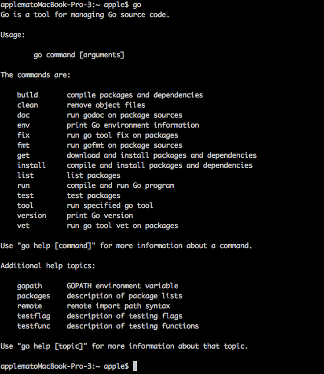
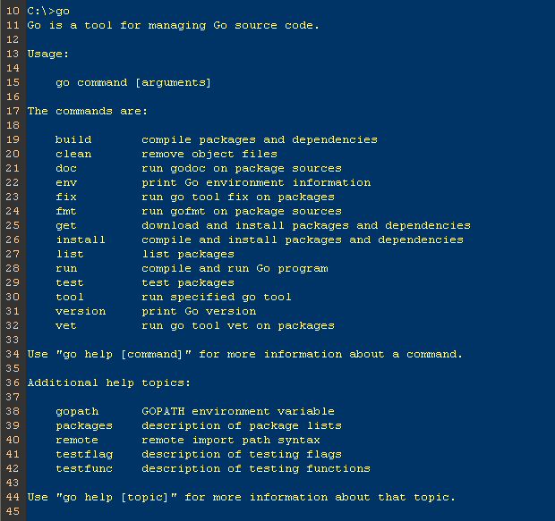
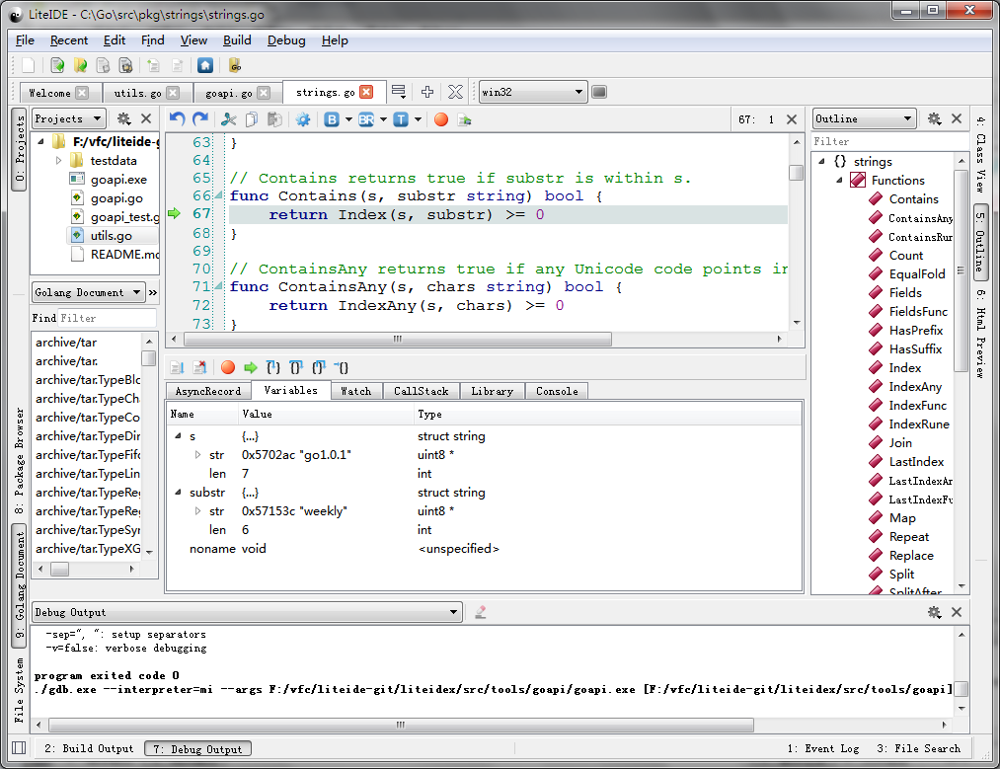

# 1 Konfiguracija okruženja Go

Dobrodošli u svet Goa, hajde da počnemo da istražujemo!

Go je brzo kompajlirani, konkurentni sistemski programski jezik sa sakupljanjem smeća. Ima sledeće prednosti:

- Kompajlira veliki projekat u roku od nekoliko sekundi.
- Pruža model razvoja softvera o kome je lako razmišljati, izbegavajući većinu problema povezanih sa C-stilskim zaglavnim datotekama.
- Statički jezik koji nema nivoe u svom sistemu tipova, tako da korisnici ne
  moraju da troše mnogo vremena baveći se odnosima između tipova. Više je kao lagani objektno orijentisani jezik.
- Vrši sakupljanje smeća. Pruža osnovnu podršku za konkurentnost i komunikaciju.
- Dizajniran za računare sa više jezgara.

Go je kompajlirani jezik. Kombinuje efikasnost razvoja interpretiranih ili dinamičkih jezika sa bezbednošću statičkih jezika. Biće jezik po izboru za moderne, višejezgarne računare sa umrežavanjem. Za ove svrhe, postoje neki problemi koji se inherentno moraju rešiti na nivou izabranog jezika, kao što su bogato ekspresivni lagani sistem tipova, izvorni model konkurentnosti i strogo regulisano sakupljanje smeća. Već neko vreme nisu se pojavili paketi ili alati koji su imali za cilj da reše sve ove probleme na pragmatičan način; tako je rođena motivacija za Go jezik.

U ovom poglavlju, pokazaću vam kako da instalirate i konfigurišete sopstveno Go razvojno okruženje.

## 1.1 Instalacija

### Tri načina za instaliranje Go-a

Postoji mnogo načina za konfigurisanje razvojnog okruženja za Go na vašem računaru, i možete izabrati koji god želite. Tri najčešća načina su sledeća:

- Zvanični instalacioni paketi.  
  Go tim pruža praktične instalacione pakete za Windows, Linux, Mac i druge operativne sisteme. Ovo je verovatno najlakši način da počnete. Instalatere možete preuzeti sa Golang stranice za preuzimanje.
- Instalirajte ga sami iz izvornog koda.  
  Popularno među programerima koji su upoznati sa Unix-olikim sistemima.
- Korišćenje alata treće strane.
  Postoji mnogo alata i menadžera paketa trećih strana za instaliranje Go-a, kao što su apt-get u Ubuntuu i Homebrew za Mek.

U slučaju da želite da instalirate više od jedne verzije Go-a na računar, trebalo bi da pogledate alat pod nazivom GVM. To je najbolji alat koji sam do sada video za obavljanje ovog zadatka, inače biste morali sami da se nosite sa tim.

#### Instaliraj iz izvornog koda

Da biste kompajlirali Go 1.5 i novije verzije, potrebna vam je samo prethodna verzija Go-a, jer je Go postigao butstrepovanje. Za kompajliranje Go-a vam je potreban samo Go.

Da biste kompajlirali Go 1.4 i niže verzije, biće vam potreban C kompajler jer su neki delovi Go-a i dalje napisani u Plan 9 C i AT&T asembleru.

Na Mac računaru, ako ste instalirali Xcode, već imate kompajler.

Na Unix-sličnim sistemima, potrebno je da instalirate gcc ili sličan kompajler. Na primer, korišćenjem menadžera paketa apt-get (uključenog u Ubuntu), možete instalirati potrebne kompajlere na sledeći način:

```sh
sudo apt-get install gcc libc6-dev
```

Na Windows-u, potrebno je da instalirate MinGW da biste instalirali gcc. Ne zaboravite da konfigurišete promenljive okruženja nakon što je instalacija završena.

> [!Note]
> Ako koristite 64-bitni Windows, trebalo bi da instalirate 64-bitnu verziju MinGW-a

U ovom trenutku, izvršite sledeće komande da biste klonirali izvorni kod Go-a i kompajlirali ga.

> [!Note]
> Kloniraće izvorni kod u vaš trenutni direktorijum.  
> Promenite radnu putanju pre nego što nastavite.  
> Ovo može potrajati.

```go
git clone https://go.googlesource.com/go
cd go/src
./all.bash
```

Uspešna instalacija će se završiti porukom "SVI TESTOVI SU PROŠLI".

Na operativnom sistemu Windows, isto možete postići pokretanjem "all.bat".

Ako koristite Windows, instalacioni paket će automatski podesiti vaše promenljive okruženja. U Unix-sličnim sistemima, potrebno je ručno podesiti ove promenljive na sledeći način:

> [!Note]
> Ako je vaša Go verzija novija od 1.0, ne morate da podešavate \$GOBIN,  
> i on će automatski biti povezan sa vašim \$GOROOT/bin, o čemu ćemo govoriti u sledećem odeljku.

```sh
export GOROOT=$HOME/go
export GOBIN=$GOROOT/bin
export PATH=$PATH:$GOROOT/bin
```

Ako vidite sledeće informacije na ekranu, spremni ste.

  
Slika 1.1 Informacije nakon instaliranja iz izvornog koda

Kada vidite informacije o korišćenju programa Go, to znači da ste uspešno instalirali program Go na svoj računar. Ako piše "nema takve komande", proverite da li vaša promenljiva okruženja \$PATH sadrži putanju instalacije programa Go.

#### Korišćenje standardnih instalacionih paketa

Go ima pakete za instalaciju jednim klikom za svaki podržani operativni sistem. Ovi paketi će instalirati Go u  "/usr/local/go" ( "c:\Go" u Windows-u) po podrazumevanim podešavanjima. Naravno, ovo se može izmeniti, ali takođe morate ručno promeniti sve promenljive okruženja kao što sam pokazao gore.

**Kako proveriti da li je vaš operativni sistem 32-bitni ili 64-bitni?**

Naš sledeći korak zavisi od tipa vašeg operativnog sistema, tako da moramo da ga proverimo pre nego što preuzmemo standardne instalacione pakete.

Ako koristite Windows, pritisnite, Win+R a zatim pokrenite alatku za komande. Unesite komandu "systeminfo" i ona će vam prikazati neke korisne informacije o sistemu. Pronađite red u kojem piše "tip sistema" - ako vidite "x64-bazirani računar", to znači da je vaš operativni sistem 64-bitni, u suprotnom 32-bitni.

Toplo preporučujem preuzimanje 64-bitnog paketa ako ste korisnik Mac-a, jer Go više ne podržava čiste 32-bitne procesore na Mac OSX-u.

Korisnici Linux-a mogu da kucaju `uname -a` u terminalu da bi videli sistemske informacije. 64-bitni operativni sistem će prikazati sledeće:

```sh
<some description> x86_64 x86_64 x86_64 GNU/Linux
// some machines such as Ubuntu 10.04 will show as following
x86_64 GNU/Linux
```

32-bitni operativni sistemi umesto toga prikazuju:

```sh
<some description> i686 i686 i386 GNU/Linux
```

##### Mak

Idite na stranicu za preuzimanje, izaberite "go1.4.2.darwin-386.pkg" (Kasnija verzija nema 32-bitno preuzimanje.) za 32-bitne sisteme i "go1.8.3.darwin-amd64.pkg" za 64-bitne sisteme. Idite do kraja klikom na "next", "~/go/bin" će biti dodato u \$PATH vašeg sistema nakon što završite instalaciju. Sada otvorite terminal i otkucajte "go". sada bi trebalo da vidite isti izlaz prikazan na slici 1.1.

##### Linux

Idite na stranicu za preuzimanje, izaberite "go1.8.3.linux-386.tar.gz" za 32-bitne sisteme i "go1.8.3.linux-amd64.tar.gz" za 64-bitne sisteme. Pretpostavimo da želite da instalirate Go na \$GO_INSTALL_DIR putanju. Raspakujte "tar.gz" na izabranu putanju pomoću komande:

`tar zxvf go1.8.3.linux-amd64.tar.gz -C $GO_INSTALL_DIR`.

Zatim podesite \$PATH na sledeći način:

```sh
export PATH=$PATH:$GO_INSTALL_DIR/go/bin. 
```

Sada samo otvorite terminal i otkucajte "go", sada bi trebalo da vidite isti izlaz prikazan na slici 1.1.

##### Windows

Idite na stranicu za preuzimanje, izaberite "go1.8.3.windows-386.msi" za 32-bitne sisteme i "go1.8.3.windows-amd64.msi" za 64-bitne sisteme. Ako idete do kraja klikom na "next", "c:/go/bin" biće dodato u Path. Sada samo otvorite prozor komandne linije i otkucajte "go", sada bi trebalo da vidite isti izlaz prikazan na slici 1.1.

#### Koristite alate treće strane

##### GVM

GVM je alat za kontrolu više verzija za Go koji je razvila treća strana, kao što je rvm za ruby. Prilično je jednostavan za korišćenje. Instalirajte gvm tako što ćete uneti sledeće komande u terminal:

```sh
bash << (curl -s -S -L https://raw.github.com/moovweb/gvm/master/binscripts/gvm-installer)
```

Zatim instaliramo Go koristeći sledeće komande:

```sh
gvm install go1.8.3
gvm use go1.8.3
```

Nakon što je proces završen, spremni ste.

##### apt-get

Ubuntu je najpopularnija desktop verzija Linuksa. Koristi se apt-get za upravljanje paketima. Možemo instalirati Go pomoću sledećih komandi.

```sh
sudo add-apt-repository ppa:gophers/go
sudo apt-get update
sudo apt-get install golang-go
```

ili

```sh
wget
wget https://storage.googleapis.com/golang/go1.8.3.linux-amd64.tar.gz
sudo tar -xzf go1.8.3.linux-amd64.tar.gz -C /usr/local 
```

##### Podešavanje Go environmenta

```sh
export GOROOT=/usr/local/go
export GOBIN=$GOROOT/bin
export PATH=$PATH:$GOBIN
export GOPATH=$HOME/gopath 
```

Počevši od verzije go 1.8, promenljiva okruženja \$GOPATH sada ima podrazumevanu vrednost, ako nije podešena. Podrazumevana vrednost je \$HOME/go na Unix-u i \%USERPROFILE\%/go na Windows-u.

##### Homebrew

Homebrew je alat za upravljanje softverom koji se često koristi na Mac-u za upravljanje paketima. Samo otkucajte sledeće komande da biste instalirali Go.

```sh
/usr/bin/ruby -e "$(curl -fsSL <https://raw.githubusercontent.com/Homebrew/install/master/install)">
brew update && brew upgrade
brew install go
```

## 1.2 $GOPATH i radni prostor

### $GOPATH

Go koristi jedinstven pristup upravljanju datotekama koda uvođenjem direktorijuma \$GOPATH koji sadrži sav Go kod na mašini. Imajte na umu da se ovo razlikuje od \$GOROOT promenljive okruženja koja navodi gde je Go instaliran na mašini. Moramo definisati \$GOPATH promenljivu pre korišćenja jezika, u *nix sistemima postoji datoteka pod nazivom ".profile" u kojoj je potrebno dodati donju izjavu za izvoz. Koncept iza gopath-a je nov, gde možemo da se povežemo sa bilo kojim Go kodom u bilo kom trenutku bez dvosmislenosti.

Počevši od verzije 1.8, promenljiva okruženja \$GOPATH sada ima podrazumevanu vrednost ako nije podešena: podrazumevana vrednost je \$HOME/go na Unix-u i \%USERPROFILE\%/go naWindows-u.

Na Unix-sličnim sistemima, promenljiva treba da se koristi ovako:

```sh
export GOPATH=${HOME}/mygo
```

U operativnom sistemu Windows, potrebno je da kreirate novu promenljivu okruženja pod nazivom "GOPATH", a zatim da joj podesite vrednost na c:\mygo ( Ova vrednost zavisi od toga gde se nalazi vaš radni prostor )

U redu je imati više od jedne putanje (radnog prostora) u \$GOPATH, ali zapamtite da morate koristiti `:` ( `;` u Windows-u) da biste ih razdvojili. U ovom trenutku, `go get` će sačuvati sadržaj na vašu prvu putanju u \$GOPATH. Toplo se preporučuje da nemate više verzija, najgori slučaj je da kreirate dir po imenu vašeg projekta odmah unutar \$GOPATH, to prekida sve što su kreatori želeli da promene u programiranju kreiranjem go jezika jer kada kreirate dir unutar, \$GOPATH referenciraćete svoje pakete direktno kao `<packagename>`, a to prekida sve aplikacije koje će uvesti vaš paket jer `go get` ga neće pronaći. Molimo vas da se pridržavate konvencija, postoji razlog zašto se konvencije kreiraju.

U \$GOPATH, morate imati tri dira:

- src - za izvorne datoteke čiji je sufiks ".go".
- pkg - za kompajlirane datoteke čiji je sufiks ".a".
- bin - za izvršne datoteke

U ovoj knjizi koristim "mygo" kao jedini put u \$GOPATH.

### Direktorijum paketa

Napravite izvorne datoteke paketa i diove kao što je "\$GOPATH/src/mymath/sqrt.go" ( "mymath" je naziv paketa) ( autor koristi "mymath" kao naziv svog paketa i isto ime za dir koja sadrži izvorne datoteke paketa )

Svaki put kada kreirate paket, trebalo bi da kreirate novu fasciklu u "src" direktorijumu, sa izuzetkom direktorijuma "main", za koji je kreiranje fascikle opciono. Imena dirova su obično ista kao i ime paketa koji ćete koristiti. Možete imati direktorijume na više nivoa ako želite. Na primer, ako kreirate direktorijum "\$GOPATH/src/github.com/astaxie/beedb", putanja paketa bi bila "github.com/astaxie/beedb". Ime paketa će biti poslednji direktorijum u vašoj putanji, što je "beedb" u ovom slučaju.

Izvršite sledeće komande. ( Sada se autor vraća na objašnjenje primera )

```sh
cd $GOPATH/src
mkdir mymath
```

Napravite novu datoteku pod nazivom "sqrt.go", unesite sledeći sadržaj u ovu datoteku.

```go
// Source code of $GOPATH/src/mymath/sqrt.go
package mymath

func Sqrt(x float64) float64 {
    z := 0.0
    for i := 0; i < 1000; i++ {
        z -= (z \* z - x) / (2 \* x)
    }
    return z
}
```

Sada je moj direktorijum paketa kreiran i njegov kod je napisan. Preporučujem da koristite isto ime za svoje pakete kao i njihovi odgovarajući direktorijumi i da direktorijumi sadrže sve izvorne datoteke paketa.

### Kompajliranje pakete

Već smo kreirali naš paket gore, ali kako da ga kompajliramo u praktične svrhe? Postoje dva načina da se to uradi.

Promenite radnu putanju u direktorijum vašeg paketa, a zatim izvršite `go install` komandu.
Izvršite gornju komandu, osim sa imenom datoteke, kao što je g`o install mymath`.

Nakon kompajliranja, možemo otvoriti fasciklu:

```sh
cd $GOPATH/pkg/${GOOS}_${GOARCH}
// you can see the file was generated
mymath.a
```

Datoteka čiji je sufiks `.a` je binarna datoteka našeg paketa. Kako je koristimo?

Očigledno je da moramo da napravimo novu aplikaciju da bismo je koristili.

Napravite novi paket aplikacije pod nazivom "mathapp".

```sh
cd $GOPATH/src
mkdir mathapp
cd mathapp
vim main.go
```

Upišite sledeći sadržaj u "main.go".

```go
//$GOPATH/src/mathapp/main.go source code.
package main

import (
    "mymath"
    "fmt"
)

func main() {
    fmt.Printf("Hello, world. Sqrt(2) = %v\n", mymath.Sqrt(2))
}
```

Da biste kompajlirali ovu aplikaciju, potrebno je da pređete u direktorijum aplikacije, što je u ovom slučaju "\$GOPATH/src/mathapp", a zatim izvršite `go install` komandu. Sada bi trebalo da vidite izvršnu datoteku pod nazivom "mathapp" koja je generisana u direktorijumu "$GOPATH/bin/". Da biste pokrenuli ovaj program, koristite "./mathapp" komandu. Trebalo bi da vidite sledeći sadržaj u vašem terminalu:

```sh
Hello world. Sqrt(2) = 1.414213562373095
```

### Instalirane udaljenih paketa

Go ima alat za instaliranje udaljenih paketa, a to je komanda pod nazivom `go get`. Podržava većinu zajednica otvorenog koda, uključujući GitHub, Google Code, BitBucket i Launchpad.

```sh
go get github.com/astaxie/beedb
```

Možete koristiti `go get -u ...` za ažuriranje udaljenih paketa i automatski će instalirati i sve zavisne pakete.

Ovaj alat će koristiti različite alate za kontrolu verzija za različite platforme otvorenog koda. Na primer, gitza GitHub i hgza Google Code. Stoga, morate instalirati ove alate za kontrolu verzija pre nego što počnete da koristite go get.

Nakon izvršavanja gore navedenih komandi, struktura direktorijuma bi trebalo da izgleda ovako.

```sh
$GOPATH
src
  |-github.com
    |-astaxie
      |-beedb
pkg
  |--${GOOS}_${GOARCH}
    |-github.com
      |-astaxie
        |-beedb.a
```

Zapravo, `go get` klonira izvorni kod u `$GOPATH/src` lokalni fajl sistem, a zatim izvršava `go install`.

Možete koristiti udaljene pakete na isti način na koji koristimo lokalne pakete.

```go
import "github.com/astaxie/beedb"
```

### Kompletna struktura direktorijuma

Ako ste pratili sve gore navedene korake, struktura vašeg direktorijuma bi sada trebalo da izgleda ovako.

```sh
bin/
    mathapp
pkg/
    ${GOOS}_${GOARCH}, such as darwin_amd64, linux_amd64
  mymath.a
  github.com/
    astaxie/
      beedb.a
src/
    mathapp
        main.go
    mymath/
        sqrt.go
    github.com/
        astaxie/
            beedb/
                beedb.go
                util.go
```

Sada možete jasno videti strukturu direktorijuma:

- bin - sadrži izvršne datoteke,
- pkg - sadrži kompajlirane datoteke i
- src - sadrži izvorne datoteke paketa.

> [!Note]
> Format promenljivih okruženja u operativnom sistemu Windows je %GOPATH%, međutim, ova knjiga
> uglavnom prati Unix-stil, tako da korisnici Windows-a moraju sami da ih zamene.

## 1.3 Go komande

### Go komande

Go jezik dolazi sa kompletnim setom komandnih alata. Možete izvršiti komandu "go" u terminalu da biste ih videli:


Slika 1.3 Komanda go prikazuje detaljne informacije

Sve su nam korisne. Hajde da vidimo kako da koristimo neke od njih.

#### go build

Ova komanda je za kompajliranje testova. Kompajliraće pakete i zavisnosti ako je potrebno.

- Ako paket nije onaj "main" paket kao "mymath" u odeljku 1.2, ništa se neće generisati nakon što izvršite `go build`. Ako vam je potrebna datoteka paketa ".a" u "$GOPATH/pkg", koristite `go install` umesto toga.
- Ako je paket "main" paket, generisaće se izvršna datoteka u istom diru. Ako želite da se datoteka generiše u "\$GOPATH/bin", koristite `go install` ili `go build -o ${PATH_HERE}/a.exe`.
- Ako u diru postoji mnogo datoteka, ali želite da kompajlirate samo jednu od njih, trebalo bi da dodate ime datoteke posle `go build`. Na primer, `go build a.go`. Samo `go build` će kompajlirati sve datoteke u diru.
- Takođe možete dodeliti ime datoteke koja će biti generisana. Na primer, u projektu mathapp (u odeljku 1.2), korišćenje `go build -o astaxie.exe` će generisati "astaxie.exe" umesto "mathapp.exe". Podrazumevano ime je ime vašeg dira (ne-glavni paket) ili ime prve izvorne datoteke (glavni paket).

> [!Note]
> Prema specifikaciji programskog jezika Go, imena paketa treba da budu imena posle reči `package` u
> prvom redu vaših izvornih datoteka. Ne moraju biti ista kao imena dira, a imena izvršnih datoteka
> će podrazumevano biti imena vaših dirova.

`go build` ignoriše datoteke čija imena počinju sa "_" ili ".".

Ako želite da imate različite izvorne datoteke za svaki operativni sistem, možete imenovati datoteke sa imenom sistema kao sufiksom. Pretpostavimo da postoje neke izvorne datoteke za učitavanje nizova. Mogle bi se zvati na sledeći način:

```sh
array_linux.go | array_darwin.go | array_windows.go | array_freebsd.go
```

`go build` bira onu koja je povezana sa vašim operativnim sistemom. Na primer, kompajlira samo "array_linux.go" u Linux sistemima i ignoriše sve ostale.

#### go clear

Ova komanda je za čišćenje datoteka koje generišu kompajleri, uključujući sledeće datoteke:

```sh
_obj/            // old directory of object, left by Makefiles
_test/           // old directory of test, left by Makefiles
_testmain.go     // old directory of gotest, left by Makefiles
test.out         // old directory of test, left by Makefiles
build.out        // old directory of test, left by Makefiles
*.[568ao]        // object files, left by Makefiles
DIR(.exe)        // generated by go build
DIR.test(.exe)   // generated by go test -c
MAINFILE(.exe)   // generated by go build MAINFILE.go
```

Obično koristim ovu komandu da očistim datoteke pre nego što otpremim projekat na Github. One su korisne za lokalne testove, ali beskorisne za kontrolu verzija.

#### go fmt i gofmt

Ljudi koji rade sa C/C++ trebalo bi da znaju da se ljudi stalno raspravljaju o tome koji je stil koda bolji: K&R ili ANSI. Međutim, u Go-u postoji samo jedan stil koda koji se primenjuje. Na primer, leve zagrade moraju se umetnuti samo na kraj redova i ne mogu biti u sopstvenim redovima, inače ćete dobiti greške pri kompajlaciji! Srećom, ne morate da pamtite ova pravila. go fmtradi ovaj posao za vas. Samo izvršite komandu `go fmt <File name>.go` u terminalu. Ja ne koristim ovu komandu mnogo jer IDE obično izvršavaju ovu komandu automatski kada sačuvate izvorne datoteke. Više o IDE ću govoriti u sledećem odeljku.

`go fmt` je samo alias, koji pokreće komandu `gofmt -l -w` na paketima imenovanim putanjama uvoza.

Obično koristimo `gofmt -w` umesto `go fmt`. Potonji neće prepisati vaše izvorne datoteke nakon formatiranja koda. `gofmt -w src` formatira ceo projekat.

#### go get

Ova komanda služi za preuzimanje udaljenih paketa. Za sada, podržava BitBucket, GitHub, Google Code i Launchpad. Zapravo se dešavaju dve stvari nakon što izvršimo ovu komandu. Prva stvar je da Go preuzima izvorni kod, a zatim ga izvršava `go install`. Pre nego što upotrebite ovu komandu, uverite se da ste instalirali sve povezane alate.

- BitBucket (Mercurial Git)
- GitHub (Git)
- Google Code (Git, Mercurial, Subversion)
- Launchpad (Bazar)

Da biste koristili ovu komandu, morate pravilno instalirati ove alate. Ne zaboravite da ažurirate promenljivu \$PATH. Uzgred, takođe podržava prilagođena imena domena. Koristite `go help import path` za više detalja o ovome.

#### go install

Ova komanda kompajlira sve pakete i generiše datoteke, a zatim ih premešta u `$GOPATH/pkg` ili `$GOPATH/bin`.

#### go test

Ova komanda učitava sve datoteke čije ime uključuje "*_test.go" i generiše test datoteke, a zatim ispisuje informacije koje izgledaju ovako.

```sh
ok   archive/tar   0.011s
FAIL archive/zip   0.022s
ok   compress/gzip 0.033s
...
```

Podrazumevano testira sve vaše test datoteke. Koristite komandu go help testflagza više detalja.

#### go doc i godoc

Mnogi ljudi kažu da nam nije potrebna nikakva dokumentacija treće strane za programiranje u Gou ( zapravo, već sam napravio CHM ). Go ima moćan alat za upravljanje dokumentacijom direktno.

Kako dakle da potražimo informacije o paketu u dokumentaciji? Na primer, ako želite da dobijete više detalja o `builtin` paketu, koristite `go doc builtin` komandu. Slično tome, koristite `go doc net/http` komandu da biste potražili dokumentaciju `http` paketa. Ako želite da vidite više detalja o određenim funkcijama, koristite komande `go doc fmt.Printf` i `go doc -src fmt.Printf` da biste videli izvorni kod.

Izvršite `godoc -http=:8080` komandu, a zatim otvorite `127.0.0.1:8080` u svom pregledaču. Trebalo bi da vidite lokalizovanu stranicu `golang.org`. Ona ne samo da može da prikaže informacije o standardnim paketima, već i pakete u vašem `$GOPATH/pkg`. Ovo je odlično za ljude koji pate od velikog kineskog zaštitnog zida (Great Firewall).

#### Ostale komande

Go pruža više komandi od onih o kojima smo upravo govorili.

```sh
go fix // upgrade code from an old version before go1 to a new version after go1
go version // get information about your version of Go
go env // view environment variables about Go
go list // list all installed packages
go run // compile temporary files and run the application
```

Takođe postoje i dodatni detalji o komandama o kojima sam govorio. Možete koristiti `go help <command>` da ih pronađete.

## 1.4 Go alati za razvoj

U ovom odeljku, pokazaću vam nekoliko IDE-ova koji vam mogu pomoći da postanete efikasniji programer, sa mogućnostima kao što su inteligentno dovršavanje koda i automatsko formatiranje. Svi su kros-platformski, tako da koraci koje ću vam pokazati ne bi trebalo da se mnogo razlikuju, čak i ako ne koristite isti operativni sistem.

### LiteIDE

LiteIDE je lagani IDE otvorenog koda za razvoj Go projekata, razvijen od strane visualfc.


Slika 1.4 Glavni panel LiteIDE-a

#### Karakteristike LiteIDE-a

- Višeplatformska
  - Windows
  - Linuks
  - Mac OS
- Unakrsna kompajlacija
  - Upravljanje višestrukim okruženjima za kompajliranje
  - Podržava unakrsnu kompilaciju Go jezika
- Standard upravljanja projektima
  - Prikaz dokumentacije zasnovan na \$GOPATH
  - Sistem kompajliranja zasnovan na \$GOPATH
  - Indeks API dokumentacije zasnovan na \$GOPATH
- Go uređivač izvornog koda
  - Izrada koda
  - Puna podrška za gocode
  - Prikaz dokumentacije i API indeks Go-a
  - Pogledajte izraz koda koristećiF1
  - Skok u deklaraciji funkcije pomoćuF2
  - Gdb podrška
  - Automatsko formatiranje sagofmt
- Druge
  - Višejezični
  - Sistem dodataka
  - Teme za uređivanje teksta
  - Sintaksna podrška zasnovana na Kate-u
  - inteligentno dopunjavanje zasnovano na punom tekstu
  - Prilagođene prečice
  - Podrška za Markdown
  - Pregled u realnom vremenu
  - Prilagođeni CSS
    - Izvoz HTML-a i PDF-a
    - Konvertovanje i spajanje u HTML i PDF

#### Instalacija LiteIDE-a

- Instalirajte LiteIDE  
  - [Stranica za preuzimanje](https://sourceforge.net/projects/liteide/files/)
  - [Izvorni kod](https://github.com/visualfc/liteide)  
    Prvo morate instalirati Go, a zatim preuzeti verziju koja odgovara vašem operativnom sistemu. Dekompresujte paket da biste ga direktno koristili.

- Instaliraj gocode  
  Morate instalirati gocode da biste koristili inteligentno dovršavanje
  
  ```sh
  go get -u github.com/nsf/gocode
  ```

- Okruženje za kompajliranje  
  Promenite konfiguraciju u LiteIDE-u tako da odgovara vašem operativnom sistemu. U operativnom sistemu Windows i koristeći 64-bitnu verziju programa Go, trebalo bi da izaberete win64 kao okruženje za konfiguraciju u traci sa alatkama. Zatim, izaberite "Options", pronađite "LiteEnv" u levoj listi i otvorite datoteku "win64.env" u desnoj listi.

  ```sh
  GOROOT=c:\go
  GOBIN=
  GOARCH=amd64
  GOOS=windows
  CGO_ENABLED=1
  
  PATH=%GOBIN%;%GOROOT%\bin;%PATH%
  。。。
  ```

  Zamenite "GOROOT=c:\go" putanju instalacije Go-a i sačuvajte je. Ako imate MinGW64, dodajte "c:\MinGW64\bin" promenljivu okruženja vašoj putanji za cgo podršku.
  
  U Linuxu i koristeći 64-bitnu verziju Go-a, trebalo bi da izaberete linux64 kao konfiguraciono okruženje u traci sa alatkama. Zatim, izaberite "Options", pronađite "LiteEnv" u levoj listi i otvorite "linux64.env" datoteku u desnoj listi.
  
  ```sh
  GOROOT=$HOME/go
  GOBIN=
  GOARCH=amd64
  GOOS=linux
  CGO_ENABLED=1
  
  PATH=$GOBIN:$GOROOT/bin:$PATH   
  。。。
  ```

  Zamenite "GOROOT=$HOME/go" putanju za instalaciju Go-a i sačuvajte je.
  
- \$GOPATH  
  \$GOPATH je putanja koja sadrži listu projekata. Otvorite alatku za komande (ili pritisnite Ctrl+` u LiteIDE-u), a zatim otkucajte go help gopathza više detalja. Veoma je lako pregledati i promeniti \$GOPATH u LiteIDE-u. Pratite "View" - "Setup GOPATH" da biste videli i promenili ove vrednosti.
  
### Sublime Text

### Vim

### Emax

### Eclipse

### IntelliJ IDEA

### Visual Studio VSCode

### Atom

### GoLand

## 1.5 Rezime

U ovom poglavlju smo govorili o tome kako instalirati Go koristeći tri različite metode, uključujući iz izvornog koda, standardnog paketa i putem alata trećih strana. Zatim smo vam pokazali kako da konfigurišete Go razvojno okruženje, uglavnom pokrivajući kako da podesite svoj \$GOPATH. Nakon toga, predstavili smo neke korake za kompajliranje i implementaciju Go programa. Zatim smo obradili Go komande, uključujući komande za kompajliranje, instaliranje, formatiranje i testiranje. Konačno, postoji mnogo moćnih alata za razvoj Go programa kao što su LiteIDE, Sublime Text, VSCode, Atom, GoLand, Vim, Emacs, Eclipse, IntelliJ IDEA, itd. Možete izabrati bilo koji koji vam se sviđa istražujući svet Goa.
