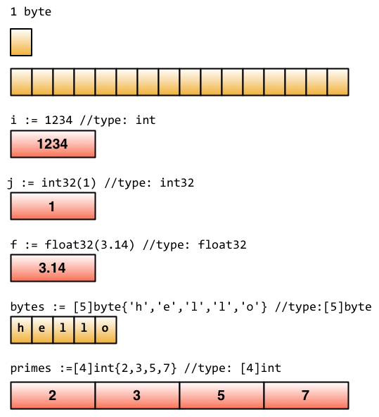
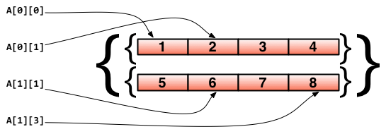
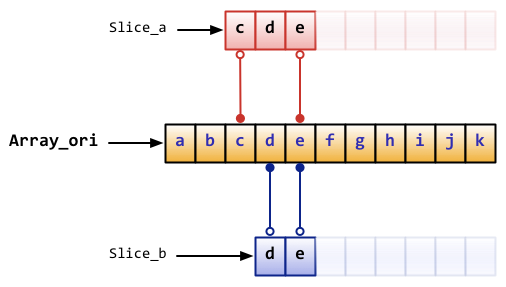
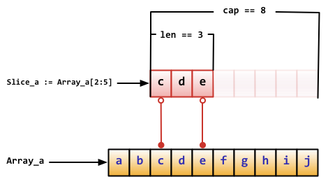
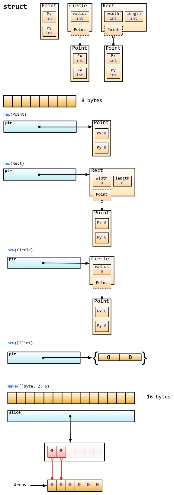

# 2.2 Fondacija Go

[Sadržaj](_00.0-sr.md)

U ovom odeljku ćemo vas naučiti kako da definišete konstante, promenljive sa elementarnim tipovima i neke veštine u Go programiranju.

## Promenljive

Postoji mnogo oblika sintakse koji se mogu koristiti za definisanje promenljivih u Gou.

Ključna reč `var` je osnovni oblik za definisanje promenljivih, primetite da Go stavlja tip promenljive afteru ime promenljive.

Definišite promenljivu;

```go
// define a variable with name "variableName” and type "type"
var variableName type
```

Definišite više promenljivih.

```go
// define three variables which types are "type"
var vname1, vname2, vname3 type
```

Definišite promenljivu sa početnom vrednošću.

```go
// define a variable with name "variableName”, type "type" and value "value"
var variableName type = value
```

Definišite više promenljivih sa početnim vrednostima.

```go
/*
    Define three variables with type "type", and initialize their values.
    vname1 is v1, vname2 is v2, vname3 is v3
*/
var vname1, vname2, vname3 type = v1, v2, v3
```

Da li mislite da je previše zamorno definisati promenljive na gore navedeni način? Ne brinite, jer je i Go tim otkrio da je ovo problem. Stoga, ako želite da definišete promenljive sa početnim vrednostima, možemo jednostavno izostaviti tip promenljive, tako da će kod umesto toga izgledati ovako:

```go
/*
    Define three variables without type "type", and initialize their values.
    vname1 is v1，vname2 is v2，vname3 is v3
*/
var vname1, vname2, vname3 = v1, v2, v3
```

Pa, znam da ovo još uvek nije dovoljno jednostavno za tebe. Da vidimo kako da to popravimo.

```go
/*
    Define three variables without type "type" and without keyword "var", and initialize their values.
    vname1 is v1，vname2 is v2，vname3 is v3
*/
vname1, vname2, vname3 := v1, v2, v3
```

Sada izgleda mnogo bolje. Koristite `:=` da zamenite `var` i `type`, ovo se zove kratka dodela. Ima jedno ograničenje: ovaj oblik se može koristiti samo unutar funkcija. Dobićete greške pri kompajlaciji ako pokušate da ga koristite van tela funkcija. Stoga obično koristimo `var` da definišemo globalne promenljive.

_ (prazno) je specijalno ime promenljive. Bilo koja vrednost koja joj se dodeli biće ignorisana. Na primer, dajemo 35 i odbacujemo 34.

**Napomena**: Ovaj primer vam samo pokazuje kako to funkcioniše. Ovde izgleda beskorisno ali često koristimo ovaj simbol kada dobijamo povratne vrednosti funkcije.

```go
_, b := 34, 35
```

> [!Note]
> Ako ne koristite promenljive koje ste definisali u svom programu, kompajler će vam javiti greške
> pri kompajlaciji. Pokušajte da kompajlirate sledeći kod i vidite šta će se desiti.

```go
package main

func main() {
    var i int
}
```

## Konstante

Takozvane konstante su vrednosti koje se određuju tokom kompajliranja i ne možete ih menjati tokom izvršavanja programa. U programu Go, možete koristiti broj, bulovsku vrednost ili string kao tipove konstanti.

Definišite konstante na sledeći način.

```go
const constantName = value

// you can assign type of constants if it's necessary
const Pi float32 = 3.1415926
```

Više primera.

```go
const Pi = 3.1415926
const i = 10000
const MaxThread = 10
const prefix = "astaxie_"
```

## Elementarni tipovi

### Bulove vrednosti

U programu Go, koristimo `bool` za definisanje promenljive kao bulovog tipa, vrednost može biti samo `true` ili `false`, `false` će biti podrazumevana vrednost.

> [!Note]
> Ne možete konvertovati tip promenljivih između broja i bulovog tipa!

```go
// sample code
var isActive bool                       // global variable
var enabled, disabled = true, false     // omit type of variables

func test() {
    var available bool  // local variable
    valid := false      // brief statement of variable
    available = true    // assign value to variable
}
```

### Numerički tipovi

Celobrojni tipovi uključuju i označene i neoznačene cele brojeve. Go ima `int` i `uint`, istovremeno, imaju istu dužinu, ali specifična dužina zavisi od vašeg operativnog sistema. Koriste 32-bitne verzije u 32-bitnim operativnim sistemima i 64-bitne verzije u 64-bitnim operativnim sistemima. Go takođe ima tipove koji imaju specifičnu dužinu, uključujući `rune`, `int8`, `int16`, `int32`, `int64`, `byte`, `uint8`, `uint16`, `uint32`, `uint64`. Imajte na umu da je `rune` alias od `int32` `byte` je alias od `uint8`.

Jedna važna stvar koju treba da znate je da ne možete dodeljivati vrednosti između ovih tipova, ova operacija će izazvati greške pri kompajlaciji.

```go
var a int8
var b int32

c := a + b // compile-time error
```

Iako `int32` ima veću dužinu od `int8` i isti je tip kao `int`, ne možete dodeliti vrednosti između njih. ( "c" će ovde biti naveden kao tip `int` )

Tipovi sa pokretnim zarezom imaju tipove `float32` i `float64` i nemaju tip koji se zove `float`. Potonji je podrazumevani tip ako se koristi naredba kratke dodele.

To je sve? Ne! Go podržava i kompleksne brojeve. `complex128` (sa 64-bitnim realnim i 64-bitnim imaginarnim delom) je podrazumevani tip, ako vam je potreban manji tip, postoji jedan koji se zove `complex64` (sa 32-bitnim realnim i 32-bitnim imaginarnim delom). Njegov oblik je "re+imi", gde je "re" realni deo, "im" imaginarni deo, "i" je imaginarni broj. Evo primera kompleksnog broja.

```go
var c complex64 = 5+5i
//output: (5+5i)
fmt.Printf("Value is: %v", c)
```

### Stringovi

Upravo smo govorili o tome kako Go koristi UTF-8 skup znakova. Stringovi su predstavljeni dvostrukim navodnicima `""` ili povratnim navodnicima `"``"`.

```go
// sample code
var frenchHello string                      // basic form to define string
var emptyString string = ""                 // define a string with empty string
func test() {
    no, yes, maybe := "no", "yes", "maybe"  // brief statement
    japaneseHello := "Ohaiou"
    frenchHello = "Bonjour"                 // basic form of assign values
}
```

Nemoguće je menjati vrednosti stringova po indeksu. Dobićete greške kada kompajlirate sledeći kod.

```go
var s string = "hello"
s[0] = 'c'
```

Šta ako zaista želim da promenim samo jedan karakter u stringu? Probajte sledeći kod.

```go
s := "hello"
c := []byte(s)          // convert string to []byte type
c[0] = 'c'
s2 := string(c)         // convert back to string type
fmt.Printf("%s\n", s2)
```

Operator koristite `+` za kombinovanje dva niza znakova.

```go
s := "hello,"
m := " world"
a := s + m
fmt.Printf("%s\n", a)
```

a takođe i:

```go
s := "hello"
s = "c" + s[1:] // you cannot change string values by index, but you can get values instead.
fmt.Printf("%s\n", s)
```

Šta ako želim da imam string od više redova?

```go
m := `hello
    world`
```

"`" neće izbeći nijedan znak u nizu.

### Tip grešaka

Go ima jedan `error` tip koji se koristi za obradu poruka o greškama. Postoji i paket koji se zove `errors` za obradu grešaka.

```go
err := errors.New("emit macho dwarf: elf header corrupted")
if err != nil {
    fmt.Print(err)
}
```

### Osnovne struktura podataka

Sledeća slika je iz članka o strukturi podataka u jeziku Go na blogu Rasa Koksa. Kao što vidite, Go koristi blokove memorije za skladištenje podataka.

  
Slika 2.1 Osnovna struktura podataka Go

### Grupne definicije

Ako želite da definišete više konstanti, promenljivih ili paketa za uvoz, možete koristiti grupni obrazac.

Osnovni oblik.

```go
import "fmt"
import "os"

const i = 100
const pi = 3.1415
const prefix = "Go_"

var i int
var pi float32
var prefix string

Grupni obrazac.

import(
    "fmt"
    "os"
)

const(
    i = 100
    pi = 3.1415
    prefix = "Go_"
)

var(
    i int
    pi float32
    prefix string
)
```

Osim ako konstanti ne dodelite vrednost `iota`, prva vrednost konstante u grupi `const()` će biti `0`. Ako sledećim konstantama eksplicitno ne dodelite vrednosti, njihove vrednosti će biti iste kao i poslednje. Ako je vrednost poslednje konstante `iota`, vrednosti sledećih konstanti koje nisu dodeljene su `iota` takođe.

### iota nabrajanja

Go ima jednu ključnu reč pod nazivom `iota`, ta ključna reč je za "napraviti " enum, počinje sa 0, uvećava za 1.

```go
const(
    x = iota  // x == 0
    y = iota  // y == 1
    z = iota  // z == 2
    w  // If there is no expression after the constants name, it uses the last expression,
       // so it's saying w = iota implicitly. Therefore w == 3, and y and z both can omit 
       // "= iota" as well.
)

const v = iota // once iota meets keyword `const`, it resets to `0`, so v = 0.

const (
  e, f, g = iota, iota, iota // e=0, f=0, g=0 values of iota are same in one line.
)
```

### Neka pravila

Razlog zašto je Go koncizan je taj što ima neka podrazumevana ponašanja.

- Bilo koja promenljiva koja počinje velikim slovom znači da će biti izvezena (exported), u
  suprotnom privatna.
- Isto pravilo važi i za funkcije i konstante, u Gou ne postoji ključna reč `public` ili `private`

## Niz, isečak, mapa

### Niz

`array` je očigledno niz, definišemo ga na sledeći način.

```go
var arr [n]type
```

u `[n]type`, `n` je dužina niza, `type` je tip njegovih elemenata. Kao i drugi jezici, koristimo   `[]` za dobijanje ili postavljanje vrednosti elemenata unutar nizova.

```go
var arr [10]int                                     // an array of type [10]int
arr[0] = 42                                         // array is 0-based
arr[1] = 13      // assign value to element
fmt.Printf("The first element is %d\n", arr[0])     // get element value, it returns 42
fmt.Printf("The last element is %d\n", arr[9])      // it returns default value of 10th element in 
                                                    // this array, which is 0 in this case.
```

Pošto je dužina deo tipa niza `[3]int` i `[4]int` različiti su tipovi, ne možemo menjati dužinu nizova. Kada koristite nizove kao argumente, funkcije dobijaju njihove kopije! Ako želite da koristite reference, možda ćete želeti da koristite slice - isečak. O tome ćemo kasnije.

Moguće je koristiti `:=` kada definišete nizove.

```go
a := [3]int{1, 2, 3} // define an int array with 3 elements

b := [10]int{1, 2, 3} // define a int array with 10 elements, of which the first three are 
                      // assigned. The rest of them use the default value 0.

c := [...]int{4, 5, 6} // use `...` to replace the length parameter and Go will calculate it for you.
```

Možda ćete želeti da koristite nizove kao elemente nizova. Da vidimo kako to da uradite.

```go
// define a two-dimensional array with 2 elements, and each element has 4 elements.
doubleArray := [2][4]int{[4]int{1, 2, 3, 4}, [4]int{5, 6, 7, 8}}

// The declaration can be written more concisely as follows.
easyArray := [2][4]int{{1, 2, 3, 4}, {5, 6, 7, 8}}
```

**Osnovna struktura podataka niza**:

  
Slika 2.2 Odnos mapiranja višedimenzionalnog niza

### Isečak

U mnogim situacijama, tip niza nije dobar izbor - na primer kada ne znamo koliko će niz biti dugačak kada ga definišemo. Stoga nam je potreban "dinamički niz". Ovo se u Go jeziku zove isečak.

Isečak nije zapravo dynamic array. To je referentni tip. Isečak ukazuje na osnovni objekat niz čija je deklaracija slična nizu, ali mu nije potrebna dužina.

```go
// just like defining an array, but this time, we exclude the length.
var fslice []int
```

Zatim definišemo isečak inicijalizujemo njegove podatke.

```go
isečak := []byte {'a', 'b', 'c', 'd'}
```

Isečak može redefinisati postojeće isečke ili nizove. Isečak koristi array[i:j] za isecanje, gde je `i` početni indeks, a `j` krajnji indeks, ali primetite da array[j] neće biti isečeno jer je dužina kriške `j-i`.

```go
// define an array with 10 elements whose types are bytes
var ar = [10]byte {'a', 'b', 'c', 'd', 'e', 'f', 'g', 'h', 'i', 'j'}

// define two slices with type []byte
var a, b []byte

// 'a' points to elements from 3rd to 5th in array ar.
a = ar[2:5]          // now 'a' has elements ar[2],ar[3] and ar[4]!

// 'b' is another slice of array ar
b = ar[3:5]         // now 'b' has elements ar[3] and ar[4]!
```

Obratite pažnju na razlike između isečka i niza kada ih definišete. Koristimo `[…]` da bismo dozvolili Go-u da izračuna dužinu, ali ga koristimo samo `[]` samo za definisanje isečka.

**Osnovna struktura podataka isečaka**:

  
Slika 2.3 Korespondencija između isečka i niza

Isečak ima neke praktične operacije.

- Isečak je zkao i niz asnovano na indeksu koji kreće od `0`, `ar[:n]` je isto kao `ar[0:n]`.
- Drugi indeks će biti dužina niza `len(ar)`, ako je izostavljen, tj. `ar[n:]` je isto kao `ar
  [n:len(ar)]`.
- Možete koristiti `ar[:]` za isecanje celog niza, razlozi su objašnjeni u prve dve izjave.

Više primera koji se odnose na isečke

```go
// define an array
var array = [10]byte{'a', 'b', 'c', 'd', 'e', 'f', 'g', 'h', 'i', 'j'}

// define two slices
var aSlice, bSlice []byte

// some convenient operations
aSlice = array[:3] // equals to aSlice = array[0:3] aSlice has elements a,b,c
aSlice = array[5:] // equals to aSlice = array[5:10] aSlice has elements f,g,h,i,j
aSlice = array[:]  // equals to aSlice = array[0:10] aSlice has all elements

// slice from slice
aSlice = array[3:7]  // aSlice has elements d,e,f,g，len=4，cap=7
bSlice = aSlice[1:3] // bSlice contains aSlice[1], aSlice[2], so it has elements e,f
bSlice = aSlice[:3]  // bSlice contains aSlice[0], aSlice[1], aSlice[2], so it has d,e,f
bSlice = aSlice[0:5] // slice could be expanded in range of cap, now bSlice contains d,e,f,g,h
bSlice = aSlice[:]   // bSlice has same elements as aSlice does, which are d,e,f,g
```

Isečak je referentni tip, tako da će sve promene uticati na druge promenljive koje ukazuju na isti isečak ili niz. Na primer, u slučaju "aSlice" i "bSlice" iznad, ako promenite vrednost elementa u "aSlice", "bSlice" će se takođe promeniti.

Isečak je po definiciji kao struktura i sadrži 3 dela.

- Pokazivač koji pokazuje gde isečak počinje.
- Dužina isečka.
- Kapacitet isečka, dužina od početnog indeksa do krajnjeg indeksa isečka.

```go
Array_a := [10]byte{'a', 'b', 'c', 'd', 'e', 'f', 'g', 'h', 'i', 'j'}
Slice_a := Array_a[2:5]
```

Osnovna struktura podataka gornjeg koda je sledeća:

  
Slika 2.4 Informacije o nizu odsečka

Postoje neke ugrađene funkcije za isečke.

- **len**   - daje dužinu isečka ili niza.
- **cap**   - daje maksimalnu dužinu isečka (nizov kapacitet je isti kao dužina).
- **append**-  dodaje jedan ili više elemenata istog tipa na isečak i vraća isečak.
- **copy**  - kopira elemente iz jednog isečka u drugi i vraća broj elemenata koji su kopirani.

> [!Note]
> `append` će promeniti niz na koji isečak pokazuje i uticaće na druge isečke koje ukazuju na isti
> niz. Takođe, ako nema dovoljno dužine za promenjeni isečak ( (cap-len) == 0 ), `append` vraća
> novi niz za ovaj isečak. Kada se ovo desi, druge isečci koji ukazuju na stari niz neće biti
> promenjeni.

### Mapa

Mapa ponaša se kao rečnik u Pajtonu. Koristite formulu `map[keyType]valueType` da je definišete.

Pogledajmo malo koda. Vrednosti se postavljaju i dobijaju u mapi slične vrednostima isečka, međutim, `index` u isečku može biti samo tipa `int`, dok mapa može koristiti mnogo više od toga: na primer `int`, `string`, ili šta god želite. Takođe, svi mogu da koriste `==` i `!=` za upoređivanje vrednosti.

```go
// use string as the key type, int as the value type, and `make` initialize it.
var numbers map[string] int

// another way to define map
numbers := make(map[string]int)
numbers["one"] = 1  // assign value by key
numbers["ten"] = 10
numbers["three"] = 3

fmt.Println("The third number is: ", numbers["three"]) // get values
// It prints: The third number is: 3
```

Neke napomene kada koristite mapu.

- Mapa je neuređena. Svaki put kada štampate map dobićete različite rezultate. Nemoguće je dobiti
  vrednosti pomoću indexa - morate koristiti key.
- Mapa nema fiksnu dužinu. To je referentni tip baš kao i isečak.
- `len` radi na mapi za. Vraća koliko ključeva ta mapa ima.
- Prilično je lako promeniti vrednost na mapi. Jednostavno koristite

  ```go
  numbers["one"]=11
  ```

  da biste promenili vrednost mape na ključu "one" na 11.

- Možete koristiti formu `key`:`val` za inicijalizaciju vrednosti mape
- Mapa ima ugrađene metode za proveru da li key postoji.
- Na mapi se koristi `delete` za brisanje elementa mape.

  ```go
  // Initialize a map
  rating := map[string]float32 {"C":5, "Go":4.5, "Python":4.5, "C++":2 }
  // map can to return two values. For the second return value, if the key doesn't
  // exist，'ok' is false. It returns true otherwise.
  csharpRating, ok := rating["C#"]
  if ok {
      fmt.Println("C# is in the map and its rating is ", csharpRating)
  } else {
      fmt.Println("We have no rating associated with C# in the map")
  }
  
  delete(rating, "C")  // delete element with key "c"
  ```

Kao što sam rekao gore, mapa je referentni tip. Ako dva map objekta ukazuju na iste osnovne podatke, svaka promena će uticati na oba.

```go
m := make(map[string]string)
m["Hello"] = "Bojour"
m1 := m
m1["Hello"] = "Salut"  // now the value of m["hello"] is Salut
```

### make, new

> [!Note]
>
> - `new` alocira memoriju nulte vrednosti tipu `T` i vraća njenu adresu.  
> - `make` vrši alokaciju memorije za ugrađene tipove, kao što su `map`, `slice` i `channel`, i
>   vraća adresu na sa početnom vrednošću.  
>   Razlog je da osnovni podaci ova tri tipa moraju biti inicijalizovani pre nego što se
>   ukazuje na njih.

Sledeća slika prikazuje kako se `new` i `make` razlikuju.

  
Slika 2.5 Osnovna alokacija memorije za make i new

Nulta vrednost ne znači praznu vrednost. To je vrednost koju promenljive podrazumevano imaju u većini slučajeva. Evo liste nekih nultih vrednosti.

```go
int     0
int8    0
int32   0
int64   0
uint    0x0
rune    0 // the actual type of rune is int32
byte    0x0 // the actual type of byte is uint8
float32 0 // length is 4 byte
float64 0 //length is 8 byte
bool    false
string  ""
```

[Sadržaj](_00.0-sr.md)
