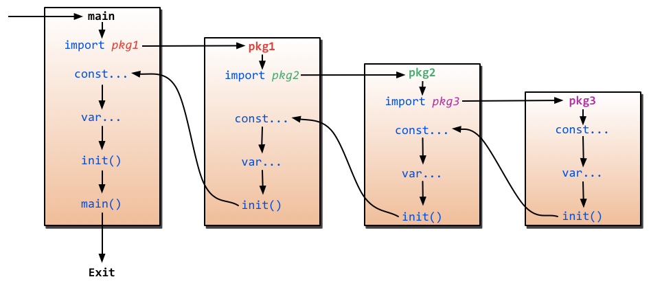
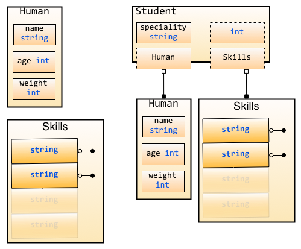

# 2. Osnovno znanje

Go je kompajlirani sistemski programski jezik i pripada C-familiji. Međutim, njegova brzina kompajliranja je mnogo veća od drugih jezika iz C-familije. Ima samo 25 ključnih reči… čak manje od 26 slova engleske abecede! Hajde da pogledamo ove ključne reči pre nego što počnemo.

```go
break    default      func    interface    select
case     defer        go      map          struct
chan     else         goto    package      switch
const    fallthrough  if      range        type
continue for          import  return       var
```

U ovom poglavlju, naučiću vas nekim osnovnim znanjima o Gou. Otkrićete koliko je programski jezik Go koncizan i koliko je lep dizajn jezika. Programiranje u Gou može biti veoma zabavno. Nakon što završimo ovo poglavlje, bićete upoznati sa gore navedenim ključnim rečima.

## Po čemu se Go razlikuje od drugih jezika

Programski jezik Go je kreiran sa jednim ciljem, da omogući kreiranje skalabilnih veb aplikacija za veliku publiku u velikom timu. Zato su jezik učinili što je moguće standardizovanijim, pa su `gofmt` alat i stroge smernice za korišćenje jezika bile da ne bi postojale dve frakcije u bazi programera, dok u drugim jezicima postoje verski ratovi oko toga gde držati početnu zagradu:

```java

// java main funkcija - 1. version
public static void main() {
}
```

or

```java

// java main funkcija - 2. version
public static void main()
{
}
```

ili za Pajton da li treba da koristimo 4 razmaka ili 6 razmaka ili jedan ili dva tabulatora i druga korisnička podešavanja. Ako poznajete Pajton, onda ste verovatno upoznati sa PEP8, što je skup smernica o tome kako pisati elegantan kod.

Iako ovo može delovati kao površan problem, kada baza koda raste i sve više ljudi radi na istoj bazi koda, postaje sve teže održati "lepotu" koda. Živimo u svetu gde roboti mogu da voze automobil, tako da ne bi trebalo samo da pišemo kod, već bi trebalo da pišemo elegantan kod.

Za druge jezike postoji mnogo varijabli kada je u pitanju pisanje koda. Svaki jezik je dobar za svoju primenu, ali Go je malo poseban jer je dizajniran u kompaniji koja je sinonim za internet (i distribuirano računarstvo). Tipično, da bi optimizovali programe, programeri biraju da pišu Javu umesto Pajtona i C++ umesto Jave, ali skoro svi dostupni jezici koji su široko korišćeni napisani su pre nekoliko decenija kada je 1GB skladišnog prostora bio mnogo skuplji. Sada su skladištenje i računarstvo relativno jeftini i računari dobijaju više jezgara, ali "stari jezici" ne koriste konkurentnost na način na koji to radi Go. To nije zato što su ti jezici loši; korišćenje konkurentnosti nije bilo relevantno korišćenje dok su se stariji jezici razvijali.

Da bi ublažili sve probleme sa kojima se Gugl suočavao sa trenutnim alatima, napisali su sistemski jezik pod nazivom Go koji ćete uskoro naučiti! Postoji mnogo prednosti korišćenja Go-a, ali postoje i mane, jer svaka medalja ima obe strane. Jedno od značajnih poboljšanja je u formatiranju koda. Gugl je dizajnirao jezik kako bi izbegao debate o formatiranju koda. Go kod koji napiše bilo ko na svetu (pod pretpostavkom da zna i koristi Go `gofmt`) izgledaće potpuno isto. Ovo neće izgledati važno dok ne radite u timu! Takođe, kada kompanija koristi automatizovani pregled koda ili neku drugu fensi tehniku, formatirani kod može da se pokvari u drugim jezicima koji nemaju stroga i standardna pravila formatiranja, ali ne i u Go-u!

Go je dizajniran imajući u vidu konkurentnost, imajte na umu da je "paralelizam != konkurentnost", postoji sjajan post Roba Pajka na blogu Golang, naći ćete ga tamo, vredi ga pročitati.

Još jedna veoma važna promena je koncept GOPATH. Prošli su dani kada ste morali da kreirate dir pod nazivom "code", a zatim da kreirate radne prostore za eclipse i šta sve ne. Sada morate da zadržite jedno stablo dir za GO kod koji će menadžer paketa automatski ažurirati. Takođe se preporučuje kreiranje diova sa prilagođenim domenom ili GitHub domenom, na primer, ja sam kreirao menadžer zadataka koristeći golang, pa sam kreirao skup dirova "~/go/src/github.com/thewhitetulip/Tasks".

**Napomena**: U *nix sistemima `~` označava kućni direktorijum, što je Windows ekvivalent `C:\\Users\\username`. Sada `~/go/` je univerzum za gocode na vašoj mašini. Ovo je značajno poboljšanje u odnosu na druge jezike; možemo efikasno da skladištimo kod bez problema. Iako u početku može delovati čudno, ovaj pristup ima mnogo smisla od smešnih imena paketa, tj. imena paketa generisanih za druge jezike korišćenjem obrnutih domena.

**Napomena**: Uz "src" postoje i dva dira "pkg", za pakete, i "bin" za binarne datoteke.

Ova GOPATH prednost nije ograničena samo na čuvanje koda u određenoj fascikli. Kada kreirate pet paketa za svoj projekat, ne morate ih uvoziti kao "import./db". Umesto toga, možete koristiti import "github.com/thewhitetulip/Tasks/db" tako da prilikom izvršavanja "go get" na mom repozitorijumu, go alat pronađe paket iz "github.com/... " putanje ako nije prvobitno preuzet. Ovo standardizuje mnoge pogrešne stvari u programskoj disciplini.

Iako postoje neke osnovane žalbe da su kreatori Go-a ignorisali sva istraživanja jezika urađena u poslednjih 30 godina, ne možete napraviti proizvod ili jezik u koji će se svi zaljubiti. Uvek postoje neki ili drugi slučajevi upotrebe ili ograničenja koja kreatori treba da uzmu u obzir.

Uzimajući u obzir sve prednosti, barem za veb razvoj, ne mislim da se bilo koji jezik može približiti prednostima koje go ima, čak i ako ignorišete sve što sam gore rekao. Go je kompajlirani jezik, što znači da u produkciji nećete morati da podešavate JVM ili virtualenv i umesto toga ćete imati jednu statičku binarnu datoteku! Kao šlag na torti, sve moderne biblioteke su u standardnoj biblioteci, kao što je http "lib", što vam omogućava da kreirate veb aplikacije u GoLang-u bez korišćenja veb frejmvorka treće strane.

## 2.1 Zdravo, Go

Pre nego što počnemo da pravimo aplikaciju u Go jeziku, moramo da naučimo kako da napišemo jednostavan program. Ne možete očekivati da izgradite zgradu, a da prvo ne znate kako da joj izgradite temelje. Stoga ćemo u ovom odeljku naučiti osnovnu sintaksu za pokretanje nekih jednostavnih programa.

### Program

Prema međunarodnoj praksi, pre nego što naučite kako da programirate u nekim jezicima, želećete da znate kako da napišete program koji će ispisati "Zdravo svete".

Jesi li spreman/spremna? Idemo!

```go
package main

import "fmt"

func main() {
    fmt.Printf("Hello, world or 你好，世界 or Καλημέρα κόσμε or こんにちは世界\n")
}
```

Ovaj program štampa sledeće:

```sh
Hello, world or 你好，世界 or Καλημέρα κόσμε or こんにちは世界
```

### Objašnjenje

Jedna stvar koju treba da znate na početku je da su Go programi sastavljeni od paketa.

`package <pkgName>` (U ovom slučaju je `package main`) nam govori da ova izvorna datoteka pripada `main` paketu, a ključna reč `main` nam govori da će ovaj paket biti kompajliran u program umesto u datoteke paketa čije su ekstenzije ".a".

Svaki izvršni program ima jedan i samo jedan "main" paket, i potrebna vam je ulazna funkcija koja se naziva `main` bez ikakvih argumenata ili povratnih vrednosti u `main` paketu.

Da bismo ispisali "Hello, world…", pozvali smo funkciju pod nazivom `Printf`. Ova funkcija dolazi iz `fmt` paketa, pa uvozimo ovaj paket u trećoj liniji izvornog koda, `import "fmt"`.

> [!Note]
> Način razmišljanja o paketima u Gou je sličan Pajtonu, i postoje neke prednosti: Modularnost
> (podelite program na više modula) i mogućnost ponovne upotrebe (svaki modul se može ponovo
> koristiti u više programa).

Upravo smo govorili o konceptima u vezi sa paketima, a kasnije ćemo napraviti sopstvene pakete.

U petom redu koristimo ključnu reč `func` da definišemo `main`. Telo funkcije je unutar `{}`, baš kao u C, C++ i Java.

Kao što vidite, nema argumenata. Naučićemo kako da pišemo funkcije sa argumentima za samo sekundu, a možete imati i funkcije koje nemaju povratnu vrednost ili imaju više povratnih vrednosti.

U šestom redu smo pozvali funkciju `Printf` koja je iz paketa `fmt`. Ona je pozvana sintaksom `<pkgName>.<funcName>`, koja je veoma slična Pajton stilu.

Kao što smo pomenuli u 1. poglavlju, ime paketa i ime dira koji sadrži taj paket mogu se razlikovati. Ovde `<pkgName>` potiče od imena `<pkgName>`, a ne od imena dira.

Možda ćete primetiti da gornji primer sadrži mnogo karaktera koji nisu ASCII. Svrha prikazivanja ovoga je da vam kažemo da Go podrazumevano podržava UTF-8. Možete koristiti bilo koji UTF-8 karakter u svojim programima.

Svaka go datoteka se nalazi u nekom paketu, i taj paket bi trebalo da bude poseban dir u GOPATH-u, ali `main` je poseban paket koji ne zahteva dir `main`. Ovo je jedan aspekt koji su izostavili radi standardizacije! Ali ako odlučite da napravite `main` dir, onda morate da se uverite da pravilno pokrećete binarnu datoteku. Takođe, jedan go kod ne može imati više od jedne `main` go datoteke.

```sh
~/go/src/github.com/thewhitetulip/Tasks/main $ go build ~/go/src/github.com/thewhitetulip/Tasks $./main/main
```

Stvar je u tome da kada vaš kod koristi neke statičke datoteke ili nešto drugo, onda bi trebalo da pokrenete binarnu datoteku iz korena aplikacije, kao što vidimo u drugom redu iznad. Ja pokrećem binarnu `main` datoteku izvan glavnog paketa. Ponekad se možete pitati zašto vaša aplikacija ne radi, pa bi to mogao biti jedan od mogućih problema. Imajte ovo na umu.

Jedna stvar koju ćete ovde primetiti je da go ne vidi da se koriste tačka-zarezi za kraj naredbe, pa, vidi, samo postoji mala začkoljica, od programera se ne očekuje da stavlja tačka-zareze, kompajler dodaje tačka-zareze u go kod kada se kompajlira, što je razlog zašto je ovo (srećom!) sintaksička greška.

```go
func main ()
{
}
```

Pošto kompajler dodaje tačku-zarez na kraju main() koje predstavlja sintaksičku grešku i kao što je gore navedeno, to pomaže u izbegavanju verskih ratova, voleo bih da se spoje vim i emacs i stvore univerzalni editor koji će pomoći da se spasu još neki ratovi! Ali za sada ćemo naučiti Go.

### Zaključak

Go koristi package(kao module u Pajtonu) za organizovanje programa. Funkcija main.main()(ova funkcija mora biti u mainpaketu) je ulazna tačka svakog programa. Go standardizuje jezik i većinu metodologije programiranja, štedeći vreme programerima koje bi potrošili u verskim ratovima. Može postojati samo jedan glavni paket i samo jedna glavna funkcija unutar glavnog paketa Goa. Go podržava UTF-8 karaktere jer je jedan od tvoraca Goa tvorac UTF-8, tako da Go podržava više jezika od trenutka kada je nastao.

## 2.2 Fondacija Go

U ovom odeljku ćemo vas naučiti kako da definišete konstante, promenljive sa elementarnim tipovima i neke veštine u Go programiranju.

### Promenljive

Postoji mnogo oblika sintakse koji se mogu koristiti za definisanje promenljivih u Gou.

Ključna reč `var` je osnovni oblik za definisanje promenljivih, primetite da Go stavlja tip promenljive afteru ime promenljive.

Definišite promenljivu;

```go
// define a variable with name "variableName” and type "type"
var variableName type
```

Definišite više promenljivih.

```go
// define three variables which types are "type"
var vname1, vname2, vname3 type
```

Definišite promenljivu sa početnom vrednošću.

```go
// define a variable with name "variableName”, type "type" and value "value"
var variableName type = value
```

Definišite više promenljivih sa početnim vrednostima.

```go
/*
    Define three variables with type "type", and initialize their values.
    vname1 is v1, vname2 is v2, vname3 is v3
*/
var vname1, vname2, vname3 type = v1, v2, v3
```

Da li mislite da je previše zamorno definisati promenljive na gore navedeni način? Ne brinite, jer je i Go tim otkrio da je ovo problem. Stoga, ako želite da definišete promenljive sa početnim vrednostima, možemo jednostavno izostaviti tip promenljive, tako da će kod umesto toga izgledati ovako:

```go
/*
    Define three variables without type "type", and initialize their values.
    vname1 is v1，vname2 is v2，vname3 is v3
*/
var vname1, vname2, vname3 = v1, v2, v3
```

Pa, znam da ovo još uvek nije dovoljno jednostavno za tebe. Da vidimo kako da to popravimo.

```go
/*
    Define three variables without type "type" and without keyword "var", and initialize their values.
    vname1 is v1，vname2 is v2，vname3 is v3
*/
vname1, vname2, vname3 := v1, v2, v3
```

Sada izgleda mnogo bolje. Koristite `:=` da zamenite `var` i `type`, ovo se zove kratka dodela. Ima jedno ograničenje: ovaj oblik se može koristiti samo unutar funkcija. Dobićete greške pri kompajlaciji ako pokušate da ga koristite van tela funkcija. Stoga obično koristimo `var` da definišemo globalne promenljive.

_ (prazno) je specijalno ime promenljive. Bilo koja vrednost koja joj se dodeli biće ignorisana. Na primer, dajemo 35 i odbacujemo 34.

**Napomena**: Ovaj primer vam samo pokazuje kako to funkcioniše. Ovde izgleda beskorisno ali često koristimo ovaj simbol kada dobijamo povratne vrednosti funkcije.

```go
_, b := 34, 35
```

> [!Note]
> Ako ne koristite promenljive koje ste definisali u svom programu, kompajler će vam javiti greške
> pri kompajlaciji. Pokušajte da kompajlirate sledeći kod i vidite šta će se desiti.

```go
package main

func main() {
    var i int
}
```

### Konstante

Takozvane konstante su vrednosti koje se određuju tokom kompajliranja i ne možete ih menjati tokom izvršavanja programa. U programu Go, možete koristiti broj, bulovsku vrednost ili string kao tipove konstanti.

Definišite konstante na sledeći način.

```go
const constantName = value

// you can assign type of constants if it's necessary
const Pi float32 = 3.1415926
```

Više primera.

```go
const Pi = 3.1415926
const i = 10000
const MaxThread = 10
const prefix = "astaxie_"
```

### Elementarni tipovi

#### Bulove vrednosti

U programu Go, koristimo `bool` za definisanje promenljive kao bulovog tipa, vrednost može biti samo `true` ili `false`, `false` će biti podrazumevana vrednost.

> [!Note]
> Ne možete konvertovati tip promenljivih između broja i bulovog tipa!

```go
// sample code
var isActive bool                       // global variable
var enabled, disabled = true, false     // omit type of variables

func test() {
    var available bool  // local variable
    valid := false      // brief statement of variable
    available = true    // assign value to variable
}
```

#### Numerički tipovi

Celobrojni tipovi uključuju i označene i neoznačene cele brojeve. Go ima `int` i `uint`, istovremeno, imaju istu dužinu, ali specifična dužina zavisi od vašeg operativnog sistema. Koriste 32-bitne verzije u 32-bitnim operativnim sistemima i 64-bitne verzije u 64-bitnim operativnim sistemima. Go takođe ima tipove koji imaju specifičnu dužinu, uključujući `rune`, `int8`, `int16`, `int32`, `int64`, `byte`, `uint8`, `uint16`, `uint32`, `uint64`. Imajte na umu da je `rune` alias od `int32` `byte` je alias od `uint8`.

Jedna važna stvar koju treba da znate je da ne možete dodeljivati vrednosti između ovih tipova, ova operacija će izazvati greške pri kompajlaciji.

```go
var a int8
var b int32

c := a + b // compile-time error
```

Iako `int32` ima veću dužinu od `int8` i isti je tip kao `int`, ne možete dodeliti vrednosti između njih. ( "c" će ovde biti naveden kao tip `int` )

Tipovi sa pokretnim zarezom imaju tipove `float32` i `float64` i nemaju tip koji se zove `float`. Potonji je podrazumevani tip ako se koristi naredba kratke dodele.

To je sve? Ne! Go podržava i kompleksne brojeve. `complex128` (sa 64-bitnim realnim i 64-bitnim imaginarnim delom) je podrazumevani tip, ako vam je potreban manji tip, postoji jedan koji se zove `complex64` (sa 32-bitnim realnim i 32-bitnim imaginarnim delom). Njegov oblik je "re+imi", gde je "re" realni deo, "im" imaginarni deo, "i" je imaginarni broj. Evo primera kompleksnog broja.

```go
var c complex64 = 5+5i
//output: (5+5i)
fmt.Printf("Value is: %v", c)
```

#### Stringovi

Upravo smo govorili o tome kako Go koristi UTF-8 skup znakova. Stringovi su predstavljeni dvostrukim navodnicima `""` ili povratnim navodnicima `"``"`.

```go
// sample code
var frenchHello string                      // basic form to define string
var emptyString string = ""                 // define a string with empty string
func test() {
    no, yes, maybe := "no", "yes", "maybe"  // brief statement
    japaneseHello := "Ohaiou"
    frenchHello = "Bonjour"                 // basic form of assign values
}
```

Nemoguće je menjati vrednosti stringova po indeksu. Dobićete greške kada kompajlirate sledeći kod.

```go
var s string = "hello"
s[0] = 'c'
```

Šta ako zaista želim da promenim samo jedan karakter u stringu? Probajte sledeći kod.

```go
s := "hello"
c := []byte(s)          // convert string to []byte type
c[0] = 'c'
s2 := string(c)         // convert back to string type
fmt.Printf("%s\n", s2)
```

Operator koristite `+` za kombinovanje dva niza znakova.

```go
s := "hello,"
m := " world"
a := s + m
fmt.Printf("%s\n", a)
```

a takođe i:

```go
s := "hello"
s = "c" + s[1:] // you cannot change string values by index, but you can get values instead.
fmt.Printf("%s\n", s)
```

Šta ako želim da imam string od više redova?

```go
m := `hello
    world`
```

"`" neće izbeći nijedan znak u nizu.

### Tip grešaka

Go ima jedan `error` tip koji se koristi za obradu poruka o greškama. Postoji i paket koji se zove `errors` za obradu grešaka.

```go
err := errors.New("emit macho dwarf: elf header corrupted")
if err != nil {
    fmt.Print(err)
}
```

### Osnovna struktura podataka

Sledeća slika je iz članka o strukturi podataka u jeziku Go na blogu Rasa Koksa. Kao što vidite, Go koristi blokove memorije za skladištenje podataka.

  
Slika 2.1 Osnovna struktura podataka Go

### Grupne definicije

Ako želite da definišete više konstanti, promenljivih ili paketa za uvoz, možete koristiti grupni obrazac.

Osnovni oblik.

```go
import "fmt"
import "os"

const i = 100
const pi = 3.1415
const prefix = "Go_"

var i int
var pi float32
var prefix string

Grupni obrazac.

import(
    "fmt"
    "os"
)

const(
    i = 100
    pi = 3.1415
    prefix = "Go_"
)

var(
    i int
    pi float32
    prefix string
)
```

Osim ako konstanti ne dodelite vrednost `iota`, prva vrednost konstante u grupi `const()` će biti `0`. Ako sledećim konstantama eksplicitno ne dodelite vrednosti, njihove vrednosti će biti iste kao i poslednje. Ako je vrednost poslednje konstante `iota`, vrednosti sledećih konstanti koje nisu dodeljene su `iota` takođe.

### iota nabrajanja

Go ima jednu ključnu reč pod nazivom `iota`, ta ključna reč je za "napraviti " enum, počinje sa 0, uvećava za 1.

```go
const(
    x = iota  // x == 0
    y = iota  // y == 1
    z = iota  // z == 2
    w  // If there is no expression after the constants name, it uses the last expression,
       // so it's saying w = iota implicitly. Therefore w == 3, and y and z both can omit 
       // "= iota" as well.
)

const v = iota // once iota meets keyword `const`, it resets to `0`, so v = 0.

const (
  e, f, g = iota, iota, iota // e=0, f=0, g=0 values of iota are same in one line.
)
```

### Neka pravila

Razlog zašto je Go koncizan je taj što ima neka podrazumevana ponašanja.

- Bilo koja promenljiva koja počinje velikim slovom znači da će biti izvezena (exported), u
  suprotnom privatna.
- Isto pravilo važi i za funkcije i konstante, u Gou ne postoji ključna reč `public` ili `private`

### Niz, isečak, mapa

#### Niz

`array` je očigledno niz, definišemo ga na sledeći način.

```go
var arr [n]type
```

u `[n]type`, `n` je dužina niza, `type` je tip njegovih elemenata. Kao i drugi jezici, koristimo   `[]` za dobijanje ili postavljanje vrednosti elemenata unutar nizova.

```go
var arr [10]int                                     // an array of type [10]int
arr[0] = 42                                         // array is 0-based
arr[1] = 13      // assign value to element
fmt.Printf("The first element is %d\n", arr[0])     // get element value, it returns 42
fmt.Printf("The last element is %d\n", arr[9])      // it returns default value of 10th element in 
                                                    // this array, which is 0 in this case.
```

Pošto je dužina deo tipa niza `[3]int` i `[4]int` različiti su tipovi, ne možemo menjati dužinu nizova. Kada koristite nizove kao argumente, funkcije dobijaju njihove kopije! Ako želite da koristite reference, možda ćete želeti da koristite slice - isečak. O tome ćemo kasnije.

Moguće je koristiti `:=` kada definišete nizove.

```go
a := [3]int{1, 2, 3} // define an int array with 3 elements

b := [10]int{1, 2, 3} // define a int array with 10 elements, of which the first three are 
                      // assigned. The rest of them use the default value 0.

c := [...]int{4, 5, 6} // use `...` to replace the length parameter and Go will calculate it for you.
```

Možda ćete želeti da koristite nizove kao elemente nizova. Da vidimo kako to da uradite.

```go
// define a two-dimensional array with 2 elements, and each element has 4 elements.
doubleArray := [2][4]int{[4]int{1, 2, 3, 4}, [4]int{5, 6, 7, 8}}

// The declaration can be written more concisely as follows.
easyArray := [2][4]int{{1, 2, 3, 4}, {5, 6, 7, 8}}
```

**Osnovna struktura podataka niza**:

  
Slika 2.2 Odnos mapiranja višedimenzionalnog niza

#### Isečak

U mnogim situacijama, tip niza nije dobar izbor - na primer kada ne znamo koliko će niz biti dugačak kada ga definišemo. Stoga nam je potreban "dinamički niz". Ovo se u Go jeziku zove isečak.

Isečak nije zapravo dynamic array. To je referentni tip. Isečak ukazuje na osnovni objekat niz čija je deklaracija slična nizu, ali mu nije potrebna dužina.

```go
// just like defining an array, but this time, we exclude the length.
var fslice []int
```

Zatim definišemo isečak inicijalizujemo njegove podatke.

```go
isečak := []byte {'a', 'b', 'c', 'd'}
```

Isečak može redefinisati postojeće isečke ili nizove. Isečak koristi array[i:j] za isecanje, gde je `i` početni indeks, a `j` krajnji indeks, ali primetite da array[j] neće biti isečeno jer je dužina kriške `j-i`.

```go
// define an array with 10 elements whose types are bytes
var ar = [10]byte {'a', 'b', 'c', 'd', 'e', 'f', 'g', 'h', 'i', 'j'}

// define two slices with type []byte
var a, b []byte

// 'a' points to elements from 3rd to 5th in array ar.
a = ar[2:5]          // now 'a' has elements ar[2],ar[3] and ar[4]!

// 'b' is another slice of array ar
b = ar[3:5]         // now 'b' has elements ar[3] and ar[4]!
```

Obratite pažnju na razlike između isečka i niza kada ih definišete. Koristimo `[…]` da bismo dozvolili Go-u da izračuna dužinu, ali ga koristimo samo `[]` samo za definisanje isečka.

**Osnovna struktura podataka isečaka**:

  
Slika 2.3 Korespondencija između isečka i niza

Isečak ima neke praktične operacije.

- Isečak je zkao i niz asnovano na indeksu koji kreće od `0`, `ar[:n]` je isto kao `ar[0:n]`.
- Drugi indeks će biti dužina niza `len(ar)`, ako je izostavljen, tj. `ar[n:]` je isto kao `ar
  [n:len(ar)]`.
- Možete koristiti `ar[:]` za isecanje celog niza, razlozi su objašnjeni u prve dve izjave.

Više primera koji se odnose na isečke

```go
// define an array
var array = [10]byte{'a', 'b', 'c', 'd', 'e', 'f', 'g', 'h', 'i', 'j'}

// define two slices
var aSlice, bSlice []byte

// some convenient operations
aSlice = array[:3] // equals to aSlice = array[0:3] aSlice has elements a,b,c
aSlice = array[5:] // equals to aSlice = array[5:10] aSlice has elements f,g,h,i,j
aSlice = array[:]  // equals to aSlice = array[0:10] aSlice has all elements

// slice from slice
aSlice = array[3:7]  // aSlice has elements d,e,f,g，len=4，cap=7
bSlice = aSlice[1:3] // bSlice contains aSlice[1], aSlice[2], so it has elements e,f
bSlice = aSlice[:3]  // bSlice contains aSlice[0], aSlice[1], aSlice[2], so it has d,e,f
bSlice = aSlice[0:5] // slice could be expanded in range of cap, now bSlice contains d,e,f,g,h
bSlice = aSlice[:]   // bSlice has same elements as aSlice does, which are d,e,f,g
```

Isečak je referentni tip, tako da će sve promene uticati na druge promenljive koje ukazuju na isti isečak ili niz. Na primer, u slučaju "aSlice" i "bSlice" iznad, ako promenite vrednost elementa u "aSlice", "bSlice" će se takođe promeniti.

Isečak je po definiciji kao struktura i sadrži 3 dela.

- Pokazivač koji pokazuje gde isečak počinje.
- Dužina isečka.
- Kapacitet isečka, dužina od početnog indeksa do krajnjeg indeksa isečka.

```go
Array_a := [10]byte{'a', 'b', 'c', 'd', 'e', 'f', 'g', 'h', 'i', 'j'}
Slice_a := Array_a[2:5]
```

Osnovna struktura podataka gornjeg koda je sledeća:

  
Slika 2.4 Informacije o nizu odsečka

Postoje neke ugrađene funkcije za isečke.

- **len**   - daje dužinu isečka ili niza.
- **cap**   - daje maksimalnu dužinu isečka (nizov kapacitet je isti kao dužina).
- **append**-  dodaje jedan ili više elemenata istog tipa na isečak i vraća isečak.
- **copy**  - kopira elemente iz jednog isečka u drugi i vraća broj elemenata koji su kopirani.

> [!Note]
> `append` će promeniti niz na koji isečak pokazuje i uticaće na druge isečke koje ukazuju na isti
> niz. Takođe, ako nema dovoljno dužine za promenjeni isečak ( (cap-len) == 0 ), `append` vraća
> novi niz za ovaj isečak. Kada se ovo desi, druge isečci koji ukazuju na stari niz neće biti
> promenjeni.

#### Mapa

Mapa ponaša se kao rečnik u Pajtonu. Koristite formulu `map[keyType]valueType` da je definišete.

Pogledajmo malo koda. Vrednosti se postavljaju i dobijaju u mapi slične vrednostima isečka, međutim, `index` u isečku može biti samo tipa `int`, dok mapa može koristiti mnogo više od toga: na primer `int`, `string`, ili šta god želite. Takođe, svi mogu da koriste `==` i `!=` za upoređivanje vrednosti.

```go
// use string as the key type, int as the value type, and `make` initialize it.
var numbers map[string] int

// another way to define map
numbers := make(map[string]int)
numbers["one"] = 1  // assign value by key
numbers["ten"] = 10
numbers["three"] = 3

fmt.Println("The third number is: ", numbers["three"]) // get values
// It prints: The third number is: 3
```

Neke napomene kada koristite mapu.

- Mapa je neuređena. Svaki put kada štampate map dobićete različite rezultate. Nemoguće je dobiti
  vrednosti pomoću indexa - morate koristiti key.
- Mapa nema fiksnu dužinu. To je referentni tip baš kao i isečak.
- `len` radi na mapi za. Vraća koliko ključeva ta mapa ima.
- Prilično je lako promeniti vrednost na mapi. Jednostavno koristite

  ```go
  numbers["one"]=11
  ```

  da biste promenili vrednost mape na ključu "one" na 11.

- Možete koristiti formu `key`:`val` za inicijalizaciju vrednosti mape
- Mapa ima ugrađene metode za proveru da li key postoji.
- Na mapi se koristi `delete` za brisanje elementa mape.

  ```go
  // Initialize a map
  rating := map[string]float32 {"C":5, "Go":4.5, "Python":4.5, "C++":2 }
  // map can to return two values. For the second return value, if the key doesn't
  // exist，'ok' is false. It returns true otherwise.
  csharpRating, ok := rating["C#"]
  if ok {
      fmt.Println("C# is in the map and its rating is ", csharpRating)
  } else {
      fmt.Println("We have no rating associated with C# in the map")
  }
  
  delete(rating, "C")  // delete element with key "c"
  ```

Kao što sam rekao gore, mapa je referentni tip. Ako dva map objekta ukazuju na iste osnovne podatke, svaka promena će uticati na oba.

```go
m := make(map[string]string)
m["Hello"] = "Bojour"
m1 := m
m1["Hello"] = "Salut"  // now the value of m["hello"] is Salut
```

#### make, new

> [!Note]
>
> - `new` alocira memoriju nulte vrednosti tipu `T` i vraća njenu adresu.  
> - `make` vrši alokaciju memorije za ugrađene tipove, kao što su `map`, `slice` i `channel`, i
>   vraća adresu na sa početnom vrednošću.  
>   Razlog je da osnovni podaci ova tri tipa moraju biti inicijalizovani pre nego što se
>   ukazuje na njih.

Sledeća slika prikazuje kako se `new` i `make` razlikuju.

  
Slika 2.5 Osnovna alokacija memorije za make i new

Nulta vrednost ne znači praznu vrednost. To je vrednost koju promenljive podrazumevano imaju u većini slučajeva. Evo liste nekih nultih vrednosti.

```go
int     0
int8    0
int32   0
int64   0
uint    0x0
rune    0 // the actual type of rune is int32
byte    0x0 // the actual type of byte is uint8
float32 0 // length is 4 byte
float64 0 //length is 8 byte
bool    false
string  ""
```

## 2.3 Kontrolni iskazi i funkcije

U ovom odeljku ćemo govoriti o kontrolnim naredbama i operacijama funkcija u jeziku Go.

### Kontrolni iskazi

Najveći izum u programiranju je kontrola toka. Zahvaljujući njoj, možete koristiti jednostavne kontrolne naredbe za predstavljanje složene logike. Postoje tri kategorije kontrole toka:

- uslovnog dkoka,
- kontrola ciklusa i
-bezuslovnog skoka.

#### if

`if` će najverovatnije biti najčešća ključna reč u vašim programima. Ako ispunjava uslove, onda radi nešto, a ako ne, radi nešto drugo.

`if` ne trebaju zagrade u Go-u.

```go
if x > 10 {
    fmt.Println("x is greater than 10")
} else {
    fmt.Println("x is less than or equal to 10")
}
```

Najkorisnija stvar kod `if` u Gou je to što može imati jednu inicijalizacionu naredbu pre uslovne naredbe. Opseg važenja promenljivih definisanih u ovoj inicijalizacionoj naredbi dostupan je samo unutar bloka definišućeg `if`.

```go
// initialize x, then check if x greater than
if x := computedValue(); x > 10 {
    fmt.Println("x is greater than 10")
} else {
    fmt.Println("x is less than 10")
}

// the following code will not compile, x is out of range if.
fmt.Println(x)
```

#### if ... else if ... else

Koristite `if ... else if ... else` za više uslova.

```go
if integer == 3 {
    fmt.Println("The integer is equal to 3")
} else if integer < 3 {
    fmt.Println("The integer is less than 3")
} else {
    fmt.Println("The integer is greater than 3")
}
```

#### goto

Go ima `goto` ključnu reč, ali budite oprezni kada je koristite. `goto` preusmerava tok upravljanja na prethodno definisanu `label` unutar tela istog bloka koda.

```go
func myFunc() {
    i := 0
Here:   // label ends with ":"
    fmt.Println(i)
    i++
    goto Here   // jump to label "Here"
}
```

U labeli se razlikuju velika i mala slova.

#### for

`for` je najmoćnija kontrolna logika u Gou. Može da čita podatke u petljama i iterativnim operacijama, baš kao `while` u drugim jezicima.

```go
for expression1; expression2; expression3 {
    //...
}
```

`expression1`, `expression2` i `expression3` su svi izrazi, gde su `expression1` i `expression3` definicije promenljivih ili povratne vrednosti iz funkcija, a `expression2` je uslovni iskaz. `expression1` će se izvršiti jednom pre petlje i `expression3` biće izvršen nakon svake petlje.

Primeri su korisniji od reči.

```go
package main

import "fmt"

func main(){
    sum := 0;
    for index:=0; index < 10 ; index++ {
        sum += index
    }
    fmt.Println("sum is equal to ", sum)
}
// Print：sum is equal to 45
```

Ponekad nam je potrebno više dodela, ali Go nema `,` operator  pa koristimo paralelno dodeljivanje kao što je i, j = i + 1, j - 1.

Možemo izostaviti `expression1` i `expression3`:

```go
sum := 1
for ; sum < 1000;  {
    sum += sum
}
```

Možemo izostaviti `;` takođe. Da li ti je poznato? Da, identično je sa `while`.

```go
sum := 1
for sum < 1000 {
    sum += sum
}
```

Postoje dve važne operacije u petljama, a to su `break` i `continue`. `break` izlazi iz petlje i `continue` preskače trenutni ciklus petlje i pokreće sledeći. Ako imate ugnježdene petlje, koristite `break` zajedno sa labelama.

```go
for index := 10; index>0; index-- {
    if index == 5{
        break // or continue
    }
    fmt.Println(index)
}
// break prints 10、9、8、7、6
// continue prints 10、9、8、7、6、4、3、2、1
```

`for` može da čita podatke iz `array`, `slice`, `map` i `string` kada se koristi zajedno sa `range`.

```go
for k, v := range map {
    fmt.Println("map's key:",k)
    fmt.Println("map's val:",v)
}
```

Pošto Go podržava vraćanje više vrednosti i daje greške pri kompajlaciji kada ne koristite vrednosti koje su definisane, možda ćete želeti da koristite `_` da biste odbacili određene vraćene vrednosti.

```go
for _, v := range map{
    fmt.Println("map's val:", v)
}
```

Sa go možete kreirati i beskonačnu petlju, što je ekvivalentno `while true { ... }` u drugim jezicima.

```go
for {
  // your logic
}
```

#### switch

Ponekad možete otkriti da koristite previše if-else naredbi da biste implementirali neku logiku, što može otežati njeno čitanje i održavanje u budućnosti. Ovo je savršeno vreme da upotrebite naredbu `switch` za rešavanje ovog problema.

```go
switch sExpr {
case expr1:
    some instructions
case expr2:
    some other instructions
case expr3:
    some other instructions
default:
    other code
}
```

Tip `sExpr`, `expr1`, `expr2`, i `expr3` mora biti isti. `switch` je veoma fleksibilan. Uslovi ne moraju biti konstante i izvršava se od vrha do dna dok se ne podudara sa uslovima. Ako nema iskaza posle ključne reči `switch`, onda se podudara sa `true`.

```go
i := 10
switch i {
case 1:
    fmt.Println("i is equal to 1")
case 2, 3, 4:
    fmt.Println("i is equal to 2, 3 or 4")
case 10:
    fmt.Println("i is equal to 10")
default:
    fmt.Println("All I know is that i is an integer")
}
```

U petom redu, stavljamo više vrednosti u jednu case, i ne moramo da dodajemo `break` ključnu reč na kraj `case` tela. Iskočiće iz tela `switch`-a kada se podudara sa bilo kojim slučajem. Ako želite da nastavite sa podudaranjem više slučajeva, potrebno je da koristite naredbu `fallthrough`.

```go
integer := 6
switch integer {
case 4:
    fmt.Println("integer <= 4")
    fallthrough
case 5:
    fmt.Println("integer <= 5")
    fallthrough
case 6:
    fmt.Println("integer <= 6")
    fallthrough
case 7:
    fmt.Println("integer <= 7")
    fallthrough
case 8:
    fmt.Println("integer <= 8")
    fallthrough
default:
    fmt.Println("default case")
}
```

Ovaj program štampa sledeće informacije.

```sh
integer <= 6
integer <= 7
integer <= 8
default case
```

### Funkcije

#### Definicija funkcije

Koristite `func` ključnu reč da biste definisali funkciju.

```go
func funcName(input1 type1, input2 type2) (output1 type1, output2 type2) {
    // function body
    // multi-value return
    return output1, output2
}
```

Iz gornjeg primera možemo zaključiti sledeće informacije:

- Koristite ključnu reč `func` da definišete funkciju `funcName`.
- Funkcije imaju nula, jedan ili više argumenata. Tip argumenta dolazi nakon imena argumenta, a
  argumenti su odvojeni znakom `,`.
- Funkcije mogu vratiti više vrednosti.
- Postoje dve povratne vrednosti imenovane `output1` i `output2`, možete izostaviti njihova imena
  i koristiti samo njihov tip.
- Ako postoji samo jedna povratna vrednost i izostavili ste ime, ne trebaju vam zagrade za
  povratne vrednosti.
- Ako funkcija nema povratne vrednosti, možete potpuno izostaviti parametre povratka.
- Ako funkcija ima povratne vrednosti, morate koristiti `return` naredbu negde u telu funkcije.

Da vidimo jedan praktičan primer - (izračunavanje maksimalnu vrednost).

```go
package main

import "fmt"

// return greater value between a and b
func max(a, b int) int {
    if a > b {
        return a
    }
    return b
}

func main() {
    x := 3
    y := 4
    z := 5

    max_xy := max(x, y) // call function max(x, y)
    max_xz := max(x, z) // call function max(x, z)

    fmt.Printf("max(%d, %d) = %d\n", x, y, max_xy)
    fmt.Printf("max(%d, %d) = %d\n", x, z, max_xz)
    fmt.Printf("max(%d, %d) = %d\n", y, z, max(y, z)) // call function here
}
```

U gornjem primeru, u funkciji `max` postoje dva argumenta, njihovi tipovi su `int`, tako da se prvi tip može izostaviti. Na primer, `a, b int`, umesto `a int, b int`. Ista pravila važe za dodatne argumente. Obratite pažnju da `max` ima samo jednu povratnu vrednost, tako da treba da napišemo samo tip njene povratne vrednosti - ovo je skraćeni oblik pisanja.

#### Višestruki povraćaj vrednosti

Jedna stvar u kojoj je Go bolji od C-a je to što podržava povratak više vrednosti.

Ovde ćemo koristiti sledeći primer.

```go
package main

import "fmt"

// return results of A + B and A * B
func SumAndProduct(A, B int) (int, int) {
    return A + B, A * B
}

func main() {
    x := 3
    y := 4

    xPLUSy, xTIMESy := SumAndProduct(x, y)

    fmt.Printf("%d + %d = %d\n", x, y, xPLUSy)
    fmt.Printf("%d * %d = %d\n", x, y, xTIMESy)
}
```

Gornji primer vraća dve vrednosti bez imena - imate mogućnost da ih imenujete. Ako bismo imenovali povratne vrednosti, trebalo bi nam samo da koristimo `return` da bismo vratili vrednosti jer se one automatski inicijalizuju u funkciji. Obratite pažnju da ako će se vaše funkcije koristiti van paketa, što znači da imena vaših funkcija počinju velikim slovom, bolje je da napišete kompletne izjave za `return`; to čini vaš kod čitljivijim.

```go
func SumAndProduct(A, B int) (add int, multiplied int) {
    add = A+B
    multiplied = A*B
    return
}
```

#### Varijadičke funkcije

Go podržava funkcije sa promenljivim brojem argumenata. Ove funkcije se nazivaju "varijadičke", što znači da funkcija dozvoljava neodređen broj argumenata.

```go
func myfunc(arg ...int) {}
```

`arg ...int` govori Go-u da je ovo funkcija koja ima promenljive argumente. Obratite pažnju da su ovi argumenti tipa `int`. U telu funkcije, `arg` postaje tip isečka `int`-ova.

```go
for _, n := range arg {
    fmt.Printf("And the number is: %d\n", n)
}
```

#### Prenos vrednosti i pokazivača

Kada prosledimo argument funkciji koja je pozvana, ta funkcija zapravo dobija kopiju naših promenljivih tako da bilo kakva promena neće uticati na originalnu promenljivu.

Da vidimo jedan primer kako bismo dokazali ono što govorim.

```go
package main

import "fmt"

// simple function to add 1 to a
func add1(a int) int {
    a = a + 1 // we change value of a
    return a  // return new value of a
}

func main() {
    x := 3

    fmt.Println("x = ", x) // should print "x = 3"

    x1 := add1(x) // call add1(x)

    fmt.Println("x+1 = ", x1) // should print "x+1 = 4"
    fmt.Println("x = ", x)    // should print "x = 3"
}
```

Vidite li to? Iako smo pozvali "add1" sa "x", početna vrednost "x" se ne menja.

Razlog je veoma jednostavan: kada smo pozvali "add1", dali smo joj kopiju "x".

Sada se možete pitati kako mogu da prosledim realnu vrednost x funkciji.

Ovde treba da koristimo pokazivače. Znamo da se promenljive čuvaju u memoriji i da imaju neke memorijske adrese. Dakle, ako želimo da promenimo vrednost promenljive, moramo proslediti njenu memorijsku adresu. Stoga funkcija add1 mora da zna memorijsku adresu "x" da bi promenila njenu vrednost. Ovde prenosimo "&x" na funkciju i menjamo tip argumenta na tip pokazivača `*int`. Imajte na umu da prenosimo kopiju pokazivača, a ne kopiju vrednosti.

```go
package main

import "fmt"

// simple function to add 1 to a
func add1(a *int) int {
    *a = *a + 1 // we changed value of a
    return *a   // return new value of a
}

func main() {
    x := 3

    fmt.Println("x = ", x) // should print "x = 3"

    x1 := add1(&x) // call add1(&x) pass memory address of x

    fmt.Println("x+1 = ", x1) // should print "x+1 = 4"
    fmt.Println("x = ", x)    // should print "x = 4"
}
```

Sada možemo promeniti vrednost "x" u funkciji "add1".

Zašto koristimo pokazivače, koje su prednosti?

- Omogućava nam da koristimo više funkcija za rad sa jednom promenljivom.
- Niska cena zbog prosleđivanja memorijskih adresa (8 bajtova), kopiranje nije efikasan način,
  kako u pogledu vremena tako i prostora, za prosleđivanje promenljivih.
- `channel`, `slice` i `map` su referentni tipovi, tako da koriste pokazivače prilikom prenosa na
  funkcije po podrazumevanim podešavanjima. (Pažnja: Ako treba da promenite dužinu slice, morate eksplicitno da prosledite pokazivače)

#### defer

Go ima dobro osmišljenu ključnu reč pod nazivom defer. Možete imati mnogo `defer` naredbi u jednoj funkciji; one će se izvršavati obrnutim redosledom kada se program izvršava do kraja funkcija. U slučaju da program otvori neke datoteke resursa, te datoteke bi morale biti zatvorene pre nego što funkcija može da se vrati sa greškama. Pogledajmo neke primere.

```go
func ReadWrite() bool {
    file.Open("file")
    // Do some work
    if failureX {
        file.Close()
        return false
    }

    if failureY {
        file.Close()
        return false
    }

    file.Close()
    return true
}
```

Videli smo da se neki kod ponavlja nekoliko puta. `defer` odlično rešava ovaj problem. Ne samo da vam pomaže da pišete čist kod, već ga čini i čitljivijim.

```go
func ReadWrite() bool {
    file.Open("file")
    defer file.Close()
    if failureX {
        return false
    }
    if failureY {
        return false
    }
    return true
}
```

Ako postoji više od jednog `defer`-a, izvršiće se obrnutim redosledom. Sledeći primer će ispisati 4 3 2 1 0.

```go
for i := 0; i < 5; i++ {
    defer fmt.Printf("%d ", i)
}
```

#### Funkcije kao vrednosti i tipovi

Funkcije su takođe promenljive u Gou, možemo ih koristiti u `type` za njihovo definisanje. Funkcije koje imaju isti potpis mogu se smatrati istim tipom.

```go
type typeName func(input1 inputType1 , input2 inputType2 [,...]) (result1 resultType1 [,...])
```

Koja je prednost ove funkcije? Odgovor je da nam omogućava da prosleđujemo funkcije kao vrednosti.

```go
package main

import "fmt"

type testInt func(int) bool                 // define a function type of variable

func isOdd(integer int) bool {
    return integer%2 != 0
}

func isEven(integer int) bool {
    return integer%2 == 0
}

// pass the function `f` as an argument to another function
func filter(slice []int, f testInt) []int {
    var result []int
    for _, value := range slice {
        if f(value) {
            result = append(result, value)
        }
    }
    return result
}

var slice = []int{1, 2, 3, 4, 5, 7}

func main() {
  odd := filter(slice, isOdd)
  even := filter(slice, isEven)

  fmt.Println("slice = ", slice)
    fmt.Println("Odd elements of slice are: ", odd)
    fmt.Println("Even elements of slice are: ", even)
}
```

Veoma je korisno kada koristimo interfejse. Kao što vidite, `f` promenljiva je funkciju tipa `func(int) bool`, a vraćene vrednosti i argumenti `filter` su isti kao i kod `testInt`. Stoga, možemo imati složenu logiku u našim programima, a da pritom zadržimo fleksibilnost u našem kodu.

#### Panika i oporavak

Go nema try-catch strukturu kao Java. Umesto izbacivanja izuzetaka, Go koristi `panic` i `recover` za rešavanje grešaka. Međutim, ne bi trebalo da ga koristite `panic` previše, iako je moćan.

`Panic` je ugrađena funkcija za prekidanje normalnog toka programa i prelazak u status panike. Kada funkcija `F` pozove `panic`, `F` neće nastaviti sa izvršavanjem, ali će njene `defer` funkcije nastaviti da se izvršavaju. Zatim se `F` vraća na tačku prekida koja je izazvala status panike. Program se neće završiti dok se sve ove funkcije ne vrate sa statusom panike na prvi nivo goroutine. `panic` može se proizvesti pozivanjem `panic` u programu, a neke greške takođe uzrokuju `panic` poput pristupa nizu van granica.

`Recover` je ugrađena funkcija za oporavak goroutine iz statusa panike. Pozivanje `recover` u  `defer` funkciji je korisno jer se normalne funkcije neće izvršavati kada je program u statusu panike. `recover` hvata `panic` vrednosti ako je program u statusu panike, a dobija `nil` ako program nije u statusu panike.

Sledeći primer pokazuje kako se koristi panic.

```go
var user = os.Getenv("USER")

func init() {
    if user == "" {
        panic("no value for $USER")
    }
}

Sledeći primer pokazuje kako se proverava panic.

func throwsPanic(f func()) (b bool) {
    defer func() {
        if x := recover(); x != nil {
            b = true
        }
    }()
    f() // if f causes panic, it will recover
    return
}
```

#### main i init funkcija

Go ima dve retenzije koje se zovu `main` i `init`, gde `init` se mogu koristiti u svim paketima i `mai` se koristi samo u `main` paketu. Ove dve funkcije ne mogu imati argumente ili povratne vrednosti. Iako možemo napisati mnogo `init` funkcija u jednom paketu, toplo preporučujem pisanje samo jedne `init` funkcije za svaki paket.

Go programi će automatski pozivati `init()` i `main()`, tako da ih ne morate sami pozivati. Za svaki paket, `init` funkcija je opcionalna, ali `package main` ima jednu i samo jednu `main` funkciju.

Programi se inicijalizuju počinju sa izvršavanjem iz `main` paketa. Ako `main` paket uvozi druge pakete, oni će biti uvezeni tokom kompajliranja. Ako se jedan paket uvozi više puta, biće kompajliran samo jednom. Nakon uvoza paketa, programi će inicijalizovati konstante i promenljive unutar uvezenih paketa, zatim izvršiti funkciju `init` ako postoji, i tako dalje. Nakon što su svi ostali paketi inicijalizovani, programi će inicijalizovati konstante i promenljive u `main` paketu, a zatim izvršiti `init` funkciju unutar `main` paketa ako postoji. Sledeća slika prikazuje proces.

  
Slika 2.6 Tok inicijalizacije programa u Go-u

#### import

Vrlo često koristimo `import` u Go programima na sledeći način:

```go
import(
    "fmt"
)
```

Zatim koristimo funkcije u tom paketu na sledeći način:

```go
fmt.Println("hello world")
```

`fmt` je paket standardne Go biblioteke, nalazi se unutar `$GOROOT/pkg`.

Go podržava pakete trećih strana na dva načina.

- Relativna putanja uvoza "./model” - učitavanje paketa u isti direktorijum, ne preporučujem ovaj
  način.
- Uvoz apsolutne putanje "shorturl/model" - učitavanje paketa u putanji "$GOPATH/pkg/shorturl/
  model"

Postoje neki posebni operatori kada uvozimo pakete, a početnici su uvek zbunjeni ovim operatorima.

#### Operator tačka `.`

Ponekad vidimo ljude kako koriste sledeći način za uvoz paketa.

```go
import(
   . "fmt"
)
```

Operator tačka znači da možete izostaviti ime paketa kada pozivate funkcije unutar tog paketa. Sada `fmt.Printf("Hello world")` postaje `Printf("Hello world")`.

#### Operator alijasa

Menja ime paketa koji smo uvezli kada pozivamo funkcije koje pripadaju tom paketu.

```go
import(
    f "fmt"
)
```

Sada `fmt.Printf("Hello world")` postaje `f.Printf("Hello world")`.

#### Operator _

Ovo je operator koji je teško razumeti bez objašnjenja.

```go
import (
    "database/sql"
    _ "github.com/ziutek/mymysql/godrv"
)
```

Operator `_` zapravo znači da samo želimo da uvezemo taj paket i izvršimo njegovu `init` funkciju, a nismo sigurni da li želimo da koristimo funkcije koje pripadaju tom paketu.

## 2.4 Struktura

### struct

Možemo definisati nove tipove kontejnera drugih svojstava ili polja u Go-u baš kao i u drugim programskim jezicima. Na primer, možemo kreirati tip koji se zove "person" da predstavlja osobu, sa poljima "name" i "age". Ovakvu vrstu tipa nazivamo `struct`.

```go
type person struct {
    name string
    age int
}
```

Pogledajte kako je lako definisati a struct!

Ovde postoje dva polja:

- "name" koristi string za čuvanje imena osobe.
- "age" koristi int za čuvanje starosti osobe.

Da vidimo kako da ga koristimo.

```go
type person struct {
    name string
    age int
}

var P person  // p is person type
```

#### Inicijalizacija vrednosti struct

```go
P.name = "Astaxie"                               // assign "Astaxie" to the field 'name' of p
P.age = 25                                       // assign 25 to field 'age' of p
fmt.Printf("The person's name is %s\n", P.name)  // access field 'name' of p
```

Postoje još tri načina za inicijalizaciju strukture.

#### Inicijaliazacija po redosledu polja

```go
P := person{"Tom", 25}
```

#### Inicijalizacija Korišćenjem formata field:value

```go
P := person{age:24, name:"Bob"}
```

#### Inicijalizuje struct anonimnom strukturom

```go
P := struct{name string; age int}{"Amy",18}
```

Da vidimo kompletan primer.

```go
package main

import "fmt"

// define a new type
type person struct {
    name string
    age  int
}

// struct is passed by value
// compare the age of two people, then return the older person and differences of age
func Older(p1, p2 person) (person, int) {
    if p1.age > p2.age {
        return p1, p1.age - p2.age
    }
    return p2, p2.age - p1.age
}

func main() {
    var tom person

    tom.name, tom.age = "Tom", 18
    bob := person{age: 25, name: "Bob"}
    paul := person{"Paul", 43}

    tb_Older, tb_diff := Older(tom, bob)
    tp_Older, tp_diff := Older(tom, paul)
    bp_Older, bp_diff := Older(bob, paul)

    fmt.Printf("Of %s and %s, %s is older by %d years\n", tom.name, bob.name, tb_Older.name, tb_diff)
    fmt.Printf("Of %s and %s, %s is older by %d years\n", tom.name, paul.name, tp_Older.name, tp_diff)
    fmt.Printf("Of %s and %s, %s is older by %d years\n", bob.name, paul.name, bp_Older.name, bp_diff)
}
```

#### Ugrađena polja u strukturi

Upravo sam vam predstavio kako da definišete strukturu sa imenima polja i tipom. Zapravo, Go podržava polja bez imena, ali sa tipovima. Ova polja nazivamo ugrađenim poljima.

Kada je ugrađeno polje struktura, sva polja u toj strukturi će implicitno biti polja u strukturi u koju je ugrađeno.

Da vidimo jedan primer.

```go
package main

import "fmt"

type Human struct {
    name   string
    age    int
    weight int
}

type Student struct {
    Human     // embedded field, it means Student struct includes all fields that Human has.
    specialty string
}

func main() {
    // instantiate and initialize a student
    mark := Student{Human{"Mark", 25, 120}, "Computer Science"}

    // access fields
    fmt.Println("His name is ", mark.name)
    fmt.Println("His age is ", mark.age)
    fmt.Println("His weight is ", mark.weight)
    fmt.Println("His specialty is ", mark.specialty)

    // modify mark's specialty
    mark.specialty = "AI"
    fmt.Println("Mark changed his specialty")
    fmt.Println("His specialty is ", mark.specialty)

    fmt.Println("Mark become old. He is not an athlete anymore")
    mark.age = 46
    mark.weight += 60
    fmt.Println("His age is", mark.age)
    fmt.Println("His weight is", mark.weight)
}
```


Slika 2.7 Ugrađivanje tipova

Vidimo da možemo pristupiti poljima `age` i `name` u struct `Student` baš kao što možemo u struct `Human`. Ovako funkcionišu ugrađena polja. Veoma je kul, zar ne? Čekajte, ima nešto bolje! Čak možete koristiti `Student` da pristupite `Human` u ovom ugrađenom polju!

```go
mark.Human = Human{"Marcus", 55, 220}
mark.Human.age -= 1
```

Svi tipovi u Go-u mogu se koristiti kao ugrađena polja.

```go
package main

import "fmt"

type Skills []string

type Human struct {
    name   string
    age    int
    weight int
}

type Student struct {
    Human     // struct as embedded field
    Skills    // string slice as embedded field
    int       // built-in type as embedded field
    specialty string
}

func main() {
    // initialize Student Jane
    jane := Student{Human: Human{"Jane", 35, 100}, specialty: "Biology"}
    // access fields
    fmt.Println("Her name is ", jane.name)
    fmt.Println("Her age is ", jane.age)
    fmt.Println("Her weight is ", jane.weight)
    fmt.Println("Her specialty is ", jane.specialty)
    // modify value of skill field
    jane.Skills = []string{"anatomy"}
    fmt.Println("Her skills are ", jane.Skills)
    fmt.Println("She acquired two new ones ")
    jane.Skills = append(jane.Skills, "physics", "golang")
    fmt.Println("Her skills now are ", jane.Skills)
    // modify embedded field
    jane.int = 3
    fmt.Println("Her preferred number is ", jane.int)
}
```

U gornjem primeru možemo videti da svi tipovi mogu biti ugrađena polja i da možemo koristiti funkcije za rad sa njima.

Međutim, postoji još jedan problem. Ako "Human" ima polje pod nazivom "phone", a "Student" ima polje sa istim imenom, šta treba da uradimo?

Reši to na veoma jednostavan način. Spoljna polja dobijaju više nivoe pristupa, što znači da kada pristupite student.phone, dobićemo polje pod nazivom phone u strukturi student, a ne ono u strukturi Human. Ova funkcija se jednostavno može videti kao polje overloading.

```go
package main

import "fmt"

type Human struct {
    name  string
    age   int
    phone string // Human has phone field
}

type Employee struct {
    Human
    specialty string
    phone     string // phone in employee
}

func main() {
    Bob := Employee{Human{"Bob", 34, "777-444-XXXX"}, "Designer", "333-222"}

    fmt.Println("Bob's work phone is:", Bob.phone)
    fmt.Println("Bob's personal phone is:", Bob.Human.phone)
}
```

## 2.5 Objektno orijentisano

U poslednja dva odeljka smo govorili o funkcijama i strukturama, ali da li ste ikada razmišljali o korišćenju funkcija kao polja strukture? U ovom odeljku, upoznaću vas sa drugim oblikom funkcije koji ima prijemnik, a to je `method`.

### Metod

Pretpostavimo da definišete strukturu "Rectanngle" i želite da izračunate njenu površinu. Obično bismo koristili sledeći kod da bismo postigli ovaj cilj.

```go
package main

import "fmt"

type Rectangle struct {
    width, height float64
}

func area(r Rectangle) float64 {
    return r.width * r.height
}

func main() {
    r1 := Rectangle{12, 2}
    r2 := Rectangle{9, 4}
    fmt.Println("Area of r1 is: ", area(r1))
    fmt.Println("Area of r2 is: ", area(r2))
}
```

Gornji primer može izračunati površinu pravougaonika. Koristimo funkciju pod nazivom "area", ali ona nije metoda strukture pravougaonika (kao metode klase u klasičnim objektno orijentisanim jezicima). Funkcija i struktura su dve nezavisne stvari, kao što možete primetiti.

Za sada to nije problem. Međutim, ako morate da izračunate i površinu kruga, kvadrata, petougla ili bilo koje druge vrste oblika, moraćete da dodate dodatne funkcije sa veoma sličnim nazivima.

Očigledno to nije kul. Takođe, površina bi zaista trebalo da bude svojstvo kruga ili pravougaonika.

Tu methodna scenu dolazi `method`. `Method` je funkcija povezana sa tipom. Ima sličnu sintaksu kao `func`, osim što posle `func` ključne reči ima parametar koji se zove the `receiver`.

Koristeći isti primer, "Rectangle.area()" pripada direktno pravougaoniku, umesto kao periferna funkcija. Preciznije, "length" i "width" i "area()" pripadaju pravougaoniku.

> [!Note]
> Kao što je rekao Rob Pajk:  
> "A method is a function with an implicit first argument, called a receiver."

### Sintaksa metode

```go
func (r ReceiverType) funcName(parameters) (results)
```

Hajde da promenimo naš primer koristeći metod umesto toga.

```go
package main

import (
    "fmt"
    "math"
)

type Circle struct {
    radius float64
}

type Rectangle struct {
    width, height float64
}

// method
func (c Circle) Area() float64 {
    return c.radius * c.radius * math.Pi
}

// method
func (r Rectangle) Area() float64 {
    return r.width * r.height
}

func main() {
    c1 := Circle{10}
    c2 := Circle{25}
    r1 := Rectangle{9, 4}
    r2 := Rectangle{12, 2}

    fmt.Println("Area of c1 is: ", c1.Area())
    fmt.Println("Area of c2 is: ", c2.Area())
    fmt.Println("Area of r1 is: ", r1.Area())
    fmt.Println("Area of r2 is: ", r2.Area())
}
```

Napomene za korišćenje metoda:

- Ako su imena metoda ista, ali ne dele iste prijemnike, one nisu iste.
- Metode mogu da pristupe poljima unutar prijemnika.
- Koristi se `.` za pozivanje metode u strukturi, na isti način kao što se pozivaju polja.

U gornjem primeru, metode "Area()" pripadaju i klasama "Rectangle" i "Circle", respektivno, tako da su prijemnici "Rectangle" i "Circle".

### Prijemnici vrednosti

- Metoda može biti definisana sa prijemnikom (`T`) kada dobija prijemnik vrednosti (kopija).
- Metoda može biti definisana sa prijemnikom (`*T`) kada dobija prijemnik pokazivač.

Razlika između njih je u tome što metoda može da promeni vrednosti svog prijemnika kada dobija prijemnik referencu, a kada dobija prijemnik kopiju to ne može da uradi.

Može li prijemnik biti samo struktura? Naravno da ne. Bilo koji tip može biti prijemnik metode. Možda ste zbunjeni oko prilagođenih tipova. Struktura je posebna vrsta prilagođenog tipa - postoji više prilagođenih tipova.

Koristite sledeći format da biste definisali prilagođeni tip.

```go
type typeName typeLiteral
```

Primeri prilagođenih tipova:

```go
type age int
type money float32
type months map[string]int

m := months {
    "January":31,
    "February":28,
    ...
    "December":31,
}
```

Nadam se da sada znate kako da koristite prilagođene tipove. Slično kao `typedef` u C-u, koristimo "age" sza zamenu `int` u gornjem primeru.

Hajde da se vratimo na razgovor o metodama.

Možete koristiti onoliko metoda u prilagođenim tipovima koliko želite.

```go
package main

import "fmt"

const (
    WHITE = iota
    BLACK
    BLUE
    RED
    YELLOW
)

type Box struct {
    width, height, depth float64
    color Color
}
type Color byte
type BoxList []Box //a slice of boxes

// method
func (b Box) Volume() float64 {
    return b.width * b.height * b.depth
}

// method with a pointer receiver
func (b *Box) SetColor(c Color) {
    b.color = c
}

// method
func (bl BoxList) BiggestsColor() Color {
    v := 0.00
    k := Color(WHITE)
    for _, b := range bl {
        if b.Volume() > v {
            v = b.Volume()
            k = b.color
        }
    }
    return k
}

// method
func (bl BoxList) PaintItBlack() {
    for i, _ := range bl {
        bl[i].SetColor(BLACK)
    }
}

// method
func (c Color) String() string {
    strings := []string{"WHITE", "BLACK", "BLUE", "RED", "YELLOW"}
    return strings[c]
}

func main() {
    boxes := BoxList{
        Box{4, 4, 4, RED},
        Box{10, 10, 1, YELLOW},
        Box{1, 1, 20, BLACK},
        Box{10, 10, 1, BLUE},
        Box{10, 30, 1, WHITE},
        Box{20, 20, 20, YELLOW},
    }

    fmt.Printf("We have %d boxes in our set\n", len(boxes))
    fmt.Println("The volume of the first one is", boxes[0].Volume(), "cm³")
    fmt.Println("The color of the last one is", boxes[len(boxes)-1].color.String())
    fmt.Println("The biggest one is", boxes.BiggestsColor().String())

    // Let's paint them all black
    boxes.PaintItBlack()

    fmt.Println("The color of the second one is", boxes[1].color.String())
    fmt.Println("Obviously, now, the biggest one is", boxes.BiggestsColor().String())
}
```

U gornjem kodu definišemo neke konstante i prilagođene tipove.

- Koristimo "Color" kao pseudonim za byte.
- Definišimo strukturu "Box" koja ima polja "visina", "širina", "dužina" i "boja".
- Definišimo strukturu "BoxList" koja ima "Box" kao svoje polje.

Zatim definišemo neke metode za naše prilagođene tipove.

- "Volume()" koristi Box kao svoj prijemnik i vraća zapreminu Box-a.
- "SetColor(c Color)" menja boju Box-a.
- "BiggestsColor()" vraća boju Boxa koji ima najveću zapreminu.
- "PaintItBlack()" postavlja boju za sve kutije u BoxList-u na crnu.
- "String()" koristi Color kao prijemnik, vraća string format imena boje.

### Prijemnik pokazivač

Hajde da pogledamo "SetColor" metodu. Njen prijemnik je pokazivač klase "Box". Da, možete ga koristiti kao "*Box" prijemnik. Zašto ovde koristimo pokazivač? Zato što želimo da promenimo boju struct "Box" u ovoj metodi.

Dakle, ako ne koristimo pokazivač, on će promeniti samo vrednost unutar kopije klase Box.

Ako vidimo da je prijemnik prvi argument metode, nije teško razumeti kako ona funkcioniše.

Možda se pitate zašto ne koristimo

```go
(*b).Color=c
```

umesto

```go
b.Color=c
```

u "SetColor()" metodi. Oba su ovde u redu, jer Go zna kako da interpretira zadatak. Da li mislite da je Go sada fascinantniji?

Možda se pitate i da li treba da koristimo "(&bl[i]).SetColor(BLACK)" in "PaintItBlack" jer prosleđujemo pokazivač na `SetColor`.

Ponovo, bilo koja opcija je u redu jer Go zna kako da je interpretira!

### Nasleđivanje metode

U poslednjem odeljku smo učili o nasleđivanju polja. Slično tome, imamo i nasleđivanje metoda u jeziku Go. Ako anonimno polje ima metode, onda će struktura koja sadrži to polje takođe imati sve metode iz njega.

```go
package main

import "fmt"

type Human struct {
    name  string
    age   int
    phone string
}

type Student struct {
    Human  // anonymous field
    school string
}

type Employee struct {
    Human
    company string
}

// define a method in Human
func (h *Human) SayHi() {
    fmt.Printf("Hi, I am %s you can call me on %s\n", h.name, h.phone)
}

func main() {
    sam := Employee{Human{"Sam", 45, "111-888-XXXX"}, "Golang Inc"}
    mark := Student{Human{"Mark", 25, "222-222-YYYY"}, "MIT"}

    sam.SayHi()
    mark.SayHi()
}
```

### Prepisivanje metoda

Ako želimo da metoda Employee ima svoju "SayHi", možemo definisati metodu koja ima isto ime u Employee-u, a ona će se sakriti "SayHi" u Human-u kada je pozovemo.

```go
package main

import "fmt"

type Human struct {
    name  string
    age   int
    phone string
}

type Student struct {
    Human
    school string
}

type Employee struct {
    Human
    company string
}

func (h *Human) SayHi() {
    fmt.Printf("Hi, I am %s you can call me on %s\n", h.name, h.phone)
}

func (e *Employee) SayHi() {
    fmt.Printf("Hi, I am %s, I work at %s. Call me on %s\n", e.name,
        e.company, e.phone) //Yes you can split into 2 lines here.
}

func main() {
    sam := Employee{Human{"Sam", 45, "111-888-XXXX"}, "Golang Inc"}
    mark := Student{Human{"Mark", 25, "222-222-YYYY"}, "MIT"}

    sam.SayHi()
    mark.SayHi()
}
```

Sada ste u mogućnosti da napišete objektno orijentisani program, a metode koriste pravilo velikog slova da bi odlučile da li je javni ili privatni.

## 2.6 Interfejs

### Interfejs

Jedna od najsuptilnijih karakteristika dizajna u Go jeziku su interfejsi. Nakon čitanja ovog odeljka, verovatno ćete biti impresionirani njihovom implementacijom.

Ukratko, interfejs je skup metoda koje koristimo za definisanje skupa akcija.

Kao i u primerima u prethodnim odeljcima, i "Student" i "Employee" mogu imati "SayHi()", ali ne rade istu stvar.

Hajde da uradimo još malo posla. Dodaćemo im još jednu metodu "Sing()", zajedno sa "BorrowMoney()" metodom za "Student" i "SpendSalary()" metodom za "Employee".

Ova kombinacija metoda se naziva interfejs i implementiraju je i "Student" i "Employee". Dakle:

| Student | Employee |
| ------- | -------- |
| SayHi() | SayHi() |
| Sign() | Sign() |
| BorrowMoney() | SpendSalary() |

### Tip interfejsa

Interfejs definiše skup metoda, pa ako tip implementira sve metode, kažemo da implementira interfejs.

```go
type Human struct {
    name  string
    age   int
    phone string
}

type Student struct {
    Human
    school string
    loan   float32
}

type Employee struct {
    Human
    company string
    money   float32
}

// define interfaces
type Men interface {
    SayHi()
    Sing(lyrics string)
    Guzzle(beerStein string)
}

type YoungChap interface {
    SayHi()
    Sing(song string)
    BorrowMoney(amount float32)
}

type ElderlyGent interface {
    SayHi()
    Sing(song string)
    SpendSalary(amount float32)
}

func (h *Human) SayHi() {
    fmt.Printf("Hi, I am %s you can call me on %s\n", h.name, h.phone)
}

func (h *Human) Sing(lyrics string) {
    fmt.Println("La la, la la la, la la la la la...", lyrics)
}

func (h *Human) Guzzle(beerStein string) {
    fmt.Println("Guzzle Guzzle Guzzle...", beerStein)
}

// Employee overloads SayHi
func (e *Employee) SayHi() {
    fmt.Printf("Hi, I am %s, I work at %s. Call me on %s\n", e.name,
        e.company, e.phone) //Yes you can split into 2 lines here.
}

func (s *Student) BorrowMoney(amount float32) {
    s.loan += amount // (again and again and...)
}

func (e *Employee) SpendSalary(amount float32) {
    e.money -= amount // More vodka please!!! Get me through the day!
}
```

Znamo da interfejs može biti implementiran bilo kojim tipom, a jedan tip može istovremeno implementirati više interfejsa.

Imajte na umu da bilo koji tip implementira prazan interfejs `interface{}` jer nema metode, a svi tipovi podrazumevano nemaju metode.

### Vrednost interfejsa

Dakle, koje vrste vrednosti se mogu staviti u interfejs? Ako definišemo promenljivu tipa interfejsa, bilo koji tip koji implementira taj interfejs može se dodeliti ovoj promenljivoj.

Kao u gornjem primeru, ako definišemo promenljivu "m" kao interfejs "Men", onda bilo koji od "Student", "Human" ili "Employee" može biti dodeljen "m". Dakle, mogli bismo imati isečak "Men", i bilo koji tip koji implementira interfejs "Men" može se dodeliti ovom isečku. Međutim, imajte na umu da isečak interfejsa nema isto ponašanje kao deo drugih tipova.

```go
package main

import "fmt"

type Human struct {
    name  string
    age   int
    phone string
}

type Student struct {
    Human
    school string
    loan   float32
}

type Employee struct {
    Human
    company string
    money   float32
}

// Interface Men implemented by Human, Student and Employee
type Men interface {
    SayHi()
    Sing(lyrics string)
}

// method
func (h Human) SayHi() {
    fmt.Printf("Hi, I am %s you can call me on %s\n", h.name, h.phone)
}

// method
func (h Human) Sing(lyrics string) {
    fmt.Println("La la la la...", lyrics)
}

// method
func (e Employee) SayHi() {
    fmt.Printf("Hi, I am %s, I work at %s. Call me on %s\n", e.name,
        e.company, e.phone) //Yes you can split into 2 lines here.
}

func main() {
    mike := Student{Human{"Mike", 25, "222-222-XXX"}, "MIT", 0.00}
    paul := Student{Human{"Paul", 26, "111-222-XXX"}, "Harvard", 100}
    sam := Employee{Human{"Sam", 36, "444-222-XXX"}, "Golang Inc.", 1000}
    tom := Employee{Human{"Tom", 36, "444-222-XXX"}, "Things Ltd.", 5000}

    // define interface i
    var i Men

    //i can store Student
    i = mike
    fmt.Println("This is Mike, a Student:")
    i.SayHi()
    i.Sing("November rain")

    //i can store Employee
    i = tom
    fmt.Println("This is Tom, an Employee:")
    i.SayHi()
    i.Sing("Born to be wild")

    // slice of Men
    fmt.Println("Let's use a slice of Men and see what happens")
    x := make([]Men, 3)
    
    // these three elements are different types but they all implemented interface Men
    x[0], x[1], x[2] = paul, sam, mike

    for _, value := range x {
        value.SayHi()
    }
}
```

Interfejs je skup apstraktnih metoda i može biti implementiran tipovima koji nisu interfejsi. Stoga ne može implementirati samog sebe.

### Prazan interfejs

Prazan interfejs je interfejs koji ne sadrži nikakve metode, tako da svi tipovi implementiraju prazan interfejs. Ova činjenica je veoma korisna kada želimo da sačuvamo sve tipove u nekom trenutku i slična je `void *` u C-u.

```go
// define a as empty interface
var void interface{}

// vars
i := 5
s := "Hello world"

// a can store value of any type
void = i
void = s
```

Ako funkcija koristi prazan interfejs kao tip argumenta, može prihvatiti bilo koji tip; ako funkcija koristi prazan interfejs kao tip povratne vrednosti, može vratiti bilo koji tip.

### Argumenti metode interfejsa

Bilo koja promenljiva može se koristiti u interfejsu. Pa kako možemo koristiti ovu funkciju da prosledimo bilo koju vrstu promenljive funkciji?

Na primer, koristimo `fmt.Println` mnogo, ali da li ste ikada primetili da može da prihvati bilo koju vrstu argumenta? Gledajući otvoreni izvorni kod `fmt`, vidimo sledeću definiciju.

```go
type Stringer interface {
    String() string
}
```

To znači da bilo koji tip koji implementira interfejs `Stringer` može biti prosleđen funkciji `fmt.Println` kao argument. Hajde da to dokažemo.

```go
package main

import (
    "fmt"
    "strconv"
)

type Human struct {
    name  string
    age   int
    phone string
}

// Human implements fmt.Stringer
func (h Human) String() string {
    return "Name:" + h.name + ", Age:" + strconv.Itoa(h.age) + " years, Contact:" + h.phone
}

func main() {
    Bob := Human{"Bob", 39, "000-7777-XXX"}
    fmt.Println("This Human is : ", Bob)
}
```

Ako se osvrnemo na primer "Box"-a, videćemo da "Color" takođe implementira interfejs `Stringer`, tako da možemo da prilagodimo format ispisa. Ako ne implementiramo ovaj interfejs, `fmt.Println` ispisuje tip u podrazumevanom formatu.

```go
fmt.Println("The biggest one is", boxes.BiggestsColor().String())
fmt.Println("The biggest one is", boxes.BiggestsColor())
```

> [!Note]
Ako je tip implementirao interfejs `error`, `fmt` će pozvati `Error(`), tako da u ovom trenutku ne morate da implementirate `Stringer`.

### Tip promenljive u interfejsu

Ako je promenljiva tipa koji implementira interfejs, znamo da se bilo koji drugi tip koji implementira isti interfejs može dodeliti ovoj promenljivoj. Pitanje je kako možemo znati koji je tačan tip sačuvan u interfejsu. Postoje dva načina koja ću vam pokazati.

#### Tvrdnja tipa u formi "comma-ok"

Go ima sintaksu:

```go
value, ok := element.(T)
```

Ovo proverava da li je promenljiva tipa koji očekujemo, gde je:

- "value" vrednost promenljive,
- "ok" je promenljiva bulovog tipa,
- "element" je interfejsna promenljiva,
- `T` je tip tvrdnje.

Ako je element tipa koji očekujemo, "ok" će biti `true`, u suprotnom `false`.

Hajde da upotrebimo primer da bismo jasnije videli.

```go
package main

import (
    "fmt"
    "strconv"
)

type Element interface{}
type List []Element

type Person struct {
    name string
    age  int
}

func (p Person) String() string {
    return "(name: " + p.name + " - age:    " + strconv.Itoa(p.age) + " years)"
}

func main() {
    list := make(List, 3)
    list[0] = 1       // an int
    list[1] = "Hello" // a string
    list[2] = Person{"Dennis", 70}

    for index, element := range list {
        if value, ok := element.(int); ok {
            fmt.Printf("list[%d] is an int and its value is %d\n", index, value)
        } else if value, ok := element.(string); ok {
            fmt.Printf("list[%d] is a string and its value is %s\n", index, value)
        } else if value, ok := element.(Person); ok {
            fmt.Printf("list[%d] is a Person and its value is %s\n", index, value)
        } else {
            fmt.Printf("list[%d] is of a different type\n", index)
        }
    }
}
```

Prilično je lako koristiti ovaj obrazac, ali ako imamo mnogo tipova za testiranje, bolje je da koristimo `switch`.

#### Swich test tipa

Hajde da upotrebimo `switch` da prepišemo gornji primer.

```go
package main

import (
    "fmt"
    "strconv"
)

type Element interface{}
type List []Element

type Person struct {
    name string
    age  int
}

func (p Person) String() string {
    return "(name: " + p.name + " - age: " + strconv.Itoa(p.age) + " years)"
}

func main() {
    list := make(List, 3)
    list[0] = 1       //an int
    list[1] = "Hello" //a string
    list[2] = Person{"Dennis", 70}

    for index, element := range list {
        switch value := element.(type) {
        case int:
            fmt.Printf("list[%d] is an int and its value is %d\n", index, value)
        case string:
            fmt.Printf("list[%d] is a string and its value is %s\n", index, value)
        case Person:
            fmt.Printf("list[%d] is a Person and its value is %s\n", index, value)
        default:
            fmt.Println("list[%d] is of a different type", index)
        }
    }
}
```

Jedna stvar koju treba zapamtiti je da `element.(type)` se ne može koristiti van tela `switch`, što znači da u tom slučaju morate koristiti `comma-ok` šablon.

### Ugrađeni interfejsi

Najlepše od svega je to što Go ima mnogo ugrađene logičke sintakse, kao što su anonimna polja u strukturi. Nije iznenađujuće da možemo koristiti interfejse i kao anonimna polja, ali ih nazivamo ugrađenim interfaejsima. Ovde pratimo ista pravila kao i za anonimna polja. Preciznije, ako interfejs ima drugi interfejs ugrađen u sebe, on će se ponašati kao da ima sve metode koje ima i ugrađeni interfejs.

Možemo videti da izvorna datoteka u `container/heap` ima sledeću definiciju:

```go
type Interface interface {
    sort.Interface // embedded sort.Interface
    Push(x interface{}) //a Push method to push elements into the heap
    Pop() interface{} //a Pop method that pops elements from the heap
}
```

Vidimo da je `sort.Interface` ugrađeni interfejs, tako da gore navedeni "Interface" implicitno ima tri metode sadržane unutar `sort.Interface`.

```go
type sort.Interface interface {
    // Len is the number of elements in the collection.
    Len() int
    // Less returns whether the element with index i should sort
    // before the element with index j.
    Less(i, j int) bool
    // Swap swaps the elements with indexes i and j.
    Swap(i, j int)
}
```

Još jedan primer je ono `io.ReadWriter` u paketu `io`.

```go
// io.ReadWriter
type ReadWriter interface {
    Reader
    Writer
}
```

### Reflex

Refleksija u Gou se koristi za određivanje informacija tokom izvršavanja. Koristimo `reflect` paket, a post "Zakoni refleksije" objašnjava kako refleksija funkcioniše u Gou.

Postoje tri koraka kada se koristi `reflect`.

1. Prvo, potrebno je da konvertujemo interfejs u ​​reflect tipove (`reflect.Type` ili `reflect.Value`, ovo zavisi od situacije).

   ```go
   t := reflect.TypeOf(i)    // get meta-data in type i, and use t to get all elements
   v := reflect.ValueOf(i)   // get actual value in type i, and use v to change its value
   ```
  
2. Nakon toga, možemo konvertovati reflektovane tipove da bismo dobili vrednosti koje su nam
   potrebne.

   ```go
   var x float64 = 3.4
   
   t := reflect.TypeOf(x)
   v := reflect.ValueOf(x)
   
   fmt.Println("type:", t)
   fmt.Println("value:", v)
   fmt.Println("kind is float64:", v.Kind() == reflect.Float64)
   ```

3. Konačno, ako želimo da promenimo vrednosti reflektovanih tipova, moramo ih učiniti
   modifikovanim. Kao što je ranije rečeno, postoji razlika između prenosa po vrednosti i prenosa po referenci. Sledeći kod se neće kompajlirati.

   ```go
   var x float64 = 3.4
   v := reflect.ValueOf(x)
   v.SetFloat(7.1)
   ```

   Umesto toga, moramo koristiti sledeći kod da promenimo vrednosti iz reflect tipova.

   ```go
   var x float64 = 3.4
   p := reflect.ValueOf(&x)
   v := p.Elem()
   v.SetFloat(7.1)
   ```

Upravo smo razgovarali o osnovama refleksije, međutim, morate više vežbati da biste bolje razumeli.

## 2.7 Konkurentnost

Kaže se da je Go jezik C 21. veka. Mislim da postoje dva razloga za to. Prvo, Go je jednostavan jezik. Drugo, konkurentnost je vruća tema u današnjem svetu, a Go podržava ovu funkciju na nivou jezika.

### Gorutine

Gorutine i konkurentnost su ugrađeni u osnovni dizajn Goa. Slični su nitima, ali rade drugačije. Go vam takođe pruža punu podršku za deljenje memorije u vašim gorutinama. Jedna gorutina obično koristi 4~5 KB steka memorije. Stoga nije teško pokrenuti hiljade gorutina na jednom računaru. Gorutina je lakša, efikasnija i praktičnija od sistemskih niti.

Gorutine se izvršavaju na menadžeru niti tokom izvršavanja u Go-u. Koristimo `go` ključnu reč da bismo kreirali novu gorutinu, koja je funkcija na osnovnom nivou ( `main()` je gorutina ).

```go
go hello(a, b, c)
```

Da vidimo primer.

```go
package main

import (
    "fmt"
    "runtime"
)

func say(s string) {
    for i := 0; i < 5; i++ {
        runtime.Gosched()
        fmt.Println(s)
    }
}

func main() {
    go say("world")         // create a new goroutine
    say("hello")            // current goroutine
}
```

Izlaz：

```sh
hello
world
hello
world
hello
world
hello
world
hello
```

Vidimo da je veoma lako koristiti konkurentnost u Go-u korišćenjem ključne reči `go`. U gornjem primeru, ove dve gorutine dele deo memorije, ali bi bilo bolje da pratimo recept dizajna: Ne koristite deljene podatke za komunikaciju, koristite komunikaciju za deljenje podataka.

`runtime.Gosched()` znači da dozvoli CPU-u da izvršava druge gorutine i da se vrati u nekom trenutku.

U Go 1.5, izvršno okruženje sada postavlja podrazumevani broj niti koje se istovremeno izvršavaju, definisan pomoću `GOMAXPROCS`, na broj jezgara dostupnih na procesoru.

Pre verzije Go 1.5, raspoređivač je koristio samo jednu nit za pokretanje svih gorutina, što znači da implementira samo konkurentnost. Ako želite da koristite više jezgara procesora da biste iskoristili prednosti paralelne obrade, morate pozvati `runtime.GOMAXPROCS(n)` da biste podesili broj jezgara koje želite da koristite. Ako je `n < 1`, to ne menja ništa.

### Kanali

Gorutine se izvršavaju u istom memorijskom adresnom prostoru, tako da morate održavati sinhronizaciju kada želite da pristupite deljenoj memoriji. Kako komunicirate između različitih gorutina? Go koristi veoma dobar mehanizam komunikacije koji se zove `channel`. `channel` je kao dvosmerni cevovod u Unix šelu: `channel` se koristi za slanje ili primanje podataka. Jedini tip podataka koji se može koristiti u kanalima je tip `channel` i ključna reč `chan`. Imajte na umu da morate koristiti `make` da biste kreirali novi `channel`.

```go
ci := make(chan int)
cs := make(chan string)
cf := make(chan interface{})
```

Kanal koristi operatora `<-` za slanje ili primanje podataka.

```go
ch <- v    // send v to channel ch.
v := <-ch  // receive data from ch, and assign to v
```

Da vidimo još primera.

```go
package main

import "fmt"

func sum(a []int, c chan int) {
    total := 0
    for _, v := range a {
        total += v
    }
    c <- total // send total to c
}

func main() {
    a := []int{7, 2, 8, -9, 4, 0}

    c := make(chan int)
    go sum(a[:len(a)/2], c)
    go sum(a[len(a)/2:], c)
    x, y := <-c, <-c // receive from c

    fmt.Println(x, y, x+y)
}
```

> [!Note]
> Slanje i primanje podataka u kanalima se podrazumevano blokira, tako da je mnogo lakše koristiti
> sinhrone gorutine.
>
> Pod blokom podrazumevam da:
>
> - gorutina neće nastaviti kada prima podatke iz kanala, ( value := <-ch ), dok druge gorutine ne
>   pošalju podatke ovom kanalu.
> - gorutina neće nastaviti dok se podaci koje šalje kanalu, tj. ( ch<- 5 ), ne prime.

### Baferovani kanali

Gore sam predstavio kanale koji nisu baferovani. Go takođe ima baferovane kanale koji mogu da sačuvaju više od jednog elementa. Na primer, sa:

```go
ch := make(chan bool, 4)
```

kreiramo kanal koji može da sačuva 4 bulova elementa. Dakle, ovom kanalu možemo da pošaljemo 4 elementa bez blokiranja, ali gorutina će biti blokirana kada pokušate da pošaljete peti element, a nijedna gorutina ga ne primi.

```go
ch := make(chan type, n)

n == 0 ! non-buffer（block）
n > 0 ! buffer（non-block until n elements in the channel）
```

Možete isprobati sledeći kod na računaru i promeniti neke vrednosti.

```go
package main

import "fmt"

func main() {
    c := make(chan int, 2) // change 2 to 1 will have runtime error, but 3 is fine
    c <- 1
    c <- 2
    fmt.Println(<-c)
    fmt.Println(<-c)
}
```

### Opseg i zatvaranje kanala

Možemo koristiti opseg za rad na kanalima bafera kao u `slice` i `map`.

```go
package main

import (
    "fmt"
)

func fibonacci(n int, c chan int) {
    x, y := 1, 1
    for i := 0; i < n; i++ {
        c <- x
        x, y = y, x+y
    }
    close(c)
}

func main() {
    c := make(chan int, 10)
    go fibonacci(cap(c), c)
    for i := range c {
        fmt.Println(i)
    }
}
```

`for i := range c` neće zaustaviti čitanje podataka iz kanala dok se kanal ne zatvori. U gornjem primeru koristimo ključnu reč `close` da bismo zatvorili kanal. Nemoguće je slati ili primati podatke na zatvorenom kanalu; možete koristiti `v, ok := <-ch` da biste proverili da li je kanal zatvoren. Ako "ok" vrati vrednost `false`, to znači da nema podataka u tom kanalu i da je zatvoren.

Zapamtite da uvek zatvarate kanale kod proizvođača (producer), a ne kod potrošača (consumer), ili je veoma lako upasti u paniku.

Još jedna stvar koju treba da zapamtite je da kanali nisu kao datoteke. Ne morate ih često zatvarati osim ako niste sigurni da je kanal potpuno beskoristan ili želite da izađete iz petlji opsega.

### Select

U gornjim primerima koristimo samo jedan kanal, ali kako možemo da se nosimo sa više od jednog kanala? Go ima ključnu reč koja se zove `select` slušanje više kanala.

`select` se podrazumevano blokira i nastavlja da se izvršava samo kada jedan od kanala ima podatke za slanje ili primanje. Ako je nekoliko kanala spremno za upotrebu istovremeno, `select` bira koji će se izvršiti nasumično.

```go
package main

import "fmt"

func fibonacci(c, quit chan int) {
    x, y := 1, 1
    for {
        select {
        case c <- x:
            x, y = y, x+y
        case <-quit:
            fmt.Println("quit")
            return
        }
    }
}

func main() {
    c := make(chan int)
    quit := make(chan int)
    go func() {
        for i := 0; i < 10; i++ {
            fmt.Println(<-c)
        }
        quit <- 0
    }()
    fibonacci(c, quit)
}
```

`select` takođe ima `default` slučaj, baš kao `switch`. Kada niedan od kanala nije spreman za upotrebu, izvršava podrazumevani slučaj (više ne čeka na kanal).

```go
select {
case i := <-c:
// use i
default:
// executes here when c is blocked
}
```

### Tajm-aut

Ponekad se gorutina blokira. Kako možemo to izbeći da bismo sprečili blokiranje celog programa? Jednostavno je, možemo podesiti vreme čekanja u `select`.

```go
func main() {
    c := make(chan int)
    o := make(chan bool)
    go func() {
        for {
            select {
            case v := <-c:
                println(v)
            case <-time.After(5 * time.Second):
                println("timeout")
                o <- true
                break
            }
        }
    }()
    <-o
}
```

### Izvršna gorutina

Paket runtimeima neke funkcije za rad sa gorutinama.

```go
runtime.Goexit()
```

Izlazi iz trenutne gorutine, ali odložene funkcije će se izvršiti kao i obično.

```go
runtime.Gosched()
```

Omogućava raspoređivaču da izvršava druge gorutine i vraća se u nekom trenutku.

```go
runtime.NumCPU() int
```

Vraća broj jezgara procesora

```go
runtime.NumGoroutine() int
```

Vraća broj gorutina

```go
runtime.GOMAXPROCS(n int) int
```

Podešava koliko jezgara procesora želite da koristite

## 2.8 Rezime

U ovom poglavlju smo uglavnom predstavili 25 ključnih reči u jeziku Go. Hajde da pregledamo šta su one i čemu služe.

```go
break    default      func    interface    select
case     defer        go      map          struct
chan     else         goto    package      switch
const    fallthrough  if      range        type
continue for          import  return       var
```

- **var** i **const** koriste se za definisanje promenljivih i konstanti.
- **package** i **import** namenjeni su za upotrebu paketa.
- **func** se koristi za definisanje funkcija i metoda.
- **return** se koristi za vraćanje vrednosti u funkcijama ili metodama.
- **defer** se koristi za definisanje funkcija odlaganja.
- **go** se koristi za pokretanje nove gorutine.
- **select** se koristi za prebacivanje preko više kanala komunikacije.
- **interface** se koristi za definisanje interfejsa.
- **struct** se koristi za definisanje posebnih prilagođenih tipova.
- **break**, **case**, **continue**, **for**, **fallthrough**, **else**, **if**, **switch**,
  **goto** i **default** su predstavljeni u odeljku 2.3.
- **chan** je vrsta kanala za komunikaciju između gorutina.
- **type** se koristi za definisanje prilagođenih tipova.
- **map** se koristi za definisanje mape koja je slična heš tabelama u drugim jezicima.
- **range** se koristi za čitanje podataka iz **isečka**, **mape** i **channel**-a.

Ako razumete kako da koristite ovih 25 ključnih reči, već ste mnogo naučili o Gou.
