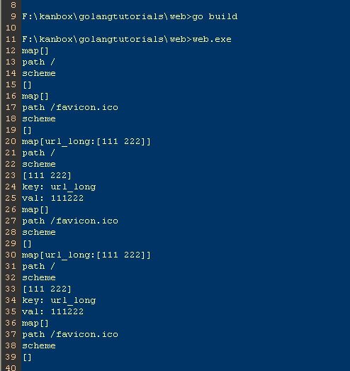
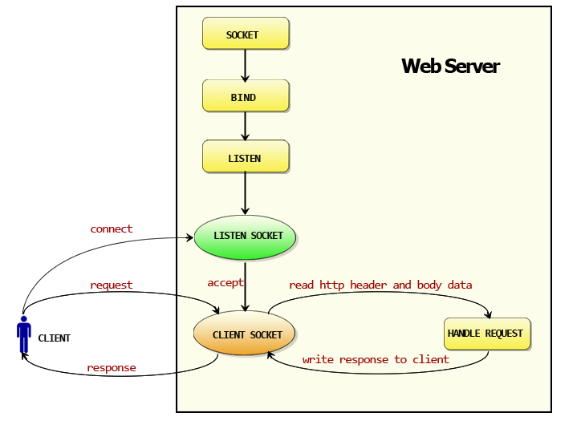
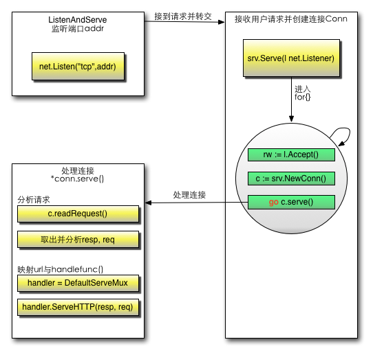

# 3 Veb fondacija

[Sadržaj](_00-sr.md)

Razlog zbog kojeg čitate ovu kjigu je taj što želite da naučite kako da pravite veb aplikacije u Gou. Kao što sam već rekao, Go pruža mnogo moćnih paketa poput `http`. Ovi paketi vam mogu mnogo pomoći kada pokušavate da napravite veb aplikacije. Naučiću vas svemu što treba da znate u narednim poglavjima, a u ovom poglavju ćemo govoriti o nekim konceptima veba i kako ga pokrećete.

## 3.1 Principi rada veba

Svaki put kada otvorite pregledač, ukucate neki URL i pritisnete Enter, videćete prelepe veb stranice koje se pojavljuju na vašem ekranu. Ali da li znate šta se dešava iza ovih jednostavnih radnji?

Obično je vaš pregledač klijent.

- Nakon što unesete URL adresu,
- on uzima deo URL adrese koji se odnosi na host i
- šalje ga DNS serveru (`Domain Name Server`) kako bi dobio IP adresu hosta.
- Zatim se povezuje sa IP adresom i traži da uspostavi TCP vezu.
- Pregledač šalje HTTP zahteve putem veze.
- Server ih obrađuje i odgovara HTTP odgovorima koji sadrže sadržaj koji čini veb stranicu.
- Na kraju, pregledač prikazuje telo veb stranice i isključuje se sa servera.

  
Slika 3.1 Procesi koje korisnici posećuju veb-sajt

Veb server, takođe poznat kao HTTP server, koristi HTTP protokol za komunikaciju sa klijentima. Svi veb pregledači se mogu smatrati klijentima.

Principe rada veba možemo podeliti na sledeće korake:

- Klijent koristi TCP/IP protokol za povezivanje sa serverom.
- Klijent šalje HTTP zahteve za pakete serveru.
- Server vraća HTTP pakete odgovora klijentu. Ako zahtevani resursi uključuju
  dinamičke skripte, server prvo poziva mehanizam za skripte.
- Klijent se isključuje sa servera, počinje sa renderovanjem HTML-a.
- Ovo je jednostavan tok rada HTTP poslova - primetite da server zatvara svoje veze nakon što
  pošalje podatke klijentima, a zatim čeka sledeći zahtev.

### Rezolucija URL-a i DNS-a

Uvek koristimo URL adrese za pristup veb stranicama, ali da li znate kako URL adrese funkcionišu?

Puno ime URL-a je `Uniform resource locator` služi za opisivanje resursa na internetu, a njegov osnovni oblik je sledeći.

```http
scheme://host[:port#]/path/.../[?query-string][#anchor]
```

gde su:

```http
scheme         Osnovni protokol (kao što su HTTP, HTTPS, FTP)
host           IP ili ime domena HTTP servera
port#          Podrazumevani port je 80 i može se izostaviti u ovom slučaju. Ako želite da koristite 
               drugi port, morate ga specificirati. Na primer, http://www.cnblogs.com:8080/.
path           put resursa
query-string   podaci koji se šalju na server
anchor         sidro
```

DNS je skraćenica od `Domain Name System` (Sistem imena domena). To je sistem imenovanja za usluge računarskih mreža i on konvertovanje imena domena u stvarne IP adrese, baš kao prevodilac.

  
Slika 3.2 Principi rada DNS-a

Da bismo bolje razumeli njegov princip rada, pogledajmo detaljan proces DNS rešavanja na sledeći način.

1. Nakon što unesete ime domena <www.qq.com> u pregledač, operativni sistem će proveriti da li postoje mapiranja veze u datotekama hosta za ovo ime domena. Ako je tako, onda je razrešavanje imena domena završeno.

2. Ako u datotekama hosta ne postoje veze mapiranja, operativni sistem će proveriti da li postoji mapiranje veze u keš memoriji DNS-a. Ako postoji, onda je razrešavanje imena domena završeno.

3. Ako ne postoje mapiranja veze ni u kešu hosta ni u DNS kešu, operativni sistem pronalazi prvi DNS server za razrešavanje u vašim TCP/IP podešavanjima, što je verovatno vaš lokalni DNS server. Kada lokalni DNS server primi upit, ako se ime domena koje želite da upitate nalazi u lokalnoj konfiguraciji njegovih regionalnih resursa, on vraća rezultate klijentu. Ovo DNS razrešavanje je autoritativno.

4. Ako lokalni DNS server ne sadrži ime domena, ali postoji mapiranje u kešu, lokalni DNS server vraća ovaj rezultat klijentu. Ovo DNS rešenje nije autoritativno.

5. Ako lokalni DNS server ne može da razreši ovo ime domena bilo konfiguracijom regionalnih resursa ili keš memorijom, preći će na sledeći korak, koji zavisi od podešavanja lokalnog DNS servera.

6. Ako lokalni DNS server ne omogući prosleđivanje, on usmerava zahtev na korenski DNS server, a zatim vraća IP adresu DNS servera najvišeg nivoa koja, ".com" u ovom slučaju, možda zna ime domena. Ako prvi DNS server najvišeg nivoa ne prepozna ime domena, ponovo preusmerava zahtev na sledeći DNS server najvišeg nivoa dok ne dođe do onog koji prepoznaje ime domena. Zatim DNS server najvišeg nivoa pita ovaj DNS server sledećeg nivoa za IP adresu koja odgovara <www.qq.com>.

7. Ako lokalni DNS server ima omogućeno prosleđivanje, šalje zahtev DNS serveru višeg nivoa. Ako ni DNS server višeg nivoa ne prepoznaje ime domena, zahtev se stalno preusmerava na više nivoe dok konačno ne dođe do DNS servera koji prepoznaje ime domena.

Bez obzira da li lokalni DNS server omogućava prosleđivanje ili ne, IP adresa imena domena se uvek vraća na lokalni DNS server, a lokalni DNS server je šalje nazad klijentu.


Slika 3.3 Tok rada za DNS rezoluciju

> [!Note]
> "Recursive query process" jednostavno znači da se ispitivači menjaju u procesu. Ispitivači se ne menjaju u "Iterative query" procesima.

Sada znamo da klijenti na kraju dobijaju IP adrese, tako da pregledači komuniciraju sa serverima putem IP adresa.

### HTTP protokol

HTTP protokol je osnovni deo veb servisa. Važno je znati šta je HTTP protokol pre nego što shvatite kako veb funkcioniše.

HTTP je protokol se koristi za olakšavanje komunikacije između pregledača i veb servera. Zasnovan je na TCP protokolu i obično koristi port 80 na strani veb servera. To je protokol koji koristi model zahtev-odgovor - klijenti šalju zahteve, a serveri odgovaraju. Prema HTTP protokolu, klijenti uvek uspostavljaju nove veze i šalju HTTP zahteve serverima. Serveri nisu u mogućnosti da se proaktivno povežu sa klijentima, niti da uspostave povratne veze. Veza između klijenta i servera može biti prekinuta sa bilo koje strane. Na primer, možete otkazati zahtev za preuzimanje i HTTP vezu i vaš pregledač će se isključiti sa servera pre nego što završite preuzimanje.

HTTP protokol je bez stanja, što znači da server nema pojma o vezi između dve veze iako su obe sa istog klijenta. Da bi rešile ovaj problem, veb aplikacije koriste kolačiće za održavanje stanja veza.

Pošto je HTTP protokol zasnovan na TCP protokolu, svi TCP napadi će uticati na HTTP komunikaciju na vašem serveru. Primeri takvih napada su SYN poplave, DoS i DDoS napadi.

#### Paket HTTP zahteva (informacije o pregledaču)

Svi paketi zahteva imaju tri dela: red zahteva, zaglavlje zahteva i telo. Između zaglavlja i tela postoji jedan prazan red.

```http
GET /domains/example/ HTTP/1.1      // request line: request method, URL, protocol and its version
Host：www.iana.org                          // domain name
User-Agent：Mozilla/5.0 (Windows NT 6.1)    // browser information
Accept：text/html,application/xhtml+xml,application/xml;q=0.9,*/*;q=0.8    // mime that clients can accept
Accept-Encoding：gzip,deflate,sdch        // stream compression
Accept-Charset：UTF-8,*;q=0.5             // character set in client side
// blank line
// body, request resource arguments (for example, arguments in POST)
```

Koristimo Fiddler da bismo dobili sledeće informacije o zahtevu.

  
Slika 3.4 Informacije o GET zahtevu koji je uhvatio fiddler


Slika 3.5 Informacije o POST zahtevu koji je uhvatio fiddler

Možemo videti da GET nema telo zahteva, za razliku od POST-a, koji ga ima.

Postoji mnogo metoda koje možete koristiti za komunikaciju sa serverima u HTTP-u; GET, POST, PUT i DELETE su 4 osnovne metode koje obično koristimo. URL predstavlja resurs na mreži, tako da ove 4 metode definišu operacije upita, promene, dodavanja i brisanja koje mogu delovati na ove resurse. GET i POST se veoma često koriste u HTTP-u. GET može da doda parametre upita URL-u, koristeći `?` za odvajanje URL-a i parametara i `&` između argumenata, kao što je "EditPosts.aspx?name=test1&id=123456". POST stavlja podatke u telo zahteva jer URL implementira ograničenje dužine putem pregledača. Stoga, POST može da pošalje mnogo više podataka nego GET. Takođe, kada šaljemo korisnička imena i lozinke, ne želimo da se ova vrsta informacija pojavi u URL-u, pa koristimo POST da bismo ih sakrili.

#### Paket HTTP odgovora (informacije o serveru)

Da vidimo koje informacije se nalaze u paketima odgovora.

```http
HTTP/1.1 200 OK                     // status line
Server: nginx/1.0.8                 // web server software and its version in the server machine
Date:Date: Tue, 30 Oct 2012 04:14:25 GMT        // responded time
Content-Type: text/html             // responded data type
Transfer-Encoding: chunked          // it means data were sent in fragments
Connection: keep-alive              // keep connection
Content-Length: 90                  // length of body
// blank line
<!DOCTYPE html PUBLIC "-//W3C//DTD XHTML 1.0 Transitional//EN"... // message body
```

Prvi red se naziva statusna linija. On prikazuje HTTP verziju, statusni kod i statusnu poruku.

Kod statusa obaveštava klijenta o statusu odgovora HTTP servera. U HTTP/1.1, definisano je 5 vrsta kodova statusa:

- 1xx Informational
- 2xx Success
- 3xx Redirection
- 4xx Client Error
- 5xx Server Error

Pogledajmo još primera o paketima odgovora. 200 znači da je server ispravno odgovorio, 302 znači preusmeravanje.


Slika 3.6 Kompletne informacije za posetu veb-sajtu

#### HTTP je bez stanja i konekcija: keep-alive

Termin "bez stanja" ne znači da server nema mogućnost da održi vezu. To jednostavno znači da server ne prepoznaje nikakve veze između bilo koja dva zahteva.

U HTTP/1.1, `Keep-alive` se koristi podrazumevano. Ako klijenti imaju dodatne zahteve, koristiće istu vezu za njih.

Obratite pažnju da funkcija `Keep-alive` ne može zauvek održavati jednu vezu; aplikacija koja se pokreće na serveru određuje ograničenje do kog treba održavati vezu, a u većini slučajeva možete konfigurisati ovo ograničenje.

#### Zahtevaj instancu


Slika 3.7 Svi paketi za otvaranje jedne veb stranice

Na gornjoj slici možemo videti ceo proces komunikacije između klijenta i servera. Možda ćete primetiti da na listi postoji mnogo datoteka resursa; one se nazivaju statičke datoteke, a Go ima specijalizovane metode obrade za ove datoteke.

Ovo je najvažnija funkcija pregledača: da zahtevaju URL adresu i preuzimaju podatke sa veb servera, a zatim prikazuju HTML. Ako pronađu neke datoteke u DOM-u, kao što su CSS ili JS datoteke, pregledači će ponovo zahtevati te resurse od servera dok se svi resursi ne prikažu na vašem ekranu.

Smanjenje vremena HTTP zahteva je jedan od načina za poboljšanje brzine učitavanja veb stranica. Smanjenjem broja CSS i JS datoteka koje je potrebno učitati, istovremeno se mogu smanjiti i latencije zahteva i opterećenje vaših veb servera.

## 3.2 Napravite jednostavan veb server

Razgovarali smo o tome da su veb aplikacije zasnovane na HTTP protokolu, a Go pruža punu HTTP podršku u `net/http` paketu. Veoma je lako podesiti veb server pomoću ovog paketa.

Koristite `http` paket za podešavaje veb servera

```go
package main
import (
    "fmt"
    "net/http"
    "strings"
    "log"
)

func sayhelloName(w http.ResponseWriter, r *http.Request) {
    r.ParseForm()  // parse arguments, you have to call this by yourself
    fmt.Println(r.Form)  // print form information in server side
    fmt.Println("path", r.URL.Path)
    fmt.Println("scheme", r.URL.Scheme)
    fmt.Println(r.Form["url_long"])
    for k, v := range r.Form {
        fmt.Println("key:", k)
        fmt.Println("val:", strings.Join(v, ""))
    }
    fmt.Fprintf(w, "Hello astaxie!") // send data to client side
}
func main() {
    http.HandleFunc("/", sayhelloName) // set router
    err := http.ListenAndServe(":9090", nil) // set listen port
    if err != nil {
       log.Fatal("ListenAndServe: ", err)
    }
}
```

Nakon što izvršimo gornji kod, server počije da sluša port 9090 na lokalnom hostu.

Otvorite pregledač i posetite <http://localhost:9090>. Možete to videti "Hello astaxie" na ekranu.

Hajde da pokušamo sa drugom adresom sa dodatnim argumentima: <http://localhost:9090/?url_long=111&url_long=222>

Sada da vidimo šta se dešava na strani klijenta i servera.

Trebalo bi da vidite sledeće informacije na strani servera:

  
Slika 3.8 Štampane informacije servera

Kao što vidite, potrebno je da pozovemo samo dve funkcije da bismo napravili jednostavan veb server.

Ako radite sa PHP-om, verovatno se pitate da li nam je potrebno nešto poput Nginx-a ili Apache-a. Odgovor je da nam nije potrebno, jer Go sam sluša TCP port, a funkcija "sayhelloName" je logička funkcija baš kao i kontroler u PHP-u.

Ako radite sa Pajtonom, trebalo bi da znate šta je Tornado, a gornji primer je veoma sličan tome.

Ako radite sa Rubijem, možete primetiti da je to kao skripta/server u RoR-u (Ruby on Rails).

U ovom odejku smo koristili dve jednostavne funkcije za podešavaje jednostavnog veb servera, a ovaj jednostavan server već ima kapacitet za operacije sa visokim nivoom konkurentnosti. O tome kako se ovo koristi govorićemo u naredna dva odejka.

## 3.3 Kako Go funkcioniše sa vebom

U prethodnom odeljku smo naučili kako da koristimo net/httppaket za izgradnju jednostavnog veb servera, a svi ti principi rada su isti kao oni o kojima ćemo govoriti u prvom odeljku ovog poglavlja.

### Koncepti u veb principima

- **Request**: zahtevanje podataka od korisnika, uključujući POST, GET, kolačić i URL.
- **Response**: podaci odgovora od servera ka klijentima.
- **Conn**: veze između klijenata i servera.
- **Handler**: Logika obrade zahteva i generisanje odgovora.

### Mehanizam rada http paketa

Sledeća slika prikazuje tok rada Go veb servera.

  
Slika 3.9 http tok rada

- Napravi soket za slušanje, slušaj port i čekaj klijente.
- Prihvati zahteve od klijenata.
- Obrađuj zahteve, čitaj HTTP zaglavlje. Ako zahtev koristi POST metod, čitaj podatke u telu poruke
  i prosleđuj ih obrađivačima.
- Konačno, soket vraća podatke odgovora klijentima.

Kada znamo odgovore na sledeća tri pitanja, lako je znati kako veb funkcioniše u Go-u.

- Kako slušamo port?
- Kako prihvatamo zahteve klijenata?
- Kako dodeljujemo rukovaoce?

U prethodnom odeljku smo videli da Go koristi `ListenAndServe` za obradu ovih koraka:

- inicijalizacija objekta servera,
- poziv `net.Listen("tcp", addr)` za podešavanje TCP slušača i
- slušanje određene adrese i porta.

Hajde da pogledamo izvorni kod http paketa.

```go
//Build version go1.1.2.
func (srv *Server) Serve(l net.Listener) error {
    defer l.Close()
    var tempDelay time.Duration // how long to sleep on accept failure
    for {
        rw, e := l.Accept()
        if e != nil {
            if ne, ok := e.(net.Error); ok && ne.Temporary() {
                if tempDelay == 0 {
                    tempDelay = 5 * time.Millisecond
                } else {
                    tempDelay *= 2
                }
                if max := 1 * time.Second; tempDelay > max {
                    tempDelay = max
                }
                log.Printf("http: Accept error: %v; retrying in %v", e, tempDelay)
                time.Sleep(tempDelay)
                continue
            }
            return e
        }
        tempDelay = 0
        c, err := srv.newConn(rw)
        if err != nil {
            continue
        }
        go c.serve()
    }
}
```

Kako prihvatamo zahteve klijenata nakon što počnemo da slušamo port? U izvornom kodu možemo videti da `srv.Serve(net.Listener)` se poziva za obradu zahteva klijenata. U telu funkcije nalazi se `for{}`. Ona prihvata zahtev, kreira novu vezu, a zatim pokreće novu gorutinu, prosleđujući podatke zahteva gorutini `go c.serve()`. Ovako Go podržava visoku konkurentnost, a svaka gorutina je nezavisna.

Kako koristimo određene funkcije za rukovanje zahtevima? Prvo `conn` analizira zahtev `c.ReadRequest()`, a zatim dobija odgovarajući rukovalac: `handler := sh.srv.Handler`, što je drugi argument koji smo prosledili kada smo pozvali `ListenAndServe`. Pošto smo prosledili `nil`, Go koristi svoj podrazumevani rukovalac `handler = DefaultServeMux`. Šta ovde DefaultServeMux radi? Pa, to je promenljiva rutera koja može da poziva funkcije rukovanja za određene URL-ove. Da li smo ovo podesili? Da, jesmo. Uradili smo to u prvom redu gde smo koristili `http.HandleFunc("/", sayhelloName)`. Koristimo ovu funkciju da registrujemo pravilo rutera za putanju `/`. Kada je URL `/`, ruter poziva funkciju `sayhelloName`. `DefaultServeMux` poziva `ServerHTTP` da bi dobio funkcije rukovanja za različite putanje, pozivajući `sayhelloName` u ovom konkretnom slučaju. Konačno, server piše podatke i odgovara klijentima.  

Detaljan tok rada:

  
Slika 3.10 Tok rada obrade HTTP zahteva

Mislim da bi sada trebalo da znaš kako Go pokreće veb servere.

## 3.4 Ulazak u http paket

U prethodnim odeljcima smo učili o toku rada na vebu i malo smo govorili o Go `http` paketu. U ovom odeljku ćemo saznati o dve osnovne funkcije u `http` paketu: `Conn` i `ServeMux`.

### Gorutina u Conn

Za razliku od normalnih HTTP servera, Go koristi goroutine za svaki zadatak koji pokreće `Conn` kako bi se postigla visoka konkurentnost i performanse, tako da je svaki zadatak nezavisan.

Go koristi sledeći kod da čeka nove veze od klijenata.

```go
c, err := srv.newConn(rw)
if err != nil {
    continue
}
go c.serve()
```

Kao što vidite, kreira novu gorutinu za svaku vezu i prosleđuje rukovaoca koji je u stanju da čita podatke iz zahteva gorutini.

### Prilagođeni ServeMux

U prethodnim odeljcima smo koristili podrazumevani ruter za Go kada smo govorili o `conn.server`-u, pri čemu je ruter prosleđivao podatke zahteva bekend hendlu.

Struktura podrazumevanog rutera:

```go
type ServeMux struct {
    mu sync.RWMutex        // because of concurrency, we have to use a mutex here
    m  map[string]muxEntry // router rules, every string mapping to a handler
}
```

Struktura muxEntry-ja:

```go
type muxEntry struct {
    explicit bool // exact match or not
    h        Handler
}
```

Interfejs Hendlera:

```go
type Handler interface {
    ServeHTTP(ResponseWriter, *Request)  // routing implementer
}
```

Handler je interfejs, ali ako funkcija `sayhelloName` nije implementirala ovaj interfejs, kako smo ga onda dodali kao rukovaoca? Odgovor leži u drugom tipu koji se poziva `HandlerFunc` u `http` paketu. Pozvali smo `HandlerFunc` da bismo definisali našu `sayhelloName` metodu, pa `sayhelloName` implementira `Handler` istovremeno. To je kao da pozivamo `HandlerFunc(f)`, a funkcija `f` je prisilno konvertovana u tip `HandlerFunc`.

```go
type HandlerFunc func(ResponseWriter, *Request)

// ServeHTTP calls f(w, r).
func (f HandlerFunc) ServeHTTP(w ResponseWriter, r *Request) {
    f(w, r)
}
```

Kako ruter poziva obrađivače nakon što podesimo pravila rutera?

Ruter poziva `mux.handler.ServeHTTP(w, r)` kada primi zahteve. Drugim rečima, poziva `ServeHTTP` interfejs obrađivača koji su ga implementirali.

Sada, da vidimo kako mux.handlerfunkcioniše.

```go
func (mux *ServeMux) handler(r *Request) Handler {
    mux.mu.RLock()
    defer mux.mu.RUnlock()

    // Host-specific pattern takes precedence over generic ones
    h := mux.match(r.Host + r.URL.Path)
    if h == nil {
        h = mux.match(r.URL.Path)
    }
    if h == nil {
        h = NotFoundHandler()
    }
    return h
}
```

Ruter koristi URL zahteva kao ključ da bi pronašao odgovarajući obrađivač sačuvan na mapi, a zatim poziva `handler.ServeHTTP` da bi izvršio funkcije za obradu podataka.

Do sada bi trebalo da razumete tok rada podrazumevanog rutera, a Go zapravo podržava prilagođene rutere. Drugi argument je `ListenAndServe` za konfigurisanje prilagođenih rutera. To je interfejs `Handler`. Stoga, može se koristiti `Handler` za bilo koji ruter koji implementira taj interfejs.

Sledeći primer pokazuje kako se implementira jednostavan ruter.

```go
package main

import (
    "fmt"
    "net/http"
)

type MyMux struct {
}

func (p *MyMux) ServeHTTP(w http.ResponseWriter, r *http.Request) {
    if r.URL.Path == "/" {
        sayhelloName(w, r)
        return
    }
    http.NotFound(w, r)
    return
}

func sayhelloName(w http.ResponseWriter, r *http.Request) {
    fmt.Fprintf(w, "Hello myroute!")
}

func main() {
    mux := &MyMux{}
    http.ListenAndServe(":9090", mux)
}
```

### Rutiranje

Ako ne želite da koristite ruter, i dalje možete postići ono što smo napisali u gornjem odeljku zamenom drugog argumenta sa ListenAndServenil i registrovanjem URL-ova pomoću HandleFuncfunkcije koja prolazi kroz sve registrovane URL-ove da bi pronašla najbolje podudaranje, tako da se mora voditi računa o redosledu registracije.

Primer koda:

```go
http.HandleFunc("/", views.ShowAllTasksFunc)
http.HandleFunc("/complete/", views.CompleteTaskFunc)
http.HandleFunc("/delete/", views.DeleteTaskFunc)
    
//ShowAllTasksFunc is used to handle the "/" URL which is the default ons
//TODO add http404 error
func ShowAllTasksFunc(w http.ResponseWriter, r *http.Request) {
    if r.Method == "GET" {
        context := db.GetTasks("pending") //true when you want non deleted tasks
        //db is a package which interacts with the database
        if message != "" {
            context.Message = message
        }
        homeTemplate.Execute(w, context)
        message = ""
    } else {
        message = "Method not allowed"
        http.Redirect(w, r, "/", http.StatusFound)
    }
}
```

Ovo je u redu za jednostavne aplikacije koje ne zahtevaju parametrizovano rutiranje, šta kada vam to zatreba? Možete koristiti postojeće alate ili frejmvorke, ali pošto je ova knjiga o pisanju veb aplikacija u golangu, naučićemo vas kako da se nosite i sa ovim scenarijem.

Kada se napravi podudaranje u HandleFuncfunkciji, URL se podudara, pa pretpostavimo da pišemo menadžer liste zadataka i želimo da obrišemo zadatak, pa je URL koji odaberemo za tu aplikaciju "/delete/1", pa registrujemo URL za brisanje ovako: `http.HandleFunc("/delete/", views.DeleteTaskFunc)` "/delete/1" ovaj URL se najviše podudara sa URL-om "/delete/" nego bilo koji drugi URL, tako da u "r.URL.path" dobijamo ceo URL zahteva.

```go
http.HandleFunc("/delete/", views.DeleteTaskFunc)
//DeleteTaskFunc is used to delete a task, trash = move to recycle bin, delete = permanent delete
func DeleteTaskFunc(w http.ResponseWriter, r *http.Request) {
    if r.Method == "DELETE" {
        id := r.URL.Path[len("/delete/"):]
        if id == "all" {
            db.DeleteAll()
            http.Redirect(w, r, "/", http.StatusFound)
        } else {
            id, err := strconv.Atoi(id)
            if err != nil {
                fmt.Println(err)
            } else {
                err = db.DeleteTask(id)
                if err != nil {
                    message = "Error deleting task"
                } else {
                    message = "Task deleted"
                }
                http.Redirect(w, r, "/", http.StatusFound)
            }
        }
    } else {
        message = "Method not allowed"
        http.Redirect(w, r, "/", http.StatusFound)
    }
}
```

[Adresa](https://github.com/thewhitetulip/Tasks/blob/master/views/views.go#L170-#L195)

U gore navedenoj metodi, ono što u osnovi radimo jeste da u funkciji koja obrađuje "/delete/" URL adresu uzimamo njen kompletan URL, koji je "/delete/1", zatim uzimamo deo stringa i izdvajamo sve što počinje posle reči za brisanje, što je stvarni parametar, u ovom slučaju to je "1". Zatim koristimo `strconv` paket da ga konvertujemo u ceo broj i brišemo zadatak sa tim ID-om zadatka.

I u složenijim scenarijima možemo koristiti ovu metodu, prednost je što ne moramo da koristimo nikakav alat treće strane, ali opet, alati treće strane su korisni sami po sebi, potrebno je da donesete odluku koju metodu želite. Nema odgovora je tačan odgovor.

### Tok izvršavanja Go koda

Hajde da pogledamo ceo tok izvršenja.

- Pozovi `http.HandleFunc`
  
  1. Pozovi `HandleFunc` za `DefaultServeMux`
  2. Pozovi rukovalac `DefaultServeMux`-a
  3. Dodaj pravila rutera u `map[string]muxEntry` za `DefaultServeMux`

- Pozovi `http.ListenAndServe(":9090", nil)`
  
  1. Instanciraj server
  2. Pozovi `ListenAndServe` metodu servera
  3. Pozovi `net.Listen(“tcp”, addr)` da biste slušali port
  4. Pokrenite petlju `for` i prihvatite zahteve u telu petlje
  5. Instancirajte `Conn` i pokrenite goroutine za svaki zahtev:  
     `go c.serve()`
  6. Pročitajte podatke zahteva:  
     `w, err := c.readRequest()`
  7. Proverite da li je rukovalac prazan ili ne, ako je prazan, koristite `DefaultServeMux`
  8. Pozovite `ServeHTTP` obrađivača
  9. Izvršite kod u `DefaultServeMux`-u u ovom slučaju
  10. Izaberite obrađivač prema URL-u i izvršite kod u toj funkciji obrađivača:  
      `mux.handler.ServeHTTP(w, r)`
  11. Kako odabrati obrađivač:
      - A. Proveriti pravila rutera za ovaj URL
      - B. Pozvati ServeHTTP u tom obrađivaču ako postoji
      - C. Pozvati ServeHTTP za NotFoundHandler u suprotnom

## 3.5 Rezime

U ovom poglavlju smo predstavili HTTP, tok DNS rezolucije i kako da napravimo jednostavan veb server. Zatim smo govorili o tome kako Go implementira veb servere za nas gledajući izvorni kod paketa `net/http`.

Nadam se da sada znate mnogo više o veb razvoju i da bi trebalo da vidite da je prilično lako i fleksibilno napraviti veb aplikaciju u Go jeziku.

[Sadržaj](_00-sr.md)
