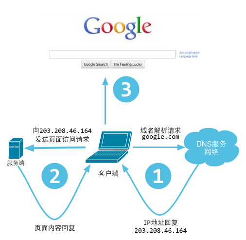
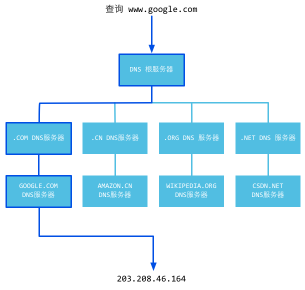
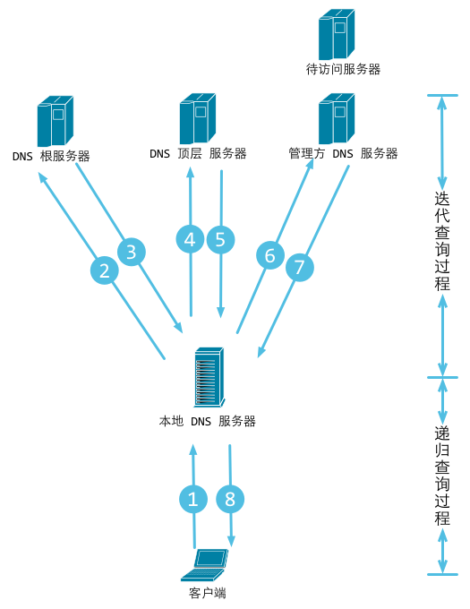
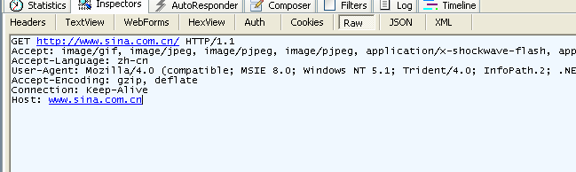
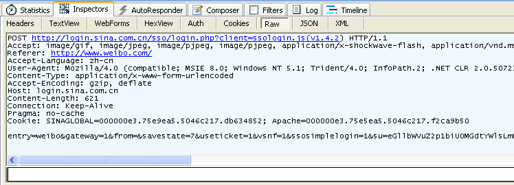
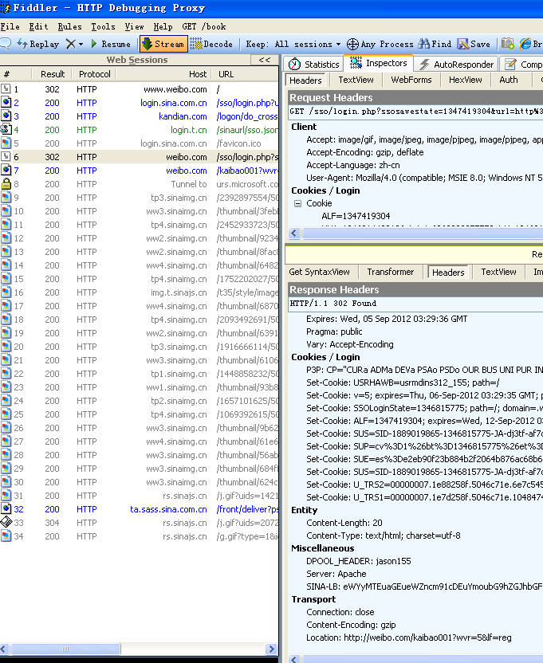
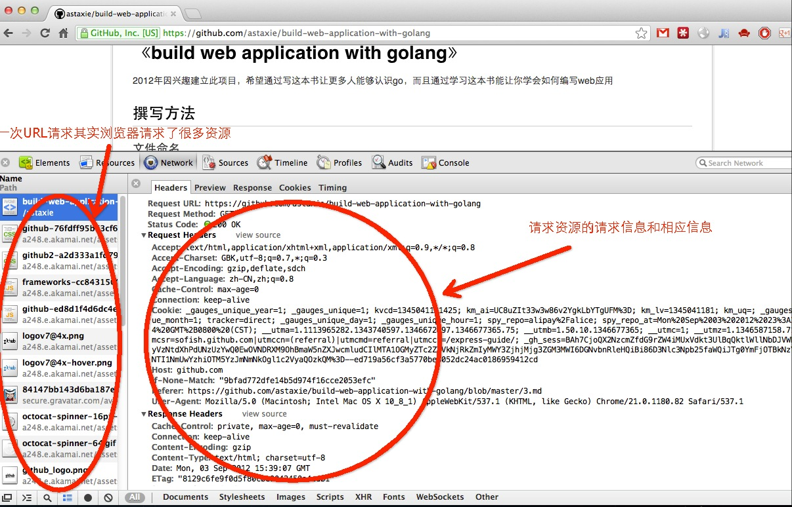

# 3.1 Principi rada veba

[Sadržaj](_00.0-sr.md)

Svaki put kada otvorite pregledač, ukucate neki URL i pritisnete Enter, videćete prelepe veb stranice koje se pojavljuju na vašem ekranu. Ali da li znate šta se dešava iza ovih jednostavnih radnji?

Obično je vaš pregledač klijent.

- Nakon što unesete URL adresu,
- on uzima deo URL adrese koji se odnosi na host i
- šalje ga DNS serveru (`Domain Name Server`) kako bi dobio IP adresu hosta.
- Zatim se povezuje sa IP adresom i traži da uspostavi TCP vezu.
- Pregledač šalje HTTP zahteve putem veze.
- Server ih obrađuje i odgovara HTTP odgovorima koji sadrže sadržaj koji čini veb stranicu.
- Na kraju, pregledač prikazuje telo veb stranice i isključuje se sa servera.

  
Slika 3.1 Procesi koje korisnici posećuju veb-sajt

Veb server, takođe poznat kao HTTP server, koristi HTTP protokol za komunikaciju sa klijentima. Svi veb pregledači se mogu smatrati klijentima.

Principe rada veba možemo podeliti na sledeće korake:

- Klijent koristi TCP/IP protokol za povezivanje sa serverom.
- Klijent šalje HTTP zahteve za pakete serveru.
- Server vraća HTTP pakete odgovora klijentu. Ako zahtevani resursi uključuju
  dinamičke skripte, server prvo poziva mehanizam za skripte.
- Klijent se isključuje sa servera, počinje sa renderovanjem HTML-a.
- Ovo je jednostavan tok rada HTTP poslova - primetite da server zatvara svoje veze nakon što
  pošalje podatke klijentima, a zatim čeka sledeći zahtev.

## Rezolucija URL-a i DNS-a

Uvek koristimo URL adrese za pristup veb stranicama, ali da li znate kako URL adrese funkcionišu?

Puno ime URL-a je `Uniform resource locator` služi za opisivanje resursa na internetu, a njegov osnovni oblik je sledeći.

```http
scheme://host[:port#]/path/.../[?query-string][#anchor]
```

gde su:

```http
scheme         Osnovni protokol (kao što su HTTP, HTTPS, FTP)
host           IP ili ime domena HTTP servera
port#          Podrazumevani port je 80 i može se izostaviti u ovom slučaju. Ako želite da koristite 
               drugi port, morate ga specificirati. Na primer, http://www.cnblogs.com:8080/.
path           put resursa
query-string   podaci koji se šalju na server
anchor         sidro
```

DNS je skraćenica od `Domain Name System` (Sistem imena domena). To je sistem imenovanja za usluge računarskih mreža i on konvertovanje imena domena u stvarne IP adrese, baš kao prevodilac.

  
Slika 3.2 Principi rada DNS-a

Da bismo bolje razumeli njegov princip rada, pogledajmo detaljan proces DNS rešavanja na sledeći način.

1. Nakon što unesete ime domena <www.qq.com> u pregledač, operativni sistem će proveriti da li postoje mapiranja veze u datotekama hosta za ovo ime domena. Ako je tako, onda je razrešavanje imena domena završeno.

2. Ako u datotekama hosta ne postoje veze mapiranja, operativni sistem će proveriti da li postoji mapiranje veze u keš memoriji DNS-a. Ako postoji, onda je razrešavanje imena domena završeno.

3. Ako ne postoje mapiranja veze ni u kešu hosta ni u DNS kešu, operativni sistem pronalazi prvi DNS server za razrešavanje u vašim TCP/IP podešavanjima, što je verovatno vaš lokalni DNS server. Kada lokalni DNS server primi upit, ako se ime domena koje želite da upitate nalazi u lokalnoj konfiguraciji njegovih regionalnih resursa, on vraća rezultate klijentu. Ovo DNS razrešavanje je autoritativno.

4. Ako lokalni DNS server ne sadrži ime domena, ali postoji mapiranje u kešu, lokalni DNS server vraća ovaj rezultat klijentu. Ovo DNS rešenje nije autoritativno.

5. Ako lokalni DNS server ne može da razreši ovo ime domena bilo konfiguracijom regionalnih resursa ili keš memorijom, preći će na sledeći korak, koji zavisi od podešavanja lokalnog DNS servera.

6. Ako lokalni DNS server ne omogući prosleđivanje, on usmerava zahtev na korenski DNS server, a zatim vraća IP adresu DNS servera najvišeg nivoa koja, ".com" u ovom slučaju, možda zna ime domena. Ako prvi DNS server najvišeg nivoa ne prepozna ime domena, ponovo preusmerava zahtev na sledeći DNS server najvišeg nivoa dok ne dođe do onog koji prepoznaje ime domena. Zatim DNS server najvišeg nivoa pita ovaj DNS server sledećeg nivoa za IP adresu koja odgovara <www.qq.com>.

7. Ako lokalni DNS server ima omogućeno prosleđivanje, šalje zahtev DNS serveru višeg nivoa. Ako ni DNS server višeg nivoa ne prepoznaje ime domena, zahtev se stalno preusmerava na više nivoe dok konačno ne dođe do DNS servera koji prepoznaje ime domena.

Bez obzira da li lokalni DNS server omogućava prosleđivanje ili ne, IP adresa imena domena se uvek vraća na lokalni DNS server, a lokalni DNS server je šalje nazad klijentu.


Slika 3.3 Tok rada za DNS rezoluciju

> [!Note]
> "Recursive query process" jednostavno znači da se ispitivači menjaju u procesu. Ispitivači se ne menjaju u "Iterative query" procesima.

Sada znamo da klijenti na kraju dobijaju IP adrese, tako da pregledači komuniciraju sa serverima putem IP adresa.

## HTTP protokol

HTTP protokol je osnovni deo veb servisa. Važno je znati šta je HTTP protokol pre nego što shvatite kako veb funkcioniše.

HTTP je protokol se koristi za olakšavanje komunikacije između pregledača i veb servera. Zasnovan je na TCP protokolu i obično koristi port 80 na strani veb servera. To je protokol koji koristi model zahtev-odgovor - klijenti šalju zahteve, a serveri odgovaraju. Prema HTTP protokolu, klijenti uvek uspostavljaju nove veze i šalju HTTP zahteve serverima. Serveri nisu u mogućnosti da se proaktivno povežu sa klijentima, niti da uspostave povratne veze. Veza između klijenta i servera može biti prekinuta sa bilo koje strane. Na primer, možete otkazati zahtev za preuzimanje i HTTP vezu i vaš pregledač će se isključiti sa servera pre nego što završite preuzimanje.

HTTP protokol je bez stanja, što znači da server nema pojma o vezi između dve veze iako su obe sa istog klijenta. Da bi rešile ovaj problem, veb aplikacije koriste kolačiće za održavanje stanja veza.

Pošto je HTTP protokol zasnovan na TCP protokolu, svi TCP napadi će uticati na HTTP komunikaciju na vašem serveru. Primeri takvih napada su SYN poplave, DoS i DDoS napadi.

### Paket HTTP zahteva (informacije o pregledaču)

Svi paketi zahteva imaju tri dela: red zahteva, zaglavlje zahteva i telo. Između zaglavlja i tela postoji jedan prazan red.

```http
GET /domains/example/ HTTP/1.1      // request line: request method, URL, protocol and its version
Host：www.iana.org                          // domain name
User-Agent：Mozilla/5.0 (Windows NT 6.1)    // browser information
Accept：text/html,application/xhtml+xml,application/xml;q=0.9,*/*;q=0.8    // mime that clients can accept
Accept-Encoding：gzip,deflate,sdch        // stream compression
Accept-Charset：UTF-8,*;q=0.5             // character set in client side
// blank line
// body, request resource arguments (for example, arguments in POST)
```

Koristimo Fiddler da bismo dobili sledeće informacije o zahtevu.

  
Slika 3.4 Informacije o GET zahtevu koji je uhvatio fiddler


Slika 3.5 Informacije o POST zahtevu koji je uhvatio fiddler

Možemo videti da GET nema telo zahteva, za razliku od POST-a, koji ga ima.

Postoji mnogo metoda koje možete koristiti za komunikaciju sa serverima u HTTP-u; GET, POST, PUT i DELETE su 4 osnovne metode koje obično koristimo. URL predstavlja resurs na mreži, tako da ove 4 metode definišu operacije upita, promene, dodavanja i brisanja koje mogu delovati na ove resurse. GET i POST se veoma često koriste u HTTP-u. GET može da doda parametre upita URL-u, koristeći `?` za odvajanje URL-a i parametara i `&` između argumenata, kao što je "EditPosts.aspx?name=test1&id=123456". POST stavlja podatke u telo zahteva jer URL implementira ograničenje dužine putem pregledača. Stoga, POST može da pošalje mnogo više podataka nego GET. Takođe, kada šaljemo korisnička imena i lozinke, ne želimo da se ova vrsta informacija pojavi u URL-u, pa koristimo POST da bismo ih sakrili.

### Paket HTTP odgovora (informacije o serveru)

Da vidimo koje informacije se nalaze u paketima odgovora.

```http
HTTP/1.1 200 OK                     // status line
Server: nginx/1.0.8                 // web server software and its version in the server machine
Date:Date: Tue, 30 Oct 2012 04:14:25 GMT        // responded time
Content-Type: text/html             // responded data type
Transfer-Encoding: chunked          // it means data were sent in fragments
Connection: keep-alive              // keep connection
Content-Length: 90                  // length of body
// blank line
<!DOCTYPE html PUBLIC "-//W3C//DTD XHTML 1.0 Transitional//EN"... // message body
```

Prvi red se naziva statusna linija. On prikazuje HTTP verziju, statusni kod i statusnu poruku.

Kod statusa obaveštava klijenta o statusu odgovora HTTP servera. U HTTP/1.1, definisano je 5 vrsta kodova statusa:

- 1xx Informational
- 2xx Success
- 3xx Redirection
- 4xx Client Error
- 5xx Server Error

Pogledajmo još primera o paketima odgovora. 200 znači da je server ispravno odgovorio, 302 znači preusmeravanje.


Slika 3.6 Kompletne informacije za posetu veb-sajtu

### HTTP je bez stanja i konekcija: keep-alive

Termin "bez stanja" ne znači da server nema mogućnost da održi vezu. To jednostavno znači da server ne prepoznaje nikakve veze između bilo koja dva zahteva.

U HTTP/1.1, `Keep-alive` se koristi podrazumevano. Ako klijenti imaju dodatne zahteve, koristiće istu vezu za njih.

Obratite pažnju da funkcija `Keep-alive` ne može zauvek održavati jednu vezu; aplikacija koja se pokreće na serveru određuje ograničenje do kog treba održavati vezu, a u većini slučajeva možete konfigurisati ovo ograničenje.

### Zahtevaj instancu


Slika 3.7 Svi paketi za otvaranje jedne veb stranice

Na gornjoj slici možemo videti ceo proces komunikacije između klijenta i servera. Možda ćete primetiti da na listi postoji mnogo datoteka resursa; one se nazivaju statičke datoteke, a Go ima specijalizovane metode obrade za ove datoteke.

Ovo je najvažnija funkcija pregledača: da zahtevaju URL adresu i preuzimaju podatke sa veb servera, a zatim prikazuju HTML. Ako pronađu neke datoteke u DOM-u, kao što su CSS ili JS datoteke, pregledači će ponovo zahtevati te resurse od servera dok se svi resursi ne prikažu na vašem ekranu.

Smanjenje vremena HTTP zahteva je jedan od načina za poboljšanje brzine učitavanja veb stranica. Smanjenjem broja CSS i JS datoteka koje je potrebno učitati, istovremeno se mogu smanjiti i latencije zahteva i opterećenje vaših veb servera.

[Sadržaj](_00.0-sr.md)
