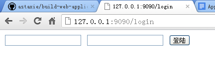
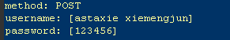
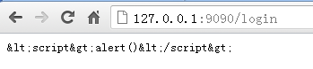
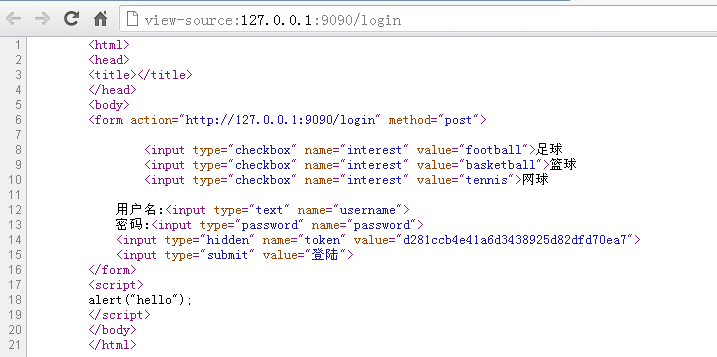
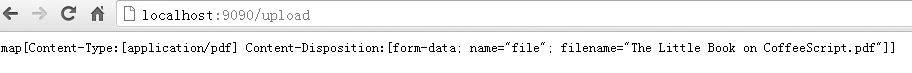

# 4 Korisnička forma

Korisnička forma je nešto što se veoma često koristi prilikom razvoja veb aplikacija. Ona pruža mogućnost komunikacije između klijenata i servera. Morate biti veoma dobro upoznati sa formama ako ste veb programer; ako ste C/C++ programer, možda ćete želeti da se zapitate: šta je korisnička forma?

Forma je oblast koja sadrži elemente forme. Korisnici mogu da unose informacije u elemente forme kao što su:

- tekstualna polja,
- padajuće liste,
- radio dugmad,
- polja za potvrdu itd.

Koristimo oznaku forme `<form>` za definisanje forme.

```html
<form>
...
input elements
...
</form>
```

Go već ima mnogo praktičnih funkcija za rad sa korisničkim formama. Podatke forme možete lako dobiti u HTTP zahtevima, a lako ih je integrisati u vaše veb aplikacije. U odeljku 4.1 ćemo govoriti o tome kako rukovati podacima formi u Gou. Takođe, pošto ne možete verovati nijednom podatku koji dolazi sa strane klijenta, prvo morate da validirate podatke pre nego što ih upotrebite. Proći ćemo kroz neke primere o tome kako validirati podatke forme u odeljku 4.2.

Kažemo da je HTTP protokol bez stanja. Kako možemo da identifikujemo da određena forme potiče od istog korisnika? I kako da osiguramo da se jedna forma može poslati samo jednom? Pogledaćemo neke detalje u vezi sa kolačićima (kolačić je informacija koja se može sačuvati na strani klijenta i dodati u zaglavlje zahteva kada se zahtev pošalje serveru) u odeljcima 4.3 i 4.4.

Još jedan uobičajeni slučaj upotrebe formi je otpremanje datoteka. U odeljku 4.5, naučićete kako da to uradite, kao i kako da kontrolišete veličinu otpremljene datoteke pre nego što počne otpremanje, u Go-u.

## 4.1 Obrada unosa u formi

Pre nego što počnemo, pogledajmo jednostavan primer tipične korisničke forme, sačuvane kao "login.gtpl" u folderu vašeg projekta.

```html
<html>
    <head>
    <title></title>
    </head>
    <body>
        <form action="/login" method="post">
            Username:<input type="text" name="username">
            Password:<input type="password" name="password">
            <input type="submit" value="Login">
        </form>
    </body>
</html>
```

Ova forma će biti poslata na /login stranu servera. Nakon što korisnik klikne na dugme za prijavu, podaci će biti poslati obrađivaču "login" registrovanom od strane rutera servera. Zatim treba da znamo da li koristi POST metod ili GET.

Ovo je lako saznati korišćenjem `http` paketa. Da vidimo kako da obrađujemo podatke forme na stranici za prijavu.

```go
package main

import (
    "fmt"
    "html/template"
    "log"
    "net/http"
    "strings"
)

func sayhelloName(w http.ResponseWriter, r *http.Request) {
    r.ParseForm() //Parse url parameters passed, then parse the response packet for the POST body (request body)
    // attention: If you do not call ParseForm method, the following data can not be obtained form
    fmt.Println(r.Form) // print information on server side.
    fmt.Println("path", r.URL.Path)
    fmt.Println("scheme", r.URL.Scheme)
    fmt.Println(r.Form["url_long"])
    for k, v := range r.Form {
        fmt.Println("key:", k)
        fmt.Println("val:", strings.Join(v, ""))
    }
    fmt.Fprintf(w, "Hello astaxie!") // write data to response
}

func login(w http.ResponseWriter, r *http.Request) {
    fmt.Println("method:", r.Method) //get request method
    if r.Method == "GET" {
        t, _ := template.ParseFiles("login.gtpl")
        t.Execute(w, nil)
    } else {
        r.ParseForm()
        // logic part of log in
        fmt.Println("username:", r.Form["username"])
        fmt.Println("password:", r.Form["password"])
    }
}

func main() {
    http.HandleFunc("/", sayhelloName) // setting router rule
    http.HandleFunc("/login", login)
    err := http.ListenAndServe(":9090", nil) // setting listening port
    if err != nil {
        log.Fatal("ListenAndServe: ", err)
    }
}
```

Ovde koristimo `r.Method` metodu zahteva za dobijanje tipa zahteva, a ona vraća http glagol - "GET", "POST", "PUT" itd.

U "login" funkciji, koristimo `r.Method` da proverimo da li je u pitanju stranica za prijavu ili logika obrade prijave. Drugim rečima, proveravamo da li korisnik samo otvara stranicu ili pokušava da se prijavi. Server prikazuje stranicu samo kada zahtev stigne putem GET metode, a izvršava logiku prijave kada zahtev koristi POST metodu.

Trebalo bi da vidite sledeći interfejs nakon otvaranja <http://127.0.0.1:9090/login> u vašem pregledaču.

  
Slika 4.1 Interfejs za prijavu korisnika

Server neće ništa ispisati dok ne unesemo korisničko ime i lozinku, jer program za obradu podataka ne analizira formu dok ne pozovemo `r.ParseForm()`. Dodajmo `r.ParseForm()` pre `fmt.Println("username:", r.Form["username"])`, kompajlirajmo naš program i ponovo ga testirajmo. Videćete da su informacije sada ispisane na strani servera.

`r.Form` sadrži sve argumente zahteva, na primer string upita u URL-u i podatke u POST i PUT zahtevima. Ako podaci imaju sukobe, na primer parametri koji imaju isto ime, server će sačuvati podatke u segment sa više vrednosti. Go dokumentacija navodi da će Go sačuvati podatke iz GET i POST zahteva na različitim mestima.

Pokušajte da promenite vrednost akcije u formi <http://127.0.0.1:9090/login> na <http://127.0.0.1:9090/login?username=astaxie> u "login.gtpl" datoteci, ponovo je testirajte i videćete da se isečak ispisuje na strani servera.

  
Slika 4.2 Server ispisuje podatke zahteva

Tip `request.Form` je `url.Values`. Čuva podatke u formatu `key: value`.

```go
v := url.Values{}
v.Set("name", "Ava")
v.Add("friend", "Jess")
v.Add("friend", "Sarah")
v.Add("friend", "Zoe")
// v.Encode() == "name=Ava&friend=Jess&friend=Sarah&friend=Zoe"
fmt.Println(v.Get("name"))
fmt.Println(v.Get("friend"))
fmt.Println(v["friend"])
```

> [!Note]
> Zahtevi imaju mogućnost pristupa podacima forme pomoću `FormValue()` metode.  
> Na primer, možete promeniti `r.Form["username"]` u `r.FormValue("username")`, a Go `r.ParseForm`
> automatski poziva. Obratite pažnju da vraća prvu vrednost ako postoje argumenti sa istim imenom, a
> vraća prazan string ako ne postoji takav argument.

## 4.2 Verifikacija ulaznih podataka

Jedan od najvažnijih principa u veb razvoju je da ne možete verovati ničemu iz korisničkih formi na strani klijenta. Morate da validirate sve dolazne podatke pre nego što ih upotrebite. Mnoge veb stranice su pogođene ovim problemom, što je jednostavno, ali ključno.

Postoje dva načina verifikacije podataka iz forme koja se uobičajeno koriste. Prvi je JavaScript validacija na frontendu, a drugi je serverska validacija na bekendu. U ovom odeljku ćemo govoriti o validaciji na strani servera u veb razvoju.

### Obavezna polja

Ponekad zahtevamo da korisnici unesu neka polja, ali oni ne uspeju da ih popune. Na primer u prethodnom odeljku kada smo zahtevali korisničko ime. Možete koristiti funkciju `len` da biste dobili dužinu polja kako biste bili sigurni da su korisnici nešto uneli.

```go
if len(r.Form["username"][0])==0 {
    // code for empty field
}
```

`r.Form` tretira različite tipove elemenata forme različito kada su prazni. Za prazne tekstualne okvire, tekstualne oblasti i otpremljene datoteke, vraća prazan string; za radio dugmad i polja za potvrdu, čak ni ne kreira odgovarajuće stavke. Umesto toga, dobićete greške ako pokušate da mu pristupite. Stoga je bezbednije koristiti `r.Form.Get()` za dobijanje vrednosti polja, jer će uvek vratiti prazno ako vrednost ne postoji. S druge strane, `r.Form.Get()` može dobiti samo jednu vrednost polja istovremeno, tako da morate koristiti `r.Form` da biste dobili mapu vrednosti.

- Brojevi

  Ponekad su vam potrebni brojevi umesto drugog teksta za vrednost polja. Na primer, recimo da vam je potrebna starost korisnika samo u celobrojnom obliku, npr. 50 ili 10, umesto "dovoljno star" ili "mladić". Ako nam je potreban pozitivan broj int prvo možemo konvertovati vrednost u taj tip, a zatim je obraditi.
  
  ```go
  getint,err:=strconv.Atoi(r.Form.Get("age"))

  if err!=nil{
      // error occurs when convert to number, it may not a number
  }
  // check range of number
  if getint >100 {
      // too big
  }
  ```
  
  Drugi način da se ovo uradi je korišćenje regularnih izraza.
  
  ```go
  if m, _ := regexp.MatchString("^[0-9]+$", r.Form.Get("age")); !m {
      return false
  }
  ```

  Za potrebe visokih performansi, regularni izrazi nisu efikasni, međutim, jednostavni regularni izrazi su obično dovoljno brzi. Ako ste upoznati sa regularnim izrazima, to je veoma zgodan način za proveru podataka. Obratite pažnju da Go koristi RE2, tako da su podržani svi UTF-8 znakovi.

- Kineski
  Ponekad nam je potrebno da korisnici unesu svoja kineska imena i moramo da proverimo da li svi koriste kineske, a ne nasumične znakove. Za kinesku verifikaciju, regularni izrazi su jedini način.

  ```go
  if m, _ := regexp.MatchString("^[\\x{4e00}-\\x{9fa5}]+$", r.Form.Get("realname")); !m {
      return false
  }
  ```

- Engleska slova
  Ponekad nam je potrebno da korisnici unose samo engleska slova. Na primer, potrebno nam je nečije englesko ime, kao što je astaxie umesto asta谢. Možemo lako koristiti regularne izraze za proveru.
  
  if m, _ := regexp.MatchString("^[a-zA-Z]+$", r.Form.Get("engname")); !m {
      return false
  }

- Adresa e-pošte
  Ako želite da znate da li su korisnici uneli važeće imejl adrese, možete koristiti sledeći regularni izraz:

  ```go
  if m, _ := regexp.MatchString(`^([\w\.\_]{2,10})@(\w{1,}).([a-z]{2,4})$`, r.Form.Get("email")); !m {
      fmt.Println("no")
  }else{
      fmt.Println("yes")
  }
  ```

### Padajuća lista

Recimo da nam je potrebna stavka sa padajuće liste, ali umesto toga dobijamo vrednost koju su hakeri izmislili. Kako da sprečimo da se to dogodi?

Pretpostavimo da imamo sledeće `<select>`:

```html
<select name="fruit">
<option value="apple">apple</option>
<option value="pear">pear</option>
<option value="banana">banana</option>
</select>
```

Možemo koristiti sledeću strategiju za dezinfekciju našeg unosa:

```go
slice:=[]string{"apple","pear","banana"}

for _, v := range slice {
    if v == r.Form.Get("fruit") {
        return true
    }
}
return false
```

Sve funkcije koje sam prikazao gore nalaze se u mom projektu otvorenog koda za rad sa isečcima i mapama: <https://github.com/astaxie/beeku>

### Radio dugmad

Ako želimo da znamo da li je korisnik muško ili žensko, možemo koristiti radio dugme, vraćajući 1 za muškarca i 2 za ženu. Međutim, neko malo dete koje je upravo pročitalo svoju prvu knjigu o HTTP-u odluči da vam pošalje 3. Da li će vaš program izbaciti izuzetak? Kao što vidite, potrebno je da koristimo istu metodu kao što smo koristili za našu padajuću listu kako bismo bili sigurni da naše radio dugme vraća samo očekivane vrednosti.

```html
<input type="radio" name="gender" value="1">Male
<input type="radio" name="gender" value="2">Female
```

I koristimo sledeći kod za validaciju unosa:

```go
slice:=[]string{"1","2"}

for _, v := range slice {
    if v == r.Form.Get("gender") {
        return true
    }
}
return false
```

### Polja za potvrdu

Pretpostavimo da postoje neka polja za potvrdu za interesovanja korisnika i da ovde ne želite ni suvišne vrednosti. Možete ih validirati na sledeći način:

```html
<input type="checkbox" name="interest" value="football">Football
<input type="checkbox" name="interest" value="basketball">Basketball
<input type="checkbox" name="interest" value="tennis">Tennis
```

U ovom slučaju, dezinfekcija se malo razlikuje od validacije unosa za dugme i polje za potvrdu, jer ovde dobijamo isečak iz polja za potvrdu.

```go
slice:=[]string{"football","basketball","tennis"}

a:=Slice_diff(r.Form["interest"],slice)
if a == nil{
    return true
}

return false 
```

### Datum i vreme

Pretpostavimo da želite da korisnici unesu validne datume ili vremena. Go ima timepaket za konvertovanje godine, meseca i dana u odgovarajuća vremena. Nakon toga, lako je to proveriti.

```go
t := time.Date(2009, time.November, 10, 23, 0, 0, 0, time.UTC)
fmt.Printf("Go launched at %s\n", t.Local())
```

Nakon što imate vremena, možete koristiti `time` paket za više operacija, u zavisnosti od vaših potreba.

U ovom odeljku smo razgovarali o nekim uobičajenim metodama validacije podataka forme na strani servera. Nadam se da sada razumete više o validaciji podataka u jeziku Go, posebno kako da koristite regularne izraze u svoju korist.

## 4.3 Međusajtsko skriptovanje

Današnje veb stranice imaju mnogo dinamičniji sadržaj kako bi poboljšale korisničko iskustvo, što znači da moramo da pružamo dinamičke informacije u zavisnosti od ponašanja svake osobe. Nažalost, dinamičke veb stranice su podložne zlonamernim napadima poznatim kao "Cross-site scripting" (poznat kao "XSS"). Statičke veb stranice nisu podložne Cross-site scripting-u.

Napadači često ubacuju zlonamerne skripte poput JavaScript-a, VBScript-a, ActiveX-a ili Flash-a na veb stranice koje imaju rupe u zakonu. Nakon što uspešno ubace svoje skripte, korisničke informacije mogu biti ukradene, a vaša veb stranica može biti preplavljena spamom. Napadači takođe mogu promeniti korisnička podešavanja na šta god žele.

Ako želite da sprečite ovu vrstu napada, trebalo bi da kombinujete sledeća dva pristupa:

- Validacija svih podataka od korisnika, o čemu smo govorili u prethodnom odeljku.
- Pažljivo rukovanje podacima koji će biti poslati klijentima kako biste sprečili pokretanje ubrizganih skripti u pregledačima.

Pa kako možemo da uradimo ove dve stvari u programu Go? Srećom, `html/template` paket ima neke korisne funkcije za izbegavanje podataka na sledeći način:

```go
func HTMLEscape(w io.Writer, b []byte) beži od b do b.
func HTMLEscapeString(s string) string vraća string nakon izlaza iz s.
func HTMLEscaper(args ...interface{}) string vraća string nakon izlaska iz više argumenata.
```

Hajde da promenimo primer u odeljku 4.1:

```go
fmt.Println("username:", template.HTMLEscapeString(r.Form.Get("username"))) // print at server side
fmt.Println("password:", template.HTMLEscapeString(r.Form.Get("password")))
template.HTMLEscape(w, []byte(r.Form.Get("username"))) // responded to clients
```

Ako neko pokuša da unese korisničko ime kao `<script>alert()</script>`, videćemo sledeći sadržaj u pregledaču:

  
Slika 4.3 Javaskript nakon izlaza

Funkcije u `html/template` paketu vam pomažu da izbegavate sve HTML oznake. Šta ako samo želite da štampate `<script>alert()</script>` u pregledače? Umesto toga, trebalo bi da koristite `text/template`.

```go
import "text/template"
...
t, err := template.New("foo").Parse(`{{define "T"}}Hello, {{.}}!{{end}}`)
err = t.ExecuteTemplate(out, "T", "<script>alert('you have been pwned')</script>")
```

Izlaz:

```html
Hello, <script>alert('you have been pwned')</script>!
```

Ili možete koristiti `template.HTML` tip: Sadržaj promenljive neće biti izbegnut ako je njegov tip `template.HTML`.

```Go
import "html/template"
...
t, err := template.New("foo").Parse(`{{define "T"}}Hello, {{.}}!{{end}}`)
err = t.ExecuteTemplate(out, "T", template.HTML("<script>alert('you have been pwned')</script>"))
```

Izlaz:

```html
Hello, <script>alert('you have been pwned')</script>!
```

Još jedan primer bekstva:

```go
import "html/template"
...
t, err := template.New("foo").Parse(`{{define "T"}}Hello, {{.}}!{{end}}`)
err = t.ExecuteTemplate(out, "T", "<script>alert('you have been pwned')</script>")
```

Izlaz:

```html
Hello, &lt;script&gt;alert(&#39;you have been pwned&#39;)&lt;/script&gt;!
```

## 4.4 Duplirani submiti

Ne znam da li ste ikada videli neke blogove ili BBS-ove koji imaju više od jedne potpuno iste objave, ali mogu vam reći da je to zato što su korisnici poslali duplirane obrasce za objave. Postoji mnogo stvari koje mogu prouzrokovati duplirane objave; ponekad korisnici samo dvaput kliknu na dugme za slanje ili žele da izmene neki sadržaj nakon objavljivanja i pritisnu dugme za nazad. U nekim slučajevima to je namernim delovanjem zlonamernih korisnika. Lako je videti kako duplirane objave mogu dovesti do mnogih problema. Stoga, moramo koristiti efikasna sredstva da to sprečimo.

Rešenje je da dodate skriveno polje sa jedinstvenim tokenom u vašoj formi i da uvek proverite ovaj token pre obrade dolaznih podataka. Takođe, ako koristite Ajax za slanje forme, koristite Javaskript da biste onemogućili dugme za slanje nakon što je forma poslata.

Hajde da poboljšamo primer iz odeljka 4.2:

```html
<input type="checkbox" name="interest" value="football">Football
<input type="checkbox" name="interest" value="basketball">Basketball
<input type="checkbox" name="interest" value="tennis">Tennis
Username:<input type="text" name="username">
Password:<input type="password" name="password">
<input type="hidden" name="token" value="{{.}}">
<input type="submit" value="Login">
```

Koristimo MD5 heš (vremensku oznaku) da generišemo token i dodajemo ga i u skriveno polje na klijentskoj formi i u kolačić sesije na serverskoj strani (Poglavlje 6). Zatim možemo da koristimo ovaj token da proverimo da li je ova forma poslata ili ne.

```go
func login(w http.ResponseWriter, r *http.Request) {
    fmt.Println("method:", r.Method) // get request method
    if r.Method == "GET" {
        crutime := time.Now().Unix()
        h := md5.New()
        io.WriteString(h, strconv.FormatInt(crutime, 10))
        token := fmt.Sprintf("%x", h.Sum(nil))

        t, _ := template.ParseFiles("login.gtpl")
        t.Execute(w, token)
    } else {
        // log in request
        r.ParseForm()
        token := r.Form.Get("token")
        if token != "" {
            // check token validity
        } else {
            // give error if no token
        }
        fmt.Println("username length:", len(r.Form["username"][0]))
        fmt.Println("username:", template.HTMLEscapeString(r.Form.Get("username"))) // print in server side
        fmt.Println("password:", template.HTMLEscapeString(r.Form.Get("password")))
        template.HTMLEscape(w, []byte(r.Form.Get("username"))) // respond to client
    }
}
```

  
Slika 4.4 Sadržaj u pregledaču nakon dodavanja tokena

Možete osvežiti ovu stranicu i svaki put ćete videti drugačiji token. Ovo osigurava da je svaka forma jedinstvena.

Za sada, možete sprečiti mnoge napade dupliranja slanja dodavanjem tokena u vaše obrasce, ali to ne može sprečiti sve obmanjujuće napade ovog tipa. Potrebno je još mnogo posla.

## 4.5 Otpremanje datoteke

Pretpostavimo da imate veb lokaciju poput Instagrama i želite da korisnici otpremaju svoje prelepe fotografije. Kako biste implementirali tu funkcionalnost?

Morate dodati svojstvo enctypeformi koju želite da koristite za otpremanje fotografija. Postoje tri moguće vrednosti za ovo svojstvo:

```html
application/x-www-form-urlencoded   Transcode all characters before uploading (default).
multipart/form-data   No transcoding. You must use this value when your form has file upload controls.
text/plain    Convert spaces to "+", but no transcoding for special characters.
```

Stoga, HTML sadržaj formulara za otpremanje datoteke treba da izgleda ovako:

```html
<html>
<head>
       <title>Upload file</title>
</head>
<body>
<form enctype="multipart/form-data" action="http://127.0.0.1:9090/upload" method="post">
    <input type="file" name="uploadfile" />
    <input type="hidden" name="token" value="{{.}}"/>
    <input type="submit" value="upload" />
</form>
</body>
</html>
```

Moramo dodati funkciju na strani servera koja će obrađivati ovu formu.

```go
http.HandleFunc("/upload", upload)

// upload logic
func upload(w http.ResponseWriter, r *http.Request) {
    fmt.Println("method:", r.Method)
    
    if r.Method == "GET" {
        crutime := time.Now().Unix()
        h := md5.New()
        io.WriteString(h, strconv.FormatInt(crutime, 10))
        token := fmt.Sprintf("%x", h.Sum(nil))
        t, _ := template.ParseFiles("upload.gtpl")
        t.Execute(w, token)
    } else {
        r.ParseMultipartForm(32 << 20)
        file, handler, err := r.FormFile("uploadfile")
        if err != nil {
            fmt.Println(err)
            return
        }
        defer file.Close()
        fmt.Fprintf(w, "%v", handler.Header)
        f, err := os.OpenFile("./test/"+handler.Filename, os.O_WRONLY|os.O_CREATE, 0666)
        if err != nil {
            fmt.Println(err)
            return
        }
        defer f.Close()
        io.Copy(f, file)
    }
}
```

Kao što vidite, potrebno je da pozovemo funkciju `r.ParseMultipartForm` za otpremanje datoteka. Funkcija `ParseMultipartForm` uzima `maxMemory` argument. Nakon što pozovete `ParseMultipartForm`, datoteka će biti sačuvana u memoriji servera sa `maxMemory` veličinom. Ako je veličina datoteke veća od `maxMemory`, ostatak podataka će biti sačuvan u privremenoj sistemskoj datoteci. Možete koristiti `r.FormFile` da biste dobili identifikator datoteke i koristiti `io.Copy` da biste je sačuvali u vašem sistemu datoteka.

Ne morate da pozivate funkciju `r.ParseForm` kada pristupate drugim poljima u formi koja nisu datoteka, jer će je Go pozvati kada je to potrebno. Takođe, `ParseMultipartForm` dovoljno je pozvati jednom - višestruki pozivi ne prave razliku.

Koristimo tri koraka za otpremanje datoteka na sledeći način:

- Dodajte `enctype="multipart/form-data"` u svoju formu.
- Pozovite `r.ParseMultipartForm` na strani servera da sačuvate datoteku ili u memoriju ili u privremenu datoteku.
- Pozovite `r.FormFile` da biste dobili identifikator datoteke i sačuvali je u sistem datoteka.

Rukovalac datoteke je `multipart.FileHeader`. Koristi sledeću strukturu:

```go
type FileHeader struct {
    Filename string
    Header   textproto.MIMEHeader
    // contains filtered or unexported fields
}
```

  
Slika 4.5 Štampanje informacija na serveru nakon prijema datoteke.

### Klijenti otpremaju datoteke

Pokazao sam primer korišćenja formulara za otpremanje datoteke. Možemo imitirati klijentski formular za otpremanje datoteka i u programskom jeziku Go.

```go
package main

import (
    "bytes"
    "fmt"
    "io"
    "io/ioutil"
    "mime/multipart"
    "net/http"
    "os"
)

func postFile(filename string, targetUrl string) error {
    bodyBuf := &bytes.Buffer{}
    bodyWriter := multipart.NewWriter(bodyBuf)

    // this step is very important
    fileWriter, err := bodyWriter.CreateFormFile("uploadfile", filename)
    if err != nil {
        fmt.Println("error writing to buffer")
        return err
    }

    // open file handle
    fh, err := os.Open(filename)
    if err != nil {
        fmt.Println("error opening file")
        return err
    }
    defer fh.Close()

    //iocopy
    _, err = io.Copy(fileWriter, fh)
    if err != nil {
        return err
    }

    contentType := bodyWriter.FormDataContentType()
    bodyWriter.Close()

    resp, err := http.Post(targetUrl, contentType, bodyBuf)
    if err != nil {
        return err
    }
    defer resp.Body.Close()
    resp_body, err := ioutil.ReadAll(resp.Body)
    if err != nil {
        return err
    }
    fmt.Println(resp.Status)
    fmt.Println(string(resp_body))
    return nil
}

// sample usage
func main() {
    target_url := "http://localhost:9090/upload"
    filename := "./astaxie.pdf"
    postFile(filename, target_url)
}
```

Gore navedeni primer pokazuje kako se koristi klijent za otpremanje datoteka. Koristi se `multipart.Write` za upisivanje datoteka u keš memoriju i šalje ih na server putem POST metode.

Ako imate druga polja koja treba da se upisuju u podatke, kao što je korisničko ime, pozovite `multipart.WriteField` po potrebi.

## 4.6 Rezime

U ovom poglavlju smo uglavnom naučili kako da obrađujemo podatke iz formi. Prođimo kroz nekoliko primera kao što su prijavljivanje korisnika i otpremanje datoteka. Takođe smo naglasili da je validacija korisničkih podataka izuzetno važna za bezbednost veb stranice i jedan odeljak smo koristili da bismo govorili o tome kako filtrirati podatke pomoću regularnih izraza.

Nadam se da sada znate više o procesu komunikacije između klijenta i servera.
