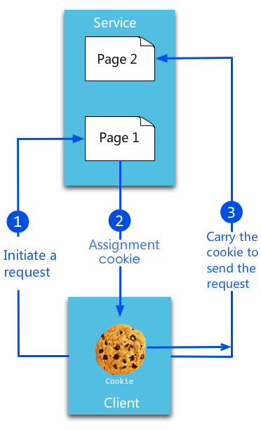
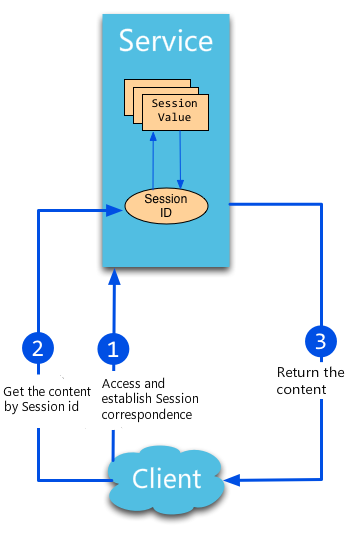
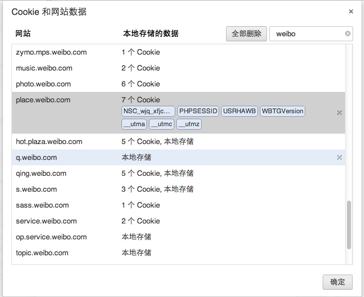

# 6 Skladištenje podataka i sesije

[Sadržaj](_00-sr.md)

Važna tema u veb razvoju je pružanje dobrog korisničkog iskustva, ali činjenica da je HTTP protokol bez stanja deluje suprotno ovom duhu. Kako možemo kontrolisati ceo proces pregleda veb lokacija za korisnike? Klasična rešenja su korišćenje kolačića i sesija, gde kolačići služe kao mehanizam na strani klijenta, a sesije se čuvaju na strani servera sa jedinstvenim identifikatorom za svakog korisnika. Imajte na umu da se sesije mogu prosleđivati u URL-ovima ili kolačićima, ili čak u vašoj bazi podataka (što je mnogo bezbednije, ali može uticati na performanse vaše aplikacije).

U odeljku 6.1, govorićemo o razlikama između kolačića i sesija. U odeljku 6.2, naučićete kako da koristite sesije u Go-u sa implementacijom menadžera sesija. U odeljku 6.3, govorićemo o otmici sesija i kako je sprečiti kada znate da se sesije mogu sačuvati bilo gde. Menadžer sesija koji ćemo implementirati u odeljku 6.3 će čuvati sesije u memoriji, ali ako treba da proširimo našu aplikaciju kako bismo omogućili deljenje sesija, uvek je bolje da ove sesije sačuvamo direktno u našu bazu podataka. Više o tome ćemo govoriti u odeljku 6.4.

## 6.1 Sesija i kolačići

Sesije i kolačići su dva veoma uobičajena veb koncepta i veoma ih je lako pogrešno shvatiti. Međutim, izuzetno su važni za autorizaciju stranica, kao i za prikupljanje statistike stranica. Hajde da pogledamo ova dva slučaja upotrebe.

Pretpostavimo da želite da pregledate stranicu koja ograničava javni pristup, kao što je na primer početna stranica korisnika Twitera. Naravno, možete otvoriti pregledač i uneti svoje korisničko ime i lozinku da biste se prijavili i pristupili tim informacijama, ali takozvano "pretraživanje veba" znači da koristimo program za automatizaciju ovog procesa bez ikakve ljudske intervencije. Stoga moramo da otkrijemo šta se zapravo dešava iza kulisa kada koristimo pregledač za prijavljivanje.

Kada prvi put dobijemo stranicu za prijavu i unesemo korisničko ime i lozinku, nakon što pritisnemo dugme "Login", pregledač šalje POST zahtev udaljenom serveru. Pregledač preusmerava na početnu stranicu korisnika nakon što server proveri informacije za prijavu i vrati HTTP odgovor. Pitanje je ovde kako server zna da imamo privilegije pristupa željenoj veb stranici? Pošto HTTP ne vodi računa o stanju, server nema načina da zna da li smo prošli verifikaciju u poslednjem koraku. Najlakše i možda najnaivnije rešenje je da se korisničko ime i lozinka dodaju URL-u. Ovo funkcioniše, ali stavlja previše pritiska na server (server mora da validira svaki zahtev u bazi podataka) i može biti štetno za korisničko iskustvo. Alternativni način za postizanje ovog cilja je da se sačuva identitet korisnika bilo na strani servera ili na strani klijenta korišćenjem kolačića i sesija.

Kolačići, ukratko, čuvaju istorijske informacije (uključujući podatke za prijavu korisnika) na računaru klijenta. Pregledač klijenta šalje ove kolačiće svaki put kada korisnik poseti istu veb stranicu, automatski dovršavajući korak prijave za korisnika.

  
Slika 6.1 Princip kolačića.

Sesije, s druge strane, čuvaju istorijske informacije na strani servera. Server koristi ID sesije da bi identifikovao različite sesije, a ID sesije koji generiše server uvek treba da bude slučajan i jedinstven. Možete koristiti kolačiće ili URL argumente da biste dobili identitet klijenta.


Slika 6.2 princip sesije.

### Kolačići

Kolačiće održavaju pregledači. Mogu se menjati tokom komunikacije između veb servera i pregledača. Veb aplikacije mogu pristupiti informacijama o kolačićima kada korisnici posete odgovarajuće veb stranice. Unutar većine podešavanja pregledača postoji jedno podešavanje koje se odnosi na privatnost kolačića. Trebalo bi da vidite nešto slično sledećem kada ga otvorite.

  
Slika 6.3 kolačić u pregledačima.

Kolačići imaju vreme isteka, a postoje dve vrste kolačića koje se razlikuju po svom životnom ciklusu: `sesijski` kolačići i `trajni` kolačići.

Ako vaša aplikacija ne podesi vreme isteka kolačića, pregledač ga neće sačuvati u lokalni sistem datoteka nakon što se pregledač zatvori. Ovi kolačići se nazivaju kolačići sesije i ova vrsta kolačića se obično čuva u memoriji umesto u lokalnom sistemu datoteka.

Ako vaša aplikacija podesi vreme isteka (na primer, `setMaxAge(60 60 24)`), pregledač će sačuvati ovaj kolačić u lokalnom sistemu datoteka i neće biti obrisan dok se ne dostigne dodeljeno vreme isteka. Kolačiće koji se čuvaju u lokalnom sistemu datoteka mogu deliti različiti procesi pregledača - na primer, dva IE prozora; različiti pregledači koriste različite procese za rukovanje kolačićima koji se čuvaju u memoriji.

#### Podešavanje kolačića

Go koristi `SetCookie` funkciju u `net/http` paketu za podešavanje kolačića:

```go
http.SetCookie(w ResponseWriter, cookie *Cookie)
```

`w` je odgovor na zahtev, a `cookie` je struktura. Da vidimo kako izgleda:

```go
type Cookie struct {
    Name  string
    Value string
    Path       string    // optional
    Domain     string    // optional
    Expires    time.Time // optional
    RawExpires string    // for reading cookies only

    // MaxAge=0 means no 'Max-Age' attribute specified.
    // MaxAge<0 means delete cookie now, equivalently 'Max-Age: 0'
    // MaxAge>0 means Max-Age attribute present and given in seconds
    MaxAge   int
    Secure   bool
    HttpOnly bool
    SameSite SameSite
    Raw      string
    Unparsed []string // Raw text of unparsed attribute-value pairs
}
```

Evo primera podešavanja kolačića:

```go
expiration := time.Now().Add(365 \* 24 \* time.Hour)
cookie := http.Cookie{Name: "username", Value: "astaxie", Expires: expiration}
http.SetCookie(w, &cookie)
```

#### Preuzimanje kolačića

Gore navedeni primer pokazuje kako se postavlja kolačić. Sada da vidimo kako da dobijemo kolačić koji je postavljen:

```go
cookie, _ := r.Cookie("username")
fmt.Fprint(w, cookie)
```

Evo još jednog načina da dobijete kolačić:

```go
for _, cookie := range r.Cookies() {
    fmt.Fprint(w, cookie.Name)
}
```

Kao što vidite, veoma je zgodno dobijati kolačiće iz zahteva.

### Sesije

Sesija je niz radnji ili poruka. Na primer, radnje koje preduzimate između podizanja slušalice i prekida veze možete smatrati vrstom sesije. Kada su u pitanju mrežni protokoli, sesije imaju više veze sa vezama između pregledača i servera.

Sesije pomažu u čuvanju statusa veze između servera i klijenta, a to ponekad može biti u obliku strukture za skladištenje podataka.

Sesije su mehanizam na strani servera i obično koriste heš tabele (ili nešto slično) za čuvanje dolaznih informacija.

Kada aplikacija treba da dodeli novu sesiju klijentu, server treba da proveri da li postoje postojeće sesije za istog klijenta sa jedinstvenim ID-om sesije. Ako ID sesije već postoji, server će jednostavno vratiti istu sesiju klijentu. S druge strane, ako ID sesije ne postoji za klijenta, server kreira potpuno novu sesiju (ovo se obično dešava kada je server obrisao odgovarajući ID sesije, ali je korisnik ručno dodao staru sesiju).

Sama sesija nije složena, ali njena implementacija i raspoređivanje jesu, tako da ne možete koristiti "jedan način da ih sve kontrolišete".

### Rezime sesija i kolačića

U zaključku, svrha sesija i kolačića je ista. Oba su namenjena prevazilaženju problema bez stanja HTTP-a, ali koriste različite metode. Sesije koriste kolačiće da bi sačuvale ID-ove sesija na strani klijenta i sačuvale sve ostale informacije na strani servera. Kolačići čuvaju sve informacije o klijentu na strani klijenta. Možda ste primetili da kolačići imaju neke bezbednosne probleme. Na primer, korisnička imena i lozinke mogu potencijalno biti provaljeni i prikupljeni od strane zlonamernih veb lokacija trećih strana.

Evo dve uobičajene zloupotrebe:

- Aplikacija A postavlja neočekivani kolačić za aplikaciju B.
- XSS napad: aplikacija A koristi JavaScript `document.cookie` za pristup kolačićima aplikacije B.

Nakon završetka ovog odeljka, trebalo bi da znate neke od osnovnih koncepata kolačića i sesija. Trebalo bi da budete u stanju da razumete razlike između njih kako ne biste doživeli katastrofu kada se neizbežno pojave greške. Sesije ćemo detaljnije razmotriti u narednim odeljcima.

## 6.2 Sesije

U odeljku 6.1 smo saznali da su sesije jedno rešenje za verifikaciju korisnika i da za sada standardna biblioteka Go nema ugrađenu podršku za sesije ili rukovanje sesijama. Dakle, implementiraćemo sopstvenu verziju menadžera sesija u Go-u.

### Kreiranje sesija

Osnovni princip sesija je da server održava informacije za svakog klijenta, a klijenti se oslanjaju na jedinstvene ID-ove sesija da bi pristupili tim informacijama. Kada korisnici posete veb aplikaciju, server će kreirati novu sesiju pomoću sledeća tri koraka, po potrebi:

#### Kreiranje jedinstvenog ID sesije

Otvorite prostor za skladištenje podataka: obično sesije čuvamo u memoriji, ali ćete izgubiti sve podatke sesije ako se sistem slučajno prekine. Ovo može biti veoma ozbiljan problem ako veb aplikacija radi sa osetljivim podacima, kao na primer u elektronskoj trgovini. Da biste rešili ovaj problem, možete umesto toga sačuvati podatke sesije u bazi podataka ili sistemu datoteka. Ovo čini trajnost podataka pouzdanijom i lakšom za deljenje sa drugim aplikacijama, iako je kompromis u tome što je potrebno više unosa podataka na strani servera za čitanje i pisanje ovih sesija.

#### Pošaljite jedinstveni ID sesije klijentu

Ključni korak ovde je slanje jedinstvenog ID-a sesije klijentu. U kontekstu standardnog HTTP odgovora, možete koristiti liniju odgovora, zaglavlje ili telo da biste to postigli; stoga imamo dva načina za slanje ID-ova sesija klijentima:

- putem kolačića ili
- prepisivanjem URL-ova.

**Kolačići**:  
Server može lako da koristi `Set-cookie` zaglavlje odgovora da pošalje ID sesije klijentu, a klijent zatim može da koristi ovaj kolačić za buduće zahteve; često podešavamo vreme isteka za kolačiće koji sadrže informacije o sesiji na 0, što znači da će kolačić biti sačuvan u memoriji i obrisan tek nakon što korisnici zatvore svoje pregledače.

**Prepisivanje URL-a**:  
dodajte ID sesije kao argument u URL za sve stranice. Ovaj način deluje neuredno, ali je najbolji izbor ako klijenti imaju onemogućene kolačiće u svojim pregledačima.

### Upravljanje sesijama

Razgovarali smo o konstruisanju sesija i sada bi trebalo da imate opšti pregled toga, ali kako možemo da koristimo sesije na dinamičkim stranicama? Hajde da detaljnije pogledamo životni ciklus sesije kako bismo mogli da nastavimo sa implementacijom našeg Go menadžera sesija.

#### Dizajn upravljanja sesijama

Evo liste nekih od ključnih razmatranja u dizajnu upravljanja sesijama.

- Globalni menadžer sesija.
- Neka ID sesije bude jedinstven.
- Imajte jednu sesiju za svakog korisnika.
- Čuvanje sesije u memoriji, datoteci ili bazi podataka.
- Pozabavite se isteklim sesijama.

Zatim ćemo ispitati kompletan primer Go menadžera sesija i obrazloženje iza nekih njegovih dizajnerskih odluka.

#### Menadžer sesije

Definišite globalnog menadžera sesija:

```go
type Manager struct {
    cookieName  string     //private cookiename
    lock        sync.Mutex // protects session
    provider    Provider
    maxlifetime int64
}

func NewManager(provideName, cookieName string, maxlifetime int64) (*Manager, error) {
    provider, ok := provides[provideName]
    if !ok {
        return nil, fmt.Errorf("session: unknown provide %q (forgotten import?)", provideName)
    }
    return &Manager{provider: provider, cookieName: cookieName, maxlifetime: maxlifetime}, nil
}
```

Napravite globalni menadžer sesija u `main()` funkciji:

```go
var globalSessions *session.Manager
// Then, initialize the session manager
func init() {
    globalSessions = NewManager("memory","gosessionid",3600)
}
```

Znamo da sesije možemo sačuvati na mnogo načina, uključujući u memoriji, sistemu datoteka ili direktno u bazi podataka. Potrebno je da definišemo `Provider` interfejs kako bismo predstavili osnovnu strukturu našeg menadžera sesija:

```go
type Provider interface {
    SessionInit(sid string) (Session, error)
    SessionRead(sid string) (Session, error)
    SessionDestroy(sid string) error
    SessionGC(maxLifeTime int64)
}
```

- `SessionInit` implementira inicijalizaciju sesije i vraća novu sesiju ako uspe.
- `SessionRead` vraća sesiju predstavljenu odgovarajućim sid-om. Kreira novu sesiju i vraća je ako već ne postoji.
- `SessionDestroy` ako je dat SID, briše odgovarajuću sesiju.
- `SessionGC` briše promenljive sesije kojima je istekao rok prema `maxLifeTime`.

Dakle, koje metode treba da ima naš interfejs sesije? Ako imate ikakvog iskustva u veb razvoju, trebalo bi da znate da postoje samo četiri operacije za sesije: postavljanje vrednosti, dobijanje vrednosti, brisanje vrednosti i dobijanje trenutnog ID-a sesije. Dakle, naš interfejs sesije treba da ima četiri metode za izvršavanje ovih operacija.

```go
type Session interface {
    Set(key, value interface{}) error //set session value
    Get(key interface{}) interface{}  //get session value
    Delete(key interface{}) error     //delete session value
    SessionID() string                //back current sessionID
}
```

Ovaj dizajn vuče korene iz `database/sql/driver`, koji prvo definiše interfejs, a zatim registruje određene strukture kada želimo da ga koristimo. Sledeći kod je interna implementacija funkcije registra sesije.

```go
var provides = make(map[string]Provider)
// Register makes a session provider available by the provided name.
// If a Register is called twice with the same name or if the driver is nil,
// it panics.
func Register(name string, provider Provider) {
    if provider == nil {
        panic("session: Register provider is nil")
    }
    if _, dup := provides[name]; dup {
        panic("session: Register called twice for provider " + name)
    }
    provides[name] = provider
}
```

#### Jedinstveni ID-ov sesije

ID-ovi sesije služe za identifikaciju korisnika veb aplikacija, tako da moraju biti jedinstveni. Sledeći kod pokazuje kako postići ovaj cilj:

```go
func (manager *Manager) sessionId() string {
    b := make([]byte, 32)
    if _, err := io.ReadFull(rand.Reader, b); err != nil {
        return ""
    }
    return base64.URLEncoding.EncodeToString(b)
}
```

#### Kreiranje sesije

Potrebno je da dodelimo ili dobijemo postojeću sesiju kako bismo validirali korisničke operacije. Funkcija SessionStartsluži za proveru postojanja bilo kojih sesija povezanih sa trenutnim korisnikom i kreiranje nove sesije ako se nijedna ne pronađe.

```go
func (manager *Manager) SessionStart(w http.ResponseWriter, r *http.Request) (session Session) {
    manager.lock.Lock()
    defer manager.lock.Unlock()
    cookie, err := r.Cookie(manager.cookieName)
    if err != nil || cookie.Value == "" {
        sid := manager.sessionId()
        session, _ = manager.provider.SessionInit(sid)
        cookie := http.Cookie{Name: manager.cookieName, Value: url.QueryEscape(sid), Path: "/", HttpOnly: true, MaxAge: int(manager.maxlifetime)}
        http.SetCookie(w, &cookie)
    } else {
        sid, _ := url.QueryUnescape(cookie.Value)
        session, _ = manager.provider.SessionRead(sid)
    }
    return
}
```

Evo primera koji koristi sesije za operaciju prijavljivanja.

```go
func login(w http.ResponseWriter, r *http.Request) {
    sess := globalSessions.SessionStart(w, r)
    r.ParseForm()
    if r.Method == "GET" {
        t, _ := template.ParseFiles("login.gtpl")
        w.Header().Set("Content-Type", "text/html")
        t.Execute(w, sess.Get("username"))
    } else {
        sess.Set("username", r.Form["username"])
        http.Redirect(w, r, "/", 302)
    }
}
```

#### Vrednosne operacije: Set, Get i Delete

Funkcija `SessionStar` tvraća promenljivu koja implementira interfejs sesije. Kako je koristimo?

U gornjem primeru ste videli `session.Get("uid" )` osnovnu operaciju. Sada hajde da ispitamo detaljniji primer.

```go
func count(w http.ResponseWriter, r *http.Request) {
    sess := globalSessions.SessionStart(w, r)
    createtime := sess.Get("createtime")
    if createtime == nil {
        sess.Set("createtime", time.Now().Unix())
    } else if (createtime.(int64) + 360) < (time.Now().Unix()) {
        globalSessions.SessionDestroy(w, r)
        sess = globalSessions.SessionStart(w, r)
    }
    ct := sess.Get("countnum")
    if ct == nil {
        sess.Set("countnum", 1)
    } else {
        sess.Set("countnum", (ct.(int) + 1))
    }
    t, _ := template.ParseFiles("count.gtpl")
    w.Header().Set("Content-Type", "text/html")
    t.Execute(w, sess.Get("countnum"))
}
```

Kao što vidite, rad na sesijama jednostavno podrazumeva korišćenje obrasca ključ/vrednost u operacijama `Set`, `Get` i `Delete`.

Pošto sesije imaju koncept vremena isteka, definišemo GC da ažurira vreme najnovije izmene sesije. Na ovaj način, GC neće brisati sesije koje su istekle, ali se i dalje koriste.

#### Resetuj sesije

Znamo da veb aplikacije imaju operaciju odjave. Kada se korisnici odjave, potrebno je da obrišemo odgovarajuću sesiju. Već smo koristili operaciju resetovanja u gornjem primeru - sada pogledajmo telo funkcije.

```go
// Destroy sessionid
func (manager *Manager) SessionDestroy(w http.ResponseWriter, r *http.Request){
    cookie, err := r.Cookie(manager.cookieName)
    if err != nil || cookie.Value == "" {
        return
    } else {
        manager.lock.Lock()
        defer manager.lock.Unlock()
        manager.provider.SessionDestroy(cookie.Value)
        expiration := time.Now()
        cookie := http.Cookie{Name: manager.cookieName, Path: "/", HttpOnly: true, Expires: expiration, MaxAge: -1}
        http.SetCookie(w, &cookie)
    }
}
```

#### Obriši sesije

Da vidimo kako da dozvolimo menadžeru sesije da obriše sesiju. Potrebno je da pokrenemo GC u funkciji `main()`:

```go
func init() {
    go globalSessions.GC()
}

func (manager *Manager) GC() {
    manager.lock.Lock()
    defer manager.lock.Unlock()
    manager.provider.SessionGC(manager.maxlifetime)
    time.AfterFunc(time.Duration(manager.maxlifetime), func() { manager.GC() })
}
```

Vidimo da GC u potpunosti koristi funkciju tajmera u timepaketu. Automatski poziva GC kada sesija istekne, osiguravajući da su sve sesije upotrebljive tokom maxLifeTime. Slično rešenje se može koristiti za brojanje korisnika na mreži.

#### Rezime upravljanja sesijama

Do sada smo implementirali menadžer sesija za upravljanje globalnim sesijama u veb aplikaciji i definisali `Provider` interfejs kao implementaciju skladištenja `Session`. U sledećem odeljku ćemo govoriti o tome kako implementirati `Provider` dodatne strukture skladištenja sesija, na koje ćete moći da se pozivate u budućnosti.

## 6.3 Skladištenje sesije

U prethodnom odeljku smo predstavili principe rada jednostavnog menadžera sesija i između ostalog, definisali smo interfejs za skladištenje sesija. U ovom odeljku ću vam pokazati primer mehanizma za skladištenje sesija zasnovanog na memoriji koji implementira ovaj interfejs. Ovo možete prilagoditi i drugim oblicima skladištenja sesija.

```go
package memory

import (
    "container/list"
    "github.com/astaxie/session"
    "sync"
    "time"
)

var pder = &Provider{list: list.New()}

type SessionStore struct {
    sid          string                      // unique session id
    timeAccessed time.Time                   // last access time
    value        map[interface{}]interface{} // session value stored inside
}

func (st *SessionStore) Set(key, value interface{}) error {
    st.value[key] = value
    pder.SessionUpdate(st.sid)
    return nil
}

func (st *SessionStore) Get(key interface{}) interface{} {
    pder.SessionUpdate(st.sid)
    if v, ok := st.value[key]; ok {
        return v
    } else {
        return nil
    }
    return nil
}

func (st *SessionStore) Delete(key interface{}) error {
    delete(st.value, key)
    pder.SessionUpdate(st.sid)
    return nil
}

func (st *SessionStore) SessionID() string {
    return st.sid
}

type Provider struct {
    lock     sync.Mutex               // lock
    sessions map[string]*list.Element // save in memory
    list     *list.List               // gc
}

func (pder *Provider) SessionInit(sid string) (session.Session, error) {
    pder.lock.Lock()
    defer pder.lock.Unlock()
    v := make(map[interface{}]interface{}, 0)
    newsess := &SessionStore{sid: sid, timeAccessed: time.Now(), value: v}
    element := pder.list.PushBack(newsess)
    pder.sessions[sid] = element
    return newsess, nil
}

func (pder *Provider) SessionRead(sid string) (session.Session, error) {
    if element, ok := pder.sessions[sid]; ok {
        return element.Value.(*SessionStore), nil
    } else {
        sess, err := pder.SessionInit(sid)
        return sess, err
    }
    return nil, nil
}

func (pder *Provider) SessionDestroy(sid string) error {
    if element, ok := pder.sessions[sid]; ok {
        delete(pder.sessions, sid)
        pder.list.Remove(element)
        return nil
    }
    return nil
}

func (pder *Provider) SessionGC(maxlifetime int64) {
    pder.lock.Lock()
    defer pder.lock.Unlock()

    for {
        element := pder.list.Back()
        if element == nil {
            break
        }
        if (element.Value.(*SessionStore).timeAccessed.Unix() + maxlifetime) < time.Now().Unix() {
            pder.list.Remove(element)
            delete(pder.sessions, element.Value.(*SessionStore).sid)
        } else {
            break
        }
    }
}

func (pder *Provider) SessionUpdate(sid string) error {
    pder.lock.Lock()
    defer pder.lock.Unlock()
    if element, ok := pder.sessions[sid]; ok {
        element.Value.(*SessionStore).timeAccessed = time.Now()
        pder.list.MoveToFront(element)
        return nil
    }
    return nil
}

func init() {
    pder.sessions = make(map[string]*list.Element, 0)
    session.Register("memory", pder)
}
```

Gore navedeni primer implementira mehanizam za skladištenje sesija zasnovan na memoriji. Koristi svoju `init()` funkciju za registrovanje ovog mehanizma za skladištenje kod menadžera sesija. Pa kako da registrujemo ovaj mehanizam iz našeg glavnog programa?

```go
import (
    "github.com/astaxie/session"
    _ "github.com/astaxie/session/providers/memory"
)
```

Koristimo mehanizam praznog uvoza (koji će automatski pozvati funkciju paketa `init()`) da registrujemo ovaj mehanizam u menadžeru sesije. Zatim koristimo sledeći kod za inicijalizaciju menadžera sesije:

```go
var globalSessions *session.Manager

// initialize in init() function
func init() {
    globalSessions, _ = session.NewManager("memory", "gosessionid", 3600)
    go globalSessions.GC()
}
```

## 6.4 Sprečavanje otimanja sesije

Otimanje sesije je uobičajena, ali ozbiljna bezbednosna pretnja. Klijenti koriste ID-ove sesije za validaciju i druge svrhe prilikom komunikacije sa serverima. Nažalost, zlonamerne treće strane ponekad mogu pratiti ovu komunikaciju i otkriti ID sesije klijenta.

U ovom odeljku ćemo vam pokazati kako da preuzmete sesiju u obrazovne svrhe.

### Proces otmice sesije

Sledeći kod je brojač za `count` promenljivu:

```go
func count(w http.ResponseWriter, r *http.Request) {
    sess := globalSessions.SessionStart(w, r)
    ct := sess.Get("countnum")
    if ct == nil {
        sess.Set("countnum", 1)
    } else {
        sess.Set("countnum", (ct.(int) + 1))
    }
    t, _ := template.ParseFiles("count.gtpl")
    w.Header().Set("Content-Type", "text/html")
    t.Execute(w, sess.Get("countnum"))
}
```

Sadržaj "count.gtpl" je sledeći:

```sh
Hi. Now count:{{.}}
```

U pregledaču možemo videti sledeći sadržaj:

  
Slika 6.4 brojanje u pregledaču.

Osvežavajte stranicu dok se broj ne poveća na 6, a zatim otvorite menadžer kolačića u pregledaču (ja ovde koristim Chrome). Trebalo bi da vidite sledeće informacije:

  
Slika 6.5 kolačići sačuvani u pregledaču.

Ovaj korak je veoma važan: otvorite drugi pregledač (ovde koristim Firefox), kopirajte URL adresu u novi pregledač, otvorite simulator kolačića da biste kreirali novi kolačić i unesite potpuno istu vrednost kao kolačić koji smo videli u našem prvom pregledaču.

  
Slika 6.6 Simulirajte kolačić.

Osvežite stranicu i videćete sledeće:


Slika 6.7 Otmica sesije je uspela.

Ovde vidimo da možemo da otmemo sesije između različitih pregledača, a radnje izvršene u jednom pregledaču mogu uticati na stanje stranice u drugom pregledaču. Pošto je HTTP bez stanja, ne postoji način da se sazna da je ID sesije iz Firefox-a simuliran, a ni Chrom ne može da zna da je njegov ID sesije otet.

### Kako sprečiti otmicu sesije

#### Samo kolačić i token

Kroz ovaj jednostavan primer otmice sesije, možete videti da je to veoma opasno jer omogućava napadačima da rade šta god žele. Pa kako možemo sprečiti otmicu sesije?

- Prvi korak je postavljanje ID-ova sesije samo u kolačićima, umesto u prepisivanju URL-ova. Takođe, trebalo bi da podesimo svojstvo kolačića `httponly` na vrednost "true". Ovo ograničava pristup skriptama na strani klijenta ID-u sesije. Korišćenjem ovih tehnika, XSS ne može da pristupi kolačićima i neće biti tako lako kao što smo pokazali da se ID sesije dobije iz menadžera kolačića.

- Drugi korak je dodavanje tokena svakom zahtevu. Slično načinu na koji smo se bavili ponavljajućim slanjem obrazaca u prethodnim odeljcima, dodajemo skriveno polje koje sadrži token. Kada se zahtev pošalje serveru, možemo da verifikujemo ovaj token kako bismo dokazali da je zahtev jedinstven.

  ```go
  h := md5.New()
  salt:="astaxie%^7&8888"
  io.WriteString(h,salt+time.Now().String())
  token:=fmt.Sprintf("%x",h.Sum(nil))
  if r.Form["token"]!=token{
      // ask to log in
  }
  sess.Set("token",token)
  ```

#### Vremensko ograničenje ID-a sesije

Drugo rešenje je dodavanje vremena kreiranja za svaku sesiju i zamena isteklih ID-ova sesija novim. Ovo može sprečiti otmicu sesije pod određenim okolnostima, kao što je slučaj kada se otmica pokuša prekasno.

```go
createtime := sess.Get("createtime")
if createtime == nil {
    sess.Set("createtime", time.Now().Unix())
} else if (createtime.(int64) + 60) < (time.Now().Unix()) {
    globalSessions.SessionDestroy(w, r)
    sess = globalSessions.SessionStart(w, r)
}
```

Postavljamo vrednost da bismo sačuvali vreme kreiranja i proverili da li je isteklo (ovde sam postavio 60 sekundi). Ovaj korak često može da spreči pokušaje otimanja sesije.

Kombinovanjem dva gore navedena rešenja moći ćete da sprečite većinu pokušaja otimanja sesija. S jedne strane, ID-ovi sesija koji se često resetuju rezultiraće time da napadač uvek dobija istekle i beskorisne ID-ove sesija; s druge strane, postavljanjem svojstva `httponly` na kolačiće i osiguravanjem da se ID-ovi sesija mogu prosleđivati samo putem kolačića, svi napadi zasnovani na URL-ovima se ublažavaju. Konačno, podešavamo `MaxAge=0` naših kolačića, što znači da ID-ovi sesija neće biti sačuvani u istoriji pregledača.

## 6.5 Rezime

U ovom poglavlju smo saznali o definiciji i svrsi sesija i kolačića, kao i o odnosu između njih. Pošto Go ne podržava sesije u svojoj standardnoj biblioteci, dizajnirali smo i sopstveni menadžer sesija. Prošli smo kroz sve, od kreiranja klijentskih sesija do njihovog brisanja. Zatim smo definisali interfejs pod nazivom `Provider` koji podržava sve strukture skladištenja sesija. U odeljku 6.3, implementirali smo menadžer sesija zasnovan na memoriji kako bismo sačuvali klijentske podatke kroz sesije. U odeljku 6.4, demonstrirao sam jedan način otimanja sesije. Zatim smo pogledali kako da sprečite otimanje sopstvenih sesija. Nadam se da sada razumete većinu principa rada sesija kako biste mogli bezbedno da ih koristite u svojim aplikacijama.

[Sadržaj](_00-sr.md)
