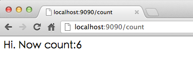
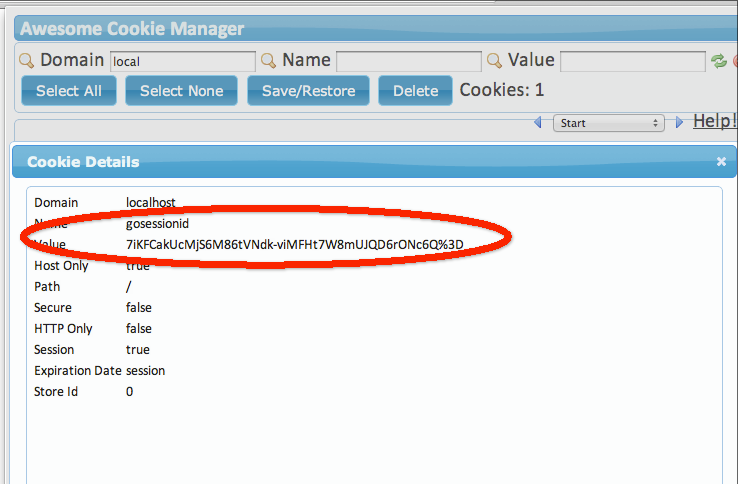
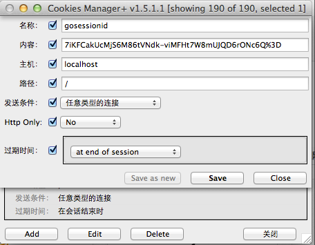
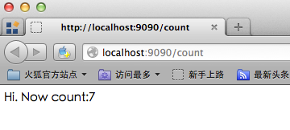

# 6.4 Sprečavanje otimanja sesije

[Sadržaj](_00.0-sr.md)

Otimanje sesije je uobičajena, ali ozbiljna bezbednosna pretnja. Klijenti koriste ID-ove sesije za validaciju i druge svrhe prilikom komunikacije sa serverima. Nažalost, zlonamerne treće strane ponekad mogu pratiti ovu komunikaciju i otkriti ID sesije klijenta.

U ovom odeljku ćemo vam pokazati kako da preuzmete sesiju u obrazovne svrhe.

## Proces otmice sesije

Sledeći kod je brojač za `count` promenljivu:

```go
func count(w http.ResponseWriter, r *http.Request) {
    sess := globalSessions.SessionStart(w, r)
    ct := sess.Get("countnum")
    if ct == nil {
        sess.Set("countnum", 1)
    } else {
        sess.Set("countnum", (ct.(int) + 1))
    }
    t, _ := template.ParseFiles("count.gtpl")
    w.Header().Set("Content-Type", "text/html")
    t.Execute(w, sess.Get("countnum"))
}
```

Sadržaj "count.gtpl" je sledeći:

```sh
Hi. Now count:{{.}}
```

U pregledaču možemo videti sledeći sadržaj:

  
Slika 6.4 brojanje u pregledaču.

Osvežavajte stranicu dok se broj ne poveća na 6, a zatim otvorite menadžer kolačića u pregledaču (ja ovde koristim Chrome). Trebalo bi da vidite sledeće informacije:

  
Slika 6.5 kolačići sačuvani u pregledaču.

Ovaj korak je veoma važan: otvorite drugi pregledač (ovde koristim Firefox), kopirajte URL adresu u novi pregledač, otvorite simulator kolačića da biste kreirali novi kolačić i unesite potpuno istu vrednost kao kolačić koji smo videli u našem prvom pregledaču.

  
Slika 6.6 Simulirajte kolačić.

Osvežite stranicu i videćete sledeće:


Slika 6.7 Otmica sesije je uspela.

Ovde vidimo da možemo da otmemo sesije između različitih pregledača, a radnje izvršene u jednom pregledaču mogu uticati na stanje stranice u drugom pregledaču. Pošto je HTTP bez stanja, ne postoji način da se sazna da je ID sesije iz Firefox-a simuliran, a ni Chrom ne može da zna da je njegov ID sesije otet.

## Kako sprečiti otmicu sesije

### Samo kolačić i token

Kroz ovaj jednostavan primer otmice sesije, možete videti da je to veoma opasno jer omogućava napadačima da rade šta god žele. Pa kako možemo sprečiti otmicu sesije?

- Prvi korak je postavljanje ID-ova sesije samo u kolačićima, umesto u prepisivanju URL-ova. Takođe, trebalo bi da podesimo svojstvo kolačića `httponly` na vrednost "true". Ovo ograničava pristup skriptama na strani klijenta ID-u sesije. Korišćenjem ovih tehnika, XSS ne može da pristupi kolačićima i neće biti tako lako kao što smo pokazali da se ID sesije dobije iz menadžera kolačića.

- Drugi korak je dodavanje tokena svakom zahtevu. Slično načinu na koji smo se bavili ponavljajućim slanjem obrazaca u prethodnim odeljcima, dodajemo skriveno polje koje sadrži token. Kada se zahtev pošalje serveru, možemo da verifikujemo ovaj token kako bismo dokazali da je zahtev jedinstven.

  ```go
  h := md5.New()
  salt:="astaxie%^7&8888"
  io.WriteString(h,salt+time.Now().String())
  token:=fmt.Sprintf("%x",h.Sum(nil))
  if r.Form["token"]!=token{
      // ask to log in
  }
  sess.Set("token",token)
  ```

### Vremensko ograničenje ID-a sesije

Drugo rešenje je dodavanje vremena kreiranja za svaku sesiju i zamena isteklih ID-ova sesija novim. Ovo može sprečiti otmicu sesije pod određenim okolnostima, kao što je slučaj kada se otmica pokuša prekasno.

```go
createtime := sess.Get("createtime")
if createtime == nil {
    sess.Set("createtime", time.Now().Unix())
} else if (createtime.(int64) + 60) < (time.Now().Unix()) {
    globalSessions.SessionDestroy(w, r)
    sess = globalSessions.SessionStart(w, r)
}
```

Postavljamo vrednost da bismo sačuvali vreme kreiranja i proverili da li je isteklo (ovde sam postavio 60 sekundi). Ovaj korak često može da spreči pokušaje otimanja sesije.

Kombinovanjem dva gore navedena rešenja moći ćete da sprečite većinu pokušaja otimanja sesija. S jedne strane, ID-ovi sesija koji se često resetuju rezultiraće time da napadač uvek dobija istekle i beskorisne ID-ove sesija; s druge strane, postavljanjem svojstva `httponly` na kolačiće i osiguravanjem da se ID-ovi sesija mogu prosleđivati samo putem kolačića, svi napadi zasnovani na URL-ovima se ublažavaju. Konačno, podešavamo `MaxAge=0` naših kolačića, što znači da ID-ovi sesija neće biti sačuvani u istoriji pregledača.

[Sadržaj](_00.0-sr.md)
