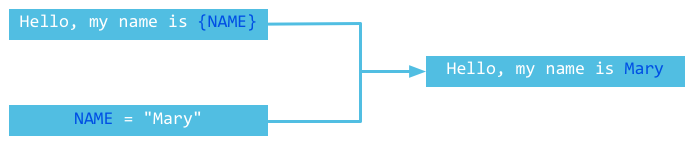

# 7.4 Šabloni

[Sadržaj](_00.0-sr.md)

## Šta je šablon

Nadam se da ste upoznati sa MVC (Model, View, Controller) modelom dizajna, gde modeli obrađuju podatke, views prikazuju rezultate i konačno, kontroleri obrađuju zahteve korisnika. Za views, mnogi dinamički jezici generišu podatke pisanjem koda u statičkim HTML datotekama. Na primer, JSP se implementira umetanjem `<%=....=%>`, PHP umetanjem `<?php.....?>`, itd.

Sledeće prikazuje mehanizam šablona:


Slika 7.1 Mehanizam šablona

Većina sadržaja kojim veb aplikacije odgovaraju klijentima je statički, a dinamički delovi su obično veoma mali. Na primer, ako treba da prikažete listu korisnika koji su posetili stranicu, samo korisničko ime bi bilo dinamičko. Stil liste ostaje isti. Kao što vidite, šabloni su korisni za ponovnu upotrebu statičkog sadržaja.

## Šabloniranje u Gou

U programu Go imamo `template` paket koji pomaže u radu sa šablonima. Možemo koristiti funkcije poput `Parse`, `ParseFile` i `Execute` da učitamo šablone iz običnog teksta ili datoteka, a zatim procenimo dinamičke delove, kao što je prikazano na slici 7.1.

Primer:

```go
func handler(w http.ResponseWriter, r *http.Request) {
    t := template.New("some template") // Create a template.
    t, _ = t.ParseFiles("tmpl/welcome.html", nil)  // Parse template file.
    user := GetUser() // Get current user infomration.
    t.Execute(w, user)  // merge.
}
```

Kao što vidite, veoma je lako koristiti, učitavati i prikazivati podatke u šablonima u Go-u, baš kao i u drugim programskim jezicima.

Radi praktičnosti, u našim primerima ćemo koristiti sledeća pravila:

- Koristi se `Parse` za zamenu `ParseFiles` jer `Parse` može da testira sadržaj direktno iz stringova, tako da nam nisu potrebne nikakve dodatne datoteke.
- Koristite `main` za svaki primer i nemojte koristiti `handler`.
- Koristi se `os.Stdout` za zamenu `http.ResponseWriter` jer `os.Stdout` takođe implementira `io.Writer` interfejs.

## Ubacivanje podataka u šablon

Upravo smo vam pokazali kako da analizirate i renderujete šablone. Hajde da odemo korak dalje i renderujemo podatke u naše šablone. Svaki šablon je objekat u programskom jeziku Go, pa kako da ubacimo polja u šablone?

### Polja

U programu Go, svako polje koje želite da se prikaže unutar šablona treba da bude stavljeno unutar `{{}}`. `{{.}}` je skraćenica za trenutni objekat, što je slično njegovom pandanu u Javi ili C++. Ako želite da pristupite poljima trenutnog objekta, trebalo bi da koristite `{{.FieldName}}`. Obratite pažnju da se u šablonima može pristupiti samo izvezenim poljima. Evo primera:

```go
package main

import (
    "html/template"
    "os"
)

type Person struct {
    UserName string
}

func main() {
    t := template.New("fieldname example")
    t, _ = t.Parse("hello {{.UserName}}!")
    p := Person{UserName: "Astaxie"}
    t.Execute(os.Stdout, p)
}
```

Gornji primer se prikazuje "hello Astaxie" ispravno, ali ako malo izmenimo našu strukturu, pojavljuje se sledeća greška:

```go
type Person struct {
    UserName string
    email    string  // Field is not exported.
}

t, _ = t.Parse("hello {{.UserName}}! {{.email}}")
```

Ovaj deo koda neće biti kompajliran jer pokušavamo da pristupimo polju koje nije izvezeno. Međutim, ako pokušamo da koristimo polje koje ne postoji, Go jednostavno izbacuje prazan string umesto greške.

Ako štampate `{{.}}` u šablonu, Go izbacuje formatirani string ovog objekta, pozivajući funkciju `fmt` ispod haube.

### Ugnežđena polja

Sada znamo kako da ispišemo polje. Šta ako je polje objekat i takođe ima svoja polja? Kako da ih sva ispišemo u jednoj petlji? Možemo koristiti `{{with …}}…{{end}}` i `{{range …}}{{end}}` upravo za tu svrhu.

` {{range}}` baš kao `range` u Go-u.
` {{with}}` vam omogućava da jednom napišete isto ime objekta i koristite ga kao skraćenicu ( slično kao `with` u VB-u ).

Više primera:

```go
package main

import (
    "html/template"
    "os"
)

type Friend struct {
    Fname string
}

type Person struct {
    UserName string
    Emails   []string
    Friends  []*Friend
}

func main() {
    f1 := Friend{Fname: "minux.ma"}
    f2 := Friend{Fname: "xushiwei"}
    t := template.New("fieldname example")
    t, _ = t.Parse(`hello {{.UserName}}!
            {{range .Emails}}
                an email {{.}}
            {{end}}
            {{with .Friends}}
            {{range .}}
                my friend name is {{.Fname}}
            {{end}}
            {{end}}
            `)
    p := Person{UserName: "Astaxie",
        Emails:  []string{"astaxie@beego.me", "astaxie@gmail.com"},
        Friends: []*Friend{&f1, &f2}}
    t.Execute(os.Stdout, p)
}
```

### Uslovi

Ako treba da proverite uslove u šablonima, možete koristiti `if-else` sintaksu baš kao što biste to radili u redovnim Go programima. Ako je cevovod prazan, podrazumevana vrednost `if` je `false`. Sledeći primer pokazuje kako se koristi `if-else` u šablonima:

```go
package main

import (
    "os"
    "text/template"
)

func main() {
    tEmpty := template.New("template test")
    tEmpty = template.Must(tEmpty.Parse("Empty pipeline if demo: {{if ``}} will not be outputted. {{end}}\n"))
    tEmpty.Execute(os.Stdout, nil)

    tWithValue := template.New("template test")
    tWithValue = template.Must(tWithValue.Parse("Not empty pipeline if demo: {{if `anything`}} will be outputted. {{end}}\n"))
    tWithValue.Execute(os.Stdout, nil)

    tIfElse := template.New("template test")
    tIfElse = template.Must(tIfElse.Parse("if-else demo: {{if `anything`}} if part {{else}} else part.{{end}}\n"))
    tIfElse.Execute(os.Stdout, nil)
}
```

Kao što vidite, lako ga je koristiti `if-else` u šablonima.

> [!Note]
> Ne možete koristiti uslovne izraze u `if`, na primer `Mail=="astaxie@gmail.com"`. Prihvatljive
> su samo bulove vrednosti.

### Cevovodi

Korisnici Unixa bi trebalo da budu upoznati sa `pipe` operatorom, kao što je `ls | grep "beego"`. Ova komanda filtrira datoteke i prikazuje samo one koje sadrže reč beego. Jedna stvar koja mi se sviđa kod Go šablona je to što podržavaju cevovode. Bilo šta u njima `{{}}` može biti podatak cevovoda. Imejl koji smo koristili gore može učiniti našu aplikaciju ranjivom na XSS napade. Kako možemo da rešimo ovaj problem korišćenjem cevovoda?

```html
{{. | html}}
```

Ovu metodu možemo koristiti da pretvorimo telo imejla u HTML. Veoma je slično pisanju Unix komande i pogodno je za upotrebu u šablonskim funkcijama.

### Promenljive šablona

Ponekad nam je potrebno da koristimo lokalne promenljive u šablonima. Možemo ih koristiti sa ključnim rečima `with`, `range` i `if`, a njihov opseg je između ovih ključnih reči i `{{end}}`. Evo primera deklarisanja globalne promenljive:

```go
$variable := pipeline
```

Više primera:

```html
{{with $x := "output" | printf "%q"}}{{$x}}{{end}}
{{with $x := "output"}}{{printf "%q" $x}}{{end}}
{{with $x := "output"}}{{$x | printf "%q"}}{{end}}
```

### Funkcije šablona

Go koristi `fmt` paket za formatiranje izlaza u šablonima, ali ponekad moramo da uradimo nešto drugo. Na primer, razmotrimo sledeći scenario: recimo da želimo da zamenimo `@` sa `at` u našoj imejl adresi, kao što je `astaxie at beego.me`. U ovom trenutku, moramo da napišemo prilagođenu funkciju.

Svaka šablonska funkcija ima jedinstveno ime i povezana je sa jednom funkcijom u vašem Go programu na sledeći način:

```go
type FuncMap map[string]interface{}
```

Pretpostavimo da imamo `emailDeal` šablonsku funkciju povezanu sa njenom `EmailDealWith` pandanom u našem Go programu. Možemo koristiti sledeći kod da registrujemo ovu funkciju:

```go
t = t.Funcs(template.FuncMap{"emailDeal": EmailDealWith})
```

`EmailDealWith` definicija:

```go
func EmailDealWith(args …interface{}) string
```

Primer:

```go
package main

import (
    "fmt"
    "html/template"
    "os"
    "strings"
)

type Friend struct {
    Fname string
}

type Person struct {
    UserName string
    Emails   []string
    Friends  []*Friend
}

func EmailDealWith(args ...interface{}) string {
    ok := false
    var s string
    if len(args) == 1 {
        s, ok = args[0].(string)
    }
    if !ok {
        s = fmt.Sprint(args...)
    }
    // find the @ symbol
    substrs := strings.Split(s, "@")
    if len(substrs) != 2 {
        return s
    }
    // replace the @ by " at "
    return (substrs[0] + " at " + substrs[1])
}

func main() {
    f1 := Friend{Fname: "minux.ma"}
    f2 := Friend{Fname: "xushiwei"}
    t := template.New("fieldname example")
    t = t.Funcs(template.FuncMap{"emailDeal": EmailDealWith})
    t, _ = t.Parse(`hello {{.UserName}}!
                {{range .Emails}}
                    an emails {{.|emailDeal}}
                {{end}}
                {{with .Friends}}
                {{range .}}
                    my friend name is {{.Fname}}
                {{end}}
                {{end}}
                `)
    p := Person{UserName: "Astaxie",
        Emails:  []string{"astaxie@beego.me", "astaxie@gmail.com"},
        Friends: []*Friend{&f1, &f2}}
    t.Execute(os.Stdout, p)
}
```

Evo liste ugrađenih funkcija šablona:

```go
var builtins = FuncMap{
    "and":      and,
    "call":     call,
    "html":     HTMLEscaper,
    "index":    index,
    "js":       JSEscaper,
    "len":      length,
    "not":      not,
    "or":       or,
    "print":    fmt.Sprint,
    "printf":   fmt.Sprintf,
    "println":  fmt.Sprintln,
    "urlquery": URLQueryEscaper,
}
```

### Must

Paket šablona ima funkciju koja se zove `Must` koja služi za validaciju šablona, kao što je podudaranje zagrada, komentara i promenljivih. Pogledajmo primer `Must`:

```go
package main

import (
    "fmt"
    "text/template"
)

func main() {
    tOk := template.New("first")
    template.Must(tOk.Parse(" some static text /* and a comment */"))
    fmt.Println("The first one parsed OK.")

    template.Must(template.New("second").Parse("some static text {{ .Name }}"))
    fmt.Println("The second one parsed OK.")

    fmt.Println("The next one ought to fail.")
    tErr := template.New("check parse error with Must")
    template.Must(tErr.Parse(" some static text {{ .Name }"))
}
```

Izlaz:

```sh
The first one parsed OK.
The second one parsed OK.
The next one ought to fail.
panic: template: check parse error with Must:1: unexpected "}" in command
```

### Ugnežđeni šabloni

Baš kao i u većini veb aplikacija, određeni delovi šablona mogu se ponovo koristiti u drugim šablonima, poput zaglavlja i podnožja bloga. Možemo deklarisati header, content i footer kao podšablone, i deklarisati ih u Go-u koristeći sledeću sintaksu:

```html
{{define "sub-template"}}content{{end}}
```

Podšablon se poziva korišćenjem sledeće sintakse:

```html
{{template "sub-template"}}
```

Evo kompletnog primera, pretpostavimo da imamo sledeće tri datoteke: header.tmpl, content.tmpli footer.tmplu fascikli templates, pročitaćemo fasciklu i sačuvati imena datoteka u nizu stringova, koji ćemo zatim koristiti za parsiranje datoteka.

Glavni šablon:

```html

//header.tmpl
{{define "header"}}
<html>
<head>
    <title>Something here</title>
</head>
<body>
{{end}}

//content.tmpl
{{define "content"}}
{{template "header"}}
<h1>Nested here</h1>
<ul>
    <li>Nested usag</li>
    <li>Call template</li>
</ul>
{{template "footer"}}
{{end}}

//footer.tmpl
{{define "footer"}}
</body>
</html>
{{end}}

// When using subtemplating make sure that you have parsed each sub template file,
// otherwise the compiler wouldn't understand what to substitute when it 
// reads the {{template "header"}}


```

Kod:

```go
package main

import (
    "fmt"
    "os"
    "io/ioutil"
    "text/template"
    "strings"
)

var templates *template.Template

func main() {
    var allFiles []string
    files, err := ioutil.ReadDir("./templates")
    if err != nil {
        fmt.Println(err)
    }
    for _, file := range files {
        filename := file.Name()
        if strings.HasSuffix(filename, ".tmpl") {
            allFiles = append(allFiles, "./templates/"+filename)
        }
    }

    templates, err = template.ParseFiles(allFiles...) // parses all .tmpl files in the 'templates' folder

    s1 := templates.Lookup("header.tmpl")
    s1.ExecuteTemplate(os.Stdout, "header", nil)
    fmt.Println()
    s2 := templates.Lookup("content.tmpl")
    s2.ExecuteTemplate(os.Stdout, "content", nil)
    fmt.Println()
    s3 := templates.Lookup("footer.tmpl")
    s3.ExecuteTemplate(os.Stdout, "footer", nil)
    fmt.Println()
    s3.Execute(os.Stdout, nil)
}
```

Ovde možemo videti da `template.ParseFiles` analizira sve ugnežđene šablone u keš memoriju i da je
`{{define}}` svaki šablon definisan nezavisan jedan od drugog. Oni se čuvaju u nečemu poput mape, gde su imena šablona ključevi, a vrednosti tela šablona. Zatim možemo koristiti `ExecuteTemplate` da izvršimo odgovarajuće podšablone, tako da zaglavlje i podnožje budu nezavisni, a sadržaj ih sadrži oba. Imajte na umu da ako pokušamo da izvršimo `s1.Execute`, ništa se neće ispisati jer nema dostupnog podrazumevanog podšablona.

Kada ne želite da koristite `{{define}}`, onda možete jednostavno da kreirate tekstualnu datoteku sa imenom podšablona, na primer, `_head.tmpl` je podšablon koji ćete koristiti u celom projektu, a zatim da kreirate ovu datoteku u folderu šablona i koristite normalnu sintaksu. Keš pretrage je u osnovi kreiran tako da ne čitate datoteku svaki put kada pošaljete zahtev, jer ako to uradite, onda trošite mnogo resursa na čitanje datoteke koja se neće promeniti osim ako se kodna baza ne prepisuje. Nema smisla analizirati datoteke šablona tokom svakog HTTP GET zahteva, pa se koristi tehnika gde analiziramo datoteke jednom, a zatim vršimo `Lookup()`na kešu da bismo izvršili šablon kada nam je potreban za prikaz podataka.

Šabloni u jednom skupu se poznaju, ali ih morate analizirati za svaki pojedinačni skup.

Ponekad želite da kontekstualizujete šablone, na primer, imate `_head.html`, možda imate zaglavlje čiju vrednost morate da popunite na osnovu podataka koje učitavate, na primer, za menadžer liste zadataka možete imati tri kategorije pending, completed, deleted. Za ovo pretpostavimo da imate if naredbu kao što je ova.

```html
<title>{{if eq .Navigation "pending"}} Tasks
    {{ else if eq .Navigation "completed"}}Completed
    {{ else if eq .Navigation "deleted"}}Deleted
    {{ else if eq .Navigation "edit"}} Edit
    {{end}}
</title>
```

**Napomena**:  
Go šabloni prate poljsku notaciju prilikom poređenja, gde prvo navodite operator, zatim vrednost poređenja i vrednost sa kojom se upoređuje. Deo "else if" je prilično jednostavan.

Obično koristimo `{{ range }}` operator za prolazak kroz kontekstnu promenljivu koju prosleđujemo šablonu tokom izvršavanja ovako:

```go
//present in views package
context := db.GetTasks("pending") //true when you want non deleted notes
homeTemplate.Execute(w, context)
```

Kontekstni objekat dobijamo iz baze podataka kao strukturni objekat, definicija je sledeća:

```go
//Task is the struct used to identify tasks
type Task struct {
       Id      int
    Title   string
    Content string
    Created string
}
//Context is the struct passed to templates
type Context struct {
    Tasks      []Task
    Navigation string
    Search     string
    Message    string
}

//present in database package
var task []types.Task
var context types.Context
context = types.Context{Tasks: task, Navigation: status}

//This line is in the database package where the context is returned back to the view.
```

Koristimo niz zadataka i navigaciju u našim šablonima, videli smo kako koristimo navigaciju u šablonu, videćemo kako ćemo koristiti stvarni niz zadataka u našem šablonu.

Ovde `{{ if .Tasks }}` prvo proveravamo da li je polje "Tasks" našeg kontekstnog objekta, koje smo prosledili šablonu tokom izvršavanja, prazno ili ne. Ako nije prazno, onda ćemo proći kroz taj niz da bismo popunili naslov i sadržaj "Tasks". Donji primer je veoma važan kada je u pitanju petlja kroz niz u šablonu, počinjemo sa operatorom opsega, zatim možemo dati bilo kom članu te strukture kao "{{.Name}}", moja struktura "Tasks" ima naslov i sadržaj (obratite pažnju na velika T i C, to su izvezena imena i moraju biti napisana velikim slovom osim ako ne želite da ih učinite privatnim).

```html
{{ range .Tasks }}
    {{ .Title }}
    {{ .Content }}
{{ end }}
```

Ovaj blok koda će ispisati svaki naslov i sadržaj niza zadataka. Ispod je kompletan primer iz šablona github.com/thewhitetulip/Tasks home.html.

```html
<div class="timeline">
{{ if .Tasks}} {{range .Tasks}}
<div class="note">
    <p class="noteHeading">{{.Title}}</p>
    <hr>
    <p class="noteContent">{{.Content}}</p>
    </ul>
    </span>
</div>
{{end}} {{else}}
<div class="note">
    <p class="noteHeading">No Tasks here</p>
    <p class="notefooter">
    Create new task<button class="floating-action-icon-add" > here </button> </p>
</div>
{{end}}
```

## Rezime šablona

U ovom odeljku ste naučili kako da kombinujete dinamičke podatke sa šablonima koristeći tehnike koje uključuju ispisivanje podataka u petljama, funkcije šablona i ugnežđene šablone. Učenjem o šablonima možemo zaključiti diskusiju o V (View) delu MVC arhitekture. U narednim poglavljima ćemo obraditi M (Model) i C (Controller) aspekte MVC-a.

[Sadržaj](_00.0-sr.md)
