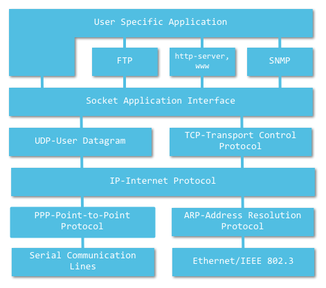
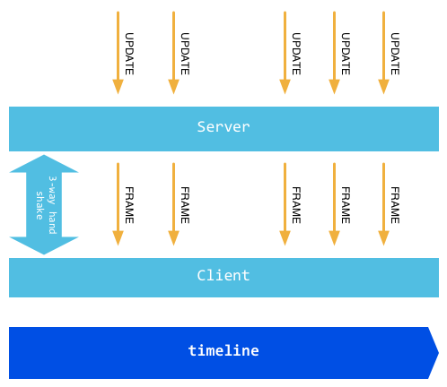
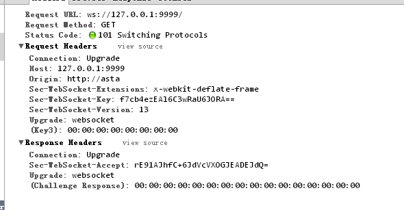
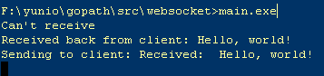
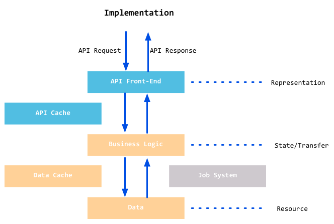
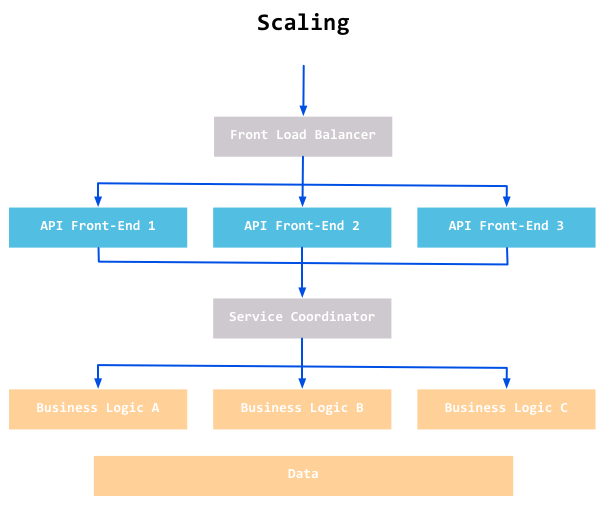
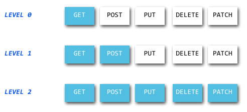
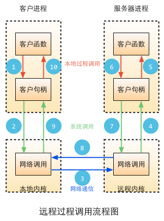

# 8 Veb servisi

[Sadržaj](_00-sr.md)

Veb servisi vam omogućavaju da koristite formate poput XML ili JSON za razmenu informacija putem HTTP-a. Na primer, ako želite da znate vreme u Šangaju sutra, trenutnu cenu akcija kompanije Apple ili informacije o proizvodu na Amazon-u, možete napisati deo koda da biste preuzeli te informacije sa otvorenih platformi. U Go-u, ovaj proces se može uporediti sa pozivanjem lokalne funkcije i dobijanjem njene povratne vrednosti.

Ključna stvar je da su veb servisi nezavisni od platforme. To vam omogućava da rasporedite svoje aplikacije na Linuksu i da komunicirate sa ASP.NET aplikacijama u Vindousu, na primer, baš kao što ne biste imali problema ni sa interakcijom sa JSP-om na FreeBSD-u.

REST arhitektura i SOAP protokol su najpopularniji stilovi u kojima se veb servisi mogu implementirati ovih dana:

REST zahtevi su prilično jednostavni jer su zasnovani na HTTP-u. Svaki REST zahtev je zapravo HTTP zahtev, a serveri obrađuju zahteve koristeći različite metode. Pošto su mnogi programeri već upoznati sa HTTP-om, REST bi trebalo da im se čini kao da je već u njihovom džepu. Pokazaćemo vam kako da implementirate REST u Go-u u odeljku 8.3.

SOAP je standard za prenos informacija između mreža i pozive funkcija udaljenih računara, koji je pokrenuo W3C. Problem sa SOAP-om je što je njegova specifikacija veoma dugačka i komplikovana, i još uvek postaje duža. Go veruje da stvari treba da budu jednostavne, tako da nećemo govoriti o SOAP-u. Srećom, Go pruža podršku za RPC (Remote Procedure Calls - pozivi udaljenih procedura) koji ima dobre performanse i jednostavan je za razvoj, pa ćemo u odeljku 8.4 predstaviti kako implementirati RPC u Go-u.

Go je C jezik 21. veka, koji teži da bude jednostavan, ali i efikasno funkcionisan. Imajući ove kvalitete u vidu, upoznaćemo vas sa soket programiranjem u Gou u odeljku 8.1. Danas, mnogi serveri u realnom vremenu koriste sokete kako bi prevazišli niske performanse HTTP-a. Uz brzi razvoj HTML5, veb sokete sada koriste mnoge kompanije za veb igre, a o tome ćemo više govoriti u odeljku 8.2.

## 8.1 Soketi (utičnice)

Neki programeri mrežnih aplikacija kažu da su niži slojevi aplikacija isključivo vezani za programiranje soketa. Ovo možda nije tačno za sve slučajeve, ali mnoge moderne veb aplikacije zaista koriste sokete u svoju korist. Da li ste se ikada zapitali kako pregledači komuniciraju sa veb serverima kada surfujete internetom? Ili kako MSN povezuje vas i vaše prijatelje u sobi za ćaskanje, prenoseći svaku poruku u realnom vremenu? Mnogi servisi poput ovih koriste sokete za prenos podataka. Kao što vidite, soketi danas zauzimaju važnu poziciju u mrežnom programiranju, a u ovom odeljku ćemo naučiti o korišćenju soketa u Go-u.

### Šta je soket

Soketi potiču iz Unixa, i s obzirom na osnovnu filozofiju Unixa "sve je datoteka", sve se može obaviti pomoću "otvori -> piši/čitaj -> zatvori". Soketi su jedna implementacija ove filozofije. Soketi imaju poziv funkcije za otvaranje soketa baš kao što biste otvorili datoteku. Ovo vraća celobrojni deskriptor soketa koji se zatim može koristiti za operacije poput kreiranja veza, prenosa podataka itd.

Dve vrste soketa koje se obično koriste su:

- strim soketi (SOCK_STREAM) i
- datagram soketi (SOCK_DGRAM).

Strim soketi su orijentisani na konekciju kao TCP, dok datagram soketi ne uspostavljaju veze, kao UDP.

### Komunikacija soketima

Pre nego što shvatimo kako soketi komuniciraju jedni sa drugima, moramo da shvatimo kako da osiguramo da je svaki soket jedinstven, inače je uspostavljanje pouzdanog komunikacionog kanala već van svake mogućnosti. Možemo svakom procesu dati jedinstveni PID koji služi našoj svrsi lokalno, međutim, to nije u stanju da funkcioniše preko mreže. Srećom, TCP/IP nam pomaže da rešimo ovaj problem. IP adrese mrežnog sloja su jedinstvene u mreži hostova, a "protokol + port" je takođe jedinstven među host aplikacijama. Dakle, možemo koristiti ove principe da napravimo sokete koji su jedinstveni.

  
Slika 8.1 Slojevi mrežnog protokola

Aplikacije koje su zasnovane na TCP/IP-u koriste soket API-je u svom kodu na ovaj ili onaj način. S obzirom na to da umrežene aplikacije postaju sve rasprostranjenije u savremenom dobu, nije ni čudo što neki programeri kažu da "sve se vrti oko soketa".

### Osnovno znanje o soketima

Znamo da postoje dve vrste soketa, a to su TCP i UDP. TCP i UDP su protokoli i, kao što je pomenuto, potrebna nam je i IP adresa i broj porta da bismo imali jedinstveni soket.

**IPv4**:

Globalni internet koristi TCP/IP kao svoj protokol, gde je IP mrežni sloj i ključni deo TCP/IP-a. IPv4 označava da je njegova verzija 4; razvoj infrastrukture do danas trajao je preko 30 godina.

Broj bitova u IPv4 adresi je 32, što znači da se 2^32 uređaja mogu jedinstveno povezati na internet. Zbog brzog razvoja interneta, IP adrese su poslednjih godina već rasprodate.

Format adrese: 127.0.0.1, 172.122.121.111.

**IPv6**:

IPv6 je sledeća verzija ili sledeća generacija interneta. Razvija se radi rešavanja mnogih problema svojstvenih IPv4. Uređaji koji koriste IPv6 imaju adresu dužine 128 bita, tako da nikada nećemo morati da brinemo o nedostatku jedinstvenih adresa. Da bismo ovo stavili u perspektivu, sa IPv6 biste mogli imati više od 1000 IP adresa po kvadratnom metru na Zemlji. Drugi problemi poput peer-to-peer veze, kvaliteta usluge (QoS), bezbednosti, višestrukog emitovanja itd., takođe će biti poboljšani.

Format adrese: 2002:c0e8:82e7:0:0:0:c0e8:82e7.

**IP tipovi u Gou**:

Paket `net` u Go jeziku pruža mnoge tipove, funkcije i metode za mrežno programiranje. Definicija IP-a je sledeća:

```go
type IP []byte
```

Funkcija `ParseIP(s string)` IP je konvertovanje IPv4 ili IPv6 formata u IP adresu:

```go
package main
import (
    "net"
    "os"
    "fmt"
)
func main() {
    if len(os.Args) != 2 {
        fmt.Fprintf(os.Stderr, "Usage: %s ip-addr\n", os.Args[0])
        os.Exit(1)
    }
    name := os.Args[1]
    addr := net.ParseIP(name)
    if addr == nil {
        fmt.Println("Invalid address")
    } else {
        fmt.Println("The address is ", addr.String())
    }
    os.Exit(0)
}
```

Vraća odgovarajući IP format za datu IP adresu.

### TCP soketi

Šta možemo da uradimo kada znamo kako da posetimo veb servis preko mrežnog porta? Kao klijent, možemo poslati zahtev na određeni mrežni port i dobiti njegov odgovor; kao server, potrebno je da povežemo servis sa određenim mrežnim portom, sačekamo zahteve klijenata i dostavimo odgovor.

U Go `net` paketu postoji tip `TCPConn` koji olakšava ovu vrstu interakcije klijenata/servera. Ovaj tip ima dve ključne funkcije:

```go
func (c *TCPConn) Write(b []byte) (n int, err os.Error)
func (c *TCPConn) Read(b []byte) (n int, err os.Error)
```

`TCPConn` se može koristiti od strane klijenta ili servera za čitanje i pisanje podataka.

Takođe nam je potreban `TCPAddr` da predstavimo informacije o TCP adresi:

```go
type TCPAddr struct {
    IP IP
    Port int
}
```

Koristimo `ResolveTCPAddr` funkciju da dobijemo `TCPAddr` u Go-u:

```go
func ResolveTCPAddr(net, addr string) (*TCPAddr, os.Error)
```

Argumenti:

- `net` može biti jedan od "tcp4", "tcp6" ili "tcp", koji svaki označava samo IPv4, samo IPv6 i IPv4 ili IPv6, respektivno.

- `addr` može biti ime domena ili IP adresa, kao što je `www.google.com:80` ili `127.0.0.1:22`.

#### TCP klijent

Go klijenti koriste `DialTCP` funkciju u `net` paketu da bi kreirali TCP vezu, koja vraća `TCPConn` objekat; nakon što se veza uspostavi, server ima isti tip objekta veze za trenutnu vezu, a klijent i server mogu početi da razmenjuju podatke jedni sa drugima. Generalno, klijenti šalju zahteve serverima putem `[ime servera] TCPConn` i primaju informacije odgovora servera; serveri čitaju i analiziraju zahteve klijenata, a zatim vraćaju povratne informacije. Ova veza će ostati važeća dok je klijent ili server ne zatvore. Funkcija za kreiranje veze je sledeća:

```go
func DialTCP(net string, laddr, raddr *TCPAddr) (c *TCPConn, err os.Error)
```

Argumenti:

- `net` može biti jedan od "tcp4", "tcp6" ili "tcp", koji svaki označava samo IPv4, samo IPv6 i IPv4 ili IPv6, respektivno.

- `laddr` predstavlja lokalnu adresu, podesite je na `nil` u većini slučajeva.

- `raddr` predstavlja udaljenu adresu.

Hajde da napišemo jednostavan primer koji simulira klijenta koji zahteva vezu sa serverom na osnovu HTTP zahteva. Potreban nam je jednostavan HTTP zaglavak zahteva:

```sh
"HEAD / HTTP/1.0\r\n\r\n"
```

Format informacija o odgovoru servera može izgledati ovako:

```sh
HTTP/1.0 200 OK
ETag: "-9985996"
Last-Modified: Thu, 25 Mar 2010 17:51:10 GMT
Content-Length: 18074
Connection: close
Date: Sat, 28 Aug 2010 00:43:48 GMT
Server: lighttpd/1.4.23
Klijentski kod:
```

```go
package main

import (
    "fmt"
    "io/ioutil"
    "net"
    "os"
)

func main() {
    if len(os.Args) != 2 {
        fmt.Fprintf(os.Stderr, "Usage: %s host:port ", os.Args[0])
        os.Exit(1)
    }
    
    service := os.Args[1]
    tcpAddr, err := net.ResolveTCPAddr("tcp4", service)
    checkError(err)
    
    conn, err := net.DialTCP("tcp", nil, tcpAddr)
    checkError(err)
    
    _, err = conn.Write([]byte("HEAD / HTTP/1.0\r\n\r\n"))
    checkError(err)
    
    result, err := ioutil.ReadAll(conn)
    checkError(err)
    fmt.Println(string(result))
    
    os.Exit(0)
}
func checkError(err error) {
    if err != nil {
        fmt.Fprintf(os.Stderr, "Fatal error: %s", err.Error())
        os.Exit(1)
    }
}
```

U gornjem primeru, koristimo korisnički unos kao `service` argument funkcije `net.ResolveTCPAddr` da bismo dobili `tcpAddr`. Prenoseći `tcpAddr` funkciji `DialTCP`, kreiramo TCP vezu, `conn`. Zatim možemo koristiti `conn` da pošaljemo informacije o zahtevu serveru. Na kraju, koristimo `ioutil.ReadAll` da pročitamo sav sadržaj iz `conn`, koji sadrži odgovor servera.

#### TCP server

Sada imamo TCP klijenta. Takođe možemo koristiti `net` paket za pisanje TCP servera. Na strani servera, potrebno je da povežemo naš servis sa određenim neaktivnim portom i da slušamo sve dolazne zahteve klijenata.

```go
func ListenTCP(net string, laddr *TCPAddr) (l *TCPListener, err os.Error)
func (l *TCPListener) Accept() (c Conn, err os.Error)
```

Argumenti potrebni ovde su identični onima koje zahteva `DialTCP` funkcija koju smo ranije koristili. Hajde da implementiramo servis za sinhronizaciju vremena koristeći port 7777:

```go
package main

import (
    "fmt"
    "net"
    "os"
    "time"
)

func main() {
    service := ":7777"
    tcpAddr, err := net.ResolveTCPAddr("tcp4", service)
    checkError(err)

    listener, err := net.ListenTCP("tcp", tcpAddr)
    checkError(err)

    for {
        conn, err := listener.Accept()
        if err != nil {
            continue
        }
        daytime := time.Now().String()
        conn.Write([]byte(daytime)) // don't care about return value
        conn.Close()                // we're finished with this client
    }
}
func checkError(err error) {
    if err != nil {
        fmt.Fprintf(os.Stderr, "Fatal error: %s", err.Error())
        os.Exit(1)
    }
}
```

Nakon što se servis pokrene, čeka zahteve klijenata. Kada primi zahtev klijenta, on ga `Accept` i vraća odgovor klijentu koji sadrži informacije o trenutnom vremenu. Vredi napomenuti da kada se u petlji `for` dogode greške, servis nastavlja sa radom umesto da se zatvori. Umesto pada, server će zabeležiti grešku u dnevnik grešaka servera.

Međutim, gornji kod i dalje nije dovoljno dobar. Nismo koristili gorutine, koje bi nam omogućile da prihvatimo simultane zahteve. Hajde da uradimo ovo sada:

```go
package main

import (
    "fmt"
    "net"
    "os"
    "time"
)

func main() {
    service := ":1200"
    
    tcpAddr, err := net.ResolveTCPAddr("tcp4", service)
    checkError(err)

    listener, err := net.ListenTCP("tcp", tcpAddr)
    checkError(err)

    for {
        conn, err := listener.Accept()
        if err != nil {
            continue
        }
        go handleClient(conn)
    }
}

func handleClient(conn net.Conn) {
    defer conn.Close()
    daytime := time.Now().String()
    conn.Write([]byte(daytime)) // don't care about return value
    // we're finished with this client
}

func checkError(err error) {
    if err != nil {
        fmt.Fprintf(os.Stderr, "Fatal error: %s", err.Error())
        os.Exit(1)
    }
}
```

Odvajanjem našeg poslovnog procesa od `handleClient` funkcije i korišćenjem `go` ključne reči, već smo implementirali konkurentnost u našoj usluzi. Ovo je dobra demonstracija moći i jednostavnosti gorutina.

Neki od vas možda misle sledeće: ovaj server ne radi ništa smisleno. Šta ako bismo trebali da pošaljemo više zahteva za različite vremenske formate preko jedne veze? Kako bismo to uradili?

```go
package main

import (
    "fmt"
    "net"
    "os"
    "time"
    "strconv"
)

func main() {
    service := ":1200"
    tcpAddr, err := net.ResolveTCPAddr("tcp4", service)
    checkError(err)
    listener, err := net.ListenTCP("tcp", tcpAddr)
    checkError(err)
    for {
        conn, err := listener.Accept()
        if err != nil {
            continue
        }
        go handleClient(conn)
    }
}

func handleClient(conn net.Conn) {
    conn.SetReadDeadline(time.Now().Add(2 * time.Minute)) // set 2 minutes timeout
    request := make([]byte, 128) // set maximum request length to 128B to prevent flood based attacks
    defer conn.Close()  // close connection before exit
    for {
        read_len, err := conn.Read(request)

        if err != nil {
            fmt.Println(err)
            break
        }

        if read_len == 0 {
            break // connection already closed by client
        } else if string(request[:read_len]) == "timestamp" {
            daytime := strconv.FormatInt(time.Now().Unix(), 10)
            conn.Write([]byte(daytime))
        } else {
            daytime := time.Now().String()
            conn.Write([]byte(daytime))
        }
    }
}

func checkError(err error) {
    if err != nil {
        fmt.Fprintf(os.Stderr, "Fatal error: %s", err.Error())
        os.Exit(1)
    }
}
```

U ovom primeru, koristimo `conn.Read()` za stalno čitanje zahteva klijenata. Ne možemo zatvoriti vezu jer klijenti mogu izdati više od jednog zahteva. Zbog vremenskog ograničenja koje smo podesili pomoću `conn.SetReadDeadline()`, veza se automatski zatvara nakon dodeljenog vremenskog perioda. Kada vreme isteka istekne, naš program prekida petlju `for`. Obratite pažnju da `request` mora biti kreiran sa ograničenjem maksimalne veličine kako bi se sprečili napadi preplavljivanjem.

### Kontrolisanje TCP konekcija

Funkcije za TCP kontrolisanje:

- **DialTimeout**

  Podešavanje timeout vremena konekcije.

  ```go
  func DialTimeout(net, addr string, timeout time.Duration) (Conn, error)
  ```
  
- **SetRead(Write)Deadline**

  Podešavanje vremenskog ograničenja konekcija. Ovo je pogodno za upotrebu i na klijentima i na serverima.

  ```go
  func (c *TCPConn) SetReadDeadline(t time.Time) error
  func (c *TCPConn) SetWriteDeadline(t time.Time) error
  ```
  
- **SetKeepAlive**

  Podešavanje vremenskog ograničenja za pisanje/čitanje jedne veze:

  ```go
  func (c *TCPConn) SetKeepAlive(keepalive bool) os.Error
  ```

Vredi odvojiti malo vremena da razmislite o tome koliko dugo želite da traju vremenska ograničenja za vaše veze. Duge veze mogu smanjiti količinu dodatnih troškova potrebnih za kreiranje veza i dobre su za aplikacije koje treba često da razmenjuju podatke.

Za detaljnije informacije, samo pogledajte zvaničnu dokumentaciju za Go `net` paket.

### UDP soketi

Jedina razlika između UDP soketa i TCP soketa je metod obrade za rukovanje višestrukim zahtevima na strani servera. To proizilazi iz činjenice da UDP nema funkciju poput `Accept`. Sve ostale funkcije imaju UDP ekvivalente; samo zamenite TCP sa UDP u gore pomenutim funkcijama.

```go
func ResolveUDPAddr(net, addr string) (*UDPAddr, os.Error)
func DialUDP(net string, laddr, raddr *UDPAddr) (c *UDPConn, err os.Error)
func ListenUDP(net string, laddr *UDPAddr) (c *UDPConn, err os.Error)
func (c *UDPConn) ReadFromUDP(b []byte) (n int, addr *UDPAddr, err os.Error
func (c *UDPConn) WriteToUDP(b []byte, addr *UDPAddr) (n int, err os.Error)
```

Primer UDP klijentskog koda:

```go
package main

import (
    "fmt"
    "net"
    "os"
)

func main() {
    if len(os.Args) != 2 {
        fmt.Fprintf(os.Stderr, "Usage: %s host:port", os.Args[0])
        os.Exit(1)
    }
    service := os.Args[1]

    udpAddr, err := net.ResolveUDPAddr("udp4", service)
    checkError(err)

    conn, err := net.DialUDP("udp", nil, udpAddr)
    checkError(err)

    _, err = conn.Write([]byte("anything"))
    checkError(err)

    var buf [512]byte
    n, err := conn.Read(buf[0:])
    checkError(err)

    fmt.Println(string(buf[0:n]))
    os.Exit(0)
}
func checkError(err error) {
    if err != nil {
        fmt.Fprintf(os.Stderr, "Fatal error ", err.Error())
        os.Exit(1)
    }
}
```

Primer koda UDP servera:

```go
package main

import (
    "fmt"
    "net"
    "os"
    "time"
)

func main() {
    service := ":1200"
    udpAddr, err := net.ResolveUDPAddr("udp4", service)
    checkError(err)
    conn, err := net.ListenUDP("udp", udpAddr)
    checkError(err)
    for {
        handleClient(conn)
    }
}

func handleClient(conn *net.UDPConn) {
    var buf [512]byte
    _, addr, err := conn.ReadFromUDP(buf[0:])
    if err != nil {
        return
    }
    daytime := time.Now().String()
    conn.WriteToUDP([]byte(daytime), addr)
}

func checkError(err error) {
    if err != nil {
        fmt.Fprintf(os.Stderr, "Fatal error ", err.Error())
        os.Exit(1)
    }
}
```

### Rezime soketa

Kroz opisivanje i kodiranje nekih jednostavnih programa koji koriste TCP i UDP sokete, možemo videti da Go pruža odličnu podršku za programiranje soketa i da su zabavni i jednostavni za korišćenje. Go takođe pruža mnoge funkcije za izgradnju visokoperformansnih soket aplikacija.

## 8.2 Veb Soketi

VebSoketi su važna karakteristika HTML5. On implementira udaljene sokete zasnovane na pregledaču, što omogućava pregledačima da imaju potpuno dupleksnu komunikaciju sa serverima. Glavni pregledači poput Fajerfoksa, Gugl Hroma i Safarija pružaju podršku za ove VebSokete.

Ljudi su često koristili "rol anketiranje" za servise za trenutne poruke pre nego što su se pojavili WebSockets-i, koji omogućavaju klijentima da periodično šalju HTTP zahteve. Server zatim vraća najnovije podatke klijentima. Mana ove metode je što zahteva od klijenata da stalno šalju mnogo zahteva serveru, što može potrošiti veliku količinu propusnog opsega.

Vebsoketi koriste posebnu vrstu zaglavlja koja smanjuje broj potrebnih rukovanja između pregledača i servera na samo jedno, za uspostavljanje veze. Ova veza će ostati aktivna tokom celog svog životnog veka, a možete koristiti Javaskript za pisanje ili čitanje podataka iz ove veze, kao u slučaju konvencionalnih TCP soketa. Rešava mnoge glavobolje povezane sa razvojem veba u realnom vremenu i ima sledeće prednosti u odnosu na tradicionalni HTTP:

- Samo jedna TCP veza za jednog veb klijenta.
- WebSocket serveri mogu da prosleđuju podatke veb klijentima.
- Lagana zaglavlja za smanjenje opterećenja prenosa podataka.

WebSocket URL-ovi počinju sa ws:// ili wss://(SSL). Sledeća slika prikazuje proces komunikacije WebSocket-a. Određeni HTTP zaglavlje se šalje serveru kao deo protokola za rukovanje i veza se uspostavlja. Zatim, serveri ili klijenti mogu da šalju ili primaju podatke putem JavaScript-a putem WebSocket-a. Ovaj soket zatim može da koristi program za obradu događaja za asinhroni prijem podataka.

  
Slika 8.2 Princip WebSocket-a

### Principi WebSocket-a

WebSocket protokol je zapravo prilično jednostavan. Nakon uspešnog završetka početnog rukovanja, uspostavlja se veza. Naknadne komunikacije podataka će početi sa "\x00" i završiti se sa "\xFF". Ovaj prefiks i sufiks će biti vidljivi klijentima jer će WebSocket prekinuti oba kraja, automatski vraćajući sirove podatke.

VebSoket veze zahtevaju pregledači, a serveri na njih odgovaraju, nakon čega se veza uspostavlja. Ovaj proces se često naziva "rukovanje".

Razmotrite sledeće zahteve i odgovore:


Slika 8.3 Zahtev i odgovor WebSocket-a.

`Sec-WebSocket-key` se generiše nasumično, kao što ste možda već pretpostavili, i kodiran je u `base64` formatu. Serveri treba da dodaju ovaj ključ fiksnom stringu nakon što prihvate zahtev:

258EAFA5-E914-47DA-95CA-C5AB0DC85B11

Pretpostavimo da imamo f7cb4ezEAl6C3wRaU6JORA==, onda imamo:

f7cb4ezEAl6C3wRaU6JORA==258EAFA5-E914-47DA-95CA-C5AB0DC85B11

Koristite sha1 za izračunavanje binarne vrednosti i koristite base64 za njeno kodiranje. Tada ćemo imati:

rE91AJhfC+6JdVcVXOGJEADEJdQ=

Koristite ovo kao vrednost `Sec-WebSocket-Accept` zaglavlja odgovora.

#### VebSoket u Go-u

Standardna biblioteka Go ne podržava WebSockets. Međutim, `websocket` paket, koji je podpaket go `net`, podržava WebSockets i zvanično se održava i podržava.

Koristite go get za instaliranje ovog paketa:

```sh
go get golang.org/x/net/websocket
```

Vebsoketi imaju i klijentsku i serversku stranu. Pogledajmo jednostavan primer gde korisnik unosi neke informacije na klijentskoj strani i šalje ih serveru putem Vebsoketa, nakon čega server vraća informacije klijentu.

Klijentski kod:

```go
<html>
<head></head>
<body>
    <script type="text/javascript">
        var sock = null;
        var wsuri = "ws://127.0.0.1:1234";

        window.onload = function() {

            console.log("onload");

            sock = new WebSocket(wsuri);

            sock.onopen = function() {
                console.log("connected to " + wsuri);
            }

            sock.onclose = function(e) {
                console.log("connection closed (" + e.code + ")");
            }

            sock.onmessage = function(e) {
                console.log("message received: " + e.data);
            }
        };

        function send() {
            var msg = document.getElementById('message').value;
            sock.send(msg);
        };
    </script>
    <h1>WebSocket Echo Test</h1>
    <form>
        <p>
            Message: <input id="message" type="text" value="Hello, world!">
        </p>
    </form>
    <button onclick="send();">Send Message</button>
</body>
</html>
```

Kao što vidite, veoma je jednostavno koristiti klijentske JavaScript funkcije za uspostavljanje veze. Događaj `onopen` se pokreće nakon uspešnog završetka gore pomenutog procesa rukovanja. On obaveštava klijenta da je veza uspešno kreirana. Klijenti koji pokušavaju da otvore vezu obično se vezuju za četiri događaja:

1) `onopen`: aktivira se nakon uspostavljanja veze.
2) `onmessage`: pokreće se nakon prijema poruke.
3) `onerror`: pokreće se nakon što se dogodila greška.
4) `onclose`: aktivira se nakon što se veza zatvori.

Kod servera:

```go
package main

import (
    "golang.org/x/net/websocket"
    "fmt"
    "log"
    "net/http"
)

func Echo(ws *websocket.Conn) {
    var err error

    for {
        var reply string

        if err = websocket.Message.Receive(ws, &reply); err != nil {
            fmt.Println("Can't receive")
            break
        }

        fmt.Println("Received back from client: " + reply)

        msg := "Received:  " + reply
        fmt.Println("Sending to client: " + msg)

        if err = websocket.Message.Send(ws, msg); err != nil {
            fmt.Println("Can't send")
            break
        }
    }
}

func main() {
    http.Handle("/", websocket.Handler(Echo))

    if err := http.ListenAndServe(":1234", nil); err != nil {
        log.Fatal("ListenAndServe:", err)
    }
}
```

Kada klijent `Send` unese informacije, server `Receive` ih prihvata i ponovo koristi `Send` da bi vratio odgovor.

  
Slika 8.4 WebSocket server je primio informacije.

Kroz gornji primer možemo videti da je implementacija WebSockets-a na strani klijenta i servera veoma praktična. Paket `net` možemo koristiti direktno u Go-u. Sa brzim razvojem HTML5, mislim da će WebSockets preuzeti mnogo važniju ulogu u savremenom veb razvoju; svi bismo trebali biti bar malo upoznati sa njima.

## 8.3 REST

REST je danas najpopularnija softverska arhitektura na internetu jer je zasnovana na dobro definisanim, strogim standardima i lako se razume i proširuje. Sve više veb lokacija zasniva svoje dizajne na REST-u. U ovom odeljku ćemo detaljno pogledati implementaciju REST arhitekture u Go-u i (nadamo se) naučiti kako da je iskoristimo u svoju korist.

### Šta je REST

Prva deklaracija koncepta REST-a (REpresentational State Transfer - prenos reprezentativnog stanja) bila je 2000. godine u doktorskoj disertaciji Roja Tomasa Fildinga, koji je takođe suosnivač HTTP protokola. Ona specificira ograničenja i principe arhitekture i sve što je implementirano ovom arhitekturom može se nazvati RESTful sistemom.

Pre nego što shvatimo šta je REST, moramo da pokrijemo sledeće koncepte:

#### Resursi

REST je prenos stanja sloja prezentacije, gde je sloj prezentacije zapravo sloj prezentacije resursa.

Šta su, dakle, resursi? Slike, dokumenti ili video snimci itd. su primeri resursa i mogu se locirati pomoću URI-ja.

#### Reprezentacija

Resursi su specifični informacioni entiteti koji se mogu prikazati na različite načine unutar prezentacionog sloja. Na primer, TXT dokument može biti predstavljen kao HTML, JSON, XML itd.; slika može biti predstavljena kao jpg, png itd.

URI-ji se koriste za identifikaciju resursa, ali kako da odredimo njihove specifične manifestacije? U zaglavlju HTTP zahteva upućujete na Accept i Content-Type; ova dva polja opisuju sloj prezentacije.

#### Prenos stanja

Interaktivni proces se pokreće između klijenta i servera svaki put kada posetite bilo koju stranicu veb stranice. Tokom ovog procesa, određeni podaci vezani za trenutno stanje stranice moraju biti sačuvani. Međutim, setićete se da je HTTP protokol bez stanja! Očigledno je da ovo stanje klijenta moramo da sačuvamo na strani servera. Iz toga sledi da ako klijent izmeni neke podatke i želi da sačuva promene, mora postojati način da se server obavesti o novom stanju.

Većinu vremena, klijenti obaveštavaju servere o promenama stanja koristeći HTTP. Imaju četiri operacije pomoću kojih to mogu da urade:

- GET se koristi za dobijanje resursa
- POST se koristi za kreiranje ili ažuriranje resursa
- PUT ažurira resurse
- DELETE briše resurse

Da sumiramo gore navedeno:

1. Svaki URI predstavlja resurs.
2. Postoji sloj reprezentacije za prenos resursa između klijenata i servera.
3. Klijenti koriste četiri HTTP metode za implementaciju "Prenosa stanja sloja prezentacije", što im omogućava rad na udaljenim resursima.

Najvažniji princip veb aplikacija koje implementiraju REST jeste da je interakcija između klijenata i servera bez stanja; svaki zahtev treba da obuhvati sve potrebne informacije. Serveri bi trebalo da budu u mogućnosti da se ponovo pokrenu u bilo kom trenutku bez obaveštavanja klijenata. Pored toga, na zahteve može da odgovori bilo koji server iste usluge, što je idealno za cloud computing. Konačno, pošto je bez stanja, klijenti mogu da keširaju podatke radi poboljšanja performansi.

Još jedan važan princip REST-a je delaminacija sistema, što znači da komponente u jednom sloju nemaju načina da direktno interaguju sa komponentama u drugim slojevima. Ovo može ograničiti složenost sistema i podstaći nezavisnost osnovnih komponenti.


Slika 8.5 REST arhitektura

Kada se RESTful ograničenja razumno poštuju, veb aplikacije se mogu skalirati kako bi primile ogroman broj klijenata. Korišćenje REST arhitekture takođe može pomoći u smanjenju kašnjenja između klijenata i servera, pojednostavljivanju sistemske arhitekture i poboljšanju vidljivosti krajnjih tačaka podsistema.


Slika 8.6 Proširivost REST-a.

### RESTful implementacija

Go nema direktnu podršku za REST, ali pošto su sve RESTful veb aplikacije zasnovane na HTTP-u, možemo koristiti `net/http` paket da ga sami implementiramo. Naravno, prvo ćemo morati da napravimo neke izmene pre nego što budemo mogli u potpunosti da implementiramo REST.

REST koristi različite metode za rukovanje resursima, u zavisnosti od interakcije koja je potrebna sa tim resursom. Mnoge postojeće aplikacije tvrde da su RESTful, ali zapravo ne implementiraju REST. Kategorisaću ove aplikacije u nekoliko nivoa u zavisnosti od toga koje HTTP metode implementiraju.


Slika 8.7 REST-ov nivo.

Gornja slika prikazuje tri nivoa koja su trenutno implementirana u REST-u. Možda nećete izabrati da pratite sva pravila i ograničenja REST-a kada razvijate sopstvene aplikacije jer ponekad njegova pravila nisu dobra za sve situacije. RESTful veb aplikacije koriste svaku HTTP metodu, uključujući DELETE i PUT, ali u mnogim slučajevima, HTTP klijenti mogu samo da šalju zahteve GET i POST.

- HTML standard omogućava klijentima slanje GET i POST zahteva putem linkova i formi. Nije moguće slati PUT ili DELETE zahteve bez AJAX podrške.

- Neki zaštitni zidovi presreću PUT i DELETE zahteve i klijenti moraju da koriste POST da bi ih implementirali. Potpuno RESTful servisi su zaduženi za pronalaženje originalnih HTTP metoda i njihovo vraćanje.

Možemo simulirati PUT i DELETE zahteve dodavanjem skrivenog `_method` polja u naše POST zahteve, međutim, ovi zahtevi moraju biti konvertovani na strani servera pre nego što se obrade. Moje lične aplikacije koriste ovaj tok rada za implementaciju REST interfejsa. Standardni RESTful interfejsi se lako implementiraju u Go-u, kao što pokazuje sledeći primer:

```go
package main
import (
    "fmt"
    "github.com/julienschmidt/httprouter"
    "log"
    "net/http"
)
func Index(w http.ResponseWriter, r *http.Request, _ httprouter.Params) {
    fmt.Fprint(w, "Welcome!\n")
}
func Hello(w http.ResponseWriter, r *http.Request, ps httprouter.Params) {
    fmt.Fprintf(w, "hello, %s!\n", ps.ByName("name"))
}
func getuser(w http.ResponseWriter, r *http.Request, ps httprouter.Params) {
    uid := ps.ByName("uid")
    fmt.Fprintf(w, "you are get user %s", uid)
}
func modifyuser(w http.ResponseWriter, r *http.Request, ps httprouter.Params) {
    uid := ps.ByName("uid")
    fmt.Fprintf(w, "you are modify user %s", uid)
}
func deleteuser(w http.ResponseWriter, r *http.Request, ps httprouter.Params) {
    uid := ps.ByName("uid")
    fmt.Fprintf(w, "you are delete user %s", uid)
}
func adduser(w http.ResponseWriter, r *http.Request, ps httprouter.Params) {
    // uid := r.FormValue("uid")
    uid := ps.ByName("uid")
    fmt.Fprintf(w, "you are add user %s", uid)
}
func main() {
    router := httprouter.New()
    router.GET("/", Index)
    router.GET("/hello/:name", Hello)
    router.GET("/user/:uid", getuser)
    router.POST("/adduser/:uid", adduser)
    router.DELETE("/deluser/:uid", deleteuser)
    router.PUT("/moduser/:uid", modifyuser)
    log.Fatal(http.ListenAndServe(":8080", router))
}
```

Ovaj primer koda vam pokazuje kako da napišete veoma osnovnu REST aplikaciju. Naši resursi su korisnici i koristimo različite funkcije za različite metode. Ovde smo uvezli paket treće strane pod nazivom `github.com/julienschmidt/httprouter`. Već smo obradili kako da implementirate prilagođeni ruter u prethodnim poglavljima - `julienschmidt/http/router` paket implementira neka veoma praktična pravila mapiranja rutera koja ga čine veoma praktičnim za implementaciju RESTful arhitekture. Kao što vidite, REST zahteva da implementirate različitu logiku za različite HTTP metode istog resursa.

### Rezime REST

REST je stil veb arhitekture, koji se nadovezuje na uspešna iskustva sa WWW-om: stabilnost, usmerenost na resurse, puna upotreba HTTP i URI protokola i obezbeđivanje objedinjenih interfejsa. Ova superiorna razmatranja dizajna omogućila su REST-u da postane najpopularniji standard veb servisa. U izvesnom smislu, naglašavanjem URI-ja i korišćenjem ranih internet standarda kao što je HTTP, REST je otvorio put velikim i skalabilnim veb aplikacijama. Trenutno je podrška koju Go ima za REST i dalje veoma osnovna. Međutim, implementacijom prilagođenih pravila rutiranja i različitih obrađivača zahteva za svaku vrstu HTTP zahteva, možemo postići RESTful arhitekturu u našim Go veb aplikacijama.

## 8.4 RPC

U prethodnim odeljcima smo govorili o tome kako pisati mrežne aplikacije zasnovane na soketima i HTTP-u. Saznali smo da oba koriste model "razmene informacija", u kojem klijenti šalju zahteve, a serveri odgovaraju na njih. Ova vrsta razmene podataka zasniva se na specifičnom formatu tako da obe strane mogu da komuniciraju jedna sa drugom. Međutim, mnoge nezavisne aplikacije ne koriste ovaj model, već umesto toga pozivaju servise baš kao što bi pozivale normalne funkcije.

RPC je bio namenjen da bude režim pozivanja funkcija za mrežne sisteme. Klijenti izvršavaju RPC-ove kao što pozivaju izvorne funkcije, osim što pakuju parametre funkcija i šalju ih preko mreže serveru. Server zatim može raspakovati ove parametre i obraditi zahtev, prosleđujući rezultate nazad klijentu.

U računarstvu, poziv udaljene procedure (RPC) je vrsta međuprocesne komunikacije koja omogućava računarskom programu da izazove izvršavanje potprograma ili procedure u drugom adresnom prostoru (obično na drugom računaru u deljenoj mreži) bez eksplicitnog kodiranja detalja za ovu udaljenu interakciju od strane programera. To jest, programer piše u suštini isti kod bez obzira da li je potprogram lokalni za program koji se izvršava ili udaljeni. Kada dotični softver koristi objektno orijentisane principe, RPC se naziva udaljeno pozivanje ili udaljeno pozivanje metode.

### Princip rada RPC-a

  
Slika 8.8 Princip rada RPC-a

Obično, RPC poziv od klijenta ka serveru ima sledećih deset koraka:

- Pozovi klijentski identifikator, izvršite argumente prenosa.
- Pozovi lokalno sistemsko jezgro da biste poslali mrežne poruke.
- Šalji poruke udaljenim hostovima.
- Server prima identifikator i argumente.
- Izvršava udaljene procese.
- Vrati rezultat izvršavanja odgovarajućem deskriptoru.
- Serverski deskriptor poziva jezgro udaljenog sistema.
- Poruke poslate nazad lokalnom sistemskom jezgru.
- Klijentski deskriptor prima poruke od sistemskog jezgra.
- Klijent dobija rezultate sa odgovarajućeg deskriptora.

### RPC u Gou

Go ima zvaničnu podršku za RPC u svojoj standardnoj biblioteci na tri nivoa, a to su TCP, HTTP i JSON RPC. Imajte na umu da Go RPC nije kao drugi tradicionalni RPC sistemi. Zahteva da koristite Go aplikacije i na strani klijenta i na strani servera jer kodira sadržaj pomoću Gob-a.

Funkcije Go RPC-a moraju da se pridržavaju sledećih pravila za udaljeni pristup, u suprotnom će odgovarajući pozivi biti ignorisani.

- Funkcije se izvoze (pišu se velikim slovom).
- Funkcije moraju imati dva argumenta sa izvezenim tipovima.
- Prvi argument je za prijem od klijenta, a drugi mora biti pokazivač i služi za odgovaranje klijentu.
- Funkcije moraju imati povratnu vrednost tipa greške.

Na primer:

```go
func (t *T) MethodName(argType T1, replyType *T2) error
```

Gde `package/gob` paket mora biti u stanju da enkodira T, T1 i T2.

Bilo koja vrsta RPC-a mora da prođe kroz mrežu da bi prenela podatke. Go RPC može da koristi HTTP ili TCP. Prednost korišćenja HTTP-a je u tome što možete ponovo da koristite neke funkcije iz `net/http` paketa.

#### HTTP RPC

HTTP kod na strani servera:

```go
package main

import (
    "errors"
    "fmt"
    "net/http"
    "net/rpc"
)

type Args struct {
    A, B int
}

type Quotient struct {
    Quo, Rem int
}

type Arith int

func (t *Arith) Multiply(args *Args, reply *int) error {
    *reply = args.A * args.B
    return nil
}

func (t *Arith) Divide(args *Args, quo *Quotient) error {
    if args.B == 0 {
        return errors.New("divide by zero")
    }
    quo.Quo = args.A / args.B
    quo.Rem = args.A % args.B
    return nil
}

func main() {

    arith := new(Arith)
    rpc.Register(arith)
    rpc.HandleHTTP()

    err := http.ListenAndServe(":1234", nil)
    if err != nil {
        fmt.Println(err.Error())
    }
}
```

Registrovali smo RPC servis kompanije Arith, a zatim smo registrovali ovaj servis na HTTP-u preko `rpc.HandleHTTP`. Nakon toga, možemo da prenosimo podatke putem HTTP-a.

Kod na strani klijenta:

```go
package main

import (
    "fmt"
    "log"
    "net/rpc"
    "os"
)

type Args struct {
    A, B int
}

type Quotient struct {
    Quo, Rem int
}


func main() {
    if len(os.Args) != 2 {
        fmt.Println("Usage: ", os.Args[0], "server")
        os.Exit(1)
    }
    serverAddress := os.Args[1]

    client, err := rpc.DialHTTP("tcp", serverAddress+":1234")
    if err != nil {
        log.Fatal("dialing:", err)
    }
    // Synchronous call
    args := Args{17, 8}
    var reply int
    err = client.Call("Arith.Multiply", args, &reply)
    if err != nil {
        log.Fatal("arith error:", err)
    }
    fmt.Printf("Arith: %d*%d=%d\n", args.A, args.B, reply)

    var quot Quotient
    err = client.Call("Arith.Divide", args, &quot)
    if err != nil {
        log.Fatal("arith error:", err)
    }
    fmt.Printf("Arith: %d/%d=%d remainder %d\n", args.A, args.B, quot.Quo, quot.Rem)

}
```

Kompajliramo klijentski i serverski kod odvojeno, a zatim pokrećemo server i klijenta. Nakon što unesete neke podatke, dobićete nešto slično sledećem.

```sh
$ ./http_c localhost
Arith: 17*8=136
Arith: 17/8=2 remainder 1
```

Kao što vidite, definisali smo strukturu za tip povratka. Koristimo je kao tip argumenta funkcije na strani servera i kao tip drugog i trećeg argumenta na strani klijenta `client.Call`. Ovaj poziv je veoma važan. Ima tri argumenta, gde je prvi ime funkcije koja će biti pozvana, drugi je argument koji želite da prosledite, a poslednji je povratna vrednost (tipa pokazivača). Do sada vidimo da je lako implementirati RPC u Go-u.

#### TCP RPC

Hajde da isprobamo RPC koji je baziran na TCP-u, evo koda na strani servera:

```go
package main

import (
    "errors"
    "fmt"
    "net"
    "net/rpc"
    "os"
)

type Args struct {
    A, B int
}

type Quotient struct {
    Quo, Rem int
}

type Arith int

func (t *Arith) Multiply(args *Args, reply *int) error {
    *reply = args.A * args.B
    return nil
}

func (t *Arith) Divide(args *Args, quo *Quotient) error {
    if args.B == 0 {
        return errors.New("divide by zero")
    }
    quo.Quo = args.A / args.B
    quo.Rem = args.A % args.B
    return nil
}

func main() {

    arith := new(Arith)
    rpc.Register(arith)

    tcpAddr, err := net.ResolveTCPAddr("tcp", ":1234")
    checkError(err)

    listener, err := net.ListenTCP("tcp", tcpAddr)
    checkError(err)

    for {
        conn, err := listener.Accept()
        if err != nil {
            continue
        }
        rpc.ServeConn(conn)
    }

}

func checkError(err error) {
    if err != nil {
        fmt.Println("Fatal error ", err.Error())
        os.Exit(1)
    }
}
```

Razlika između HTTP RPC i TCP RPC je u tome što moramo sami da kontrolišemo konekcije ako koristimo TCP RPC, a zatim da ih prosleđujemo RPC-u na obradu.

Kao što ste možda pretpostavili, ovo je blokirajući obrazac. Slobodno možete koristiti gorutine da proširite ovu aplikaciju kao napredniji eksperiment.

Kod na strani klijenta:

```go
package main

import (
    "fmt"
    "log"
    "net/rpc"
    "os"
)

type Args struct {
    A, B int
}

type Quotient struct {
    Quo, Rem int
}

func main() {
    if len(os.Args) != 2 {
        fmt.Println("Usage: ", os.Args[0], "server:port")
        os.Exit(1)
    }
    service := os.Args[1]

    client, err := rpc.Dial("tcp", service)
    if err != nil {
        log.Fatal("dialing:", err)
    }
    // Synchronous call
    args := Args{17, 8}
    var reply int
    err = client.Call("Arith.Multiply", args, &reply)
    if err != nil {
        log.Fatal("arith error:", err)
    }
    fmt.Printf("Arith: %d*%d=%d\n", args.A, args.B, reply)

    var quot Quotient
    err = client.Call("Arith.Divide", args, &quot)
    if err != nil {
        log.Fatal("arith error:", err)
    }
    fmt.Printf("Arith: %d/%d=%d remainder %d\n", args.A, args.B, quot.Quo, quot.Rem)

}
```

Jedina razlika u kodu na strani klijenta je u tome što HTTP klijenti koriste `DialHTTP`, dok TCP klijenti koriste `Dial(TCP)`.

#### JSON RPC

JSON RPC kodira podatke u JSON umesto u gob. Pogledajmo primer Go JSON RPC-a na serveru:

```go
package main

import (
    "errors"
    "fmt"
    "net"
    "net/rpc"
    "net/rpc/jsonrpc"
    "os"
)

type Args struct {
    A, B int
}

type Quotient struct {
    Quo, Rem int
}

type Arith int

func (t *Arith) Multiply(args *Args, reply *int) error {
    *reply = args.A * args.B
    return nil
}

func (t *Arith) Divide(args *Args, quo *Quotient) error {
    if args.B == 0 {
        return errors.New("divide by zero")
    }
    quo.Quo = args.A / args.B
    quo.Rem = args.A % args.B
    return nil
}

func main() {

    arith := new(Arith)
    rpc.Register(arith)

    tcpAddr, err := net.ResolveTCPAddr("tcp", ":1234")
    checkError(err)

    listener, err := net.ListenTCP("tcp", tcpAddr)
    checkError(err)

    for {
        conn, err := listener.Accept()
        if err != nil {
            continue
        }
        jsonrpc.ServeConn(conn)
    }

}

func checkError(err error) {
    if err != nil {
        fmt.Println("Fatal error ", err.Error())
        os.Exit(1)
    }
}
```

JSON RPC je baziran na TCP-u i još uvek ne podržava HTTP.

Kod na strani klijenta:

```go
package main

import (
    "fmt"
    "log"
    "net/rpc/jsonrpc"
    "os"
)

type Args struct {
    A, B int
}

type Quotient struct {
    Quo, Rem int
}

func main() {
    if len(os.Args) != 2 {
        fmt.Println("Usage: ", os.Args[0], "server:port")
        log.Fatal(1)
    }
    service := os.Args[1]

    client, err := jsonrpc.Dial("tcp", service)
    if err != nil {
        log.Fatal("dialing:", err)
    }
    // Synchronous call
    args := Args{17, 8}
    var reply int
    err = client.Call("Arith.Multiply", args, &reply)
    if err != nil {
        log.Fatal("arith error:", err)
    }
    fmt.Printf("Arith: %d*%d=%d\n", args.A, args.B, reply)

    var quot Quotient
    err = client.Call("Arith.Divide", args, &quot)
    if err != nil {
        log.Fatal("arith error:", err)
    }
    fmt.Printf("Arith: %d/%d=%d remainder %d\n", args.A, args.B, quot.Quo, quot.Rem)

}
```

### Rezime RPC-a

Go ima dobru podršku za HTTP, TPC i JSON RPC implementaciju što nam omogućava lak razvoj distribuiranih veb aplikacija; međutim, žao nam je što Go nema ugrađenu podršku za SOAP RPC, iako neki paketi otvorenog koda trećih strana nude ovu podršku.

## 8.5 Rezime

U ovom poglavlju sam vas upoznao sa nekoliko glavnih modela razvoja veb aplikacija. U odeljku 8.1 opisao sam osnove mrežnog programiranja soketa. Zbog brze evolucije mrežne tehnologije i infrastrukture, i s obzirom na to da je soket kamen temeljac ovih promena, morate savladati koncepte programiranja soketa kako biste bili kompetentan veb programer. U odeljku 8.2 opisao sam HTML5 WebSockets koji podržavaju full-duplex komunikaciju između klijenta i servera i eliminišu potrebu za anketiranjem pomoću AJAX-a. U odeljku 8.3 implementirali smo jednostavnu aplikaciju koristeći REST arhitekturu, koja je posebno pogodna za razvoj mrežnih API-ja; zbog brzog porasta mobilnih aplikacija, verujem da će RESTful API-ji biti kontinuirani trend. U odeljku 8.4 saznali smo o Go RPC-ovima.

Go pruža odličnu podršku za četiri vrste metoda razvoja pomenute gore. Imajte na umu da su `net` paket i njegovi podpaketi mesto gde se nalaze Go alati za mrežno programiranje. Ako želite detaljnije razumevanje relevantnih detalja implementacije, trebalo bi da pokušate da pročitate izvorni kod tih paketa.

[Sadržaj](_00-sr.md)
