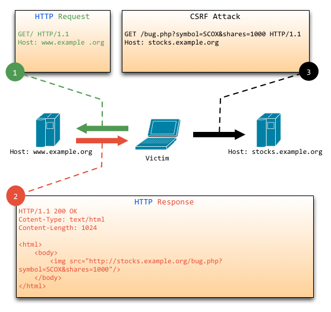

# 9.1 CSRF napadi

[Sadržaj](_00.0-sr.md)

## Šta je CSF

CSRF i XSRF su skraćenice za „Cross-site request forgery“ (falsifikovanje zahteva na više sajtova). Takođe je poznat kao „napad jednim klikom“ ili „prekomerno korišćenje sesije“ (ili „prekoračenje sesije“).

Kako funkcioniše CSRF napad? CSRF napad se dešava kada napadač prevari pouzdanog korisnika da pristupi veb lokaciji ili klikne na URL adresu koja prenosi zlonamerne zahteve (bez pristanka korisnika) ka ciljanoj veb lokaciji. Evo jednostavnog primera: koristeći nekoliko trikova socijalnog inženjeringa, napadač bi mogao da koristi QQ softver za ćaskanje da pronađe i pošalje zlonamerne linkove žrtvama koje ciljaju veb lokaciju za onlajn bankarstvo njihovog korisnika. Ako se žrtva prijavi na svoj onlajn bankovni račun i ne izađe, klik na zlonamerni link poslat od strane napadača može omogućiti napadaču da ukrade sva sredstva sa bankovnog računa korisnika.

Kada je pod CSRF napadom, jedan krajnji korisnik sa administratorskim nalogom može ugroziti integritet cele veb aplikacije.

## Princip CSRF-a

Sledeći dijagram pruža jednostavan pregled CSRF napada


Slika 9.1 Proces CSRF napada.

Kao što se može videti sa slike, da bi se završio CSRF napad, žrtva mora da završi sledeća dva koraka:

1. Prijavi se na pouzdani sajt A i sačuva lokalni kolačić.
2. Bez prolaska kroz postojeći sajt A, pristupi opasnom linku do sajta B.

Kao čitalac, možda se pitate: „Ako ne ispunjavam gore navedena dva uslova, neću biti izložen CSRF napadima.“ Da, to je tačno, međutim:

- Ne možete garantovati da kada ste prijavljeni na sajt, sajt nije pokrenuo nijednu skrivenu karticu.
- Ne možete garantovati da će, kada zatvorite pregledač, vaši kolačići odmah isteći i da će vaša poslednja sesija biti završena.
- Pouzdani veb-sajtovi sa velikim saobraćajem verovatno neće imati skrivene ranjivosti koje bi lako mogli da iskoriste napadi zasnovani na CSRF-u.

Stoga, korisnicima može biti teško da posete veb lokaciju preko linka i znaju da ona neće izvršiti nepoznate operacije u obliku CSRF napada.

CSRF napadi funkcionišu uglavnom zbog procesa kroz koji se korisnici autentifikuju. Iako možete razumno garantovati da zahtev potiče iz korisničkog pregledača, ne postoji garancija da je korisnik dao odobrenje za zahtev.

## Kako sprečiti CSRF napade

Možda ćete biti malo uplašeni nakon čitanja gornjeg odeljka. Ali strah je dobra stvar. Nateraće vas da se edukujete o tome kako da sprečite da vam se dogode ovakve ranjivosti.

Preventivne mere protiv CSRF napada mogu se preduzeti i na serverskoj i na klijentskoj strani veb aplikacije. Međutim, CSRF napadi se najefikasnije sprečavaju na serverskoj strani.

Postoji mnogo načina za sprečavanje CSRF napada na strani servera. Većina pristupa proističe iz sledeća dva aspekta:

- Održavanje pravilne upotrebe GET, POST i kolačića.
- Uključujući pseudo-slučajni broj sa zahtevima koji nisu GET.

U poglavlju o REST-u, videli smo kako se većina veb aplikacija zasniva na GET i POST HTTP zahtevima i da su kolačići uključeni zajedno sa ovim zahtevima. Generalno dizajniramo aplikacije prema sledećim principima:

- GET se obično koristi za pregled informacija bez izmene bilo kojih podataka.
- POST se koristi za naručivanje, promenu svojstava resursa ili obavljanje drugih zadataka.

Sada ću koristiti Go jezik da ilustrujem kako se ograničava pristup resursima metodama:

```go
mux.Get("/user/:uid", getuser)
mux.Post("/user/:uid", modifyuser)
```

Pošto smo odredili da modifikacije mogu koristiti samo POST, kada se umesto POST-a izda GET metoda, možemo odbiti da odgovorimo na zahtev. Prema gornjoj slici, napadi koji koriste GET kao CSRF eksploat mogu se sprečiti. Da li je ovo dovoljno da se spreče svi mogući CSRF napadi? Naravno da ne, jer se i POST-ovi mogu falsifikovati.

Potrebno je da implementiramo drugi korak, a to je (u slučaju zahteva koji nisu GET) povećanje dužine pseudo-slučajnog broja koji je uključen u zahtev. Ovo obično uključuje korake:

- Za svakog korisnika generišite jedinstveni token kolačića sa pseudoslučajnom vrednošću. Svi obrasci moraju da sadrže istu pseudoslučajnu vrednost. Ovaj predlog je najjednostavniji jer teoretski, napadač ne može da čita kolačiće trećih strana. Bilo koji obrazac koji napadač može da pošalje neće proći proces validacije bez poznavanja slučajne vrednosti.
- Različiti obrasci sadrže različite pseudoslučajne vrednosti, kao što smo predstavili u odeljku 4.4, "Kako sprečiti višestruko slanje obrasca". Možemo ponovo koristiti relevantni kod iz tog odeljka da bismo zadovoljili naše potrebe:

Generisanje tokena slučajnog broja:

```go
h := md5.New()
io.WriteString(h, strconv.FormatInt(crutime, 10))
io.WriteString(h, "ganraomaxxxxxxxxx")
token := fmt.Sprintf("%x", h.Sum(nil))

t, _ := template.ParseFiles("login.gtpl")
t.Execute(w, token)
```

Izlazni token:

```html
<input type="hidden" name="token" value="{{.}}">
```

Token za autentifikaciju:

```go
r.ParseForm()
token := r.Form.Get("token")
if token! = "" {
    // Verification token of legitimacy
} else {
    // Error token does not exist
}
```

Možemo koristiti prethodni kod da obezbedimo naše POST zahteve. Možda se pitate, u skladu sa našom teorijom, da li postoji način da zlonamerna treća strana nekako otkrije vrednost našeg tajnog tokena? U stvari, njegovo probijanje je praktično nemoguće - uspešno izračunavanje ispravne vrednosti stringa korišćenjem metoda grube sile zahteva oko 2 ^ 11 pokušaja.

## Rezime

Falsifikovanje zahteva na više sajtova, takođe poznato kao CSRF, predstavlja veoma opasnu pretnju veb bezbednosti. U krugovima veb bezbednosti poznato je kao bezbednosni problem „uspavanog diva“; kao što vidite, CSRF napadi imaju prilično dobru reputaciju. Ovaj odeljak nije predstavio samo falsifikovanje zahteva na više sajtova, već i faktore koji leže u osnovi ove ranjivosti. Završava se nekim predlozima i metodama za sprečavanje takvih napada. Nadam se da vas je ovaj odeljak inspirisao, kao čitaoca, da pišete bolje i bezbednije veb aplikacije.

[Sadržaj](_00.0-sr.md)
