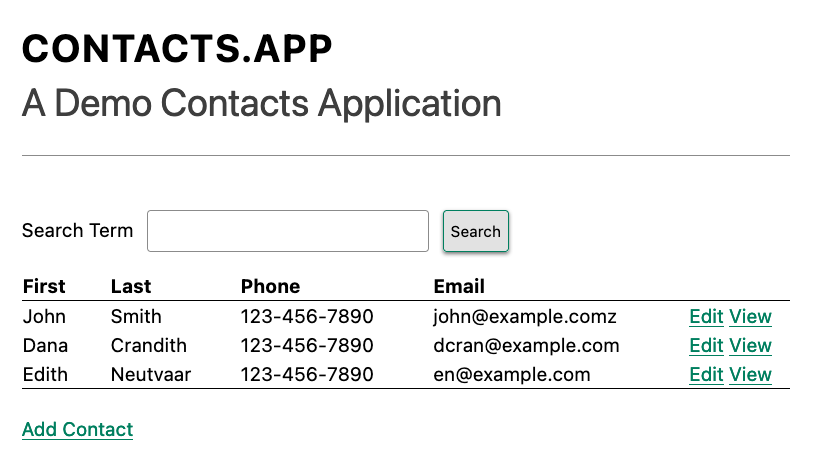

# Koncepti hipermedije 01

## 1 Uvod

Ovo je knjiga o izgradnji aplikacija korišćenjem hipermedijalnih sistema.

Šta podrazumevamo kao hipermedijalni sistem?

- HTML
- HTTP protokol
- HTTP serveri
- HTTP klijenti

Šta ne podrzumevamo kao hepermedijalni sistem?

- Aplikacije sa jednom stranom - SPA
- JSON API komunikacije
- JSON biblioteke Ract.js, Vue.js

### 1.1 Šta je hipermedija sistem

World Wide Web je kanonički hipemedijalni sistem.
REST je pre svega mrežna arhitektura.

Hipermedijalni sistem definišemo kao sistem koji se pridržava RESTful mrežne arhitekture u Fildingovom originalnom smislu ovog termina.

"REST" nije JSON API.

### 1.2 Hipermedijom vođene aplikacije

Uporedićemo:

- HDA - Hypermedia Driven Application - hipermedijom vođene aplikacije ()
- SPA - Single Page Application - jednostranične aplikacije.

Hipermedijska aplikacija je aplikacija izgrađena na hipermedijskom sistemu koja poštuje i koristi hipermedijsku funkcionalnost tog sistema.

---

> [!Note]
>
> **HTML napomene**  
> Jasno je da HTML igra centralnu ulogu u priči koju ovde pričamo. Za početak, zapamtite da naše veb aplikacije nisu ostrva. Pišemo HTML ne samo za određenu aplikaciju, već i da bismo se igrali sa drugim članovima veba. HTML je prilagođen hipermediji kada je napisan za sve komponente hipermedijalnog sistema.
>
> On prenosi stanje aplikacije ljudima koji pregledaju naše sajtove pomoću pregledača, kao i ljudima koji slušaju čitače ekrana koji naglas čitaju sajtove. On prenosi ciljeve naših sajtova pretraživačima koji programski pretražuju sajtove. Takođe, što jasnije prenosi svoje ponašanje drugim programerima.
>
>
> Ne, ne možemo rešiti svaki problem dobrim HTML-om. Mantra da je HTML "dostupan po podrazumevanim podešavanjima" je obmanjujuća. Propustili bismo važne prilike ako bismo izbegli druge tehnologije poput JavaScript-a. I dalje moramo da testiramo, mnogo, svuda, kako bismo osigurali da stvari funkcionišu kako se očekuje.
>
> Ali dobar HTML omogućava pregledačima da urade mnogo posla za nas.

---

## 2 Ponovno uvođenje

Hipermedija je danas univerzalna tehnologija, gotovo jednako uobičajena kao električna energija.

Milijarde ljudi svakodnevno koriste sisteme zasnovane na hipermediji, uglavnom interakcijom sa jezikom za označavanje hiperteksta (HTML) koji se razmenjuje putem protokola za prenos hiperteksta (HTML) korišćenjem veb pregledača povezanog sa World Wide Web-om.

Počnimo od početka: šta je hipermedija?

Hipermedija je medij, na primer tekst, koji uključuje nelinearno grananje sa jedne lokacije u medijumu na drugu, putem, na primer, hiperlinkova ugrađenih u medij. Prefiks "hiper-" potiče od grčkog prefiksa "ὑπερ-" što znači "izvan" ili "preko", što ukazuje da hipermedija prevazilazi normalne, pasivno konzumirane medije poput časopisa i novina.

Hiperlinkovi su kanonski primer onoga što se naziva hipermedijska kontrola. Hipermedijske kontrole su ono što razlikuje hipermediju od drugih vrsta medija.

Možda vam je termin hipertekst poznatiji, hipertekst je podkategorija hipermedije i veliki deo ove knjige će razmatrati kako da se naprave moderne aplikacije koristeći hipertekst kao što su HTML, jezik za označavanje hiperteksta ili HXML, hipertekst koji koristi mobilni hipermedijalni sistem Hyperview.

Hipertekst poput HTML-a funkcioniše zajedno sa drugim tehnologijama ključnim za funkcionisanje celog hipermedijalnog sistema: mrežnim protokolima poput HTTP-a, drugim tipovima medija kao što su slike i video zapisi, hipermedijalnim serverima (tj. serverima koji pružaju hipermedijalne API-je), sofisticiranim hipermedijalnim klijentima (npr. veb pregledačima) i tako dalje.

Zbog toga, preferiramo širi termin hipermedijski sistemi kada opisujemo osnovnu arhitekturu aplikacija izgrađenih pomoću hiperteksta, kako bismo naglasili arhitekturu sistema u odnosu na konkretnu hipermediju koja se koristi.

Godine 2000, Roj Filding, tada na Univerzitetu Kalifornije u Irvinu, objavio je značajnu doktorsku disertaciju o vebu: "Arhitektonski stilovi i dizajn mrežnih softverskih arhitektura". Filding je radio na otvorenom kodu Apache HTTP serveru, a njegova teza je bila opis onoga što je smatrao novom i posebnom mrežnom arhitekturom koja se pojavila u ranom vebu. Filding je radio na početnim HTTP specifikacijama i, u radu, definisao je hipermedijalni mrežni model veba koristeći termin REpresentational State Transfer (REST).

Fildingov rad je postao glavni kamen temeljac za rane veb programere, dajući im jezik za diskusiju o novom tehničkom medijumu u kojem su gradili aplikacije.

Fildingove ključne ideje ćemo detaljno razmotriti u drugom poglavlju i pokušati da ispravimo zapis u vezi sa REST-om, HATEOAS-om i hipermedijom.

Sistem koji su Berners-Li, Filding i mnogi drugi stvorili zasnivao se na hipermediji: HTML-u. HTML je počeo kao hipermedija samo za čitanje, koja se koristila za objavljivanje (u početku) akademskih dokumenata. Ovi dokumenti su bili povezani pomoću **oznaka sidra** koje su kreirale hiperlinkove između njih, omogućavajući korisnicima brzu navigaciju između dokumenata.

Kada je objavljen HTML 2.0, uveo je pojam **oznake forme**, pridruživši je oznaci sidra (tj. hiperlinka) kao drugu hipermedijalnu kontrolu. Uvođenje oznake forme učinilo je izgradnju aplikacija na vebu održivim pružajući mehanizam za ažuriranje resursa, umesto samo njihovog čitanja.

Upravo u tom trenutku veb je prešao iz zanimljivog sistema orijentisanog na dokumente u ubedljivu arhitekturu aplikacije.

Danas je HTML najšire korišćeni hipermedijski jezik koji postoji i ova knjiga prirodno pretpostavlja da čitalac ima njegovo razumno poznavanje. Ne morate biti stručnjak za HTML (ili CSS) da biste razumeli kod u ovoj knjizi, ali što bolje razumete osnovne oznake i koncepte HTML-a, to ćete više izvući iz nje.

Hajde da detaljnije razmotrimo ova dva definišuća hipermedijska elementa (to jest dve definišuće hipermedijske kontrole ) HTML-a, **oznaku sidra** (anchor tag) i **oznaku forme** (form tag).

### 2.1 Oznaka sidra

Oznake sidra su toliko poznate da su dosadne, ali, kao originalna kontrola hipermedije, vredi pregledati mehaniku hiperlinkova kako bismo se usmerili na pravo mesto za razvoj dubljeg
razumevanja hipermedije.

Razmotrite jednostavan tag sidra, ugrađen u veći HTML dokument:

```html
<a href="https://hypermedia.systems/">
    Hypermedia Systems
</a>
```

Kod - Jednostavna hiperlink veza

Oznaka sidra se sastoji od oznake, `<a></a>`, kao i od atributa i sadržaja unutar oznake. Od posebnog interesa je `href` atribut, koji određuje hipertekstualnu referencu na drugi dokument ili fragment dokumenta. Upravo ovaj atribut čini oznaku sidra hipermedijalnom kontrolom.

U tipičnom veb pregledaču, ova oznaka sidra bi se protumačila kao:

- Prikažite tekst "Hipermedijalni sistemi" na način koji ukazuje da se na njega može kliknuti.
- Kada korisnik klikne na taj tekst, pošaljite HTTP GET zahtev URL-u <https://hypermedia.systems/>.
- Uzmite HTML sadržaj iz tela HTTP odgovora na ovaj zahtev i zamenite ceo ekran u pregledaču kao novi dokument, ažurirajući navigacionu traku na ovu novu URL adresu.

Sidra pružaju glavni mehanizam koji danas koristimo za navigaciju po vebu, odabirom linkova za navigaciju od dokumenta do dokumenta ili od resursa do resursa.

Kada se klikne na link, pregledač ( ili, kako ga ponekad nazivamo, hipermedijalni klijent ) pokreće HTTP GET zahtev ka URL-u kodiranom u atributu linka `href`.

Imajte na umu da HTTP zahtev sadrži dodatne podatke (tj. metapodatke ) o tome šta tačno pregledač želi od servera, u obliku zaglavlja.

Hipermedijalni server zatim odgovara na ovaj zahtev hipermedijalnim odgovorom — HTML-om — za novu stranicu. Ovo može izgledati kao mala i očigledna stvar, ali je apsolutno ključni aspekt istinski RESTful hipermedijalnog sistema: klijent i server moraju komunicirati putem hipermedije!

### 2.2 Oznaka forme

Oznake sidra omogućavaju navigaciju između dokumenata ili resursa, ali vam ne dozvoljavaju da ažurirate te resurse. Ta funkcionalnost spada u oznaku forme.

Evo jednostavnog primera forme u HTML-u:

```html
<form action="/signup" method="post">
    <input type="text" name="email" placeholder="Enter Email To Sign Up">
    <button>Sign Up</button>
</form>
```

Kod - Jednostavna forma

Kao i oznaka sidra, oznaka forme se sastoji od oznake, `<form></form>`, kombinovane sa atributima i sadržajem unutar oznake. Imajte na umu da oznaka forme nema atribut `href`, već ima `action` atribut koji određuje gde da se izda HTTP zahtev.

Štaviše, forma takođe ima atribut `method` koji tačno određuje koji HTTP `metod` treba koristiti. U ovom primeru, obrazac traži od pregledača da izda `POST` zahtev.

Za razliku od oznaka sidra, sadržaj i oznake unutar forme mogu uticati na hipermedijsku interakciju koju forma ostvaruje sa serverom. Vrednosti `input` oznaka i drugih oznaka, kao što su `select` oznake, biće uključene u HTTP zahtev kada se forma pošalje, kao URL parametri u slučaju a GET i kao deo tela zahteva u slučaju POST. Ovo omogućava formi da uključi proizvoljnu količinu informacija prikupljenih od korisnika u zahtevu, za razliku od oznake sidra.

U tipičnom pregledaču, ovaj tag forme i njegov sadržaj bi pregledač interpretirao otprilike na sledeći način:

- Prikaži korisniku unos teksta i dugme "Sign Up"
- Kada korisnik pošalje obrazac klikom na dugme "Sign Up" ili pritiskom na taster Enter dok je element input fokusiran, pošalji HTTP POST zahtev putanji "/signup" na "trenutnom" serveru.
- Uzmi HTML sadržaj iz tela HTTP odgovora i zamenite ceo ekran u pregledaču kao novi dokument, ažurirajući navigacionu traku na ovu novu URL adresu.

Ovaj mehanizam omogućava korisniku da izda zahteve za ažuriranje stanja resursa na serveru.
Treba napomenuti da se uprkos ovoj novoj vrsti zahteva komunikacija između klijenta i servera i
dalje obavlja isključivo putem hipermedije.

Kao nekome ko je zainteresovan za veb razvoj, gore navedena diskusija je vam verovatno veoma poznata. Možda vam je čak ovaj sadržaj dosadan. Ali napravite korak unazad i razmislite o činjenici da su ove dve hipermedijske kontrole, sidra i forme, jedini izvorni načini za  interakciju korisnika sa serverom u običnom HTML-u.

Samo dve oznake!

Pa ipak, naoružan samo sa ove dve oznake, rani veb je bio u stanju da eksponencijalno raste i ponudi zapanjujuće veliku količinu onlajn, dinamičnih funkcionalnosti milijardama ljudi.

Ove dve oznake daju ogromnu količinu izražajne moći HTML-u.

### 2.3 Šta nije hipermedija

Dakle, linkovi i forme su dva glavna mehanizma za interakciju sa serverom, zasnovana na hipermediji, dostupna u HTML-u.

Sada razmotrimo drugačiji pristup: hajde da interagujemo sa serverom izdavanjem HTTP zahteva putem JavaScripta. Da bismo to uradili, koristićemo API `fetch()`, popularni API za izdavanje "asinhronog JavaScripta i XML-a" ili AJAX zahteva, dostupan u svim modernim veb pregledačima:

```js
<button onclick="fetch('/api/v1/contacts/1')        // 1
    .then(response => response.json())              // 2
    .then(data => updateUI(data)) ">                // 3
        Fetch Contact
</button>
```

Kod - JavaScript

1. Izdaje zahtev.
2. Konvertuje odgovor u JavaScript objekat.
3. Poziva updateUI()funkciju sa objektom.

Ovo dugme ima `onclick` atribut koji određuje da se neki JavaScript kod pokrene kada se klikne na dugme.

Javaskript će izdati AJAX HTTP `GET` zahtev ka "/api/v1/contacts/1" koristeći `fetch()`. AJAX zahtev je kao "normalan" HTTP zahtev, ali ga pregledač izdaje "iza kulisa". Korisnik ne vidi indikator zahteva iz pregledača kao što bi to učinio sa normalnim linkovima i obrascima. Pored toga, za razliku od zahteva koje izdaju hipermedijske kontrole, na Javaskript kodu je da obradi odgovor sa servera.

Uprkos tome što AJAX ima `XML` kao deo svoje skraćenice, danas bi HTTP odgovor na ovaj zahtev gotovo sigurno bio u formatu `JavaScript Object Notation` (`JSON`) umesto `XML`.

HTTP odgovor na ovaj zahtev može izgledati otprilike ovako:

```json
{                                           // 1
    "id": 42,                               // 2
    "email": <"json-example@example.org">   // 3
}
```

Kod - JSON

1. Početak JSON objekta.
2. Svojstvo, u ovom slučaju sa imenom `id` i vrednošću `42`.
3. Još jedno svojstvo, `email` adresa kontakta sa ovim ID-om.

Gore navedeni JavaScript kod konvertuje JSON tekst primljen sa servera u JavaScript objekat pozivanjem metode `json()` na njemu. Ovaj novi JavaScript objekat se zatim predaje metodi `updateUI()`.

Metoda `updateUI()` je odgovorna za ažuriranje korisničkog interfejsa na osnovu podataka kodiranih u JavaScript objektu, možda prikazivanjem kontakta u delu HTML koda generisanog putem šablona na strani klijenta u JavaScript aplikaciji.

Detalji o tome šta tačno funkcija `updateUI()` radi nisu važni za našu diskusiju.

Ono što je važno, što je ključni aspekt ove JSON-bazirane interakcije sa serverom jeste da ona ne koristi hipermediju. JSON API koji se ovde koristi ne vraća hipermedijski odgovor. U njemu nema hiperlinkova ili drugih kontrola u stilu hipermedijskog sadržaja.

Ovaj JSON API je, pre svega, `Data API`.

Pošto je odgovor u JSON formatu i nije hipermedijski, JavaScript `updateUI()`  metoda mora da razume kako da pretvori ove kontakt podatke u HTML.

Posebno, kod u `updateUI()` treba da zna o unutrašnjoj strukturi i značenju podataka.

Potrebno je da zna:

- Tačno kako su polja u JSON objektu podataka strukturirana i imenovana.
- Kako se oni odnose jedni prema drugima.
- Kako ažurirati lokalne podatke kojima odgovaraju ovi novi podaci.
- Kako prikazati ove podatke pregledaču.
- Koje dodatne akcije/krajnje tačke API-ja mogu biti pozvane sa ovim podacima.

Ukratko, logika u `updateUI()` zahteva detaljno poznavanje krajnje tačke API-ja na "/api/v1/contact/1", znanje koje se pruža preko nekog sporednog kanala izvan samog odgovora. Kao rezultat toga, `updateUI()` kod i API imaju jaku vezu, poznatu kao čvrsta veza (tight coupling): ako se format JSON odgovora promeni, onda će skoro sigurno biti potrebno promeniti i kod za `updateUI()`.

#### 2.3.1 Aplikacije za jednu stranicu - SPA

Ovaj deo JavaScripta, iako veoma skroman, predstavlja organski početak mnogo većeg konceptualnog pristupa izgradnji veb aplikacija. Ovo je početak jednostranične aplikacije (SPA). Veb aplikacija više ne navigira između stranica koristeći hipermedijske kontrole kao što je bio slučaj sa linkovima i obrascima. Umesto toga, aplikacija razmenjuje obične podatke sa serverom, a zatim ažurira sadržaj unutar jedne stranice.

Kada se ova strategija ili arhitektura usvoji za celu aplikaciju, sve se dešava na "jednoj stranici" i stoga aplikacija postaje "jednostranična aplikacija". Arhitektura jednostranične aplikacije (Single Page Application) je danas izuzetno popularna i dominantni je pristup izgradnji veb aplikacija poslednjih deset godina. To se može videti po visokom nivou podele pažnje i diskusije koju je dobila u industriji.

Danas velika većina jednostraničnih aplikacija usvaja daleko sofisticiranije okvire za upravljanje korisničkim interfejsom nego što ovaj jednostavan primer pokazuje. Popularne biblioteke kao što su React, Angular, Vue.js itd. su sada uobičajeni — zapravo, standardni — način za izradu veb aplikacija. Sa ovim složenijim frejmvorcima, programeri obično rade sa složenijim modelom na strani klijenta — to jest, sa JavaScript objektima smeštenim lokalno u memoriji pregledača koji predstavljaju "model" ili "domen" vaše aplikacije. Ovi JavaScript objekti se ažuriraju putem JavaScript koda, a frejmvork zatim "reaguje" na ove promene, ažurirajući korisnički interfejs.

Kada korisnik ažurira korisnički interfejs, ove promene se takođe prenose na objekte modela, uspostavljajući "dvosmerni" mehanizam povezivanja: model može da ažurira korisnički interfejs, a korisnički interfejs može da ažurira model. Ovo je mnogo sofisticiraniji pristup veb klijentu nego hipermedija i obično gotovo u potpunosti eliminiše osnovnu hipermedijalnu infrastrukturu dostupnu u pregledaču.

HTML se i dalje koristi za izgradnju korisničkih interfejsa, ali hipermedijalni aspekt dve glavne hipermedijalne kontrole, sidra i forme, se ne koristi. Nijedna oznaka ne interaguje sa serverom putem svog izvornog hipermedijalnog mehanizma. Umesto toga, one postaju elementi korisničkog interfejsa koji pokreću lokalne interakcije sa modelom domena u memoriji putem JavaScript-a, koji se zatim sinhronizuje sa serverom koristeći obične JSON API-je za podatke.

Dakle, kao i kod našeg jednostavnog dugmeta iznad, pristup aplikacije sa jednom stranicom zanemaruje hipermedijsku arhitekturu. Ostavlja po strani prednosti postojeće RESTful arhitekture veba i ugrađene funkcionalnosti koje se nalaze u HTML-ovim izvornim hipermedijskim kontrolama u korist ponašanja vođenih JavaScript-om.

SPA-ovi su mnogo više slični debelim klijentskim aplikacijama, odnosno klijent-server aplikacijama iz 1980-ih — arhitekturi popularnoj pre nego što se pojavio veb i na koju je veb, u mnogo čemu, bio reakcija.

Ovaj pristup, naravno, nije nužno pogrešan: postoje slučajevi kada je pristup sa debelim klijentom odgovarajući izbor za aplikaciju. Ali vredi razmisliti o tome zašto veb programeri tako često prave ovaj izbor bez razmatranja drugih alternativa i da li postoje razlozi da se ne krene ovim putem.

### 2.4 Zašto koristiti hipermediju

Pristup jednostranične aplikacije zasnovan na JavaScriptu osvojio je svet veb razvoja, i ako je postojao jedan jedini razlog za njegov veliki uspeh, to je bio sledeći: jednostrana aplikacija nudi daleko interaktivnije i impresivnije iskustvo nego što su to mogle stare, trošne aplikacije zasnovane na hipermediji Web 1.0. Jednostranične aplikacije su imale mogućnost da glatko ažuriraju elemente na stranici bez dramatičnog ponovnog učitavanja celog dokumenta, imale su mogućnost da koriste CSS prelaze za kreiranje lepih vizuelnih efekata i mogućnost da se povežu sa proizvoljnim događajima poput pokreta miša.

Sve ove mogućnosti daju aplikacijama zasnovanim na JavaSkriptu ogromnu prednost u izgradnji sofisticiranih korisničkih iskustava.

S obzirom na popularnost, moć i uspeh ovog modernog pristupa izgradnji veb aplikacija, zašto biste uopšte razmatrali stariji, nespretniji i manje popularan pristup poput hipermedija?

Ispostavlja se da hipermedijalna arhitektura, čak i u svom originalnom Web 1.0 obliku, ima brojne prednosti u poređenju sa pristupom Single Page Application + JSON Data API. Tri najveće su:

- To je izuzetno jednostavan pristup za izgradnju veb aplikacija.
- Izuzetno je tolerantan na promene sadržaja i API-ja. U stvari, napreduje zahvaljujući njima!
- Koristi proverene i istinske funkcije veb pregledača, kao što je keširanje.

Prve dve prednosti, posebno, rešavaju glavne probleme u modernom veb razvoju:

- Infrastruktura jednostranične aplikacije postala je izuzetno složena, često zahtevajući ceo tim za upravljanje.
- JSON API churn — stalne promene JSON API-ja radi podrške potrebama aplikacije — postale su glavna bolna tačka za mnoge aplikacijske timove.

Kombinacija ova dva problema, zajedno sa drugim problemima kao što je gubitak JavaScript biblioteka, dovela je do fenomena poznatog kao "JavaScript zamor". Ovo se odnosi na opšti osećaj iscrpljenosti zbog svih prepreka koje je potrebno preskočiti da bi se bilo šta uradilo u modernim veb aplikacijama.

### 2.5 Preporod hipermedije

U poslednjoj deceniji pojavilo se nekoliko neobičnih, alternativnih biblioteka za frontend koje pokušavaju da ponovo pokrenu HTML. Ironično, ove biblioteke su napisane u Javascriptu, tehnologiji koja je zamenila HTML kao centar veb razvoja.

Međutim, ove biblioteke koriste Javascript ne kao zamenu za osnovni hipermedijalni sistem veba. Umesto toga, oni koriste Javascript da bi proširili sam HTML kao hipermedijski. Ove biblioteke orijentisane na hipermediju, ponovo stavljaju hipermediju u centar kao osnovnu tehnologiju u veb aplikacijama.

U svetu veb razvoja vodi se stalna debata između pristupa "Single Page Application" (SPA) i onoga što se sada naziva pristupom "Multi-Page Application" (MPA). MPA je moderan naziv za stari, Web 1.0 način izgradnje veb aplikacija, korišćenje linkova i obrazaca koji se nalaze na više veb stranica, slanje HTTP zahteva i dobijanje HTML odgovora.

MPA aplikacije, po svojoj prirodi, su aplikacije vođene hipermedijom: na kraju krajeva, one su upravo ono što je Roj Filding opisao u svojoj disertaciji. Ove aplikacije su obično nespretne, ali rade prilično dobro. Mnogi veb programeri i timovi biraju da prihvate ograničenja običnog HTML-a u interesu jednostavnosti i pouzdanosti.

Ispostavlja se da usvajanjem Javascript biblioteka orijentisane na hipermediju, jaz u interaktivnosti između MPA i SPA pristupa dramatično se smanjuje. Možete koristiti MPA pristup, odnosno hipermedijalni pristup, za mnogo veći deo vaše aplikacije bez ugrožavanja korisničkog interfejsa. Možda ćete čak moći da koristite hipermedijalni pristup za sve potrebe vaše aplikacije.

Ovo može izuzetno pojednostaviti vašu veb aplikaciju i proizvesti mnogo koherentniji i razumljiviji softver. Iako još uvek postoje vremena i mesta za složeniji SPA pristup, o čemu ćemo kasnije govoriti u knjizi, usvajanjem pristupa koji prvenstveno koristi hipermediju i korišćenjem biblioteke orijentisane na hipermediju kako bi se HTML što više pomerio, vaša veb aplikacija može biti moćna, interaktivna i jednostavna.

Jedna takva biblioteka orijentisana na hipermedijalnu tehnologiju je **htmx**. Htmx će biti u fokusu drugog dela ove knjige. Pokazaćemo da zapravo možete kreirati mnoge uobičajene "moderne" korisničke funkcije koje se nalaze u sofisticiranim jednostraničnim aplikacijama koristeći hipermedijalni model.

### 2.6 Aplikacije vođene hipermedijom - HDA

Prilikom kreiranja veb aplikacije pomoću htmx, termin "Višestranična aplikacija" se otprilike primenjuje, ali ne karakteriše u potpunosti suštinu arhitekture aplikacije. Kao što ćete videti, htmx ne mora da zamenjuje cele stranice i, zapravo, aplikacija zasnovana na htmx-u može se u potpunosti nalaziti unutar jedne stranice. Ne preporučujemo ovu praksu, ali je moguća!

Dakle, nije sasvim ispravno nazivati veb aplikacije izgrađene pomoću `htmx` "Višestraničnom aplikacijom". Ono što je zajedničko starijem Web 1.0 MPA pristupu i novijim hipermedijski orijentisanim aplikacijama zasnovanim na bibliotekama jeste njihova upotreba hipermedija kao osnovne tehnologije i arhitekture.

Stoga koristimo termin aplikacije vođene hipermedijom **HDA** da bismo opisali oba.

Ovo razjašnjava da osnovna razlika između ova dva pristupa i SPA pristupa nije broj stranica u aplikaciji, već osnovna arhitektura sistema.

> [!Note]
> HDA je veb aplikacija koja koristi hipermediju i hipermedijske razmene kao svoj primarni mehanizam za komunikaciju sa serverom.

Pogledajmo implementaciju jednostavnog dugmeta zasnovanog na htmx-u:

```html
<button hx-get="/contacts/1" hx-target="#contact-ui"> <!-- 1 -->
    Fetch Contact
</button>
```

Kod - Implementacija htmx-a

1. Gornji kod izdaje GET zahtev za "/contacts/1", zamenjujući "contact-ui" rezultatom.

Kao i kod dugmeta koje pokreće JavaScript, ovo dugme je označeno nekim atributima. Međutim, u ovom slučaju nemamo nikakvo (eksplicitno) JavaScript skriptovanje.

Umesto toga, imamo deklarativne atribute slične `href` atributu na oznakama sidra i `action` atributu na oznakama forme. `hx-get` atribut govori htmx-u:

Kada korisnik klikne na ovo dugme:

- `hx-get` atribut govori htmx: "izdaj GET zahtev na </contacts/1>".
- `hx-target` atribut govori htmx-u: "Kada se odgovor vrati, uzmi rezultujući HTML i postavi ga u element sa id-om "contact-ui"."

Ovde dolazimo do suštine htmx-a i kako vam on omogućava da napravite aplikacije zasnovane na hipermediji:

- Očekuje se da HTTP odgovor sa servera bude u HTML formatu, a ne u JSON formatu.

HTTP odgovor na ovaj zahtev zasnovan na htmx-u može izgledati otprilike ovako:

```html
<details>
  <div>
    Contact: HTML Example
  </div>
  <div>
    <a href="mailto:html-example@example.com">Email</a>
  </div>
</details>
```

Kod - HTML

Ovaj mali deo HTML-a bi bio smešten u element u DOM-u sa id-om "contact-ui".

Dakle, ovo dugme zasnovano na htmx-u razmenjuje hipermedijske podatke sa serverom, baš kao što bi to učinila oznaka sidra ili forme, i stoga interakcija i dalje koristi osnovni hipermedijski model veba. htmx dodaje funkcionalnost ovom dugmetu (putem htmx/JavaScripta), ali ta funkcionalnost proširuje HTML kao hipermedijski element. htmx proširuje hipermedijski sistem veba, umesto da ga zamenjuje potpuno drugačijom arhitekturom.

Uprkos tome što površno izgledaju slično jedno drugom, ispostavlja se da ovo dugme zasnovano na htmx-u i dugme zasnovano na JavaScript-u koriste veoma različite sistemske arhitekture i, samim tim, pristupe veb razvoju.

Kako budemo prolazili kroz proces izrade aplikacije vođene hipermedijom u ovoj knjizi, razlike između ova dva pristupa postajaće sve očiglednije.

#### 2.6.1 Kada bi trebalo koristiti hipemediju

Hipermedija je često, mada ne uvek, odličan izbor za veb aplikaciju.

Možda pravite veb stranicu ili aplikaciju kojoj jednostavno nije potrebna velika količina interaktivnosti sa korisnicima. Postoji mnogo korisnih veb aplikacija poput ove, i nema sramote u tome! Aplikacije poput Amazona, eBaya, bezbrojnih novinskih sajtova, sajtova za kupovinu, foruma i tako dalje ne zahtevaju veliku količinu interaktivnosti da bi bile efikasne: one su uglavnom tekst i slike, što je upravo ono za šta je veb i dizajniran.

Možda vaša aplikacija dodaje više vrednosti na strani servera, koordiniranjem korisnika ili primenom sofisticirane analize podataka, a zatim njihovim predstavljanjem korisniku. Možda vaša aplikacija dodaje vrednost jednostavnim korišćenjem dobro dizajnirane baze podataka, sa jednostavnim CRUD (Create-Read-Update-Delete) operacijama. Ponovo, nema sramote u tome!

U bilo kom od ovih slučajeva, korišćenje hipermedijalnog pristupa bi verovatno bio odličan izbor: potrebe za interaktivnošću ovih aplikacija nisu dramatične, a veliki deo vrednosti ovih aplikacija nalazi se na strani servera, a ne na strani klijenta.

Dodavanjem htmx-a ili neke druge biblioteke orijentisane na hipermediju preko ovog pristupa, možete rešiti mnoge probleme upotrebljivosti koji dolaze sa običnim HTML-om i iskoristiti prednosti finijeg prenosa hipermedija. Ovo otvara čitav niz novih mogućnosti korisničkog interfejsa i iskustva, čineći skup aplikacija koje se mogu napraviti pomoću hipermedija mnogo većim.

#### 2.6.2 Kada ne bi trebalo koristiti hipemediju

Kada hipermedija neće dobro funkcionisati za aplikaciju?

Jedan primer koji odmah pada na pamet je onlajn aplikacija za tabelarne proračune. U slučaju tabele, ažuriranje jedne ćelije može imati veliki broj kaskadnih promena koje je potrebno izvršiti na celom listu. Štaviše, ovo bi moglo da se desi sa svakim pritiskom na taster. U ovom slučaju imamo veoma dinamičan korisnički interfejs bez jasnih granica u pogledu toga šta bi moglo biti potrebno ažurirati s obzirom na određenu promenu. Uvođenje okruženja servera u hipermedijskom stilu pri svakoj promeni ćelije bi izuzetno umanjilo performanse.

Međutim, čak i u slučaju onlajn tabele, postoje verovatna područja gde bi hipermedijalni pristup mogao pomoći.

Aplikacija za tabelarne proračune verovatno takođe ima stranicu sa podešavanjima. I možda je ta stranica sa podešavanjima pogodna za hipermedijalni pristup. Ako je to jednostavno skup relativno jednostavnih obrazaca koje treba sačuvati na serveru, velike su šanse da bi hipermedija, zapravo, odlično funkcionisala za ovaj deo aplikacije.

---

> [!Note]
> **Budžet složenosti**:
>
> Svaki softverski projekat ima budžet složenosti, eksplicitan ili ne: postoji samo toliko složenosti koju određeni razvojni tim može tolerisati i svaka nova funkcija i izbor implementacije dodaje bar malo više ukupnoj složenosti sistema.
>
> Ono što je posebno gadno u vezi sa složenošću je to što ima tendenciju da raste eksponencijalno: jednog dana možete zadržati ceo sistem u svojoj glavi i razumeti posledice određene promene, a nedelju dana kasnije ceo sistem izgleda nerešivo. Još gore, napori da se pomogne u kontroli složenosti, kao što je uvođenje apstrakcija ili infrastrukture za upravljanje složenošću, često završavaju čineći stvari još složenijim. Zaista, posao dobrog softverskog inženjera je da drži složenost pod kontrolom.
>
> Siguran način da se zadrži složenost je takođe najteži: reći ne. Vraćanje zahteva za funkcijama je umetnost i, ako možete da naučite da to uradite dobro, čineći da se ljudi osećaju kao da ste rekli da, daleko ćete dogurati.
---

### 2.7 Hipermedija - sofisticirana, moderna arhitektura sistema

Hipermedija se često smatra zastarelom tehnologijom u krugovima veb razvoja, korisnom možda za statičke veb stranice, ali svakako ne realnim izborom za moderne, sofisticirane veb aplikacije.

Suprotno trenutnom popularnom mišljenju, hipermedija je inovativna i moderna sistemska arhitektura za izgradnju aplikacija, u nekim aspektima modernija od preovlađujućih pristupa jednostraničnih aplikacija.

---

> [!Note]
> **HTML napomene**: **`<div>` supa**  
> Najpoznatija vrsta neurednog HTML-a je `<div>` supa.
>
> Kada se programeri oslanjaju na generičke `<div>` i `<span>`  elemente umesto na značajnije oznake, ili smanjujemo kvalitet naših veb stranica ili stvaramo više posla za sebe — verovatno i jedno i drugo.
>
> Na primer, umesto dodavanja dugmeta pomoću namenskog `<button>` elementa, `<div>` elementu bi mogao biti dodat `onclick` slušač događaja.
>
> ```html
> <div class="bg-accent padding-4 rounded-2" onclick="doStuff()">
>     Do stuff
> </div>
> ```
>
> Kod - Dodavanje onclick listenera div elementu
>
> Postoje dva glavna problema sa ovim dugmetom:
>
> - Ne može se fokusirati — taster Tab vas neće dovesti do njega.
> - Ne postoji način da pomoćni alati prepoznaju da je to dugme.
>
> Da, to možemo popraviti dodavanjem `role="button"` i `tabindex="0"`:
>
> ```html
> <div class="bg-accent padding-4 rounded-2"
>   role="button"
>   tabindex="0"
>   onclick="doStuff()">Do stuff</div>
> ```
>
> Kod - Popravka prethodne definicije dugmeta
>
> Ovo su laka rešenja, ali su to stvari koje morate zapamtiti. Takođe, iz HTML izvornog koda nije očigledno da je ovo dugme, što otežava čitanje izvornog koda i otežava uočavanje odsustva ovih atributa. Izvorni kod stranica sa `div` tagovima je teško uređivati i otklanjati greške.
>
>Da biste izbegli "div čorbu", upoznajte se sa HTML specifikacijom dostupnih oznaka i smatrajte svaku oznaku još jednim alatom u svom alatu. Možda postoje stvari koje se ne sećate od ranije! (Sa 113 elemenata trenutno definisanih u specifikaciji, to je više alatnica ).
>
> Naravno, nema svaki UI šablon određeni HTML element. Često moramo da sastavljamo elemente i dopunjavamo ih atributima. Pre nego što to uradite, pretražite HTML alate. Ponekad vas može iznenaditi koliko je toga dostupno.

---

## 3 Komponente hipermedijskog sistema

Hipermedijalni sistem se sastoji od nekoliko komponenti, uključujući:

- HTML - hypertext markup language.
- Mrežni protokol - HTTP - hyper text transfer protocol.
- Server - hipermedijalni API koji odgovara na mrežne zahteve hipermedijalnim odgovorima.
- Klijent - koji pravilno postavlja hipermedijalne zahteve i tumači hipermedijalne odgovore.

U ovom poglavlju ćemo pogledati ove komponente i njihovu implementaciju u kontekstu veba.

### 3.1 Hipermedija

Osnovna tehnologija hipermedijalnog sistema je HTTP protokol koji omogućava klijentu i serveru da međusobno komuniciraju na dinamičan, nelinearan način. Ono što hipermediju čini hipermedijom je prisustvo hipermedijalnih kontrola: elemenata koji omogućavaju korisnicima da biraju nelinearne radnje unutar hipermedijalnog sistema. Korisnici mogu da interaguju sa medijima na način koji prevazilazi jednostavno čitanje od početka do kraja.

Već smo pomenuli dve osnovne hipermedijske kontrole u HTML-u, sidra i forme, koje omogućavaju pregledaču da korisniku predstavi veze i operacije putem pregledača.

U slučaju HTML-a, ovi linkovi i forme obično određuju cilj svojih operacija koristeći `Uniform resource locator` (URL-ove):

#### 3.1.1 Jedinstveni lokator resursa

> [!Note]
> **Jedinstveni lokator resursa** je tekstualni string koji se odnosi ili ukazuje na lokaciju na mreži odakle se resurs može preuzeti, kao i mehanizam pomoću kojeg se resurs može preuzeti.

URL je string koji se sastoji od različitih podkomponenti:

```html
<[scheme]://[userinfo]@[host]:[port][path]?[query]#[fragment]>
```

Kod - URL definicija

**Komponente URL-a**:

Mnoge od ovih podkomponenti nisu obavezne i često se izostavljaju.

Tipičan URL može izgledati ovako:

```html
<https://hypermedia.systems/book/contents/>
```

Kod - Jednostavan URL

Ovaj konkretni URL se sastoji od sledećih komponenti:

- Protokol ili šema (u ovom slučaju, `https`)
- Domen (npr. `hypermedia.systems`)
- Put (npr. `/book/contents`)

Ova URL adresa jedinstveno identifikuje dostupan resurs na internetu, kome hipermedijalni klijent koji "govori" HTTPS, kao što je veb pregledač, može izdati HTTP zahtev. Ako se ova URL adresa pronađe kao referenca hipermedijalne kontrole unutar HTML dokumenta, to implicira da postoji hipermedijalni server na drugoj strani mreže koji takođe razume HTTPS i koji može da odgovori na ovaj zahtev predstavljanjem datog resursa (ili da vas preusmeri na drugu lokaciju itd.).

Imajte na umu da URL-ovi često nisu u potpunosti napisani unutar HTML-a. Veoma je uobičajeno videti oznake sidra koje izgledaju ovako, na primer:

```html
<a href="/book/contents/">Table Of Contents</a>
```

Kod - Jednostavna veza

Ovde imamo relativnu hipermedijsku referencu, gde se podrazumeva da su protokol, host i port "trenutnog dokumenta", isti kao i protokol i server koji su koristili za preuzimanje trenutne HTML stranice. Dakle, ako je ova veza pronađena u HTML dokumentu preuzetom sa <https://hypermedia.systems/>, onda bi eksplicitna URL adresa za ovo sidro bila <https://hypermedia.systems/book/contents/>.

#### 3.1.2 Hipermedijski protokoli

HTTP je protokol koji se koristi za prenos HTML-a (hipermedija) između pregledača (hipermedija klijenata) i servera (hipermedija servera) i, kao takav, ključna je mrežna tehnologija koja povezuje distribuirani hipermedijalni sistem veba.

HTTP verzija 1.1 je relativno jednostavan mrežni protokol, pa hajde da pogledamo kako bi izgledao GET zahtev koji pokreće oznaka sidra. Ovo je zahtev koji bi bio poslat serveru koji se nalazi na "hypermedia.systems", na portu 80 podrazumevano:

```html
GET /book/contents/ HTTP/1.1
Accept: text/html,*/*
Host: hypermedia.systems
```

Kod - HTTP Zahtev klijenta

- Prvi red navodi da je ovo HTTP GET zahtev. Zatim navodi putanju do resursa koji se zahteva. Na kraju, sadrži HTTP verziju za ovaj zahtev.

- Nakon toga sledi niz HTTP zaglavlja zahteva: pojedinačni redovi parova "ime: vrednost". Zaglavlja zahteva pružaju metapodatke koje server može da koristi da bi tačno odredio kako da odgovori na zahtev klijenta.
  
  - U ovom slučaju, pomoću `Accept` zaglavlja, pregledač kaže da bi preferirao HTML kao format odgovora, ali da će prihvatiti bilo koji odgovor servera.
  
  - Zatim, ima `Host` zaglavlje koje određuje na koji server je zahtev poslat. Ovo je korisno kada se više domena hostuje na istom hostu.

HTTP odgovor servera na ovaj zahtev može izgledati otprilike ovako:

```html
HTTP/1.1 200 OK
Content-Type: text/html; charset=utf-8
Content-Length: 870
Server: Werkzeug/2.0.2 Python/3.8.10
Date: Sat, 23 Apr 2022 18:27:55 GMT

<html lang="en">
<body>
  <header>
    <h1>HYPERMEDIA SYSTEMS</h1>
  </header>
 ...
</body>
</html>
```

Kod - HTTP Odgovor servera

- U prvom redu, HTTP odgovor navodi HTTP verziju koja se koristi, nakon čega sledi kod odgovora `200`, što ukazuje da je dati resurs pronađen i da je zahtev uspešan. Nakon toga sledi string, OK koji odgovara kodu odgovora. (Stvarni string nije važan, to je kod odgovora koji obaveštava klijenta o rezultatu zahteva, kao što ćemo detaljnije objasniti u nastavku.)

- Nakon prvog reda odgovora, kao i kod HTTP zahteva, vidimo niz zaglavlja odgovora koja pružaju metapodatke klijentu kako bi pomogla u pravilnom prikazivanju reprezentacije resursa.

- Konačno, vidimo novi HTML sadržaj. Ovaj sadržaj je HTML reprezentacija traženog resursa, u ovom slučaju sadržaja knjige. Pregledač će koristiti ovaj HTML da zameni ceo sadržaj u svom prozoru, prikazujući korisniku ovu novu stranicu i ažurirajući adresnu traku kako bi odražavala novi URL.

#### 3.1.3 HTTP metode

Gore navedena oznaka sidra izdala je HTTP GET, gde je GET metod zahteva. Konkretna metoda koja se koristi u HTTP zahtevu je možda najvažnija informacija o njemu, posle stvarnog resursa na koji je zahtev usmeren.

U HTTP-u postoji mnogo metoda; one od najpraktičnijeg značaja za programere su sledeće:

- **GET**
  GET zahtev preuzima reprezentaciju navedenog resursa. GET zahtevi ne bi trebalo da menjaju podatke.
- **POST**
  POST zahtev šalje podatke navedenom resursu. Ovo će često rezultirati mutacijom stanja na serveru.
- **PUT**
  PUT zahtev zamenjuje podatke navedenog resursa. Ovo dovodi do mutacije stanja na serveru.
- **PATCH**
  PATCH zahtev zamenjuje podatke navedenog resursa. Ovo dovodi do mutacije stanja na serveru.
- **DELETE**
  Zahtev za brisanje, briše navedeni resurs. Ovo dovodi do promene stanja na serveru.

Ove metode se otprilike poklapaju sa šablonom "Crud/Read/Update/Delete" ili CRUD šablonom koji se nalazi u mnogim aplikacijama:

- POST odgovara kreiranju resursa (CREATE).
- GET odgovara čitanju resursa (READ).
- PUT i PATCH odgovaraju ažuriranju resursa (UPDATE).
- DELETE odgovara brisanju resursa (DELETE).

---
> [!Note]
>
> **Put vs. Post**  
> Dok HTTP radnje otprilike odgovaraju CRUD-u, one nisu iste. Tehničke specifikacije za ove metode nemaju takvu vezu i često su pomalo teške za čitanje. Evo, na primer, dokumentacije o razlikovanju između  POST-a i PUT-a iz RFC-9110.
>
> "Ciljni resurs u POST zahtevu je namenjen za rukovanje zatvorenom predstavom u skladu sa sopstvenom semantikom resursa, dok je zatvorena reprezentacija u PUT zahtevu definisana kao zamena stanja ciljnog resursa. Dakle, namera PUT-a je idempotentna i vidljiva posrednicima, iako je tačan efekat poznat samo izvornom serveru."
>
> Uobičajeno, POST-om može da rukuje server koliko god želi, dok PUT-om treba da se rukuje kao "zamenom" resursa, iako jezik još jednom dozvoljava serveru da radi skoro šta god želi u okviru ograničenja da je idempotentan.
---

U pravilno strukturiranom hipermedijskom sistemu zasnovanom na HTML-u, koristili biste odgovarajuću HTTP metodu za operaciju koju određena hipermedijska kontrola izvršava. Na primer, ako hipermedijska kontrola, kao što je dugme, briše resurs, idealno bi bilo da izda HTTP DELETE zahtev da bi to učinila.

Čudna stvar kod HTML-a je, međutim, to što izvorne hipermedijske kontrole mogu izdavati samo HTTP GET i POST zahteve.

- Oznake sidra uvek izdaju GET zahtev.
- Forme mogu izdati ili GET ili POST koristeći `method` atribut.

Uprkos činjenici da je HTML — najpopularniji hipermedijalni jezik na svetu — dizajniran uporedo sa HTTP-om (što je, na kraju krajeva, protokol za prenos hiperteksta!): ako želite da izdate PUT, PATCH ili DELETE zahteve, trenutno morate da pribegnete JavaScript-u da biste to uradili.

Pošto POST može da uradi skoro sve, na kraju se koristi za bilo kakvu mutaciju na serveru, a PUT,PATCH i DELETE se ostavljaju po strani u običnim HTML aplikacijama.

Ovo je očigledan nedostatak HTML-a kao hipermedije; bilo bi divno videti ovo ispravljeno u HTML specifikaciji. Za sada, u 4. poglavlju, razmotrićemo načine da se ovo zaobiđe.

#### 3.1.4 HTTP kodovi odgovora

HTTP metode zahteva omogućavaju klijentu da kaže serveru šta da uradi sa datim resursom. HTTP odgovori sadrže kodove odgovora, koji klijentu govore kakav je bio rezultat zahteva. HTTP kodovi odgovora su numeričke vrednosti koje su ugrađene u HTTP odgovor, kao što smo videli gore.

Najpoznatiji kod odgovora za veb programere je verovatno `404`, što je skraćenica od "Nije pronađeno". Ovo je kod odgovora koji vraćaju veb serveri kada se od njih zahteva resurs koji ne postoji.

HTTP deli kodove odgovora u različite kategorije:

- 100-199  
  Informativni odgovori koji pružaju informacije o tome kako server obrađuje odgovor.
- 200-299  
  Uspešni odgovori koji ukazuju da je zahtev uspeo.
- 300-399  
  Odgovori o preusmeravanju koji ukazuju da zahtev treba poslati na neki drugi URL.
- 400-499  
  Odgovori klijenta o greškama koji ukazuju da je klijent napravio neku vrstu lošeg zahteva
  (npr., traži nešto što nije postojalo u slučaju 404grešaka).
- 500-599  
  Odgovori servera o greškama koji ukazuju da je server naišao na internu grešku dok je pokušavao da odgovori na zahtev.

Unutar svake od ovih kategorija postoji više kodova odgovora za specifične situacije.

Evo nekih od najčešćih ili zanimljivijih:

- **200 OK**  
  HTTP zahtev je uspeo.
- **301 Moved Permanently**  
  URL adresa za traženi resurs je trajno premeštena na novu lokaciju, a nova URL adresa će biti navedena u Locationzaglavlju odgovora.
- **302 Found**  
  URL adresa za traženi resurs je privremeno premeštena na novu lokaciju, a nova URL adresa će biti navedena u `Location` zaglavlju odgovora.
- **303 See Other**  
  URL adresa za traženi resurs je premeštena na novu lokaciju, a nova URL adresa će biti navedena u Locationzaglavlju odgovora. Pored toga, ovu novu URL adresu treba preuzeti sa GETzahtevom.
- **401 Unauthorized**  
  Klijent još nije autentifikovan (da, autentifikovan je, uprkos imenu) i mora biti autentifikovan da bi preuzeo dati resurs.
- **403 Forbidden**  
  Klijent nema pristup ovom resursu.
- **404 Not Found**  
  Server ne može da pronađe traženi resurs.
- **500 Internal Server Error**
  Server je naišao na grešku pri pokušaju obrade odgovora.

Postoje neke prilično suptilne razlike između HTTP kodova odgovora (i, iskreno, neke dvosmislenosti između njih). Razlika između 302 preusmeravanja i 303 preusmeravanja, na primer, je u tome što će prvo izdati zahtev novom URL-u koristeći istu HTTP metodu kao i početni zahtev, dok će drugo uvek koristiti GET. Ovo je mala, ali često ključna razlika, kao što ćemo videti kasnije u knjizi.

Dobro napravljena aplikacija vođena hipermedijom iskoristiće prednosti i HTTP metoda i HTTP kodova odgovora da bi kreirala razuman hipermedijski API. Na primer, ne želite da napravite aplikaciju vođenu hipermedijom koja koristi metodu POST za sve zahteve i odgovara sa 200 OK za svaki odgovor. (Neki JSON Data API-ji izgrađeni na HTTP-u rade upravo to!)

Prilikom kreiranja aplikacije vođene hipermedijom, umesto toga želite da idete "u skladu sa tokovima" veba i koristite HTTP metode i kodove odgovora onako kako su dizajnirani da se koriste.

#### 3.1.5 Keširanje HTTP odgovora

Ograničenje REST-a (i, stoga, karakteristika HTTP-a) je pojam keširanja odgovora: server može da ukaže klijentu (kao i posredničkim HTTP serverima) da se dati odgovor može keširati za buduće zahteve upućene istom URL-u.

Ponašanje keširanja HTTP odgovora sa servera može se označiti pomoću `Cache-Control` zaglavlja odgovora. Ovo zaglavlje može imati više različitih vrednosti koje ukazuju na keširanje datog odgovora. Ako, na primer, zaglavlje sadrži vrednost `max-age=60`, to ukazuje da klijent može keširati ovaj odgovor 60 sekundi i da ne mora da izda drugi HTTP zahtev za taj resurs dok to vremensko ograničenje ne istekne.

Još jedno važno zaglavlje odgovora vezano za keširanje je `Vary`. Ovo zaglavlje odgovora može se koristiti da se tačno naznači koje zaglavlje u HTTP zahtevu formira jedinstveni identifikator za keširani rezultat. Ovo postaje važno kako bi se omogućilo pregledaču da pravilno kešira sadržaj u situacijama kada određeno zaglavlje utiče na oblik odgovora servera.

Uobičajeni obrazac u aplikacijama koje koriste `htmx`, na primer, jeste korišćenje prilagođenog zaglavlja koje postavlja `htmx.HX-Request` kako bi se razlikovali "normalni" veb zahtevi i zahtevi koje podnosi htmx. Da bi se odgovor na ove zahteve pravilno keširao, `HX-Request` zaglavlje zahteva mora biti naznačeno zaglavljem `Vary` odgovora.

#### 3.1.6 Hipermedijski serveri

Hipermedija serveri su bilo koji server koji može da odgovori na HTTP zahtev HTTP odgovorom. Pošto je HTTP tako jednostavan, to znači da se skoro svaki programski jezik može koristiti za izgradnju hipermedija servera. Postoji veliki broj biblioteka dostupnih za izgradnju hipermedija servera zasnovanih na HTTP-u u skoro svakom zamislivom programskom jeziku.

Sigurno ne pišeš svoju serversku logiku u HTML-u! I svaki veći programski jezik ima barem jedan dobar veb frejmvork i biblioteku šablona koja se može koristiti za čistu obradu HTTP zahteva.

#### 3.1.7 Hipermedijski klijenti

Sada dolazimo do poslednje glavne komponente u hipermedijskom sistemu: hipermedijskog klijenta. Hipermedijski klijenti su softveri koji razumeju kako da pravilno interpretiraju određeni hipermedijski sadržaj i hipermedijske kontrole unutar njega. Kanonski primer je, naravno, veb pregledač, koji razume HTML i može ga predstaviti korisniku za interakciju. Veb pregledači su neverovatno sofisticirani softverski proizvodi. (Toliko sofisticirani, u stvari, da se često prenamenjuju od hipermedijskog klijenta do vrste virtuelne mašine za pokretanje jednostraničnih aplikacija.)

Međutim, pregledači nisu jedini hipermedijski klijenti. U poslednjem odeljku ove knjige pogledaćemo Hyperview, hipermedijski program orijentisan na mobilne uređaje. Jedna od izuzetnih karakteristika Hyperview-a je to što on ne pruža samo hipermedijski program, HXML, već i funkcionalni hipermedijski klijent za taj hipermedijski program. Ovo čini izuzetno lakim izgradnju odgovarajuće hipermedijske aplikacije pomoću Hyperview-a.

Hipermedijalni klijent mora znati kako da pravilno interpretira i predstavi hipermedijalne kontrole koje se nalaze u hipermedijalnom odgovoru sa hipermedijalnog servera kako bi ceo hipermedijalni sistem funkcionisao zajedno. Bez sofisticiranog klijenta koji to može da uradi, hipermedijalne kontrole i hipermedijalni API su mnogo manje korisni.

To je jedan od razloga zašto su JSON API-ji retko uspešno usvajali hipermedijske kontrole: JSON API-je obično koristi kod koji očekuje fiksni format i koji nije dizajniran da bude hipermedijski klijent. Ovo je potpuno razumljivo: izgradnja dobrog hipermedijskog klijenta je teška! Za JSON API klijente poput ovog, moć hipermedijskih kontrola ugrađenih u API odgovor je nebitna i često jednostavno dosadna:

### 3.2 REST

Sada kada smo pregledali glavne komponente hipermedijalnog sistema, vreme je da detaljnije razmotrimo koncept REST-a. Termin "REST" potiče iz doktorske disertacije Roja Fildinga o arhitekturi veba.

Fokusiraćemo se na ono što smatramo najvažnijim delom Fildingovog pisanja, iz perspektive veb razvoja: Odeljak 5.1. Ovaj odeljak sadrži osnovne koncepte ( Filding ih naziva ograničenjima ) prenosa reprezentativnog stanja ili REST-a.

Danas se, čudnim spletom okolnosti, termin "REST" uglavnom povezuje sa JSON Data API-jima, a ne sa HTML-om i hipermedijom. Ovo je izuzetno smešno kada shvatite da velika većina JSON Data API-ja nije RESTful, u originalnom smislu, i, zapravo, ne može biti RESTful, jer ne koristi prirodni hipermedijski format.

Da ponovo naglasimo: REST, kako ga je skovao Filding, opisuje veb pre API-ja, i napuštanje trenutne, uobičajene upotrebe termina REST da jednostavno znači "JSON API" je neophodno da bi se razvilo pravilno razumevanje ideje.

#### 3.2.1 Ograničenja REST-a

U svojoj disertaciji, Filding definiše različita "ograničenja" kako bi opisao kako se RESTful sistem mora ponašati.

Evo ograničenja REST-a iz Fielding nacrta:

- To je klijent-server arhitektura (odeljak 5.1.2).
- Mora biti bez stanja; (odeljak 5.1.3) to jest, svaki zahtev sadrži sve informacije potrebne za odgovor na taj zahtev.
- Mora da omogućava keširanje (odeljak 5.1.4).
- Mora imati jedinstveni interfejs (odeljak 5.1.5).
- To je slojevit sistem (odeljak 5.1.6).
- Opciono, može omogućiti pisanje koda na zahtev (odeljak 5.1.7), odnosno skriptovanje.

Hajde da prođemo kroz svako od ovih ograničenja redom i detaljno ih razmotrimo, posmatrajući kako (i u kojoj meri) veb zadovoljava svako od njih.

**Ograničenje klijent-server**:

REST model koji je Filding opisivao uključivao je i klijente (pregledače, u slučaju veba) i servere (kao što je Apache veb server na kojem je radio) koji komuniciraju putem mrežne veze. To je bio kontekst njegovog rada: opisivao je mrežnu arhitekturu World Wide Web-a i upoređivao je sa ranijim arhitekturama, posebno modelima umrežavanja sa debelim klijentima kao što je Common Object Request Broker Architecture (CORBA).

Trebalo bi da bude očigledno da će svaka veb aplikacija, bez obzira na to kako je dizajnirana, zadovoljiti ovaj zahtev.

**Ograničenje apatridije**:

Kao što je Filding opisao, RESTful sistem je bez stanja: svaki zahtev treba da sadrži sve informacije potrebne za odgovor na taj zahtev, bez sporednog stanja ili konteksta sačuvanog ni na klijentu ni na serveru.

U praksi, za mnoge veb aplikacije danas, mi zapravo kršimo ovo ograničenje: uobičajeno je da se uspostavi kolačić sesije koji služi kao jedinstveni identifikator za datog korisnika i koji se šalje zajedno sa svakim zahtevom. Iako ovaj kolačić sesije, sam po sebi, nije statutivan (šalje se sa svakim zahtevom), obično se koristi kao ključ za pretragu informacija sačuvanih na serveru, u onome što se obično naziva "sesija".

Ove informacije o sesiji se obično čuvaju u nekoj vrsti deljenog skladišta na više veb servera, sadržeći stvari poput imejl adrese ili ID-a trenutnog korisnika, njihovih uloga, delimično kreiranih objekata domena, keš memorije i tako dalje.

Ovo kršenje arhitektonskog ograničenja REST-a bez stanja pokazalo se korisnim za izradu veb aplikacija i izgleda da nije imalo veliki uticaj na ukupnu fleksibilnost veba. Ali vredi imati na umu da čak i Web 1.0 aplikacije često krše čistotu REST-a u interesu pragmatičnih kompromisa.

I mora se reći da sesije zaista izazivaju dodatne glavobolje u pogledu operativne složenosti prilikom raspoređivanja hipermedijalnih servera; njima može biti potreban deljeni pristup informacijama o stanju sesije koje se čuvaju u celom klasteru. Dakle, Filding je bio u pravu kada je istakao da bi idealan RESTful sistem, onaj koji ne krši ovo ograničenje, bio jednostavniji i stoga robusniji.

**Ograničenje keširanja**:

Ovo ograničenje navodi da RESTful sistem treba da podržava koncept keširanja, sa eksplicitnim informacijama o mogućnosti keširanja odgovora za buduće zahteve istog resursa. Ovo omogućava i klijentima, kao i posredničkim serverima između datog klijenta i konačnog servera da keširaju rezultate datog zahteva.

Kao što smo ranije pomenuli, HTTP ima sofisticirani mehanizam keširanja putem zaglavlja odgovora koji se često zanemaruje ili nedovoljno koristi prilikom izrade hipermedijalnih aplikacija. Međutim, s obzirom na postojanje ove funkcionalnosti, lako je videti kako veb zadovoljava ovo ograničenje.

**Ograničenje Uniformnog interfejsa**:

Sada dolazimo do najzanimljivijeg i, po našem mišljenju, najinovativnijeg ograničenja u REST-u: ograničenja jedinstvenog interfejsa.

Ovo ograničenje je izvor velikog dela fleksibilnosti i jednostavnosti hipermedijalnog sistema, tako da ćemo mu posvetiti neko vreme.

U ovom odeljku, Filding kaže:

> [!Note]
>
> **REST vs ..., Filding**  
> Centralna karakteristika koja razlikuje REST arhitektonski stil od drugih stilova zasnovanih na mrežama je njegov naglasak na jedinstvenom interfejsu između komponenti. Da bi se dobio jedinstveni interfejs, potrebna su višestruka arhitektonska ograničenja koja bi vodila ponašanje komponenti. REST je definisan sa četiri ograničenja interfejsa:
>
> - identifikacija resursa;
> - manipulacija resursima putem reprezentacija;
> - samoopisne poruke;
> - hipermedije kao mehanizam stanja aplikacije.

Dakle, imamo četiri podograničenja koja, zajedno, čine ograničenje Uniformnog interfejsa.

*Identifikacija resursa*:

U RESTful sistemu, resursi treba da imaju jedinstveni identifikator. Danas je koncept univerzalnih lokatora resursa (URL-ova) uobičajen, ali u vreme Fildingovog pisanja oni su još uvek bili relativno novi i neobični.

Ono što bi danas moglo biti zanimljivije jeste pojam resursa, koji se na taj način identifikuje: u RESTful sistemu, bilo koja vrsta podataka na koju se može referencirati, odnosno cilj hipermedijske reference, smatra se resursom. URL-ovi, iako danas dovoljno česti, na kraju rešavaju veoma složen problem jedinstvenog identifikovanja bilo kog resursa na internetu.

*Manipulacija resursima putem reprezentacija*:

U RESTful sistemu, reprezentacije resursa se prenose između klijenata i servera. Ove reprezentacije mogu da sadrže i podatke i metapodatke o zahtevu (kao što su "kontrolni podaci" poput HTTP metode ili koda odgovora). Određeni format podataka ili tip medija može se koristiti za predstavljanje datog resursa klijentu, a taj tip medija može se dogovoriti između klijenta i servera.

Ovaj poslednji aspekt jedinstvenog interfejsa videli smo u `Accept` zaglavlju u gornjim zahtevima.

*Samoopisne poruke*:

Ograničenje samoopisnih poruka, u kombinaciji sa sledećim, HATEOAS, čini ono što smatramo jezgrom Uniformnog interfejsa, REST-a i razloga zašto hipermedija pruža tako moćnu sistemsku arhitekturu.

Ograničenje samoopisivih poruka zahteva da, u RESTful sistemu, poruke moraju biti samoopisive.

To znači da sve informacije neophodne za prikazivanje i rad sa podacima koji se predstavljaju moraju biti prisutne u odgovoru. U pravilno RESTful sistemu, ne mogu postojati dodatne "sporedne" informacije potrebne klijentu da transformiše odgovor sa servera u koristan korisnički interfejs. Sve mora "biti u" samoj poruci, u obliku hipermedijalnih kontrola.

Ovo može zvučati pomalo apstraktno, pa hajde da pogledamo konkretan primer.

Razmotrite dva različita potencijalna odgovora HTTP servera za URL adresu <https://example.com/contacts/42.>

Oba odgovora će vratiti informacije o kontaktu, ali svaki odgovor će imati veoma različite oblike.

Prva implementacija vraća HTML reprezentaciju:

```html
<html lang="en">
<body>
<h1>Joe Smith</h1>
<div>

<div>Email: joe@example.bar</div>
<div>Status: Active</div>

</div>
<p>

<a href="/contacts/42/archive">Archive</a>
</p>
</body>
</html>
```

Kod - HTML reprezentacija

Druga implementacija vraća JSON reprezentaciju:

```json
{
"name": "Joe Smith",
"email": "joe@example.org",
"status": "Active"
}
```

Kod - JSON reprezentacija

Šta možemo reći o razlikama između ova dva odgovora?

Jedna stvar koja vam u početku može upasti u oči jeste da je JSON reprezentacija manja od HTML reprezentacije. Filding primećuje upravo ovaj kompromis kada se koristi RESTful arhitektura:

> [!Note]
>
> **Kompromis**  
> Međutim, kompromis je u tome što jedinstveni interfejs smanjuje efikasnost, jer se informacije prenose u standardizovanom obliku, a ne u onom koji je specifičan za potrebe aplikacije.

Dakle, REST žrtvuje reprezentativnu efikasnost za druge ciljeve.

Da biste razumeli ove druge ciljeve, prvo primetite da HTML reprezentacija ima hiperlink za navigaciju do stranice za arhiviranje kontakta. JSON reprezentacija, nasuprot tome, nema ovaj link.

Ova razlika između dva odgovora pokazuje suštinu REST-a i hipermedije, ono što ih čini tako moćnim i fleksibilnim: klijenti (ponovo, veb pregledači) ne moraju ništa da razumeju o osnovnim resursima koji se predstavljaju.

Samo pregledači (samo! Kao da je to lako!) treba da razumeju kako da interpretiraju i prikazuju hipermediju, u ovom slučaju HTML. Ovo daje sistemima zasnovanim na hipermedijima neviđenu fleksibilnost u rukovanju sa promenama i u pozadinskim reprezentacijama i u samom sistemu.

*Hipermedija kao motor stanja aplikacije (HATEOAS)*:

Poslednje podograničenje Uniformnog interfejsa je da, u RESTful sistemu, hipermedija treba da bude "motor stanja aplikacije". Ovo se ponekad skraćuje kao "HATEOAS", iako Filding preferira da koristi terminologiju "hipermedijalno ograničenje" kada o tome govori.

Ovo ograničenje je usko povezano sa prethodnim ograničenjem samoopisujuće poruke.

Razmotrimo ponovo dve različite implementacije krajnje tačke "/contacts/42", jednu koja vraća HTML, a drugu koja vraća JSON. Ažurirajmo situaciju tako da je kontakt identifikovan ovim URL-om sada arhiviran.

Kako izgledaju naši odgovori?

Prva implementacija vraća sledeći HTML:

```html
<html lang="en">
<body>
<h1>Joe Smith</h1>
<div>

<div>Email: joe@example.bar</div>
<div>Status: Archived</div>

</div>
<p>
  <a href="/contacts/42/unarchive">Unarchive</a>
</p>
</body>
</html>
```

Kod - HTML reprezentacija

Druga implementacija vraća sledeću JSON reprezentaciju:

```json
{
"name": "Joe Smith",
"email": "joe@example.org",
"status": "Archived"
}
```

Kod - JSON reprezentacija

Važno je napomenuti da, budući da je samoopisujuća poruka, HTML odgovor sada pokazuje da operacija "Arhiviranje" više nije dostupna i da je postala dostupna nova operacija "Poništavanje arhiviranja". HTML reprezentacija kontakta kodira stanje aplikacije; ona kodira tačno šta se može, a šta ne može uraditi sa ovom konkretnom reprezentacijom, na način na koji JSON reprezentacija to ne čini.

Sa HTML pristupom, hipermedija je zaista mašina stanja aplikacije: ne postoji dodatni model na strani klijenta, a celokupno stanje se izražava direktno u hipermedijalnom kodu, u ovom slučaju HTML-u. Kako se stanje menja na serveru, to se odražava u reprezentaciji (tj. HTML-u) koja se šalje nazad klijentu. Hipermedijalni klijent (pregledač) ne zna ništa o kontaktima, šta je koncept "arhiviranja" ili bilo šta drugo o određenom modelu domena za ovaj odgovor: on jednostavno zna kako da prikaže HTML.

Pošto hipermedijalni klijent ne mora da zna ništa o modelu servera osim kako da prikaže hipermedijalni sadržaj klijentu, on je neverovatno fleksibilan u pogledu reprezentacija koje prima i prikazuje korisnicima.

*HATEOAS i API odliv*:

Ova poslednja tačka je ključna za razumevanje fleksibilnosti hipermedije, pa hajde da pogledamo praktičan primer njenog delovanja. Razmotrimo situaciju u kojoj je nova funkcija dodata veb aplikaciji sa ove dve krajnje tačke. Ova funkcija vam omogućava da pošaljete poruku datom kontaktu.

Kako bi ovo promenilo svaki od dva odgovora — HTML i JSON — sa servera?

HTML reprezentacija bi sada mogla izgledati ovako:

```html
<html lang="en">
<body>
<h1>Joe Smith</h1>
<div>

<div>Email: joe@example.bar</div>
<div>Status: Active</div>

</div>
<p>

<a href="/contacts/42/archive">Archive</a>
<a href="/contacts/42/message">Message</a>

</p>
</body>
</html>
```

Kod - HTML reprezentacija

S druge strane, JSON reprezentacija može izgledati ovako:

```json
{
"name": "Joe Smith",
"email": "joe@example.org",
"status": "Active"
}
```

Kod - JSON Reprezentacija

Imajte na umu da je, još jednom, JSON reprezentacija nepromenjena.

Uporedite ovo sa HTML odgovorom. Zbog jedinstvenog interfejsa RESTful modela i, posebno, zato što koristimo Hypermedia As The Engine of Application State, takva razmena dokumentacije nije potrebna! Umesto toga, klijent (pregledač) jednostavno prikazuje novi HTML sa ovom operacijom u njemu, čineći ovu operaciju dostupnom krajnjem korisniku bez ikakvih dodatnih promena koda.

Sada, u ovom slučaju, ako JSON klijent nije pravilno ažuriran, stanje greške je relativno benigno: novi deo funkcionalnosti jednostavno nije dostupan korisnicima. Ali razmotrite ozbiljniju promenu API-ja: šta ako je funkcionalnost arhiviranja uklonjena? Ili šta ako su se URL-ovi ili HTTP metode za ove operacije na neki način promenili?

Međutim, HTML odgovor bi jednostavno bio ažuriran da bi se isključile uklonjene opcije ili da bi se ažurirali URL-ovi koji se za njih koriste. Klijenti bi videli novi HTML, pravilno ga prikazali i omogućili korisnicima da izaberu šta god da je novi skup operacija. Još jednom, jedinstveni REST interfejs se pokazao izuzetno fleksibilnim: uprkos potencijalno radikalno novom rasporedu za naš hipermedijalni API, klijenti nastavljaju da rade.

Iz ovoga proizilazi važna činjenica: zbog ove fleksibilnosti, hipermedijalni API-ji nemaju probleme sa verzijama koje imaju JSON Data API-ji.

Kada se aplikacija vođena hipermedijom "uđe u" (tj. učita preko neke URL adrese ulazne tačke), sve funkcionalnosti i resursi se prikazuju putem samoopisujućih poruka. Stoga, nema potrebe za razmenom dokumentacije sa klijentom: klijent jednostavno prikazuje hipermediju (u ovom slučaju HTML) i sve funkcioniše kako treba. Kada dođe do promene, nema potrebe za kreiranjem nove verzije API-ja: klijenti jednostavno preuzimaju ažuriranu hipermediju, koja kodira nove operacije i resurse u njoj, i prikazuju je korisnicima za rad.

**Slojeviti sistem**:

Poslednje "potrebno" ograničenje na RESTful sistemu koje ćemo razmotriti je ograničenje slojevitog sistema. Ovo ograničenje se može naći u odeljku 5.1.6 Fildingove disertacije.

Iskreno, nakon uzbuđenja zbog ograničenja jedinstvenog interfejsa, ograničenje "slojevitog sistema" je pomalo razočaravajuće. Ali ipak vredi razumeti ga i veb ga zapravo efikasno koristi. Ograničenje zahteva da RESTful arhitektura bude "slojevita", omogućavajući višestrukim serverima da deluju kao posrednici između klijenta i eventualnog servera "izvora istine".

Ovi posrednički serveri mogu delovati kao proksiji, transformisati posredničke zahteve i odgovore i tako dalje.

**Opciono ograničenje: Kod na zahtev**:

Ograničenje slojevitog sistema nazvali smo poslednjim "obaveznim" ograničenjem jer Filding  pominje još jedno ograničenje na RESTful sistemu. Ovo ograničenje koda na zahtev je pomalo nespretno opisano kao "opciono" (odeljak 5.1.7).

U ovom odeljku, Filding kaže:

> [!Note]
>
> **Kod na zahtev**  
> REST omogućava proširenje funkcionalnosti klijenta preuzimanjem i izvršavanjem koda u obliku apleta ili skripti. Ovo pojednostavljuje klijente smanjenjem broja funkcija koje je potrebno prethodno
> implementirati. Omogućavanje preuzimanja funkcija nakon implementacije poboljšava proširivost sistema. Međutim, to takođe smanjuje vidljivost i stoga je samo opciono ograničenje unutar REST-a.

Dakle, skriptovanje je bilo i jeste izvorni aspekt originalnog RESTful modela veba i stoga bi naravno trebalo da bude dozvoljeno u aplikaciji vođenoj hipermedijom.

Međutim, u aplikaciji vođenoj hipermedijom, prisustvo skriptovanja ne bi trebalo da promeni osnovni model umrežavanja: hipermedija bi trebalo da nastavi da bude motor stanja aplikacije, komunikacija sa serverom bi i dalje trebalo da se sastoji od hipermedijske razmene, a ne, na primer, razmene JSON podataka, i tako dalje. (JSON Data API-ji svakako imaju svoje mesto; u poglavlju 10 ćemo razmotriti kada i kako ih koristiti).

#### 3.2.2 Zaključak o REST

Nakon ovog dubinskog uvida u komponente i koncepte koji stoje iza hipermedijalnih sistema — uključujući i uvide Roja Fildinga u njihov rad — nadamo se da ćete mnogo bolje razumeti REST, a posebno jedinstveni interfejs i HATEOAS. Nadamo se da možete shvatiti zašto ove karakteristike čine hipermedijalne sisteme tako fleksibilnim.

Ako do sada niste bili svesni punog značaja REST-a i HATEOAS-a, nemojte se loše osećati: nekima od nas je trebalo više od decenije rada u veb razvoju i izgradnji biblioteke orijentisane na hipermediju, da bismo razumeli posebnu prirodu HTML-a, hipermedije i veba!

---

> [!Note]
>
> **HTML napomene** - **HTML5 supa**  
>
> **Konfučije** - "Početak mudrosti je nazvati stvari pravim imenom".  
>
> Elementi poput `<section>`,`<article>`, `<nav>`, `<header>`, `<footer>`, `<figure>` postali su neka vrsta skraćenice za HTML.
>
> Korišćenjem ovih elemenata, stranica može dati lažna obećanja, poput toga `<article>` da su elementi samostalni, ponovo upotrebljivi entiteti, klijentima poput pregledača, pretraživača i skrepera koji ne mogu da znaju bolje. Da biste to izbegli:
>
> - Uverite se da element koji koristite odgovara vašem slučaju upotrebe. Proverite HTML specifikaciju.
> - Ne pokušavajte da budete precizni kada ne možete ili ne morate. Ponekad je `<div>` u redu.
>
> Najmerodavniji izvor za učenje o HTML-u je HTML specifikacija. Trenutna specifikacija se nalazi na <https://html.spec.whatwg.org/multipage>[*]. Nema potrebe da se oslanjate na glasine da biste pratili razvoj HTML-a.
>
> Odeljak 4 specifikacije sadrži listu svih dostupnih elemenata, uključujući šta predstavljaju, gde se mogu pojaviti i šta smeju da sadrže. Čak vam govori i kada je dozvoljeno da izostavite završne oznake!

---

[*]: Jednostranična verzija se previše sporo učitava i prikazuje na većini računara. Postoji i "izdanje za programere" na /dev, ali standardna verzija ima lepši stil.

## 4 Veb 1.0 aplikacija

Da bismo započeli naše putovanje u hipermedijske aplikacije, kreiraćemo jednostavnu veb aplikaciju za upravljanje kontaktima pod nazivom **Contact.app**. Počećemo sa osnovnom, višestraničnom aplikacijom (MPA) u "Web 1.0 stilu", u velikoj CRUD (kreiraj, čitaj, ažuriraj, briši) tradiciji. Neće biti najbolja aplikacija za upravljanje kontaktima na svetu, ali će biti jednostavna i obavljaće svoj posao.

Ova aplikacija će takođe biti lako postepeno poboljšana u narednim poglavljima korišćenjem biblioteke htmx orijentisane na hipermediju.

### 4.1 Izbor "veb steka"

Da bismo demonstrirali kako funkcionišu veb 1.0 aplikacije, potrebno je da izaberemo serverski jezik i biblioteku za obradu HTTP zahteva. Kolokvijalno, ovo se naziva "serverski" ili "veb" stek, i bukvalno postoje stotine opcija koje možete izabrati, od kojih mnoge imaju strastvene sledbenike.

Za ovu knjigu koristićemo sledeći stek:

- **Pajton** kao naš programski jezik.
- **Flask** kao naš veb frejmvork, koji nam omogućava povezivanje HTTP zahteva sa Pajton logikom.
- **Jinja2** za naš jezik za šablone na strani servera, što nam omogućava da renderujemo HTML odgovore koristeći poznatu i intuitivnu sintaksu.

Python Flask aplikacija, kada se pokrene, primaće HTTP zahteve i tražiće odgovarajući rukovalac i pozvati ga.

```py
@app.route("/")                 # 1
def index():                    # 2
    return "Hello World!"       # 3
```

Kod - Jednostavna ruta "Zdravo svete"

1. Utvrđuje da mapiramo "/" putanju kao rutu.
2. Sledeća metoda "index" je rukovalac - handler za tu rutu.
3. Metoda vraća string "Zdravo svete!" klijentu.

Handler u ovom slučaju je izuzetno jednostavan, on samo vraća string "Zdravo svete!" klijentu. Ovo još nije hipermedija, ali kao što možemo videti na <http://localhost:5000>, pregledač će to prikazati sasvim dobro.

Odlično, evo našeg prvog koraka u Flask, koji prikazuje osnovnu tehniku koju ćemo koristiti za odgovaranje na HTTP zahteve: "rute mapirane na handlere".

Za Contact.app, umesto da prikazujemo "Hello World!" na korenskoj putanji, uradićemo nešto malo neobičnije: preusmerićemo na drugu putanju, putanju "/contacts". Preusmeravanja su funkcija HTTP-a koja vam omogućava da preusmerite klijenta na drugu lokaciju pomoću HTTP odgovora.

Prikazaćemo listu kontakata kao našu korensku stranicu i, verovatno, preusmeravanje na "/contacts" putanju za prikazivanje ovih informacija je malo konzistentnije sa pojmom resursa sa REST-om. Ovo je naša procena i ne smatramo da je previše važno, ali ima smisla u smislu ruta koje ćemo kasnije podesiti u aplikaciji.

Da bismo promenili našu rutu "Zdravo svete" u preusmeravanje, potrebno je da promenimo samo jednu liniju koda:

```py
@app.route("/")
def index():
    return redirect("/contacts")        # 1
```

Kod - Promena "Zdravo svete" u preusmeravanje

1. Ažuriranje poziva `redirect()`

Sada `index()` funkcija vraća rezultat funkcije koju je dala Flask `redirect()` sa putanjom koju smo naveli. U ovom slučaju, putanja je "/contacts", prosleđena kao string argument. Sada, ako se krećete do korenske putanje, "/", naša Flask aplikacija će vas preusmeriti na tu "/contacts". putanju.

Sada kada razumemo kako se definišu rute, hajde da pređemo na specifikaciju, a zatim implementaciju naše veb aplikacije.

**Šta će Contact.app raditi?**

U početku će korisnicima omogućiti:

- Pregladanje liste kontakata, uključujući ime, prezime, telefon i adresu e-pošte
- Pretraživanje kontakata
- Dodavanje novog kontakta
- Prikazivanje detalja kontakta
- Izmena detalja kontakta
- Brisanje kontakta

Dakle, kao što vidite, Contact.app je CRUD aplikacija, vrsta aplikacije koja je savršena za staromodni web 1.0 pristup.

Imajte na umu da je izvorni kod Contact.app dostupan na GitHub-u.

### 4.2 Prikazivanje pretražive liste kontakata

Dodajmo naš prvi pravi deo funkcionalnosti: mogućnost prikazivanja svih kontakata u našoj aplikaciji u listi (zapravo, u tabeli).

Ova funkcionalnost će se nalaziti na "/contacts" putanji, što je putanja na koju nas je preusmerila naša prethodna ruta.

Koristićemo Flask da usmerimo putanju "/contacts" do funkcije za rukovanje, "contacts()". Ova funkcija će uraditi jednu od dve stvari:

- Ako se u zahtevu pronađe termin za pretragu, filtriraće se samo kontakti koji odgovaraju tom terminu.
- Ako ne, jednostavno će navesti sve kontakte

Ovo je uobičajen pristup u aplikacijama veb 1.0 stila: isti URL koji prikazuje sve instance nekog resursa služi i kao stranica sa rezultatima pretrage za te resurse. Korišćenje ovog pristupa olakšava ponovnu upotrebu prikaza liste koji je zajednički za obe vrste zahteva.

Evo kako izgleda kod za ovaj hendler:

```py
@app.route("/contacts")
def contacts():
    search = request.args.get("q")             # 1
  
    if search is not None:
        contacts_set = Contact.search(search)  # 2
    else:
        contacts_set = Contact.all()           # 3
  
    return render_template("index.html", contacts=contacts_set) # 4
```

Kod - Rukovalac za pretragu na strani servera

1. Potraži parametar upita pod nazivom "q", što je skraćenica od "query".
2. Ako parametar postoji, pozovite "Contact.search()" funkciju sa njim.
3. Ako ne, pozovite "Contact.all()" funkciju.
4. Prosledite rezultat šablonu "index.html" za prikazivanje klijentu.

Vidimo isti kod za rutiranje kao u našem prvom primeru, ali imamo složeniju handler funkciju. Prvo proveravamo da li je "q" parametar upita za pretragu sa nazivom deo zahteva.

#### 4.2.1 String upita

"String upita" je deo specifikacije URL-a. Evo primera URL-a sa stringom upita u njemu:

```html
<https://example.com/contacts?q=joe>. 
```

String upita je sve posle "?", i ima format para ime-vrednost. U ovom URL-u, parametar upita "q" je podešen na vrednost stringa "joe". U običnom HTML-u, string upita može biti uključen u zahtev ili tako što će biti čvrsto kodiran u oznaci sidra ili, dinamičnije, korišćenjem oznake forme sa GET zahtevom.

Da bismo se vratili na našu Flask rutu, ako se pronađe parametar upita sa nazivom "q", pozivamo metodu "search()" na "Contact" objektu modela da bismo izvršili stvarnu pretragu kontakata i vratili sve odgovarajuće kontakte.

Ako parametar upita nije pronađen, jednostavno dobijamo sve kontakte pozivanjem "all()" metode na "Contact" objektu.

Konačno, kreiramo šablon "index.html" koji prikazuje date kontakte, prosleđujući rezultate bilo koje od ove dve funkcije koju pozovemo.

#### 4.2.2 Šabloni za listu i pretragu

Sada kada smo napisali logiku za obradu, kreiraćemo šablon za prikazivanje HTML-a u našem odgovoru klijentu. Na višom nivou, naš HTML odgovor treba da ima sledeće elemente:

- Lista svih kontakata koji se podudaraju ili svih kontakata.
- Polje za pretragu gde korisnik može da ukuca i pošalje pojmove za pretragu.
- Malo "hroma" oko sebe: zaglavlje i podnožje veb stranice koje će biti isti bez obzira na to na kojoj se stranici nalazite.

Koristimo šablonski jezik **Jinja2**, koji ima sledeće karakteristike:

- Možemo koristiti dvostruke vitičaste zagrade, `{{ }}`, da ugradimo vrednosti izraza u šablon.
- Možemo koristiti uvijene procente, ``, za direktive, kao što je iteracija ili uključivanje drugog sadržaja.

Pored ove osnovne sintakse, Jinja2 je veoma sličan drugim jezicima za šablone koji se koriste za generisanje sadržaja i trebalo bi da bude jednostavan za praćenje za većinu veb programera.

Pogledajmo prvih nekoliko redova koda u "index.html" šablonu:

```html
                             <!-- 1 -->

                                     <!-- 2 -->

<form action="/contacts" method="get" class="tool-bar"> <!-- 3 -->
    <label for="search">Search Term</label>
    <input id="search" type="search" name="q"
        value="{{ request.args.get('q') or '' }}" />    <!-- 4 -->
    <input type="submit" value="Search"/>
</form>
```

Kod - Početak datoteke index.html

1. Postavite šablon izgleda za ovaj šablon.
2. Ograničite sadržaj koji će biti umetnut u raspored.
3. Napravite obrazac za pretragu koji će izdati HTTP poruku GET ka "/contacts".
4. Napravite unos za korisnika da unosi upite za pretragu.

Prva linija koda referencira osnovni šablon, "layout.html", pomoću `extends` direktive. Ovaj šablon izgleda pruža podrazumevani raspored za stranicu (ponekad se naziva "hrom"): on obavija sadržaj šablona u oznaku `<html>`, uvozi sve potrebne CSS i JavaScript kodove u element `<head>`, postavlja `<body>` oznaku oko glavnog sadržaja i tako dalje. Sav uobičajeni sadržaj obavijan oko "normalnog" sadržaja za celu aplikaciju nalazi se u ovoj datoteci.

Sledeći red koda deklariše `content` sekciju ovog šablona. Ovaj blok sadržaja koristi šablon "layout.html" za ubrizgavanje sadržaja "index.html" u svoj HTML.

Zatim imamo prvi deo pravog HTML-a. Imamo jednostavnu HTML formu koji vam omogućava da pretražujemo kontakte izdavanjem zahteva GET putanji "/contacts". Sama forma sadrži oznaku i unos sa imenom "q". Vrednost ovog unosa biće poslata sa GET zahtevom putanji "/contacts", kao string upita (pošto je ovo GET zahtev).

Imajte na umu da je vrednost ovog unosa podešena na Jinja izraz {{ request.args.get('q') or '' }}. Jinja procenjuje ovaj izraz i ubaciće zahtevanu vrednost "q" kao vrednost unosa, ako postoji. Ovo će "sačuvati" vrednost pretrage kada korisnik izvrši pretragu, tako da kada se prikažu rezultati pretrage, unos teksta sadrži termin koji je tražen.

Ovo omogućava bolje korisničko iskustvo jer korisnik može tačno da vidi šta se podudara sa trenutnim rezultatima, umesto da ima prazno polje za tekst na vrhu ekrana.

Konačno, imamo unos tipa "subumit". Ovo će se prikazati kao dugme i kada se na njega klikne, pokrenuće formu da izda HTTP zahtev.

Ovaj interfejs za pretragu čini vrh naše stranice sa kontaktima. Nakon njega se nalazi tabela kontakata, ili svi kontakti ili kontakti koji odgovaraju pretrazi, ako je pretraga obavljena.

Evo kako izgleda šablon koda za tabelu kontakata:

```html
<table>
  <thead>
    <tr>
      <th>First <th>Last <th>Phone <th>Email <th/>                  <!-- 1 -->
    </tr>
  </thead>
  <tbody>
                                       <!-- 2 -->
    <tr>
      <td>{{ contact.first }}</td>
      <td>{{ contact.last }}</td>
      <td>{{ contact.phone }}</td>
      <td>{{ contact.email }}</td>                                  <!-- 3 -->
      <td><a href="/contacts/{{ contact.id }}/edit">Edit</a>
          <a href="/contacts/{{ contact.id }}">View</a></td>        <!-- 4 -->
    </tr>
    
  </tbody>
</table>
```

Kod - Tabela kontakata

1. Napišite neka zaglavlja za našu tabelu.
2. Ponovite postupak kroz kontakte koji su prosleđeni šablonu.
3. Iznesite vrednosti trenutnog kontakta, ime, prezime itd.
4. Kolona "operacije" sa linkovima za uređivanje ili pregled kontakt podataka.

Ovo je suština stranice: konstruišemo tabelu sa odgovarajućim zaglavljima koja odgovaraju podacima koje ćemo prikazati za svaki kontakt. Ponavljamo kontakte koji su prosleđeni u šablon pomoću metode za obradu podataka koristeći "for" direktivu petlje u Jinja2. Zatim konstruišemo niz redova, po jedan za svaki kontakt, gde prikazujemo ime i prezime, telefon i imejl adresu kontakta kao ćelije tabele u redu.

Pored toga, imamo ćeliju tabele koja sadrži dve veze:

- Veza do stranice "Edit" kontakta, koja se nalazi na "/contacts/{{ contact.id }}/edit". Npr. za kontakt sa ID-om 42, veza za izmene će voditi na "/contacts/42/edit".
- Veza do stranice "View" kontakta "/contacts/{{ contact.id }}". koristeći naš prethodni primer kontakta, stranica za pregled bi bila na "/contacts/42".

Konačno, imamo malo završne stvari: vezu za dodavanje novog kontakta i direktivu Jinja2 za završetak `content` bloka:

```html
<p>
 <a href="/contacts/new">Add Contact</a>  <!-- 1 -->
</p>

                            <!-- 2 -->
```

Kod - Veza "Add contact"

1. Veza do stranice koja vam omogućava da kreirate novi kontakt.
2. Završni element bloka content.

I to je naš kompletan šablon. Koristeći ovaj jednostavan šablon na strani servera, u kombinaciji sa našom metodom za rukovanje, možemo odgovoriti HTML reprezentacijom svih traženih kontakata. Za sada, hipermedija.

Na slici je kako izgleda šablon, prikazan sa malo kontakt informacija.


Slika 4.2.2.1 - Kontakti aplikacija

Sada, naša aplikacija neće osvojiti nikakve nagrade za dizajn u ovom trenutku, ali primetite da naš šablon, kada se renderuje, pruža sve funkcionalnosti potrebne za pregled svih kontakata i njihovo pretraživanje, a takođe pruža i veze za njihovo uređivanje, pregled detalja o njima ili čak kreiranje novog.

I sve ovo radi bez ikakvog znanja klijenta (to jest, pregledača) o tome šta su kontakti ili kako da radi sa njima. Sve je kodirano u hipermediji. Veb pregledač koji pristupa ovoj aplikaciji zna samo kako da izda HTTP zahteve, a zatim prikaže HTML, ništa više o specifičnostima krajnjih tačaka naše aplikacije ili osnovnom modelu domena.

Koliko god naša aplikacija bila jednostavna u ovom trenutku, ona je potpuno RESTful.

#### 4.2.3 Dodavanje novog kontakta

Sledeća funkcionalnost koju ćemo dodati našoj aplikaciji je mogućnost dodavanja novih kontakata. Da bismo to uradili, moraćemo da obradimo "/contacts/new" URL adresu navedenu u linku "Dodaj kontakt" iznad. Imajte na umu da kada korisnik klikne na taj link, pregledač će izdati zahtev GET za tu "/contacts/new" URL adresu.

Sve ostale rute koje smo do sada koristili takođe koriste GET, ali zapravo ćemo koristiti dve različite HTTP metode za ovaj deo funkcionalnosti: HTTP GET za prikazivanje forme za dodavanje novog kontakta, a zatim HTTP POST na istu putanju da bismo zapravo kreirali kontakt, tako da ćemo biti eksplicitni u vezi sa HTTP metodom koju želimo da obrađujemo kada deklarišemo ovu rutu.

Evo koda:

```py
@app.route("/contacts/new", methods=['GET'])              # 1
def contacts_new_get():
    return render_template("new.html", contact=Contact()) # 2
```

Kod  - GET ruta za "novi kontakt"

1. Deklariši rutu, eksplicitno obrađujući GET zahteve ka ovoj putanji.
2. Prikazuje "new.html" šablon, prosledivši novi objekat kontakta.

Dovoljno jednostavno. Samo prikazujemo "new.html" šablon sa novim kontaktom. "Contact()" - Tako se konstruiše nova instanca klase Contact u Pajtonu, ako niste upoznati sa tim.

Iako je kod za rukovanje ovom rutom veoma jednostavan, "new.html" šablon je komplikovaniji.

Za preostale šablone izostavićemo direktivu rasporeda i deklaraciju bloka sadržaja, ali možete pretpostaviti da su iste osim ako ne kažemo drugačije. Ovo će nam omogućiti da se fokusiramo na "suštinu" šablona.

Ako ste upoznati sa HTML-om, verovatno očekujete element forme ovde i nećete biti razočarani. Koristićemo standardnu hipermedijsku kontrolu forme za prikupljanje kontakt informacija i njihovo slanje serveru.

Evo kako izgleda naš HTML:

```html
<form action="/contacts/new" method="post">       <!-- 1 -->
  <fieldset>
    <legend>Contact Values</legend>
    <p>
      <label for="email">Email</label>            <!-- 2 -->
      <input name="email" id="email"
        type="email" placeholder="Email"
        value="{{ contact.email or '' }}">        <!-- 3 -->
      <span class="error">
        {{ contact.errors['email'] }}             <!-- 4 -->
      </span>
    </p>
```

Kod - Forma "Novi kontakt"

1. Forma koja se šalje na "/contacts/new" putanju, koristeći HTTP POST.
2. Oznaka za prvi unos u formu.
3. Prvi unos u formu, tipa imejl.
4. Sve poruke o grešci povezane sa ovim poljem.

U prvoj liniji koda kreiramo formu koji će poslati nazad na istu putanju kojom se obrađuje: "/contacts/new". Međutim, umesto da izdamo HTTP poruku GET ovoj putanji, izdaćemo HTTP POST. Korišćenje POST na ovaj način će signalizirati serveru da želimo da kreiramo novi kontakt, umesto da dobijemo obrazac za kreiranje istog.

Zatim imamo oznaku (uvek dobra praksa!) i unos koji beleži imejl adresu kontakta koji se kreira. Naziv unosa je emaili, kada se ovaj obrazac pošalje, vrednost ovog unosa će biti poslata u zahtevu POST, povezana sa email ključem.

Zatim imamo unose za ostala polja za kontakte:

```html
<p>
<label for="first_name">First Name</label>
<input name="first_name" id="first_name" type="text"
    placeholder="First Name" value="{{ contact.first or '' }}">
<span class="error">{{ contact.errors['first'] }}</span>
</p>

<p>
<label for="last_name">Last Name</label>
<input name="last_name" id="last_name" type="text"
    placeholder="Last Name" value="{{ contact.last or '' }}">
<span class="error">{{ contact.errors['last'] }}</span>
</p>

<p>
<label for="phone">Phone</label>
<input name="phone" id="phone" type="text" placeholder="Phone"
    value="{{ contact.phone or '' }}">
<span class="error">{{ contact.errors['phone'] }}</span>
</p>
```

Kod - Unosi i oznake za obrazac "Novi kontakt"

Konačno, imamo dugme koje će poslati obrazac, oznaku za kraj obrasca i vezu nazad do glavne tabele kontakata:

```html
    <button>Save</button>
  </fieldset>
</form>

<p>
  <a href="/contacts">Back</a>
</p>
```

Kod - Dugme za slanje za obrazac "Novi kontakt"

Lako je propustiti u ovom jednostavnom primeru: vidimo fleksibilnost hipermedija u akciji.

Ako dodamo novo polje, uklonimo polje ili promenimo logiku oko toga kako se polja validiraju ili rade jedno sa drugim, ovo novo stanje stvari bi se odrazilo na novu hipermedijalnu reprezentaciju koja se daje korisnicima. Korisnik bi video ažurirani novi obrazac i mogao bi da radi sa ovim novim funkcijama, bez potrebe za ažuriranjem softvera.

#### 4.2.4 Slanje na /contacts/new

Sledeći korak u našoj aplikaciji je obrada onoga POST što ova forma pravi za "/contacts/new".

Da bismo to uradili, potrebno je da našoj aplikaciji dodamo još jednu rutu koja obrađuje putanju "/contacts/new". Nova ruta će obrađivati HTTP POST metod umesto HTTP metode GET. Koristićemo poslate vrednosti obrasca da pokušamo da kreiramo novi kontakt.

Ako uspešno kreiramo kontakt, preusmerićemo korisnika na listu kontakata i prikazati poruku o uspehu. Ako ne uspemo, ponovo ćemo prikazati novi kontakt formular sa vrednostima koje je korisnik uneo i prikazati poruke o greškama o tome koje probleme treba ispraviti kako bi ih korisnik mogao ispraviti.

Evo našeg novog obrađivača zahteva:

```py
@app.route("/contacts/new", methods=['POST'])
def contacts_new():
  c = Contact(
    None,
    request.form['first_name'],
    request.form['last_name'],
    request.form['phone'],
    request.form['email'])                        # 1

  if c.save():                                    # 2
    flash("Created New Contact!")
    return redirect("/contacts")                  # 3
  else:
    return render_template("new.html", contact=c) # 4
```

Kod - Kod kontrolera "novog kontakta"

1. Konstruišemo novi objekat kontakta sa vrednostima iz forme.
2. Trudimo se da ga sačuvamo.
3. U slučaju uspeha, "prikaži" poruku o uspehu i preusmeri na "/contacts" stranicu.
4. U slučaju neuspeha, ponovo prikažite obrazac, prikazujući korisniku sve greške.

Logika u ovom rukovaocu je malo složenija od drugih metoda koje smo videli. Prvo što radimo jeste da kreiramo novi kontakt (Contact), ponovo koristeći sintaksu Contact() u Pajtonu za konstruisanje objekta. Prosleđujemo vrednosti koje je korisnik uneo u obrazac koristeći objekat request.form, funkciju koju pruža Flask.

Ovo "request.form" nam omogućava da pristupimo vrednostima poslatih obrazaca na jednostavan i praktičan način, jednostavnim prosleđivanjem istog imena povezanog sa različitim ulazima.

Takođe prosleđujemo None, kao prvu vrednost konstruktoru Contact. Ovo je parametar "id", i prosleđivanjem None signaliziramo da je u pitanju novi kontakt i da je potrebno generisati ID za njega. (Ponovo, nećemo ulaziti u detalje o tome kako je ovaj objekat modela implementiran, naša jedina briga je njegovo korišćenje za generisanje hipermedijskih odgovora.)

Zatim, pozivamo `save()` metodu na objektu Contact. Ova metoda vraća vrednost `true` ako je čuvanje uspešno i `false` ako čuvanje nije uspelo (na primer, korisnik je poslao lošu imejl adresu).

Ako uspemo da sačuvamo kontakt (to jest, nije bilo grešaka u validaciji), kreiramo fleš poruku koja ukazuje na uspeh i preusmeravamo pregledač nazad na stranicu sa listom. "Fleš" je uobičajena funkcija u veb okvirima koja vam omogućava da sačuvate poruku koja će biti dostupna pri sledećem zahtevu, obično u kolačiću ili u skladištu sesije.

Konačno, ako ne možemo da sačuvamo kontakt, ponovo prikazujemo new.htmlšablon sa kontaktom. Ovo će prikazati isti šablon kao gore, ali će unosi biti popunjeni poslatim vrednostima, a sve greške povezane sa poljima biće prikazane kao povratna informacija korisniku o tome koja validacija nije uspela.

U redu, dakle, podesili smo našu logiku na strani servera za čuvanje kontakata. I, verovali ili ne, ovo je otprilike najkomplikovanija moguća logika za rukovanje, čak i kada razmotrimo dodavanje sofisticiranijih ponašanja vođenih htmx-om.

#### 4.2.5 Pregled detalja kontakta

Sledeći deo funkcionalnosti koji ćemo implementirati je stranica sa detaljima za kontakt. Korisnik će doći do ove stranice klikom na vezu "View" u jednom od redova na listi kontakata. Ovo će ih odvesti do putanje `/contacts/<contact id>` (npr. "/contacts/42").

Ovo je uobičajeni obrazac u veb razvoju: kontakti se tretiraju kao resursi, a URL-ovi oko tih resursa su organizovani na koherentan način.

- Ako želite da vidite sve kontakte, izdajete GET "/contacts".
- Ako želite hipermedijsku reprezentaciju koja vam omogućava da kreirate novi kontakt, izdajete GET komandu "/contacts/new".
- Ako želite da vidite određeni kontakt (recimo, sa ID-om od 42), izdajte GET "/contacts/42".

Naša logika obrade detaljne rute biće veoma jednostavna: samo tražimo kontakt po ID-u, koji je ugrađen u putanju URL-a za rutu. Da bismo izvukli ovaj ID, moraćemo da uvedemo poslednji deo Flask funkcionalnosti: mogućnost pozivanja delova putanje i njihovog automatskog izdvajanja i prosleđivanja funkciji obrade.

Evo kako izgleda kod, samo nekoliko redova jednostavnog Pajtona:

```py
@app.route("/contacts/<contact_id>")                  # 1
def contacts_view(contact_id=0):                      # 2
    contact = Contact.find(contact_id)                # 3

return render_template("show.html", contact=contact)  # 4
```

Kod - Kontroler u Pajtonu

1. Mapira putanju, pomoću promenljive putanje pod nazivom "contact_id".
2. Rukovalac uzima vrednost ovog parametra putanje.
3. Potražite odgovarajući kontakt.
4. Renderujte "show.html" šablon.

Sintaksu za izdvajanje vrednosti iz putanje možete videti u prvoj liniji koda: ugradite deo putanje koji želite da izdvojite <> i date mu ime. Ova komponenta putanje će biti izdvojena, a zatim prosleđena u funkciju za obradu, preko parametra sa istim imenom.

Dakle, ako biste se kretali do putanje "/contacts/42", vrednost 42bi bila prosleđena funkciji "contacts_view()" za vrednost "contact_id".

Kada dobijemo ID kontakta koji želimo da pronađemo, učitavamo ga koristeći metodu "find" na "Contact" objektu. Zatim prosleđujemo ovaj kontakt u "show.html" šablon i prikazujemo odgovor.

#### 4.2.6 Šablon za kontakt podatke

Naš "show.html" šablon je relativno jednostavan, prikazuje iste informacije kao i tabela, ali u malo drugačijem formatu (možda za štampanje). Ako kasnije dodamo funkcionalnosti poput "beleški" u aplikaciju, to će nam pružiti dobro mesto za to.

Ponovo ćemo izostaviti "hrom" šablona i fokusirati se na meso:

```html
<h1>{{contact.first}} {{contact.last}}</h1>

<div>
  <div>Phone: {{contact.phone}}</div>
  <div>Email: {{contact.email}}</div>
</div>

<p>
<a href="/contacts/{{contact.id}}/edit">Edit</a>
<a href="/contacts">Back</a>

</p>
```

Kod - Šablon "Kontakt podaci"

Jednostavno prikazujemo zaglavlje Ime i Prezime, sa dodatnim kontakt informacijama ispod njega i nekoliko linkova: link
za uređivanje kontakta i link za povratak na kompletnu listu kontakata.

#### 4.2.7 Uređivanje i brisanje kontakta

Sledeće ćemo se pozabaviti funkcionalnošću na drugom kraju tog linka "Izmeni". Uređivanje kontakta će izgledati veoma slično kreiranju novog kontakta. Kao i kod dodavanja novog kontakta, biće nam potrebne dve rute koje obrađuju istu putanju, ali koriste različite HTTP metode: ruta " GETto" /contacts/<contact_id>/editće vratiti obrazac koji vam omogućava da izmenite kontakt, a ruta " POSTto" će vratiti tu putanju.

Takođe ćemo zajedno sa ovom funkcijom uređivanja dodati i mogućnost brisanja kontakta. Da bismo to uradili, moraćemo da obradimo POST ka "/contacts/<contact_id>/delete".

Pogledajmo kod za obradu GET, koji će, ponovo, vratiti HTML reprezentaciju interfejsa za uređivanje za dati resurs:

```py
@app.route("/contacts/<contact_id>/edit", methods=["GET"])
def contacts_edit_get(contact_id=0):
    contact = Contact.find(contact_id)

    return render_template("edit.html", contact=contact)
```

Kod - Kod kontrolera za "uređivanje kontakta"

Kao što vidite, ovo veoma liči na našu funkcionalnost "Prikaži kontakt". U stvari, gotovo je identično, osim šablona: ovde renderujemo edit.htmlumesto show.html.

Iako je naš kod za obradu izgledao slično funkcionalnosti "Prikaži kontakt", šablon edit.htmlće izgledati veoma slično šablonu za funkcionalnost "Novi kontakt": imaćemo obrazac koji šalje ažurirane vrednosti kontakta na isti URL za "uređivanje" i koji prikazuje sva polja kontakta kao unose za uređivanje, zajedno sa svim porukama o greškama.

Evo prvog dela formulara:

```html
<form action="/contacts/{{ contact.id }}/edit" method="post">     <!-- 1 -->
  <fieldset>
    <legend>Contact Values</legend>
    <p>
      <label for="email">Email</label>
      <input name="email" id="email" type="text"
        placeholder="Email" value="{{ contact.email }}">          <!-- 2 -->
      <span class="error">{{ contact.errors['email'] }}</span>
    </p>
```

Kod - Početak obrasca za "Uređivanje kontakta"

1. Izdaj POST putanji "/contacts/{{ contact.id }}/edit".
2. Kao i kod "new.html" stranice, unos je povezan sa imejl adresom kontakta.

Ovaj HTML je skoro identičan našem new.htmlformularu, osim što će ovaj formular poslati POSTna drugu putanju, na osnovu ID-a kontakta koji želimo da ažuriramo. (Vredi napomenuti ovde da POSTbismo, umesto, radije koristili PUTili PATCH, ali oni nisu dostupni u običnom HTML-u.)

Nakon ovoga imamo ostatak našeg obrasca, opet veoma sličan šablonu new.html, i naše dugme za slanje obrasca.

```html
    <p>
      <label for="first_name">First Name</label>
      <input name="first_name" id="first_name" type="text"
        placeholder="First Name" value="{{ contact.first }}">
      <span class="error">{{ contact.errors['first'] }}</span>
    </p>
    <p>
      <label for="last_name">Last Name</label>
      <input name="last_name" id="last_name" type="text"
        placeholder="Last Name" value="{{ contact.last }}">
      <span class="error">{{ contact.errors['last'] }}</span>
    </p>
    <p>
      <label for="phone">Phone</label>
        <input name="phone" id="phone" type="text"
          placeholder="Phone" value="{{ contact.phone }}">
        <span class="error">{{ contact.errors['phone'] }}</span>
    </p>
    
    <button>Save</button>
  
  </fieldset>
</form>
```

Kod - Telo obrasca za "Uređivanje kontakta"

U poslednjem delu našeg šablona imamo malu razliku između "new.html" i "edit.html". Ispod glavne forme za uređivanje, uključujemo drugu formu koja vam omogućava da obrišete kontakt. To se radi izdavanjem POST putanje "/contacts/<contact_id>/delete". Baš kao što bismo radije koristili PUT za ažuriranje kontakta, mnogo bismo radije koristili HTTP DELETE zahtev za brisanje. Nažalost, ni to nije moguće u običnom HTML-u.

Da biste završili stranicu, postoji jednostavna hiperveza koja vodi nazad do liste kontakata.

```html
<form action="/contacts/{{ contact.id }}/delete" method="post">
  <button>Delete Contact</button>
</form>

<p>
  <a href="/contacts/">Back</a>
</p>
```

Kod - Podnožje obrasca za "Uređivanje kontakta"

S obzirom na sve sličnosti između šablona "new.html" i "edit.html", možda se pitate zašto ne refaktorišemo ova dva šablona kako bismo delili logiku između njih. To je dobro zapažanje i, u produkcijskom sistemu, verovatno bismo upravo to uradili.

Međutim, za naše potrebe, pošto je naša aplikacija mala i jednostavna, šablone ćemo ostaviti odvojeno.

#### 4.2.8 Obrada objave na "/contacts/<contact_id>/edit"

Zatim treba da obradimo HTTP POST zahtev koji obrazac u našem edit.htmlšablonu šalje. Deklarisaćemo drugu rutu koja obrađuje istu putanju kao GETgore navedena.

Evo novog koda za rukovanje:

```py
@app.route("/contacts/<contact_id>/edit", methods=["POST"])   # 1
def contacts_edit_post(contact_id=0):
  c = Contact.find(contact_id)                                # 2
  c.update(
    request.form['first_name'],
    request.form['last_name'],
    request.form['phone'],
    request.form['email'])                                    # 3

  if c.save():                                                # 4
    flash("Updated Contact!")
    return redirect("/contacts/" + str(contact_id))           # 5
  else:
    return render_template("edit.html", contact=c)            # 6
```

Kod - Kontroler

1. Rukovati od POSTdo "/contacts/<contact_id>/edit".
2. Potražite kontakt po ID-u.
3. Ažurirajte kontakt novim informacijama iz obrasca.
4. Pokušajte da ga sačuvate.
5. U slučaju uspeha, prikaži poruku o uspehu i preusmeri na stranicu sa detaljima.
6. U slučaju neuspeha, ponovo prikažite šablon za uređivanje, prikazujući sve greške.

Logika u ovom rukovaocu je veoma slična logici u rukovaocu za dodavanje novog kontakta. Jedina prava razlika je u tome što, umesto kreiranja novog kontakta, mi tražimo kontakt po ID-u, a zatim pozivamo metodu update()na njemu sa vrednostima koje su unete u obrazac.

Još jednom, ova konzistentnost između naših CRUD operacija je jedan od lepih i pojednostavljujućih aspekata tradicionalnih CRUD veb aplikacija.

#### 4.2.9 Brisanje kontakta

Ugradili smo funkcionalnost brisanja kontakata u isti šablon koji se koristi za uređivanje kontakta. Ovaj drugi obrazac će izdati HTTP zahtev POSTza /contacts/<contact_id>/delete, a moraćemo da kreiramo i obrađivač za tu putanju.

Evo kako izgleda kontroler:

```py
@app.route("/contacts/<contact_id>/delete", methods=["POST"]) # 1
def contacts_delete(contact_id=0):
  contact = Contact.find(contact_id)
  contact.delete()                                            # 2
  flash("Deleted Contact!")

  return redirect("/contacts")                                # 3
```

Kod - Kod kontrolera za "brisanje kontakta"

1. Rukuje POST putanjom "/contacts/<contact_id>/delete".
2. Potražite, a zatim pozovite "delete()" metodu na kontaktu.
3. Prikaži poruku o uspehu i preusmeri na glavnu listu kontakata.

Kod za rukovanje je veoma jednostavan jer nam nije potrebna nikakva validacija ili uslovna logika: jednostavno pretražujemo kontakt na isti način kao što smo to radili u našim drugim rukovaocima i pozivamo metodu "delete()" na njega, a zatim preusmeravamo nazad na listu kontakata sa porukom o uspehu.

U ovom slučaju nije potreban šablon, kontakt je nestao.

Kontakt.aplikacija Implementirano!

I, pa... verujte ili ne, to je cela naša aplikacija za kontakt!

Ako ste do sada imali problema sa delovima koda, ne brinite: ne očekujemo da budete stručnjak za Pajton ili Flask (nismo!). Potrebno vam je samo osnovno razumevanje kako funkcionišu da biste imali koristi od ostatka knjige.

Ovo je mala i jednostavna aplikacija, ali demonstrira mnoge aspekte tradicionalnih, web 1.0 aplikacija: CRUD, šablon Post/Redirect/Get, rad sa logikom domena u kontroleru, organizovanje naših URL-ova na koherentan, resursno orijentisan način.

Štaviše, ovo je veb aplikacija duboko zasnovana na hipermediji. Bez mnogo razmišljanja, koristili smo REST, HATEOAS i sve ostale hipermedijske koncepte o kojima smo ranije govorili. Kladili bismo se da je ova naša jednostavna mala aplikacija za kontakte REST-fulnija od 99% svih JSON API-ja ikada napravljenih!

Samo zahvaljujući korišćenju hipermedije, HTML-a, prirodno spadamo u RESTful mrežnu arhitekturu.

Pa to je odlično. Ali šta nije u redu sa ovom malom veb aplikacijom? Zašto ne završiti ovde i preći na razvoj aplikacija u stilu veb 1.0?

Pa, na nekom nivou, ništa nije pogrešno u tome. Posebno za aplikaciju jednostavnu kao što je ova, stariji način izrade veb aplikacija bi mogao biti sasvim prihvatljiv pristup.

Međutim, naša aplikacija pati od te "nespretnosti" koju smo ranije pomenuli kada smo govorili o veb 1.0 aplikacijama:

- Svaki zahtev zamenjuje ceo ekran, što uvodi primetno treperenje prilikom navigacije između stranica.
- Gubimo stanje skrolovanja.
- Moramo da klikćete malo više nego što bismo to činili u sofisticiranijim veb aplikacijama.

Contact.app, u ovom trenutku, jednostavno ne deluje kao "moderna" veb aplikacija.

Da li je vreme da posegnemo za JavaScript frejmvorkom i JSON API-jima kako bismo našu aplikaciju za kontakt učinili interaktivnijom?

Ne. Nije.

Ispostavlja se da možemo poboljšati korisničko iskustvo ove aplikacije, a da pritom zadržimo njenu osnovnu hipermedijsku arhitekturu.

U narednih nekoliko poglavlja ćemo pogledati `htmx`, biblioteku orijentisanu na hipermediju koja će nam omogućiti da poboljšamo našu aplikaciju za kontakte, a da pritom zadržimo pristup zasnovan na hipermediji koji smo do sada koristili.

---

> [!Note]
>
> **HTML napomene** - **Framework Soup**  
> Komponente obuhvataju deo stranice zajedno sa njegovim dinamičkim ponašanjem. Iako je obuhvatanje ponašanja dobar način za organizovanje koda, ono takođe može odvojiti elemente od njihovog okolnog konteksta, što može dovesti do pogrešnih ili neadekvatnih odnosa između elemenata. Rezultat je ono što bi se moglo nazvati "supa komponenti", gde su informacije skrivene u stanju komponente, umesto da budu prisutne u HTML-u, što je sada nerazumljivo zbog nedostatka konteksta.
>
> Pre nego što posegnete za komponentama za ponovnu upotrebu, razmotrite svoje mogućnosti. Mehanizmi nižeg nivoa često (vam omogućavaju) da proizvedete bolji HTML. U nekim slučajevima, komponente zapravo mogu poboljšati jasnoću vašeg HTML-a.
>
> Činjenica da je HTML dokument nešto čega se jedva pridržavate, jer će sve što vam je potrebno biti ubrizgano putem JavaScript-a, stavlja dokument i strukturu stranice van fokusa.
>
> Da biste izbegli `<div>` "supu" (ili "supu sa markdaunima", ili "supu sa komponentama"), morate biti svesni oznaka koje proizvodite i biti u mogućnosti da ih promenite.
>
> Neki SPA okviri i neke veb komponente otežavaju ovo stavljanjem slojeva apstrakcije između koda koji programer piše i generisanog označavanja.
>
> Iako ove apstrakcije mogu omogućiti programerima da kreiraju bogatiji korisnički interfejs ili da rade brže, njihova sveprisutnost znači da programeri mogu izgubiti iz vida stvarni HTML (i JavaScript) koji se šalje klijentima. Bez pažljivog testiranja, ovo dovodi do nepristupačnosti, lošeg SEO-a i preopterećenja.

---
