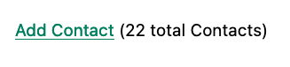
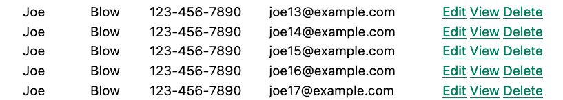

# Koncepti hipermedije 02

## 5 Proširivanje HTML-a kao hipermedije

### 5.1 Proširivanje HTML-a

U prethodnom poglavlju predstavili smo jednostavnu hipermedijsku aplikaciju u Web 1.0 stilu za upravljanje kontaktima. Naša aplikacija je podržala uobičajene CRUD operacije za kontakte, kao i jednostavan mehanizam za pretragu kontakata. Naša aplikacija je napravljena koristeći samo forme i oznake sidra, tradicionalne hipermedijske kontrole koje se koriste za interakciju sa serverima. Aplikacija razmenjuje hipermediju (HTML) sa serverom preko HTTP-a, izdajući GET i POST HTTP zahteve i primajući nazad kompletne HTML dokumente kao odgovor.

To je osnovna veb aplikacija, ali je takođe definitivno i aplikacija vođena hipermedijom. Robusna je, koristi izvorne veb tehnologije i jednostavna je za razumevanje.

Pa šta nam ae ne sviđa kod aplikacije?

Nažalost, naša aplikacija ima nekoliko problema uobičajenih za aplikacije u stilu veb 1.0:

- Sa stanovišta korisničkog iskustva: primetno je osvežavanje kada se krećete između stranica aplikacije ili kada kreirate, ažurirate ili brišete kontakt. To je zato što svaka korisnička interakcija (klik na link ili slanje obrasca) zahteva potpuno osvežavanje stranice, sa potpuno novim HTML dokumentom koji se obrađuje nakon svake radnje.

- Sa tehničke perspektive, sva ažuriranja se vrše POST HTTP metodom. Ovo, uprkos činjenici da postoje logičnije akcije i tipovi HTTP zahteva, kao što su PUT i DELETE i da bi imali više smisla za neke od operacija koje smo implementirali. Na kraju krajeva, ako želimo da obrišemo resurs, zar ne bi imalo više smisla da koristimo HTTP DELETE zahtev za to? Pomalo ironično, pošto smo koristili čisti HTML, nismo u mogućnosti da pristupimo punoj izražajnoj moći HTTP-a, koji je posebno dizajniran za HTML.

Prva tačka je posebno primetna kod aplikacija u Web 1.0 stilu poput naše i upravo je to ono što im daje reputaciju "nezgrapnih" u poređenju sa njihovim  sofisticiranijim rođacima, jednostraničnim aplikacijama zasnovanim na JavaScript-u.

Ovaj problem bismo mogli da rešimo usvajanjem okvira za jednostranične aplikacije (Single Page Application) i ažuriranjem naše serverske strane kako bismo pružali odgovore zasnovane na JSON-u. Jednostranične aplikacije eliminišu nespretnost web 1.0 aplikacija ažuriranjem veb stranice bez njenog osvežavanja: one mogu da promene delove Document Object Model (DOM) postojeće stranice bez potrebe za zamenom (i ponovnim prikazivanjem) cele stranice.

#### 5.1.1 DOM

DOM je interni model koji pregledač gradi kada obrađuje HTML, formirajući drvo "čvorova" za oznake i drugi sadržaj u HTML-u. DOM pruža programski JavaScript API koji vam omogućava da direktno ažurirate čvorove na stranici, bez upotrebe hipermedije. Koristeći ovaj API, JavaScript kod može da ubaci novi sadržaj ili da ukloni ili ažurira postojeći sadržaj, potpuno van uobičajenog mehanizma zahteva pregledača.

Postoji nekoliko različitih stilova SPA, ali, kao što smo razgovarali u 1. poglavlju, najčešći pristup danas je povezivanje DOM-a sa JavaScript modelom, a zatim dozvoljavanje SPA okviru poput React-a ili Vue-a da reaktivno ažurira DOM kada se JavaScript model ažurira: pravite promenu na JavaScript objektu koji je lokalno sačuvan u memoriji u pregledaču, a veb stranica "magično" ažurira svoje stanje kako bi odražavala promenu u modelu.

U ovom stilu aplikacije, komunikacija sa serverom se obično obavlja putem JSON Data API-ja, pri čemu aplikacija žrtvuje prednosti hipermedije kako bi pružila bolje i glađe korisničko iskustvo.

Mnogi veb programeri danas ne bi ni razmatrali hipermedijalni pristup zbog percipiranog osećaja "nasleđa" ovih aplikacija u stilu veb 1.0.

Sada, drugi, tehničkiji problem koji smo pomenuli može vam se učiniti pomalo pedantničkim, i mi smo prvi koji priznaju da razgovori o REST-u i koja je HTTP akcija ispravna za datu operaciju mogu postati veoma zamorni. Ali ipak, čudno je da je, kada se koristi običan HTML, nemoguće koristiti svu funkcionalnost HTTP-a!

Samo deluje pogrešno, zar ne?

#### 5.1.2 Pažljiv pogled na hiperlink

Ispostavilo se da možemo poboljšati interaktivnost naše aplikacije i rešiti oba ova problema bez pribegavanja SPA pristupu. To možemo učiniti korišćenjem JavaScript biblioteke orijentisane na hipermediju, `htmx`. Autori ove knjige su napravili `htmx` posebno da bi proširili HTML kao hipermediju i rešili probleme sa starijim HTML aplikacijama koje smo gore pomenuli (kao i nekoliko drugih).

Pre nego što se pozabavimo kako nam htmx omogućava da poboljšamo UX naše Web 1.0 aplikacije, ponovo se osvrnemo na oznaku hiperlinka/sidra iz 1. poglavlja. Podsetimo se, hiperlink je ono što je poznato kao hipermedijska kontrola, mehanizam koji opisuje neku vrstu interakcije sa serverom tako što direktno i potpuno kodira informacije o toj interakciji unutar same kontrole.

Razmotrite ponovo ovu jednostavnu oznaku sidra koja, kada je pregledač interpretira, kreira hipervezu ka veb-sajtu ove knjige:

```html
<a href="https://hypermedia.systems/">
    Hypermedia Systems
</a>
```

Kod - Jednostavni hiperlink

Hajde da detaljno objasnimo šta se tačno dešava sa ovim linkom:

- Pretraživač će prikazati tekst "Hypermedia systems" na ekranu, verovatno sa ukrasom koji ukazuje da se na njega može kliknuti.
- Zatim, kada korisnik klikne na tekst
- Pregledač će izdati HTTP poruku GET za <https://hypermedia.systems>
- Pregledač će učitati HTML telo HTTP odgovora u prozor pregledača, zamenjujući trenutni dokument.

Dakle, imamo četiri aspekta jednostavnog hipermedijskog linka poput ovog, pri čemu poslednja tri aspekta pružaju mehanizam koji razlikuje hiperlink od "normalnog" teksta i, samim tim, čini ga hipermedijskom kontrolom.

Sada, hajde da odvojimo trenutak i razmislimo o tome kako možemo generalizovati ova poslednja tri aspekta hiperlinka.

Zašto samo sidra i forme?

Razmislite: šta čini oznake sidra (i forme) tako posebnim?

Zašto i drugi elementi ne mogu da izdaju HTTP zahteve?

Na primer, zašto `button` elementi ne bi trebalo da mogu da izdaju HTTP zahteve? Čini se proizvoljnim da se oko dugmeta mora omotati oznaka forme samo da bi brisanje kontakata funkcionisalo u našoj aplikaciji, na primer.

Možda: i drugi elementi bi trebalo da budu u mogućnosti da izdaju HTTP zahteve. Možda bi drugi elementi trebalo da budu u stanju da sami po sebi deluju kao hipermedijske kontrole.

Ovo je naša prva prilika da generalizujemo HTML kao hipermediju.

**Prilika 1**:  
HTML bi se mogao proširiti tako da omogući bilo kom elementu da izda zahtev serveru i deluje kao hipermedijska kontrola.

#### 5.1.3 Zašto samo događaje tipa "Klikni i pošalji"?

Zatim, razmotrimo događaj koji pokreće zahtev serveru na našem linku: događaj klika.

Pa, šta je toliko posebno u vezi sa klikom (u slučaju sidra) ili slanjem (u slučaju forme) u stvari? To su samo dva od mnogih, mnogih događaja koje pokreće DOM, na kraju krajeva. Događaji poput pritiska miša na dole, pritiska tastera nagore ili zamućenja su sve događaji koje biste možda želeli da koristite za izdavanje HTTP zahteva.

Zašto i ovi drugi događaji ne bi mogli da pokreću zahteve?

Ovo nam daje drugu priliku da proširimo izražajnost HTML-a:

**Prilika 2**:  
HTML kod bi mogao biti proširen tako da omogući bilo kom događaju — ne samo klik, kao u slučaju hiperlinkova — da pokrene HTTP zahteve.

#### 5.1.4 Zašto samo GET I POST?

Malo više tehničkog razmišljanja dovodi nas do problema koji smo ranije napomenuli: običan HTML nam daje pristup samo GET i POST radnjama HTTP-a.

HTTP je skraćenica od Hypertext Transfer Protocol (Protokol za prenos hiperteksta), a ipak format za koji je eksplicitno dizajniran, HTML, podržava samo dva od pet tipova zahteva okrenutih programerima. Morate da koristite JavaScript i izdate AJAX zahtev da biste dobili ostala tri: DELETE, PUT i PATCH.

Podsetimo se šta ovi različiti tipovi HTTP zahteva treba da predstavljaju:

- GET odgovara "dobijanju" reprezentacije resursa iz URL-a: to je čisto čitanje, bez mutacije resursa.
- POST dostavlja entitet (ili podatak) datom resursu, često kreirajući ili mutirajući resurs i uzrokujući promenu stanja.
- PUT šalje entitet (ili podatak) datom resursu na ažuriranje ili zamenu, što verovatno ponovo uzrokuje promenu stanja.
- PATCH, slično PUT ali podrazumeva delimično ažuriranje i promenu stanja, a ne potpunu zamenu entiteta.
- DELETE briše dati resurs.

Ove operacije se u velikoj meri podudaraju sa CRUD operacijama koje smo razmatrali u 2. poglavlju. Dajući nam pristup samo dvema od pet, HTML nam otežava da u potpunosti iskoristimo HTTP.

Ovo nam daje treću priliku da proširimo izražajnost HTML-a:

**Prilika 3**:  
HTML kod bi mogao biti proširen tako da omogući pristup trima nedostajućim HTTP metodama PUT, PATCH i DELETE.

#### 5.1.5 Zašto samo zameniti ceo ekran

Kao poslednje zapažanje, razmotrite poslednji aspekt hiperlinka: on zamenjuje ceo ekran kada korisnik klikne na njega.

Ispostavlja se da je ovaj tehnički detalj glavni krivac za loše korisničko iskustvo u Web 1.0 aplikacijama. Potpuno osvežavanje stranice može izazvati bljesak nestilizovanog sadržaja, gde sadržaj "skače" na ekranu dok prelazi iz svog početnog u svoj stilizovani konačni oblik. Takođe uništava stanje skrolovanja korisnika skrolovanjem do vrha stranice, uklanja fokus sa fokusiranog elementa i tako dalje.

Ali, ako razmislite o tome, ne postoji pravilo koje kaže da hipermedijske razmene moraju zameniti ceo dokument.

Ovo nam daje četvrtu, poslednju i možda najvažniju priliku da generalizujemo HTML:

**Prilika 4**:  
HTML kod bi mogao biti proširen tako da omogući odgovorima na zahteve za zamenu elemenata unutar trenutnog dokumenta, umesto da zahtevaju zamenu celog dokumenta.

> [!Note]
> Ove četiri mogućnosti nam pružaju način da proširimo HTML daleko iznad njegovih trenutnih mogućnosti, ali na način koji je u potpunosti u okviru hipermedijalnog modela veba. Osnove HTML-a, HTTP-a, pregledača i tako dalje, neće se dramatično promeniti. Umesto toga, ove generalizacije postojeće funkcionalnosti koje se već nalaze u HTML-u bi nam jednostavno omogućile da postignemo više koristeći HTML.

O Htmx-u:
> [!Note]
>
> **Htmx** je JavaScript biblioteka koja proširuje HTML na upravo ovaj način i biće u fokusu narednih nekoliko poglavlja ove knjige. Ponovo, `htmx` nije jedina JavaScript biblioteka koja koristi ovaj pristup orijentisan na hipermediju (drugi odlični primeri su "Unpoly" i "Hotwire"), ali htmx je najčistija u svojoj težnji ka proširenju HTML-a kao hipermedije.

### 5.2 Instaliranje i korišćenje Htmx-a

#### 5.2.1 Instaliranje sa CDN-a

Iz praktične perspektive "prvog korišćenja", htmx je jednostavna, samostalna JavaScript biblioteka bez zavisnosti koja se može dodati veb aplikaciji jednostavnim uključivanjem putem `script` oznake u vašem `head` elementu.

Zbog ovog jednostavnog modela instalacije, možete koristiti alate poput javnih CDN-ova za instaliranje biblioteke.

Ispod je primer korišćenja popularne mreže za isporuku sadržaja (CDN) "unpkg" za instaliranje verzije 1.9.2 biblioteke. Koristimo heš integriteta kako bismo osigurali da isporučeni JavaScript sadržaj odgovara onome što očekujemo. Ovaj SHA se može naći na veb lokaciji htmx.

Takođe označimo skriptu kao `crossorigin="anonymous"` da se CDN-u neće slati akreditivi.

```html
<head>
<script src="https://unpkg.com/htmx.org@1.9.2"
  integrity="sha384-L6OqL9pRWyyFU3+/bjdSri+iIphTN/  
      bvYyM37tICVyOJkWZLpP2vGn6VUEXgzg6h"
  crossorigin="anonymous"></script>
</head>
```

Kod - Instaliranje htmx-a sa CDN-a

Ako ste navikli na moderni JavaScript razvoj, sa složenim sistemima za izgradnju i velikim brojem zavisnosti, možda ćete biti prijatno iznenađeni kada otkrijete da je to sve što je potrebno za instaliranje htmx-a.

Ovo je u duhu ranog veba, kada ste jednostavno mogli da uključite oznaku skripte i stvari bi "jednostavno radile".

#### 5.2.2 Instaliranje sa lokalne kopije

Ako ne želite da koristite CDN, možete preuzeti htmx na svoj lokalni sistem i podesiti oznaku skripte da pokazuje gde god da čuvate svoje statičke resurse.

Ili, možda imate sistem za izgradnju koji automatski instalira zavisnosti. U ovom slučaju možete koristiti Node Package Manager (npm) za biblioteku: `htmx.org` i instalirati je na uobičajeni način koji vaš sistem za izgradnju podržava.

Kada je htmx instaliran, možete odmah početi da ga koristite.

#### 5.2.3 Nije potreban JavaScript

I ovde dolazimo do zanimljivog dela htmx-a: htmx ne zahteva od vas, korisnika htmx-a, da zapravo napišete bilo koji JavaScript kod.

Umesto toga, koristićete atribute postavljene direktno na elemente u vašem HTML-u da biste pokrenuli dinamičnije ponašanje. Htmx proširuje HTML kao hipermediju i dizajniran je tako da to proširenje deluje što prirodnije i konzistentnije sa postojećim HTML konceptima. Baš kao što oznaka sidra koristi atribut `href` da bi odredila URL adresu koju treba preuzeti, a forme koriste `action` atribut da bi odredili URL adresu kojoj treba poslati obrazac, htmx koristi HTML atribute da bi odredio URL adresu kojoj treba izdati HTTP zahtev.

### 5.3 Pokretanje HTTP zahteva

Pogledajmo prvu karakteristiku htmx-a: mogućnost da bilo koji element na veb stranici izda HTTP zahteve. Ovo je osnovna funkcionalnost koju pruža htmx i sastoji se od pet atributa koji se mogu koristiti za izdavanje pet različitih tipova HTTP zahteva namenjenih programerima:

- **hx-get**    - izdaje HTTP GET zahtev.
- **hx-post**   - izdaje HTTP POST zahtev.
- **hx-put**    - izdaje HTTP PUT zahtev.
- **hx-patch**  - izdaje HTTP PATCH zahtev.
- **hx-delete** - izdaje HTTP DELETE zahtev.

Svaki od ovih atributa, kada se postavi na element, govori htmx biblioteci: "Kada korisnik klikne na (ili bilo šta drugo) ovaj element, izdaj HTTP zahtev navedenog tipa."

Vrednosti ovih atributa su slične vrednostima `href` na sidrima i `action` na formama: navodite URL adresu kojoj želite da izdate dati tip HTTP zahteva. Obično se to radi preko putanje relativne u odnosu na server.

Na primer, ako želimo dugme kome ćemo poslati GET zahtev na "/contacts" napisali bismo sledeći HTML kod:

```html
<button hx-get="/contacts">   <1>
    Get The Contacts
</button>
```

Kod - Jednostavno dugme zasnovano na htmx-u

1. Jednostavno dugme koje izdaje HTTP poruku GET ka /contacts.

Biblioteka `htmx` će videti `hx-get` atribut na ovom dugmetu i povezati neku JavaScript logiku da bi izdala HTTP GET AJAX zahtev putanji /contacts kada korisnik klikne na nju.

Veoma lako za razumevanje i veoma je konzistentno sa ostatkom HTML-a.

#### 5.3.1 Sve je samo HTML

Sa zahtevom koji izdaje dugme iznad, dolazimo do možda najvažnije stvari koju treba razumeti o `htmx`-u: očekuje da odgovor na ovaj AJAX zahtev bude HTML. Htmx je proširenje HTML-a. Nativna hipermedijska kontrola, poput oznake sidra, obično će dobiti HTML odgovor na HTTP zahtev koji kreira. Slično tome, `htmx` očekuje da server odgovori na zahteve koje napravi pomoću HTML-a.

Ovo može iznenaditi veb programere koji su navikli da odgovaraju na AJAX zahteve pomoću JSON-a, što je daleko najčešći format odgovora za takve zahteve. Ali AJAX zahtevi su samo HTTP zahtevi i ne postoji pravilo koje kaže da moraju da koriste JSON. Podsetimo se ponovo da AJAX označava Asynchronous JavaScript & XML, tako da je JSON već korak dalje od formata koji je prvobitno zamišljen za ovaj API: XML.

`Htmx` jednostavno ide u drugom smeru i očekuje HTML.

#### 5.3.2 Htmx naspram "običnih" HTML odgovora

Postoji važna razlika između HTTP odgovora na "normalne" HTTP zahteve vođene sidrom ili formularom i na zahteve pokretane htmx-om: u slučaju htmx zahteva, odgovori mogu biti delimični delovi HTML-a.

U interakcijama zasnovanim na htmx-u, kao što ćete videti, često ne zamenjujemo ceo dokument. Umesto toga, koristimo "transkluziju" da bismo uključili sadržaj u postojeći dokument. Zbog toga često nije potrebno niti poželjno prenositi ceo HTML dokument sa servera na pregledač.

Ova činjenica se može iskoristiti za uštedu propusnog opsega kao i vremena učitavanja resursa.

Manje ukupnog sadržaja se prenosi sa servera na klijenta i nije potrebno ponovo obrađivati `head` oznaku pomoću stilskih listova, oznaka skripti i tako dalje.

Kada se klikne na dugme "Preuzmi kontakte", delimični HTML odgovor može izgledati otprilike ovako:

```html
<ul>
<li><a href="mailto:joe@example.com">Joe</a></li>
<li><a href="mailto:sarah@example.com">Sarah</a></li>
<li><a href="mailto:fred@example.com">Fred</a></li>
</ul>
```

Kod - Delimični HTML odgovor na htmlx zahtev

Ovo je samo neuređena lista kontakata sa nekim elementima na koje se može kliknuti. Imajte na umu da nema početne `html` oznake, `head` oznake i tako dalje: to je sirova HTML lista, bez ikakvih dekoracija oko nje. Odgovor u stvarnoj aplikaciji može da sadrži sofisticiraniji HTML od ove jednostavne liste, ali čak i da je komplikovaniji, ne bi morao da bude cela HTML stranica: to bi mogao biti samo "unutrašnji" sadržaj HTML reprezentacije za ovaj resurs.

Sada, ova jednostavna lista odgovora je savršena za `htmx`. `Htmx` će jednostavno uzeti vraćeni sadržaj, a zatim ga zameniti u DOM umesto nekog elementa na stranici. (Više o tome gde će tačno biti postavljen u DOM-u za trenutak.) Zamena HTML sadržaja na ovaj način je brza i efikasna jer koristi postojeći izvorni HTML parser u pregledaču, umesto da zahteva značajnu količinu klijentskog JavaScript-a za izvršavanje.

Ovaj mali HTML odgovor pokazuje kako `htmx` ostaje u okviru hipermedijske paradigme: baš kao i "normalna" hipermedijska kontrola u "normalnoj" veb aplikaciji, vidimo da se hipermedija prenosi klijentu na bez stalan i uniforman način.

Ovo dugme nam samo daje malo sofisticiraniji mehanizam za izgradnju veb aplikacije korišćenjem hipermedije.

#### 5.3.3 Ciljanje drugih elemenata

Sada, s obzirom na to da je `htmx` izdao zahtev i dobio nazad neki HTML kao odgovor, i da ćemo zameniti ovaj sadržaj na postojećoj stranici (umesto da zamenimo celu stranicu), pitanje je: gde treba postaviti ovaj novi sadržaj?

Ispostavlja se da je podrazumevano ponašanje htmx-a jednostavno stavljanje vraćenog sadržaja unutar elementa koji je pokrenuo zahtev. To nije dobra stvar u slučaju našeg dugmeta: završićemo sa listom kontakata nespretno ugrađenih unutar elementa dugmeta. To će izgledati prilično glupo i očigledno nije ono što želimo.

Srećom, `htmx` pruža još jedan atribut `hx-target` koji se može koristiti za određivanje tačnog mesta u DOM-u gde treba postaviti novi sadržaj. Vrednost atributa je selektor `hx-target` Cascading Style Sheet (CSS) koji vam omogućava da odredite element u koji treba postaviti novi hipermedijalni sadržaj.

Dodajmo `div` oznaku koja obuhvata dugme sa identifikatorom `id=main`. Zatim ćemo to ciljati `div` odgovorom:

```html
<div id="main">                                 <1>
  <button hx-get="/contacts" hx-target="#main"> <2>
    Get The Contacts
  </button>
</div>
```

Kod - Jednostavno dugme zasnovano na htmx-u

1. Element div koji obavija dugme.
2. Atribut hx-target koji određuje cilj odgovora.

Dodali smo `hx-target="#main"` našem dugmetu, gde je `#main` CSS selektor koji kaže "Stvar sa ID-om 'main'."

Korišćenjem CSS selektora, `htmx` se nadovezuje na poznate i standardne HTML koncepte. Ovo svodi dodatno konceptualno opterećenje za rad sa htmx-om na minimum.

S obzirom na ovu novu konfiguraciju, kako bi izgledao HTML kod na klijentu nakon što korisnik klikne na ovo dugme i odgovor bude primljen i obrađen?

Izgledalo bi otprilike ovako:

```html
<div id="main">
  <ul>
    <li><a href="mailto:joe@example.com">Joe</a></li>
    <li><a href="mailto:sarah@example.com">Sarah</a></li>
    <li><a href="mailto:fred@example.com">Fred</a></li>
  </ul>
</div>
```

Naš HTML nakon završetka htmx zahteva

HTML odgovora je zamenjen u div sa id = "main", zamenjujući dugme koje je pokrenulo zahtev. Kraj! I ovo se desilo "u pozadini" putem AJAX-a, bez nespretnog osvežavanja stranice.

#### 5.3.4 Zameni stilove

Sada, možda ne želimo da učitamo sadržaj iz odgovora servera u "div", kao podređene elemente. Možda, iz nekog razloga, želimo da zamenimo ceo "div" odgovorom. Da bi se ovo rešilo, `htmx` pruža još jedan atribut, `hx-swap`, koji vam omogućava da tačno odredite kako sadržaj treba da se zameni u DOM-u.

Atribut hx-swap podržava sledeće vrednosti:

- **innerHTML**   - Podrazumevano, zameni unutrašnji html kod ciljnog elementa.
- **outerHTML**   - Zameni ceo ciljni element odgovorom.
- **beforebegin** - Umetni odgovor ispred ciljnog elementa.
- **afterbegin**  - Umetni odgovor ispred prvog deteta ciljnog elementa.
- **beforeend**   - Umetni odgovor posle poslednjeg deteta ciljnog elementa.
- **afterend**    - Umetnite odgovor posle ciljnog elementa.
- **delete**      - Briši ciljni element bez obzira na odgovor.
- **none**        - Zamena neće biti izvršena.

Prve dve vrednosti, `innerHTML` i `outerHTML`, su preuzete iz standardnih DOM svojstava koja vam omogućavaju da zamenite sadržaj unutar elementa ili umesto celog elementa, respektivno.

Sledeće četiri vrednosti su preuzete iz `Element.insertAdjacentHTML()` DOM API-ja, što vam omogućava da postavite element ili elemente oko datog elementa na različite načine.

Poslednje dve vrednosti, `delete` i `none` su specifične za `htmx`. Prva opcija će ukloniti ciljni element iz DOM-a, dok druga opcija neće uraditi ništa (možda ćete želeti da radite samo sa zaglavljima odgovora, naprednom tehnikom koju ćemo kasnije pogledati u knjizi).

Ponovo, možete videti da `htmx` ostaje što je moguće bliži postojećim veb standardima kako bi se minimiziralo konceptualno opterećenje neophodno za njegovu upotrebu.

Dakle, razmotrimo slučaj gde, umesto zamene `innerHTML` sadržaja glavnog div-a iznad, želimo da zamenimo ceo div HTML odgovorom.

Da bismo to uradili, potrebna bi bila samo mala promena na našem dugmetu, dodavanjem novog `hx-swap` atributa:

```html
<div id="main">
  <button hx-get="/contacts" hx-target="#main" hx-swap="outerHTML"> <1>
    Get The Contacts
  </button>
</div>
```

Kod - Zamena celog div-a

1. Atribut `hx-swap` određuje kako se zamenjuje novi sadržaj.

Sada, kada se primi odgovor, ceo div će biti zamenjen hipermedijalnim sadržajem:

```html
<ul>
  <li><a href="mailto:joe@example.com">Joe</a></li>
  <li><a href="mailto:sarah@example.com">Sarah</a></li>
  <li><a href="mailto:fred@example.com">Fred</a></li>
</ul>
```

Kod - Naš HTML nakon završetka htmx zahteva

Možete videti da je, ovom promenom, ciljni div potpuno uklonjen iz DOM-a, a lista koja je vraćena kao odgovor ga je zamenila.

Kasnije u knjizi videćemo dodatne upotrebe za `hx-swap`, na primer kada implementiramo Infinity scrolling u našoj aplikaciji za upravljanje kontaktima.

Imajte na umu da smo sa atributima `hx-get`, `hx-post`, `hx-put`, `hx-patch` i `hx-delete`, obradili dve od četiri mogućnosti za poboljšanje koje smo naveli u vezi sa običnim HTML-om:

- **Prilika 1**: Sada možemo da izdamo HTTP zahtev sa bilo kojim elementom (u ovom slučaju koristimo dugme).
- **Prilika 3**: Možemo izdati bilo koju vrstu HTTP zahteva koju želimo, PUT, PATCHi DELETE, posebno.

I, pomoću `hx-target` i `hx-swap` smo rešili treći nedostatak: zahtev da se zameni cela stranica.

- **Prilika 4**: Sada možemo zameniti bilo koji element koji želimo na našoj stranici putem transkluzije, i to možemo učiniti na bilo koji način koji želimo.

Dakle, sa samo sedam relativno jednostavnih dodatnih atributa, rešili smo većinu nedostataka HTML-a kao hipermedije koje smo ranije identifikovali.

Šta je sledeće? Setimo se još jedne prilike koju smo napomenuli: činjenice da samo `onclic` kdogađaj (na sidru) ili `submit` događaj (na formi) može pokrenuti HTTP zahtev. Hajde da pogledamo kako možemo da rešimo to ograničenje.

#### 5.3.5 Korišćenje događaja

Do sada smo koristili dugme za izdavanje zahteva sa htmx-om. Verovatno ste intuitivno razumeli da će dugme izdati svoj zahtev kada kliknete na njega, jer, pa, to je ono što radite sa dugmadima: kliknete na njih.

I, da, podrazumevano, kada se na dugme postavi `hx-get` anotacija iz htmx-a koja pokreće zahtev, zahtev će biti izdat kada se klikne na dugme.

Međutim, htmx generalizuje ovaj pojam događaja koji pokreće zahtev koristeći, pogodili ste, još jedan atribut: `hx-trigger`. `hx-trigger` atribut vam omogućava da navedete jedan ili više događaja koji će uzrokovati da element pokrene HTTP zahtev.

Često ne morate da koristite `hx-trigger` jer će podrazumevani okidajući događaj biti ono što želite. Podrazumevani okidajući događaj zavisi od tipa elementa i trebalo bi da bude prilično intuitivan:

- Zahtevi na `input`, `textarea` i `select` elementima se pokreću događajem `change`.
- Zahtevi na form elementima se pokreću na `submit` događaj.
- Zahtevi na svim elementima se pokreću događajem `click`.

Da bismo demonstrirali kako `hx-trigger` funkcioniše, razmotrite sledeću situaciju: želimo da pokrenemo zahtev na našem dugmetu kada ga miš dodirne. Sada, ovo svakako nije dobar UX obrazac, ali budite strpljivi: ovo koristimo samo kao primer.

Da bismo reagovali na pritiskanje dugmeta mišem, dodali bismo sledeće svojstvo našem dugmetu:

```html
<div id="main">
  <button hx-get="/contacts" hx-target="#main" hx-swap="outerHTML" hx-trigger="mouseenter">    <1>
    Get The Contacts
  </button>
</div>
```

Kod - (Loše dizajnirano) dugme koje se aktivira pri `mouseenter` događaju

1. Izdajte zahtev u vezi sa `mouseenter` događajem.

Sada, sa ovim `hx-trigger` kad god miš pritisne ovo dugme, zahtev će biti pokrenut. Glupo, ali funkcioniše.

Hajde da pokušamo nešto malo realnije i potencijalno korisno: dodajmo podršku za prečicu na tastaturi za učitavanje kontakata Ctrl-L (za "Učitaj"). Da bismo to uradili, moraćemo da iskoristimo dodatnu sintaksu koju `hx-trigger` atribut podržava: filtere događaja i dodatne argumente.

Filteri događaja su mehanizam za određivanje da li dati događaj treba da pokrene zahtev ili ne. Primenjuju se na događaj dodavanjem uglastih zagrada posle njega: someEvent[someFilter]. Sam filter je JavaScript izraz koji će biti procenjen kada se dati događaj desi. Ako je rezultat istinit, u JavaScript smislu, on će pokrenuti zahtev. Ako nije, zahtev neće biti pokrenut.

U slučaju prečica na tastaturi, želimo da uhvatimo `keyup` događaj pored događaja `click`:

```html
<div id="main">
  <button hx-get="/contacts" hx-target="#main" hx-swap="outerHTML" hx-trigger="click, keyup"> <1>
      Get The Contacts
  </button>
</div>
```

Kod - Početak, okidač pritiskom na taster

1. Okidač sa dva događaja.

Imajte na umu da imamo listu događaja odvojenih zarezima koji mogu da pokrenu ovaj element, što nam omogućava da odgovorimo na više od jednog potencijalnog okidajućeg događaja. I dalje želimo da odgovorimo na click događaj i učitamo kontakte, pored rukovanja Ctrl-L prečicom na tastaturi.

Nažalost, postoje dva problema sa našim `keyup` dodatkom: U sadašnjem stanju, pokrenuće zahteve za bilo koji događaj pritiska tastera. I, što je još gore, pokrenuće se samo kada se taster pritisne unutar ovog dugmeta. Korisnik bi morao da pritisne taster Tab da bi ga aktivirao, a zatim počne da kuca.

Hajde da rešimo ova dva problema. Da bismo rešili prvi, koristićemo filter okidača da bismo proverili da li su tasteri Control i "L" pritisnuti zajedno:

```html
<div id="main">
  <button hx-get="/contacts" hx-target="#main" hx-swap="outerHTML"
    hx-trigger="click, keyup[ctrlKey && key == 'l']">       <1>
      Get The Contacts
</button>
</div>
```

Kod - Poboljšanje sa filterom pri otkucavanju tastera

1. keyup sada ima filter, tako da se moraju pritisnuti tasteri Control i L.

Filter okidača u ovom slučaju je `ctrlKey && key == 'l'`. Ovo se može pročitati kao "Događaj pritiska tastera, gde je svojstvo `ctrlKey` jednako `true`, a svojstvo `key` jednako `l`". Imajte na umu da se svojstva `ctrlKey` i `key` razrešavaju u odnosu na događaj, a ne na globalni prostor imena, tako da možete lako filtrirati na osnovu svojstava datog događaja. Međutim, možete koristiti bilo koji izraz koji želite za filter: pozivanje globalne JavaScript funkcije, na primer, je sasvim prihvatljivo.

U redu, dakle, ovaj filter ograničava događaje pritiska tastera koji će pokrenuti zahtev samo na Ctrl-L pritiske. Međutim, i dalje imamo problem da će, kako sada stvari stoje, samo keyup događaji unutar dugmeta pokrenuti zahtev.

Ako niste upoznati sa modelom mehurića događaja u JavaScript-u: događaji se obično "mehuriraju" do roditeljskih elemenata. Dakle, događaj poput `keyup` će se prvo pokrenuti na fokusiranom elementu, a zatim na njegovom roditeljskom (obuhvatajućem) elementu i tako dalje, dok ne dostigne objekat najvišeg nivoa document koji je koren svih ostalih elemenata.

Da bismo podržali globalnu prečicu na tastaturi koja radi bez obzira na to koji element je u fokusu, iskoristićemo prednost prikazivanja događaja u obliku mehurića i funkciju koju `hx-trigger` atribut podržava: mogućnost slušanja događaja drugih elemenata. Sintaksa za ovo je `from:modifikator`, koji se dodaje nakon imena događaja i koji vam omogućava da navedete određeni element za slušanje datog događaja pomoću CSS selektora.

U ovom slučaju, želimo da slušamo `body` element, koji je roditeljski element svih vidljivih elemenata na stranici.

Evo kako hx-triggerizgleda naš ažurirani atribut:

```html
<div id="main">
  <button hx-get="/contacts" hx-target="#main" hx-swap="outerHTML"
    hx-trigger="click, keyup[ctrlKey && key == 'l'] from:body">           <1>
      Get The Contacts
  </button>
</div>
```

Kod - Još bolje, slušajte otkucaje tastature na body

1. Osluškujte događaj "keyup" na body oznaci.

Sada, pored klikova, dugme će osluškivati keyupdogađaje na telu stranice. Tako će izdati zahtev kada se na njega klikne, a takođe i kad god neko dodirne nešto Ctrl-Lunutar tela stranice.

A sada imamo lepu prečicu na tastaturi za našu aplikaciju vođenu hipermedijom.

Atribut `hx-trigger` podržava mnogo više modifikatora i složeniji je od drugih `htmx` atributa. To je zato što su događaji, generalno, komplikovani i zahtevaju mnogo detalja da bi se postigli savršeni rezultati. Međutim, podrazumevani okidač će često biti dovoljan i obično ne morate da posežete za komplikovanim `hx-trigger` funkcijama kada koristite `htmx`.

Čak i sa sofisticiranijim specifikacijama okidača poput prečice na tastaturi koju smo upravo dodali, opšti osećaj `htmx`-a je deklarativan, a ne imperativan. Zbog toga aplikacije zasnovane na htmx-u "imaju osećaj" standardnih web 1.0 aplikacija na način na koji dodavanje značajnih količina JavaScript-a to ne čini.

#### 5.3.6 HTMX: HTML eXtended

I, pogledajte! Ovim `hx-trigger`-om smo se pozabavili poslednjom prilikom za poboljšanje HTML-a koju smo naveli na početku ovog poglavlja:

- **Prilika 2**: Možemo koristiti bilo koji događaj da pokrenemo HTTP zahtev.

To je ukupno osam, prebrojte ih, osam atributa koji svi potpuno spadaju u isti konceptualni model kao i normalni HTML i koji, proširujući HTML kao hipermediju, otvaraju potpuno novi svet mogućnosti interakcije sa korisnicima unutar njega.

Evo tabele koja sumira te mogućnosti i koji htmx atributi ih adresiraju:

- Bilo koji element treba da bude u mogućnosti da pošalje HTTP zahteve  
  `hx-get`, `hx-post`, `hx-put`, `hx-patch`, `hx-delete`.

- Bilo koji događaj treba da bude u stanju da pokrene HTTP zahtev  
  `hx-trigger`.

- Bilo koja HTTP akcija treba da bude dostupna  
  `hx-put`, `hx-patch`, `hx-delete`.

- Bilo koje mesto na stranici treba da bude zamenljivo (transkluzija)  
  `hx-target`, `hx-swap`.

#### 5.3.7 Prosleđivanje parametara zahteva

Do sada smo samo razmatrali situaciju u kojoj dugme upućuje jednostavan GET zahtev. Ovo je konceptualno veoma slično onome što bi mogla da uradi oznaka sidra. Ali postoji i ta druga izvorna hipermedijska kontrola u aplikacijama zasnovanim na HTML-u: forme. Forme se koriste za prosleđivanje dodatnih informacija pored same URL adrese do servera u zahtevu.

Ove informacije se beleže putem ulaznih i elemenata sličnih ulaznim elementima unutar forme putem različitih vrsta oznaka za ulaz dostupnih u HTML-u.

Htmx vam omogućava da uključite ove dodatne informacije na način koji odražava sam HTML.

Najjednostavniji način za prosleđivanje ulaznih vrednosti sa zahtevom u htmx-u je da se element koji šalje zahtev ugradi unutar oznake forme.

Hajde da uzmemo naš originalni obrazac za pretragu i konvertujemo ga da koristi `htmx`:

```html
<form action="/contacts" method="get" class="tool-bar">     <1>
  <label for="search">Search Term</label>
  <input id="search" type="search" name="q"
    value="{{ request.args.get('q') or '' }}"
      placeholder="Search Contacts"/>
  <button hx-post="/contacts" hx-target="#main">            <2>
    Search
  </button>
</form>
```

Kod - Dugme za pretragu zasnovano na htmx-u

1. Kada se element pokretan htmx-om nalazi unutar oznake pretka `form`, sve ulazne vrednosti unutar te forme biće poslate za ne-GET zahteve.
2. Prešli smo sa input tipa `submit` na `button` i dodali `hx-post` atribut.

Sada, kada korisnik klikne na ovo dugme, vrednost unosa sa identifikatorom search biće uključena u zahtev. To je zahvaljujući činjenici da postoji oznaka `form` koja obuhvata i dugme i unos: kada se pokrene zahtev vođen `htmx`-om, `htmx` će pretražiti DOM hijerarhiju za obuhvatajuću formu i, ako je pronađe, uključiće sve vrednosti iz te forme. Ovo se ponekad  naziva `serijalizacija` forme.

Možda ste primetili da je dugme prebačeno sa GET zahteva na POST zahtev. To je zato što, podrazumevano, htmx ne uključuje najbližu priloženu formu za GET zahteve, ali uključuje formu za sve ostale vrste zahteva.

Ovo može delovati malo čudno, ali izbegava "smeće" URL-ova koji se koriste unutar forme prilikom rada sa unosima iz istorije, o čemu ćemo malo kasnije razgovarati. Uvek možete uključiti vrednosti obuhvatne forme sa elementom koji koristi GET koristeći `hx-includea` tribut, o čemu ćemo kasnije razgovarati.

Takođe imajte na umu da smo mogli dodati `hx-post` atribut formi, umesto dugmetu, ali bi to stvorilo pomalo nezgodno dupliranje URL-a pretrage u `action` atributima `hx-post`. Ovo se može izbeći korišćenjem `hx-boost` atributa, o čemu ćemo govoriti u sledećem poglavlju.

#### 5.3.8 Uključi ulaze

Iako je uklapanje svih unosa koje želite da uključite u zahtev unutar forme najčešći pristup serijalizaciji unosa za htmx zahteve, to nije uvek moguće ili poželjno: oznake forme mogu imati posledice po izgled i jednostavno se ne mogu postaviti na neka mesta u HTML dokumentima. Dobar primer ove druge situacije je kod `tr` elemenata reda tabele (tr): `form` oznaka nije validno dete ili roditelj redova tabele, tako da ne možete postaviti formu unutar ili oko reda podataka u tabeli.

Da bi se rešio ovaj problem, `htmx` pruža mehanizam za uključivanje ulaznih vrednosti u zahteve: `hx-includea` tribut. `hx-include` atribut vam omogućava da izaberete ulazne vrednosti koje želite da uključite u zahtev putem CSS selektora.

Evo gornjeg primera prerađenog da uključi unos, izostavljajući formu:

```html
<div id="main">
  <label for="search">Search Contacts:</label>
  <input id="search" name="q"  type="search"
    value="{{ request.args.get('q') or '' }}"
    placeholder="Search Contacts"/>
  <button hx-post="/contacts" hx-target="#main" hx-include="#search"> <1>
    Search
  </button>
</div>
```

Kod - Dugme za pretragu zasnovano na htmx-u sa `hx-include`

1. `hx-include` se može koristiti za direktno uključivanje vrednosti u zahtev.

Atribut `hx-include` uzima vrednost CSS selektora i omogućava vam da tačno odredite koje vrednosti treba poslati zajedno sa zahtevom. Ovo može biti korisno ako je teško kolocirati element koji izdaje zahtev sa svim željenim ulazima.

Takođe je korisno kada zapravo želite da pošaljete vrednosti sa GET zahtevom i prevaziđete podrazumevano ponašanje htmx-a.

#### 5.3.9 Relativni CSS selektori

Atribut `hx-include`, a zapravo i većina atributa koji prihvataju CSS selektor, takođe podržavaju relativne CSS selektore. Oni vam omogućavaju da odredite CSS selektor u odnosu na element na kojem je deklarisan.

Evo nekoliko primera:

- `closest`
  Pronađite najbliži roditeljski element koji odgovara datom selektoru, npr `form`.

- `next`
  Pronađite sledeći element (skeniranjem unapred) koji odgovara datom selektoru, npr `next input`.

- `previous`
  Pronađi prethodni element (skeniranjem unazad) koji odgovara datom selektoru, npr `previous input`.

- `find`
  Pronađite sledeći element unutar ovog elementa koji odgovara datom selektoru, npr `find input`.

- `this`
  Trenutni element.

Korišćenje relativnih CSS selektora često vam omogućava da izbegnete generisanje identifikatora za elemente, jer umesto toga možete iskoristiti njihov lokalni strukturni raspored.

#### 5.3.10 Ugrađene vrednosti

Poslednji način za uključivanje vrednosti u zahteve vođene htmx-om je korišćenje `hx-vals` atributa, koji vam omogućava da uključite "statičke" vrednosti u zahtev. Ovo može biti korisno ako imate dodatne informacije koje želite da uključite u zahteve, ali ne želite da ove informacije budu ugrađene, na primer, u skrivene unose (što bi bio standardni mehanizam za uključivanje dodatnih, skrivenih informacija u HTML-u).

Evo jednog primera `hx-vals`:

```html
<button hx-get="/contacts" hx-vals='{"state":"MT"}'> <1>
  Get The Contacts In Montana
</button>
```

Kod - Dugme koje koristi htmx tehnologiju sa `hx-vals`.

1. `hx-vals`, JSON vrednost koju treba uključiti u zahtev.

Parametar `state` sa vrednošću `MT` će biti uključen u GET zahtev, što će rezultirati putanjom i parametrima koji izgledaju ovako: "/contacts?state=MT". Imajte na umu da smo promenili `hx-vals` atribut tako da koristi jednostruke navodnike oko njegove vrednosti. To je zato što JSON strogo zahteva dvostruke navodnike i stoga, da bismo izbegli izbegavanje, morali smo da koristimo jednostruke navodnike za vrednost atributa.

Takođe možete dodati prefiks `hx-vals` js: i proslediti vrednosti koje se procenjuju u trenutku zahteva, što može biti korisno za uključivanje stvari poput dinamički održavane promenljive ili vrednosti iz JavaScript biblioteke treće strane.

Na primer, ako bise  "state" promenljiva održavala dinamički, putem nekog JavaScript-a, i ako bi postojala JavaScript funkcija, "getCurrentState()", koja vraća trenutno izabrano stanje, ona bi mogla biti dinamički uključena u htmx zahteve kao što je prikazano:

```html
<button hx-get="/contacts"
  hx-vals='js:{"state":getCurrentState()}'>     <1>
    Get The Contacts In The Selected State
</button>
```

Kod - Dinamička vrednost

1. Sa `js:prefiksom`, ovaj izraz će se izračunati prilikom slanja.

Ova tri mehanizma,

- korišćenje `form` oznaka,
- korišćenje `hx-include` atributa, i
- korišćenje `hx-vals` atributa,

omogućavaju vam da uključite vrednosti u svoje hipermedijske zahteve sa htmx-om na način koji bi trebalo da deluje veoma poznato i u skladu sa duhom HTML-a, a istovremeno vam daje fleksibilnost da postignete ono što želite.

#### 5.3.11 Podrška za istoriju

Imamo još jedan deo funkcionalnosti kojim zaključujemo naš pregled htmlx-a: podrška za istoriju pregledača. Kada koristite uobičajene HTML linkove i obrasce, vaš pregledač će pratiti sve stranice koje ste posetili. Zatim možete koristiti dugme za nazad da biste se vratili na prethodnu stranicu, a kada to uradite, možete koristiti dugme za napred da biste se vratili na originalnu stranicu na kojoj ste bili.

Ova ideja istorije bila je jedna od ključnih karakteristika ranog veba. Nažalost, ispostavilo se da istorija postaje komplikovana kada pređete na paradigmu aplikacije sa jednom stranicom. AJAX zahtev sam po sebi ne registruje veb stranicu u istoriji vašeg pregledača, što je dobra stvar: AJAX zahtev možda nema nikakve veze sa stanjem veb stranice (možda samo beleži neku aktivnost u pregledaču), tako da ne bi bilo prikladno kreirati novi unos u istoriji za interakciju.

Međutim, verovatno će postojati mnogo AJAX interakcija u jednostraničnoj aplikaciji gde je prikladno kreirati unos istorije. Postoji JavaScript API za rad sa istorijom pregledača, ali ovaj API je izuzetno dosadan i težak za rad, pa ga JavaScript programeri često ignorišu.

Ako ste ikada koristili aplikaciju sa jednom stranicom i slučajno kliknuli na dugme za nazad, ne samo da biste izgubili celokupno stanje aplikacije i morali da počnete ispočetka, videli ste ovaj problem u akciji.

U htmx-u, kao i kod okvira za aplikacije sa jednom stranicom, često ćete morati eksplicitno da radite sa API-jem za istoriju. Srećom, pošto se htmx drži tako blizu izvornom modelu veba i pošto je deklarativan, dobijanje ispravne veb istorije je obično mnogo lakše uraditi u aplikaciji zasnovanoj na htmx-u.

Razmotrite dugme koje smo razmatrali za učitavanje kontakata:

```html
<button hx-get="/contacts" hx-target="#main">
  Get The Contacts
</button>
```

Kod - Naše pouzdano dugme

U sadašnjem stanju, ako kliknete na ovo dugme, preuzeće se sadržaj iz "/contacts" elementa sa id-om i učitati ga u main, ali neće se kreirati novi unos u istoriju.

Ako bismo želeli da kreira unos u istoriju kada se ovaj zahtev desi, dodali bismo novi atribut dugmetu, `hx-push-url` atribut:

```html
<button hx-get="/contacts" hx-target="#main" hx-push-url="true"> <1>
  Get The Contacts
</button>
```

Kod 5.17 - Naše pouzdano dugme, sada sa istorijom!

1. `hx-push-url` kreiraće unos u istoriji kada se klikne na dugme.

Sada, kada se klikne na dugme, "/contacts" putanja će biti uneta u navigacionu traku pregledača i za nju će biti kreiran unos u istoriji. Štaviše, ako korisnik klikne na dugme za nazad, originalni sadržaj stranice će biti vraćen, zajedno sa originalnom URL adresom.

Sada, ime `hx-push-url` atributa može zvučati malo nejasno, ali je zasnovano na JavaScript API-ju `history.pushState()`. Ovaj pojam "guranja" proizilazi iz činjenice da su unosi istorije modelirani kao stek, i tako "gurate" nove unose na vrh steka unosa istorije.

Sa ovim relativno jednostavnim, deklarativnim mehanizmom, htmx vam omogućava da se integrišete sa dugmetom za nazad na način koji oponaša "normalno" ponašanje HTML-a.

Sada, postoji još jedna stvar koju moramo da rešimo da bismo dobili istoriju "baš kako treba": "/contacts" uspešno smo "uneli" putanju u traku lokacije pregledača i dugme za nazad radi. Ali šta ako neko osveži stranicu pregledača dok je na "/contacts" stranici?

U ovom slučaju, moraćete da obradite "delimični" odgovor zasnovan na htmx-u, kao i odgovor "cela stranica" koji nije htmx. To možete učiniti koristeći HTTP zaglavlja, temu o kojoj ćemo detaljnije govoriti kasnije u knjizi.

### 5.4 Zaključak o proširenju HTML-a

Dakle, to je naš brzi uvod u htmx. Videli smo samo desetak atributa iz biblioteke, ali možete videti koliko moćni ovi atributi mogu biti. Htmx omogućava mnogo sofisticiraniju veb aplikaciju nego što je to moguće u običnom HTML-u, uz minimalno dodatno konceptualno opterećenje u poređenju sa većinom pristupa zasnovanih na JavaScript-u.

Htmx ima za cilj da postepeno poboljša HTML kao hipermediju na način koji je konceptualno koherentan sa osnovnim jezikom za označavanje. Kao i svaki tehnički izbor, ovo nije bez kompromisa: ostajući tako blizak HTML-u, htmx ne daje programerima mnogo infrastrukture za koju bi mnogi mogli smatrati da bi trebalo da bude tu "po podrazumevanim podešavanjima".

Ostajući bliži izvornom modelu veba, htmx teži da pronađe ravnotežu između jednostavnosti i funkcionalnosti, prepuštajući se drugim bibliotekama za složenija frontend proširenja na postojećoj veb platformi. Dobra vest je da htmx dobro funkcioniše sa drugima, tako da kada se pojave ove potrebe, često je dovoljno lako uključiti drugu biblioteku da ih reši.

---

> [!Note]
> **HTML napomene: Budžetiranje za HTML**
>
> Bliska veza između sadržaja i oznaka znači da je dobar HTML radno intenzivan. Većina sajtova ima podelu između autora, koji retko znaju HTML, i programera, kojima je potrebno da razviju generički sistem sposoban da obrađuje bilo koji sadržaj koji im se prikaže — ova podela obično poprima oblik CMS-a. Kao rezultat toga, prilagođenost oznaka sadržaju, što je često neophodno za napredni HTML, retko je izvodljiva.
>
> Štaviše, kod internacionalizovanih sajtova, ubrizgavanje sadržaja na različitim jezicima u iste elemente može smanjiti kvalitet označavanja jer se stilske konvencije razlikuju između jezika. To je trošak koji malo organizacija može da izdvoji.
>
> Stoga, ne očekujemo da svaki sajt sadrži savršeno kompatibilan HTML. Najvažnije je izbegavati pogrešan HTML — bolje je osloniti se na generičkiji element nego biti potpuno netačan.
>
> Međutim, ako imate resurse, više pažnje u vezi sa HTML-om će proizvesti uglađeniji sajt.

---

## 6 HTMX šabloni

### 6.1 Rad sa htmx

Sada kada smo videli kako htmx proširuje HTML kao hipermediju, vreme je da to primenimo u praksi. Dok koristimo htmx, i dalje ćemo koristiti hipermediju: izdaćemo HTTP zahteve i dobijati HTML nazad. Ali, sa dodatnom funkcionalnošću koju htmx pruža, imaćemo moćniju hipermedijuza rad, što će nam omogućiti da ostvarimo mnogo sofisticiranije interfejse.

Ovo će nam omogućiti da se pozabavimo problemima korisničkog iskustva, kao što su dugi ciklusi povratnih informacija ili mučno osvežavanje stranice, bez potrebe za pisanjem mnogo, ako uopšte ikakvog, JavaScript koda i bez kreiranja JSON API-ja. Sve će biti implementirano u hipermediji, koristeći osnovne hipermedijske koncepte ranog veba.

#### 6.1.1 Instaliranje Htmx-a

Prvo što treba da uradimo jeste da instaliramo htmx u našu veb aplikaciju. To ćemo uraditi preuzimanjem izvornog koda i njegovim lokalnim čuvanjem u našoj aplikaciji, tako da nećemo zavisiti ni od jednog spoljnog sistema. Ovo se naziva "prodaja" biblioteke. Najnoviju verziju htmx-a možemo preuzeti tako što ćemo u našem pregledaču otići na <https://unpkg.com/htmx.org>, što će nas preusmeriti na izvorni kod najnovije verzije biblioteke.

Možemo sačuvati sadržaj sa ove URL adrese u "static/js/htmx.js" datoteku u našem projektu.

Naravno, možete koristiti sofisticiraniji JavaScript menadžer paketa kao što je Node Package Manager (NPM) ili yarn da biste instalirali htmx. To radite tako što ćete pozvati njegovo ime paketa, htmx.org, na način koji je prikladan za vaš alat. Međutim, htmx je veoma mali (približno 12kb kada se kompresuje i zipuje) i ne zavisi od zavisnosti, tako da njegovo korišćenje ne zahteva složen mehanizam ili alat za izgradnju.

Kada je htmx preuzet lokalno u naš "/static/js" direktorijum aplikacija, sada ga možemo učitati u našu aplikaciju. To radimo dodavanjem sledeće `script` oznake oznaci `head` u našoj "layout.html" datoteci, što će htmx učiniti dostupnim i aktivnim na svakoj stranici u našoj aplikaciji:

```html
<head>
    <script src="/js/htmx.js"></script>
    ...
</head>
```

Kod - Instaliranje htmlx-a

Podsetimo se da "layout.html" je datoteka izgleda koja je uključena u većinu šablona i koja obavija sadržaj tih šablona u uobičajeni HTML, uključujući `head` element koji ovde koristimo za instaliranje htmx-a.

Verovali ili ne, to je to! Ova jednostavna skriptna oznaka će učiniti funkcionalnost htmx-a dostupnom u celoj našoj aplikaciji.

#### 6.1.2 AJAX-ifikacija naše aplikacije

Da bismo se upoznali sa htmx-om, prva funkcija koju ćemo iskoristiti je poznata kao "pojačavanje". Ovo je pomalo "magična" funkcija po tome što ne moramo mnogo da radimo osim dodavanja jednog atributa, `hx-boost`, aplikaciji.

Kada dodate `hx-boost` datom elementu sa vrednošću `true`, on će "pojačati" sve sidra i elemente forme unutar tog elementa. "Pojačavanje", ovde, znači da će htmx konvertovati sva ta sidra i forme iz "normalnih" hipermedijalnih kontrola u AJAX-pokrenute hipermedijalne kontrole. Umesto izdavanja "normalnih" HTTP zahteva koji zamenjuju celu stranicu, linkovi i obrasci će izdavati AJAX zahteve. Htmx zatim zamenjuje unutrašnji sadržaj oznake `<body>` u odgovoru na ove zahteve u postojeću `<body>` oznaku stranice.

Ovo čini navigaciju bržom jer pregledač neće ponovo interpretirati većinu oznaka u odgovoru `<head>` i tako dalje.

#### 6.1.3 Pojačani linkovi

Pogledajmo primer poboljšane veze. Ispod je veza do hipotetičke stranice sa podešavanjima za veb aplikaciju. Pošto ima `hx-boost="true"`, htmx će zaustaviti normalno ponašanje veze izdavanjem zahteva putanji "/settings" i zamenom cele stranice odgovorom. Umesto toga, htmx će izdati AJAX zahtev za "/settings", uzeti rezultat i zameniti `body` element novim sadržajem.

```html
<a href="/settings" hx-boost="true">Settings</a>    <1>
```

Kod - Pojačana veza

Atribut `hx-boost` čini ovu vezu AJAX-om.

Možda se razumno pitate: koja je prednost ovde? Izdajemo AJAX zahtev i jednostavno zamenjujemo celo telo.

- Da li se to značajno razlikuje od samog izdavanja običnog zahteva za povezivanje?  
  - Da, zapravo je drugačije: sa poboljšanim linkom, pregledač je u mogućnosti da izbegne bilo kakvu obradu povezanu sa oznakom "head". Oznaka "head" često sadrži mnogo skripti i referenci CSS datoteka. U poboljšanom scenariju, nije potrebno ponovo obrađivati te resurse: skripte i stilovi su već obrađeni i nastaviće da se primenjuju na novi sadržaj. Ovo često može biti veoma jednostavan način da ubrzate svoju hipermedijalnu aplikaciju.

- Da li odgovor treba posebno formatirati da bi radio sa `hx-boost`? Na kraju krajeva, stranica sa podešavanjima bi obično prikazala html oznaku, sa `head` oznakom i tako dalje. Da li je potrebno posebno obrađivati "pojačane" zahteve?  

  - Odgovor je Ne: htmx je dovoljno pametan da izvuče samo sadržaj oznake `body` i zameni je na novoj stranici. Oznaka `head` se uglavnom ignoriše: obrađivaće se samo oznaka naslova, ako je prisutna. To znači da ne morate ništa posebno da radite na strani servera da biste prikazali šablone koji `hx-boost` mogu da obrade: samo vratite normalan HTML za vašu stranicu i trebalo bi da radi dobro.

Imajte na umu da će poboljšani linkovi (i forme) takođe nastaviti da ažuriraju navigacionu traku i istoriju, baš kao i normalni linkovi, tako da će korisnici moći da koriste dugme za nazad u pregledaču, da kopiraju i lepe URL-ove (ili "duboke linkove") i tako dalje. Linkovi će se ponašati manje-više kao "normalni", samo će biti brži.

#### 6.1.4 Pojačane forme

Pojačane oznake forme funkcionišu na sličan način kao i pojačane oznake sidra: pojačana forma će koristiti AJAX zahtev umesto uobičajenog zahteva koji izdaje pregledač i zameniće celo telo odgovorom.

Evo primera formulara koji šalje poruke krajnjoj "/messages" tački koristeći HTTP POST zahtev. Dodavanjem `hx-boost`, ti zahtevi će se vršiti u AJAX-u, umesto uobičajenim ponašanjem pregledača.

```html
<form action="/messages" method="post" hx-boost="true">             <1>
    <input type="text" name="message" placeholder="Enter A Message...">
    <button>Post Your Message</button>
</form>
```

Kod - Pojačana forma

Kao i kod linka, `hx-boost` čini ovaj obrazac AJAX-om.

Velika prednost zahteva zasnovanog na AJAX-u koji `hx-boost` koristi (i nedostatak obrade zaglavlja koja se dešava) jeste to što izbegava ono što je poznato kao bljesak nestilizovanog sadržaja:

**Bljesak nestilizovanog sadržaja (FOUC)**:

Situacija u kojoj pregledač prikazuje veb stranicu pre nego što su sve informacije o stilu dostupne za tu stranicu. FOUC (Full Use Out) izaziva uznemirujući trenutni "bljesak" nestilizovanog sadržaja, koji se zatim restilizuje kada su sve informacije o stilu dostupne. Primetićete ovo kao treperenje kada se krećete po internetu: tekst, slike i drugi sadržaj mogu "skakati" po stranici dok se na njega primenjuju stilovi.

Pošto kod `hx-boost` stil sajta već učitan pre nego što se novi sadržaj preuzme, nema takvog bljeska nestilizovanog sadržaja. Ovo može učiniti da "poboljšana" aplikacija deluje glađe i generalno brže.

#### 6.1.5 Nasleđivanje atributa

Hajde da proširimo naš prethodni primer pojačanog linka i dodamo još nekoliko pojačanih linkova pored njega. Dodaćemo linkove tako da imamo jedan do "/contacts" stranice, "/settings" stranice i "/help" stranice. Svi ovi linkovi su pojačani i ponašaće se na način koji smo gore opisali.

Ovo deluje pomalo suvišno, zar ne? Deluje glupo anotirati sva tri linka atributom `hx-boost="true"` jedan pored drugog.

```html
<a href="/contacts" hx-boost="true">Contacts</a>
<a href="/settings" hx-boost="true">Settings</a>
<a href="/help" hx-boost="true">Help</a>
```

Kod - Skup poboljšanih linkova

Htmx nudi funkciju koja pomaže u smanjenju ove redundantnosti: nasleđivanje atributa. Kod većine atributa u htmx-u, ako ga postavite na roditeljski element, atribut će se primeniti i na podređene elemente. Ovako funkcionišu kaskadni stilski listovi, i ta ideja je inspirisala htmx da usvoji sličnu funkciju "kaskadnih htmx atributa".

Da bismo izbegli suvišnost u ovom primeru, uvedimo `div` element koji obuhvata sve veze, a zatim "podignimo" `hx-boost` atribut do tog roditeljskog elementa `div`. Ovo će nam omogućiti da uklonimo suvišne `hx-boost` atribute, ali će osigurati da su sve veze i dalje pojačane, nasleđujući tu funkcionalnost od roditeljskog elementa `div`.

Imajte na umu da se ovde može koristiti bilo koji legalni HTML element, mi koristimo samo `div` iz navike.

```html
<div hx-boost="true"> <1>
    <a href="/contacts">Contacts</a>
    <a href="/settings">Settings</a>
    <a href="/help">Help</a>
</div>
```

Kod - Pojačavanje linkova preko roditeljskog elementa

`hx-boost` je premešteno u nadređeni `div`.

Sada ne moramo da stavljamo `hx-boost="true"` na svaki link i, zapravo, možemo da dodamo još linkova pored postojećih, i oni će takođe biti poboljšani, bez potrebe da ih eksplicitno anotiramo.

To je u redu, ali šta ako imate vezu koju ne želite da se pojača unutar elementa koji ima `hx-boost="true"` na njoj? Dobar primer ove situacije je kada je veza ka resursu koji treba preuzeti, kao što je PDF. Preuzimanje datoteke ne može se dobro obraditi AJAX zahtevom, tako da verovatno želite da se ta veza ponaša "normalno", izdajući zahtev za celu stranicu za PDF, koji će pregledač zatim ponuditi da sačuva kao datoteku na lokalnom sistemu korisnika.

Da biste rešili ovu situaciju, jednostavno prevazilazite roditeljsku `hx-boost` vrednost sa `hx-boost="false"` na oznaci sidra koju ne želite da pojačate:

```html
<div hx-boost="true">                                   <1>
    <a href="/contacts">Contacts</a>
    <a href="/settings">Settings</a>
    <a href="/help">Help</a>
    <a href="/help/documentation.pdf" hx-boost="false"> <2>
        Download Docs
    </a>
</div>
```

Kod - Onemogućavanje pojačavanja na jednom od pojačanih linkova

`hx-boost` i dalje je na roditeljskom `div`-u.

Ponašanje pojačavanja je zamenjeno za ovu vezu.

Ovde imamo novi link ka PDF dokumentaciji za koji želimo da funkcioniše kao običan link. Dodali smo `hx-boost="false"` u link i ova deklaracija će prepisati `hx-boost="true"` na roditeljskom div, vraćajući ga na ponašanje običnog linka i time omogućavajući ponašanje preuzimanja datoteke koje želimo.

### 6.2 Progresivno poboljšanje

Lep aspekt `hx-boost` je to što je to primer progresivnog poboljšanja:

> [!Note]
>
> **Progrsivno poboljšanje**  
> To je filozofija dizajna softvera koja ima za cilj da pruži što više neophodnog sadržaja i funkcionalnosti što većem broju korisnika, uz istovremeno pružanje boljeg iskustva korisnicima sa naprednijim veb pregledačima.

Razmotrite linkove u gornjem primeru. Šta bi se desilo da neki od njih nije imao omogućen JavaScript?

Nema problema. Aplikacija bi nastavila da radi, ali bi izdavala redovne HTTP zahteve, umesto HTTP zahteva zasnovanih na AJAX-u. To znači da će vaša veb aplikacija raditi za maksimalan broj korisnika; oni sa modernim pregledačima (ili korisnici koji nisu isključili JavaScript) mogu iskoristiti prednosti AJAX navigacije koju htmx nudi, a drugi i dalje mogu bez problema da koriste aplikaciju.

Uporedite ponašanje atributa htmx `hx-boost` sa jednostraničnom aplikacijom koja koristi mnogo JavaScript-a: takva aplikacija često uopšte neće funkcionisati bez omogućenog JavaScript-a. Često je veoma teško usvojiti progresivni pristup poboljšanja kada koristite SPA okvir.

To ne znači da svaka htmx funkcija nudi progresivno poboljšanje. Svakako je moguće napraviti funkcije koje ne nude rezervnu opciju "Bez JS-a u htmlx-u", i, zapravo, mnoge funkcije koje ćemo kasnije napraviti u knjizi spadaće u ovu kategoriju. Napomenućemo kada je funkcija pogodna za progresivno poboljšanje, a kada nije.

Na kraju krajeva, na vama je, programeru, da odlučite da li su kompromisi progresivnog poboljšanja (osnovniji UX, ograničena poboljšanja u odnosu na običan HTML) vredni prednosti za korisnike vaše aplikacije.

#### 6.2.1 Prvi korak - dodavanje `hx-boost` u Contact.app

Za Kontakt aplikaciju koju pravimo, želimo ovo ponašanje "pojačanja" u htmx formatu... pa, svuda.

Je l' tako? Zašto da ne?

Kako bismo to mogli postići?

Pa, jednostavno je (i prilično uobičajeno u veb aplikacijama zasnovanim na htmx-u): možemo samo da dodamo `hx-boost` u oznaku `body` našeg "layout.html" šablona i završili smo.

```html
<html>
    ...
    <body hx-boost="true"> <1>
    ...
    </body>
</html>
```

Kod - Unapređenje cele aplikacije "contact.app"

Svi linkovi i obrasci će sada biti poboljšani!

Sada će svaki link i obrazac u našoj aplikaciji podrazumevano koristiti AJAX, što će je učiniti mnogo bržom. Razmotrite link "Add contact" koji smo kreirali na glavnoj stranici:

```html
<a href="/contacts/new">Add Contact</a>
```

Kod - Novopojačana veza "dodaj kontakt"

Iako nismo ništa dotakli u vezi sa ovim linkom ili obradom URL-a na koji cilja na strani servera, sada će "samo raditi" kao poboljšani link, koristeći AJAX za brže korisničko iskustvo, uključujući istoriju ažuriranja, podršku za dugme za nazad i tako dalje. A ako JavaScript nije omogućen, vratiće se na normalno ponašanje linka.

Sve ovo sa jednim htmx atributom.

Atribut `hx-boost` je uredan, ali se razlikuje od ostalih htmx atributa po tome što je prilično "magičan": jednom malom promenom menjate ponašanje velikog broja elemenata na stranici, pretvarajući ih u AJAX-om pokretane elemente. Većina ostalih htmx atributa je generalno nižeg nivoa i zahteva eksplicitnije anotacije kako bi se tačno navelo šta želite da htmx radi. Generalno, ovo je filozofija dizajna htmx-a: preferirajte eksplicitno u odnosu na implicitno i očigledno u odnosu na "magiju".

Međutim, `hx-boost` atribut je bio previše koristan da bi dozvolio dogmi da nadjača praktičnost, pa je zato uključen kao funkcija u biblioteku.

#### 6.2.3 Drugi korak - brisanja kontakata sa HTTP DELETE

Za naš sledeći korak sa htmx-om, podsetimo se da "Contact.app" ima mali obrazac na stranici za uređivanje kontakta koji se koristi za brisanje kontakta:

```html
<form action="/contacts/{{ contact.id }}/delete" method="post">
    <button>Delete Contact</button>
</form>
```

Kod - Običan HTML obrazac za brisanje kontakta

Ovaj obrazac je izdao HTTP POST zahtev, na primer, /contacts/42/delete, kako bi izbrisao kontakt sa ID-om 42.

Već smo pomenuli da je jedna od dosadnih stvari kod HTML-a to što ne možete direktno izdati HTTP DELETE (ili PUTil i PATCH) zahtev, iako su svi oni deo HTTP-a, a HTTP je očigledno dizajniran za prenos HTML-a.

Srećom, sada, sa htmx-om, imamo priliku da ispravimo ovu situaciju.

"Ispravna stvar", iz RESTful perspektive, orijentisane na resurse, jeste, umesto izdavanja HTTP zahteva POST ka "/contacts/42/delete", izdati HTTP zahtev DELETE ka "/contacts/42". Želimo da obrišemo kontakt. Kontakt je resurs. URL adresa za taj resurs je "/contacts/42". Dakle, idealno je DELETE zahtev ka "/contacts/42/".

Hajde da ažuriramo našu aplikaciju da bi to uradila dodavanjem `hx-delete` atributa htmx dugmetu "Delete Contact":

```html
<button hx-delete="/contacts/{{ contact.id }}">Delete Contact</button>
```

Kod - Dugme za brisanje kontakta zasnovano na htmx-u

Sada, kada korisnik klikne na ovo dugme, htmx će izdati HTTP DELETE zahtev putem AJAX-a ka URL-u za dotični kontakt.

Nekoliko stvari koje treba primetiti:

- Više nam nije potrebna formo znaka za obmotavanje dugmeta, jer samo dugme nosi hipermedijsku akciju koju direktno izvršava na sebi.
- Više ne moramo da koristimo pomalo nespretnu `"/contacts/{{ contact.id }}/delete`" rutu, već jednostavno možemo da koristimo `"/contacts/{{ contact.id }}"` rutu, pošto izdajemo DELETE zahtev. Korišćenjem DELETE pravimo razliku između zahteva namenjenog ažuriranju kontakta i zahteva namenjenog njegovom brisanju, koristeći izvorne HTTP alate dostupne upravo iz tog razloga.

Imajte na umu da smo ovde uradili nešto prilično magično: pretvorili smo ovo dugme u hipermedijsku kontrolu. Više nije potrebno da ovo dugme bude postavljeno unutar veće `form` oznake da bi se pokrenuo HTTP zahtev: ono je samostalna i potpuno funkcionalna hipermedijska kontrola. Ovo je srž htmx-a, omogućavajući bilo kom elementu da postane hipermedijska kontrola i u potpunosti učestvuje u hipermedijskoj aplikaciji.

Takođe treba napomenuti da, za razliku od `hx-boost` gore navedenih primera, ovo rešenje se neće degradirati graciozno. Da bi se ovo rešenje degradiralo graciozno, morali bismo da umotamo dugme u element `forme` i da ga obrađujemo POST na strani servera.

Da bismo našu aplikaciju učinili jednostavnom, izostavićemo to složenije rešenje.

Ažurirali smo kod na strani klijenta (ako se HTML može smatrati kodom) tako da sada izdaje zahtev DELETE odgovarajućem URL-u, ali još uvek imamo posla. Pošto smo ažurirali i rutu i HTTP metod koji koristimo, moraćemo da ažuriramo i implementaciju na strani servera kako bismo obradili ovaj novi HTTP zahtev.

#### 6.2.4 Ažuriranje koda na strani servera za DELETE handler

```py
@app.route("/contacts/<contact_id>/delete", methods=["POST"])
def contacts_delete(contact_id=0):
    contact = Contact.find(contact_id)
    contact.delete()
    flash("Deleted Contact!")

    return redirect("/contacts")
```

Kod - Originalni serverski kod za brisanje kontakta

Moraćemo da napravimo dve izmene u našem rukovaocu: ažuriramo rutu i ažuriramo HTTP metod koji koristimo za brisanje kontakata.

```py
@app.route("/contacts/<contact_id>", methods=["DELETE"]) <1>
def contacts_delete(contact_id=0):
    contact = Contact.find(contact_id)
    contact.delete()
    flash("Deleted Contact!")
    return redirect("/contacts")
```

Kod - Ažurirani rukovalac sa novom rutom i metodom

1. Ažurirana putanja i metoda za rukovaoca.  
   Prilično jednostavno, i mnogo čistije.

#### 6.2.5 Problem sa kodom odgovora

Kod odgovora, shvatio sam nažalost, postoji problem sa našim ažuriranim rukovaocem: podrazumevano, u Flaskov `redirect()` metod odgovara sa `302 Found` HTTP kodom odgovora.

Prema veb dokumentima Mozilla Developer Network (MDN) o odgovoru `302 Found`, to znači da će HTTP metod zahteva ostati nepromenjen kada se izda preusmereni HTTP zahtev.

Sada izdajemo DELETE zahtev sa htmx, a zatim nas flask preusmerava na "/contacts" putanju. Prema ovoj logici, to bi značilo da bi preusmereni HTTP zahtev i dalje bio DELETE metoda. To znači da će, kako sada stvari stoje, pregledač izdati DELETE zahtev za /contacts.

Ovo definitivno nije ono što želimo: želeli bismo da HTTP preusmeravanje izda GET zahtev, malo menjajući ponašanje `Post/Redirect/Get` o kome smo ranije govorili da bude `Delete/Redirect/Get`.

Srećom, postoji drugačiji kod odgovora, `303 See Other`, koji radi ono što želimo: kada pregledač primi `303 See Other` odgovor za preusmeravanje, izdaće GET na novu lokaciju.

Dakle, želimo da ažuriramo naš kod da koristi `303` kod odgovora u kontroleru.

Srećom, ovo je veoma jednostavno: postoji drugi parametar koji `redirect()` uzima,  numerički kod odgovora koji želite da pošaljete.

```py
@app.route("/contacts/<contact_id>", methods=["DELETE"])
def contacts_delete(contact_id=0):
    contact = Contact.find(contact_id)
    contact.delete()
    flash("Deleted Contact!")

    return redirect("/contacts", 303) <1>
```

Kod - Ažurirani obrađivač sa 303 odgovorom preusmeravanja

Kod odgovora je sada 303.

Sada, kada želite da uklonite dati kontakt, možete jednostavno da pošaljete zahtev DELETE na isti URL koji ste koristili za pristup kontaktu.

Ovo je prirodan pristup brisanju resursa zasnovan na HTTP-u.

#### 6.2.6 Ciljanje pravog elementa

Nismo sasvim završili sa našim ažuriranim dugmetom za brisanje. Podsetimo se da, podrazumevano, htmx "cilja" element koji pokreće zahtev i postaviće HTML koji vraća server unutar tog elementa. Trenutno, dugme "Obriši kontakt" cilja samo sebe.

To znači da, pošto će preusmeravanje na "/contacts" URL ponovo prikazati celu listu kontakata, završićemo sa tom listom kontakata smeštenom unutar dugmeta "Delete contact".

Ovakvo pogrešno ciljanje se povremeno javlja kada radite sa htmx-om i može dovesti do nekih prilično smešnih situacija.

Rešenje za ovo je jednostavno: dodajte eksplicitni cilj dugmetu i ciljajte `body` element odgovorom:

```html
<button hx-delete="/contacts/{{ contact.id }}"
    hx-target="body">                               <1>
        Delete Contact
</button>
```

Kod - Fiksno dugme za brisanje kontakta zasnovano na htmlx-u

1. Dugmetu je dodat eksplicitni cilj.

Sada se naše dugme ponaša kako se očekuje: klikom na dugme poslaće se HTTP zahtev DELETE serveru za URL adresu trenutnog kontakta, obrisati kontakt i preusmeriti nazad na stranicu sa listom kontakata, sa lepom fleš porukom.

Da li sada sve funkcioniše glatko?

#### 6.2.7 Pravilno ažuriranje URL-a trake lokacije

Pa, skoro.

Ako kliknete na dugme, primetićete da, uprkos preusmeravanju, URL u traci lokacije nije ispravan. I dalje ukazuje na "/contacts/{{ contact.id }}". To je zato što nismo rekli htmx-u da ažurira URL: on samo izdaje DELETE zahtev, a zatim ažurira DOM odgovorom.

Kao što smo pomenuli, pojačavanje preko `hx-boost` će prirodno ažurirati traku lokacije umesto vas, oponašajući normalna sidra i forme, ali u ovom slučaju pravimo prilagođenu kontrolu hipermedijskog dugmeta za izdanje DELETE. Moramo da obavestimo htmx da želimo da se rezultujući URL iz ovog zahteva "ubaci" u traku lokacije.

To možemo postići dodavanjem `hx-push-url` atributa sa vrednošću `true` našem dugmetu:

```html
<button hx-delete="/contacts/{{ contact.id }}"
    hx-target="body"
    hx-push-url="true">                         <1>
        Delete Contact
</button>
```

Kod - Brisanje kontakta, sada sa ispravnim informacijama o lokaciji

1. Kažemo htmx-u da pošalje preusmereni URL nagore u traku lokacije.

Sada smo završili.

Imamo dugme koje samo po sebi može da izda pravilno formatirani HTTP DELETE zahtev ka ispravnoj URL adresi, a korisnički interfejs i traka lokacije se ispravno ažuriraju. Ovo je postignuto pomoću tri deklarativna atributa postavljena direktno na dugme: `hx-delete`, `hx-target` i `hx-push-url`.

Ovo je zahtevalo više posla nego sama `hx-boost` promena, ali eksplicitni kod olakšava uočavanje šta dugme radi kao prilagođena hipermedijska kontrola. Dobijeno rešenje deluje čisto; koristi ugrađene funkcije veba kao hipermedijskog sistema bez ikakvih URL hakova.

#### 6.2.8 Dijalog za potvrdu

Postoji još jedna "bonus" funkcija koju možemo dodati našem dugmetu "Obriši kontakt": dijalog za potvrdu. Brisanje kontakta je destruktivna operacija i trenutno, ako korisnik slučajno klikne na dugme "Obriši kontakt", aplikacija bi jednostavno obrisala taj kontakt. Šteta, tako tužno za korisnika.

Srećom, htmx ima jednostavan mehanizam za dodavanje poruke potvrde destruktivnim operacijama poput ove: `hx-confirm` atribut. Možete postaviti ovaj atribut na element, sa porukom kao vrednošću, a JavaScript metoda `confirm()` će biti pozvana pre nego što se izda zahtev, što će korisniku prikazati jednostavan dijalog za potvrdu tražeći od njega da potvrdi akciju. Veoma jednostavno i odličan način za sprečavanje nezgoda.

Evo kako bismo dodali potvrdu operacije brisanja kontakta:

```html
<button hx-delete="/contacts/{{ contact.id }}"
    hx-target="body"
    hx-push-url="true"
    hx-confirm="Are you sure you want to delete this contact?">         <1>
        Delete Contact
</button>
```

Kod - Potvrđivanje brisanja

1. Poruka će biti prikazana korisniku, tražeći od njega da potvrdi brisanje.

Sada, kada neko klikne na dugme "Delete contact", biće mu prikazan upit sa pitanjem "Da li ste sigurni da želite da izbrišete ovaj kontakt?" i imaće priliku da otkaže ako je greškom kliknuo na dugme. Veoma lepo.

Sa ovom poslednjom promenom sada imamo prilično solidan mehanizam za "brisanje kontakta": koristimo ispravne RESTful rute i HTTP metode, potvrđujemo brisanje i uklonili smo mnogo toga što nam nameće normalan HTML, a sve to uz korišćenje deklarativnih atributa u našem HTML-u i čvrsto ostajući u okviru normalnog hipermedijalnog modela veba.

#### 6.2.9 Zaključak o progresivnom poboljšanju

Kao što smo ranije napomenuli u vezi sa ovim rešenjem: ono nije progresivno poboljšanje naše veb aplikacije. Ako je neko onemogućio JavaScript, onda ovo dugme "Delete contact" više neće raditi. Morali bismo da obavimo dodatni posao kako bismo održali funkciju starijeg mehanizma zasnovanog na obrascima u okruženju sa onemogućenim JavaScript-om.

Progresivno poboljšanje može biti aktuelna tema u veb razvoju, sa mnoštvom strastvenih mišljenja i perspektiva. Kao i skoro sve JavaScript biblioteke, htmx omogućava kreiranje aplikacija koje ne funkcionišu u odsustvu JavaScript-a. Zadržavanje podrške za klijente koji ne koriste JavaScript zahteva dodatni rad i složenost u vašoj aplikaciji. Važno je da tačno utvrdite koliko je važna podrška za klijente koji ne koriste JavaScript pre nego što počnete da koristite htmx ili bilo koji drugi JavaScript okvir za poboljšanje vaših veb aplikacija.

### 6.3 Validiranje kontakt e-mail adrese

Pređimo na još jedno poboljšanje naše aplikacije. Veliki deo svake veb aplikacije je validacija podataka koji se šalju serveru: osiguravanje da su imejlovi pravilno formatirani i jedinstveni, da su
numeričke vrednosti validne, da su datumi prihvatljivi i tako dalje.

Trenutno, naša aplikacija ima malu količinu validacije koja se obavlja u potpunosti na strani servera i koja prikazuje poruku o grešci kada se otkrije greška.

Nećemo ulaziti u detalje o tome kako validacija funkcioniše u objektima modela, ali ćemo se podsetiti kako izgleda kod za ažuriranje kontakta iz poglavlja 3:

```py
def contacts_edit_post(contact_id=0):
    c = Contact.find(contact_id)
    c.update(
      request.form['first_name'],
      request.form['last_name'],
      request.form['phone'],
      request.form['email'])                                <1>

    if c.save():
        flash("Updated Contact!")
        return redirect("/contacts/" + str(contact_id))
    else:
        return render_template("edit.html", contact=c)      <2>
```

Kod - Validacija na strani servera pri ažuriranju kontakta

1. Pokušavamo da sačuvamo kontakt.
2. Ako čuvanje ne uspe, ponovo prikazujemo obrazac da bismo prikazali poruke o grešci.

Dakle, pokušavamo da sačuvamo kontakt i, ako `save()` metod vrati vrednost `true`, preusmeravamo na stranicu sa detaljima kontakta. Ako metod `save()` ne vrati vrednost `true`, to ukazuje na grešku u validaciji; umesto preusmeravanja, ponovo prikazujemo HTML za uređivanje kontakta. Ovo daje korisniku priliku da ispravi greške, koje se prikazuju pored unosa.

Hajde da pogledamo HTML za unos imejla:

```html
<p>
<label for="email">Email</label>
<input name="email" id="email" type="text"
    placeholder="Email" value="{{ contact.email }}">
<span class="error">{{ contact.errors['email'] }}</span> <1>
</p>
```

Kod - Poruke o greškama pri validaciji

1. Prikaži sve greške povezane sa poljem email

Imamo oznaku za unos, unos tipa text, a zatim malo HTML-a za prikazivanje svih poruka o greškama povezanih sa imejlom. Kada se šablon prikaže na serveru, ako postoje greške povezane sa imejlom kontakta, one će biti prikazane u ovom rasponu, koji će biti označen crvenom bojom.


Slika - Poruka o grešci

Poruka o grešci koja se prikazuje kada korisnik pokuša da sačuva kontakt sa postojećom imejl adresom je "Imejl adresa mora biti jedinstvena", kao što je prikazano na gornjoj slici.

Greška u validaciji imejl adrese

Sve se ovo radi korišćenjem običnog HTML-a i korišćenjem Web 1.0 tehnika, i dobro funkcioniše.

Međutim, kako aplikacija trenutno izgleda, postoje dve smetnje.

- Prvo, ne postoji validacija formata e-pošte: možete uneti bilo koje znakove koje želite kao e-poštu i, sve dok su jedinstveni, sistem će to dozvoliti.

- Drugo, proveravamo jedinstvenost imejla samo kada se pošalju svi podaci: ako je korisnik uneo duplikat imejla, neće to saznati dok ne popuni sva polja. Ovo bi moglo biti prilično dosadno ako je korisnik slučajno ponovo unosio kontakt i morao je da unese sve kontakt informacije pre nego što je bio obavešten o toj činjenici.

#### 6.3.1 Ažuriranje našeg email unosa

Za prvi problem, imamo čisti HTML mehanizam za poboljšanje naše aplikacije: HTML 5 podržava unose tipa email. Sve što treba da uradimo je da promenimo naš unos sa tipa `text` na tip `email`, a pregledač će nametnuti da uneta vrednost pravilno odgovara formatu imejla:

```html
<p>
<label for="email">Email</label>
<input name="email" id="email" type="email"                 <1>
    placeholder="Email" value="{{ contact.email }}">
<span class="error">{{ contact.errors['email'] }}</span>
</p>
```

Kod - Promena unosa u tip email

1. Promena atributa type osigurava da su unete email vrednosti validne imejl adrese.

Ovom promenom, kada korisnik unese vrednost koja nije važeća imejl adresa, pregledač će prikazati poruku o grešci u kojoj se traži da se u to polje unese ispravno oblikovana imejl adresa.

Dakle, jednostavna promena jednog atributa urađena u čistom HTML-u poboljšava našu validaciju i rešava prvi problem koji smo primetili.

---

> [!Note]
>
> **Server-Side vs. Client-Side Validations**  
> Iskusni veb programeri možda bruse zube na kodu iznad: ova validacija se vrši na strani klijenta. To jest, oslanjamo se na pretraživač da otkrije neispravnu e-poštu i ispravi korisnika. Nažalost, klijentska strana nije pouzdana: pretraživač može imati grešku u sebi koja omogućava korisniku da zaobiđe ovaj kod za validaciju. Ili, još gore, korisnik može biti zlonameran i smisliti mehanizam oko naše validacije u potpunosti, kao što je korišćenje konzole za programere za uređivanje HTML-a.
>
> Ovo je stalna opasnost u veb razvoju: svim validacijama koje se vrše na strani klijenta ne može se verovati i, ako je validacija važna, moraju se preraditi na strani servera. Ovo je manji problem u aplikacijama vođenim hipermedijama nego u aplikacijama na jednoj stranici, jer je fokus HDA-a na strani servera, ali vredi imati na umu dok gradite svoju aplikaciju.

---

#### 6.3.2 Inline validacija

Iako smo malo poboljšali naše iskustvo validacije, korisnik i dalje mora da pošalje formu da bi dobio povratne informacije o dupliranim imejlovima. Zato možemo da koristimo htmx da bismo poboljšali ovo korisničko iskustvo.

Bilo bi bolje kada bi korisnik mogao da vidi grešku dupliranja imejl adrese odmah nakon unosa vrednosti imejl adrese. Ispostavlja se da unosi pokreću događaj `change` i, zapravo, taj `change` događaj je podrazumevani okidač za unose u htmx-u. Dakle, stavljajući ovu funkciju u rad, možemo implementirati sledeće ponašanje: kada korisnik unese imejl adresu, odmah se izda zahtev serveru i validira ta imejl adresa, i po potrebi se prikazuje poruka o grešci.

Podsetimo se trenutnog HTML-a za naš unos imejla:

```html
<p>
<label for="email">Email</label>
<input name="email" id="email" type="email"
    placeholder="Email" value="{{ contact.email }}"> <1>
<span class="error">{{ contact.errors['email'] }}</span> <2>

</p>
```

Kod - Početna konfiguracija e-pošte

1. Ovo je ulaz koji želimo da pokrene HTTP zahtev za validaciju imejla.
2. Ovo je span u koji želimo da smestimo poruku o grešci, ako je ima.

Dakle, želimo da dodamo `hx-get` atribut ovom ulazu. Ovo će uzrokovati da ulaz izda HTTP GET zahtev datom URL-u radi validacije imejla. Zatim želimo da ciljamo `span` grešaka koji sledi ulaz sa bilo kojom porukom o grešci koju vraća server.

Hajde da napravimo te izmene u našem HTML-u:

```html
<p>
<label for="email">Email</label>
<input name="email" id="email" type="email"
    hx-get="/contacts/{{ contact.id }}/email"               <1>
    hx-target="next.error"                                  <2>
    placeholder="Email" value="{{ contact.email }}">
<span class="error">{{ contact.errors['email'] }}</span>
</p>
```

Kod - Naš ažurirani HTML

1. Izdajte HTTP GET poruku krajnjoj email tački za kontakt.
2. Cilja sledeći element sa klasom error na njemu.

Imajte na umu da u `hx-target` atributu koristimo relativni pozicioni selektor, `next`. Ovo je karakteristika htmx-a i proširenje normalnog CSS-a. Htmx podržava prefikse koji će pronaći ciljeve relativno u odnosu na trenutni element.

---

> [!Note]
>
> **Relativni pozicioni izrazi u htmx**  
>
> - **next** - Skenirajte napred u DOM-u za sledeći odgovarajući element, npr. `next error`  
> - **previous** - Skenirajte unazad u DOM-u za najbliži prethodni odgovarajući element, npr. `previous alert`  
> - **closest** - Skenirajte roditelje ovog elementa za odgovarajući element, npr. `closest table`  
> - **find** - Skenirajte decu ovog elementa za odgovarajući element,  npr. `find span`  
> - **this** - Trenutni element je `target` (podrazumevano).

---

Korišćenjem relativnih pozicionih izraza možemo izbeći dodavanje eksplicitnih identifikatora elementima i iskoristiti lokalnu strukturu HTML-a.

Dakle, u našem primeru sa dodatnim hx-getatributima hx-targeti, kad god neko promeni vrednost unosa (podsetimo se, changeje podrazumevani okidač za unose u htmlx-u), biće izdat HTTP GETzahtev na dati URL. Ako postoje greške, one će biti učitane u raspon grešaka.

#### 6.3.3 Validacija imejlova na strani servera

Zatim, pogledajmo implementaciju na strani servera. Dodaćemo još jednu krajnju tačku, sličnu našoj krajnjoj tački za uređivanje na neke načine: ona će pretraživati kontakt na osnovu ID-a kodiranog u URL-u. U ovom slučaju, međutim, želimo samo da ažuriramo imejl adresu kontakta i očigledno ne želimo da je sačuvamo! Umesto toga, pozvaćemo metodu `validate()` na njoj.

Ta metoda će potvrditi da je imejl jedinstven i tako dalje. U tom trenutku možemo direktno vratiti sve greške povezane sa imejlom ili prazan string ako ne postoji.

```py
@app.route("/contacts/<contact_id>/email", methods=["GET"])
def contacts_email_get(contact_id=0):
    c = Contact.find(contact_id)                <1>
    c.email = request.args.get('email')         <2>
    c.validate()                                <3>
    return c.errors.get('email') or ""          <4>
```

Kod - Kod za našu krajnju tačku za validaciju imejla

1. Potražite kontakt po ID-u.
2. Ažurirajte njegovu imejl adresu (imajte na umu da pošto je ovo GET, koristimo argssvojstvo, a ne formsvojstvo ).
3. Potvrdite kontakt.
4. Vrati prazan string, ili greške povezane sa poljem za imejl ili, ako ih nema, prazan string.

Sa ovim malim delom koda na strani servera, sada imamo sledeće korisničko iskustvo: kada korisnik unese imejl adresu i pređe na sledeće polje za unos pomoću tastera Tab, odmah se obaveštava ako je imejl adresa već zauzeta.

Imajte na umu da se validacija imejl adrese i dalje vrši kada se ceo kontakt pošalje na ažuriranje, tako da ne postoji opasnost od propuštanja duplih imejl kontakata: jednostavno smo omogućili korisnicima da ranije uoče ovu situaciju korišćenjem htmlx-a.

Takođe je vredno napomenuti da se ova posebna validacija imejla mora obaviti na strani servera: ne možete utvrditi da je imejl jedinstven za sve kontakte osim ako nemate pristup skladištu podataka. Ovo je još jedan pojednostavljujući aspekt aplikacija vođenih hipermedijom: pošto se validacije obavljaju na strani servera, imate pristup svim podacima koji su vam potrebni da biste obavili bilo koju vrstu validacije koju želite.

Ovde ponovo želimo da naglasimo da se ova interakcija u potpunosti odvija unutar hipermedijskog modela: koristimo deklarativne atribute i razmenjujemo hipermediju sa serverom na način veoma sličan načinu na koji funkcionišu linkovi ili obrasci. Ali smo uspeli da dramatično poboljšamo naše korisničko iskustvo.

#### 6.3.4 Podizanje korisničkog iskustva na viši nivo

Uprkos činjenici da ovde nismo dodali mnogo koda, imamo prilično sofisticiran korisnički interfejs, barem u poređenju sa običnim aplikacijama zasnovanim na HTML-u. Međutim, ako ste koristili naprednije aplikacije sa jednom stranicom, verovatno ste videli obrazac gde se polje za imejl (ili slična vrsta unosa) validira dok kucate.

Ovo deluje kao vrsta interaktivnosti koja je moguća samo sa sofisticiranim, kompleksnim JavaScript okvirom, zar ne?

Pa, ne.

Ispostavlja se da ovu funkcionalnost možete implementirati u htmx-u, koristeći čiste HTML atribute.

U stvari, sve što treba da uradimo jeste da promenimo naš okidač. Trenutno koristimo podrazumevani okidač za unose, a to je `change` događaj. Da bismo validirali dok korisnik kuca, želeli bismo da `keyup` događaj zabeležimo:

```html
<p>
<label for="email">Email</label>
<input name="email" id="email" type="email"
    hx-get="/contacts/{{ contact.id }}/email"
    hx-target="next.error"
    hx-trigger="change, keyup"                              <1>
    placeholder="Email" value="{{ contact.email }}">
<span class="error">{{ contact.errors['email'] }}</span>
</p>
```

Kod - Pokretanje sa `keyup` događajima

1. Eksplicitni `keyup` okidač je dodat zajedno sa change.

Sa ovom malom promenom, svaki put kada korisnik ukuca karakter, mi ćemo izdati zahtev i potvrditi imejl. Jednostavno.

#### 6.3.5 Odlaganje naših zahteva za validaciju

Jednostavno, da, ali verovatno nije ono što želimo: izdavanje novog zahteva za svaki događaj pritiska tastera bilo bi veoma rasipno i potencijalno bi moglo da preoptereti vaš server. Ono što umesto toga želimo jeste da izdamo zahtev samo ako je korisnik pauzirao kratko vreme. Ovo se naziva "odbacivanje" unosa, gde se zahtevi odlažu dok se stvari ne "smire".

Htmx podržava `delay` modifikator za okidače koji vam omogućava da odbijete zahtev dodavanjem kašnjenja pre nego što se zahtev pošalje. Ako se u tom intervalu pojavi drugi događaj iste vrste, htmx neće izdati zahtev i resetovaće tajmer.

Ispostavilo se da je ovo upravo ono što želimo za naš unos imejla: ako je korisnik zauzet kucanjem imejla, nećemo ga prekidati, ali čim napravi pauzu ili napusti polje, izdaćemo zahtev.

Dodajmo kašnjenje od `200` milisekundi okidaču `keyup`, što je dovoljno dugo da se detektuje da je korisnik prestao da kuca.:

```html
<p>
<label for="email">Email</label>
<input name="email" id="email" type="email"
    hx-get="/contacts/{{ contact.id }}/email"
    hx-target="next.error"
    hx-trigger="change, keyup delay:200ms"                  <1>
    placeholder="Email" value="{{ contact.email }}">
<span class="error">{{ contact.errors['email'] }}</span>
</p>
```

Kod - Razotkrivanje keyup događaja

1. Debaunciramo `keyup` događaj dodavanjem `delay` modifikatora.

Sada više ne izdajemo niz zahteva za validaciju dok korisnik kuca. Umesto toga, čekamo da korisnik napravi kratku pauzu, a zatim izdajemo zahtev. Mnogo bolje za naš server, a i dalje odlično korisničko iskustvo.

#### 6.3.6 Ignorisanje nemutirajućih ključeva

Postoji još jedno pitanje koje bi trebalo da rešimo u vezi sa događajem `keyup`: u sadašnjem stanju, izdaćemo zahtev bez obzira na to koji su tasteri pritisnuti, čak i ako su to tasteri koji nemaju uticaja na vrednost unosa, kao što su tasteri sa strelicama. Bilo bi bolje kada bi postojao način da se zahtev izda samo ako se ulazna vrednost promenila.

I ispostavlja se da htmx ima podršku za tačno taj obrazac, korišćenjem `changed` modifikatora za događaje. (Ne treba mešati sa `change` događajem koji pokreće DOM na ulaznim elementima.)

Dodavanjem `changed` našem `keyup` okidaču, ulaz neće izdavati zahteve za validaciju osim ako događaj `keyup` zapravo ne ažurira vrednost ulaza:

```html
<p>
<label for="email">Email</label>
<input name="email" id="email" type="email"
    hx-get="/contacts/{{ contact.id }}/email"
    hx-target="next.error"
    hx-trigger="change, keyup delay:200ms changed"          <1>
    placeholder="Email" value="{{ contact.email }}">
<span class="error">{{ contact.errors['email'] }}</span>
</p>
```

Kod - Slanje zahteva samo kada se ulazna vrednost promeni

1. Eliminišemo besmislene zahteve tako što ih izdajemo samo kada se vrednost unosa zaista promeni.

To je prilično lep i moćan HTML kod, koji pruža iskustvo za koje bi većina programera pomislila da zahteva komplikovano rešenje na strani klijenta.

Sa ukupno tri atributa i jednostavnom novom krajnjom tačkom na strani servera, dodali smo prilično sofisticirano korisničko iskustvo našoj veb aplikaciji. Štaviše, sva pravila validacije e-pošte koja dodamo na strani servera će automatski raditi koristeći ovaj model: pošto koristimo hipermediju kao naš mehanizam komunikacije, nema potrebe da se model na strani klijenta i model na strani servera sinhronizuju jedan sa drugim.

Odlična demonstracija moći hipermedijske arhitekture!

### 6.4 Još jedno poboljšanje aplikacije - Straničannje

Hajde da malo pređemo sa stranice za uređivanje kontakata i poboljšamo korensku stranicu aplikacije, koja se nalazi na "/contacts" putanji i prikazuje "index.html" šablon.

Trenutno, "Contact.app" ne podržava straničenje: ako u bazi podataka postoji 10.000 kontakata, prikazaćemo svih 10.000 kontakata na korenskoj stranici. Prikazivanje toliko podataka može da usporava pregledač (i server), pa većina veb aplikacija usvaja koncept "straničenja" za rad sa ovako velikim skupovima podataka, gde se prikazuje samo jedna "stranica" sa manjim brojem stavki, sa mogućnošću navigacije po stranicama u skupu podataka.

Hajde da popravimo našu aplikaciju tako da prikazujemo samo deset kontakata istovremeno sa linkovima "Sledeće" i "Prethodno" ako u bazi podataka kontakata ima više od 10 kontakata.

Prva promena koju ćemo napraviti je dodavanje jednostavnog vidžeta za straničenje našem index.html šablonu.

Uslovno ćemo uključiti dva linka:

- Ako smo dalje od "prve" stranice, uključićemo vezu ka prethodnoj stranici
- Ako u trenutnom skupu rezultata postoji deset kontakata, uključićemo vezu do sledeće stranice

Ovo nije savršen vidžet za stranično pregledanje: idealno bi bilo da prikazujemo broj stranica i nudimo mogućnost preciznije navigacije po stranicama, a postoji i mogućnost da sledeća stranica ima 0 rezultata jer ne proveravamo ukupan broj rezultata, ali će za sada biti dovoljno za našu jednostavnu aplikaciju.

Hajde da pogledamo kod šablona jinje za ovo u "index.html".

```html
<div>
<span style="float: right">                                 <1>

    <a href="/contacts?page={{ page - 1 }}">Previous</a>    <2>


    <a href="/contacts?page={{ page + 1 }}">Next</a>        <3>

</span>
</div>
```

Kod - Dodavanje vidžeta za pejdžing na našu listu kontakata

1. Uključite novi div ispod tabele da biste sačuvali naše linkove za navigaciju.
2. Ako smo iza prve stranice, uključite oznaku sidra sa umanjenom stranicom za jedan.
3. Ako na trenutnoj stranici postoji 10 kontakata, dodajte oznaku sidra koja vodi do sledeće stranice tako što ćete je povećati za jedan.

Imajte na umu da ovde koristimo posebnu sintaksu jinja filtera `contacts|length` za izračunavanje dužine liste kontakata. Detalji ove sintakse filtera prevazilaze okvire ove knjige, ali u ovom slučaju možete to posmatrati kao pozivanje `contacts.length` svojstva, a zatim upoređivanje toga sa 10.

Sada kada imamo ove veze na mestu, hajde da se pozabavimo implementacijom straničenja na strani servera.

Koristimo `page` parametar zahteva za kodiranje stanja straničenja korisničkog interfejsa. Dakle, u našem obrađivaču, treba da potražimo taj `page` parametar i prosledimo ga našem modelu, kao ceo broj, kako bi model znao koju stranicu kontakata da vrati:

```py
@app.route("/contacts")
def contacts():
    search = request.args.get("q")
    page = int(request.args.get("page", 1))     <1>

    if search is not None:
        contacts_set = Contact.search(search)
    else:
        contacts_set = Contact.all(page)        <2>

    return render_template("index.html", contacts=contacts_set, page=page)
```

Kod - Dodavanje straničnog povezivanja našem obrađivaču zahteva

1. Rešite parametar stranice, podrazumevano postavljajući stranicu 1 ako nije prosleđena nijedna stranica.

2. Prosledite stranicu modelu prilikom učitavanja svih kontakata kako bi znao koju stranicu od 10 kontakata da vrati.

Ovo je prilično jednostavno: samo treba da dobijemo još jedan parametar, kao što je q parametar koji smo ranije prosledili za pretragu kontakata, da ga konvertujemo u ceo broj, a zatim ga prosledimo modelu Contact, kako bi znao koju stranicu da vrati.

I, sa tom malom promenom, završili smo: sada imamo veoma osnovni mehanizam straničenja za našu veb aplikaciju.

I, verovali ili ne, već koristi AJAX, zahvaljujući našoj upotrebi `hx-boost` u aplikaciji. Jednostavno!

#### 6.4.1 Kliknite da biste učitali

Ovaj mehanizam straničenja je u redu za osnovnu veb aplikaciju i široko se koristi na internetu. Ali ima neke nedostatke: svaki put kada kliknete na dugmad "Sledeće" ili "Prethodno", dobijate potpuno novu stranicu kontakata i gubite svaki kontekst koji ste imali na prethodnoj stranici.

Ponekad bi napredniji obrazac korisničkog interfejsa za stranicenje mogao biti bolji. Možda bi, umesto učitavanja nove stranice elemenata i zamene trenutnih elemenata, bilo bolje dodati sledeću stranicu elemenata u red, nakon trenutnih elemenata.

Ovo je uobičajeni UX obrazac "Click for load", koji se nalazi u naprednijim veb aplikacijama.


Slika - Korisnički interfejs sa klikom za učitavanje

Na slicigore imate dugme na koje možete da kliknete, i ono će učitati sledeći skup kontakata direktno na stranicu, umesto da se "prebacuje" na sledeću stranicu. Ovo vam omogućava da vizuelno zadržite trenutne kontakte "u kontekstu" na stranici, ali da i dalje napredujete kroz njih kao što biste to uradili u normalnom, stranicama podeljenom korisničkom interfejsu.

Da vidimo kako možemo implementirati ovaj UX obrazac u htmx-u.

Zapravo je iznenađujuće jednostavno: možemo samo uzeti postojeći link "Sledeće" i malo ga prenameniti koristeći samo nekoliko htmlx atributa!

Želimo da imamo dugme koje, kada se klikne na njega, dodaje redove sa sledeće stranice kontakata u trenutnu, postojeću tabelu, umesto ponovnog prikazivanja cele tabele. To se može postići dodavanjem novog reda u našu tabelu koja sadrži upravo takvo dugme:

```html
<tbody>
  
  <tr>
    <td>{{ contact.first }}</td>
    <td>{{ contact.last }}</td>
    <td>{{ contact.phone }}</td>
    <td>{{ contact.email }}</td>
    <td>
      <a href="/contacts/{{ contact.id }}/edit">Edit</a>
      <a href="/contacts/{{ contact.id }}">View</a>
    </td>
  </tr>
  
  
                      <1>
  <tr>
    <td colspan="5" style="text-align: center">
      <button hx-target="closest tr"                <2>
        hx-swap="outerHTML"                         <3>
        hx-select="tbody > tr"                      <4>
        hx-get="/contacts?page={{ page + 1 }}">
          Load More
      </button>
    </td>
  </tr>
  
</tbody>
```

Kod - Promena na "Click for load"

1. Prikaži "Učitaj još" samo ako na trenutnoj stranici postoji 10 rezultata za kontakt.
2. Ciljajte najbliži zatvarajući red.
3. Zamenite ceo red odgovorom sa servera.
4. Izaberite redove tabele iz odgovora.

Hajde da detaljno razmotrimo svaki atribut ovde.

Prvo, koristimo `hx-target` da ciljamo "najbliži" `tr` element, odnosno najbliži roditeljski red tabele.

Drugo, želimo da zamenimo ceo ovaj red sadržajem koji se vraća sa servera.

Treće, želimo da izvučemo samo `tr` elemente iz odgovora. Ovaj element zamenjujemo trnovim skupom `tr` elemenata, koji će sadržati dodatne kontakt informacije, kao i, ako je potrebno, novo dugme "Učitaj još" koje vodi na sledeću stranicu. Da bismo to uradili, koristimo CSS selektor `tbody > tr` kako bismo osigurali da izvučemo samo redove iz tela tabele u odgovoru. Ovo, na primer, izbegava uključivanje redova u zaglavlje tabele.

Konačno, izdajemo HTTP GET poruku URL-u koja će služiti sledećoj stranici kontakata, koja izgleda baš kao link "Sledeće" odozgo.

Pomalo iznenađujuće, za ovu novu funkcionalnost nisu potrebne nikakve izmene na strani servera. To je zbog fleksibilnosti koju vam htmx pruža u pogledu načina na koji obrađuje odgovore servera.

Dakle, četiri atributa, i sada imamo sofisticirani UX "Click for load", putem htmx-a.

#### 6.4.2 Infinity scrolling

Još jedan uobičajeni obrazac za rad sa velikim skupovima stvari poznat je kao obrazac "Beskonačnog skrolovanja". U ovom obrascu, kako se poslednja stavka liste ili tabele elemenata pomera u vidokrug, dodatni elementi se učitavaju i dodaju listi ili tabeli.

Sada, ovo ponašanje ima više smisla u situacijama kada korisnik istražuje kategoriju ili seriju objava na društvenim mrežama, nego u kontekstu aplikacije za kontakt. Međutim, radi potpunosti i da bismo samo pokazali šta možete da uradite sa htmlx-om, implementiraćemo i ovaj obrazac.

Ispostavlja se da možemo prenameniti kod "Click for load" da bismo prilično lako implementirali ovaj novi obrazac: ako razmislite o tome na trenutak, Infinity scrolling je zapravo samo logika "Click for load", ali umesto učitavanja kada se dogodi događaj klika, želimo da učitamo kada se element "otkrije" u portalu pregledača.

Kako je sreća htela, htmx nudi sintetički (nestandardni) DOM događaj, `revealed` koji se može koristiti zajedno sa `hx-trigger` atributom, za pokretanje zahteva kada, pa, kada se element otkrije.

Dakle, hajde da konvertujemo naše dugme u raspon i iskoristimo ovaj događaj:

```html

<tr>
  <td colspan="5" style="text-align: center">
  <span hx-target="closest tr"
    hx-trigger="revealed"
    hx-swap="outerHTML"
    hx-select="tbody > tr"
    hx-get="/contacts?page={{ page + 1 }}">Loading More...</span>
  </td>
</tr>

```

Kod - Promena na "Infinity scrolling"

1. Konvertovali smo naš element iz dugmeta u raspon (span), jer korisnik neće kliknuti na njega.
2. Zahtev pokrećemo kada se element otkrije, odnosno kada se pojavi na portalu.

Sve što je trebalo da uradimo da bismo konvertovali iz "Click for load" u "Infinity scrolling" jeste da ažuriramo naš element da bude raspon, a zatim dodamo revealedokidač događaja.

Činjenica da je prelazak na Infinity scrolling bio tako lak pokazuje koliko dobro htmx generalizuje HTML: samo nekoliko atributa nam omogućava da dramatično proširimo ono što možemo postići u hipermediji.

I, opet, sve ovo radimo koristeći RESTful model veba. Uprkos svim ovim novim ponašanjima, i dalje razmenjujemo hipermedijske podatke sa serverom, bez ikakvog JSON API odgovora.

Kako je veb dizajniran.

---

> [!Note]
>
> **HTML napomene** - **Oprez sa modalnim prozorima i "display: none"**  
>
> Razmislite dvaput o modalnim prozorima. Modalni prozori su postali popularni, gotovo standardni, u mnogim veb aplikacijama danas.
>
> Nažalost, modalni prozori se ne uklapaju dobro sa većinom infrastrukture veba i uvode stanje na strani klijenta koje može biti teško (iako ne i nemoguće) čisto integrisati sa pristupom zasnovanim na hipermediji.
>
> Modalni prozori se mogu bezbedno koristiti za prikaze koji ne predstavljaju resurs ili ne odgovaraju entitetu domena:
>
> **Upozorenja** - **Dijalozi za potvrdu**  
> Forme za kreiranje/ažuriranje entiteta
>
> U suprotnom, razmislite o korišćenju alternativa kao što su uređivanje u tekstu ili posebna stranica, umesto modalnog prozora.
>
> Koristite display: none; pažljivo. Problem je što nije čisto kozmetički — takođe uklanja elemente iz stabla pristupačnosti i fokusa tastature. Ovo se ponekad radi da bi se isti sadržaj predstavio vizuelnim i zvučnim interfejsima. Ako želite da vizuelno sakrijete element, a da ga ne sakrijete od pomoćne tehnologije (npr. element sadrži informacije koje se komuniciraju putem stilizovanja), možete koristiti ovu pomoćnu klasu:
>
>```css
> .vh {
>   position: absolute;
>   clip: rect(0 0 0 0);
>   clip-path: inset(50%);
>   block-size: 1px;
>   inline-size: 1px;
>   overflow: hidden;
>   white-space: nowrap;
>}
>```
>
> vh je skraćenica od "vizuelno skriveno". Ova klasa koristi više metoda i zaobilaznih rešenja kako bi se osiguralo da nijedan pregledač ne uklanja funkciju elementa.  

---

## 7 Više o Htmx šablonima

### 7.1 Aktivna pretraga

Za sada je sve u redu sa "Contact.app": imamo lepu malu veb aplikaciju sa nekim značajnim poboljšanjima u odnosu na običnu HTML aplikaciju. Dodali smo pravo dugme "Obriši kontakt", uradili dinamičku validaciju unosa i razmotrili različite pristupe za dodavanje straničnog prikazivanja aplikaciji. Kao što smo rekli, mnogi veb programeri bi očekivali da će biti potrebno mnogo skriptovanja zasnovanog na JavaScript-u da bi se dobile ove funkcije, ali mi smo sve to uradili u relativno čistom HTML-u, koristeći samo htmlx atribute.

Na kraju ćemo našoj aplikaciji dodati skriptovanje na strani klijenta: hipermedija je moćna, ali nije svemoćna i ponekad skriptovanje može biti najbolji (ili jedini) način za postizanje datog cilja. Za sada, međutim, hajde da vidimo šta možemo postići hipermedijom.

Prva napredna htmx funkcija koju ćemo kreirati poznata je kao obrazac "Aktivna pretraga". Aktivna pretraga je kada se, dok korisnik kuca tekst u polje za pretragu, rezultati te pretrage dinamički prikazuju. Ovaj obrazac je postao popularan kada ga je Google usvojio za rezultate pretrage, a mnoge aplikacije ga sada implementiraju.

Da bismo implementirali Aktivnu pretragu, koristićemo tehnike koje su usko povezane sa načinom na koji smo vršili validaciju imejlova u prethodnom poglavlju. Ako razmislite o tome, ove dve funkcije su slične na mnogo načina: u oba slučaja želimo da izdamo zahtev dok korisnik kuca u unos, a zatim ažuriramo neki drugi element odgovorom. Implementacije na strani servera će, naravno, biti veoma različite, ali će kod na frontendu izgledati prilično slično zbog opšteg pristupa htmx-a "izdaj zahtev za događaj i zameni nešto na ekranu".

#### 7.1.1 Naš trenutni korisnički interfejs za pretragu

Podsetimo se kako trenutno izgleda polje za pretragu u našoj aplikaciji:

```html
<form action="/contacts" method="get" class="tool-bar">
  <label for="search">Search Term</label>
  <input id="search" type="search" name="q"
    value="{{ request.args.get('q') or '' }}">          <1>
  <input type="submit" value="Search"/>
</form>
```

Kod - Naš obrazac za pretragu

1. Parametar q ili "query" koji naš klijentski kod koristi za pretragu.

Podsetimo se da imamo neki serverski kod koji traži "q" parametar i, ako je prisutan, pretražuje kontakte za taj termin.

Trenutno, korisnik mora da pritisne enter kada je unos za pretragu fokusiran ili da klikne na dugme "Pretraga". Oba ova događaja će pokrenuti `submit` događaj na formi, uzrokujući da se izda HTTP GET i ponovo prikaže cela stranica.

Trenutno, zahvaljujući `hx-boost`, obrazac će koristiti AJAX zahtev za ovo GET, ali još uvek ne dobijamo to lepo ponašanje pretraživanja tokom kucanja koje želimo.

#### 7.1.2 Dodavanje aktivne pretrage

Da bismo dodali ponašanje aktivnog pretraživanja, dodaćemo nekoliko htmlx atributa unosu za pretragu. Ostavićemo trenutni obrazac kakav jeste, sa `action` method, tako da normalno ponašanje pretraživanja funkcioniše čak i ako korisnik nema omogućen JavaScript. Ovo će naše poboljšanje "Aktivnog pretraživanja" učiniti lepim "progresivnim unapređenjem".

Dakle, pored uobičajenog ponašanja forme, želimo da izdamo i HTTP GET zahtev kada se desi pritiskanje tastera. Želimo da izdamo ovaj zahtev na isti URL kao i normalno slanje forme. Konačno, ovo želimo da uradimo tek nakon što dođe do kratke pauze u kucanju.

Kao što smo rekli, ova funkcionalnost je veoma slična onoj koja nam je bila potrebna za validaciju imejla. U stvari, možemo direktno da kopiramo `hx-trigger` atribut iz našeg primera validacije imejla, sa njegovim malim kašnjenjem od 200 milisekundi, da bismo sačekali da korisnik prestane da kuca pre nego što se zahtev pokrene.

Ovo je još jedan primer kako se uobičajeni obrasci pojavljuju iznova i iznova kada se koristi htmx.

```html
<form action="/contacts" method="get" class="tool-bar">
  <label for="search">Search Term</label>
  <input id="search" type="search" name="q"
    value="{{ request.args.get('q') or '' }}"           <1>
    hx-get="/contacts"                                  <2>
    hx-trigger="search, keyup delay:200ms changed"/>    <3>
  <input type="submit" value="Search"/>
</form>
```

Kod - Dodavanje ponašanja aktivnog pretraživanja

1. Zadržite originalne atribute, tako da će pretraga raditi ako JavaScript nije dostupan.
2. Izdajte GET na isti URL kao i obrazac.
3. Skoro ista `hx-trigger` specifikacija kao i za validaciju unosa e-pošte.

Napravili smo malu promenu atributa `hx-trigger`: zamenili smo `change` događaj za `search` događaj. `search` događaj se pokreće kada neko obriše pretragu ili pritisne taster enter. To je nestandardni događaj, ali ne škodi da ga ovde uključimo. Glavnu funkcionalnost funkcije obezbeđuje drugi okidajući događaj, `keyup`. Kao u primeru e-pošte, ovaj okidač je odložen modifikatorom `delay:200ms` kako bi se "odbili" zahtevi za unos i izbeglo opterećenje našeg servera zahtevima pri svakom pritisku na taster.

#### 7.1.3 Ciljanje na pravi element

Ono što imamo je blizu onoga što želimo, ali moramo da podesimo ispravan cilj. Podsetimo se da je podrazumevani cilj za element sam po sebi. Kako stvari trenutno stoje, HTTP GET zahtev će biti izdat putanji "/contacts", koja će, za sada, vratiti ceo HTML dokument rezultata pretrage, a zatim će ceo ovaj dokument biti umetnut u unutrašnji HTML kod pretrage.

Ovo je, u stvari, besmislica: `input` elementima nije dozvoljeno da imaju HTML kod u sebi. Pregledač će, razumno rečeno, jednostavno ignorisati htmx zahtev da bi stavio HTML odgovor unutar unosa. Dakle, u ovom trenutku, kada korisnik ukuca bilo šta u naš unos, biće izdat zahtev (možete ga videti u konzoli za razvoj pregledača ako ga isprobate), ali, nažalost, korisniku će izgledati kao da se ništa nije dogodilo.

Da bismo rešili ovaj problem, šta želimo da ciljamo ažuriranjem? Idealno bi bilo da ciljamo samo na stvarne rezultate: nema razloga za ažuriranje zaglavlja ili unosa za pretragu, a to bi moglo da izazove dosadan treptaj dok fokus skače.

Atribut `hx-target` nam omogućava da uradimo upravo to. Hajde da ga koristimo za ciljanje tela rezultata, tbodyelementa u tabeli kontakata:

```html
<form action="/contacts" method="get" class="tool-bar">
  <label for="search">Search Term</label>
  <input id="search" type="search" name="q"
    value="{{ request.args.get('q') or '' }}"
    hx-get="/contacts"
    hx-trigger="search, keyup delay:200ms changed"
    hx-target="tbody"/>                                 <1>
  <input type="submit" value="Search"/>
  </form>
<table>
  ...
  <tbody>
     ...
  </tbody>
</table>
```

Kod - Dodavanje aktivnog ponašanja pretraživanja

1. Ciljajte `tbody` oznaku na stranici.

Pošto na stranici postoji samo jedan `tbody`, možemo koristiti opšti CSS selektor `tbody` i htmx će ciljati telo tabele na stranici.

Sada, ako pokušate da ukucate nešto u polje za pretragu, videćemo neke rezultate: zahtev se šalje i rezultati se ubacuju u dokument unutar tbody. Nažalost, sadržaj koji se vraća je i dalje ceo HTML dokument.

Ovde završavamo sa situacijom "dvostrukog renderovanja", gde je ceo dokument umetnut unutar drugog elementa, sa svim navigacijama, zaglavljima i podnožjima itd. ponovo renderovanim unutar tog elementa. Ovo je primer jednog od onih problema pogrešnog ciljanja koje smo ranije pomenuli.

Srećom, prilično je lako popraviti.

#### 7.1.4 Smanjivanje našeg sadržaja

Sada bismo mogli da upotrebimo isti trik koji smo koristili kod funkcija "Click for load" i "Infinity scrolling": `hx-select` atribut. Podsetimo se da `hx-select` atribut nam omogućava da izaberemo deo odgovora koji nas zanima pomoću CSS selektora.

Dakle, mogli bismo ovo dodati našem unosu:

```html
<input id="search" type="search" name="q"
  value="{{ request.args.get('q') or '' }}"
  hx-get="/contacts"
  hx-trigger="change, keyup delay:200ms changed"
  hx-target="tbody"
  hx-select="tbody tr"/>                                <1>
```

Kod - Korišćenje `hx-select` za aktivnu pretragu

1. Dodavanjem funkcije `hx-select` koja bira redove tabele u `tbody` odgovoru.

Međutim, to nije jedino rešenje za ovaj problem, i, u ovom slučaju, nije ni najefikasnije. Umesto toga, hajde da promenimo serversku stranu naše hipermedijske aplikacije da služi samo potreban HTML sadržaj.

U ovom odeljku ćemo pogledati drugu, napredniju tehniku za rešavanje situacije u kojoj želimo samo deo HTML-a, umesto celog dokumenta. Trenutno dozvoljavamo serveru da kreira ceo HTML dokument kao odgovor, a zatim, na strani klijenta, filtriramo HTML na delove koje želimo. Ovo je lako uraditi i, zapravo, može biti neophodno ako ne kontrolišemo stranu servera ili ne možemo lako da izmenimo odgovore.

Međutim, u našoj aplikaciji, pošto radimo "Full Stack" razvoj (to jest: kontrolišemo i frontend i bekend kod i možemo lako da menjamo bilo koji), imamo drugu opciju: možemo da izmenimo odgovore našeg servera da vraćaju samo neophodan sadržaj i uklonimo potrebu za filtriranjem na strani klijenta.

Ovo se ispostavlja efikasnijim, jer ne vraćamo sav sadržaj koji okružuje deo koji nas zanima, štedeći propusni opseg, kao i procesor i memoriju na strani servera. Zato hajde da istražimo vraćanje različitog HTML sadržaja na osnovu kontekstualnih informacija koje htmx pruža sa HTTP zahtevima koje upućuje.

Evo još jednog pogleda na trenutni kod na strani servera za našu logiku pretrage:

```py
@app.route("/contacts")
def contacts():
  search = request.args.get("q")
  if search is not None:
    contacts_set = Contact.search(search)                     <1>
  else:
    contacts_set = Contact.all()
  return render_template("index.html", contacts=contacts_set) <2>
```

Kod - Pretraga na strani servera

1. Ovde se dešava logika pretrage.
2. Jednostavno ponovo renderujemo "index.html" šablon svaki put, bez obzira na sve.

Kako želimo da ovo promenimo? Želimo da uslovno prikažemo dva različita dela HTML sadržaja:

Ako je ovo "normalan" zahtev za celu stranicu, želimo da prikažemo šablon "index.html" na trenutni način. U stvari, ne želimo da se bilo šta promeni ako je ovo "normalan" zahtev.

Međutim, ako je ovo zahtev za "aktivnu pretragu", želimo da prikažemo samo sadržaj koji se nalazi unutar `tbody`, odnosno samo redove tabele na stranici.

Dakle, potreban nam je način da tačno utvrdimo koji od ova dva različita tipa zahteva za "/contacts" URL adresu se upućuje, kako bismo tačno znali koji sadržaj želimo da prikažemo.

Ispostavlja se da nam htmx pomaže da razlikujemo ova dva slučaja uključivanjem brojnih HTTP zaglavlja zahteva kada šalje zahteve. Zaglavlja zahteva su karakteristika HTTP-a, koja omogućava klijentima (npr. veb pregledačima) da uključe parove imena/vrednosti metapodataka povezanih sa zahtevima kako bi pomogli serveru da razume šta klijent zahteva.

Evo primera (nekih od) zaglavlja koje pregledač FireFox izdaje prilikom zahteva <https://hypermedia.systems>:

```html
GET / HTTP/2
Host: hypermedia.systems
User-Agent: Mozilla/5.0 (Macintosh; Intel Mac OS X 10.15; rv:103.0) 
Gecko/20100101 Firefox/103.0
Accept: text/html,application/xhtml+xml,application/xml;q=0.9,image/
avif,image/webp,*/*;q=0.8

Accept-Encoding: gzip, deflate, br
Accept-Language: en-US,en;q=0.5
Cache-Control: no-cache
Connection: keep-alive
DNT: 1
Pragma: no-cache
```

#### 7.1.5 HTTP zaglavlja

Htmx koristi ovu funkciju HTTP-a i dodaje dodatne zaglavlje, a samim tim i dodatni kontekst HTTP zahtevima koje pravi. Ovo vam omogućava da pregledate te zaglavlje i izaberete koju logiku da izvršite na serveru i kakvu vrstu HTML odgovora želite da pošaljete klijentu.

Evo tabele HTTP zaglavlja koje htmx uključuje u HTTP zahteve:

- **HX-Boosted**  
Ovo će biti string "true" ako je zahtev podnet preko elementa koristeći hx-boost

- **HX-Current-URL**  
Ovo će biti trenutna URL adresa pregledača

- **HX-History-Restore-Request**  
Ovo će biti string "true" ako je zahtev za vraćanje istorije nakon promašaja u lokalnom kešu istorije

- **HX-Prompt**
Ovo će sadržati odgovor korisnika na `hx-prompt`

- **HX-Request**
Ova vrednost je uvek "true" za zahteve zasnovane na htmx-u

- **HX-Target**
Ova vrednost će biti ID ciljnog elementa ako postoji

- **HX-Trigger-Name**
Ova vrednost će biti naziv aktiviranog elementa ako postoji

- **HX-Trigger**
Ova vrednost će biti ID aktiviranog elementa ako postoji

Pregledajući ovu listu zaglavlja, poslednje se ističe: imamo `id` - `"search"`, na našem unosu za pretragu. Dakle, vrednost zaglavlja `HX-Trigger` treba da bude postavljena na `search` kada zahtev dolazi iz unosa za pretragu, koji ima id "search".

Dodajmo malo uslovne logike našem kontroleru da traži taj zaglavlje i, ako je vrednost search, prikazujemo samo redove umesto celog index.htmlšablona:

```py
@app.route("/contacts")
def contacts():
  search = request.args.get("q")

  if search is not None:
    contacts_set = Contact.search(search)

  if request.headers.get('HX-Trigger') == 'search': <1>
    # TODO: render only the rows here               <2>
  else:
    contacts_set = Contact.all()

  return render_template("index.html", contacts=contacts_set)
```

Kod - Ažuriranje naše pretrage na strani servera

1. Ako je zaglavlje zahteva `HX-Trigger` jednako `"search"`, želimo da uradimo nešto drugačije.

Moramo da naučimo kako da prikažemo samo redove tabele.

U redu, kako da prikažemo samo rezultatske redove?

### 7.2 Faktorisanje šablona

Sada dolazimo do uobičajenog obrasca u htmx-u: želimo da faktorišemo naše šablone na strani servera. To znači da želimo malo da razložimo naše šablone kako bi se mogli pozivati iz više konteksta. U ovom slučaju, želimo da razdvojimo redove tabele rezultata u poseban šablon koji ćemo nazvati "rows.html". Uključićemo ga iz originalnog "index.html" šablona, a takođe ćemo ga koristiti u našem kontroleru da ga sam prikažemo kada želimo da odgovorimo samo sa redovima za zahteve za aktivnu pretragu.

Evo kako trenutno izgleda "index.html" tabela u našoj datoteci:

```html
<table>
  <thead>
    <tr>
      <th>First <th>Last <th>Phone <th>Email </th>
    </tr>
  </thead>
  <tbody>
  
    
      <tr>
        <td>{{ contact.first }}</td>
        <td>{{ contact.last }}</td>
        <td>{{ contact.phone }}</td>
        <td>{{ contact.email }}</td>
        <td>
          <a href="/contacts/{{ contact.id }}/edit">Edit</a>
          <a href="/contacts/{{ contact.id }}">View</a>
        </td>
      </tr>
    
  
  </tbody>
</table>
```

Kod - Tabela kontakata

Petlja `for` u ovom šablonu je ono što proizvodi sve redove u konačnom sadržaju generisanom od strane "index.html". Ono što želimo da uradimo jeste da premestimo forpetlju i, samim tim, redove koje ona kreira, u posebnu datoteku šablona tako da se samo taj mali deo HTML-a može prikazati nezavisno od index.html.

Ponovo, nazovimo ovaj novi šablon rows.html:

```html

  <tr>
    <td>{{ contact.first }}</td>
    <td>{{ contact.last }}</td>
    <td>{{ contact.phone }}</td>
    <td>{{ contact.email }}</td>
    <td><a href="/contacts/{{ contact.id }}/edit">Edit</a>
        <a href="/contacts/{{ contact.id }}">View</a>
    </td>
  </tr>

```

Kod - Naš novi "rows.html" fajl

Koristeći ovaj šablon možemo da prikažemo samo `tr` elemente za datu kolekciju kontakata.

Naravno, i dalje želimo da uključimo ovaj sadržaj u "index.html" šablon: ponekad ćemo prikazivati celu stranicu, a ponekad samo redove. Da bi se šablon "index.html" pravilno prikazivao, možemo uključiti "rows.html" šablon korišćenjem `include` jinja direktive na poziciji sa koje želimo da se ubaci sadržaj "rows.html":

```html
<table>
  <thead>
    <tr>
      <th>First</th>
      <th>Last</th>
      <th>Phone</th>
      <th>Email</th>
      <th></th>
    </tr>
  </thead>
  <tbody>
     <1>
  </tbody>
</table>
```

Kod - Uključujući novu datoteku

1. Ova direktiva "uključuje" "rows.html" datoteku, ubacujući njen sadržaj u trenutni šablon.

Za sada je sve u redu: naša "/contacts" stranica se i dalje ispravno prikazuje, baš kao i pre nego što smo izdvojili redove iz "index.html" šablona.

#### 7.2.1 Korišćenje novog šablona

Poslednji korak u faktorisanju naših šablona je modifikacija našeg veb kontrolera kako bi iskoristio prednosti nove "rows.html" datoteke šablona kada odgovori na aktivni zahtev za pretragu.

Pošto "rows.html" je samo još jedan šablon, baš kao i "index.html", sve što treba da uradimo je da pozovemo `render_template` funkciju sa "rows.html" umesto "index.html". Ovo će prikazati samo sadržaj reda, a ne celu stranicu:

```py
@app.route("/contacts")
def contacts():
    search = request.args.get("q")

    if search is not None:
            contacts_set = Contact.search(search)
    
    if request.headers.get('HX-Trigger') == 'search':
        return render_template("rows.html", contacts=contacts_set)    <1>
    else:
        contacts_set = Contact.all()
    
    return render_template("index.html", contacts=contacts_set)
```

Kod - Ažuriranje naše pretrage na strani servera

1. Prikaži novi šablon u slučaju aktivne pretrage.

Sada, kada se podnese zahtev za aktivnu pretragu, umesto da dobijemo ceo HTML dokument nazad, dobijamo samo delimični HTML kod, redove tabele za kontakte koji odgovaraju pretrazi. Ovi redovi se zatim ubacuju u `tbody` indeksnu stranicu, bez potrebe za bilo kakvom `hx-select` drugom obradom na strani klijenta.

I, kao bonus, stara pretraga zasnovana na obrascima i dalje radi. Uslovno prikazujemo redove samo kada `search` ulaz izda HTTP zahtev putem htmx-a. Ponovo, ovo je progresivno poboljšanje naše aplikacije.

---

> [!Note]
>
> **HTTP zaglavlja i keširanje**  
> Jedan suptilni aspekt pristupa koji ovde uzimamo, koristeći zaglavlja za određivanje sadržaja onoga što vraćamo, je funkcija koja je ugrađena u HTTP: keširanje. U našem rukovaocu zahtevima, sada vraćamo različite sadržaje u zavisnosti od vrednosti zaglavlja HKS-Trigger. Ako bismo koristili HTTP keširanje, mogli bismo doći u situaciju u kojoj neko napravi ne-htmk zahtev (npr. Osvežavanje stranice), a ipak se htmk sadržaj vraća iz HTTP keša, što rezultira delimičnim stranicom sadržaja za korisnika.
>
> Rešenje ovog problema je da koristite HTTP Response Vary zaglavlje i pozovete htmk zaglavlja koja koristite da biste odredili koji sadržaj vraćate. Potpuno objašnjenje HTTP keširanja je izvan okvira ove knjige, ali MDN članak na temu je prilično dobar, a htmx dokumentacija takođe govori o ovom pitanju.

---

#### 7.2.2 Ažuriranje navigacione trake pomoću "hx-push-url"

Jedan nedostatak naše trenutne implementacije Aktivne pretrage, u poređenju sa normalnim slanjem obrasca, jeste to što kada pošaljete verziju obrasca, ona ažurira navigacionu traku pregledača kako bi uključila termin za pretragu. Tako, na primer, ako tražite "joe" u polju za pretragu, dobićete URL koji izgleda ovako u navigacionoj traci vašeg pregledača:

```html
<https://example.com/contacts?q=joe>
```

Ažurirana lokacija nakon pretrage obrasca

Ovo je lepa karakteristika pregledača: omogućava vam da obeležite ovu pretragu ili da kopirate URL i pošaljete ga nekom drugom. Sve što treba da urade je da kliknu na link i ponoviće potpuno istu pretragu. Ovo je takođe povezano sa shvatanjem istorije u pregledaču: ako kliknete na dugme za nazad, vratićete se na prethodni URL sa kojeg ste došli. Ako pošaljete dve pretrage i želite da se vratite na prvu, možete jednostavno da pritisnete dugme za nazad i pregledač će se "vratiti" na tu pretragu.

Trenutno, tokom naše aktivne pretrage, ne ažuriramo navigacionu traku pregledača. Dakle, korisnici ne dobijaju linkove koji se mogu kopirati i nalepiti, a ni vi ne dobijate unose u istoriju, što znači da nema podrške za dugme za nazad. Srećom, već smo videli kako da ovo popravimo: pomoću `hx-push-url` atributa.

Atribut `hx-push-url` vam omogućava da kažete htmx-u "Molimo vas da ubacite URL ovog zahteva u navigacionu traku pregledača." "Push" može delovati kao čudan glagol za upotrebu ovde, ali to je termin koji koristi osnovni API za istoriju pregledača, što proizilazi iz činjenice da modelira istoriju pregledača kao "stek" lokacija: kada odete na novu lokaciju, ta lokacija se "gura" na stek elemenata istorije, a kada kliknete "nazad", ta lokacija se "izbacuje" sa steka istorije.

Dakle, da bismo dobili odgovarajuću podršku za istoriju naše Aktivne pretrage, sve što treba da uradimo je da podesimo `hx-push-url` atribut na "true".

```html
<input id="search" type="search" name="q"
  value="{{ request.args.get('q') or '' }}"
  hx-get="/contacts"
  hx-trigger="change, keyup delay:200ms changed"
  hx-target="tbody"
  hx-push-url="true"</>                             <1>
```

Kod - Ažuriranje URL-a tokom aktivne pretrage

1. Dodavanjem `hx-push-url` atributa sa vrednošću "true", htmx će ažurirati URL kada napravi zahtev.

Sada, kako se zahtevi za aktivnu pretragu šalju, URL adresa u navigacionoj traci pregledača se ažurira tako da sadrži odgovarajući upit, baš kao kada se obrazac pošalje.

Možda ne želite ovo ponašanje. Možda ćete smatrati da bi korisnicima bilo zbunjujuće da vide ažuriranu navigacionu traku i da imaju unose u istoriju za svaku aktivnu pretragu, na primer. Što je u redu: možete jednostavno izostaviti atribut `hx-push-url` i vratiće se na ponašanje koje želite.

Cilj sa htmx-om je da bude dovoljno fleksibilan da postigne željeni UX, a da pritom ostane u okviru deklarativnog HTML modela.

#### 7.2.3 Dodavanje indikatora zahteva

Završni detalj za naš obrazac aktivne pretrage je dodavanje indikatora zahteva kako bismo obavestili korisnika da je pretraga u toku. Trenutno korisnik nema eksplicitni signal da funkcija aktivne pretrage obrađuje zahtev. Ako pretraga malo potraje, korisnik može pomisliti da funkcija ne radi. Dodavanjem indikatora zahteva obaveštavamo korisnika da je hipermedijalna aplikacija zauzeta i da treba da sačeka (nadamo se ne predugo!) da se zahtev završi.

Htmx pruža podršku za indikatore zahteva putem `hx-indicator` atributa. Ovaj atribut, pogodili ste, uzima CSS selektor koji ukazuje na indikator za dati element. Indikator može biti bilo šta, ali je obično neka vrsta animirane slike, kao što je gif ili svg datoteka, koja se okreće ili na drugi način vizuelno komunicira da se "nešto dešava".

Dodajmo spiner nakon našeg unosa za pretragu:

```html
<input id="search" type="search" name="q"
  value="{{ request.args.get('q') or '' }}"
  hx-get="/contacts"
  hx-trigger="change, keyup delay:200ms changed"
  hx-target="tbody"
  hx-push-url="true"
  hx-indicator="#spinner"</>                            <1>

                         <2>
```

Kod - Dodavanje indikatora zahteva u pretragu

1. Atribut hx-indicatorukazuje na sliku indikatora nakon unosa.
2. Indikator je SVG datoteka u obliku rotirajućeg kruga i htmx-indicatorna njoj se nalazi klasa.

Dodali smo sliku odmah nakon unosa. Ovo vizuelno postavlja indikator zahteva na isto mesto sa elementom koji upućuje zahtev i olakšava korisniku da vidi da se nešto zaista dešava.

Jednostavno funkcioniše, ali kako htmx čini da se spiner pojavi i nestane? Imajte na umu da `img` oznaka indikatora ima `htmx-indicator` klasu na sebi. `htmx-indicator` je CSS klasa koju htmx automatski ubrizgava u stranicu. Ova klasa postavlja podrazumevanu vrednost `opacity` elementa na 0, što skriva element od pogleda, a istovremeno ne remeti raspored stranice.

Kada se pokrene htmx zahtev koji ukazuje na ovaj indikator, `htmx-request` indikatoru se dodaje druga klasa koja menja njegovu neprozirnost na 1. Dakle, možete koristiti gotovo bilo šta kao indikator, a on će biti skriven podrazumevano. Zatim, kada je zahtev u toku, biće prikazan. Sve se to radi putem standardnih CSS klasa, što vam omogućava da kontrolišete prelaze, pa čak i mehanizam kojim se indikator prikazuje (npr. možete koristiti `display` umesto `opacity`).

---

> [!Note]
> **Koristite indikatore zahteva!**
>
> Indikatori zahteva su važan UX aspekt bilo koje distribuirane aplikacije. Žalosno je što su pretraživači vremenom smanjili naglasak na svojim izvornim indikatorima zahteva, a dvostruko je nesrećno što indikatori zahteva nisu deo JavaScript AJAX API-ja.
>
> Budite sigurni da ne zanemarite ovaj značajan aspekt vaše aplikacije. Zahtevi mogu izgledati trenutno kada radite na vašoj aplikaciji lokalno, ali u stvarnom svetu mogu potrajati dosta duže zbog kašnjenja mreže. Često je dobra ideja da iskoristite alate za programere pretraživača koji vam omogućavaju da smanjite vreme odziva vašeg lokalnog pretraživača. Ovo će vam dati bolju ideju o tome šta korisnici u stvarnom svetu vide, i pokazati vam gde indikatori mogu pomoći korisnicima da shvate tačno šta se dešava.

---

Sa ovim indikatorom zahteva, sada imamo prilično sofisticirano korisničko iskustvo u poređenju sa običnim HTML-om, ali smo sve to izgradili kao funkciju vođenu hipermedijom. Nema JSON-a ili JavaScript-a. A naša implementacija ima prednost što je progresivno poboljšanje; aplikacija će nastaviti da radi za klijente koji nemaju omogućen JavaScript.

### 7.3 Lenjo učitavanje

Sada kada je Aktivna pretraga iza nas, pređimo na sasvim drugačiju vrstu poboljšanja: lenje učitavanje. Lenje učitavanje je kada se učitavanje određenog dela sadržaja odlaže za kasnije, kada je potrebno. Ovo se obično koristi kao poboljšanje performansi: izbegavate resurse obrade potrebne za proizvodnju nekih podataka dok ti podaci zaista ne budu potrebni.

Dodajmo broj ukupnog broja kontakata u "Contact.app", odmah ispod dna naše tabele kontakata. Ovo će nam dati potencijalno skupu operaciju koju možemo koristiti da demonstriramo kako da dodamo lenje učitavanje pomoću htmx-a.

Prvo, hajde da ažuriramo naš serverski kod u "/contactso" brađivaču zahteva da bismo dobili ukupan broj kontakata. Taj broj ćemo proslediti šablonu da bismo prikazali novi HTML kod.

```py
@app.route("/contacts")
def contacts():
  search = request.args.get("q")
  page = int(request.args.get("page", 1))
  count = Contact.count()                                                               <1>
  if search is not None:
    contacts_set = Contact.search(search)
  if request.headers.get('HX-Trigger') == 'search':
    return render_template("rows.html", contacts=contacts_set, page=page, count=count)  <2>
  else:
    contacts_set = Contact.all(page)
  return render_template("index.html", contacts=contacts_set, page=page, count=count)
```

Kod - Dodavanje brojača u korisnički interfejs

1. Dobijte ukupan broj kontakata iz modela kontakta.
2. Prosledite brojanje šablonu index.htmlda bi se koristilo prilikom renderovanja.

Kao i kod ostatka aplikacije, kako bismo ostali fokusirani na hipermedijalni deo "Contact.app"-a, preskočićemo detalje o tome kako "Contact.count()" funkcioniše. Samo treba da znamo da:

- Vraća ukupan broj kontakata u bazi podataka kontakata.
- Možda je sporo (zarad našeg primera).

Zatim, hajde da dodamo HTML kod našem "index.html" koji koristi ovaj novi podatak, prikazujući poruku pored linka "Dodaj kontakt" sa ukupnim brojem korisnika. Evo kako naš HTML izgleda:

```html
<p>
  <a href="/contacts/new">Add Contact</a> <span>({{ count }} total Contacts)</span> <1>
</p>
```

Kod - Dodavanje elementa broja kontakata u aplikaciju

Jednostavan span sa tekstom koji prikazuje ukupan broj kontakata.

Pa to je bilo lako, zar ne? Sada će naši korisnici videti ukupan broj kontakata pored linka za dodavanje novih kontakata, kako bi stekli utisak o tome koliko je velika baza podataka kontakata. Ovakav brzi razvoj je jedna od radosti razvoja veb aplikacija na stari način.

Slika prikazuje kako ro izgleda u našoj aplikaciji. Prelepo.

  
Slika - Prikaz ukupnog broja kontakata

Naravno, kao što ste verovatno pretpostavili, nije sve savršeno. Nažalost, nakon što smo ovu funkciju objavili u produkciji, počinjemo da dobijamo žalbe od korisnika da aplikacija "deluje sporo". Kao i svi dobri programeri koji se suočavaju sa problemom performansi, umesto da pogađamo u čemu je problem, pokušavamo da dobijemo profil performansi aplikacije kako bismo videli šta tačno uzrokuje problem.

Iznenađujuće se ispostavlja da je problem taj naizgled nevin "Contacts.count()" poziv, čije je izvršavanje potrebno i do sekunde i po. Nažalost, iz razloga koji prevazilaze okvire ove knjige, nije moguće poboljšati to vreme učitavanja, niti je moguće keširati rezultat.

Ovo nam ostavlja dve opcije:

1. Uklonite funkciju.
2. Smislite neki drugi način da ublažite problem sa performansama.

Pretpostavimo da ne možemo ukloniti ovu funkciju i stoga pogledajmo kako možemo ublažiti ovaj problem sa performansama korišćenjem htmx-a umesto toga.

#### 7.3.1 Izvlačenje skupog koda

Prvi korak u implementaciji obrasca odloženog učitavanja jeste izvlačenje skupog koda — to jest, poziva "Contacts.count()" — iz obrađivača zahteva za "/contacts" krajnju tačku.

Hajde da postavimo ovaj poziv funkcije u njegov sopstveni HTTP program za rukovanje zahtevima kao novu HTTP krajnju tačku koju ćemo postaviti na "/contacts/count". Za ovu novu krajnju tačku, uopšte nećemo morati da prikazujemo šablon: njen jedini zadatak će biti da prikazuje taj mali deo teksta koji se nalazi u spanu, "(ukupno 22 kontakta)".

Evo kako će izgledati novi kod:

```py
@app.route("/contacts")
def contacts():
  search = request.args.get("q")
  page = int(request.args.get("page", 1))                                   <1>

  if search is not None:
    contacts_set = Contact.search(search)
  
  if request.headers.get('HX-Trigger') == 'search':
    return render_template("rows.html", contacts=contacts_set, page=page)
  else:
    contacts_set = Contact.all(page)
    return render_template("index.html", contacts=contacts_set, page=page)  <2>

@app.route("/contacts/count")
def contacts_count():
  count = Contact.count()                                                   <3>
  return "(" + str(count) + " total Contacts)"                              <4>
```

Kod - Izvlačenje skupog koda

1. Ovaj obrađivač više ne poziva "Contacts.count()" kod.
2. Count više se ne prosleđuje šablonu za renderovanje u "/contacts" obrađivaču.
3. Na putanji kreiramo novi rukovalac "/contacts/count" koji vrši skupo izračunavanje.
4. Vrati string sa ukupnim brojem kontakata.

Dakle, sada smo problem sa performansama premestili iz "/contacts" koda za rukovanje, koji prikazuje glavnu tabelu kontakata, i kreirali novu HTTP krajnju tačku koja će za nas proizvesti ovaj skupi string brojača.

Sada moramo nekako da ubacimo sadržaj iz ovog novog obrađivača u `span`. Kao što smo ranije rekli, podrazumevano ponašanje `htmx`-a je da bilo koji sadržaj koji primi za dati zahtev smesti u `span` `innerHTML` elementa, i to se ispostavlja kao upravo ono što ovde želimo: želimo da preuzmemo ovaj tekst i stavimo ga u `span`. Dakle, možemo jednostavno da postavimo `hx-get` atribut na `span`, koji pokazuje na ovu novu putanju, i da uradimo upravo to.

Međutim, imajte na umu da je podrazumevani događaj koji će pokrenuti zahtev za `span` element u htmx-u upravo `click` događaj. Pa, to nije ono što želimo! Umesto toga, želimo da se ovaj zahtev pokrene odmah, kada se stranica učita.

Da bismo to uradili, možemo dodati `hx-trigger` atribut za ažuriranje okidača zahteva za element i koristiti `load` događaj.

Događaj loadje poseban događaj koji htmx pokreće na sav sadržaj kada se učita u DOM. Postavljanjem `hx-trigger` na `load`, uzrokovaćemo da htmx izda GET zahtev kada span se element učita na stranicu.

Evo našeg ažuriranog koda šablona:

```html
<p>
<a href="/contacts/new">Add Contact</a> 
<span hx-get="/contacts/count" hx-trigger="load"></span>    <1>
</p>
```

Kod - Dodavanje elementa broja kontakata u aplikaciju

1. Izdati GET kada na "/contacts/count" događaj `load` desi.

Imajte na umu da `span` počinje prazno: uklonili smo sadržaj iz njega i dozvoljavamo zahtevu da "/contacts/count" ga umesto toga popuni.

I, pogledajte, naša "/contacts" stranica je ponovo brza! Kada se krećete po stranici, ona se oseća veoma brzo, a profilisanje pokazuje da se stranica zaista učitava mnogo brže. Zašto je to tako? Pa, odložili smo skupi proračun na sekundarni zahtev, omogućavajući početnom zahtevu da se brže učita.

Možda ćete reći "U redu, odlično, ali i dalje treba sekunda ili dve da se dobije ukupan broj na stranici." Tačno, ali korisnik često nije posebno zainteresovan za ukupan broj. Možda samo želi da poseti stranicu i potraži postojećeg korisnika, ili možda želi da izmeni ili doda korisnika. Ukupan broj kontakata je u ovim slučajevima samo "lepa" informacija.

Odlaganjem izračunavanja broja na ovaj način, omogućavamo korisnicima da nastave sa korišćenjem aplikacije dok mi obavljamo skupi proračun.

Da, ukupno vreme potrebno za dobijanje svih informacija na ekranu traje isto toliko. Zapravo će biti malo duže, jer nam sada trebaju dva HTTP zahteva da bismo dobili sve informacije za stranicu. Ali percipirane performanse za krajnjeg korisnika biće mnogo bolje: oni mogu da urade šta žele gotovo odmah, čak i ako neke informacije nisu trenutno dostupne.

Lenje učitavanje je odličan alat koji treba imati uz sebe kada optimizujete performanse veb aplikacija.

#### 7.3.2 Dodavanje indikatora

Nedostatak trenutne implementacije je to što trenutno nema naznake da je zahtev za brojanje u toku, već se samo pojavljuje u nekom trenutku kada se zahtev završi.

Ovo nije idealno. Ono što nam ovde treba je indikator, baš kao što smo dodali u našem primeru aktivne pretrage. I, zapravo, možemo jednostavno ponovo koristiti tu istu sliku rotirajućeg alata, kopirati i nalepiti je u novi HTML koji smo kreirali.

Sada, u ovom slučaju, imamo jednokratni zahtev i, kada se zahtev završi, više nam neće biti potreban spiner. Dakle, nema smisla koristiti potpuno isti pristup kao u primeru aktivne pretrage. Podsetimo se da smo u tom slučaju postavili spiner posle raspona (`span`) i koristili `hx-indicator` atribut da bismo ukazali na njega.

U ovom slučaju, pošto se spiner koristi samo jednom, možemo ga staviti unutar sadržaja raspona (span). Kada se zahtev završi, sadržaj u odgovoru će biti smešten unutar raspona, zamenjujući spiner izračunatim brojem kontakata. Ispostavlja se da htmx vam omogućava da postavite indikatore sa klasom `htmx-indicator` na njima unutar elemenata koji izdaju zahteve zasnovane na htmx-u. U odsustvu atributa `hx-indicator`, ovi interni indikatori će biti prikazani kada je zahtev u toku.

Dakle, dodajmo taj spiner iz primera aktivne pretrage kao početni sadržaj u našem rasponu:

```html
<span hx-get="/contacts/count" hx-trigger="load">
 <1>
</span>
```

Kod - Dodavanje indikatora našem lenjo učitanom sadržaju

Da, to je to.

Sada kada korisnik učita stranicu, umesto da se magično pojavi ukupan broj kontakata, postoji lepi kružić koji ukazuje da se nešto sprema. Mnogo bolje.

Imajte na umu da je sve što smo morali da uradimo bilo da kopiramo i nalepimo naš indikator iz primera aktivne pretrage u span. Još jednom vidimo kako htmx pruža fleksibilne, kompozibilne funkcije i gradivne blokove. Implementacija nove funkcije je često samo kopiranje i lepljenje, možda jedno ili dva podešavanja, i gotovi ste.

Ali to nije lenjo!

Možda ćete reći "U redu, ali to nije baš lenjo. Mi i dalje učitavamo brojač odmah kada se stranica učita, samo to radimo u drugom zahtevu. Ne čekate zapravo dok vrednost ne bude zaista potrebna."

Dobro. Hajde da to učinimo lenjim, lenjim: zahtev ćemo izdati samo kada se `span` skrolovi pojave u vidljivom obliku.

Da bismo to uradili, podsetimo se kako smo podesili primer beskonačnog skrolovanja: koristili smo `revealed` događaj za naš okidač. To je sve što nam je potrebno, zar ne? Kada se element otkrije, izdajemo zahtev?

Da, to je to. Još jednom, možemo kombinovati koncepte iz različitih UX obrazaca kako bismo došli do rešenja za nove probleme u htmx-u.

```html
<span hx-get="/contacts/count" hx-trigger="revealed"> <1>

</span>
```

Kod - Ovaj ga kod čini zaista lenjim

1. Promenite hx-trigger u revealed.

Sada imamo zaista lenju implementaciju, odlažući skupo izračunavanje dok ne budemo apsolutno sigurni da nam je potrebno. Prilično kul trik, i, opet, jednostavna promena jednog atributa pokazuje fleksibilnost i htmx-a i hipermedijalnog pristupa.

### 7.4 Ugrađeno brisanje

Za naš sledeći hipermedijski trik, implementiraćemo obrazac "Ugrađeno brisanje". Pomoću ove funkcije, kontakt se može direktno obrisati iz tabele svih kontakata, umesto da korisnik mora da se kreće sve do prikaza za uređivanje određenog kontakta, kako bi pristupio dugmetu "Obriši kontakt" koje smo dodali u prethodnom poglavlju.

Podsetimo se da već imamo linkove "Edit" i "View" za svaki red u `rows.html` šablonu:

```html
<td>
  <a href="/contacts/{{ contact.id }}/edit">Edit</a>
  <a href="/contacts/{{ contact.id }}">View</a>
</td>
```

Kod - Postojeće akcije reda

Sada želimo da dodamo i vezu "Delete". I, malo bolje razmislivši, želimo da se ta veza ponaša veoma slično dugmetu "Delete contact" iz "edit.html", zar ne? Želeli bismo da pošaljemo HTTP poruku DELETE na URL adresu za dati kontakt i želimo dijalog za potvrdu kako bismo osigurali da korisnik slučajno ne obriše kontakt.

Evo HTML koda dugmeta "Delete contact":

```html
<button
  hx-delete="/contacts/{{ contact.id }}"
  hx-push-url="true"
  hx-confirm="Are you sure you want to delete this contact?"
  hx-target="body">
    Delete Contact
</button>
```

Kod - Postojeće akcije reda

Kao što već možete pretpostaviti, ovo će biti još jedan posao kopiranja i lepljenja.

Jedna stvar koju treba napomenuti je da smo, u slučaju dugmeta "Delete contact", želeli da ponovo prikažemo ceo ekran i ažuriramo URL adresu, jer ćemo se vraćati iz prikaza za uređivanje kontakta na prikaz liste svih kontakata. Međutim, u slučaju ove veze, već smo na listi kontakata, tako da nema potrebe za ažuriranjem URL adrese i možemo izostaviti atribut `hx-push-url`.

Evo koda za naš ugrađeni link "Delete":

```html
<td>
<a href="/contacts/{{ contact.id }}/edit">Edit</a>
<a href="/contacts/{{ contact.id }}">View</a>
<a href="#" hx-delete="/contacts/{{ contact.id }}"
    hx-confirm="Are you sure you want to delete this contact?"
    hx-target="body">Delete</a> <1>
</td>
```

Kod - Postojeće akcije reda

1. Gotovo direktna kopija dugmeta "Delete contact".

Kao što vidite, dodali smo novu oznaku sidra i dali joj praznu metu ( `#` vrednost u njenom `href` atributu ) kako bismo zadržali ispravno stilizovanje linka pri prelasku mišem preko njega. Takođe smo kopirali atribute `hx-delete`, `hx-confirm` i `hx-target` iz dugmeta "Delete contact", ali smo izostavili `hx-push-url` atribute jer ne želimo da ažuriramo URL pregledača.

Sada radi brisanje u samom tekstu, čak i sa dijalogom za potvrdu. Korisnik može da klikne na vezu "Delete" i red će nestati iz korisničkog interfejsa dok se cela stranica ponovo renderuje.

---

> [!Note]
> **Bočna traka za stil**
>
>Jedan neželjeni efekat dodavanja ove veze za brisanje je da počinjemo da gomilamo akcija u redu kontakata:
>
> 
> Slika - To je mnogo akcija
>
> Bilo bi lepo da ne prikazujemo akcije sve u nizu, a pored toga, bilo bi lepo kada bismo akcije prikazali samo kada je korisnik pokazao interesovanje za određeni red. Vratićemo se na ovaj problem nakon što pogledamo odnos između skriptovanja i aplikacije vođene hipermedijama u kasnijem poglavlju.
>
> Za sada, hajde da tolerišemo ovaj manje od idealnog korisničkog interfejsa, znajući da ćemo ga popraviti kasnije.

---

#### 7.4.1 Sužavanje našeg cilja

Međutim, ovde možemo biti još zamišljeniji. Šta ako, umesto ponovnog prikazivanja cele stranice, samo uklonimo red za kontakt? Korisnik ionako gleda red, pa da li zaista postoji potreba za ponovnim prikazivanjem cele stranice?

Da bismo to uradili, moraćemo da uradimo nekoliko stvari:

- Moraćemo da ažuriramo ovu vezu da cilja red u kojem se nalazi.
- Moraćemo da promenimo zamenu na outerHTML, pošto želimo da zamenimo (zapravo, uklonimo) ceo red.
- Moraćemo da ažuriramo serversku stranu da prikazuje prazan sadržaj kada DELETEse izda preko linka "Delete", a ne preko dugmeta "Delete contact" na stranici za uređivanje kontakata.

Prvo i najvažnije, ažurirajte cilj našeg linka "Delete" tako da bude red u kome se link nalazi, a ne celo telo. Ponovo možemo iskoristiti `closest` funkciju relativnog pozicioniranja da ciljamo najbliži `tr`, kao što smo uradili u našim funkcijama "Click for load" i "Infinity scrolling":

```html
<td>
<a href="/contacts/{{ contact.id }}/edit">Edit</a>
<a href="/contacts/{{ contact.id }}">View</a>
<a href="#" hx-delete="/contacts/{{ contact.id }}"
  hx-swap="outerHTML"
  hx-confirm="Are you sure you want to delete this contact?"
  hx-target="closest tr">Delete</a> <1>
</td>
```

Kod - Postojeće akcije reda

1. Ažurirano da cilja najbliži okruženje `tr` (red tabele) veze.

#### 7.4.2 Ažuriranje serverske strane

Sada treba da ažuriramo serversku stranu. Želimo da dugme "Delete contact" i dalje radi, i u tom slučaju je trenutna logika ispravna. Dakle, biće nam potreban način da napravimo razliku između DELETE zahteva koje pokreće dugme i DELETE zahteva koji dolaze sa ovog sidra.

Najčistiji način da se ovo uradi jeste da se doda `id` atribut dugmetu "Delete contact", kako bismo mogli da pregledamo `HX-Trigger` zaglavlje HTTP zahteva i utvrdimo da li je dugme za brisanje uzrok zahteva. Ovo je jednostavna promena postojećeg HTML-a:

```html
<button id="delete-btn"                         <1>
  hx-delete="/contacts/{{ contact.id }}"
  hx-push-url="true"
  hx-confirm="Are you sure you want to delete this contact?"
  hx-target="body">
    Delete Contact
</button>
```

Kod - Dodavanje id-a dugmetu "Delete contact"

1. Atribut id je dodat dugmetu "Delete Contact".

Davanjem atributa id ovom dugmetu, sada imamo mehanizam za razlikovanje dugmeta za brisanje u edit.htmlšablonu i linkova za brisanje u rows.htmlšablonu. Kada ovo dugme izda zahtev, izgledaće otprilike ovako:

```html
DELETE http://example.org/contacts/42 HTTP/1.1
Accept: text/html,*/*
Host: example.org
...
HX-Trigger: delete-btn
...
```

Možete videti da zahtev sada uključuje "id" dugmeta. Ovo nam omogućava da napišemo kod veoma sličan onom koji smo uradili za aktivni obrazac pretrage, koristeći uslov na `HX-Trigger` zaglavlju da bismo odredili šta želimo da uradimo. Ako to zaglavlje ima vrednost `delete-btn`, onda znamo da je zahtev došao sa dugmeta na stranici za uređivanje i možemo da uradimo ono što trenutno radimo: da obrišemo kontakt i preusmerimo na "/contacts" stranicu.

Ako nema tu vrednost, onda možemo jednostavno obrisati kontakt i vratiti prazan string. Ovaj prazan string će zameniti cilj, u ovom slučaju red za dati kontakt, čime će se red ukloniti iz korisničkog interfejsa.

Hajde da refaktorišemo naš serverski kod da bismo ovo uradili:

```py
@app.route("/contacts/<contact_id>", methods=["DELETE"])
def contacts_delete(contact_id=0):
    contact = Contact.find(contact_id)
    contact.delete()

    if request.headers.get('HX-Trigger') == 'delete-btn': <1>
        flash("Deleted Contact!")
        return redirect("/contacts", 303)
    else:
        return "" <2>
```

Kod - Ažuriranje našeg serverskog koda za obradu dva različita obrasca brisanja

Ako je dugme za brisanje na stranici za uređivanje poslalo ovaj zahtev, onda se nastavlja sa prethodnom logikom.

Ako ne, jednostavno vratite prazan string, koji će obrisati red.

I to je naša implementacija na strani servera: kada korisnik klikne na "Delete" u redu kontakta i potvrdi brisanje, red će nestati iz korisničkog interfejsa. Još jednom, imamo situaciju gde nam samo promena nekoliko linija jednostavnog koda daje dramatično drugačije ponašanje. Hipermedija je moćna na ovaj način.

#### 7.4.3 Model zamene Htmx-a

Ovo je prilično kul, ali postoji još jedno poboljšanje koje možemo napraviti ako odvojimo malo vremena da razumemo model zamene sadržaja u htmlx formatu: bilo bi lepo kada bismo, umesto da odmah obrišemo red, postepeno ga sakrili pre nego što ga uklonimo. Postepeno sakrivanje bi jasno pokazalo da se red uklanja, dajući korisniku lepe vizuelne povratne informacije o brisanju.

Ispostavilo se da ovo možemo prilično lako da uradimo sa htmx-om, ali da bismo to uradili, moraćemo da istražimo kako tačno htmx zamenjuje sadržaj.

Možda mislite da htmx jednostavno stavlja novi sadržaj u DOM, ali to zapravo nije način na koji funkcioniše. Umesto toga, sadržaj prolazi kroz niz koraka dok se dodaje u DOM:

- Kada se sadržaj primi i sprema se za zamenu u DOM, `htmx-swapping` CSS klasa se dodaje ciljnom elementu.

- Tada dolazi do malog kašnjenja (razmotrićemo zašto ovo kašnjenje postoji za trenutak).

- Zatim, `htmx-swapping` klasa se uklanja iz cilja i `htmx-settling` klasa se dodaje.

- Novi sadržaj se zamenjuje u DOM.

- Dolazi do još jednog malog kašnjenja.

- Konačno, `htmx-settling` klasa se uklanja sa cilja.

Ima još toga u vezi sa mehanikom zamene (na primer, naseljavanje je naprednija tema o kojoj ćemo razgovarati u kasnijem poglavlju), ali ovo je dovoljno za sada.

Sada, ovde postoje mala kašnjenja u procesu, obično reda veličine nekoliko milisekundi. Zašto je tako? Ispostavlja se da ova mala kašnjenja omogućavaju CSS prelaze.

CSS tranzicije CSS tranzicije su tehnologija koja vam omogućava da animirate prelaz iz jednog stila u drugi. Na primer, ako ste promenili visinu nečega sa 10 piksela na 20 piksela, korišćenjem CSS tranzicije možete učiniti da se element glatko animira na novu visinu. Ove vrste animacija su zabavne, često povećavaju upotrebljivost aplikacije i predstavljaju odličan mehanizam za dodavanje sjaja vašoj veb aplikaciji.

Nažalost, CSS prelazima je teško pristupiti u običnom HTML-u: obično morate da koristite JavaScript i dodajete ili uklanjate klase da bi se pokrenuli. Zbog toga je htmx model zamene komplikovaniji nego što biste u početku pomislili. Zamenom klasa i dodavanjem malih kašnjenja, možete pristupiti CSS prelazima isključivo unutar HTML-a, bez potrebe za pisanjem JavaScript-a!

#### 7.4.4 Iskorišćavanje prednosti zamene htmx-ova

U redu, dakle, hajde da se vratimo i pogledamo naš mehanizam brisanja u tekstu: kliknemo na link poboljšan htmx-om koji briše kontakt, a zatim zamenjuje prazan sadržaj reda. Znamo da će pre nego što se `tr` element ukloni, biti `htmx-swapping` dodat klasi. Možemo iskoristiti to da napišemo CSS prelaz koji smanjuje neprozirnost reda na 0. Evo kako taj CSS izgleda:

```html
tr.htmx-swapping {                  <1>
  opacity: 0;                       <2>
  transition: opacity 1s ease-out;  <3>
}
```

Kod - Dodavanje prelaza sa postepenim zatamnjivanjem

1. Želimo da se ovaj stil primenjuje na `tr` elemente sa `htmx-swapping` klasom na njima.
2. Biće opacity 0, što ga čini nevidljivim.
3. Preći `opacity` će na `0` tokom vremenskog perioda od `1` sekunde, koristeći `ease-out` funkciju.

Ponovo, ovo nije knjiga o CSS-u i nećemo se duboko upuštati u detalje CSS prelaza, ali se nadamo da vam gore navedeno ima smisla, čak i ako prvi put vidite CSS prelaze.

Dakle, razmislite šta ovo znači iz modela zamene u htmx-u: kada htmx dobije sadržaj nazad za zamenu u red, on će staviti klasu `htmx-swapping` na red i malo sačekati. Ovo će omogućiti prelazak na nultu neprozirnost, čime će red postati bleđi. Zatim će se novi (prazan) sadržaj zameniti, što će efikasno ukloniti red.

Zvuči dobro, i skoro smo završili. Postoji još jedna stvar koju treba da uradimo: podrazumevano "kašnjenje zamene" za htmx je veoma kratko, nekoliko milisekundi. To ima smisla u većini slučajeva: ne želite da imate veliko kašnjenje pre nego što stavite novi sadržaj u DOM. Ali, u ovom slučaju, želimo da damo CSS animaciji vremena da se završi pre nego što izvršimo zamenu, želimo da joj damo sekundu, zapravo.

Srećom, htmx ima opciju za anotaciju hx-swapkoja vam omogućava da podesite kašnjenje zamene: nakon tipa zamene možete dodati, `swap`: a zatim i vrednost vremena da biste rekli htmx-u da sačeka određeno vreme pre nego što izvrši zamenu. Hajde da ažuriramo naš HTML da bismo omogućili kašnjenje od jedne sekunde pre nego što se zamena izvrši za akciju brisanja:

```html
<td>
<a href="/contacts/{{ contact.id }}/edit">Edit</a>
<a href="/contacts/{{ contact.id }}">View</a>
<a href="#" hx-delete="/contacts/{{ contact.id }}"
  hx-swap="outerHTML swap:1s"                                   <1>
  hx-confirm="Are you sure you want to delete this contact?"
  hx-target="closest tr">Delete</a>
</td>
```

Kod - Postojeće akcije reda

1. Kašnjenje pri zameni menja koliko dugo htmx čeka pre nego što zameni novi sadržaj.

Ovom modifikacijom, postojeći red će ostati u DOM-u dodatnu sekundu, sa `htmx-swap` ping klasom na njemu. Ovo će dati redu vremena da pređe na neprozirnost nule, dajući željeni efekat postepenog zatamnjenja.

Sada, kada korisnik klikne na vezu "Delete" i potvrdi brisanje, red će polako nestati, a zatim, kada dostigne neprozirnost 0, biće uklonjen. Prilično lepo, i sve urađeno na deklarativni, hipermedijski orijentisan način, bez potrebe za JavaScript-om. (Pa, očigledno je da je htmx napisan u JavaScript-u, ali znate šta mislimo: nismo morali da pišemo JavaScript da bismo implementirali ovu funkciju.)

#### 7.4.5 Masovno brisanje

Poslednja funkcija koju ćemo implementirati u ovom poglavlju je "Grupno brisanje". Trenutni mehanizam za brisanje korisnika je lep, ali bi bilo dosadno ako bi korisnik želeo da obriše pet ili deset kontakata odjednom, zar ne? Za funkciju grupnog brisanja, želimo da dodamo mogućnost odabira redova putem unosa u polje za potvrdu i brisanja svih odjednom klikom na dugme "Delete selected contacts".

Da bismo počeli sa ovom funkcijom, potrebno je da dodamo polje za potvrdu u svaki red u "rows.html" šablonu. Ovo polje će sadržati ime `selected_contact_ids`, a njegova vrednost će biti ime `id` kontakta za trenutni red.

Evo kako "rows.html" izgleda ažurirani kod za:

```html

<tr>

<td><input type="checkbox" name="selected_contact_ids"
    value="{{ contact.id }}"></td> <1>

<td>{{ contact.first }}</td>
 ... omitted
</tr>

```

Kod - Dodavanje polja za potvrdu u svaki red

1. Nova ćelija sa poljem za potvrdu čija je vrednost podešena na ID trenutnog kontakta.

Takođe ćemo morati da dodamo praznu kolonu u zaglavlje tabele kako bismo smestili kolonu za potvrdu. Kada to uradimo, sada dobijamo niz polja za potvrdu, po jedno za svaki red, obrazac koji vam je nesumnjivo poznat sa interneta.

#### 7.4.6 Polja za potvrdu za naše redove kontakata

Ako niste upoznati ili ste zaboravili način na koji funkcionišu polja za potvrdu u HTML-u: polje za potvrdu će poslati svoju vrednost povezanu sa imenom unosa ako i samo ako je označeno. Dakle, ako ste, na primer, označili kontakte sa ID-ovima 3, 7 i 9, onda bi sve te tri vrednosti bile poslate serveru. Pošto sva polja za potvrdu u ovom slučaju imaju isto ime, `selected_contact_ids`, sve tri vrednosti bi bile poslate sa imenom `selected_contact_ids`.

#### 7.4.7 Dugme "Obriši izabrane kontakte"

Sledeći korak je dodavanje dugmeta ispod tabele koje će obrisati sve izabrane kontakte. Želimo da ovo dugme, kao i naši linkovi za brisanje u svakom redu, izda HTTP poruku DELETE, ali umesto da je izda ka URL-u za dati kontakt, kao što radimo sa ugrađenim linkovima za brisanje i sa dugmetom za brisanje na stranici za uređivanje, ovde želimo da je izdamo DELETE ka "/contacts" URL-u.

Kao i kod ostalih elemenata za brisanje, želimo da potvrdimo da korisnik želi da obriše kontakte i, u ovom slučaju, ciljaćemo telo stranice, jer ćemo ponovo prikazati celu tabelu.

Evo kako izgleda kod dugmeta:

```html
<button
  hx-delete="/contacts"                                         <1>
  hx-confirm="Are you sure you want to delete these contacts?"  <2>
  hx-target="body">                                             <3>
    Delete Selected Contacts
</button>
```

Kod - Dugme "Delete Selected Contacts"

1. Izdaje DELETE ka "/contacts".

2. Potvrdi da korisnik želi da obriše izabrane kontakte.

3. Ciljajte na telo.

Prilično jednostavno. Jedno pitanje: kako ćemo uključiti vrednosti svih izabranih polja za potvrdu u zahtev? Trenutno je ovo samostalno dugme i nema nikakve informacije koje bi ukazivale da bi trebalo da uključi bilo koje druge informacije u zahtev DELETE koji podnosi.

Srećom, htmx ima nekoliko različitih načina za uključivanje vrednosti unosa sa zahtevom.

Jedan od načina bi bio da koristite `hx-include` atribut, koji vam omogućava da koristite CSS selektor za određivanje elemenata koje želite da uključite u zahtev. To bi ovde dobro funkcionisalo, ali ćemo u ovom slučaju koristiti drugi pristup koji je malo jednostavniji.

Podrazumevano, ako je element potomak elementa forme napravi zahtev koji nije GET zahtev, htmx će uključiti sve vrednosti unosa unutar tog obrasca. U situacijama poput ove, gde postoji grupna operacija za tabelu, uobičajeno je da se cela tabela zatvori u oznaku obrasca, tako da je lako dodati dugmad koja funkcionišu na izabranim stavkama.

Dodajmo tu oznaku forme oko tabele i obavezno u nju ugradimo i dugme:

```html
<form>                                                              <1>
  <table>
     ... omitted
  </table>
  <button
    hx-delete="/contacts"
    hx-confirm="Are you sure you want to delete these contacts?"
    hx-target="body">
      Delete Selected Contacts
  </button>
</form>                                                             <2>
```

Kod - Dugme "izbriši izabrane kontakte"

Oznaka forme obuhvata celu tabelu.

Oznaka forme takođe obuhvata dugme.

Sada, kada dugme izda DELETE, ono će uključivati sve ID-ove kontakata koji su izabrani kao `selected_contact_ids` promenljiva zahteva.

#### 7.4.8 Serverska strana za brisanje izabranih kontakata

Implementacija na strani servera će izgledati kao naš originalni serverski kod za brisanje kontakta. U stvari, ponovo možemo samo da kopiramo i nalepimo, i napravimo nekoliko ispravki:

- Želimo da promenimo URL adresu u "/contacts".
- Želimo da obrađivač prikupi sve poslate identifikatore `selected_contact_ids` i ponovi svaki od njih, brišući dati kontakt.

To su jedine izmene koje treba da napravimo! Evo kako izgleda kod na strani servera:

```py
@app.route("/contacts/", methods=["DELETE"])                              <1>
def contacts_delete_all():
  contact_ids =  [
    int(id)
    # note: in htmx 1.0 we would use the request.form property instead
    for id in request.args.getlist("selected_contact_ids")
  ]                                                                       <2>
  for contact_id in contact_ids:                                          <3>
    contact = Contact.find(contact_id)
    contact.delete()                                                      <4>
    flash("Deleted Contacts!")                                            <5>
    contacts_set = Contact.all()

  return render_template("index.html", contacts=contacts_set)
```

Kod - Dugme "Delete Selected Contacts"

1. Obrađujemo DELETE zahtev ka "/contacts" putanji.
2. Konvertuje `selected_contact_ids` vrednosti poslate serveru iz liste nizova u listu celih brojeva.
3. Ponovite kroz sve identifikatore.
4. Obrišite dati kontakt sa svakim ID-om.
5. Pored toga, to je isti kod kao i naš originalni program za brisanje: emituje poruku i prikazuje "index.html" šablon.

Dakle, uzeli smo originalnu logiku brisanja i malo je izmenili da bi se bavila nizom identifikatora, umesto jednim identifikatorom.

Možda ćete primetiti još jednu malu promenu: uklonili smo preusmeravanje koje je bilo u originalnom kodu za brisanje. Uradili smo to zato što smo već na stranici koju želimo ponovo da prikažemo, tako da nema razloga za preusmeravanje i ažuriranje URL-a na nešto novo. Možemo samo ponovo da prikažemo stranicu i nova lista kontakata (bez obrisanih kontakata) će biti ponovo prikazana.

I eto ga, sada imamo funkciju grupnog brisanja za našu aplikaciju. Još jednom, nije reč o velikoj količini koda, a ove funkcije implementiramo u potpunosti razmenom hipermedije sa serverom na tradicionalan, RESTful način veba.

---

> [!Note]
> **HTML beleške: Da li su dostupne po podrazumevanim podešavanjima?**
>
> Problemi sa pristupačnošću mogu nastati kada pokušamo da implementiramo kontrole koje nisu ugrađene u HTML.
>
>Ranije, u 1. poglavlju, razmotrili smo primer `<div>`-a improvizovanog da funkcioniše kao dugme. Pogledajmo drugačiji primer: šta ako napravite nešto što izgleda kao skup kartica, ali koristite radio dugmad i CSS hakove da biste to napravili? To je zgodan hak koji se s vremena na vreme pojavljuje u zajednicama veb programera.
>
> Problem je u tome što kartice imaju zahteve koji prevazilaze kliktanje za promenu sadržaja. Vašim improvizovanim karticama mogu nedostajati funkcije koje će dovesti do zabune i frustracije korisnika, kao i do nekih nepoželjnih ponašanja. Iz ARIA vodiča za prakse autorstva o karticama:

---

#### 7.4.9 Interakcija sa tastaturom

Da li se tabovi mogu fokusirati pomoću tastera Tab?

- **ARIA uloge, stanja i svojstva**

  - "[Element koji sadrži tabove] ima ulogu tablist."
  
  - "Svaka [tabulatura] ima ulogu tab[…]"
  
  - "Svaki element koji sadrži panel sadržaja za tabima ulogu tabpanel."
  
  - "Svaki [tab] ima svojstvo aria-controlskoje se odnosi na njegov pridruženi element tabpanel."
  
  - "Aktivni tabelement ima stanje aria-selectedpodešeno na true, a svi ostali tabelementi imaju podešeno na false."
  
  - "Svaki element sa ulogom tabpanel ima svojstvo aria-labelledbykoje se odnosi na njegov pridruženi tabelement."

Morali biste da napišete mnogo koda da bi vaši improvizovani tabovi ispunili sve ove zahteve. Neki od ARIA atributa mogu se dodati direktno u HTML-u, ali su ponavljajući, a drugi (kao što je aria-selected) moraju biti podešeni putem JavaScript-a jer su dinamični. Interakcije sa tastaturom takođe mogu biti sklone greškama.

Nije nemoguće, čak ni toliko teško, napraviti sopstvenu implementaciju skupa tabova. Međutim, teško je verovati da će nova implementacija raditi za sve korisnike u svim okruženjima, jer većina nas ima ograničene resurse za testiranje.

Držite se utvrđenih biblioteka za interakcije korisničkog interfejsa. Ako slučaj upotrebe zahteva prilagođeno rešenje, temeljno testirajte interakciju sa tastaturom i pristupačnost. Testirajte ručno. Testirajte automatski. Testirajte sa čitačima ekrana, testirajte sa tastaturom, testirajte na različitim pregledačima i hardveru i pokrenite lintere (tokom kodiranja i/ili u neprekidnoj integraciji). Testiranje je ključno za osiguravanje čitljivosti mašinama, čitljivosti ljudima ili težine stranice.

Takođe razmotrite: Da li informacije treba da budu predstavljene kao kartice? Ponekad je odgovor potvrdan, ali ako ne, niz detalja i objavljivanja ispunjava veoma sličnu svrhu.

```html
<details>
  <summary>Disclosure 1</summary>
    Disclosure 1 contents
</details>
<details>
  <summary>Disclosure 2</summary>
    Disclosure 2 contents
</details>
```

Kod - Umesto kartica niz detalja

Kompromitovanje korisničkog iskustva samo da bi se izbegao Javaskript je loš razvoj. Ali ponekad je moguće postići jednak (ili bolji!) kvalitet korisničkog iskustva, a istovremeno omogućiti jednostavniju i robusniju implementaciju promenom dizajna.
