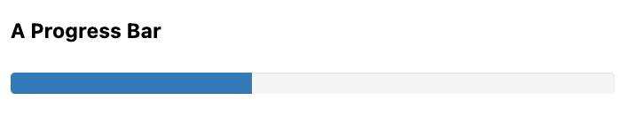

# Hipermeija kontekst 03

## 8 Dinamički korisnički interfejs preuzimanja arhive

### 8.1 Preuzimanje arhive

"Contact.app" je prešala dug put od tradicionalne veb aplikacije u stilu web 1.0: dodali smo aktivnu pretragu, grupno brisanje, neke lepe animacije i mnoštvo drugih funkcija. Dostigli smo nivo interaktivnosti za koji bi većina veb programera pretpostavila da zahteva neku vrstu okvira za jednostranične JavaScript aplikacije, ali mi smo to umesto toga uradili koristeći hipermediju zasnovanu na htmx-u.

Pogledajmo kako možemo dodati poslednju značajnu funkciju aplikaciji "Contact.app": "Preuzimanje arhive svih kontakata".

Iz hipermedijske perspektive, preuzimanje datoteke nije baš raketna nauka: koristeći HTTP `Content-Disposition` zaglavlje odgovora, lako možemo reći pregledaču da preuzme i sačuva datoteku na lokalni računar.

Međutim, učinimo ovaj problem zanimljivijim: dodajmo činjenicu da izvoz može potrajati malo vremena, od pet do deset sekundi, ili ponekad čak i duže.

To znači da ako bismo implementirali preuzimanje kao "normalan" HTTP zahtev, vođen linkom ili dugmetom, korisnik bi mogao da sedi sa vrlo malo vizuelne povratne informacije, pitajući se da li se preuzimanje zaista dešava, dok se izvoz završava. Možda bi čak i odustao u frustraciji i ponovo kliknuo na kontrolu za preuzimanje hipermedije, što bi izazvalo drugi zahtev za arhiviranje. Nije dobro.

Ovo se ispostavlja kao klasičan problem u razvoju veb aplikacija. Kada se suočimo sa potencijalno dugotrajnim procesom poput ovog, na kraju imamo dve opcije:

- Kada korisnik pokrene akciju, blokirajte je dok se ne završi, a zatim odgovorite rezultatom.

- Započnite akciju i odmah se vratite, prikazujući neku vrstu korisničkog interfejsa koji ukazuje da su stvari u toku.

Blokiranje i čekanje da se radnja završi je svakako jednostavniji način da se to reši, ali može biti loše korisničko iskustvo, posebno ako je potrebno neko vreme da se radnja završi. Ako ste ikada kliknuli na
nešto u aplikaciji u stilu veb 1.0, a zatim morali da sedite tamo ono što izgleda kao večnost pre nego što se bilo šta desi, videli ste praktične rezultate ovog izbora.

Druga opcija, pokretanje akcije asinhrono (recimo, kreiranjem niti ili njenim slanjem sistemu za pokretanje zadataka) je mnogo lepša sa stanovišta korisničkog iskustva: server može odmah da odgovori i korisnik ne mora da sedi tamo pitajući se šta se dešava.

Ali pitanje je, čime odgovarate ? Posao verovatno još nije završen, tako da ne možete dati vezu do rezultata.

Videli smo nekoliko različitih "jednostavnih" pristupa u ovom scenariju u raznim veb aplikacijama:

- Obavestite korisnika da je proces počeo i da će mu biti poslat imejl sa linkom do rezultata završenog procesa kada bude završen.

- Obavestite korisnika da je proces započet i preporučite mu da ručno osveži stranicu kako bi video status procesa.

- Obavestite korisnika da je proces započet i automatski osvežite stranicu svakih nekoliko sekundi koristeći JavaScript.

Sve ovo će funkcionisati, ali nijedno od toga nije odlično korisničko iskustvo.

Ono što bismo zaista želeli u ovom scenariju je nešto sličnije onome što vidite kada, na primer, preuzmete veliku datoteku preko pregledača: lepu traku napretka koja pokazuje gde se u procesu nalazite i, kada je proces završen, vezu na koju možete odmah kliknuti da biste videli rezultat procesa.

Ovo može zvučati kao nešto što je nemoguće implementirati pomoću hipermedija, i, iskreno, moraćemo prilično snažno da pokrenemo htmx da bi sve ovo funkcionisalo, ali kada se završi, neće biti toliko koda i moći ćemo da postignemo korisničko iskustvo koje želimo za ovu funkciju arhiviranja.

#### 8.1.1 Zahtevi za korisnički interfejs

Pre nego što se upustimo u implementaciju, hajde da u opštim crtama razmotrimo kako bi trebalo da izgleda naš novi korisnički interfejs: želimo dugme u aplikaciji sa oznakom "Preuzmi arhivu kontakata". Kada korisnik klikne na to dugme, želimo da ga zamenimo korisničkim interfejsom koji prikazuje napredak procesa arhiviranja, idealno sa trakom napretka. Kako zadatak arhiviranja napreduje, želimo da pomeramo traku napretka ka završetku. Zatim, kada je zadatak arhiviranja završen, želimo da korisniku prikažemo vezu za preuzimanje datoteke arhive kontakata.

Da bismo zapravo izvršili arhiviranje, koristićemo Pajton klasu, `Archiver`, koja implementira sve potrebne funkcionalnosti. Kao i kod `Contacts` klase, nećemo ulaziti u detalje implementacije `Archiver`, jer je to van okvira ove knjige. Za sada je potrebno samo da znate da ona pruža sva ponašanja na strani servera neophodno za pokretanje procesa arhiviranja kontakata i dobijanje rezultata kada se taj proces završi.

Archiver nam daje sledeće metode za rad:

- **status()** - String Niz koji predstavlja status preuzimanja, bilo Waiting, Running ili Complete.

- **progress()** - Broj između 0 i 1, koji pokazuje koliko je napredovao zadatak arhiviranja

- **run()** - Pokreće novi zadatak arhiviranja (ako je trenutni status Waiting)

- reset() - Otkazuje trenutni zadatak arhiviranja, ako postoji, i vraća se u stanje "Čekanje"

- **archive_file()** - Putanja do arhivske datoteke koja je kreirana na serveru, kako bismo je mogli poslati klijentu

- **get()** - Metod klase koji nam omogućava da dobijemo Arhiver za trenutnog korisnika

Prilično nekomplikovan API.

Jedini donekle komplikovan aspekt celog API-ja je taj što metod **run()** nije blokirajući. To znači da ne kreira odmah arhivsku datoteku, već pokreće pozadinski zadatak (kao nit) da bi izvršio stvarno arhiviranje. Ovo može biti zbunjujuće ako niste navikli na višenitni rad u kodu: možda očekujete da metoda **run()** "blokira", odnosno da zapravo izvrši ceo izvoz i vrati se tek kada se završi. Ali, ako bi to uradio, ne bismo mogli da pokrenemo proces arhiviranja i odmah prikažemo željeni korisnički interfejs koji prikazuje napredak arhiviranja.

#### 8.1.2 Početak naše implementacije

Sada imamo sve što nam je potrebno da počnemo sa implementacijom našeg korisničkog interfejsa: razumnu skicu kako će izgledati i logiku domena koja ga podržava.

Dakle, za početak, imajte na umu da je ovaj korisnički interfejs uglavnom samostalan: želimo da zamenimo dugme trakom napretka preuzimanja, a zatim traku napretka linkom za preuzimanje rezultata završenog procesa arhiviranja.

Činjenica da će naš arhivirani korisnički interfejs biti unutar određenog dela korisničkog interfejsa je jak nagoveštaj da ćemo želeti da kreiramo novi šablon za njegovu obradu. Nazovimo ovaj šablon "archive_ui.html".

Takođe imajte na umu da ćemo želeti da zamenimo ceo korisnički interfejs za preuzimanje u više slučajeva:

- Kada započnemo preuzimanje, želećemo da zamenimo dugme trakom napretka.

- Kako proces arhiviranja bude odvijao, želećemo da zamenimo/ažuriramo traku napretka.

- Kada se proces arhiviranja završi, želećemo da zamenimo traku napretka linkom za preuzimanje.

Da bismo ažurirali korisnički interfejs na ovaj način, potrebno je da postavimo dobru metu za ažuriranja. Dakle, hajde da umotamo ceo korisnički interfejs u `div` oznaku, a zatim je koristimo divkao metu za sve naše operacije.

Evo početka šablona za naš novi korisnički interfejs arhive:

```html
<div id="archive-ui"
  hx-target="this"        <1>
  hx-swap="outerHTML">    <2>
</div>
```

Kod - Naš početni šablon korisničkog interfejsa arhive

1. Ovaj div će biti cilj za sve elemente unutar njega.

2. Zamenite ceo `div` svaki put kada koristite `outerHTML`.

Zatim, dodajmo dugme "Preuzmi arhivu kontakata" koje će pokrenuti proces arhiviranja, a zatim preuzimanja. Koristićemo POST putanju "/contacts/archive" da bismo pokrenuli proces arhiviranja:

```html
<div id="archive-ui" hx-target="this" hx-swap="outerHTML">
  <button hx-post="/contacts/archive"> <1>
    Download Contact Archive
  </button>
</div>
```

Kod - Dodavanje dugmeta za arhiviranje

1. Ovo dugme će izdati POST do /contacts/archive.

Konačno, hajde da uključimo ovaj novi šablon u naš glavni "index.html" šablon, iznad tabele kontakata:

```html

   <1>
  <form action="/contacts" method="get" class="tool-bar">
```

Kod - Naš početni šablon korisničkog interfejsa arhive

1. Ovaj šablon će sada biti uključen u glavni šablon.

Kada je to završeno, sada imamo dugme koje se prikazuje u našoj veb aplikaciji za pokretanje preuzimanja. Pošto okruženje ima `div` sa `hx-target="this"` na sebi, dugme će naslediti taj cilj i zameniti to okruženje `div` bilo kojim HTML kodom koji se vrati iz POST do "/contacts/archive".

#### 8.1.3 Dodavanje krajnje tačke arhiviranja

Naš sledeći korak je obrada POST koju naše dugme pravi. Želimo da dobijemo Archiver za trenutnog korisnika i da pozovemo `run()` metodu na njemu. Ovo će pokrenuti proces arhiviranja. Zatim ćemo prikazati novi sadržaj koji ukazuje da je proces u toku.

Da bismo to uradili, želimo ponovo da koristimo "archive_ui" šablon za obradu renderovanja korisničkog interfejsa arhive za oba stanja, kada arhiver "Wait" i kada "Running". (Obradićemo stanje "Complete" uskoro).

Ovo je veoma uobičajen obrazac: sve različite potencijalne korisničke interfejse za dati deo korisničkog interfejsa stavljamo u jedan šablon i uslovno prikazujemo odgovarajući interfejs. Čuvanjem svega u jednoj datoteci, drugim programerima (ili nama, ako se vratimo posle nekog vremena!) je mnogo lakše da razumemo kako tačno korisnički interfejs funkcioniše na strani klijenta.

Pošto ćemo uslovno prikazivati različite korisničke interfejse na osnovu stanja arhivera, moraćemo da prosledimo arhiver šablonu kao parametar. Dakle, ponovo: potrebno je da pozovemo run() arhivera u
našem kontroleru, a zatim da ga prosledimo šablonu, kako bi mogao da prikaže korisnički interfejs na način koji odgovara trenutnom statusu procesa arhiviranja.

Evo kako izgleda kod:

```py
@app.route("/contacts/archive", methods=["POST"])                 <1>
def start_archive():
    archiver = Archiver.get()                                     <2>
    archiver.run()                                                <3>

    return render_template("archive_ui.html", archiver=archiver)  <4>
```

Kod - Na strani servera za pokretanje procesa arhiviranja

1. Hendler POST za "/contacts/archive".

2. Potražite Arhiver.

3. Pozovite neblokirajuću run() metodu na njemu.

4. Renderujte "archive_ui.html" šablon, prosledivši mu arhiver.

#### 8.1.4 Uslovno prikazivanje UI napretka

Sada ćemo usmeriti pažnju na ažuriranje našeg korisničkog interfejsa za arhiviranje podešavanjem "archive_ui.html" uslovnog prikazivanja različitog sadržaja u zavisnosti od stanja procesa arhiviranja.

Podsetimo se da arhivator ima `status()` metodu. Kada prosledimo arhiver kao promenljivu šablonu, možemo konsultovati ovu `status()` metodu da bismo videli status procesa arhiviranja.

Ako arhiver ima status `Waiting`, želimo da prikažemo dugme "Preuzmi arhivu kontakata". Ako je status `Running`, želimo da prikažemo poruku koja ukazuje da je izrada u toku. Hajde da ažuriramo naš kod šablona da bi to uradio:

```html
<div id="archive-ui" hx-target="this" hx-swap="outerHTML">
     <1>
  <button hx-post="/contacts/archive">
    Download Contact Archive
  </button>
   <2>
    Running...                              <3>
  
</div>
```

Kod - Dodavanje uslovnog renderovanja

1. Prikaži dugme za arhiviranje samo ako je status "Waiting".

2. Prikaži drugačiji sadržaj kada je status "Running".

3. Za sada, samo tekst koji kaže da je proces u toku.

U redu, odlično, imamo uslovnu logiku u našem prikazu šablona i logiku na strani servera koja podržava pokretanje procesa arhiviranja. Još uvek nemamo traku napretka, ali stići ćemo do nje! Da vidimo kako ovo funkcioniše u sadašnjem stanju i osvežimo glavnu stranicu naše aplikacije…

```html
UndefinedError
jinja2.exceptions.UndefinedError: 'archiver' is undefined
```

Kod - Nešto je pošlo po zlu

Auh!

Odmah dobijamo poruku o grešci. Zašto? Ah, uključujemo "archive_ui.html" u "index.html" šablon, ali sada "archive_ui.html" šablon očekuje da mu se prosledi arhiver, tako da može uslovno da prikaže ispravan korisnički interfejs.

To je jednostavno rešenje: samo treba da propustimo arhivator kada renderujemo šablon index.html:

```py
@app.route("/contacts")
def contacts():
    search = request.args.get("q")
    if search is not None:
        contacts_set = Contact.search(search)

    if request.headers.get('HX-Trigger') == 'search':
        return render_template("rows.html", contacts=contacts_set)
    else:
        contacts_set = Contact.all()
    return render_template("index.html", contacts=contacts_set, archiver=Archiver.get())  <1>
```

Kod - Uključivanje arhivera kada prikazujemo index.html

1. Prođite kroz arhivator do glavnog šablona

Sada kada je to završeno, možemo da učitamo stranicu. I, naravno, možemo videti dugme "Preuzmi arhivu kontakata".

Kada kliknemo na njega, dugme se zamenjuje sadržajem "Running…" i možemo videti u našoj razvojnoj konzoli na strani servera da se zadatak zaista pravilno pokreće.

#### 8.1.5 Anketiranje

To je definitivno napredak, ali ovde nemamo baš najbolji indikator napretka: samo neki statički tekst koji korisniku govori da je proces u toku.

Želimo da se sadržaj ažurira kako proces napreduje i, idealno, da se prikaže traka napretka koja pokazuje koliko je proces odmakao. Kako to možemo da uradimo u htmx-u koristeći običan hipermedijski format?

Tehnika koju ovde želimo da koristimo naziva se "anketiranje", gde izdajemo zahtev u određenom intervalu i ažuriramo korisnički interfejs na osnovu novog stanja servera.

---

> [!Note]
> **Anketiranje? Stvarno?**
>
> Anketiranje ima malo lošu reputaciju, to nije najseksi tehnika na svetu: danas programeri mogu da pogledaju napredniju tehniku kao što su WebSockets ili Server Sent Events (SSE) kako bi rešili ovu situaciju.
>
> Ali, recite šta hoćete, anketiranje funkcioniše i to je potpuno jednostavno. Morate biti oprezni da ne preplavite svoj sistem zahtevima za anketiranje, ali, uz malo pažnje, možete kreirati pouzdanu, pasivno ažuriranu komponentu u vašem korisničkom interfejsu koristeći je.

---

Htmx nudi dve vrste anketiranja:

- Prva je "anketiranje sa fiksnom brzinom", koje koristi posebnu `hx-trigger` sintaksu da bi naznačilo da nešto treba da se anketira u fiksnom intervalu.

  Evo jednog primera:
  
  ```html
  <div hx-get="/messages" hx-trigger="every 3s"> <1>
  </div>
  ```
  
  Kod - Fiksni interval anketiranja
  
  1. Pokreće se GET "/messages" svake tri sekunde.
  
  Ovo odlično funkcioniše u situacijama kada želite da anketirate neograničeno, na primer ako želite da stalno anketirate za nove poruke koje ćete prikazati korisniku. Međutim, anketiranje sa fiksnom brzinom nije idealno kada imate definitivan proces nakon kojeg želite da zaustavite anketiranje: anketiranje se nastavlja zauvek, sve dok se element na kojem se nalazi ne ukloni iz DOM-a.
  
  U našem slučaju, imamo definitivan proces sa završetkom. Dakle, biće bolje koristiti drugu tehniku anketiranja, poznatu kao:

- "Anketiranje učitavanja". Kod anketiranja učitavanja, koristimo činjenicu da htmx pokreće događaj `load` kada se sadržaj učita u DOM. Možemo kreirati okidač za ovaj `load` događaj i dodati malo kašnjenja tako da se zahtev ne pokrene odmah.

  Ovim možemo uslovno renderovati `hx-trigger` na svaki zahtev: kada se proces završi, jednostavno ne uključujemo `load` okidač i ispitivanje učitavanja se zaustavlja. Ovo nudi lep i jednostavan način za ispitivanje dok se određeni proces ne završi.

#### 8.1.6 Korišćenje anketiranja za ažuriranje  korisničkog interfejsa preuzimanja arhive

Koristićemo "load polling" da bismo ažurirali naš korisnički interfejs kako arhivar napreduje. Da bismo prikazali napredak, koristićemo traku napretka zasnovanu na CSS-u, koristeći metodu `progress()` koja vraća broj između 0 i 1 koji pokazuje koliko je proces arhiviranja blizu završetka.

Evo isečka HTML koda koji ćemo koristiti:

```html
<div class="progress">
<div class="progress-bar"
    style="width:{{ archiver.progress() * 100 }}%"></div> <1>
</div>
```

Kod - Traka napretka zasnovana na CSS-u

1. Širina unutrašnjeg elementa odgovara napretku.

Ova traka napretka zasnovana na CSS-u ima dve komponente: spoljašnji `div` koji pruža žičani okvir za traku napretka i unutrašnji `div` koji je stvarni indikator trake napretka. Širinu unutrašnje trake napretka postavljamo na neki procenat (imajte na umu da `progress()` rezultat treba da pomnožimo sa 100 da bismo dobili procenat) i to će učiniti da indikator napretka bude odgovarajuće širine unutar roditeljskog div-a.

---

> [!Note]
> **Šta je sa elementom?**
>
> Mi možda umačemo prste u "div supu" ovde, koristeći div oznaku kada postoji savršeno dobra HTML5 oznaka, element napretka, koji je dizajniran posebno za prikazivanje, pa, napretka.
>
> Odlučili smo da ne koristimo element napretka za ovaj primer jer želimo da se naša traka napretka glatko ažurira, a mi ćemo morati da koristimo CSS tehniku koja nije dostupna za element napretka da bi se to dogodilo. To je nesrećno, ali ponekad moramo da igramo sa kartama koje su nam podeljene.

Mi ćemo, međutim, koristiti odgovarajuće uloge trake napretka kako bi naša traka napretka zasnovana na div-u dobro igrala sa pomoćnim tehnologijama.

---

Hajde da ažuriramo našu traku napretka kako bismo imali odgovarajuće ARIA uloge i vrednosti:

```html
<div class="progress">
<div class="progress-bar"
    role="progressbar"                                        <1>
    aria-valuenow="{{ archiver.progress() * 100 }}"           <2>
    style="width:{{ archiver.progress() * 100 }}%"></div>
</div>
```

Kod - Traka napretka zasnovana na CSS-u

1. Ovaj element će služiti kao traka napretka

2. Napredak će biti procenat potpunosti arhivara, gde 100 označava potpuno završeno

Konačno, radi potpunosti, evo CSS-a koji ćemo koristiti za ovu traku napretka:

```css
.progress {
height: 20px;
margin-bottom: 20px;
overflow: hidden;
background-color: #f5f5f5;
border-radius: 4px;
box-shadow: inset 0 1px 2px rgba(0,0,0,.1);

}

.progress-bar {
float: left;
width: 0%;
height: 100%;
font-size: 12px;
line-height: 20px;
color: #fff;
text-align: center;
background-color: #337ab7;
box-shadow: inset 0 -1px 0 rgba(0,0,0,.15);
transition: width.6s ease;
}
```

Kod - CSS za našu traku napretka

Naša traka napretka zasnovana na CSS-u, kao što je implementirano u gornjem css-u.

  
Slika - Dodavanje korisničkog interfejsa trake napretka

Dodajmo kod za našu traku napretka u naš "archive_ui.html" šablon za slučaj kada je arhivator pokrenut i ažurirajmo kopiju da piše "Kreiranje arhive…":

Šta je sa elementom?

Mi možda umačemo prste u "div supu" ovde, koristeći div oznaku kada postoji savršeno dobra HTML5 oznaka, element napretka, koji je dizajniran posebno za prikazivanje, pa, napretka.

Odlučili smo da ne koristimo element napretka za ovaj primer jer želimo da se naša traka napretka glatko ažurira, a mi ćemo morati da koristimo CSS tehniku koja nije dostupna za element napretka da bi se to dogodilo. To je nesrećno, ali ponekad moramo da igramo sa kartama koje su nam podeljene.

Mi ćemo, međutim, koristiti odgovarajuće uloge trake napretka kako bi naša traka napretka zasnovana na div-u dobro igrala sa pomoćnim tehnologijama.

```html
<div id="archive-ui" hx-target="this" hx-swap="outerHTML">
  
  <button hx-post="/contacts/archive">
    Download Contact Archive
  </button>
  
  <div>
    Creating Archive...
    <div class="progress"> <1>
      <div class="progress-bar" role="progressbar"
        aria-valuenow="{{ archiver.progress() * 100}}"
        style="width:{{ archiver.progress() * 100 }}%"></div>
      </div>
    </div>
  
</div>
```

Kod - Dodavanje trake napretka

1. Naša nova sjajna traka napretka

Sada kada kliknemo na dugme "Preuzmi arhivu kontakata", dobijamo traku napretka. Ali ona se i dalje ne ažurira jer još nismo implementirali anketiranje učitavanja: samo stoji tu, na nuli.

Da bi se traka napretka dinamički ažurirala, moraćemo da implementiramo anketiranje učitavanja pomoću hx-trigger. Možemo ovo dodati skoro svakom elementu unutar uslovnog bloka za vreme kada je arhivator pokrenut, pa hajde da ga dodamo onome divšto se obavija oko teksta "Kreiranje arhive…" i trake napretka.

Hajde da izvršimo anketiranje izdavanjem HTTP zahteva GETna istu putanju kao i POST: "/contacts/archive".

```html
<div id="archive-ui" hx-target="this" hx-swap="outerHTML">
  
  <button hx-post="/contacts/archive">
    Download Contact Archive
  </button>
  
  <div hx-get="/contacts/archive" hx-trigger="load delay:500ms"> <1>
    Creating Archive...
    <div class="progress" >
      <div class="progress-bar" role="progressbar"
        aria-valuenow="{{ archiver.progress() * 100}}"
        style="width:{{ archiver.progress() * 100 }}%"></div>
      </div>
    </div>
  
  </div>
```

Kod - Implementacija anketiranja opterećenja

1. Izdaj GET do "/contacts/archive" 500 milisekundi nakon što se sadržaj učita.

Kada GETse ovo izda za "/contacts/archive", zameniće "div" sa id-jem "archive-ui", ne samo sebe. "hx-target" atribut na div sa id-jem "archive-ui" nasleđuju svi podređeni elementi unutar tog, tako da ćediv sva podređena elementa ciljati taj najudaljeniji div u "archive_ui.html" datoteci.

Sada treba da obradimo to GET na "/contacts/archive" serveru. Srećom, ovo je prilično jednostavno: sve što želimo da uradimo je da ponovo renderujemo "archive_ui.html" pomoću arhivera:

```py
@app.route("/contacts/archive", methods=["GET"]) <1>
def archive_status():
    archiver = Archiver.get()

    return render_template("archive_ui.html", archiver=archiver) <2>
```

Kod - Rukovanje ažuriranjima napretka

1. ručka GETza /contacts/archiveputanju

2. samo ponovo renderujte archive_ui.htmlšablon

Kao i mnogo toga drugog kod hipermedija, kod je veoma čitljiv i nije komplikovan.

Sada, kada kliknemo na "Preuzmi arhivu kontakata", dobijamo traku napretka koja se ažurira svakih 500 milisekundi. Kao rezultat poziva funkcije " archiver.progress()incrementally updates" od 0 do 1, traka napretka se pomera po ekranu. Veoma kul!

Preuzimanje rezultata

Imamo još jedno poslednje stanje koje treba da obradimo, slučaj kada archiver.status()je podešeno na "Complete" i postoji JSON arhiva podataka spremna za preuzimanje. Kada je arhiver završio, možemo da dobijemo lokalnu JSON datoteku na serveru od arhivera putem poziva `archive_file()`.

Dodajmo još jedan slučaj našoj if naredbi da bismo obrađivali stanje "Complete" i, kada se zadatak arhiviranja završi, prikažimo vezu do nove putanje, "/contacts/archive/file", koja će odgovoriti arhiviranom JSON datotekom. Evo novog koda:

```html
<div id="archive-ui" hx-target="this" hx-swap="outerHTML">
  
  <button hx-post="/contacts/archive">
    Download Contact Archive
  </button>
  
  <div hx-get="/contacts/archive" hx-trigger="load delay:500ms">
    Creating Archive...
  <div class="progress" >
    <div class="progress-bar" role="progressbar"
      aria-valuenow="{{ archiver.progress() * 100}}"
      style="width:{{ archiver.progress() * 100 }}%"></div>
    </div>
  </div>
                      <1>
  <a hx-boost="false" href="/contacts/archive/file">
    Archive Ready! Click here to download. &downarrow;
  </a>                                                          <2>
  
</div>
```

Kod- Prikazivanje linka za preuzimanje kada se arhiviranje završi

1. Ako je status "Complete", prikaži link za preuzimanje.

2. Link će izdati poruku GET za "/contacts/archive/file".

Imajte na umu da je link `hx-boost` podešen na `false`. Ovo je tako da link neće naslediti ponašanje boost-a koje je prisutno za druge linkove i stoga neće biti izdato putem AJAX-a. Želimo ovo "normalno" ponašanje linka jer AJAX zahtev ne može direktno da preuzme datoteku, dok obična oznaka sidra može.

#### 8.1.7 Preuzimanje završene arhive

Poslednji korak je obrada GET zahteva za "/contacts/archive/file". Želimo da pošaljemo datoteku koju je arhivator kreirao klijentu. Imamo sreće: Flask ima mehanizam za slanje datoteke kao preuzetog odgovora, metodu `send_file()`.

Kao što vidite u kodu koji sledi, prosleđujemo tri argumenta `send_file()`:

- putanju do arhivske datoteke koju je arhivator kreirao,

- ime datoteke koju želimo da pregledač kreira i

- da li želimo da se pošalje "kao prilog".

Ovaj poslednji argument govori Flasku da postavi HTTP zaglavlje odgovora `Content-Disposition` na attachment dato ime datoteke; to je ono što pokreće ponašanje pregledača pri preuzimanju datoteka.

```py
@app.route("/contacts/archive/file", methods=["GET"])
def archive_content():
    manager = Archiver.get()
    
    return send_file(
        manager.archive_file(), "archive.json", as_attachment=True) <1>
```

Kod - Slanje datoteke klijentu

1. Pošaljite datoteku klijentu putem Flask-ove send_file()metode.

Savršeno. Sada imamo veoma elegantan korisnički interfejs za arhiviranje. Kliknite na dugme "Preuzmi arhivu kontakata" i pojavljuje se traka napretka. Kada traka napretka dostigne 100%, ona nestaje i pojavljuje se veza za preuzimanje arhivske datoteke. Korisnik zatim može kliknuti na tu vezu i preuzeti svoju arhivu.

Nudimo korisničko iskustvo koje je mnogo jednostavnije za korišćenje od uobičajenog iskustva "klikni i čekaj" na mnogim veb-sajtovima.

#### 8.1.8 Uglađivanje stvari: Animacije u Htmx-u

Koliko god da je ovaj korisnički interfejs lep, postoji jedna mala smetnja: kako se traka napretka ažurira, ona "skače" sa jedne pozicije na drugu. Ovo se pomalo oseća kao potpuno osvežavanje stranice u aplikacijama stila web 1.0. Da li postoji način da ovo popravimo? (Očigledno postoji, zato smo se odlučili za divumesto progresselementa !)

Hajde da prođemo kroz uzrok ovog vizuelnog problema i kako bismo ga mogli rešiti. (Ako žurite da pronađete odgovor, slobodno pređite na "naše rešenje".)

Ispostavlja se da postoji nativna HTML tehnologija za ublažavanje promena na elementu iz jednog stanja u drugo: CSS Transitions API, isti onaj o kome smo govorili u 4. poglavlju. Koristeći CSS Transitions,
možete glatko animirati element između različitih stilova koristeći svojstvo transition.

Ako pogledate našu CSS definiciju klase.progress-bar, videćete sledeću definiciju prelaza:. transition: width.6s ease;To znači da kada se širina trake napretka promeni sa, recimo, 20% na 30%, pregledač će
animirati tokom perioda od 0,6 sekundi koristeći funkciju "ease" (koja ima lep efekat ubrzavanja/ usporavanja).

Pa zašto se ta tranzicija ne primenjuje u našem trenutnom korisničkom interfejsu? Razlog je taj što u našem primeru htmx zamenjuje traku napretka novom svaki put kada vrši anketu. Ne ažurira širinu
postojećeg elementa. CSS tranzicije, nažalost, primenjuju se samo kada se svojstva postojećeg elementa promene u tekstu, a ne kada se element zameni.

To je razlog zašto aplikacije zasnovane na čistom HTML-u mogu delovati trzavo i neuglađeno u poređenju sa svojim SPA pandanima: teško je koristiti CSS prelaze bez JavaScript-a.

Ali postoje i dobre vesti: htmx ima način da koristi CSS prelaze čak i kada zamenjuje sadržaj u DOM-u.

#### 8.1.9 Korak "smirivanja" u Htmx-u

Kada smo u 4. poglavlju razmatrali model zamene htmx, fokusirali smo se na klase koje htmx dodaje i uklanja, ali smo preskočili proces "postavljanja". U htmx-u, postavljanje uključuje nekoliko koraka: kada
htmx treba da zameni deo sadržaja, on pregleda novi sadržaj i pronalazi sve elemente sa id. Zatim u postojećem sadržaju traži elemente sa istim id.

Ako postoji jedan, on vrši sledeće, donekle složeno mešanje:

- Novi sadržaj privremeno dobija atribute starog sadržaja.

- Novi sadržaj je umetnut.

- Nakon kratkog kašnjenja, atributi novog sadržaja su vraćeni na stvarne vrednosti.

Pa, šta se ovim čudnim malim plesom treba postići?

Pa, ako element ima stabilan identifikator između zamena, sada možete pisati CSS prelaze između različitih stanja. Pošto novi sadržaj nakratko ima stare atribute, normalan CSS mehanizam prelaska će se aktivirati kada se stvarne vrednosti vrate.

#### 8.1.10 Naše rešenje za izglađivanje

Dakle, stižemo do našeg rešenja.

Sve što treba da uradimo je da dodamo stabilan ID našem progress-bar elementu.

```html
<div class="progress" >
<div id="archive-progress" class="progress-bar" role="progressbar"
    aria-valuenow="{{ archiver.progress() * 100 }}"
    style="width:{{ archiver.progress() * 100 }}%"></div> <1>
</div>
```

Kod - Sređivanje stvari

1. Div trake napretka sada ima stabilan ID u svim zahtevima.

Uprkos komplikovanim mehanizmima koji se odvijaju iza kulisa u htmx-u, rešenje je jednostavno kao dodavanje idatributa stable elementu koji želimo da animiramo.

Sada, umesto da skače na svako ažuriranje, traka napretka bi trebalo glatko da se kreće po ekranu dok se ažurira, koristeći CSS tranziciju definisanu u našem stilskom listu. Model zamene htmx-a nam omogućava da ovo postignemo čak i ako zamenjujemo sadržaj novim HTML-om.

I vuala: imamo lepu, glatko animiranu traku napretka za našu funkciju arhiviranja kontakata. Rezultat ima izgled i osećaj rešenja zasnovanog na JavaSkriptu, ali smo to uradili jednostavnošću pristupa zasnovanog na HTML-u.

E to, dragi čitaoče, zaista budi radost.

#### 8.1.11 Zatvaranje korisničkog interfejsa za preuzimanje

Neki korisnici mogu promeniti mišljenje i odlučiti da ne preuzimaju arhivu. Možda nikada neće videti našu slavnu traku napretka, ali to je u redu. Daćemo ovim korisnicima dugme za odbacivanje veze za preuzimanje i vraćanje u originalno stanje korisničkog interfejsa za izvoz.

Da bismo to uradili, dodaćemo dugme koje izdaje oznaku DELETEputanji /contacts/archive, što ukazuje da se trenutna arhiva može ukloniti ili očistiti.

Dodaćemo ga nakon linka za preuzimanje, ovako:

```html
<a hx-boost="false" href="/contacts/archive/file">
  Archive Ready! Click here to download. &downarrow;</a>
<button hx-delete="/contacts/archive">Clear Download</button> <1>
```

Kod - Brisanje preuzimanja

1. Jednostavno dugme koje izdaje odredbu DELETEza /contacts/archive.

Sada korisnik ima dugme na koje može da klikne da bi zatvorio link za preuzimanje arhive. Ali moraćemo da ga povežemo na strani servera. Kao i obično, ovo je prilično jednostavno: kreiramo novi rukovalac za
DELETEHTTP akciju, pozivamo reset()metodu na arhivatoru i ponovo prikazujemo archive_ui.htmlšablon.

Pošto ovo dugme prima istu `hx-target` konfiguraciju `hx-swap` kao i sve ostalo, ono "jednostavno radi".

Evo koda na strani servera:

```py
@app.route("/contacts/archive", methods=["DELETE"])
def reset_archive():
    archiver = Archiver.get()
    archiver.reset() <1>

    return render_template("archive_ui.html", archiver=archiver)
```

Kod - Rukovalac za resetovanje preuzimanja

1. Pozovite reset()arhivara

Ovo izgleda prilično slično našim drugim rukovaocima, zar ne?

Naravno! To je ideja!

#### 8.1.12 Alternativno korisničko iskustvo: Automatsko preuzimanje

Iako preferiramo trenutno korisničko iskustvo za arhiviranje kontakata, postoje i druge alternative. Trenutno, traka napretka prikazuje napredak procesa i, kada se završi, korisniku se prikazuje link za preuzimanje datoteke. Još jedan obrazac koji vidimo na vebu je "automatsko preuzimanje", gde se datoteka preuzima odmah bez potrebe da korisnik klikne na link.

Ovu funkcionalnost možemo prilično lako dodati našoj aplikaciji uz samo malo skriptovanja. Detaljnije ćemo razmotriti skriptovanje u aplikaciji vođenoj hipermedijom u 9. poglavlju, ali, ukratko: skriptovanje je sasvim prihvatljivo u HDA, sve dok ne zamenjuje osnovnu mehaniku hipermedije aplikacije.

Za našu funkciju automatskog preuzimanja koristićemo _hyperscript, našu preferiranu opciju skriptovanja. JavaScript bi takođe ovde funkcionisao i bio bi gotovo jednako jednostavan; ponovo ćemo detaljno razmotriti opcije skriptovanja u 9. poglavlju.

Sve što treba da uradimo da bismo implementirali funkciju automatskog preuzimanja je sledeće: kada se link za preuzimanje prikaže, automatski kliknemo na link za korisnika.

Kod _hyperscript se čita gotovo isto kao i prethodna rečenica (što je glavni razlog zašto volimo hiperskript):

```html
<a hx-boost="false" href="/contacts/archive/file"
  _="on load click() me"> <1>
  Archive Downloading! Click here if the download does not start.
</a>
```

Kod - Automatsko preuzimanje

1. Malo _hiperskripta da bi se datoteka automatski preuzela.

Ključno je da skriptovanje ovde jednostavno poboljšava postojeću hipermediju, umesto da je zamenjuje zahtevom koji nije hipermedijski. Ovo je skriptovanje prilagođeno hipermediji, što ćemo detaljnije objasniti uskoro.

#### 8.1.13. Rezime o dinamički arhivski korisnički interfejs

U ovom poglavlju smo uspeli da kreiramo dinamički korisnički interfejs za našu funkcionalnost arhiviranja kontakata, sa trakom napretka i automatskim preuzimanjem, i skoro sve smo uradili — sa izuzetkom malog dela skriptovanja za automatsko preuzimanje — u čistoj hipermediji. Bilo je potrebno oko 16 linija prednjeg koda i 16 linija bekend koda da bi se cela stvar izgradila.

HTML, uz malo pomoći hipermedijske JavaScript biblioteke kao što je htmx, zapravo može biti izuzetno moćan i ekspresivan.

## 9 Trikovi Htmx majstora

U ovom poglavlju ćemo detaljnije razmotriti htmx alate. Dosta smo postigli sa onim što smo do sada naučili. Ipak, kada razvijate aplikacije zasnovane na hipermediji, biće trenutaka kada ćete morati da posegnete za dodatnim opcijama i tehnikama.

- Proći ćemo kroz naprednije atribute u htmx-u, kao i proširiti napredne detalje atributa koje smo već koristili.

- Pored toga, pogledaćemo funkcionalnosti koje htmx nudi izvan jednostavnih HTML atributa: kako htmx proširuje standardne HTTP zahteve i odgovore, kako htmx radi sa (i proizvodi) događajima i kako pristupiti situacijama gde ne postoji jednostavan, jedinstveni cilj na stranici koji treba ažurirati.

- Na kraju, pogledaćemo praktična razmatranja prilikom razvoja htmx-a: kako efikasno otklanjati greške u aplikacijama zasnovanim na htmx-u, bezbednosna razmatranja koja treba uzeti u obzir prilikom rada sa htmx-om i kako konfigurisati ponašanje htmx-a.

Sa karakteristikama i tehnikama u ovom poglavlju, moći ćete da kreirate izuzetno sofisticirane korisničke interfejse koristeći samo htmx i možda malo hipermedijskog skriptovanja na strani klijenta.

### 9.1 Htmx atributi

Do sada smo u našoj aplikaciji koristili oko petnaest različitih atributa iz htmx-a. Najvažniji su bili:

- **hx-get**, **hx-post**, itd.
  Da bi se odredio AJAX zahtev koji element treba da napravi

- **hx-trigger**
  Da biste naveli događaj koji pokreće zahtev

- **hx-swap**
  Da biste odredili kako da zamenite vraćeni HTML sadržaj u DOM

- **hx-target**
  Da biste naveli gde u DOM-u treba zameniti vraćenim HTML sadržajem

Dva od ovih atributa, **hx-swap** i **hx-trigger**, podržavaju brojne korisne opcije za kreiranje naprednijih aplikacija vođenih hipermedijom.

- **hx-swap**  
  Počećemo sa `hx-swap` atributom. Ovaj atribut često nije uključen u elemente koji izdaju zahteve vođene htmx-om jer njegovo podrazumevano ponašanje — `innerHTML`, koje zamenjuje unutrašnji HTML elementa — obično pokriva većinu slučajeva upotrebe.

  Ranije smo videli situacije u kojima smo želeli da poništimo podrazumevano ponašanje i koristimo `outerHTML`, na primer. u 2. poglavlju smo razgovarali o nekim drugim opcijama zamene pored ove dve, `beforebegin`, `afterend`, itd.
  
  U 5. poglavlju smo takođe razmotrili `swap` modifikator kašnjenja za `hx-swap`, koji nam je omogućio da postepeno sakrijemo neki sadržaj pre nego što bude uklonjen iz DOM-a.
  
  Pored ovoga, `hx-swap` nudi dodatnu kontrolu sa sledećim modifikatorima:

  - **settle**  
    Kao i swap, ovo vam omogućava da primenite određeno kašnjenje između trenutka kada je sadržaj zamenjen u DOM i trenutka kada su njegovi atributi "postavljeni", odnosno ažurirani sa svojih starih vrednosti (ako ih ima) na svoje nove vrednosti. Ovo vam može dati preciznu kontrolu nad CSS prelazima.

  - **show**  
    Omogućava vam da odredite element koji treba da se prikaže — to jest, da se pomeri u prikaz pregledača ako je potrebno — kada se zahtev završi.

  - **scroll**  
    Omogućava vam da odredite element koji se može skrolovati (tj. element sa trakama za skrolovanje), koji treba da se skroluje na vrh ili dno kada se zahtev završi.

  - **focus-scroll**  
    Omogućava vam da navedete da htmx treba da se pomeri do fokusiranog elementa kada se zahtev završi. Podrazumevana vrednost za ovaj modifikator je "false".

    Na primer, ako bismo imali dugme koje izdaje GET zahtev i želeli bismo da skrolujemo do vrha elementa body kada se zahtev završi, napisali bismo sledeći HTML kod:

    ```html
    <button hx-get="/contacts" hx-target="#content-div"
      hx-swap="innerHTML show:body:top">                <1>
        Get Contacts
    </button>
    ```

    Kod - Pomeranje do vrha stranice

    1. Ovo govori htmx-u da prikaže vrh tela nakon što se zamena desi.

    Više detalja i primera možete pronaći na mreži u `hx-swap` dokumentaciji.

- **hx-triger**  
  Kao `hx-swap`, `hx-trigger` često se može izostaviti kada koristite htmx, jer je podrazumevano ponašanje obično ono što želite. Podsetimo se da su podrazumevani okidači određeni tipom elementa:
  
  - Zahtevi za elemente `input`, `textarea` & `select` se pokreću događajem `change`.
  
  - Zahtevi za `form` elemente se pokreću na `submit` događaju.
  
  - Zahtevi za sve ostale elemente se pokreću događajem `click`.
  
  Međutim, postoje slučajevi kada želite detaljniju specifikaciju okidača. Klasičan primer je primer aktivne pretrage koji smo implementirali u "Contact.app":
  
  ```html
  <input id="search" type="search" name="q"
    value="{{ request.args.get('q') or '' }}"
    hx-get="/contacts"
    hx-trigger="search, keyup delay:200ms changed"/> <1>
  ```
  
  Aktivni unos za pretragu
  
  1. Razrađena specifikacija okidača.
  
  Ovaj primer je iskoristio dva modifikatora dostupna za `hx-trigger` atribut:

  - **delay**  
    Omogućava vam da odredite odlaganje pre nego što se zahtev izda. Ako se događaj ponovo desi, prvi događaj se odbacuje i tajmer se resetuje. Ovo vam omogućava da "odbijete" zahteve.

  - **changed**  
    Omogućava vam da navedete da zahtev treba izdati samo kada se promeni `value` svojstvo datog elementa.

    `hx-trigger` ima nekoliko dodatnih modifikatora. To je logično, jer su događaji prilično složeni i želimo da budemo u mogućnosti da iskoristimo svu moć koju nude. O događajima ćemo detaljnije govoriti u nastavku.

  Evo ostalih modifikatora dostupnih na hx-trigger:

  - **once**  
    Dati događaj će pokrenuti zahtev samo jednom.

  - **throttle**  
    Omogućava vam da ograničite događaje, izdavajući ih samo jednom u određenom intervalu. Ovo se razlikuje od `delay` po tome što će se prvi događaj pokrenuti odmah, ali se svi naredni događaji neće pokrenuti dok ne istekne vremenski period ograničenja.

  - **from**  
    CSS selektor koji vam omogućava da izaberete drugi element za praćenje događaja. Primer ove upotrebe videćemo kasnije u poglavlju.

  - **target**  
    CSS selektor koji vam omogućava da filtrirate događaje samo na one koji se dešavaju direktno na datom elementu. U DOM-u, događaji se "prenose" na svoje prethodne elemente, tako da će `click` događaj na dugmetu takođe pokrenuti na okružujućem elementu `div`, sve do elementa `body`. Ponekad želite da odredite događaj direktno na datom elementu, a ovaj atribut vam to omogućava.

  - **consume**  
    Ako je ova opcija podešena na `true`, okidajući događaj će biti otkazan i neće se proširiti na elemente pretka.

  - **queue**  
    Ova opcija vam omogućava da odredite kako se događaji stavljaju u red čekanja u htmx-u. Podrazumevano, kada htmx primi okidajući događaj, izdaće zahtev i pokrenuti red čekanja za događaje. Ako je zahtev još uvek u toku kada se primi drugi događaj, staviće događaj u red čekanja i, kada se zahtev završi, pokrenuće novi zahtev. Podrazumevano, zadržava samo poslednji događaj koji primi, ali možete izmeniti to ponašanje pomoću ove opcije: na primer, možete je podesiti na `none` i ignorisati sve okidajuće događaje koji se dogode tokom zahteva.

### 9.2 Filteri `hx-triger`-a

Atribut `hx-trigger` vam takođe omogućava da odredite filter za događaje korišćenjem uglastih zagrada koje okružuju JavaScript izraz nakon imena događaja.

Recimo da imate složenu situaciju gde kontakti treba da budu dostupni samo u određenim situacijama. Imate JavaScript funkciju "contactRetrievalEnabled()" koja vraća bulovsku vrednost, `true` ako se kontakti mogu preuzeti, a `false` ako se ne mogu. Kako biste mogli da koristite ovu funkciju da postavite kapiju na dugme koje izdaje zahtev za "/contacts"?

Da biste ovo uradili koristeći filter događaja u htmx-u, napisali biste sledeći HTML:

```html
<script>
  function contactRetrievalEnabled() {
  // code to test if contact retrieval is enabled
  ...
}
</script>

<button hx-get="/contacts"
  hx-trigger="click[contactRetrievalEnabled()]"> <1>
    Get Contacts
</button>
```

Kod - Aktivni unos za pretragu

1. Zahtev se izdaje klikom samo kada contactRetrievalEnabled() se vrati true.

Dugme neće izdati zahtev ako `contactRetrievalEnabled()` vrati vrednost `false`, što vam omogućava da dinamički kontrolišete kada će zahtev biti podnet. Postoje uobičajene situacije koje zahtevaju okidač događaja, kada želite da izdate zahtev samo pod određenim okolnostima:

- ako određeni element ima fokus

- ako je dati obrazac validan

- ako skup ulaza ima određene vrednosti

Koristeći filtere događaja, možete koristiti bilo koju logiku koju želite da filtrirate zahteve po htmx-u.

### 9.3 Sintetički događaji

Pored ovih modifikatora, `hx-trigger` nudi nekoliko "sintetičkih" događaja, odnosno događaja koji nisu deo redovnog DOM API-ja. Već smo videli `load` i `revealed` u našim primerima lenjeg učitavanja i beskonačnog skrolovanja, ali htmx vam takođe daje `intersect` događaj koji se pokreće kada element preseče svoj prikazni okvir.

Ovaj sintetički događaj koristi moderni `Intersection Observer API`, o kome možete više pročitati na MDN-u.

`Intersect` vam daje preciznu kontrolu nad tačnim vremenom kada zahtev treba da se pokrene. Na primer, možete postaviti prag i navesti da se zahtev izda samo kada je element vidljiv 50%.

Atribut `hx-trigger` je svakako najsloženiji u htmx-u. Više detalja i primera možete pronaći u njegovoj dokumentaciji.

### 9.4 Ostali atributi

Htmx nudi mnoge druge manje uobičajene atribute za fino podešavanje ponašanja vaše aplikacije vođene hipermedijom.

Evo nekih od najkorisnijih:

- **hx-push-url**
  "Gura" URL zahteva (ili neku drugu vrednost) u navigacionu traku.

- **hx-preserve**
  Čuva deo DOM-a između zahteva; originalni sadržaj će biti sačuvan, bez obzira na to šta se vraća.

- **hx-sinhronizacija**
  Sinhronizovani zahtevi između dva ili više elemenata.

- **hx-disable**
  Onemogućava ponašanje htmx-a na ovom elementu i svim njegovim podređenim elementima. Vratićemo se na ovo kada budemo razgovarali o temi bezbednosti.

Hajde da pogledamo `hx-sync`, što nam omogućava da sinhronizujemo AJAX zahteve između dva ili više elemenata. Razmotrimo jednostavan slučaj gde imamo dva dugmeta koja oba ciljaju isti element na ekranu:

```html
<button hx-get="/contacts" hx-target="body">
  Get Contacts
</button>
<button hx-get="/settings" hx-target="body">
  Get Settings
</button>
```

Kod - Dva konkurentska dugmeta

Ovo je u redu i funkcionisaće, ali šta ako korisnik klikne na dugme "Preuzmi kontakte", a zatim je potrebno neko vreme da odgovori na zahtev? A u međuvremenu korisnik klikne na dugme "Preuzmi podešavanja"? U ovom slučaju bismo imali dva zahteva u isto vreme.

Ako se "/settings" zahtev prvo završi i prikaže informacije o podešavanjima korisnika, korisnik bi mogao biti veoma iznenađen ako počne da pravi izmene, a onda se, iznenada, "/contacts" zahtev završi i zameni ceo `body` kontaktima!

Da bismo se nosili sa ovom situacijom, mogli bismo razmotriti korišćenje `hx-indicator` da bismo upozorili korisnika da se nešto dešava, čime bismo smanjili verovatnoću da će kliknuti na drugo dugme. Ali ako zaista želimo da garantujemo da će se između ova dva dugmeta istovremeno izdati samo jedan zahtev, ispravno je koristiti `hx-sync` atribut. Hajde da zatvorimo oba dugmeta u `div` i eliminišemo suvišnu `hx-target` specifikaciju podizanjem atributa do `div`. Zatim možemo koristiti `hx-sync` na taj div da bismo koordinirali zahteve između dva dugmeta.

Evo našeg ažuriranog koda:

```html
<div hx-target="body"         <1>
  hx-sync="this">             <2>
<button hx-get="/contacts">
    Get Contacts
</button>
<button hx-get="/settings">
    Get Settings
</button>
</div>
```

Kod - Sinhronizacija dva dugmeta

1. Prebacite duplikate `hx-target` atributa na roditelja `div`.

2. Sinhronizuj na roditeljskom uređaju `div`.

Postavljanjem `hx-sync` atributa na `div` sa vrednošću `this`, kažemo "Sinhronizujte sve htmx zahteve koji se javljaju unutar ovog divelementa jedni sa drugima." To znači da ako jedno dugme već ima zahtev u obradi, druga dugmad unutar `div` neće izdavati zahteve dok se to ne završi.

Atribut `hx-sync` podržava nekoliko različitih strategija koje vam omogućavaju, na primer, da zamenite postojeći zahtev koji je u toku ili da stavite zahteve u red čekanja određenom strategijom čekanja. Kompletnu dokumentaciju, kao i primere, možete pronaći na stranici htmx.org za `hx-sync`.

Kao što vidite, htmx nudi mnogo funkcionalnosti zasnovanih na atributima za naprednije aplikacije zasnovane na hipermediji. Kompletan pregled svih htmx atributa možete pronaći na veb-sajtu htmx.

### 9.6 Događaji

Do sada smo radili sa JavaScript događajima u htmx-u prvenstveno preko `hx-trigger` atributa. Ovaj atribut se pokazao kao moćan mehanizam za pokretanje naše aplikacije koristeći deklarativnu, HTML-prijateljsku sintaksu.

Međutim, postoji mnogo više što možemo da uradimo sa događajima. Događaji igraju ključnu ulogu kako u proširenju HTML-a kao hipermedije, tako i, kao što ćemo videti, u skriptovanju prilagođenom hipermedijima. Događaji su "lepak" koji povezuje DOM, HTML, htmx i skriptovanje. Možda biste DOM smatrali sofisticiranom "magistralom događaja" za aplikacije.

Ne možemo dovoljno naglasiti: da bi se izgradile napredne aplikacije vođene hipermedijom, vredi se truditi da se događaji detaljno prouče.

#### 9.6.1 Događaji generisani HTMX-om

Pored toga što olakšava reagovanje na događaje, htmx takođe emituje mnoge korisne događaje. Možete koristiti ove događaje da dodate više funkcionalnosti svojoj aplikaciji, bilo putem samog htmx-a ili putem skriptovanja.

Evo nekih od najčešće korišćenih događaja koje pokreće htmx:

- **htmx:load**
  Pokreće se kada se novi sadržaj učita u DOM pomoću htmx-a.

- **htmx:configRequest**
  Pokreće se pre nego što se zahtev izda, što vam omogućava da programski konfigurišete zahtev ili ga potpuno otkažete.

- **htmx:afterRequest**
  Pokreće se nakon odgovora na zahtev.

- **htmx:abort**
  Prilagođeni događaj koji se može poslati elementu koji pokreće htmx da bi se prekinuo zahtev za otvaranje.

#### 9.6.2 Korišćenje događaja htmx:configRequest

Pogledajmo primer kako se radi sa događajima koje emituje htmx. Koristićemo htmx:configRequestdogađaj za konfigurisanje HTTP zahteva.

Razmotrite sledeći scenario: vaš tim na strani servera je odlučio da žele da uključite token generisan od strane servera radi dodatne bezbednosti u svaki zahtev. Token će biti sačuvan u localStoragepregledaču, u slotu special-token.

Token se podešava putem nekog Javaskripta (ne brinite još o detaljima) kada se korisnik prvi put prijavi:

```js
let response = await fetch("/token");                   <1>
localStorage['special-token'] = await response.text();
```

Kod - Dobijanje tokena u JavaSkriptu

1. Dobijte vrednost tokena, a zatim je postavite u localStorage

Tim na strani servera želi da uključite ovaj poseban token u svaki zahtev koji napravi htmx, kao `X-SPECIAL-TOKEN` zaglavlje. Kako biste to mogli postići? Jedan od načina bi bio da uhvatite `htmx:configRequest` događaj i ažurirate `detail.headers` objekat ovim tokenom iz `localStorage`.

U VanillaJS-u, to bi izgledalo otprilike ovako, postavljeno u `<script>` oznaku u `<head>` našem HTML dokumentu:

```js
document.body.addEventListener("htmx:configRequest", configEvent => {
  configEvent.detail.headers['X-SPECIAL-TOKEN'] =                       <1>
    localStorage['special-token'];
})
```

Kod - Dodavanje X-SPECIAL-TOKEN zaglavlja

1. Preuzmite vrednost iz lokalne memorije i postavite je u zaglavlje.

Kao što vidite, dodajemo novu vrednost svojstvu headersdetail događaja. Nakon što se izvrši obrađivač događaja, headershtmx čita ovo svojstvo i koristi ga za konstruisanje zaglavlja zahteva za AJAX zahtev koji pravi.

Svojstvo detaildogađaja htmx:configRequestsadrži mnoštvo korisnih svojstava koja možete ažurirati da biste promenili "oblik" zahteva, uključujući:

- **detail.parameters**
  Omogućava vam da dodate ili uklonite parametre zahteva

- **detail.target**
  Omogućava vam da ažurirate cilj zahteva

- **detail.verb**
  Omogućava vam da ažurirate HTTP "glagol" zahteva (npr. GET)

Na primer, ako je tim na strani servera odlučio da želi da token bude uključen kao parametar, a ne kao zaglavlje zahteva, mogli biste ažurirati svoj kod da izgleda ovako:

```js
document.body.addEventListener("htmx:configRequest", configEvent => {
    configEvent.detail.parameters['token'] = <1>
      localStorage['special-token'];
})
```

kod - Dodavanje token parametra

1. Preuzmite vrednost iz lokalne memorije i postavite je u parametar.

Kao što vidite, ovo vam daje veliku fleksibilnost u ažuriranju AJAX zahteva koji htmx pravi.

Kompletna dokumentacija za `htmx:configRequest` događaj (i druge događaje koji bi vas mogli zanimati) može se naći na veb stranici htmx.

#### 9.6.3 Otkazivanje zahteva pomoću komande htmx:abort

Možemo da osluškujemo bilo koji od mnogih korisnih događaja iz htmx-a i možemo da odgovorimo na te događaje koristeći hx-trigger. Šta još možemo da uradimo sa događajima?

Ispostavlja se da sam htmx osluškuje jedan poseban događaj, htmx:abort. Kada htmx primi ovaj događaj na elementu koji ima zahtev u obradi, prekinuće zahtev.

Razmotrimo situaciju u kojoj imamo potencijalno dugotrajan zahtev ka /contactsi želimo da ponudimo način korisnicima da otkažu zahtev. Ono što želimo je dugme koje izdaje zahtev, naravno vođeno pomoću htmx-a, a zatim još jedno dugme koje će poslati događaj htmx:abortprvom.

Evo kako bi kod mogao da izgleda:

```html
<button id="contacts-btn" hx-get="/contacts" hx-target="body"> <1>
  Get Contacts
</button>
<button
  onclick="
    document.getElementById('contacts-btn')
     .dispatchEvent(new Event('htmx:abort')) <2>
  ">
  Cancel
</button>
```

Kod - Dugme abort

1. Normalan GET zahtev vođen htmx-om za/contacts

2. Javaskript za pretraživanje dugmeta i slanje `htmx:abort` događaja

Dakle, ako korisnik klikne na dugme "Preuzmi kontakte" i zahtev potraje neko vreme, može da klikne na dugme "Otkaži" i završi zahtev. Naravno, u sofisticiranijem korisničkom interfejsu, možda ćete želeti da onemogućite dugme "Otkaži" osim ako nije u toku HTTP zahtev, ali to bi bilo mučno implementirati u čistom JavaSkriptu.

Srećom, ovo nije tako loše implementirati u hiperskriptu, pa hajde da pogledamo kako bi to izgledalo:

```html
<button id="contacts-btn" hx-get="/contacts" hx-target="body">
  Get Contacts
</button>
<button
  _="on click send htmx:abort to #contacts-btn
    on htmx:beforeRequest from #contacts-btn remove @disabled from me
    on htmx:afterRequest from #contacts-btn add @disabled to me">
  Cancel
</button>
```

Kod - Dugme sa hiperskriptom i prekidom

Sada imamo dugme "Cancel" koje je omogućeno samo kada je zahtev sa `contacts-btn` dugmeta u toku. I koristimo prednosti događaja generisanih i obrađenih u htmx-u, kao i sintaksu hiperskripta prilagođenu događajima, da bismo to omogućili. Odlično!

### 9.7 Događaji generisani serverom

U sledećem odeljku ćemo više govoriti o različitim načinima na koje htmx poboljšava redovne HTTP zahteve i odgovore, ali, pošto uključuje događaje, razmotrićemo jedan HTTP zaglavlje odgovora koje htmx podržava:. HX-TriggerVeć smo ranije razgovarali o tome kako HTTP zahtevi i odgovori podržavaju zaglavlja, parove ime-vrednost koji sadrže metapodatke o datom zahtevu ili odgovoru. Iskoristili smo HX-Triggerzaglavlje zahteva, koje uključuje ID elementa koji je pokrenuo dati zahtev.

Pored ovog zaglavlja zahteva, htmx takođe podržava zaglavlje odgovora, takođe pod nazivom HX-Trigger. Ovo zaglavlje odgovora vam omogućava da pokrenete događaj na elementu koji je poslao AJAX zahtev. Ovo se ispostavlja kao moćan način za koordinisanje elemenata u DOM-u na razdvojeni način.

Da bismo videli kako bi ovo moglo da funkcioniše, razmotrimo sledeću situaciju: imamo dugme koje preuzima nove kontakte sa nekog udaljenog sistema na serveru. Zanemarićemo detalje implementacije na strani servera, ali znamo da ako izdamo POSTputanji /sync, to će pokrenuti sinhronizaciju sa sistemom.

Sada, ova sinhronizacija može, ali i ne mora dovesti do kreiranja novih kontakata. U slučaju da se kreiraju novi kontakti, želimo da osvežimo našu tabelu kontakata. U slučaju da se ne kreiraju kontakti, ne želimo da osvežavamo tabelu.

Da bismo ovo implementirali, mogli bismo uslovno dodati HX-Triggerzaglavlje odgovora sa vrednošću contacts-updated:

```py
@app.route('/sync', methods=["POST"])
def sync_with_server():
    contacts_updated = RemoteServer.sync() <1>
    resp = make_response(render_template('sync.html'))

    if contacts_updated <2>
        resp.headers['HX-Trigger'] = 'contacts-updated'

    return resp
```

Uslovno pokretanje contacts-updateddogađaja

1. Poziv udaljenom sistemu koji je sinhronizovao našu bazu podataka kontakata sa njim

2. Ako su neki kontakti ažurirani, uslovno pokrećemo contacts-updateddogađaj na klijentu.

Ova vrednost bi pokrenula contacts-updateddogađaj na dugmetu koje je poslalo AJAX zahtev ka "/sync". Zatim možemo iskoristiti modifikator from:atributa `hx-trigger` da bismo slušali taj događaj. Ovim obrascem možemo efikasno pokrenuti htmx zahteve sa strane servera.

Evo kako bi mogao da izgleda kod na strani klijenta:

```html
<button hx-post="/integrations/1"> <1>
  Pull Contacts From Integration
</button>
 ...
<table hx-get="/contacts/table"
  hx-trigger="contacts-updated from:body"> <2>
 ...
</table>
```

Kod - Tabela kontakata

1. Odgovor na ovaj zahtev može uslovno pokrenuti `contacts-updated` događaj

2. Ova tabela prati događaj i osvežava se kada se desi

Tabela osluškuje događaj contacts-updated, i to radi na bodyelementu. Osluškuje element bodyjer će se događaj pojaviti iz dugmeta, a to nam omogućava da ne povezujemo dugme i tabelu zajedno: možemo pomerati dugme i tabelu kako želimo i, putem događaja, ponašanje koje želimo će nastaviti da funkcioniše ispravno. Pored toga, možda ćemo želeti da drugi elementi ili zahtevi pokrenu `contacts-updated` događaj, tako da ovo pruža opšti mehanizam za osvežavanje tabele kontakata u našoj aplikaciji.

### 9.8 HTTP zahtevi i odgovori

Upravo smo videli naprednu funkciju HTTP odgovora koju podržava htmx, HX-Triggerzaglavlje odgovora, ali htmx podržava još dosta zaglavlja i za zahteve i za odgovore. U poglavlju 4 smo razgovarali o zaglavljima prisutnim u HTTP zahtevima. Evo nekih od važnijih zaglavlja koje možete koristiti da promenite ponašanje htmx-a sa HTTP odgovorima:

- **HX-Location**
  Izaziva preusmeravanje klijenta na novu lokaciju

- **HX-Push-Url**
  Unosi novi URL u traku lokacije

- **HX-Refresh**
  Osvežava trenutnu stranicu

- **HX-Retarget**
  Omogućava vam da navedete novi cilj u koji ćete zameniti sadržaj odgovora na strani klijenta

Referencu za sve zahteve i zaglavlja odgovora možete pronaći u htmx dokumentaciji.

### 9.9 HTTP kodovi odgovora

Još važnije od zaglavlja odgovora, u smislu informacija koje se prenose klijentu, jeste HTTP kod odgovora. HTTP kodove odgovora smo razmatrali u 3. poglavlju. Uglavnom, htmx obrađuje različite kodove odgovora na način koji biste očekivali: zamenjuje sadržaj za sve kodove odgovora nivoa 200 i ne radi ništa za ostale. Međutim, postoje dva "posebna" koda odgovora nivoa 200:

- **204 No Content** - Kada htmx primi ovaj kod odgovora, neće zameniti nikakav sadržaj u DOM (čak i ako odgovor ima telo)

- **286** - Kada htmx primi ovaj kod odgovora na zahtev koji se ispituje, zaustaviće ispitivanje

Možete poništiti ponašanje htmx-a u odnosu na kodove odgovora tako što ćete, pogodili ste, reagovati na događaj! Događaj `htmx:beforeSwap` vam omogućava da promenite ponašanje htmx-a u odnosu na različite kodove statusa.

Recimo da, umesto da ne preduzmete ništa kada 404se dogodi, želite da upozorite korisnika da je došlo do greške. Da biste to uradili, želite da pozovete JavaScript metod, `showNotFoundError()`. Dodajmo kod koji će koristiti htmx:beforeSwapdogađaj da bi se ovo desilo:

```js
document.body.addEventListener('htmx:beforeSwap', evt => { <1>
if (evt.detail.xhr.status === 404) { <2>
  showNotFoundError();
}});
```

Prikazuje se dijalog 404

1. Uključite se u htmx:beforeSwapdogađaj.

2. Ako je kod odgovora 404, prikažite korisniku dijalog.

Takođe možete koristiti htmx:beforeSwapdogađaj da konfigurišete da li odgovor treba da se zameni u DOM i koji element treba da cilja odgovor. Ovo vam daje dosta fleksibilnosti u izboru načina na koji želite da koristite HTTP kodove odgovora u vašoj aplikaciji. Kompletna dokumentacija o htmx:beforeSwapdogađaju može se naći na htmx.org.

### 9.10 Ažuriranje ostalog sadržaja

Iznad smo videli kako se koristi događaj koji pokreće server, putem `HX-Trigger` HTTP zaglavlja odgovora, za ažuriranje dela DOM-a na osnovu odgovora na drugi deo DOM-a. Ova tehnika se bavi opštim problemom koji se javlja u aplikacijama vođenim hipermedijom: "Kako da ažuriram drugi sadržaj?" Na kraju krajeva, u normalnim HTTP zahtevima postoji samo jedan "cilj", ceo ekran, i, slično, u zahtevima zasnovanim na htmx-u postoji samo jedan cilj: ili eksplicitni ili implicitni cilj elementa.

Ako želite da ažurirate drugi sadržaj u htmx-u, imate nekoliko opcija:

- Proširivanje vašeg izbora

  Prva opcija, i najjednostavnija, jeste "proširivanje cilja". To jest, umesto jednostavne zamene malog dela ekrana, proširite cilj vašeg htmx-vođenog zahteva dok ne bude dovoljno velik da obuhvati sve elemente koje je potrebno ažurirati na ekranu. Ovo ima ogromnu prednost jer je jednostavno i pouzdano. Mana je što možda neće pružiti korisničko iskustvo koje želite i možda neće dobro funkcionisati sa određenim rasporedom šablona na strani servera. Bez obzira na to, uvek preporučujemo da prvo razmislite o ovom pristupu.

- Zamene van opsega

  Druga opcija, malo složenija, jeste da se iskoristi podrška za sadržaj "Out Of Band" u htmx-u. Kada htmx primi odgovor, pregledaće ga za sadržaj najvišeg nivoa koji uključuje `hx-swap-oob` atribut. Taj sadržaj će biti uklonjen iz odgovora, tako da neće biti zamenjen u DOM na uobičajen način. Umesto toga, biće zamenjen sadržajem koji se podudara po id-u.
  
  Pogledajmo primer. Razmotrimo situaciju koju smo ranije imali, gde tabelu kontakata treba ažurirati ako integracija povuče bilo koje nove kontakte. Ranije smo ovo rešili korišćenjem događaja i događaja koji pokreće server putem `HX-Trigger` zaglavlja odgovora.
  
  Ovog puta, koristićemo `hx-swap-oob` atribut u odgovoru POST na "/integrations/1". Novi sadržaj tabele kontakata će se "nadovezati" na odgovor.
  
  ```html
  <button hx-post="/integrations/1"> <1>
    Pull Contacts From Integration
  </button>
   ...
  <table id="contacts-table"> <2>
   ...
  </table>
  ```

  Kod - Ažurirana tabela kontakata

  1. Dugme i dalje izdaje odlomak POSTod /integrations/1.
  
  2. Tabela više ne čeka događaj, ali sada ima identifikator.
  
  Zatim, odgovor na POST "/integrations/1" će sadržati sadržaj koji treba zameniti u dugme, prema uobičajenom htmx mehanizmu. Ali će takođe sadržati novu, ažuriranu verziju tabele kontakata, koja će biti označena kao `hx-swap-oob="true"`. Ovaj sadržaj će biti uklonjen iz odgovora tako da se ne ubacuje u dugme. Umesto toga, zamenjuje se u DOM umesto postojeće tabele, pošto ima odgovarajući identifikator.
  
  ```html
  HTTP/1.1 200 OK
  Content-Type: text/html; charset=utf-8
  ...
  Pull Contacts From Integration                    <1>
  <table id="contacts-table" hx-swap-oob="true">    <2>
   ...
  </table>
  ```

  Odgovor sa sadržajem van opsega
  
  1. Ovaj sadržaj će biti smešten u dugme.
  
  2. Ovaj sadržaj će biti uklonjen iz odgovora i zamenjen identifikatorom.
  
  Koristeći ovu tehniku "pigibekinga", možete ažurirati sadržaj gde god je potrebno na stranici. `hx-swap-oob` atribut podržava i druge dodatne funkcije, a sve su dokumentovane.
  
  U zavisnosti od toga kako tačno funkcioniše vaša tehnologija šablona na strani servera i koji nivo interaktivnosti zahteva vaša aplikacija, zamena van opsega može biti moćan mehanizam za ažuriranje sadržaja.

- Događaji

  Konačno, najsloženiji mehanizam za ažuriranje sadržaja je onaj koji smo videli u odeljku o događajima: korišćenje događaja koje pokreće server za ažuriranje elemenata. Ovaj pristup može biti veoma čist, ali takođe zahteva dublje konceptualno znanje HTML-a i događaja, kao i posvećenost pristupu vođenom događajima. Iako nam se sviđa ovaj stil razvoja, on nije za svakoga. Obično preporučujemo ovaj obrazac samo ako vam se htmx filozofija hipermedije vođene događajima zaista dopada.

  Međutim, ako vam se dopadne, kažemo: samo napred. Napravili smo neke veoma složene i fleksibilne korisničke interfejse koristeći ovaj pristup i veoma nam se sviđa.

  - Biti pragmatičan

    Svi ovi pristupi problemu "Ažuriranja drugog sadržaja" će funkcionisati, i često će dobro funkcionisati. Međutim, može doći tačka kada bi bilo jednostavnije koristiti drugačiji pristup za vaš korisnički interfejs, poput reaktivnog. Koliko god nam se sviđa hipermedijalni pristup, stvarnost je da postoje neki UX obrasci koji se jednostavno ne mogu lako implementirati pomoću njega. Kanonski primer ove vrste obrasca, koji smo ranije pomenuli, je nešto poput žive onlajn tabele: to je jednostavno previše složen korisnički interfejs, sa previše međuzavisnosti, da bi se dobro uradio putem razmene hipermedija sa serverom.

    U ovakvim slučajevima, i kad god smatrate da je rešenje zasnovano na htmx-u složenije od drugog pristupa, preporučujemo vam da razmotrite drugu tehnologiju. Budite pragmatični i koristite pravi alat za posao. Uvek možete koristiti htmx za delove vaše aplikacije koji nisu toliko složeni i kojima je potrebna puna složenost reaktivnog okvira, a taj budžet za složenost sačuvajte za delove kojima je potrebna.

    Podstičemo vas da naučite mnogo različitih veb tehnologija, vodeći računa o prednostima i slabostima svake od njih. Ovo će vam pružiti bogat alat koji možete koristiti kada se pojave problemi. Naše iskustvo je da je, sa htmx-om, hipermedija alat koji možete često koristiti.

  - Otklanjanje grešaka

    Ne stidimo se da priznamo: veliki smo ljubitelji događaja. Oni su osnovna tehnologija skoro svakog zanimljivog korisničkog interfejsa i posebno su korisni u DOM-u kada se otključaju za opštu upotrebu u HTML-u. Omogućavaju vam da napravite lepo razdvojeni softver, a često čuvaju lokalnost ponašanja koju toliko volimo.

    Međutim, događaji nisu savršeni. Jedno područje gde događaji mogu biti posebno teški za rešavanje jeste debagovanje: često želite da znate zašto se neki događaj ne dešava. Ali gde možete postaviti tačku prekida za nešto što se ne dešava? Odgovor, trenutno, je: ne možete.

    Postoje dve tehnike koje mogu pomoći u tom pogledu, jednu pruža htmx, a drugu Chrome, pregledač kompanije Google.

### 9.11 Evidentiranje Htmx događaja

#### 9.11.1 Evidentiranje svih događaja

Prva tehnika, koju pruža sam htmx, jeste pozivanje `htmx.logAll()` metode. Kada to uradite, htmx će evidentirati sve interne događaje koji se dešavaju dok obavlja svoje poslove, učitava sadržaj, reaguje na događaje i tako dalje.

Ovo može biti zastrašujuće, ali uz pažljivo filtriranje može vam pomoći da se usredsredite na problem. Evo kako (delimično) izgledaju logovi kada kliknete na link "dokumentacija" na <https://htmx.org>, kada `logAll()` je omogućeno:

```html
htmx:configRequest
<a href="/docs/">
Object { parameters: {}, unfilteredParameters: {}, headers: {…}, target: body, verb: "get", errors: [], withCredentials: false, timeout: 0, path: "/docs/", triggeringEvent: a
, … }
htmx.js:439:29

htmx:beforeRequest
<a href="/docs/">
Object { xhr: XMLHttpRequest, target: body, requestConfig: {…}, etc: {}, pathInfo: {…}, elt: a
 }
htmx.js:439:29

htmx:beforeSend
<a class="htmx-request" href="/docs/">
Object { xhr: XMLHttpRequest, target: body, requestConfig: {…}, etc: {}, pathInfo: {…}, elt: a.htmx-request
 }
htmx.js:439:29

htmx:xhr:loadstart
<a class="htmx-request" href="/docs/">
Object { lengthComputable: false, loaded: 0, total: 0, elt: a.htmx-request
 }
htmx.js:439:29

htmx:xhr:progress
<a class="htmx-request" href="/docs/">
Object { lengthComputable: true, loaded: 4096, total: 19915, elt: a.htmx-request
 }
htmx.js:439:29

htmx:xhr:progress
<a class="htmx-request" href="/docs/">
Object { lengthComputable: true, loaded: 19915, total: 19915, elt: a.htmx-request
 }
htmx.js:439:29

htmx:beforeOnLoad
<a class="htmx-request" href="/docs/">
Object { xhr: XMLHttpRequest, target: body, requestConfig: {…}, etc: {}, pathInfo: {…}, elt: a.htmx-request
}
htmx.js:439:29

htmx:beforeSwap
<body hx-ext="class-tools, preload">
```

Kod - Nije baš prijatno za oči

Ali, ako duboko udahnete i zažmirite, videćete da nije tako loše: niz htmx događaja, od kojih smo neke već videli (postoji htmx:configRequest!), beleži se u konzolu, zajedno sa elementom na koji su pokrenuti.

Nakon malo čitanja i filtriranja, moći ćete da razumete tok događaja, a to vam može pomoći u otklanjanju problema vezanih za htmx.

#### 9.11.2 Praćenje događaja u Chrome-u

Prethodna tehnika je korisna ako se problem javlja negde unutar htmx-a, ali šta ako se htmx uopšte ne pokreće? Ovo se ponekad dešava, na primer kada ste slučajno pogrešno uneli naziv događaja negde.

U ovakvim slučajevima biće vam potreban alat dostupan u samom pregledaču. Srećom, pregledač Chrome kompanije Google pruža veoma korisnu funkciju, `monitorEvents()`, koja vam omogućava da pratite sve događaje koji se pokreću na elementu.

Ova funkcija je dostupna samo u konzoli, tako da je ne možete koristiti u kodu na vašoj stranici. Ali, ako radite sa htmx-om u Chrome-u i radoznali ste zašto se događaj ne pokreće na elementu, možete otvoriti konzolu za programere i otkucati sledeće:

```js
monitorEvents(document.getElementById("some-element"));
```

Kod - Htmx logovi - monitor events

Ovo će zatim ispisati sve događaje koji se pokreću na elementu sa tim identifikatorom some-elementu konzoli. Ovo može biti veoma korisno za razumevanje tačno na koje događaje želite da odgovorite pomoću htmx-a ili za rešavanje problema zašto se očekivani događaj ne dešava.

Korišćenje ove dve tehnike će vam pomoći dok (nadamo se retko) rešavate probleme vezane za događaje prilikom razvoja sa htmx-om.

### 9.12 Bezbednosna razmatranja

Generalno, htmx i hypermedia su obično bezbedniji od pristupa izgradnji veb aplikacija koji koriste JavaScript. To je zato što, premeštanjem velikog dela obrade na bekend, hipermedijski pristup obično ne izlaže toliko površine vašeg sistema krajnjim korisnicima za manipulacije i prevare.

Međutim, čak i sa hipermedijom, i dalje postoje situacije koje zahtevaju oprez prilikom razvoja. Posebno su zabrinjavajuće situacije u kojima se sadržaj koji generišu korisnici prikazuje drugim korisnicima: pametan korisnik može pokušati da ubaci htmx kod koji vara druge korisnike da kliknu na sadržaj koji pokreće radnje koje ne žele da preduzmu.

Generalno, sav sadržaj koji generišu korisnici treba da bude eskejpiran na strani servera, a većina frejmvorka za renderovanje na strani servera pruža funkcionalnost za rešavanje ove situacije. Ali uvek postoji rizik da nešto promakne.

Da bi vam pomogao da bolje spavate noću, htmx pruža hx-disableatribut. Kada se ovaj atribut postavi na element, svi htmx atributi unutar tog elementa biće ignorisani.

#### 9.12.1 Politike bezbednosti sadržaja i HTMX

Politika bezbednosti sadržaja (CSP) je tehnologija pregledača koja vam omogućava da otkrijete i sprečite određene vrste napada zasnovanih na ubrizgavanju sadržaja. Potpuna diskusija o CSP-ovima prevazilazi okvire ove knjige, ali vas upućujemo na članak Mozilla Developer Network-a na tu temu za više informacija.

Uobičajena funkcija koja se onemogućava korišćenjem CSP-a je eval()funkcija JavaScript-a, koja vam omogućava da procenite proizvoljni JavaScript kod iz stringa. Ovo se pokazalo kao bezbednosni problem i mnogi timovi su odlučili da se ne isplati rizikovati da je drže omogućenom u svojim veb aplikacijama.

Htmx ne koristi mnogo eval(), pa će CSP sa ovim ograničenjem biti u redu. Jedina funkcija na koju se oslanja eval()su filteri događaja, o kojima je gore bilo reči. Ako odlučite da ih onemogućite eval()za svoju veb aplikaciju, nećete moći da koristite sintaksu filtriranja događaja.

### 9.13 Konfigurisanje

Postoji veliki broj opcija za konfiguraciju dostupnih za htmx. Neki primeri stvari koje možete konfigurisati su:

- Podrazumevani stil zamene

- Podrazumevano kašnjenje zamene

- Podrazumevano vreme čekanja za AJAX zahteve

Kompletna lista opcija konfiguracije može se naći u odeljku konfiguracije glavne htmx dokumentacije.

Htmx se obično konfiguriše pomoću metaoznake, koja se nalazi u zaglavlju stranice. Naziv meta oznake treba da bude htmx-config, a atribut sadržaja treba da sadrži zamene konfiguracije, formatirane kao JSON. Evo primera:

```html
<meta name="htmx-config" content='{"defaultSwapStyle":"outerHTML"}'>
```

Kod - htmx konfiguracija putem metaoznake

U ovom slučaju, menjamo podrazumevani stil zamene sa uobičajenog innerHTMLna. Ovo može biti korisno ako češće outerHTMLkoristite i želite da izbegnete eksplicitno podešavanje te vrednosti zamene u celoj aplikaciji.outerHTMLinnerHTML

---

>[!Note]
> **HTML napomene: Semantički HTML**  
> Govorenje ljudima da "koriste semantički HTML" umesto da "pročitaju specifikaciju" dovelo je do toga da mnogi ljudi pogađaju značenje oznaka — "meni izgleda prilično semantički!" — umesto da se bave specifikacijom.
>
> Mislim da zahtev za pisanje smislenog HTML-a bolje osvetljava put ka shvatanju da nije bitno šta tekst znači ljudima - već korišćenje oznaka u svrhu navedenu u specifikacijama kako bi se zadovoljile potrebe softvera poput pregledača, pomoćnih tehnologija i pretraživača. —  <https://t-ravis.com/post/doc/semantic_the_8_letter_s-word/>
>
> Preporučujemo razgovor o i pisanje HTML-a koji je u skladu sa standardima. (Uvek možemo dalje da se bavimo biciklizmom). Koristite elemente u punom obimu koji je predviđen HTML specifikacijom i pustite softver da iz njih preuzme bilo koje značenje koje može.

---

## 10 Skriptovanje na strani klijenta

> [!Note]
> REST omogućava proširenje funkcionalnosti klijenta preuzimanjem i izvršavanjem koda u obliku apleta ili skripti. Ovo pojednostavljuje klijente smanjenjem broja funkcija koje je potrebno prethodno implementirati.  
> — Roj Filding, "Arhitektonski stilovi i dizajn mrežnih softverskih arhitektura".

Do sada smo (uglavnom) izbegavali pisanje bilo kakvog JavaScript-a (ili \_hyperscript-a) u "Contact.app", uglavnom zato što funkcionalnost koju smo implementirali to nije zahtevala. U ovom poglavlju ćemo se osvrnuti na skriptovanje i, posebno, skriptovanje prilagođeno hipermediji u kontekstu aplikacije vođene hipermedijom.

### 10.1 Da li je skriptovanje dozvoljeno

Uobičajena kritika veba je da se zloupotrebljava. Postoji narativ da je WWW stvoren kao sistem za isporuku "dokumenata" i da je tek slučajno ili pod bizarnim okolnostima počeo da se koristi za "aplikacije".

Međutim, koncept hipermedije dovodi u pitanje podelu dokumenta i aplikacije. Hipermedijski sistemi poput HyperCard-a, koji je prethodio vebu, imali su bogate mogućnosti za aktivna i interaktivna iskustva, uključujući pisanje skripti.

HTML, kako je specificiran i implementiran, zaista nema mogućnosti potrebne za izgradnju visoko interaktivnih aplikacija. Međutim, to ne znači da je svrha hipermedije "dokumenti" pre "aplikacije".

Skriptovanje je bio ogroman multiplikator snage za veb. Koristeći skriptovanje, programeri veb aplikacija ne samo da mogu da poboljšaju svoje HTML veb stranice, već i da kreiraju kompletne klijentske aplikacije koje često mogu da se takmiče sa izvornim, "debelim" klijentskim aplikacijama.

Ovaj pristup izgradnji veb aplikacija, usmeren na Javaskript, svedoči o moći veba i posebno o sofisticiranosti veb pregledača. Ima svoje mesto u veb razvoju: postoje situacije u kojima hipermedijski pristup jednostavno ne može da pruži nivo interakcije koji SPA može.

Međutim, pored ovog stila koji je više usmeren ka JavaSkriptu, želimo da razvijemo stil skriptovanja koji je kompatibilniji i konzistentniji sa aplikacijama zasnovanim na hipermediji.

Pozajmljujući ideju Roja Fildinga o "ograničenjima" koja definišu REST, nudimo dva ograničenja skriptovanja prilagođenog hipermediji. Skriptovanje se vrši na način kompatibilan sa HDA ako se poštuju sledeća dva ograničenja:

- Glavni format podataka koji se razmenjuju između servera i klijenta mora biti hipermedija, isti kao što bi bio bez skriptovanja.

- Stanje na strani klijenta, izvan samog DOM-a, svedeno je na minimum.

Cilj ovih ograničenja je da se skriptovanje ograniči na mesto gde najbolje blista i gde se ništa drugo ne može približiti: dizajn interakcije. Poslovna logika i logika prezentacije su odgovornost servera, gde možemo da biramo jezike ili alate koji su odgovarajući za našu poslovnu oblast.

Zadovoljavanje ova dva ograničenja ponekad zahteva da odstupimo od onoga što se obično smatra najboljom praksom za JavaScript. Imajte na umu da je kulturna mudrost JavaScript-a uglavnom razvijena u SPA aplikacijama usmerenim na JavaScript.

Aplikacije vođene hipermedijom ne mogu se tako udobno osloniti na ovu tradiciju. Ovo poglavlje je naš doprinos razvoju novog stila i najboljih praksi za ono što nazivamo aplikacijama vođenim hipermedijom.

Nažalost, samo nabrajanje "najboljih praksi" retko je ubedljivo ili poučno. Iskreno, dosadno je.

Umesto toga, demonstriraćemo ove najbolje prakse implementacijom funkcija na strani klijenta u "Contact.app". Da bismo pokrili različite aspekte skriptovanja prilagođenog hipermediji, implementiraćemo tri različite funkcije:

- Dodatni meni za radnje "Update", "View" i "Delete", radi sređivanja vizuelne gužve na našoj listi kontakata.

- Poboljšani interfejs za grupno brisanje.

- Prečica na tastaturi za fokusiranje polja za pretragu.

Važna stvar u implementaciji svake od ovih funkcija je da, iako su u potpunosti implementirane na strani klijenta korišćenjem skriptovanja, one ne razmenjuju informacije sa serverom putem formata koji nije hipermedijalni, kao što je JSON, i da ne čuvaju značajnu količinu stanja van samog DOM-a.

### 10.2 Alati za skriptovanje veba

Primarni skriptni jezik za veb je, naravno, Javaskript, koji je danas sveprisutan u veb razvoju.

Međutim, malo zanimljiva internetska legenda je da Javaskript nije uvek bio jedina ugrađena opcija. Kao što citat Roja Fildinga na početku ovog poglavlja sugeriše, "apleti" napisani na drugim jezicima kao što je Java smatrani su delom skriptne infrastrukture veba. Pored toga, postojao je period kada je Internet Eksplorer podržavao VBScript, skriptni jezik zasnovan na Vizuel Bejsiku.

Danas imamo razne transkompajlere ( često skraćeno "transpileri" ) koji konvertuju mnoge jezike u JavaScript, kao što su TypeScript, Dart, Kotlin, ClojureScript, F# i drugi. Postoji i format bajt koda WebAssembly (WASM), koji je podržan kao cilj kompajliranja za C, Rust i AssemblyScript, jezik koji je prvi u WASM-u.

Međutim, većina ovih opcija nije usmerena ka stilu skriptovanja koji je pogodan za hipermediju. Jezici za kompajliranje u JS se često uparuju sa SPA-orijentisanim bibliotekama (Dart i AngularDart, ClojureScript i Reagent, F# i Elm), a WASM je trenutno uglavnom usmeren ka povezivanju sa C/C++ bibliotekama iz JavaScript-a.

Umesto toga, fokusiraćemo se na tri tehnologije skriptovanja na strani klijenta koje su prilagođene hipermediji:

- **VanillaJS**, odnosno korišćenje JavaScript-a bez zavisnosti od bilo kog frejmvorka.

- **Alpine.js**, JavaScript biblioteka za dodavanje ponašanja direktno u HTML.

- **\_hyperscript**, skriptni jezik koji nije Javaskript, a kreiran je uporedo sa htmx-om. Kao i AlpineJS, \_hyperscript je obično ugrađen u HTML.

Hajde da ukratko pogledamo svaku od ovih opcija skriptovanja, kako bismo znali sa čime imamo posla.

Imajte na umu da ćemo vam, kao i kod CSS-a, pokazati dovoljno svake od ovih opcija da biste stekli utisak o tome kako funkcionišu i, nadamo se, probuditi vaše interesovanje da ih detaljnije istražite.

#### 10.2.1 VanilaJS

Vanila Javaskript jednostavno koristi običan Javaskript u vašoj aplikaciji, bez ikakvih međuslojeva. Termin "Vanila" je ušao u žargon veb programera za frontend jer se pretpostavilo da će svaka dovoljno "napredna" veb aplikacija koristiti neku biblioteku čije se ime završava na ".js". Međutim, kako je Javaskript sazreo kao skriptni jezik, standardizovan u svim pregledačima i pružao sve više i više funkcionalnosti, ovi okviri i biblioteke su postali manje važni.

Pošto je Javaskript sazreo kao skriptni jezik, ovo je svakako slučaj za mnoge aplikacije. Posebno je tačno u slučaju HDA-ova, jer korišćenjem hipermedije, vašoj aplikaciji neće biti potrebne mnoge funkcije koje obično pružaju složeniji Javaskript okviri za jednostranične aplikacije:

- Rutiranje na strani klijenta

- Apstrakcija nad DOM manipulacijom (tj. šabloni koji se automatski ažuriraju kada se promene referencirane promenljive)

- Renderovanje na strani servera 1

- Pridavanje dinamičkog ponašanja oznakama koje server prikazuje pri učitavanju (tj. "hidratacija")

- Zahtevi mreže

Bez obrade sve ove složenosti u JavaSkriptu, vaše potrebe za frejmvorkom su dramatično smanjene.

Jedna od najboljih stvari kod VanillaJS-a je način na koji ga instalirate: ne morate!

Možete jednostavno da počnete da pišete Javaskript u svojoj veb aplikaciji i on će jednostavno raditi.

To je dobra vest. Loša vest je da, uprkos poboljšanjima tokom poslednje decenije, Javaskript ima neka značajna ograničenja kao skriptni jezik koja ga mogu učiniti manje nego idealnim kao samostalnu tehnologiju skriptovanja za aplikacije vođene hipermedijom:

- Budući da je toliko uspostavljen koliko jeste, nakupio je mnogo karakteristika i mana.

- Ima komplikovan i zbunjujući skup funkcija za rad sa asinhronim kodom.

- Rad sa događajima je iznenađujuće težak.

- DOM API-ji (od kojih je veliki deo prvobitno dizajniran za Javu, da, Javu ) su opširni i nemaju naviku da uobičajene funkcionalnosti učine jednostavnim za korišćenje.

Naravno, nijedno od ovih ograničenja nije presudno. Mnoga od njih se postepeno ispravljaju i mnogi ljudi više vole "praktičnu" (zbog nedostatka boljeg izraza) prirodu običnog Javaskripta u odnosu na složenije pristupe skriptovanju na strani klijenta.

#### 10.2.2 Alpine.js

Hajde sada da usmerimo pažnju na stvarni JavaScript frejmvork koji omogućava drugačiji pristup dodavanju dinamičkog ponašanja vašoj aplikaciji, Alpine.js.

Alpine je relativno nova JavaScript biblioteka koja omogućava programerima da ugrađuju JavaScript kod direktno u HTML, slično on\* atributima dostupnim u običnom HTML-u i JavaScript-u. Međutim, kod Alpine ovaj koncept ugrađenog skriptovanja ide mnogo dalje od on\* atributa.

Alpine se predstavlja kao moderna zamena za jQuery, široko korišćenu, stariju JavaScript biblioteku. Kao što ćete videti, definitivno ispunjava ovo obećanje.

Instaliranje Alpine-a je veoma jednostavno: radi se o jednoj datoteci i ne zahteva zavisnost, tako da ga možete jednostavno uključiti preko CDN-a:

```html
<script src="https://unpkg.com/alpinejs"></script>
```

Kod - Instaliranje Alpine-a

Takođe je možete instalirati putem menadžera paketa kao što je NPM ili ga nabaviti sa sopstvenog servera.

Alpine pruža skup HTML atributa, od kojih svi počinju prefiksom `x-`, a glavni je `x-data`. Sadržaj `x-data` je JavaScript izraz koji se evaluira u objekat. Svojstvima ovog objekta se zatim može pristupiti unutar elementa u kome `x-data` se atribut nalazi.

Da bismo stekli utisak o AlpineJS-u, pogledajmo kako da implementiramo naš kontra primer koristeći ga.

Za brojač, jedino stanje koje treba da pratimo je trenutni broj, pa hajde da deklarišemo JavaScript objekat sa jednim svojstvom, `count`, u `x-data` atributu na div-u za naš brojač:

```html
<div class="counter" x-data="{ count: 0 }">
```

Kod - Brojač kod Alpine

Ovo definiše naše stanje, odnosno podatke koje ćemo koristiti za pokretanje dinamičkih ažuriranja DOM-a. Sa stanjem deklarisanim na ovaj način, sada ga možemo koristiti unutar `div` elementa na kojem je deklarisano. Dodajmo `output` element sa `x-text` atributom.

Zatim, povezaćemo atribut sa `x-text` atributom `count` koji smo deklarisali u `x-data` atributu na roditeljskom `div` elementu. Ovo će imati efekat podešavanja teksta elementa `output` na vrednost `count`: ako se `count` ažurira, ažuriraće se i tekst `output`. Ovo je "reaktivno" programiranje, po tome što će DOM "reagovati" na promene u podacima podloge.

```html
<div x-data="{ count: 0 }">
<output x-text="count"></output>      <1>
```

Kod - Brojač sa Alpine

1. Atribut x-text.

Zatim, treba da ažuriramo brojač, koristeći dugme. Alpine vam omogućava da dodajete slušače događaja sa `x-on` atributom.

Da biste odredili događaj koji treba slušati, dodajete dvotačku, a zatim naziv događaja posle `x-on` imena atributa. Zatim, vrednost atributa je JavaScript koji želite da izvršite. Ovo je slično običnim `on*` atributima o kojima smo ranije govorili, ali se ispostavlja da je mnogo fleksibilnije.

Želimo da osluškujemo `click` događaj i želimo da inkrementiramo `count` kada se dogodi klik, pa evo kako će izgledati Alpine kod:

```html
<div x-data="{ count: 0 }">
  <output x-text="count"></output>
  <button x-on:click="count++">Increment</button>     <1>
</div>
```

Kod - Brojač sa Alpine

1. Sa x-on, određujemo događaj u nazivu atributa.

I to je sve što je potrebno. Jednostavna komponenta poput brojača trebalo bi da bude jednostavna za kodiranje, a Alpine to i ispunjava.

**"x-on:click" u odnosu na "onclick"**:

Kao što smo rekli, `x-on:click` atribut Alpine (ili njegova skraćenica, `@clic` katribut) je sličan ugrađenom `onclick` atributu. Međutim, ima dodatne karakteristike koje ga čine znatno korisnijim:

- Možete slušati događaje iz drugih elemenata. Na primer, `.outside` modifikator vam omogućava da slušate bilo koji događaj klika koji nije unutar elementa.

- Možete koristiti druge modifikatore za:

  ◦ slušači događaja za usporavanje ili odskok

  ◦ ignorišite događaje koji se pojavljuju iz potomstvenih elemenata

  ◦ priključite pasivne slušaoce

- Možete da slušate prilagođene događaje. Na primer, ako želite da slušate događaj, `htmx:after-request` možete da napišete `on:htmx:after-request="doSomething()"`.

**Reaktivnost i šabloniranje**:

Nadamo se da ćete se složiti da je AlpineJS verzija vidžeta za brojač generalno bolja od VanillaJS implementacije, koja je bila ili donekle hakovana ili raširena na više datoteka.

Veliki deo snage AlpineJS-a je u tome što podržava koncept "reaktivnih" promenljivih, što vam omogućava da povežete broj elemenata divsa promenljivom na koju i outputi buttonmogu da referenciraju, i pravilno ažurirate sve zavisnosti kada dođe do mutacije. Alpine omogućava mnogo složenije povezivanje podataka nego što smo ovde pokazali i odlična je klijentska biblioteka za skriptovanje opšte namene.

**Alpine.js u akciji - Traka sa alatkama za grupne akcije**:

Hajde da implementiramo funkciju u Contact.app sa Alpine-om. Trenutno, Contact.app ima dugme "Obriši izabrane kontakte" na samom dnu stranice. Ovo dugme ima dugačko ime, nije ga lako pronaći i zauzima puno prostora. Ako bismo želeli da dodamo dodatne "grupne" akcije, ovo se ne bi dobro skaliralo vizuelno.

U ovom odeljku, zamenićemo ovo jedno dugme trakom sa alatkama. Štaviše, traka sa alatkama će se pojaviti samo kada korisnik počne da bira kontakte. Konačno, prikazaće koliko je kontakata izabrano i omogućiće vam da izaberete sve kontakte odjednom.

Prvo što ćemo morati da dodamo je x-dataatribut, koji će čuvati stanje koje ćemo koristiti da utvrdimo da li je traka sa alatkama vidljiva ili ne. Moraćemo da ga postavimo na element pretka i trake sa alatkama koju ćemo dodati, kao i polja za potvrdu, koja će ažurirati stanje kada su označena i neoznačena. Najbolja opcija s obzirom na naš trenutni HTML je da postavimo atribut na formelement koji okružuje tabelu kontakata. Deklarisaćemo svojstvo, selected, koje će biti niz koji sadrži izabrane ID-ove kontakata, na osnovu označenih polja za potvrdu.

Evo kako će izgledati naša oznaka forme:

```html
<form x-data="{ selected: [] }"> <1>
```

1. Ovaj obrazac se obmotava oko tabele kontakata.

Zatim, na vrhu tabele kontakata, dodaćemo templateoznaku. Oznaku šablona pregledač nex-if prikazuje podrazumevano, tako da biste mogli biti iznenađeni što je koristimo. Međutim, dodavanjem atributa Alpine, možemo reći Alpine-u: ako je uslov tačan, prikaži HTML unutar ovog šablona.

Podsetimo se da želimo da prikažemo traku sa alatkama ako i samo ako je izabran jedan ili više kontakata. Ali znamo da ćemo imati ID-ove izabranih kontakata u selectedsvojstvu. Stoga, možemo prilično lako proveriti dužinu tog niza da bismo videli da li postoje izabrani kontakti:

```html
<template x-if="selected.length > 0">                                   <1>
  <div class="box info tool-bar">
    <slot x-text="selected.length"></slot>
      contacts selected
    <button type="button" class="bad bg color border">Delete</button>   <2>
    <hr aria-orientation="vertical">
    <button type="button">Cancel</button>                               <2>
  </div>
</template>
```

1. Prikaži ovaj HTML ako je izabrano 1 ili više kontakata.

2. Implementiraćemo ova dugmad za samo trenutak.

Sledeći korak je osigurati da uključivanje/isključivanje polja za potvrdu za dati kontakt dodaje (ili uklanja) ID datog kontakta iz selectedsvojstva. Da bismo to uradili, moraćemo da koristimo novi Alpine atribut, x-model. x-model Atribut vam omogućava da povežete dati element sa nekim osnovnim podacima ili njegovim "modelom".

U ovom slučaju, želimo da povežemo vrednost unosa polja za potvrdu sa selectedsvojstvom. Evo kako to radimo:

```html
<td>
  <input type="checkbox" name="selected_contact_ids"
    value="{{ contact.id }}" x-model="selected">        <1>
</td>
```

1. Atribut x-modelpovezuje valueovaj unos sa selectedsvojstvom

Sada, kada je polje za potvrdu označeno ili neoznačeno, selectedniz će biti ažuriran ID-om kontakta datog reda. Štaviše, mutacije koje napravimo u selectednizu će se slično odraziti u stanju polja za potvrdu. Ovo je poznato kao dvosmerno povezivanje.

Sa ovim napisanim kodom, možemo naterati traku sa alatkama da se pojavljuje i nestaje, na osnovu toga da li su označene kućice za kontakt.

Veoma glatko.

Pre nego što nastavimo, možda ste primetili da naš kod ovde sadrži neke reference "class=". One su za css stilizovanje i nisu deo Alpine.js-a. Uključili smo ih samo kao podsetnik da će traka menija koju pravimo zahtevati css da bi dobro funkcionisala. Klase u gornjem kodu se odnose na minimalnu css biblioteku pod nazivom Missing.css. Ako koristite druge css biblioteke, kao što su Bootstrap, Tailwind, Bulma, Pico.css itd., vaš kod za stilizovanje će biti drugačiji.

**Sprovođenje akcija**:

Sada kada imamo mehaniku prikazivanja i skrivanja trake sa alatkama, pogledajmo kako da implementiramo dugmad unutar trake sa alatkama.

Prvo ćemo implementirati dugme "Obriši", jer je prilično jednostavno. Sve što treba da uradimo je da, kada se klikne na dugme, obrišemo niz selected. Zbog dvosmernog povezivanja koje Alpine pruža, ovo će ukloniti oznaku sa svih izabranih kontakata (a zatim sakriti traku sa alatkama)!

Za dugme Otkaži, naš zadatak je jednostavan:

```html
<button type="button" @click="selected = []">Cancel</button> <1>
```

1. Resetujte selected niz.

Još jednom, AlpineJS ovo čini veoma lakim.

Međutim, dugme "Delete" biće malo komplikovanije. Moraće da uradi dve stvari: prvo će potvrditi da li korisnik zaista namerava da izbriše izabrane kontakte. Zatim, ako korisnik potvrdi akciju, koristiće htmx JavaScript API da bi izdalo zahtev DELETE.

```html
<button type="button" class="bad bg color border"
  @click="
    confirm(`Delete ${selected.length} contacts?`) && <1>
    htmx.ajax('DELETE', '/contacts',
      { source: $root, target: document.body }) <2>
  ">
    Delete
</button>
```

1. Potvrdite da korisnik želi da obriše izabrani broj kontakata.

2. Izdajte DELETEpomoću htmx JavaScript API-ja.

Imajte na umu da koristimo ponašanje operatora kratkog spoja &&u JavaSkriptu kako bismo izbegli poziv htmx.ajax()ako confirm()poziv vrati vrednost "false".

Funkcija htmx.ajax()je samo način pristupa normalnoj, HTML-vođenoj hipermedijskoj razmeni koju vam HTML atributi htmx-a daju direktno iz JavaScript-a.

Posmatrajući kako pozivamo htmx.ajax, prvo prosleđujemo da želimo da izdamo oznaku DELETE. /contacts Zatim prosleđujemo dva dodatna podatka: sourcei target. sourceSvojstvo je element iz kojeg će htmx prikupljati podatke koje će uključiti u zahtev. Postavljamo ovo na $root, što je poseban simbol u Alpine-u koji će biti element sa x-datadeklarisanim atributom. U ovom slučaju, to će biti obrazac koji sadrži sve naše kontakte. target, ili mesto gde će biti smešten HTML odgovor, je samo telo celog dokumenta, pošto DELETErukovalac vraća celu stranicu kada se završi.

Imajte na umu da ovde koristimo Alpine na način kompatibilan sa Hypermedia-Driven aplikacijama. Mogli smo da izdamo AJAX zahtev direktno od Alpine-a i možda ažuriramo x-data svojstvo u zavisnosti od rezultata tog zahteva. Ali, umesto toga, delegirali smo to JavaScript API-ju htmx-a, koji je izvršio hipermedijsku razmenu sa serverom.

Ovo je ključ za pisanje skripti na način prilagođen hipermedijima unutar aplikacije vođene hipermedijom.

Dakle, sa svim ovim na mestu, sada imamo znatno poboljšano iskustvo za izvršavanje grupnih radnji nad kontaktima: manje vizuelne gužve, a traka sa alatkama se može proširiti sa više opcija bez stvaranja nadutosti u glavnom interfejsu naše aplikacije.

#### 10.2.3 _hyperscript

Konačna tehnologija skriptovanja koju ćemo pogledati je malo dalje: \_hyperscript. Autori ove knjige su prvobitno kreirali \_hyperscript kao projekat srodni htmx-u. Smatrali smo da JavaScript nije dovoljno orijentisan na događaje, što je dodavanje malih poboljšanja skriptovanja u htmx aplikacije činilo glomaznim.

Dok su prethodna dva primera orijentisana na Javaskript, _hyperscript ima potpuno drugačiju sintaksu od Javaskripta, zasnovanu na starijem jeziku pod nazivom HyperTalk. HyperTalk je bio skriptni jezik za tehnologiju pod nazivom HyperCard, stari hipermedijalni sistem dostupan na ranim Macintosh računarima.

Najuočljivija stvar kod \_hyperscript-a je to što više podseća na englesku prozu nego na druge programske jezike.

Kao i Alpine, _hyperscript je moderna zamena za jQuery. Takođe, kao i Alpine,\_hyperscript vam omogućava da pišete svoje skripte direktno, u HTML-u.

Međutim, za razliku od Alpine-a, \_hyperscript nije reaktivan. Umesto toga, fokusira se na to da DOM manipulacije kao odgovor na događaje budu jednostavne za pisanje i lake za čitanje. Ima ugrađene jezičke konstrukcije za mnoge DOM operacije, što vas sprečava da morate da se krećete kroz ponekad opširne JavaScript DOM API-je.

Daćemo vam mali uvid u to kako izgleda skriptovanje u _hyperscript jeziku, tako da kasnije možete detaljnije da se pozabavite jezikom ako vam bude zanimljiv.

Kao i htmx i AlpineJS, \_hyperscript se može instalirati preko CDN-a ili iz npm-a (naziv paketa hyperscript.org):

```html
<script src="//unpkg.com/hyperscript.org"></script>
```

Kod - Instaliranje _hyperscript-a preko CDN-a

\_hyperscript koristi \_atribut (dowerscore) za stavljanje skripti na DOM elemente. Takođe možete koristiti scriptatribute data-script, u zavisnosti od vaših potreba za HTML validacijom.

Hajde da pogledamo kako da implementiramo jednostavnu komponentu brojača koju smo razmatrali koristeći _hyperscript. Postavićemo outputelement i button unutar div. Da bismo implementirali brojač, moraćemo da dodamo mali deo \_hyperscript dugmetu. Klikom na dugme bi trebalo da se poveća tekst prethodne outputoznake.

Kao što ćete videti, ta poslednja rečenica je bliska stvarnom _hyperscript kodu:

```html
<div class="counter">
<output>0</output>
<button _="on click
    increment the textContent of the previous <output/>"> <1>
    Increment
</button>
</div>
```

1. Kod _hyperscript je dodat u tekst dugmeta.

Hajde da prođemo kroz svaku komponentu ovog skripta:

- on clickje slušač događaja, koji govori dugmetu da sluša događaj click, a zatim izvršava preostali kod.

- incrementje "komanda" u _hyperscript-u koja "inkrementira" stvari, slično ++operatoru u JavaScript-u.

- thenema nikakvo semantičko značenje u _hyperscript, ali se može koristiti da skripte budu čitljivije.

- textContent ofje jedan oblik pristupa svojstvima u \_hyperscript. Verovatno ste upoznati sa JavaScript sintaksom a.b, što znači "Preuzmi svojstvo bobjekta a." \_hyperscript podržava ovu sintaksu, ali takođe podržava oblike b of ai a’s b. Koji ćete koristiti zavisi od toga koji je najčitljiviji.

- previousje izraz u _hyperscript-u koji pronalazi prethodni element u DOM-u koji ispunjava neki uslov.

- `<output />` je literal upita, koji je CSS selektor obuhvaćen `<` i `/>`.

U ovom kodu, previousključna reč (i prateća nextključna reč) je primer kako \_hyperscript olakšava DOM operacije: ne postoji takva izvorna funkcionalnost koja se može naći u standardnom DOM API-ju, a implementacija ovoga u VanillaJS-u je teža nego što mislite!

Dakle, vidite da je \_hyperscript veoma ekspresivan, posebno kada je u pitanju DOM manipulacija. Ovo olakšava direktno ugrađivanje skripti u HTML: pošto je skriptni jezik moćniji, skripte napisane u njemu su obično kraće i lakše za čitanje.

**_hiperskript u akciji - Prečica na tastaturi**:

Iako je demonstracija brojača dobar način za upoređivanje različitih pristupa skriptovanju, praktično se susrećemo kada pokušate da zapravo implementirate korisnu funkciju pomoću nekog pristupa. Za _hyperscript, dodajmo prečicu na tastaturi u Contact.app: kada korisnik pritisne Alt+S u našoj aplikaciji, fokusiraćemo polje za pretragu.

Pošto naša prečica na tastaturi fokusira unos za pretragu, hajde da stavimo kod za nju na taj unos za pretragu, zadovoljavajući lokalnost.

Evo originalnog HTML-a za unos pretrage:

```html
<input id="search" name="q" type="search" placeholder="Search Contacts">
```

Dodaćemo slušač događaja koristeći on keydownsintaksu, koji će se aktivirati svaki put kada se pritisne taster. Dalje, možemo koristiti sintaksu filtera događaja u _hyperscript koristeći uglaste zagrade posle događaja. U uglastim zagradama možemo postaviti izraz filtera koji će filtrirati keydowndogađaje koji nas ne zanimaju. U našem slučaju, želimo da razmotrimo samo događaje gde se drži pritisnut taster Alt i gde se pritiska taster "S". Možemo kreirati bulov izraz koji proverava svojstvo altKey(da vidimo da li je true) i codesvojstvo (da vidimo da li je "KeyS") događaja da bismo to postigli.

Za sada naš _hiperskript izgleda ovako:

```html
on keydown[altKey and code is 'KeyS']...
```

**Početak naše prečice na tastaturi**:

Sada će, podrazumevano, _hyperscript osluškivati dati događaj na elementu gde je deklarisan. Dakle, sa skriptom koju imamo, dobijali bismo keydowndogađaje samo ako je polje za pretragu već fokusirano. To nije ono što želimo! Želimo da ovaj ključ radi globalno, bez obzira na to koji element ima fokus.

Nema problema! Možemo da slušamo događaj keyDowni na drugom mestu korišćenjem fromklauzule u našem obrađivaču događaja. U ovom slučaju želimo da slušamo događaj keyDowniz prozora, i naš kod na kraju, prirodno, izgleda ovako:

```html
on keydown[altKey and code is 'KeyS'] from window...
```

**Slušanje globalno**:

Koristeći fromklauzulu, možemo da prikačimo slušača na prozor, a istovremeno da zadržimo kod na elementu na koji je logički povezan.

Sada kada smo izabrali događaj koji želimo da koristimo za fokusiranje polja za pretragu, hajde da implementiramo stvarno fokusiranje pozivanjem standardne.focus()metode.

Evo celog skripta, ugrađenog u HTML:

```html
<input id="search" name="q" type="search" placeholder="Search Contacts"
  _="on keydown[altKey and code is 'KeyS'] from the window
    focus() me"> <1>
```

Naš konačni scenario

1. "Ja" se odnosi na element na kojem je napisan scenario.

S obzirom na svu funkcionalnost, ovo je iznenađujuće sažeto i, kao programski jezik sličan engleskom, prilično lako za čitanje.

**Zašto novi programski jezik?**:

Sve je ovo lepo i krasno, ali možda mislite: "Potpuno novi skriptni jezik? To deluje preterano." I, u izvesnoj meri, u pravu ste: Javaskript je pristojan skriptni jezik, veoma je dobro optimizovan i široko se razume u veb razvoju. S druge strane, kreiranjem potpuno novog front-end skriptnog jezika, imali smo slobodu da se pozabavimo nekim problemima za koje smo videli da generišu ružan i opširan kod u Javaskriptu:

- Asinhrona transparentnost

  U _hyperscript-u, asinhrone funkcije (tj. funkcije koje vraćaju Promiseinstance) mogu se pozivati kao da su sinhrone. Promena funkcije iz sync u async ne prekida rad nijednog \_hyperscript koda koji je poziva. To se postiže proverom obećanja prilikom izvršavanja bilo kog izraza i suspendovanjem pokrenutog skripta ako postoji (suspenduje se samo trenutni rukovalac događajima, a glavna nit nije blokirana). Umesto toga, JavaScript zahteva ili eksplicitnu upotrebu povratnih poziva ili upotrebu eksplicitnih asyncanotacija (koje se ne mogu mešati sa sinhronim kodom).

- Pristup svojstvu niza

  U _hyperscript-u, pristup svojstvu niza (osim lengthili broja) vratiće niz vrednosti svojstva svakog člana tog niza, čineći da pristup svojstvima niza deluje kao operacija ravne mape. jQuery ima sličnu funkciju, ali samo za sopstvenu strukturu podataka.

- Nativna CSS sintaksa

  U _hyperscript-u, možete koristiti stvari poput CSS klasnih i ID literala, ili CSS upitnih literala, direktno u jeziku, umesto da morate da pozivate opširni DOM API, kao što to radite u JavaScript-u.

- Dubinska podrška za događaje

  Rad sa događajima u _hyperscript-u je daleko prijatniji nego rad sa njima u JavaScript-u, sa izvornom podrškom za odgovaranje na događaje i njihovo slanje, kao i za uobičajene obrasce obrade događaja kao što su "debouncing" ili događaji sa ograničenjem brzine. \_hyperscript takođe pruža deklarativne mehanizme za sinhronizaciju događaja unutar datog elementa i između više elemenata.

Ponovo želimo da naglasimo da u ovom primeru ne izlazimo van okvira aplikacije vođene hipermedijom: mi samo dodajemo funkcionalnost na strani klijenta pomoću našeg skriptovanja. Ne kreiramo i ne upravljamo velikom količinom stanja van samog DOM-a, niti komuniciramo sa serverom u razmeni koja nije hipermedijska.

Pored toga, pošto se _hyperscript tako dobro uklapa u HTML, fokus se zadržava na hipermediji, a ne na logici skriptovanja.

Možda ne odgovara svim stilovima ili potrebama skriptovanja, ali _hyperscript može pružiti odlično iskustvo skriptovanja za aplikacije vođene hipermedijom. To je mali i nejasan programski jezik koji vredi pogledati da bi se razumelo šta pokušava da postigne.

### 10.3 Korišćenje gotovih komponenti

Ovim završavamo naš pregled tri različite opcije za vašu infrastrukturu skriptovanja, odnosno koda koji pišete da biste poboljšali svoju aplikaciju vođenu hipermedijom. Međutim, postoji još jedno važno područje koje treba uzeti u obzir kada se govori o skriptovanju na strani klijenta: "gotove" komponente. To jest, JavaScript biblioteke koje su drugi ljudi kreirali, a koje nude neku vrstu funkcionalnosti, kao što je prikazivanje modalnih dijaloga.

Komponente su postale veoma popularne u svetu veb razvoja, a biblioteke poput DataTables pružaju bogato korisničko iskustvo sa vrlo malo JavaScript koda od strane korisnika. Nažalost, ako ove biblioteke nisu dobro integrisane u veb lokaciju, mogu početi da čine da aplikacija deluje "skrpljeno". Štaviše, neke biblioteke idu dalje od jednostavne DOM manipulacije i zahtevaju da se integrišete sa krajnjom tačkom servera, gotovo uvek sa JSON API-jem za podatke. To znači da više ne pravite aplikaciju vođenu hipermedijom, jednostavno zato što određeni vidžet zahteva nešto drugačije. Šteta!

### 10.4 Opcije integracije

Najbolje JavaScript biblioteke za rad kada pravite aplikaciju vođenu hipermedijom su one koje:

- Mutiraj DOM, ali ne komuniciraj sa serverom preko JSON-a

- Poštujte HTML norme (npr. korišćenje inputelemenata za čuvanje vrednosti)

- Pokrenite mnoge prilagođene događaje dok biblioteka ažurira stvari

Poslednja tačka, pokretanje mnogih prilagođenih događaja (umesto korišćenja mnoštva metoda i povratnih poziva) je posebno važna, jer se ovi prilagođeni događaji mogu otpremiti ili slušati bez dodatnog povezujućeg koda napisanog u skriptnom jeziku.

Hajde da pogledamo dva različita pristupa pisanju skripti, jedan koji koristi povratne pozive JavaSkripta, a drugi koji koristi događaje.

Da bismo stvari učinili konkretnijim, implementirajmo bolji dijalog za potvrdu za DELETEdugme koje smo kreirali u Alpine-u u prethodnom odeljku. U originalnom primeru koristili smo confirm()funkciju ugrađenu u JavaScript, koja prikazuje prilično jednostavan sistemski dijalog za potvrdu. Zamenićemo ovu funkciju popularnom JavaScript bibliotekom, SweetAlert2, koja prikazuje mnogo lepši dijalog za potvrdu. Za razliku od funkcije confirm(), koja blokira i vraća bulovsku vrednost ( trueako je korisnik potvrdio, falseu suprotnom), SweetAlert2 vraća Promiseobjekat, što je JavaScript mehanizam za povezivanje povratnog poziva kada se završi asinhrona akcija (kao što je čekanje da korisnik potvrdi ili odbije akciju).

#### 10.4.1 Integracija pomoću povratnih poziva

Kada je SweetAlert2 instaliran kao biblioteka, imate pristup objektu Swal, koji ima fire()funkciju za pokretanje prikazivanja upozorenja. Možete proslediti argumente metodi fire()da biste konfigurisali kako tačno izgledaju dugmad u dijalogu za potvrdu, kako je naslov dijaloga i tako dalje. Nećemo previše ulaziti u ove detalje, ali ćete uskoro videti kako dijalog izgleda.

Dakle, s obzirom da smo instalirali biblioteku SweetAlert2, možemo je zameniti umesto confirm()poziva funkcije. Zatim moramo restrukturirati kod da bismo prosledili povratni poziv metodi then()na Promisekoja Swal.fire()vraća vrednost. Detaljan pregled obećanja je van okvira ovog poglavlja, ali je dovoljno reći da će se ovaj povratni poziv pozivati kada korisnik potvrdi ili odbije akciju. Ako je korisnik potvrdio akciju, onda result.isConfirmedće svojstvo biti true.

Uzimajući u obzir sve to, naš ažurirani kod će izgledati ovako:

```html
<button type="button" class="bad bg color border"
  @click="Swal.fire({ <1>
    title: 'Delete these contacts?', <2>
    showCancelButton: true,
    confirmButtonText: 'Delete'
  }).then((result) => { <3>
    if (result.isConfirmed) htmx.ajax('DELETE', '/contacts',
        { source: $root, target: document.body })
  });"
>Delete</button>
```

Dijalog za potvrdu zasnovan na povratnom pozivu

1. Pozovite Swal.fire()funkciju

2. Konfigurišite dijalog

3. Obradi rezultat korisničkog izbora

I sada, kada se klikne na ovo dugme, dobijamo lep dijalog u našoj veb aplikaciji ( [fig-swal-screenshot] ) — mnogo lepši od dijaloga za potvrdu sistema. Ipak, ovo deluje malo pogrešno. Ovo je puno koda za pisanje samo da bi se pokrenuo malo lepši confirm(), zar ne? A htmlx JavaScript kod koji ovde koristimo deluje nespretno. Bilo bi prirodnije da htmlx premestimo u atribute na dugmetu, kao što smo do sada radili, a zatim pokrenemo zahtev putem događaja.

Dijalog prozor SweetAlert

Pa hajde da uzmemo drugačiji pristup i vidimo kako to izgleda.

#### 10.4.2 Integracija pomoću događaja

Da bismo sredili ovaj kod, izvući ćemo ga Swal.fire()u prilagođenu JavaScript funkciju koju ćemo kreirati, a koja se zove sweetConfirm(). sweetConfirm()Uzeće opcije dijaloga koje se prosleđuju u fire()metodu, kao i element koji potvrđuje radnju. Velika razlika ovde je u tome što sweetConfirm()će nova funkcija, umesto da direktno poziva neki htmlx, umesto toga pokrenuti confirmeddogađaj na dugmetu kada korisnik potvrdi da želi da obriše.

Evo kako izgleda naša JavaSkript funkcija:

```js
function sweetConfirm(elt, config) {
  Swal.fire(config) <1>

.then((result) => {
if (result.isConfirmed) {

        elt.dispatchEvent(new Event('confirmed')); <2>
      }
    });
}
```

Kod - Dijalog za potvrdu zasnovan na događaju

1. Prosledite konfiguraciju funkciji fire().

2. Ako korisnik potvrdi akciju, pokrenite confirmeddogađaj.

Sa ovom dostupnom metodom, sada možemo znatno pooštriti naše dugme za brisanje. Možemo ukloniti sav SweetAlert2 kod koji smo imali u @clickatributu Alpine i jednostavno pozvati ovu novu sweetConfirm()metodu, prosleđujući argumente $el, što je Alpine sintaksa za dobijanje "trenutnog elementa" na kojem se nalazi skripta, a zatim tačne konfiguracije koju želimo za naš dijalog.

Ako korisnik potvrdi akciju, confirmeddogađaj će biti pokrenut na dugmetu. To znači da se možemo vratiti korišćenju naših pouzdanih htmx atributa! Naime, možemo preći DELETEna hx-deleteatribut i možemo ga koristiti hx-targetda ciljamo telo. A zatim, i ovo je ključni korak, možemo koristiti confirmeddogađaj koji se pokreće u sweetConfirm()funkciji da pokrenemo zahtev, ali dodajući `hx-trigger` za to.

Evo kako izgleda naš kod:

```html
<button type="button" class="bad bg color border"
  hx-delete="/contacts" hx-target="body" hx-trigger="confirmed" <1>
  @click="sweetConfirm($el, { <2>
    title: 'Delete these contacts?', <3>
    showCancelButton: true,
    confirmButtonText: 'Delete'
  })">
```

Kod - Dijalog za potvrdu zasnovan na događaju

1. Naši htmlx atributi su vraćeni.

2. Prosleđujemo dugme funkciji, tako da se na njemu može pokrenuti događaj.

3. Prolazimo kroz informacije o konfiguraciji SweetAlert2.

Kao što vidite, ovaj kod zasnovan na događajima je mnogo čistiji i svakako više "HTML-ovski". Ključ ove čistije implementacije je u tome što naša nova sweetConfirm()funkcija pokreće događaj koji htmx može da osluškuje.

Zbog toga je važno tražiti bogat model događaja pri izboru biblioteke za rad, kako sa htmlx-om, tako i sa hipermedijskim aplikacijama uopšte.

Nažalost, zbog rasprostranjenosti i dominacije načina razmišljanja koji je danas usmeren ka JavaScript-u, mnoge biblioteke su poput SweetAlert2: očekuju da prosledite povratni poziv u prvom stilu. U tim slučajevima možete koristiti tehniku koju smo ovde demonstrirali, umotavanjem biblioteke u funkciju koja pokreće događaje u povratnom pozivu, kako bi biblioteka bila hipermedijalnija i prilagođenija htmlx-u.

### 10.5 Pragmatično skriptovanje

U slučaju sukoba, razmotrite korisnike umesto autora, umesto realizatora, umesto specifikatora, umesto teorijske čistoće.

— W3C, Principi HTML dizajna § 3.2 Prioritet izbornih jedinica

Razmotrili smo nekoliko alata i tehnika za skriptovanje u aplikaciji vođenoj hipermedijom. Kako bi trebalo da izaberete između njih? Tužna istina je da nikada neće postojati jedan, uvek tačan odgovor na ovo pitanje.

Da li ste posvećeni samo običnom JavaScript-u, možda zbog politike kompanije? Pa, možete efikasno koristiti običan JavaScript za skriptovanje vaše aplikacije vođene hipermedijom.

Da li imate više slobode i sviđa vam se izgled Alpine.js-a? To je odličan način da dodate strukturiraniji, lokalizovaniji JavaScript kod svojoj aplikaciji, a nudi i neke lepe reaktivne funkcije.

Da li ste malo smeliji u svojim tehničkim izborima? Možda vredi razmotriti _hyperscript. (Svakako mislimo da jeste.)

Ponekad biste čak mogli razmotriti izbor dva (ili više) ovih pristupa u okviru jedne aplikacije. Svaki ima svoje snage i slabosti, a svi su relativno mali i samostalni, tako da bi izbor pravog alata
za dati posao mogao biti najbolji pristup.

Generalno, podstičemo pragmatičan pristup pisanju skripti: šta god vam se čini ispravnim, verovatno je ispravno (ili barem dovoljno ispravno ) za vas. Umesto da se brinemo o tome koji je konkretan pristup usvojen za vaše pisanje skripti, fokusiraćemo se na ove opštije probleme:

- Izbegavajte komunikaciju sa serverom putem JSON API-ja za podatke.

- Izbegavajte čuvanje velikih količina stanja van DOM-a.

- Poželjno je koristiti događaje, umesto čvrsto kodiranih povratnih poziva ili poziva metoda.

Čak i kada su u pitanju ove teme, ponekad veb programer mora da uradi ono što veb programer mora da uradi. Ako savršen vidžet za vašu aplikaciju postoji, ali koristi JSON API za podatke? U redu je.

Samo nemoj da to postane navika.

## 11 JSON Data API

Do sada smo se fokusirali na korišćenje hipermedija za izgradnju aplikacija vođenih hipermedijom. Pritom pratimo i koristimo prednosti izvorne mrežne arhitekture veba i gradimo RESTful sistem, u izvornom smislu tog termina.

Međutim, danas treba da priznamo da mnoge veb aplikacije često nisu izgrađene korišćenjem ovog pristupa. Umesto toga, koriste biblioteku front-enda za jednostranične aplikacije kao što je React za izgradnju svoje aplikacije i interaguju sa serverom putem JSON API-ja. Ovaj JSON API skoro nikada ne koristi hipermedijske koncepte. Umesto toga, JSON API-ji su uglavnom API-ji podataka, odnosno API-ji koji jednostavno vraćaju strukturirane podatke domena klijentu bez ikakvih hipermedijskih kontrolnih informacija. Sam klijent mora znati kako da interpretira JSON podatke: koje krajnje tačke su povezane sa podacima, kako treba interpretirati određena polja i tako dalje.

Sada, verujte ili ne, kreiramo API za "Contact.app".

Ovo vam može zvučati zbunjujuće: API? Upravo smo kreirali veb aplikaciju, sa hendlerima koji samo vraćaju HTML.

### 11.1 Kako je to API

Ispostavlja se da "Contact.app" zaista pruža API. Samo što se desi da je to hipermedijski API koji hipermedijski klijent, odnosno pregledač, razume. Pravimo API sa kojim pregledač može da interaguje preko HTTP-a i, zahvaljujući magiji HTML-a i hipermedija, pregledač ne mora da zna ništa o našem hipermedijalnom API-ju osim URL-a ulazne tačke: sve akcije i informacije o prikazu dolaze, samostalno, unutar HTML odgovora.

Kreiranje RESTful veb aplikacija poput ove je toliko prirodno i jednostavno da možda uopšte nećete pomisliti na to kao na API, ali vas uveravamo da jeste.

Dakle, imamo hipermedijalni API za "Contact.app". Da li treba da uključimo i Data API za Contact.app?

Naravno! Postojanje hipermedijskog API-ja nikako ne znači da ne možete imati i Data API. U stvari, ovo je uobičajena situacija u tradicionalnim veb aplikacijama: postoji "veb aplikacija" kojoj se pristupa preko te URL adrese ulazne tačke, recimo <https://mywebapp.example.com/>. A postoji i poseban JSON API koji je dostupan preko druge URL adrese, možda <https://api.mywebapp.example.com/v1>.

Ovo je sasvim razuman način da se razdvoji hipermedijski interfejs za vašu aplikaciju i Data API koji pružate drugim klijentima koji nisu hipermedijalni.

Zašto biste želeli da uključite Data API zajedno sa hypermedia API-jem? Pa, zato što bi klijenti koji nisu hipermedijski takođe mogli želeti da komuniciraju sa vašom aplikacijom.

Na primer:

- Možda imate mobilnu aplikaciju koja nije napravljena pomoću HyperView-a. Ta aplikacija će morati nekako da komunicira sa vašim serverom, a korišćenje postojećeg HTML API-ja gotovo sigurno ne bi bilo dobro rešenje! Želite programski pristup vašem sistemu putem Data API-ja, a JSON je prirodan izbor za to.

- Možda imate automatizovanu skriptu koja treba redovno da komunicira sa sistemom. Na primer, možda imamo zadatak grupnog uvoza koji se pokreće svake noći i treba da uveze/sinhronizuje hiljade kontakata. Iako bi bilo moguće napisati skriptu za ovo u odnosu na HTML API, to bi takođe bilo dosadno: parsiranje HTML-a u skriptama je sklono greškama i zamorno. Bilo bi bolje imati jednostavan JSON API za ovaj slučaj upotrebe.

- Možda postoje klijenti treće strane koji žele da se na neki način integrišu sa podacima vašeg sistema. Možda partner želi da sinhronizuje podatke svake noći. Kao i kod primera sa grupnim uvozom, ovo nije sjajan slučaj upotrebe za HTML-bazirani API i imalo bi više smisla da se obezbedi nešto što je lakše za skriptovanje.

Za sve ove slučajeve upotrebe, JSON Data API ima smisla: u svakom slučaju, API ne koristi hipermedijski klijent, tako da bi predstavljanje hipermedijalnog API-ja zasnovanog na HTML-u bilo neefikasno i komplikovano za klijenta. Jednostavan JSON Data API ispunjava uslove za ono što želimo i, kao i uvek, preporučujemo korišćenje pravog alata za taj posao.

### 11.2 Razlike između hipermedijalnih API-ja i API-ja za podatke

Prihvatimo na trenutak da ćemo imati Data API za našu aplikaciju, pored našeg hipermedijskog API-ja. U ovom trenutku, neki programeri se možda pitaju: zašto imati oba? Zašto ne bismo imali jedan API, JSON Data API, i zašto bi više klijenata koristilo ovaj jedan API za komunikaciju sa njim?

Zar nije suvišno imati obe vrste API-ja za našu aplikaciju?

Ovo je razumna poenta: zalažemo se za korišćenje više API-ja za vašu veb aplikaciju ako je potrebno i, da, to može dovesti do izvesne redundantnosti u kodu. Međutim, postoje jasne prednosti obe vrste API-ja i, još više, različiti zahtevi za obe vrste API-ja.

Podržavanjem oba ova tipa API-ja odvojeno možete dobiti prednosti oba, dok istovremeno jasno razdvajate njihove različite stilove koda i potrebe za infrastrukturom.

Hajde da uporedimo potrebe JSON API-ja sa potrebama Hypermedia API-ja:

#### 11.2.1 Potrebe JSON i hipermedijskog API-ja

Ova dva različita tipa API-ja imaju različite prednosti i potrebe, tako da je logično koristiti oba. Hipermedijski pristup može se koristiti za vašu veb aplikaciju, što vam omogućava da specijalizujete API za "oblik" vaše aplikacije. Pristup Data API-ja može se koristiti za druge klijente koji nisu hipermedijalni, kao što su mobilni uređaji, integracioni partneri itd.

Imajte na umu da razdvajanjem ova dva API-ja smanjujete pritisak da stalno menjate opšti Data API kako biste zadovoljili potrebe aplikacije. Vaš Data API može se fokusirati na stabilnost i pouzdanost, umesto da zahteva novu verziju sa svakom dodatnom funkcijom.

Ovo je ključna prednost odvajanja vašeg Data API-ja od vašeg Hypermedia API-ja.

U redu, kako ćemo dodati JSON Data API našoj aplikaciji? Jedan pristup, popularizovan od strane Ruby on Rails veb frejmvorka, jeste da koristite iste URL krajnje tačke kao i vaša hipermedijska aplikacija, ali koristite HTTP `Accept` zaglavlje da biste utvrdili da li klijent želi JSON ili HTML reprezentaciju. HTTP `Accept` zaglavlje omogućava klijentu da navede koje MIME (Multipurpose Internet Mail Extensions) tipove, odnosno tipove datoteka, želi nazad od servera: JSON, HTML, tekst i tako dalje.

Dakle, ako klijent želi JSON reprezentaciju svih kontakata, može izdati GET zahtev koji izgleda ovako:

```html
Accept: application/json
GET /contacts
```

Kod - Zahtev za JSON reprezentaciju svih kontakata

Ako bismo usvojili ovaj obrazac, onda bi naš obrađivač zahteva za /contacts/ morao biti ažuriran da bi pregledao ovo zaglavlje i, u zavisnosti od vrednosti, vratio JSON umesto HTML reprezentaciju za kontakte. Ruby on Rails ima podršku za ovaj obrazac ugrađenu u okvir, što olakšava uključivanje traženog MIME tipa.

Nažalost, naše iskustvo sa ovim obrascem nije bilo sjajno, iz razloga koji bi trebalo da budu jasni s obzirom na razlike koje smo naveli između API-ja za podatke i hipermedijalnih API-ja: oni imaju različite potrebe i često poprimaju veoma različite "oblike", a pokušaj da se uguraju u isti skup URL-ova na kraju stvara veliku napetost u kodu aplikacije.

S obzirom na različite potrebe ova dva API-ja i naše iskustvo u upravljanju višestrukim API-jima poput ovog, smatramo da je njihovo razdvajanje, i stoga, razdvajanje JSON Data API-ja na njegov zaseban skup URL-ova, pravi izbor. Ovo će nam omogućiti da razvijamo ova dva API-ja odvojeno jedan od drugog i dati nam prostora da svaki unapredimo nezavisno, na način koji je u skladu sa njihovim individualnim snagama.

### 11.3 Izbor korenskog URL-a za naš API

S obzirom na to da ćemo odvojiti naše JSON Data API rute od naših redovnih hipermedijskih ruta, gde bi trebalo da ih postavimo? Jedno važno razmatranje ovde je da želimo da se uverimo da možemo da verzionišemo naš API na neki način, bez obzira na obrazac koji izaberemo.

Ako pogledate okolo, mnoga mesta koriste poddomen za svoje API-je, nešto poput <https://api.mywebapp.example.comi>, zapravo, često kodiraju verzije u poddomenu: <https://v1.api.mywebapp.example.com>.

Iako ovo ima smisla za velike kompanije, deluje pomalo preterano za naš skromni mali "Contact.app". Umesto korišćenja poddomena, koji predstavljaju problem za lokalni razvoj, koristićemo podput unutar postojeće aplikacije:

- Koristićemo "/api" kao koren za našu funkcionalnost Data API-ja

- Koristićemo "/api/v1" kao ulaznu tačku za verziju 1 našeg Data API-ja

Ako i kada odlučimo da nadogradimo verziju API-ja, možemo preći na "/api/v2" i tako dalje.

Ovaj pristup, naravno, nije savršen, ali će funkcionisati za našu jednostavnu aplikaciju i može se prilagoditi pristupu poddomena ili raznim drugim metodama u kasnijem trenutku, kada naš "Contact.app" preuzme internet i budemo mogli da priuštimo veliki tim API programera. :)

#### 11.3.1 Naša prva JSON krajnja tačka - Lista svih kontakata

Dodajmo našu prvu krajnju tačku Data API-ja. Ona će obrađivati HTTP GET zahtev ka "/api/v1/contacts" i vraćati JSON listu svih kontakata u sistemu. U nekim aspektima će izgledati prilično slično našem početnom kodu za hipermedijsku rutu "/contacts": učitaćemo sve kontakte iz baze podataka kontakata, a zatim ćemo prikazati neki tekst kao odgovor.

Takođe ćemo iskoristiti jednu lepu karakteristiku Flaska: ako jednostavno vratite objekat iz rukovaoca, on će serijalizovati (to jest, konvertovati) taj objekat u JSON odgovor. Ovo čini veoma lakim za pravljenje jednostavnih JSON API-ja u Flasku!

```py
@app.route("/api/v1/contacts", methods=["GET"])         <1>
def json_contacts():
    contacts_set = Contact.all()
    contacts_dicts = [c.__dict__ for c in contacts_set] <2>

    return {"contacts": contacts_dicts}                 <3>
```

JSON API za podatke za vraćanje svih kontakata

1. JSON API dobija svoju putanju, počevši od "/api".

2. Konvertuje niz kontakata u niz jednostavnih objekata rečnika (mape).

3. Vraća rečnik koji sadrži "contacts" svojstvo svih kontakata.

Sve što radimo ovde jeste da konvertujemo naše kontakte u niz jednostavnih parova ime/vrednost i vraćamo taj niz u objektu koji ga obuhvata kao "contacts" svojstvo. Flask će automatski serijalizovati ovaj objekat u JSON odgovor.

Sa ovim na mestu, ako uputimo HTTP GET zahtev ka "/api/v1/contacts", videćemo odgovor koji izgleda otprilike ovako:

```json
{
"contacts": [
  {
    "email": "carson@example.com",
    "errors": {},
    "first": "Carson",
    "id": 2,
    "last": "Gross",
    "phone": "123-456-7890"
  },
  {
    "email": "joe@example2.com",
    "errors": {},
    "first": "",
    "id": 3,
    "last": "",
    "phone": ""
  },
...
]}
```

Kod - Neki primeri podataka iz našeg API-ja

Dakle, vidite, sada imamo način da dobijemo relativno jednostavnu JSON reprezentaciju naših kontakata putem HTTP zahteva. Nije savršeno, ali je dobar početak. Svakako je dovoljno dobro da se napišu neki osnovni automatizovani skriptovi. Na primer, možete koristiti ovaj Data API za:

- Premeštajte kontakte na drugi sistem svake noći

- Napravite rezervnu kopiju kontakata u lokalnu datoteku

- Automatizujte slanje imejlova svojim kontaktima

Ovaj mali JSON Data API otvara mnogo mogućnosti za automatizaciju koje bi bilo teže postići sa
našim postojećim hipermedijskim API-jem.

#### 11.3.2 Dodavanje kontakata

Pređimo na sledeći deo funkcionalnosti: mogućnost dodavanja novog kontakta. Još jednom, naš kod će u nekim aspektima izgledati slično kodu koji smo napisali za našu normalnu veb aplikaciju. Međutim, ovde ćemo takođe videti da se JSON API i hypermedia API za našu veb aplikaciju očigledno razlikuju.

U veb aplikaciji, bila nam je potrebna posebna putanja "/contacts/new" za hostovanje HTML formulara za kreiranje novog kontakta. U veb aplikaciji smo doneli odluku da izdamo POST ka istoj toj putanji kako bismo održali doslednost.

U slučaju JSON API-ja, takva putanja nije potrebna: JSON API "jednostavno postoji": ne mora da pruža nikakvu hipermedijsku reprezentaciju za kreiranje novog kontakta. Jednostavno znate gde da izdate komandu POST za kreiranje kontakta — verovatno kroz neku dokumentaciju koja je data o API-ju — i to je to.

Zbog te činjenice, možemo postaviti obrađivač "create" na istu putanju kao i obrađivač "list": /api/v1/contacts, ali da on odgovara samo na HTTP POSTzahteve.

Kod ovde je relativno jednostavan: popunite novi kontakt informacijama iz zahteva POST, pokušajte da ga sačuvate i — ako ne uspete — prikažite poruke o grešci. Evo koda:

```py
@app.route("/api/v1/contacts", methods=["POST"]) <1>
def json_contacts_new():
    c = Contact(None,
      request.form.get('first_name'),
      request.form.get('last_name'),
      request.form.get('phone'),
      request.form.get('email')) <2>

    if c.save(): <3>
        return c.__dict__
    else:
        return {"errors": c.errors}, 400 <4>
```

Kod - Dodavanje kontakata pomoću našeg JSON API-ja

1. Ovaj obrađivač je na istoj putanji kao i prvi za naš JSON API, ali obrađuje POSTzahteve.

2. Kreiramo novi kontakt na osnovu vrednosti dostavljenih uz zahtev.

3. Pokušavamo da sačuvamo kontakt i, ako uspemo, prikažemo ga kao JSON objekat.

4. Ako čuvanje nije uspešno, prikazujemo objekat koji prikazuje greške, sa kodom odgovora
400 (Bad Request).

U nekim aspektima, ovo je slično našem "contacts_new()" obrađivaču iz naše veb aplikacije; kreiramo kontakt i pokušavamo da ga sačuvamo. U drugim aspektima je veoma drugačije:

- Ovde se ne dešava preusmeravanje nakon uspešnog kreiranja, jer nemamo posla sa
hipermedijalnim klijentom kao što je pregledač.

- U slučaju lošeg zahteva, jednostavno vraćamo kod odgovora na grešku, 400 (Bad Request).
Ovo je u suprotnosti sa veb aplikacijom, gde ponovo prikazujemo obrazac sa porukama o
greškama u njemu.

Ove vrste razlika se vremenom nagomilavaju i čine ideju o čuvanju JSON i hipermedijalnih API-ja na istom skupu URL-ova sve manje privlačnom.

#### 11.3.3 Pregledanje kontakt podataka

Zatim, omogućićemo JSON API klijentu da preuzme detalje za jedan kontakt. Naravno, koristićemo HTTP GETza ovu funkcionalnost i pratićemo konvenciju koju smo uspostavili za našu redovnu veb aplikaciju i postavićemo putanju na "/api/v1/contacts/contact id". Dakle, na primer, ako želite da vidite detalje kontakta sa id-jem 42, izdali biste HTTP GETka /api/v1/contacts/42.

Ovaj kod je prilično jednostavan:

```py
@app.route("/api/v1/contacts/<contact_id>", methods=["GET"]) <1>
def json_contacts_view(contact_id=0):
    contact = Contact.find(contact_id) <2>

    return contact.__dict__ <3>
```

Kod - Dobijanje detalja kontakta u JSON formatu

1. Dodajte novu GET rutu na putanji koju želimo da koristimo za pregled kontakt podataka

2. Potražite kontakt preko ID-a koji je prosleđen kroz putanju

3. Konvertujte kontakt u rečnik, tako da se može prikazati kao JSON odgovor

Ništa previše komplikovano: tražimo kontakt po ID-u koji je naveden u putanji do kontrolera. Zatim ga prikazujemo kao JSON. Morate ceniti jednostavnost ovog koda! Zatim, dodajmo i ažuriranje i brisanje kontakta.

#### 11.3.4 Ažuriranje i brisanje kontakata

Kao i kod krajnje tačke API-ja za kreiranje kontakta, pošto ne postoji HTML korisnički interfejs za kreiranje za njih, možemo ponovo koristiti putanju "/api/v1/contacts/contact id". Koristićemo PUTHTTP metod za ažuriranje kontakta i DELETEmetod za brisanje kontakta.

Naš kod za ažuriranje će izgledati gotovo identično kao i kod za kreiranje, osim što ćemo, umesto kreiranja novog kontakta, pretraživati kontakt po ID-u i ažurirati njegova polja. U tom smislu, samo kombinujemo kod za kreiranje i kod za detaljan prikaz.

```py
@app.route("/api/v1/contacts/<contact_id>", methods=["PUT"]) <1>
def json_contacts_edit(contact_id):
    c = Contact.find(contact_id) <2>
    c.update(
        request.form['first_name'],
        request.form['last_name'],
        request.form['phone'],
        request.form['email']) <3>

    if c.save(): <4>
        return c.__dict__
    else:
        return {"errors": c.errors}, 400
```

Kod - Ažuriranje kontakta pomoću našeg JSON API-ja

1. Obrađujemo PUT zahteve upućene URL adresi za dati kontakt.

2. Potražite kontakt preko ID-a koji je prosleđen kroz putanju.

3. Ažuriramo podatke kontakta na osnovu vrednosti navedenih u zahtevu.

4. Odavde pa nadalje logika je identična onoj kod "json_contacts_create()" rukovaoca.

Još jednom, zahvaljujući ugrađenoj funkcionalnosti u Flasku, jednostavno je implementirati.

Hajde sada da pogledamo brisanje kontakta. Ovo se ispostavlja još jednostavnijim: kao i kod obrada ažuriranja, potražićemo kontakt po ID-u, a zatim ćemo ga obrisati. U tom trenutku možemo vratiti jednostavan JSON objekat koji ukazuje na uspeh.

```py
@app.route("/api/v1/contacts/<contact_id>", methods=["DELETE"]) <1>
def json_contacts_delete(contact_id=0):
    contact = Contact.find(contact_id)
    contact.delete() <2>

    return jsonify({"success": True}) <3>
```

Brisanje kontakta pomoću našeg JSON API-ja

1. Obrađujemo DELETE zahteve upućene URL adresi za dati kontakt.

2. Potražite kontakt i pozovite "delete()" metodu na njemu.

3. Vrati jednostavan JSON objekat koji ukazuje da je kontakt uspešno obrisan.

I, uz to, imamo naš jednostavan mali JSON Data API koji radi uz našu redovnu veb aplikaciju, lepo odvojen od glavne veb aplikacije, tako da se može zasebno razvijati po potrebi.

### 11.4 Dodatna razmatranja o API-ju podataka

Sada bismo imali mnogo više posla ako bismo želeli da ovo bude JSON API spreman za produkciju. Morali bismo bar da dodamo:

- Ograničavanje brzine, važno za svaki javno dostupan API za podatke kako bi se izbegli zlonamerni klijenti.

- Mehanizam za autentifikaciju. (Ni mi ga nemamo za našu veb aplikaciju!)

- Podrška za paginaciju naših kontakt podataka.

- Nekoliko sitnica, kao što je prikazivanje ispravnog 404 (Not Found) odgovora ako neko podnese zahtev sa ID-om kontakta koji ne postoji.

Ove teme prevazilaze obim ove knjige, ali bismo želeli da se fokusiramo na jednu posebno, autentifikaciju, kako bismo pokazali razliku između našeg hipermedijskog i JSON API-ja. Da bismo obezbedili našu aplikaciju, potrebno je da dodamo autentifikaciju, neki mehanizam za određivanje od koga dolazi zahtev, kao i autorizaciju, koja određuje da li imaju pravo da izvrše zahtev.

Za sada ćemo ostaviti autorizaciju po strani i razmotriti samo autentifikaciju.

#### 11.4.1 Autentifikacija u veb aplikacijama

U svetu HTML veb aplikacija, autentifikacija se tradicionalno vršila putem stranice za prijavu koja od korisnika traži korisničko ime (često imejl) i lozinku. Ova lozinka se zatim proverava u bazi podataka (heširanih) lozinki kako bi se utvrdilo da je korisnik onaj ko se predstavlja. Ako je lozinka ispravna, onda se uspostavlja kolačić sesije, koji ukazuje na to ko je korisnik. Ovaj kolačić se zatim šalje sa svakim zahtevom koji korisnik uputi veb aplikaciji, omogućavajući aplikaciji da zna koji korisnik upućuje dati zahtev.

HTTP kolačići HTTP kolačići su pomalo čudna karakteristika HTTP-a. U nekim aspektima oni krše cilj ostanka bez stanja, glavnu komponentu RESTful arhitekture: server će često koristiti kolačić sesije kao indeks stanja koji se čuva na serveru "sa strane", kao što je keš poslednje radnje koju je izvršio korisnik.

Ipak, kolačići su se pokazali izuzetno korisnim i ljudi se obično ne žale previše na ovaj njihov aspekt (Nismo sigurni koje bi nam bile druge opcije ovde!) Zanimljiv primer pragmatizma koji je (relativno) dobro urađen u veb razvoju.

U poređenju sa standardnim pristupom veb aplikacija za autentifikaciju, JSON API će obično koristiti neku vrstu autentifikacije zasnovane na tokenima: token za autentifikaciju će biti uspostavljen putem mehanizma kao što je OAuth, a taj token za autentifikaciju će zatim biti prosleđen, često kao HTTP zaglavlje, sa svakim zahtevom koji klijent napravi.

Na višem nivou, ovo je slično onome što se dešava kod normalne autentifikacije veb aplikacija: token se nekako uspostavlja, a zatim je taj token deo svakog zahteva. Međutim, u praksi, mehanika je obično potpuno drugačija:

- Kolačići su deo HTTP specifikacije i HTTP server ih može lako podesiti.

- JSON tokeni za autentifikaciju, nasuprot tome, često zahtevaju uspostavljanje složenih
mehanizama razmene poput OAuth-a.

Ovi različiti mehanizmi za uspostavljanje autentifikacije su još jedan dobar razlog za podelu naših JSON i hipermedijalnih API-ja.

### 11.5 "Oblik" naša dva API-ja

Kada smo razvijali naš API, primetili smo da u mnogim slučajevima JSON API nije zahtevao toliko krajnjih tačaka kao naš hipermedijalni API: nije nam bio potreban "/contacts/new", na primer, rukovalac da bismo obezbedili hipermedijalnu reprezentaciju za kreiranje kontakata.

Još jedan aspekt našeg hipermedijskog API-ja koji treba razmotriti bilo je poboljšanje performansi koje smo napravili: izvukli smo ukupan broj kontakata na zasebnu krajnju tačku i implementirali obrazac "Lenjeg učitavanja" kako bismo poboljšali percipirane performanse naše aplikacije.

Sada, ako bismo imali i hipermedijski i JSON API koji dele iste putanje, da li bismo želeli da objavimo ovaj API i kao JSON krajnju tačku?

Možda, ali možda i ne. Ovo je bila prilično specifična potreba za našu veb aplikaciju i, bez zahteva korisnika našeg JSON API-ja, nema smisla uključivati ga za JSON potrošače.

A šta ako, nekim čudom, problemi sa performansama "Contact.count()" koje smo rešavali šablonom "lenjeg učitavanja" nestanu? Pa, u našoj aplikaciji vođenoj hipermedijom možemo jednostavno da se vratimo na stari kod i da uključimo brojanje direktno u zahtev za "/contacts". Možemo da uklonimo "contacts/count" krajnju tačku i svu logiku povezanu sa njom. Zbog jedinstvenog interfejsa hipermedije, sistem će nastaviti da radi sasvim dobro.

Ali šta ako bismo povezali naš JSON API i hipermedijski API i objavili ih "/contacts/count" kao podržanu krajnju tačku za naš JSON API? U tom slučaju ne bismo mogli jednostavno ukloniti krajnju tačku: (nehipermedijski) klijent bi mogao da se oslanja na nju.

Još jednom možete videti fleksibilnost hipermedijskog pristupa i zašto odvajanje JSON API-ja od  hipermedijskog API-ja vam omogućava da maksimalno iskoristite tu fleksibilnost.

### 11.6 Paradigma kontrolera prikaza modela (MVC)

Jedna stvar koju ste možda primetili kod obrađivača za naš JSON API jeste da su relativno jednostavni i uobičajeni. Većina teškog posla ažuriranja podataka i tako dalje obavlja se unutar samog modela kontakta: obrađivači deluju kao jednostavni konektori koji obezbeđuju posrednik između HTTP zahteva i modela.

Ovo je idealan kontroler paradigme Model-View-Controller (MVC) koja je bila toliko popularna u ranom vebu: kontroler bi trebalo da bude "tanak", pri čemu model sadrži većinu logike u sistemu.

Tanki kontroleri olakšavaju razdvajanje vaših JSON i hipermedijskih API-ja, jer se sva važna logika nalazi u modelu domena koji dele oba. Ovo vam omogućava da razvijate oba odvojeno, a da pritom logika ostane sinhronizovana jedna sa drugom.

Sa pravilno izgrađenim "tankim" kontrolerima i "debelim" modelima, održavanje dva odvojena API-ja sinhronizovana, a ipak evoluiraju odvojeno, nije toliko teško ili ludo koliko možda zvuči.

---

> [!Note]
> **HTML napomene: Mikroformati**
>
> Mikroformati su standard za ugrađivanje mašinski čitljivih strukturiranih podataka u HTML. Koristi klase za označavanje određenih elemenata kao onih koji sadrže informacije koje treba izdvojiti, sa konvencijama za izdvajanje uobičajenih svojstava kao što su ime, URL i fotografija bez klasa. Dodavanjem ovih klasa u HTML reprezentaciju objekta, omogućavamo da se svojstva objekta oporave iz HTML-a. Na primer, ovaj jednostavan HTML:
>
>```html
><a class="h-card" href="https://john.example">
> John Doe
></a>
>```
>
> može se analizirati u ovu JSON-sličnu strukturu pomoću mikroformata:
>
>```json
>{
>"type": ["h-card"],
>  "properties": {
>    "name": ["John Doe"],
>    "photo": ["john.jpg"],
>    "url": ["https://john.example"]
>  }
>}
>```
>
> Koristeći razna svojstva i ugnežđene objekte, mogli bismo da označimo svaki deo informacije o kontaktu, na primer, na način koji mašinski čita.
>
> Kao što je objašnjeno u prethodnom poglavlju, pokušaj korišćenja istog mehanizma za interakciju ljudi i mašina nije dobra ideja. Vaši interfejsi okrenuti ka ljudima i mašinama mogu na kraju biti međusobno ograničeni. Ako želite da korisnicima i programerima izložite podatke i radnje specifične za domen, JSON API je odlična opcija.
>
> Međutim, mikroformate je mnogo lakše usvojiti. Protokol ili standard koji zahteva od veb lokacija da implementiraju JSON API ima visoku tehničku barijeru. U poređenju sa tim, bilo koja veb lokacija može biti proširena mikroformatima jednostavnim dodavanjem nekoliko klasa. Drugi formati podataka ugrađeni u HTML, poput mikropodataka, Open Graph-a, slično se lako usvajaju. Ovo čini mikroformate korisnim za sisteme koji prelaze sa veb lokacija na veb lokacije (usuđujemo se reći veb-skalirane ) poput IndieWeb-a, koji ga sveprisutno koristi.

---
