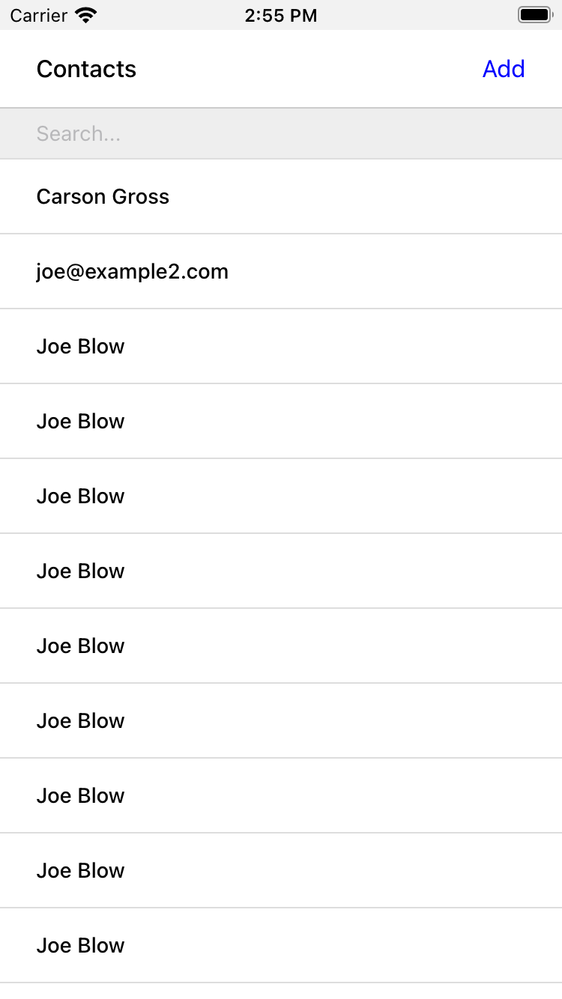
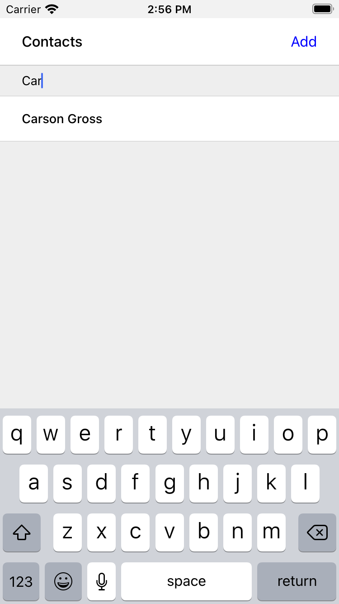
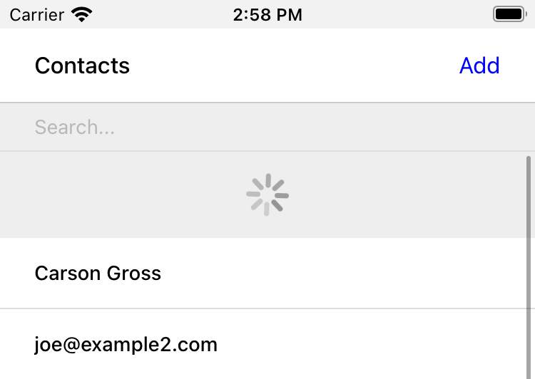
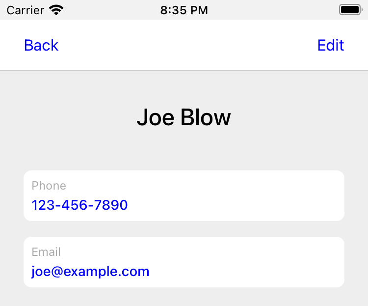
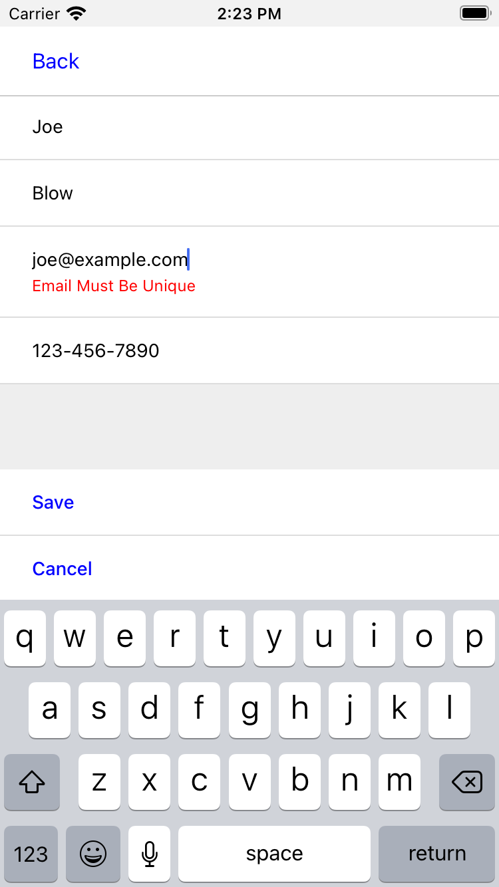
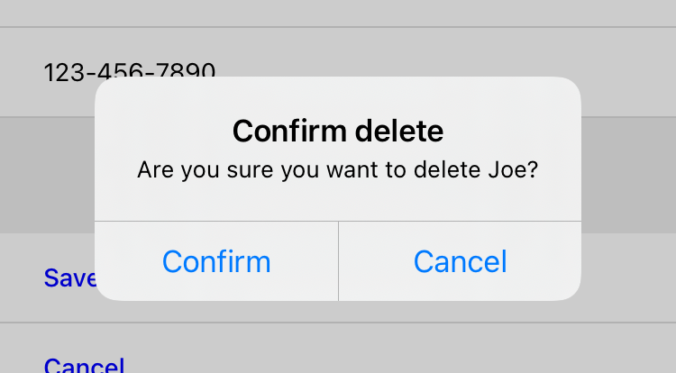
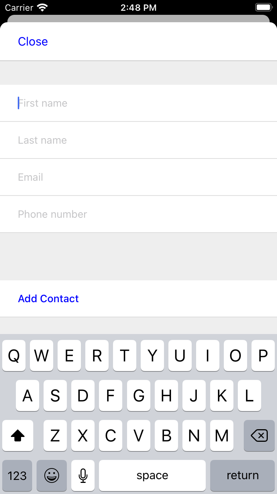

# Hypermeda koncepti

## 12 HyperView - Mobilni hipermedijski sistem

Možda će vam se oprostiti ako pomislite da je hipermedijska arhitektura sinonim za veb, veb pregledače i HTML. Nema sumnje, veb je najveći hipermedijski sistem, a veb pregledači su najpopularniji hipermedijalni klijent. Dominacija veba u diskusijama o hipermedijalnim tehnologijama olakšava zaboravljanje da je hipermedijalni koncept opšti koncept i da se može primeniti na sve vrste platformi i aplikacija. U ovom poglavlju ćemo videti hipermedijalnu arhitekturu primenjenu na platformu koja nije veb: izvorne mobilne aplikacije.

Mobilne platforme imaju drugačija ograničenja od veba. Zahtevaju drugačije kompromise i dizajnerske odluke. Ipak, koncepti hipermedije, HATEOAS-a i REST-a mogu se direktno primeniti za izgradnju zanimljivih mobilnih aplikacija.

U ovom poglavlju ćemo obraditi nedostatke trenutnog stanja razvoja mobilnih aplikacija i kako hipermedijska arhitektura može da reši ove probleme. Zatim ćemo pogledati put ka hipermediji na mobilnim uređajima: Hyperview, okvir za mobilne aplikacije koji koristi hipermedijsku arhitekturu. Zaključićemo pregledom HXML-a, hipermedijskog formata koji koristi Hyperview.

### 12.1 Stanje razvoja mobilnih aplikacija

Pre nego što možemo da razgovaramo o tome kako primeniti hipermediju na mobilne platforme, moramo da razumemo kako se obično grade nativne mobilne aplikacije. Koristim reč "nativni" da označim kod napisan uz SDK koji obezbeđuje operativni sistem telefona (obično Android ili iOS). Ovaj kod je upakovan u izvršnu binarnu datoteku i otpremljen je i odobren putem prodavnica aplikacija koje kontrolišu Google i Apple. Kada korisnici instaliraju ili ažuriraju aplikaciju, preuzimaju ovu izvršnu datoteku i pokreću kod direktno na operativnom sistemu svog uređaja. Na ovaj način, mobilne aplikacije imaju mnogo toga zajedničkog sa desktop aplikacijama stare škole za Mac, Windows ili Linux. Postoji jedna važna razlika između desktop aplikacija za računare iz prošlosti i današnjih mobilnih aplikacija. Danas su skoro sve mobilne aplikacije "umrežene". Pod umreženim mislimo da aplikacija treba da čita i piše podatke preko interneta da bi pružila svoju osnovnu funkcionalnost. Drugim rečima, umrežena mobilna aplikacija treba da implementira klijent-server arhitekturu.

Prilikom implementacije klijent-server arhitekture, programer mora da donese odluku: Da li aplikacija treba da bude dizajnirana kao tanki ili debeli klijent? Trenutni mobilni ekosistemi snažno guraju programere ka pristupu debelog klijenta. Zašto? Zapamtite, Android i iOS zahtevaju da nativna mobilna aplikacija bude upakovana i distribuirana kao izvršna binarna datoteka. Nema načina da se to zaobiđe. Pošto programer treba da napiše kod za pakovanje u izvršnu datoteku, čini se logičnim da se deo logike aplikacije implementira u tom kodu. Kod može takođe da pokrene HTTP pozive serveru radi preuzimanja podataka, a zatim da te podatke prikaže koristeći biblioteke korisničkog interfejsa platforme. Stoga, programeri su prirodno dovedeni u obrazac debelog klijenta koji izgleda otprilike ovako:

- Klijent sadrži kod za slanje API zahteva serveru i kod za prevođenje tih odgovora na ažuriranja korisničkog interfejsa

- Server implementira HTTP API koji govori JSON i malo zna o stanju klijenta.

Baš kao i kod SPA-ova na vebu, ova arhitektura ima veliki nedostatak: logika aplikacije se širi između klijenta i servera. Ponekad to znači da se logika duplira (kao kod validacije podataka obrasca). U drugim slučajevima, klijent i server implementiraju nepovezane delove ukupne logike aplikacije. Da bi razumeo šta aplikacija radi, programer mora da prati interakcije između dve veoma različite baze koda.

Postoji još jedna mana koja više utiče na mobilne aplikacije nego na SPA: odliv API-ja. Zapamtite, prodavnice aplikacija kontrolišu kako se vaša aplikacija distribuira i ažurira. Korisnici čak mogu da kontrolišu da li i kada dobijaju ažurirane verzije vaše aplikacije. Kao programer mobilnih aplikacija, ne možete pretpostaviti da će svaki korisnik biti na najnovijoj verziji vaše aplikacije. Vaš frontend kod se fragmentira na mnoge verzije, a sada vaš bekend mora da ih sve podržava.

Videli smo da hipermedijalna arhitektura može da reši nedostatke SPA na vebu. Ali da li hipermedija može da funkcioniše i za mobilne aplikacije? Odgovor je da!

Baš kao i na vebu, možemo koristiti hipermedijske formate na mobilnim uređajima i dozvoliti im da služe kao motor stanja aplikacije. Sva logika se kontroliše iz bekenda, umesto da se raspoređuje između dve baze koda. Hipermedijska arhitektura takođe rešava dosadan problem prenamene API-ja na mobilnim aplikacijama. Pošto bekend služi hipermedijski odgovor koji sadrži i podatke i akcije, ne postoji način da podaci i korisnički interfejs budu nesinhronizovani. Nema više brige o kompatibilnosti sa starijim verzijama ili održavanju više verzija API-ja.

Pa kako možete koristiti hipermediju za svoju mobilnu aplikaciju? Danas postoje dva pristupa korišćenja hipermedije za kreiranje i isporuku nativnih mobilnih aplikacija:

- WebViews, koji obavijaju pouzdanu veb platformu u ljusku mobilne aplikacije

- HyperView, novi hipermedijalni sistem koji smo dizajnirali posebno za mobilne aplikacije

### 12.2 WebViews

Najjednostavniji način za korišćenje hipermedijske arhitekture na mobilnim uređajima jeste korišćenje veb tehnologija. I Android i iOS SDK-ovi pružaju "veb prikaze": veb pregledače bez hroma koji se mogu ugraditi u izvorne aplikacije. Alati poput Apache Cordova olakšavaju uzimanje URL-a veb stranice i kreiranje izvornih iOS i Android aplikacija na osnovu veb prikaza. Ako već imate responzivnu veb aplikaciju, možete besplatno dobiti "nativnu" mobilnu HDA. Zvuči previše dobro da bi bilo istinito, zar ne?

Naravno, postoji fundamentalno ograničenje kod ovog pristupa. Veb platforma i mobilne platforme imaju različite mogućnosti i UX konvencije. HTML ne podržava izvorno uobičajene UI obrasce mobilnih aplikacija. Jedna od najvećih razlika je u načinu na koji svaka platforma rukuje navigacijom. Na vebu, navigacija je zasnovana na stranicama, pri čemu jedna stranica zamenjuje drugu, a pregledač pruža dugmad za kretanje napred/nazad za navigaciju kroz istoriju stranica. Na mobilnim uređajima, navigacija je složenija i podešena za fizički aspekt interakcija zasnovanih na gestovima.

Kada bi se detaljnije analiziralo:

- Ekrani se pomeraju jedan preko drugog, formirajući gomile ekrana.

- Trake sa karticama na vrhu ili dnu aplikacije omogućavaju prebacivanje između različitih grupa ekrana.

- Modalni prozori se pomeraju nagore od dna aplikacije, prekrivajući ostale stekove i traku sa karticama.

- Za razliku od veb stranica, svi ovi ekrani su i dalje prisutni u memoriji, prikazuju se i ažuriraju na osnovu stanja aplikacije.

Arhitektura navigacije je glavna razlika između funkcionisanja mobilnih i veb aplikacija. Ali nije jedina. Mnogi drugi UX obrasci su prisutni u mobilnim aplikacijama, ali nisu izvorno podržani na vebu:

- osvežavanje sadržaja na ekranu pomoću funkcije "povuci za osvežavanje"

- horizontalno prevlačenje preko elemenata korisničkog interfejsa da bi se otkrile radnje

- sekcijske liste sa lepljivim zaglavljima

Iako ove interakcije nisu izvorno podržane od strane veb pregledača, mogu se simulirati pomoću JS biblioteka. Naravno, ove biblioteke nikada neće imati isti osećaj i performanse kao izvorni gestovi. A njihovo korišćenje obično zahteva usvajanje JS-om pretežno zasnovane SPA arhitekture kao što je React. Ovo nas vraća na početak! Da bismo izbegli korišćenje tipične arhitekture debelog klijenta izvornih mobilnih aplikacija, okrenuli smo se veb prikazu. Veb prikaz nam omogućava da koristimo dobri stari HTML zasnovan na hipermediji. Ali da bismo dobili željeni izgled i osećaj mobilne aplikacije, na kraju gradimo SPA u JS-u, gubeći prednosti
hipermedije u tom procesu.

Da bismo napravili mobilnu HDA koja funkcioniše i deluje kao nativna aplikacija, HTML neće biti dovoljan. Potreban nam je format dizajniran da predstavi interakcije i obrasce nativnih mobilnih aplikacija. To je upravo ono što HyperView radi.

### 12.3 HyperView

HyperView je hipermedijski sistem otvorenog koda koji pruža:

- Hipermedijski format za definisanje mobilnih aplikacija nazvan HXML

- Hipermedijski klijent za HXML koji radi na iOS-u i Androidu

- Tačke proširenja u HXML-u i klijentu za prilagođavanje okvira za datu aplikaciju

#### 12.3.1 Format

HXML je dizajniran tako da bude poznat veb programerima, naviklim na rad sa HTML-om. Otuda izbor XML-a za osnovni format. Pored poznate ergonomije, XML je kompatibilan sa bibliotekama za renderovanje na strani servera. Na primer, Jinja2 je savršeno pogodan kao biblioteka šablona za renderovanje HXML-a. Poznatost XML-a i lakoća integracije na bekend-u olakšavaju njegovo usvajanje i u novim i u postojećim bazama koda. Pogledajte aplikaciju "Zdravo svete" napisanu u HXML-u. Sintaksa bi trebalo da bude poznata svima koji su radili sa HTML-om:

```html
<doc xmlns="https://hyperview.org/hyperview">
  <screen>
    <styles />
    <body>
      <header>
        <text>My first app</text>
      </header>
      <view>
        <text>Hello World!</text>
      </view>
    </body>
  </screen>
</doc>
```

Kod - Zdravo svete

Ali HXML nije samo direktna verzija HTML-a sa drugačije imenovanim oznakama. U prethodnim poglavljima smo videli kako htmx poboljšava HTML sa nekoliko novih atributa. Ovi dodaci održavaju deklarativnu prirodu HTML-a, dok programerima daju moć da kreiraju bogate veb aplikacije. U HXML-u, koncepti htmx-a su ugrađeni u specifikaciju. Konkretno, HXML nije ograničen na interakcije "klikni na link" i "pošalji obrazac" kao osnovni HTML. Podržava niz okidača i akcija za modifikovanje sadržaja na ekranu. Ove interakcije su objedinjene u moćan koncept "ponašanja". Programeri čak mogu definisati nove akcije ponašanja kako bi dodali nove mogućnosti svojoj aplikaciji, bez potrebe za skriptovanjem. Više o ponašanjima ćemo saznati kasnije u ovom poglavlju.

#### 12.3.2 Klijent

Hyperview pruža HXML klijentsku biblioteku otvorenog koda napisanu u React Native-u. Uz malo konfiguracije i nekoliko koraka u komandnoj liniji, ova biblioteka se kompajlira u nativne binarne datoteke aplikacija za iOS ili Android. Korisnici instaliraju aplikaciju na svoj uređaj putem prodavnice aplikacija. Prilikom pokretanja, aplikacija upućuje HTTP zahtev konfigurisanom URL-u i prikazuje HXML odgovor kao prvi ekran.

Možda deluje pomalo čudno da razvoj HDA pomoću Hyperview-a zahteva jednonamenski klijentski binarni fajl. Na kraju krajeva, ne tražimo od korisnika da prvo preuzmu i instaliraju binarni fajl da bi videli veb aplikaciju. Ne, korisnici samo unose URL adresu u adresnu traku opštenamenskog veb pregledača. Jedan HTML klijent prikazuje aplikacije sa bilo kog HTML servera.

```sh
                  ┌────────────┐
                  │            │
┌──────────┬─┐    │   SERVER   │
├──────────┴─┤    │            │
│            │    └──▲─────────┘
│            │       │
│            │       │  
│            ├───────┘  ┌────────────┐
│            │          │            │
│   CLIENT   ├──────────▶   SERVER   │
│            │          │            │
│            ├─────┐    └────────────┘
│            │     │
│            │   ┌────────────┐
│            │   │            │
└────────────┘   │   SERVER   │
                 │            │
                 └────────────┘
```

Skica - Jedan HTML klijent, više HTML servera

Teoretski je moguće napraviti ekvivalentan opšti "HyperView pregledač". Ovaj HXML klijent bi prikazivao aplikacije sa bilo kog HXML servera, a korisnici bi unosili URL adresu da bi naveli aplikaciju koju žele da koriste. Ali iOS i Android su izgrađeni oko koncepta aplikacija sa jednom namenom. Korisnici očekuju da pronađu i instaliraju aplikacije iz prodavnice aplikacija i da ih pokreću sa početnog ekrana svog uređaja. HyperView prihvata ovu paradigmu usmerenu na aplikacije današnjih popularnih mobilnih platformi. To znači da HXML klijent (binarni fajl aplikacije) prikazuje svoj korisnički interfejs sa jednog unapred konfigurisanog HXML servera.

```sh
┌────────────┐
│            │       ┌────────────┐
│            │       │┌──────────┐│
│   SERVER   │       ││          ││
│            │       ││┌───┐┌───┐││
│            ◀─────────┤   ││   │││
│            │       ││└───┘└───┘││
│            │       ││ App  App ││
│            │       ││          ││
│            │       ││┌───┐┌───┐││
│            │       │└┴───┴┴───┴┘│
│            │       │   CLIENT   │
│            │       └────────────┘
└────────────┘
```

Skica - Jedan HXML klijent, jedan HXML server

Srećom, programeri ne moraju da pišu HXML klijent od nule; klijentska biblioteka otvorenog koda obavlja 99% posla. I kao što ćemo videti u sledećem odeljku, postoje velike prednosti kontrole i klijenta i servera u HDA.

#### 12.3.3 Proširivost

Da bismo razumeli prednosti arhitekture HyperView-a, prvo moramo da razgovaramo o nedostacima veb arhitekture. Na vebu, svaki veb pregledač može da prikaže HTML sa bilo kog veb servera. Ovaj nivo kompatibilnosti može se postići samo sa dobro definisanim standardima kao što je HTML5. Ali definisanje i razvijanje standarda je naporan proces. Na primer, W3C-u je trebalo preko 7 godina da pređe put od prvog nacrta do preporuke za HTML5 specifikaciju. To nije iznenađujuće, s obzirom na nivo promišljenosti koji je potreban za promenu koja utiče na toliko ljudi. Ali to znači da se napredak dešava sporo. Kao veb programer, možda ćete morati da čekate godinama da pregledači steknu široku podršku za funkciju koja vam je potrebna.

Dakle, koje su prednosti HyperView arhitekture? U HyperView aplikaciji, vaša mobilna aplikacija prikazuje HXML samo sa vašeg servera. Ne morate da brinete o kompatibilnosti između vašeg servera i drugih mobilnih aplikacija, ili između vaše mobilne aplikacije i drugih servera. Ne postoji telo za standardizaciju koje biste konsultovali. Ako želite da dodate funkciju treptanja svojoj mobilnoj aplikaciji, samo napred i implementirajte element `<blink>` u klijentu i počnite da vraćate `<blink>` elemente u HXML odgovorima sa vašeg servera. U stvari, HyperView klijentska biblioteka je napravljena imajući u vidu ovu vrstu proširivosti. Postoje tačke proširenja za prilagođene elemente korisničkog interfejsa i prilagođene akcije ponašanja. Očekujemo i podstičemo programere da koriste ova proširenja kako bi HXML učinili izražajnijim i prilagođenijim funkcionalnosti njihove aplikacije.

A proširivanjem HXML formata i samog klijenta, nema potrebe da HyperView uključuje sloj skriptovanja u HXML. Funkcije koje zahtevaju logiku na strani klijenta se "ugrađuju" u binarni fajl klijenta. HXML odgovori ostaju čisti, sa korisničkim interfejsom i interakcijama predstavljenim u deklarativnom XML-u.

Koju hipermedijsku arhitekturu treba da koristite?

Razgovarali smo o dva pristupa za kreiranje mobilnih aplikacija korišćenjem hipermedijalnih sistema:

- kreiranje bekenda koji vraća HTML i prikazuje ga u mobilnoj aplikaciji putem WebView

- kreiranje bekenda koji vraća HXML i servirajte ga u mobilnoj aplikaciji pomoću HyperView klijenta

Namerno sam opisao ova dva pristupa na način koji istakne njihove sličnosti. Na kraju krajeva, oba su zasnovana na hipermedijalnim sistemima, samo sa različitim formatima i klijentima. Oba pristupa rešavaju fundamentalne probleme tradicionalnog razvoja mobilnih aplikacija sličnih SPA:

- Bekend kontroliše kompletno stanje aplikacije.

- Logika naše aplikacije je na jednom mestu.

- Aplikacija uvek koristi najnoviju verziju, nema problema sa API-jem.

Dakle, koji pristup bi trebalo da koristite za mobilnu HDA? Na osnovu našeg iskustva u izradi obe vrste aplikacija, verujemo da HyperView pristup rezultira boljim korisničkim iskustvom. WebView će uvek delovati neumesno na iOS-u i Android-u; jednostavno ne postoji dobar način da se repliciraju obrasci navigacije i interakcije koje mobilni korisnici očekuju. Hyperview je kreiran posebno da bi se rešio problem ograničenja pristupa sa debelim klijentom i WebView-om. Nakon početnog ulaganja u učenje Hyperview-a, dobićete sve prednosti Hypermedia arhitekture, bez nedostataka degradiranog korisničkog iskustva.

Naravno, ako već imate jednostavnu veb aplikaciju prilagođenu mobilnim uređajima, onda je korišćenje WebView razumno. Sigurno ćete uštedeti vreme jer nećete morati da prikazujete svoju aplikaciju kao HXML pored HTML-a. Ali, kao što ćemo pokazati na kraju ovog poglavlja, ne zahteva mnogo posla da se postojeća veb aplikacija vođena Hypermedia-om konvertuje u HyperView mobilnu aplikaciju. Ali pre nego što stignemo do toga, potrebno je da uvedemo koncepte elemenata i ponašanja u HyperView-u. Zatim ćemo ponovo izgraditi našu aplikaciju za kontakte u HyperView-u.

Kada ne bi trebalo da koristite hipermediju za izradu mobilne aplikacije? Hipermedija nije uvek pravi izbor za izradu mobilne aplikacije. Baš kao i na vebu, aplikacije koje zahtevaju veoma dinamične korisničke interfejse (kao što je aplikacija za tabelarne proračune) bolje se implementiraju sa kodom na strani klijenta. Pored toga, neke aplikacije moraju da funkcionišu dok su potpuno oflajn. Pošto HDA zahtevaju server za prikazivanje korisničkog interfejsa, mobilne aplikacije koje su prvenstveno oflajn nisu dobar izbor za ovu arhitekturu. Međutim, baš kao i na vebu, programeri mogu da koriste hibridni pristup za izradu svoje
mobilne aplikacije. Veoma dinamični ekrani mogu se izgraditi sa složenom logikom na strani klijenta, dok se manje dinamični ekrani mogu izgraditi pomoću WebView ili HyperView. Na ovaj način, programeri mogu da potroše svoj budžet za složenost na jezgro aplikacije i da jednostavni ekrani ostanu jednostavni.

### 12.4 Uvod u HXML

**Zdravo svete!**:

HXML je dizajniran tako da veb programerima koji dolaze sa HTML-a deluje prirodno. Hajde da detaljnije pogledamo aplikaciju "Zdravo svete" definisanu u HXML-u:

```html
<doc xmlns="https://hyperview.org/hyperview">       <1>
  <screen>                                          <2>
    <styles />
    <body>                                          <3>
      <header>                                      <4>
        <text>My first app</text>
      </header>
      <view>                                        <5>
        <text>Hello World!</text>                   <6>
      </view>
    </body>
  </screen>
</doc>
```

Kod - Zdravo svete

1. Korenski element HXML aplikacije

2. Element koji predstavlja ekran aplikacije

3. Element koji predstavlja korisnički interfejs ekrana

4. Element koji predstavlja gornji zaglavlje ekrana

5. Omotački element oko sadržaja prikazanog na ekranu

6. Tekstualni sadržaj prikazan na ekranu

Ništa previše čudno ovde, zar ne? Baš kao i HTML, sintaksa definiše stablo elemenata koristeći početne oznake ( `<screen>` ) i završne oznake ( `</screen>` ). Elementi mogu da sadrže druge elemente ( `<view>` ) ili `<tekst>` ( Hello World!). Elementi takođe mogu biti prazni, predstavljeni praznom oznakom ( `<styles/>` ). Međutim, primetićete da se imena HXML elementa razlikuju od onih u HTML-u.

Hajde da detaljnije pogledamo svaki od tih elemenata da bismo razumeli šta rade.

- `<doc>`  
  Koren HXML aplikacije. Zamislite to kao ekvivalent `<html>` elementa u HTML-u. Imajte na umu da `<doc>` element sadrži atribut `xmlns="https://hyperview.org/hyperview"`. Ovo definiše podrazumevani imenski prostor za dokument. Imenski prostori su karakteristika XML-a koja omogućava da jedan dokument sadrži elemente koje su definisali različiti programeri. Da bi se sprečili sukobi kada dva programera koriste isto ime za svoj element, svaki programer definiše jedinstveni imenski prostor. Više ćemo govoriti o imenskim prostorima kada kasnije u ovom poglavlju budemo razgovarali o prilagođenim elementima i ponašanjima. Za sada je dovoljno znati da se elementi u HXML dokumentu bez eksplicitnog imenskog prostora smatraju delom imenskog `https://hyperview.org/hyperview` prostora.

- `<screen>`  
  Predstavlja korisnički interfejs koji se prikazuje na jednom ekranu mobilne aplikacije. Moguće je da jedan element `<doc>` sadrži više `<screen>` elemenata, ali sada nećemo ulaziti u to. Tipično, `<screen>` element će sadržati elemente koji definišu sadržaj i stil ekrana.

- `<styles>`  
  Definiše stilove korisničkog interfejsa na ekranu. U ovom poglavlju nećemo se previše baviti stilizovanjem u Hyperview-u. Dovoljno je reći da, za razliku od HTML-a, Hyperview ne koristi poseban jezik (CSS) za definisanje stilova. Umesto toga, pravila stilizovanja kao što su boje, razmak, raspored i fontovi definišu se u HXML-u. Na ova pravila se zatim eksplicitno pozivaju elementi korisničkog interfejsa, slično kao što se koriste klase u CSS-u.

- `<body>`  
  Definiše stvarni korisnički interfejs ekrana. Telo sadrži sav tekst, slike, dugmad, obrasce itd. koji će biti prikazani korisniku. Ovo je ekvivalentno elementu `<body>` u HTML-u.

- `<header>`  
  Definiše zaglavlje ekrana. Tipično u mobilnim aplikacijama, zaglavlje uključuje navigaciju (kao što je dugme za nazad) i naslov ekrana. Korisno je definisati zaglavlje odvojeno od ostatka tela. Neki mobilni operativni sistemi će koristiti drugačiji prelaz za zaglavlje nego za ostatak sadržaja ekrana.

- `<view>`  
  Osnovni gradivni blok za rasporede i strukturu unutar tela ekrana. Zamislite to kao `<div>` u HTML-u. Imajte na umu da za razliku od HTML `<div>` elemenata, `<view>` ne može direktno da sadrži tekst.

- `<text>`  
  Elementi su jedini način za prikazivanje teksta u korisničkom interfejsu. U ovom primeru, "Zdravo svete" se nalazi unutar `<text>` elementa.

To je sve što je potrebno da se definiše osnovna aplikacija "Zdravo svete" u HXML-u. Naravno, ovo nije baš uzbudljivo. Hajde da pokrijemo neke druge ugrađene elemente prikaza.

### 12,5 Elementi korisničkog interfejsa

#### 12.5.1 `<list>`

Veoma uobičajen obrazac u mobilnim aplikacijama je listanje kroz listu stavki. Fizička svojstva ekrana telefona (uzdužni i vertikalni) i intuitivni gest prevlačenja palcem gore i dole čine ovo dobrim izborom za mnoge ekrane.
HXML ima namenske elemente za predstavljanje lista i stavki.

```html
<list>                            <1>
  <item key="item1">              <2>
    <text>My first item</text>    <3>
  </item>
  <item key="item2">
    <text>My second item</text>
  </item>
</list>
```

Kod - Element liste

1. `<list>` - Element koji predstavlja listu

2. `<item>` - Element koji predstavlja stavku na listi, sa jedinstvenim ključem

3. Sadržaj stavke na listi.

Liste su predstavljene sa dva nova elementa. `<list>` obuhvata  sve stavke na listi. Može se stilizovati kao generički element `<view>` (širina, visina, itd.). `<list>` element sadrži samo `<item>` elemente. Naravno, oni predstavljaju svaku jedinstvenu stavku na listi. Imajte na umu da je za `<item>` je potrebno imati `key` atribut koji je **jedinstven** među svim stavkama na listi.
  
Možda se pitate: "Zašto nam je potrebna prilagođena sintaksa za liste stavki? Zar ne možemo jednostavno da koristimo gomilu `<view>` elemenata?". Da, za liste sa malim brojem stavki, korišćenje ugnežđenih elemenata `<views>` će funkcionisati prilično dobro.

Međutim, često broj stavki na listi može biti dovoljno dugačak da zahteva optimizacije kako bi se podržale glatke interakcije skrolovanja. Razmislite o pregledanju fida objava u aplikaciji društvenih medija. Dok stalno skrolujete kroz fid, nije neuobičajeno da aplikacija prikazuje stotine, ako ne i hiljade objava. U bilo kom trenutku možete da pomerite prst da biste se pomerili do skoro bilo kog dela fida.

Mobilni uređaji imaju tendenciju da budu ograničeni memorijom. Čuvanje potpuno prikazane liste stavki u memoriji može da potroši više resursa nego što je dostupno. Zato i iOS i Android pružaju API-je za optimizovane korisničke interfejse lista. Ovi API-ji znaju koji deo liste je trenutno na ekranu. Da bi uštedeli memoriju, oni brišu nevidljive stavke liste i recikliraju objekte korisničkog interfejsa stavki da bi uštedeli memoriju. Korišćenjem eksplicitnih elemenata `<list>` i `<item>` u HXML-u, Hyperview klijent zna da koristi ove optimizovane API-je lista kako bi vaša aplikacija bila efikasnija.

#### 12.5.2 `<section-list>`

`<section-list>` Takođe je vredno pomenuti da HXML podržava liste odeljaka. Liste odeljaka su korisne za kreiranje korisničkih interfejsa zasnovanih na listama, gde se stavke na listi mogu grupisati radi lakšeg korišćenja. Na primer, korisnički interfejs koji prikazuje meni restorana mogao bi grupisati ponude po tipu jela:
  
```html
<section-list>                        <1>
  <section>                           <2>
    <section-title>                   <3>
      <text>Appetizers</text>
    </section-title>
    <item key="1">                    <4>
      <text>French Fries</text>
    </item>
    <item key="2">
      <text>Onion Rings</text>
    </item>
  </section>

  <section>                           <5>
    <section-title>
      <text>Entrees</text>
    </section-title>
    <item key="3">
      <text>Burger</text>
    </item>
  </section>
</section-list>
```

Kod - Liste odeljaka

1. Element koji predstavlja listu sa odeljcima

2. Prvi deo ponude predjela

3. Element za naslov odeljka, koji prikazuje tekst "Predelo"

4. Predmet koji predstavlja predjelo

5. Odeljak za ponudu glavnih jela

Primetićete nekoliko razlika između `<list>` i `<section-list>`. Element liste odeljka sadrži samo `<section>` elemente, koji predstavljaju grupu stavki. Odeljak može da sadrži `<section-title>` element. Ovo se koristi za prikazivanje korisničkog interfejsa koji deluje kao zaglavlje odeljka. Ovo zaglavlje je "lepljivo", što znači da ostaje na ekranu dok se skroluje kroz stavke koje pripadaju odgovarajućem odeljku. Konačno, `<item>` elementi se ponašaju isto kao u redovnoj listi, ali se mogu pojaviti samo unutar `<section>`.

#### 12.5.3 Slike

Prikazivanje slika u Hyperview-u je prilično slično HTML-u, ali postoji nekoliko razlika.

```html
<image source="/profiles/1.jpg" style="avatar" />
```

**Element slike**:

Atribut `source` određuje kako se učitava slika. Kao u HTML-u, izvor može biti apsolutni ili relativni URL. Pored toga, izvor može biti URI kodiranih podataka, na primer `data:image/png;base64,iVBORw`. Međutim, izvor može biti i "lokalni" URL, koji se odnosi na sliku koja je u paketu kao element u mobilnoj aplikaciji. Lokalni URL ima prefiks `./`:

```html
<image source="./logo.png" style="logo" />
```

Kod - Element slike, koji ukazuje na lokalni izvor

Korišćenje lokalnih URL-ova je optimizacija. Pošto se slike nalaze na mobilnom uređaju, ne zahtevaju mrežni zahtev i brzo će se pojaviti. Međutim, povezivanje slike sa binarnom datotekom mobilne aplikacije povećava veličinu binarne datoteke. Korišćenje lokalnih slika je dobar kompromis za slike kojima se često pristupa, ali se retko menjaju. Dobri primeri uključuju logotip aplikacije ili uobičajene ikone dugmadi.

Druga stvar koju treba napomenuti je prisustvo atributa `style` na `<image>` elementu. U HXML-u, slike moraju imati stil koji ima pravila za slike `width` i `height`. Ovo se razlikuje od HTML-a, gde `` elementi ne moraju eksplicitno da podešavaju širinu i visinu. Veb pregledači će preurediti sadržaj veb stranice kada se slika preuzme i dimenzije su poznate. Iako je preuređenje sadržaja razumno ponašanje za veb dokumente, korisnici ne očekuju da će mobilne aplikacije preurediti raspored dok se sadržaj učitava. Da bi se održao statički raspored, HXML zahteva da dimenzije budu poznate pre nego što se slika učita.

#### 12.5.4 Ulazi

Mnogo toga se može reći o unosima u Hyperview-u. Pošto je ovo zamišljeno kao uvod, a ne kao iscrpan resurs, istaći ću samo nekoliko vrsta unosa. Počnimo sa primerom najjednostavnije vrste unosa:

##### 12.5.4.1 Tekstualna polja

```html
<text-field
name="first_name"           <1>
  style="input"             <2>
  value="Adam"              <3>
  placeholder="First name"  <4>
/>
```

Kod - Element tekstualnog polja

1. Ime koje se koristi prilikom serijalizacije podataka sa ovog ulaza

2. Stil primenjen na element korisničkog interfejsa

3. Trenutna vrednost podešena u polju

4. Prikazni znak koji se prikazuje kada je vrednost prazna

Ovaj element bi trebalo da bude poznat svakome ko je kreirao tekstualno polje u HTML-u. Jedna razlika je u tome što većina unosa u HTML-u koristi element `<input>` sa `type` atributom, npr `<input type="text">`. U Hyperview-u, svaki unos ima jedinstveno ime, u ovom slučaju `<text-field>`. Korišćenjem različitih imena, možemo koristiti izražajniji XML za predstavljanje unosa.

Na primer, razmotrimo slučaj gde želimo da prikažemo korisnički interfejs koji omogućava korisniku da izabere jednu od nekoliko opcija. U HTML-u bismo koristili radio dugme za unos, nešto poput

```html
`<input type="radio" name="choice" value="option1" />`
```

Svaki izbor je predstavljen kao jedinstveni element unosa. Ovo mi se nikada nije činilo idealnim. Većinu vremena, radio dugmad su grupisana zajedno da bi uticala na isto ime. HTML pristup dovodi do mnogo šablona (dupliranje type="radio" i name="choice" za svaki izbor). Takođe, za razliku od radio dugmadi na desktop računarima, mobilni operativni sistemi ne pružaju jak standardni korisnički interfejs za izbor jedne opcije. Većina mobilnih aplikacija koristi bogatije, prilagođene korisničke interfejse za ove interakcije.

##### 12.5.4.1 Select-single

Dakle, u HXML-u implementiramo ovaj korisnički interfejs koristeći element pod nazivom `<select-single>`:

```html
<select-single name="choice"> <1>
  <option value="option1">    <2>
    <text>Option 1</text>     <3>
  </option>
  <option value="option2">
    <text>Option 2</text>
  </option>
</select-single>
```

Kod - Select jednog elementa

1. Element koji predstavlja unos gde je izabran jedan izbor. Naziv izbora je ovde definisan jednom.

2. Element koji predstavlja jedan od izbora. Vrednost izbora je ovde definisana.

3. Korisnički interfejs selekcije. U ovom primeru koristimo tekst, ali možemo koristiti bilo koje elemente korisničkog interfejsa.

Element `<select-single>` je roditelj ulaza za izbor jedne opcije od mnogih. Ovaj element sadrži `name` atribut koji se koristi prilikom serijalizacije izabrane opcije. `<option>` Elementi unutar `<select-single>` predstavljaju dostupne opcije. Imajte na umu da svaki `<option>` element ima `value` atribut. Kada se pritisne, ovo će biti izabrana vrednost ulaza. Element `<option>` može da sadrži bilo koje druge elemente korisničkog interfejsa unutar sebe. To znači da nismo ograničeni prikazivanjem ulaza kao liste radio dugmadi sa oznakama. Možemo da prikažemo opcije kao radio dugmad, oznake, slike ili bilo šta drugo što bi bilo intuitivno za naš interfejs. HXML stilizovanje podržava modifikatore za pritisnuta i izabrana stanja, omogućavajući nam da prilagodimo korisnički interfejs kako bismo istakli izabranu opciju.

Opisivanje svih karakteristika ulaza u HXML-u bi zauzelo celo poglavlje. Umesto toga, sumiraću nekoliko drugih ulaznih elemenata i njihove karakteristike.

##### 12.5.4.3 Select-multiple

`<select-multiple>` radi kao `<select-single>`, ali podržava uključivanje i isključivanje više opcija. Ovo zamenjuje unose polja za potvrdu u HTML-u.

##### 12.5.4.4 switch

`<switch>` element prikazuje prekidač za uključivanje/isključivanje koji je uobičajen u mobilnim korisničkim interfejsima - Element `<date-field>` podržava unos određenih datuma i dolazi sa širokim spektrom prilagođavanja za formatiranje, raspone podešavanja itd.

##### 12.5.4.1 form

Još dve stvari koje treba pomenuti o ulazima:

- Prva je `<form>` element. `<form>` element se koristi za grupisanje ulaza radi serijalizacije. Kada korisnik preduzme akciju koja pokreće bekend zahtev, HyperView klijent će serijalizovati sve ulaze u okruženju `<form>` i uključiti ih u zahtev.

  Ovo važi i za i za GET i za POST zahteve. Ovo ćemo detaljnije obraditi kada budemo govorili o ponašanjima kasnije u ovom poglavlju.
  
- Takođe, kasnije u ovom poglavlju, govoriću o podršci za prilagođene elemente u HXML-u. Sa prilagođenim elementima, možete kreirati i sopstvene ulazne elemente. Prilagođeni ulazni elementi vam omogućavaju da izgradite neverovatno moćne interakcije sa jednostavnom XML sintaksom koja se dobro integriše sa ostatkom HXML-a.

### 12.6 Stilizovanje

Do sada nismo pomenuli kako primeniti stilizovanje na sve HXML elemente. Videli smo iz aplikacije Hello World da svaki `<screen>` može da sadrži `<styles>` element. Hajde da ponovo posetimo aplikaciju Hello World i popunimo `<styles>` element.

```html
<doc xmlns="https://hyperview.org/hyperview">
  <screen>
    <styles> <1>
      <style id="body" flex="1" flexDirection="column" /> <2>
      <style id="header"
          borderBottomWidth="1" borderBottomColor="#ccc" />
      <style id="main" margin="24" />
      <style id="h1" fontSize="32" />
      <style id="info" color="blue" />
    </styles>

    <body style="body"> <3>
      <header style="header">
        <text style="info">My first app</text>
      </header>
      <view style="main">
        <text style="h1 info">Hello World!</text> <4>
      </view>
    </body>
  </screen>
</doc>
```

Kod - Primer stilizovanja korisničkog interfejsa

1. Element koji obuhvata sav stil za ekran

2. Primer definicije stila za "telo"

3. Primena stila "telo" na element korisničkog interfejsa

4. Primer primene više stilova (h1 i info) na element

Primetićete da je u HXML-u stilizovanje deo XML formata, umesto da se koristi poseban jezik poput CSS-a. Međutim, možemo povući neke paralele između CSS pravila i `<style>` elementa.

CSS pravilo se sastoji od:

- selektora i
- deklaracija.

U trenutnoj verziji HXML-a, jedini dostupni selektor je ime, označeno atributom id. Ostali atributi elementa `<style>` su deklaracije, koje se sastoje od svojstava i vrednosti svojstava.

Elementi korisničkog interfejsa unutar `<screen>` mogu da referenciraju `<style>` pravila dodavanjem imena stilova svom `style` atributu. Obratite pažnju na `<text>` element oko "Zdravo svete!" koji referencira dva stila: `h1` i `info`. Odgovarajući stilovi se spajaju redosledom kojim se pojavljuju na elementu. Vredi napomenuti da su svojstva stilizovanja slična onima u CSS-u (boja, margine/podmetanje, okviri itd.). Trenutno je jedini dostupni mehanizam za raspored zasnovan na flexbox-u.

Pravila stila mogu biti prilično opširna. Radi kratkoće, nećemo uključivati `<styles>` element u ostale primere u ovom poglavlju osim ako nije neophodno.

### 12.7 Prilagođeni elementi

Osnovni elementi korisničkog interfejsa koji se isporučuju sa Hyperview-om su prilično osnovni. Većina mobilnih aplikacija zahteva bogatije elemente da bi pružila odlično korisničko iskustvo. Srećom, HXML može lako da primi prilagođene elemente u svojoj sintaksi. To je zato što je HXML zapravo samo XML, poznat kao "proširivi jezik za označavanje". Proširivost je već ugrađena u format! Programeri mogu slobodno da definišu nove elemente i atribute koji predstavljaju prilagođene elemente.

Pogledajmo ovo u akciji na konkretnom primeru. Pretpostavimo da želimo da dodamo element mape našoj aplikaciji "Hello World". Želimo da mapa prikazuje definisanu oblast i jedan ili više markera na određenim koordinatama u toj oblasti. Hajde da prevedemo ove zahteve u XML:

- Element `<area>` će predstavljati područje prikazano na mapi. Da bi se odredilo područje, element će sadržati atribute za "latitude" i "longitude" za centar područja, i atribute za "latitude-delta" i "longitude-delta" koji označavaju +/- područje prikaza oko centra.

- Element `<marker>` će predstavljati marker u oblasti. Koordinate markera će biti definisane pomoću "latitudei" "longitude" atributa na markeru.

Koristeći ove prilagođene XML elemente, instanca mape u našoj aplikaciji može izgledati ovako:

```html
<doc xmlns="https://hyperview.org/hyperview">
  <screen>
    <body>
      <view>
        <text>Hello World!</text>
        <area latitude="37.8270" longitude="122.4230"
          latitude-delta="0.1" longitude-delta="0.1">         <1>
          <marker latitude="37.8118" longitude="-122.4177" /> <2>
        </area>
      </view>
    </body>
  </screen>
</doc>
```

Kod - Prilagođeni elementi u HXML-u

1. Prilagođeni element koji predstavlja područje koje prikazuje mapa

2. Prilagođeni element koji predstavlja marker prikazan na određenim koordinatama na mapi

Sintaksa se savršeno uklapa među osnovne HXML elemente. Međutim, postoji potencijalni problem. "Područje" i "marker" su prilično generički nazivi. Mogao bih da vidim elemente `<area>` i `<marker>` kako ih koristi prilagođavanje za prikazivanje dijagrama i grafikona. Ako naša aplikacija prikazuje i mape i grafikone, HXML oznake bi bile dvosmislene.

Šta bi klijent trebalo da prikaže kada vidi `<area>` ili `<marker>`?

Tu dolaze do izražaja XML imenski prostori. XML imenski prostori eliminišu dvosmislenost i kolizije između elemenata i atributa koji se koriste za predstavljanje različitih stvari. Zapamtite da `<doc>` element deklariše da <https://hyperview.org/hyperviewje> to podrazumevani imenski prostor za ceo dokument. Pošto nijedan drugi element ne definiše imenske prostore, svaki element u gornjem primeru je deo imenskog <https://hyperview.org/hyperview> prostora.

Hajde da definišemo novi imenski prostor za naše elemente mape. Pošto ovaj imenski prostor neće biti podrazumevani za dokument, takođe moramo dodeliti imenski prostor prefiksu koji ćemo dodati našim elementima:

```html
<doc xmlns="https://hyperview.org/hyperview"
  xmlns:map="https://mycompany.com/hyperview-map">
```

Ovaj novi atribut deklariše da je map prefiks povezan sa imenskim prostorom <https://mycompany.com/hyperview-map>. Ovaj imenski prostor može biti bilo šta, ali zapamtite da je cilj koristiti nešto jedinstveno što neće imati kolizije. Korišćenje domena vaše kompanije/aplikacije je dobar način da se garantuje jedinstvenost. Sada kada imamo imenski prostor i prefiks, potrebno je da ga koristimo za naše elemente:

```html
<doc xmlns="https://hyperview.org/hyperview"
  xmlns:map="https://mycompany.com/hyperview-map">                <1>
  <screen>
    <body>
      <view>
        <text>Hello World!</text>
        <map:area latitude="37.8270" longitude="122.4230"
          latitude-delta="0.1" longitude=delta="0.1">             <2>
          <map:marker latitude="37.8118" longitude="-122.4177" /> <3>
        </map:area> <4>
      </view>
    </body>
  </screen>
</doc>
```

Kod - Imenski prostori prilagođenih elemenata

1. Definicija imenskog prostora sa pseudonimom "map"

2. Dodavanje imenskog prostora početnoj oznaci "area"

3. Dodavanje imenskog prostora samozatvarajućoj oznaci "marker"

4. Dodavanje imenskog prostora završnoj oznaci "area"

To je to! Ako bismo uveli prilagođenu biblioteku za crtanje grafikona sa elementima "area" i "marker", kreirali bismo jedinstveni imenski prostor i za te elemente. U HXML dokumentaciji, mogli bismo lako da razlikujemo `<map:area>` i `<chart:area>`.

U ovom trenutku se možda pitate: "Kako Hyperview klijent zna da prikaže mapu kada moj dokument sadrži `<map:area>`?" Tačno je, do sada smo definisali samo format prilagođenog elementa, ali nismo implementirali element kao funkciju u našoj aplikaciji. Detaljnije ćemo se baviti implementacijom prilagođenih elemenata u sledećem poglavlju.

### 12.8 Ponašanja

Kao što je već rečeno u prethodnim poglavljima, HTML podržava dva osnovna tipa interakcija:

- Klikom na hiperlink: klijent će poslati GET zahtev i prikazati odgovor kao novu veb stranicu.

- Slanje formulara: klijent će (obično) napraviti POST zahtev sa serijalizovanim sadržajem formulara i prikazati odgovor kao novu veb stranicu.

Klik na hiperlink i slanje obrazaca je dovoljno za kreiranje jednostavnih veb aplikacija. Ali oslanjanje samo na ove dve interakcije ograničava našu mogućnost kreiranja bogatijih korisničkih interfejsa. Šta ako želimo da se nešto desi kada korisnik pređe mišem preko određenog elementa ili možda kada skroluje neki sadržaj u prikazni prozor? To ne možemo da uradimo sa osnovnim HTML-om. Pored toga, i klikovi i slanje obrazaca rezultiraju učitavanjem potpuno nove veb stranice. Šta ako želimo da ažuriramo samo mali deo trenutne stranice? Ovo je veoma čest scenario u bogatim veb aplikacijama, gde korisnici očekuju da preuzmu i ažuriraju sadržaj bez prelaska na novu stranicu.

Dakle, sa osnovnim HTML-om, interakcije (klikovi i slanja) su ograničene i čvrsto povezane sa jednom radnjom (učitavanje nove stranice). Naravno, korišćenjem JavaScript-a možemo proširiti HTML i dodati neku novu sintaksu kako bismo podržali željene interakcije. Htmx radi upravo to sa novim skupom atributa:

- Interakcije se mogu dodati bilo kom elementu, ne samo linkovima i obrascima.

- Interakcija se može pokrenuti klikom, slanjem, prelaskom miša ili bilo kojim drugim JavaScript događajem.

- Radnje koje proizilaze iz okidača mogu izmeniti trenutnu stranicu, ne samo zahtevati novu stranicu.

Razdvajanjem elemenata, okidača i akcija, htmx nam omogućava da izgradimo bogate aplikacije vođene hipermedijom na način koji je veoma kompatibilan sa HTML sintaksom i veb razvojem na strani servera.

HXML preuzima ideju definisanja interakcija putem okidača i akcija i ugrađuje ih u specifikaciju. Ove interakcije nazivamo "ponašanjima". Koristimo poseban `<behavior>` element da bismo ih definisali. Evo primera jednostavnog ponašanja koje pomera novi mobilni ekran na navigacioni stek:

```html
<text>
  <behavior               <1>
    trigger="press"       <2>
    action="push"         <3>
    href="/next-screen"   <4>
  />
  Press me!
</text>
```

Kod - Osnovno ponašanje

1. Element koji obuhvata interakciju na roditeljskom `<text>` elementu.

2. Okidač koji će izvršiti interakciju, u ovom slučaju pritiskanje `<text>` elementa.

3. Radnja koja će se izvršiti kada se pokrene, u ovom slučaju postavljanje novog ekrana na trenutni stek.

4. `href` koji se učitava na novom ekranu.

Hajde da analiziramo šta se dešava u ovom primeru. Prvo, imamo `<text>` element sa sadržajem "Pritisni me!". Već smo ranije prikazivali `<text>``<text>` elemente u primerima HXML-a, tako da ovo nije ništa novo. Ali sada, `<text>` element sadrži novi podređeni element, `<behavior>`. Ovaj `<behavior>` element definiše interakciju na roditeljskom `<text>` elementu. Sadrži dva atributa koja su potrebna za bilo koje ponašanje:

- `trigger`: definiše korisničku akciju koja pokreće ponašanje

- `action`: definiše šta se dešava kada se aktivira

U ovom primeru, `trigger` je podešen na `press`, što znači da će se ova interakcija dogoditi kada korisnik pritisne `<text>` element. `action` atribut je podešen na `push`. `push` je radnja će pomeriti novi ekran na navigacioni stek. Konačno, HyperView treba da zna koji sadržaj da učita na novopostavljenom ekranu. Tu dolazi do izražaja `href` atribut. Obratite pažnju da ne moramo da definišemo punu URL adresu. Baš kao u HTML-u, `href` može biti apsolutna ili relativna URL adresa.

Dakle, to je prvi primer ponašanja u HXML-u. Možda mislite da ova sintaksa deluje prilično opširno. Zaista, pritiskanje elemenata za navigaciju do novog ekrana jedna je od najčešćih interakcija u mobilnoj aplikaciji. Bilo bi lepo imati jednostavniju sintaksu za uobičajeni slučaj. Srećom, atributi `trigger` i `action` imaju podrazumevane vrednosti `press` i `push`, respektivno. Stoga se mogu izostaviti da bi se sintaksa očistila:

```html
<text>
  <behavior href="/next-screen" />    <1>
    Press me!
</text>
```

Kod - Osnovno ponašanje sa podrazumevanim podešavanjima

1. Kada se pritisne, ovo ponašanje će otvoriti novi ekran sa datom URL adresom.

Ova oznaka za `<behavior>` će proizvesti istu interakciju kao i prethodni primer. Sa podrazumevanim atributima, `<behavior>` element izgleda slično sidru `<a>` u HTML-u. Ali puna sintaksa postiže naše ciljeve razdvajanja elemenata, okidača i akcija:

- Ponašanja se mogu dodati bilo kom elementu, nisu ograničena samo na linkove i forme.

- Ponašanja mogu da navedu eksplicitni trigger, ne samo klikove ili slanja obrazaca.

- Ponašanja mogu da navedu eksplicitne akcije, ne samo zahtev za novu stranicu.

- Dodatni atributi poput `href` pružaju više konteksta za radnju.

Pored toga, korišćenje namenskog `<behavior>` elementa znači da jedan element može definisati više ponašanja. Ovo nam omogućava da izvršimo nekoliko akcija iz istog okidača. Ili, možemo izvršiti različite akcije za različite okidače na istom elementu. Na kraju ovog poglavlja ćemo pokazati primere moći višestrukih ponašanja. Prvo moramo pokazati raznolikost podržanih akcija i okidača.

#### 12.8.1 Akcije

Radnje ponašanja u HyperView-u se dele u četiri opšte kategorije:

- Akcije navigacije, koje učitavaju nove ekrane i kreću se između njih

- Akcije ažuriranja, koje menjaju HXML trenutnog ekrana

- Sistemske akcije, koje interaguju sa mogućnostima na nivou OS-a.

- Prilagođene akcije, koje mogu da izvršavaju bilo koji kod koji dodate klijentu.

#### 12.8.2 Radnje navigacije

Već smo videli najjednostavniji tip akcije, `push`. `push` klasifikujemo kao "akciju navigacije", jer je povezana sa navigacijom po ekranima u mobilnoj aplikaciji. Pomeranje ekrana na stek navigacije je samo jedna od nekoliko akcija navigacije koje podrži Hyperview. Korisnici takođe moraju biti u mogućnosti da se vrate na prethodne ekrane, otvore i zatvore modalne prozore, prebace između kartica ili pređu na proizvoljne ekrane. Svaka od ovih vrsta navigacije je podržana krozrazličitu vrednost za actionatribut:

- `push`  
  Ubacuje novi ekran u trenutni stek za navigaciju. Ovo izgleda kao ekran koji se pomera zdesna, preko trenutnog ekrana.

- `new`  
  Otvorite novi stek za navigaciju kao modalni prozor. Ovo izgleda kao ekran koji se pomera odozdo, preko trenutnog ekrana.

- `back`  
  Ovo je dopuna akciji push. Izbacuje trenutni ekran iz navigacionog steka (pomeranjem udesno).

- `close`  
  Ovo je dopuna radnje `new`. Zatvara trenutni stek za navigaciju (pomeranjem nadole).

- `reload`  
  Slično dugmetu "osveži" u pregledaču, ovo će ponovo zahtevati sadržaj trenutnog ekrana.

- `navigate`  
  Ova radnja će pokušati da pronađe `href` ekran sa datim podacima koji su već učitani u aplikaciji. Ako ekran postoji, aplikacija će preći na taj ekran. Ako ne postoji, ponašaće se isto kao push.

- `push`, `new`, i `navigate`  
  svi učitavaju novi ekran. Stoga, oni zahtevaju `href` atribut kako bi HyperView znao koji sadržaj da zahteva za novi ekran.
  
- `back` i `close`  
  ne učitavaju nove ekrane, pa samim tim ne zahtevaju `href` atribut.
  
- `reload`  
  je zanimljiv slučaj. Podrazumevano, koristiće URL adresu ekrana kada ponovo zahteva sadržaj za ekran. Međutim, ako želite da zamenite ekran drugim, možete da obezbedite atribut `href` na `reload` na elementu ponašanja.

Pogledajmo primer aplikacije "vidžeti" koja koristi nekoliko akcija navigacije na jednom ekranu:

```html
<screen>
  <body>
    <header>
      <text>
        <behavior action="back" />                    <1>
        Back
      </text>
      <text>
        <behavior action="new" href="/widgets/new" /> <2>
        New Widget
      </text>
    </header>
    <text>
      <behavior action="reload" />                    <3>
      Check for new widgets
    </text>
    <list>
      <item key="widget1">
        <behavior action="push" href="/widgets/1" /> <4>
      </item>
    </list>
  </body>
</screen>
```

Kod - Primeri radnji navigacije

1. Vraća korisnika na prethodni ekran

2. Otvara novi modalni prozor za dodavanje vidžeta

3. Ponovo učitava sadržaj ekrana, prikazujući nove vidžete iz pozadine

4. Otvara novi ekran sa detaljima za određeni vidžet

Većini ekrana u vašoj aplikaciji biće potreban način da se korisnik vrati na prethodni ekran. To se obično radi pomoću dugmeta u zaglavlju koje koristi akciju `back` ili `close`, u zavisnosti od toga kako je ekran otvoren. U ovom primeru, pretpostavljamo da je ekran vidžeta pomeren na navigacioni stek, tako da je akcija `back` odgovarajuća. Zaglavlje sadrži drugo dugme koje omogućava korisniku da unese podatke za novi vidžet. Pritiskom na ovo dugme otvoriće se modalni prozor sa ekranom "Novi vidžet". Pošto će se ovaj ekran "Novi vidžet" otvoriti kao modalni prozor, biće mu potrebna odgovarajuća akcija `close` da bi se sam zatvorio i ponovo prikazao naš ekran "vidžeti". Konačno, da biste videli više detalja o određenom vidžetu, svaki `<item>` element sadrži ponašanje sa akcijom `push`. Ova akcija će pomeriti ekran "Detalji vidžeta" na trenutni navigacioni stek. Kao i na ekranu "Vidžeti", "Detalji vidžeta" će biti potreban dugme u zaglavlju koje koristi akciju `back` da bi omogućilo korisniku da se vrati.

Na vebu, pregledač obavlja osnovne potrebe za navigacijom kao što su kretanje unazad/napred, ponovno učitavanje trenutne stranice ili prelazak na obeleživač. iOS i Android ne pružaju ovu vrstu univerzalne navigacije za izvorne mobilne aplikacije. Na programerima aplikacija je da se sami pobrinu za ovo. Akcije navigacije u HXML-u pružaju jednostavan, ali moćan način programerima da izgrade arhitekturu koja ima smisla za njihovu aplikaciju.

#### 12.8.3 Ažuriranje akcija

Akcije ponašanja nisu ograničene samo na navigaciju između ekrana. One se takođe mogu koristiti za promenu sadržaja na trenutnom ekranu. Ove akcije nazivamo "akcijama ažuriranja". Slično akcijama navigacije, akcije ažuriranja upućuju zahtev serverskom delu. Međutim, odgovor nije ceo HXML dokument, već fragment HXML-a. Ovaj fragment se dodaje HXML-u trenutnog ekrana, što rezultira ažuriranjem korisničkog interfejsa. Atribut `action` određuje `<behavior>` kako se fragment uključuje u HXML. Takođe treba da uvedemo novi `target` atribut `<behavior>` da bismo definisali gde se fragment uključuje u postojeći dokument. `target` atribut je ID referenca na postojeći element na ekranu.

HyperView trenutno podržava ove akcije ažuriranja, koje predstavljaju različite načine za uključivanje fragmenta u ekran:

- `replace` - zamenjuje ceo ciljni element fragmentom

- `replace-inner` - zamenjuje potomke ciljnog elementa fragmentom

- `append` - dodaje fragment nakon poslednjeg deteta ciljnog elementa

- `prepend` - dodaje fragment ispred prvog deteta ciljnog elementa.

Pogledajmo nekoliko primera da bismo ovo učinili konkretnijim. Za ove primere, pretpostavimo da naš bekend prihvata GET zahteve za /fragment, a odgovor je fragment HXML-a koji izgleda kao `<text>`My fragment`</text>`.

```html
<screen>
  <body>
    <text>
      <behavior action="replace" href="/fragment" target="area1" /> <1>
      Replace
    </text>
    <view id="area1">
      <text>Existing content</text>
    </view>
    <text>
      <behavior action="replace-inner"
        href="/fragment" target="area2" />                          <2>
      Replace-inner
    </text>
    <view id="area2">
      <text>Existing content</text>
    </view>
    <text>
      <behavior action="append" href="/fragment" target="area3" />  <3>
      Append
    </text>
    <view id="area3">
      <text>Existing content</text>
    </view>
    <text>
      <behavior action="prepend" href="/fragment" target="area4" /> <4>
      Prepend
    </text>
    <view id="area4">
      <text>Existing content</text>
    </view>
  </body>
</screen>
```

Kod - Primeri akcija ažuriranja

1. Zamenjuje element area1 preuzetim fragmentom

2. Zamenjuje podređene elemente area2 sa preuzetim fragmentom

3. Dodaje preuzeti fragment u oblast3

4. Dodaje preuzeti fragment na početak oblasti4

U ovom primeru, imamo ekran sa četiri dugmeta koja odgovaraju četiri radnje ažuriranja: `replace`, `replace-inner`, `append`, `prepend`. Ispod svakog dugmeta nalazi se odgovarajuće dugme `<view>` koje sadrži tekst. Imajte na umu da se ponašanje svakog `id` prikaza podudara sa `target` ponašanjem odgovarajućeg dugmeta.

Kada korisnik pritisne prvo dugme, Hyperview klijent šalje zahtev za "/fragment". Zatim, traži cilj, tj. element sa ID-om "area1". Na kraju, zamenjuje element `<view id="area1">` preuzetim fragmentom, `<text>`My fragment`</text>`. Postojeći prikaz i tekst sadržan u tom prikazu biće zamenjeni. Korisniku će izgledati kao da je "Postojeći sadržaj" promenjen u "Moj fragment". U HXML-u, element `<view id="area1">` će takođe nestati.

Drugo dugme se ponaša slično kao i prvo. Međutim, radnja replace-innerne uklanja ciljni element sa ekrana, već samo zamenjuje podređene elemente. To znači da će rezultujuća oznaka izgledati ovako `<view d="area2"><text>`My fragment`</text></view>`.

Treće i četvrto dugme ne uklanjaju sadržaj sa ekrana. Umesto toga, fragment će biti dodat ili posle (u slučaju append) ili pre ( prepend) potomaka ciljnog elementa.

Radi potpunosti, pogledajmo stanje ekrana nakon što korisnik pritisne sva četiri dugmeta:

```html
<screen>
  <body>
    <text>
      <behavior action="replace" href="/fragment" target="area1" /> <1>
      Replace
    </text>
    <text>My fragment</text>
    <text>
      <behavior action="replace-inner"
        href="/fragment" target="area2" />                           <2>
      Replace-inner
    </text>
    <view id="area2">
      <text>My fragment</text>
    </view>
    <text>
      <behavior action="append" href="/fragment" target="area3" />  <3>
      Append
    </text>
    <view id="area3">
      <text>Existing content</text>
      <text>My fragment</text>
    </view>
    <text>
      <behavior action="prepend" href="/fragment" target="area4" /> <4>
      Prepend
    </text>
    <view id="area4">
      <text>My fragment</text>
      <text>Existing content</text>
    </view>
  </body>
</screen>
```

Kod - Ažuriranje akcija, nakon pritiskanja dugmadi

1. Fragment je potpuno zamenio metu koristeći replaceakciju

2. Fragment je zamenio decu cilja koristeći replace-innerakciju

3. Fragment je dodat kao poslednji potomak cilja korišćenjem appendakcije

4. fragment dodat kao prvo dete cilja korišćenjem prependakcije

Gore navedeni primeri prikazuju akcije koje upućuju GET zahteve bekendu. Ali ove akcije takođe mogu da upućuju POST zahteve postavljanjem `verb="post"` na `<behavior>` element. Za oba, GET i POST zahteve, podaci iz roditeljskog `<form>` elementa biće serijalizovani i uključeni u zahtev. Za GET zahteve, sadržaj će biti kodiran URL-om i dodat kao parametri upita. Za POST zahteve, sadržaj će biti kodiran URL-om forme i postavljen na telu zahteva. Pošto podržavaju POST podatke obrasca i, akcije ažuriranja se često koriste za slanje podataka bekendu.

Do sada, naš primer akcija ažuriranja zahteva dobijanje novog sadržaja iz pozadinskog sistema i njegovo dodavanje na ekran. Ali ponekad samo želimo da promenimo stanje postojećih elemenata. Najčešće stanje koje se menja za element je njegova vidljivost. HyperView ima akcije `hide`, `show` i `toggle` koje rade upravo to. Kao i druge akcije ažuriranja, `hide`, `show` i `toggle` koriste `target` atribut da bi primenili akciju na element na trenutnom ekranu.

```html
<screen>
  <body>
    <text>
      <behavior action="hide" target="area" />      <1>
      Hide
    </text>
    <text>
      <behavior action="show" target="area" />      <2>
      Show
    </text>
    <text>
      <behavior action="toggle" target="area" />    <3>
      Toggle
    </text>
    <view id="area">                                <4>
      <text>My fragment</text>
    </view>
  </body>
</screen>
```

Kod - Prikaži, sakrij i uključi/isključi radnje

1. Sakriva element sa ID-om "area".

2. Prikazuje element sa ID-om "area".

3. Uključuje/isključuje vidljivost elementa sa identifikatorom "area".

4. Element na koji su akcije ciljane.

U ovom primeru, tri dugmeta označena sa "Hide", "Show" i "Toogle on/Toogle off" će izmeniti stanje prikaza oblasti `<view>` sa ID-om "area". Višestruki pritisak na "Hide" neće imati efekta kada je prikaz sakriven. Slično tome, višestruki pritisak na "Show" neće imati efekta kada se prikaz ponovo pojavi. Pritiskom na "Toogle On/Off" ćete stalno menjati status vidljivosti elementa između prikazanog i skrivenog.

HyperView dolazi sa drugim akcijama koje menjaju postojeći HXML. Nećemo ih detaljno obrađivati, ali ću ih ovde ukratko pomenuti:

- `set-value`: ova radnja može da podesi vrednost ulaznog elementa kao što je `<text-field>`, `<switch>`, `<select-single>`, itd.

- `select-all` i `unselect-all` sa `<select-multiple>` elementom da izaberete/poništite izbor svih opcija.

#### 12.8.4 Sistemske akcije

Neke standardne akcije HyperView-a uopšte ne interaguju sa HXML-om. Umesto toga, one otkrivaju funkcionalnosti koje pruža mobilni operativni sistem. Na primer, i Android i iOS podržavaju korisnički interfejs "Share" na nivou sistema. Ovaj korisnički interfejs omogućava deljenje URL-ova i poruka iz jedne aplikacije u drugu. HyperView ima akciju `share` koja podržava ovu interakciju. Ona uključuje prilagođeni imenski prostor i atribute specifične za deljenje.

```html
<behavior
xmlns:share="https://instawork.com/hyperview-share" <1>
  trigger="press"
  action="share"                                    <2>
  share:url="https://www.instawork.com"             <3>
  share:message="Check out this website!"           <4>
/>
```

Kod - Sistemska akcija share

1. Definiše imenski prostor za akciju deljenja.

2. Radnja ovog ponašanja će otvoriti listu deljenja.

3. URL adresa za deljenje.

4. Poruka za deljenje.

Videli smo XML imenske prostore kada smo govorili o prilagođenim elementima. Ovde koristimo imenski prostor za atribute `url` i `message` na `<behavior>`. Ova imena atributa su generička i verovatno ih koriste druge komponente i ponašanja, tako da imenski prostor osigurava da neće biti dvosmislenosti. Kada se pritisne, pokrenuće se akcija `share`.  Vrednosti atributa `url` i `message` biće prosleđene sistemskom korisničkom interfejsu za deljenje. Odatle će korisnik moći da deli URL i poruku putem SMS-a, e-pošte ili drugih aplikacija za komunikaciju.

Akcija `share` pokazuje kako akcija ponašanja može koristiti prilagođene atribute za prosleđivanje dodatnih podataka potrebnih za interakcije. Ali neke akcije zahtevaju još više strukturiranih podataka. Ovo se može obezbediti putem podređenih elemenata na `<behavior>`. HyperView koristi ovo za implementaciju `alert` akcije. `alert` akcija prikazuje prilagođeni dijaloški prozor na nivou sistema. Ovaj dijalog zahteva konfiguraciju za naslov i poruku, ali i za prilagođena dugmad. Svako dugme zatim mora da pokrene drugo ponašanje kada se pritisne. Ovaj nivo konfiguracije se ne može uraditi samo sa atributima, pa koristimo prilagođene podređene elemente da bismo predstavili ponašanje svakog dugmeta.

```html
<behavior xmlns:alert="https://hyperview.org/hyperview-alert"   <1>
  trigger="press"
  action="alert"                                                <2>
  alert:title="Continue to next screen?"                        <3>
  alert:message=
    "Are you sure you want to navigate to the next screen?"     <4>
  <alert:option alert:label="Continue">                         <5>
    <behavior action="push" href="/next" />                     <6>
  </alert:option>
  <alert:option alert:label="Cancel" />                         <7>
</behavior>
```

Kod - Akcija sistemskog upozorenja

1. Definiše imenski prostor za akciju upozorenja.

2. Radnja ovog ponašanja će otvoriti sistemski dijaloški prozor.

3. Naslov dijaloškog okvira.

4. Sadržaj dijaloškog okvira.

5. Opcija "continue" u dijaloškom okviru

6. Kada se pritisne "continue", otvori se novi ekran na navigacionom steku.

7. Opcija "cancel" koja zatvara dijaloški prozor.

Kao i `share` ponašanje, `alert` koristi imenski prostor za definisanje nekih atributa i elemenata. Sam `<behavior>` element sadrži atribute `title` i `message` za dijaloški okvir. Opcije dugmeta za dijalog su definisane korišćenjem novog `<option>` elementa ugnežđenog u `<behavior>`. Obratite pažnju da svaki `<option>` element ima oznaku, a zatim opciono sadrži i `<behavior>` samog sebe! Ova struktura HXML-a omogućava sistemskom dijalogu da pokrene bilo koju interakciju koja se može definisati kao `<behavior>`. U gornjem primeru, pritiskom na dugme "Continue" otvoriće se novi ekran. Ali bismo podjednako lako mogli da pokrenemo akciju ažuriranja da bismo promenili trenutni ekran. Mogli bismo čak da otvorimo i tabelu za deljenje ili drugi dijaloški okvir. Ali molim vas, nemojte to raditi u pravoj aplikaciji! Sa velikom moći dolazi i velika odgovornost.

#### 12.8.5 Prilagođene radnje

Možete da napravite mnogo mobilnih korisničkih interfejsa pomoću standardnih akcija za navigaciju, ažuriranje i sistemske akcije Hyperview-a. Ali standardni set možda ne pokriva sve interakcije koje će vam biti potrebne za vašu mobilnu aplikaciju. Srećom, sistem akcija je proširiv. Na isti način na koji možete da dodate prilagođene elemente u Hyperview, možete da dodate i prilagođene akcije ponašanja. Prilagođene akcije imaju sličnu sintaksu kao sharei alertakcije, koristeći imenske prostore za atribute koji prosleđuju dodatne podatke. Prilagođene akcije takođe imaju potpun pristup HXML-u trenutnog ekrana, tako da mogu da menjaju stanje ili dodaju/uklanjaju elemente sa trenutnog ekrana. U sledećem poglavlju ćemo kreirati prilagođenu akciju ponašanja kako bismo poboljšali našu aplikaciju za mobilne kontakte.

### 12.10 Okidači

Već smo videli najjednostavniji tip okidača, okidač `press` na elementu. HyperView podržava mnoge druge uobičajene okidače koji se koriste u mobilnim aplikacijama.

#### 12.10.1 Long press

Usko povezano sa `pres` je dugi `longPress`. `trigger="longPress"` ponašanje koje se aktivira kada korisnik pritisne i drži element. Interakcije "dugog pritiska" se često koriste za prečice i funkcije napajanja. Ponekad, elementi će podržavati različite radnje za `press` i za `longPress`. To se radi korišćenjem više `<behavior>` elemenata na istom elementu korisničkog interfejsa.

```html
<text>
  <behavior trigger="press" action="push" href="/next-screen" />  <1>
  <behavior trigger="longPress"                                   
    action="push" href="/secret-screen" />                        <2>
  Press (or long-press) me!
</text>
```

Kod - Primer dugog pritiska okidača

1. Normalnim pritiskom otvoriće se sledeći ekran.

2. Dugim pritiskom otvoriće se drugi ekran.

U ovom primeru, običan pritisak će otvoriti novi ekran i zatražiti sadržaj od "/next-screen". Međutim, dug pritisak će otvoriti novi ekran sa sadržajem od "/secret-screen". Ovo je izmišljen primer radi kratkoće. Bolje korisničko iskustvo bi bilo da dugi pritisak otvori kontekstualni meni sa prečicama i naprednim opcijama. To se može postići korišćenjem `action="alert"` i otvaranjem sistemskog dijaloškog prozora sa prečicama.

#### 12.10.2 Load

Ponekad želimo da se akcija pokrene čim se ekran učita. `trigger="load"` radi upravo to. Jedan od slučajeva upotrebe je brzo učitavanje ljuske ekrana, a zatim popunjavanje glavnog sadržaja na ekranu drugom akcijom ažuriranja.

```html
<body>
  <view>
    <text>My app</text>
    <view id="container"> <1>
      <behavior trigger="load" action="replace" href="/content"
        target="container"> <2>
      <text>Loading...</text> <3>
    </view>
  </view>
</body>
```

Kod - Primer okidača za učitavanje

1. Element kontejnera bez stvarnog sadržaja

2. Ponašanje koje odmah pokreće zahtev za /content kako bi se zamenio kontejner

3. Učitavanje korisničkog interfejsa koji se pojavljuje dok se sadržaj ne preuzme i zameni.

U ovom primeru, učitavamo ekran sa naslovom ("Moja aplikacija"), ali bez sadržaja. Umesto toga, prikazujemo `<view>` sa ID-om "container" i tekstom "Loading...". Čim se ovaj ekran učita, ponašanje `trigger=load` pokreće `replace` akciju. Zahteva sadržaj iz "/content" putanje i zamenjuje prikaz kontejnera odgovorom.

#### 12.10.3 Visible

Za razliku od load, `visible` okidač će izvršiti ponašanje samo kada se element sa ponašanjem skroluje u prikazni prozor na mobilnom uređaju. Akcija `visible` se obično koristi za implementaciju interakcije beskonačnog skrolovanja na `<list>` elemente `<item>`. Poslednja stavka na listi uključuje ponašanje sa `trigger="visible"`. `append` akcija će preuzeti sledeću stranicu stavki i dodati ih na listu.

#### 12.10.4 Refresh

Ovaj okidač beleži akciju "povuci za osvežavanje" na `<list>` stavkama `<view>`. Ova interakcija je povezana sa preuzimanjem ažuriranog sadržaja sa bekenda. Stoga je obično uparena sa akcijom ažuriranja ili ponovnog učitavanja kako bi se prikazali najnoviji podaci na ekranu.

```html
<body>
  <view scroll="true">
    <behavior trigger="refresh" action="reload" /> <1>
      <text>No items yet</text>
  </view>
</body>
```

Kod - Primer okidača za osvežavanje povlačenjem

1. Kada se prikaz povuče nadole da bi se osvežio, ponovo učitajte ekran.

Imajte na umu da će dodavanje ponašanja sa trigger="refresh"u `<view>` ili `<list>` dodati interakciju "povuci za osvežavanje" elementu, uključujući prikazivanje rotirajućeg dugmeta dok se element povuče nadole.

#### 12.10.5 Focus, flur i change

Ovi okidači su povezani sa interakcijama sa ulaznim elementima. Stoga će pokrenuti samo ponašanja vezana za elemente kao što su `<text-field>`. `focus` i `blur` pokrenuće se kada korisnik fokusira i zamuti ulazni element, respektivno. `change` će se pokrenuće kada se vrednost ulaznog elementa promeni, kao kada korisnik ukuca slovo u tekstualno polje.

Ovi okidači se često koriste sa ponašanjima koja zahtevaju validaciju na strani servera na poljima obrasca. Na primer, kada korisnik ukuca korisničko ime, a zatim zamuti polje, ponašanje bi moglo da pokrene `blur` zahtev bekendu i proveri jedinstvenost korisničkog imena. Ako uneto korisničko ime nije jedinstveno, odgovor bi mogao da sadrži poruku o grešci koja obaveštava korisnika da treba da izabere drugo korisničko ime.

#### 12.10.6 Korišćenje višestrukih ponašanja

Većina gore prikazanih primera pridaje singl `<behavior>` elementu. Ali ne postoji takvo ograničenje u HyperView; elementi mogu definisati višestruka ponašanja. Već smo videli primer gde je jedan element imao različite akcije pokrenute na `press` i `longPress`. Ali takođe možemo pokrenuti više akcija na istom okidaču.

U ovom, priznajem, izmišljenom primeru, želimo da sakrijemo dva elementa na ekranu kada pritisnemo dugme "Hide". Dva elementa su daleko jedan od drugog u HXML-u i ne mogu se sakriti sakrivanjem zajedničkog elementa pretka. Međutim, možemo pokrenuti dva ponašanja istovremeno, svako izvršava akciju "sakrivanja", ali cilja različite elemente.

```html
<screen>
  <body>
    <text id="area1">Area 1</text>
    <text>
      <behavior trigger="press" action="hide" target="area1" /> <1>
      <behavior trigger="press" action="hide" target="area2" /> <2>
      Hide
    </text>
    <text id="area2">Area 2</text>
  </body>
</screen>
```

Kod - Višestruka ponašanja koja se pokreću pritiskom

1. Sakrij element sa ID-om "area1" kada se pritisne.

2. Sakrij element sa ID-om "area2" kada se pritisne.

HyperView obrađuje ponašanja redosledom kojim se pojavljuju u oznakama. U ovom slučaju, element sa ID-om "area1" će prvo biti skriven, a zatim element sa ID-om "area2". Pošto je "hide" trenutna akcija (tj. ne upućuje HTTP zahtev), oba elementa će izgledati kao da se skrivaju istovremeno. Ali šta ako pokrenemo dve akcije koje zavise od odgovora HTTP zahteva (kao što je `replace-inner`)? U tom slučaju, svaka pojedinačna akcija se obrađuje čim HyperView primi HTTP odgovor. U zavisnosti od latencije mreže, dve akcije mogu stupiti na snagu bilo kojim redosledom i nije garantovano da će se primeniti istovremeno.

Videli smo elemente sa višestrukim ponašanjima i različitim okidačima. I videli smo elemente sa višestrukim ponašanjima sa istim okidačem. Ovi koncepti se takođe mogu kombinovati. Nije neuobičajeno da produkcijska HyperView aplikacija sadrži nekoliko ponašanja, neka se pokreću zajedno, a druga se pokreću pri različitim interakcijama. Korišćenje višestrukih ponašanja sa prilagođenim akcijama održava HXML deklarativnim, bez žrtvovanja funkcionalnosti.

### 12.10 Rezime HyperView-a

Ovde obrađujemo mnogo novih koncepata, a ovaj uvod u HXML je samo početni korak. Da biste saznali više o HXML-u, preporučujemo da konsultujete zvaničnu referentnu dokumentaciju. Za sada se nadamo da ćete naučiti nekoliko ključnih stvari.

Prvo, HXML izgleda i deluje slično HTML-u. Veb programeri koji su upoznati sa frejmvorcima za renderovanje na strani servera mogu da koriste iste tehnike za pisanje HXML-a. Pored osnovnih elemenata korisničkog interfejsa ( `<view>`, `<text>`, `<image>` ), HXML specificira elemente za implementaciju korisničkih interfejsa specifičnih za mobilne uređaje. To uključuje obrasce rasporeda ( `<screen>`, `<list>`, `<section-list>` ) i elemente unosa ( `<switch>`, `<select-single>`, `<select-multiple>` ).

Drugo, interakcije u HXML-u su definisane korišćenjem ponašanja. Inspirisani htmx-om, `<behavior>` elementi odvajaju interakcije korisnika (okidače) od rezultujućih akcija. Postoje tri široke kategorije akcija ponašanja:

- Radnje navigacije ( `push`, `back` ) omogućavaju navigaciju između ekrana mobilne aplikacije

- Akcije ažuriranja ( `replace`, `append` ) omogućavaju ažuriranje ekrana novim fragmentima HXML-a koji su zatraženi sa servera.

- Sistemske akcije ( `alert`, `share` ) omogućavaju interakciju sa funkcijama na sistemskom nivou na iOS i Android uređajima.

Konačno, sam HXML je dizajniran za prilagođavanje. Programeri mogu definisati prilagođene elemente i prilagođene akcije ponašanja kako bi proširili moguće interakcije korisnika sa svojim aplikacijama.

Postoje jaki razlozi za aplikacije vođene hipermedijom na mobilnim uređajima. Platforme mobilnih aplikacija guraju programere ka arhitekturi debelog klijenta. Ali aplikacije koje koriste debeli klijent pate od istih problema kao i SPA na vebu. Korišćenje hipermedijske arhitekture za mobilne aplikacije može rešiti ove probleme.

HyperView, zasnovan na novom formatu pod nazivom HXML, nudi put ovde. On pruža mobilni tanki klijent otvorenog koda za renderovanje HXML-a. A HXML otvara skup elemenata i obrazaca koji odgovaraju mobilnim korisničkim interfejsima. Programeri mogu da razvijaju Hipervju kako bi odgovarao zahtevima svojih aplikacija, dok u potpunosti prihvataju hipermedijsku arhitekturu. To je pobeda.

Da, hipermedija može da funkcioniše i za mobilne aplikacije. U naredna dva poglavlja pokazaćemo kako tako što ćemo veb aplikaciju Contact.app pretvoriti u izvornu mobilnu aplikaciju koristeći Hyperview.

---

> [!Note]
> **Hipermedijske beleške: Maksimizirajte svoje prednosti na strani servera**
>
> U odeljcima knjige o HyperView-u, pošto ne koristimo HTML, napravićemo šira zapažanja o hipermedijima umesto da nudimo savete i razmišljanja specifična za HTML.
>
> Velika prednost pristupa zasnovanog na hipermediji je to što čini serversko okruženje mnogo važnijim prilikom izrade vaše veb aplikacije. Umesto da samo proizvodi JSON, vaš bekend je sastavni deo korisničkog iskustva vaše hipermedijske aplikacije.
>
> Zbog toga, ima smisla detaljno ispitati funkcionalnosti koje su tamo dostupne. Mnogi stariji veb okviri, na primer, imaju neverovatno duboku funkcionalnost dostupnu za kreiranje HTML-a. Funkcije poput keširanja na strani servera mogu napraviti razliku između neverovatno brze veb aplikacije i sporog korisničkog iskustva.
>
> Odvojite vreme da naučite sve alate koji su vam dostupni.
>
> Dobro pravilo je da se trudite da odgovori servera u vašoj aplikaciji vođenoj hipermedijom traju manje od 100 ms, a zreli serverski frejmvorci imaju alate koji pomažu da se to desi.
>
> Serverska okruženja često imaju izuzetno razvijene mehanizme za pravilno faktorisanje (ili organizovanje) vašeg koda. Šablon Model/Prikaz/Kontroler je dobro razvijen u većini okruženja, a alati poput modula, paketa itd. pružaju odličan način za organizovanje vašeg koda.
>
> Dok su današnji SPA i mobilni korisnički interfejsi obično organizovani putem komponenti, aplikacije vođene hipermedijom su obično organizovane putem uključivanja šablona, gde se šabloni na strani servera razlažu prema potrebama aplikacije za prikazivanje hipermedija, a zatim se uključuju jedan u drugi po potrebi. Ovo obično dovodi do manjeg broja, krupnijih datoteka nego što biste pronašli u aplikaciji zasnovanoj na komponentama.
>
> Još jedna tehnologija koju treba potražiti su fragmenti šablona, koji vam omogućavaju da prikažete samo deo datoteke šablona. Ovo može dodatno smanjiti broj datoteka šablona potrebnih za vašu serversku aplikaciju.
>
> Povezani savet je da iskoristite direktan pristup skladištu podataka. Kada je aplikacija izgrađena korišćenjem pristupa "debelog" klijenta, skladište podataka se obično nalazi iza API-ja podataka (npr. JSON). Ovaj nivo indirektnosti često sprečava programere front-enda da u potpunosti iskoriste alate dostupne u skladištu podataka. GraphQL, na primer, može pomoći u rešavanju ovog problema, ali dolazi sa problemima vezanim za bezbednost koje mnogi programeri izgleda ne razumeju dobro.
>
> S druge strane, kada proizvodite hipermediju na strani servera, programer koji kreira tu hipermediju može imati potpun pristup skladištu podataka i iskoristiti prednosti, na primer, funkcija spajanja i agregacije u SQL skladištima.
>
> Ovo daje daleko veću izražajnu moć direktno u ruke programera koji proizvodi finalni hipermedijski sadržaj. Pošto vaš hipermedijski API može biti strukturiran prema potrebama vašeg korisničkog interfejsa, možete podesiti svaku krajnju tačku da izda što je moguće manje zahteva za skladištenje podataka.
>
> Dobro pravilo je da svaki zahtev vašem serveru treba da ima tri ili manje pristupa skladištu podataka. Ako pratite ovo pravilo, vaša aplikacija zasnovana na hipermediji trebalo bi da bude izuzetno brza.

---

## 13 Kreiranje aplikacije za kontakte pomoću HyperView-a

U ovom poglavlju ćemo pokazati HyperView u akciji prenoseći veb aplikaciju "Kontakti" na izvornu mobilnu aplikaciju. Videćete da su mnoge tehnike veb razvoja (i zapravo, veliki deo koda) potpuno identične kada se razvija pomoću HyperView-a. Kako je to moguće?

1. Naša veb aplikacija Kontakti je napravljena po principu HATEOAS (Hipermedija kao mehanizam stanja aplikacije). Sve funkcije aplikacije (preuzimanje, pretraživanje, uređivanje i kreiranje kontakata) su implementirane u pozadini ( Contacts Python klasa ). Naša mobilna aplikacija, napravljena pomoću HyperView-a, takođe koristi HATEOAS i oslanja se na pozadinu za svu logiku aplikacije. To znači da Python Contacts klasa može da pokreće našu mobilnu aplikaciju na isti način na koji pokreće veb aplikaciju, bez ikakvih potrebnih promena.

2. Komunikacija klijent-server u veb aplikaciji se odvija pomoću HTTP-a. HTTP server za našu veb aplikaciju je napisan pomoću Flask frejmvorka. HyperView takođe koristi HTTP za komunikaciju klijent-server. Tako da možemo ponovo da koristimo Flask rute i prikaze iz veb aplikacije i za mobilnu aplikaciju.

3. Veb aplikacija koristi HTML za svoj hipermedijski format, a HyperView koristi HXML. HTML i HXML su različiti formati, ali je osnovna sintaksa slična (ugnežđene oznake sa atributima). To znači da možemo koristiti istu biblioteku šablona (Jinja) za HTML i HXML. Pored toga, mnogi koncepti htmx-a su ugrađeni u HXML. Možemo direktno preneti funkcije veb aplikacije implementirane pomoću htmx-a (pretraga, beskonačno učitavanje) u HXML.

U suštini, možemo ponovo da koristimo skoro sve iz bekenda veb aplikacije, ali ćemo morati da zamenimo HTML šablone sa HXML šablonima. Većina odeljaka u ovom poglavlju pretpostavljaće da aplikacija za veb kontakte radi lokalno i da sluša na portu 5000. Spremni? Hajde da kreiramo nove HXML šablone za korisnički interfejs naše mobilne aplikacije.

### 13.1 Kreiranje mobilne aplikacije

Da biste započeli sa HXML-om, postoji jedan dosadan zahtev: HyperView klijent. Prilikom razvoja veb aplikacija, potrebno je da brinete samo o serveru jer je klijent (veb pregledač) univerzalno dostupan. Ne postoji ekvivalentan HyperView klijent instaliran na svakom mobilnom uređaju. Umesto toga, kreiraćemo sopstveni HyperView klijent, prilagođen da komunicira samo sa našim serverom. Ovaj klijent može biti upakovan u mobilnu aplikaciju za Android ili iOS i distribuiran preko odgovarajućih prodavnica aplikacija.

Srećom, ne moramo da počinjemo od nule da bismo implementirali HyperView klijent. HyperView repozitorijum koda dolazi sa demo bekendom i demo klijentom napravljenim pomoću Expo-a. Koristićemo ovaj demo klijent, ali ćemo ga usmeriti ka našem bekend-u aplikacije za kontakte kao početnoj tački.

```sh
git clone git@github.com:Instawork/hyperview.git
cd hyperview/demo
yarn                                                  <1>
yarn start                                            <2>
```

1. Instalirajte zavisnosti za demo aplikaciju

2. Pokrenite Expo server da biste pokrenuli mobilnu aplikaciju u iOS simulatoru.

Nakon pokretanja `yarn start`, biće vam prikazan prompt koji traži da otvorite mobilnu aplikaciju pomoću Android emulatora ili iOS simulatora. Izaberite opciju na osnovu toga koji programerski SDK imate instaliran. (Snimci ekrana u ovom poglavlju biće preuzeti iz iOS simulatora.) Uz malo sreće, videćete da je mobilna aplikacija Expo instalirana u simulatoru. Mobilna aplikacija će se automatski pokrenuti i prikazati ekran sa porukom "Mrežni zahtev nije uspeo". To je zato što je ova aplikacija podrazumevano konfigurisana da upućuje zahtev ka <http://0.0.0.0:8085/index.xml>, ali naš bekend sluša na portu 5000. Da bismo ovo popravili, možemo napraviti jednostavnu promenu konfiguracije u datoteci "demo/src/constants.js":

```js
//export const ENTRY_POINT_URL = 'http://0.0.0.0:8085/index.xml';     <1>
export const ENTRY_POINT_URL = 'http://0.0.0.0:5000/';                <2>
```

1. Podrazumevana URL adresa ulazne tačke u demo aplikaciji

2. Postavljanje URL-a da vodi do naše aplikacije za kontakte

Još uvek nismo pokrenuti. Sada kada naš HyperView klijent pokazuje na pravu krajnju tačku, vidimo drugu grešku, "ParseError". To je zato što bekend odgovara na zahteve sa HTML sadržajem, ali HyperView klijent očekuje XML odgovor (tačnije, HXML). Zato je vreme da usmerimo pažnju na naš Flask bekend. Proći ćemo kroz Flask prikaze i zameniti HTML šablone HXML šablonima. Konkretno, hajde da podržimo sledeće funkcije u našoj mobilnoj aplikaciji:

- Lista kontakata koja se može pretraživati

- Pregled detalja kontakta

- Uređivanje kontakta

- Brisanje kontakta

- Dodavanje novog kontakta

---

**Nulta konfiguracija klijenta u hipermedijskim aplikacijama**:

Za mnoge mobilne aplikacije koje koriste HiperViev klijenta, konfigurisanje ovog URL-a ulazne tačke je jedini kod na uređaju koji treba da napišete da biste isporučili potpuno opremljenu aplikaciju. Zamislite URL ulazne tačke kao adresu koju unesete u veb pretraživač da biste otvorili veb aplikaciju. Osim u Hiperviev-u, ne postoji adresna traka, a pretraživač je tvrdo kodiran da otvori samo jednu URL adresu. Ovaj URL će učitati prvi ekran kada korisnik pokrene aplikaciju. Svaka druga akcija koju korisnik može da preduzme biće deklarisana u HKSML tog prvog ekrana. Ova minimalna konfiguracija je jedna od prednosti arhitekture vođene hipermedijom.

Naravno, možda ćete želeti da napišete više koda na uređaju kako biste podržali više funkcija u vašoj mobilnoj aplikaciji. Pokazaćemo kako to uraditi kasnije u ovom poglavlju, u odeljku pod nazivom 'Proširenje klijenta'.

---

#### 13.2.1 Pretraživa lista kontalata

Počećemo sa izradom naše HyperView aplikacije sa ekranom za ulaznu tačku, listom kontakata. Za početnu verziju ovog ekrana, hajde da podržimo sledeće funkcije iz veb aplikacije:

- prikažite listu kontakata koja se može skrolovati

- polje "pretraga tokom kucanja" iznad liste

- "Infinity scrolling" da bi se učitalo više kontakata dok korisnik skroluje

Pored toga, dodaćemo interakciju "povuci za osvežavanje" na listu, jer korisnici to očekuju od korisničkih interfejsa lista u mobilnim aplikacijama.

Ako se sećate, sve stranice u veb aplikaciji Kontakti su proširile zajednički osnovni šablon, layout.html. Potreban nam je sličan osnovni šablon za ekrane mobilne aplikacije. Ovaj osnovni šablon će sadržati pravila stila našeg korisničkog interfejsa i osnovnu strukturu zajedničku za sve ekrane. Nazovimo je "layout.xml".

```html
<doc xmlns="https://hyperview.org/hyperview">
  <screen>
    <styles><!-- omitted for brevity --></styles>
    <body style="body" safe-area="true">
      <header style="header">
         <1>
          <text style="header-title">Contact.app</text>
        
      </header>
      <view style="main">
         <2>
      </view>
    </body>
  </screen>
</doc>
```

Kod - Osnovni šablonhv/layout.xml

1. Zaglavlje šablona, sa podrazumevanim naslovom.

2. Odeljak sadržaja šablona, koji će obezbediti drugi šabloni.

Koristimo HXML oznake i atribute obrađene u prethodnom poglavlju. Ovaj šablon podešava osnovni raspored ekrana koristeći oznake `<doc>`, `<screen>`, `<body>`, `<header>`, i `<view>`. Imajte na umu da se HXML sintaksa dobro slaže sa bibliotekom šablona Jinja. Ovde koristimo Jinja blokove da definišemo dva odeljka ( headeri content) koji će sadržati jedinstveni sadržaj ekrana. Kada je naš osnovni šablon završen, možemo da kreiramo šablon posebno za ekran liste kontakata.

```html
 <1>

 <2>
  <form> <3>
    <text-field name="q" value="" placeholder="Search..."
      style="search-field" />
    <list id="contacts-list"> <4>
      
    </list>
  </form>

```

Kod - Početakhv/index.xml

1. Proširite osnovni šablon rasporeda

2. Zameni contentblok šablona rasporeda

3. Napravite obrazac za pretragu koji će izdati HTTP GETporuku/contacts

4. Lista kontakata, koristeći DŽindža includeoznaku.

Ovaj šablon proširuje bazu layout.xmli zamenjuje contentblok sa `<form>`. U početku može izgledati čudno što obrazac obuhvata i `<text-field>` elemente i `<list>`. Ali zapamtite: u HyperView, podaci obrasca se uključuju u svaki zahtev koji potiče od podređenog elementa. Uskoro ćemo dodati interakcije na listu (povuci za osvežavanje) koje će zahtevati podatke obrasca. Obratite pažnju na upotrebu oznake Jinja `include` za prikazivanje HXML-a za redove kontakata na listi ( hv/rows.xml ). Baš kao i u HTML šablonima, možemo koristiti `include` da razbijemo naš HXML na manje delove. Takođe omogućava serveru da odgovori samo sa `rows.xml` šablonom za interakcije kao što su pretraživanje, Infinity scrolling i povlačenje za osvežavanje.

```html
<items xmlns="https://hyperview.org/hyperview"> <1>
   <2>
    <item key="{{ contact.id }}" style="contact-item"> <3>
      <text style="contact-item-label">
        
          {{ contact.first }} {{ contact.last }}
        
          {{ contact.phone }}
        
          {{ contact.email }}
        
      </text>
    </item>
  
</items>
```

Kod - hv/rows.xml

1. HXML element koji grupiše skup `<item>` elemenata u zajedničkog pretka.

2. Ponovite postupak kroz kontakte koji su prosleđeni šablonu.

3. Prikaži `<item>` za svaki kontakt, prikazujući ime, broj telefona ili imejl adresu.

U veb aplikaciji, svaki red na listi je prikazivao ime kontakta, broj telefona i adresu e-pošte. Ali u mobilnoj aplikaciji imamo manje prostora. Bilo bi teško ugurati sve ove informacije u jedan red. Umesto toga, red prikazuje samo ime i prezime kontakta, a vraća se na telefon ili adresu e-pošte ako ime nije podešeno. Da bismo prikazali red, ponovo koristimo sintaksu šablona Jinja za prikazivanje dinamičkog teksta sa podacima prosleđenim šablonu.

Sada imamo šablone za osnovni raspored, ekran kontakata i redove kontakata. Ali i dalje moramo da ažuriramo Flask prikaze da bismo koristili ove šablone. Hajde da pogledamo prikaz contacts()u njegovom trenutnom obliku, napisan za veb aplikaciju:

```py
@app.route("/contacts")
def contacts():
    search = request.args.get("q")
    page = int(request.args.get("page", 1))
    if search:
        contacts_set = Contact.search(search)
        if request.headers.get('HX-Trigger') == 'search':
            return render_template("rows.html", contacts=contacts_set, page=page)
    else:
      contacts_set = Contact.all(page)
    return render_template("index.html", contacts=contacts_set, page=page)
```

Kod - app.py

Ovaj prikaz podržava preuzimanje skupa kontakata na osnovu dva parametra upita, `q` i `page`. Takođe odlučuje da li da prikaže celu stranicu ( index.html ) ili samo redove kontakata ( rows.html ) na osnovu `HX-Trigger` zaglavlja. Ovo predstavlja manji problem. `HX-Trigger` zaglavlje podešava htmx biblioteka; ne postoji ekvivalentna funkcija u HyperView-u. Štaviše, postoji više scenarija u HyperView-u koji zahtevaju da odgovorimo samo sa redovima kontakata:

- pretraživanje

- osvežavanje povlačenjem

- učitava se sledeća stranica kontakata

Pošto ne možemo da se oslonimo na zaglavlje kao što je `HX-Trigger`, potreban nam je drugačiji način da otkrijemo da li je klijentu potreban ceo ekran ili samo redovi u odgovoru. To možemo da uradimo uvođenjem novog parametra upita, `rows_only`. Kada ovaj parametar ima vrednost true, prikaz će odgovoriti na zahtev prikazivanjem "rows.xml" šablona. U suprotnom, odgovoriće šablonom "index.xml":

```py
@app.route("/contacts")
def contacts():
    search = request.args.get("q")
    page = int(request.args.get("page", 1))
    rows_only = request.args.get("rows_only") == "true" <1>

    if search:
      contacts_set = Contact.search(search)
    else:
      contacts_set = Contact.all(page)

    template_name = "hv/rows.xml" if rows_only else "hv/index.xml" <1>
    return render_template(template_name, contacts=contacts_set, page=page)
```

Kod - app.py

1. Proverite novi rows_onlyparametar upita.

2. Prikažite odgovarajući HXML šablon na osnovu rows_only.

Moramo napraviti još jednu promenu. Flask pretpostavlja da će većina prikaza odgovoriti HTML-om. Zato Flask podrazumevano podešava `Content-Type` zaglavlje odgovora na vrednost `text/html`. Ali HyperView klijent očekuje da primi `HXML` sadržaj, što je naznačeno `Content-Type` zaglavljem odgovora sa vrednošću `application/vnd.hyperview+xml`. Klijent će odbiti odgovore sa drugačijim tipom sadržaja. Da bismo ovo popravili, potrebno je eksplicitno da podesimo `content-Type` zaglavlje odgovora u našim Flask prikazima. To ćemo učiniti uvođenjem nove pomoćne funkcije, `render_to_response()`:

```py
def render_to_response(template_name, *args, **kwargs):
    content = render_template(template_name, *args, **kwargs) <1>
    response = make_response(content) <2>
    response.headers['Content-Type'] = 'application/vnd.hyperview+xml' <3>
    return response
```

Kod - app.py

1. Prikazuje dati šablon sa navedenim argumentima i ključnim rečima.

2. Napravite eksplicitni objekat odgovora sa renderovanim šablonom.

3. Postavlja zaglavlje odgovora Content-Typena XML.

Kao što vidite, ova pomoćna funkcija koristi `render_template()` ispod haube. `render_template()`vraća string. Ova pomoćna funkcija koristi taj string da bi kreirala eksplicitni `Response` objekat. Objekat odgovora ima `headers` atribut, koji nam omogućava da podesimo i promenimo zaglavlja odgovora. Konkretno, `render_to_response()` postavlja `Content-Type` na `application/vnd.hyperview+xml` tako da HyperView klijent prepozna sadržaj. Ovaj pomoćnik je zamena za `render_template` u našim prikazima. Dakle, sve što treba da uradimo je da ažuriramo poslednji red funkcije `contacts()`.

```py
return render_to_response(template_name, contacts=contacts_set, page=page) <1>
```

Kod - contacts() function

1. Prikažite HXML šablon u XML odgovor.

Sa ovim promenama u `contacts()` prikazu, konačno možemo videti plodove našeg rada. Nakon ponovnog pokretanja bekenda i osvežavanja ekrana u našoj mobilnoj aplikaciji, možemo videti ekran sa kontaktima!

  
Slika - Ekran kontakata

#### 13.2.2 Pretraga kontakata

Za sada imamo mobilnu aplikaciju koja prikazuje ekran sa listom kontakata. Ali naš korisnički interfejs ne podržava nikakve interakcije. Unos upita u polje za pretragu ne filtrira listu kontakata. Hajde da dodamo ponašanje polju za pretragu kako bismo implementirali interakciju pretrage tokom kucanja. Ovo zahteva proširivanje `<text-field>` da bi se dodao `<behavior>` element.

```html
<text-field name="q" value="" placeholder="Search..."
style="search-field">
  <behavior trigger="change" <1>
    action="replace-inner" <2>
    target="contacts-list" <3>
    href="/contacts?rows_only=true" <4>
    verb="get" <5>
  />
</text-field>
```

Kod - Isečak hv/index.xml

1. Ovo ponašanje će se aktivirati kada se vrednost tekstualnog polja promeni.

2. Kada se ponašanje pokrene, akcija će zameniti sadržaj unutar ciljnog elementa.

3. Cilj akcije je element sa ID-jem contacts-list.

4. Zamenski sadržaj će biti preuzet sa ove URL putanje.

5. Zamenski sadržaj će biti preuzet GETHTTP metodom.

Prvo što ćete primetiti je da smo promenili tekstualno polje sa samozatvarajuće oznake ( `<text-field />` ) na korišćenje početnih i zatvarajućih oznaka ( `<text-field>…</text-field>` ). Ovo nam omogućava da dodamo podređeni `<behavior>` element za definisanje interakcije.

Atribut `trigger="change"` govori HyperView-u da će promena vrednosti tekstualnog polja pokrenuti akciju. Svaki put kada korisnik izmeni sadržaj tekstualnog polja dodavanjem ili brisanjem znakova, pokrenuće se akcija.

Preostali atributi elementa `<behavior>` definišu akciju `action="replace-inner"` To znači da će akcija ažurirati sadržaj na ekranu, zamenjujući HXML sadržaj elementa novim sadržajem. Da bi `replace-inner` to uradila, potrebno je da znamo dve stvari:

- trenutni element na ekranu koji će biti ciljan akcijom i
- sadržaj koji će se koristiti za zamenu.

`target="contacts-list"` nam govori ID trenutnog elementa. Imajte na umu da smo postavili `id="contacts-list"` na `<list>` element u "index.xml". Dakle, kada korisnik unese upit za pretragu u tekstualno polje, HyperView će zameniti sadržaj `<list>` (grupe `<item>` elemenata) novim sadržajem ( `<item>` elementi koji odgovaraju upitu za pretragu) primljenim u relativnom `href` odgovoru. Domen se ovde zaključuje iz domena koji se koristi za preuzimanje ekrana. Imajte na umu da to `href` uključuje naš `rows_only` parametar upita; želimo da odgovor uključuje samo redove, a ne ceo ekran.


Pretraga kontakata

To je sve što je potrebno da dodamo funkcionalnost pretrage dok kucate u našu mobilnu aplikaciju! Kako korisnik kuca upit za pretragu, klijent će slati zahteve bekendu i zamenjivati listu rezultatima pretrage. Možda se pitate, kako bekend zna koji upit treba da koristi? Atribut hrefu ponašanju ne uključuje qparametar koji očekuje naš bekend. Ali zapamtite, u index.xml, obmotali smo elemente `<text-field>` i `<list>` sa `<form>` elementom. `<form>` element definiše grupu unosa koji će biti serijalizovani i uključeni u sve HTTP zahteve koje pokreću njegovi podređeni elementi. U ovom slučaju, element `<form>` okružuje ponašanje pretrage i tekstualno polje. Dakle, vrednost `<text-field>` će biti uključena u naš HTTP zahtev za rezultate pretrage. Pošto šaljemo GET zahtev, ime i vrednost tekstualnog polja će biti serijalizovani kao parametar upita. Svi postojeći parametri upita na `href` će biti sačuvani. To znači da stvarni HTTP zahtev našem bekendu izgleda kao GET "/contacts?rows_only=true&q=Car". Naš bekend već podržava `q` parametar za pretragu, tako da će odgovor uključivati redove koji se podudaraju sa stringom "Car".

#### 13.2.3 Infinity scrolling

Ako korisnik ima stotine ili hiljade kontakata, njihovo istovremeno učitavanje može dovesti do loših performansi aplikacije. Zato većina mobilnih aplikacija sa dugim listama implementira interakciju poznatu kao "Infinity scrolling". Aplikacija učitava fiksni broj početnih stavki na listi, recimo 100 stavki. Ako korisnik skroluje do dna liste, vidi rotirajući alat koji ukazuje da se učitava još sadržaja. Kada je sadržaj dostupan, rotirajući alat se zamenjuje sledećom stranicom od 100 stavki. Ovi artikli se dodaju na listu, a ne zamenjuju prvi skup stavki. Dakle, lista sada sadrži 200 stavki. Ako korisnik ponovo skroluje do dna liste, videće drugi rotirajući alat i aplikacija će učitati sledeći skup sadržaja. Infinity scrolling poboljšava performanse aplikacije na dva načina:

- Početni zahtev za 100 artikala biće obrađen brzo, sa predvidljivim kašnjenjem.

- Naknadni zahtevi takođe mogu biti brzi i predvidljivi.

- Ako korisnik ne skroluje do dna liste, aplikacija neće morati da šalje naknadne zahteve.

Naš Flask bekend već podržava paginaciju na /contactskrajnjoj tački putem pageparametra upita. Samo treba da izmenimo naše HXML šablone da bismo koristili ovaj parametar. Da bismo to uradili, hajde rows.xml da dodamo novi `<item>` ispod Jinja for-loop-a:

```html
<items xmlns="https://hyperview.org/hyperview">
  
    <item key="{{ contact.id }}" style="contact-item">

<!-- omitted for brevity -->
    </item>
  
  
    <item key="load-more" id="load-more" style="load-more-item"> <1>
      <behavior trigger="visible" <2>
        action="replace" <3>
        target="load-more" <4>
        href="/contacts?rows_only=true&page={{ page + 1 }}" <5>
        verb="get"
      />
      <spinner /> <6>
    </item>
  
</items>
```

Kod - Isečakhv/rows.xml

1. Uključite dodatni element `<item>` u listu da biste prikazali spiner.

2. Ponašanje stavke se aktivira kada je vidljiva u prikaznom prozoru.

3. Kada se pokrene, ponašanje će zameniti element na ekranu.

4. Element koji treba zameniti je sama stavka (ID load-more).

5. Zamenite stavku sledećom stranicom sadržaja.

6. Element spinera.

Ako je trenutna lista kontakata prosleđenih šablonu prazna, možemo pretpostaviti da nema više kontakata za preuzimanje iz bekenda. Zato koristimo DŽindža uslov da bismo uključili ovaj novi element samo `<item>` ako lista kontakata nije prazna. Ovaj novi `<item>` element dobija ID i ponašanje. Ponašanje definiše interakciju beskonačnog skrolovanja.

Do sada smo videli triggervrednosti changei refresh. Ali da bismo implementirali Infinity scrolling, potreban nam je način da pokrenemo akciju kada korisnik skroluje do dna liste. Okidač visiblese može koristiti upravo u ovu svrhu. Pokrenuće akciju kada je element sa tim ponašanjem vidljiv u prikaznom prozoru uređaja. U ovom slučaju, novi `<item>` element je poslednja stavka na listi, tako da će se akcija pokrenuti kada korisnik skroluje nadole dovoljno daleko da stavka uđe u prikazni prozor. Čim stavka postane vidljiva, akcija će poslati HTTP GET zahtev i zameniti `<item>` element za učitavanje sadržajem odgovora.

Imajte na umu da naš href mora da sadrži rows_only=trueparametar upita, tako da će naš odgovor sadržati samo HXML za stavke kontakata, a ne ceo ekran. Takođe, prosleđujemo pageparametar upita, povećavajući broj trenutne stranice kako bismo osigurali učitavanje sledeće stranice.

Šta se dešava kada postoji više od jedne stranice sa stavke? Početni ekran će sadržati prvih 100 stavki, plus stavku "učitaj još" na dnu. Kada korisnik pomeri do dna ekrana, Hiperpogled će zahtevati drugu stranicu stavki ( &page=2) i zameniti stavku "učitaj još" novim stavkama. Ali ova druga stranica stavki će sadržati novu stavku "učitaj još". Dakle, kada korisnik pomeri kroz sve stavke sa druge stranice, Hiperpogled će ponovo zahtevati još stavki ( &page=3). I još jednom, stavka "učitaj još" će biti zamenjena novim stavkama. Ovo će se nastaviti sve dok se sve stavke ne učitaju na ekran. U tom trenutku, više neće biti kontakata za vraćanje, odgovor neće sadržati drugu stavku "učitaj još" i naše paginiranje je završeno.

#### 13.2.4 Osvežavanje povlačenjem

Osvežavanje povlačenjem je uobičajena interakcija u mobilnim aplikacijama, posebno na ekranima sa dinamičkim sadržajem. Funkcioniše ovako: Na vrhu prikaza za skrolovanje, korisnik povlači sadržaj koji se skroluje nadole gestom prevlačenja nadole. Ovo otkriva rotirajući alat "ispod" sadržaja. Povlačenje sadržaja dovoljno nadole pokrenuće osvežavanje. Dok se sadržaj osvežava, rotirajući alat ostaje vidljiv na ekranu, što ukazuje korisniku da se radnja još uvek odvija. Kada se sadržaj osveži, sadržaj se vraća u podrazumevani položaj, skrivajući rotirajući alat i obaveštavajući korisnika da je interakcija završena.


Osvežavanje povlačenjem

Ovaj obrazac je toliko čest i koristan da je ugrađen u HyperView putem refreshakcije. Dodajmo opciju "povuci za osvežavanje" našoj listi kontakata da bismo je videli u akciji.

```html
<list id="contacts-list"
trigger="refresh" <1>
  action="replace-inner" <2>
  target="contacts-list" <3>
  href="/contacts?rows_only=true" <4>
  verb="get" <5>
  
</list>
```

Kod - Isečakhv/index.xml

1. Ovo ponašanje će se aktivirati kada korisnik izvrši gest "povuci za osvežavanje".

2. Kada se ponašanje pokrene, ova radnja će zameniti sadržaj unutar ciljnog elementa.

3. Cilj akcije je `<list>` sam element.

4. Zamenski sadržaj će biti preuzet sa ove URL putanje.

5. Zamenski sadržaj će biti preuzet GETHTTP metodom.

Primetićete nešto neobično u gornjem isečku: umesto da dodamo `<behavior>` element u `<list>`, dodali smo atribute ponašanja direktno elementu `<list>`. Ovo je skraćena notacija koja je ponekad korisna za određivanje pojedinačnih ponašanja elementa. To je ekvivalentno dodavanju `<behavior>` elementa u `<list>` sa istim atributima.

Pa zašto smo ovde koristili skraćenu sintaksu? Ima veze sa akcijom, replace-inner. Zapamtite, ova akcija zamenjuje sve podređene elemente cilja novim sadržajem. Ovo uključuje `<behavior>` i elemente! Recimo da `<list>` je naš sadržao `<behavior>`. Ako je korisnik izvršio pretragu ili povlačenje radi osvežavanja, zamenili bismo sadržaj `<list>` sa sadržajem iz `rows.xml`. `<behavior>` više ne bi bio definisan na `<list>`, a naknadni pokušaji povlačenja radi osvežavanja ne bi funkcionisali. Definisanjem ponašanja kao atributa `<list>`, ponašanje će se zadržati čak i kada se zamene stavke na listi. Generalno, više volimo da koristimo eksplicitne `<behavior>` elemente u HXML-u. To olakšava definisanje višestrukih ponašanja i pomeranje ponašanja tokom refaktorisanja. Ali skraćena sintaksa je dobra za primenu u situacijama poput ove.

#### 13.2.5 Pregled detalja kontakta

Sada kada je naš ekran sa listom kontakata u dobrom stanju, možemo početi sa dodavanjem drugih ekrana u našu aplikaciju. Sledeći prirodni korak je kreiranje ekrana sa detaljima, koji se pojavljuje kada korisnik dodirne stavku na listi kontakata. Hajde da ažuriramo šablon koji prikazuje elemente kontakta `<item>` i dodamo ponašanje za prikazivanje ekrana sa detaljima.

```html
<items xmlns="https://hyperview.org/hyperview">
  
    <item key="{{ contact.id }}" style="contact-item">
      <behavior trigger="press" action="push"
        href="/contacts/{{ contact.id }}" /> <1>
      <text style="contact-item-label">
        <!-- omitted for brevity -->
      </text>
    </item>
  
</items>
```

Kod - hv/rows.xml

1. Ponašanje koje pomera ekran sa detaljima kontakta na stek kada se pritisne.

Naš Flask bekend već ima rutu za prikazivanje kontakt podataka na /contacts/<contact_id>. U našem šablonu koristimo Jinja promenljivu za dinamičko generisanje URL putanje za trenutni kontakt u for-petlji. Takođe
smo koristili akciju "push" da bismo prikazali detalje dodavanjem novog ekrana na stek. Ako ponovo učitate aplikaciju, sada možete dodirnuti bilo koji kontakt na listi, a HyperView će otvoriti novi ekran. Međutim, novi ekran će prikazati poruku o grešci. To je zato što naš bekend i dalje vraća HTML u odgovoru, a HyperView klijent očekuje HXML. Hajde da ažuriramo bekend da odgovori sa HXML-om i odgovarajućim zaglavljima.

```py
@app.route("/contacts/<contact_id>")
def contacts_view(contact_id=0):
    contact = Contact.find(contact_id)

    return render_to_response("hv/show.xml", contact=contact) <1>
```

Kod - app.py

1. Generišite XML odgovor iz nove datoteke šablona.

Baš kao i `contacts()` prikaz, `contacts_view()` koristi se `render_to_response()` za podešavanje `Content-Type` zaglavlja odgovora. Takođe generišemo odgovor iz novog HXML šablona, koji sada možemo da kreiramo:

```html
 <1>

 <2>
  <text style="header-button">
    <behavior trigger="press" action="back" /> <3>
    Back
  </text>


 <4>
<view style="details">
  <text style="contact-name">
    {{ contact.first }} {{ contact.last }}
  </text>
  <view style="contact-section">
    <text style="contact-section-label">Phone</text>
    <text style="contact-section-info">{{contact.phone}}</text>
  </view>
  <view style="contact-section">
    <text style="contact-section-label">Email</text>
    <text style="contact-section-info">{{contact.email}}</text>
  </view>
</view>

```

Kod - hv/show.xml

1. Proširite osnovni šablon rasporeda.

2. Preimenite headerblok šablona rasporeda da biste uključili dugme "Nazad".

3. Ponašanje za prelazak na prethodni ekran kada se pritisne.

4. Zamenite contentblok da biste prikazali sve detalje izabranog kontakta.

Ekran sa detaljima kontakata proširuje osnovni layout.xmlšablon, baš kao što smo uradili u index.xml. Ovog puta, zamenjujemo sadržaj i u headerbloku i u contentbloku. Zamenjivanje bloka zaglavlja nam omogućava da dodamo dugme "Nazad" sa određenim ponašanjem. Kada se pritisne, HyperView klijent će vratiti korisnika na listu kontakata.

Imajte na umu da pokretanje ovog ponašanja nije jedini način za navigaciju unazad. HyperView klijent poštuje konvencije navigacije na različitim platformama. Na iOS-u, korisnici takođe mogu da se vrate na prethodni ekran prevlačenjem prstom udesno sa leve ivice uređaja. Na Android-u, korisnici takođe mogu da se vrate na prethodni ekran pritiskom na dugme za nazad na hardveru. Ne moramo ništa dodatno da navodimo u HXML-u da bismo dobili ove interakcije.


Slika - Ekran sa detaljima kontakta

Sa samo nekoliko jednostavnih promena, prešli smo sa aplikacije za jedan ekran na aplikaciju za više ekrana. Imajte na umu da nismo morali ništa da menjamo u samom kodu mobilne aplikacije da bismo podržali naš novi ekran. Ovo je velika stvar. U tradicionalnom razvoju mobilnih aplikacija, dodavanje ekrana može biti značajan zadatak. Programeri treba da kreiraju novi ekran, ubace ga na odgovarajuće mesto u hijerarhiji navigacije i napišu kod za otvaranje novog ekrana sa postojećih ekrana. U Hipervjuu smo samo dodali ponašanje sa action="push".

Za sada, naša aplikacija nam omogućava da pregledamo listu kontakata i vidimo detalje određenog kontakta. Zar ne bi bilo lepo ažurirati ime, broj telefona ili imejl adresu kontakta? Dodajmo korisnički interfejs za uređivanje kontakata kao sledeće poboljšanje.

Prvo moramo da shvatimo kako želimo da prikažemo korisnički interfejs za uređivanje. Mogli bismo da dodamo novi ekran za uređivanje na stek, na isti način na koji smo dodali ekran sa detaljima kontakta. Ali to nije najbolji dizajn sa stanovišta korisničkog iskustva. Dodavanje novih ekrana ima smisla kada se podaci detaljnije analiziraju, kao što je prelazak sa liste na jednu stavku. Ali uređivanje nije interakcija "detaljnije analize", već prebacivanje između pregleda i uređivanja. Dakle, umesto dodavanja novog ekrana, hajde da zamenimo trenutni ekran korisničkim interfejsom za uređivanje. To znači da treba da dodamo dugme i ponašanje koje koristi tu reloadradnju. Ovo dugme se može dodati u zaglavlje ekrana sa detaljima kontakta.

```html

  <text style="header-button">
    <behavior trigger="press" action="back" />
    Back
  </text>

  <text style="header-button"> <1>
    <behavior trigger="press" action="reload"
      href="/contacts/{{contact.id}}/edit" /> <2>
    Edit
  </text>

```

Kod - Isečak hv/show.xml

1. Novo dugme "Izmeni".

2. Ponašanje koje ponovo učitava trenutni ekran sa ekranom za uređivanje kada se pritisne.

Još jednom, ponovo koristimo postojeću Flask rutu ( `/contacts/<contact_id>/edit` ) za korisnički interfejs za uređivanje i popunjavamo ID kontakta koristeći podatke prosleđene šablonu Jinja. Takođe treba da ažuriramo prikaz `contacts_edit_get()` da bi vraćao XML odgovor zasnovan na HXML šablonu ( "hv/edit.xml" ). Preskočićemo primer koda jer su potrebne izmene identične onima koje smo primenili `contacts_view()` u prethodnom odeljku. Umesto toga, fokusirajmo se na šablon za ekran za uređivanje.

```html



  <text style="header-button">
    <behavior trigger="press" action="back" href="#" />
    Back
  </text>



<form> <1>
  <view id="form-fields"> <2>
     <3>
  </view>

  <view style="button"> <4>
    <behavior
      trigger="press"
      action="replace-inner"
      target="form-fields"
      href="/contacts/{{contact.id}}/edit"
      verb="post"
    />
    <text style="button-label">Save</text>
  </view>
</form>

```

Kod - hv/edit.xml

1. Forma koja obuhvata polja za unos i dugmad.

2. Kontejner sa ID-om, koji sadrži polja za unos.

3. Šablon uključuje za prikazivanje polja za unos.

4. Dugme za slanje podataka obrasca i ažuriranje kontejnera polja za unos.

Pošto ekran za uređivanje treba da šalje podatke bekendu, ceo odeljak sadržaja obuhvatamo elementom `<form>`. Ovo osigurava da će podaci iz polja obrasca biti uključeni u HTTP zahteve ka našem bekendu. Unutar elementa `<form>`, naš korisnički interfejs je podeljen na dva dela: polja obrasca i dugme "Save". Stvarna polja obrasca su definisana u posebnom šablonu ( form_fields.xml) i dodaju se na ekran za uređivanje pomoću oznake "inkluziv" u DŽindži.

```html
<view style="edit-group">
  <view style="edit-field">
    <text-field name="first_name" placeholder="First name"
      value="{{ contact.first }}" /> <1>
    <text style="edit-field-error">{{ contact.errors.first }}</text> <2>
  </view>
  <view style="edit-field"> <3>
    <text-field name="last_name" placeholder="Last name"
      value="{{ contact.last }}" />
    <text style="edit-field-error">{{ contact.errors.last }}</text>
  </view>
    <!-- same markup for contact.email and contact.phone -->
</view>
```

Kod - hv/form_fields.xml

1. Unos teksta koji sadrži trenutnu vrednost za ime kontakta.

2. Tekstualni element koji bi mogao da prikaže greške iz modela kontakta.

3. Još jedno tekstualno polje, ovaj put za prezime kontakta.

Izostavili smo kod za broj telefona i adresu e-pošte kontakta, jer prate isti obrazac kao ime i prezime. Svako polje kontakta ima svoj `<text-field>` i `<text>` element ispod njega za prikaz mogućih grešaka. `<text-field>` ima dva važna atributa:

- `name` - definiše ime koje se koristi prilikom serijalizacije vrednosti tekstualnog polja u podatke forme za HTTP zahteve. Koristimo ista imena kao i veb aplikacija iz prethodnih poglavlja ( first_name, last_name,phone, email). Na taj način, ne moramo da pravimo izmene u našem bekendu da bismo analizirali podatke forme.

- `value` - definiše unapred popunjene podatke u tekstualnom polju. Pošto uređujemo postojeći kontakt, ima smisla unapred popuniti tekstualno polje trenutnim imenom, telefonom ili imejl adresom.

Možda se pitate zašto smo odlučili da definišemo polja forme u posebnom šablonu ( form_fields.xml)? Da bismo razumeli tu odluku, prvo moramo da razgovaramo o dugmetu "Save". Kada se pritisne, HyperView klijent će poslati HTTP POSTzahtev ka `contacts/<contact_id>/edit`, sa podacima forme serijalizovanim iz `<text-field>` ulaza. HXML odgovor će zameniti sadržaj kontejnera polja forme (ID form-fields). Ali kakav bi trebalo da bude taj odgovor? To zavisi od validnosti podataka forme:

1. Ako su podaci nevažeći (npr. duplirana imejl adresa), naš korisnički interfejs će ostati u režimu uređivanja i prikazivati poruke o greškama u nevažećim poljima. Ovo omogućava korisniku da ispravi greške i ponovo pokuša da sačuva podatke.

2. Ako su podaci validni, naš bekend će sačuvati izmene, a naš korisnički interfejs će se vratiti u režim prikaza (korisnički interfejs za kontakt podatke).

Dakle, naš bekend mora da razlikuje validnu i nevažeću izmenu. Da bismo podržali ova dva scenarija, napravićemo neke izmene u postojećem contacts_edit_post()prikazu u Flask aplikaciji.

```py
@app.route("/contacts/<contact_id>/edit", methods=["POST"])
def contacts_edit_post(contact_id=0):
    c = Contact.find(contact_id)
    c.update(
      request.form['first_name'],
      request.form['last_name'],
      request.form['phone'],
      request.form['email']) <1>

    if c.save(): <2>
        flash("Updated Contact!")
        return render_to_response("hv/form_fields.xml", contact=c, saved=True) <3>
    else:
        return render_to_response("hv/form_fields.xml", contact=c) <4>
```

Kod- app.py

1. Ažurirajte objekat kontakta iz podataka obrasca zahteva.

2. Pokušaj da se ažuriranja sačuvaju. Ovo vraća grešku Falseza nevažeće podatke.

3. U slučaju uspeha, prikaži šablon polja obrasca i prosledi savedzastavicu šablonu

4. U slučaju neuspeha, prikaži šablon polja obrasca. Poruke o grešci su prisutne na objektu kontakta.

Ovaj prikaz već sadrži uslovnu logiku zasnovanu na tome da li je model kontakta `save()` uspešan. Ako save()ne uspe, prikazujemo form_fields.xmlšablon. contact.errorsSadržaće poruke o greškama za nevažeća polja, koja će biti prikazana u `<text style="edit-field-error">` elemente. Ako `save()`uspe, takođe ćemo prikazivati form_fields.xmlšablon. Ali ovog puta, šablon će dobiti `saved` zastavicu, što ukazuje na uspeh. Ažuriraćemo šablon da koristi ovu zastavicu za implementaciju našeg željenog korisničkog interfejsa: vraćanje korisničkog interfejsa u režim prikaza.

```html
<view style="edit-group">
   <1>
    <behavior trigger="load" <2>
      action="reload" <3>
      href="/contacts/{{contact.id}}" <4>
    />
  

  <view style="edit-field">
    <text-field name="first_name" placeholder="First name"
      value="{{ contact.first }}" />
    <text style="edit-field-error">{{ contact.errors.first }}</text>
  </view>
    <!-- same markup for the other fields -->
  </view>
```

Kod - hv/form_fields.xml

1. Uključite ovo ponašanje tek nakon uspešnog čuvanja kontakta.

2. Odmah pokrenite ponašanje.

3. Ponašanje će ponovo učitati ceo ekran.

4. Ekran će se ponovo učitati ekranom sa podacima o kontaktu.

Uslov šablona Jinja osigurava da se naše ponašanje prikazuje samo nakon uspešnih čuvanja, a ne kada se ekran prvi put otvori (ili kada korisnik pošalje nevažeće podatke). U slučaju uspeha, šablon uključuje ponašanje koje se odmah pokreće zahvaljujući trigger="load". Akcija ponovo učitava trenutni ekran sa ekranom sa podacima o kontaktu (iz `/contacts/<contact_id>` rute).

Rezultat? Kada korisnik klikne na "Save", naš bekend čuva nove kontakt podatke, a ekran se vraća na ekran sa detaljima. Pošto će aplikacija napraviti novi HTTP zahtev za dobijanje kontakt podataka, garantovano je da će prikazati sveže sačuvane izmene.

Sada imamo funkcionalan korisnički interfejs za uređivanje u našoj aplikaciji za kontakte. Korisnici mogu da uđu u režim uređivanja pritiskom na dugme na ekranu sa detaljima kontakta. U režimu uređivanja mogu da ažuriraju podatke kontakta i sačuvaju ih u serverskoj službi. Ako serverska služba odbije izmene kao nevažeće, aplikacija ostaje u režimu uređivanja i prikazuje greške validacije. Ako serverska služba prihvati i zadrži izmene, aplikacija će se vratiti u režim detalja, prikazujući ažurirane podatke kontakta.

Dodajmo još jedno poboljšanje korisničkom interfejsu za uređivanje. Bilo bi lepo kada bismo omogućili korisniku da pređe iz režima uređivanja bez potrebe za čuvanjem kontakta. To se obično radi pružanjem akcije "Cancel". Možemo je dodati kao novo dugme ispod dugmeta "Save".

```html
<view style="button">
  <behavior trigger="press" action="replace-inner"target="form-fields"
    href="/contacts/{{contact.id}}/edit" verb="post" />
  <text style="button-label">Save</text>
</view>
<view style="button"> <1>
  <behavior trigger="press" action="reload" <2>
    href="/contacts/{{contact.id}}" <3>
  />
  <text style="button-label">Cancel</text>
</view>
```

Kod - Isečakhv/edit.xml

1. Novo dugme Otkaži na ekranu za uređivanje.

2. Kada se pritisne, ponovo učitava ceo ekran.

3. Ekran će se ponovo učitati ekranom sa podacima o kontaktu.

Ovo je ista tehnika koju smo koristili za prelazak sa korisničkog interfejsa za uređivanje na korisnički interfejs sa detaljima nakon uspešnog uređivanja kontakta. Ali pritiskom na "Cancel" korisnički interfejs će se ažurirati brže nego pritiskom na "Save". Prilikom čuvanja, aplikacija će prvo podneti zahtev POSTza čuvanje podataka, a zatim GETzahtev za ekran sa detaljima. Otkazivanjem se preskače POSTi odmah se podnosi GETzahtev.


Ekran za uređivanje kontakata

#### 13.2.6 Ažuriranje liste kontakata

U ovom trenutku, možemo tvrditi da smo u potpunosti implementirali korisnički interfejs za uređivanje. Ali postoji problem. U stvari, ako bismo se ovde zaustavili, korisnici bi čak mogli smatrati da aplikacija ima greške! Zašto? To ima veze sa sinhronizacijom stanja aplikacije na više ekrana. Hajde da prođemo kroz ovaj niz interakcija:

1. Pokrenite aplikaciju na listi kontakata.

2. Pritisnite na kontakt "DŽo Blou" da biste učitali njegove kontakt podatke.

3. Pritisnite Uredi da biste prešli u režim uređivanja i promenite ime kontakta u "DŽozef".

4. Pritisnite Sačuvaj da biste se vratili u režim pregleda. Ime kontakta je sada "DŽozef Blou".

5. Pritisnite dugme za nazad da biste se vratili na listu kontakata.

Da li ste primetili problem? Naša lista kontakata i dalje prikazuje istu listu imena kao kada smo pokrenuli aplikaciju. Kontakt koji smo upravo preimenovali u "DŽozef" se i dalje prikazuje na listi kao "DŽo". Ovo je opšti problem u hipermedijalnim aplikacijama. Klijent nema predstavu o deljenim podacima između različitih delova korisničkog interfejsa. Ažuriranja u jednom delu aplikacije neće automatski ažurirati druge delove aplikacije.

Srećom, postoji rešenje za ovaj problem u HyperView-u: događaji. Događaji su ugrađeni u sistem ponašanja i omogućavaju jednostavnu komunikaciju između različitih delova korisničkog interfejsa.

Sada znamo dovoljno o sistemu događaja HyperView-a da bismo rešili grešku u našoj aplikaciji. Kada korisnik sačuva promenu kontakta, potrebno je da pokrenemo događaj sa ekrana sa detaljima. A ekran sa kontaktima mora da osluškuje taj događaj i da se ponovo učita kako bi odražavao izmene. Pošto šablon form_fields.xml već dobija savedzastavicu kada bekend uspešno sačuva kontakt, to je dobro mesto za pokretanje događaja:

```html

  <behavior trigger="load" <1>
    action="dispatch-event" <2>
    event-name="contact-updated" <2>
  />
  <behavior <4> trigger="load" action="reload"
    href="/contacts/{{contact.id}}"
  />

```

Kod - Isečak iz hv/form_fields.xml

1. Odmah pokrenite ponašanje.

2. Ponašanje će poslati događaj.

3. Naziv događaja je "ažuriran kontakt".

4. Postojeće ponašanje za prikaz korisničkog interfejsa sa detaljima.

Sada nam je samo potrebno da lista kontakata osluškuje događaj contact-updatedi ponovo se učita:

```html
<form>
  <behavior trigger="on-event" <1>
    event-name="contact-updated" <2>
    action="replace-inner" <3>
    target="contacts-list"
    href="/contacts?rows_only=true"
    verb="get"
  />
  <!-- text-field omitted -->

  <list id="contacts-list">
    
  </list>
</form>
```

Kod - Isečak izhv/index.xml

1. Pokrenite ponašanje pri otpremi događaja.

2. Pokrenite ponašanje za otpremljene događaje sa nazivom "contact-updated".

3. Kada se pokrene, zameni sadržaj elementa `<list>` redovima iz bekenda.

Svaki put kada korisnik izmeni kontakt, ekran sa listom kontakata će se ažurirati kako bi odražavao izmene. Dodavanje ova dva `<behavior>` elementa ispravlja grešku: ekran sa listom kontakata će ispravno prikazivati "DŽozef Blou" na listi. Imajte na umu da smo namerno dodali novo ponašanje unutar elementa `<form>`. Ovo osigurava da će pokrenuti zahtev sačuvati svaki upit za pretragu.

Da bismo pokazali šta mislimo, ponovo ćemo se pozabaviti skupom koraka koji su demonstrirali ponašanje sa greškama. Pretpostavimo da je pre nego što je pritisnuo "DŽo Blou", korisnik pretražio kontakte tako što je u polje za pretragu ukucao "DŽo". Kada korisnik kasnije ažurira kontakt na "DŽozef Blou", naš šablon šalje događaj "contact-updated", koji pokreće ponašanje replace-innerna ekranu liste kontakata. Zbog `<form>` elementa, upit za pretragu "DŽo" će biti serijalizovan sa zahtevom: GET /contacts?rows_only=true&q=Joe. Pošto se ime "DŽozef" ne podudara sa upitom "DŽo", kontakt koji smo izmenili neće se pojaviti na listi (dok korisnik ne obriše upit). Stanje naše aplikacije ostaje konzistentno na našem bekendu i svim aktivnim ekranima.

Događaji uvode nivo apstrakcije u ponašanja. Do sada smo videli da uređivanje kontakta dovodi do osvežavanja liste kontakata. Ali lista kontakata bi trebalo da se osveži i nakon drugih radnji, kao što je brisanje kontakta ili dodavanje novog kontakta. Sve dok naši HXML odgovori za brisanje ili kreiranje uključuju ponašanje za slanje contact-updateddogađaja, dobićemo željeno ponašanje osvežavanja na ekranu liste kontakata.

Ekran ne mari šta uzrokuje contact-updatedpokretanje događaja. On samo zna šta treba da uradi kada se to desi.

#### 13.2.7 Brisanje kontakta

Kad smo već kod brisanja kontakta, ovo je dobra sledeća funkcija koju treba implementirati. Omogućićemo korisnicima da obrišu kontakt iz korisničkog interfejsa za uređivanje. Dakle, hajde da dodamo novo dugme u edit.xml.

```html
<view style="button">
  <behavior trigger="press" action="replace-inner" target="form-fields"
    href="/contacts/{{contact.id}}/edit" verb="post" />
  <text style="button-label">Save</text>
</view>
<view style="button">
  <behavior trigger="press" action="reload"
    href="/contacts/{{contact.id}}" />
  <text style="button-label">Cancel</text>
</view>
<view style="button"> <1>
  <behavior
    trigger="press"
    action="append" <2>
    target="form-fields"
    href="/contacts/{{contact.id}}/delete" <3>
    verb="post"
  />
  <text style="button-label button-label-delete">Delete Contact</text>
</view>
```

Isečakhv/edit.xml

1. Novo dugme za brisanje kontakta na ekranu za uređivanje.

2. Kada se pritisne, dodaje HXML kontejneru na ekranu.

3. HXML će biti preuzet slanjem POST /contacts/<contact_id>/deletezahteva.

HXML za dugme "Delete" je prilično sličan dugmetu "Save", ali postoji nekoliko suptilnih razlika. Zapamtite, pritiskom na dugme "Sačuvaj" rezultira jedan od dva očekivana ishoda: neuspeh i prikazivanje grešaka validacije na obrascu ili uspeh i prelazak na ekran sa detaljima kontakta. Da bi se podržao prvi ishod (neuspeh i prikazivanje grešaka validacije), ponašanje čuvanja zamenjuje sadržaj kontejnera `<view id="form-fields">` ponovo prikazanom verzijom form_fields.xml. Stoga, korišćenje replace-innerakcije ima smisla.

Brisanje ne uključuje korak validacije, tako da postoji samo jedan očekivani ishod: uspešno brisanje kontakta. Kada brisanje uspe, kontakt više ne postoji. Nema smisla prikazivati korisnički interfejs za uređivanje ili kontakt detalje za nepostojeći kontakt. Umesto toga, naša aplikacija će se vratiti na prethodni ekran (listu kontakata). Naš odgovor će uključivati samo ponašanja koja se odmah pokreću, nema korisničkog interfejsa za promenu. Stoga, korišćenje akcije appendće sačuvati trenutni korisnički interfejs dok HyperView pokreće akcije.

```html
<view>
  <behavior trigger="load" action="dispatch-event"
    event-name="contact-updated" /> <1>
  <behavior trigger="load" action="back" /> <2>
</view>
```

Kod - Isečak hv/deleted.xml

1. Prilikom učitavanja, pošaljite `contact-update` ddogađaj da biste ažurirali ekran sa listama kontakata.

2. Vratite se na ekran sa listom kontakata.

Imajte na umu da pored ponašanja za vraćanje unazad, ovaj šablon takođe uključuje ponašanje za slanje `contact-update` ddogađaja. U prethodnom odeljku poglavlja, dodali smo ponašanje za index.xmlosvežavanje liste kada se taj događaj pošalje. Slanjem događaja nakon brisanja, osiguraćemo da se obrisani kontakt ukloni sa liste.

Još jednom, preskočićemo izmene u Flask backend-u. Dovoljno je reći da ćemo morati da ažuriramo prikaz `contacts_delete()` da bi odgovorio šablonom hv/deleted.xml. I moramo da ažuriramo rutu da bi podržavala POST pored DELETE, pošto HyperView klijent razume samo GET i POST.

Sada imamo potpuno funkcionalnu funkciju brisanja! Ali nije baš najjednostavnija za korišćenje: potreban je jedan slučajni dodir da bi se kontakt trajno izbrisao. Za destruktivne radnje poput brisanja kontakta, uvek je dobra ideja pitati korisnika za potvrdu.

Možemo dodati potvrdu ponašanju brisanja korišćenjem alertsistemske akcije opisane u prethodnom poglavlju. Kao što se sećate, akcija alertće prikazati sistemski dijaloški prozor sa dugmadima koja mogu pokrenuti druga ponašanja. Sve što treba da uradimo je da brisanje umotamo `<behavior>` u ponašanje koje koristi `action="alert"`.

```html
<view style="button">
  <behavior <1>
    xmlns:alert="https://hyperview.org/hyperview-alert"
    trigger="press"
    action="alert"
    alert:title="Confirm delete"
    alert:message="Are you sure you want to delete {{ contact.first }}?"
  >
    <alert:option alert:label="Confirm"> <2>
      <behavior <3>
        trigger="press"
        action="append"
        target="form-fields"
        href="/contacts/{{contact.id}}/delete"
        verb="post"
      />
    </alert:option>
    <alert:option alert:label="Cancel" /> <4>
  </behavior>
  <text style="button-label button-label-delete">Delete Contact</text>
</view>
```

Kod - Dugme za brisanje uhv/edit.xml

1. Pritiskom na dugme "Delete" pokreće se radnja za prikazivanje sistemskog dijaloga sa datim naslovom i porukom.

2. Prva opcija koju možete pritisnuti u sistemskom dijalogu.

3. Pritiskom na prvu opciju pokrenućete brisanje kontakta.

4. Druga opcija koju je moguće pritisnuti nema nikakvo ponašanje, tako da samo zatvara dijalog.

Za razliku od ranije, pritiskanje dugmeta za brisanje neće imati trenutni efekat. Umesto toga, korisniku će biti prikazan dijaloški prozor i biće zatraženo da potvrdi ili otkaže. Naše osnovno ponašanje brisanja se nije promenilo, samo smo ga povezali sa drugim ponašanjem.


Potvrda brisanja kontakta

#### 13.2.8 Dodavanje novog kontakta

Dodavanje novog kontakta je poslednja funkcija koju želimo da podržimo u našoj mobilnoj aplikaciji. I srećom, to je takođe i najlakše. Možemo ponovo koristiti koncepte (pa čak i neke šablone) iz funkcija koje smo već implementirali. Konkretno, dodavanje novog kontakta je veoma slično uređivanju postojećeg kontakta. Obe funkcije moraju:

- Prikažite obrazac za prikupljanje informacija o kontaktu.

- Imajte način da sačuvate unete podatke.

- Prikaži greške validacije na obrascu.

- Održavajte kontakt kada nema grešaka u validaciji.

Pošto je funkcionalnost toliko slična, ovde ćemo sumirati promene bez prikazivanja koda.

1. Ažuriranje index.xml.

   - Preimenite headerblok da biste dodali novo dugme "Dodaj".

   - Uključite ponašanje u dugme. Kada se pritisne, otvorite novi ekran kao modalni prozor koristeći action="new"i zatražite sadržaj ekrana od /contacts/new.

2. Napravite šablon hv/new.xml.

   - Preimenovati blok zaglavlja da biste uključili dugme koje zatvara modalni prozor, koristeći action="close".

   - Uključi hv/form_fields.xmlšablon za prikazivanje praznih polja obrasca

   - Dodajte dugme "Dodaj kontakt" ispod polja obrasca.

   - Uključite ponašanje u dugme. Kada se pritisne, pošaljite zahtev POSTi /contacts/newkoristite action="replace-inner"za ažuriranje polja obrasca.

3. Ažurirajte prikaz Flask-a.

   - Promeni contacts_new_get()da bi se koristio render_to_response()sa hv/new.xmlšablonom.

   - Promena contacts_new()za upotrebu render_to_response()sa hv/form_fields.xmlšablonom. Prosledi saved=Trueprilikom renderovanja šablona nakon uspešnog čuvanja novog kontakta.


Dodaj kontakt modalni prozor

Ponovnom upotrebom form_fields.xmlza uređivanje i dodavanje kontakta, ponovo koristimo deo koda i osiguravamo da dve funkcije imaju konzistentan korisnički interfejs. Takođe, naš ekran "Dodaj kontakt" će imati koristi od logike "sačuvano" koja je već deo form_fields.xml. Nakon uspešnog dodavanja novog kontakta, ekran će poslati contact-updateddogađaj, koji će osvežiti listu kontakata i prikazati novododati kontakt. Ekran će se ponovo učitati da bi prikazao detalje kontakta.

#### 13.2.9 Implementacija aplikacije

Sa završetkom korisničkog interfejsa za kreiranje kontakata, imamo potpuno implementiranu mobilnu aplikaciju. Ona podržava pretragu liste kontakata, pregled detalja kontakta, uređivanje i brisanje kontakta i
dodavanje novog kontakta. Ali do sada smo razvijali aplikaciju koristeći simulator na našem desktop računaru. Kako možemo da je vidimo kako radi na mobilnom uređaju? I kako je možemo predstaviti našim korisnicima?

Da bismo videli kako aplikacija radi na fizičkom uređaju, iskoristimo funkcionalnost pregleda aplikacije na Expo platformi.

1. Preuzmite aplikaciju Expo Go na Android ili iOS uređaj.

2. Ponovo pokrenite aplikaciju Flask, povezujući se sa interfejsom dostupnim na vašoj mreži. Ovo može izgledati otprilike ovako flask run --host 192.168.7.229, gde je host IP adresa vašeg računara na mreži.

3. Ažurirajte HyperView klijentski kod tako da ENTRY_POINT_URL(in demo/src/constants.js) ukazuje na IP adresu i port na koji je Flask server povezan.

4. Nakon pokretanja yarn startdemo aplikacije HyperView, videćete QR kod odštampan u konzoli, sa uputstvima kako da ga skenirate na Androidu i iOS-u.

Kada skenirate QR kod, cela aplikacija će se pokrenuti na uređaju. Dok koristite aplikaciju, videćete HTTP zahteve upućene Flask serveru. Možete čak koristiti i fizički uređaj tokom razvoja. Svaki put kada napravite promenu u HXML-u, samo ponovo učitajte ekran da biste videli ažuriranja korisničkog interfejsa.

Dakle, aplikacija nam radi na fizičkom uređaju, ali još uvek nije spremna za produkciju. Da bismo aplikaciju stavili u ruke naših korisnika, potrebno je da uradimo nekoliko stvari:

1. Rasporedimo naš bekend u produkciji. Potrebno nam je da koristimo veb server produkcijskog nivoa kao što je Gunicorn umesto Flask razvojnog servera. Takođe, trebalo bi da pokrenemo našu aplikaciju na
mašini dostupnoj na internetu, najverovatnije koristeći cloud provajdera kao što su AWS ili Heroku.

2. Napravite samostalne binarne aplikacije. Prateći uputstva iz Expo projekta, možemo kreirati `.ipaor` .apkdatoteku za iOS i Android platforme. Ne zaboravite da ažurirate ENTRY_POINT_URLHyperView klijent
tako da vodi ka produkcijskom bekendu.

3. Pošaljite naše binarne datoteke u iOS App Store ili Google Play Store i sačekajte odobrenje aplikacije.

Kada aplikacija bude odobrena, čestitamo! Našu mobilnu aplikaciju mogu preuzeti korisnici Androida i iOS-a. A evo najboljeg dela: Pošto naša aplikacija koristi hipermedijalnu arhitekturu, možemo joj dodati funkcije jednostavnim ažuriranjem bekenda. Korisnički interfejs i interakcije su u potpunosti definisani pomoću HXML-a generisanog iz šablona na strani servera. Želite da dodate novi odeljak ekranu? Samo ažurirajte postojeći HXML šablon. Želite da dodate novi tip ekrana aplikaciji? Napravite novi šablon za rutu, prikaz i HXML. Zatim, postojećem ekranu dodajte ponašanje koje će otvoriti novi ekran. Da biste ove promene prosledili svojim korisnicima, samo treba da ponovo instalirate bekend. Naša aplikacija zna kako da interpretira HXML, i to je dovoljno da razume kako da rukuje novim funkcijama.

Da bismo kreirali mobilnu aplikaciju koristeći hipermedijalnu arhitekturu, počeli smo sa veb-baziranom aplikacijom za kontakte i napravili nekoliko izmena, prvenstveno zamenjujući HTML šablone HXML šablonima. Ali u procesu portiranja bekenda za našu mobilnu aplikaciju, izgubili smo funkcionalnost veb aplikacije. Zaista, ako biste pokušali da posetite stranicu <http://0.0.0.0:5000> u veb pregledaču, videli biste gomilu teksta i XML oznaka. To je zato što veb pregledači ne znaju kako da prikažu običan XML, a svakako ne znaju kako da interpretiraju oznake i atribute HXML-a da bi prikazali aplikaciju. Šteta je, jer je Flask kod za veb aplikaciju i mobilnu aplikaciju skoro identičan. Logika baze podataka i modela se dele, a većina prikaza je takođe nepromenjena.

U ovom trenutku se sigurno pitate: da li je moguće koristiti isti bekend za opsluživanje i veb aplikacije i mobilne aplikacije? Odgovor je da! U stvari, ovo je jedna od prednosti korišćenja hipermedijske arhitekture na više platformi. Ne moramo da prenosimo nikakvu logiku na strani klijenta sa jedne platforme na drugu, samo treba da odgovorimo na zahteve odgovarajućim hipermedijskim formatom. Da bismo to uradili, koristićemo pregovaranje o sadržaju ugrađeno u HTTP.

#### 13.2.10 Šta je pregovaranje o sadržaju

Zamislite da neko ko govori nemački i neko ko govori japanski jezik posećuju sajt <https://google.com> u svom veb pregledaču. Videće početnu stranicu Gugla lokalizovanu na nemački i japanski jezik, respektivno. Kako Gugl zna da vrati drugačiju verziju početne stranice na osnovu željenog jezika korisnika? Odgovor leži u REST arhitekturi i načinu na koji ona razdvaja koncepte resursa i reprezentacija.

U REST arhitekturi, početna stranica Google-a se smatra jednim "resursom", predstavljenim jedinstvenim URL-om. Međutim, taj jedan resurs može imati više "reprezentacija". Reprezentacije su varijacije u načinu na
koji se sadržaj resursa predstavlja klijentu. Nemačka i japanska verzija početne stranice Google-a su dve reprezentacije istog resursa. Da bi odredili najbolju reprezentaciju resursa za vraćanje, HTTP klijenti i serveri učestvuju u procesu koji se naziva "pregovaranje sadržaja". To funkcioniše ovako:

- Klijenti određuju preferiranu reprezentaciju putem Accept-*zaglavlja zahteva.

- Server pokušava da što bolje pronađe preferiranu reprezentaciju i vraća izabranu reprezentaciju koristeći Content-*.

U primeru početne stranice Gugla, govornik nemačkog jezika koristi pregledač koji je podešen da preferira sadržaj lokalizovan za nemački jezik. Svaki HTTP zahtev koji napravi veb pregledač sadržaće zaglavlje Accept-Language: de-DE. Server vidi zaglavlje zahteva i vratiće odgovor lokalizovan za nemački jezik (ako može). HTTP odgovor će sadržati Content-Language: de-DEzaglavlje koje obaveštava klijenta o jeziku sadržaja odgovora.

Jezik je samo jedan faktor za predstavljanje resursa. Još važnije za nas, resursi se mogu predstaviti korišćenjem različitih tipova sadržaja, kao što su HTML ili HXML. Pregovaranje o sadržaju o tipu sadržaja se vrši korišćenjem Acceptzaglavlja zahteva i Content-Typezaglavlja odgovora. Veb pregledači se podešavaju text/html kao preferirani tip sadržaja u Acceptzaglavlju. Hipervju klijent se podešava application/
vnd.hyperview+xmlkao preferirani tip sadržaja. Ovo našem bekendu daje način da razlikuje zahteve koji dolaze iz veb pregledača ili Hipervju klijenta i da svakom od njih prikaže odgovarajući sadržaj.

Postoje dva glavna pristupa pregovaranju o sadržaju: finozrnasti i globalni.

Pristup 1: Prebacivanje šablona

Kada smo preneli aplikaciju Kontakti sa veba na mobilne uređaje, zadržali smo sve Flask prikaze, ali smo napravili neke manje izmene. Konkretno, uveli smo novu funkciju render_to_response()i pozvali je u return
naredbi svakog prikaza. Evo funkcije ponovo da vas podsetimo:

```py
def render_to_response(template_name, *args, **kwargs):
    content = render_template(template_name, *args, **kwargs)
    response = make_response(content)
    response.headers['Content-Type'] = 'application/vnd.hyperview+xml'

    return response
```

Kod- app.py

render_to_response()prikazuje šablon sa datim kontekstom i pretvara ga u Flask objekat odgovora sa odgovarajućim HyperView Content-Typezaglavljem. Očigledno je da je implementacija veoma specifična za
serviranje naše HyperView mobilne aplikacije. Ali možemo da izmenimo funkciju da vrši pregovaranje o sadržaju na osnovu zaglavlja zahteva Accept:

```py
HTML_MIME = 'text/html'
HXML_MIME = 'application/vnd.hyperview+xml'

def render_to_response(
    html_template_name, hxml_template_name, *args, **kwargs <1>
):
    response_type = request.accept_mimetypes.best_match(
      [HTML_MIME, HXML_MIME], default=HTML_MIME) <2>
    template_name =
      hxml_template_name

    if response_type == HXML_MIME
    else html_template_name <3>
      content = render_template(template_name, *args, **kwargs)
      response = make_response(content)
      response.headers['Content-Type'] = response_type <4>

    return response
```

app.py

1. Potpis funkcije prihvata dva šablona, jedan za HTML i jedan za HXML.

2. Utvrdite da li klijent želi HTML ili HXML.

3. Izaberite šablon na osnovu najboljeg podudaranja sa klijentom.

4. Postavite Content-Typezaglavlje na osnovu najboljeg podudaranja za klijenta.

Flask-ov objekat zahteva otkriva accept_mimetypessvojstvo koje pomaže u pregovaranju o sadržaju. Prosleđujemo naša dva MIME tipa sadržaja request.accept_mimetypes.best_match()i dobijamo nazad MIME tip koji odgovara našem klijentu. Na osnovu najboljeg podudaranja MIME tipa, biramo da li ćemo prikazati HTML šablon ili HXML šablon. Takođe se pobrinemo da zaglavlje podesimo Content-Typena odgovarajući MIME tip.
Jedina razlika u našim Flask prikazima je u tome što moramo da obezbedimo i HTML i HXML šablon:

```py
@app.route("/contacts/<contact_id>")
def contacts_view(contact_id=0):
    contact = Contact.find(contact_id)

    return render_to_response("show.html", "hv/show.xml",
        contact=contact)
```

Kod - app.py

- Prebacivanje šablona između HTML i HXML šablona, na osnovu klijenta.

Nakon ažuriranja svih Flask prikaza da bi podržali oba šablona, naš bekend će podržavati i veb pregledače i našu mobilnu aplikaciju! Ova tehnika dobro funkcioniše za aplikaciju Kontakti jer se ekrani u mobilnoj
aplikaciji direktno mapiraju na stranice veb aplikacije. Svaka aplikacija ima posebnu stranicu (ili ekran) za navođenje kontakata, prikazivanje i uređivanje detalja i kreiranje novog kontakta. To je značilo da se Flask prikazi mogu zadržati kakvi jesu bez većih promena.

Ali šta ako želimo da redizajniramo korisnički interfejs aplikacije Kontakti za našu mobilnu aplikaciju? Možda želimo da mobilna aplikacija koristi jedan ekran, sa redovima koji se proširuju u skladu sa tekstom kako bi podržali pregled i uređivanje informacija? U situacijama kada se korisnički interfejs razlikuje između platformi, prebacivanje šablona postaje glomazno ili nemoguće. Potreban nam je drugačiji pristup kako bismo imali jedan bekend koji služi oba hipermedijska formata.

Pristup 2: Preusmeravanje viljuške

Ako se sećate, veb aplikacija Kontakti ima indexprikaz, usmeren iz korenske putanje /:

@app.route("/")
def index():

return redirect("/contacts") <1>

app.py

1. Preusmeri zahteve sa "/" na "/contacts"

Kada neko zatraži ka korenskoj putanji veb aplikacije, Flask ga preusmerava na tu /contactsputanju. Ovo preusmeravanje takođe funkcioniše u našoj mobilnoj aplikaciji HyperView. HyperView klijent ENTRY_POINT_URLukazuje na <http://0.0.0.0:5000/>, a server ga preusmerava na <http://0.0.0.0:5000/contacts>. Ali ne postoji zakon koji kaže da moramo da preusmeravamo na istu putanju u našoj veb aplikaciji i mobilnoj aplikaciji. Šta ako bismo koristili Acceptzaglavlje za preusmeravanje da bismo odlučili o putanji preusmeravanja?

HTML_MIME = 'text/html'
HXML_MIME = 'application/vnd.hyperview+xml'

@app.route("/")
def index():
    response_type = request.accept_mimetypes.best_match(
      [HTML_MIME, HXML_MIME], default=HTML_MIME) <1>

if response_type == HXML_MIME:
return redirect("/mobile/contacts") <2>

else:
return redirect("/web/contacts") <3>

app.py

1. Utvrdite da li klijent želi HTML ili HXML.

2. Ako klijent želi HXML, preusmerite ga na /mobile/contacts.

3. Ako klijent želi HTML, preusmerite ga na /web/contacts.

Ulazna tačka je raskrsnica: ako klijent želi HTML, preusmeravamo ga na jednu putanju. Ako klijent želi HXML, preusmeravamo ga na drugu putanju. Ova preusmeravanja bi se obrađivala različitim Flask prikazima:

@app.route("/mobile/contacts")
def mobile_contacts():

Render an HXML response

@app.route("/web/contacts")
def web_contacts():

Render an HTML response

app.py

Prikaz mobile_contacts()bi prikazao HXML šablon sa listom kontakata. Dodirom na stavku kontakta otvorio bi se ekran zahtevan od /mobile/contacts/1, koji obrađuje prikaz mobile_contacts_view. Nakon početnog forka, svi naredni zahtevi iz naše mobilne aplikacije idu na putanje sa prefiksom /mobile/, i obrađuju se mobilnim Flask prikazima. Slično tome, svi naredni zahtevi iz veb aplikacije idu na putanje sa prefiksom /web/, i obrađuju se veb Flask prikazima specifičnim za veb. (Imajte na umu da bismo u praksi želeli da razdvojimo veb i mobilne prikaze u odvojene delove naše kodne baze: web_app.pyi mobile_app.py. Takođe možemo da izaberemo da ne stavljamo prefiks ispred veb putanja /web/, ako želimo da se elegantniji URL-ovi prikazuju u adresnoj traci pregledača.)

Možda mislite da Redirect Fork dovodi do velikog dupliranja koda. Na kraju krajeva, potrebno je da napišemo dvostruki broj prikaza: jedan skup za veb aplikaciju i jedan skup za mobilnu aplikaciju. To je tačno, zbog čega je Redirect Fork poželjniji samo ako dve platforme zahtevaju nepovezani skup logike prikaza. Ako su aplikacije slične na obe platforme, prebacivanje šablona će uštedeti mnogo vremena i održati aplikacije konzistentnim. Čak i ako treba da koristimo Redirect Fork, veći deo logike u našim modelima mogu deliti oba skupa prikaza.

U praksi, možete početi sa korišćenjem prebacivanja šablona, ali ćete zatim shvatiti da morate da implementirate fork za funkcije specifične za platformu. U stvari, mi to već radimo u aplikaciji Kontakti.
Prilikom prenosa aplikacije sa veba na mobilni uređaj, nismo preneli određene funkcije poput funkcionalnosti arhiviranja. Dinamički korisnički interfejs arhiviranja je moćna funkcija koja ne bi imala smisla na mobilnom uređaju. Pošto naši HXML šabloni ne otkrivaju nikakve ulazne tačke funkcionalnosti arhiviranja, možemo je tretirati kao "samo za veb" i ne brinuti o njenoj podršci u HyperView-u.

U ovom poglavlju smo obradili dosta toga. Udahnite i napravite pregled koliko smo daleko stigli: preneli smo osnovnu funkcionalnost veb aplikacije Contact.app na mobilne uređaje. I to smo uradili ponovnim korišćenjem većeg dela našeg Flask bekenda i držeći se Jinja šablona. Ponovo smo videli korisnost događaja za povezivanje različitih aspekata aplikacije.

Još nismo završili. U sledećem poglavlju ćemo implementirati prilagođena ponašanja i elemente korisničkog interfejsa kako bismo završili našu mobilnu aplikaciju Contact.app.

---

Hipermedijske napomene: API krajnje tačke

Za razliku od JSON API-ja, hipermedijalni API koji proizvodite za svoju aplikaciju vođenu hipermedijom trebalo bi da sadrži krajnje tačke specijalizovane za potrebe korisničkog interfejsa vaše određene aplikacije.

Pošto hipermedijalni API-ji nisu dizajnirani da ih koriste klijenti opšte namene, možete da ostavite po strani pritisak da ih držite generalizovanim i da proizvodite sadržaj posebno potreban za vašu aplikaciju. Vaše krajnje tačke treba da budu optimizovane da podrže potrebe korisničkog interfejsa/učešća vaše određene aplikacije, a ne za opšti model pristupa podacima za vaš model domena.

Povezani savet je da, kada imate API zasnovan na hipermediji, možete agresivno refaktorisati svoj API na način koji se snažno ne preporučuje prilikom pisanja SPA-ova ili mobilnih klijenata zasnovanih na JSON API-ju. Pošto aplikacije zasnovane na hipermediji koriste hipermediju kao mehanizam stanja aplikacije, možete, i zapravo, se podstičete, da menjate njihov oblik kako se vaši programeri aplikacija i kako se menjaju slučajevi upotrebe.

Velika snaga hipermedijalnog pristupa je to što možete potpuno preraditi svoj API kako biste se prilagodili novim potrebama tokom vremena, bez potrebe za verzijom API-ja ili čak njegovim dokumentovanjem.
Iskoristite to!

---
