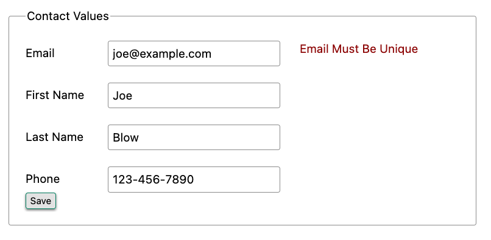
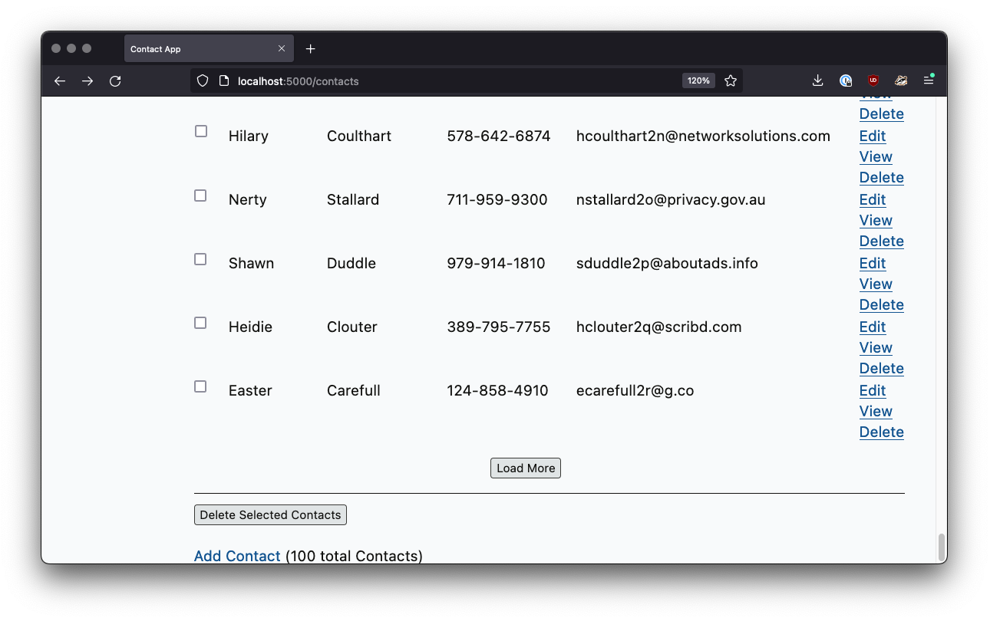

# HTML šabloni

[Sadržaj](000.md)

Sada kada smo videli kako htmx proširuje HTML kao hipermediju, vreme je da to primenimo u praksi. Dok koristimo htmx, i dalje ćemo koristiti hipermediju: izdaćemo HTTP zahteve i dobijati HTML nazad. Ali, sa dodatnom funkcionalnošću koju htmx pruža, imaćemo moćniju hipermedijuza rad, što će nam omogućiti da ostvarimo mnogo sofisticiranije interfejse.

Ovo će nam omogućiti da se pozabavimo problemima korisničkog iskustva, kao što su dugi ciklusi povratnih informacija ili mučno osvežavanje stranice, bez potrebe za pisanjem mnogo, ako uopšte ikakvog, JavaScript koda i bez kreiranja JSON API-ja. Sve će biti implementirano u hipermediji, koristeći osnovne hipermedijske koncepte ranog veba.

## Instaliranje Htmx-a

Prvo što treba da uradimo jeste da instaliramo htmx u našu veb aplikaciju. To ćemo uraditi preuzimanjem izvornog koda i njegovim lokalnim čuvanjem u našoj aplikaciji, tako da nećemo zavisiti ni od jednog spoljnog sistema. Ovo se naziva "prodaja" biblioteke. Najnoviju verziju htmx-a možemo preuzeti tako što ćemo u našem pregledaču otići na <https://unpkg.com/htmx.org>, što će nas preusmeriti na izvorni kod najnovije verzije biblioteke.

Možemo sačuvati sadržaj sa ove URL adrese u "static/js/htmx.js" datoteku u našem projektu.

Naravno, možete koristiti sofisticiraniji JavaScript menadžer paketa kao što je Node Package Manager (NPM) ili yarn da biste instalirali htmx. To radite tako što ćete pozvati njegovo ime paketa, htmx.org, na način koji je prikladan za vaš alat. Međutim, htmx je veoma mali (približno 12kb kada se kompresuje i zipuje) i ne zavisi od zavisnosti, tako da njegovo korišćenje ne zahteva složen mehanizam ili alat za izgradnju.

Kada je htmx preuzet lokalno u naš "/static/js" direktorijum aplikacija, sada ga možemo učitati u našu aplikaciju. To radimo dodavanjem sledeće `script` oznake oznaci `head` u našoj "layout.html" datoteci, što će htmx učiniti dostupnim i aktivnim na svakoj stranici u našoj aplikaciji:

```html
<head>
    <script src="/js/htmx.js"></script>
    ...
</head>
```

Kod 6.1 - Instaliranje htmlx-a

Podsetimo se da "layout.html" je datoteka izgleda koja je uključena u većinu šablona i koja obavija sadržaj tih šablona u uobičajeni HTML, uključujući `head` element koji ovde koristimo za instaliranje htmx-a.

Verovali ili ne, to je to! Ova jednostavna skriptna oznaka će učiniti funkcionalnost htmx-a dostupnom u celoj našoj aplikaciji.

## AJAX-ifikacija naše aplikacije

Da bismo se upoznali sa htmx-om, prva funkcija koju ćemo iskoristiti je poznata kao "pojačavanje". Ovo je pomalo "magična" funkcija po tome što ne moramo mnogo da radimo osim dodavanja jednog atributa, `hx-boost`, aplikaciji.

Kada dodate `hx-boost` datom elementu sa vrednošću `true`, on će "pojačati" sve sidra i elemente forme unutar tog elementa. "Pojačavanje", ovde, znači da će htmx konvertovati sva ta sidra i forme iz "normalnih" hipermedijalnih kontrola u AJAX-pokrenute hipermedijalne kontrole. Umesto izdavanja "normalnih" HTTP zahteva koji zamenjuju celu stranicu, linkovi i obrasci će izdavati AJAX zahteve. Htmx zatim zamenjuje unutrašnji sadržaj oznake `<body>` u odgovoru na ove zahteve u postojeću `<body>` oznaku stranice.

Ovo čini navigaciju bržom jer pregledač neće ponovo interpretirati većinu oznaka u odgovoru `<head>` i tako dalje.

### Pojačani linkovi

Pogledajmo primer poboljšane veze. Ispod je veza do hipotetičke stranice sa podešavanjima za veb aplikaciju. Pošto ima `hx-boost="true"`, htmx će zaustaviti normalno ponašanje veze izdavanjem zahteva putanji "/settings" i zamenom cele stranice odgovorom. Umesto toga, htmx će izdati AJAX zahtev za "/settings", uzeti rezultat i zameniti `body` element novim sadržajem.

```html
<a href="/settings" hx-boost="true">Settings</a>    <1>
```

Kod 6.2 - Pojačana veza

Atribut `hx-boost` čini ovu vezu AJAX-om.

Možda se razumno pitate: koja je prednost ovde? Izdajemo AJAX zahtev i jednostavno zamenjujemo celo telo.

- Da li se to značajno razlikuje od samog izdavanja običnog zahteva za povezivanje?
  Da, zapravo je drugačije: sa poboljšanim linkom, pregledač je u mogućnosti da izbegne bilo kakvu obradu povezanu sa oznakom "head". Oznaka "head" često sadrži mnogo skripti i referenci CSS datoteka. U poboljšanom scenariju, nije potrebno ponovo obrađivati te resurse: skripte i stilovi su već obrađeni i nastaviće da se primenjuju na novi sadržaj. Ovo često može biti veoma jednostavan način da ubrzate svoju hipermedijalnu aplikaciju.

- Da li odgovor treba posebno formatirati da bi radio sa `hx-boost`? Na kraju krajeva, stranica sa podešavanjima bi obično prikazala html oznaku, sa `head` oznakom i tako dalje. Da li je potrebno posebno obrađivati "pojačane" zahteve?

Odgovor je Ne: htmx je dovoljno pametan da izvuče samo sadržaj oznake `body` i zameni je na novoj stranici. Oznaka `head` se uglavnom ignoriše: obrađivaće se samo oznaka naslova, ako je prisutna. To znači da ne morate ništa posebno da radite na strani servera da biste prikazali šablone koji `hx-boost` mogu da obrade: samo vratite normalan HTML za vašu stranicu i trebalo bi da radi dobro.

Imajte na umu da će poboljšani linkovi (i forme) takođe nastaviti da ažuriraju navigacionu traku i istoriju, baš kao i normalni linkovi, tako da će korisnici moći da koriste dugme za nazad u pregledaču, da kopiraju i lepe URL-ove (ili "duboke linkove") i tako dalje. Linkovi će se ponašati manje-više kao "normalni", samo će biti brži.

### Pojačane forme

Pojačane oznake forme funkcionišu na sličan način kao i pojačane oznake sidra: pojačana forma će koristiti AJAX zahtev umesto uobičajenog zahteva koji izdaje pregledač i zameniće celo telo odgovorom.

Evo primera formulara koji šalje poruke krajnjoj "/messages" tački koristeći HTTP POST zahtev. Dodavanjem `hx-boost`, ti zahtevi će se vršiti u AJAX-u, umesto uobičajenim ponašanjem pregledača.

```html
<form action="/messages" method="post" hx-boost="true">             <1>
    <input type="text" name="message" placeholder="Enter A Message...">
    <button>Post Your Message</button>
</form>
```

Kod 6.3 - Pojačana forma

Kao i kod linka, `hx-boost` čini ovaj obrazac AJAX-om.

Velika prednost zahteva zasnovanog na AJAX-u koji `hx-boost` koristi (i nedostatak obrade zaglavlja koja se dešava) jeste to što izbegava ono što je poznato kao bljesak nestilizovanog sadržaja:

**Bljesak nestilizovanog sadržaja (FOUC)**:

Situacija u kojoj pregledač prikazuje veb stranicu pre nego što su sve informacije o stilu dostupne za tu stranicu. FOUC (Full Use Out) izaziva uznemirujući trenutni "bljesak" nestilizovanog sadržaja, koji se zatim restilizuje kada su sve informacije o stilu dostupne. Primetićete ovo kao treperenje kada se krećete po internetu: tekst, slike i drugi sadržaj mogu "skakati" po stranici dok se na njega primenjuju stilovi.

Pošto kod `hx-boost` stil sajta već učitan pre nego što se novi sadržaj preuzme, nema takvog bljeska nestilizovanog sadržaja. Ovo može učiniti da "poboljšana" aplikacija deluje glađe i generalno brže.

### Nasleđivanje atributa

Hajde da proširimo naš prethodni primer pojačanog linka i dodamo još nekoliko pojačanih linkova pored njega. Dodaćemo linkove tako da imamo jedan do "/contacts" stranice, "/settings" stranice i "/help" stranice. Svi ovi linkovi su pojačani i ponašaće se na način koji smo gore opisali.

Ovo deluje pomalo suvišno, zar ne? Deluje glupo anotirati sva tri linka atributom `hx-boost="true"` jedan pored drugog.

```html
<a href="/contacts" hx-boost="true">Contacts</a>
<a href="/settings" hx-boost="true">Settings</a>
<a href="/help" hx-boost="true">Help</a>
```

Kod 6.4 - Skup poboljšanih linkova

Htmx nudi funkciju koja pomaže u smanjenju ove redundantnosti: nasleđivanje atributa. Kod većine atributa u htmx-u, ako ga postavite na roditeljski element, atribut će se primeniti i na podređene elemente. Ovako funkcionišu kaskadni stilski listovi, i ta ideja je inspirisala htmx da usvoji sličnu funkciju "kaskadnih htmx atributa".

Da bismo izbegli suvišnost u ovom primeru, uvedimo `div` element koji obuhvata sve veze, a zatim "podignimo" `hx-boost` atribut do tog roditeljskog elementa `div`. Ovo će nam omogućiti da uklonimo suvišne `hx-boost` atribute, ali će osigurati da su sve veze i dalje pojačane, nasleđujući tu funkcionalnost od roditeljskog elementa `div`.

Imajte na umu da se ovde može koristiti bilo koji legalni HTML element, mi koristimo samo `div` iz navike.

```html
<div hx-boost="true"> <1>
    <a href="/contacts">Contacts</a>
    <a href="/settings">Settings</a>
    <a href="/help">Help</a>
</div>
```

Kod 6.5 - Pojačavanje linkova preko roditeljskog elementa

`hx-boost` je premešteno u nadređeni `div`.

Sada ne moramo da stavljamo `hx-boost="true"` na svaki link i, zapravo, možemo da dodamo još linkova pored postojećih, i oni će takođe biti poboljšani, bez potrebe da ih eksplicitno anotiramo.

To je u redu, ali šta ako imate vezu koju ne želite da se pojača unutar elementa koji ima `hx-boost="true"` na njoj? Dobar primer ove situacije je kada je veza ka resursu koji treba preuzeti, kao što je PDF. Preuzimanje datoteke ne može se dobro obraditi AJAX zahtevom, tako da verovatno želite da se ta veza ponaša "normalno", izdajući zahtev za celu stranicu za PDF, koji će pregledač zatim ponuditi da sačuva kao datoteku na lokalnom sistemu korisnika.

Da biste rešili ovu situaciju, jednostavno prevazilazite roditeljsku `hx-boost` vrednost sa `hx-boost="false"` na oznaci sidra koju ne želite da pojačate:

```html
<div hx-boost="true">                                   <1>
    <a href="/contacts">Contacts</a>
    <a href="/settings">Settings</a>
    <a href="/help">Help</a>
    <a href="/help/documentation.pdf" hx-boost="false"> <2>
        Download Docs
    </a>
</div>
```

Kod 6.6 - Onemogućavanje pojačavanja na jednom od pojačanih linkova

`hx-boost` i dalje je na roditeljskom `div`-u.

Ponašanje pojačavanja je zamenjeno za ovu vezu.

Ovde imamo novi link ka PDF dokumentaciji za koji želimo da funkcioniše kao običan link. Dodali smo `hx-boost="false"` u link i ova deklaracija će prepisati `hx-boost="true"` na roditeljskom div, vraćajući ga na ponašanje običnog linka i time omogućavajući ponašanje preuzimanja datoteke koje želimo.

## Progresivno poboljšanje

Lep aspekt `hx-boost` je to što je to primer progresivnog poboljšanja:

> [!Note]
>
> **Progrsivno poboljšanje**  
> To je filozofija dizajna softvera koja ima za cilj da pruži što više neophodnog sadržaja i funkcionalnosti što većem broju korisnika, uz istovremeno pružanje boljeg iskustva korisnicima sa naprednijim veb pregledačima.

Razmotrite linkove u gornjem primeru. Šta bi se desilo da neki od njih nije imao omogućen JavaScript?

Nema problema. Aplikacija bi nastavila da radi, ali bi izdavala redovne HTTP zahteve, umesto HTTP zahteva zasnovanih na AJAX-u. To znači da će vaša veb aplikacija raditi za maksimalan broj korisnika; oni sa modernim pregledačima (ili korisnici koji nisu isključili JavaScript) mogu iskoristiti prednosti AJAX navigacije koju htmx nudi, a drugi i dalje mogu bez problema da koriste aplikaciju.

Uporedite ponašanje atributa htmx `hx-boost` sa jednostraničnom aplikacijom koja koristi mnogo JavaScript-a: takva aplikacija često uopšte neće funkcionisati bez omogućenog JavaScript-a. Često je veoma teško usvojiti progresivni pristup poboljšanja kada koristite SPA okvir.

To ne znači da svaka htmx funkcija nudi progresivno poboljšanje. Svakako je moguće napraviti funkcije koje ne nude rezervnu opciju "Bez JS-a u htmlx-u", i, zapravo, mnoge funkcije koje ćemo kasnije napraviti u knjizi spadaće u ovu kategoriju. Napomenućemo kada je funkcija pogodna za progresivno poboljšanje, a kada nije.

Na kraju krajeva, na vama je, programeru, da odlučite da li su kompromisi progresivnog poboljšanja (osnovniji UX, ograničena poboljšanja u odnosu na običan HTML) vredni prednosti za korisnike vaše aplikacije.

### Prvi korak - dodavanje `hx-boost` u Contact.app

Za Kontakt aplikaciju koju pravimo, želimo ovo ponašanje "pojačanja" u htmx formatu... pa, svuda.

Je l' tako? Zašto da ne?

Kako bismo to mogli postići?

Pa, jednostavno je (i prilično uobičajeno u veb aplikacijama zasnovanim na htmx-u): možemo samo da dodamo `hx-boost` u oznaku `body` našeg "layout.html" šablona i završili smo.

```html
<html>
    ...
    <body hx-boost="true"> <1>
    ...
    </body>
</html>
```

Kod 6.7 - Unapređenje cele aplikacije "contact.app"

Svi linkovi i obrasci će sada biti poboljšani!

Sada će svaki link i obrazac u našoj aplikaciji podrazumevano koristiti AJAX, što će je učiniti mnogo bržom. Razmotrite link "Add contact" koji smo kreirali na glavnoj stranici:

```html
<a href="/contacts/new">Add Contact</a>
```

Kod 6.8 - Novopojačana veza "dodaj kontakt"

Iako nismo ništa dotakli u vezi sa ovim linkom ili obradom URL-a na koji cilja na strani servera, sada će "samo raditi" kao poboljšani link, koristeći AJAX za brže korisničko iskustvo, uključujući istoriju ažuriranja, podršku za dugme za nazad i tako dalje. A ako JavaScript nije omogućen, vratiće se na normalno ponašanje linka.

Sve ovo sa jednim htmx atributom.

Atribut `hx-boost` je uredan, ali se razlikuje od ostalih htmx atributa po tome što je prilično "magičan": jednom malom promenom menjate ponašanje velikog broja elemenata na stranici, pretvarajući ih u AJAX-om pokretane elemente. Većina ostalih htmx atributa je generalno nižeg nivoa i zahteva eksplicitnije anotacije kako bi se tačno navelo šta želite da htmx radi. Generalno, ovo je filozofija dizajna htmx-a: preferirajte eksplicitno u odnosu na implicitno i očigledno u odnosu na "magiju".

Međutim, `hx-boost` atribut je bio previše koristan da bi dozvolio dogmi da nadjača praktičnost, pa je zato uključen kao funkcija u biblioteku.

### Drugi korak - brisanja kontakata sa HTTP DELETE

Za naš sledeći korak sa htmx-om, podsetimo se da "Contact.app" ima mali obrazac na stranici za uređivanje kontakta koji se koristi za brisanje kontakta:

```html
<form action="/contacts/{{ contact.id }}/delete" method="post">
    <button>Delete Contact</button>
</form>
```

Kod 6.9 - Običan HTML obrazac za brisanje kontakta

Ovaj obrazac je izdao HTTP POST zahtev, na primer, /contacts/42/delete, kako bi izbrisao kontakt sa ID-om 42.

Već smo pomenuli da je jedna od dosadnih stvari kod HTML-a to što ne možete direktno izdati HTTP DELETE (ili PUTil i PATCH) zahtev, iako su svi oni deo HTTP-a, a HTTP je očigledno dizajniran za prenos HTML-a.

Srećom, sada, sa htmx-om, imamo priliku da ispravimo ovu situaciju.

"Ispravna stvar", iz RESTful perspektive, orijentisane na resurse, jeste, umesto izdavanja HTTP zahteva POST ka "/contacts/42/delete", izdati HTTP zahtev DELETE ka "/contacts/42". Želimo da obrišemo kontakt. Kontakt je resurs. URL adresa za taj resurs je "/contacts/42". Dakle, idealno je DELETE zahtev ka "/contacts/42/".

Hajde da ažuriramo našu aplikaciju da bi to uradila dodavanjem `hx-delete` atributa htmx dugmetu "Delete Contact":

```html
<button hx-delete="/contacts/{{ contact.id }}">Delete Contact</button>
```

Kod 6.10 - Dugme za brisanje kontakta zasnovano na htmx-u

Sada, kada korisnik klikne na ovo dugme, htmx će izdati HTTP DELETE zahtev putem AJAX-a ka URL-u za dotični kontakt.

Nekoliko stvari koje treba primetiti:

- Više nam nije potrebna formo znaka za obmotavanje dugmeta, jer samo dugme nosi hipermedijsku akciju koju direktno izvršava na sebi.
- Više ne moramo da koristimo pomalo nespretnu `"/contacts/{{ contact.id }}/delete`" rutu, već jednostavno možemo da koristimo `"/contacts/{{ contact.id }}"` rutu, pošto izdajemo DELETE zahtev. Korišćenjem DELETE pravimo razliku između zahteva namenjenog ažuriranju kontakta i zahteva namenjenog njegovom brisanju, koristeći izvorne HTTP alate dostupne upravo iz tog razloga.

Imajte na umu da smo ovde uradili nešto prilično magično: pretvorili smo ovo dugme u hipermedijsku kontrolu. Više nije potrebno da ovo dugme bude postavljeno unutar veće `form` oznake da bi se pokrenuo HTTP zahtev: ono je samostalna i potpuno funkcionalna hipermedijska kontrola. Ovo je srž htmx-a, omogućavajući bilo kom elementu da postane hipermedijska kontrola i u potpunosti učestvuje u hipermedijskoj aplikaciji.

Takođe treba napomenuti da, za razliku od `hx-boost` gore navedenih primera, ovo rešenje se neće degradirati graciozno. Da bi se ovo rešenje degradiralo graciozno, morali bismo da umotamo dugme u element `forme` i da ga obrađujemo POST na strani servera.

Da bismo našu aplikaciju učinili jednostavnom, izostavićemo to složenije rešenje.

Ažurirali smo kod na strani klijenta (ako se HTML može smatrati kodom) tako da sada izdaje zahtev DELETE odgovarajućem URL-u, ali još uvek imamo posla. Pošto smo ažurirali i rutu i HTTP metod koji koristimo, moraćemo da ažuriramo i implementaciju na strani servera kako bismo obradili ovaj novi HTTP zahtev.

### Ažuriranje koda na strani servera za DELETE handler

```py
@app.route("/contacts/<contact_id>/delete", methods=["POST"])
def contacts_delete(contact_id=0):
    contact = Contact.find(contact_id)
    contact.delete()
    flash("Deleted Contact!")

    return redirect("/contacts")
```

Kod 6.11 - Originalni serverski kod za brisanje kontakta

Moraćemo da napravimo dve izmene u našem rukovaocu: ažuriramo rutu i ažuriramo HTTP metod koji koristimo za brisanje kontakata.

```py
@app.route("/contacts/<contact_id>", methods=["DELETE"]) <1>
def contacts_delete(contact_id=0):
    contact = Contact.find(contact_id)
    contact.delete()
    flash("Deleted Contact!")
    return redirect("/contacts")
```

Kod 6.12 - Ažurirani rukovalac sa novom rutom i metodom

1. Ažurirana putanja i metoda za rukovaoca.  
   Prilično jednostavno, i mnogo čistije.

### Problem sa kodom odgovora

Kod odgovora, shvatio sam nažalost, postoji problem sa našim ažuriranim rukovaocem: podrazumevano, u Flaskov `redirect()` metod odgovara sa `302 Found` HTTP kodom odgovora.

Prema veb dokumentima Mozilla Developer Network (MDN) o odgovoru `302 Found`, to znači da će HTTP metod zahteva ostati nepromenjen kada se izda preusmereni HTTP zahtev.

Sada izdajemo DELETE zahtev sa htmx, a zatim nas flask preusmerava na "/contacts" putanju. Prema ovoj logici, to bi značilo da bi preusmereni HTTP zahtev i dalje bio DELETE metoda. To znači da će, kako sada stvari stoje, pregledač izdati DELETE zahtev za /contacts.

Ovo definitivno nije ono što želimo: želeli bismo da HTTP preusmeravanje izda GET zahtev, malo menjajući ponašanje `Post/Redirect/Get` o kome smo ranije govorili da bude `Delete/Redirect/Get`.

Srećom, postoji drugačiji kod odgovora, `303 See Other`, koji radi ono što želimo: kada pregledač primi `303 See Other` odgovor za preusmeravanje, izdaće GET na novu lokaciju.

Dakle, želimo da ažuriramo naš kod da koristi `303` kod odgovora u kontroleru.

Srećom, ovo je veoma jednostavno: postoji drugi parametar koji `redirect()` uzima,  numerički kod odgovora koji želite da pošaljete.

```py
@app.route("/contacts/<contact_id>", methods=["DELETE"])
def contacts_delete(contact_id=0):
    contact = Contact.find(contact_id)
    contact.delete()
    flash("Deleted Contact!")

    return redirect("/contacts", 303) <1>
```

Kod 6.13- Ažurirani obrađivač sa 303 odgovorom preusmeravanja

Kod odgovora je sada 303.

Sada, kada želite da uklonite dati kontakt, možete jednostavno da pošaljete zahtev DELETE na isti URL koji ste koristili za pristup kontaktu.

Ovo je prirodan pristup brisanju resursa zasnovan na HTTP-u.

### Ciljanje pravog elementa

Nismo sasvim završili sa našim ažuriranim dugmetom za brisanje. Podsetimo se da, podrazumevano, htmx "cilja" element koji pokreće zahtev i postaviće HTML koji vraća server unutar tog elementa. Trenutno, dugme "Obriši kontakt" cilja samo sebe.

To znači da, pošto će preusmeravanje na "/contacts" URL ponovo prikazati celu listu kontakata, završićemo sa tom listom kontakata smeštenom unutar dugmeta "Delete contact".

Ovakvo pogrešno ciljanje se povremeno javlja kada radite sa htmx-om i može dovesti do nekih prilično smešnih situacija.

Rešenje za ovo je jednostavno: dodajte eksplicitni cilj dugmetu i ciljajte `body` element odgovorom:

```html
<button hx-delete="/contacts/{{ contact.id }}"
    hx-target="body">                               <1>
        Delete Contact
</button>
```

Kod 6.14 - Fiksno dugme za brisanje kontakta zasnovano na htmlx-u

1. Dugmetu je dodat eksplicitni cilj.

Sada se naše dugme ponaša kako se očekuje: klikom na dugme poslaće se HTTP zahtev DELETE serveru za URL adresu trenutnog kontakta, obrisati kontakt i preusmeriti nazad na stranicu sa listom kontakata, sa lepom fleš porukom.

Da li sada sve funkcioniše glatko?

### Pravilno ažuriranje URL-a trake lokacije

Pa, skoro.

Ako kliknete na dugme, primetićete da, uprkos preusmeravanju, URL u traci lokacije nije ispravan. I dalje ukazuje na "/contacts/{{ contact.id }}". To je zato što nismo rekli htmx-u da ažurira URL: on samo izdaje DELETE zahtev, a zatim ažurira DOM odgovorom.

Kao što smo pomenuli, pojačavanje preko `hx-boost` će prirodno ažurirati traku lokacije umesto vas, oponašajući normalna sidra i forme, ali u ovom slučaju pravimo prilagođenu kontrolu hipermedijskog dugmeta za izdanje DELETE. Moramo da obavestimo htmx da želimo da se rezultujući URL iz ovog zahteva "ubaci" u traku lokacije.

To možemo postići dodavanjem `hx-push-url` atributa sa vrednošću `true` našem dugmetu:

```html
<button hx-delete="/contacts/{{ contact.id }}"
    hx-target="body"
    hx-push-url="true">                         <1>
        Delete Contact
</button>
```

Kod 6.15 - Brisanje kontakta, sada sa ispravnim informacijama o lokaciji

1. Kažemo htmx-u da pošalje preusmereni URL nagore u traku lokacije.

Sada smo završili.

Imamo dugme koje samo po sebi može da izda pravilno formatirani HTTP DELETE zahtev ka ispravnoj URL adresi, a korisnički interfejs i traka lokacije se ispravno ažuriraju. Ovo je postignuto pomoću tri deklarativna atributa postavljena direktno na dugme: `hx-delete`, `hx-target` i `hx-push-url`.

Ovo je zahtevalo više posla nego sama `hx-boost` promena, ali eksplicitni kod olakšava uočavanje šta dugme radi kao prilagođena hipermedijska kontrola. Dobijeno rešenje deluje čisto; koristi ugrađene funkcije veba kao hipermedijskog sistema bez ikakvih URL hakova.

### Još jedna stvar . dijalog za potvrdu

Postoji još jedna "bonus" funkcija koju možemo dodati našem dugmetu "Obriši kontakt": dijalog za potvrdu. Brisanje kontakta je destruktivna operacija i trenutno, ako korisnik slučajno klikne na dugme "Obriši kontakt", aplikacija bi jednostavno obrisala taj kontakt. Šteta, tako tužno za korisnika.

Srećom, htmx ima jednostavan mehanizam za dodavanje poruke potvrde destruktivnim operacijama poput ove: `hx-confirm` atribut. Možete postaviti ovaj atribut na element, sa porukom kao vrednošću, a JavaScript metoda `confirm()` će biti pozvana pre nego što se izda zahtev, što će korisniku prikazati jednostavan dijalog za potvrdu tražeći od njega da potvrdi akciju. Veoma jednostavno i odličan način za sprečavanje nezgoda.

Evo kako bismo dodali potvrdu operacije brisanja kontakta:

```html
<button hx-delete="/contacts/{{ contact.id }}"
    hx-target="body"
    hx-push-url="true"
    hx-confirm="Are you sure you want to delete this contact?">         <1>
        Delete Contact
</button>
```

Kod 6.16 - Potvrđivanje brisanja

1. Poruka će biti prikazana korisniku, tražeći od njega da potvrdi brisanje.

Sada, kada neko klikne na dugme "Delete contact", biće mu prikazan upit sa pitanjem "Da li ste sigurni da želite da izbrišete ovaj kontakt?" i imaće priliku da otkaže ako je greškom kliknuo na dugme. Veoma lepo.

Sa ovom poslednjom promenom sada imamo prilično solidan mehanizam za "brisanje kontakta": koristimo ispravne RESTful rute i HTTP metode, potvrđujemo brisanje i uklonili smo mnogo toga što nam nameće normalan HTML, a sve to uz korišćenje deklarativnih atributa u našem HTML-u i čvrsto ostajući u okviru normalnog hipermedijalnog modela veba.

### Progresivno poboljšanje?

Kao što smo ranije napomenuli u vezi sa ovim rešenjem: ono nije progresivno poboljšanje naše veb aplikacije. Ako je neko onemogućio JavaScript, onda ovo dugme "Delete contact" više neće raditi. Morali bismo da obavimo dodatni posao kako bismo održali funkciju starijeg mehanizma zasnovanog na obrascima u okruženju sa onemogućenim JavaScript-om.

Progresivno poboljšanje može biti aktuelna tema u veb razvoju, sa mnoštvom strastvenih mišljenja i perspektiva. Kao i skoro sve JavaScript biblioteke, htmx omogućava kreiranje aplikacija koje ne funkcionišu u odsustvu JavaScript-a. Zadržavanje podrške za klijente koji ne koriste JavaScript zahteva dodatni rad i složenost u vašoj aplikaciji. Važno je da tačno utvrdite koliko je važna podrška za klijente koji ne koriste JavaScript pre nego što počnete da koristite htmx ili bilo koji drugi JavaScript okvir za poboljšanje vaših veb aplikacija.

## Validiranje kontakt e-mail adrese

Pređimo na još jedno poboljšanje naše aplikacije. Veliki deo svake veb aplikacije je validacija podataka koji se šalju serveru: osiguravanje da su imejlovi pravilno formatirani i jedinstveni, da su
numeričke vrednosti validne, da su datumi prihvatljivi i tako dalje.

Trenutno, naša aplikacija ima malu količinu validacije koja se obavlja u potpunosti na strani servera i koja prikazuje poruku o grešci kada se otkrije greška.

Nećemo ulaziti u detalje o tome kako validacija funkcioniše u objektima modela, ali ćemo se podsetiti kako izgleda kod za ažuriranje kontakta iz poglavlja 3:

```py
def contacts_edit_post(contact_id=0):
    c = Contact.find(contact_id)
    c.update(
      request.form['first_name'],
      request.form['last_name'],
      request.form['phone'],
      request.form['email'])                                <1>

    if c.save():
        flash("Updated Contact!")
        return redirect("/contacts/" + str(contact_id))
    else:
        return render_template("edit.html", contact=c)      <2>
```

Kod 6.17 - Validacija na strani servera pri ažuriranju kontakta

1. Pokušavamo da sačuvamo kontakt.
2. Ako čuvanje ne uspe, ponovo prikazujemo obrazac da bismo prikazali poruke o grešci.

Dakle, pokušavamo da sačuvamo kontakt i, ako `save()` metod vrati vrednost `true`, preusmeravamo na stranicu sa detaljima kontakta. Ako metod `save()` ne vrati vrednost `true`, to ukazuje na grešku u validaciji; umesto preusmeravanja, ponovo prikazujemo HTML za uređivanje kontakta. Ovo daje korisniku priliku da ispravi greške, koje se prikazuju pored unosa.

Hajde da pogledamo HTML za unos imejla:

```html
<p>
<label for="email">Email</label>
<input name="email" id="email" type="text"
    placeholder="Email" value="{{ contact.email }}">
<span class="error">{{ contact.errors['email'] }}</span> <1>
</p>
```

Kod 6.18 - Poruke o greškama pri validaciji

1. Prikaži sve greške povezane sa poljem email

Imamo oznaku za unos, unos tipa text, a zatim malo HTML-a za prikazivanje svih poruka o greškama povezanih sa imejlom. Kada se šablon prikaže na serveru, ako postoje greške povezane sa imejlom kontakta, one će biti prikazane u ovom rasponu, koji će biti označen crvenom bojom.



Slika 6.1 - Poruka o grešci

Poruka o grešci koja se prikazuje kada korisnik pokuša da sačuva kontakt sa postojećom imejl adresom je "Imejl adresa mora biti jedinstvena", kao što je prikazano na gornjoj slici.

Greška u validaciji imejl adrese

Sve se ovo radi korišćenjem običnog HTML-a i korišćenjem Web 1.0 tehnika, i dobro funkcioniše.

Međutim, kako aplikacija trenutno izgleda, postoje dve smetnje.

- Prvo, ne postoji validacija formata e-pošte: možete uneti bilo koje znakove koje želite kao e-poštu i, sve dok su jedinstveni, sistem će to dozvoliti.

- Drugo, proveravamo jedinstvenost imejla samo kada se pošalju svi podaci: ako je korisnik uneo duplikat imejla, neće to saznati dok ne popuni sva polja. Ovo bi moglo biti prilično dosadno ako je korisnik slučajno ponovo unosio kontakt i morao je da unese sve kontakt informacije pre nego što je bio obavešten o toj činjenici.

### Ažuriranje našeg email unosa

Za prvi problem, imamo čisti HTML mehanizam za poboljšanje naše aplikacije: HTML 5 podržava unose tipa email. Sve što treba da uradimo je da promenimo naš unos sa tipa `text` na tip `email`, a pregledač će nametnuti da uneta vrednost pravilno odgovara formatu imejla:

```html
<p>
<label for="email">Email</label>
<input name="email" id="email" type="email"                 <1>
    placeholder="Email" value="{{ contact.email }}">
<span class="error">{{ contact.errors['email'] }}</span>
</p>
```

Kod 6.19 - Promena unosa u tip email

1. Promena atributa type osigurava da su unete email vrednosti validne imejl adrese.

Ovom promenom, kada korisnik unese vrednost koja nije važeća imejl adresa, pregledač će prikazati poruku o grešci u kojoj se traži da se u to polje unese ispravno oblikovana imejl adresa.

Dakle, jednostavna promena jednog atributa urađena u čistom HTML-u poboljšava našu validaciju i rešava prvi problem koji smo primetili.

---

> [!Note]
>
> **Server-Side vs. Client-Side Validations**  
> Iskusni veb programeri možda bruse zube na kodu iznad: ova validacija se vrši na strani klijenta. To jest, oslanjamo se na pretraživač da otkrije neispravnu e-poštu i ispravi korisnika. Nažalost, klijentska strana nije pouzdana: pretraživač može imati grešku u sebi koja omogućava korisniku da zaobiđe ovaj kod za validaciju. Ili, još gore, korisnik može biti zlonameran i smisliti mehanizam oko naše validacije u potpunosti, kao što je korišćenje konzole za programere za uređivanje HTML-a.
>
> Ovo je stalna opasnost u veb razvoju: svim validacijama koje se vrše na strani klijenta ne može se verovati i, ako je validacija važna, moraju se preraditi na strani servera. Ovo je manji problem u aplikacijama vođenim hipermedijama nego u aplikacijama na jednoj stranici, jer je fokus HDA-a na strani servera, ali vredi imati na umu dok gradite svoju aplikaciju.

---

### Inline validacija

Iako smo malo poboljšali naše iskustvo validacije, korisnik i dalje mora da pošalje formu da bi dobio povratne informacije o dupliranim imejlovima. Zato možemo da koristimo htmx da bismo poboljšali ovo korisničko iskustvo.

Bilo bi bolje kada bi korisnik mogao da vidi grešku dupliranja imejl adrese odmah nakon unosa vrednosti imejl adrese. Ispostavlja se da unosi pokreću događaj `change` i, zapravo, taj `change` događaj je podrazumevani okidač za unose u htmx-u. Dakle, stavljajući ovu funkciju u rad, možemo implementirati sledeće ponašanje: kada korisnik unese imejl adresu, odmah se izda zahtev serveru i validira ta imejl adresa, i po potrebi se prikazuje poruka o grešci.

Podsetimo se trenutnog HTML-a za naš unos imejla:

```html
<p>
<label for="email">Email</label>
<input name="email" id="email" type="email"
    placeholder="Email" value="{{ contact.email }}"> <1>
<span class="error">{{ contact.errors['email'] }}</span> <2>

</p>
```

Kod 6.20 - Početna konfiguracija e-pošte

1. Ovo je ulaz koji želimo da pokrene HTTP zahtev za validaciju imejla.
2. Ovo je span u koji želimo da smestimo poruku o grešci, ako je ima.

Dakle, želimo da dodamo `hx-get` atribut ovom ulazu. Ovo će uzrokovati da ulaz izda HTTP GET zahtev datom URL-u radi validacije imejla. Zatim želimo da ciljamo `span` grešaka koji sledi ulaz sa bilo kojom porukom o grešci koju vraća server.

Hajde da napravimo te izmene u našem HTML-u:

```html
<p>
<label for="email">Email</label>
<input name="email" id="email" type="email"
    hx-get="/contacts/{{ contact.id }}/email"               <1>
    hx-target="next.error"                                  <2>
    placeholder="Email" value="{{ contact.email }}">
<span class="error">{{ contact.errors['email'] }}</span>
</p>
```

Kod 6.21 - Naš ažurirani HTML

1. Izdajte HTTP GET poruku krajnjoj email tački za kontakt.
2. Cilja sledeći element sa klasom error na njemu.

Imajte na umu da u `hx-target` atributu koristimo relativni pozicioni selektor, `next`. Ovo je karakteristika htmx-a i proširenje normalnog CSS-a. Htmx podržava prefikse koji će pronaći ciljeve relativno u odnosu na trenutni element.

---

> [!Note]
>
> **Relativni pozicioni izrazi u htmx**  
>
> - **next** - Skenirajte napred u DOM-u za sledeći odgovarajući element, npr. `next error`  
> - **previous** - Skenirajte unazad u DOM-u za najbliži prethodni odgovarajući element, npr. `previous alert`  
> - **closest** - Skenirajte roditelje ovog elementa za odgovarajući element, npr. `closest table`  
> - **find** - Skenirajte decu ovog elementa za odgovarajući element,  npr. `find span`  
> - **this** - Trenutni element je `target` (podrazumevano).

---

Korišćenjem relativnih pozicionih izraza možemo izbeći dodavanje eksplicitnih identifikatora elementima i iskoristiti lokalnu strukturu HTML-a.

Dakle, u našem primeru sa dodatnim hx-getatributima hx-targeti, kad god neko promeni vrednost unosa (podsetimo se, changeje podrazumevani okidač za unose u htmlx-u), biće izdat HTTP GETzahtev na dati URL. Ako postoje greške, one će biti učitane u raspon grešaka.

### Validacija imejlova na strani servera

Zatim, pogledajmo implementaciju na strani servera. Dodaćemo još jednu krajnju tačku, sličnu našoj krajnjoj tački za uređivanje na neke načine: ona će pretraživati kontakt na osnovu ID-a kodiranog u URL-u. U ovom slučaju, međutim, želimo samo da ažuriramo imejl adresu kontakta i očigledno ne želimo da je sačuvamo! Umesto toga, pozvaćemo metodu `validate()` na njoj.

Ta metoda će potvrditi da je imejl jedinstven i tako dalje. U tom trenutku možemo direktno vratiti sve greške povezane sa imejlom ili prazan string ako ne postoji.

```py
@app.route("/contacts/<contact_id>/email", methods=["GET"])
def contacts_email_get(contact_id=0):
    c = Contact.find(contact_id)                <1>
    c.email = request.args.get('email')         <2>
    c.validate()                                <3>
    return c.errors.get('email') or ""          <4>
```

Kod 6.22 - Kod za našu krajnju tačku za validaciju imejla

1. Potražite kontakt po ID-u.
2. Ažurirajte njegovu imejl adresu (imajte na umu da pošto je ovo GET, koristimo argssvojstvo, a ne formsvojstvo ).
3. Potvrdite kontakt.
4. Vrati prazan string, ili greške povezane sa poljem za imejl ili, ako ih nema, prazan string.

Sa ovim malim delom koda na strani servera, sada imamo sledeće korisničko iskustvo: kada korisnik unese imejl adresu i pređe na sledeće polje za unos pomoću tastera Tab, odmah se obaveštava ako je imejl adresa već zauzeta.

Imajte na umu da se validacija imejl adrese i dalje vrši kada se ceo kontakt pošalje na ažuriranje, tako da ne postoji opasnost od propuštanja duplih imejl kontakata: jednostavno smo omogućili korisnicima da ranije uoče ovu situaciju korišćenjem htmlx-a.

Takođe je vredno napomenuti da se ova posebna validacija imejla mora obaviti na strani servera: ne možete utvrditi da je imejl jedinstven za sve kontakte osim ako nemate pristup skladištu podataka. Ovo je još jedan pojednostavljujući aspekt aplikacija vođenih hipermedijom: pošto se validacije obavljaju na strani servera, imate pristup svim podacima koji su vam potrebni da biste obavili bilo koju vrstu validacije koju želite.

Ovde ponovo želimo da naglasimo da se ova interakcija u potpunosti odvija unutar hipermedijskog modela: koristimo deklarativne atribute i razmenjujemo hipermediju sa serverom na način veoma sličan načinu na koji funkcionišu linkovi ili obrasci. Ali smo uspeli da dramatično poboljšamo naše korisničko iskustvo.

### Podizanje korisničkog iskustva na viši nivo

Uprkos činjenici da ovde nismo dodali mnogo koda, imamo prilično sofisticiran korisnički interfejs, barem u poređenju sa običnim aplikacijama zasnovanim na HTML-u. Međutim, ako ste koristili naprednije aplikacije sa jednom stranicom, verovatno ste videli obrazac gde se polje za imejl (ili slična vrsta unosa) validira dok kucate.

Ovo deluje kao vrsta interaktivnosti koja je moguća samo sa sofisticiranim, kompleksnim JavaScript okvirom, zar ne?

Pa, ne.

Ispostavlja se da ovu funkcionalnost možete implementirati u htmx-u, koristeći čiste HTML atribute.

U stvari, sve što treba da uradimo jeste da promenimo naš okidač. Trenutno koristimo podrazumevani okidač za unose, a to je `change` događaj. Da bismo validirali dok korisnik kuca, želeli bismo da `keyup` događaj zabeležimo:

```html
<p>
<label for="email">Email</label>
<input name="email" id="email" type="email"
    hx-get="/contacts/{{ contact.id }}/email"
    hx-target="next.error"
    hx-trigger="change, keyup"                              <1>
    placeholder="Email" value="{{ contact.email }}">
<span class="error">{{ contact.errors['email'] }}</span>
</p>
```

Kod 6.23 - Pokretanje sa `keyup` događajima

1. Eksplicitni `keyup` okidač je dodat zajedno sa change.

Sa ovom malom promenom, svaki put kada korisnik ukuca karakter, mi ćemo izdati zahtev i potvrditi imejl. Jednostavno.

### Odlaganje naših zahteva za validaciju

Jednostavno, da, ali verovatno nije ono što želimo: izdavanje novog zahteva za svaki događaj pritiska tastera bilo bi veoma rasipno i potencijalno bi moglo da preoptereti vaš server. Ono što umesto toga želimo jeste da izdamo zahtev samo ako je korisnik pauzirao kratko vreme. Ovo se naziva "odbacivanje" unosa, gde se zahtevi odlažu dok se stvari ne "smire".

Htmx podržava `delay` modifikator za okidače koji vam omogućava da odbijete zahtev dodavanjem kašnjenja pre nego što se zahtev pošalje. Ako se u tom intervalu pojavi drugi događaj iste vrste, htmx neće izdati zahtev i resetovaće tajmer.

Ispostavilo se da je ovo upravo ono što želimo za naš unos imejla: ako je korisnik zauzet kucanjem imejla, nećemo ga prekidati, ali čim napravi pauzu ili napusti polje, izdaćemo zahtev.

Dodajmo kašnjenje od `200` milisekundi okidaču `keyup`, što je dovoljno dugo da se detektuje da je korisnik prestao da kuca.:

```html
<p>
<label for="email">Email</label>
<input name="email" id="email" type="email"
    hx-get="/contacts/{{ contact.id }}/email"
    hx-target="next.error"
    hx-trigger="change, keyup delay:200ms"                  <1>
    placeholder="Email" value="{{ contact.email }}">
<span class="error">{{ contact.errors['email'] }}</span>
</p>
```

Kod 6.24 - Razotkrivanje keyup događaja

1. Debaunciramo `keyup` događaj dodavanjem `delay` modifikatora.

Sada više ne izdajemo niz zahteva za validaciju dok korisnik kuca. Umesto toga, čekamo da korisnik napravi kratku pauzu, a zatim izdajemo zahtev. Mnogo bolje za naš server, a i dalje odlično korisničko iskustvo.

### Ignorisanje nemutirajućih ključeva

Postoji još jedno pitanje koje bi trebalo da rešimo u vezi sa događajem `keyup`: u sadašnjem stanju, izdaćemo zahtev bez obzira na to koji su tasteri pritisnuti, čak i ako su to tasteri koji nemaju uticaja na vrednost unosa, kao što su tasteri sa strelicama. Bilo bi bolje kada bi postojao način da se zahtev izda samo ako se ulazna vrednost promenila.

I ispostavlja se da htmx ima podršku za tačno taj obrazac, korišćenjem `changed` modifikatora za događaje. (Ne treba mešati sa `change` događajem koji pokreće DOM na ulaznim elementima.)

Dodavanjem `changed` našem `keyup` okidaču, ulaz neće izdavati zahteve za validaciju osim ako događaj `keyup` zapravo ne ažurira vrednost ulaza:

```html
<p>
<label for="email">Email</label>
<input name="email" id="email" type="email"
    hx-get="/contacts/{{ contact.id }}/email"
    hx-target="next.error"
    hx-trigger="change, keyup delay:200ms changed"          <1>
    placeholder="Email" value="{{ contact.email }}">
<span class="error">{{ contact.errors['email'] }}</span>
</p>
```

Kod 6.25 - Slanje zahteva samo kada se ulazna vrednost promeni

1. Eliminišemo besmislene zahteve tako što ih izdajemo samo kada se vrednost unosa zaista promeni.

To je prilično lep i moćan HTML kod, koji pruža iskustvo za koje bi većina programera pomislila da zahteva komplikovano rešenje na strani klijenta.

Sa ukupno tri atributa i jednostavnom novom krajnjom tačkom na strani servera, dodali smo prilično sofisticirano korisničko iskustvo našoj veb aplikaciji. Štaviše, sva pravila validacije e-pošte koja dodamo na strani servera će automatski raditi koristeći ovaj model: pošto koristimo hipermediju kao naš mehanizam komunikacije, nema potrebe da se model na strani klijenta i model na strani servera sinhronizuju jedan sa drugim.

Odlična demonstracija moći hipermedijske arhitekture!

## Još jedno poboljšanje aplikacije - Straničannje

Hajde da malo pređemo sa stranice za uređivanje kontakata i poboljšamo korensku stranicu aplikacije, koja se nalazi na "/contacts" putanji i prikazuje "index.html" šablon.

Trenutno, "Contact.app" ne podržava straničenje: ako u bazi podataka postoji 10.000 kontakata, prikazaćemo svih 10.000 kontakata na korenskoj stranici. Prikazivanje toliko podataka može da usporava pregledač (i server), pa većina veb aplikacija usvaja koncept "straničenja" za rad sa ovako velikim skupovima podataka, gde se prikazuje samo jedna "stranica" sa manjim brojem stavki, sa mogućnošću navigacije po stranicama u skupu podataka.

Hajde da popravimo našu aplikaciju tako da prikazujemo samo deset kontakata istovremeno sa linkovima "Sledeće" i "Prethodno" ako u bazi podataka kontakata ima više od 10 kontakata.

Prva promena koju ćemo napraviti je dodavanje jednostavnog vidžeta za straničenje našem index.html šablonu.

Uslovno ćemo uključiti dva linka:

- Ako smo dalje od "prve" stranice, uključićemo vezu ka prethodnoj stranici
- Ako u trenutnom skupu rezultata postoji deset kontakata, uključićemo vezu do sledeće stranice

Ovo nije savršen vidžet za stranično pregledanje: idealno bi bilo da prikazujemo broj stranica i nudimo mogućnost preciznije navigacije po stranicama, a postoji i mogućnost da sledeća stranica ima 0 rezultata jer ne proveravamo ukupan broj rezultata, ali će za sada biti dovoljno za našu jednostavnu aplikaciju.

Hajde da pogledamo kod šablona jinje za ovo u "index.html".

```html
<div>
<span style="float: right">                                 <1>

    <a href="/contacts?page={{ page - 1 }}">Previous</a>    <2>


    <a href="/contacts?page={{ page + 1 }}">Next</a>        <3>

</span>
</div>
```

Kod 6.26 - Dodavanje vidžeta za pejdžing na našu listu kontakata

1. Uključite novi div ispod tabele da biste sačuvali naše linkove za navigaciju.
2. Ako smo iza prve stranice, uključite oznaku sidra sa umanjenom stranicom za jedan.
3. Ako na trenutnoj stranici postoji 10 kontakata, dodajte oznaku sidra koja vodi do sledeće stranice tako što ćete je povećati za jedan.

Imajte na umu da ovde koristimo posebnu sintaksu jinja filtera `contacts|length` za izračunavanje dužine liste kontakata. Detalji ove sintakse filtera prevazilaze okvire ove knjige, ali u ovom slučaju možete to posmatrati kao pozivanje `contacts.length` svojstva, a zatim upoređivanje toga sa 10.

Sada kada imamo ove veze na mestu, hajde da se pozabavimo implementacijom straničenja na strani servera.

Koristimo `page` parametar zahteva za kodiranje stanja straničenja korisničkog interfejsa. Dakle, u našem obrađivaču, treba da potražimo taj `page` parametar i prosledimo ga našem modelu, kao ceo broj, kako bi model znao koju stranicu kontakata da vrati:

```py
@app.route("/contacts")
def contacts():
    search = request.args.get("q")
    page = int(request.args.get("page", 1))     <1>

    if search is not None:
        contacts_set = Contact.search(search)
    else:
        contacts_set = Contact.all(page)        <2>

    return render_template("index.html", contacts=contacts_set, page=page)
```

Kod 6.27 - Dodavanje straničnog povezivanja našem obrađivaču zahteva

1. Rešite parametar stranice, podrazumevano postavljajući stranicu 1 ako nije prosleđena nijedna stranica.

2. Prosledite stranicu modelu prilikom učitavanja svih kontakata kako bi znao koju stranicu od 10 kontakata da vrati.

Ovo je prilično jednostavno: samo treba da dobijemo još jedan parametar, kao što je q parametar koji smo ranije prosledili za pretragu kontakata, da ga konvertujemo u ceo broj, a zatim ga prosledimo modelu Contact, kako bi znao koju stranicu da vrati.

I, sa tom malom promenom, završili smo: sada imamo veoma osnovni mehanizam straničenja za našu veb aplikaciju.

I, verovali ili ne, već koristi AJAX, zahvaljujući našoj upotrebi `hx-boost` u aplikaciji. Jednostavno!

### Kliknite da biste učitali

Ovaj mehanizam straničenja je u redu za osnovnu veb aplikaciju i široko se koristi na internetu. Ali ima neke nedostatke: svaki put kada kliknete na dugmad "Sledeće" ili "Prethodno", dobijate potpuno novu stranicu kontakata i gubite svaki kontekst koji ste imali na prethodnoj stranici.

Ponekad bi napredniji obrazac korisničkog interfejsa za stranicenje mogao biti bolji. Možda bi, umesto učitavanja nove stranice elemenata i zamene trenutnih elemenata, bilo bolje dodati sledeću stranicu elemenata u red, nakon trenutnih elemenata.

Ovo je uobičajeni UX obrazac "Click for load", koji se nalazi u naprednijim veb aplikacijama.


Slika 6.2 - Korisnički interfejs sa klikom za učitavanje

Na slicigore imate dugme na koje možete da kliknete, i ono će učitati sledeći skup kontakata direktno na stranicu, umesto da se "prebacuje" na sledeću stranicu. Ovo vam omogućava da vizuelno zadržite trenutne kontakte "u kontekstu" na stranici, ali da i dalje napredujete kroz njih kao što biste to uradili u normalnom, stranicama podeljenom korisničkom interfejsu.

Da vidimo kako možemo implementirati ovaj UX obrazac u htmx-u.

Zapravo je iznenađujuće jednostavno: možemo samo uzeti postojeći link "Sledeće" i malo ga prenameniti koristeći samo nekoliko htmlx atributa!

Želimo da imamo dugme koje, kada se klikne na njega, dodaje redove sa sledeće stranice kontakata u trenutnu, postojeću tabelu, umesto ponovnog prikazivanja cele tabele. To se može postići dodavanjem novog reda u našu tabelu koja sadrži upravo takvo dugme:

```html
<tbody>
  
  <tr>
    <td>{{ contact.first }}</td>
    <td>{{ contact.last }}</td>
    <td>{{ contact.phone }}</td>
    <td>{{ contact.email }}</td>
    <td>
      <a href="/contacts/{{ contact.id }}/edit">Edit</a>
      <a href="/contacts/{{ contact.id }}">View</a>
    </td>
  </tr>
  
  
                      <1>
  <tr>
    <td colspan="5" style="text-align: center">
      <button hx-target="closest tr"                <2>
        hx-swap="outerHTML"                         <3>
        hx-select="tbody > tr"                      <4>
        hx-get="/contacts?page={{ page + 1 }}">
          Load More
      </button>
    </td>
  </tr>
  
</tbody>
```

Kod 6.28 - Promena na "Click for load"

1. Prikaži "Učitaj još" samo ako na trenutnoj stranici postoji 10 rezultata za kontakt.
2. Ciljajte najbliži zatvarajući red.
3. Zamenite ceo red odgovorom sa servera.
4. Izaberite redove tabele iz odgovora.

Hajde da detaljno razmotrimo svaki atribut ovde.

Prvo, koristimo `hx-target` da ciljamo "najbliži" `tr` element, odnosno najbliži roditeljski red tabele.

Drugo, želimo da zamenimo ceo ovaj red sadržajem koji se vraća sa servera.

Treće, želimo da izvučemo samo `tr` elemente iz odgovora. Ovaj element zamenjujemo trnovim skupom `tr` elemenata, koji će sadržati dodatne kontakt informacije, kao i, ako je potrebno, novo dugme "Učitaj još" koje vodi na sledeću stranicu. Da bismo to uradili, koristimo CSS selektor `tbody > tr` kako bismo osigurali da izvučemo samo redove iz tela tabele u odgovoru. Ovo, na primer, izbegava uključivanje redova u zaglavlje tabele.

Konačno, izdajemo HTTP GET poruku URL-u koja će služiti sledećoj stranici kontakata, koja izgleda baš kao link "Sledeće" odozgo.

Pomalo iznenađujuće, za ovu novu funkcionalnost nisu potrebne nikakve izmene na strani servera. To je zbog fleksibilnosti koju vam htmx pruža u pogledu načina na koji obrađuje odgovore servera.

Dakle, četiri atributa, i sada imamo sofisticirani UX "Click for load", putem htmx-a.

### Infinity scrolling

Još jedan uobičajeni obrazac za rad sa velikim skupovima stvari poznat je kao obrazac "Beskonačnog skrolovanja". U ovom obrascu, kako se poslednja stavka liste ili tabele elemenata pomera u vidokrug, dodatni elementi se učitavaju i dodaju listi ili tabeli.

Sada, ovo ponašanje ima više smisla u situacijama kada korisnik istražuje kategoriju ili seriju objava na društvenim mrežama, nego u kontekstu aplikacije za kontakt. Međutim, radi potpunosti i da bismo samo pokazali šta možete da uradite sa htmlx-om, implementiraćemo i ovaj obrazac.

Ispostavlja se da možemo prenameniti kod "Click for load" da bismo prilično lako implementirali ovaj novi obrazac: ako razmislite o tome na trenutak, Infinity scrolling je zapravo samo logika "Click for load", ali umesto učitavanja kada se dogodi događaj klika, želimo da učitamo kada se element "otkrije" u portalu pregledača.

Kako je sreća htela, htmx nudi sintetički (nestandardni) DOM događaj, `revealed` koji se može koristiti zajedno sa `hx-trigger` atributom, za pokretanje zahteva kada, pa, kada se element otkrije.

Dakle, hajde da konvertujemo naše dugme u raspon i iskoristimo ovaj događaj:

```html

<tr>
  <td colspan="5" style="text-align: center">
  <span hx-target="closest tr"
    hx-trigger="revealed"
    hx-swap="outerHTML"
    hx-select="tbody > tr"
    hx-get="/contacts?page={{ page + 1 }}">Loading More...</span>
  </td>
</tr>

```

Kod 6.29 - Promena na "Infinity scrolling"

1. Konvertovali smo naš element iz dugmeta u raspon (span), jer korisnik neće kliknuti na njega.
2. Zahtev pokrećemo kada se element otkrije, odnosno kada se pojavi na portalu.

Sve što je trebalo da uradimo da bismo konvertovali iz "Click for load" u "Infinity scrolling" jeste da ažuriramo naš element da bude raspon, a zatim dodamo revealedokidač događaja.

Činjenica da je prelazak na Infinity scrolling bio tako lak pokazuje koliko dobro htmx generalizuje HTML: samo nekoliko atributa nam omogućava da dramatično proširimo ono što možemo postići u hipermediji.

I, opet, sve ovo radimo koristeći RESTful model veba. Uprkos svim ovim novim ponašanjima, i dalje razmenjujemo hipermedijske podatke sa serverom, bez ikakvog JSON API odgovora.

Kako je veb dizajniran.

---

> [!Note]
>
> **HTML napomene** - **Oprez sa modalnim prozorima i "display: none"**  
>
> Razmislite dvaput o modalnim prozorima. Modalni prozori su postali popularni, gotovo standardni, u mnogim veb aplikacijama danas.
>
> Nažalost, modalni prozori se ne uklapaju dobro sa većinom infrastrukture veba i uvode stanje na strani klijenta koje može biti teško (iako ne i nemoguće) čisto integrisati sa pristupom zasnovanim na hipermediji.
>
> Modalni prozori se mogu bezbedno koristiti za prikaze koji ne predstavljaju resurs ili ne odgovaraju entitetu domena:
>
> **Upozorenja** - **Dijalozi za potvrdu**  
> Forme za kreiranje/ažuriranje entiteta
>
> U suprotnom, razmislite o korišćenju alternativa kao što su uređivanje u tekstu ili posebna stranica, umesto modalnog prozora.
>
> Koristite display: none; pažljivo. Problem je što nije čisto kozmetički — takođe uklanja elemente iz stabla pristupačnosti i fokusa tastature. Ovo se ponekad radi da bi se isti sadržaj predstavio vizuelnim i zvučnim interfejsima. Ako želite da vizuelno sakrijete element, a da ga ne sakrijete od pomoćne tehnologije (npr. element sadrži informacije koje se komuniciraju putem stilizovanja), možete koristiti ovu pomoćnu klasu:
>
>```css
> .vh {
>   position: absolute;
>   clip: rect(0 0 0 0);
>   clip-path: inset(50%);
>   block-size: 1px;
>   inline-size: 1px;
>   overflow: hidden;
>   white-space: nowrap;
>}
>```
>
> vh je skraćenica od "vizuelno skriveno". Ova klasa koristi više metoda i zaobilaznih rešenja kako bi se osiguralo da nijedan pregledač ne uklanja funkciju elementa.  

---

[Sadržaj](000.md)
